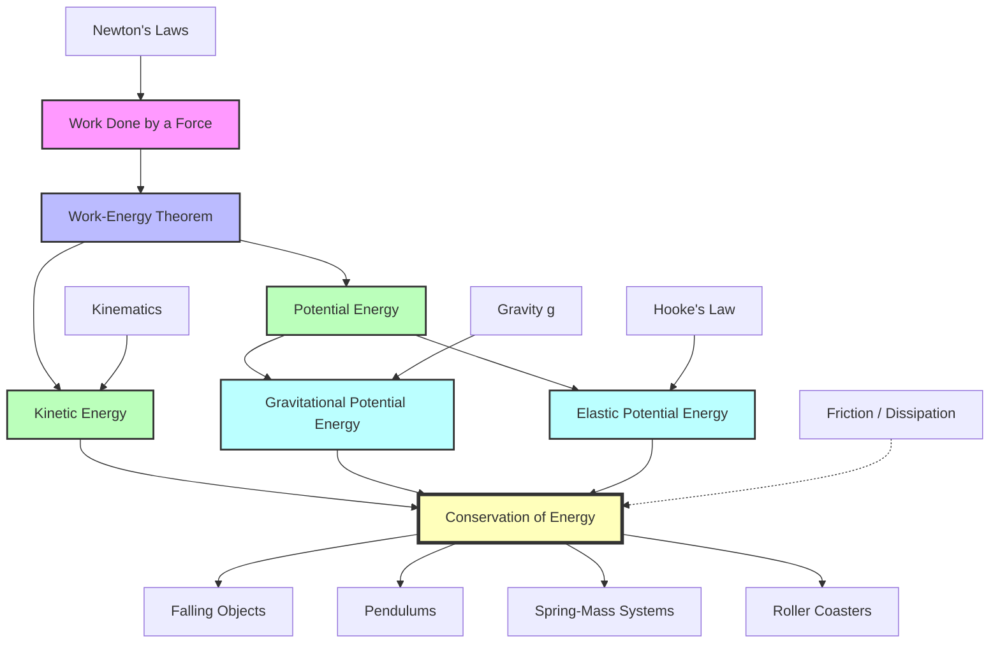

# 1. Overview / 概述

**English:** This topic explores the two fundamental forms of mechanical energy: [[Kinetic Energy (KE)]] (energy of motion) and [[Potential Energy]] (stored energy due to position or configuration). These concepts are central to the [[Work-Energy Theorem]], which states that the net [[Work Done by a Force]] on a system equals its change in kinetic energy. Understanding how energy transforms between kinetic and potential forms—such as a ball thrown upward or a pendulum swinging—is essential for analysing mechanical systems without needing to solve complex force equations. In both CAIE 9702 and Edexcel IAL, this topic forms the foundation for [[Conservation of Energy]] problems, which appear frequently in Papers 1 (MCQ), 2 (structured), and 4 (advanced). Real-world applications include roller coasters, hydroelectric dams, and vehicle braking systems.

**中文:** 本主题探讨机械能的两种基本形式：[[动能]]（运动能量）和[[势能]]（因位置或形态而储存的能量）。这些概念是[[功-能定理]]的核心，该定理指出作用在系统上的净[[力所做的功]]等于其动能的变化。理解能量如何在动能和势能形式之间转换——例如抛向空中的球或摆动的钟摆——对于分析机械系统至关重要，无需解复杂的力方程。在CAIE 9702和Edexcel IAL中，本主题是[[能量守恒]]问题的基础，这些问题频繁出现在试卷1（选择题）、试卷2（结构化题）和试卷4（高级题）中。实际应用包括过山车、水力发电大坝和车辆制动系统。

---

# 2. Syllabus Learning Objectives / 考纲学习目标

| CAIE 9702 (3.3 c-f) | Edexcel IAL (WPH11 U1: 4.5-4.8) |
|---------------------|----------------------------------|
| 3.3(c) Define and derive kinetic energy $E_k = \frac{1}{2}mv^2$ | 4.5 Recall and use $E_k = \frac{1}{2}mv^2$ for kinetic energy |
| 3.3(d) Define gravitational potential energy $E_p = mgh$ for uniform fields | 4.6 Recall and use $\Delta E_p = mg\Delta h$ for gravitational potential energy change |
| 3.3(e) State the principle of conservation of energy | 4.7 Apply the principle of conservation of energy to mechanical systems |
| 3.3(f) Apply conservation of energy to simple systems including falling bodies and pendulums | 4.8 Analyse energy transfers between kinetic and potential forms |

**Examiner Expectations / 考官期望:**
- **English:** Candidates must be able to derive $E_k = \frac{1}{2}mv^2$ from [[Work Done by a Force]] and Newton's second law. For [[Gravitational Potential Energy (GPE)]], they must understand that $mgh$ is valid only for uniform gravitational fields near Earth's surface. Energy conservation problems require clear identification of initial and final energy stores, with no energy losses assumed unless stated. Mark schemes penalise missing units, incorrect sign conventions, and failure to state assumptions (e.g., no air resistance).
- **中文:** 考生必须能够从[[力所做的功]]和牛顿第二定律推导出$E_k = \frac{1}{2}mv^2$。对于[[重力势能]]，必须理解$mgh$仅适用于地球表面附近的均匀重力场。能量守恒问题需要清晰识别初始和最终能量储存，除非另有说明，否则假设无能量损失。评分标准会因缺少单位、符号约定错误以及未说明假设（如无空气阻力）而扣分。

> 📋 **CIE Only:** CAIE explicitly requires derivation of $E_k = \frac{1}{2}mv^2$ from work done. Edexcel only requires recall and use.
> 
> 📋 **Edexcel Only:** Edexcel specifies $\Delta E_p = mg\Delta h$ (change in GPE) rather than absolute $E_p = mgh$, emphasising that only changes are physically meaningful.

---

# 3. Core Definitions / 核心定义

| Term (EN/CN) | Definition (EN) | Definition (CN) | Common Mistakes / 常见错误 |
|--------------|-----------------|-----------------|---------------------------|
| [[Kinetic Energy (KE)]] / 动能 | The energy an object possesses due to its motion, given by $E_k = \frac{1}{2}mv^2$ | 物体因运动而具有的能量，由$E_k = \frac{1}{2}mv^2$给出 | Confusing $v$ (speed) with velocity; forgetting to square $v$; using mass in grams instead of kg |
| [[Gravitational Potential Energy (GPE)]] / 重力势能 | The energy stored in an object due to its vertical position in a gravitational field, given by $\Delta E_p = mg\Delta h$ for uniform fields | 物体在重力场中因垂直位置而储存的能量，在均匀场中由$\Delta E_p = mg\Delta h$给出 | Using $h$ as height above ground (absolute) instead of change in height; forgetting $g$ varies with location |
| [[Elastic Potential Energy]] / 弹性势能 | The energy stored in a deformed elastic object (e.g., stretched spring), given by $E_e = \frac{1}{2}kx^2$ for Hooke's law materials | 变形的弹性物体（如拉伸的弹簧）中储存的能量，对于胡克定律材料由$E_e = \frac{1}{2}kx^2$给出 | Confusing $x$ (extension) with total length; using $F$ instead of $k$ in the formula |
| [[Work-Energy Theorem]] / 功-能定理 | The net work done on a system equals the change in its kinetic energy: $W_{net} = \Delta E_k$ | 作用在系统上的净功等于其动能的变化：$W_{net} = \Delta E_k$ | Applying to non-conservative forces without accounting for energy dissipation |
| [[Conservation of Energy]] / 能量守恒 | Energy cannot be created or destroyed, only transferred between forms; total energy in an isolated system remains constant | 能量既不能被创造也不能被消灭，只能在形式之间转换；孤立系统中的总能量保持不变 | Forgetting to include all energy stores (e.g., thermal energy from friction) |

---

# 4. Key Concepts Explained / 关键概念详解

## 4.1 Kinetic Energy Derivation / 动能推导

### Explanation / 解释
**English:** [[Kinetic Energy (KE)]] is derived from the [[Work-Energy Theorem]]. Consider an object of mass $m$ initially at rest. A constant net force $F$ acts over a displacement $s$, causing acceleration $a$. Using $F = ma$ and $v^2 = u^2 + 2as$ with $u = 0$, we get $v^2 = 2as$, so $s = v^2/(2a)$. The work done is $W = Fs = ma \cdot v^2/(2a) = \frac{1}{2}mv^2$. This work equals the kinetic energy gained. The derivation assumes constant force and no energy losses.

**中文:** [[动能]]是从[[功-能定理]]推导出来的。考虑一个质量为$m$、初始静止的物体。一个恒定的净力$F$作用在位移$s$上，产生加速度$a$。利用$F = ma$和$v^2 = u^2 + 2as$（其中$u = 0$），得到$v^2 = 2as$，所以$s = v^2/(2a)$。所做的功为$W = Fs = ma \cdot v^2/(2a) = \frac{1}{2}mv^2$。这个功等于获得的动能。推导假设恒力和无能量损失。

### Physical Meaning / 物理意义
**English:** Kinetic energy is a scalar quantity that depends only on mass and speed (not direction). Doubling speed quadruples kinetic energy because of the $v^2$ dependence. This explains why high-speed collisions are so destructive—a car at 60 mph has four times the kinetic energy of one at 30 mph.

**中文:** 动能是一个标量，仅取决于质量和速率（而非方向）。由于$v^2$的依赖关系，速度加倍会使动能变为四倍。这解释了为什么高速碰撞如此具有破坏性——60英里/小时的汽车动能是30英里/小时的四倍。

### Common Misconceptions / 常见误区
- Thinking kinetic energy depends on velocity direction (it doesn't—only speed matters)
- Believing kinetic energy is proportional to $v$ rather than $v^2$
- Confusing momentum ($p = mv$) with kinetic energy ($E_k = \frac{1}{2}mv^2$)

### Exam Tips / 考试提示
**English:** When calculating kinetic energy, always convert mass to kg and speed to m/s. For CAIE derivations, show all steps including $F=ma$ and $v^2 = u^2 + 2as$. Remember that $E_k$ is always positive.
**中文:** 计算动能时，始终将质量转换为千克，速度转换为米/秒。对于CAIE推导，展示所有步骤，包括$F=ma$和$v^2 = u^2 + 2as$。记住$E_k$始终为正。

> 📷 **IMAGE PROMPT — [KE-DERIV]: Kinetic Energy Derivation Diagram**
> A diagram showing a block of mass m on a frictionless surface, with a constant force F applied horizontally. Labels: mass m, force F, displacement s, initial velocity u=0, final velocity v. Arrows showing direction of motion. Below: step-by-step derivation with equations. Style: clean physics diagram with labelled vectors. Exam importance: HIGH for CAIE derivation questions.

---

## 4.2 Gravitational Potential Energy / 重力势能

### Explanation / 解释
**English:** [[Gravitational Potential Energy (GPE)]] in a uniform gravitational field (near Earth's surface) is given by $\Delta E_p = mg\Delta h$. The absolute value $E_p = mgh$ is defined relative to an arbitrary zero level (usually ground). When an object of mass $m$ is raised by height $\Delta h$, work is done against gravity: $W = mg\Delta h$, which is stored as GPE. The concept extends to non-uniform fields (e.g., $E_p = -GMm/r$ for planetary fields), but AS level only covers the uniform field case.

**中文:** 在均匀重力场（地球表面附近）中，[[重力势能]]由$\Delta E_p = mg\Delta h$给出。绝对值$E_p = mgh$是相对于任意零势能面（通常是地面）定义的。当质量为$m$的物体被提升高度$\Delta h$时，克服重力做功：$W = mg\Delta h$，这被储存为重力势能。该概念可扩展到非均匀场（例如，行星场的$E_p = -GMm/r$），但AS级别只涉及均匀场情况。

### Physical Meaning / 物理意义
**English:** GPE represents the capacity to do work due to position in a gravitational field. Water stored behind a dam has high GPE; when released, this converts to kinetic energy to drive turbines. The negative sign in the universal formula $E_p = -GMm/r$ indicates that gravitational potential energy is zero at infinity and becomes more negative as objects approach each other.

**中文:** 重力势能代表了由于在重力场中的位置而做功的能力。储存在大坝后面的水具有高重力势能；当释放时，这转化为动能来驱动涡轮机。通用公式$E_p = -GMm/r$中的负号表示重力势能在无穷远处为零，并且随着物体相互靠近而变得更负。

### Common Misconceptions / 常见误区
- Using $h$ as the height above ground rather than change in height $\Delta h$
- Forgetting that $g$ varies with altitude (though AS assumes $g = 9.81 \text{ m s}^{-2}$)
- Thinking GPE can be negative in the $mgh$ formula (it can be negative if zero is chosen above the object)

### Exam Tips / 考试提示
**English:** Always specify your zero level for GPE. For energy conservation problems, use $\Delta E_p = mg\Delta h$ rather than absolute values. Watch for sign conventions: GPE increases when height increases.
**中文:** 始终指定重力势能的零势能面。对于能量守恒问题，使用$\Delta E_p = mg\Delta h$而非绝对值。注意符号约定：高度增加时重力势能增加。

> 📷 **IMAGE PROMPT — [GPE-DIAG]: Gravitational Potential Energy Diagram**
> A diagram showing a mass m being lifted from height h₁ to h₂ above ground. Labels: mass m, ground level (h=0), initial height h₁, final height h₂, Δh = h₂ - h₁, gravitational force mg downward, lifting force F upward. Arrows showing displacement. Below: formula ΔE_p = mgΔh. Style: clear, labelled schematic. Exam importance: HIGH for energy conservation problems.

---

## 4.3 Elastic Potential Energy / 弹性势能

### Explanation / 解释
**English:** [[Elastic Potential Energy]] is the energy stored when an elastic material is deformed (stretched or compressed). For a spring obeying [[Hooke's Law]] ($F = kx$), the work done to extend the spring by $x$ is the area under the force-extension graph: $E_e = \frac{1}{2}kx^2$. This is derived from $W = \int F \, dx = \int_0^x kx \, dx = \frac{1}{2}kx^2$. The energy is stored in the bonds of the material and is released when the material returns to its original shape.

**中文:** [[弹性势能]]是弹性材料变形（拉伸或压缩）时储存的能量。对于服从[[胡克定律]]（$F = kx$）的弹簧，将弹簧拉伸$x$所做的功是力-伸长图下的面积：$E_e = \frac{1}{2}kx^2$。这是从$W = \int F \, dx = \int_0^x kx \, dx = \frac{1}{2}kx^2$推导出来的。能量储存在材料的键中，当材料恢复原状时释放。

### Physical Meaning / 物理意义
**English:** The $\frac{1}{2}$ factor arises because the force increases linearly from 0 to $kx$ as the spring extends. The average force is $\frac{1}{2}kx$, so work = average force × displacement = $\frac{1}{2}kx \cdot x = \frac{1}{2}kx^2$. This is analogous to kinetic energy where the $\frac{1}{2}$ comes from the linear increase of velocity from 0 to $v$.

**中文:** $\frac{1}{2}$因子是因为力随着弹簧伸长从0线性增加到$kx$。平均力为$\frac{1}{2}kx$，所以功 = 平均力 × 位移 = $\frac{1}{2}kx \cdot x = \frac{1}{2}kx^2$。这与动能类似，其中$\frac{1}{2}$来自速度从0到$v$的线性增加。

### Common Misconceptions / 常见误区
- Confusing $x$ (extension from natural length) with total length of spring
- Using $E_e = Fx$ instead of $E_e = \frac{1}{2}Fx$ (since force is not constant)
- Forgetting that the formula only applies within the elastic limit

### Exam Tips / 考试提示
**English:** For springs in series or parallel, find the effective spring constant first, then use $E_e = \frac{1}{2}k_{\text{eff}} x^2$. Remember that $x$ is the extension from the natural (unstretched) length.
**中文:** 对于串联或并联的弹簧，先求有效劲度系数，然后使用$E_e = \frac{1}{2}k_{\text{eff}} x^2$。记住$x$是从自然（未拉伸）长度的伸长量。

> 📷 **IMAGE PROMPT — [EPE-GRAPH]: Force-Extension Graph for Elastic Potential Energy**
> A force-extension (F-x) graph showing a straight line through origin with slope k. The area under the graph from 0 to x is shaded and labelled "Elastic Potential Energy = ½kx²". Labels: force F (N), extension x (m), gradient = spring constant k. Style: graph paper style with clear shading. Exam importance: HIGH for both CAIE and Edexcel.

---

## 4.4 Work-Energy Theorem / 功-能定理

### Explanation / 解释
**English:** The [[Work-Energy Theorem]] states that the net work done on a system equals the change in its kinetic energy: $W_{\text{net}} = \Delta E_k = \frac{1}{2}mv_f^2 - \frac{1}{2}mv_i^2$. This is a direct consequence of Newton's second law and the definition of work. When multiple forces act, the net work is the sum of work done by each force (taking signs into account). If non-conservative forces (like friction) do work, some energy is dissipated as thermal energy, so the theorem accounts for this through the net work term.

**中文:** [[功-能定理]]指出，作用在系统上的净功等于其动能的变化：$W_{\text{net}} = \Delta E_k = \frac{1}{2}mv_f^2 - \frac{1}{2}mv_i^2$。这是牛顿第二定律和功的定义的直接结果。当多个力作用时，净功是每个力所做功的总和（考虑符号）。如果非保守力（如摩擦力）做功，部分能量会以热能形式耗散，因此定理通过净功项来考虑这一点。

### Physical Meaning / 物理意义
**English:** The theorem provides a powerful alternative to Newton's laws for solving problems involving forces and motion. Instead of calculating acceleration and using kinematics, you can directly relate work done to speed changes. This is especially useful when forces vary with position (e.g., springs) or when the path is complex.

**中文:** 该定理为涉及力和运动的问题提供了牛顿定律的强大替代方案。无需计算加速度和使用运动学，可以直接将所做的功与速度变化联系起来。这在力随位置变化（如弹簧）或路径复杂时特别有用。

### Common Misconceptions / 常见误区
- Confusing "net work" with "work done by a single force"
- Applying the theorem when energy is dissipated without accounting for it
- Forgetting that work can be negative (force opposing motion)

### Exam Tips / 考试提示
**English:** For CAIE, be prepared to derive the work-energy theorem from $F=ma$ and kinematic equations. For Edexcel, focus on applying it to problems with multiple forces. Always draw a free-body diagram to identify all forces doing work.
**中文:** 对于CAIE，准备从$F=ma$和运动学方程推导功-能定理。对于Edexcel，专注于将其应用于多力问题。始终画受力分析图来识别所有做功的力。

---

# 5. Essential Equations / 核心公式

## 5.1 Kinetic Energy / 动能

$$E_k = \frac{1}{2}mv^2$$

| Symbol (符号) | Meaning (EN/CN) | Unit (单位) |
|---------------|-----------------|-------------|
| $E_k$ | Kinetic energy / 动能 | J (joule) |
| $m$ | Mass / 质量 | kg |
| $v$ | Speed / 速率 | m s⁻¹ |

**Derivation / 推导:**
$$W = Fs = ma \cdot s$$
$$v^2 = u^2 + 2as \Rightarrow s = \frac{v^2 - u^2}{2a}$$
$$W = ma \cdot \frac{v^2 - u^2}{2a} = \frac{1}{2}m(v^2 - u^2) = \Delta E_k$$

**Conditions / 适用条件:**
- Valid for all speeds much less than the speed of light (non-relativistic)
- $v$ is speed (magnitude of velocity), not velocity vector
- Energy is always positive

**Rearrangements / 变形:**
$$v = \sqrt{\frac{2E_k}{m}} \quad \text{and} \quad m = \frac{2E_k}{v^2}$$

---

## 5.2 Gravitational Potential Energy / 重力势能

$$\Delta E_p = mg\Delta h \quad \text{or} \quad E_p = mgh$$

| Symbol (符号) | Meaning (EN/CN) | Unit (单位) |
|---------------|-----------------|-------------|
| $\Delta E_p$ | Change in gravitational potential energy / 重力势能变化 | J |
| $m$ | Mass / 质量 | kg |
| $g$ | Acceleration due to gravity / 重力加速度 | m s⁻² |
| $\Delta h$ | Change in height / 高度变化 | m |

**Conditions / 适用条件:**
- Only valid for uniform gravitational fields (near Earth's surface, $g$ constant)
- $\Delta h$ must be small compared to Earth's radius
- $g = 9.81 \text{ m s}^{-2}$ (use 9.8 or 10 as specified in exam)

**Rearrangements / 变形:**
$$\Delta h = \frac{\Delta E_p}{mg} \quad \text{and} \quad m = \frac{\Delta E_p}{g\Delta h}$$

> 📋 **Edexcel Only:** Edexcel emphasises $\Delta E_p = mg\Delta h$ (change) rather than absolute $E_p = mgh$. This is because only changes in potential energy are physically meaningful.

---

## 5.3 Elastic Potential Energy / 弹性势能

$$E_e = \frac{1}{2}kx^2$$

| Symbol (符号) | Meaning (EN/CN) | Unit (单位) |
|---------------|-----------------|-------------|
| $E_e$ | Elastic potential energy / 弹性势能 | J |
| $k$ | Spring constant (stiffness) / 劲度系数 | N m⁻¹ |
| $x$ | Extension from natural length / 从自然长度的伸长量 | m |

**Derivation / 推导:**
$$W = \int_0^x F \, dx = \int_0^x kx \, dx = \frac{1}{2}kx^2$$

**Conditions / 适用条件:**
- Only valid within the elastic limit (Hooke's law obeyed)
- $x$ is extension (or compression) from natural length, not total length
- For compression, $x$ is negative but $x^2$ makes energy positive

**Rearrangements / 变形:**
$$x = \sqrt{\frac{2E_e}{k}} \quad \text{and} \quad k = \frac{2E_e}{x^2}$$

---

## 5.4 Work-Energy Theorem / 功-能定理

$$W_{\text{net}} = \Delta E_k = \frac{1}{2}mv_f^2 - \frac{1}{2}mv_i^2$$

| Symbol (符号) | Meaning (EN/CN) | Unit (单位) |
|---------------|-----------------|-------------|
| $W_{\text{net}}$ | Net work done on the system / 系统所受净功 | J |
| $\Delta E_k$ | Change in kinetic energy / 动能变化 | J |
| $v_f$ | Final speed / 末速率 | m s⁻¹ |
| $v_i$ | Initial speed / 初速率 | m s⁻¹ |

**Conditions / 适用条件:**
- $W_{\text{net}}$ includes work done by ALL forces (conservative and non-conservative)
- If non-conservative forces do work, energy is dissipated (e.g., thermal)
- For conservative systems, $W_{\text{net}} = -\Delta E_p$ (work done by conservative forces equals negative change in potential energy)

---

## 5.5 Conservation of Mechanical Energy / 机械能守恒

$$E_{\text{total}} = E_k + E_p = \text{constant} \quad \text{(no non-conservative forces)}$$

$$\frac{1}{2}mv_i^2 + mgh_i + \frac{1}{2}kx_i^2 = \frac{1}{2}mv_f^2 + mgh_f + \frac{1}{2}kx_f^2$$

**Conditions / 适用条件:**
- Only valid when no non-conservative forces (friction, air resistance) do work
- All energy transfers are between kinetic, gravitational potential, and elastic potential forms
- If non-conservative forces are present: $W_{\text{non-conservative}} = \Delta E_k + \Delta E_p$

---

# 6. Graphs and Relationships / 图表与关系

## 6.1 Kinetic Energy vs Speed / 动能与速率关系

**Axes / 坐标轴:**
- x-axis: Speed $v$ (m s⁻¹)
- y-axis: Kinetic energy $E_k$ (J)

**Shape / 形状:**
- Parabolic curve through origin: $E_k \propto v^2$
- For constant mass, doubling speed quadruples kinetic energy

**Gradient Meaning / 斜率意义:**
- Gradient at any point = $\frac{dE_k}{dv} = mv$ (not directly examinable at AS)
- The gradient increases with $v$, showing that $E_k$ increases faster at higher speeds

**Area Meaning / 面积意义:**
- No meaningful area under this graph

**Exam Interpretation / 考试解读:**
- Use to find $E_k$ given $v$, or $v$ given $E_k$
- Compare kinetic energies at different speeds
- Identify that a car at 60 mph has 4× the KE of one at 30 mph

**Common Questions / 常见问题:**
- "Sketch a graph of kinetic energy against speed for a constant mass"
- "Use the graph to determine the speed when kinetic energy is doubled"

> 📷 **IMAGE PROMPT — [KE-V-GRAPH]: Kinetic Energy vs Speed Graph**
> A parabolic graph of E_k (y-axis) against v (x-axis) passing through origin. Three points marked: (v, E_k), (2v, 4E_k), (3v, 9E_k). Labels: axes with units, curve labelled "E_k = ½mv²". Style: clean graph with gridlines. Exam importance: MEDIUM.

---

## 6.2 Gravitational Potential Energy vs Height / 重力势能与高度关系

**Axes / 坐标轴:**
- x-axis: Height $h$ (m)
- y-axis: Gravitational potential energy $E_p$ (J)

**Shape / 形状:**
- Straight line through origin (if zero at h=0): $E_p \propto h$
- Gradient = $mg$ (constant for uniform field)

**Gradient Meaning / 斜率意义:**
- Gradient = $\frac{\Delta E_p}{\Delta h} = mg$ = weight of object
- Steeper gradient means heavier object or stronger gravity

**Area Meaning / 面积意义:**
- No meaningful area under this graph

**Exam Interpretation / 考试解读:**
- Use gradient to find mass or $g$
- Compare GPE changes for different masses
- Identify that GPE increases linearly with height

**Common Questions / 常见问题:**
- "Determine the mass of the object from the gradient"
- "Sketch the graph for an object on the Moon (g smaller)"

> 📷 **IMAGE PROMPT — [GPE-H-GRAPH]: Gravitational Potential Energy vs Height Graph**
> A straight line graph of E_p (y-axis) against h (x-axis) passing through origin. Gradient labelled as "mg". Two lines shown: one steeper (larger mass) and one shallower (smaller mass). Labels: axes with units. Style: clear graph with two lines for comparison. Exam importance: MEDIUM.

---

## 6.3 Force vs Extension for Elastic Potential Energy / 力与伸长关系（弹性势能）

**Axes / 坐标轴:**
- x-axis: Extension $x$ (m)
- y-axis: Force $F$ (N)

**Shape / 形状:**
- Straight line through origin: $F = kx$ (Hooke's law)
- Gradient = spring constant $k$

**Gradient Meaning / 斜率意义:**
- Gradient = $k$ = spring constant (stiffness)
- Steeper gradient means stiffer spring

**Area Meaning / 面积意义:**
- Area under graph = work done = elastic potential energy = $\frac{1}{2}kx^2$
- For non-linear springs, area = $\int F \, dx$

**Exam Interpretation / 考试解读:**
- Calculate $E_e$ from area under graph
- Find $k$ from gradient
- Identify elastic limit (where graph deviates from straight line)

**Common Questions / 常见问题:**
- "Calculate the elastic potential energy stored when the spring is extended by 0.20 m"
- "Determine the spring constant from the graph"

> 📷 **IMAGE PROMPT — [F-X-GRAPH]: Force-Extension Graph for Spring**
> A force-extension graph showing: (1) straight line through origin (Hooke's law region), (2) shaded area under line labelled "Elastic Potential Energy = ½Fx = ½kx²", (3) point where graph starts to curve labelled "Elastic Limit". Labels: axes with units, gradient = k. Style: graph paper style. Exam importance: HIGH.

---

## 6.4 Energy Transformation Graphs / 能量转换图

**Axes / 坐标轴:**
- x-axis: Time $t$ (s) or Position $x$ (m)
- y-axis: Energy $E$ (J)

**Shape / 形状:**
- For a falling object (no air resistance):
  - $E_k$ increases (parabolic with time, linear with height)
  - $E_p$ decreases (linear with height)
  - Total energy $E_{\text{total}}$ = constant (horizontal line)

**Gradient Meaning / 斜率意义:**
- Gradient of $E_k$ vs $t$ = power (rate of work done)
- Gradient of $E_p$ vs $t$ = -power (rate of GPE loss)

**Area Meaning / 面积意义:**
- No meaningful area under these graphs

**Exam Interpretation / 考试解读:**
- Show energy conservation: $E_k + E_p = \text{constant}$
- Identify energy transfers at different points
- For pendulum: $E_k$ max at bottom, $E_p$ max at top

**Common Questions / 常见问题:**
- "Sketch energy-time graphs for a bouncing ball (including energy losses)"
- "At what point is kinetic energy maximum?"

> 📷 **IMAGE PROMPT — [ENERGY-TIME]: Energy-Time Graph for Falling Object**
> Three curves on same axes: E_k (increasing parabola), E_p (decreasing straight line), E_total (horizontal line). Labels: axes with units, each curve labelled. Time axis from t=0 to t when object hits ground. Style: clear with different colours or line styles. Exam importance: HIGH.

---

# 7. Required Diagrams / 必备图表

## 7.1 Energy Changes in a Falling Object / 下落物体的能量变化

> 📷 **IMAGE PROMPT — [FALLING-ENERGY]: Energy Changes in a Freely Falling Object**
> A diagram showing a ball of mass m at three positions during free fall from height h:
> - Position 1 (top): h above ground, v=0. Labels: E_k = 0, E_p = mgh, E_total = mgh
> - Position 2 (midway): h/2 above ground, v = √(gh). Labels: E_k = ½mv² = ½mgh, E_p = mg(h/2) = ½mgh, E_total = mgh
> - Position 3 (bottom): h=0, v = √(2gh). Labels: E_k = ½mv² = mgh, E_p = 0, E_total = mgh
> Arrows showing direction of motion. Style: clear schematic with energy bar charts beside each position. Exam importance: VERY HIGH (common in both boards).

---

## 7.2 Pendulum Energy Transformation / 摆锤能量转换

> 📷 **IMAGE PROMPT — [PENDULUM-ENERGY]: Energy Changes in a Simple Pendulum**
> A diagram of a simple pendulum showing:
> - Position A (maximum displacement): maximum height, v=0. Labels: E_k = 0, E_p = maximum
> - Position B (lowest point): minimum height, v maximum. Labels: E_k = maximum, E_p = minimum
> - Position C (other side): symmetric to A. Labels: E_k = 0, E_p = maximum
> Arrows showing direction of motion. Energy bar charts at each position. Labels: string length L, amplitude, height change Δh. Style: clean physics diagram with energy bars. Exam importance: HIGH (common in structured questions).

---

## 7.3 Spring-Mass System Energy / 弹簧-质量系统能量

> 📷 **IMAGE PROMPT — [SPRING-ENERGY]: Energy Changes in a Vertical Spring-Mass System**
> A diagram showing a mass on a vertical spring at three positions:
> - Position 1 (top): spring at natural length, mass at highest point. Labels: E_e = 0, E_k = 0, E_p = mgΔh_max
> - Position 2 (equilibrium): spring extended by x₀ = mg/k, mass at midpoint. Labels: E_e = ½kx₀², E_k = maximum, E_p = mgΔh_mid
> - Position 3 (bottom): spring at maximum extension, mass at lowest point. Labels: E_e = ½k(x₀+A)², E_k = 0, E_p = 0
> Arrows showing oscillation direction. Energy bar charts. Style: clear schematic with energy distribution. Exam importance: MEDIUM-HIGH.

---

# 8. Worked Examples / 典型例题

## Example 1: Falling Object Energy Conservation / 下落物体能量守恒

### Question / 题目
**English:** A ball of mass 0.50 kg is dropped from rest at a height of 20 m above the ground. Assuming no air resistance, calculate:
(a) The gravitational potential energy lost by the ball as it falls to the ground.
(b) The speed of the ball just before it hits the ground.
(c) The height at which the ball's kinetic energy equals its gravitational potential energy.
Take $g = 9.81 \text{ m s}^{-2}$.

**中文:** 一个质量为0.50 kg的球从离地面20 m的高度由静止释放。假设无空气阻力，计算：
(a) 球落到地面过程中损失的重力势能。
(b) 球即将撞击地面时的速率。
(c) 球的动能等于其重力势能时的高度。
取$g = 9.81 \text{ m s}^{-2}$。

### Image Prompt / 图片提示
> 📷 **IMAGE PROMPT — [EX1-FALLING]: Falling Ball Energy Problem**
> A diagram showing a ball at height 20 m above ground, with labels: m = 0.50 kg, h = 20 m, g = 9.81 m s⁻². Arrow pointing downward. Ground level marked. Style: simple schematic. Exam importance: HIGH.

### Solution / 解答

**(a) GPE lost / 重力势能损失:**

$$\Delta E_p = mg\Delta h = 0.50 \times 9.81 \times 20 = 98.1 \text{ J}$$

The gravitational potential energy lost is 98.1 J.
损失的重力势能为98.1 J。

**(b) Speed just before hitting ground / 撞击地面前的速率:**

By conservation of energy (no air resistance):
根据能量守恒（无空气阻力）：

$$\Delta E_k = \Delta E_p$$
$$\frac{1}{2}mv^2 - 0 = 98.1$$
$$\frac{1}{2} \times 0.50 \times v^2 = 98.1$$
$$0.25v^2 = 98.1$$
$$v^2 = 392.4$$
$$v = \sqrt{392.4} = 19.8 \text{ m s}^{-1}$$

The speed just before impact is 19.8 m s⁻¹.
撞击前的速率为19.8 m s⁻¹。

**(c) Height where $E_k = E_p$ / 动能等于势能时的高度:**

Let $h$ be the height above ground where $E_k = E_p$.
设$h$为动能等于势能时离地面的高度。

At this height, the ball has fallen through $(20 - h)$ metres.
在此高度，球已下落了$(20 - h)$米。

GPE lost = $mg(20 - h)$ = KE gained = $\frac{1}{2}mv^2$
损失的重力势能 = $mg(20 - h)$ = 获得的动能 = $\frac{1}{2}mv^2$

But at this point, $E_k = E_p = mgh$ (since total energy = $mg \times 20$)
但在此点，$E_k = E_p = mgh$（因为总能量 = $mg \times 20$）

Therefore: $mgh = mg(20 - h)$
因此：$mgh = mg(20 - h)$

$$h = 20 - h$$
$$2h = 20$$
$$h = 10 \text{ m}$$

The kinetic energy equals gravitational potential energy at a height of 10 m above ground.
动能等于重力势能时的高度为离地面10 m。

### Final Answer / 最终答案
(a) 98.1 J
(b) 19.8 m s⁻¹
(c) 10 m

### Examiner Notes / 考官点评
**English:** 
- Part (a): Many candidates forget to state the unit (J). Show working clearly.
- Part (b): Common error is using $v^2 = u^2 + 2as$ directly without energy approach. Both methods work, but energy method is simpler.
- Part (c): This is a classic "half-height" problem. The answer is always half the total height when starting from rest, because $E_k = E_p$ means each is half the total energy. Candidates should recognise this pattern.
- Mark scheme expects: correct substitution, correct calculation, correct unit.

**中文:**
- 第(a)部分：许多考生忘记写单位(J)。清晰展示计算过程。
- 第(b)部分：常见错误是直接使用$v^2 = u^2 + 2as$而不使用能量方法。两种方法都可行，但能量方法更简单。
- 第(c)部分：这是一个经典的"半高"问题。从静止开始时答案总是总高度的一半，因为$E_k = E_p$意味着每个都是总能量的一半。考生应识别这种模式。
- 评分标准期望：正确代入、正确计算、正确单位。

---

## Example 2: Spring and Kinetic Energy / 弹簧与动能

### Question / 题目
**English:** A spring of spring constant $k = 200 \text{ N m}^{-1}$ is compressed by 0.10 m from its natural length. A ball of mass 0.050 kg is placed against the compressed spring on a frictionless horizontal surface. The spring is released.
(a) Calculate the elastic potential energy stored in the compressed spring.
(b) Calculate the maximum speed of the ball after release.
(c) If the surface had friction with coefficient $\mu = 0.20$, how far would the ball travel before stopping? (The ball slides, not rolls.)

**中文:** 一根劲度系数$k = 200 \text{ N m}^{-1}$的弹簧从其自然长度被压缩了0.10 m。一个质量为0.050 kg的球被放置在压缩的弹簧前，位于无摩擦的水平面上。弹簧被释放。
(a) 计算压缩弹簧中储存的弹性势能。
(b) 计算释放后球的最大速率。
(c) 如果表面有摩擦，摩擦系数$\mu = 0.20$，球在停止前会滑行多远？（球滑动，不滚动。）

### Image Prompt / 图片提示
> 📷 **IMAGE PROMPT — [EX2-SPRING]: Spring-Launched Ball Problem**
> A diagram showing: (1) compressed spring with ball against it, label: x = 0.10 m, k = 200 N m⁻¹; (2) spring released, ball moving to the right with speed v; (3) for part (c), ball on rough surface with friction force f = μmg opposing motion. Style: clear schematic with force arrows. Exam importance: HIGH.

### Solution / 解答

**(a) Elastic potential energy / 弹性势能:**

$$E_e = \frac{1}{2}kx^2 = \frac{1}{2} \times 200 \times (0.10)^2$$
$$E_e = \frac{1}{2} \times 200 \times 0.01 = 1.00 \text{ J}$$

The elastic potential energy stored is 1.00 J.
储存的弹性势能为1.00 J。

**(b) Maximum speed / 最大速率:**

By conservation of energy (frictionless surface):
根据能量守恒（无摩擦表面）：

$$\frac{1}{2}mv^2 = E_e$$
$$\frac{1}{2} \times 0.050 \times v^2 = 1.00$$
$$0.025v^2 = 1.00$$
$$v^2 = 40$$
$$v = \sqrt{40} = 6.32 \text{ m s}^{-1}$$

The maximum speed is 6.32 m s⁻¹.
最大速率为6.32 m s⁻¹。

**(c) Distance travelled with friction / 有摩擦时的滑行距离:**

Work done by friction = force × distance = $\mu mg \times d$
摩擦力做的功 = 力 × 距离 = $\mu mg \times d$

This work equals the initial kinetic energy (which came from elastic potential energy):
这个功等于初始动能（来自弹性势能）：

$$\mu mg d = \frac{1}{2}mv^2 = E_e$$
$$0.20 \times 0.050 \times 9.81 \times d = 1.00$$
$$0.0981d = 1.00$$
$$d = \frac{1.00}{0.0981} = 10.2 \text{ m}$$

The ball travels 10.2 m before stopping.
球在停止前滑行10.2 m。

### Final Answer / 最终答案
(a) 1.00 J
(b) 6.32 m s⁻¹
(c) 10.2 m

### Examiner Notes / 考官点评
**English:**
- Part (a): Direct substitution. Watch for squaring $x$ correctly: $(0.10)^2 = 0.01$, not 0.10.
- Part (b): The mass cancels in the energy equation if you keep it symbolic: $v = \sqrt{kx^2/m}$. This is a useful rearrangement.
- Part (c): Common mistake is using $F = \mu mg$ but forgetting to multiply by distance. Also, some candidates use $v^2 = u^2 + 2as$ with $a = -\mu g$, which also works but is more complex.
- Mark scheme: For part (c), the work-energy approach is preferred. Show $W = Fd$ clearly.

**中文:**
- 第(a)部分：直接代入。注意正确平方$x$：$(0.10)^2 = 0.01$，不是0.10。
- 第(b)部分：如果保持符号形式，质量在能量方程中会消去：$v = \sqrt{kx^2/m}$。这是一个有用的变形。
- 第(c)部分：常见错误是使用$F = \mu mg$但忘记乘以距离。另外，有些考生使用$v^2 = u^2 + 2as$且$a = -\mu g$，这也可行但更复杂。
- 评分标准：第(c)部分优先使用功-能方法。清晰展示$W = Fd$。

---

# 9. Past Paper Question Types / 历年真题题型

| Question Type / 题型 | Frequency / 频率 | Difficulty / 难度 | Past Paper References / 真题索引 |
|----------------------|------------------|-------------------|----------------------------------|
| Kinetic energy calculation (direct substitution) | Very High | Easy | 📝 *待填入* |
| GPE change calculation (direct substitution) | Very High | Easy | 📝 *待填入* |
| Energy conservation: falling object | Very High | Medium | 📝 *待填入* |
| Energy conservation: pendulum | High | Medium | 📝 *待填入* |
| Spring energy + kinetic energy | High | Medium | 📝 *待填入* |
| Work-energy theorem application | Medium | Medium-Hard | 📝 *待填入* |
| Energy with friction (dissipation) | Medium | Hard | 📝 *待填入* |
| Derivation of $E_k = \frac{1}{2}mv^2$ (CAIE only) | Medium | Medium | 📝 *待填入* |
| Graph interpretation (F-x, E_k-v, E_p-h) | Medium | Medium | 📝 *待填入* |
| Multi-stage energy transfers | Low | Hard | 📝 *待填入* |

> 📝 **题库整理中 / Question Bank Under Construction:**
> **English:** Specific past paper references are being compiled. For CAIE 9702, focus on Paper 1 (MCQ) questions on energy conservation and Paper 2 (structured) questions requiring energy calculations. For Edexcel IAL, focus on Unit 1 questions involving energy transfers in mechanical systems. Common question numbers include those involving "ball dropped from height", "pendulum swing", and "spring-launched projectile".
> 
> **中文:** 具体真题索引正在整理中。对于CAIE 9702，重点关注试卷1（选择题）中关于能量守恒的问题和试卷2（结构化题）中需要能量计算的问题。对于Edexcel IAL，重点关注单元1中涉及机械系统能量转换的问题。常见题号包括涉及"从高度下落的球"、"摆锤摆动"和"弹簧发射抛体"的问题。

**Common Command Words / 常见指令词:**
- **Calculate / 计算:** Substitute values into formula, show working
- **Derive / 推导:** Show step-by-step mathematical derivation from first principles
- **State / 陈述:** Give a definition or formula without explanation
- **Explain / 解释:** Give reasons with physics principles
- **Sketch / 画草图:** Draw a graph showing correct shape and labelled axes
- **Determine / 确定:** Calculate with reasoning
- **Show that / 证明:** Demonstrate that a given result follows from given information

---

# 10. Practical Skills Connections / 实验技能链接

**English:** This topic connects to practical work in several ways:

1. **Measuring Kinetic Energy (CAIE Paper 3 / Edexcel Unit 3):** Use light gates to measure speed of a trolley on a runway. Calculate kinetic energy from $E_k = \frac{1}{2}mv^2$. Investigate how kinetic energy changes with force applied or distance travelled.

2. **Measuring Gravitational Potential Energy (CAIE Paper 3 / Edexcel Unit 3):** Use a metre ruler to measure height changes. For a falling mass, measure the speed at different heights using light gates to verify $v^2 = 2gh$ and energy conservation.

3. **Spring Energy Experiment (CAIE Paper 3 / Edexcel Unit 3):** Stretch a spring by known amounts, measure the force using a newton meter, plot F-x graph, calculate area for elastic potential energy. Verify $E_e = \frac{1}{2}kx^2$.

4. **Uncertainties / 不确定度:**
   - Mass measurement: ±0.001 kg (digital balance)
   - Height measurement: ±0.001 m (metre ruler)
   - Speed measurement: ±0.01 m s⁻¹ (light gate)
   - Force measurement: ±0.01 N (newton meter)
   - Propagate uncertainties through energy calculations

5. **Graph Plotting / 绘图:**
   - Plot $E_k$ against $v^2$ to get straight line (gradient = $\frac{1}{2}m$)
   - Plot $E_p$ against $h$ to get straight line (gradient = $mg$)
   - Plot $F$ against $x$ for spring (gradient = $k$, area = $E_e$)

6. **Experimental Design / 实验设计:**
   - Control variables: mass, surface friction, air resistance
   - Independent variable: height, extension, force
   - Dependent variable: speed, kinetic energy
   - Use multiple trials and calculate mean to reduce random error

**中文:** 本主题通过多种方式与实验工作相关联：

1. **测量动能（CAIE 试卷3 / Edexcel 单元3）：** 使用光电门测量轨道上小车的速率。通过$E_k = \frac{1}{2}mv^2$计算动能。研究动能如何随施加的力或行进距离变化。

2. **测量重力势能（CAIE 试卷3 / Edexcel 单元3）：** 使用米尺测量高度变化。对于下落的质量，使用光电门测量不同高度的速率，以验证$v^2 = 2gh$和能量守恒。

3. **弹簧能量实验（CAIE 试卷3 / Edexcel 单元3）：** 将弹簧拉伸已知量，使用牛顿计测量力，绘制F-x图，计算面积得到弹性势能。验证$E_e = \frac{1}{2}kx^2$。

4. **不确定度：**
   - 质量测量：±0.001 kg（电子天平）
   - 高度测量：±0.001 m（米尺）
   - 速率测量：±0.01 m s⁻¹（光电门）
   - 力测量：±0.01 N（牛顿计）
   - 通过能量计算传播不确定度

5. **绘图：**
   - 绘制$E_k$对$v^2$的图得到直线（斜率 = $\frac{1}{2}m$）
   - 绘制$E_p$对$h$的图得到直线（斜率 = $mg$）
   - 绘制$F$对$x$的图（斜率 = $k$，面积 = $E_e$）

6. **实验设计：**
   - 控制变量：质量、表面摩擦、空气阻力
   - 自变量：高度、伸长量、力
   - 因变量：速率、动能
   - 进行多次试验并计算平均值以减少随机误差

> 📋 **CIE Only:** CAIE Paper 3 often includes experiments on energy conservation using a trolley on a sloping runway. Candidates must be able to describe how to measure speed using light gates and calculate energy changes.
> 
> 📋 **Edexcel Only:** Edexcel Unit 3 Core Practical 4 involves investigating energy changes in a spring-mass system. Candidates must plot force-extension graphs and calculate elastic potential energy from the area.

---

# 11. Concept Map / 概念图谱



**Prerequisites / 前置知识:**
- [[Work Done by a Force]]: Understanding work as $W = Fs\cos\theta$ is essential for deriving kinetic energy and understanding energy transfers.
- [[Newton's Laws of Motion]]: $F=ma$ is used in the derivation of $E_k = \frac{1}{2}mv^2$.
- [[Kinematics]]: Equations of motion ($v^2 = u^2 + 2as$) are used in the derivation.

**Related Topics / 相关主题:**
- [[Conservation of Energy]]: The principle that total energy in an isolated system remains constant.
- [[Power and Efficiency]]: Rate of energy transfer and useful energy output.
- [[Momentum and Impulse]]: Related to kinetic energy but distinct (momentum is vector, KE is scalar).

**Sub-topics / 子主题:**
- [[Kinetic Energy (KE)]]: Energy of motion, $E_k = \frac{1}{2}mv^2$
- [[Gravitational Potential Energy (GPE)]]: Energy due to height, $\Delta E_p = mg\Delta h$
- [[Elastic Potential Energy]]: Energy stored in deformed springs, $E_e = \frac{1}{2}kx^2$
- [[Work-Energy Theorem]]: $W_{\text{net}} = \Delta E_k$

---

# 12. Examiner Insights / 考官洞察

**English:**

**Most Tested Ideas (CAIE 9702):**
1. **Energy conservation in falling objects** — appears in nearly every Paper 2. Candidates must identify initial and final energy stores clearly.
2. **Derivation of $E_k = \frac{1}{2}mv^2$** — a common 3-4 mark question in Paper 2. Show $F=ma$, $v^2 = u^2 + 2as$, $W = Fs$, and combine.
3. **Force-extension graphs** — calculating elastic potential energy from area under graph. Common in Paper 1 (MCQ) and Paper 2.
4. **Pendulum energy changes** — identifying maximum KE at lowest point, maximum GPE at highest point.

**Most Tested Ideas (Edexcel IAL):**
1. **Energy conservation with friction** — calculating work done against friction and energy dissipated.
2. **Spring energy problems** — combining $E_e = \frac{1}{2}kx^2$ with kinetic energy.
3. **Multi-stage energy transfers** — e.g., GPE → KE → elastic potential energy.
4. **Graph interpretation** — F-x graphs for springs, E_k-v graphs.

**Mark Scheme Wording / 评分标准措辞:**
- "Correct substitution into formula" (1 mark)
- "Correct calculation with unit" (1 mark)
- "Clear statement of energy conservation" (1 mark)
- "Identification of initial and final energy stores" (1 mark)

**Common Lost Marks / 常见失分点:**
1. **Missing units** — always write J for energy, m s⁻¹ for speed.
2. **Sign errors** — GPE increases with height, so $\Delta E_p = mg\Delta h$ is positive when height increases.
3. **Using $v$ instead of $v^2$** — kinetic energy depends on $v^2$, not $v$.
4. **Forgetting to convert units** — mass in g must be converted to kg.
5. **Not stating assumptions** — "no air resistance", "frictionless surface", "elastic limit not exceeded".

**High-Scoring Structures / 高分结构:**
- **Step 1:** State the principle (e.g., "By conservation of energy...")
- **Step 2:** Write the energy equation with all terms
- **Step 3:** Substitute known values with units
- **Step 4:** Calculate and state final answer with unit
- **Step 5:** Check reasonableness (e.g., speed should be less than 100 m s⁻¹ for typical problems)

**中文:**

**最常考的概念（CAIE 9702）：**
1. **下落物体的能量守恒** — 几乎出现在每份试卷2中。考生必须清晰识别初始和最终能量储存。
2. **$E_k = \frac{1}{2}mv^2$的推导** — 试卷2中常见的3-4分题。展示$F=ma$、$v^2 = u^2 + 2as$、$W = Fs$并组合。
3. **力-伸长图** — 从图下面积计算弹性势能。常见于试卷1（选择题）和试卷2。
4. **摆锤能量变化** — 识别最低点动能最大，最高点重力势能最大。

**最常考的概念（Edexcel IAL）：**
1. **有摩擦的能量守恒** — 计算克服摩擦所做的功和耗散的能量。
2. **弹簧能量问题** — 将$E_e = \frac{1}{2}kx^2$与动能结合。
3. **多阶段能量转换** — 例如，重力势能 → 动能 → 弹性势能。
4. **图表解读** — 弹簧的F-x图、E_k-v图。

**评分标准措辞：**
- "正确代入公式"（1分）
- "正确计算并带单位"（1分）
- "清晰陈述能量守恒"（1分）
- "识别初始和最终能量储存"（1分）

**常见失分点：**
1. **缺少单位** — 能量始终写J，速率写m s⁻¹。
2. **符号错误** — 重力势能随高度增加而增加，所以高度增加时$\Delta E_p = mg\Delta h$为正。
3. **使用$v$而非$v^2$** — 动能取决于$v^2$，而非$v$。
4. **忘记转换单位** — 质量以克为单位时必须转换为千克。
5. **未说明假设** — "无空气阻力"、"无摩擦表面"、"未超过弹性极限"。

**高分结构：**
- **步骤1：** 陈述原理（例如，"根据能量守恒..."）
- **步骤2：** 写出包含所有项的能量方程
- **步骤3：** 代入已知值并带单位
- **步骤4：** 计算并写出最终答案及单位
- **步骤5：** 检查合理性（例如，典型问题的速率应小于100 m s⁻¹）

---

# 13. Quick Revision Sheet / 速查表

| Category / 类别 | Key Points / 要点 |
|-----------------|-------------------|
| **Kinetic Energy / 动能** | $E_k = \frac{1}{2}mv^2$; scalar, always positive; depends on $v^2$ (doubling $v$ quadruples $E_k$); derived from $W = Fs$ |
| **Gravitational Potential Energy / 重力势能** | $\Delta E_p = mg\Delta h$; valid only for uniform $g$; zero level is arbitrary; only changes are physically meaningful |
| **Elastic Potential Energy / 弹性势能** | $E_e = \frac{1}{2}kx^2$; valid within elastic limit; $x$ is extension from natural length; area under F-x graph |
| **Work-Energy Theorem / 功-能定理** | $W_{\text{net}} = \Delta E_k$; includes all forces; alternative to Newton's laws for energy problems |
| **Conservation of Energy / 能量守恒** | $E_{\text{total}} = \text{constant}$ in isolated system; $E_k + E_p = \text{constant}$ (no friction); with friction: $W_f = \Delta E_k + \Delta E_p$ |
| **Common Units / 常用单位** | Energy: J (joule); Mass: kg; Speed: m s⁻¹; Height: m; Spring constant: N m⁻¹ |
| **Key Constants / 关键常数** | $g = 9.81 \text{ m s}^{-2}$ (Earth's surface); use 9.8 or 10 as specified |
| **Common Mistakes / 常见错误** | Forgetting to square $v$; using $h$ instead of $\Delta h$; confusing $x$ with total length; missing units; not stating assumptions |
| **Exam Tips / 考试提示** | Always convert to SI units; draw energy bar charts; state conservation principle; check answer reasonableness |
| **Derivation Steps (CAIE) / 推导步骤（CAIE）** | $F=ma$ → $v^2 = u^2 + 2as$ → $s = (v^2 - u^2)/(2a)$ → $W = Fs = ma \cdot (v^2 - u^2)/(2a) = \frac{1}{2}m(v^2 - u^2) = \Delta E_k$ |

---

# 14. Metadata / 元数据

```yaml
title:
  en: "Kinetic Energy and Potential Energy"
  cn: "动能与势能"
subject: Physics
syllabus: [CAIE 9702, Edexcel IAL]
cie_ref: "3.3 (c-f)"
edexcel_ref: "WPH11 U1: 4.5-4.8"
level: AS
node_type: topic_hub
difficulty: intermediate
prerequisites:
  - "Work Done by a Force"
related_topics:
  - "Conservation of Energy"
sub_topics:
  - "Kinetic Energy (KE)"
  - "Gravitational Potential Energy (GPE)"
  - "Elastic Potential Energy"
  - "Work-Energy Theorem"
formula_count: 5
diagram_count: 7
exam_frequency: very_high
language: bilingual_en_cn
last_updated: 2025-01
```

---

> 📷 **IMAGE PROMPT — [TOPIC-COVER]: Topic Cover Image for Kinetic Energy and Potential Energy**
> A composite image showing: (1) a ball falling from a height with energy bar charts showing GPE decreasing and KE increasing; (2) a compressed spring with a ball ready to launch; (3) a pendulum at its highest and lowest points; (4) a roller coaster car at the top of a hill. Labels: "Kinetic Energy = ½mv²", "Gravitational Potential Energy = mgh", "Elastic Potential Energy = ½kx²". Style: educational infographic with clear physics diagrams. Exam importance: HIGH (conceptual understanding).