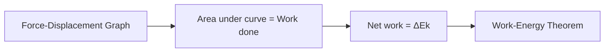

# Work-Energy Theorem / 功能定理

---

# 1. Overview / 概述

**English:**
The Work-Energy Theorem is a fundamental principle in mechanics that directly links the [[Work Done by a Force]] to changes in [[Kinetic Energy (KE)]]. It states that the net work done on an object equals its change in kinetic energy. This theorem provides a powerful alternative to Newton's laws for solving problems involving motion, especially when forces vary or when the path is complex. It serves as a bridge between the concepts of work and energy, forming the foundation for the [[Conservation of Energy]] principle.

**中文:**
功能定理是力学中的一个基本原理，它直接将[[Work Done by a Force|力所做的功]]与[[Kinetic Energy (KE)|动能]]的变化联系起来。该定理指出，对物体所做的净功等于其动能的变化。这个定理为解决涉及运动的问题提供了牛顿定律的强大替代方案，特别是在力变化或路径复杂的情况下。它作为连接功和能量概念的桥梁，为[[Conservation of Energy|能量守恒]]原理奠定了基础。

---

# 2. Syllabus Learning Objectives / 考纲学习目标

| CAIE 9702 | Edexcel IAL |
|-----------|-------------|
| 3.3(c): Recall and use the work-energy theorem | WPH11 U1: 4.5: Derive and apply the work-energy theorem |
| 3.3(d): Derive kinetic energy formula using work-energy theorem | WPH11 U1: 4.6: Solve problems using work-energy theorem |
| 3.3(e): Apply work-energy theorem to problems with varying forces | WPH11 U1: 4.7: Relate work-energy theorem to conservative forces |
| 3.3(f): Distinguish between work done and energy transfer | WPH11 U1: 4.8: Apply theorem to systems with multiple forces |

**Examiner Expectations / 考官期望:**
- **English:** Students must be able to derive the kinetic energy formula $E_k = \frac{1}{2}mv^2$ from the work-energy theorem. They should apply the theorem to both constant and variable force scenarios. Key skill: identifying net work from multiple forces and relating it to kinetic energy change.
- **中文:** 学生必须能够从功能定理推导出动能公式 $E_k = \frac{1}{2}mv^2$。他们应该将定理应用于恒定力和变力两种情况。关键技能：从多个力中识别净功，并将其与动能变化联系起来。

---

# 3. Core Definitions / 核心定义

| Term (EN/CN) | Definition (EN) | Definition (CN) | Common Mistakes / 常见错误 |
|--------------|-----------------|-----------------|---------------------------|
| **Work-Energy Theorem** / 功能定理 | The net work done on an object equals its change in kinetic energy: $W_{net} = \Delta E_k$ | 对物体所做的净功等于其动能的变化：$W_{net} = \Delta E_k$ | Confusing net work with work done by individual forces |
| **Net Work** / 净功 | The total work done by all forces acting on an object, equal to the sum of work done by each force | 作用在物体上的所有力所做的总功，等于每个力所做功的总和 | Forgetting to include work done by gravity or friction |
| **Kinetic Energy** / 动能 | The energy an object possesses due to its motion: $E_k = \frac{1}{2}mv^2$ | 物体由于运动而具有的能量：$E_k = \frac{1}{2}mv^2$ | Using $mv^2$ instead of $\frac{1}{2}mv^2$ |
| **Conservative Force** / 保守力 | A force where work done is path-independent and can be stored as potential energy (e.g., gravity) | 做功与路径无关且可以储存为势能的力（如重力） | Confusing with non-conservative forces like friction |
| **Non-Conservative Force** / 非保守力 | A force where work done depends on path and dissipates energy (e.g., friction) | 做功取决于路径并耗散能量的力（如摩擦力） | Assuming all forces are conservative |

---

# 4. Key Concepts Explained / 关键概念详解

## 4.1 Derivation of Work-Energy Theorem / 功能定理的推导

### Explanation / 解释
**English:**
Consider an object of mass $m$ moving in a straight line under a constant net force $F_{net}$. Using Newton's second law $F_{net} = ma$ and the kinematic equation $v^2 = u^2 + 2as$:

$$W_{net} = F_{net} \cdot s = ma \cdot s$$

From kinematics: $v^2 = u^2 + 2as \implies as = \frac{v^2 - u^2}{2}$

Substituting: $W_{net} = m \cdot \frac{v^2 - u^2}{2} = \frac{1}{2}mv^2 - \frac{1}{2}mu^2$

Therefore: $W_{net} = \Delta E_k = E_{k,final} - E_{k,initial}$

This derivation shows how the [[Kinetic Energy (KE)]] formula naturally emerges from work and motion concepts.

**中文:**
考虑一个质量为 $m$ 的物体在恒定净力 $F_{net}$ 作用下沿直线运动。利用牛顿第二定律 $F_{net} = ma$ 和运动学方程 $v^2 = u^2 + 2as$：

$$W_{net} = F_{net} \cdot s = ma \cdot s$$

从运动学：$v^2 = u^2 + 2as \implies as = \frac{v^2 - u^2}{2}$

代入：$W_{net} = m \cdot \frac{v^2 - u^2}{2} = \frac{1}{2}mv^2 - \frac{1}{2}mu^2$$

因此：$W_{net} = \Delta E_k = E_{k,最终} - E_{k,初始}$$

这个推导展示了[[Kinetic Energy (KE)|动能]]公式如何自然地从功和运动概念中产生。

### Physical Meaning / 物理意义
**English:** The work-energy theorem tells us that work is a transfer of energy. When net work is done on an object, its kinetic energy changes by exactly that amount. Positive net work increases kinetic energy (speeding up), while negative net work decreases kinetic energy (slowing down).

**中文:** 功能定理告诉我们，功是能量的转移。当对物体做净功时，其动能恰好改变那么多。正净功增加动能（加速），负净功减少动能（减速）。

### Common Misconceptions / 常见误区
- **English:**
  - Confusing net work with work done by a single force
  - Thinking the theorem only applies to constant forces
  - Forgetting that work can be negative
  - Assuming the theorem only works for horizontal motion

- **中文:**
  - 将净功与单个力所做的功混淆
  - 认为定理只适用于恒定力
  - 忘记功可以是负的
  - 假设定理只适用于水平运动

### Exam Tips / 考试提示
- **English:** Always identify ALL forces acting on the object first. Calculate work done by each force separately, then sum to find net work. Remember: $W_{net} = \Delta E_k$ is always true, even for variable forces.
- **中文:** 始终先识别作用在物体上的所有力。分别计算每个力所做的功，然后求和得到净功。记住：$W_{net} = \Delta E_k$ 始终成立，即使对于变力也是如此。

> 📷 **IMAGE PROMPT — WET-01: Work-Energy Theorem Derivation Diagram**
> A diagram showing a block of mass m on a frictionless surface, with a constant force F applied horizontally. Show the displacement s, initial velocity u, and final velocity v. Include force arrows and labels for work done, initial KE, and final KE. Use a clean, educational style suitable for A-Level physics textbooks.

---

## 4.2 Net Work Calculation / 净功的计算

### Explanation / 解释
**English:**
Net work is the algebraic sum of work done by all forces:

$$W_{net} = W_1 + W_2 + W_3 + ... = \sum W_i$$

For forces at angles: $W = Fs\cos\theta$

When multiple forces act:
1. Calculate work done by each force individually
2. Add them algebraically (positive for forces in direction of motion, negative for opposite)
3. The sum equals $\Delta E_k$

**中文:**
净功是所有力所做功的代数和：

$$W_{net} = W_1 + W_2 + W_3 + ... = \sum W_i$$

对于有角度的力：$W = Fs\cos\theta$

当多个力作用时：
1. 分别计算每个力所做的功
2. 代数相加（与运动方向相同的力为正，相反的为负）
3. 总和等于 $\Delta E_k$

### Common Misconceptions / 常见误区
- **English:** Students often forget to include work done by gravity when an object moves vertically or on an incline.
- **中文:** 学生经常忘记在物体垂直运动或沿斜面运动时包括重力所做的功。

### Exam Tips / 考试提示
- **English:** Draw a free-body diagram first. Label all forces. For each force, determine if it does positive, negative, or zero work.
- **中文:** 先画受力分析图。标注所有力。对于每个力，确定它做正功、负功还是零功。

---

# 5. Essential Equations / 核心公式

## Equation 1: Work-Energy Theorem / 功能定理

$$W_{net} = \Delta E_k = \frac{1}{2}mv^2 - \frac{1}{2}mu^2$$

| Symbol (符号) | Meaning (EN) | Meaning (CN) | Unit (单位) |
|--------------|-------------|-------------|------------|
| $W_{net}$ | Net work done on object | 对物体所做的净功 | J (Joule) |
| $\Delta E_k$ | Change in kinetic energy | 动能的变化 | J |
| $m$ | Mass of object | 物体的质量 | kg |
| $v$ | Final velocity | 最终速度 | m s⁻¹ |
| $u$ | Initial velocity | 初始速度 | m s⁻¹ |

**Derivation / 推导:** Shown in Section 4.1
**Conditions / 适用条件:** Valid for all forces (constant or variable), any path, any reference frame (inertial)
**Limitations / 局限性:** Only accounts for changes in kinetic energy, not potential energy. For systems with potential energy changes, use [[Conservation of Energy]].

## Equation 2: Net Work from Multiple Forces / 多个力的净功

$$W_{net} = \sum_{i} F_i s \cos\theta_i$$

| Symbol (符号) | Meaning (EN) | Meaning (CN) | Unit (单位) |
|--------------|-------------|-------------|------------|
| $F_i$ | Magnitude of i-th force | 第i个力的大小 | N |
| $s$ | Displacement | 位移 | m |
| $\theta_i$ | Angle between force and displacement | 力与位移之间的夹角 | ° or rad |

**Conditions / 适用条件:** Constant forces; for variable forces, use integration
**Limitations / 局限性:** For variable forces, must use $W = \int F \cdot ds$

---

# 6. Graphs and Relationships / 图表与关系

## 6.1 Force-Displacement Graph / 力-位移图

### Axes / 坐标轴
- **X-axis:** Displacement $s$ (m) / 位移 $s$ (m)
- **Y-axis:** Force $F$ (N) / 力 $F$ (N)

### Shape / 形状
- **Constant force:** Horizontal line / 恒定力：水平线
- **Variable force:** Curved line / 变力：曲线

### Gradient Meaning / 斜率含义
- **English:** The gradient of a force-displacement graph has no direct physical meaning in the work-energy theorem context.
- **中文:** 在功能定理的背景下，力-位移图的斜率没有直接的物理意义。

### Area Meaning / 面积含义
- **English:** The area under a force-displacement graph equals the work done by that force. For the work-energy theorem, the total area under the net force-displacement graph equals $\Delta E_k$.
- **中文:** 力-位移图下的面积等于该力所做的功。对于功能定理，净力-位移图下的总面积等于 $\Delta E_k$。

### Exam Interpretation / 考试解读
- **English:** When asked to find work done from a graph, calculate the area. For non-linear graphs, use counting squares or integration.
- **中文:** 当要求从图中找出所做的功时，计算面积。对于非线性图，使用数方格或积分法。



---

# 7. Required Diagrams / 必备图表

## 7.1 Work-Energy Theorem Application Diagram / 功能定理应用图

### Description / 描述
**English:** A diagram showing a block being pushed up an inclined plane with friction. Label all forces: applied force $F$, friction $f$, weight $mg$, normal reaction $N$. Show displacement $s$ along the incline. Indicate work done by each force and the resulting change in kinetic energy.

**中文:** 显示一个块体被推上带有摩擦力的斜面的图。标注所有力：施加力 $F$、摩擦力 $f$、重力 $mg$、法向反力 $N$。显示沿斜面的位移 $s$。指示每个力所做的功以及由此产生的动能变化。

### Image Prompt / 图片生成提示
> 📷 **IMAGE PROMPT — WET-02: Block on Inclined Plane with Forces**
> A detailed physics diagram showing a rectangular block on a rough inclined plane at angle θ. An applied force F pushes the block up the incline. Label all forces with arrows: F (up the incline), friction f (down the incline), weight mg (vertically down), normal reaction N (perpendicular to surface). Show displacement s along the incline. Include a small table showing work done by each force and the net work. Educational style, clear labels, suitable for A-Level physics.

### Labels Required / 需要标注
- Applied force $F$ / 施加力 $F$
- Friction $f$ / 摩擦力 $f$
- Weight $mg$ / 重力 $mg$
- Normal reaction $N$ / 法向反力 $N$
- Displacement $s$ / 位移 $s$
- Angle of incline $\theta$ / 斜面角度 $\theta$

### Exam Importance / 考试重要性
- **English:** This is a classic exam scenario. Students must calculate net work by summing work done by each force, then relate to kinetic energy change.
- **中文:** 这是一个经典的考试场景。学生必须通过求和每个力所做的功来计算净功，然后与动能变化联系起来。

---

# 8. Worked Examples / 典型例题

## Example 1: Block on Horizontal Surface / 水平面上的块体

### Question / 题目
**English:**
A block of mass 5.0 kg is pulled horizontally by a force of 40 N. The frictional force is 15 N. The block moves 8.0 m from rest. Calculate:
a) The net work done on the block
b) The final speed of the block

**中文:**
一个质量为5.0 kg的块体被40 N的水平力拉动。摩擦力为15 N。块体从静止开始移动8.0 m。计算：
a) 对块体所做的净功
b) 块体的最终速度

### Solution / 解答

**Step 1: Identify forces and calculate work done by each / 识别力并计算每个力所做的功**

Applied force work: $W_F = F \cdot s = 40 \times 8.0 = 320 \text{ J}$

Friction work: $W_f = -f \cdot s = -15 \times 8.0 = -120 \text{ J}$ (negative because opposite to motion)

Normal reaction: $W_N = 0$ (perpendicular to motion)

Weight: $W_g = 0$ (perpendicular to motion)

**Step 2: Calculate net work / 计算净功**

$$W_{net} = W_F + W_f = 320 + (-120) = 200 \text{ J}$$

**Step 3: Apply work-energy theorem / 应用功能定理**

$$W_{net} = \Delta E_k = \frac{1}{2}mv^2 - \frac{1}{2}mu^2$$

Since $u = 0$ (starts from rest):

$$200 = \frac{1}{2} \times 5.0 \times v^2$$

$$v^2 = \frac{200 \times 2}{5.0} = 80$$

$$v = \sqrt{80} = 8.94 \text{ m s}^{-1}$$

### Final Answer / 最终答案
**Answer:** a) $W_{net} = 200 \text{ J}$ | b) $v = 8.94 \text{ m s}^{-1}$
**答案：** a) $W_{net} = 200 \text{ J}$ | b) $v = 8.94 \text{ m s}^{-1}$

### Quick Tip / 提示
- **English:** Always check if forces do positive, negative, or zero work. Forces perpendicular to displacement do zero work.
- **中文:** 始终检查力是做正功、负功还是零功。垂直于位移的力做功为零。

---

## Example 2: Block on Inclined Plane / 斜面上的块体

### Question / 题目
**English:**
A 2.0 kg block slides down a rough incline of length 5.0 m at 30° to the horizontal. The coefficient of kinetic friction is 0.20. The block starts from rest. Find the speed at the bottom using the work-energy theorem.

**中文:**
一个2.0 kg的块体沿粗糙斜面下滑，斜面长5.0 m，与水平面成30°角。动摩擦系数为0.20。块体从静止开始。使用功能定理求底部的速度。

### Solution / 解答

**Step 1: Identify forces and displacement / 识别力和位移**

Weight component parallel to incline: $mg\sin\theta = 2.0 \times 9.81 \times \sin 30° = 9.81 \text{ N}$

Normal reaction: $N = mg\cos\theta = 2.0 \times 9.81 \times \cos 30° = 17.0 \text{ N}$

Friction: $f = \mu N = 0.20 \times 17.0 = 3.40 \text{ N}$

**Step 2: Calculate work done by each force / 计算每个力所做的功**

Work by gravity component: $W_g = mg\sin\theta \times s = 9.81 \times 5.0 = 49.05 \text{ J}$

Work by friction: $W_f = -f \times s = -3.40 \times 5.0 = -17.0 \text{ J}$

Work by normal reaction: $W_N = 0$ (perpendicular to motion)

**Step 3: Net work and final speed / 净功和最终速度**

$$W_{net} = 49.05 - 17.0 = 32.05 \text{ J}$$

$$W_{net} = \frac{1}{2}mv^2 - 0$$

$$32.05 = \frac{1}{2} \times 2.0 \times v^2$$

$$v^2 = 32.05$$

$$v = 5.66 \text{ m s}^{-1}$$

### Final Answer / 最终答案
**Answer:** $v = 5.66 \text{ m s}^{-1}$
**答案：** $v = 5.66 \text{ m s}^{-1}$

### Quick Tip / 提示
- **English:** For inclined plane problems, resolve weight into components parallel and perpendicular to the incline. Only the parallel component does work.
- **中文:** 对于斜面问题，将重力分解为平行和垂直于斜面的分量。只有平行分量做功。

---

# 9. Past Paper Question Types / 历年真题题型

| Question Type / 题型 | Frequency / 频率 | Difficulty / 难度 | Past Paper References / 真题索引 |
|----------------------|------------------|------------------|-------------------------------|
| Direct application of $W_{net} = \Delta E_k$ | High | Easy | 📝 *待填入* |
| Block on rough surface with friction | High | Medium | 📝 *待填入* |
| Block on inclined plane | Medium | Medium-Hard | 📝 *待填入* |
| Variable force from graph | Low-Medium | Hard | 📝 *待填入* |
| Derivation of kinetic energy formula | Medium | Easy | 📝 *待填入* |
| Multi-stage motion problems | Low | Hard | 📝 *待填入* |

**Common Command Words / 常见指令词:**
- **English:** "Calculate", "Determine", "Derive", "Show that", "Apply", "State"
- **中文:** "计算"、"确定"、"推导"、"证明"、"应用"、"陈述"

---

# 10. Practical Skills Connections / 实验技能链接

**English:**
The work-energy theorem connects to practical work in several ways:

1. **Measuring Work Done:** Use force sensors and motion detectors to measure force and displacement, then calculate work done experimentally.

2. **Verifying the Theorem:** Set up an experiment where a known force acts on a cart on a friction-compensated track. Measure initial and final velocities using light gates, and compare $\Delta E_k$ with calculated work done.

3. **Friction Investigation:** Use the work-energy theorem to determine the coefficient of friction by measuring how far an object slides before stopping.

4. **Graph Analysis:** Plot force-displacement graphs from experimental data and calculate area to find work done.

5. **Uncertainty Considerations:** When measuring velocity with light gates, consider timing uncertainties. When measuring force with a spring balance, consider calibration errors.

**中文:**
功能定理在实验中有多种联系：

1. **测量做功：** 使用力传感器和运动探测器测量力和位移，然后实验计算所做的功。

2. **验证定理：** 设置实验，在摩擦补偿轨道上对小车施加已知力。使用光门测量初速度和末速度，比较 $\Delta E_k$ 与计算的功。

3. **摩擦研究：** 使用功能定理通过测量物体停止前滑动的距离来确定摩擦系数。

4. **图表分析：** 从实验数据绘制力-位移图，计算面积以找到所做的功。

5. **不确定度考虑：** 使用光门测量速度时，考虑计时不确定度。使用弹簧秤测量力时，考虑校准误差。

---

# 11. Concept Map / 概念图谱

```mermaid
graph TD
    WET[Work-Energy Theorem] --> Wnet[Net Work W_net]
    WET --> dEk[Change in Kinetic Energy ΔEk]
    
    Wnet --> W1[Work by Force 1]
    Wnet --> W2[Work by Force 2]
    Wnet --> W3[Work by Force 3]
    
    W1 --> F1[Force F₁]
    W1 --> s[Displacement s]
    W1 --> theta[Angle θ₁]
    
    dEk --> Ekf[Final KE ½mv²]
    dEk --> Eki[Initial KE ½mu²]
    
    WET --> Derivation[Derivation from F=ma]
    Derivation --> N2L[Newton's 2nd Law]
    Derivation --> Kinematics[Kinematic Equations]
    
    WET --> Applications[Applications]
    Applications --> Horizontal[Horizontal Motion]
    Applications --> Incline[Inclined Plane]
    Applications --> Variable[Variable Forces]
    
    WET --> Graph[Force-Displacement Graph]
    Graph --> Area[Area = Work Done]
    
    WET --> Practical[Practical Verification]
    Practical --> LightGate[Light Gates for Velocity]
    Practical --> ForceSensor[Force Sensors]
    
    WET --> Related[Related Concepts]
    Related --> KE[[Kinetic Energy (KE)]]
    Related --> Work[[Work Done by a Force]]
    Related --> CoE[[Conservation of Energy]]
    Related --> GPE[[Gravitational Potential Energy (GPE)]]
    Related --> Elastic[[Elastic Potential Energy]]
```

---

# 12. Quick Revision Sheet / 速查表

| Category / 类别 | Key Points / 要点 |
|----------------|------------------|
| **Definition / 定义** | $W_{net} = \Delta E_k$ — Net work equals change in kinetic energy / 净功等于动能的变化 |
| **Key Formula / 核心公式** | $W_{net} = \frac{1}{2}mv^2 - \frac{1}{2}mu^2$ |
| **Net Work Calculation / 净功计算** | Sum work done by ALL forces: $W_{net} = \sum F_i s \cos\theta_i$ / 求和所有力所做的功 |
| **Sign Convention / 符号约定** | Positive work: force in direction of motion (speeds up) / 正功：力与运动方向相同（加速） |
| | Negative work: force opposite to motion (slows down) / 负功：力与运动方向相反（减速） |
| | Zero work: force perpendicular to motion / 零功：力垂直于运动 |
| **Key Graph / 核心图表** | Force-Displacement graph: Area = Work done / 力-位移图：面积 = 所做的功 |
| **Common Forces / 常见力** | Applied force: usually positive work / 施加力：通常做正功 |
| | Friction: always negative work / 摩擦力：总是做负功 |
| | Gravity: positive when moving down, negative when moving up / 重力：向下运动时正功，向上运动时负功 |
| | Normal reaction: always zero work / 法向反力：总是做零功 |
| **Exam Tip / 考试提示** | Always draw a free-body diagram first! / 始终先画受力分析图！ |
| | Check if the problem involves potential energy — if so, use [[Conservation of Energy]] instead / 检查问题是否涉及势能——如果是，使用[[Conservation of Energy|能量守恒]] |
| **Derivation / 推导** | $F=ma$, $v^2=u^2+2as$, $W=Fs$ → $W_{net} = \frac{1}{2}mv^2 - \frac{1}{2}mu^2$ |
| **Limitations / 局限性** | Only accounts for kinetic energy changes, not potential energy / 只考虑动能变化，不考虑势能 |
| **Related Topics / 相关主题** | [[Kinetic Energy (KE)]], [[Work Done by a Force]], [[Conservation of Energy]], [[Gravitational Potential Energy (GPE)]], [[Elastic Potential Energy]] |