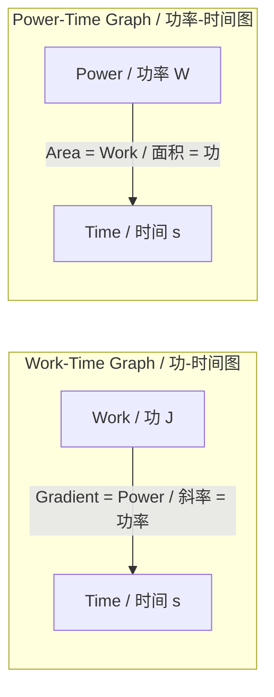
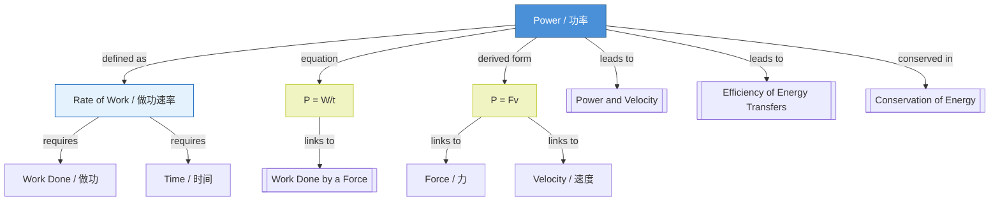

# 1. Overview / 概述

**English:**
This sub-topic introduces the **definition of power** — the rate at which work is done or energy is transferred. Power is a fundamental concept that connects [[Work Done by a Force]] with time, and it appears in every area of physics, from mechanics to electricity. Understanding power is essential for analyzing how quickly machines, engines, and biological systems can perform work. This leaf node focuses on the core definition, units, and basic calculations of power, forming the foundation for more advanced topics like [[Power and Velocity]] and [[Efficiency of Energy Transfers]].

**中文:**
本子知识点介绍**功率的定义**——做功或能量转移的速率。功率是一个基本概念，它将[[Work Done by a Force|做功]]与时间联系起来，出现在从力学到电学的物理各个领域。理解功率对于分析机器、发动机和生物系统做功的快慢至关重要。本叶节点聚焦于功率的核心定义、单位和基本计算，为[[Power and Velocity|功率与速度]]和[[Efficiency of Energy Transfers|能量转移效率]]等更高级的主题奠定基础。

---

# 2. Syllabus Learning Objectives / 考纲学习目标

| CAIE 9702 | Edexcel IAL |
|-----------|-------------|
| 3.3(h): Define power as work done per unit time | 4.12: Define power as the rate of transfer of energy |
| 3.3(i): Recall and use the equation $P = \frac{W}{t}$ | 4.13: Use the equation $P = \frac{\Delta W}{\Delta t}$ |
| 3.3(j): Derive and use $P = Fv$ for constant force and velocity | 4.14: Derive $P = Fv$ from $P = \frac{W}{t}$ and $W = Fs$ |
| 3.3(k): Solve problems involving power, work, and time | 4.15: Solve problems involving power, efficiency, and energy transfer |

**Examiner Expectations / 考官期望:**
- **English:** Students must be able to define power in words and equations, convert between units (W, kW, MW), and apply $P = \frac{W}{t}$ to simple mechanical and electrical contexts. Derivation of $P = Fv$ is expected for constant forces.
- **中文:** 学生必须能用文字和方程定义功率，进行单位换算（W, kW, MW），并将$P = \frac{W}{t}$应用于简单的力学和电学情境。对于恒力，需要推导$P = Fv$。

---

# 3. Core Definitions / 核心定义

| Term (EN/CN) | Definition (EN) | Definition (CN) | Common Mistakes / 常见错误 |
|--------------|-----------------|-----------------|---------------------------|
| **Power** / 功率 | The rate at which work is done or energy is transferred. | 做功或能量转移的速率。 | Confusing power with energy — power is a rate, not a quantity. / 混淆功率与能量——功率是速率，不是总量。 |
| **Watt (W)** / 瓦特 | The SI unit of power. 1 W = 1 J s⁻¹. | 功率的国际单位制单位。1 W = 1 J s⁻¹。 | Writing "w" instead of "W" for the unit symbol. / 单位符号写成小写"w"而非大写"W"。 |
| **Average Power** / 平均功率 | Total work done divided by total time taken. | 总做功除以总时间。 | Using instantaneous values when average is required. / 需要平均值时用了瞬时值。 |
| **Instantaneous Power** / 瞬时功率 | Power at a specific moment, given by $P = Fv$ for constant force. | 某一特定时刻的功率，对于恒力由$P = Fv$给出。 | Assuming $P = Fv$ always applies (only for constant force and velocity). / 认为$P = Fv$始终适用（仅适用于恒力和恒速）。 |
| **Kilowatt (kW)** / 千瓦 | 1 kW = 1000 W. Common unit for engines and appliances. | 1 kW = 1000 W。发动机和电器的常用单位。 | Forgetting to convert kW to W in calculations. / 计算中忘记将kW转换为W。 |

---

# 4. Key Concepts Explained / 关键概念详解

## 4.1 Power as a Rate / 功率作为速率

### Explanation / 解释
**English:**
Power is fundamentally a **rate** — it tells us how quickly work is done or energy is transferred. The core equation is:

$$ P = \frac{W}{t} $$

where $P$ is power (in watts, W), $W$ is work done (in joules, J), and $t$ is time taken (in seconds, s). This means:
- If you do the same amount of work in **less time**, you have **greater power**.
- If you do **more work** in the **same time**, you also have **greater power**.

Power is a **scalar** quantity (it has magnitude but no direction). It is related to [[Work Done by a Force]] through the time factor.

**中文:**
功率本质上是一个**速率**——它告诉我们做功或能量转移的快慢。核心方程为：

$$ P = \frac{W}{t} $$

其中$P$是功率（单位：瓦特，W），$W$是做功（单位：焦耳，J），$t$是时间（单位：秒，s）。这意味着：
- 如果在**更短的时间**内做相同的功，则**功率更大**。
- 如果在**相同的时间**内做**更多的功**，则功率也更大。

功率是一个**标量**（有大小无方向）。它通过时间因子与[[Work Done by a Force|做功]]相关联。

### Physical Meaning / 物理意义
**English:**
Physically, power measures the **speed of energy transfer**. A 100 W light bulb transfers 100 J of electrical energy into light and heat every second. A 1000 W microwave transfers 1000 J per second — it heats food faster because it has higher power.

**中文:**
物理上，功率衡量的是**能量转移的速度**。一个100 W的灯泡每秒将100 J的电能转化为光和热。一个1000 W的微波炉每秒转移1000 J——它加热食物更快，因为功率更高。

### Common Misconceptions / 常见误区
- **English:**
  - ❌ "More power means more energy." → ✅ More power means faster energy transfer, but total energy depends on both power and time ($E = Pt$).
  - ❌ "Power and work are the same thing." → ✅ Work is energy transferred; power is the rate of that transfer.
  - ❌ "A higher power device always uses more energy." → ✅ Only if used for the same time. A high-power device used briefly may use less total energy than a low-power device used for a long time.
- **中文:**
  - ❌ "功率越大意味着能量越多。" → ✅ 功率越大意味着能量转移越快，但总能量取决于功率和时间两者（$E = Pt$）。
  - ❌ "功率和功是一回事。" → ✅ 功是转移的能量；功率是转移的速率。
  - ❌ "功率越高的设备总是消耗更多能量。" → ✅ 只有在使用时间相同时才成立。高功率设备短时间使用可能比低功率设备长时间使用消耗的总能量更少。

### Exam Tips / 考试提示
- **English:**
  - Always check units: time must be in seconds, work in joules.
  - If given power in kW, convert to W by multiplying by 1000.
  - For average power, use total work / total time.
  - Remember: $P = \frac{W}{t}$ is the **definition** — start here for any power problem.
- **中文:**
  - 始终检查单位：时间必须用秒，功用焦耳。
  - 如果功率以kW给出，乘以1000转换为W。
  - 对于平均功率，使用总功/总时间。
  - 记住：$P = \frac{W}{t}$是**定义**——任何功率问题都从这里开始。

> 📷 **IMAGE PROMPT — PWR-01: Power Comparison Diagram**
> A split illustration showing two scenarios: (Left) A person lifting a 10 kg box 2 m in 5 seconds — labeled "Low Power: 40 W". (Right) A motor lifting the same box the same height in 1 second — labeled "High Power: 200 W". Both show the same work done (200 J) but different times. Include a bar chart comparing work (same height) and power (different heights). Clean, educational style with clear labels in English.

---

# 5. Essential Equations / 核心公式

## Equation 1: Definition of Power / 功率定义

$$ P = \frac{W}{t} $$

| Symbol (符号) | Meaning (EN) | Meaning (CN) | Unit (单位) |
|--------------|-------------|-------------|------------|
| $P$ | Power | 功率 | W (J s⁻¹) |
| $W$ | Work done | 做功 | J |
| $t$ | Time taken | 时间 | s |

**Derivation / 推导:**
This is the **definition** of power — it is not derived from other equations. It comes directly from the concept of rate: power = work ÷ time.

**Conditions / 适用条件:**
- **English:** Works for any situation where work is done or energy is transferred. For non-constant power, this gives **average power** over the time interval.
- **中文:** 适用于任何做功或能量转移的情况。对于非恒定功率，这给出时间间隔内的**平均功率**。

**Limitations / 局限性:**
- **English:** Does not account for direction or force — it only relates total work and time. For instantaneous power with constant force, use $P = Fv$.
- **中文:** 不考虑方向或力——它只关联总功和时间。对于恒力的瞬时功率，使用$P = Fv$。

## Equation 2: Power in Terms of Force and Velocity / 功率的力与速度表达式

$$ P = Fv $$

| Symbol (符号) | Meaning (EN) | Meaning (CN) | Unit (单位) |
|--------------|-------------|-------------|------------|
| $P$ | Power | 功率 | W |
| $F$ | Constant force in direction of motion | 运动方向上的恒力 | N |
| $v$ | Constant velocity | 恒定速度 | m s⁻¹ |

**Derivation / 推导:**
Starting from $P = \frac{W}{t}$ and $W = Fs$ (where $s$ is displacement):
$$ P = \frac{Fs}{t} = F \left(\frac{s}{t}\right) = Fv $$
This derivation assumes $F$ is constant and in the direction of motion.

**Conditions / 适用条件:**
- **English:** Only valid when force is **constant** and velocity is **constant** (or instantaneous values are used). For varying forces, use $P = Fv$ for instantaneous power where $F$ and $v$ are instantaneous values.
- **中文:** 仅当力**恒定**且速度**恒定**时有效（或使用瞬时值）。对于变化的力，使用$P = Fv$计算瞬时功率，其中$F$和$v$是瞬时值。

**Limitations / 局限性:**
- **English:** Does not work if force and velocity are not in the same direction. For angled forces, use $P = Fv\cos\theta$.
- **中文:** 如果力和速度不在同一方向则不适用。对于有角度的力，使用$P = Fv\cos\theta$。

> 📋 **Edexcel Only:** Edexcel expects students to derive $P = Fv$ from $P = \frac{W}{t}$ and $W = Fs$ in exam questions.

> 📋 **CIE Only:** CIE 9702 expects students to recall and use $P = Fv$ for constant force and velocity, and to solve problems involving power, work, and time.

---

# 6. Graphs and Relationships / 图表与关系

## 6.1 Work-Time Graph / 功-时间图

### Axes / 坐标轴
- **X-axis:** Time / 时间 (s)
- **Y-axis:** Work done / 做功 (J)

### Shape / 形状
- **English:** A straight line through the origin if power is constant. The gradient (slope) of the line equals the power.
- **中文:** 如果功率恒定，为一条过原点的直线。直线的斜率等于功率。

### Gradient Meaning / 斜率含义
- **English:** Gradient = $\frac{\Delta W}{\Delta t} = P$ (power). A steeper line means higher power.
- **中文:** 斜率 = $\frac{\Delta W}{\Delta t} = P$（功率）。直线越陡，功率越大。

### Area Meaning / 面积含义
- **English:** The area under a power-time graph gives the total work done (or energy transferred).
- **中文:** 功率-时间图下的面积给出总做功（或转移的能量）。

### Exam Interpretation / 考试解读
- **English:** If given a work-time graph, calculate the gradient to find power. If the graph is curved, the gradient at a point gives instantaneous power.
- **中文:** 如果给出功-时间图，计算斜率求功率。如果图线弯曲，某点的切线斜率给出瞬时功率。

> 📷 **IMAGE PROMPT — PWR-02: Work-Time and Power-Time Graphs**
> Two graphs side by side. Left: Work (J) vs Time (s) — a straight line through origin with gradient labeled "P = 50 W". Right: Power (W) vs Time (s) — a horizontal line at 50 W with shaded area under it labeled "Area = Work done = 200 J". Clean, exam-style graphs with clear axis labels and annotations.

---

# 7. Required Diagrams / 必备图表

## 7.1 Power Transfer Diagram / 功率转移图

### Description / 描述
**English:**
A diagram showing a force $F$ applied to an object moving at velocity $v$ in the same direction. The diagram illustrates that power $P = Fv$ is the rate of work done by the force.

**中文:**
一个显示力$F$施加在物体上，物体以速度$v$沿相同方向运动的示意图。该图说明功率$P = Fv$是力做功的速率。

### Image Prompt / 图片生成提示
> 📷 **IMAGE PROMPT — PWR-03: Force-Velocity Power Diagram**
> A simple physics diagram showing a box on a frictionless surface. A horizontal arrow labeled "Force F = 20 N" points to the right from the box. Above the box, an arrow labeled "Velocity v = 5 m s⁻¹" also points right. Below, a callout box shows: "Power P = Fv = 20 × 5 = 100 W". Clean, minimal style suitable for A-Level physics notes. Include a small clock icon to emphasize "per second".

### Labels Required / 需要标注
- **English:** Force $F$ (N), Velocity $v$ (m s⁻¹), Power $P = Fv$ (W)
- **中文:** 力$F$ (N)，速度$v$ (m s⁻¹)，功率$P = Fv$ (W)

### Exam Importance / 考试重要性
- **English:** High — this diagram is essential for understanding the derivation of $P = Fv$ and for solving problems involving vehicles, engines, and motors.
- **中文:** 高——此图对于理解$P = Fv$的推导以及解决涉及车辆、发动机和电机的问题至关重要。

---

# 8. Worked Examples / 典型例题

## Example 1: Basic Power Calculation / 基本功率计算

### Question / 题目
**English:**
A motor does 6000 J of work in 30 seconds. Calculate:
(a) The average power output of the motor.
(b) The time required for the motor to do 10,000 J of work at the same power.

**中文:**
一台电机在30秒内做了6000 J的功。计算：
(a) 电机的平均输出功率。
(b) 以相同功率做10,000 J的功所需的时间。

### Solution / 解答

**(a) Average Power / 平均功率**

$$ P = \frac{W}{t} = \frac{6000 \text{ J}}{30 \text{ s}} = 200 \text{ W} $$

**(b) Time Required / 所需时间**

$$ t = \frac{W}{P} = \frac{10,000 \text{ J}}{200 \text{ W}} = 50 \text{ s} $$

### Final Answer / 最终答案
**Answer:** (a) 200 W (b) 50 s | **答案：** (a) 200 W (b) 50 s

### Quick Tip / 提示
- **English:** Always write the equation first, substitute values with units, then calculate. This shows the examiner your method.
- **中文:** 始终先写出方程，代入带单位的值，再计算。这向考官展示你的方法。

---

## Example 2: Power from Force and Velocity / 由力和速度求功率

### Question / 题目
**English:**
A car engine provides a constant driving force of 1500 N. The car travels at a constant velocity of 25 m s⁻¹ on a horizontal road.
(a) Calculate the power output of the engine.
(b) If the engine power is increased to 60 kW, what is the new constant velocity (assuming the same driving force)?

**中文:**
一辆汽车的发动机提供1500 N的恒定驱动力。汽车在水平道路上以25 m s⁻¹的恒定速度行驶。
(a) 计算发动机的输出功率。
(b) 如果发动机功率增加到60 kW，新的恒定速度是多少（假设驱动力相同）？

### Solution / 解答

**(a) Power Output / 输出功率**

$$ P = Fv = 1500 \text{ N} \times 25 \text{ m s}^{-1} = 37,500 \text{ W} = 37.5 \text{ kW} $$

**(b) New Velocity / 新速度**

Convert 60 kW to W: $60 \text{ kW} = 60,000 \text{ W}$

$$ v = \frac{P}{F} = \frac{60,000 \text{ W}}{1500 \text{ N}} = 40 \text{ m s}^{-1} $$

### Final Answer / 最终答案
**Answer:** (a) 37.5 kW (b) 40 m s⁻¹ | **答案：** (a) 37.5 kW (b) 40 m s⁻¹

### Quick Tip / 提示
- **English:** Remember to convert kW to W before using the formula. The equation $P = Fv$ only works when force and velocity are in the same direction.
- **中文:** 记住在使用公式前将kW转换为W。方程$P = Fv$仅当力和速度方向相同时才成立。

---

# 9. Past Paper Question Types / 历年真题题型

| Question Type / 题型 | Frequency / 频率 | Difficulty / 难度 | Past Paper References / 真题索引 |
|----------------------|------------------|------------------|-------------------------------|
| Definition of power (words and equation) | High | Easy | 📝 *待填入* |
| Calculate power from work and time | High | Easy | 📝 *待填入* |
| Calculate work or time from power | Medium | Medium | 📝 *待填入* |
| Derive and use $P = Fv$ | Medium | Medium | 📝 *待填入* |
| Power in context (engines, motors, humans) | High | Medium | 📝 *待填入* |
| Unit conversions (W, kW, MW) | Medium | Easy | 📝 *待填入* |

**Common Command Words / 常见指令词:**
- **English:** Define, Calculate, Derive, Show that, Determine, State
- **中文:** 定义，计算，推导，证明，确定，写出

---

# 10. Practical Skills Connections / 实验技能链接

**English:**
Power calculations appear in several practical contexts:
- **Measuring human power:** Students can measure their own power output by running up stairs (measuring height, time, and body weight). This connects to [[Work Done by a Force]] against gravity.
- **Electrical power:** In practical circuits, power is calculated using $P = VI$ or $P = I^2R$, connecting to electrical topics.
- **Uncertainties:** When calculating power from measured work and time, uncertainties propagate. If work has ±5% uncertainty and time has ±2%, the power uncertainty is ±7% (sum of percentage uncertainties).
- **Graph plotting:** Plotting work against time and finding the gradient to determine power is a common practical skill.

**中文:**
功率计算出现在多个实验情境中：
- **测量人体功率：** 学生可以通过跑楼梯（测量高度、时间和体重）来测量自己的输出功率。这与[[Work Done by a Force|克服重力做功]]相关。
- **电功率：** 在实验电路中，使用$P = VI$或$P = I^2R$计算功率，与电学主题相关。
- **不确定度：** 从测量的功和时间计算功率时，不确定度会传播。如果功有±5%的不确定度，时间有±2%，则功率的不确定度为±7%（百分比不确定度之和）。
- **作图：** 绘制功对时间的图线并求斜率以确定功率是常见的实验技能。

---

# 11. Concept Map / 概念图谱

---

# 12. Quick Revision Sheet / 速查表

| Category / 类别 | Key Points / 要点 |
|----------------|------------------|
| **Definition / 定义** | Power = rate of doing work / 功率 = 做功的速率 |
| **Key Formula / 核心公式** | $P = \frac{W}{t}$ (definition) / $P = Fv$ (constant force) |
| **SI Unit / 国际单位** | Watt (W) = J s⁻¹ / 瓦特 (W) = J s⁻¹ |
| **Unit Conversions / 单位换算** | 1 kW = 1000 W, 1 MW = 10⁶ W |
| **Key Graph / 核心图表** | Work-time graph: gradient = power / 功-时间图：斜率 = 功率 |
| **Common Mistake / 常见错误** | Confusing power with energy; forgetting unit conversions / 混淆功率与能量；忘记单位换算 |
| **Exam Tip / 考试提示** | Always start with $P = W/t$; convert kW to W; check time is in seconds / 始终从$P = W/t$开始；将kW转换为W；检查时间单位是秒 |
| **Prerequisites / 前置知识** | [[Work Done by a Force]], [[Conservation of Energy]] |
| **Next Topics / 后续主题** | [[Power and Velocity]], [[Efficiency of Energy Transfers]] |