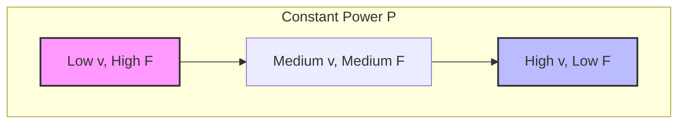
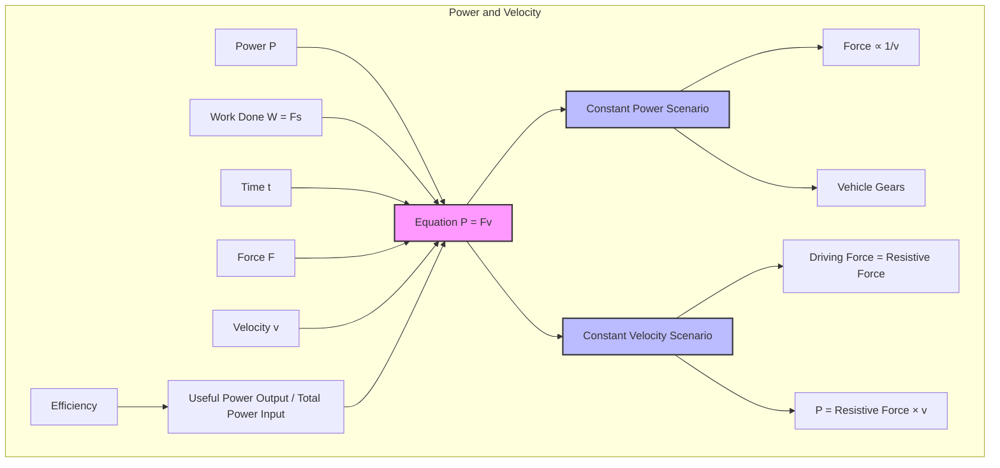

# Power and Velocity / 功率与速度

---

# 1. Overview / 概述

**English:**
This sub-topic explores the direct relationship between power, force, and velocity. It answers the question: *If a constant force moves an object at constant velocity, what is the power required?* This is a foundational concept in mechanics, bridging [[Work Done by a Force]] with the rate of energy transfer. Understanding $P = Fv$ allows you to calculate the power needed for vehicles to maintain speed against resistive forces, or the power output of an engine. It is a key application of the definition of power, linking directly to [[Definition of Power]] and [[Efficiency of Energy Transfers]].

**中文:**
本子知识点探讨功率、力和速度之间的直接关系。它回答了一个问题：*如果一个恒力使物体以恒定速度运动，所需的功率是多少？* 这是力学中的一个基础概念，连接了[[Work Done by a Force / 力做的功]]与能量传递的速率。理解 $P = Fv$ 可以让你计算车辆克服阻力维持速度所需的功率，或发动机的功率输出。它是功率定义的关键应用，直接联系到[[Definition of Power / 功率的定义]]和[[Efficiency of Energy Transfers / 能量传递的效率]]。

---

# 2. Syllabus Learning Objectives / 考纲学习目标

| CAIE 9702 (3.3 h-k) | Edexcel IAL (WPH11 U1: 4.12-4.15) |
|-----------|-------------|
| Derive and use the equation $P = Fv$ for a constant force and constant velocity. | Derive the relationship $P = Fv$ from the definition of work done and power. |
| Apply $P = Fv$ to solve problems involving vehicles, engines, and resistive forces. | Apply $P = Fv$ to calculate the power required to maintain constant speed against resistive forces. |
| Understand that for a constant power output, the driving force is inversely proportional to velocity. | Understand the relationship between driving force, resistive forces, and acceleration when power is constant. |

**Examiner Expectations / 考官期望:**
- **EN:** You must be able to derive $P = Fv$ from $P = \frac{W}{t}$ and $W = Fs$. You must apply it to situations where an object moves at constant velocity against a resistive force (e.g., air resistance, friction). You must also understand the inverse relationship between force and velocity for a constant power source.
- **CN:** 你必须能够从 $P = \frac{W}{t}$ 和 $W = Fs$ 推导出 $P = Fv$。你必须将其应用于物体以恒定速度克服阻力（例如空气阻力、摩擦力）运动的情况。你还必须理解对于恒定功率源，力与速度成反比的关系。

---

# 3. Core Definitions / 核心定义

| Term (EN/CN) | Definition (EN) | Definition (CN) | Common Mistakes / 常见错误 |
|--------------|-----------------|-----------------|---------------------------|
| **Power** / 功率 | The rate at which work is done or energy is transferred. | 做功或能量传递的速率。 | Confusing power with force or energy. |
| **Velocity** / 速度 | The rate of change of displacement; a vector quantity. | 位移的变化率；矢量。 | Using speed instead of velocity when direction matters. |
| **Driving Force** / 驱动力 | The forward force provided by an engine or motor to propel an object. | 由发动机或马达提供的推动物体前进的力。 | Forgetting that at constant velocity, driving force equals total resistive force. |
| **Resistive Force** / 阻力 | The total force opposing the motion of an object (e.g., friction, air resistance). | 阻碍物体运动的总力（例如摩擦力、空气阻力）。 | Assuming resistive forces are constant; they often depend on velocity. |
| **Constant Velocity** / 恒定速度 | Motion where speed and direction do not change; net force is zero. | 速度和方向都不变的运动；合力为零。 | Applying $P = Fv$ when the object is accelerating without considering changing forces. |

---

# 4. Key Concepts Explained / 关键概念详解

## 4.1 Derivation of $P = Fv$ / $P = Fv$ 的推导

### Explanation / 解释
**English:**
The relationship $P = Fv$ is derived directly from the definitions of work and power.
1.  **Work Done:** $W = Fs$ (for a constant force $F$ acting over a displacement $s$ in the direction of the force).
2.  **Power:** $P = \frac{W}{t}$ (rate of doing work).
3.  **Substitute:** $P = \frac{Fs}{t}$.
4.  **Velocity:** Since $v = \frac{s}{t}$ (for constant velocity), we get $P = Fv$.

This equation is only valid when the force $F$ is constant and the velocity $v$ is constant (or instantaneous). It tells us that the power required to move an object is the product of the force needed and the speed at which it moves.

**中文:**
关系式 $P = Fv$ 直接从功和功率的定义推导出来。
1.  **做功:** $W = Fs$（恒力 $F$ 沿力的方向作用在位移 $s$ 上）。
2.  **功率:** $P = \frac{W}{t}$（做功的速率）。
3.  **代入:** $P = \frac{Fs}{t}$。
4.  **速度:** 由于 $v = \frac{s}{t}$（对于恒定速度），我们得到 $P = Fv$。

这个方程仅在力 $F$ 恒定且速度 $v$ 恒定（或瞬时）时有效。它告诉我们，移动物体所需的功率是所需力与其移动速度的乘积。

### Physical Meaning / 物理意义
**English:**
$P = Fv$ shows that for a given power output, a large force can only be achieved at a low speed, and a high speed can only be achieved with a small force. This explains why vehicles have gears: a low gear provides a large driving force for climbing hills (low speed, high force), while a high gear allows for high speed on flat roads (high speed, low force).

**中文:**
$P = Fv$ 表明，对于给定的功率输出，只有在低速时才能获得大的力，而只有在力小时才能获得高速。这解释了为什么车辆有档位：低档位提供大的驱动力用于爬坡（低速，大力），而高档位允许在平路上高速行驶（高速，小力）。

### Common Misconceptions / 常见误区
- **EN:** Thinking $P = Fv$ applies only when the object is accelerating. It is most commonly used for *constant velocity* situations where net force is zero.
- **CN:** 认为 $P = Fv$ 仅适用于物体加速时。它最常用于*恒定速度*的情况，此时合力为零。
- **EN:** Forgetting that $F$ in $P = Fv$ is the force *in the direction of motion*. If the force is at an angle, use $P = Fv \cos \theta$.
- **CN:** 忘记 $P = Fv$ 中的 $F$ 是*沿运动方向*的力。如果力有角度，使用 $P = Fv \cos \theta$。

### Exam Tips / 考试提示
- **EN:** When a vehicle moves at constant speed, the driving force equals the total resistive force. Therefore, $P = F_{drive} v = F_{resistive} v$.
- **CN:** 当车辆匀速行驶时，驱动力等于总阻力。因此，$P = F_{drive} v = F_{resistive} v$。
- **EN:** If power is constant and velocity increases, the driving force must decrease. This is a common graph question.
- **CN:** 如果功率恒定且速度增加，则驱动力必须减小。这是一个常见的图表题。

> 📷 **IMAGE PROMPT — PWR-VEL-01: Derivation of P = Fv**
> A step-by-step visual derivation. Start with a box being pushed by a force F over a distance s. Show the work done W = Fs. Then show a clock ticking time t. Finally, combine to show P = W/t = Fs/t = Fv. Use clear arrows and labels.

---

# 5. Essential Equations / 核心公式

## Equation 1: Power and Velocity / 功率与速度

$$ P = Fv $$

| Symbol (符号) | Meaning (EN) | Meaning (CN) | Unit (单位) |
|--------------|-------------|-------------|------------|
| $P$ | Power | 功率 | W (Watts) |
| $F$ | Force (in direction of motion) | 力（沿运动方向） | N (Newtons) |
| $v$ | Velocity (constant or instantaneous) | 速度（恒定或瞬时） | m s$^{-1}$ |

**Derivation / 推导:**
$$ P = \frac{W}{t} = \frac{Fs}{t} = F \left( \frac{s}{t} \right) = Fv $$

**Conditions / 适用条件:**
- **EN:** Force $F$ must be constant and in the direction of motion. Velocity $v$ must be constant for average power, or instantaneous for instantaneous power.
- **CN:** 力 $F$ 必须恒定且沿运动方向。对于平均功率，速度 $v$ 必须恒定；对于瞬时功率，速度 $v$ 为瞬时速度。

**Limitations / 局限性:**
- **EN:** Does not apply directly if the force varies with time or position, unless using calculus ($P = \frac{dW}{dt} = F \frac{ds}{dt} = Fv$ for instantaneous power).
- **CN:** 如果力随时间或位置变化，则不能直接应用，除非使用微积分（对于瞬时功率，$P = \frac{dW}{dt} = F \frac{ds}{dt} = Fv$）。

## Equation 2: Power with Angle / 带角度的功率

$$ P = Fv \cos \theta $$

| Symbol (符号) | Meaning (EN) | Meaning (CN) | Unit (单位) |
|--------------|-------------|-------------|------------|
| $\theta$ | Angle between force and velocity | 力与速度之间的夹角 | degrees or radians |

**Conditions / 适用条件:**
- **EN:** Use when the force is not parallel to the velocity. Only the component of force in the direction of velocity does work.
- **CN:** 当力不与速度平行时使用。只有沿速度方向的力分量做功。

---

# 6. Graphs and Relationships / 图表与关系

## 6.1 Driving Force vs. Velocity (Constant Power) / 驱动力-速度图（恒定功率）

### Axes / 坐标轴
- **X-axis:** Velocity $v$ / 速度 $v$ (m s$^{-1}$)
- **Y-axis:** Driving Force $F$ / 驱动力 $F$ (N)

### Shape / 形状
- **EN:** A rectangular hyperbola. As velocity increases, driving force decreases proportionally ($F = P/v$).
- **CN:** 一条等轴双曲线。随着速度增加，驱动力成比例减小 ($F = P/v$)。

### Gradient Meaning / 斜率含义
- **EN:** The gradient is not constant. It represents $-\frac{P}{v^2}$, which is not a standard physical quantity.
- **CN:** 斜率不是常数。它代表 $-\frac{P}{v^2}$，这不是一个标准的物理量。

### Area Meaning / 面积含义
- **EN:** The area under the curve is not physically meaningful in this graph. However, the product $F \times v$ at any point equals the constant power $P$.
- **CN:** 该曲线下的面积没有物理意义。然而，任意点的乘积 $F \times v$ 等于恒定功率 $P$。

### Exam Interpretation / 考试解读
- **EN:** You may be asked to sketch this graph. Remember it is a smooth curve that approaches both axes asymptotically. A common question is: "A car engine provides constant power. Explain why the maximum driving force is at low speeds."
- **CN:** 你可能会被要求画出这个草图。记住它是一条平滑的曲线，渐近地接近两个坐标轴。一个常见的问题是："汽车发动机提供恒定功率。解释为什么最大驱动力出现在低速时。"

> 📷 **IMAGE PROMPT — PWR-VEL-02: Force vs Velocity Graph (Constant Power)**
> A graph with velocity on the x-axis and force on the y-axis. A smooth curve (rectangular hyperbola) is drawn. Label the curve "P = constant". Mark a point at low velocity showing high force, and a point at high velocity showing low force. Add asymptotes along both axes.

---

# 7. Required Diagrams / 必备图表

## 7.1 Forces on a Vehicle Moving at Constant Velocity / 匀速行驶车辆上的力

### Description / 描述
- **EN:** A free-body diagram of a car moving to the right at constant velocity. The driving force from the engine (forward) is balanced by the total resistive force (backward). The weight (down) is balanced by the normal reaction force (up).
- **CN:** 一辆汽车以恒定速度向右行驶的受力图。来自发动机的驱动力（向前）与总阻力（向后）平衡。重力（向下）与法向反作用力（向上）平衡。

### Image Prompt / 图片生成提示
> 📷 **IMAGE PROMPT — PWR-VEL-03: Forces on a Car at Constant Velocity**
> A simple side-view diagram of a car. Four arrows: a long rightward arrow labeled "Driving Force F" from the wheels, a long leftward arrow labeled "Resistive Force R" (air resistance + friction), a downward arrow labeled "Weight W", and an upward arrow labeled "Normal Reaction N". The lengths of F and R are equal; the lengths of W and N are equal. Add a note: "Constant velocity => Net force = 0".

### Labels Required / 需要标注
- **EN:** Driving Force $F$, Resistive Force $R$, Weight $W$, Normal Reaction $N$, Direction of motion $v$.
- **CN:** 驱动力 $F$，阻力 $R$，重力 $W$，法向反作用力 $N$，运动方向 $v$。

### Exam Importance / 考试重要性
- **EN:** Essential for applying $P = Fv$. At constant velocity, $F = R$, so $P = Rv$. This is the most common exam scenario.
- **CN:** 对于应用 $P = Fv$ 至关重要。在恒定速度下，$F = R$，所以 $P = Rv$。这是最常见的考试场景。

---

# 8. Worked Examples / 典型例题

## Example 1: Power Required to Overcome Resistance / 克服阻力所需的功率

### Question / 题目
**English:**
A car travels at a constant speed of 25 m s$^{-1}$ on a horizontal road. The total resistive force acting on the car is 800 N. Calculate the power output of the car's engine.

**中文:**
一辆汽车在水平道路上以 25 m s$^{-1}$ 的恒定速度行驶。作用在汽车上的总阻力为 800 N。计算汽车发动机的功率输出。

### Solution / 解答
**Step 1:** Identify known quantities.
- Velocity, $v = 25$ m s$^{-1}$
- Resistive force, $R = 800$ N
- Since velocity is constant, driving force $F = R = 800$ N.

**Step 2:** Apply the equation $P = Fv$.
$$ P = (800 \text{ N}) \times (25 \text{ m s}^{-1}) $$

**Step 3:** Calculate.
$$ P = 20000 \text{ W} = 20 \text{ kW} $$

### Final Answer / 最终答案
**Answer:** 20 kW | **答案：** 20 千瓦

### Quick Tip / 提示
- **EN:** Always check if the velocity is constant. If it is, the net force is zero, so the driving force equals the resistive force.
- **CN:** 始终检查速度是否恒定。如果是，则合力为零，因此驱动力等于阻力。

---

## Example 2: Force from Constant Power / 恒定功率下的力

### Question / 题目
**English:**
A boat's engine provides a constant power of 60 kW. When the boat is moving at a speed of 12 m s$^{-1}$, what is the driving force from the propeller? If the boat slows down to 4 m s$^{-1}$, what is the new driving force?

**中文:**
一艘船的发动机提供 60 kW 的恒定功率。当船以 12 m s$^{-1}$ 的速度行驶时，螺旋桨提供的驱动力是多少？如果船减速到 4 m s$^{-1}$，新的驱动力是多少？

### Solution / 解答
**Part 1: At $v = 12$ m s$^{-1}$**
$$ P = Fv \implies F = \frac{P}{v} = \frac{60000 \text{ W}}{12 \text{ m s}^{-1}} = 5000 \text{ N} $$

**Part 2: At $v = 4$ m s$^{-1}$**
$$ F = \frac{P}{v} = \frac{60000 \text{ W}}{4 \text{ m s}^{-1}} = 15000 \text{ N} $$

### Final Answer / 最终答案
**Answer:** At 12 m s$^{-1}$, $F = 5000$ N. At 4 m s$^{-1}$, $F = 15000$ N. | **答案：** 在 12 m s$^{-1}$ 时，$F = 5000$ N。在 4 m s$^{-1}$ 时，$F = 15000$ N。

### Quick Tip / 提示
- **EN:** For constant power, force and velocity are inversely proportional. Halving the speed doubles the force.
- **CN:** 对于恒定功率，力和速度成反比。速度减半，力加倍。

---

# 9. Past Paper Question Types / 历年真题题型

| Question Type / 题型 | Frequency / 频率 | Difficulty / 难度 | Past Paper References / 真题索引 |
|----------------------|------------------|------------------|-------------------------------|
| Direct calculation of power from force and velocity | High | Easy | 📝 *待填入* |
| Calculation of driving force or resistive force from power and velocity | High | Easy | 📝 *待填入* |
| Derivation of $P = Fv$ | Medium | Medium | 📝 *待填入* |
| Graph interpretation (force vs. velocity for constant power) | Medium | Medium | 📝 *待填入* |
| Multi-step problem involving efficiency and $P = Fv$ | Low | Hard | 📝 *待填入* |

**Common Command Words / 常见指令词:**
- **EN:** Calculate, Derive, Show that, Explain, Sketch, Determine.
- **CN:** 计算，推导，证明，解释，画出，确定。

---

# 10. Practical Skills Connections / 实验技能链接

**English:**
This sub-topic connects to practical work involving:
- **Measuring Power of a Motor:** Use a motor to lift a mass at constant speed. Measure the force (weight of mass) and the velocity (height/time). Calculate power using $P = Fv$. Compare to electrical power input ($P = IV$) to find efficiency.
- **Investigating Resistive Forces:** Use a dynamics trolley and a data logger to measure velocity. Apply a known force (e.g., from a falling mass) and measure the terminal velocity. Use $P = Fv$ to analyze power transfer.
- **Uncertainties:** When measuring velocity, consider the uncertainty in distance and time measurements. Propagate these to find the uncertainty in calculated power.

**中文:**
本子知识点与涉及以下内容的实验工作相关：
- **测量马达的功率：** 使用马达以恒定速度提升重物。测量力（重物的重量）和速度（高度/时间）。使用 $P = Fv$ 计算功率。与电功率输入 ($P = IV$) 比较以求出效率。
- **研究阻力：** 使用动力学小车和数据记录器测量速度。施加已知力（例如，来自下落的重物）并测量终端速度。使用 $P = Fv$ 分析功率传递。
- **不确定度：** 测量速度时，考虑距离和时间测量的不确定度。将这些不确定度传播以找到计算功率的不确定度。

---

# 11. Concept Map / 概念图谱

---

# 12. Quick Revision Sheet / 速查表

| Category / 类别 | Key Points / 要点 |
|----------------|------------------|
| Definition / 定义 | Power is the rate of doing work. $P = Fv$ links power, force, and velocity. / 功率是做功的速率。$P = Fv$ 连接了功率、力和速度。 |
| Key Formula / 核心公式 | $P = Fv$ (force in direction of motion, constant or instantaneous velocity) / $P = Fv$（力沿运动方向，速度恒定或瞬时） |
| Key Graph / 核心图表 | Force vs. Velocity for constant power: rectangular hyperbola. / 恒定功率下的力-速度图：等轴双曲线。 |
| Exam Tip / 考试提示 | At constant velocity, net force = 0, so driving force = resistive force. Use $P = F_{resistive} v$. / 在恒定速度下，合力 = 0，所以驱动力 = 阻力。使用 $P = F_{阻力} v$。 |
| Common Mistake / 常见错误 | Applying $P = Fv$ when the force is not in the direction of motion without using $\cos \theta$. / 当力不沿运动方向时，未使用 $\cos \theta$ 就应用 $P = Fv$。 |
| Derivation / 推导 | $P = \frac{W}{t} = \frac{Fs}{t} = Fv$ |