# 1. Overview / 概述

**English:** Work Done by a Force is a foundational concept in mechanics that quantifies the energy transferred when a force causes displacement. It bridges Newton's Laws of motion with energy conservation principles. In both CAIE 9702 and Edexcel IAL, this topic is essential for understanding [[Kinetic Energy and Potential Energy]], power, and efficiency. Real-world applications include calculating the energy required to lift objects, push vehicles, or compress springs. This concept is the gateway to the Work-Energy Principle, which simplifies complex motion problems without needing to analyze forces directly.

**中文:** 力做功是力学中的基础概念，用于量化力使物体发生位移时传递的能量。它连接了[[牛顿运动定律]]与能量守恒原理。在CAIE 9702和Edexcel IAL中，该主题是理解[[动能与势能]]、功率和效率的关键。实际应用包括计算提升物体、推动车辆或压缩弹簧所需的能量。该概念是功能原理的入门，无需直接分析力即可简化复杂的运动问题。

> 📷 **IMAGE PROMPT — WDO-OVERVIEW: Real-World Work Examples**
> A collage showing three scenarios: (1) a person lifting a box vertically (work against gravity), (2) a car being pushed horizontally (work against friction), (3) a spring being compressed (work stored as elastic potential energy). Labels: "Work = Force × Displacement × cosθ". Style: Clean educational infographic with arrows showing force and displacement vectors. Exam importance: High — establishes conceptual foundation.

# 2. Syllabus Learning Objectives / 考纲学习目标

| CAIE 9702 (3.3 a-b) | Edexcel IAL (WPH11 U1: 4.1-4.4) |
|:---|:---|
| Define work done by a force | Define work done by a constant force |
| Calculate work done using $W = Fs\cos\theta$ | Calculate work done using $W = Fs\cos\theta$ |
| Interpret [[Force-Displacement Graphs]] | Interpret [[Force-Displacement Graphs]] |
| Apply work done to inclined planes | Apply work done to variable forces |

**Examiner Expectations / 考官期望:**
- **English:** Candidates must use the correct definition: work is done when a force moves its point of application in the direction of the force. The scalar product $W = \vec{F} \cdot \vec{s}$ is expected. For [[Force-Displacement Graphs]], the area under the graph represents work done. Common errors include using the wrong angle (θ between force and displacement, not the horizontal).
- **中文:** 考生必须使用正确定义：当力使其作用点沿力的方向移动时做功。标量积 $W = \vec{F} \cdot \vec{s}$ 是预期的。对于[[力-位移图]]，图下的面积表示做功。常见错误包括使用错误的角度（θ是力与位移之间的夹角，而非水平夹角）。

> 📋 **CIE Only:** CAIE specifically requires understanding that work done against gravity is $mgh$, and work done against friction is dissipated as thermal energy.
> 📋 **Edexcel Only:** Edexcel emphasizes the distinction between constant and variable forces, requiring interpretation of [[Force-Displacement Graphs]] for non-uniform forces.

# 3. Core Definitions / 核心定义

| Term (EN/CN) | Definition (EN) | Definition (CN) | Common Mistakes / 常见错误 |
|:---|:---|:---|:---|
| **Work Done / 做功** | The product of force and the displacement in the direction of the force. Scalar quantity. | 力与沿力方向位移的乘积。标量。 | Confusing work with energy; work is energy transfer, not stored energy. |
| **[[Definition of Work]] / 功的定义** | Work is done when a force moves its point of application. | 当力使其作用点移动时做功。 | Saying "work is force times distance" without considering direction. |
| **Displacement / 位移** | The straight-line distance from start to finish in a specific direction. Vector quantity. | 从起点到终点的直线距离，具有特定方向。矢量。 | Using distance instead of displacement; work depends on displacement, not path length. |
| **Force Component / 力的分量** | The component of force parallel to displacement: $F\cos\theta$ | 力平行于位移的分量：$F\cos\theta$ | Using $F\sin\theta$ instead of $F\cos\theta$ for the parallel component. |
| **[[Force-Displacement Graphs]] / 力-位移图** | A graph with force on y-axis and displacement on x-axis; area = work done. | 纵轴为力、横轴为位移的图；面积=做功。 | Forgetting that area only represents work if force is plotted against displacement in the direction of force. |
| **Scalar Product / 标量积** | The dot product of two vectors: $\vec{F} \cdot \vec{s} = Fs\cos\theta$ | 两个矢量的点积：$\vec{F} \cdot \vec{s} = Fs\cos\theta$ | Treating work as a vector; work is a scalar. |

# 4. Key Concepts Explained / 关键概念详解

## 4.1 The Definition of Work / 功的定义

### Explanation / 解释
**English:** Work done by a force is defined as the product of the force and the displacement of its point of application in the direction of the force. Mathematically: $W = \vec{F} \cdot \vec{s} = Fs\cos\theta$, where $\theta$ is the angle between the force vector and the displacement vector. Work is a [[Scalars and Vectors|scalar]] quantity measured in joules (J). One joule is the work done when a force of 1 N moves its point of application by 1 m in the direction of the force.

**中文:** 力做功定义为力与其作用点沿力方向位移的乘积。数学表达式：$W = \vec{F} \cdot \vec{s} = Fs\cos\theta$，其中$\theta$是力矢量与位移矢量之间的夹角。功是[[标量与矢量|标量]]，单位为焦耳(J)。1焦耳是1N的力使其作用点沿力方向移动1m所做的功。

### Physical Meaning / 物理意义
**English:** Work quantifies energy transfer. When positive work is done on an object, energy is transferred to the object (e.g., increasing its [[Kinetic Energy and Potential Energy|kinetic energy]]). When negative work is done, energy is transferred away from the object (e.g., friction removing kinetic energy). Zero work occurs when force is perpendicular to displacement (e.g., centripetal force).

**中文:** 功量化了能量传递。当对物体做正功时，能量传递给物体（例如增加其[[动能与势能|动能]]）。当做负功时，能量从物体转移出去（例如摩擦力消耗动能）。当力垂直于位移时做功为零（例如向心力）。

### Common Misconceptions / 常见误区
- **"Work depends on time"** — Work is independent of time; power relates work to time.
- **"No displacement means no work"** — Correct! If an object doesn't move, no work is done regardless of force applied.
- **"Work is a vector"** — Work is a scalar; direction is not associated with work values.
- **"Work done = force × distance traveled"** — Incorrect; work uses displacement, not total distance.

### Exam Tips / 考试提示
**English:** Always draw a free-body diagram showing force and displacement vectors. Identify the angle between them carefully. For inclined plane problems, resolve forces parallel and perpendicular to displacement. Remember: work done against gravity = $mgh$ regardless of path taken.

**中文:** 始终画出显示力和位移矢量的受力图。仔细识别它们之间的夹角。对于斜面问题，将力分解为平行和垂直于位移的分量。记住：克服重力做功 = $mgh$，与路径无关。

> 📷 **IMAGE PROMPT — WDO-ANGLE: Work at an Angle**
> A diagram showing a force vector F at angle θ to displacement vector s. Dashed lines show Fcosθ (parallel component) and Fsinθ (perpendicular component). Labels: "Fcosθ does work", "Fsinθ does NO work". Style: Clean vector diagram with color-coded components. Exam importance: Very High — fundamental to solving work problems.

## 4.2 Work Done at an Angle / 力与位移成角度时的做功

### Explanation / 解释
**English:** When a force is applied at an angle to the displacement, only the component of force parallel to the displacement does work. The perpendicular component does zero work. The general equation $W = Fs\cos\theta$ accounts for this. Special cases:
- $\theta = 0°$: $W = Fs$ (maximum positive work)
- $\theta = 90°$: $W = 0$ (no work)
- $\theta = 180°$: $W = -Fs$ (maximum negative work)

**中文:** 当力与位移成角度时，只有平行于位移的力分量做功。垂直分量做功为零。通用方程 $W = Fs\cos\theta$ 考虑了这一点。特殊情况：
- $\theta = 0°$：$W = Fs$（最大正功）
- $\theta = 90°$：$W = 0$（不做功）
- $\theta = 180°$：$W = -Fs$（最大负功）

### Physical Meaning / 物理意义
**English:** The angle determines whether work is positive (energy added), negative (energy removed), or zero. This explains why holding a heavy object stationary does no work (no displacement), and why walking horizontally while carrying an object does no work on the object (force is vertical, displacement is horizontal).

**中文:** 角度决定了功是正（能量增加）、负（能量减少）还是零。这解释了为什么静止举着重物不做功（无位移），以及为什么水平行走时携带物体对物体不做功（力垂直，位移水平）。

### Common Misconceptions / 常见误区
- **"θ is the angle from horizontal"** — θ is the angle between force and displacement vectors, not necessarily from horizontal.
- **"More force always means more work"** — If force is perpendicular to displacement, even large forces do zero work.
- **"Negative work means work is destroyed"** — Negative work means energy is transferred away from the object, not destroyed.

### Exam Tips / 考试提示
**English:** When calculating work on an inclined plane: (1) Identify the force doing work, (2) Find displacement direction, (3) Determine angle between them, (4) Apply $W = Fs\cos\theta$. For friction, work is always negative as friction opposes motion.

**中文:** 计算斜面上的做功时：(1) 确定做功的力，(2) 找到位移方向，(3) 确定它们之间的夹角，(4) 应用 $W = Fs\cos\theta$。对于摩擦力，做功总是负的，因为摩擦力阻碍运动。

## 4.3 Force-Displacement Graphs / 力-位移图

### Explanation / 解释
**English:** A [[Force-Displacement Graphs|force-displacement graph]] plots force (y-axis) against displacement (x-axis). The area under the graph represents the work done by the force. For constant forces, the area is rectangular. For variable forces, the area is found by integration or counting squares. This is particularly useful for:
- Springs (Hooke's Law: $F = kx$)
- Non-uniform forces
- Finding total work from varying forces

**中文:** [[力-位移图]]以力为纵轴、位移为横轴作图。图下的面积表示力所做的功。对于恒力，面积为矩形。对于变力，通过积分或数方格求面积。这对于以下情况特别有用：
- 弹簧（胡克定律：$F = kx$）
- 非均匀力
- 从变化力中求总功

### Physical Meaning / 物理意义
**English:** The graph provides a visual representation of how force changes with displacement. The area interpretation comes from the definition of work as the integral of force with respect to displacement: $W = \int F \, ds$. For a spring, the triangular area gives $W = \frac{1}{2}kx^2$, which equals the elastic potential energy stored.

**中文:** 该图提供了力随位移变化的可视化表示。面积的解释源于功的定义，即力对位移的积分：$W = \int F \, ds$。对于弹簧，三角形面积给出 $W = \frac{1}{2}kx^2$，等于储存的弹性势能。

### Common Misconceptions / 常见误区
- **"Area under any force graph gives work"** — Only if the graph is force vs. displacement in the direction of force.
- **"Gradient of F-x graph gives work"** — Gradient gives rate of change of force with displacement, not work.
- **"Area above and below axis cancel"** — They represent positive and negative work; net work is the algebraic sum.

### Exam Tips / 考试提示
**English:** For [[Force-Displacement Graphs]]:
- Constant force: rectangle area = $F \times s$
- Linear force (spring): triangle area = $\frac{1}{2} \times \text{base} \times \text{height}$
- Curved force: count squares or use integration
- Always check units: area units = N × m = J (joules)

**中文:** 对于[[力-位移图]]：
- 恒力：矩形面积 = $F \times s$
- 线性力（弹簧）：三角形面积 = $\frac{1}{2} \times \text{底} \times \text{高}$
- 曲线力：数方格或使用积分
- 始终检查单位：面积单位 = N × m = J（焦耳）

> 📷 **IMAGE PROMPT — WDO-FDGRAPH: Force-Displacement Graph Types**
> Three force-displacement graphs side by side: (1) Constant force (horizontal line) with shaded rectangle, (2) Linear spring force (diagonal line through origin) with shaded triangle, (3) Variable force (curve) with shaded area under curve. Labels: "Area = Work Done", "Constant F: W = Fs", "Spring: W = ½kx²", "Variable F: W = ∫F ds". Style: Clean graphs with gridlines and shaded regions. Exam importance: Very High — common exam question type.

# 5. Essential Equations / 核心公式

## 5.1 Work Done by a Constant Force / 恒力做功

$$ W = \vec{F} \cdot \vec{s} = Fs\cos\theta $$

| Symbol (符号) | Meaning (EN/CN) | Unit (单位) |
|:---|:---|:---|
| $W$ | Work done / 做功 | J (joule / 焦耳) |
| $F$ | Magnitude of force / 力的大小 | N (newton / 牛顿) |
| $s$ | Magnitude of displacement / 位移的大小 | m (metre / 米) |
| $\theta$ | Angle between force and displacement vectors / 力与位移矢量之间的夹角 | degrees or radians / 度或弧度 |

**Derivation / 推导:** From the definition: work = force component parallel to displacement × displacement. The parallel component is $F\cos\theta$, so $W = (F\cos\theta) \times s = Fs\cos\theta$.

**Conditions / 适用条件:** Force must be constant. For variable forces, use integration or [[Force-Displacement Graphs]].

**Limitations / 局限性:** Does not account for energy dissipated as heat or sound. Work done against friction is converted to thermal energy.

**Rearrangements / 变形:**
- $F = \frac{W}{s\cos\theta}$ (if $\theta$ known)
- $s = \frac{W}{F\cos\theta}$
- $\cos\theta = \frac{W}{Fs}$

## 5.2 Work Done Against Gravity / 克服重力做功

$$ W = mgh $$

| Symbol (符号) | Meaning (EN/CN) | Unit (单位) |
|:---|:---|:---|
| $m$ | Mass / 质量 | kg |
| $g$ | Acceleration due to gravity / 重力加速度 | m s⁻² |
| $h$ | Vertical height gained / 垂直上升高度 | m |

**Derivation / 推导:** Force needed to lift against gravity = $mg$ (upward). Displacement = $h$ (vertical). Angle between force and displacement = 0°, so $\cos 0° = 1$. Thus $W = (mg)(h)(1) = mgh$.

**Conditions / 适用条件:** Only valid for lifting against gravity near Earth's surface where $g$ is constant. Independent of path taken — only vertical height matters.

**Limitations / 局限性:** Does not account for air resistance or other forces. For large heights, $g$ varies and this equation is not accurate.

**Rearrangements / 变形:**
- $m = \frac{W}{gh}$
- $h = \frac{W}{mg}$
- $g = \frac{W}{mh}$

## 5.3 Work Done by a Spring (Hooke's Law) / 弹簧做功（胡克定律）

$$ W = \frac{1}{2}kx^2 $$

| Symbol (符号) | Meaning (EN/CN) | Unit (单位) |
|:---|:---|:---|
| $W$ | Work done on spring / 对弹簧做功 | J |
| $k$ | Spring constant / 弹簧常数 | N m⁻¹ |
| $x$ | Extension or compression from natural length / 从自然长度的伸长或压缩 | m |

**Derivation / 推导:** From Hooke's Law: $F = kx$. Work = area under F-x graph = $\frac{1}{2} \times \text{base} \times \text{height} = \frac{1}{2} \times x \times (kx) = \frac{1}{2}kx^2$.

**Conditions / 适用条件:** Spring obeys Hooke's Law (elastic limit not exceeded). Force varies linearly with extension.

**Limitations / 局限性:** Only valid within elastic limit. Does not account for plastic deformation.

**Rearrangements / 变形:**
- $k = \frac{2W}{x^2}$
- $x = \sqrt{\frac{2W}{k}}$

# 6. Graphs and Relationships / 图表与关系

## 6.1 Force-Displacement Graph for Constant Force / 恒力的力-位移图

**Axes / 坐标轴:** Y-axis: Force $F$ (N); X-axis: Displacement $s$ (m)

**Shape / 形状:** Horizontal straight line at $y = F$

**Gradient Meaning / 梯度含义:** Zero gradient — force is constant with displacement.

**Area Meaning / 面积含义:** Area under graph = $F \times s = W$ (work done). This is a rectangle.

**Exam Interpretation / 考试解读:** For constant forces, work is simply force × displacement. The graph confirms this visually.

**Common Questions / 常见问题:**
- Calculate work from area of rectangle
- Compare work for different constant forces
- Determine displacement given work and force

> 📷 **IMAGE PROMPT — WDO-CONSTANTF: Constant Force F-s Graph**
> A graph with force (N) on y-axis and displacement (m) on x-axis. A horizontal line at F = 10 N from s = 0 to s = 5 m. The rectangular area is shaded and labeled "Area = 10 × 5 = 50 J". Style: Clean graph with gridlines, shaded region, and calculation shown. Exam importance: High — basic interpretation.

## 6.2 Force-Displacement Graph for Spring (Hooke's Law) / 弹簧的力-位移图（胡克定律）

**Axes / 坐标轴:** Y-axis: Force $F$ (N); X-axis: Extension $x$ (m)

**Shape / 形状:** Straight line through origin with gradient $k$

**Gradient Meaning / 梯度含义:** Gradient = spring constant $k$ (N m⁻¹). Steeper gradient = stiffer spring.

**Area Meaning / 面积含义:** Area under graph = $\frac{1}{2} \times x \times (kx) = \frac{1}{2}kx^2 = W$ (work done on spring = elastic potential energy stored).

**Exam Interpretation / 考试解读:** The triangular area represents the energy stored in the spring. This is a key link between work and [[Kinetic Energy and Potential Energy|potential energy]].

**Common Questions / 常见问题:**
- Calculate work from area of triangle
- Find spring constant from gradient
- Determine extension given work and spring constant
- Compare work for different springs

> 📷 **IMAGE PROMPT — WDO-SPRING: Spring Force-Extension Graph**
> A graph with force (N) on y-axis and extension (m) on x-axis. A diagonal line through origin with gradient k. The triangular area is shaded and labeled "Area = ½kx² = Elastic PE". Labels: "Gradient = k (spring constant)", "Hooke's Law: F = kx". Style: Clean graph with gridlines, shaded triangle, and key labels. Exam importance: Very High — common exam question.

## 6.3 Force-Displacement Graph for Variable Force / 变力的力-位移图

**Axes / 坐标轴:** Y-axis: Force $F$ (N); X-axis: Displacement $s$ (m)

**Shape / 形状:** Any curve (could be increasing, decreasing, or complex)

**Gradient Meaning / 梯度含义:** Gradient = rate of change of force with displacement ($dF/ds$). Not directly related to work.

**Area Meaning / 面积含义:** Area under graph = $\int F \, ds = W$ (total work done). Found by counting squares or integration.

**Exam Interpretation / 考试解读:** For non-uniform forces, the area under the F-s graph always gives work. This is the most general method.

**Common Questions / 常见问题:**
- Estimate work by counting squares
- Compare work for different force profiles
- Determine average force from total work and displacement

> 📷 **IMAGE PROMPT — WDO-VARIABLEF: Variable Force F-s Graph**
> A graph with force (N) on y-axis and displacement (m) on x-axis. A curved line increasing then decreasing. The area under the curve is shaded and labeled "Area = ∫F ds = Work Done". Gridlines shown for square counting. Style: Clean graph with gridlines, shaded region, and integration notation. Exam importance: High — tests understanding of area interpretation.

# 7. Required Diagrams / 必备图表

## 7.1 Work Done at an Angle Diagram / 力与位移成角度做功图

> 📷 **IMAGE PROMPT — WDO-DIAG1: Work at an Angle**
> A diagram showing a block being pulled by a rope at angle θ to the horizontal. Force vector F shown at angle θ. Displacement vector s shown horizontally. Dashed lines show Fcosθ (horizontal component) and Fsinθ (vertical component). Labels: "Fcosθ — does work", "Fsinθ — does NO work", "W = Fs cosθ". Style: Clean vector diagram with color-coded components (blue for parallel, red for perpendicular). Exam importance: Very High — fundamental to understanding work.

## 7.2 Work Against Gravity on an Inclined Plane / 斜面上克服重力做功图

> 📷 **IMAGE PROMPT — WDO-DIAG2: Work on Inclined Plane**
> A diagram showing a block being pushed up an inclined plane at angle α. Forces shown: weight mg (vertical down), normal reaction N (perpendicular to plane), applied force F (parallel to plane up the slope). Displacement s shown along the plane. Vertical height h shown. Labels: "Work done against gravity = mgh", "Work done by applied force = Fs", "h = s sinα". Style: Clean physics diagram with force vectors and displacement arrow. Exam importance: Very High — common exam scenario.

## 7.3 Force-Displacement Graph for a Spring / 弹簧的力-位移图

> 📷 **IMAGE PROMPT — WDO-DIAG3: Spring F-x Graph**
> A graph with force (N) on y-axis and extension (m) on x-axis. A straight line through origin with gradient k. Triangular area shaded. Labels: "Gradient = k (spring constant)", "Area = ½kx² = Work done = Elastic PE", "Hooke's Law: F = kx". Below the graph, a diagram of a spring at natural length and extended by x. Style: Clean graph with gridlines, shaded triangle, and corresponding spring diagram. Exam importance: Very High — links work to elastic potential energy.

# 8. Worked Examples / 典型例题

## Example 1: Work Done at an Angle / 力与位移成角度做功

### Question / 题目
**English:** A box of mass 20 kg is pulled 5.0 m across a rough horizontal surface by a rope inclined at 30° to the horizontal. The tension in the rope is 50 N and the frictional force is 30 N. Calculate:
(a) The work done by the tension force
(b) The work done by the frictional force
(c) The net work done on the box

**中文:** 一个质量为20 kg的箱子被一根与水平面成30°角的绳子在粗糙水平面上拉动5.0 m。绳子张力为50 N，摩擦力为30 N。计算：
(a) 张力所做的功
(b) 摩擦力所做的功
(c) 对箱子所做的净功

### Image Prompt / 图片提示
> 📷 **IMAGE PROMPT — WDO-EX1: Box Pulled at Angle**
> A box on a rough surface. A rope attached to the box makes angle 30° with horizontal. Force vectors: Tension T = 50 N at 30°, Friction f = 30 N opposite to motion, Weight mg = 200 N down, Normal reaction N up. Displacement s = 5.0 m to the right. Labels: "T = 50 N, θ = 30°", "f = 30 N", "s = 5.0 m". Style: Clean free-body diagram with all forces and displacement arrow. Exam importance: Very High.

### Solution / 解答

**(a) Work done by tension / 张力做功**

**English:**
The angle between tension force and displacement is 30°.
$$W_T = Fs\cos\theta = 50 \times 5.0 \times \cos 30°$$
$$W_T = 50 \times 5.0 \times 0.866 = 216.5 \text{ J}$$

**中文:**
张力与位移之间的夹角为30°。
$$W_T = Fs\cos\theta = 50 \times 5.0 \times \cos 30°$$
$$W_T = 50 \times 5.0 \times 0.866 = 216.5 \text{ J}$$

**(b) Work done by friction / 摩擦力做功**

**English:**
Friction opposes motion, so angle between friction and displacement is 180°.
$$W_f = fs\cos 180° = 30 \times 5.0 \times (-1) = -150 \text{ J}$$

**中文:**
摩擦力阻碍运动，因此摩擦力与位移之间的夹角为180°。
$$W_f = fs\cos 180° = 30 \times 5.0 \times (-1) = -150 \text{ J}$$

**(c) Net work done / 净功**

**English:**
Net work = sum of all work done by individual forces.
$$W_{\text{net}} = W_T + W_f = 216.5 + (-150) = 66.5 \text{ J}$$

**中文:**
净功 = 所有力做功之和。
$$W_{\text{net}} = W_T + W_f = 216.5 + (-150) = 66.5 \text{ J}$$

### Final Answer / 最终答案
**English:**
(a) Work done by tension = 217 J (3 s.f.)
(b) Work done by friction = -150 J
(c) Net work done = 66.5 J

**中文:**
(a) 张力做功 = 217 J (3位有效数字)
(b) 摩擦力做功 = -150 J
(c) 净功 = 66.5 J

### Examiner Notes / 考官点评
**English:** 
- Common error: Using the full 50 N without resolving into components. Always use $F\cos\theta$.
- Common error: Forgetting the negative sign for friction work. Friction always does negative work when opposing motion.
- The net work (66.5 J) equals the change in kinetic energy of the box (Work-Energy Principle).
- Always state the angle between force and displacement explicitly in your working.

**中文:**
- 常见错误：使用完整的50 N而不分解为分量。始终使用 $F\cos\theta$。
- 常见错误：忘记摩擦力做功的负号。摩擦力阻碍运动时总是做负功。
- 净功（66.5 J）等于箱子动能的变化（功能原理）。
- 在计算中始终明确说明力与位移之间的夹角。

## Example 2: Work Done by a Spring / 弹簧做功

### Question / 题目
**English:** A spring of natural length 0.20 m has a spring constant of 500 N m⁻¹. It is stretched to a length of 0.35 m.
(a) Calculate the work done on the spring.
(b) If the spring is then stretched a further 0.10 m, calculate the additional work done.

**中文:** 一根自然长度为0.20 m的弹簧，弹簧常数为500 N m⁻¹。它被拉伸到0.35 m的长度。
(a) 计算对弹簧所做的功。
(b) 如果弹簧再被拉伸0.10 m，计算额外所做的功。

### Image Prompt / 图片提示
> 📷 **IMAGE PROMPT — WDO-EX2: Spring Stretching**
> Two diagrams of a spring: (1) Natural length 0.20 m with no force, (2) Stretched to 0.35 m with force F. Labels: "Natural length L₀ = 0.20 m", "Extension x₁ = 0.15 m", "Extension x₂ = 0.25 m". Force vectors shown on stretched springs. Style: Clean spring diagrams with dimensions labeled. Exam importance: High.

### Solution / 解答

**(a) Work done to stretch to 0.35 m / 拉伸到0.35 m所做的功**

**English:**
Extension $x_1 = 0.35 - 0.20 = 0.15$ m
$$W_1 = \frac{1}{2}kx_1^2 = \frac{1}{2} \times 500 \times (0.15)^2$$
$$W_1 = \frac{1}{2} \times 500 \times 0.0225 = 5.625 \text{ J}$$

**中文:**
伸长量 $x_1 = 0.35 - 0.20 = 0.15$ m
$$W_1 = \frac{1}{2}kx_1^2 = \frac{1}{2} \times 500 \times (0.15)^2$$
$$W_1 = \frac{1}{2} \times 500 \times 0.0225 = 5.625 \text{ J}$$

**(b) Additional work to stretch further / 额外拉伸所做的功**

**English:**
New extension $x_2 = 0.35 + 0.10 - 0.20 = 0.25$ m
Work done to reach $x_2$: $W_2 = \frac{1}{2}kx_2^2 = \frac{1}{2} \times 500 \times (0.25)^2 = 15.625$ J
Additional work = $W_2 - W_1 = 15.625 - 5.625 = 10.0$ J

**中文:**
新伸长量 $x_2 = 0.35 + 0.10 - 0.20 = 0.25$ m
达到 $x_2$ 所做的功：$W_2 = \frac{1}{2}kx_2^2 = \frac{1}{2} \times 500 \times (0.25)^2 = 15.625$ J
额外做功 = $W_2 - W_1 = 15.625 - 5.625 = 10.0$ J

### Final Answer / 最终答案
**English:**
(a) Work done = 5.63 J (3 s.f.)
(b) Additional work = 10.0 J

**中文:**
(a) 做功 = 5.63 J (3位有效数字)
(b) 额外做功 = 10.0 J

### Examiner Notes / 考官点评
**English:**
- Common error: Using total length instead of extension. Always subtract natural length.
- Common error: Calculating additional work as $\frac{1}{2}k(\Delta x)^2$ where $\Delta x = 0.10$ m. This is WRONG because work is not linear with extension.
- The correct method: find work at final extension, subtract work at initial extension.
- The additional work (10.0 J) is greater than the initial work (5.63 J) because force increases with extension.

**中文:**
- 常见错误：使用总长度而非伸长量。始终减去自然长度。
- 常见错误：将额外做功计算为 $\frac{1}{2}k(\Delta x)^2$，其中 $\Delta x = 0.10$ m。这是错误的，因为功与伸长量不是线性关系。
- 正确方法：求最终伸长量时的功，减去初始伸长量时的功。
- 额外做功（10.0 J）大于初始做功（5.63 J），因为力随伸长量增加而增大。

# 9. Past Paper Question Types / 历年真题题型

| Question Type / 题型 | Frequency / 频率 | Difficulty / 难度 | Past Paper References / 真题索引 |
|:---|:---|:---|:---|
| Calculate work done from force and displacement at an angle | Very High / 非常高 | Easy / 简单 | 📝 *待填入* |
| Work done against gravity on inclined plane | High / 高 | Medium / 中等 | 📝 *待填入* |
| Interpret [[Force-Displacement Graphs]] (area = work) | Very High / 非常高 | Medium / 中等 | 📝 *待填入* |
| Work done by/on a spring (Hooke's Law) | High / 高 | Medium / 中等 | 📝 *待填入* |
| Net work and Work-Energy Principle | High / 高 | Medium-Hard / 中难 | 📝 *待填入* |
| Work done by variable forces (graph area) | Medium / 中 | Hard / 困难 | 📝 *待填入* |
| Work done against friction | High / 高 | Easy-Medium / 简单-中等 | 📝 *待填入* |
| Comparison of work done in different scenarios | Medium / 中 | Medium / 中等 | 📝 *待填入* |

> 📝 **题库整理中 / Question Bank Under Construction:** 本表格中的真题索引正在整理中。建议参考CAIE 9702 Paper 2 (AS Level) 和 Edexcel IAL WPH11 Unit 1 的近年真题进行练习。This table's past paper references are being compiled. For practice, refer to recent CAIE 9702 Paper 2 (AS Level) and Edexcel IAL WPH11 Unit 1 past papers.

**Common Command Words / 常见指令词:**
- **Calculate / 计算:** Use formula $W = Fs\cos\theta$ or area under graph
- **Determine / 确定:** Find value using given data and relationships
- **State / 陈述:** Give definition or formula without derivation
- **Explain / 解释:** Provide reasoning with physics principles
- **Sketch / 绘制:** Draw approximate shape of graph with labels
- **Compare / 比较:** Discuss similarities and differences between scenarios

# 10. Practical Skills Connections / 实验技能链接

**English:** Work Done by a Force connects to practical work in several ways:

1. **Measuring Work Done (CAIE Paper 3 / Edexcel Unit 3):**
   - Use a force sensor and motion sensor to measure force and displacement simultaneously
   - Plot force-displacement graphs and find area to determine work
   - Investigate work done against friction using a spring balance and ruler

2. **Spring Constant Experiment (CAIE Paper 3 / Edexcel Unit 3):**
   - Measure extension for different masses (forces)
   - Plot force-extension graph
   - Gradient gives spring constant $k$
   - Area under graph gives work done / elastic potential energy

3. **Uncertainties / 不确定度:**
   - Force measurement: ±0.1 N (spring balance) or ±0.01 N (force sensor)
   - Displacement measurement: ±0.001 m (ruler) or ±0.0001 m (vernier caliper)
   - Work uncertainty: $\Delta W = W \left( \frac{\Delta F}{F} + \frac{\Delta s}{s} \right)$ for constant force
   - For spring work: $\Delta W = W \left( 2\frac{\Delta x}{x} + \frac{\Delta k}{k} \right)$

4. **Graph Plotting Skills / 绘图技能:**
   - Plot force on y-axis, displacement on x-axis
   - Draw line of best fit (straight line for constant force or spring)
   - Calculate gradient for spring constant
   - Find area under graph for work done (count squares or use trapezium rule)

**中文:** 力做功在实验中有多种连接方式：

1. **测量做功（CAIE Paper 3 / Edexcel Unit 3）：**
   - 使用力传感器和运动传感器同时测量力和位移
   - 绘制力-位移图并求面积以确定做功
   - 使用弹簧测力计和尺子研究克服摩擦力的做功

2. **弹簧常数实验（CAIE Paper 3 / Edexcel Unit 3）：**
   - 测量不同质量（力）下的伸长量
   - 绘制力-伸长量图
   - 梯度给出弹簧常数 $k$
   - 图下面积给出做功/弹性势能

3. **不确定度：**
   - 力测量：±0.1 N（弹簧测力计）或 ±0.01 N（力传感器）
   - 位移测量：±0.001 m（尺子）或 ±0.0001 m（游标卡尺）
   - 做功不确定度：$\Delta W = W \left( \frac{\Delta F}{F} + \frac{\Delta s}{s} \right)$（恒力）
   - 弹簧做功：$\Delta W = W \left( 2\frac{\Delta x}{x} + \frac{\Delta k}{k} \right)$

4. **绘图技能：**
   - 纵轴为力，横轴为位移
   - 绘制最佳拟合线（恒力或弹簧为直线）
   - 计算弹簧常数的梯度
   - 求图下面积以确定做功（数方格或使用梯形法则）

> 📋 **CIE Only:** CAIE Paper 3 requires direct measurement of work using spring balances and rulers. Paper 5 may ask to design experiments to investigate work-energy relationships.
> 📋 **Edexcel Only:** Edexcel Unit 3 Core Practical 4 involves investigating force-extension for springs and calculating work done. Unit 6 may involve more complex experimental designs.

# 11. Concept Map / 概念图谱

```mermaid
graph TD
    A[Work Done by a Force] --> B[Definition of Work]
    A --> C[Work Done at an Angle]
    A --> D[Force-Displacement Graphs]
    
    B --> B1[W = Fs cosθ]
    B --> B2[Scalar Quantity]
    B --> B3[Unit: Joule J]
    
    C --> C1[θ = 0°: W = Fs]
    C --> C2[θ = 90°: W = 0]
    C --> C3[θ = 180°: W = -Fs]
    C --> C4[Inclined Plane Problems]
    
    D --> D1[Constant Force: Rectangle Area]
    D --> D2[Spring: Triangle Area = ½kx²]
    D --> D3[Variable Force: Integration]
    
    A --> E[Applications]
    E --> E1[Work Against Gravity: W = mgh]
    E --> E2[Work Against Friction: W = -fs]
    E --> E3[Work on Spring: W = ½kx²]
    
    A --> F[Work-Energy Principle]
    F --> F1[Net Work = ΔKE]
    F --> F2[Links to Kinetic Energy]
    F --> F3[Links to Potential Energy]
    
    G[Prerequisites] --> A
    G --> G1[Scalars and Vectors]
    G --> G2[Newton's Laws of Motion]
    
    A --> H[Related Topics]
    H --> H1[Kinetic Energy and Potential Energy]
    H --> H2[Power]
    H --> H3[Efficiency]
```



# 12. Examiner Insights / 考官洞察

**English:**

**Most Tested Ideas (CAIE 9702 + Edexcel IAL):**
1. **Work at an angle** — Appears in nearly every exam. Students must resolve force into components correctly.
2. **Force-Displacement Graphs** — Area under graph = work done. Common for springs and variable forces.
3. **Work against gravity** — $W = mgh$ on inclined planes. Students often forget that only vertical height matters.
4. **Net work and Work-Energy Principle** — Linking work to change in kinetic energy.

**Mark Scheme Wording / 评分方案措辞:**
- "Work done = force × displacement in direction of force" — must mention direction
- "Area under force-displacement graph" — not "area under graph" alone
- "Negative work" — accept "work done against" or "energy dissipated"

**Common Lost Marks / 常见失分点:**
1. Using distance instead of displacement (especially for non-linear paths)
2. Wrong angle — using angle from horizontal instead of angle between force and displacement
3. Forgetting units (J) or using wrong units
4. Not showing working for graph area calculations
5. Confusing work done ON spring vs work done BY spring (sign convention)

**High-Scoring Structures / 高分结构:**
- Always draw a diagram showing force and displacement vectors
- State the angle between force and displacement explicitly
- Show substitution into formula with units
- For graph questions: show area calculation method (counting squares, trapezium rule)
- Link work to energy changes where applicable

**中文:**

**最常考的概念（CAIE 9702 + Edexcel IAL）：**
1. **力与位移成角度做功** — 几乎每次考试都会出现。学生必须正确分解力的分量。
2. **力-位移图** — 图下面积 = 做功。常见于弹簧和变力。
3. **克服重力做功** — 斜面上 $W = mgh$。学生常忘记只有垂直高度重要。
4. **净功与功能原理** — 将做功与动能变化联系起来。

**评分方案措辞：**
- "做功 = 力 × 沿力方向的位移" — 必须提及方向
- "力-位移图下的面积" — 不仅仅是"图下的面积"
- "负功" — 接受"克服...做功"或"能量耗散"

**常见失分点：**
1. 使用距离而非位移（特别是非直线路径）
2. 错误角度 — 使用水平夹角而非力与位移之间的夹角
3. 忘记单位（J）或使用错误单位
4. 未展示图面积计算过程
5. 混淆对弹簧做功与弹簧做功（符号约定）

**高分结构：**
- 始终画出显示力和位移矢量的图
- 明确说明力与位移之间的夹角
- 代入公式时显示单位和数值
- 对于图表题：展示面积计算方法（数方格、梯形法则）
- 在适用时将做功与能量变化联系起来

# 13. Quick Revision Sheet / 速查表

| Category / 类别 | Key Points / 要点 |
|:---|:---|
| **Definition / 定义** | Work = force × displacement in direction of force. Scalar. Unit: J. / 功 = 力 × 沿力方向的位移。标量。单位：J。 |
| **Formula / 公式** | $W = Fs\cos\theta$ where θ = angle between F and s / 其中θ为F与s之间的夹角 |
| **Special Angles / 特殊角度** | 0°: $W = Fs$ (max +); 90°: $W = 0$; 180°: $W = -Fs$ (max -) |
| **Against Gravity / 克服重力** | $W = mgh$ (h = vertical height, path independent) / （h = 垂直高度，与路径无关） |
| **Spring / 弹簧** | $W = \frac{1}{2}kx^2$ (area under F-x graph) / （F-x图下的面积） |
| **Friction / 摩擦力** | Always negative work: $W = -fs$ / 总是负功：$W = -fs$ |
| **F-s Graph / 力-位移图** | Area = work done. Constant F: rectangle. Spring: triangle. Variable: integration. / 面积 = 做功。恒力：矩形。弹簧：三角形。变力：积分。 |
| **Sign Convention / 符号约定** | + work: energy added to system; - work: energy removed / 正功：能量加入系统；负功：能量离开系统 |
| **Work-Energy Principle / 功能原理** | Net work = change in kinetic energy: $W_{\text{net}} = \Delta KE$ / 净功 = 动能变化：$W_{\text{net}} = \Delta KE$ |
| **Common Errors / 常见错误** | Using distance not displacement; wrong angle; forgetting cosθ; missing negative sign for friction / 使用距离而非位移；错误角度；忘记cosθ；遗漏摩擦力的负号 |
| **Units / 单位** | 1 J = 1 N·m = 1 kg·m²·s⁻² |
| **Key Links / 关键链接** | [[Scalars and Vectors]], [[Newton's Laws of Motion]], [[Kinetic Energy and Potential Energy]] |

# 14. Metadata / 元数据

```yaml
title:
  en: "Work Done by a Force"
  cn: "力做功"
subject: Physics
syllabus:
  - CAIE 9702
  - Edexcel IAL
cie_ref: "3.3 (a-b)"
edexcel_ref: "WPH11 U1: 4.1-4.4"
level: AS
node_type: topic_hub
difficulty: foundation
prerequisites:
  - "Scalars and Vectors"
  - "Newton's Laws of Motion"
related_topics:
  - "Kinetic Energy and Potential Energy"
sub_topics:
  - "Definition of Work"
  - "Work Done by a Force at an Angle"
  - "Force-Displacement Graphs"
formula_count: 4
diagram_count: 6
exam_frequency: very_high
language: bilingual_en_cn
last_updated: "2025-01"
```

> 📷 **IMAGE PROMPT — WDO-METADATA: Topic Summary Card**
> A visual summary card showing: Topic title "Work Done by a Force", key formula W = Fs cosθ, three sub-topics listed, exam frequency indicator (★★★★★), prerequisites (Scalars & Vectors, Newton's Laws), related topics (Kinetic & Potential Energy). Style: Clean infographic card with color coding. Exam importance: Reference only.