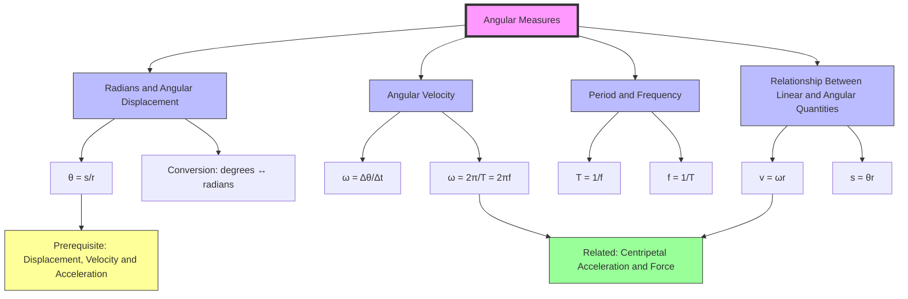

# 1. Overview / 概述

**English:** Angular measures form the foundation of circular motion physics. Instead of describing motion in straight lines (linear kinematics), angular measures describe rotation — how fast something spins, how far it has rotated, and the relationship between rotational and linear motion. This topic introduces the radian as the natural unit for angles in physics, angular displacement ($\theta$), angular velocity ($\omega$), and the connections between period ($T$) and frequency ($f$). Understanding angular measures is essential for analysing everything from spinning wheels and planetary orbits to centrifuges and particle accelerators. In both CAIE 9702 and Edexcel IAL, this is a prerequisite for [[Centripetal Acceleration and Force]] and appears in multiple-choice, structured, and practical questions.

**中文:** 角度量是圆周运动物理的基础。与直线运动（线性运动学）不同，角度量描述的是旋转——物体旋转的速度、旋转的角度，以及旋转运动与直线运动之间的关系。本主题引入弧度作为物理学中角度的自然单位，涉及角位移（$\theta$）、角速度（$\omega$），以及周期（$T$）和频率（$f$）之间的联系。理解角度量对于分析从旋转的车轮、行星轨道到离心机和粒子加速器等各种现象至关重要。在CAIE 9702和Edexcel IAL中，这是学习[[向心加速度与力]]的先决条件，并出现在选择题、结构题和实验题中。

> 📷 **IMAGE PROMPT — [OV-01]: Overview of Angular Measures in Circular Motion**
> A split diagram showing: (Left) A rotating disc with a point marked, showing the angle swept out $\theta$ and arc length $s$; (Right) A linear motion diagram for comparison. Labels: "Angular Displacement $\theta$ (rad)", "Arc Length $s$ (m)", "Radius $r$ (m)", "Linear Displacement $x$ (m)". Style: Clean educational diagram, blue background for angular, green for linear. Exam importance: High — conceptual understanding.

# 2. Syllabus Learning Objectives / 考纲学习目标

| CAIE 9702 (14.1 a-e) | Edexcel IAL (WPH14 U4: 5.1-5.4) |
|---|---|
| (a) Define the radian | 5.1 Understand the concept of angular displacement and the radian |
| (b) Express angular displacement in radians | 5.2 Understand and use the relationship $\theta = s/r$ |
| (c) Understand and use the relationship $\theta = s/r$ | 5.3 Understand and use the relationship $\omega = \Delta\theta/\Delta t$ |
| (d) Define angular velocity $\omega$ | 5.4 Understand the relationship between linear speed $v$ and angular speed $\omega$: $v = \omega r$ |
| (e) Use the equation $\omega = 2\pi/T = 2\pi f$ | |

**Examiner Expectations / 考官期望:**
- **English:** Candidates must be able to define the radian precisely: "the angle subtended at the centre of a circle when the arc length equals the radius." They must convert between degrees and radians fluently, apply $\theta = s/r$ in any context, and derive $v = \omega r$ from first principles. The relationship $\omega = 2\pi/T = 2\pi f$ is frequently tested in both multiple-choice and structured questions.
- **中文:** 考生必须能够精确定义弧度："当弧长等于半径时，在圆心处所张的角度。" 他们必须熟练地在度数和弧度之间转换，在任何情境中应用 $\theta = s/r$，并从基本原理推导 $v = \omega r$。关系式 $\omega = 2\pi/T = 2\pi f$ 在选择题和结构题中经常被考查。

> 📋 **CIE Only:** CAIE explicitly requires defining the radian as a separate learning objective (14.1a). Expect a definition question in Paper 2 or Paper 4.
> 📋 **Edexcel Only:** Edexcel emphasises the relationship between linear and angular quantities more heavily, often in the context of practical applications like rotating machinery.

# 3. Core Definitions / 核心定义

| Term (EN/CN) | Definition (EN) | Definition (CN) | Common Mistakes / 常见错误 |
|---|---|---|---|
| [[Radians and Angular Displacement\|Radian / 弧度]] | The angle subtended at the centre of a circle when the arc length is equal to the radius of the circle. | 当弧长等于圆的半径时，在圆心处所张的角度。 | Confusing with degrees; forgetting that 1 rad ≈ 57.3°; writing "radians" as "rads" (correct symbol: rad) |
| [[Radians and Angular Displacement\|Angular Displacement / 角位移]] ($\theta$) | The angle through which a point or line has been rotated in a specified direction about a specified axis. | 一个点或线绕指定轴在指定方向上旋转过的角度。 | Forgetting direction (clockwise/anticlockwise); using degrees instead of radians in equations |
| [[Angular Velocity\|Angular Velocity / 角速度]] ($\omega$) | The rate of change of angular displacement: $\omega = \Delta\theta/\Delta t$ | 角位移的变化率：$\omega = \Delta\theta/\Delta t$ | Confusing with linear velocity; forgetting it's a vector (direction matters); using degrees/s instead of rad/s |
| [[Period and Frequency\|Period / 周期]] ($T$) | The time taken for one complete revolution or cycle. | 完成一次完整旋转或循环所需的时间。 | Confusing with frequency; forgetting units (s) |
| [[Period and Frequency\|Frequency / 频率]] ($f$) | The number of complete revolutions or cycles per unit time. | 单位时间内完成的完整旋转或循环的次数。 | Confusing with period; forgetting units (Hz = s⁻¹) |
| [[Relationship Between Linear and Angular Quantities\|Linear Speed / 线速度]] ($v$) | The distance travelled per unit time along a circular path: $v = \omega r$ | 沿圆形路径单位时间内行进的距离：$v = \omega r$ | Forgetting that $v$ is tangential; using $v = \omega r$ when $r$ changes |

# 4. Key Concepts Explained / 关键概念详解

## 4.1 The Radian / 弧度

### Explanation / 解释
**English:** The radian is the SI unit for measuring angles. Unlike degrees (which are arbitrary), the radian is a natural unit derived from geometry. One radian is defined as the angle at the centre of a circle that subtends an arc equal in length to the radius. This means that for any circle, the angle in radians is simply $\theta = s/r$, where $s$ is the arc length and $r$ is the radius. Since the circumference of a circle is $2\pi r$, a full circle corresponds to $2\pi$ radians. Therefore: $2\pi \text{ rad} = 360^\circ$, $\pi \text{ rad} = 180^\circ$, and $1 \text{ rad} \approx 57.3^\circ$.

**中文:** 弧度是测量角度的SI单位。与度数（人为定义）不同，弧度是从几何学中导出的自然单位。一弧度定义为在圆心处所张的角，该角所对的弧长等于半径。这意味着对于任何圆，以弧度为单位的角度就是 $\theta = s/r$，其中 $s$ 是弧长，$r$ 是半径。由于圆的周长是 $2\pi r$，一个完整的圆对应 $2\pi$ 弧度。因此：$2\pi \text{ rad} = 360^\circ$，$\pi \text{ rad} = 180^\circ$，$1 \text{ rad} \approx 57.3^\circ$。

### Physical Meaning / 物理意义
**English:** The radian is dimensionless (it's a ratio of two lengths: $s/r$). This is why angular quantities like $\omega$ have units of s⁻¹ (rad/s is technically rad·s⁻¹, but rad is often omitted). Using radians ensures that equations like $v = \omega r$ and $a = \omega^2 r$ are dimensionally consistent without conversion factors.

**中文:** 弧度是无量纲的（它是两个长度的比值：$s/r$）。这就是为什么像 $\omega$ 这样的角度量的单位是 s⁻¹（rad/s 在技术上是 rad·s⁻¹，但 rad 通常被省略）。使用弧度可以确保像 $v = \omega r$ 和 $a = \omega^2 r$ 这样的方程在量纲上一致，无需转换因子。

### Common Misconceptions / 常见误区
- Thinking radians are just another unit like degrees (they are fundamentally different — radians are natural, degrees are arbitrary)
- Forgetting that all angular equations in physics require radians, not degrees
- Confusing arc length $s$ with chord length (straight-line distance between two points on the circle)

### Exam Tips / 考试提示
**English:** Always convert degrees to radians before using any angular equation. Common conversions: $30^\circ = \pi/6$, $45^\circ = \pi/4$, $60^\circ = \pi/3$, $90^\circ = \pi/2$, $180^\circ = \pi$, $360^\circ = 2\pi$. In exam questions, if an angle is given in degrees, convert to radians immediately.

**中文:** 在使用任何角度方程之前，始终将度数转换为弧度。常见转换：$30^\circ = \pi/6$，$45^\circ = \pi/4$，$60^\circ = \pi/3$，$90^\circ = \pi/2$，$180^\circ = \pi$，$360^\circ = 2\pi$。在考试题中，如果角度以度数给出，立即转换为弧度。

> 📷 **IMAGE PROMPT — [KM-01]: Definition of the Radian**
> A circle with centre O, radius r. An arc of length r is marked on the circumference. The angle at the centre (θ) is labelled "1 radian". Labels: "Arc length = r", "Radius = r", "θ = 1 rad". Style: Simple, clean geometry diagram, vector graphics. Exam importance: Very high — definition questions appear frequently.

## 4.2 Angular Displacement / 角位移

### Explanation / 解释
**English:** Angular displacement ($\theta$) is the angle through which an object rotates about a fixed axis. It is a vector quantity (direction matters — clockwise or anticlockwise). For a complete circle, $\theta = 2\pi$ rad. The relationship $\theta = s/r$ connects angular displacement to linear distance travelled along the circular path (arc length $s$). Unlike linear displacement, angular displacement can exceed $2\pi$ rad for multiple rotations.

**中文:** 角位移（$\theta$）是物体绕固定轴旋转过的角度。它是一个矢量（方向很重要——顺时针或逆时针）。对于一个完整的圆，$\theta = 2\pi$ rad。关系式 $\theta = s/r$ 将角位移与沿圆形路径行进的距离（弧长 $s$）联系起来。与线位移不同，角位移可以超过 $2\pi$ rad（多圈旋转）。

### Physical Meaning / 物理意义
**English:** Angular displacement tells us how far something has rotated, not how far it has travelled linearly. For example, a point on a spinning wheel may have a large angular displacement but zero net linear displacement after one complete rotation (it returns to its starting position).

**中文:** 角位移告诉我们物体旋转了多远，而不是线性移动了多远。例如，旋转轮子上的一点可能具有很大的角位移，但在完成一次完整旋转后净线位移为零（它回到起始位置）。

### Common Misconceptions / 常见误区
- Treating angular displacement as a scalar (it has direction)
- Confusing angular displacement with the number of rotations (1 rotation = $2\pi$ rad)
- Using $\theta = s/r$ with $s$ as chord length instead of arc length

### Exam Tips / 考试提示
**English:** When a question says "the wheel rotates through 3 complete revolutions", convert to $\theta = 3 \times 2\pi = 6\pi$ rad. For partial rotations, use fractions: "quarter turn" = $\pi/2$ rad.

**中文:** 当题目说"轮子旋转了3整圈"时，转换为 $\theta = 3 \times 2\pi = 6\pi$ rad。对于部分旋转，使用分数："四分之一圈" = $\pi/2$ rad。

## 4.3 Angular Velocity / 角速度

### Explanation / 解释
**English:** Angular velocity ($\omega$) is the rate of change of angular displacement: $\omega = \Delta\theta/\Delta t$. It is a vector quantity (direction along the axis of rotation, given by the right-hand rule). For uniform circular motion, $\omega$ is constant. The SI unit is rad s⁻¹ (or simply s⁻¹ since rad is dimensionless). Angular velocity is related to period and frequency by $\omega = 2\pi/T = 2\pi f$.

**中文:** 角速度（$\omega$）是角位移的变化率：$\omega = \Delta\theta/\Delta t$。它是一个矢量（方向沿旋转轴，由右手定则确定）。对于匀速圆周运动，$\omega$ 是常数。SI单位是 rad s⁻¹（或简写为 s⁻¹，因为弧度是无量纲的）。角速度与周期和频率的关系为 $\omega = 2\pi/T = 2\pi f$。

### Physical Meaning / 物理意义
**English:** Angular velocity tells us how fast something is spinning. A higher $\omega$ means more radians per second. For example, a CD spinning at 200 rpm (revolutions per minute) has $\omega = 200 \times 2\pi / 60 \approx 20.9$ rad/s. The direction of $\omega$ is perpendicular to the plane of rotation.

**中文:** 角速度告诉我们物体旋转的速度。更高的 $\omega$ 意味着每秒更多的弧度。例如，以200 rpm（每分钟转数）旋转的CD具有 $\omega = 200 \times 2\pi / 60 \approx 20.9$ rad/s。$\omega$ 的方向垂直于旋转平面。

### Common Misconceptions / 常见误区
- Confusing angular velocity with linear velocity ($v = \omega r$ is the relationship)
- Forgetting to convert rpm to rad/s (multiply by $2\pi/60$)
- Thinking $\omega$ is constant only in uniform circular motion (it can change in non-uniform motion)

### Exam Tips / 考试提示
**English:** When given frequency $f$ in Hz or rpm, always convert to $\omega$ using $\omega = 2\pi f$. For rpm: $\omega = (\text{rpm} \times 2\pi)/60$. For period $T$: $\omega = 2\pi/T$. These conversions are almost guaranteed to appear in exams.

**中文:** 当给定频率 $f$（以Hz或rpm为单位）时，始终使用 $\omega = 2\pi f$ 转换为 $\omega$。对于rpm：$\omega = (\text{rpm} \times 2\pi)/60$。对于周期 $T$：$\omega = 2\pi/T$。这些转换几乎肯定会在考试中出现。

> 📷 **IMAGE PROMPT — [KM-02]: Angular Velocity Direction (Right-Hand Rule)**
> A rotating disc with axis of rotation. A hand is shown with thumb pointing up (direction of ω) and fingers curling in the direction of rotation. Labels: "Axis of rotation", "Direction of ω (thumb)", "Direction of rotation (fingers)". Style: 3D schematic, clear hand illustration. Exam importance: Medium — conceptual understanding.

## 4.4 Period and Frequency / 周期与频率

### Explanation / 解释
**English:** Period ($T$) is the time for one complete revolution (unit: s). Frequency ($f$) is the number of revolutions per second (unit: Hz = s⁻¹). They are reciprocals: $T = 1/f$ and $f = 1/T$. For circular motion, the angular velocity is $\omega = 2\pi/T = 2\pi f$. These relationships are fundamental to all oscillatory and rotational motion.

**中文:** 周期（$T$）是完成一次完整旋转所需的时间（单位：s）。频率（$f$）是每秒的旋转次数（单位：Hz = s⁻¹）。它们互为倒数：$T = 1/f$ 和 $f = 1/T$。对于圆周运动，角速度为 $\omega = 2\pi/T = 2\pi f$。这些关系是所有振荡和旋转运动的基础。

### Physical Meaning / 物理意义
**English:** Period tells us the "time scale" of rotation — a satellite with $T = 24$ hours orbits once per day. Frequency tells us the "rate" — a fan blade spinning at $f = 50$ Hz completes 50 rotations every second. Both are scalars (no direction).

**中文:** 周期告诉我们旋转的"时间尺度"——周期 $T = 24$ 小时的卫星每天绕行一次。频率告诉我们"速率"——以 $f = 50$ Hz 旋转的风扇叶片每秒完成50次旋转。两者都是标量（无方向）。

### Common Misconceptions / 常见误区
- Confusing $T$ and $f$ (remember: $T$ is time per cycle, $f$ is cycles per time)
- Forgetting that $T$ and $f$ are reciprocals, not the same
- Using $\omega = 2\pi/T$ when $T$ is not the period (e.g., using time for half a rotation)

### Exam Tips / 考试提示
**English:** If a question gives "time for N revolutions", calculate $T = \text{total time}/N$ first. Then use $\omega = 2\pi/T$. Always check units: $T$ in seconds, $f$ in Hz, $\omega$ in rad/s.

**中文:** 如果题目给出"N次旋转的时间"，首先计算 $T = \text{总时间}/N$。然后使用 $\omega = 2\pi/T$。始终检查单位：$T$ 以秒为单位，$f$ 以Hz为单位，$\omega$ 以rad/s为单位。

## 4.5 Relationship Between Linear and Angular Quantities / 线性量与角度量之间的关系

### Explanation / 解释
**English:** For a point at distance $r$ from the axis of rotation, the linear (tangential) speed $v$ is related to angular velocity $\omega$ by $v = \omega r$. The linear (tangential) acceleration $a$ is related to angular acceleration $\alpha$ by $a = \alpha r$ (for non-uniform circular motion). The arc length $s$ is related to angular displacement $\theta$ by $s = \theta r$. These relationships show that linear quantities increase with distance from the centre — points farther from the axis move faster linearly even though they have the same angular velocity.

**中文:** 对于距离旋转轴 $r$ 的点，线（切向）速度 $v$ 与角速度 $\omega$ 的关系为 $v = \omega r$。线（切向）加速度 $a$ 与角加速度 $\alpha$ 的关系为 $a = \alpha r$（对于非匀速圆周运动）。弧长 $s$ 与角位移 $\theta$ 的关系为 $s = \theta r$。这些关系表明，线性量随距中心距离的增加而增加——距离轴更远的点即使具有相同的角速度，其线速度也更快。

### Physical Meaning / 物理意义
**English:** This relationship explains why the outside of a spinning wheel moves faster than the inside (near the axle). It's why larger wheels give higher linear speed for the same angular speed (e.g., larger bicycle wheels cover more ground per pedal rotation). The direction of $v$ is tangential to the circular path (perpendicular to the radius).

**中文:** 这个关系解释了为什么旋转轮子的外侧比内侧（靠近轴）移动得更快。这就是为什么对于相同的角速度，更大的轮子提供更高的线速度（例如，更大的自行车轮每蹬一圈覆盖更多地面）。$v$ 的方向与圆形路径相切（垂直于半径）。

### Common Misconceptions / 常见误区
- Thinking $v = \omega r$ applies to all points on a rotating object (it applies only to points at distance $r$ from the axis)
- Confusing tangential velocity with angular velocity (they are different quantities with different units)
- Forgetting that $v$ is tangential, not radial (towards or away from centre)

### Exam Tips / 考试提示
**English:** In exam questions, identify whether you're given linear or angular quantities. If the question involves distance along the path, use $s = \theta r$. If it involves speed, use $v = \omega r$. Always check that $r$ is the perpendicular distance from the axis of rotation.

**中文:** 在考试题中，确定你得到的是线性量还是角度量。如果问题涉及沿路径的距离，使用 $s = \theta r$。如果涉及速度，使用 $v = \omega r$。始终检查 $r$ 是到旋转轴的垂直距离。

> 📷 **IMAGE PROMPT — [KM-03]: Linear vs Angular Quantities on a Rotating Disc**
> A rotating disc with two points marked: one near the centre (r₁) and one near the edge (r₂). Arrows show: angular velocity ω (same for both), tangential velocities v₁ and v₂ (v₂ > v₁). Labels: "ω (same)", "v₁ = ωr₁", "v₂ = ωr₂", "r₁", "r₂". Style: Colour-coded arrows, clear comparison. Exam importance: Very high — common exam diagram.

# 5. Essential Equations / 核心公式

## 5.1 Radian Definition / 弧度定义

$$ \theta = \frac{s}{r} $$

| Symbol (符号) | Meaning (EN/CN) | Unit (单位) |
|---|---|---|
| $\theta$ | Angular displacement / 角位移 | rad (dimensionless) |
| $s$ | Arc length / 弧长 | m |
| $r$ | Radius / 半径 | m |

**Derivation / 推导:** By definition of the radian. For a full circle, $s = 2\pi r$, so $\theta = 2\pi r / r = 2\pi$ rad.

**Conditions / 适用条件:** $\theta$ must be in radians (not degrees). $s$ is the curved path length, not the straight-line chord.

**Limitations / 局限性:** Only valid for circular arcs. For very small angles, $s \approx$ chord length, but the equation is exact for any angle.

**Rearrangements / 变形:**
- $s = \theta r$ (find arc length)
- $r = s/\theta$ (find radius)

## 5.2 Angular Velocity / 角速度

$$ \omega = \frac{\Delta\theta}{\Delta t} $$

| Symbol (符号) | Meaning (EN/CN) | Unit (单位) |
|---|---|---|
| $\omega$ | Angular velocity / 角速度 | rad s⁻¹ |
| $\Delta\theta$ | Change in angular displacement / 角位移变化量 | rad |
| $\Delta t$ | Time interval / 时间间隔 | s |

**Derivation / 推导:** Definition of rate of change. For uniform circular motion, $\omega$ is constant.

**Conditions / 适用条件:** $\Delta\theta$ in radians. For instantaneous angular velocity, $\omega = d\theta/dt$.

**Limitations / 局限性:** For non-uniform circular motion, this gives average angular velocity. Instantaneous requires calculus.

**Rearrangements / 变形:**
- $\Delta\theta = \omega \Delta t$ (angular displacement from constant $\omega$)
- $\Delta t = \Delta\theta/\omega$ (time for given angular displacement)

## 5.3 Angular Velocity, Period, and Frequency / 角速度、周期与频率

$$ \omega = \frac{2\pi}{T} = 2\pi f $$

| Symbol (符号) | Meaning (EN/CN) | Unit (单位) |
|---|---|---|
| $\omega$ | Angular velocity / 角速度 | rad s⁻¹ |
| $T$ | Period / 周期 | s |
| $f$ | Frequency / 频率 | Hz (s⁻¹) |

**Derivation / 推导:** In one period $T$, the object completes one full revolution ($\Delta\theta = 2\pi$ rad). So $\omega = 2\pi/T$. Since $f = 1/T$, $\omega = 2\pi f$.

**Conditions / 适用条件:** Uniform circular motion (constant $\omega$). $T$ and $f$ must be for complete cycles.

**Limitations / 局限性:** Only for complete revolutions. For partial rotations, use $\omega = \Delta\theta/\Delta t$ directly.

**Rearrangements / 变形:**
- $T = 2\pi/\omega$ (period from angular velocity)
- $f = \omega/(2\pi)$ (frequency from angular velocity)
- $T = 1/f$ (period-frequency relationship)

## 5.4 Linear Speed from Angular Velocity / 线速度与角速度的关系

$$ v = \omega r $$

| Symbol (符号) | Meaning (EN/CN) | Unit (单位) |
|---|---|---|
| $v$ | Linear (tangential) speed / 线（切向）速度 | m s⁻¹ |
| $\omega$ | Angular velocity / 角速度 | rad s⁻¹ |
| $r$ | Radius (distance from axis) / 半径（到轴的距离） | m |

**Derivation / 推导:** From $s = \theta r$, differentiate with respect to time: $ds/dt = r \cdot d\theta/dt$, so $v = \omega r$.

**Conditions / 适用条件:** $r$ is the perpendicular distance from the axis of rotation. $\omega$ in rad/s. $v$ is tangential speed (magnitude of velocity).

**Limitations / 局限性:** $v$ is the instantaneous tangential speed. For points at different $r$, $v$ differs even though $\omega$ is the same.

**Rearrangements / 变形:**
- $\omega = v/r$ (angular velocity from linear speed)
- $r = v/\omega$ (radius from linear and angular speeds)

## 5.5 Arc Length from Angular Displacement / 弧长与角位移的关系

$$ s = \theta r $$

| Symbol (符号) | Meaning (EN/CN) | Unit (单位) |
|---|---|---|
| $s$ | Arc length / 弧长 | m |
| $\theta$ | Angular displacement / 角位移 | rad |
| $r$ | Radius / 半径 | m |

**Derivation / 推导:** Directly from the definition of the radian: $\theta = s/r$, rearranged.

**Conditions / 适用条件:** $\theta$ in radians. $s$ is the curved path along the circle.

**Limitations / 局限性:** Only for circular motion. For non-circular paths, different relationships apply.

**Rearrangements / 变形:**
- $\theta = s/r$ (angular displacement)
- $r = s/\theta$ (radius)

# 6. Graphs and Relationships / 图表与关系

## 6.1 Angular Displacement vs Time (Uniform Motion) / 角位移-时间图（匀速运动）

**Axes / 坐标轴:** X-axis: Time $t$ (s); Y-axis: Angular displacement $\theta$ (rad)

**Shape / 形状:** Straight line through origin with positive slope.

**Gradient Meaning / 斜率含义:**
- **English:** Gradient = $\Delta\theta/\Delta t = \omega$ (angular velocity). A steeper line means higher angular velocity.
- **中文:** 斜率 = $\Delta\theta/\Delta t = \omega$（角速度）。线越陡，角速度越高。

**Area Meaning / 面积含义:**
- **English:** Area under the graph has no physical meaning in this context (unlike velocity-time graphs where area = displacement).
- **中文:** 该图下的面积在此上下文中没有物理意义（与速度-时间图不同，其面积等于位移）。

**Exam Interpretation / 考试解读:**
- **English:** If the graph is a straight line, $\omega$ is constant (uniform circular motion). If curved, $\omega$ is changing (angular acceleration present).
- **中文:** 如果图形是直线，则 $\omega$ 是常数（匀速圆周运动）。如果是曲线，则 $\omega$ 在变化（存在角加速度）。

**Common Questions / 常见问题:**
- Calculate $\omega$ from the gradient
- Determine $\theta$ at a given time from the graph
- Compare angular velocities of two objects from their graphs

> 📷 **IMAGE PROMPT — [GR-01]: Angular Displacement vs Time Graph**
> A straight line graph with θ on y-axis (rad) and t on x-axis (s). Gradient triangle shown: Δθ and Δt marked. Labels: "Gradient = ω = Δθ/Δt". Below: A second line with steeper slope for comparison. Style: Clear graph paper background, labelled axes with units. Exam importance: High.

## 6.2 Angular Velocity vs Time (Uniform Motion) / 角速度-时间图（匀速运动）

**Axes / 坐标轴:** X-axis: Time $t$ (s); Y-axis: Angular velocity $\omega$ (rad s⁻¹)

**Shape / 形状:** Horizontal straight line (constant $\omega$).

**Gradient Meaning / 斜率含义:**
- **English:** Gradient = $\Delta\omega/\Delta t = \alpha$ (angular acceleration). For uniform motion, gradient = 0.
- **中文:** 斜率 = $\Delta\omega/\Delta t = \alpha$（角加速度）。对于匀速运动，斜率 = 0。

**Area Meaning / 面积含义:**
- **English:** Area under the graph = $\omega \times \Delta t = \Delta\theta$ (angular displacement). This is analogous to area under $v$-$t$ graph giving linear displacement.
- **中文:** 图下的面积 = $\omega \times \Delta t = \Delta\theta$（角位移）。这类似于 $v$-$t$ 图下的面积给出线位移。

**Exam Interpretation / 考试解读:**
- **English:** For uniform motion, the area is simply $\omega \times t$. For non-uniform motion, the area under $\omega$-$t$ graph gives total angular displacement.
- **中文:** 对于匀速运动，面积就是 $\omega \times t$。对于非匀速运动，$\omega$-$t$ 图下的面积给出总角位移。

**Common Questions / 常见问题:**
- Calculate angular displacement from area under graph
- Determine if motion is uniform (horizontal line) or accelerating (sloped line)
- Find angular acceleration from gradient

> 📷 **IMAGE PROMPT — [GR-02]: Angular Velocity vs Time Graph**
> A horizontal line at ω = constant on y-axis (rad/s) vs t (s) on x-axis. Shaded area under the line from t₁ to t₂. Labels: "Area = ω × Δt = Δθ (angular displacement)". Style: Clear graph with shaded region. Exam importance: High.

## 6.3 Linear Speed vs Radius (for Constant ω) / 线速度-半径图（ω恒定）

**Axes / 坐标轴:** X-axis: Radius $r$ (m); Y-axis: Linear speed $v$ (m s⁻¹)

**Shape / 形状:** Straight line through origin with gradient $\omega$.

**Gradient Meaning / 斜率含义:**
- **English:** Gradient = $v/r = \omega$ (angular velocity). A steeper line means higher angular velocity.
- **中文:** 斜率 = $v/r = \omega$（角速度）。线越陡，角速度越高。

**Area Meaning / 面积含义:**
- **English:** Area under the graph has no standard physical meaning.
- **中文:** 图下的面积没有标准的物理意义。

**Exam Interpretation / 考试解读:**
- **English:** This graph shows that for a given $\omega$, points farther from the axis move faster linearly. The relationship is directly proportional.
- **中文:** 该图表明，对于给定的 $\omega$，距离轴更远的点线速度更快。关系是正比例的。

**Common Questions / 常见问题:**
- Determine $\omega$ from the gradient
- Find $v$ at a given $r$ for a known $\omega$
- Compare linear speeds of points at different radii

> 📷 **IMAGE PROMPT — [GR-03]: Linear Speed vs Radius Graph**
> A straight line through origin with v on y-axis (m/s) and r on x-axis (m). Gradient triangle shown. Labels: "Gradient = ω = v/r". Style: Clear graph with labelled axes. Exam importance: Medium.

# 7. Required Diagrams / 必备图表

## 7.1 Radian Definition Diagram / 弧度定义图

> 📷 **IMAGE PROMPT — [DG-01]: Definition of the Radian**
> A circle with centre O. Radius r drawn from O to point A on circumference. Arc of length r marked from A to B along circumference. Angle AOB labelled "θ = 1 radian". Labels: "Arc length AB = r", "Radius OA = OB = r", "θ = 1 rad". Style: Clean vector diagram, circle in light blue, arc in red, radii in black. Exam importance: Very high — definition questions are common.

## 7.2 Angular Displacement and Arc Length / 角位移与弧长

> 📷 **IMAGE PROMPT — [DG-02]: Angular Displacement and Arc Length**
> A circle with centre O. Two radii OA and OB forming angle θ. Arc AB marked with length s. Labels: "Angular displacement θ (rad)", "Arc length s (m)", "Radius r (m)", "θ = s/r". Style: Colour-coded: θ in red, s in blue, r in black. Exam importance: High — used in many problems.

## 7.3 Tangential Velocity Direction / 切向速度方向

> 📷 **IMAGE PROMPT — [DG-03]: Tangential Velocity on a Circular Path**
> A circle with centre O. A point P on the circumference. Arrow from P tangent to the circle showing velocity v. Radius OP shown. Labels: "v (tangential velocity)", "r (radius)", "Direction of motion". Style: Arrow showing v perpendicular to radius. Exam importance: High — understanding direction is crucial.

## 7.4 Angular Velocity and Linear Speed Comparison / 角速度与线速度比较

> 📷 **IMAGE PROMPT — [DG-04]: Points at Different Radii on a Rotating Disc**
> A rotating disc with centre O. Two points: A at radius r₁ (near centre) and B at radius r₂ (near edge). Angular velocity ω shown as curved arrow (same for both). Tangential velocities v₁ and v₂ shown as straight arrows (v₂ > v₁). Labels: "ω (same)", "v₁ = ωr₁", "v₂ = ωr₂", "r₁", "r₂". Style: Colour-coded: ω in green, v₁ in blue, v₂ in red. Exam importance: Very high — common exam diagram.

## 7.5 Right-Hand Rule for Angular Velocity / 角速度的右手定则

> 📷 **IMAGE PROMPT — [DG-05]: Right-Hand Rule for Angular Velocity Direction**
> A rotating disc with axis of rotation shown as a vertical line. A right hand is illustrated with thumb pointing upward (direction of ω vector) and fingers curling in the direction of rotation. Labels: "Axis of rotation", "ω (thumb direction)", "Rotation direction (fingers)". Style: 3D schematic, hand in outline, disc in perspective. Exam importance: Medium — conceptual understanding.

# 8. Worked Examples / 典型例题

## Example 1: Converting Revolutions to Radians and Finding Arc Length / 将转数转换为弧度并求弧长

### Question / 题目
**English:** A wheel of radius 0.35 m rotates through 2.5 revolutions. Calculate:
(a) The angular displacement in radians.
(b) The distance travelled by a point on the rim of the wheel.

**中文:** 一个半径为0.35 m的轮子旋转了2.5圈。计算：
(a) 以弧度为单位的角位移。
(b) 轮缘上一点行进的距离。

### Image Prompt / 图片提示
> 📷 **IMAGE PROMPT — [EX-01]: Wheel Rotating Through 2.5 Revolutions**
> A wheel with radius r = 0.35 m. An arc showing 2.5 complete rotations (dashed line showing path). Labels: "r = 0.35 m", "2.5 revolutions", "θ = ?", "s = ?". Style: Simple wheel diagram with arc path. Exam importance: High.

### Solution / 解答

**Part (a): Angular displacement / 角位移**

**English:**
1 revolution = $2\pi$ rad
2.5 revolutions = $2.5 \times 2\pi$ rad
$\theta = 5\pi$ rad
$\theta = 15.7$ rad (to 3 s.f.)

**中文:**
1圈 = $2\pi$ rad
2.5圈 = $2.5 \times 2\pi$ rad
$\theta = 5\pi$ rad
$\theta = 15.7$ rad（保留3位有效数字）

**Part (b): Distance travelled (arc length) / 行进距离（弧长）**

**English:**
Using $s = \theta r$:
$s = (5\pi) \times 0.35$
$s = 1.75\pi$ m
$s = 5.50$ m (to 3 s.f.)

**中文:**
使用 $s = \theta r$：
$s = (5\pi) \times 0.35$
$s = 1.75\pi$ m
$s = 5.50$ m（保留3位有效数字）

### Final Answer / 最终答案
**English:** (a) $\theta = 5\pi$ rad = 15.7 rad (b) $s = 5.50$ m
**中文:** (a) $\theta = 5\pi$ rad = 15.7 rad (b) $s = 5.50$ m

### Examiner Notes / 考官点评
**English:** Common mistakes: (1) Using degrees instead of radians — always convert revolutions to radians first. (2) Forgetting that 1 revolution = $2\pi$ rad, not $\pi$ rad. (3) Using $s = \theta r$ with $\theta$ in degrees. Marks are awarded for showing the conversion step clearly.

**中文:** 常见错误：(1) 使用度数而不是弧度——始终先将转数转换为弧度。(2) 忘记1圈 = $2\pi$ rad，而不是 $\pi$ rad。(3) 使用 $s = \theta r$ 时 $\theta$ 以度为单位。清晰地展示转换步骤可获得分数。

## Example 2: Calculating Angular Velocity and Linear Speed / 计算角速度和线速度

### Question / 题目
**English:** A CD spins at 5400 revolutions per minute (rpm). The data is read from a track at a distance of 0.060 m from the centre. Calculate:
(a) The angular velocity of the CD in rad s⁻¹.
(b) The linear speed of the track relative to the laser.

**中文:** 一张CD以每分钟5400转（rpm）的速度旋转。数据从距离中心0.060 m的轨道读取。计算：
(a) CD的角速度，单位为rad s⁻¹。
(b) 轨道相对于激光的线速度。

### Image Prompt / 图片提示
> 📷 **IMAGE PROMPT — [EX-02]: CD Spinning with Laser Reading Track**
> A CD disc with centre O. A track at radius r = 0.060 m shown as a circle. Laser head shown below the disc. Labels: "r = 0.060 m", "5400 rpm", "Laser", "Track". Style: Top-down view of CD with laser. Exam importance: High — real-world application.

### Solution / 解答

**Part (a): Angular velocity / 角速度**

**English:**
Convert rpm to rad s⁻¹:
$\omega = \frac{5400 \times 2\pi}{60}$
$\omega = \frac{5400 \times 2\pi}{60} = 90 \times 2\pi$
$\omega = 180\pi$ rad s⁻¹
$\omega = 565$ rad s⁻¹ (to 3 s.f.)

**中文:**
将rpm转换为rad s⁻¹：
$\omega = \frac{5400 \times 2\pi}{60}$
$\omega = \frac{5400 \times 2\pi}{60} = 90 \times 2\pi$
$\omega = 180\pi$ rad s⁻¹
$\omega = 565$ rad s⁻¹（保留3位有效数字）

**Part (b): Linear speed / 线速度**

**English:**
Using $v = \omega r$:
$v = (180\pi) \times 0.060$
$v = 10.8\pi$ m s⁻¹
$v = 33.9$ m s⁻¹ (to 3 s.f.)

**中文:**
使用 $v = \omega r$：
$v = (180\pi) \times 0.060$
$v = 10.8\pi$ m s⁻¹
$v = 33.9$ m s⁻¹（保留3位有效数字）

### Final Answer / 最终答案
**English:** (a) $\omega = 565$ rad s⁻¹ (b) $v = 33.9$ m s⁻¹
**中文:** (a) $\omega = 565$ rad s⁻¹ (b) $v = 33.9$ m s⁻¹

### Examiner Notes / 考官点评
**English:** Common mistakes: (1) Forgetting to divide by 60 when converting rpm to rad/s. (2) Using $v = \omega r$ with $\omega$ in rpm instead of rad/s. (3) Not showing the conversion factor $2\pi/60$ clearly. In mark schemes, the conversion step ($5400 \times 2\pi/60$) is often awarded a separate mark.

**中文:** 常见错误：(1) 将rpm转换为rad/s时忘记除以60。(2) 使用 $v = \omega r$ 时 $\omega$ 以rpm为单位而不是rad/s。(3) 没有清晰地展示转换因子 $2\pi/60$。在评分方案中，转换步骤（$5400 \times 2\pi/60$）通常单独给分。

# 9. Past Paper Question Types / 历年真题题型

| Question Type / 题型 | Frequency / 频率 | Difficulty / 难度 | Past Paper References / 真题索引 |
|---|---|---|---|
| Define the radian / 定义弧度 | High / 高 | Easy / 简单 | 📝 *待填入* |
| Convert degrees to radians / 度转弧度 | High / 高 | Easy / 简单 | 📝 *待填入* |
| Calculate angular velocity from period/frequency / 从周期/频率计算角速度 | Very High / 非常高 | Medium / 中等 | 📝 *待填入* |
| Calculate linear speed from angular velocity / 从角速度计算线速度 | Very High / 非常高 | Medium / 中等 | 📝 *待填入* |
| Convert rpm to rad/s / 将rpm转换为rad/s | High / 高 | Medium / 中等 | 📝 *待填入* |
| Find arc length from angular displacement / 从角位移求弧长 | Medium / 中等 | Medium / 中等 | 📝 *待填入* |
| Interpret θ-t or ω-t graphs / 解读θ-t或ω-t图 | Medium / 中等 | Medium-Hard / 中难 | 📝 *待填入* |
| Multi-step problem (combine ω, T, f, v) / 多步问题（结合ω, T, f, v） | High / 高 | Hard / 困难 | 📝 *待填入* |
| Practical: measure ω using light gate / 实验：使用光门测量ω | Low-Medium / 低中 | Medium / 中等 | 📝 *待填入* |

> 📝 **题库整理中 / Question Bank Under Construction:**
> **English:** The past paper references column will be populated as the knowledge graph grows. For now, focus on mastering the core concepts and equations. All question types listed above have appeared in recent CAIE 9702 (Papers 1, 2, 4) and Edexcel IAL (Unit 4) examinations.
> **中文:** 真题索引列将随着知识图谱的增长而填充。目前，专注于掌握核心概念和方程。上述所有题型都出现在近期的CAIE 9702（试卷1、2、4）和Edexcel IAL（单元4）考试中。

**Common Command Words / 常见指令词:**
- **Define / 定义:** Give the precise meaning (e.g., "Define the radian")
- **Calculate / 计算:** Use equations to find a numerical value
- **Convert / 转换:** Change units (e.g., rpm to rad/s)
- **Determine / 确定:** Find a value using given data or a graph
- **Show that / 证明:** Demonstrate a relationship or value
- **State / 陈述:** Give a brief answer without explanation
- **Explain / 解释:** Give reasons or describe the physics

# 10. Practical Skills Connections / 实验技能链接

**English:** Angular measures are tested in practical contexts in both CAIE and Edexcel:

1. **Measuring Angular Velocity:** Use a light gate connected to a data logger. A card attached to a rotating object interrupts the light beam. The time for one interruption gives the period $T$, from which $\omega = 2\pi/T$ is calculated. Multiple measurements reduce uncertainty.

2. **Measuring Radius and Arc Length:** Use a ruler or vernier calipers to measure radius $r$. For arc length $s$, use a flexible measuring tape or calculate from $\theta$ and $r$.

3. **Uncertainties:** When calculating $\omega$ from $T$, the percentage uncertainty in $\omega$ equals the percentage uncertainty in $T$ (since $\omega \propto 1/T$). When calculating $v$ from $\omega$ and $r$, add percentage uncertainties: $\Delta v/v = \Delta\omega/\omega + \Delta r/r$.

4. **Graph Plotting:** Plot $\theta$ vs $t$ to find $\omega$ from gradient. Plot $v$ vs $r$ to find $\omega$ from gradient. Include error bars and line of best fit.

5. **Experimental Design:** For CAIE Paper 3/5 and Edexcel Unit 3/6, you may be asked to design an experiment to determine angular velocity. Key considerations: reducing friction, measuring time accurately, repeating measurements, controlling variables.

**中文:** 角度量在CAIE和Edexcel的实验情境中都有考查：

1. **测量角速度：** 使用连接到数据记录器的光门。连接到旋转物体上的卡片会中断光束。一次中断的时间给出周期 $T$，由此计算 $\omega = 2\pi/T$。多次测量可减少不确定度。

2. **测量半径和弧长：** 使用直尺或游标卡尺测量半径 $r$。对于弧长 $s$，使用柔性卷尺或从 $\theta$ 和 $r$ 计算。

3. **不确定度：** 从 $T$ 计算 $\omega$ 时，$\omega$ 的百分比不确定度等于 $T$ 的百分比不确定度（因为 $\omega \propto 1/T$）。从 $\omega$ 和 $r$ 计算 $v$ 时，相加百分比不确定度：$\Delta v/v = \Delta\omega/\omega + \Delta r/r$。

4. **绘图：** 绘制 $\theta$ 与 $t$ 的关系图，从斜率求 $\omega$。绘制 $v$ 与 $r$ 的关系图，从斜率求 $\omega$。包括误差线和最佳拟合线。

5. **实验设计：** 对于CAIE试卷3/5和Edexcel单元3/6，你可能被要求设计一个实验来确定角速度。关键考虑因素：减少摩擦、准确测量时间、重复测量、控制变量。

> 📋 **CIE Only:** CAIE Paper 3 (AS) and Paper 5 (A2) may include practical questions on circular motion. Paper 5 often requires planning an experiment to determine $\omega$ or $v$.
> 📋 **Edexcel Only:** Edexcel Unit 3 (AS) and Unit 6 (A2) practical exams may include measuring angular velocity using light gates or stroboscopes.

# 11. Concept Map / 概念图谱



# 12. Examiner Insights / 考官洞察

**English:**

**Most Tested Ideas (CAIE 9702):**
- Definition of the radian (Paper 2/4 — almost guaranteed every 2-3 years)
- Converting between degrees and radians (Paper 1 — multiple choice)
- Using $\omega = 2\pi/T$ and $\omega = 2\pi f$ (all papers)
- Calculating linear speed from $v = \omega r$ (all papers)
- Converting rpm to rad/s (Paper 1 and Paper 4)

**Most Tested Ideas (Edexcel IAL):**
- Relationship between linear and angular quantities (Unit 4 — very common)
- Using $\theta = s/r$ in context (Unit 4)
- Multi-step problems combining $\omega$, $T$, $f$, and $v$ (Unit 4)
- Practical applications (e.g., CD players, bicycle wheels, centrifuges)

**Mark Scheme Wording / 评分方案措辞:**
- For "Define the radian": Must mention "angle subtended at centre", "arc length equals radius". Award 1 mark for each key phrase.
- For "Calculate $\omega$": Must show conversion step (e.g., $5400 \times 2\pi/60$). Award 1 mark for correct substitution, 1 mark for correct answer with unit.
- For "Show that $v = \omega r$": Must start from $s = \theta r$ and differentiate. Award 1 mark for each step.

**Common Lost Marks / 常见失分点:**
- Forgetting to convert degrees to radians before using equations
- Using $v = \omega r$ with $\omega$ in rpm instead of rad/s
- Confusing period $T$ with frequency $f$
- Not including units in final answers
- Using $\theta = s/r$ with $s$ as chord length instead of arc length

**High-Scoring Structures / 高分结构:**
- Always show conversion steps clearly
- Write the equation before substituting values
- Include units at every step
- Use standard form where appropriate
- Draw a diagram if it helps clarify the problem

**中文:**

**最常考的概念（CAIE 9702）：**
- 弧度的定义（试卷2/4——几乎每2-3年必考）
- 度与弧度之间的转换（试卷1——选择题）
- 使用 $\omega = 2\pi/T$ 和 $\omega = 2\pi f$（所有试卷）
- 从 $v = \omega r$ 计算线速度（所有试卷）
- 将rpm转换为rad/s（试卷1和试卷4）

**最常考的概念（Edexcel IAL）：**
- 线性量与角度量之间的关系（单元4——非常常见）
- 在情境中使用 $\theta = s/r$（单元4）
- 结合 $\omega$、$T$、$f$ 和 $v$ 的多步问题（单元4）
- 实际应用（例如，CD播放器、自行车轮、离心机）

**评分方案措辞：**
- 对于"定义弧度"：必须提到"圆心处所张的角"、"弧长等于半径"。每个关键短语得1分。
- 对于"计算 $\omega$"：必须展示转换步骤（例如，$5400 \times 2\pi/60$）。正确代入得1分，正确答案带单位得1分。
- 对于"证明 $v = \omega r$"：必须从 $s = \theta r$ 开始并微分。每一步得1分。

**常见失分点：**
- 在使用方程前忘记将度数转换为弧度
- 使用 $v = \omega r$ 时 $\omega$ 以rpm为单位而不是rad/s
- 混淆周期 $T$ 和频率 $f$
- 最终答案中未包含单位
- 使用 $\theta = s/r$ 时 $s$ 为弦长而不是弧长

**高分结构：**
- 始终清晰地展示转换步骤
- 在代入数值之前写出方程
- 每一步都包含单位
- 在适当的地方使用标准形式
- 如果有助于澄清问题，画一个图

# 13. Quick Revision Sheet / 速查表

| Category / 类别 | Key Points / 要点 |
|---|---|
| **Radian Definition / 弧度定义** | 1 rad = angle when arc length = radius; $2\pi$ rad = 360°; $\pi$ rad = 180°; 1 rad ≈ 57.3° |
| **Key Equations / 关键方程** | $\theta = s/r$; $\omega = \Delta\theta/\Delta t$; $\omega = 2\pi/T = 2\pi f$; $v = \omega r$; $s = \theta r$ |
| **Conversions / 转换** | degrees → radians: multiply by $\pi/180$; radians → degrees: multiply by $180/\pi$; rpm → rad/s: multiply by $2\pi/60$ |
| **Common Angles / 常见角度** | 30° = $\pi/6$; 45° = $\pi/4$; 60° = $\pi/3$; 90° = $\pi/2$; 180° = $\pi$; 360° = $2\pi$ |
| **Units / 单位** | $\theta$: rad; $\omega$: rad s⁻¹; $T$: s; $f$: Hz (s⁻¹); $v$: m s⁻¹; $r$: m |
| **Relationships / 关系** | $T = 1/f$; $f = 1/T$; $\omega = 2\pi/T$; $\omega = 2\pi f$; $v = \omega r$; $s = \theta r$ |
| **Graphs / 图表** | $\theta$-$t$: gradient = $\omega$; $\omega$-$t$: gradient = $\alpha$, area = $\Delta\theta$; $v$-$r$: gradient = $\omega$ |
| **Common Mistakes / 常见错误** | Using degrees in equations; confusing $T$ and $f$; forgetting rpm conversion; using chord length instead of arc length |
| **Exam Tips / 考试提示** | Always convert to radians first; show all steps; include units; check significant figures |
| **Prerequisites / 先决条件** | [[Displacement, Velocity and Acceleration]] |
| **Related Topics / 相关主题** | [[Centripetal Acceleration and Force]] |

# 14. Metadata / 元数据

```yaml
title:
  en: "Angular Measures"
  cn: "角度量"
subject: Physics
syllabus: [CAIE 9702, Edexcel IAL]
cie_ref: "14.1 (a-e)"
edexcel_ref: "WPH14 U4: 5.1-5.4"
level: A2
node_type: topic_hub
difficulty: foundation
prerequisites:
  - "Displacement, Velocity and Acceleration"
related_topics:
  - "Centripetal Acceleration and Force"
sub_topics:
  - "Radians and Angular Displacement"
  - "Angular Velocity"
  - "Period and Frequency"
  - "Relationship Between Linear and Angular Quantities"
formula_count: 5
diagram_count: 8
exam_frequency: very_high
language: bilingual_en_cn
last_updated: 2024-01
```

---
*This note is part of the Obsidian Physics Knowledge Graph. Link to [[Displacement, Velocity and Acceleration]] for prerequisites and [[Centripetal Acceleration and Force]] for the next topic in circular motion.*