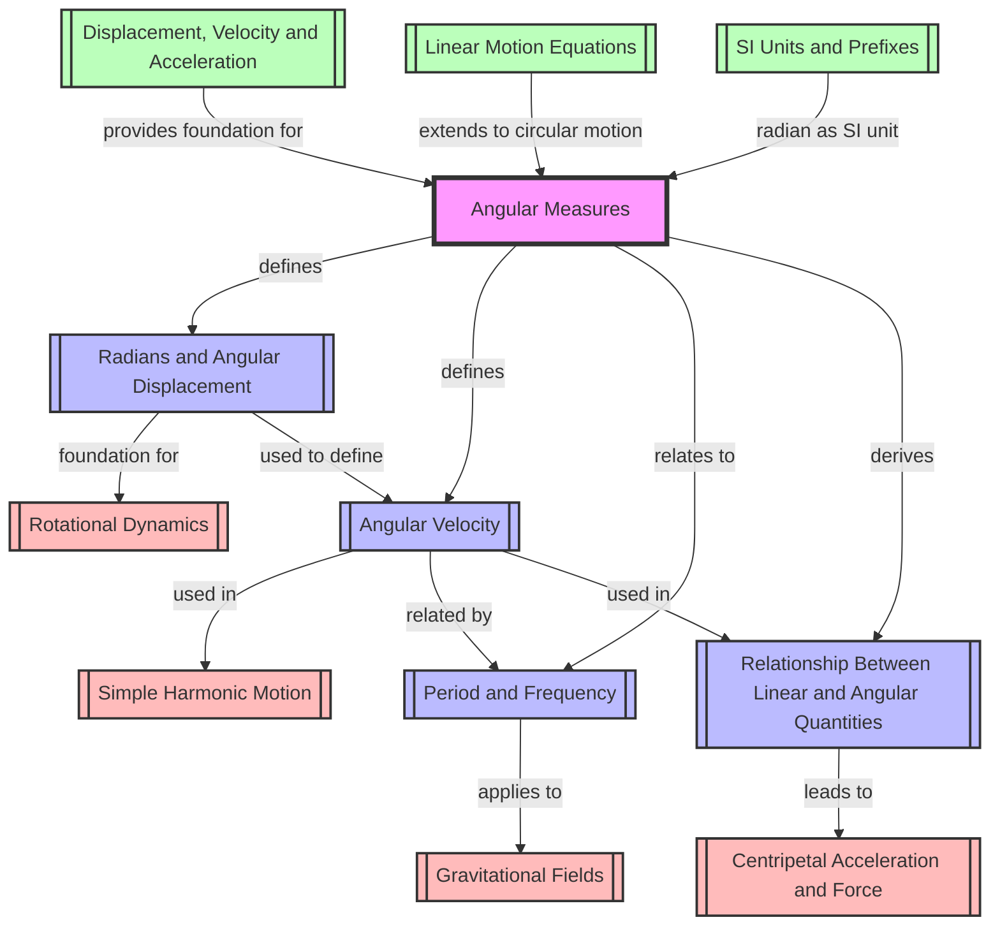

# 1. Overview / 概述

**English:**
Angular Measures is the foundational topic for understanding [[Circular Motion]] in A-Level Physics. This topic introduces the concept of measuring rotation using radians instead of degrees, defining angular displacement ($\theta$), angular velocity ($\omega$), and the relationships between linear and angular quantities. It bridges the gap between [[Linear Motion]] (studied in AS) and rotational dynamics.

In real-world applications, angular measures are essential for understanding:
- Rotating machinery (turbines, engines, wheels)
- Planetary motion and satellite orbits
- Medical imaging (CT scans, MRI rotating gantries)
- Sports physics (golf swing, figure skating spins)
- Navigation systems (gyroscopes, compasses)

For Cambridge 9702 (Paper 4) and Edexcel IAL (Unit 4), this topic forms the mathematical backbone for [[Centripetal Acceleration and Force]], [[Simple Harmonic Motion]], and [[Gravitational Fields]]. Examiners frequently test the conversion between degrees and radians, calculation of angular velocity, and the derivation of linear speed from angular speed.

**中文：**
角度测量是理解A-Level物理中[[圆周运动]]的基础性课题。本课题介绍了使用弧度而非角度来测量旋转的概念，定义了角位移（$\theta$）、角速度（$\omega$）以及线量与角量之间的关系。它连接了AS阶段学习的[[直线运动]]与旋转动力学。

在实际应用中，角度测量对于理解以下内容至关重要：
- 旋转机械（涡轮机、发动机、车轮）
- 行星运动和卫星轨道
- 医学成像（CT扫描、MRI旋转机架）
- 运动物理学（高尔夫挥杆、花样滑冰旋转）
- 导航系统（陀螺仪、罗盘）

对于剑桥9702（试卷4）和爱德思IAL（单元4），本课题构成了[[向心加速度与力]]、[[简谐运动]]和[[引力场]]的数学基础。考官经常测试度与弧度的转换、角速度的计算以及从角速度推导线速度。

---

# 2. Syllabus Learning Objectives / 考纲学习目标

**English:**
The following table maps the specific learning objectives from both examination boards. Note that while the content is similar, the numbering and emphasis differ slightly.

**中文：**
下表列出了两个考试委员会的具体学习目标。请注意，虽然内容相似，但编号和侧重点略有不同。

| CAIE 9702 (14.1) | Edexcel IAL (WPH14 U4: 5.1-5.4) |
|------------------|----------------------------------|
| (a) Define the radian | 5.1 Understand the concept of angular displacement and the radian |
| (b) Express angular displacement in radians and degrees | 5.2 Convert between degrees and radians |
| (c) Define angular velocity $\omega$ | 5.3 Define angular velocity $\omega = \frac{\Delta\theta}{\Delta t}$ |
| (d) Use $v = \omega r$ | 5.4 Derive and use $v = \omega r$ and $a = \omega^2 r$ |
| (e) Understand that centripetal acceleration $a = \frac{v^2}{r} = \omega^2 r$ | (Covered in 5.4) |

> 📋 **CIE Only:** CAIE explicitly requires understanding that centripetal acceleration can be expressed in two forms ($a = v^2/r$ and $a = \omega^2 r$). This is tested in Paper 4 structured questions.

> 📋 **Edexcel Only:** Edexcel explicitly requires derivation of $v = \omega r$ from first principles using arc length $s = r\theta$. This derivation is commonly tested in Unit 4 Section A (multiple choice) and Section B (long answer).

**Examiner Expectations / 考官期望：**

**English:**
- You must be able to define the radian without reference to degrees
- You must show full working when converting between degrees and radians
- You must state the formula before substituting numbers
- You must use correct SI units (rad s⁻¹ for angular velocity, m s⁻¹ for linear speed)
- You must distinguish between angular displacement (scalar or vector depending on context) and angular speed (scalar)

**中文：**
- 必须能够在不参考角度的情况下定义弧度
- 在度与弧度之间转换时必须展示完整步骤
- 在代入数字之前必须写出公式
- 必须使用正确的SI单位（角速度为rad s⁻¹，线速度为m s⁻¹）
- 必须区分角位移（根据上下文可为标量或矢量）和角速率（标量）

---

# 3. Core Definitions / 核心定义

**English:**
The following table provides exam-standard definitions for all key terms in this topic. Pay special attention to the "Common Mistakes" column.

**中文：**
下表提供了本课题所有关键术语的考试标准定义。请特别注意"常见错误"一栏。

| Term (EN/CN) | Definition (EN) | Definition (CN) | Common Mistakes / 常见错误 |
|--------------|-----------------|-----------------|---------------------------|
| **Radian / 弧度** | The angle subtended at the centre of a circle by an arc equal in length to the radius of the circle | 在圆中，弧长等于半径时所对应的圆心角 | ❌ Saying "57.3°" as definition (this is a conversion, not a definition) |
| **Angular Displacement / 角位移** | The angle through which a point or line has been rotated in a specified direction about a specified axis | 一个点或线绕指定轴在指定方向上旋转过的角度 | ❌ Confusing with angular distance (total angle turned, ignoring direction) |
| **Angular Velocity / 角速度** | The rate of change of angular displacement, $\omega = \frac{\Delta\theta}{\Delta t}$ | 角位移的变化率，$\omega = \frac{\Delta\theta}{\Delta t}$ | ❌ Forgetting it is a vector (direction given by right-hand rule) |
| **Period / 周期** | The time taken for one complete revolution or cycle | 完成一次完整旋转或循环所需的时间 | ❌ Confusing with frequency (they are reciprocals) |
| **Frequency / 频率** | The number of complete revolutions or cycles per unit time | 单位时间内完成的完整旋转或循环次数 | ❌ Using degrees per second instead of revolutions per second |
| **Linear Speed / 线速度** | The distance travelled per unit time along a circular path, $v = \omega r$ | 沿圆形路径单位时间内行进的距离，$v = \omega r$ | ❌ Confusing with angular speed (different units and meaning) |

> 📋 **Edexcel Only:** Edexcel definitions often require the phrase "rate of change of..." for angular velocity. CIE accepts "angle turned per unit time" but Edexcel is stricter.

---

# 4. Key Concepts Explained / 关键概念详解

## 4.1 The Radian / 弧度

### Explanation / 解释
**English:**
The radian is the SI unit of angular measure. One radian is defined as the angle subtended at the centre of a circle by an arc whose length equals the radius of the circle. This is a natural unit because it relates angle directly to arc length: $s = r\theta$ where $\theta$ is in radians.

The relationship between radians and degrees comes from the circumference of a circle:
- Full circle: $2\pi$ radians = 360°
- Half circle: $\pi$ radians = 180°
- Quarter circle: $\frac{\pi}{2}$ radians = 90°

To convert:
- Degrees to radians: $\theta_{\text{rad}} = \theta_{\text{deg}} \times \frac{\pi}{180}$
- Radians to degrees: $\theta_{\text{deg}} = \theta_{\text{rad}} \times \frac{180}{\pi}$

**中文：**
弧度是角度的SI单位。一弧度定义为圆中弧长等于半径时所对应的圆心角。这是一个自然单位，因为它直接将角度与弧长联系起来：$s = r\theta$，其中$\theta$以弧度为单位。

弧度与度之间的关系来自圆的周长：
- 整圆：$2\pi$弧度 = 360°
- 半圆：$\pi$弧度 = 180°
- 四分之一圆：$\frac{\pi}{2}$弧度 = 90°

转换方法：
- 度转弧度：$\theta_{\text{rad}} = \theta_{\text{deg}} \times \frac{\pi}{180}$
- 弧度转度：$\theta_{\text{deg}} = \theta_{\text{rad}} \times \frac{180}{\pi}$

### Physical Meaning / 物理意义
**English:**
The radian is dimensionless because it is a ratio of two lengths (arc length / radius). This makes it a "pure number" — it has no physical dimension. This is why angular velocity has units of s⁻¹ (radians are not a base SI unit in the same way as metres or seconds).

**中文：**
弧度是无量纲的，因为它是两个长度（弧长/半径）的比值。这使其成为一个"纯数"——它没有物理量纲。这就是为什么角速度的单位是s⁻¹（弧度不像米或秒那样是基本SI单位）。

### Common Misconceptions / 常见误区
1. ❌ Thinking radians are a "real" unit like metres — they are dimensionless
2. ❌ Using degrees in calculus formulas — all calculus with angles requires radians
3. ❌ Confusing $\pi$ radians with 3.14 radians — $\pi$ rad = 180°, not 3.14 rad

### Exam Tips / 考试提示
**English:**
- Always check if your calculator is in radian mode when doing trigonometric calculations
- When deriving $v = \omega r$, you must use radians for the relationship to hold
- CIE Paper 4 often asks: "Define the radian" (2 marks) — memorise the exact wording

**中文：**
- 进行三角函数计算时，务必检查计算器是否处于弧度模式
- 推导$v = \omega r$时，必须使用弧度才能使关系成立
- CIE试卷4经常问："定义弧度"（2分）——记住确切的措辞

---

## 4.2 Angular Displacement / 角位移

### Explanation / 解释
**English:**
Angular displacement ($\theta$) is the angle through which an object rotates. Unlike linear displacement, angular displacement can be treated as a vector in advanced physics (direction given by the right-hand rule), but at A-Level it is usually treated as a scalar quantity.

Key points:
- Measured in radians (rad)
- For one complete revolution: $\theta = 2\pi$ rad
- For $n$ revolutions: $\theta = 2\pi n$ rad
- Direction is usually specified as clockwise or anticlockwise

**中文：**
角位移（$\theta$）是物体旋转过的角度。与线位移不同，在高级物理中角位移可以被视为矢量（方向由右手定则给出），但在A-Level中通常被视为标量。

关键点：
- 以弧度（rad）为单位
- 完整旋转一周：$\theta = 2\pi$ rad
- $n$次旋转：$\theta = 2\pi n$ rad
- 方向通常指定为顺时针或逆时针

### Physical Meaning / 物理意义
**English:**
Imagine a point on a rotating wheel. After the wheel turns through some angle, that point has undergone angular displacement. The actual distance travelled along the circular path is the arc length $s = r\theta$.

**中文：**
想象旋转轮子上的一个点。轮子转过一定角度后，该点经历了角位移。沿圆形路径实际行进的距离是弧长$s = r\theta$。

### Common Misconceptions / 常见误区
1. ❌ Thinking angular displacement is the same as the number of rotations — it's the net angle, not total
2. ❌ Forgetting to specify direction when required

### Exam Tips / 考试提示
**English:**
- In multiple choice questions, be careful: "angular displacement" may refer to the angle between initial and final positions, not the total angle turned
- For objects moving in a circle and returning to start, angular displacement = 0 (but angular distance = $2\pi$)

**中文：**
- 在选择题中要小心："角位移"可能指初始位置和最终位置之间的角度，而不是总转过的角度
- 对于做圆周运动并返回起点的物体，角位移 = 0（但角距离 = $2\pi$）

---

## 4.3 Angular Velocity / 角速度

### Explanation / 解释
**English:**
Angular velocity ($\omega$) is the rate of change of angular displacement. For uniform circular motion (constant speed), it is given by:

$$\omega = \frac{\Delta\theta}{\Delta t}$$

For one complete revolution:
$$\omega = \frac{2\pi}{T} = 2\pi f$$

Where:
- $T$ = period (time for one revolution)
- $f$ = frequency (revolutions per second)

Angular velocity is a vector quantity. The direction is perpendicular to the plane of rotation, given by the right-hand grip rule.

**中文：**
角速度（$\omega$）是角位移的变化率。对于匀速圆周运动（恒定速率），由下式给出：

$$\omega = \frac{\Delta\theta}{\Delta t}$$

对于完整旋转一周：
$$\omega = \frac{2\pi}{T} = 2\pi f$$

其中：
- $T$ = 周期（旋转一周所需时间）
- $f$ = 频率（每秒旋转次数）

角速度是矢量。方向垂直于旋转平面，由右手螺旋定则给出。

### Physical Meaning / 物理意义
**English:**
Angular velocity tells us how fast something is spinning. A record player at 33⅓ rpm has $\omega = 3.49$ rad s⁻¹. The Earth's rotation gives $\omega = 7.27 \times 10^{-5}$ rad s⁻¹.

**中文：**
角速度告诉我们物体旋转的快慢。33⅓ rpm的唱片机具有$\omega = 3.49$ rad s⁻¹。地球自转的$\omega = 7.27 \times 10^{-5}$ rad s⁻¹。

### Common Misconceptions / 常见误区
1. ❌ Confusing angular velocity with linear velocity — they are related but different
2. ❌ Forgetting that $\omega$ is constant for uniform circular motion
3. ❌ Using degrees per second instead of radians per second

### Exam Tips / 考试提示
**English:**
- Always convert rpm (revolutions per minute) to rad s⁻¹: $\omega = \frac{2\pi \times \text{rpm}}{60}$
- CIE and Edexcel both expect you to know $\omega = \frac{2\pi}{T} = 2\pi f$ without derivation
- For non-uniform circular motion, $\omega$ is not constant and instantaneous angular velocity is $\omega = \frac{d\theta}{dt}$

**中文：**
- 始终将rpm（每分钟转数）转换为rad s⁻¹：$\omega = \frac{2\pi \times \text{rpm}}{60}$
- CIE和Edexcel都期望你知道$\omega = \frac{2\pi}{T} = 2\pi f$而无需推导
- 对于非匀速圆周运动，$\omega$不是常数，瞬时角速度为$\omega = \frac{d\theta}{dt}$

---

## 4.4 Relationship Between Linear and Angular Quantities / 线量与角量的关系

### Explanation / 解释
**English:**
The bridge between linear and angular motion is the radius $r$. For a point at distance $r$ from the centre of rotation:

**Arc length:** $s = r\theta$ (where $\theta$ in radians)

**Linear speed:** $v = \omega r$

**Centripetal acceleration:** $a = \frac{v^2}{r} = \omega^2 r$

**Centripetal force:** $F = \frac{mv^2}{r} = m\omega^2 r$

The derivation of $v = \omega r$:
1. Arc length $s = r\theta$
2. Linear speed $v = \frac{s}{t} = \frac{r\theta}{t}$
3. But $\frac{\theta}{t} = \omega$, so $v = \omega r$

**中文：**
连接线运动和角运动的桥梁是半径$r$。对于距离旋转中心$r$的点：

**弧长：** $s = r\theta$（$\theta$以弧度为单位）

**线速度：** $v = \omega r$

**向心加速度：** $a = \frac{v^2}{r} = \omega^2 r$

**向心力：** $F = \frac{mv^2}{r} = m\omega^2 r$

$v = \omega r$的推导：
1. 弧长 $s = r\theta$
2. 线速度 $v = \frac{s}{t} = \frac{r\theta}{t}$
3. 而 $\frac{\theta}{t} = \omega$，所以 $v = \omega r$

### Physical Meaning / 物理意义
**English:**
This relationship explains why:
- The outer edge of a rotating disc moves faster than points near the centre
- A longer lever arm gives greater linear speed for the same angular speed
- Gears of different sizes rotate at different angular speeds when connected

**中文：**
这个关系解释了为什么：
- 旋转圆盘的外缘比靠近中心的点移动得更快
- 对于相同的角速度，更长的力臂产生更大的线速度
- 不同尺寸的齿轮连接时以不同的角速度旋转

### Common Misconceptions / 常见误区
1. ❌ Thinking $v = \omega r$ applies to all points on a rotating object — it only applies to points at distance $r$ from axis
2. ❌ Forgetting that $\omega$ must be in rad s⁻¹ for $v = \omega r$ to work
3. ❌ Confusing centripetal acceleration with tangential acceleration

### Exam Tips / 考试提示
**English:**
- Edexcel often asks for the derivation of $v = \omega r$ (3-4 marks)
- CIE often asks to show that $a = \omega^2 r$ using $a = v^2/r$ and $v = \omega r$
- When given linear speed and radius, always calculate $\omega$ first before finding period or frequency

**中文：**
- 爱德思经常要求推导$v = \omega r$（3-4分）
- CIE经常要求使用$a = v^2/r$和$v = \omega r$来证明$a = \omega^2 r$
- 当给定线速度和半径时，在求周期或频率之前始终先计算$\omega$

---

# 5. Essential Equations / 核心公式

## 5.1 Arc Length Equation / 弧长公式

**Equation / 公式:**
$$s = r\theta$$

**Variables / 变量:**
| Symbol (符号) | Meaning (EN) | Meaning (CN) | Unit (单位) |
|--------------|-------------|-------------|------------|
| $s$ | Arc length | 弧长 | m |
| $r$ | Radius of circle | 圆的半径 | m |
| $\theta$ | Angular displacement (in radians) | 角位移（弧度） | rad |

**Derivation / 推导:**
**English:**
By definition, 1 radian subtends an arc of length $r$. Therefore, $\theta$ radians subtend an arc of length $\theta \times r = r\theta$.

**中文：**
根据定义，1弧度对应弧长$r$。因此，$\theta$弧度对应弧长$\theta \times r = r\theta$。

**Conditions / 适用条件:**
- $\theta$ must be in radians
- The arc is part of a circle of radius $r$

**Limitations / 局限性:**
- Does not apply to non-circular paths
- For very large $\theta$ (multiple revolutions), $s$ is the total distance along the path, not displacement

**Rearrangements / 变形:**
- $\theta = \frac{s}{r}$
- $r = \frac{s}{\theta}$

---

## 5.2 Angular Velocity Equation / 角速度公式

**Equation / 公式:**
$$\omega = \frac{\Delta\theta}{\Delta t}$$

**Variables / 变量:**
| Symbol (符号) | Meaning (EN) | Meaning (CN) | Unit (单位) |
|--------------|-------------|-------------|------------|
| $\omega$ | Angular velocity | 角速度 | rad s⁻¹ |
| $\Delta\theta$ | Change in angular displacement | 角位移的变化量 | rad |
| $\Delta t$ | Time interval | 时间间隔 | s |

**Derivation / 推导:**
**English:**
Angular velocity is defined as the rate of change of angular displacement. For uniform circular motion, this is constant.

**中文：**
角速度定义为角位移的变化率。对于匀速圆周运动，这是常数。

**Conditions / 适用条件:**
- For uniform circular motion, $\omega$ is constant
- For non-uniform motion, this gives average angular velocity

**Limitations / 局限性:**
- For non-uniform motion, instantaneous angular velocity requires calculus: $\omega = \frac{d\theta}{dt}$

**Rearrangements / 变形:**
- $\Delta\theta = \omega \Delta t$
- $\Delta t = \frac{\Delta\theta}{\omega}$

---

## 5.3 Angular Velocity in Terms of Period and Frequency / 用周期和频率表示的角速度

**Equation / 公式:**
$$\omega = \frac{2\pi}{T} = 2\pi f$$

**Variables / 变量:**
| Symbol (符号) | Meaning (EN) | Meaning (CN) | Unit (单位) |
|--------------|-------------|-------------|------------|
| $\omega$ | Angular velocity | 角速度 | rad s⁻¹ |
| $T$ | Period | 周期 | s |
| $f$ | Frequency | 频率 | Hz (s⁻¹) |

**Derivation / 推导:**
**English:**
For one complete revolution, $\Delta\theta = 2\pi$ rad and $\Delta t = T$. Therefore:
$$\omega = \frac{2\pi}{T}$$
Since $f = \frac{1}{T}$, we also have $\omega = 2\pi f$.

**中文：**
对于完整旋转一周，$\Delta\theta = 2\pi$ rad且$\Delta t = T$。因此：
$$\omega = \frac{2\pi}{T}$$
由于$f = \frac{1}{T}$，我们也有$\omega = 2\pi f$。

**Conditions / 适用条件:**
- Only for complete revolutions (or cycles)
- $T$ and $f$ must be for the same motion

**Limitations / 局限性:**
- Does not apply to partial revolutions directly

**Rearrangements / 变形:**
- $T = \frac{2\pi}{\omega}$
- $f = \frac{\omega}{2\pi}$

---

## 5.4 Linear Speed from Angular Speed / 从角速度求线速度

**Equation / 公式:**
$$v = \omega r$$

**Variables / 变量:**
| Symbol (符号) | Meaning (EN) | Meaning (CN) | Unit (单位) |
|--------------|-------------|-------------|------------|
| $v$ | Linear speed | 线速度 | m s⁻¹ |
| $\omega$ | Angular velocity | 角速度 | rad s⁻¹ |
| $r$ | Radius of circular path | 圆形路径的半径 | m |

**Derivation / 推导:**
**English:**
Starting from arc length: $s = r\theta$
Divide both sides by time: $\frac{s}{t} = r\frac{\theta}{t}$
But $\frac{s}{t} = v$ (linear speed) and $\frac{\theta}{t} = \omega$ (angular velocity)
Therefore: $v = \omega r$

**中文：**
从弧长开始：$s = r\theta$
两边除以时间：$\frac{s}{t} = r\frac{\theta}{t}$
而$\frac{s}{t} = v$（线速度）且$\frac{\theta}{t} = \omega$（角速度）
因此：$v = \omega r$

**Conditions / 适用条件:**
- $\omega$ must be in rad s⁻¹
- $r$ is the perpendicular distance from the axis of rotation

**Limitations / 局限性:**
- Only gives speed, not velocity (direction changes continuously)
- For points not on a circular path, this does not apply

**Rearrangements / 变形:**
- $\omega = \frac{v}{r}$
- $r = \frac{v}{\omega}$

---

## 5.5 Centripetal Acceleration / 向心加速度

**Equation / 公式:**
$$a = \frac{v^2}{r} = \omega^2 r$$

**Variables / 变量:**
| Symbol (符号) | Meaning (EN) | Meaning (CN) | Unit (单位) |
|--------------|-------------|-------------|------------|
| $a$ | Centripetal acceleration | 向心加速度 | m s⁻² |
| $v$ | Linear speed | 线速度 | m s⁻¹ |
| $\omega$ | Angular velocity | 角速度 | rad s⁻¹ |
| $r$ | Radius of circular path | 圆形路径的半径 | m |

**Derivation / 推导:**
**English:**
Using $v = \omega r$ and substituting into $a = \frac{v^2}{r}$:
$$a = \frac{(\omega r)^2}{r} = \frac{\omega^2 r^2}{r} = \omega^2 r$$

**中文：**
使用$v = \omega r$并代入$a = \frac{v^2}{r}$：
$$a = \frac{(\omega r)^2}{r} = \frac{\omega^2 r^2}{r} = \omega^2 r$$

**Conditions / 适用条件:**
- Uniform circular motion (constant speed)
- Acceleration is always directed towards the centre

**Limitations / 局限性:**
- Does not account for tangential acceleration (if speed is changing)

**Rearrangements / 变形:**
- $v = \sqrt{ar}$
- $\omega = \sqrt{\frac{a}{r}}$
- $r = \frac{v^2}{a} = \frac{a}{\omega^2}$

---

# 6. Graphs and Relationships / 图表与关系

## 6.1 Angular Displacement vs Time (Uniform Motion) / 角位移-时间图（匀速运动）

### Axes / 坐标轴
- x-axis: Time $t$ (s)
- y-axis: Angular displacement $\theta$ (rad)

### Shape / 形状
**English:**
A straight line through the origin with positive gradient. The gradient equals the angular velocity $\omega$.

**中文：**
一条通过原点的直线，斜率为正。斜率等于角速度$\omega$。

### Gradient Meaning / 斜率含义
$$\text{Gradient} = \frac{\Delta\theta}{\Delta t} = \omega$$

### Area Meaning / 面积含义
**English:**
The area under the graph has no physical meaning in this context.

**中文：**
该图下方的面积在此上下文中没有物理意义。

### Exam Interpretation / 考试解读
**English:**
- Steeper line = higher angular velocity
- Horizontal line = no rotation ($\omega = 0$)
- Curved line = non-uniform angular velocity (acceleration)

**中文：**
- 线越陡 = 角速度越大
- 水平线 = 无旋转（$\omega = 0$）
- 曲线 = 非均匀角速度（有角加速度）

### Common Questions / 常见问题
- "Calculate the angular velocity from the gradient" (2 marks)
- "Determine the angular displacement after 5.0 s" (1 mark)

> 📷 **IMAGE PROMPT — GRAPH-01: Angular Displacement vs Time Graph**
>
> A Cartesian graph with time on the x-axis (0 to 10 s) and angular displacement on the y-axis (0 to 20π rad). A straight line passes through the origin with gradient 2π rad s⁻¹. The axes are labelled with units. The graph has a clean, textbook-style appearance with gridlines.

---

## 6.2 Angular Velocity vs Time (Uniform Motion) / 角速度-时间图（匀速运动）

### Axes / 坐标轴
- x-axis: Time $t$ (s)
- y-axis: Angular velocity $\omega$ (rad s⁻¹)

### Shape / 形状
**English:**
A horizontal straight line at $\omega = \text{constant}$.

**中文：**
一条在$\omega = \text{常数}$处的水平直线。

### Gradient Meaning / 斜率含义
$$\text{Gradient} = \frac{\Delta\omega}{\Delta t} = \alpha \text{ (angular acceleration)}$$
For uniform motion, gradient = 0.

### Area Meaning / 面积含义
$$\text{Area under graph} = \omega \times t = \Delta\theta \text{ (angular displacement)}$$

### Exam Interpretation / 考试解读
**English:**
- Horizontal line = constant angular velocity
- Area under graph = total angular displacement
- Non-horizontal line = angular acceleration present

**中文：**
- 水平线 = 恒定角速度
- 图下面积 = 总角位移
- 非水平线 = 存在角加速度

### Common Questions / 常见问题
- "Calculate the angular displacement from the area under the graph" (2 marks)
- "Determine the time for a given angular displacement" (1 mark)

> 📷 **IMAGE PROMPT — GRAPH-02: Angular Velocity vs Time Graph**
>
> A Cartesian graph with time on the x-axis (0 to 10 s) and angular velocity on the y-axis (0 to 10 rad s⁻¹). A horizontal line at ω = 5 rad s⁻¹ extends from t=0 to t=10 s. The area under the line is shaded to represent angular displacement. Axes are labelled with units.

---

## 6.3 Linear Speed vs Radius (Constant Angular Velocity) / 线速度-半径图（恒定角速度）

### Axes / 坐标轴
- x-axis: Radius $r$ (m)
- y-axis: Linear speed $v$ (m s⁻¹)

### Shape / 形状
**English:**
A straight line through the origin with gradient $\omega$.

**中文：**
一条通过原点的直线，斜率为$\omega$。

### Gradient Meaning / 斜率含义
$$\text{Gradient} = \frac{v}{r} = \omega$$

### Area Meaning / 面积含义
**English:**
The area under the graph has no standard physical meaning.

**中文：**
该图下方的面积没有标准的物理意义。

### Exam Interpretation / 考试解读
**English:**
- Steeper line = higher angular velocity
- Points on the same rotating object lie on the same line
- Different objects have different gradients

**中文：**
- 线越陡 = 角速度越大
- 同一旋转物体上的点位于同一条线上
- 不同物体有不同的斜率

### Common Questions / 常见问题
- "Determine the angular velocity from the gradient" (2 marks)
- "Find the linear speed at a given radius" (1 mark)

> 📷 **IMAGE PROMPT — GRAPH-03: Linear Speed vs Radius**
>
> A Cartesian graph with radius on the x-axis (0 to 5 m) and linear speed on the y-axis (0 to 20 m s⁻¹). A straight line through the origin with gradient 4 rad s⁻¹. Three data points are plotted on the line. Axes are labelled with units.

---

# 7. Required Diagrams / 必备图表

## 7.1 Definition of the Radian / 弧度的定义

### Description / 描述
**English:**
A circle with centre O. An arc AB of length equal to the radius r is shown. The angle AOB is marked as 1 radian. The radius OA and OB are drawn. The arc AB is highlighted.

**中文：**
一个圆心为O的圆。显示弧AB的长度等于半径r。角AOB被标记为1弧度。半径OA和OB被画出。弧AB被突出显示。

### Image Prompt / 图片生成提示
> 📷 **IMAGE PROMPT — DIAG-01: Definition of the Radian**
>
> A clean, textbook-style diagram of a circle with centre O. Two radii OA and OB are drawn. The arc AB between points A and B is highlighted in a different colour. The arc length is labelled "r" (same as radius). The angle AOB is labelled "θ = 1 rad". The diagram should be simple, with clear labels, white background, and professional appearance suitable for an A-Level textbook.

### Labels Required / 需要标注
- Centre O / 圆心O
- Radius OA = r / 半径OA = r
- Radius OB = r / 半径OB = r
- Arc AB = r / 弧AB = r
- Angle AOB = 1 radian / 角AOB = 1弧度

### Exam Importance / 考试重要性
**English:**
This diagram is essential for the definition question: "Define the radian" (2 marks). CIE and Edexcel both expect you to be able to draw and label this diagram.

**中文：**
此图对于定义问题至关重要："定义弧度"（2分）。CIE和Edexcel都期望你能画出并标注此图。

---

## 7.2 Angular Displacement and Arc Length / 角位移与弧长

### Description / 描述
**English:**
A circle with centre O. A point P moves along the circumference from position P₁ to P₂. The angular displacement θ is shown at the centre. The arc length s is shown along the circumference. The radius r is shown.

**中文：**
一个圆心为O的圆。点P沿圆周从位置P₁移动到P₂。角位移θ显示在圆心处。弧长s显示在圆周上。半径r被显示。

### Image Prompt / 图片生成提示
> 📷 **IMAGE PROMPT — DIAG-02: Angular Displacement and Arc Length**
>
> A circle with centre O. Two positions of a point P (P₁ and P₂) are shown on the circumference. The angle at the centre between OP₁ and OP₂ is labelled "θ". The curved path along the circumference from P₁ to P₂ is labelled "s = rθ". The radius is labelled "r". Use different colours for the angle, arc, and radius. Clean, textbook-style with white background.

### Labels Required / 需要标注
- Centre O / 圆心O
- Radius r / 半径r
- Angular displacement θ / 角位移θ
- Arc length s = rθ / 弧长s = rθ
- Initial position P₁ / 初始位置P₁
- Final position P₂ / 最终位置P₂

### Exam Importance / 考试重要性
**English:**
This diagram is used to derive $v = \omega r$ and to explain the relationship between linear and angular quantities. It appears in both CIE and Edexcel past papers.

**中文：**
此图用于推导$v = \omega r$并解释线量与角量之间的关系。它出现在CIE和Edexcel的历年试卷中。

---

## 7.3 Right-Hand Grip Rule for Angular Velocity / 角速度的右手螺旋定则

### Description / 描述
**English:**
A diagram showing a rotating object (e.g., a wheel or disc) with the axis of rotation. The right hand is shown gripping the axis with fingers curling in the direction of rotation. The thumb points in the direction of the angular velocity vector.

**中文：**
一个显示旋转物体（如轮子或圆盘）及其旋转轴的图。右手握住轴，手指弯曲指向旋转方向。拇指指向角速度矢量的方向。

### Image Prompt / 图片生成提示
> 📷 **IMAGE PROMPT — DIAG-03: Right-Hand Grip Rule**
>
> A 3D-style diagram showing a rotating disc with its axis vertical. A right hand is shown gripping the axis. The fingers curl in the direction of rotation (anticlockwise when viewed from above). The thumb points upward, labelled "ω". The disc has arrows showing the direction of rotation. Clean, educational style with clear labels. Use a light background.

### Labels Required / 需要标注
- Axis of rotation / 旋转轴
- Direction of rotation / 旋转方向
- Angular velocity vector ω / 角速度矢量ω
- Right hand / 右手

### Exam Importance / 考试重要性
**English:**
Edexcel specifically tests the vector nature of angular velocity. This diagram helps visualise the direction. CIE may ask about the direction of angular velocity in vector questions.

**中文：**
Edexcel特别测试角速度的矢量性质。此图有助于可视化方向。CIE可能在矢量问题中问到角速度的方向。

---

# 8. Worked Examples / 典型例题

## Example 1: Converting Degrees to Radians and Calculating Angular Velocity / 例1：度转弧度与角速度计算

### Question / 题目
**English:**
A fan blade rotates at 1200 revolutions per minute (rpm).
(a) Convert this angular speed to radians per second.
(b) Calculate the period of rotation.
(c) If the blade has a radius of 0.15 m, calculate the linear speed of a point on the tip.

**中文：**
一个风扇叶片以每分钟1200转（rpm）旋转。
(a) 将此角速度转换为弧度每秒。
(b) 计算旋转周期。
(c) 如果叶片半径为0.15 m，计算叶片尖端一点的线速度。

### Solution / 解答

**Part (a): Convert rpm to rad s⁻¹**

**English:**
Step 1: Convert revolutions per minute to revolutions per second:
$$f = \frac{1200}{60} = 20 \text{ Hz}$$

Step 2: Convert to angular velocity:
$$\omega = 2\pi f = 2\pi \times 20 = 40\pi \text{ rad s}^{-1}$$
$$\omega = 125.7 \text{ rad s}^{-1} \text{ (3 s.f.)}$$

**中文：**
步骤1：将每分钟转数转换为每秒转数：
$$f = \frac{1200}{60} = 20 \text{ Hz}$$

步骤2：转换为角速度：
$$\omega = 2\pi f = 2\pi \times 20 = 40\pi \text{ rad s}^{-1}$$
$$\omega = 125.7 \text{ rad s}^{-1} \text{（3位有效数字）}$$

**Part (b): Calculate period**

**English:**
$$T = \frac{1}{f} = \frac{1}{20} = 0.050 \text{ s}$$
Alternatively: $T = \frac{2\pi}{\omega} = \frac{2\pi}{40\pi} = 0.050 \text{ s}$

**中文：**
$$T = \frac{1}{f} = \frac{1}{20} = 0.050 \text{ s}$$
或者：$T = \frac{2\pi}{\omega} = \frac{2\pi}{40\pi} = 0.050 \text{ s}$

**Part (c): Calculate linear speed**

**English:**
$$v = \omega r = 40\pi \times 0.15 = 6\pi \text{ m s}^{-1}$$
$$v = 18.8 \text{ m s}^{-1} \text{ (3 s.f.)}$$

**中文：**
$$v = \omega r = 40\pi \times 0.15 = 6\pi \text{ m s}^{-1}$$
$$v = 18.8 \text{ m s}^{-1} \text{（3位有效数字）}$$

### Final Answer / 最终答案
**Answer:** (a) $\omega = 40\pi$ rad s⁻¹ (125.7 rad s⁻¹) | **答案：** (a) $\omega = 40\pi$ rad s⁻¹ (125.7 rad s⁻¹)
**Answer:** (b) $T = 0.050$ s | **答案：** (b) $T = 0.050$ s
**Answer:** (c) $v = 6\pi$ m s⁻¹ (18.8 m s⁻¹) | **答案：** (c) $v = 6\pi$ m s⁻¹ (18.8 m s⁻¹)

### Examiner Notes / 考官点评
**English:**
- Common mistake: forgetting to divide by 60 when converting rpm to Hz
- Always show the formula before substitution
- Leave answers in terms of $\pi$ where possible (examiners prefer exact forms)
- Check significant figures: 1200 has 2 s.f., so answer should have 2-3 s.f.

**中文：**
- 常见错误：将rpm转换为Hz时忘记除以60
- 始终在代入前写出公式
- 尽可能保留$\pi$形式（考官更喜欢精确形式）
- 检查有效数字：1200有2位有效数字，所以答案应有2-3位有效数字

---

## Example 2: Using Angular Measures in a Circular Motion Problem / 例2：在圆周运动问题中使用角度测量

### Question / 题目
**English:**
A particle moves on a circular path of radius 2.5 m. It completes 3.5 revolutions in 14.0 seconds.
(a) Calculate the angular displacement in radians.
(b) Calculate the angular velocity.
(c) Calculate the linear speed.
(d) Calculate the centripetal acceleration.

**中文：**
一个质点在半径为2.5 m的圆形路径上运动。它在14.0秒内完成3.5次旋转。
(a) 计算以弧度为单位的角位移。
(b) 计算角速度。
(c) 计算线速度。
(d) 计算向心加速度。

### Solution / 解答

**Part (a): Angular displacement**

**English:**
Each revolution is $2\pi$ radians.
$$\theta = 3.5 \times 2\pi = 7\pi \text{ rad}$$
$$\theta = 22.0 \text{ rad (3 s.f.)}$$

**中文：**
每次旋转为$2\pi$弧度。
$$\theta = 3.5 \times 2\pi = 7\pi \text{ rad}$$
$$\theta = 22.0 \text{ rad（3位有效数字）}$$

**Part (b): Angular velocity**

**English:**
$$\omega = \frac{\Delta\theta}{\Delta t} = \frac{7\pi}{14.0} = \frac{\pi}{2} \text{ rad s}^{-1}$$
$$\omega = 1.57 \text{ rad s}^{-1} \text{ (3 s.f.)}$$

**中文：**
$$\omega = \frac{\Delta\theta}{\Delta t} = \frac{7\pi}{14.0} = \frac{\pi}{2} \text{ rad s}^{-1}$$
$$\omega = 1.57 \text{ rad s}^{-1} \text{（3位有效数字）}$$

**Part (c): Linear speed**

**English:**
$$v = \omega r = \frac{\pi}{2} \times 2.5 = 1.25\pi \text{ m s}^{-1}$$
$$v = 3.93 \text{ m s}^{-1} \text{ (3 s.f.)}$$

**中文：**
$$v = \omega r = \frac{\pi}{2} \times 2.5 = 1.25\pi \text{ m s}^{-1}$$
$$v = 3.93 \text{ m s}^{-1} \text{（3位有效数字）}$$

**Part (d): Centripetal acceleration**

**English:**
Using $a = \omega^2 r$:
$$a = \left(\frac{\pi}{2}\right)^2 \times 2.5 = \frac{\pi^2}{4} \times 2.5 = \frac{2.5\pi^2}{4} \text{ m s}^{-2}$$
$$a = 6.17 \text{ m s}^{-2} \text{ (3 s.f.)}$$

Alternatively, using $a = \frac{v^2}{r}$:
$$a = \frac{(1.25\pi)^2}{2.5} = \frac{1.5625\pi^2}{2.5} = 0.625\pi^2 = 6.17 \text{ m s}^{-2}$$

**中文：**
使用$a = \omega^2 r$：
$$a = \left(\frac{\pi}{2}\right)^2 \times 2.5 = \frac{\pi^2}{4} \times 2.5 = \frac{2.5\pi^2}{4} \text{ m s}^{-2}$$
$$a = 6.17 \text{ m s}^{-2} \text{（3位有效数字）}$$

或者，使用$a = \frac{v^2}{r}$：
$$a = \frac{(1.25\pi)^2}{2.5} = \frac{1.5625\pi^2}{2.5} = 0.625\pi^2 = 6.17 \text{ m s}^{-2}$$

### Final Answer / 最终答案
**Answer:** (a) $\theta = 7\pi$ rad (22.0 rad) | **答案：** (a) $\theta = 7\pi$ rad (22.0 rad)
**Answer:** (b) $\omega = \frac{\pi}{2}$ rad s⁻¹ (1.57 rad s⁻¹) | **答案：** (b) $\omega = \frac{\pi}{2}$ rad s⁻¹ (1.57 rad s⁻¹)
**Answer:** (c) $v = 1.25\pi$ m s⁻¹ (3.93 m s⁻¹) | **答案：** (c) $v = 1.25\pi$ m s⁻¹ (3.93 m s⁻¹)
**Answer:** (d) $a = 6.17$ m s⁻² | **答案：** (d) $a = 6.17$ m s⁻²

### Examiner Notes / 考官点评
**English:**
- Notice that both forms of centripetal acceleration give the same answer — this is a good check
- Always state which formula you are using
- For 3.5 revolutions, the angular displacement is $7\pi$ rad, not $3.5\pi$ rad (common mistake)
- The period can be found: $T = \frac{14.0}{3.5} = 4.0$ s, then $\omega = \frac{2\pi}{4.0} = \frac{\pi}{2}$ rad s⁻¹

**中文：**
- 注意两种形式的向心加速度给出相同的答案——这是一个很好的检查方法
- 始终说明你使用的是哪个公式
- 对于3.5次旋转，角位移是$7\pi$ rad，而不是$3.5\pi$ rad（常见错误）
- 周期可以求出：$T = \frac{14.0}{3.5} = 4.0$ s，然后$\omega = \frac{2\pi}{4.0} = \frac{\pi}{2}$ rad s⁻¹

### Alternative Method / 替代方法
**English:**
You could also find the period first: $T = \frac{14.0}{3.5} = 4.0$ s, then $\omega = \frac{2\pi}{T} = \frac{2\pi}{4.0} = \frac{\pi}{2}$ rad s⁻¹. This is often faster for problems involving multiple revolutions.

**中文：**
你也可以先求周期：$T = \frac{14.0}{3.5} = 4.0$ s，然后$\omega = \frac{2\pi}{T} = \frac{2\pi}{4.0} = \frac{\pi}{2}$ rad s⁻¹。对于涉及多次旋转的问题，这通常更快。

---

# 9. Past Paper Question Types / 历年真题题型

**English:**
The following table summarises the types of questions that appear in CIE and Edexcel examinations for this topic. Note that specific paper references will be added as the question bank is compiled.

**中文：**
下表总结了CIE和Edexcel考试中本课题出现的问题类型。请注意，具体试卷编号将在题库整理后添加。

| Question Type / 题型 | Frequency / 频率 | Difficulty / 难度 | Past Paper References / 真题索引 |
|----------------------|------------------|------------------|-------------------------------|
| Definition of radian / 弧度定义 | High | Low | 📝 *待填入* |
| Conversion: degrees ↔ radians / 度与弧度转换 | High | Low | 📝 *待填入* |
| Calculation of angular velocity / 角速度计算 | High | Medium | 📝 *待填入* |
| Using $v = \omega r$ / 使用$v = \omega r$ | High | Medium | 📝 *待填入* |
| Derivation of $v = \omega r$ / 推导$v = \omega r$ | Medium | Medium | 📝 *待填入* |
| Period and frequency calculations / 周期与频率计算 | High | Low | 📝 *待填入* |
| Centripetal acceleration (both forms) / 向心加速度（两种形式） | High | Medium | 📝 *待填入* |
| Graph interpretation / 图表解读 | Medium | Medium | 📝 *待填入* |
| Vector direction of angular velocity / 角速度矢量方向 | Low | Medium | 📝 *待填入* |
| Multi-step problem solving / 多步骤问题解决 | Medium | High | 📝 *待填入* |

> 📝 **题库整理中 / Question Bank Under Construction:** 具体试卷编号（如 9702/23/M/J/24 Q3）将在后续整理真题后填入上表。

**Common Command Words / 常见指令词：**

| Command Word (EN) | 指令词 (CN) | Expected Response / 预期回答 |
|-------------------|-------------|----------------------------|
| State | 陈述 | A brief, factual statement without explanation |
| Define | 定义 | A precise, formal definition (memorised) |
| Calculate | 计算 | Show formula, substitution, answer with units |
| Determine | 确定 | May require calculation or deduction from graph |
| Show that | 证明 | Derive or demonstrate a given result |
| Derive | 推导 | Show step-by-step mathematical derivation |
| Explain | 解释 | Give reasons or describe the physics |
| Sketch | 草图 | Draw a graph showing shape and key features |

---

# 10. Practical Skills Connections / 实验技能链接

**English:**
Angular measures are fundamental to several practical experiments in both CIE and Edexcel specifications.

**中文：**
角度测量是CIE和Edexcel大纲中几个实验的基础。

## CIE Paper 3 (AS) and Paper 5 (A2) / CIE试卷3（AS）和试卷5（A2）

**English:**
- **Experiment: Determining centripetal force** — Students use a rotating mass on a string to investigate the relationship between centripetal force, mass, radius, and angular velocity. Angular velocity is determined by timing a fixed number of rotations.
- **Experiment: Investigating circular motion** — Using a turntable or rotating platform, students measure period and calculate angular velocity. Uncertainties in timing multiple rotations are reduced by measuring total time for 10-20 rotations.
- **Graph plotting:** Plotting $T^2$ against $r$ or $F$ against $\omega^2$ to obtain linear relationships.

**中文：**
- **实验：测定向心力** — 学生使用绳子上的旋转质量来研究向心力、质量、半径和角速度之间的关系。通过计时固定次数的旋转来确定角速度。
- **实验：研究圆周运动** — 使用转盘或旋转平台，学生测量周期并计算角速度。通过测量10-20次旋转的总时间来减少计时的不确定度。
- **图表绘制：** 绘制$T^2$对$r$或$F$对$\omega^2$的图以获得线性关系。

## Edexcel Unit 3 (AS) and Unit 6 (A2) / 爱德思单元3（AS）和单元6（A2）

**English:**
- **Core Practical: Investigating circular motion** — Students use a data logger with a rotary motion sensor to measure angular displacement and angular velocity directly. This allows real-time graphing of $\theta$ vs $t$ and $\omega$ vs $t$.
- **Uncertainty analysis:** Timing errors are reduced by measuring multiple rotations. The percentage uncertainty in period decreases as more rotations are timed.
- **Experimental design:** Students must justify the use of radians in calculations and explain why timing multiple rotations improves accuracy.

**中文：**
- **核心实验：研究圆周运动** — 学生使用带有旋转运动传感器的数据记录器直接测量角位移和角速度。这允许实时绘制$\theta$-$t$和$\omega$-$t$图。
- **不确定度分析：** 通过测量多次旋转来减少计时误差。随着计时旋转次数的增加，周期的百分比不确定度减小。
- **实验设计：** 学生必须证明在计算中使用弧度的合理性，并解释为什么计时多次旋转可以提高准确性。

## Key Practical Skills / 关键实验技能

**English:**
1. **Measurement of period:** Use a stopwatch to time 10-20 complete rotations. Divide total time by number of rotations to get period $T$.
2. **Reducing uncertainty:** More rotations → smaller percentage uncertainty in $T$.
3. **Calculating $\omega$:** $\omega = \frac{2\pi}{T}$ — ensure calculator is in radian mode.
4. **Graphical analysis:** Plot $v$ against $r$ to verify $v = \omega r$ (gradient = $\omega$).
5. **Error sources:** Reaction time in starting/stopping stopwatch, parallax error in reading angle, friction in bearings.

**中文：**
1. **周期测量：** 使用秒表计时10-20次完整旋转。总时间除以旋转次数得到周期$T$。
2. **减少不确定度：** 更多旋转次数 → $T$的百分比不确定度更小。
3. **计算$\omega$：** $\omega = \frac{2\pi}{T}$ — 确保计算器处于弧度模式。
4. **图形分析：** 绘制$v$对$r$的图以验证$v = \omega r$（斜率 = $\omega$）。
5. **误差来源：** 启动/停止秒表的反应时间、读取角度的视差误差、轴承摩擦。

> 📋 **CIE Only:** CIE Paper 5 may ask students to design an experiment to investigate the relationship between centripetal force and angular velocity. Students must describe how to vary $\omega$ (by changing driving frequency) and how to measure it (using a strobe light or timing).

> 📋 **Edexcel Only:** Edexcel Unit 6 requires students to evaluate the method for measuring angular velocity, including discussing systematic errors (e.g., friction) and random errors (e.g., timing).

---

# 11. Concept Map / 概念图谱

**English:**
The following concept map shows how Angular Measures connects to prerequisite knowledge, related topics, and its sub-topics. This is the HUB file for the Angular Measures cluster.

**中文：**
以下概念图显示了角度测量如何连接到先验知识、相关主题及其子主题。这是角度测量集群的HUB文件。

**English:**
The concept map shows that [[Angular Measures]] is the central hub that connects:
- **Prerequisites:** [[Displacement, Velocity and Acceleration]] (linear motion concepts), [[Linear Motion Equations]], and [[SI Units and Prefixes]]
- **Sub-topics:** [[Radians and Angular Displacement]], [[Angular Velocity]], [[Period and Frequency]], and [[Relationship Between Linear and Angular Quantities]]
- **Related topics:** [[Centripetal Acceleration and Force]] (direct application), [[Simple Harmonic Motion]] (uses angular velocity), [[Gravitational Fields]] (orbital motion), and [[Rotational Dynamics]] (advanced topic)

**中文：**
概念图显示[[角度测量]]是连接以下内容的中心枢纽：
- **先验知识：** [[位移、速度和加速度]]（直线运动概念）、[[直线运动方程]]和[[SI单位与词头]]
- **子主题：** [[弧度与角位移]]、[[角速度]]、[[周期与频率]]和[[线量与角量的关系]]
- **相关主题：** [[向心加速度与力]]（直接应用）、[[简谐运动]]（使用角速度）、[[引力场]]（轨道运动）和[[旋转动力学]]（高级主题）

---

# 12. Quick Revision Sheet / 速查表

**English:**
This one-page summary contains all essential information for exam revision. Use it as a quick reference before attempting past papers.

**中文：**
此一页摘要包含考试复习的所有基本信息。在尝试做历年试卷之前，将其用作快速参考。

| Category / 类别 | Key Points / 要点 |
|----------------|------------------|
| **Definitions / 定义** | • **Radian:** Angle subtended by arc = radius (EN) / 弧长等于半径所对应的圆心角 (CN) • **Angular velocity:** Rate of change of angular displacement, $\omega = \Delta\theta/\Delta t$ (EN) / 角位移的变化率 (CN) • **Period:** Time for one complete revolution (EN) / 完成一次完整旋转的时间 (CN) • **Frequency:** Number of revolutions per second (EN) / 每秒旋转次数 (CN) |
| **Equations / 公式** | • $s = r\theta$ (θ in radians) (EN) / 弧长公式 (CN) • $\omega = \frac{\Delta\theta}{\Delta t}$ (EN) / 角速度定义 (CN) • $\omega = \frac{2\pi}{T} = 2\pi f$ (EN) / 角速度与周期频率关系 (CN) • $v = \omega r$ (EN) / 线速度公式 (CN) • $a = \frac{v^2}{r} = \omega^2 r$ (EN) / 向心加速度 (CN) |
| **Conversions / 转换** | • Degrees → radians: × $\frac{\pi}{180}$ (EN) / 度转弧度 (CN) • Radians → degrees: × $\frac{180}{\pi}$ (EN) / 弧度转度 (CN) • rpm → rad s⁻¹: $\omega = \frac{2\pi \times \text{rpm}}{60}$ (EN) / rpm转rad s⁻¹ (CN) |
| **Graphs / 图表** | • θ-t graph: Straight line, gradient = ω (EN) / θ-t图：直线，斜率=ω (CN) • ω-t graph: Horizontal line, area = Δθ (EN) / ω-t图：水平线，面积=Δθ (CN) • v-r graph: Straight line through origin, gradient = ω (EN) / v-r图：过原点直线，斜率=ω (CN) |
| **Key Facts / 关键事实** | • Radian is dimensionless (ratio of lengths) (EN) / 弧度无量纲（长度比）(CN) • All calculus with angles requires radians (EN) / 所有涉及角度的微积分都需要弧度 (CN) • Angular velocity is a vector (right-hand rule) (EN) / 角速度是矢量（右手定则）(CN) • For uniform circular motion, ω is constant (EN) / 匀速圆周运动中ω恒定 (CN) |
| **Exam Reminders / 考试提醒** | • Always check calculator mode (radians!) (EN) / 始终检查计算器模式（弧度！）(CN) • Show formula before substitution (EN) / 代入前写出公式 (CN) • Include units in final answer (EN) / 最终答案包含单位 (CN) • Use π form for exact answers (EN) / 使用π形式表示精确答案 (CN) • Derive $v = \omega r$ from $s = r\theta$ (EN) / 从$s = r\theta$推导$v = \omega r$ (CN) |
| **Common Mistakes / 常见错误** | ❌ Using degrees in $s = r\theta$ or $v = \omega r$ (EN) / 在$s = r\theta$或$v = \omega r$中使用度 (CN) ❌ Confusing angular displacement with number of revolutions (EN) / 混淆角位移与旋转次数 (CN) ❌ Forgetting to convert rpm to rad s⁻¹ (EN) / 忘记将rpm转换为rad s⁻¹ (CN) ❌ Using $v = \omega r$ for points at different radii (EN) / 对不同半径的点使用$v = \omega r$ (CN) |

---

> 📝 **Document Version:** v1.0 | **Last Updated:** 2025 | **Next Review:** Upon syllabus changes
> 
> **Related Files:** [[Radians and Angular Displacement]], [[Angular Velocity]], [[Period and Frequency]], [[Relationship Between Linear and Angular Quantities]], [[Centripetal Acceleration and Force]]