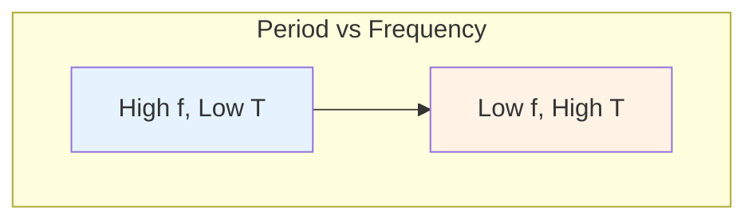
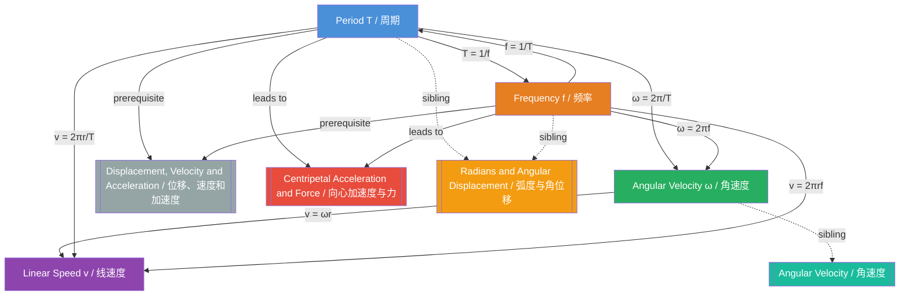

# Period and Frequency / 周期与频率

---

# 1. Overview / 概述

**English:**
Period and Frequency are fundamental concepts in circular motion that describe how quickly an object completes one full revolution. The **period** ($T$) is the time taken for one complete cycle of motion, while the **frequency** ($f$) is the number of complete cycles per unit time. These two quantities are inversely related and form the foundation for understanding [[Angular Velocity]] and [[Centripetal Acceleration and Force]].

In the context of [[Angular Measures]], period and frequency provide the temporal dimension of rotational motion. They connect directly to [[Radians and Angular Displacement]] through the relationship $\omega = 2\pi f = \frac{2\pi}{T}$, where $\omega$ is angular velocity. Understanding these concepts is essential for analyzing everything from spinning wheels to planetary orbits.

**中文:**
周期和频率是描述圆周运动中物体完成一整圈快慢的基本概念。**周期**（$T$）是完成一个完整运动循环所需的时间，而**频率**（$f$）是单位时间内完成的完整循环次数。这两个量互为倒数，是理解[[角速度]]和[[向心加速度与力]]的基础。

在[[角度测量]]的背景下，周期和频率提供了旋转运动的时间维度。它们通过关系式 $\omega = 2\pi f = \frac{2\pi}{T}$ 与[[弧度与角位移]]直接相连，其中 $\omega$ 是角速度。理解这些概念对于分析从旋转车轮到行星轨道的一切运动至关重要。

---

# 2. Syllabus Learning Objectives / 考纲学习目标

| CAIE 9702 (14.1 a-e) | Edexcel IAL (WPH14 U4: 5.1-5.4) |
|----------------------|----------------------------------|
| Define period and frequency for circular motion | Understand the concepts of period and frequency |
| Derive and use $T = \frac{1}{f}$ | Use $T = \frac{1}{f}$ and $f = \frac{1}{T}$ |
| Relate period and frequency to angular velocity: $\omega = \frac{2\pi}{T} = 2\pi f$ | Relate period and frequency to angular speed: $\omega = \frac{2\pi}{T} = 2\pi f$ |
| Apply to problems involving uniform circular motion | Apply to problems involving uniform circular motion |
| Understand the relationship between period, frequency, and linear speed | Understand the relationship between period, frequency, and linear speed |

**Examiner Expectations / 考官期望:**
- **English:** Students must be able to define period and frequency precisely, use the inverse relationship correctly, and apply these concepts to calculate angular velocity and linear speed in circular motion problems. Common errors include confusing period with frequency and misapplying units.
- **中文:** 学生必须能够精确定义周期和频率，正确使用倒数关系，并应用这些概念计算圆周运动中的角速度和线速度。常见错误包括混淆周期与频率以及单位使用错误。

---

# 3. Core Definitions / 核心定义

| Term (EN/CN) | Definition (EN) | Definition (CN) | Common Mistakes / 常见错误 |
|--------------|-----------------|-----------------|---------------------------|
| **Period** ($T$) / 周期 | The time taken for one complete revolution or cycle of motion. | 完成一整圈或一个完整运动循环所需的时间。 | Confusing with frequency; forgetting units (s, not Hz) |
| **Frequency** ($f$) / 频率 | The number of complete revolutions or cycles per unit time. | 单位时间内完成的完整圈数或循环次数。 | Confusing with period; writing "f" instead of "f" in formulas |
| **Cycle** / 循环 | One complete repetition of the motion (e.g., one full rotation). | 运动的一次完整重复（例如一整圈旋转）。 | Thinking half a rotation is a cycle |
| **Uniform Circular Motion** / 匀速圆周运动 | Motion at constant speed along a circular path. | 沿圆形路径以恒定速度进行的运动。 | Assuming constant velocity (direction changes) |

> 📋 **CIE Only:** CAIE specifically requires students to derive $T = \frac{1}{f}$ from definitions.
> 📋 **Edexcel Only:** Edexcel emphasizes the relationship to angular speed in the context of radians per second.

---

# 4. Key Concepts Explained / 关键概念详解

## 4.1 The Inverse Relationship / 倒数关系

### Explanation / 解释
**English:**
Period and frequency are **inversely proportional** to each other. If an object completes one revolution in 2 seconds, its period is 2 s and its frequency is 0.5 Hz. Mathematically:

$$ T = \frac{1}{f} \quad \text{and} \quad f = \frac{1}{T} $$

This relationship means that as the period increases (slower motion), the frequency decreases, and vice versa. For example, a ceiling fan rotating slowly has a large period and small frequency, while a fast-spinning drill bit has a small period and large frequency.

**中文:**
周期和频率**互为倒数**。如果一个物体在2秒内完成一圈，其周期为2秒，频率为0.5赫兹。数学表达式为：

$$ T = \frac{1}{f} \quad \text{和} \quad f = \frac{1}{T} $$

这个关系意味着周期增大（运动变慢）时频率减小，反之亦然。例如，缓慢旋转的吊扇周期大、频率小，而快速旋转的钻头周期小、频率大。

### Physical Meaning / 物理意义
**English:**
Period tells us "how long each cycle takes" — a measure of the **duration** of one rotation. Frequency tells us "how many cycles per second" — a measure of the **rate** of rotation. Together, they describe the temporal characteristics of any repetitive motion, from [[Simple Harmonic Motion]] to planetary orbits.

**中文:**
周期告诉我们"每个循环需要多长时间"——衡量一圈旋转的**持续时间**。频率告诉我们"每秒多少个循环"——衡量旋转的**速率**。两者共同描述了任何重复运动的时间特征，从[[简谐运动]]到行星轨道。

### Common Misconceptions / 常见误区
- **EN:** "Frequency is measured in 'cycles per second' not Hz" — Actually, Hz is exactly cycles per second (s⁻¹).
- **EN:** "A higher frequency means a longer period" — Incorrect; higher frequency means shorter period.
- **中文:** "频率的单位是'每秒圈数'而不是赫兹"——实际上，赫兹就是每秒圈数（s⁻¹）。
- **中文:** "频率越高周期越长"——错误；频率越高周期越短。

### Exam Tips / 考试提示
- **EN:** Always check units: Period in seconds (s), Frequency in Hertz (Hz = s⁻¹).
- **EN:** When given one quantity, immediately calculate the other — it's often needed for the next step.
- **中文:** 始终检查单位：周期用秒（s），频率用赫兹（Hz = s⁻¹）。
- **中文:** 当给出一个量时，立即计算另一个量——下一步通常需要用到。

> 📷 **IMAGE PROMPT — DIAGRAM-01: Period and Frequency Comparison**
> A split diagram showing two rotating objects: Left side shows a slow rotation (large T, small f) with a clock showing 4 seconds per revolution. Right side shows a fast rotation (small T, large f) with a clock showing 0.5 seconds per revolution. Arrows indicate the inverse relationship. Labels: "Period T = time per cycle" and "Frequency f = cycles per second".

---

## 4.2 Connecting to Angular Velocity / 与角速度的联系

### Explanation / 解释
**English:**
In one complete revolution, the angular displacement is $2\pi$ radians. Therefore, angular velocity $\omega$ relates to period and frequency as:

$$ \omega = \frac{2\pi}{T} = 2\pi f $$

This is one of the most important equations in circular motion. It shows that angular velocity is directly proportional to frequency and inversely proportional to period. For a complete derivation, see [[Angular Velocity]].

**中文:**
在一整圈旋转中，角位移为 $2\pi$ 弧度。因此，角速度 $\omega$ 与周期和频率的关系为：

$$ \omega = \frac{2\pi}{T} = 2\pi f $$

这是圆周运动中最重要方程之一。它表明角速度与频率成正比，与周期成反比。完整推导请参见[[角速度]]。

### Physical Meaning / 物理意义
**English:**
This equation bridges the **time domain** (period/frequency) with the **angular domain** (radians). It allows us to convert between how fast something spins (angular velocity) and how long each rotation takes (period) or how many rotations occur per second (frequency).

**中文:**
这个方程连接了**时间域**（周期/频率）和**角度域**（弧度）。它使我们能够在旋转速度（角速度）与每圈所需时间（周期）或每秒旋转圈数（频率）之间进行转换。

### Common Misconceptions / 常见误区
- **EN:** "Angular velocity is the same as frequency" — No, $\omega = 2\pi f$, so they differ by a factor of $2\pi$.
- **EN:** "Period is measured in radians" — No, period is measured in seconds.
- **中文:** "角速度和频率是一样的"——不对，$\omega = 2\pi f$，相差 $2\pi$ 倍。
- **中文:** "周期的单位是弧度"——不对，周期的单位是秒。

### Exam Tips / 考试提示
- **EN:** When given period or frequency, always consider whether you need angular velocity for the next step.
- **EN:** Remember: $\omega = \frac{2\pi}{T}$ is derived from $\omega = \frac{\Delta\theta}{\Delta t}$ with $\Delta\theta = 2\pi$ and $\Delta t = T$.
- **中文:** 当给出周期或频率时，始终考虑下一步是否需要角速度。
- **中文:** 记住：$\omega = \frac{2\pi}{T}$ 由 $\omega = \frac{\Delta\theta}{\Delta t}$ 推导而来，其中 $\Delta\theta = 2\pi$，$\Delta t = T$。

---

# 5. Essential Equations / 核心公式

## Equation 1: Period-Frequency Relationship / 周期-频率关系

$$ T = \frac{1}{f} \quad \text{or} \quad f = \frac{1}{T} $$

| Symbol (符号) | Meaning (EN) | Meaning (CN) | Unit (单位) |
|--------------|-------------|-------------|------------|
| $T$ | Period | 周期 | s (seconds / 秒) |
| $f$ | Frequency | 频率 | Hz (Hertz = s⁻¹ / 赫兹) |

**Derivation / 推导:**
By definition: If $f$ cycles occur in 1 second, then 1 cycle takes $\frac{1}{f}$ seconds. Therefore $T = \frac{1}{f}$.

**Conditions / 适用条件:**
- **EN:** Valid for any periodic motion, including circular motion, oscillations, and waves.
- **中文:** 适用于任何周期性运动，包括圆周运动、振动和波。

**Limitations / 局限性:**
- **EN:** Only applies to uniform (constant speed) circular motion or regular periodic motion.
- **中文:** 仅适用于匀速圆周运动或规则的周期性运动。

## Equation 2: Angular Velocity Connection / 角速度连接

$$ \omega = \frac{2\pi}{T} = 2\pi f $$

| Symbol (符号) | Meaning (EN) | Meaning (CN) | Unit (单位) |
|--------------|-------------|-------------|------------|
| $\omega$ | Angular velocity | 角速度 | rad s⁻¹ (弧度每秒) |
| $T$ | Period | 周期 | s (秒) |
| $f$ | Frequency | 频率 | Hz (赫兹) |

**Derivation / 推导:**
$$ \omega = \frac{\Delta\theta}{\Delta t} = \frac{2\pi \text{ rad}}{T \text{ s}} = \frac{2\pi}{T} = 2\pi f $$

**Conditions / 适用条件:**
- **EN:** Valid for uniform circular motion where one complete revolution corresponds to $2\pi$ radians.
- **中文:** 适用于匀速圆周运动，其中一整圈对应 $2\pi$ 弧度。

**Limitations / 局限性:**
- **EN:** Assumes motion is in radians; if using degrees, replace $2\pi$ with $360^\circ$.
- **中文:** 假设使用弧度；如果使用角度，将 $2\pi$ 替换为 $360^\circ$。

## Equation 3: Linear Speed Connection / 线速度连接

$$ v = \frac{2\pi r}{T} = 2\pi r f $$

| Symbol (符号) | Meaning (EN) | Meaning (CN) | Unit (单位) |
|--------------|-------------|-------------|------------|
| $v$ | Linear speed | 线速度 | m s⁻¹ (米每秒) |
| $r$ | Radius of circular path | 圆周路径半径 | m (米) |
| $T$ | Period | 周期 | s (秒) |
| $f$ | Frequency | 频率 | Hz (赫兹) |

**Derivation / 推导:**
In one period, the object travels the circumference $2\pi r$. Speed = distance/time, so $v = \frac{2\pi r}{T} = 2\pi r f$.

**Conditions / 适用条件:**
- **EN:** Valid for uniform circular motion with constant speed.
- **中文:** 适用于匀速圆周运动。

**Limitations / 局限性:**
- **EN:** Gives speed (magnitude of velocity), not velocity (which includes direction).
- **中文:** 给出速率（速度的大小），而非速度（包含方向）。

> 📷 **IMAGE PROMPT — DIAGRAM-02: Period-Frequency-Angular Velocity Triangle**
> A triangular diagram showing the relationships: Top vertex "ω = 2π/T = 2πf", bottom-left "T = 1/f", bottom-right "f = 1/T". Arrows connect all three. Below, a circle showing one revolution (2π radians) with a clock indicating time T. Labels: "One cycle = 2π rad", "Time for one cycle = T".

---

# 6. Graphs and Relationships / 图表与关系

## 6.1 Period vs Frequency Graph / 周期-频率关系图

### Axes / 坐标轴
- **X-axis:** Frequency $f$ (Hz) / 频率 $f$（赫兹）
- **Y-axis:** Period $T$ (s) / 周期 $T$（秒）

### Shape / 形状
- **EN:** A rectangular hyperbola: $T = 1/f$. As frequency increases, period decreases rapidly.
- **中文:** 矩形双曲线：$T = 1/f$。频率增大时，周期迅速减小。

### Gradient Meaning / 斜率含义
- **EN:** The gradient is not constant; it changes at every point. The gradient at any point equals $-1/f^2$.
- **中文:** 斜率不是常数，每点都在变化。任意点的斜率等于 $-1/f^2$。

### Area Meaning / 面积含义
- **EN:** No meaningful physical area under this curve.
- **中文:** 曲线下没有有意义的物理面积。

### Exam Interpretation / 考试解读
- **EN:** Be able to sketch this graph and explain the inverse relationship. Know that doubling frequency halves the period.
- **中文:** 能够画出此图并解释倒数关系。知道频率加倍时周期减半。

> 📷 **IMAGE PROMPT — GRAPH-01: Period vs Frequency Hyperbola**
> A graph showing a smooth hyperbolic curve T = 1/f. X-axis labeled "Frequency f (Hz)" from 0 to 5. Y-axis labeled "Period T (s)" from 0 to 5. The curve starts high on the left and approaches zero as f increases. Key points marked: (0.5, 2), (1, 1), (2, 0.5). Dashed lines show asymptotes at f=0 and T=0.

---

## 6.2 Angular Velocity vs Period Graph / 角速度-周期关系图

### Axes / 坐标轴
- **X-axis:** Period $T$ (s) / 周期 $T$（秒）
- **Y-axis:** Angular velocity $\omega$ (rad s⁻¹) / 角速度 $\omega$（弧度每秒）

### Shape / 形状
- **EN:** Inverse relationship: $\omega = 2\pi/T$. As period increases, angular velocity decreases.
- **中文:** 反比关系：$\omega = 2\pi/T$。周期增大时，角速度减小。

### Gradient Meaning / 斜率含义
- **EN:** Gradient = $-2\pi/T^2$, which is negative and decreases in magnitude as T increases.
- **中文:** 斜率 = $-2\pi/T^2$，为负值且随 T 增大而绝对值减小。

### Area Meaning / 面积含义
- **EN:** No meaningful physical area.
- **中文:** 没有有意义的物理面积。

### Exam Interpretation / 考试解读
- **EN:** Understand that a small period means high angular velocity, and vice versa.
- **中文:** 理解小周期意味着高角速度，反之亦然。

---

# 7. Required Diagrams / 必备图表

## 7.1 Circular Motion with Period and Frequency Labels / 带周期和频率标注的圆周运动

### Description / 描述
**English:**
A diagram showing an object moving in a circular path, with the period and frequency clearly indicated. The path should show one complete revolution with time markers, and the relationship to angular displacement ($2\pi$ radians) should be visible.

**中文:**
显示物体沿圆形路径运动的示意图，清晰标注周期和频率。路径应显示一整圈旋转并带有时间标记，同时应能看出与角位移（$2\pi$ 弧度）的关系。

### Image Prompt / 图片生成提示
> 📷 **IMAGE PROMPT — DIAGRAM-03: Circular Motion Period and Frequency**
> A circular path with a dot moving counterclockwise. The circle is divided into 4 quadrants with time markers: t=0 at 3 o'clock, t=T/4 at 12 o'clock, t=T/2 at 9 o'clock, t=3T/4 at 6 o'clock, t=T back at 3 o'clock. Labels: "Period T = time for one complete revolution", "Frequency f = 1/T = number of revolutions per second". An arrow shows angular displacement of 2π radians for one full cycle. Below: a clock icon showing time T.

### Labels Required / 需要标注
- **EN:** Period $T$, Frequency $f$, Angular displacement $2\pi$ rad, Time markers at quadrants
- **中文:** 周期 $T$，频率 $f$，角位移 $2\pi$ 弧度，象限时间标记

### Exam Importance / 考试重要性
- **EN:** Essential for visualizing the relationship between time and angular displacement in circular motion.
- **中文:** 对于可视化圆周运动中时间与角位移的关系至关重要。

---

## 7.2 Period-Frequency Conversion Diagram / 周期-频率转换图

### Description / 描述
**English:**
A conversion diagram showing how to switch between period and frequency, with examples. This helps students remember the inverse relationship and avoid common mistakes.

**中文:**
显示如何在周期和频率之间转换的示意图，附有示例。这有助于学生记住倒数关系并避免常见错误。

### Image Prompt / 图片生成提示
> 📷 **IMAGE PROMPT — DIAGRAM-04: Period-Frequency Conversion**
> A two-column diagram. Left column: "Period T (s)" with examples: T=0.5s, T=1s, T=2s, T=5s. Right column: "Frequency f (Hz)" with corresponding values: f=2Hz, f=1Hz, f=0.5Hz, f=0.2Hz. Arrows between columns labeled "f = 1/T" going left-to-right and "T = 1/f" going right-to-left. Bottom: Formula box showing T = 1/f and f = 1/T. Warning triangle: "Remember: T and f are INVERSELY related!"

### Labels Required / 需要标注
- **EN:** Conversion formulas $T = 1/f$ and $f = 1/T$, example values
- **中文:** 转换公式 $T = 1/f$ 和 $f = 1/T$，示例数值

### Exam Importance / 考试重要性
- **EN:** High — students frequently confuse period and frequency in calculations.
- **中文:** 高——学生在计算中经常混淆周期和频率。

---

# 8. Worked Examples / 典型例题

## Example 1: Basic Period-Frequency Conversion / 基本周期-频率转换

### Question / 题目
**English:**
A ceiling fan completes 20 revolutions in 10 seconds. Calculate:
(a) The frequency of rotation.
(b) The period of rotation.
(c) The angular velocity of the fan blades.

**中文:**
一台吊扇在10秒内完成20圈旋转。计算：
(a) 旋转频率。
(b) 旋转周期。
(c) 扇叶的角速度。

### Solution / 解答

**Step 1: Calculate frequency / 步骤1：计算频率**
$$ f = \frac{\text{number of revolutions}}{\text{time}} = \frac{20}{10} = 2 \text{ Hz} $$

**Step 2: Calculate period / 步骤2：计算周期**
$$ T = \frac{1}{f} = \frac{1}{2} = 0.5 \text{ s} $$

**Step 3: Calculate angular velocity / 步骤3：计算角速度**
$$ \omega = 2\pi f = 2\pi \times 2 = 4\pi \text{ rad s}^{-1} \approx 12.57 \text{ rad s}^{-1} $$

Alternatively:
$$ \omega = \frac{2\pi}{T} = \frac{2\pi}{0.5} = 4\pi \text{ rad s}^{-1} $$

### Final Answer / 最终答案
**Answer:** (a) $f = 2$ Hz | (b) $T = 0.5$ s | (c) $\omega = 4\pi$ rad s⁻¹ ≈ 12.57 rad s⁻¹
**答案：** (a) $f = 2$ 赫兹 | (b) $T = 0.5$ 秒 | (c) $\omega = 4\pi$ 弧度每秒 ≈ 12.57 弧度每秒

### Quick Tip / 提示
- **EN:** Always check if you need frequency or period for the next calculation. If the question asks for angular velocity, either $2\pi f$ or $2\pi/T$ will work — use whichever you have.
- **中文:** 始终检查下一步计算需要频率还是周期。如果问题要求角速度，$2\pi f$ 或 $2\pi/T$ 都可以——使用你已有的那个。

---

## Example 2: Linear Speed from Period / 由周期求线速度

### Question / 题目
**English:**
A satellite orbits Earth in a circular path of radius 7000 km with a period of 90 minutes. Calculate the linear speed of the satellite.

**中文:**
一颗卫星在半径为7000公里的圆形轨道上绕地球运行，周期为90分钟。计算卫星的线速度。

### Solution / 解答

**Step 1: Convert units / 步骤1：单位转换**
$$ T = 90 \text{ min} = 90 \times 60 = 5400 \text{ s} $$
$$ r = 7000 \text{ km} = 7000 \times 10^3 = 7.0 \times 10^6 \text{ m} $$

**Step 2: Calculate linear speed / 步骤2：计算线速度**
$$ v = \frac{2\pi r}{T} = \frac{2\pi \times 7.0 \times 10^6}{5400} $$

$$ v = \frac{4.398 \times 10^7}{5400} \approx 8144 \text{ m s}^{-1} $$

**Step 3: Express in km/s (optional) / 步骤3：用公里每秒表示（可选）**
$$ v \approx 8.14 \text{ km s}^{-1} $$

### Final Answer / 最终答案
**Answer:** $v \approx 8140$ m s⁻¹ (or 8.14 km s⁻¹) | **答案：** $v \approx 8140$ 米每秒（或 8.14 公里每秒）

### Quick Tip / 提示
- **EN:** Always convert time to seconds and distance to meters before calculating. Period is often given in minutes or hours in exam questions.
- **中文:** 计算前始终将时间转换为秒，距离转换为米。考试题目中周期常以分钟或小时给出。

---

# 9. Past Paper Question Types / 历年真题题型

| Question Type / 题型 | Frequency / 频率 | Difficulty / 难度 | Past Paper References / 真题索引 |
|----------------------|------------------|------------------|-------------------------------|
| Period-frequency conversion | Very High / 非常高 | Easy / 简单 | 📝 *待填入* |
| Angular velocity from period/frequency | Very High / 非常高 | Easy-Medium / 简单-中等 | 📝 *待填入* |
| Linear speed from period/frequency | High / 高 | Medium / 中等 | 📝 *待填入* |
| Combined problems (period + centripetal force) | Medium / 中等 | Hard / 困难 | 📝 *待填入* |
| Graph interpretation (T vs f) | Low / 低 | Medium / 中等 | 📝 *待填入* |

**Common Command Words / 常见指令词:**
- **EN:** Calculate, Determine, Find, Show that, State, Define
- **中文:** 计算，确定，求，证明，写出，定义

---

# 10. Practical Skills Connections / 实验技能链接

**English:**
Period and frequency are directly measurable quantities in circular motion experiments. Key practical connections include:

1. **Measuring Period:** Use a stopwatch to time multiple revolutions (e.g., 10 or 20) and divide by the number of revolutions to find the period. This reduces timing errors.

2. **Frequency from Period:** Calculate frequency as $f = 1/T$ after measuring the period.

3. **Uncertainty Analysis:** If you time 10 revolutions with a stopwatch (uncertainty ±0.1 s), the uncertainty in period is ±0.01 s. This demonstrates how measuring multiple cycles reduces percentage uncertainty.

4. **Experimental Setup:** Common experiments include:
   - Whirling a mass on a string in a horizontal circle
   - Using a turntable with known rotation speed
   - Analyzing strobe photographs of rotating objects

5. **Graph Plotting:** Plot $T$ vs $f$ to verify the inverse relationship, or plot $\omega$ vs $f$ to verify the linear relationship $\omega = 2\pi f$.

**中文:**
周期和频率是圆周运动实验中可直接测量的量。关键实验联系包括：

1. **测量周期：** 使用秒表计时多次旋转（例如10或20次），除以旋转次数得到周期。这可以减少计时误差。

2. **由周期求频率：** 测量周期后，计算频率 $f = 1/T$。

3. **不确定度分析：** 如果用秒表（不确定度 ±0.1秒）计时10次旋转，周期的不确定度为 ±0.01秒。这展示了测量多个循环如何降低百分比不确定度。

4. **实验装置：** 常见实验包括：
   - 在水平圆周上甩动系在绳子上的重物
   - 使用已知转速的转盘
   - 分析旋转物体的频闪照片

5. **图表绘制：** 绘制 $T$ 与 $f$ 的关系图以验证倒数关系，或绘制 $\omega$ 与 $f$ 的关系图以验证线性关系 $\omega = 2\pi f$。

---

# 11. Concept Map / 概念图谱

---

# 12. Quick Revision Sheet / 速查表

| Category / 类别 | Key Points / 要点 |
|----------------|------------------|
| **Definition / 定义** | **Period $T$:** Time for one complete revolution (s) / 周期：完成一整圈的时间（秒） |
| | **Frequency $f$:** Number of revolutions per second (Hz) / 频率：每秒旋转圈数（赫兹） |
| **Key Formula / 核心公式** | $T = \frac{1}{f}$ or $f = \frac{1}{T}$ |
| | $\omega = \frac{2\pi}{T} = 2\pi f$ |
| | $v = \frac{2\pi r}{T} = 2\pi r f$ |
| **Key Graph / 核心图表** | $T$ vs $f$: Rectangular hyperbola (inverse relationship) / 矩形双曲线（反比关系） |
| | $\omega$ vs $T$: Inverse curve / 反比曲线 |
| | $\omega$ vs $f$: Straight line through origin (gradient $2\pi$) / 过原点的直线（斜率 $2\pi$） |
| **Common Mistake / 常见错误** | Confusing $T$ and $f$ — remember: $T$ is time (s), $f$ is rate (Hz) / 混淆周期和频率——记住：周期是时间（秒），频率是速率（赫兹） |
| | Forgetting $2\pi$ when converting to angular velocity / 转换为角速度时忘记 $2\pi$ |
| **Exam Tip / 考试提示** | Always convert time to seconds before using formulas / 使用公式前始终将时间转换为秒 |
| | Measure multiple cycles to reduce timing uncertainty / 测量多个循环以减少计时不确定度 |
| | When given $T$ or $f$, immediately calculate the other — you'll likely need both / 当给出周期或频率时，立即计算另一个——你可能两者都需要 |
| **Units / 单位** | $T$: s (seconds / 秒) | $f$: Hz (Hertz = s⁻¹ / 赫兹) |
| | $\omega$: rad s⁻¹ (弧度每秒) | $v$: m s⁻¹ (米每秒) |

---

> **Parent Hub:** [[Angular Measures]]
> **Sibling Topics:** [[Radians and Angular Displacement]], [[Angular Velocity]], [[Relationship Between Linear and Angular Quantities]]
> **Prerequisites:** [[Displacement, Velocity and Acceleration]]
> **Related Topics:** [[Centripetal Acceleration and Force]]