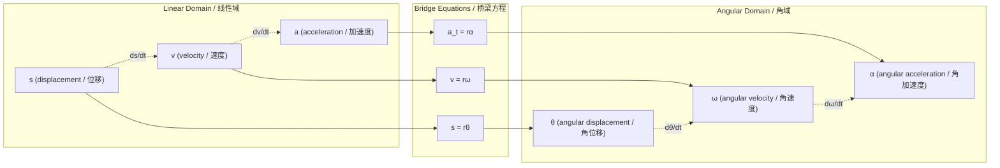
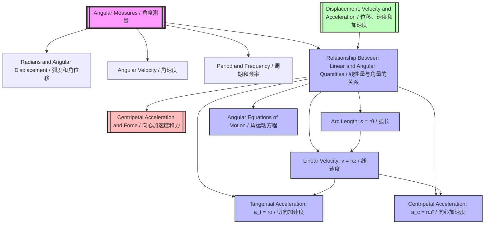

# Relationship Between Linear and Angular Quantities / 线性量与角量的关系

---

# 1. Overview / 概述

**English:**
This sub-topic establishes the fundamental mathematical bridge between linear motion quantities (displacement $s$, velocity $v$, acceleration $a$) and their angular counterparts (angular displacement $\theta$, angular velocity $\omega$, angular acceleration $\alpha$). Understanding these relationships is essential because it allows us to apply familiar linear kinematics equations to rotational systems. This connection is the foundation for analyzing circular motion, rotational dynamics, and ultimately topics like [[Centripetal Acceleration and Force]]. The key insight is that every point on a rotating rigid body shares the same angular quantities but has different linear quantities depending on its distance $r$ from the axis of rotation.

**中文:**
本子知识点建立了线性运动量（位移 $s$、速度 $v$、加速度 $a$）与其角对应量（角位移 $\theta$、角速度 $\omega$、角加速度 $\alpha$）之间的基本数学桥梁。理解这些关系至关重要，因为它使我们能够将熟悉的线性运动学方程应用于旋转系统。这种联系是分析圆周运动、旋转动力学以及最终理解[[向心加速度与力]]等主题的基础。关键见解是：旋转刚体上的每个点共享相同的角量，但根据其到旋转轴的距离 $r$ 不同而具有不同的线性量。

---

# 2. Syllabus Learning Objectives / 考纲学习目标

| CAIE 9702 (14.1) | Edexcel IAL (WPH14 U4: 5.1-5.4) |
|------------------|--------------------------------|
| (a) Understand the relationship between linear displacement and angular displacement: $s = r\theta$ | 5.1 Know the relationship between linear velocity and angular velocity: $v = r\omega$ |
| (b) Understand the relationship between linear velocity and angular velocity: $v = r\omega$ | 5.2 Understand the relationship between linear acceleration and angular acceleration: $a = r\alpha$ |
| (c) Understand the relationship between linear acceleration and angular acceleration: $a = r\alpha$ | 5.3 Apply the equations of motion with constant angular acceleration |
| (d) Apply the equations of motion with constant angular acceleration | 5.4 Understand the relationship between centripetal acceleration and angular velocity: $a = r\omega^2$ |
| (e) Understand the concept of centripetal acceleration and its relationship to angular velocity | |

**Examiner Expectations / 考官期望:**
- **English:** Students must be able to derive $v = r\omega$ from $s = r\theta$ by differentiation with respect to time. They must understand that $r$ is the perpendicular distance from the axis of rotation. Questions often require converting between linear and angular quantities in practical contexts like pulleys, gears, and rotating machinery.
- **中文:** 学生必须能够通过对时间求导，从 $s = r\theta$ 推导出 $v = r\omega$。他们必须理解 $r$ 是到旋转轴的垂直距离。题目通常要求在实际情境中（如滑轮、齿轮和旋转机械）在线性量和角量之间进行转换。

---

# 3. Core Definitions / 核心定义

| Term (EN/CN) | Definition (EN) | Definition (CN) | Common Mistakes / 常见错误 |
|--------------|-----------------|-----------------|---------------------------|
| **Arc Length** $s$ / 弧长 $s$ | The distance traveled along the circular path by a point on a rotating object. | 旋转物体上一点沿圆形路径移动的距离。 | Confusing arc length with chord length (straight-line distance). |
| **Radius** $r$ / 半径 $r$ | The perpendicular distance from the axis of rotation to the point of interest. | 从旋转轴到感兴趣点的垂直距离。 | Using diameter instead of radius in $s = r\theta$ or $v = r\omega$. |
| **Linear Velocity** $v$ / 线速度 $v$ | The instantaneous velocity of a point on a rotating object, tangent to the circular path. | 旋转物体上一点的瞬时速度，方向沿圆形路径的切线方向。 | Forgetting that $v$ is tangential, not radial. |
| **Angular Velocity** $\omega$ / 角速度 $\omega$ | The rate of change of angular displacement with respect to time. | 角位移随时间的变化率。 | Confusing $\omega$ with frequency $f$ (they are related by $\omega = 2\pi f$). |
| **Tangential Acceleration** $a_t$ / 切向加速度 $a_t$ | The component of linear acceleration tangent to the circular path, caused by changing angular velocity. | 线加速度沿圆形路径切线方向的分量，由角速度变化引起。 | Confusing tangential acceleration with centripetal acceleration $a_c = r\omega^2$. |
| **Angular Acceleration** $\alpha$ / 角加速度 $\alpha$ | The rate of change of angular velocity with respect to time. | 角速度随时间的变化率。 | Forgetting that $\alpha$ is a vector quantity (direction along axis of rotation). |

---

# 4. Key Concepts Explained / 关键概念详解

## 4.1 The Fundamental Relationship: $s = r\theta$ / 基本关系：$s = r\theta$

### Explanation / 解释
**English:**
The arc length $s$ traveled by a point on a rotating object is equal to the radius $r$ multiplied by the angular displacement $\theta$ (in radians). This is derived directly from the definition of the radian: $\theta = \frac{s}{r}$. This relationship is only valid when $\theta$ is measured in radians. If $\theta$ is given in degrees, it must first be converted to radians.

**中文:**
旋转物体上一点经过的弧长 $s$ 等于半径 $r$ 乘以角位移 $\theta$（以弧度为单位）。这是直接从弧度的定义推导出来的：$\theta = \frac{s}{r}$。这个关系仅在 $\theta$ 以弧度为单位测量时成立。如果 $\theta$ 以度为单位给出，必须首先转换为弧度。

### Physical Meaning / 物理意义
**English:**
This equation tells us that for a given angular displacement, points farther from the axis of rotation travel a greater linear distance. This is why the outer edge of a spinning wheel moves faster than a point near the hub.

**中文:**
这个方程告诉我们，对于给定的角位移，离旋转轴越远的点移动的线性距离越大。这就是为什么旋转轮子的外缘比靠近轮毂的点移动得更快。

### Common Misconceptions / 常见误区
- **English:** Thinking $s = r\theta$ applies to any angle unit. It only works for radians.
- **中文:** 认为 $s = r\theta$ 适用于任何角度单位。它只适用于弧度。
- **English:** Using the diameter instead of the radius.
- **中文:** 使用直径而不是半径。
- **English:** Confusing arc length $s$ with displacement (straight-line distance between two points).
- **中文:** 混淆弧长 $s$ 和位移（两点之间的直线距离）。

### Exam Tips / 考试提示
- **English:** Always check that $\theta$ is in radians before using $s = r\theta$. If given in degrees, convert: $\theta_{rad} = \theta_{deg} \times \frac{\pi}{180}$.
- **中文:** 在使用 $s = r\theta$ 之前，始终检查 $\theta$ 是否以弧度为单位。如果以度为单位给出，则转换：$\theta_{rad} = \theta_{deg} \times \frac{\pi}{180}$。
- **English:** For multiple-choice questions, remember that $s$ is proportional to $r$ for constant $\theta$.
- **中文:** 对于选择题，记住在恒定 $\theta$ 下，$s$ 与 $r$ 成正比。

> 📷 **IMAGE PROMPT — ARC-LENGTH: Arc Length Relationship**
> A clear diagram showing a circle with center O, radius r, angular displacement θ (in radians), and arc length s along the circumference. Label all three quantities. Show a point P on the circumference moving from position P1 to P2 along the arc. Use arrows to indicate the direction of motion. The diagram should be clean and suitable for an A-Level textbook.

---

## 4.2 Deriving $v = r\omega$ from $s = r\theta$ / 从 $s = r\theta$ 推导 $v = r\omega$

### Explanation / 解释
**English:**
Since linear velocity $v = \frac{ds}{dt}$ and angular velocity $\omega = \frac{d\theta}{dt}$, we can differentiate $s = r\theta$ with respect to time:

$$ v = \frac{ds}{dt} = \frac{d}{dt}(r\theta) = r\frac{d\theta}{dt} = r\omega $$

This assumes $r$ is constant (the point is at a fixed distance from the axis). This is a crucial derivation that examiners expect students to be able to reproduce.

**中文:**
由于线速度 $v = \frac{ds}{dt}$ 且角速度 $\omega = \frac{d\theta}{dt}$，我们可以对 $s = r\theta$ 关于时间求导：

$$ v = \frac{ds}{dt} = \frac{d}{dt}(r\theta) = r\frac{d\theta}{dt} = r\omega $$

这假设 $r$ 是常数（该点距离旋转轴的距离固定）。这是一个关键推导，考官期望学生能够重现。

### Physical Meaning / 物理意义
**English:**
The linear velocity of a point on a rotating object is directly proportional to both its distance from the axis of rotation and the angular velocity. This explains why the outer edge of a CD spins much faster (in terms of linear speed) than the inner tracks.

**中文:**
旋转物体上一点的线速度与其到旋转轴的距离和角速度都成正比。这解释了为什么CD的外缘（就线速度而言）比内轨旋转得快得多。

### Common Misconceptions / 常见误区
- **English:** Thinking $v = r\omega$ gives the direction of velocity. It only gives the magnitude; the direction is tangential to the circle.
- **中文:** 认为 $v = r\omega$ 给出了速度的方向。它只给出大小；方向是圆的切线方向。
- **English:** Forgetting that $\omega$ must be in rad/s, not rpm or deg/s.
- **中文:** 忘记 $\omega$ 必须以 rad/s 为单位，而不是 rpm 或 deg/s。

### Exam Tips / 考试提示
- **English:** In derivation questions, explicitly state that you are differentiating with respect to time and that $r$ is constant.
- **中文:** 在推导题中，明确说明你正在对时间求导，并且 $r$ 是常数。
- **English:** For problems involving pulleys or belts, remember that the linear speed of the belt is the same as the tangential speed of the pulley rim: $v_{belt} = r_{pulley}\omega_{pulley}$.
- **中文:** 对于涉及滑轮或皮带的问题，记住皮带的线速度与滑轮边缘的切向速度相同：$v_{皮带} = r_{滑轮}\omega_{滑轮}$。

---

## 4.3 Tangential Acceleration: $a_t = r\alpha$ / 切向加速度：$a_t = r\alpha$

### Explanation / 解释
**English:**
Similarly, since tangential acceleration $a_t = \frac{dv}{dt}$ and angular acceleration $\alpha = \frac{d\omega}{dt}$, we differentiate $v = r\omega$:

$$ a_t = \frac{dv}{dt} = \frac{d}{dt}(r\omega) = r\frac{d\omega}{dt} = r\alpha $$

This gives the tangential component of linear acceleration — the part that changes the speed of the point along its circular path. This is distinct from centripetal acceleration $a_c = r\omega^2 = \frac{v^2}{r}$, which changes the direction of velocity.

**中文:**
类似地，由于切向加速度 $a_t = \frac{dv}{dt}$ 且角加速度 $\alpha = \frac{d\omega}{dt}$，我们对 $v = r\omega$ 求导：

$$ a_t = \frac{dv}{dt} = \frac{d}{dt}(r\omega) = r\frac{d\omega}{dt} = r\alpha $$

这给出了线加速度的切向分量——即改变点沿其圆形路径速度的部分。这与向心加速度 $a_c = r\omega^2 = \frac{v^2}{r}$ 不同，后者改变速度的方向。

### Physical Meaning / 物理意义
**English:**
When a rotating object speeds up or slows down, points on the object experience a tangential acceleration. The farther a point is from the axis, the greater its tangential acceleration for a given angular acceleration.

**中文:**
当旋转物体加速或减速时，物体上的点会经历切向加速度。点离旋转轴越远，对于给定的角加速度，其切向加速度越大。

### Common Misconceptions / 常见误区
- **English:** Confusing $a_t = r\alpha$ with centripetal acceleration $a_c = r\omega^2$. They are perpendicular components of total linear acceleration.
- **中文:** 混淆 $a_t = r\alpha$ 和向心加速度 $a_c = r\omega^2$。它们是总线加速度的垂直分量。
- **English:** Thinking that if $\omega$ is constant, $a_t = 0$ (correct) but $a_c \neq 0$ (unless $r = 0$).
- **中文:** 认为如果 $\omega$ 是常数，则 $a_t = 0$（正确）但 $a_c \neq 0$（除非 $r = 0$）。

### Exam Tips / 考试提示
- **English:** For uniform circular motion ($\omega$ constant), $a_t = 0$ and only centripetal acceleration exists.
- **中文:** 对于匀速圆周运动（$\omega$ 恒定），$a_t = 0$，只存在向心加速度。
- **English:** For non-uniform circular motion, total acceleration $a = \sqrt{a_t^2 + a_c^2}$.
- **中文:** 对于非匀速圆周运动，总加速度 $a = \sqrt{a_t^2 + a_c^2}$。

> 📷 **IMAGE PROMPT — TANGENTIAL-CENTRIPETAL: Tangential vs Centripetal Acceleration**
> A diagram showing a point P moving on a circular path. At point P, draw two perpendicular arrows: one tangential to the circle labeled "Tangential acceleration a_t = rα" and one pointing toward the center labeled "Centripetal acceleration a_c = rω²". Show the resultant total acceleration vector a as the diagonal of the rectangle formed by a_t and a_c. Include labels for radius r, angular velocity ω, and angular acceleration α.

---

## 4.4 Angular Equations of Motion / 角运动方程

### Explanation / 解释
**English:**
The linear equations of motion for constant acceleration have direct angular analogues. By replacing $s \rightarrow \theta$, $u \rightarrow \omega_i$, $v \rightarrow \omega_f$, $a \rightarrow \alpha$, and $t \rightarrow t$, we get:

| Linear (Constant $a$) | Angular (Constant $\alpha$) |
|----------------------|----------------------------|
| $v = u + at$ | $\omega_f = \omega_i + \alpha t$ |
| $s = ut + \frac{1}{2}at^2$ | $\theta = \omega_i t + \frac{1}{2}\alpha t^2$ |
| $v^2 = u^2 + 2as$ | $\omega_f^2 = \omega_i^2 + 2\alpha\theta$ |
| $s = \frac{u+v}{2}t$ | $\theta = \frac{\omega_i + \omega_f}{2}t$ |

**中文:**
恒定加速度的线性运动方程有直接的角对应量。通过替换 $s \rightarrow \theta$，$u \rightarrow \omega_i$，$v \rightarrow \omega_f$，$a \rightarrow \alpha$，$t \rightarrow t$，我们得到：

| 线性（恒定 $a$） | 角（恒定 $\alpha$） |
|------------------|---------------------|
| $v = u + at$ | $\omega_f = \omega_i + \alpha t$ |
| $s = ut + \frac{1}{2}at^2$ | $\theta = \omega_i t + \frac{1}{2}\alpha t^2$ |
| $v^2 = u^2 + 2as$ | $\omega_f^2 = \omega_i^2 + 2\alpha\theta$ |
| $s = \frac{u+v}{2}t$ | $\theta = \frac{\omega_i + \omega_f}{2}t$ |

### Physical Meaning / 物理意义
**English:**
These equations allow us to solve rotational kinematics problems using the same algebraic techniques as linear kinematics. The angular displacement $\theta$ represents the total angle turned through, measured in radians.

**中文:**
这些方程使我们能够使用与线性运动学相同的代数技巧来解决旋转运动学问题。角位移 $\theta$ 表示转过的总角度，以弧度为单位。

### Common Misconceptions / 常见误区
- **English:** Forgetting that $\theta$ must be in radians, not revolutions. 1 revolution = $2\pi$ radians.
- **中文:** 忘记 $\theta$ 必须以弧度为单位，而不是转数。1 转 = $2\pi$ 弧度。
- **English:** Using these equations when $\alpha$ is not constant.
- **中文:** 在 $\alpha$ 不是常数时使用这些方程。

### Exam Tips / 考试提示
- **English:** When a problem gives "revolutions per minute" (rpm), convert to rad/s: $\omega = \frac{2\pi \times \text{rpm}}{60}$.
- **中文:** 当问题给出"每分钟转数"（rpm）时，转换为 rad/s：$\omega = \frac{2\pi \times \text{rpm}}{60}$。
- **English:** For problems involving both linear and angular quantities, use the bridge equations ($s = r\theta$, $v = r\omega$, $a_t = r\alpha$) to convert between the two domains.
- **中文:** 对于同时涉及线性和角量的问题，使用桥梁方程（$s = r\theta$，$v = r\omega$，$a_t = r\alpha$）在两个域之间进行转换。

---

# 5. Essential Equations / 核心公式

## Equation 1: Arc Length / 弧长

$$ s = r\theta $$

| Symbol (符号) | Meaning (EN) | Meaning (CN) | Unit (单位) |
|--------------|-------------|-------------|------------|
| $s$ | Arc length | 弧长 | m |
| $r$ | Radius (distance from axis) | 半径（到轴的距离） | m |
| $\theta$ | Angular displacement | 角位移 | rad |

**Conditions / 适用条件:** $\theta$ must be in radians. $r$ is constant. | $\theta$ 必须以弧度为单位。$r$ 是常数。
**Limitations / 局限性:** Only valid for circular arcs; does not apply to non-circular paths. | 仅适用于圆弧；不适用于非圆形路径。

---

## Equation 2: Linear-Angular Velocity / 线速度-角速度

$$ v = r\omega $$

| Symbol (符号) | Meaning (EN) | Meaning (CN) | Unit (单位) |
|--------------|-------------|-------------|------------|
| $v$ | Linear (tangential) velocity | 线（切向）速度 | m/s |
| $r$ | Radius | 半径 | m |
| $\omega$ | Angular velocity | 角速度 | rad/s |

**Derivation / 推导:** $v = \frac{ds}{dt} = \frac{d}{dt}(r\theta) = r\frac{d\theta}{dt} = r\omega$
**Conditions / 适用条件:** $\omega$ in rad/s. $r$ constant. | $\omega$ 以 rad/s 为单位。$r$ 是常数。
**Limitations / 局限性:** Gives magnitude only; direction is tangential. | 仅给出大小；方向是切向的。

---

## Equation 3: Tangential Acceleration / 切向加速度

$$ a_t = r\alpha $$

| Symbol (符号) | Meaning (EN) | Meaning (CN) | Unit (单位) |
|--------------|-------------|-------------|------------|
| $a_t$ | Tangential acceleration | 切向加速度 | m/s² |
| $r$ | Radius | 半径 | m |
| $\alpha$ | Angular acceleration | 角加速度 | rad/s² |

**Derivation / 推导:** $a_t = \frac{dv}{dt} = \frac{d}{dt}(r\omega) = r\frac{d\omega}{dt} = r\alpha$
**Conditions / 适用条件:** $\alpha$ in rad/s². $r$ constant. | $\alpha$ 以 rad/s² 为单位。$r$ 是常数。
**Limitations / 局限性:** Only the tangential component; does not include centripetal acceleration. | 仅切向分量；不包括向心加速度。

---

## Equation 4: Centripetal Acceleration (Angular Form) / 向心加速度（角形式）

$$ a_c = r\omega^2 $$

| Symbol (符号) | Meaning (EN) | Meaning (CN) | Unit (单位) |
|--------------|-------------|-------------|------------|
| $a_c$ | Centripetal acceleration | 向心加速度 | m/s² |
| $r$ | Radius | 半径 | m |
| $\omega$ | Angular velocity | 角速度 | rad/s |

**Derivation / 推导:** From $a_c = \frac{v^2}{r}$ and $v = r\omega$: $a_c = \frac{(r\omega)^2}{r} = r\omega^2$
**Conditions / 适用条件:** Uniform circular motion or instantaneous value. | 匀速圆周运动或瞬时值。
**Limitations / 局限性:** Always points toward center; direction must be stated separately. | 始终指向中心；方向必须单独说明。

---

## Equation 5: Angular Equations of Motion / 角运动方程

$$ \omega_f = \omega_i + \alpha t $$
$$ \theta = \omega_i t + \frac{1}{2}\alpha t^2 $$
$$ \omega_f^2 = \omega_i^2 + 2\alpha\theta $$
$$ \theta = \frac{\omega_i + \omega_f}{2}t $$

| Symbol (符号) | Meaning (EN) | Meaning (CN) | Unit (单位) |
|--------------|-------------|-------------|------------|
| $\omega_i$ | Initial angular velocity | 初始角速度 | rad/s |
| $\omega_f$ | Final angular velocity | 最终角速度 | rad/s |
| $\alpha$ | Angular acceleration (constant) | 角加速度（恒定） | rad/s² |
| $\theta$ | Angular displacement | 角位移 | rad |
| $t$ | Time | 时间 | s |

**Conditions / 适用条件:** Constant angular acceleration $\alpha$. | 恒定角加速度 $\alpha$。
**Limitations / 局限性:** Not valid if $\alpha$ varies with time. | 如果 $\alpha$ 随时间变化则不成立。

> 📷 **IMAGE PROMPT — BRIDGE-EQUATIONS: Bridge Between Linear and Angular Quantities**
> A visual diagram showing two columns: left column labeled "Linear Quantities" with s, v, a_t; right column labeled "Angular Quantities" with θ, ω, α. In the middle, show the bridge equations: s = rθ, v = rω, a_t = rα. Use arrows connecting the linear and angular quantities. Include a rotating wheel with radius r labeled, showing a point on the rim with tangential velocity v.

---

# 6. Graphs and Relationships / 图表与关系

## 6.1 Linear Velocity vs Radius (Constant $\omega$) / 线速度与半径的关系（恒定 $\omega$）

### Axes / 坐标轴
- **X-axis:** Radius $r$ (m) / 半径 $r$ (m)
- **Y-axis:** Linear velocity $v$ (m/s) / 线速度 $v$ (m/s)

### Shape / 形状
**English:** A straight line through the origin with gradient $\omega$. This shows $v \propto r$ when $\omega$ is constant.
**中文:** 一条通过原点的直线，斜率为 $\omega$。这表明当 $\omega$ 恒定时，$v \propto r$。

### Gradient Meaning / 斜率含义
**English:** The gradient equals the angular velocity $\omega$ (rad/s).
**中文:** 斜率等于角速度 $\omega$ (rad/s)。

### Area Meaning / 面积含义
**English:** No meaningful physical interpretation.
**中文:** 没有有意义的物理解释。

### Exam Interpretation / 考试解读
**English:** If asked to find $\omega$ from a $v$ vs $r$ graph, calculate the gradient. If the line does not pass through the origin, check for systematic error or a non-zero initial condition.
**中文:** 如果要求从 $v$ 与 $r$ 的图中求 $\omega$，计算斜率。如果直线不通过原点，检查系统误差或非零初始条件。

---

## 6.2 Angular Displacement vs Time (Constant $\alpha$) / 角位移与时间的关系（恒定 $\alpha$）

### Axes / 坐标轴
- **X-axis:** Time $t$ (s) / 时间 $t$ (s)
- **Y-axis:** Angular displacement $\theta$ (rad) / 角位移 $\theta$ (rad)

### Shape / 形状
**English:** A parabola (quadratic curve) described by $\theta = \omega_i t + \frac{1}{2}\alpha t^2$. If $\omega_i = 0$, it passes through the origin.
**中文:** 一条抛物线（二次曲线），由 $\theta = \omega_i t + \frac{1}{2}\alpha t^2$ 描述。如果 $\omega_i = 0$，它通过原点。

### Gradient Meaning / 斜率含义
**English:** The gradient at any point gives the instantaneous angular velocity $\omega$ at that time.
**中文:** 任意点的斜率给出该时刻的瞬时角速度 $\omega$。

### Area Meaning / 面积含义
**English:** No direct area interpretation.
**中文:** 没有直接的面积解释。

### Exam Interpretation / 考试解读
**English:** For a $\theta$ vs $t$ graph, the gradient at a point gives $\omega$. If the graph is linear, $\alpha = 0$ (constant $\omega$). If curved, $\alpha \neq 0$.
**中文:** 对于 $\theta$ 与 $t$ 的图，某点的斜率给出 $\omega$。如果图形是线性的，则 $\alpha = 0$（恒定 $\omega$）。如果是弯曲的，则 $\alpha \neq 0$。

---

## 6.3 Angular Velocity vs Time (Constant $\alpha$) / 角速度与时间的关系（恒定 $\alpha$）

### Axes / 坐标轴
- **X-axis:** Time $t$ (s) / 时间 $t$ (s)
- **Y-axis:** Angular velocity $\omega$ (rad/s) / 角速度 $\omega$ (rad/s)

### Shape / 形状
**English:** A straight line described by $\omega_f = \omega_i + \alpha t$. The y-intercept is $\omega_i$ and the gradient is $\alpha$.
**中文:** 一条直线，由 $\omega_f = \omega_i + \alpha t$ 描述。y 截距为 $\omega_i$，斜率为 $\alpha$。

### Gradient Meaning / 斜率含义
**English:** The gradient equals the angular acceleration $\alpha$ (rad/s²).
**中文:** 斜率等于角加速度 $\alpha$ (rad/s²)。

### Area Meaning / 面积含义
**English:** The area under the $\omega$ vs $t$ graph gives the angular displacement $\theta$ (rad).
**中文:** $\omega$ 与 $t$ 图下的面积给出角位移 $\theta$ (rad)。

### Exam Interpretation / 考试解读
**English:** This is the most common graph for rotational kinematics questions. Calculate gradient for $\alpha$, area for $\theta$. Remember to use trapezium rule if the graph is not linear.
**中文:** 这是旋转运动学问题中最常见的图形。计算斜率得到 $\alpha$，计算面积得到 $\theta$。如果图形不是线性的，记得使用梯形法则。

---

# 7. Required Diagrams / 必备图表

## 7.1 Rotating Object with Linear and Angular Quantities / 具有线性和角量的旋转物体

### Description / 描述
**English:** A diagram showing a rigid body rotating about a fixed axis. A point P on the body is highlighted, showing its distance r from the axis, its tangential velocity v, and the angular quantities θ, ω, and α.
**中文:** 一个显示刚体绕固定轴旋转的图。突出显示物体上的点 P，显示其到轴的距离 r、切向速度 v 以及角量 θ、ω 和 α。

### Image Prompt / 图片生成提示
> 📷 **IMAGE PROMPT — ROTATING-BODY: Rotating Body with Quantities**
> A clean physics textbook-style diagram showing a rigid body (e.g., a disk or rod) rotating about a fixed axis (dashed line through center). A point P is marked on the body at distance r from the axis. Draw an arrow showing tangential velocity v at point P (perpendicular to radius). Show angular displacement θ as an arc from a reference line. Indicate angular velocity ω with a curved arrow around the axis. Include labels: r, v, θ, ω. Use different colors for linear (blue) and angular (red) quantities. Suitable for A-Level physics.

### Labels Required / 需要标注
| Label (EN) | Label (CN) | Description |
|------------|------------|-------------|
| Axis of rotation | 旋转轴 | Dashed line through center |
| $r$ | 半径 | Distance from axis to point P |
| $v$ | 线速度 | Tangential velocity vector at P |
| $\theta$ | 角位移 | Angular displacement from reference |
| $\omega$ | 角速度 | Angular velocity (curved arrow) |
| $\alpha$ | 角加速度 | Angular acceleration (if applicable) |

### Exam Importance / 考试重要性
**English:** Essential for understanding the geometry of rotational motion. Students should be able to sketch this diagram and label all quantities correctly.
**中文:** 对于理解旋转运动的几何形状至关重要。学生应该能够画出这个图并正确标注所有量。

---

## 7.2 Tangential vs Centripetal Acceleration / 切向加速度与向心加速度

### Description / 描述
**English:** A diagram showing a point on a circular path with both tangential acceleration (changing speed) and centripetal acceleration (changing direction). The resultant acceleration is the vector sum.
**中文:** 一个显示圆形路径上的点同时具有切向加速度（改变速度）和向心加速度（改变方向）的图。合加速度是矢量和。

### Image Prompt / 图片生成提示
> 📷 **IMAGE PROMPT — ACCELERATION-COMPONENTS: Tangential and Centripetal Acceleration Components**
> A diagram showing a circular path with a point P at some position. At P, draw two perpendicular arrows: one tangent to the circle (a_t = rα) and one pointing radially inward toward the center (a_c = rω²). Show the resultant total acceleration vector a as the diagonal of the rectangle. Use a right-angle symbol to show perpendicularity. Label all three vectors. Include the circular path and center O. Use color coding: a_t in green, a_c in red, a in blue. Suitable for A-Level physics textbook.

### Labels Required / 需要标注
| Label (EN) | Label (CN) | Description |
|------------|------------|-------------|
| $a_t = r\alpha$ | 切向加速度 | Tangential component |
| $a_c = r\omega^2$ | 向心加速度 | Centripetal component |
| $a = \sqrt{a_t^2 + a_c^2}$ | 总加速度 | Resultant acceleration |
| Center O | 中心 O | Center of circular path |

### Exam Importance / 考试重要性
**English:** Frequently tested in exam questions about non-uniform circular motion. Students must distinguish between the two components.
**中文:** 在关于非匀速圆周运动的考试题中经常测试。学生必须区分这两个分量。

---

# 8. Worked Examples / 典型例题

## Example 1: Converting Between Linear and Angular Quantities / 在线性量和角量之间转换

### Question / 题目
**English:**
A CD of radius 6.0 cm is rotating at 240 revolutions per minute (rpm). Calculate:
(a) The angular velocity in rad/s.
(b) The linear speed of a point on the outer edge of the CD.
(c) The angular displacement in 2.0 seconds.
(d) The linear distance traveled by a point on the outer edge in 2.0 seconds.

**中文:**
一个半径为 6.0 cm 的 CD 以每分钟 240 转 (rpm) 的速度旋转。计算：
(a) 以 rad/s 为单位的角速度。
(b) CD 外缘上一点的线速度。
(c) 2.0 秒内的角位移。
(d) 2.0 秒内外缘上一点移动的线性距离。

### Solution / 解答

**Step 1: Convert rpm to rad/s / 将 rpm 转换为 rad/s**
$$ \omega = \frac{2\pi \times \text{rpm}}{60} = \frac{2\pi \times 240}{60} = 8\pi \text{ rad/s} = 25.1 \text{ rad/s} $$

**Step 2: Calculate linear speed / 计算线速度**
$$ v = r\omega = (0.060 \text{ m})(25.1 \text{ rad/s}) = 1.51 \text{ m/s} $$

**Step 3: Calculate angular displacement / 计算角位移**
$$ \theta = \omega t = (25.1 \text{ rad/s})(2.0 \text{ s}) = 50.2 \text{ rad} $$

**Step 4: Calculate linear distance / 计算线性距离**
$$ s = r\theta = (0.060 \text{ m})(50.2 \text{ rad}) = 3.01 \text{ m} $$
Alternatively: $s = vt = (1.51 \text{ m/s})(2.0 \text{ s}) = 3.02 \text{ m}$ (slight rounding difference)

### Final Answer / 最终答案
**Answer:**
(a) $\omega = 25.1 \text{ rad/s}$ | **答案：** $\omega = 25.1 \text{ rad/s}$
(b) $v = 1.51 \text{ m/s}$ | **答案：** $v = 1.51 \text{ m/s}$
(c) $\theta = 50.2 \text{ rad}$ | **答案：** $\theta = 50.2 \text{ rad}$
(d) $s = 3.01 \text{ m}$ | **答案：** $s = 3.01 \text{ m}$

### Quick Tip / 提示
**English:** Always convert rpm to rad/s first. Remember $1 \text{ rpm} = \frac{2\pi}{60} \text{ rad/s}$. Check that radius is in meters, not cm.
**中文:** 始终先将 rpm 转换为 rad/s。记住 $1 \text{ rpm} = \frac{2\pi}{60} \text{ rad/s}$。检查半径是否以米为单位，而不是厘米。

---

## Example 2: Angular Kinematics with Constant Acceleration / 恒定加速度的角运动学

### Question / 题目
**English:**
A grinding wheel starts from rest and accelerates uniformly at 2.5 rad/s² for 4.0 seconds. Calculate:
(a) The angular velocity after 4.0 seconds.
(b) The angular displacement during the 4.0 seconds.
(c) The linear speed of a point 8.0 cm from the center after 4.0 seconds.
(d) The tangential acceleration of this point.

**中文:**
一个砂轮从静止开始，以 2.5 rad/s² 的加速度匀加速 4.0 秒。计算：
(a) 4.0 秒后的角速度。
(b) 4.0 秒内的角位移。
(c) 4.0 秒后距中心 8.0 cm 的一点的线速度。
(d) 该点的切向加速度。

### Solution / 解答

**Step 1: Find final angular velocity / 求最终角速度**
$$ \omega_f = \omega_i + \alpha t = 0 + (2.5 \text{ rad/s}^2)(4.0 \text{ s}) = 10 \text{ rad/s} $$

**Step 2: Find angular displacement / 求角位移**
$$ \theta = \omega_i t + \frac{1}{2}\alpha t^2 = 0 + \frac{1}{2}(2.5 \text{ rad/s}^2)(4.0 \text{ s})^2 = 20 \text{ rad} $$

**Step 3: Find linear speed / 求线速度**
$$ v = r\omega_f = (0.080 \text{ m})(10 \text{ rad/s}) = 0.80 \text{ m/s} $$

**Step 4: Find tangential acceleration / 求切向加速度**
$$ a_t = r\alpha = (0.080 \text{ m})(2.5 \text{ rad/s}^2) = 0.20 \text{ m/s}^2 $$

### Final Answer / 最终答案
**Answer:**
(a) $\omega_f = 10 \text{ rad/s}$ | **答案：** $\omega_f = 10 \text{ rad/s}$
(b) $\theta = 20 \text{ rad}$ | **答案：** $\theta = 20 \text{ rad}$
(c) $v = 0.80 \text{ m/s}$ | **答案：** $v = 0.80 \text{ m/s}$
(d) $a_t = 0.20 \text{ m/s}^2$ | **答案：** $a_t = 0.20 \text{ m/s}^2$

### Quick Tip / 提示
**English:** For constant angular acceleration, use the same SUVAT equations but with angular variables. The bridge equations $v = r\omega$ and $a_t = r\alpha$ connect the two domains.
**中文:** 对于恒定角加速度，使用相同的 SUVAT 方程但使用角变量。桥梁方程 $v = r\omega$ 和 $a_t = r\alpha$ 连接两个域。

---

# 9. Past Paper Question Types / 历年真题题型

| Question Type / 题型 | Frequency / 频率 | Difficulty / 难度 | Past Paper References / 真题索引 |
|----------------------|------------------|------------------|-------------------------------|
| Convert rpm to rad/s and calculate linear speed | High / 高 | Easy / 简单 | 📝 *待填入* |
| Derive $v = r\omega$ from $s = r\theta$ | Medium / 中 | Medium / 中等 | 📝 *待填入* |
| Angular kinematics with constant $\alpha$ | High / 高 | Medium / 中等 | 📝 *待填入* |
| Tangential vs centripetal acceleration | Medium / 中 | Medium/Hard / 中等/困难 | 📝 *待填入* |
| Pulley/belt problems linking linear and angular motion | Low/Medium / 低/中 | Hard / 困难 | 📝 *待填入* |

**Common Command Words / 常见指令词:**
- **English:** Calculate, derive, determine, show that, state, explain
- **中文:** 计算、推导、确定、证明、写出、解释

---

# 10. Practical Skills Connections / 实验技能链接

**English:**
This sub-topic connects to practical work in several ways:

1. **Measuring Angular Velocity:** Use a strobe light or a light gate with a slotted disk to measure angular velocity. The time between light pulses or slots gives the period, from which $\omega = 2\pi/T$ can be calculated.

2. **Verifying $v = r\omega$:** Use a rotating turntable with markers at different radii. Measure the linear speed of each marker (using a light gate or video analysis) and compare with $v = r\omega$.

3. **Uncertainties:** When measuring $r$, use a ruler or calipers (uncertainty ±0.5 mm or ±0.05 mm). When measuring $\omega$, the uncertainty depends on the timing method. Propagate uncertainties through $v = r\omega$ to find the uncertainty in $v$.

4. **Graph Plotting:** Plot $v$ against $r$ for constant $\omega$. The gradient gives $\omega$. Include error bars and a line of best fit. The y-intercept should be zero; if not, discuss systematic errors.

5. **Experimental Design:** Design an experiment to determine the angular acceleration of a falling mass unwinding a string from a pulley. Measure the linear acceleration of the mass and use $a_t = r\alpha$ to find $\alpha$.

**中文:**
本子知识点通过以下几种方式与实验工作联系：

1. **测量角速度：** 使用频闪灯或带槽盘的光电门来测量角速度。光脉冲或槽之间的时间给出周期，由此可以计算 $\omega = 2\pi/T$。

2. **验证 $v = r\omega$：** 使用在不同半径处带有标记的旋转转盘。测量每个标记的线速度（使用光电门或视频分析），并与 $v = r\omega$ 进行比较。

3. **不确定度：** 测量 $r$ 时，使用直尺或卡尺（不确定度 ±0.5 mm 或 ±0.05 mm）。测量 $\omega$ 时，不确定度取决于计时方法。通过 $v = r\omega$ 传播不确定度以找到 $v$ 的不确定度。

4. **图表绘制：** 在恒定 $\omega$ 下绘制 $v$ 与 $r$ 的关系图。斜率给出 $\omega$。包括误差棒和最佳拟合线。y 截距应为零；如果不是，讨论系统误差。

5. **实验设计：** 设计一个实验来确定从滑轮上松开绳子的下落质量的角加速度。测量质量的线加速度，并使用 $a_t = r\alpha$ 来求 $\alpha$。

---

# 11. Concept Map / 概念图谱

---

# 12. Quick Revision Sheet / 速查表

| Category / 类别 | Key Points / 要点 |
|----------------|------------------|
| **Definition / 定义** | Linear and angular quantities are linked by the radius $r$. All points on a rigid body share the same $\theta$, $\omega$, $\alpha$ but have different $s$, $v$, $a_t$ depending on $r$. / 线性和角量通过半径 $r$ 连接。刚体上的所有点共享相同的 $\theta$、$\omega$、$\alpha$，但根据 $r$ 不同而具有不同的 $s$、$v$、$a_t$。 |
| **Key Formula / 核心公式** | $s = r\theta$, $v = r\omega$, $a_t = r\alpha$, $a_c = r\omega^2$ |
| **Key Graph / 核心图表** | $\omega$ vs $t$: gradient = $\alpha$, area = $\theta$. $v$ vs $r$: gradient = $\omega$. / $\omega$ 与 $t$：斜率 = $\alpha$，面积 = $\theta$。$v$ 与 $r$：斜率 = $\omega$。 |
| **Common Mistake / 常见错误** | Using degrees instead of radians. Using diameter instead of radius. Confusing $a_t$ with $a_c$. / 使用度而不是弧度。使用直径而不是半径。混淆 $a_t$ 和 $a_c$。 |
| **Exam Tip / 考试提示** | Always convert rpm to rad/s: $\omega = \frac{2\pi \times \text{rpm}}{60}$. Check units: $r$ in m, $\theta$ in rad, $\omega$ in rad/s. / 始终将 rpm 转换为 rad/s：$\omega = \frac{2\pi \times \text{rpm}}{60}$。检查单位：$r$ 以 m 为单位，$\theta$ 以 rad 为单位，$\omega$ 以 rad/s 为单位。 |
| **Bridge to Linear / 与线性联系** | Angular SUVAT equations are identical to linear SUVAT with $s \rightarrow \theta$, $u \rightarrow \omega_i$, $v \rightarrow \omega_f$, $a \rightarrow \alpha$. / 角 SUVAT 方程与线性 SUVAT 相同，替换 $s \rightarrow \theta$，$u \rightarrow \omega_i$，$v \rightarrow \omega_f$，$a \rightarrow \alpha$。 |
| **Key Derivation / 关键推导** | $v = r\omega$ from $s = r\theta$ by differentiation: $v = \frac{ds}{dt} = \frac{d}{dt}(r\theta) = r\frac{d\theta}{dt} = r\omega$ / 通过对 $s = r\theta$ 求导得到 $v = r\omega$：$v = \frac{ds}{dt} = \frac{d}{dt}(r\theta) = r\frac{d\theta}{dt} = r\omega$ |

---

> **Next Steps / 下一步:**
> - Study [[Angular Velocity]] for a deeper understanding of $\omega$
> - Explore [[Centripetal Acceleration and Force]] to see how $a_c = r\omega^2$ leads to centripetal force
> - Practice past paper questions on rotational kinematics to master the angular equations of motion