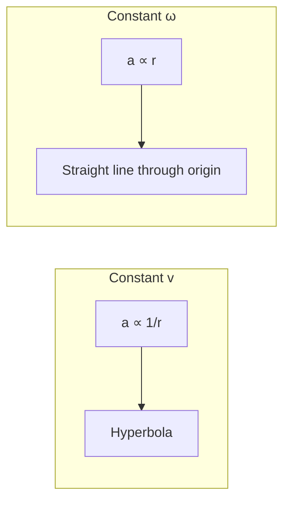
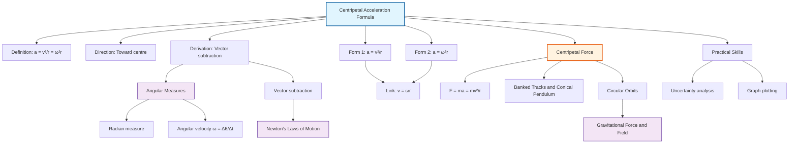

# 1. Overview / 概述

**English:**
This sub-topic focuses on the **centripetal acceleration formula** — the mathematical expression that describes the acceleration experienced by an object moving in a circular path at constant speed. While the speed is constant, the **direction** of velocity changes continuously, resulting in an acceleration directed toward the center of the circle. This is a cornerstone concept in A2 Mechanics, bridging [[Angular Measures]] with [[Newton's Laws of Motion]] to explain why objects in circular motion require a net inward force. Understanding this formula is essential for analyzing [[Centripetal Force]], [[Banked Tracks and Conical Pendulum]], and ultimately [[Circular Orbits]] in gravitational fields.

**中文:**
本子知识点聚焦于**向心加速度公式**——描述物体以恒定速度沿圆周运动时所受加速度的数学表达式。虽然速度大小不变，但**方向**持续变化，从而产生指向圆心的加速度。这是A2力学中的核心概念，将[[Angular Measures|角量]]与[[Newton's Laws of Motion|牛顿运动定律]]联系起来，解释为什么圆周运动中的物体需要净内向力。理解这一公式对于分析[[Centripetal Force|向心力]]、[[Banked Tracks and Conical Pendulum|倾斜轨道与圆锥摆]]以及最终在引力场中的[[Circular Orbits|圆形轨道]]至关重要。

---

# 2. Syllabus Learning Objectives / 考纲学习目标

| CAIE 9702 | Edexcel IAL |
|-----------|-------------|
| 14.2(a): Define centripetal acceleration and state that it is directed towards the centre of the circle | 5.5: Derive the expression for centripetal acceleration $a = v^2/r$ |
| 14.2(b): Use the equation $a = v^2/r$ | 5.6: Use $a = v^2/r$ and $a = \omega^2 r$ |
| 14.2(c): Use the equation $a = \omega^2 r$ | 5.7: Solve problems involving centripetal acceleration |
| 14.2(d): Derive $a = v^2/r$ using vector diagrams | 5.8: Relate centripetal acceleration to angular velocity |
| | 5.9: Apply to real-world examples (e.g., fairground rides, planetary motion) |

**Examiner Expectations / 考官期望:**
- **CAIE:** Derivation using vector subtraction is required; must show direction change clearly.
- **Edexcel:** Derivation is expected; emphasis on linking $a = v^2/r$ to $a = \omega^2 r$ via $v = \omega r$.
- **Both:** Students must apply formulas to numerical problems and explain physical meaning.

---

# 3. Core Definitions / 核心定义

| Term (EN/CN) | Definition (EN) | Definition (CN) | Common Mistakes / 常见错误 |
|--------------|-----------------|-----------------|---------------------------|
| **Centripetal Acceleration** / 向心加速度 | The acceleration of an object moving in a circular path at constant speed, directed towards the centre of the circle. | 物体以恒定速度沿圆周运动时的加速度，方向指向圆心。 | Confusing with tangential acceleration (which is zero for uniform circular motion). / 与切向加速度混淆（匀速圆周运动中切向加速度为零）。 |
| **Uniform Circular Motion** / 匀速圆周运动 | Motion of an object in a circular path at constant speed. | 物体沿圆周以恒定速度运动。 | Thinking "constant speed" means "constant velocity" — velocity changes due to direction change. / 认为"恒定速度"意味着"恒定速度矢量"——速度因方向变化而改变。 |
| **Radius of Curvature** / 曲率半径 | The radius of the circular path at a given point. | 给定点处圆形路径的半径。 | Using diameter instead of radius in formulas. / 在公式中使用直径而非半径。 |
| **Angular Velocity ($\omega$)** / 角速度 | The rate of change of angular displacement, measured in rad s⁻¹. | 角位移的变化率，单位为 rad s⁻¹。 | Forgetting to use radians in calculations. / 忘记在计算中使用弧度。 |
| **Tangential Velocity ($v$)** / 切向速度 | The instantaneous linear velocity of an object in circular motion, tangent to the path. | 圆周运动物体的瞬时线速度，方向与路径相切。 | Confusing with angular velocity — they are related by $v = \omega r$. / 与角速度混淆——它们通过 $v = \omega r$ 关联。 |

---

# 4. Key Concepts Explained / 关键概念详解

## 4.1 Derivation of Centripetal Acceleration / 向心加速度的推导

### Explanation / 解释
**English:**
Consider an object moving in a circle of radius $r$ with constant speed $v$. At time $t$, it is at position A with velocity $\vec{v}_A$ tangent to the circle. After a small time interval $\Delta t$, it moves to position B with velocity $\vec{v}_B$. The change in velocity $\Delta \vec{v} = \vec{v}_B - \vec{v}_A$ is found by vector subtraction. For small $\Delta t$, the angle $\Delta \theta$ swept out is small, and the vector triangle is approximately isosceles. The magnitude of $\Delta \vec{v}$ is approximately $v \Delta \theta$. Since $\Delta \theta = \omega \Delta t = (v/r) \Delta t$, we get $\Delta v = (v^2/r) \Delta t$. Therefore, centripetal acceleration $a = \Delta v / \Delta t = v^2/r$. The direction of $\Delta \vec{v}$ (and hence $\vec{a}$) points toward the centre of the circle.

**中文:**
考虑一个以恒定速度 $v$ 沿半径为 $r$ 的圆运动的物体。在时间 $t$，它位于位置 A，速度 $\vec{v}_A$ 与圆相切。经过一小段时间间隔 $\Delta t$，它移动到位置 B，速度 $\vec{v}_B$。速度变化量 $\Delta \vec{v} = \vec{v}_B - \vec{v}_A$ 通过矢量减法求得。当 $\Delta t$ 很小时，扫过的角度 $\Delta \theta$ 很小，矢量三角形近似为等腰三角形。$\Delta \vec{v}$ 的大小近似为 $v \Delta \theta$。由于 $\Delta \theta = \omega \Delta t = (v/r) \Delta t$，我们得到 $\Delta v = (v^2/r) \Delta t$。因此，向心加速度 $a = \Delta v / \Delta t = v^2/r$。$\Delta \vec{v}$ 的方向（因此 $\vec{a}$ 的方向）指向圆心。

### Physical Meaning / 物理意义
**English:**
Centripetal acceleration is NOT caused by a change in speed — it is caused by a **change in direction** of the velocity vector. Even at constant speed, the velocity vector rotates continuously, requiring an inward acceleration. This acceleration is always perpendicular to the velocity, so it does no work and does not change the kinetic energy of the object.

**中文:**
向心加速度不是由速度大小变化引起的——而是由速度矢量的**方向变化**引起的。即使速度大小恒定，速度矢量也在持续旋转，需要向内的加速度。这个加速度始终垂直于速度，因此不做功，也不改变物体的动能。

### Common Misconceptions / 常见误区
- ❌ "Centripetal acceleration is outward because of centrifugal force." → **Correct:** Centripetal acceleration is **inward**; centrifugal force is a fictitious force in a rotating frame.
- ❌ "Larger radius means larger acceleration." → **Correct:** For constant $v$, $a \propto 1/r$; for constant $\omega$, $a \propto r$.
- ❌ "Acceleration is zero because speed is constant." → **Correct:** Acceleration exists due to direction change.

### Exam Tips / 考试提示
- **CAIE:** Be prepared to draw the vector subtraction diagram for the derivation.
- **Edexcel:** Know both forms $a = v^2/r$ and $a = \omega^2 r$, and when to use each.
- **Both:** Always check units — $v$ in m s⁻¹, $r$ in m, $\omega$ in rad s⁻¹.

> 📷 **IMAGE PROMPT — DERIVATION: Vector Subtraction for Centripetal Acceleration**
> A clear diagram showing: (1) A circle with radius r, points A and B separated by small angle Δθ; (2) Velocity vectors v_A and v_B tangent to the circle at A and B; (3) Vector triangle showing Δv = v_B - v_A, with Δv pointing toward the centre; (4) Labels: r, v, Δθ, Δv. Clean white background, professional physics textbook style.

---

## 4.2 Two Forms of the Formula / 公式的两种形式

### Explanation / 解释
**English:**
The centripetal acceleration formula has two equivalent forms:
1. $a = \frac{v^2}{r}$ — used when linear speed $v$ and radius $r$ are known.
2. $a = \omega^2 r$ — used when angular velocity $\omega$ and radius $r$ are known.

They are linked by $v = \omega r$, so substituting gives $a = (\omega r)^2 / r = \omega^2 r$.

**中文:**
向心加速度公式有两种等价形式：
1. $a = \frac{v^2}{r}$ — 当已知线速度 $v$ 和半径 $r$ 时使用。
2. $a = \omega^2 r$ — 当已知角速度 $\omega$ 和半径 $r$ 时使用。

它们通过 $v = \omega r$ 关联，代入可得 $a = (\omega r)^2 / r = \omega^2 r$。

### When to Use Each Form / 何时使用每种形式
- **$a = v^2/r$:** Best when the problem gives linear speed (e.g., a car on a circular track at 20 m s⁻¹).
- **$a = \omega^2 r$:** Best when the problem gives angular velocity or period (e.g., a rotating turntable with period 2 s).

### Exam Tips / 考试提示
- If given period $T$, use $\omega = 2\pi/T$ then $a = \omega^2 r$.
- If given frequency $f$, use $\omega = 2\pi f$ then $a = \omega^2 r$.
- Always convert to SI units before substituting.

---

# 5. Essential Equations / 核心公式

## Equation 1: Centripetal Acceleration (Linear Form)

$$ a = \frac{v^2}{r} $$

| Symbol (符号) | Meaning (EN) | Meaning (CN) | Unit (单位) |
|--------------|-------------|-------------|------------|
| $a$ | Centripetal acceleration | 向心加速度 | m s⁻² |
| $v$ | Linear (tangential) speed | 线（切向）速度 | m s⁻¹ |
| $r$ | Radius of circular path | 圆形路径半径 | m |

**Derivation / 推导:** See Section 4.1 above.
**Conditions / 适用条件:** Uniform circular motion (constant speed); valid for instantaneous acceleration in non-uniform circular motion.
**Limitations / 局限性:** Only applies to circular motion; for elliptical orbits, radius of curvature varies.

## Equation 2: Centripetal Acceleration (Angular Form)

$$ a = \omega^2 r $$

| Symbol (符号) | Meaning (EN) | Meaning (CN) | Unit (单位) |
|--------------|-------------|-------------|------------|
| $a$ | Centripetal acceleration | 向心加速度 | m s⁻² |
| $\omega$ | Angular velocity | 角速度 | rad s⁻¹ |
| $r$ | Radius of circular path | 圆形路径半径 | m |

**Derivation / 推导:** Substitute $v = \omega r$ into $a = v^2/r$.
**Conditions / 适用条件:** Same as above.
**Limitations / 局限性:** Same as above.

## Equation 3: Relationship Between Linear and Angular Speed

$$ v = \omega r $$

| Symbol (符号) | Meaning (EN) | Meaning (CN) | Unit (单位) |
|--------------|-------------|-------------|------------|
| $v$ | Linear speed | 线速度 | m s⁻¹ |
| $\omega$ | Angular velocity | 角速度 | rad s⁻¹ |
| $r$ | Radius | 半径 | m |

**Conditions / 适用条件:** Valid for any circular motion; $\omega$ must be in rad s⁻¹.

> 📷 **IMAGE PROMPT — FORMULA: Centripetal Acceleration Formula Triangle**
> A visual formula triangle showing a = v²/r, with a at top, v² on bottom left, r on bottom right. Alternatively, a circle with radius r, tangential velocity v, and inward acceleration a labelled. Clean, educational style.

---

# 6. Graphs and Relationships / 图表与关系

## 6.1 Acceleration vs. Radius (Constant Speed) / 加速度与半径关系（恒定速度）

### Axes / 坐标轴
- **x-axis:** Radius $r$ / 半径 $r$ (m)
- **y-axis:** Centripetal acceleration $a$ / 向心加速度 $a$ (m s⁻²)

### Shape / 形状
- **Inverse relationship:** $a \propto 1/r$ — a hyperbola.
- **反比关系:** $a \propto 1/r$ — 双曲线。

### Gradient Meaning / 斜率含义
- Gradient is not constant; the curve shows $a$ decreases as $r$ increases for fixed $v$.
- 斜率不恒定；曲线显示在固定 $v$ 下，$a$ 随 $r$ 增大而减小。

### Area Meaning / 面积含义
- Area under the curve has no direct physical meaning.
- 曲线下面积无直接物理意义。

### Exam Interpretation / 考试解读
- For a car on a circular track at fixed speed, a tighter turn (smaller $r$) gives larger $a$.
- 对于以固定速度在圆形轨道上行驶的汽车，更急的转弯（更小的 $r$）产生更大的 $a$。

## 6.2 Acceleration vs. Radius (Constant Angular Velocity) / 加速度与半径关系（恒定角速度）

### Axes / 坐标轴
- **x-axis:** Radius $r$ / 半径 $r$ (m)
- **y-axis:** Centripetal acceleration $a$ / 向心加速度 $a$ (m s⁻²)

### Shape / 形状
- **Direct proportion:** $a \propto r$ — a straight line through origin.
- **正比关系:** $a \propto r$ — 过原点的直线。

### Gradient Meaning / 斜率含义
- Gradient = $\omega^2$ (constant for fixed $\omega$).
- 斜率 = $\omega^2$（固定 $\omega$ 时为常数）。

### Area Meaning / 面积含义
- Area under the line has no direct physical meaning.
- 线下面积无直接物理意义。

### Exam Interpretation / 考试解读
- For a rotating platform (constant $\omega$), points farther from centre experience larger $a$.
- 对于旋转平台（恒定 $\omega$），离中心越远的点承受的 $a$ 越大。

---

# 7. Required Diagrams / 必备图表

## 7.1 Vector Subtraction Diagram for Derivation / 推导用矢量减法图

### Description / 描述
**English:** A diagram showing two velocity vectors at two nearby points on a circular path, and the vector subtraction to find the change in velocity (which points toward the centre).

**中文:** 显示圆形路径上两个邻近点的两个速度矢量，以及求速度变化量（指向圆心）的矢量减法图。

### Image Prompt / 图片生成提示
> 📷 **IMAGE PROMPT — DIAGRAM: Centripetal Acceleration Vector Derivation**
> A circle with centre O and radius r. Two points A and B on the circumference separated by a small angle Δθ. At A, draw velocity vector v_A tangent to the circle pointing upward-right. At B, draw velocity vector v_B tangent to the circle pointing upward-left. Below the circle, show a vector triangle: v_A and v_B as two sides with angle Δθ between them, and Δv as the third side pointing from the tip of v_A to the tip of v_B. Label Δv and indicate it points toward O. Clean, professional physics textbook style, white background, black lines with red arrows for velocity vectors.

### Labels Required / 需要标注
- Centre O / 圆心 O
- Radius r / 半径 r
- Points A and B / 点 A 和 B
- Velocity vectors $\vec{v}_A$ and $\vec{v}_B$ / 速度矢量 $\vec{v}_A$ 和 $\vec{v}_B$
- Change in velocity $\Delta \vec{v}$ / 速度变化量 $\Delta \vec{v}$
- Angle $\Delta \theta$ / 角度 $\Delta \theta$

### Exam Importance / 考试重要性
- **CAIE:** Essential for derivation question (14.2(d)).
- **Edexcel:** Required for derivation (5.5).
- **Both:** Understanding this diagram helps avoid misconceptions about direction.

## 7.2 Direction of Acceleration Diagram / 加速度方向图

### Description / 描述
**English:** A diagram showing an object at several positions on a circular path, with velocity vectors (tangential) and acceleration vectors (radial inward) at each position.

**中文:** 显示物体在圆形路径上多个位置的图，每个位置有速度矢量（切向）和加速度矢量（径向向内）。

### Image Prompt / 图片生成提示
> 📷 **IMAGE PROMPT — DIAGRAM: Direction of Centripetal Acceleration**
> A circle with centre O. Four points at 0°, 90°, 180°, and 270° positions. At each point, draw a blue arrow tangent to the circle (velocity) and a red arrow pointing directly toward O (acceleration). The red arrows should be perpendicular to the blue arrows. Label: "v (tangential)" and "a (centripetal)". Clean, educational style, white background.

### Labels Required / 需要标注
- Velocity vectors (tangential) / 速度矢量（切向）
- Acceleration vectors (radial inward) / 加速度矢量（径向向内）
- Centre O / 圆心 O

### Exam Importance / 考试重要性
- Demonstrates that $a$ is always perpendicular to $v$.
- 证明 $a$ 始终垂直于 $v$。

---

# 8. Worked Examples / 典型例题

## Example 1: Car on a Circular Track / 汽车在圆形轨道上

### Question / 题目
**English:**
A car travels around a circular track of radius 50 m at a constant speed of 20 m s⁻¹. Calculate the centripetal acceleration of the car.

**中文:**
一辆汽车以 20 m s⁻¹ 的恒定速度沿半径为 50 m 的圆形轨道行驶。计算汽车的向心加速度。

### Solution / 解答
**Step 1:** Identify known values.
- $v = 20$ m s⁻¹
- $r = 50$ m

**Step 2:** Use the formula $a = v^2/r$.

$$ a = \frac{(20)^2}{50} = \frac{400}{50} = 8 \text{ m s}^{-2} $$

**Step 3:** State direction.
- The acceleration is directed toward the centre of the circular track.
- 加速度方向指向圆形轨道的圆心。

### Final Answer / 最终答案
**Answer:** $a = 8$ m s⁻² toward the centre | **答案：** $a = 8$ m s⁻² 指向圆心

### Quick Tip / 提示
Always check: if $v$ doubles, $a$ quadruples (since $a \propto v^2$). / 始终检查：如果 $v$ 加倍，$a$ 变为四倍（因为 $a \propto v^2$）。

---

## Example 2: Rotating Turntable / 旋转唱盘

### Question / 题目
**English:**
A point on a rotating turntable is 0.15 m from the centre. The turntable completes one revolution every 0.50 s. Calculate the centripetal acceleration of the point.

**中文:**
旋转唱盘上一点距中心 0.15 m。唱盘每 0.50 s 完成一次旋转。计算该点的向心加速度。

### Solution / 解答
**Step 1:** Identify known values.
- $r = 0.15$ m
- $T = 0.50$ s (period)

**Step 2:** Calculate angular velocity $\omega$.

$$ \omega = \frac{2\pi}{T} = \frac{2\pi}{0.50} = 4\pi \text{ rad s}^{-1} \approx 12.57 \text{ rad s}^{-1} $$

**Step 3:** Use $a = \omega^2 r$.

$$ a = (4\pi)^2 \times 0.15 = 16\pi^2 \times 0.15 = 2.4\pi^2 \text{ m s}^{-2} $$

$$ a \approx 2.4 \times (3.142)^2 \approx 2.4 \times 9.87 \approx 23.7 \text{ m s}^{-2} $$

### Final Answer / 最终答案
**Answer:** $a = 2.4\pi^2 \approx 23.7$ m s⁻² | **答案：** $a = 2.4\pi^2 \approx 23.7$ m s⁻²

### Quick Tip / 提示
When given period $T$, always convert to $\omega$ first. / 当给出周期 $T$ 时，始终先转换为 $\omega$。

---

# 9. Past Paper Question Types / 历年真题题型

| Question Type / 题型 | Frequency / 频率 | Difficulty / 难度 | Past Paper References / 真题索引 |
|----------------------|------------------|------------------|-------------------------------|
| Derivation of $a = v^2/r$ using vector diagram | High (CAIE) | Medium | 📝 *待填入* |
| Numerical calculation using $a = v^2/r$ or $a = \omega^2 r$ | Very High | Easy-Medium | 📝 *待填入* |
| Comparing accelerations for different radii/speeds | Medium | Medium | 📝 *待填入* |
| Linking centripetal acceleration to centripetal force via $F = ma$ | High | Medium | 📝 *待填入* |
| Multi-step problem involving period, frequency, angular velocity | Medium | Hard | 📝 *待填入* |

**Common Command Words / 常见指令词:**
- **Derive / 推导:** Show the derivation step-by-step (CAIE 14.2(d), Edexcel 5.5).
- **Calculate / 计算:** Use the formula to find a numerical value.
- **Explain / 解释:** Describe the physical meaning or direction.
- **State / 陈述:** Give a brief answer without derivation.
- **Show that / 证明:** Demonstrate that a given result follows from the data.

---

# 10. Practical Skills Connections / 实验技能链接

**English:**
This sub-topic connects to practical work in several ways:

1. **Measurement of centripetal acceleration:** Use a motion sensor or video analysis to track an object in circular motion and determine $a$ from $v$ and $r$.
2. **Uncertainties:** When calculating $a = v^2/r$, the uncertainty in $a$ depends on uncertainties in $v$ and $r$. Since $v$ is squared, its uncertainty has double the effect: $\frac{\Delta a}{a} = 2\frac{\Delta v}{v} + \frac{\Delta r}{r}$.
3. **Graph plotting:** Plot $a$ vs. $r$ for constant $\omega$ (should be straight line through origin) or $a$ vs. $1/r$ for constant $v$ (should be straight line through origin).
4. **Experimental design:** Use a rotating platform with a force sensor to measure centripetal force, then verify $F = ma = mv^2/r$.

**中文:**
本子知识点通过以下方式与实验工作联系：

1. **向心加速度的测量：** 使用运动传感器或视频分析追踪圆周运动中的物体，从 $v$ 和 $r$ 确定 $a$。
2. **不确定度：** 计算 $a = v^2/r$ 时，$a$ 的不确定度取决于 $v$ 和 $r$ 的不确定度。由于 $v$ 被平方，其不确定度有双倍影响：$\frac{\Delta a}{a} = 2\frac{\Delta v}{v} + \frac{\Delta r}{r}$。
3. **图表绘制：** 绘制恒定 $\omega$ 下 $a$ 与 $r$ 的关系图（应为过原点的直线）或恒定 $v$ 下 $a$ 与 $1/r$ 的关系图（应为过原点的直线）。
4. **实验设计：** 使用带有力传感器的旋转平台测量向心力，然后验证 $F = ma = mv^2/r$。

---

# 11. Concept Map / 概念图谱

---

# 12. Quick Revision Sheet / 速查表

| Category / 类别 | Key Points / 要点 |
|----------------|------------------|
| **Definition / 定义** | Acceleration toward centre of circular path; caused by direction change, not speed change. / 指向圆形路径中心的加速度；由方向变化引起，而非速度变化。 |
| **Key Formula / 核心公式** | $a = \frac{v^2}{r} = \omega^2 r$; linked by $v = \omega r$ |
| **Key Graph / 核心图表** | Constant $v$: $a \propto 1/r$ (hyperbola); Constant $\omega$: $a \propto r$ (straight line through origin) / 恒定 $v$：$a \propto 1/r$（双曲线）；恒定 $\omega$：$a \propto r$（过原点的直线） |
| **Derivation / 推导** | Vector subtraction of two velocity vectors separated by small angle $\Delta \theta$; $\Delta v = v \Delta \theta = (v^2/r) \Delta t$ / 两个相隔小角度 $\Delta \theta$ 的速度矢量的矢量减法；$\Delta v = v \Delta \theta = (v^2/r) \Delta t$ |
| **Direction / 方向** | Always perpendicular to velocity, pointing toward centre / 始终垂直于速度，指向圆心 |
| **Common Mistake / 常见错误** | Confusing with centrifugal force (outward fictitious force); using diameter instead of radius / 与离心力（向外的假想力）混淆；使用直径而非半径 |
| **Exam Tip / 考试提示** | CAIE: Draw vector diagram clearly; Edexcel: Derive both forms / CAIE：清晰绘制矢量图；Edexcel：推导两种形式 |
| **Units / 单位** | $a$: m s⁻², $v$: m s⁻¹, $r$: m, $\omega$: rad s⁻¹ |
| **Related Topics / 相关主题** | [[Centripetal Force]], [[Banked Tracks and Conical Pendulum]], [[Circular Orbits]] |