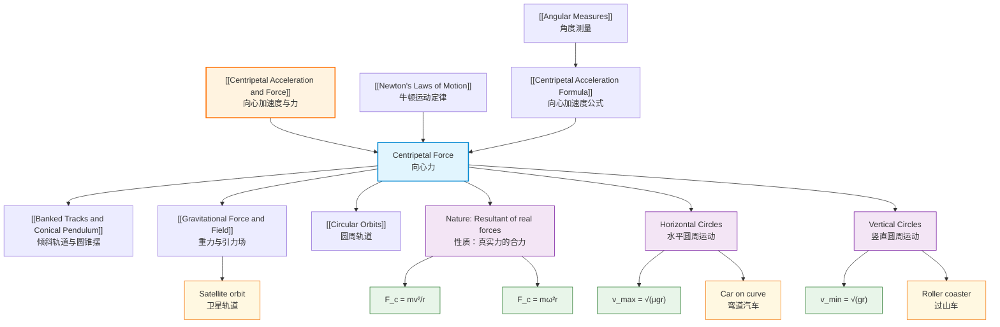

# 1. Overview / 概述

**English:**
Centripetal force is the net force required to keep an object moving in a circular path. It is not a new type of force, but rather the resultant force that acts perpendicular to the velocity, directed towards the center of the circle. This sub-topic explores the nature of centripetal force, how to calculate it using $F = m\omega^2 r$ and $F = \frac{mv^2}{r}$, and how to identify the physical forces (such as tension, friction, gravity, or normal reaction) that provide this centripetal force in different scenarios. Understanding centripetal force is essential for analyzing [[Banked Tracks and Conical Pendulum]], [[Circular Orbits]], and many real-world applications like fairground rides and planetary motion. This builds directly on [[Newton's Laws of Motion]] and [[Angular Measures]].

**中文:**
向心力是使物体保持圆周运动所需的净力。它不是一种新的力，而是垂直于速度方向、指向圆心的合力。本子知识点探讨向心力的性质、如何通过 $F = m\omega^2 r$ 和 $F = \frac{mv^2}{r}$ 计算向心力，以及如何识别在不同场景中提供向心力的物理力（如张力、摩擦力、重力或法向反作用力）。理解向心力对于分析[[Banked Tracks and Conical Pendulum|倾斜轨道与圆锥摆]]、[[Circular Orbits|圆周轨道]]以及许多实际应用（如游乐场设施和行星运动）至关重要。这直接建立在[[Newton's Laws of Motion|牛顿运动定律]]和[[Angular Measures|角度测量]]的基础上。

---

# 2. Syllabus Learning Objectives / 考纲学习目标

| CAIE 9702 (14.2 a-d) | Edexcel IAL (WPH14 U4: 5.5-5.9) |
|----------------------|----------------------------------|
| Define centripetal force and understand that it is the resultant force causing circular motion | Understand the concept of centripetal force |
| Recall and use $F = m\omega^2 r$ and $F = \frac{mv^2}{r}$ | Use $F = \frac{mv^2}{r}$ and $F = m\omega^2 r$ in problem-solving |
| Identify the source of centripetal force in various situations (e.g., tension, friction, gravity) | Identify forces providing centripetal force in different contexts |
| Solve problems involving centripetal force in horizontal and vertical circles | Solve problems involving circular motion, including vertical circles |

**Examiner Expectations / 考官期望:**
- **English:** Students must understand that centripetal force is always directed towards the center of the circle and is perpendicular to velocity. They must be able to identify the real forces (e.g., tension, friction, gravity, normal reaction) that combine to produce the centripetal force. In vertical circular motion, students must account for the changing net force due to gravity.
- **中文:** 学生必须理解向心力始终指向圆心且垂直于速度。他们必须能够识别产生向心力的真实力（如张力、摩擦力、重力、法向反作用力）。在竖直圆周运动中，学生必须考虑重力导致的净力变化。

---

# 3. Core Definitions / 核心定义

| Term (EN/CN) | Definition (EN) | Definition (CN) | Common Mistakes / 常见错误 |
|--------------|-----------------|-----------------|---------------------------|
| **Centripetal Force** / 向心力 | The net force acting on an object moving in a circular path, directed towards the center of the circle, causing the centripetal acceleration. | 作用在圆周运动物体上的净力，方向指向圆心，引起向心加速度。 | ❌ Thinking it's a separate force (it's the resultant of real forces) / 认为它是一种独立的力（它是真实力的合力） |
| **Resultant Force** / 合力 | The single force that has the same effect as all the forces acting on an object combined. | 与作用在物体上的所有力组合效果相同的单一力。 | ❌ Confusing with individual forces / 与单个力混淆 |
| **Tension** / 张力 | The force transmitted through a string, rope, or cable when it is pulled tight by forces acting from opposite ends. | 当绳子、绳索或缆绳被两端拉力拉紧时传递的力。 | ❌ Forgetting tension can vary in vertical circles / 忘记在竖直圆周中张力会变化 |
| **Normal Reaction** / 法向反作用力 | The force exerted by a surface on an object in contact with it, perpendicular to the surface. | 表面对与其接触的物体施加的力，垂直于表面。 | ❌ Assuming it always equals weight / 假设它总是等于重力 |
| **Friction** / 摩擦力 | The force that opposes relative motion between two surfaces in contact. | 阻碍两个接触表面相对运动的力。 | ❌ Forgetting friction can provide centripetal force (e.g., car turning) / 忘记摩擦力可以提供向心力（如汽车转弯） |

---

# 4. Key Concepts Explained / 关键概念详解

## 4.1 Nature of Centripetal Force / 向心力的性质

### Explanation / 解释
**English:** Centripetal force is not a fundamental force of nature; it is the **resultant** of all real forces acting on an object in circular motion. For example, when a car turns a corner, the friction between the tires and the road provides the centripetal force. When a satellite orbits Earth, gravity provides the centripetal force. When a ball on a string is swung in a horizontal circle, the tension in the string provides the centripetal force. The direction of centripetal force is always perpendicular to the velocity and points towards the center of the circular path. This is a direct consequence of [[Newton's Laws of Motion|Newton's Second Law]]: $F = ma$, where $a$ is the [[Centripetal Acceleration Formula|centripetal acceleration]].

**中文:** 向心力不是一种基本力；它是作用在圆周运动物体上所有真实力的**合力**。例如，汽车转弯时，轮胎与路面之间的摩擦力提供向心力。卫星绕地球运行时，重力提供向心力。用绳子甩动小球做水平圆周运动时，绳子中的张力提供向心力。向心力的方向始终垂直于速度，指向圆周路径的中心。这是[[Newton's Laws of Motion|牛顿第二定律]]的直接结果：$F = ma$，其中 $a$ 是[[Centripetal Acceleration Formula|向心加速度]]。

### Physical Meaning / 物理意义
**English:** The centripetal force is what "pulls" the object away from its natural straight-line path (as per [[Newton's Laws of Motion|Newton's First Law]]) and forces it into a curved path. Without centripetal force, the object would continue in a straight line tangent to the circle. The magnitude of the centripetal force determines how tight the curve is — a larger force produces a smaller radius of curvature for the same speed.

**中文:** 向心力是"拉"物体偏离其自然直线路径（根据[[Newton's Laws of Motion|牛顿第一定律]]）并迫使其进入弯曲路径的力。没有向心力，物体会沿圆的切线方向做直线运动。向心力的大小决定了曲线的弯曲程度——对于相同速度，更大的力产生更小的曲率半径。

### Common Misconceptions / 常见误区
- ❌ **"Centrifugal force is real"** — Centrifugal force is a fictitious force experienced in a rotating reference frame. In an inertial frame, only centripetal force exists. / "离心力是真实的"——离心力是在旋转参考系中体验到的假想力。在惯性参考系中，只有向心力存在。
- ❌ **"Centripetal force is an extra force"** — It is the resultant of existing forces, not an additional force. / "向心力是一种额外的力"——它是现有力的合力，不是额外的力。
- ❌ **"Centripetal force always equals tension"** — In vertical circles, tension varies with position. / "向心力总是等于张力"——在竖直圆周中，张力随位置变化。

### Exam Tips / 考试提示
- ✅ **Always draw a free-body diagram** to identify all real forces acting on the object. / 始终画受力分析图，识别作用在物体上的所有真实力。
- ✅ **The centripetal force is the vector sum** of forces in the radial direction. / 向心力是径向方向上力的矢量和。
- ✅ **For vertical circles**, remember that gravity contributes to or opposes the centripetal force depending on position. / 对于竖直圆周，记住重力根据位置不同会贡献或抵消向心力。

> 📷 **IMAGE PROMPT — FBD-001: Free-Body Diagrams for Centripetal Force**
> A split diagram showing three scenarios: (1) A car turning on a flat road, with friction force pointing towards the center of the turn; (2) A ball on a string in horizontal circular motion, with tension pointing towards the center; (3) A satellite orbiting Earth, with gravitational force pointing towards Earth's center. Each diagram should have labeled force vectors and velocity vectors.

---

## 4.2 Centripetal Force in Horizontal Circles / 水平圆周运动中的向心力

### Explanation / 解释
**English:** In horizontal circular motion, the centripetal force is entirely horizontal and perpendicular to the vertical direction. Common examples include:
- **Car on a flat curve:** Friction provides the centripetal force. $F_c = f = \mu mg$, where $\mu$ is the coefficient of friction.
- **Ball on a string (horizontal circle):** Tension provides the centripetal force. $F_c = T$.
- **Conical pendulum:** The horizontal component of tension provides the centripetal force. $T\sin\theta = m\omega^2 r$. (See [[Banked Tracks and Conical Pendulum]])

**中文:** 在水平圆周运动中，向心力完全是水平的，垂直于竖直方向。常见例子包括：
- **平弯道上的汽车：** 摩擦力提供向心力。$F_c = f = \mu mg$，其中 $\mu$ 是摩擦系数。
- **绳子上的小球（水平圆周）：** 张力提供向心力。$F_c = T$。
- **圆锥摆：** 张力的水平分量提供向心力。$T\sin\theta = m\omega^2 r$。（参见[[Banked Tracks and Conical Pendulum|倾斜轨道与圆锥摆]]）

### Physical Meaning / 物理意义
**English:** In horizontal circles, the centripetal force is constant in magnitude if the speed is constant. The vertical forces (weight and normal reaction) balance each other, so they do not contribute to the centripetal force.

**中文:** 在水平圆周中，如果速度恒定，向心力的大小是恒定的。竖直方向上的力（重力和法向反作用力）相互平衡，因此它们不贡献向心力。

### Common Misconceptions / 常见误区
- ❌ **"Tension equals weight in a conical pendulum"** — No, the vertical component of tension balances weight: $T\cos\theta = mg$. / "在圆锥摆中张力等于重力"——不，张力的竖直分量平衡重力：$T\cos\theta = mg$。
- ❌ **"Friction always opposes motion"** — In circular motion, friction can act perpendicular to velocity (towards the center) to provide centripetal force. / "摩擦力总是阻碍运动"——在圆周运动中，摩擦力可以垂直于速度方向（指向圆心）提供向心力。

### Exam Tips / 考试提示
- ✅ **For maximum speed on a curved road:** $v_{\text{max}} = \sqrt{\mu g r}$. / 对于弯道上的最大速度：$v_{\text{max}} = \sqrt{\mu g r}$。
- ✅ **Always resolve forces into radial and tangential components.** / 始终将力分解为径向和切向分量。

---

## 4.3 Centripetal Force in Vertical Circles / 竖直圆周运动中的向心力

### Explanation / 解释
**English:** In vertical circular motion, the centripetal force is not constant because gravity always acts vertically downward. The net force towards the center varies with position. Key positions:
- **At the top:** Both weight and tension (or normal reaction) act downward towards the center. $F_c = mg + T$ (or $mg + N$).
- **At the bottom:** Weight acts downward, but tension (or normal reaction) acts upward towards the center. $F_c = T - mg$ (or $N - mg$).
- **At the sides:** Only the horizontal component of tension provides centripetal force; weight acts tangentially.

**Minimum speed at the top:** For an object to complete a vertical circle (e.g., a roller coaster loop), the minimum speed at the top occurs when the normal reaction (or tension) is zero: $v_{\text{min}} = \sqrt{g r}$.

**中文:** 在竖直圆周运动中，向心力不是恒定的，因为重力始终竖直向下。指向中心的净力随位置变化。关键位置：
- **顶部：** 重力和张力（或法向反作用力）都向下指向圆心。$F_c = mg + T$（或 $mg + N$）。
- **底部：** 重力向下，但张力（或法向反作用力）向上指向圆心。$F_c = T - mg$（或 $N - mg$）。
- **侧面：** 只有张力的水平分量提供向心力；重力沿切向作用。

**顶部的最小速度：** 对于物体完成竖直圆周运动（如过山车环），顶部的最小速度发生在法向反作用力（或张力）为零时：$v_{\text{min}} = \sqrt{g r}$。

### Physical Meaning / 物理意义
**English:** The varying centripetal force in vertical circles means the tension (or normal reaction) must adjust to maintain circular motion. At the top, gravity helps provide centripetal force, so less tension is needed. At the bottom, gravity opposes centripetal force, so more tension is needed.

**中文:** 竖直圆周中向心力的变化意味着张力（或法向反作用力）必须调整以维持圆周运动。在顶部，重力帮助提供向心力，因此需要的张力较小。在底部，重力抵消向心力，因此需要的张力较大。

### Common Misconceptions / 常见误区
- ❌ **"Speed is constant in vertical circles"** — No, speed changes due to gravitational potential energy conversion. / "竖直圆周中速度恒定"——不，由于重力势能转换，速度会变化。
- ❌ **"Tension is always equal to centripetal force"** — Only in horizontal circles. In vertical circles, tension is part of the centripetal force. / "张力总是等于向心力"——仅在水平圆周中成立。在竖直圆周中，张力是向心力的一部分。

### Exam Tips / 考试提示
- ✅ **Use conservation of energy** to find speed at different positions: $\frac{1}{2}mv^2 + mgh = \text{constant}$. / 使用能量守恒求不同位置的速度：$\frac{1}{2}mv^2 + mgh = \text{常数}$。
- ✅ **At the top of a vertical circle**, if $v < \sqrt{gr}$, the object will fall off the circular path. / 在竖直圆周顶部，如果 $v < \sqrt{gr}$，物体会脱离圆周路径。

> 📷 **IMAGE PROMPT — VC-001: Forces in Vertical Circular Motion**
> A diagram showing a mass on a string moving in a vertical circle. Four positions should be shown: top, bottom, left side, and right side. At each position, draw labeled force vectors for weight (mg), tension (T), and the resultant centripetal force (Fc). Include velocity vectors tangent to the circle. Add a note: "At top: Fc = mg + T; At bottom: Fc = T - mg".

---

# 5. Essential Equations / 核心公式

## Equation 1: Centripetal Force in Terms of Linear Velocity

$$F_c = \frac{mv^2}{r}$$

| Symbol (符号) | Meaning (EN) | Meaning (CN) | Unit (单位) |
|--------------|-------------|-------------|------------|
| $F_c$ | Centripetal force | 向心力 | N |
| $m$ | Mass of object | 物体质量 | kg |
| $v$ | Linear speed | 线速度 | m s⁻¹ |
| $r$ | Radius of circular path | 圆周路径半径 | m |

**Derivation / 推导:** From [[Newton's Laws of Motion|Newton's Second Law]] $F = ma$ and [[Centripetal Acceleration Formula]] $a_c = \frac{v^2}{r}$, we get $F_c = m \cdot \frac{v^2}{r}$.

**Conditions / 适用条件:** Object moving in a circular path with constant speed. / 物体以恒定速度沿圆周路径运动。

**Limitations / 局限性:** Only valid for uniform circular motion (constant speed). For non-uniform circular motion, there is also a tangential component of force. / 仅适用于匀速圆周运动（恒定速度）。对于非匀速圆周运动，还存在切向力分量。

---

## Equation 2: Centripetal Force in Terms of Angular Velocity

$$F_c = m\omega^2 r$$

| Symbol (符号) | Meaning (EN) | Meaning (CN) | Unit (单位) |
|--------------|-------------|-------------|------------|
| $F_c$ | Centripetal force | 向心力 | N |
| $m$ | Mass of object | 物体质量 | kg |
| $\omega$ | Angular velocity | 角速度 | rad s⁻¹ |
| $r$ | Radius of circular path | 圆周路径半径 | m |

**Derivation / 推导:** Substitute $v = \omega r$ into $F_c = \frac{mv^2}{r}$: $F_c = \frac{m(\omega r)^2}{r} = m\omega^2 r$.

**Conditions / 适用条件:** Object moving in a circular path with constant angular velocity. / 物体以恒定角速度沿圆周路径运动。

**Limitations / 局限性:** Same as above. / 同上。

---

## Equation 3: Maximum Speed on a Flat Curved Road

$$v_{\text{max}} = \sqrt{\mu g r}$$

| Symbol (符号) | Meaning (EN) | Meaning (CN) | Unit (单位) |
|--------------|-------------|-------------|------------|
| $v_{\text{max}}$ | Maximum safe speed | 最大安全速度 | m s⁻¹ |
| $\mu$ | Coefficient of friction | 摩擦系数 | dimensionless |
| $g$ | Acceleration due to gravity | 重力加速度 | m s⁻² |
| $r$ | Radius of curve | 弯道半径 | m |

**Derivation / 推导:** Friction provides centripetal force: $f = \mu mg = \frac{mv^2}{r}$. Cancel $m$: $\mu g = \frac{v^2}{r}$. Rearrange: $v = \sqrt{\mu g r}$.

**Conditions / 适用条件:** Car on a flat, horizontal curved road. / 汽车在平坦的水平弯道上。

**Limitations / 局限性:** Assumes maximum static friction is used. Does not account for banking of the road. / 假设使用最大静摩擦力。不考虑道路倾斜。

---

## Equation 4: Minimum Speed at the Top of a Vertical Circle

$$v_{\text{min}} = \sqrt{g r}$$

| Symbol (符号) | Meaning (EN) | Meaning (CN) | Unit (单位) |
|--------------|-------------|-------------|------------|
| $v_{\text{min}}$ | Minimum speed at top | 顶部最小速度 | m s⁻¹ |
| $g$ | Acceleration due to gravity | 重力加速度 | m s⁻² |
| $r$ | Radius of vertical circle | 竖直圆周半径 | m |

**Derivation / 推导:** At the top, when tension/normal reaction is zero: $mg = \frac{mv^2}{r}$. Cancel $m$: $g = \frac{v^2}{r}$. Rearrange: $v = \sqrt{g r}$.

**Conditions / 适用条件:** Object at the highest point of a vertical circular path, with no additional support (e.g., roller coaster car, bucket of water). / 物体在竖直圆周路径的最高点，没有额外支撑（如过山车、水桶）。

**Limitations / 局限性:** Only gives the minimum speed at the top. The speed at other points must be found using energy conservation. / 仅给出顶部的最大速度。其他点的速度必须使用能量守恒求得。

> 📷 **IMAGE PROMPT — EQ-001: Centripetal Force Equations Summary**
> A visual summary card showing the four key equations: F_c = mv²/r, F_c = mω²r, v_max = √(μgr), and v_min = √(gr). Each equation should have a small icon representing its application (e.g., a car for v_max, a roller coaster for v_min). Use color coding: blue for horizontal motion, red for vertical motion.

---

# 6. Graphs and Relationships / 图表与关系

## 6.1 Centripetal Force vs. Speed (Constant Radius) / 向心力与速度的关系（半径恒定）

### Axes / 坐标轴
- **X-axis:** Speed $v$ (m s⁻¹) / 速度 $v$ (m s⁻¹)
- **Y-axis:** Centripetal force $F_c$ (N) / 向心力 $F_c$ (N)

### Shape / 形状
**English:** A parabola opening upwards: $F_c \propto v^2$. As speed increases, the centripetal force required increases quadratically.

**中文:** 开口向上的抛物线：$F_c \propto v^2$。随着速度增加，所需的向心力呈二次方增加。

### Gradient Meaning / 斜率含义
**English:** The gradient is not constant. The rate of change of $F_c$ with respect to $v$ is $\frac{dF_c}{dv} = \frac{2mv}{r}$, which increases linearly with $v$.

**中文:** 斜率不是常数。$F_c$ 相对于 $v$ 的变化率为 $\frac{dF_c}{dv} = \frac{2mv}{r}$，随 $v$ 线性增加。

### Area Meaning / 面积含义
**English:** The area under the $F_c$ vs. $v$ graph has no direct physical meaning.

**中文:** $F_c$ 与 $v$ 关系图下的面积没有直接的物理意义。

### Exam Interpretation / 考试解读
**English:** If asked to sketch this graph, remember it passes through the origin (zero speed requires zero centripetal force) and curves upwards. A steeper curve indicates a larger mass or smaller radius.

**中文:** 如果要求画出该图，记住它通过原点（零速度需要零向心力）并向上弯曲。更陡的曲线表示更大的质量或更小的半径。

---

## 6.2 Centripetal Force vs. Radius (Constant Speed) / 向心力与半径的关系（速度恒定）

### Axes / 坐标轴
- **X-axis:** Radius $r$ (m) / 半径 $r$ (m)
- **Y-axis:** Centripetal force $F_c$ (N) / 向心力 $F_c$ (N)

### Shape / 形状
**English:** A rectangular hyperbola: $F_c \propto \frac{1}{r}$. As radius increases, the centripetal force required decreases.

**中文:** 矩形双曲线：$F_c \propto \frac{1}{r}$。随着半径增加，所需的向心力减小。

### Gradient Meaning / 斜率含义
**English:** The gradient is negative and decreases in magnitude as $r$ increases: $\frac{dF_c}{dr} = -\frac{mv^2}{r^2}$.

**中文:** 斜率为负，且随着 $r$ 增加而减小：$\frac{dF_c}{dr} = -\frac{mv^2}{r^2}$。

### Area Meaning / 面积含义
**English:** The area under the $F_c$ vs. $r$ graph has no direct physical meaning.

**中文:** $F_c$ 与 $r$ 关系图下的面积没有直接的物理意义。

### Exam Interpretation / 考试解读
**English:** This graph shows why tight turns (small radius) require much larger centripetal forces. For a given speed, halving the radius doubles the required centripetal force.

**中文:** 该图显示了为什么急转弯（小半径）需要更大的向心力。对于给定速度，半径减半会使所需向心力加倍。

---

## 6.3 Centripetal Force vs. Angular Velocity (Constant Radius) / 向心力与角速度的关系（半径恒定）

### Axes / 坐标轴
- **X-axis:** Angular velocity $\omega$ (rad s⁻¹) / 角速度 $\omega$ (rad s⁻¹)
- **Y-axis:** Centripetal force $F_c$ (N) / 向心力 $F_c$ (N)

### Shape / 形状
**English:** A parabola opening upwards: $F_c \propto \omega^2$. As angular velocity increases, the centripetal force required increases quadratically.

**中文:** 开口向上的抛物线：$F_c \propto \omega^2$。随着角速度增加，所需的向心力呈二次方增加。

### Gradient Meaning / 斜率含义
**English:** The gradient is $\frac{dF_c}{d\omega} = 2m\omega r$, which increases linearly with $\omega$.

**中文:** 斜率为 $\frac{dF_c}{d\omega} = 2m\omega r$，随 $\omega$ 线性增加。

### Area Meaning / 面积含义
**English:** No direct physical meaning.

**中文:** 没有直接的物理意义。

### Exam Interpretation / 考试解读
**English:** This graph is useful for problems involving rotating systems (e.g., centrifuges, fairground rides). Doubling $\omega$ quadruples the required centripetal force.

**中文:** 该图对于涉及旋转系统（如离心机、游乐设施）的问题很有用。$\omega$ 加倍会使所需向心力变为四倍。

> 📷 **IMAGE PROMPT — GRAPH-001: Centripetal Force Graphs**
> Three graphs side by side: (1) F_c vs v (parabola), (2) F_c vs r (hyperbola), (3) F_c vs ω (parabola). Each graph should have labeled axes with units, a sketched curve, and a brief annotation explaining the relationship (e.g., "F_c ∝ v²", "F_c ∝ 1/r", "F_c ∝ ω²").

---

# 7. Required Diagrams / 必备图表

## 7.1 Free-Body Diagram for a Car on a Flat Curve / 平弯道上汽车的受力分析图

### Description / 描述
**English:** A diagram showing a car (top view and side view) moving in a circular path on a flat road. The forces acting on the car include weight (mg downward), normal reaction (N upward), and friction (f towards the center of the circle). The centripetal force is provided entirely by friction.

**中文:** 显示汽车在平直道路上做圆周运动的图（俯视图和侧视图）。作用在汽车上的力包括重力（mg 向下）、法向反作用力（N 向上）和摩擦力（f 指向圆心）。向心力完全由摩擦力提供。

### Image Prompt / 图片生成提示
> 📷 **IMAGE PROMPT — DIAG-001: Car on Flat Curve Free-Body Diagram**
> A two-part diagram. Left: Top view of a car on a circular track, showing the car at one position with a velocity vector (v) tangent to the circle and a friction force vector (f) pointing towards the center of the circle. Right: Side view of the same car, showing weight (mg) pointing down, normal reaction (N) pointing up (equal in length to mg), and friction (f) pointing to the left (towards the center). Label all vectors clearly. Add a note: "F_c = f = μmg".

### Labels Required / 需要标注
- **English:** Weight (mg), Normal Reaction (N), Friction (f), Velocity (v), Radius (r), Center of Circle
- **中文:** 重力 (mg)、法向反作用力 (N)、摩擦力 (f)、速度 (v)、半径 (r)、圆心

### Exam Importance / 考试重要性
**English:** This is a standard diagram for questions about cars turning on flat roads. Students must understand that friction provides the centripetal force and that the maximum speed is limited by the coefficient of friction.

**中文:** 这是关于汽车在平直道路上转弯问题的标准图。学生必须理解摩擦力提供向心力，且最大速度受摩擦系数限制。

---

## 7.2 Forces in a Vertical Circle (Roller Coaster) / 竖直圆周中的力（过山车）

### Description / 描述
**English:** A diagram showing a roller coaster car at four positions in a vertical loop: top, bottom, left side, and right side. At each position, draw the forces acting on the car: weight (mg) always downward, and normal reaction (N) from the track always perpendicular to the track (towards the center at top and bottom, horizontal at the sides). Show the resultant centripetal force (F_c) pointing towards the center.

**中文:** 显示过山车在竖直环中四个位置（顶部、底部、左侧、右侧）的图。在每个位置，画出作用在过山车上的力：重力 (mg) 始终向下，轨道法向反作用力 (N) 始终垂直于轨道（在顶部和底部指向圆心，在侧面水平）。显示指向圆心的合力向心力 (F_c)。

### Image Prompt / 图片生成提示
> 📷 **IMAGE PROMPT — DIAG-002: Vertical Circle Forces Diagram**
> A diagram of a vertical circular loop with a roller coaster car shown at four positions: top (12 o'clock), bottom (6 o'clock), left (9 o'clock), and right (3 o'clock). At each position, draw and label: weight (mg, downward arrow), normal reaction (N, arrow perpendicular to track), and the resultant centripetal force (F_c, arrow pointing to center of circle). Include velocity vectors tangent to the circle. Add equations: "At top: F_c = mg + N", "At bottom: F_c = N - mg", "At sides: F_c = N (horizontal)".

### Labels Required / 需要标注
- **English:** Weight (mg), Normal Reaction (N), Centripetal Force (F_c), Velocity (v), Radius (r), Center
- **中文:** 重力 (mg)、法向反作用力 (N)、向心力 (F_c)、速度 (v)、半径 (r)、圆心

### Exam Importance / 考试重要性
**English:** This diagram is essential for understanding vertical circular motion. Students must be able to write the correct equation for centripetal force at each position and find the minimum speed at the top.

**中文:** 该图对于理解竖直圆周运动至关重要。学生必须能够写出每个位置向心力的正确方程，并求出顶部的最小速度。

---

# 8. Worked Examples / 典型例题

## Example 1: Maximum Speed on a Curved Road / 弯道上的最大速度

### Question / 题目
**English:**
A car of mass 1200 kg is traveling on a flat, horizontal curved road with a radius of 50 m. The coefficient of static friction between the tires and the road is 0.40. Calculate the maximum speed at which the car can safely take the curve without skidding. (Take $g = 9.81 \text{ m s}^{-2}$)

**中文:**
一辆质量为 1200 kg 的汽车在半径为 50 m 的平坦水平弯道上行驶。轮胎与路面之间的静摩擦系数为 0.40。计算汽车在不打滑的情况下安全通过弯道的最大速度。（取 $g = 9.81 \text{ m s}^{-2}$）

### Solution / 解答

**Step 1: Identify the centripetal force / 确定向心力**
The centripetal force is provided by friction: $F_c = f = \mu mg$

**Step 2: Write the centripetal force equation / 写出向心力方程**
$$\mu mg = \frac{mv^2}{r}$$

**Step 3: Cancel mass and solve for v / 消去质量并求解 v**
$$\mu g = \frac{v^2}{r}$$
$$v^2 = \mu g r$$
$$v = \sqrt{\mu g r}$$

**Step 4: Substitute values / 代入数值**
$$v = \sqrt{0.40 \times 9.81 \times 50}$$
$$v = \sqrt{196.2}$$
$$v = 14.0 \text{ m s}^{-1}$$

### Final Answer / 最终答案
**Answer:** $v_{\text{max}} = 14.0 \text{ m s}^{-1}$ | **答案：** $v_{\text{max}} = 14.0 \text{ m s}^{-1}$

### Quick Tip / 提示
**English:** Notice that the mass cancels out — the maximum speed depends only on $\mu$, $g$, and $r$, not on the mass of the car. This is a common exam result.

**中文:** 注意质量被消去了——最大速度只取决于 $\mu$、$g$ 和 $r$，与汽车质量无关。这是一个常见的考试结论。

---

## Example 2: Tension in a Vertical Circle / 竖直圆周中的张力

### Question / 题目
**English:**
A 0.50 kg mass is attached to a light string of length 0.80 m and swung in a vertical circle. At the bottom of the circle, the speed of the mass is 4.0 m s⁻¹. Calculate the tension in the string at this point. (Take $g = 9.81 \text{ m s}^{-2}$)

**中文:**
一个 0.50 kg 的物体系在一根长度为 0.80 m 的轻绳上，在竖直平面内做圆周运动。在圆周底部，物体的速度为 4.0 m s⁻¹。计算此时绳子中的张力。（取 $g = 9.81 \text{ m s}^{-2}$）

### Solution / 解答

**Step 1: Identify forces at the bottom / 确定底部的力**
At the bottom of the circle:
- Weight ($mg$) acts downward
- Tension ($T$) acts upward (towards the center)
- The centripetal force is the resultant: $F_c = T - mg$

**Step 2: Write the centripetal force equation / 写出向心力方程**
$$T - mg = \frac{mv^2}{r}$$

**Step 3: Solve for tension / 求解张力**
$$T = mg + \frac{mv^2}{r}$$

**Step 4: Substitute values / 代入数值**
$$T = (0.50 \times 9.81) + \frac{0.50 \times (4.0)^2}{0.80}$$
$$T = 4.905 + \frac{0.50 \times 16}{0.80}$$
$$T = 4.905 + \frac{8.0}{0.80}$$
$$T = 4.905 + 10.0$$
$$T = 14.9 \text{ N}$$

### Final Answer / 最终答案
**Answer:** $T = 14.9 \text{ N}$ | **答案：** $T = 14.9 \text{ N}$

### Quick Tip / 提示
**English:** At the bottom, tension must overcome weight AND provide the centripetal force. This is why tension is always greatest at the bottom of a vertical circle. If the string breaks, it will most likely break at the bottom.

**中文:** 在底部，张力必须克服重力并提供向心力。这就是为什么在竖直圆周中底部张力总是最大的原因。如果绳子断裂，最有可能在底部断裂。

---

# 9. Past Paper Question Types / 历年真题题型

| Question Type / 题型 | Frequency / 频率 | Difficulty / 难度 | Past Paper References / 真题索引 |
|----------------------|------------------|------------------|-------------------------------|
| Calculate centripetal force given mass, speed, and radius | ★★★★★ | Easy | 📝 *待填入* |
| Find maximum speed on a curved road using friction | ★★★★☆ | Medium | 📝 *待填入* |
| Tension in a vertical circle (top or bottom) | ★★★★★ | Medium-Hard | 📝 *待填入* |
| Identify the source of centripetal force in a given scenario | ★★★☆☆ | Easy | 📝 *待填入* |
| Conical pendulum problems | ★★★★☆ | Hard | 📝 *待填入* |
| Roller coaster loop — minimum speed at top | ★★★★☆ | Medium | 📝 *待填入* |
| Multi-part problem combining energy and centripetal force | ★★★☆☆ | Hard | 📝 *待填入* |

**Common Command Words / 常见指令词:**
- **Calculate / 计算** — Use the centripetal force formula with given values. / 使用向心力公式代入给定值。
- **Show that / 证明** — Derive a relationship or verify a given result. / 推导关系或验证给定结果。
- **Explain / 解释** — Describe why a certain force provides centripetal force. / 描述为什么某个力提供向心力。
- **Determine / 确定** — Find a value, often requiring multiple steps. / 求值，通常需要多个步骤。
- **Sketch / 画出** — Draw a graph or diagram showing forces. / 画出显示力的图或图表。

---

# 10. Practical Skills Connections / 实验技能链接

**English:**
Centripetal force concepts connect to practical work in several ways:

1. **Measuring centripetal force using a whirling bung apparatus:** A rubber bung is whirled in a horizontal circle on a string. The tension is measured using a spring balance or by hanging masses. Students measure the radius, time period, and mass to verify $F = m\omega^2 r$. Key skills include:
   - Measuring the radius of the circle accurately
   - Timing multiple revolutions to reduce uncertainty
   - Keeping the motion as uniform as possible

2. **Uncertainty analysis:** When measuring $F_c$, uncertainties in $m$, $r$, and $T$ (period) propagate. Students should calculate percentage uncertainties and compare with the theoretical value.

3. **Graph plotting:** Plot $F_c$ against $\omega^2$ to obtain a straight line through the origin with gradient $mr$. This verifies the relationship and allows determination of $m$ or $r$.

4. **Experimental design considerations:**
   - Friction in the pulley (if used) introduces systematic error
   - Maintaining a constant radius is difficult — use a marker on the string
   - Human reaction time affects timing measurements

**中文:**
向心力概念通过以下几种方式与实验工作联系：

1. **使用旋转塞子装置测量向心力：** 橡胶塞子系在绳子上做水平圆周运动。使用弹簧秤或悬挂砝码测量张力。学生测量半径、周期和质量来验证 $F = m\omega^2 r$。关键技能包括：
   - 准确测量圆的半径
   - 计时多个周期以减少不确定度
   - 尽可能保持运动均匀

2. **不确定度分析：** 测量 $F_c$ 时，$m$、$r$ 和 $T$（周期）的不确定度会传播。学生应计算百分比不确定度并与理论值比较。

3. **图表绘制：** 绘制 $F_c$ 与 $\omega^2$ 的关系图，得到一条通过原点的直线，斜率为 $mr$。这验证了关系式，并允许确定 $m$ 或 $r$。

4. **实验设计考虑：**
   - 滑轮中的摩擦（如果使用）会引入系统误差
   - 保持恒定半径很困难——在绳子上使用标记
   - 人的反应时间会影响计时测量

> 📋 **CIE Only:** The whirling bung experiment is a standard practical for CAIE 9702 Paper 3 or Paper 5. Students should be familiar with the setup and sources of error.
> 
> 📋 **Edexcel Only:** Edexcel IAL may ask about the experimental verification of centripetal force in the context of core practicals for Unit 4.

---

# 11. Concept Map / 概念图谱

---

# 12. Quick Revision Sheet / 速查表

| Category / 类别 | Key Points / 要点 |
|----------------|------------------|
| **Definition / 定义** | Centripetal force is the **resultant** force directed towards the center of a circular path, causing centripetal acceleration. It is NOT a separate force. / 向心力是指向圆周路径中心的**合力**，引起向心加速度。它不是一种独立的力。 |
| **Key Formula / 核心公式** | $F_c = \frac{mv^2}{r} = m\omega^2 r$ |
| **Maximum speed on flat curve / 平弯道最大速度** | $v_{\text{max}} = \sqrt{\mu g r}$ (friction provides $F_c$) / 摩擦力提供向心力 |
| **Minimum speed at top of vertical circle / 竖直圆周顶部最小速度** | $v_{\text{min}} = \sqrt{g r}$ (when $N = 0$ or $T = 0$) / 当法向反作用力或张力为零时 |
| **Key Graph / 核心图表** | $F_c$ vs $v$: parabola ($F_c \propto v^2$); $F_c$ vs $r$: hyperbola ($F_c \propto 1/r$); $F_c$ vs $\omega$: parabola ($F_c \propto \omega^2$) |
| **Common Sources of Centripetal Force / 常见向心力来源** | **Tension** (string/绳子), **Friction** (car tires/汽车轮胎), **Gravity** (satellites/卫星), **Normal Reaction** (roller coaster/过山车) |
| **Vertical Circle — Top / 竖直圆周——顶部** | $F_c = mg + T$ (or $mg + N$). Gravity helps provide $F_c$. / 重力帮助提供向心力。 |
| **Vertical Circle — Bottom / 竖直圆周——底部** | $F_c = T - mg$ (or $N - mg$). Tension must overcome gravity AND provide $F_c$. / 张力必须克服重力并提供向心力。 |
| **Exam Tip / 考试提示** | ✅ Always draw a free-body diagram first. / 始终先画受力分析图。 ✅ Identify ALL real forces before finding the resultant. / 在求合力之前识别所有真实力。 ✅ For vertical circles, use energy conservation to find speed at different positions. / 对于竖直圆周，使用能量守恒求不同位置的速度。 |
| **Common Mistake / 常见错误** | ❌ Treating centripetal force as a separate force. / 将向心力视为独立的力。 ❌ Forgetting that speed changes in vertical circles. / 忘记竖直圆周中速度会变化。 ❌ Using $v_{\text{max}} = \sqrt{\mu g r}$ for banked curves. / 对倾斜弯道使用 $v_{\text{max}} = \sqrt{\mu g r}$。 |