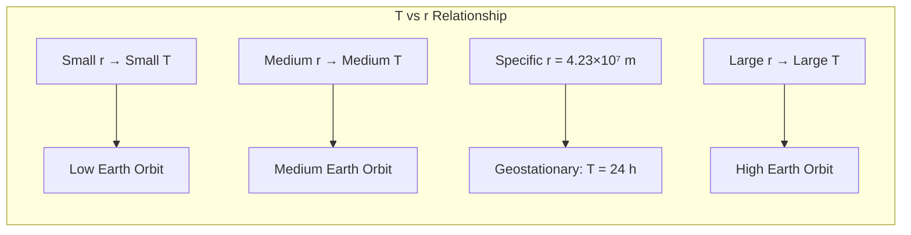

# 1. Overview / 概述

**English:**
Geostationary satellites are a special class of [[Circular Orbits]] that orbit the Earth with a period of exactly 24 hours, matching the Earth's rotational period. This sub-topic explores the unique conditions required for a satellite to remain fixed above the same point on the Earth's equator — a concept critical to modern telecommunications, weather monitoring, and global broadcasting. Understanding geostationary orbits requires mastery of [[Gravitational Force and Field]] and [[Centripetal Acceleration and Force]], as the gravitational force provides the necessary centripetal force for circular motion. The key parameters — orbital radius, speed, and period — are derived from Newton's law of gravitation and the conditions for uniform circular motion. This sub-topic also distinguishes geostationary from geosynchronous orbits and explains why only equatorial orbits with specific altitude (~35,786 km) can be geostationary.

**中文:**
地球静止卫星是一类特殊的[[Circular Orbits|圆周轨道]]，其轨道周期恰好为24小时，与地球自转周期相同。本子知识点探讨卫星保持在地球赤道同一位置上方所需的条件——这一概念对现代电信、气象监测和全球广播至关重要。理解地球静止轨道需要掌握[[Gravitational Force and Field|引力场]]和[[Centripetal Acceleration and Force|向心加速度与力]]，因为引力提供了圆周运动所需的向心力。关键参数——轨道半径、速度和周期——由牛顿万有引力定律和匀速圆周运动条件推导得出。本子知识点还区分了地球静止轨道与地球同步轨道，并解释了为什么只有特定高度（约35,786公里）的赤道轨道才能成为地球静止轨道。

---

# 2. Syllabus Learning Objectives / 考纲学习目标

| CAIE 9702 | Edexcel IAL |
|-----------|-------------|
| 15.3(a) Define geostationary orbit | 6.11 Explain what is meant by a geostationary satellite |
| 15.3(b) State conditions for geostationary orbit | 6.12 Derive the orbital radius of a geostationary satellite |
| 15.3(c) Derive orbital radius using Kepler's third law | 6.13 Calculate the orbital speed of a geostationary satellite |
| 15.3(d) Calculate orbital speed | 6.14 Discuss applications of geostationary satellites |
| 15.3(e) Discuss uses of geostationary satellites | 6.15 Compare geostationary with low-Earth orbit satellites |

**Examiner Expectations / 考官期望:**
- **CAIE:** Students must be able to derive the orbital radius from $T = 24$ hours using $GM = \frac{4\pi^2 r^3}{T^2}$. They must state ALL conditions: equatorial plane, same direction as Earth's rotation, period = 24 hours, circular orbit.
- **Edexcel:** Students must derive $r$ from $T$ and $M_E$, calculate $v = \frac{2\pi r}{T}$, and explain why geostationary satellites are useful for communications.
- **Common:** Both boards expect students to know the approximate orbital radius ($4.23 \times 10^7$ m) and altitude ($3.6 \times 10^7$ m).

---

# 3. Core Definitions / 核心定义

| Term (EN/CN) | Definition (EN) | Definition (CN) | Common Mistakes / 常见错误 |
|--------------|-----------------|-----------------|---------------------------|
| **Geostationary Orbit** / 地球静止轨道 | A circular orbit around the Earth at the equator, with an orbital period equal to the Earth's rotational period (24 hours), such that the satellite appears stationary above a fixed point on the equator. | 围绕地球赤道的圆形轨道，轨道周期等于地球自转周期（24小时），使卫星看起来静止在赤道上某一固定点上方。 | ❌ Confusing with "geosynchronous" — all geostationary orbits are geosynchronous, but not all geosynchronous orbits are geostationary. |
| **Geosynchronous Orbit** / 地球同步轨道 | An orbit with a period equal to the Earth's rotational period (24 hours), but not necessarily equatorial or circular. | 周期等于地球自转周期（24小时）的轨道，但不一定是赤道轨道或圆形轨道。 | ❌ Thinking all 24-hour orbits are geostationary. |
| **Orbital Radius** / 轨道半径 | The distance from the center of the Earth to the satellite, approximately $4.23 \times 10^7$ m for a geostationary satellite. | 从地心到卫星的距离，地球静止卫星约为 $4.23 \times 10^7$ 米。 | ❌ Using altitude instead of radius in calculations. |
| **Altitude** / 高度 | The height above the Earth's surface, approximately $3.6 \times 10^7$ m (36,000 km) for a geostationary satellite. | 地球表面以上的高度，地球静止卫星约为 $3.6 \times 10^7$ 米（36,000公里）。 | ❌ Forgetting to subtract Earth's radius from orbital radius. |
| **Orbital Speed** / 轨道速度 | The constant speed of a satellite in circular orbit, approximately $3.07 \times 10^3$ m/s for a geostationary satellite. | 卫星在圆形轨道上的恒定速度，地球静止卫星约为 $3.07 \times 10^3$ 米/秒。 | ❌ Confusing with escape velocity or low-Earth orbit speed. |

---

# 4. Key Concepts Explained / 关键概念详解

## 4.1 Conditions for Geostationary Orbit / 地球静止轨道的条件

### Explanation / 解释
**English:**
For a satellite to be geostationary, it must satisfy FOUR conditions simultaneously:
1. **Period:** Orbital period $T$ must equal Earth's rotational period (24 hours = 86,400 s).
2. **Plane:** Orbit must lie in the equatorial plane (directly above the equator).
3. **Direction:** Satellite must orbit in the same direction as Earth's rotation (west to east).
4. **Shape:** Orbit must be circular (constant radius).

These conditions arise because the satellite must "keep up" with the Earth's rotation. If the orbit is inclined (not equatorial), the satellite would appear to move north-south relative to a fixed point on Earth. If the orbit is elliptical, the speed varies and the satellite cannot remain fixed.

**中文:**
要使卫星成为地球静止卫星，必须同时满足四个条件：
1. **周期：** 轨道周期 $T$ 必须等于地球自转周期（24小时 = 86,400秒）。
2. **平面：** 轨道必须位于赤道平面内（赤道正上方）。
3. **方向：** 卫星必须与地球自转方向相同（自西向东）。
4. **形状：** 轨道必须是圆形（半径恒定）。

这些条件是因为卫星必须"跟上"地球的自转。如果轨道是倾斜的（非赤道），卫星相对于地球上的固定点会南北移动。如果轨道是椭圆形的，速度会变化，卫星无法保持固定。

### Physical Meaning / 物理意义
**English:**
The gravitational force from Earth provides the centripetal force needed for circular motion. At the geostationary radius, the orbital period naturally matches Earth's rotation. This is a unique radius — no other distance from Earth gives a 24-hour period. The satellite is in free fall toward Earth, but its tangential speed is exactly right to keep it at constant altitude.

**中文:**
地球的引力提供了圆周运动所需的向心力。在地球静止半径处，轨道周期自然与地球自转匹配。这是一个独特的半径——没有其他距离地球的距离能给出24小时周期。卫星正在向地球自由落体，但其切向速度恰好使其保持在恒定高度。

### Common Misconceptions / 常见误区
- ❌ "Geostationary satellites don't move" — They move at ~3 km/s relative to Earth's center, but appear stationary relative to the surface.
- ❌ "Any satellite with 24-hour period is geostationary" — Only equatorial, circular orbits are geostationary.
- ❌ "Geostationary satellites are at the same altitude as the Moon" — The Moon is ~384,000 km away; geostationary is ~36,000 km.
- ❌ "Geostationary satellites can be used for GPS" — GPS uses medium-Earth orbit satellites (~20,000 km), not geostationary.

### Exam Tips / 考试提示
- **CAIE:** Always state ALL four conditions explicitly in definition questions.
- **Edexcel:** Be prepared to derive the orbital radius from first principles using $F_g = F_c$.
- **Both:** Remember to convert 24 hours to seconds (86,400 s) in calculations.

> 📷 **IMAGE PROMPT — GS01: Geostationary Satellite Orbit Diagram**
> A 3D cutaway diagram showing Earth from the side, with a satellite in a circular equatorial orbit. Label: Earth's equator (red dashed line), satellite (blue dot), orbital radius r from Earth's center, altitude h above surface, Earth's radius R_E. Show Earth's rotation direction (arrow) and satellite's orbital direction (arrow) both west-to-east. Include a callout box: "T = 24 hours, r = 42,300 km, h = 35,800 km".

---

## 4.2 Derivation of Orbital Radius / 轨道半径的推导

### Explanation / 解释
**English:**
The orbital radius of a geostationary satellite is derived by equating the gravitational force to the centripetal force:

$$F_g = F_c$$

$$\frac{GM_E m}{r^2} = \frac{m v^2}{r}$$

where $M_E$ is Earth's mass, $m$ is satellite mass, $r$ is orbital radius, and $v$ is orbital speed.

Since $v = \frac{2\pi r}{T}$ for circular motion:

$$\frac{GM_E}{r^2} = \frac{(2\pi r/T)^2}{r} = \frac{4\pi^2 r}{T^2}$$

Rearranging:

$$r^3 = \frac{GM_E T^2}{4\pi^2}$$

$$r = \sqrt[3]{\frac{GM_E T^2}{4\pi^2}}$$

**中文:**
地球静止卫星的轨道半径通过将引力等于向心力来推导：

$$F_g = F_c$$

$$\frac{GM_E m}{r^2} = \frac{m v^2}{r}$$

其中 $M_E$ 是地球质量，$m$ 是卫星质量，$r$ 是轨道半径，$v$ 是轨道速度。

由于匀速圆周运动 $v = \frac{2\pi r}{T}$：

$$\frac{GM_E}{r^2} = \frac{(2\pi r/T)^2}{r} = \frac{4\pi^2 r}{T^2}$$

整理得：

$$r^3 = \frac{GM_E T^2}{4\pi^2}$$

$$r = \sqrt[3]{\frac{GM_E T^2}{4\pi^2}}$$

### Physical Meaning / 物理意义
**English:**
This derivation shows that the orbital radius depends ONLY on the period $T$ and the mass of the central body $M_E$. The satellite's mass cancels out — any mass satellite at this radius will have the same period. This is a consequence of the equivalence principle (gravitational mass = inertial mass).

**中文:**
这个推导表明轨道半径仅取决于周期 $T$ 和中心天体质量 $M_E$。卫星质量被消去——任何质量的卫星在这个半径上都有相同的周期。这是等效原理（引力质量 = 惯性质量）的结果。

### Common Misconceptions / 常见误区
- ❌ "The satellite's mass affects the orbital radius" — Mass cancels out; all satellites at the same radius have the same period.
- ❌ "Using $g$ instead of $GM_E/r^2$" — $g$ varies with altitude; use $GM_E/r^2$ for orbital calculations.
- ❌ "Forgetting to cube root" — $r^3$ is proportional to $T^2$, so $r \propto T^{2/3}$.

### Exam Tips / 考试提示
- **CAIE:** Show the full derivation from $F_g = F_c$ to $r^3 = GMT^2/4\pi^2$.
- **Edexcel:** Use $GM_E = 3.99 \times 10^{14}$ m³/s² (standard gravitational parameter).
- **Both:** Remember $T = 86,400$ s, not 24 hours in seconds.

---

## 4.3 Calculation of Orbital Speed / 轨道速度的计算

### Explanation / 解释
**English:**
Once the orbital radius $r$ is known, the orbital speed $v$ can be calculated from:

$$v = \frac{2\pi r}{T}$$

Alternatively, from the force balance:

$$v = \sqrt{\frac{GM_E}{r}}$$

For a geostationary satellite:
- $r = 4.23 \times 10^7$ m
- $T = 86,400$ s
- $v = \frac{2\pi (4.23 \times 10^7)}{86,400} \approx 3.07 \times 10^3$ m/s

**中文:**
一旦知道轨道半径 $r$，轨道速度 $v$ 可以通过以下公式计算：

$$v = \frac{2\pi r}{T}$$

或者从力平衡推导：

$$v = \sqrt{\frac{GM_E}{r}}$$

对于地球静止卫星：
- $r = 4.23 \times 10^7$ 米
- $T = 86,400$ 秒
- $v = \frac{2\pi (4.23 \times 10^7)}{86,400} \approx 3.07 \times 10^3$ 米/秒

### Physical Meaning / 物理意义
**English:**
The orbital speed of ~3 km/s is much slower than low-Earth orbit satellites (~7.8 km/s) because the gravitational force is weaker at greater distance. The satellite moves at this speed to maintain its altitude — if it slowed down, it would fall to a lower orbit; if it sped up, it would rise to a higher orbit.

**中文:**
约3公里/秒的轨道速度比低地球轨道卫星（约7.8公里/秒）慢得多，因为在更远距离上引力更弱。卫星以这个速度运动以保持其高度——如果减速，它会掉到更低的轨道；如果加速，它会升到更高的轨道。

### Common Misconceptions / 常见误区
- ❌ "Geostationary satellites are stationary" — They move at ~11,000 km/h relative to Earth's center.
- ❌ "Using $v = \sqrt{gr}$" — This only works if $g$ is the local gravitational field strength at that altitude.
- ❌ "Confusing orbital speed with escape velocity" — Escape velocity at geostationary altitude is $\sqrt{2} \times v_{orbital} \approx 4.34$ km/s.

### Exam Tips / 考试提示
- **CAIE:** Use $v = \sqrt{GM_E/r}$ for speed; $v = 2\pi r/T$ for period.
- **Edexcel:** Show both methods and verify consistency.
- **Both:** Remember units — km/s or m/s? Use m/s for calculations, but km/s for comparison.

---

# 5. Essential Equations / 核心公式

## Equation 1: Orbital Radius from Period / 从周期求轨道半径

$$r = \sqrt[3]{\frac{GM_E T^2}{4\pi^2}}$$

| Symbol (符号) | Meaning (EN) | Meaning (CN) | Unit (单位) |
|--------------|-------------|-------------|------------|
| $r$ | Orbital radius from Earth's center | 轨道半径（从地心算起） | m |
| $G$ | Gravitational constant ($6.67 \times 10^{-11}$) | 万有引力常数 | N·m²/kg² |
| $M_E$ | Mass of Earth ($5.97 \times 10^{24}$ kg) | 地球质量 | kg |
| $T$ | Orbital period (86,400 s for geostationary) | 轨道周期（地球静止为86,400秒） | s |

**Derivation / 推导:** From $F_g = F_c$: $\frac{GM_E m}{r^2} = \frac{m v^2}{r}$, with $v = \frac{2\pi r}{T}$.
**Conditions / 适用条件:** Circular orbit around a spherical mass; satellite mass << central mass.
**Limitations / 局限性:** Assumes Earth is a point mass; ignores gravitational effects of Moon, Sun, and non-spherical Earth.

## Equation 2: Orbital Speed / 轨道速度

$$v = \sqrt{\frac{GM_E}{r}}$$

| Symbol (符号) | Meaning (EN) | Meaning (CN) | Unit (单位) |
|--------------|-------------|-------------|------------|
| $v$ | Orbital speed | 轨道速度 | m/s |
| $G$ | Gravitational constant | 万有引力常数 | N·m²/kg² |
| $M_E$ | Mass of Earth | 地球质量 | kg |
| $r$ | Orbital radius | 轨道半径 | m |

**Derivation / 推导:** From $F_g = F_c$: $\frac{GM_E m}{r^2} = \frac{m v^2}{r} \implies v^2 = \frac{GM_E}{r}$.
**Conditions / 适用条件:** Circular orbit; valid for any central mass.
**Limitations / 局限性:** Only for circular orbits; for elliptical orbits, $v$ varies.

## Equation 3: Kepler's Third Law Form / 开普勒第三定律形式

$$T^2 = \frac{4\pi^2}{GM_E} r^3$$

| Symbol (符号) | Meaning (EN) | Meaning (CN) | Unit (单位) |
|--------------|-------------|-------------|------------|
| $T$ | Orbital period | 轨道周期 | s |
| $r$ | Orbital radius | 轨道半径 | m |
| $G$ | Gravitational constant | 万有引力常数 | N·m²/kg² |
| $M_E$ | Mass of Earth | 地球质量 | kg |

**Derivation / 推导:** Rearranging Equation 1: $r^3 = \frac{GM_E T^2}{4\pi^2} \implies T^2 = \frac{4\pi^2}{GM_E} r^3$.
**Conditions / 适用条件:** Central mass >> satellite mass; circular orbit.
**Limitations / 局限性:** The constant $\frac{4\pi^2}{GM_E}$ is specific to Earth; for other planets, use their mass.

> 📷 **IMAGE PROMPT — GS02: Geostationary Orbit Formula Diagram**
> A clean diagram showing the derivation chain: F_g = F_c → GMm/r² = mv²/r → cancel m → GM/r² = v²/r → substitute v = 2πr/T → GM/r² = 4π²r/T² → rearrange to r³ = GMT²/4π² → r = ∛(GMT²/4π²). Use arrows and color coding. Include numerical substitution: G = 6.67×10⁻¹¹, M_E = 5.97×10²⁴, T = 86,400 → r = 4.23×10⁷ m.

---

# 6. Graphs and Relationships / 图表与关系

## 6.1 Orbital Period vs Orbital Radius / 轨道周期与轨道半径的关系

### Axes / 坐标轴
- **X-axis:** Orbital radius $r$ (m) — 轨道半径 $r$（米）
- **Y-axis:** Orbital period $T$ (s) — 轨道周期 $T$（秒）

### Shape / 形状
**English:** The graph of $T$ vs $r$ is a curve showing $T \propto r^{3/2}$ (from $T^2 \propto r^3$). For small $r$, $T$ is small; for large $r$, $T$ increases rapidly. The geostationary point is where $T = 86,400$ s, corresponding to $r = 4.23 \times 10^7$ m.

**中文:** $T$ 对 $r$ 的图是一条曲线，显示 $T \propto r^{3/2}$（来自 $T^2 \propto r^3$）。对于小的 $r$，$T$ 小；对于大的 $r$，$T$ 迅速增加。地球静止点是 $T = 86,400$ 秒，对应 $r = 4.23 \times 10^7$ 米。

### Gradient Meaning / 斜率含义
**English:** The gradient $\frac{dT}{dr}$ is not constant; it increases with $r$. A log-log plot of $\log T$ vs $\log r$ gives a straight line with gradient $3/2$.

**中文:** 梯度 $\frac{dT}{dr}$ 不是常数；它随 $r$ 增加。$\log T$ 对 $\log r$ 的对数-对数图给出斜率为 $3/2$ 的直线。

### Area Meaning / 面积含义
**English:** Area under $T$ vs $r$ has no direct physical meaning.

**中文:** $T$ 对 $r$ 图下的面积没有直接的物理意义。

### Exam Interpretation / 考试解读
**English:** Be able to read from the graph: given $r$, find $T$; given $T$, find $r$. Identify the geostationary point. Understand that only one radius gives $T = 24$ hours.

**中文:** 能够从图中读取：给定 $r$，求 $T$；给定 $T$，求 $r$。识别地球静止点。理解只有一个半径给出 $T = 24$ 小时。

---

## 6.2 Orbital Speed vs Orbital Radius / 轨道速度与轨道半径的关系

### Axes / 坐标轴
- **X-axis:** Orbital radius $r$ (m) — 轨道半径 $r$（米）
- **Y-axis:** Orbital speed $v$ (m/s) — 轨道速度 $v$（米/秒）

### Shape / 形状
**English:** The graph of $v$ vs $r$ shows $v \propto 1/\sqrt{r}$ (from $v = \sqrt{GM_E/r}$). Speed decreases as radius increases. At geostationary radius, $v \approx 3.07 \times 10^3$ m/s.

**中文:** $v$ 对 $r$ 的图显示 $v \propto 1/\sqrt{r}$（来自 $v = \sqrt{GM_E/r}$）。速度随半径增加而减小。在地球静止半径处，$v \approx 3.07 \times 10^3$ 米/秒。

### Gradient Meaning / 斜率含义
**English:** The gradient $\frac{dv}{dr} = -\frac{1}{2}\sqrt{\frac{GM_E}{r^3}} = -\frac{v}{2r}$, which is negative and decreases in magnitude with $r$.

**中文:** 梯度 $\frac{dv}{dr} = -\frac{1}{2}\sqrt{\frac{GM_E}{r^3}} = -\frac{v}{2r}$，为负值，其大小随 $r$ 减小。

### Area Meaning / 面积含义
**English:** Area under $v$ vs $r$ has no direct physical meaning.

**中文:** $v$ 对 $r$ 图下的面积没有直接的物理意义。

### Exam Interpretation / 考试解读
**English:** Understand that geostationary satellites move slower than low-Earth orbit satellites. This is counterintuitive — higher orbits mean slower speeds.

**中文:** 理解地球静止卫星比低地球轨道卫星运动得更慢。这是反直觉的——更高的轨道意味着更慢的速度。

---

# 7. Required Diagrams / 必备图表

## 7.1 Geostationary Satellite Orbit / 地球静止卫星轨道图

### Description / 描述
**English:** A diagram showing Earth from above the North Pole, with a satellite in equatorial orbit. The satellite appears fixed above a point on the equator. Include Earth's rotation direction, satellite's orbital direction, and key distances.

**中文:** 从北极上方看地球的示意图，显示卫星在赤道轨道上。卫星看起来固定在赤道上某一点上方。包括地球自转方向、卫星轨道方向和关键距离。

### Image Prompt / 图片生成提示
> 📷 **IMAGE PROMPT — GS03: Geostationary Satellite Orbit from Above**
> Top-down view of Earth from above the North Pole. Earth is a blue and green circle with white cloud patterns. The equator is shown as a red dashed line. A satellite (silver with solar panels) is shown on the equator. An arrow shows Earth's rotation (counterclockwise). Another arrow shows satellite's orbital direction (same direction). Label: "Geostationary Satellite — appears fixed above equator point". Include a scale bar showing r = 42,300 km from Earth's center. Show a dashed circle for the orbital path. Add a callout: "T = 24 hours, v = 3.07 km/s".

### Labels Required / 需要标注
- **Earth's equator** / 地球赤道
- **Satellite** / 卫星
- **Orbital path** / 轨道路径
- **Earth's rotation direction** / 地球自转方向
- **Satellite's orbital direction** / 卫星轨道方向
- **Orbital radius $r$** / 轨道半径 $r$
- **Altitude $h$** / 高度 $h$
- **Fixed point on equator** / 赤道上的固定点

### Exam Importance / 考试重要性
**English:** Essential for explaining why geostationary satellites must be equatorial. Shows the geometry of the orbit and why the satellite appears fixed.

**中文:** 对于解释为什么地球静止卫星必须是赤道轨道至关重要。显示轨道的几何形状以及为什么卫星看起来是固定的。

---

## 7.2 Comparison of Orbits / 轨道对比图

### Description / 描述
**English:** A diagram comparing Low Earth Orbit (LEO), Medium Earth Orbit (MEO), and Geostationary Earth Orbit (GEO) to scale. Shows relative distances and periods.

**中文:** 比较低地球轨道（LEO）、中地球轨道（MEO）和地球静止轨道（GEO）的示意图，按比例显示。显示相对距离和周期。

### Image Prompt / 图片生成提示
> 📷 **IMAGE PROMPT — GS04: Comparison of LEO, MEO, and GEO Orbits**
> Side view of Earth with three concentric orbital paths drawn to scale. Inner orbit (LEO): r ≈ 6,700 km, T ≈ 90 min, labeled "LEO — ISS, spy satellites". Middle orbit (MEO): r ≈ 26,600 km, T ≈ 12 h, labeled "MEO — GPS satellites". Outer orbit (GEO): r ≈ 42,300 km, T ≈ 24 h, labeled "GEO — Communication satellites". Include a table comparing: altitude, period, speed, and applications. Use different colors for each orbit. Show Earth's surface and atmosphere as a thin blue layer.

### Labels Required / 需要标注
- **LEO** / 低地球轨道
- **MEO** / 中地球轨道
- **GEO** / 地球静止轨道
- **Earth** / 地球
- **Altitude values** / 高度值
- **Period values** / 周期值
- **Speed values** / 速度值

### Exam Importance / 考试重要性
**English:** Helps students understand why geostationary orbits are unique and why they are used for different applications than LEO or MEO.

**中文:** 帮助学生理解为什么地球静止轨道是独特的，以及为什么它们用于与LEO或MEO不同的应用。

---

# 8. Worked Examples / 典型例题

## Example 1: Calculating Geostationary Orbital Radius / 计算地球静止轨道半径

### Question / 题目
**English:**
A satellite is to be placed in a geostationary orbit around Earth. Given:
- Gravitational constant $G = 6.67 \times 10^{-11}$ N·m²/kg²
- Mass of Earth $M_E = 5.97 \times 10^{24}$ kg
- Radius of Earth $R_E = 6.37 \times 10^6$ m

Calculate:
(a) The orbital radius $r$ of the geostationary satellite.
(b) The altitude $h$ of the satellite above Earth's surface.
(c) The orbital speed $v$ of the satellite.

**中文:**
一颗卫星将被放置在地球静止轨道上。已知：
- 万有引力常数 $G = 6.67 \times 10^{-11}$ N·m²/kg²
- 地球质量 $M_E = 5.97 \times 10^{24}$ kg
- 地球半径 $R_E = 6.37 \times 10^6$ m

计算：
(a) 地球静止卫星的轨道半径 $r$。
(b) 卫星在地球表面以上的高度 $h$。
(c) 卫星的轨道速度 $v$。

### Solution / 解答

**Step 1: Convert period to seconds / 将周期转换为秒**
$$T = 24 \text{ hours} = 24 \times 60 \times 60 = 86,400 \text{ s}$$

**Step 2: Use Kepler's Third Law / 使用开普勒第三定律**
$$r^3 = \frac{GM_E T^2}{4\pi^2}$$

$$r^3 = \frac{(6.67 \times 10^{-11})(5.97 \times 10^{24})(86,400)^2}{4\pi^2}$$

$$r^3 = \frac{(6.67 \times 10^{-11})(5.97 \times 10^{24})(7.46 \times 10^9)}{39.48}$$

$$r^3 = \frac{2.97 \times 10^{24}}{39.48} = 7.53 \times 10^{22}$$

$$r = \sqrt[3]{7.53 \times 10^{22}} = 4.23 \times 10^7 \text{ m}$$

**Step 3: Calculate altitude / 计算高度**
$$h = r - R_E = 4.23 \times 10^7 - 6.37 \times 10^6 = 3.59 \times 10^7 \text{ m} \approx 3.6 \times 10^7 \text{ m}$$

**Step 4: Calculate orbital speed / 计算轨道速度**
$$v = \frac{2\pi r}{T} = \frac{2\pi (4.23 \times 10^7)}{86,400}$$

$$v = \frac{2.66 \times 10^8}{86,400} = 3.08 \times 10^3 \text{ m/s}$$

Alternatively:
$$v = \sqrt{\frac{GM_E}{r}} = \sqrt{\frac{(6.67 \times 10^{-11})(5.97 \times 10^{24})}{4.23 \times 10^7}}$$

$$v = \sqrt{\frac{3.98 \times 10^{14}}{4.23 \times 10^7}} = \sqrt{9.41 \times 10^6} = 3.07 \times 10^3 \text{ m/s}$$

### Final Answer / 最终答案
**Answer:**
(a) $r = 4.23 \times 10^7$ m
(b) $h = 3.59 \times 10^7$ m (≈ 36,000 km)
(c) $v = 3.07 \times 10^3$ m/s (≈ 3.07 km/s)

**答案：**
(a) $r = 4.23 \times 10^7$ 米
(b) $h = 3.59 \times 10^7$ 米（约36,000公里）
(c) $v = 3.07 \times 10^3$ 米/秒（约3.07公里/秒）

### Quick Tip / 提示
**English:** Always check: geostationary altitude is approximately 36,000 km (not 42,300 km — that's the orbital radius from Earth's center). Memorize these numbers for quick estimation in exams.

**中文：** 始终检查：地球静止高度约为36,000公里（不是42,300公里——那是从地心算起的轨道半径）。记住这些数字以便在考试中快速估算。

---

## Example 2: Comparing Geostationary and Low-Earth Orbit / 比较地球静止轨道和低地球轨道

### Question / 题目
**English:**
A low-Earth orbit (LEO) satellite orbits at an altitude of 400 km. Compare its orbital period and speed with a geostationary satellite. Use $G = 6.67 \times 10^{-11}$ N·m²/kg², $M_E = 5.97 \times 10^{24}$ kg, $R_E = 6.37 \times 10^6$ m.

**中文:**
一颗低地球轨道（LEO）卫星在400公里高度运行。比较其轨道周期和速度与地球静止卫星。使用 $G = 6.67 \times 10^{-11}$ N·m²/kg²，$M_E = 5.97 \times 10^{24}$ kg，$R_E = 6.37 \times 10^6$ m。

### Solution / 解答

**Step 1: Calculate LEO orbital radius / 计算LEO轨道半径**
$$r_{LEO} = R_E + h = 6.37 \times 10^6 + 400 \times 10^3 = 6.77 \times 10^6 \text{ m}$$

**Step 2: Calculate LEO orbital speed / 计算LEO轨道速度**
$$v_{LEO} = \sqrt{\frac{GM_E}{r_{LEO}}} = \sqrt{\frac{3.98 \times 10^{14}}{6.77 \times 10^6}} = \sqrt{5.88 \times 10^7} = 7.67 \times 10^3 \text{ m/s}$$

**Step 3: Calculate LEO orbital period / 计算LEO轨道周期**
$$T_{LEO} = \frac{2\pi r_{LEO}}{v_{LEO}} = \frac{2\pi (6.77 \times 10^6)}{7.67 \times 10^3} = \frac{4.25 \times 10^7}{7.67 \times 10^3} = 5.54 \times 10^3 \text{ s} \approx 92.3 \text{ minutes}$$

**Step 4: Compare with geostationary / 与地球静止比较**

| Property / 性质 | LEO (400 km) | GEO (36,000 km) |
|-----------------|--------------|-----------------|
| Orbital radius / 轨道半径 | $6.77 \times 10^6$ m | $4.23 \times 10^7$ m |
| Orbital speed / 轨道速度 | $7.67 \times 10^3$ m/s | $3.07 \times 10^3$ m/s |
| Orbital period / 轨道周期 | 92.3 minutes | 24 hours |
| Coverage / 覆盖范围 | Small area, frequent passes | Fixed area, continuous coverage |

### Final Answer / 最终答案
**Answer:** LEO satellites orbit much faster (7.67 km/s vs 3.07 km/s) and have much shorter periods (92 min vs 24 h). They cover small areas but pass over frequently. Geostationary satellites cover a fixed large area continuously.

**答案：** LEO卫星轨道速度更快（7.67公里/秒对比3.07公里/秒），周期更短（92分钟对比24小时）。它们覆盖小区域但频繁经过。地球静止卫星持续覆盖固定的大区域。

### Quick Tip / 提示
**English:** Remember the inverse relationship: higher orbit → slower speed → longer period. This is a common exam comparison question.

**中文：** 记住反比关系：更高的轨道 → 更慢的速度 → 更长的周期。这是一个常见的考试比较题。

---

# 9. Past Paper Question Types / 历年真题题型

| Question Type / 题型 | Frequency / 频率 | Difficulty / 难度 | Past Paper References / 真题索引 |
|----------------------|------------------|------------------|-------------------------------|
| Define geostationary orbit / 定义地球静止轨道 | High | Easy | 📝 *待填入* |
| State conditions for geostationary orbit / 陈述地球静止轨道条件 | High | Easy | 📝 *待填入* |
| Derive orbital radius / 推导轨道半径 | Medium | Medium | 📝 *待填入* |
| Calculate orbital speed / 计算轨道速度 | Medium | Medium | 📝 *待填入* |
| Compare GEO vs LEO / 比较GEO与LEO | Medium | Medium | 📝 *待填入* |
| Applications of geostationary satellites / 地球静止卫星的应用 | Low | Easy | 📝 *待填入* |
| Explain why geostationary satellites must be equatorial / 解释为什么地球静止卫星必须是赤道轨道 | Low | Hard | 📝 *待填入* |

**Common Command Words / 常见指令词:**
- **Define** / 定义 — State the meaning precisely (e.g., "Define geostationary orbit")
- **State** / 陈述 — List conditions without explanation
- **Derive** / 推导 — Show mathematical steps from first principles
- **Calculate** / 计算 — Use formulas with numerical values
- **Compare** / 比较 — Discuss similarities and differences
- **Explain** / 解释 — Give reasons with physics principles
- **Discuss** / 讨论 — Present advantages and disadvantages

---

# 10. Practical Skills Connections / 实验技能链接

**English:**
While geostationary satellites cannot be directly experimented with in a school lab, the underlying physics connects to several practical skills:

1. **Measurement of $G$:** The Cavendish experiment (measuring gravitational constant) is essential for calculating orbital parameters. Understanding uncertainties in $G$ affects the accuracy of orbital radius calculations.

2. **Graph Plotting:** Plotting $T^2$ vs $r^3$ for orbital data gives a straight line with gradient $\frac{4\pi^2}{GM_E}$. This can be used to determine Earth's mass from satellite data.

3. **Error Analysis:** Small errors in period measurement (e.g., 24 hours ± 1 second) lead to significant errors in orbital radius due to the $r^3 \propto T^2$ relationship. Students should understand propagation of uncertainties.

4. **Simulation Software:** Many exam boards use orbital simulation software or data analysis from real satellite tracking. Students should be able to interpret orbital data and calculate parameters.

5. **Experimental Design:** Designing a method to determine Earth's mass using satellite orbital data (period and radius) is a common practical question.

**中文:**
虽然地球静止卫星无法在学校实验室直接实验，但其基础物理与以下实验技能相关：

1. **测量 $G$：** 卡文迪许实验（测量万有引力常数）对于计算轨道参数至关重要。理解 $G$ 的不确定度会影响轨道半径计算的准确性。

2. **绘图：** 绘制轨道数据的 $T^2$ 对 $r^3$ 图得到一条直线，斜率为 $\frac{4\pi^2}{GM_E}$。这可用于从卫星数据确定地球质量。

3. **误差分析：** 周期测量中的小误差（例如24小时±1秒）由于 $r^3 \propto T^2$ 关系会导致轨道半径的显著误差。学生应理解不确定度的传播。

4. **模拟软件：** 许多考试委员会使用轨道模拟软件或来自真实卫星跟踪的数据分析。学生应能解释轨道数据并计算参数。

5. **实验设计：** 设计一种使用卫星轨道数据（周期和半径）确定地球质量的方法是常见的实验题。

---

# 11. Concept Map / 概念图谱

```mermaid
graph TD
    %% Geostationary Satellites Concept Map
    GS[Geostationary Satellites] --> Conditions[Conditions]
    GS --> Derivation[Derivation]
    GS --> Applications[Applications]
    GS --> Comparison[Comparison with Other Orbits]

    Conditions --> Period[Period = 24 hours]
    Conditions --> Equatorial[Equatorial Plane]
    Conditions --> Direction[Same Direction as Earth]
    Conditions --> Circular[Circular Orbit]

    Derivation --> FgFc[F_g = F_c]
    Derivation --> Kepler[Kepler's Third Law]
    Derivation --> Radius[Orbital Radius r = 4.23×10⁷ m]
    Derivation --> Speed[Orbital Speed v = 3.07 km/s]
    Derivation --> Altitude[Altitude h = 36,000 km]

    Applications --> Comms[Telecommunications]
    Applications --> Weather[Weather Monitoring]
    Applications --> Broadcast[TV/Radio Broadcasting]

    Comparison --> LEO[Low Earth Orbit]
    Comparison --> MEO[Medium Earth Orbit]
    Comparison --> GEO[Geostationary Earth Orbit]

    LEO --> LEOProps[Speed: 7.8 km/s, Period: 90 min]
    MEO --> MEOProps[Speed: 3.9 km/s, Period: 12 h]
    GEO --> GEOProps[Speed: 3.1 km/s, Period: 24 h]

    %% Prerequisites
    FgFc --> Grav[Gravitational Force and Field]
    FgFc --> Centripetal[Centripetal Acceleration and Force]
    Kepler --> Grav

    %% Sibling topics
    Radius --> OrbitalVelocity[Orbital Velocity]
    Kepler --> KeplersThirdLaw[Kepler's Third Law]

    %% Related topics
    Applications --> GravPotential[Gravitational Potential]

    style GS fill:#4a90d9,color:#fff
    style Conditions fill:#f0a030,color:#fff
    style Derivation fill:#50b050,color:#fff
    style Applications fill:#d05050,color:#fff
    style Comparison fill:#9050d0,color:#fff
```

---

# 12. Quick Revision Sheet / 速查表

| Category / 类别 | Key Points / 要点 |
|----------------|------------------|
| **Definition / 定义** | A satellite in circular equatorial orbit with period = 24 h, appearing stationary above a fixed point on Earth's equator. / 在圆形赤道轨道上、周期为24小时、看起来静止在地球赤道某固定点上方的卫星。 |
| **Four Conditions / 四个条件** | ① Period = 24 h (86,400 s) ② Equatorial plane ③ Same direction as Earth ④ Circular orbit / ① 周期=24小时 ② 赤道平面 ③ 与地球同向 ④ 圆形轨道 |
| **Key Formula / 核心公式** | $r^3 = \frac{GM_E T^2}{4\pi^2}$, $v = \sqrt{\frac{GM_E}{r}} = \frac{2\pi r}{T}$ |
| **Numerical Values / 数值** | $r = 4.23 \times 10^7$ m, $h = 3.6 \times 10^7$ m (36,000 km), $v = 3.07 \times 10^3$ m/s |
| **Key Graph / 核心图表** | $T$ vs $r$: $T \propto r^{3/2}$; $v$ vs $r$: $v \propto 1/\sqrt{r}$ |
| **Applications / 应用** | Telecommunications, weather satellites, TV/radio broadcasting / 电信、气象卫星、电视/广播 |
| **Comparison with LEO / 与LEO比较** | GEO: slower speed (3.1 vs 7.8 km/s), longer period (24 h vs 90 min), fixed coverage / GEO: 速度更慢，周期更长，覆盖固定 |
| **Common Mistake / 常见错误** | Confusing orbital radius with altitude; forgetting to convert hours to seconds; thinking all 24-h orbits are geostationary / 混淆轨道半径与高度；忘记将小时转换为秒；认为所有24小时轨道都是地球静止的 |
| **Exam Tip / 考试提示** | Always state ALL four conditions; show full derivation from $F_g = F_c$; memorize $r$ and $h$ values / 始终陈述所有四个条件；展示从$F_g = F_c$的完整推导；记住$r$和$h$的值 |
| **Prerequisites / 前置知识** | [[Gravitational Force and Field]], [[Centripetal Acceleration and Force]] |
| **Sibling Topics / 同级主题** | [[Orbital Velocity]], [[Kepler's Third Law]] |
| **Related Topics / 相关主题** | [[Gravitational Potential]] |