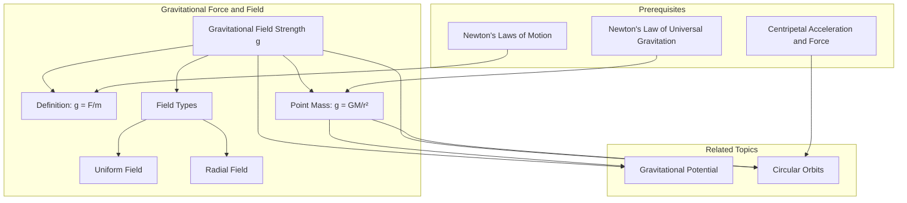

---
# 1. Overview / 概述

**English:**
Gravitational Field Strength ($g$) is a fundamental concept that quantifies the gravitational force experienced per unit mass at a given point in a gravitational field. It defines the "intensity" of gravity. This sub-topic covers the definition, calculation, and graphical representation of $g$ for both uniform fields (like near the Earth's surface) and radial fields (around a point mass like a planet or star). Understanding $g$ is crucial for linking [[Newton's Law of Universal Gravitation]] to the force experienced by objects, and it serves as a prerequisite for studying [[Gravitational Potential]] and [[Circular Orbits]]. It is a core concept in the [[Gravitational Force and Field]] topic.

**中文:**
引力场强度 ($g$) 是一个基本概念，它量化了引力场中某一点单位质量所受到的引力大小。它定义了引力的“强度”。本子知识点涵盖了对均匀场（如地球表面附近）和径向场（如行星或恒星等点质量周围）中 $g$ 的定义、计算和图形表示。理解 $g$ 对于将[[牛顿万有引力定律]]与物体所受的力联系起来至关重要，并且是学习[[引力势]]和[[圆周轨道]]的先决条件。它是[[引力与引力场]]主题中的核心概念。

---

# 2. Syllabus Learning Objectives / 考纲学习目标

| CAIE 9702 (15.1 a-d) | Edexcel IAL (WPH14 U4: 6.1-6.5) |
|-----------|-------------|
| (a) Understand the concept of a gravitational field as an example of a field of force and define gravitational field strength as force per unit mass. | 6.1 Understand the concept of a gravitational field. |
| (b) Represent a gravitational field by means of field lines. | 6.2 Understand the definition of gravitational field strength, $g = F/m$. |
| (c) Show an understanding that, for a point outside a uniform sphere, the sphere behaves as if all its mass were concentrated at its centre. | 6.3 Use the equation $g = GM/r^2$ for the gravitational field strength due to a point mass. |
| (d) Calculate the gravitational field strength due to a point mass. | 6.4 Understand the concept of a uniform gravitational field. |
| | 6.5 Understand the concept of a radial gravitational field. |

**Examiner Expectations / 考官期望:**
- **EN:** Students must be able to distinguish between uniform and radial fields, define $g$ in terms of force per unit mass, and apply the formula $g = GM/r^2$ for point masses. They should also be able to sketch and interpret gravitational field lines.
- **CN:** 学生必须能够区分均匀场和径向场，用单位质量所受的力来定义 $g$，并应用点质量的公式 $g = GM/r^2$。他们还应能够绘制和解释引力场线。

---

# 3. Core Definitions / 核心定义

| Term (EN/CN) | Definition (EN) | Definition (CN) | Common Mistakes / 常见错误 |
|--------------|-----------------|-----------------|---------------------------|
| **Gravitational Field** / 引力场 | A region of space in which a mass experiences a gravitational force. | 一个质量在其中会感受到引力作用的空间区域。 | Confusing it with an electric or magnetic field. / 将其与电场或磁场混淆。 |
| **Gravitational Field Strength ($g$)** / 引力场强度 | The gravitational force per unit mass acting on a small test mass placed at that point. | 作用在置于该点的一个小测试质量上的单位质量的引力。 | Thinking $g$ is a constant (it is only constant in a uniform field). / 认为 $g$ 是一个常数（它只在均匀场中是常数）。 |
| **Point Mass** / 点质量 | An object whose size is negligible compared to the distances involved, allowing its mass to be considered as concentrated at a single point. | 一个物体，其大小与所涉及的距离相比可以忽略不计，从而可以将其质量视为集中在一个点上。 | Forgetting that for a point *outside* a uniform sphere, the sphere behaves as a point mass at its centre. / 忘记对于均匀球体*外部*的点，该球体表现为其质量集中在球心的点质量。 |
| **Field Lines** / 场线 | Lines drawn to represent the direction of the gravitational force on a test mass. The spacing of the lines indicates the field strength. | 用来表示作用在测试质量上的引力方向的线。线的疏密表示场强的大小。 | Drawing lines that cross each other. / 绘制相互交叉的线。 |
| **Uniform Field** / 均匀场 | A field where the gravitational field strength is constant in both magnitude and direction. | 引力场强度的大小和方向都恒定的场。 | Assuming all gravitational fields are uniform. / 假设所有引力场都是均匀的。 |

---

# 4. Key Concepts Explained / 关键概念详解

## 4.1 Definition of Gravitational Field Strength / 引力场强度的定义

### Explanation / 解释
**English:**
Gravitational field strength ($g$) is defined as the force ($F$) experienced per unit mass ($m$) placed at a point in the field. The mathematical definition is:
$$ g = \frac{F}{m} $$
This is a vector quantity, meaning it has both magnitude and direction. The direction of $g$ is the same as the direction of the gravitational force on a small test mass (i.e., towards the centre of the mass creating the field). This definition is fundamental and links the concept of a field to the force experienced by an object, connecting back to [[Newton's Laws of Motion]].

**中文:**
引力场强度 ($g$) 定义为置于场中某一点的单位质量 ($m$) 所受到的力 ($F$)。其数学定义为：
$$ g = \frac{F}{m} $$
这是一个矢量，意味着它既有大小又有方向。$g$ 的方向与作用在测试质量上的引力方向相同（即指向产生该场的质量中心）。这个定义是基础性的，它将场的概念与物体所受的力联系起来，并回溯到[[牛顿运动定律]]。

### Physical Meaning / 物理意义
**English:**
Physically, $g$ tells you how "strong" gravity is at a specific location. A higher $g$ means a greater force will be exerted on a given mass. For example, on Earth's surface, $g \approx 9.81 \text{ N kg}^{-1}$, meaning each kilogram of mass experiences a force of 9.81 N towards the Earth's centre.

**中文:**
从物理意义上讲，$g$ 告诉你某个特定位置引力的“强度”。$g$ 越大，对给定质量施加的力就越大。例如，在地球表面，$g \approx 9.81 \text{ N kg}^{-1}$，意味着每千克质量会受到 9.81 N 指向地心的力。

### Common Misconceptions / 常见误区
- **EN:** Confusing $g$ (gravitational field strength) with $g$ (acceleration due to gravity). They are numerically equal and have the same units, but $g$ as field strength is defined as force per unit mass, while $g$ as acceleration is the acceleration of a freely falling object. The equivalence is a consequence of the equivalence principle.
- **CN:** 混淆 $g$ (引力场强度) 和 $g$ (重力加速度)。它们在数值上相等且单位相同，但作为场强的 $g$ 定义为每单位质量的力，而作为加速度的 $g$ 是自由落体物体的加速度。这种等价性是等效原理的结果。
- **EN:** Thinking $g$ is always $9.81 \text{ N kg}^{-1}$. This is only true near the Earth's surface. $g$ varies with altitude and is different on other planets.
- **CN:** 认为 $g$ 总是 $9.81 \text{ N kg}^{-1}$。这仅在地球表面附近成立。$g$ 随高度变化，并且在其他行星上不同。

### Exam Tips / 考试提示
- **EN:** Always state the definition: "force per unit mass". Use the correct units: $\text{N kg}^{-1}$.
- **CN:** 始终陈述定义：“单位质量的力”。使用正确的单位：$\text{N kg}^{-1}$。

## 4.2 Gravitational Field Strength for a Point Mass / 点质量的引力场强度

### Explanation / 解释
**English:**
Using [[Newton's Law of Universal Gravitation]], the force between two point masses $M$ and $m$ separated by a distance $r$ is $F = \frac{GMm}{r^2}$. The gravitational field strength due to mass $M$ at a distance $r$ is found by placing a test mass $m$ at that point and using the definition $g = F/m$:
$$ g = \frac{F}{m} = \frac{GMm}{r^2} \cdot \frac{1}{m} = \frac{GM}{r^2} $$
This is a key equation. It shows that $g$ is directly proportional to the mass $M$ creating the field and inversely proportional to the square of the distance $r$ from the centre of that mass. This is an example of an inverse square law.

**中文:**
利用[[牛顿万有引力定律]]，相距 $r$ 的两个点质量 $M$ 和 $m$ 之间的力为 $F = \frac{GMm}{r^2}$。由质量 $M$ 在距离 $r$ 处产生的引力场强度可以通过在该点放置一个测试质量 $m$ 并使用定义 $g = F/m$ 来求得：
$$ g = \frac{F}{m} = \frac{GMm}{r^2} \cdot \frac{1}{m} = \frac{GM}{r^2} $$
这是一个关键方程。它表明 $g$ 与产生场的质量 $M$ 成正比，与到该质量中心的距离 $r$ 的平方成反比。这是一个平方反比定律的例子。

### Physical Meaning / 物理意义
**English:**
This equation tells us that the field strength decreases rapidly as you move away from the mass. For a point outside a uniform sphere (like a planet), the sphere behaves as if all its mass were concentrated at its centre. Therefore, this equation applies to planets and stars as long as $r$ is measured from their centre.

**中文:**
这个方程告诉我们，当你远离质量时，场强会迅速减小。对于一个均匀球体（如行星）外部的点，该球体的行为就像其所有质量都集中在球心一样。因此，只要 $r$ 是从它们的中心测量的，这个方程就适用于行星和恒星。

### Common Misconceptions / 常见误区
- **EN:** Using the radius of the planet for $r$ when the object is on the surface. This is correct, as $r$ is the distance from the centre.
- **CN:** 当物体在表面时，使用行星的半径作为 $r$。这是正确的，因为 $r$ 是到中心的距离。
- **EN:** Forgetting that $g$ is a vector. The direction is always towards the centre of the mass $M$.
- **CN:** 忘记 $g$ 是一个矢量。方向始终指向质量 $M$ 的中心。

### Exam Tips / 考试提示
- **EN:** Remember the "shell theorem": for a point outside a uniform sphere, the sphere acts as a point mass at its centre.
- **CN:** 记住“球壳定理”：对于均匀球体外的点，该球体表现为其质量集中在球心的点质量。

> 📷 **IMAGE PROMPT — GFS-01: Point Mass Field Strength**
> A diagram showing a large central mass M. Arrows (field lines) are drawn radially outward from the centre, pointing inwards towards M. The arrows are closer together near M and further apart as distance r increases, illustrating the inverse square law. A small test mass m is shown at a distance r from the centre of M, with a force vector F pointing towards M. The equation g = GM/r^2 is displayed.

---

# 5. Essential Equations / 核心公式

## Equation 1: Definition of Gravitational Field Strength / 引力场强度定义

$$ g = \frac{F}{m} $$

| Symbol (符号) | Meaning (EN) | Meaning (CN) | Unit (单位) |
|--------------|-------------|-------------|------------|
| $g$ | Gravitational field strength | 引力场强度 | $\text{N kg}^{-1}$ |
| $F$ | Gravitational force on the test mass | 作用在测试质量上的引力 | $\text{N}$ |
| $m$ | Mass of the test object | 测试物体的质量 | $\text{kg}$ |

**Derivation / 推导:** This is a definition, not derived.
**Conditions / 适用条件:** General definition, applicable to any gravitational field.
**Limitations / 局限性:** None.

## Equation 2: Field Strength due to a Point Mass / 点质量的场强

$$ g = \frac{GM}{r^2} $$

| Symbol (符号) | Meaning (EN) | Meaning (CN) | Unit (单位) |
|--------------|-------------|-------------|------------|
| $g$ | Gravitational field strength | 引力场强度 | $\text{N kg}^{-1}$ |
| $G$ | Universal gravitational constant ($6.67 \times 10^{-11} \text{ N m}^2 \text{ kg}^{-2}$) | 万有引力常数 | $\text{N m}^2 \text{ kg}^{-2}$ |
| $M$ | Mass of the object creating the field | 产生场的物体的质量 | $\text{kg}$ |
| $r$ | Distance from the centre of mass $M$ | 到质量 $M$ 中心的距离 | $\text{m}$ |

**Derivation / 推导:** From $F = \frac{GMm}{r^2}$ and $g = F/m$.
**Conditions / 适用条件:** For a point mass, or a point outside a uniform sphere.
**Limitations / 局限性:** Does not apply inside a uniform spherical shell (where $g=0$).

> 📋 **CIE Only:** The derivation from Newton's Law is a common exam question.
> 📋 **Edexcel Only:** The use of $g = GM/r^2$ for planets and stars is a key application.

---

# 6. Graphs and Relationships / 图表与关系

## 6.1 $g$ vs $r$ for a Point Mass / 点质量的 $g$ 与 $r$ 关系图

### Axes / 坐标轴
- **X-axis:** Distance from centre of mass, $r$ (m) / 到质量中心的距离 $r$ (m)
- **Y-axis:** Gravitational field strength, $g$ ($\text{N kg}^{-1}$) / 引力场强度 $g$ ($\text{N kg}^{-1}$)

### Shape / 形状
A curve showing an inverse square relationship ($g \propto 1/r^2$). The curve is steep near the origin (small $r$) and flattens out as $r$ increases.

### Gradient Meaning / 斜率含义
The gradient of the $g$ vs $r$ graph is $\frac{dg}{dr} = -\frac{2GM}{r^3}$. This represents the rate of change of field strength with distance. It is negative, indicating that $g$ decreases as $r$ increases.

### Area Meaning / 面积含义
The area under a $g$ vs $r$ graph represents the change in [[Gravitational Potential]] ($\Delta V$) between two points. This is an A2 concept.

### Exam Interpretation / 考试解读
- **EN:** Be able to sketch this graph. Understand that the curve is steepest near the mass. Use the graph to compare field strengths at different distances.
- **CN:** 能够绘制此图。理解曲线在质量附近最陡。使用图表比较不同距离处的场强。

```mermaid
graph LR
    subgraph g vs r Graph
        A[g (N/kg)] -- High --> B[Small r]
        A -- Low --> C[Large r]
        D[r (m)] -- Small --> B
        D -- Large --> C
        B -- Curve: g ∝ 1/r² --> C
    end
```

> 📷 **IMAGE PROMPT — GFS-02: g vs r Graph**
> A graph with the x-axis labeled "r / m" and the y-axis labeled "g / N kg⁻¹". A smooth curve starts high on the y-axis and decreases rapidly, then gradually flattens out as it approaches the x-axis. The curve is labeled "g = GM/r²". A point on the curve is marked "r = R" (planet's surface) with a corresponding high g value.

---

# 7. Required Diagrams / 必备图表

## 7.1 Uniform vs Radial Gravitational Fields / 均匀场与径向场

### Description / 描述
**English:** A comparison diagram showing the gravitational field lines for a uniform field (e.g., near the Earth's surface) and a radial field (e.g., around a point mass or planet). In a uniform field, the lines are parallel and equally spaced. In a radial field, the lines point radially inwards towards the centre of the mass, and their spacing increases with distance.

**中文:** 一个对比图，显示了均匀场（例如地球表面附近）和径向场（例如点质量或行星周围）的引力场线。在均匀场中，线是平行且等距的。在径向场中，线径向指向质量中心，并且它们的间距随距离增加而增大。

### Image Prompt / 图片生成提示
> 📷 **IMAGE PROMPT — GFS-03: Uniform vs Radial Fields**
> A split diagram. Left side: "Uniform Field". A set of parallel, equally spaced vertical arrows pointing downwards, representing the gravitational field near the Earth's surface. Label: "g = constant". Right side: "Radial Field". A central circle labeled "M". Arrows are drawn radially from the circle, pointing inwards towards its centre. The arrows are closer together near the circle and further apart as they go outwards. Label: "g ∝ 1/r²".

### Labels Required / 需要标注
- **Uniform Field / 均匀场:** Parallel lines, equal spacing, constant $g$.
- **Radial Field / 径向场:** Radial lines, spacing increases with $r$, $g$ decreases with $r$.

### Exam Importance / 考试重要性
- **EN:** High. Students are often asked to sketch and compare these field patterns.
- **CN:** 高。学生经常被要求绘制和比较这些场模式。

---

# 8. Worked Examples / 典型例题

## Example 1: Calculating $g$ on a Planet's Surface / 计算行星表面的 $g$

### Question / 题目
**English:**
The mass of the Earth is $6.0 \times 10^{24} \text{ kg}$ and its radius is $6.4 \times 10^{6} \text{ m}$. Calculate the gravitational field strength on the Earth's surface. ($G = 6.67 \times 10^{-11} \text{ N m}^2 \text{ kg}^{-2}$)

**中文:**
地球的质量为 $6.0 \times 10^{24} \text{ kg}$，半径为 $6.4 \times 10^{6} \text{ m}$。计算地球表面的引力场强度。($G = 6.67 \times 10^{-11} \text{ N m}^2 \text{ kg}^{-2}$)

### Solution / 解答
1.  **Identify the formula / 确定公式:** $g = \frac{GM}{r^2}$
2.  **Substitute values / 代入数值:**
    $$ g = \frac{(6.67 \times 10^{-11}) \times (6.0 \times 10^{24})}{(6.4 \times 10^{6})^2} $$
3.  **Calculate / 计算:**
    $$ g = \frac{4.002 \times 10^{14}}{4.096 \times 10^{13}} $$
    $$ g = 9.77 \text{ N kg}^{-1} $$

### Final Answer / 最终答案
**Answer:** $9.77 \text{ N kg}^{-1}$ | **答案：** $9.77 \text{ N kg}^{-1}$

### Quick Tip / 提示
- **EN:** Always use the distance from the *centre* of the mass. For a planet's surface, this is its radius.
- **CN:** 始终使用到质量*中心*的距离。对于行星表面，这就是它的半径。

## Example 2: Comparing $g$ at Different Altitudes / 比较不同高度的 $g$

### Question / 题目
**English:**
A satellite orbits the Earth at an altitude of 300 km above the surface. Given the Earth's radius is 6400 km and the surface $g$ is $9.81 \text{ N kg}^{-1}$, calculate the gravitational field strength at the satellite's position.

**中文:**
一颗卫星在距地球表面 300 km 的高度绕地球运行。已知地球半径为 6400 km，表面 $g$ 为 $9.81 \text{ N kg}^{-1}$，计算卫星位置处的引力场强度。

### Solution / 解答
1.  **Find the distance from Earth's centre / 找到到地心的距离:**
    $$ r = R_{\text{Earth}} + h = 6400 + 300 = 6700 \text{ km} = 6.7 \times 10^{6} \text{ m} $$
2.  **Use the inverse square relationship / 使用平方反比关系:**
    Since $g \propto 1/r^2$, we can write:
    $$ \frac{g_{\text{satellite}}}{g_{\text{surface}}} = \frac{R_{\text{Earth}}^2}{r^2} $$
3.  **Substitute and solve / 代入并求解:**
    $$ g_{\text{satellite}} = g_{\text{surface}} \times \left( \frac{R_{\text{Earth}}}{r} \right)^2 $$
    $$ g_{\text{satellite}} = 9.81 \times \left( \frac{6400}{6700} \right)^2 $$
    $$ g_{\text{satellite}} = 9.81 \times (0.955)^2 $$
    $$ g_{\text{satellite}} = 9.81 \times 0.912 $$
    $$ g_{\text{satellite}} = 8.95 \text{ N kg}^{-1} $$

### Final Answer / 最终答案
**Answer:** $8.95 \text{ N kg}^{-1}$ | **答案：** $8.95 \text{ N kg}^{-1}$

### Quick Tip / 提示
- **EN:** Using ratios is often quicker than calculating $g$ from scratch, especially when you don't know $M$.
- **CN:** 使用比例通常比从头计算 $g$ 更快，尤其是在不知道 $M$ 的情况下。

---

# 9. Past Paper Question Types / 历年真题题型

| Question Type / 题型 | Frequency / 频率 | Difficulty / 难度 | Past Paper References / 真题索引 |
|----------------------|------------------|------------------|-------------------------------|
| Definition of $g$ / $g$ 的定义 | High / 高 | Easy / 简单 | 📝 *待填入* |
| Calculation of $g$ using $g = GM/r^2$ / 使用 $g = GM/r^2$ 计算 $g$ | High / 高 | Medium / 中等 | 📝 *待填入* |
| Comparing $g$ at different distances / 比较不同距离处的 $g$ | Medium / 中 | Medium / 中等 | 📝 *待填入* |
| Sketching field lines / 绘制场线 | Medium / 中 | Easy / 简单 | 📝 *待填入* |
| Derivation of $g = GM/r^2$ / 推导 $g = GM/r^2$ | Low / 低 | Medium / 中等 | 📝 *待填入* |

**Common Command Words / 常见指令词:**
- **EN:** Define, Calculate, Derive, Sketch, State, Explain
- **CN:** 定义，计算，推导，绘制，陈述，解释

---

# 10. Practical Skills Connections / 实验技能链接

**English:**
While gravitational field strength is not directly measured in a school lab, the concept is linked to practical work on:
- **Measuring $g$:** Using a pendulum or free-fall apparatus to measure the acceleration due to gravity. This is a classic experiment.
- **Uncertainties:** Calculating the uncertainty in $g$ from uncertainties in measurements of length and time.
- **Graph Plotting:** Plotting $T^2$ vs $l$ for a pendulum to find $g$ from the gradient.
- **Experimental Design:** Designing an experiment to investigate how $g$ varies with height (e.g., using a sensitive accelerometer).

**中文:**
虽然引力场强度无法在学校实验室直接测量，但该概念与以下实验工作相关：
- **测量 $g$:** 使用单摆或自由落体装置测量重力加速度。这是一个经典实验。
- **不确定度:** 根据长度和时间测量的不确定度计算 $g$ 的不确定度。
- **绘图:** 绘制单摆的 $T^2$ 与 $l$ 的关系图，从斜率求出 $g$。
- **实验设计:** 设计一个实验来研究 $g$ 如何随高度变化（例如，使用灵敏的加速度计）。

---

# 11. Concept Map / 概念图谱



---

# 12. Quick Revision Sheet / 速查表

| Category / 类别 | Key Points / 要点 |
|----------------|------------------|
| Definition / 定义 | $g = F/m$: Force per unit mass. / 单位质量的力。 |
| Key Formula / 核心公式 | $g = GM/r^2$ (for a point mass). / (对于点质量)。 |
| Key Graph / 核心图表 | $g$ vs $r$: Inverse square curve ($g \propto 1/r^2$). / $g$ 与 $r$ 关系图：平方反比曲线。 |
| Key Diagram / 核心图表 | Uniform field (parallel lines) vs Radial field (radial lines). / 均匀场（平行线）与径向场（径向线）。 |
| Units / 单位 | $\text{N kg}^{-1}$ (equivalent to $\text{m s}^{-2}$). / (等价于 $\text{m s}^{-2}$)。 |
| Vector Nature / 矢量性 | $g$ is a vector, direction is towards the centre of mass. / $g$ 是矢量，方向指向质量中心。 |
| Exam Tip / 考试提示 | For planets, $r$ is the distance from the *centre*. Use ratios to compare $g$ at different distances. / 对于行星，$r$ 是到*中心*的距离。使用比例来比较不同距离处的 $g$。 |