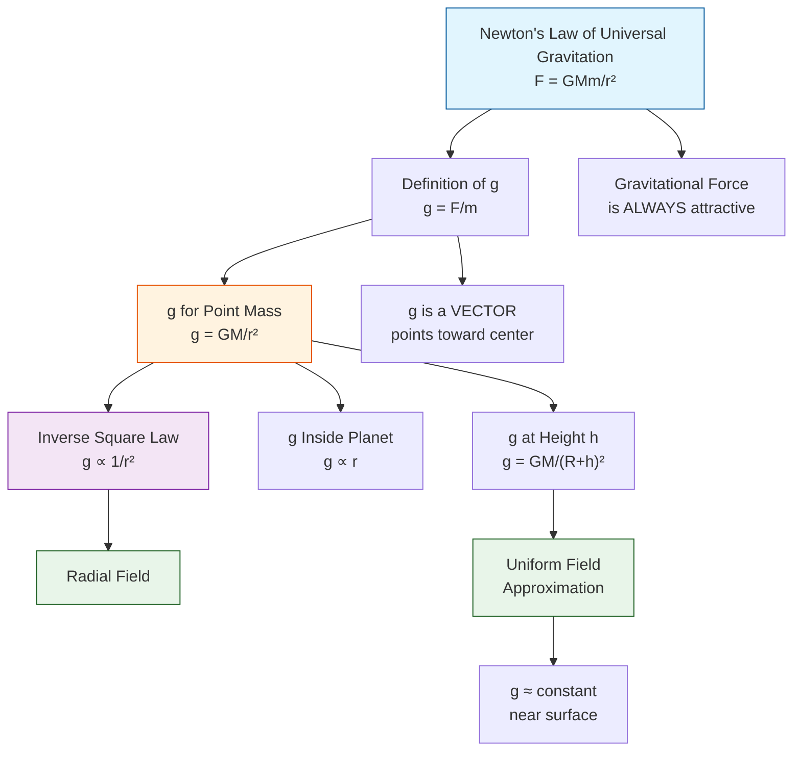
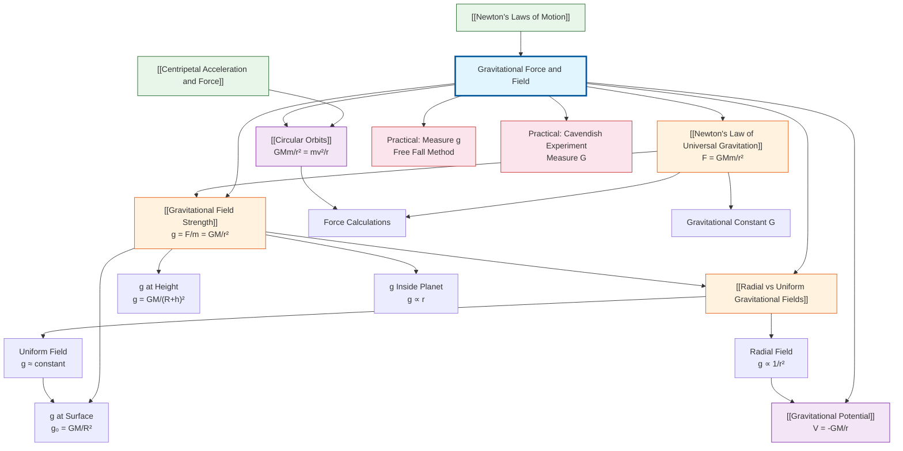

# 1. Overview / 概述

**English:** Gravitational force and field is a fundamental topic in A2 Physics that explores the universal attraction between masses. This topic builds directly on [[Newton's Laws of Motion]] and [[Centripetal Acceleration and Force]], extending Newtonian mechanics to celestial scales. Gravitational fields explain planetary orbits, tides, satellite motion, and the structure of the universe. In both CAIE 9702 and Edexcel IAL, this forms the foundation for [[Gravitational Potential]] and [[Circular Orbits]]. Real-world applications include satellite communications, GPS technology, space exploration, and understanding black holes. The concept of field (region of influence) is a key unifying idea in physics, reappearing in electric and magnetic fields.

**中文:** 引力与引力场是A2物理学的核心课题，研究质量之间的普遍吸引力。本课题建立在[[牛顿运动定律]]和[[向心加速度与力]]的基础上，将牛顿力学扩展到天体尺度。引力场解释了行星轨道、潮汐、卫星运动以及宇宙结构。在CAIE 9702和Edexcel IAL中，这是学习[[引力势]]和[[圆周轨道]]的基础。实际应用包括卫星通信、GPS技术、太空探索和理解黑洞。场的概念（影响区域）是物理学中关键的统一思想，在电场和磁场中再次出现。

> 📷 **IMAGE PROMPT — [OV-01]: Gravitational Field Overview**
> **English:** A split diagram showing: Left side - Earth with field lines (arrows pointing inward) and a small mass m experiencing force F = mg; Right side - Two masses M and m with Newton's law of gravitation F = GMm/r². Include labels: gravitational field strength g, radial field, force direction. Style: clean educational diagram, blue and orange color scheme, vector arrows in red. Exam importance: HIGH - foundational visual.
> **中文:** 分屏示意图：左侧显示地球及其向内指向的引力场线，小质量m受力F=mg；右侧显示两个质量M和m，标注万有引力定律F=GMm/r²。标注：引力场强度g、径向场、力的方向。风格：清晰教育图示，蓝橙配色，红色矢量箭头。考试重要性：高——基础视觉图。

# 2. Syllabus Learning Objectives / 考纲学习目标

| CAIE 9702 (15.1 a-d) | Edexcel IAL (WPH14 U4: 6.1-6.5) |
|---|---|
| (a) State Newton's law of universal gravitation | 6.1 Understand the concept of a gravitational field as a region where a mass experiences a force |
| (b) Define gravitational field strength g = F/m | 6.2 Understand that gravitational fields are radial around point masses and uniform near Earth's surface |
| (c) Derive g = GM/r² from Newton's law | 6.3 Use Newton's law of universal gravitation F = -GMm/r² |
| (d) Distinguish between gravitational mass and inertial mass | 6.4 Calculate gravitational field strength g = GM/r² |
| — | 6.5 Understand the relationship between g and the acceleration of free fall |

**Examiner Expectations / 考官期望:**
- **English:** Students must be able to state Newton's law in words AND formula. Derivation of g = GM/r² is frequently examined. Understanding the vector nature of gravitational force (attractive, along line joining centers) is crucial. Distinguishing between gravitational and inertial mass is a common theory question.
- **中文:** 学生必须能用文字和公式表述牛顿万有引力定律。g = GM/r²的推导经常被考查。理解引力矢量的性质（吸引力，沿连线方向）至关重要。区分引力质量和惯性质量是常见的理论题。

> 📋 **CIE Only:** CAIE explicitly requires distinguishing gravitational mass vs inertial mass (15.1d). This is a theory question topic.
> 📋 **Edexcel Only:** Edexcel explicitly requires understanding that gravitational fields are radial around point masses and uniform near Earth's surface (6.2). The negative sign in F = -GMm/r² is used in Edexcel to indicate attractive force direction.

# 3. Core Definitions / 核心定义

| Term (EN/CN) | Definition (EN) | Definition (CN) | Common Mistakes / 常见错误 |
|---|---|---|---|
| [[Newton's Law of Universal Gravitation]] / 万有引力定律 | Every point mass attracts every other point mass with a force directly proportional to the product of their masses and inversely proportional to the square of their separation | 任何两个质点之间都存在相互吸引力，力的大小与两质量的乘积成正比，与距离的平方成反比 | Forgetting the force acts along the line joining centers; using r as diameter instead of radius |
| [[Gravitational Field Strength]] (g) / 引力场强度 | The gravitational force per unit mass experienced by a small test mass placed at that point | 单位质量在引力场中某点所受的引力 | Confusing g with G (gravitational constant); forgetting g is a vector |
| [[Gravitational Field]] / 引力场 | A region of space where a mass experiences a gravitational force | 一个质量在其中会受到引力作用的区域 | Thinking fields only exist near planets; fields exist around ALL masses |
| [[Gravitational Mass]] / 引力质量 | The mass that determines the gravitational force experienced by an object in a gravitational field | 决定物体在引力场中受到引力大小的质量 | Confusing with inertial mass (resistance to acceleration) |
| [[Inertial Mass]] / 惯性质量 | The mass that determines the resistance of an object to acceleration when a force is applied | 决定物体在外力作用下抵抗加速度能力的质量 | Thinking they are always equal (they are experimentally equal but conceptually different) |
| [[Radial Field]] / 径向场 | A gravitational field where field lines radiate from a point mass, with g ∝ 1/r² | 场线从点质量向外辐射的引力场，g ∝ 1/r² | Assuming field lines are parallel in radial fields |
| [[Uniform Field]] / 均匀场 | A gravitational field where field lines are parallel and g is constant in magnitude and direction | 场线平行且g的大小和方向恒定的引力场 | Forgetting uniform field is an approximation near Earth's surface |

> 📷 **IMAGE PROMPT — [DEF-01]: Radial vs Uniform Gravitational Fields**
> **English:** Side-by-side comparison: Left - Radial field around a spherical mass (Earth) with arrows pointing inward, spacing increases with distance (showing 1/r²). Right - Uniform field near Earth's surface with parallel downward arrows of equal length. Labels: "Radial Field: g ∝ 1/r²", "Uniform Field: g = constant". Style: clear vector diagram, blue arrows on white background. Exam importance: VERY HIGH - frequently tested distinction.
> **中文:** 并排对比：左侧——球形质量（地球）周围的径向场，箭头向内指向，间距随距离增大（显示1/r²）。右侧——地球表面附近的均匀场，平行等长向下箭头。标注："径向场：g ∝ 1/r²"，"均匀场：g = 常数"。风格：清晰矢量图，白色背景蓝色箭头。考试重要性：非常高——经常考查的区别。

# 4. Key Concepts Explained / 关键概念详解

## 4.1 Newton's Law of Universal Gravitation / 万有引力定律

### Explanation / 解释:
**English:** [[Newton's Law of Universal Gravitation]] states that every point mass attracts every other point mass with a force that is:
- Directly proportional to the product of their masses ($F \propto m_1 m_2$)
- Inversely proportional to the square of their separation ($F \propto 1/r^2$)
- Always attractive (pulling masses together)
- Acting along the line joining the centers of the masses

The constant of proportionality is the [[Gravitational Constant]] $G = 6.67 \times 10^{-11} \, \text{N m}^2 \text{kg}^{-2}$.

$$F = G\frac{m_1 m_2}{r^2}$$

**中文:** [[牛顿万有引力定律]]指出，任何两个质点之间都存在相互吸引力：
- 力的大小与两质量的乘积成正比（$F \propto m_1 m_2$）
- 力的大小与距离的平方成反比（$F \propto 1/r^2$）
- 始终为吸引力（将质量拉向一起）
- 沿两质量中心的连线方向

比例常数是[[引力常数]] $G = 6.67 \times 10^{-11} \, \text{N m}^2 \text{kg}^{-2}$。

### Physical Meaning / 物理意义:
**English:** This law is universal — it applies to all masses, from subatomic particles to galaxies. The inverse square relationship means that doubling the distance reduces the force to 1/4. The force is extremely weak for small masses (e.g., two people) but becomes enormous for astronomical bodies (e.g., Earth and Moon). This law explains why planets orbit the Sun, why objects fall to Earth, and why tides occur.

**中文:** 该定律具有普遍性——适用于所有质量，从亚原子粒子到星系。平方反比关系意味着距离加倍，力减小到1/4。对于小质量（如两个人），力极其微弱，但对于天体（如地球和月球），力变得巨大。该定律解释了行星绕太阳运行、物体落向地球以及潮汐产生的原因。

### Common Misconceptions / 常见误区:
- ❌ **"Gravitational force requires contact"** — Gravitational force is a non-contact (action-at-a-distance) force
- ❌ **"Gravitational force only acts on Earth"** — It acts between ALL masses everywhere
- ❌ **"r is the distance from the surface"** — r is the distance between CENTERS of masses
- ❌ **"G is the same as g"** — G is a universal constant; g varies with location
- ❌ **"The force on m₁ is different from the force on m₂"** — Newton's Third Law: forces are equal and opposite

### Exam Tips / 考试提示:
**English:** Always write the formula with G explicitly. When calculating force between Earth and an object, remember r = Earth's radius + height above surface. For spherical objects, treat them as point masses at their centers. The force is ALWAYS attractive — never repulsive. In vector form, use the negative sign to indicate direction (Edexcel emphasis).

**中文:** 始终明确写出G的公式。计算地球与物体之间的力时，记住r = 地球半径 + 距地表高度。对于球形物体，将其视为质量集中在球心的质点。力始终为吸引力——绝无排斥力。在矢量形式中，使用负号表示方向（Edexcel重点）。

## 4.2 Gravitational Field Strength (g) / 引力场强度

### Explanation / 解释:
**English:** [[Gravitational Field Strength]] (g) is defined as the gravitational force per unit mass experienced by a small test mass placed at that point in the field.

$$g = \frac{F}{m}$$

Where:
- $g$ = gravitational field strength (N kg⁻¹)
- $F$ = gravitational force on the test mass (N)
- $m$ = mass of the test object (kg)

For a point mass M, the field strength at distance r is:

$$g = \frac{GM}{r^2}$$

This is derived by combining $F = GMm/r^2$ with $g = F/m$.

**中文:** [[引力场强度]] (g) 定义为放置在引力场中某点的单位质量所受的引力。

$$g = \frac{F}{m}$$

其中：
- $g$ = 引力场强度 (N kg⁻¹)
- $F$ = 测试质量所受的引力 (N)
- $m$ = 测试物体的质量 (kg)

对于点质量M，距离r处的场强为：

$$g = \frac{GM}{r^2}$$

这是通过结合 $F = GMm/r^2$ 和 $g = F/m$ 推导得出的。

### Physical Meaning / 物理意义:
**English:** g is a VECTOR quantity — it points toward the center of the mass creating the field. Near Earth's surface, g ≈ 9.81 N kg⁻¹ (or m s⁻²). Note that g has the same units as acceleration (N kg⁻¹ = m s⁻²), which is why the acceleration of free fall equals g. The value of g decreases with height and varies slightly over Earth's surface due to its non-spherical shape and density variations.

**中文:** g是矢量——指向产生场的质量中心。在地球表面附近，g ≈ 9.81 N kg⁻¹（或 m s⁻²）。注意g与加速度单位相同（N kg⁻¹ = m s⁻²），这就是自由落体加速度等于g的原因。g的值随高度减小，并因地球非球形和密度变化而在地表略有变化。

### Common Misconceptions / 常见误区:
- ❌ **"g is the same everywhere on Earth"** — g varies with latitude, altitude, and local geology
- ❌ **"g = 9.81 m/s² is a universal constant"** — g = 9.81 only near Earth's surface; it changes with r
- ❌ **"g depends on the test mass"** — g is a property of the FIELD, not the test mass
- ❌ **"g and G are the same thing"** — g is field strength (varies), G is universal constant (fixed)

### Exam Tips / 考试提示:
**English:** The derivation of g = GM/r² from F = GMm/r² and g = F/m is a standard exam question. Remember g ∝ 1/r² — doubling distance reduces g to 1/4. For Earth, g at surface = GM_E/R_E². At height h above surface, g = GM_E/(R_E + h)². The units N kg⁻¹ and m s⁻² are interchangeable.

**中文:** 从F = GMm/r²和g = F/m推导g = GM/r²是标准考题。记住g ∝ 1/r²——距离加倍，g减小到1/4。对于地球，地表g = GM_E/R_E²。在距地表高度h处，g = GM_E/(R_E + h)²。单位N kg⁻¹和m s⁻²可互换。

## 4.3 Radial vs Uniform Gravitational Fields / 径向场与均匀场

### Explanation / 解释:
**English:** Gravitational fields can be classified into two types:

**Radial Field:**
- Field lines radiate from a point mass (or spherical mass)
- g ∝ 1/r² — field strength decreases with distance
- Field lines are not parallel; they converge at the center
- Example: Field around a planet, star, or any isolated mass

**Uniform Field:**
- Field lines are parallel and equally spaced
- g is constant in both magnitude and direction
- This is an APPROXIMATION valid near the surface of a large body
- Example: Near Earth's surface (g ≈ 9.81 N kg⁻¹, direction vertically downward)

**中文:** 引力场可分为两种类型：

**径向场：**
- 场线从点质量（或球形质量）向外辐射
- g ∝ 1/r²——场强随距离减小
- 场线不平行；汇聚于中心
- 示例：行星、恒星或任何孤立质量周围的场

**均匀场：**
- 场线平行且等距
- g的大小和方向恒定
- 这是大质量体表面附近的近似
- 示例：地球表面附近（g ≈ 9.81 N kg⁻¹，方向垂直向下）

### Physical Meaning / 物理意义:
**English:** The distinction is important because calculations differ. In a uniform field, gravitational force on a mass is constant (F = mg). In a radial field, force varies with position (F = GMm/r²). The uniform field approximation is valid when the height above the surface is much smaller than the radius of the body (h << R). For Earth, this works well for heights up to a few kilometers.

**中文:** 这种区别很重要，因为计算方法不同。在均匀场中，质量所受引力恒定（F = mg）。在径向场中，力随位置变化（F = GMm/r²）。均匀场近似在距地表高度远小于天体半径时有效（h << R）。对于地球，这适用于高达几公里的高度。

### Common Misconceptions / 常见误区:
- ❌ **"Earth's gravitational field is uniform everywhere"** — Only approximately uniform near the surface
- ❌ **"Radial fields have parallel field lines"** — Radial field lines diverge from the center
- ❌ **"g is constant in a radial field"** — g decreases with distance in a radial field

### Exam Tips / 考试提示:
**English:** Be able to sketch both field patterns. For radial fields, show arrows pointing inward (attractive). For uniform fields, show parallel downward arrows. Questions often ask: "State and explain why the gravitational field near Earth's surface can be considered uniform." Answer: Because Earth's radius (6400 km) is much larger than typical heights, so g changes negligibly.

**中文:** 能够画出两种场图。对于径向场，箭头指向内（吸引力）。对于均匀场，平行向下箭头。问题常问："说明并解释为什么地球表面附近的引力场可视为均匀。"答案：因为地球半径（6400 km）远大于典型高度，所以g变化可忽略。

## 4.4 Gravitational Mass vs Inertial Mass / 引力质量与惯性质量

### Explanation / 解释:
**English:** [[Gravitational Mass]] and [[Inertial Mass]] are conceptually different but experimentally equivalent:

**Gravitational Mass (m_g):**
- Determines the gravitational force experienced: $F = m_g g$
- Measured using a balance (comparing with standard masses)
- Relates to the "amount of matter" that responds to gravity

**Inertial Mass (m_i):**
- Determines resistance to acceleration: $F = m_i a$
- Measured using an inertial balance or by applying a known force and measuring acceleration
- Relates to the "amount of matter" that resists motion changes

**Equivalence Principle:** Experimentally, $m_g = m_i$ to high precision. This is why all objects fall with the same acceleration in a gravitational field (Galileo's experiment).

**中文:** [[引力质量]]和[[惯性质量]]概念上不同，但实验上等价：

**引力质量 (m_g)：**
- 决定所受引力：$F = m_g g$
- 用天平测量（与标准质量比较）
- 与"对引力响应的物质数量"相关

**惯性质量 (m_i)：**
- 决定对加速度的抵抗：$F = m_i a$
- 用惯性秤或施加已知力测量加速度来测量
- 与"抵抗运动变化的物质数量"相关

**等效原理：** 实验上，$m_g = m_i$ 达到高精度。这就是为什么所有物体在引力场中以相同加速度下落（伽利略实验）。

### Common Misconceptions / 常见误区:
- ❌ **"They are the same thing"** — Conceptually different; only experimentally equal
- ❌ **"Inertial mass is measured by weighing"** — Weighing measures gravitational mass
- ❌ **"The equivalence principle is obvious"** — It's a profound experimental fact, not a logical necessity

### Exam Tips / 考试提示:
**English:** CAIE specifically requires this distinction (15.1d). Know the experimental methods: gravitational mass uses a balance (compare with known masses); inertial mass uses F = ma (apply known force, measure acceleration). The equivalence principle is the foundation of Einstein's General Relativity.

**中文:** CAIE明确要求区分这两者（15.1d）。了解实验方法：引力质量用天平（与已知质量比较）；惯性质量用F = ma（施加已知力，测量加速度）。等效原理是爱因斯坦广义相对论的基础。

# 5. Essential Equations / 核心公式

## 5.1 Newton's Law of Universal Gravitation / 万有引力定律

$$F = G\frac{m_1 m_2}{r^2}$$

| Symbol (符号) | Meaning (EN/CN) | Unit (单位) |
|---|---|---|
| $F$ | Gravitational force between masses / 质量之间的引力 | N |
| $G$ | Universal gravitational constant / 万有引力常数 | N m² kg⁻² |
| $m_1, m_2$ | Masses of the two objects / 两个物体的质量 | kg |
| $r$ | Distance between centers of masses / 两质量中心之间的距离 | m |

**Derivation / 推导:** Not required (it's an empirical law). But know the proportionalities: $F \propto m_1 m_2$ and $F \propto 1/r^2$.

**Conditions / 适用条件:**
- Point masses OR spherical masses (treat as point masses at centers)
- Masses are stationary or moving slowly compared to speed of light
- Non-relativistic regime

**Limitations / 局限性:**
- Does not apply at very small distances (quantum effects)
- Does not apply at very high speeds or strong fields (General Relativity needed)
- Does not explain WHY gravity exists — only describes it

**Rearrangements / 变形:**
$$m_1 = \frac{F r^2}{G m_2}, \quad r = \sqrt{\frac{G m_1 m_2}{F}}, \quad G = \frac{F r^2}{m_1 m_2}$$

> 📋 **Edexcel Only:** Edexcel uses the vector form $F = -\frac{GMm}{r^2}\hat{r}$ where the negative sign indicates attractive force (toward the center).

## 5.2 Gravitational Field Strength / 引力场强度

$$g = \frac{F}{m}$$

| Symbol (符号) | Meaning (EN/CN) | Unit (单位) |
|---|---|---|
| $g$ | Gravitational field strength / 引力场强度 | N kg⁻¹ (or m s⁻²) |
| $F$ | Gravitational force on test mass / 测试质量所受引力 | N |
| $m$ | Mass of test object / 测试物体的质量 | kg |

**Derivation / 推导:** Definition — no derivation needed.

**Conditions / 适用条件:** Valid for any point in any gravitational field.

## 5.3 Gravitational Field Strength for a Point Mass / 点质量的引力场强度

$$g = \frac{GM}{r^2}$$

| Symbol (符号) | Meaning (EN/CN) | Unit (单位) |
|---|---|---|
| $g$ | Gravitational field strength at distance r / 距离r处的引力场强度 | N kg⁻¹ |
| $G$ | Universal gravitational constant / 万有引力常数 | N m² kg⁻² |
| $M$ | Mass creating the field / 产生场的质量 | kg |
| $r$ | Distance from center of mass M / 距质量M中心的距离 | m |

**Derivation / 推导 (EXAMINABLE):**
1. Start with Newton's law: $F = GMm/r^2$
2. Definition of g: $g = F/m$
3. Substitute: $g = (GMm/r^2)/m = GM/r^2$

**Conditions / 适用条件:**
- M is a point mass or spherical mass
- r is measured from the CENTER of M
- Outside the mass (for r ≥ R, where R is radius of M)

**Limitations / 局限性:**
- Inside a spherical mass, g ∝ r (linear relationship, not 1/r²)
- Does not apply inside black holes (General Relativity required)

**Rearrangements / 变形:**
$$M = \frac{g r^2}{G}, \quad r = \sqrt{\frac{GM}{g}}, \quad G = \frac{g r^2}{M}$$

## 5.4 Relationship Between g and Height / g与高度的关系

$$g_h = \frac{GM}{(R + h)^2}$$

| Symbol (符号) | Meaning (EN/CN) | Unit (单位) |
|---|---|---|
| $g_h$ | Gravitational field strength at height h / 高度h处的引力场强度 | N kg⁻¹ |
| $G$ | Universal gravitational constant / 万有引力常数 | N m² kg⁻² |
| $M$ | Mass of planet (e.g., Earth) / 行星质量（如地球） | kg |
| $R$ | Radius of planet / 行星半径 | m |
| $h$ | Height above surface / 距地表高度 | m |

**Derivation / 推导:** Substitute $r = R + h$ into $g = GM/r^2$.

**Approximation for small h (h << R):**
$$g_h \approx g_0 \left(1 - \frac{2h}{R}\right)$$
Where $g_0 = GM/R^2$ is the surface value.

> 📋 **CIE Only:** The approximation formula is more commonly tested in CIE.
> 📋 **Edexcel Only:** Edexcel emphasizes the exact formula and may ask students to derive the approximation.

## 5.5 Summary Table of Key Equations / 关键公式汇总表

| Equation / 公式 | Name / 名称 | Variables / 变量 | Exam Frequency / 考试频率 |
|---|---|---|---|
| $F = G\frac{m_1 m_2}{r^2}$ | Newton's Law / 牛顿定律 | F, G, m₁, m₂, r | ★★★★★ (Every paper) |
| $g = \frac{F}{m}$ | Definition of g / g的定义 | g, F, m | ★★★★★ (Every paper) |
| $g = \frac{GM}{r^2}$ | g for point mass / 点质量的g | g, G, M, r | ★★★★★ (Every paper) |
| $g_h = \frac{GM}{(R+h)^2}$ | g at height h / 高度h处的g | g_h, G, M, R, h | ★★★★☆ (Common) |
| $g_h \approx g_0(1 - \frac{2h}{R})$ | Approximation / 近似公式 | g_h, g_0, h, R | ★★★☆☆ (Occasional) |

# 6. Graphs and Relationships / 图表与关系

## 6.1 Gravitational Force vs Distance (F vs r) / 引力与距离关系图

**Axes / 坐标轴:**
- x-axis: Distance r (m) — from center of mass M
- y-axis: Gravitational force F (N)

**Shape / 形状:**
- Inverse square curve: $F \propto 1/r^2$
- As r increases, F decreases rapidly
- As r → 0, F → ∞ (theoretically)
- As r → ∞, F → 0

**Gradient Meaning / 斜率意义:**
- Gradient = dF/dr = $-2GMm/r^3$
- The gradient is always negative (force decreases with distance)
- The magnitude of gradient decreases as r increases

**Area Meaning / 面积意义:**
- Area under F-r graph = Work done against gravitational force = Change in [[Gravitational Potential Energy]]
- $\Delta U = \int_{r_1}^{r_2} F \, dr = \int_{r_1}^{r_2} \frac{GMm}{r^2} \, dr = GMm\left(\frac{1}{r_1} - \frac{1}{r_2}\right)$

**Exam Interpretation / 考试解读:**
- Steeper curve at small r means force changes rapidly with distance
- Flatter curve at large r means force changes slowly
- The graph never touches either axis (asymptotic behavior)

**Common Questions / 常见问题:**
- "Sketch the graph of F against r for two masses"
- "Explain why the force approaches zero at large distances"
- "Use the graph to find the work done moving a mass from r₁ to r₂"

> 📷 **IMAGE PROMPT — [GR-01]: F vs r Inverse Square Graph**
> **English:** Graph showing F on y-axis vs r on x-axis. Inverse square curve: steep near origin, flattening as r increases. Label key points: F ∝ 1/r², asymptotic to both axes. Show shaded area under curve between r₁ and r₂ labeled "Work done = ΔGPE". Include axes labels with units. Style: clear mathematical graph, grid lines, blue curve. Exam importance: HIGH.
> **中文:** F-y轴对r-x轴图。平方反比曲线：靠近原点陡峭，随r增大变平。标注关键点：F ∝ 1/r²，渐近于两轴。显示r₁到r₂间曲线下阴影区域，标注"做功 = ΔGPE"。包含带单位的坐标轴标签。风格：清晰数学图，网格线，蓝色曲线。考试重要性：高。

## 6.2 Gravitational Field Strength vs Distance (g vs r) / 引力场强度与距离关系图

**Axes / 坐标轴:**
- x-axis: Distance r (m) — from center of mass M
- y-axis: Gravitational field strength g (N kg⁻¹)

**Shape / 形状:**
- Outside mass (r ≥ R): $g \propto 1/r^2$ — inverse square curve
- Inside mass (r < R): $g \propto r$ — linear increase (for uniform density sphere)
- At r = R: g is maximum (surface value)

**Gradient Meaning / 斜率意义:**
- Outside (r > R): Negative gradient, magnitude decreases with r
- Inside (r < R): Positive gradient (g increases with r)
- At r = R: Discontinuity in gradient (cusp)

**Area Meaning / 面积意义:**
- Area under g-r graph = Change in [[Gravitational Potential]] (V)
- $\Delta V = \int_{r_1}^{r_2} g \, dr$

**Exam Interpretation / 考试解读:**
- Maximum g at surface (r = R)
- g decreases rapidly outside the mass
- g increases linearly inside (toward center)
- At center (r = 0), g = 0 (forces cancel)

**Common Questions / 常见问题:**
- "Sketch g against r for a planet of radius R"
- "Explain why g is zero at the center of Earth"
- "Calculate g at a given height above Earth's surface"

> 📷 **IMAGE PROMPT — [GR-02]: g vs r for a Planet**
> **English:** Graph showing g on y-axis vs r on x-axis for a spherical planet of radius R. For r < R: linear increase from 0 at center to g₀ at surface. For r ≥ R: inverse square decrease (g ∝ 1/r²). Label: r = R (surface), g = g₀ (surface value), g = 0 at center. Include Earth values if possible. Style: clear graph with two distinct regions, red for inside, blue for outside. Exam importance: VERY HIGH.
> **中文:** 半径为R的球形行星的g-y轴对r-x轴图。r < R：从中心0线性增加到地表g₀。r ≥ R：平方反比减小（g ∝ 1/r²）。标注：r = R（地表），g = g₀（地表值），中心g = 0。如可能包含地球数值。风格：清晰图，两个不同区域，内部红色，外部蓝色。考试重要性：非常高。

## 6.3 Mermaid Relationship Diagram / 关系图



# 7. Required Diagrams / 必备图表

## 7.1 Radial Gravitational Field Around a Point Mass / 点质量周围的径向引力场

> 📷 **IMAGE PROMPT — [DG-01]: Radial Gravitational Field**
> **English:** A central spherical mass (labeled M) with radial field lines emanating outward. Arrows point INWARD toward the center (attractive force). Field lines are closer together near the mass (stronger field) and spread out with distance (weaker field). Label: "Radial Field: g ∝ 1/r²", "Field lines converge at center", "Arrow direction = direction of force on test mass". Include a small test mass m at one point with force vector F pointing toward center. Style: clean vector diagram, black background with white/blue lines, or white background with blue/black lines. Exam importance: VERY HIGH - must be able to sketch.
> **中文:** 中心球形质量（标注M），径向场线向外辐射。箭头指向内（吸引力）。场线在质量附近较密（场强），随距离增大而分散（场弱）。标注："径向场：g ∝ 1/r²"，"场线汇聚于中心"，"箭头方向 = 测试质量受力方向"。包含一个小测试质量m，受力矢量F指向中心。风格：清晰矢量图，黑色背景白/蓝线，或白色背景蓝/黑线。考试重要性：非常高——必须能画出。

## 7.2 Uniform Gravitational Field Near Earth's Surface / 地球表面附近的均匀引力场

> 📷 **IMAGE PROMPT — [DG-02]: Uniform Gravitational Field**
> **English:** A flat horizontal line representing Earth's surface. Above it, parallel vertical arrows of equal length pointing downward. Arrows are equally spaced (constant field strength). Label: "Uniform Field: g = constant", "g ≈ 9.81 N kg⁻¹", "Parallel field lines", "Equal spacing = constant field strength". Include a small mass m with force vector F = mg pointing down. Show height h above surface. Style: clean diagram, Earth surface in brown/green, arrows in blue. Exam importance: HIGH - compare with radial field.
> **中文:** 代表地球表面的水平线。上方平行等长垂直向下箭头。箭头等距（恒定场强）。标注："均匀场：g = 常数"，"g ≈ 9.81 N kg⁻¹"，"平行场线"，"等距 = 恒定场强"。包含小质量m，受力矢量F = mg向下。显示距地表高度h。风格：清晰图，地表棕色/绿色，箭头蓝色。考试重要性：高——与径向场比较。

## 7.3 Gravitational Force Between Two Masses / 两质量之间的引力

> 📷 **IMAGE PROMPT — [DG-03]: Newton's Law of Gravitation Diagram**
> **English:** Two spherical masses m₁ and m₂ separated by distance r (measured center to center). Draw a double-headed arrow between centers labeled "r". Show force vectors: F₁₂ on m₁ pointing toward m₂, and F₂₁ on m₂ pointing toward m₁. Both vectors are equal in length (Newton's Third Law). Label: "F₁₂ = F₂₁ = GMm/r²", "Attractive force along line joining centers". Include dimensions: r = distance between centers. Style: clear physics diagram, masses in blue/gray, force arrows in red, distance arrow in black. Exam importance: VERY HIGH - fundamental diagram.
> **中文:** 两个球形质量m₁和m₂，中心间距为r。在中心之间画双向箭头标注"r"。显示力矢量：m₁上的F₁₂指向m₂，m₂上的F₂₁指向m₁。两矢量等长（牛顿第三定律）。标注："F₁₂ = F₂₁ = GMm/r²"，"吸引力沿中心连线"。包含尺寸：r = 中心间距离。风格：清晰物理图，质量蓝色/灰色，力矢量红色，距离箭头黑色。考试重要性：非常高——基础图。

## 7.4 g vs r Graph for a Planet / 行星的g-r图

> 📷 **IMAGE PROMPT — [DG-04]: g vs r Complete Graph**
> **English:** Full graph of gravitational field strength g against distance r from center of a uniform spherical planet of radius R. Region 1 (r < R): straight line from origin (0,0) to (R, g₀) showing g ∝ r. Region 2 (r ≥ R): inverse square curve from (R, g₀) approaching zero as r → ∞. Label key points: r = 0, g = 0 (center); r = R, g = g₀ (surface); r > R, g ∝ 1/r². Include dashed vertical line at r = R. Style: mathematical graph with grid, two distinct colored regions. Exam importance: HIGH - tests understanding of field inside vs outside.
> **中文:** 均匀球形行星（半径R）的引力场强度g对距中心距离r的完整图。区域1（r < R）：从原点(0,0)到(R, g₀)的直线，显示g ∝ r。区域2（r ≥ R）：从(R, g₀)开始的平方反比曲线，r → ∞时趋近于零。标注关键点：r = 0, g = 0（中心）；r = R, g = g₀（地表）；r > R, g ∝ 1/r²。在r = R处画虚线。风格：带网格的数学图，两个不同颜色区域。考试重要性：高——考查对场内部与外部的理解。

# 8. Worked Examples / 典型例题

## Example 1: Gravitational Force Between Earth and Moon / 地球与月球之间的引力

### Question / 题目
**English:** The mass of Earth is $M_E = 5.97 \times 10^{24}$ kg, the mass of the Moon is $M_M = 7.35 \times 10^{22}$ kg, and the mean distance between their centers is $r = 3.84 \times 10^8$ m. The gravitational constant is $G = 6.67 \times 10^{-11}$ N m² kg⁻².

(a) Calculate the gravitational force between Earth and the Moon.
(b) Calculate the gravitational field strength at the Moon's position due to Earth's gravity.
(c) Explain why the Moon does not fall into Earth despite this large force.

**中文:** 地球质量 $M_E = 5.97 \times 10^{24}$ kg，月球质量 $M_M = 7.35 \times 10^{22}$ kg，两中心平均距离 $r = 3.84 \times 10^8$ m。引力常数 $G = 6.67 \times 10^{-11}$ N m² kg⁻²。

(a) 计算地球与月球之间的引力。
(b) 计算月球位置处由地球引力产生的引力场强度。
(c) 解释为什么月球尽管受到如此大的力却不会坠向地球。

### Image Prompt / 图片提示
> 📷 **IMAGE PROMPT — [EX-01]: Earth-Moon System**
> **English:** Diagram showing Earth (large blue sphere) and Moon (smaller gray sphere) with distance r = 3.84 × 10⁸ m between centers. Force arrows F_Earth→Moon and F_Moon→Earth shown as equal and opposite. Include Moon's orbital path (dashed circle) around Earth. Label: "Centripetal force provided by gravity", "Moon's orbital velocity v". Style: clear astronomical diagram, not to scale. Exam importance: HIGH.
> **中文:** 地球（大蓝色球体）和月球（较小灰色球体）示意图，中心间距r = 3.84 × 10⁸ m。力箭头F_地→月和F_月→地等大反向。包含月球绕地球的轨道路径（虚线圆）。标注："向心力由引力提供"，"月球轨道速度v"。风格：清晰天文图，不按比例。考试重要性：高。

### Solution / 解答

**(a) Gravitational force / 引力:**

$$F = G\frac{M_E M_M}{r^2}$$

$$F = \frac{(6.67 \times 10^{-11})(5.97 \times 10^{24})(7.35 \times 10^{22})}{(3.84 \times 10^8)^2}$$

$$F = \frac{(6.67 \times 10^{-11})(4.39 \times 10^{47})}{1.47 \times 10^{17}}$$

$$F = \frac{2.93 \times 10^{37}}{1.47 \times 10^{17}}$$

$$F = 1.99 \times 10^{20} \text{ N}$$

**(b) Gravitational field strength at Moon's position / 月球位置处的引力场强度:**

$$g = \frac{GM_E}{r^2}$$

$$g = \frac{(6.67 \times 10^{-11})(5.97 \times 10^{24})}{(3.84 \times 10^8)^2}$$

$$g = \frac{3.98 \times 10^{14}}{1.47 \times 10^{17}}$$

$$g = 2.71 \times 10^{-3} \text{ N kg}^{-1}$$

**(c) Explanation / 解释:**
**English:** The Moon is in [[Circular Orbits|circular orbit]] around Earth. The gravitational force provides the [[Centripetal Acceleration and Force|centripetal force]] required for circular motion. The Moon has a tangential orbital velocity (about 1 km/s) that is perpendicular to the gravitational force. As the Moon "falls" toward Earth due to gravity, its tangential velocity carries it sideways, resulting in a curved path. The Moon is constantly falling toward Earth but keeps missing it because of its sideways motion. This is why it remains in a stable orbit rather than crashing into Earth.

**中文:** 月球绕地球做[[圆周轨道|圆周运动]]。引力提供了圆周运动所需的[[向心加速度与力|向心力]]。月球具有垂直于引力方向的切向轨道速度（约1 km/s）。当月球因引力"坠向"地球时，其切向速度使其侧向移动，形成弯曲路径。月球不断坠向地球，但因侧向运动而不断"错过"地球。这就是它保持稳定轨道而非撞向地球的原因。

### Final Answer / 最终答案
(a) $F = 1.99 \times 10^{20}$ N
(b) $g = 2.71 \times 10^{-3}$ N kg⁻¹
(c) Gravitational force provides centripetal force for orbital motion / 引力提供轨道运动的向心力

### Examiner Notes / 考官点评
**English:** 
- Part (a): Common mistake is forgetting to square r. Always check units — force should be in N.
- Part (b): Note that g at Moon's distance is much smaller than Earth's surface g (9.81). This shows the inverse square effect.
- Part (c): Must mention BOTH gravitational force providing centripetal force AND tangential velocity. Simply saying "centripetal force" without explaining the velocity component loses marks.

**中文:**
- 第(a)部分：常见错误是忘记对r平方。始终检查单位——力应为N。
- 第(b)部分：注意月球距离处的g远小于地球表面g（9.81）。这显示了平方反比效应。
- 第(c)部分：必须同时提到引力提供向心力和切向速度。仅说"向心力"而不解释速度分量会失分。

## Example 2: Gravitational Field Strength at Height / 高度处的引力场强度

### Question / 题目
**English:** A satellite orbits Earth at a height of 400 km above the surface. Given:
- Earth's mass $M_E = 5.97 \times 10^{24}$ kg
- Earth's radius $R_E = 6.37 \times 10^6$ m
- $G = 6.67 \times 10^{-11}$ N m² kg⁻²

(a) Calculate the gravitational field strength at the satellite's position.
(b) Calculate the percentage decrease in g compared to the surface value.
(c) State one reason why the uniform field approximation is NOT valid at this height.

**中文:** 一颗卫星在距地表400 km的高度绕地球运行。已知：
- 地球质量 $M_E = 5.97 \times 10^{24}$ kg
- 地球半径 $R_E = 6.37 \times 10^6$ m
- $G = 6.67 \times 10^{-11}$ N m² kg⁻²

(a) 计算卫星位置处的引力场强度。
(b) 计算与地表值相比g的下降百分比。
(c) 说明一个为什么在此高度均匀场近似不成立的原因。

### Image Prompt / 图片提示
> 📷 **IMAGE PROMPT — [EX-02]: Satellite at Height h**
> **English:** Cross-section of Earth showing center, radius R_E = 6370 km, and a satellite at height h = 400 km above surface. Label total distance from center: r = R_E + h. Show g vector at surface (g₀ = 9.81) and at satellite (g_h < g₀). Include formula: g_h = GM/(R+h)². Style: clear diagram, Earth in blue/green, satellite as small box with solar panels. Exam importance: HIGH.
> **中文:** 地球剖面图，显示中心、半径R_E = 6370 km，以及距地表高度h = 400 km的卫星。标注距中心总距离：r = R_E + h。显示地表g矢量（g₀ = 9.81）和卫星处g矢量（g_h < g₀）。包含公式：g_h = GM/(R+h)²。风格：清晰图，地球蓝/绿色，卫星为带太阳能板的小盒子。考试重要性：高。

### Solution / 解答

**(a) Gravitational field strength at satellite height / 卫星高度处的引力场强度:**

$$r = R_E + h = 6.37 \times 10^6 + 4.00 \times 10^5 = 6.77 \times 10^6 \text{ m}$$

$$g_h = \frac{GM_E}{r^2} = \frac{(6.67 \times 10^{-11})(5.97 \times 10^{24})}{(6.77 \times 10^6)^2}$$

$$g_h = \frac{3.98 \times 10^{14}}{4.58 \times 10^{13}}$$

$$g_h = 8.69 \text{ N kg}^{-1}$$

**(b) Percentage decrease / 下降百分比:**

Surface value: $g_0 = \frac{GM_E}{R_E^2} = \frac{3.98 \times 10^{14}}{(6.37 \times 10^6)^2} = \frac{3.98 \times 10^{14}}{4.06 \times 10^{13}} = 9.81 \text{ N kg}^{-1}$

$$\text{Percentage decrease} = \frac{g_0 - g_h}{g_0} \times 100\% = \frac{9.81 - 8.69}{9.81} \times 100\%$$

$$\text{Percentage decrease} = \frac{1.12}{9.81} \times 100\% = 11.4\%$$

**(c) Reason / 原因:**
**English:** The uniform field approximation assumes g is constant. At h = 400 km, g has decreased by 11.4% from the surface value. This is a significant change, so the field cannot be considered uniform. The uniform approximation is only valid when h << R_E (typically h < 10 km for Earth), where the change in g is negligible.

**中文:** 均匀场近似假设g为常数。在h = 400 km处，g比地表值下降了11.4%。这是显著变化，因此场不能视为均匀。均匀近似仅在h << R_E时有效（对地球通常h < 10 km），此时g的变化可忽略。

### Final Answer / 最终答案
(a) $g_h = 8.69$ N kg⁻¹
(b) 11.4% decrease / 下降11.4%
(c) g changes significantly (11.4%) — uniform field requires g ≈ constant / g显著变化（11.4%）——均匀场要求g ≈ 常数

### Examiner Notes / 考官点评
**English:**
- Part (a): Common error — using R_E instead of (R_E + h). Always add height to radius!
- Part (b): Can also calculate using ratio: g_h/g_0 = (R_E/r)² = (6.37/6.77)² = 0.886, so 11.4% decrease.
- Part (c): Must quantify "significant" — mention the 11.4% change. Vague answers like "g changes" without numbers lose marks.

**中文:**
- 第(a)部分：常见错误——使用R_E而非(R_E + h)。始终将高度加到半径上！
- 第(b)部分：也可用比值计算：g_h/g_0 = (R_E/r)² = (6.37/6.77)² = 0.886，所以下降11.4%。
- 第(c)部分：必须量化"显著"——提及11.4%的变化。没有数字的模糊答案如"g变化"会失分。

# 9. Past Paper Question Types / 历年真题题型

| Question Type / 题型 | Frequency / 频率 | Difficulty / 难度 | Past Paper References / 真题索引 |
|---|---|---|---|
| State Newton's law of universal gravitation in words and formula / 用文字和公式表述万有引力定律 | ★★★★★ (Every paper) | ★☆☆☆☆ (Easy) | 📝 *待填入* |
| Derive g = GM/r² from F = GMm/r² / 推导g = GM/r² | ★★★★★ (Every paper) | ★★☆☆☆ (Medium) | 📝 *待填入* |
| Calculate gravitational force between two masses / 计算两质量之间的引力 | ★★★★★ (Every paper) | ★★☆☆☆ (Medium) | 📝 *待填入* |
| Calculate g at a given height above Earth's surface / 计算地表某高度处的g | ★★★★☆ (Very Common) | ★★★☆☆ (Medium) | 📝 *待填入* |
| Sketch and interpret g vs r graph for a planet / 画出并解释行星的g-r图 | ★★★★☆ (Very Common) | ★★★★☆ (Hard) | 📝 *待填入* |
| Distinguish between gravitational mass and inertial mass / 区分引力质量和惯性质量 | ★★★☆☆ (Common - CIE) | ★★☆☆☆ (Medium) | 📝 *待填入* |
| Explain why Moon doesn't fall into Earth / 解释月球为何不坠向地球 | ★★★☆☆ (Common) | ★★★☆☆ (Medium) | 📝 *待填入* |
| Compare radial and uniform gravitational fields / 比较径向场与均匀场 | ★★★☆☆ (Common) | ★★☆☆☆ (Medium) | 📝 *待填入* |
| Calculate percentage change in g with height / 计算g随高度的百分比变化 | ★★☆☆☆ (Occasional) | ★★★☆☆ (Medium) | 📝 *待填入* |
| Vector nature of gravitational force (Edexcel negative sign) / 引力的矢量性质（Edexcel负号） | ★★☆☆☆ (Occasional - Edexcel) | ★★★☆☆ (Medium) | 📝 *待填入* |

> 📝 **题库整理中 / Question Bank Under Construction:**
> **English:** Specific past paper references (e.g., CAIE 9702/22/M/J/19, Edexcel WPH14/01) will be added as they are identified. Students should practice all question types above using their syllabus's past papers. Focus on derivation questions (g = GM/r²) and calculation questions — these appear most frequently.
> **中文:** 具体真题索引（如CAIE 9702/22/M/J/19, Edexcel WPH14/01）将在确定后添加。学生应使用对应考纲的真题练习上述所有题型。重点关注推导题（g = GM/r²）和计算题——这些出现最频繁。

**Common Command Words / 常见指令词:**
- **State / 写出:** Give a definition or formula without explanation / 给出定义或公式，无需解释
- **Define / 定义:** Give the precise meaning / 给出精确含义
- **Derive / 推导:** Show step-by-step mathematical development / 展示逐步数学推导
- **Calculate / 计算:** Use numbers to find a numerical answer / 用数字求出数值答案
- **Sketch / 画出:** Draw a graph showing shape and key features (no precise plotting) / 画图显示形状和关键特征（无需精确描点）
- **Explain / 解释:** Give reasons or causes / 给出原因或理由
- **Distinguish / 区分:** State differences between two concepts / 说明两个概念的区别
- **Compare / 比较:** State similarities AND differences / 说明相同点和不同点

# 10. Practical Skills Connections / 实验技能链接

**English:** The gravitational force and field topic connects to practical skills in several ways:

1. **Measurement of g (Free Fall Method):** 
   - CAIE Paper 3/5 and Edexcel Unit 3/6
   - Use light gates or ticker timer to measure acceleration of falling object
   - g = 2s/t² for object falling from rest
   - Uncertainties: timing errors, release mechanism, air resistance
   - Graph: s vs t² gives gradient = g/2

2. **Measurement of G (Cavendish Experiment):**
   - Historical experiment — not typically performed in school labs
   - Know the principle: torsion balance measures tiny gravitational forces between lead spheres
   - G = 6.67 × 10⁻¹¹ N m² kg⁻²

3. **Inertial vs Gravitational Mass:**
   - Gravitational mass: use a balance (compare with standard masses)
   - Inertial mass: use F = ma (apply known force, measure acceleration with light gates)
   - Compare results to verify equivalence principle

4. **Graph Plotting and Analysis:**
   - Plot g vs 1/r² to obtain straight line through origin (gradient = GM)
   - Plot F vs 1/r² for gravitational force
   - Calculate gradient, intercept, and uncertainties

5. **Uncertainties:**
   - In g measurement: Δg/g = Δs/s + 2Δt/t (for g = 2s/t²)
   - Systematic errors: air resistance, reaction time
   - Random errors: multiple readings, use of averages

**中文:** 引力与引力场课题通过以下方式与实验技能联系：

1. **测量g（自由落体法）：**
   - CAIE Paper 3/5 和 Edexcel Unit 3/6
   - 使用光门或计时器测量下落物体的加速度
   - 从静止下落的物体：g = 2s/t²
   - 不确定度：计时误差、释放装置、空气阻力
   - 图表：s对t²图，斜率 = g/2

2. **测量G（卡文迪许实验）：**
   - 历史实验——通常不在学校实验室进行
   - 了解原理：扭秤测量铅球之间的微小引力
   - G = 6.67 × 10⁻¹¹ N m² kg⁻²

3. **惯性质量与引力质量：**
   - 引力质量：使用天平（与标准质量比较）
   - 惯性质量：使用F = ma（施加已知力，用光门测量加速度）
   - 比较结果以验证等效原理

4. **图表绘制与分析：**
   - 绘制g对1/r²图，得到通过原点的直线（斜率 = GM）
   - 绘制F对1/r²图
   - 计算斜率、截距和不确定度

5. **不确定度：**
   - g测量中：Δg/g = Δs/s + 2Δt/t（对于g = 2s/t²）
   - 系统误差：空气阻力、反应时间
   - 随机误差：多次读数，使用平均值

> 📋 **CIE Only:** CAIE Paper 3 (AS) and Paper 5 (A2) may include experiments related to g measurement. The Cavendish experiment is more likely to appear as a theory question.
> 📋 **Edexcel Only:** Edexcel Unit 3 (AS) and Unit 6 (A2) practical exams may include determination of g using free fall apparatus. Core Practical 13 (Edexcel) involves investigating the relationship between force and extension — not directly related but similar graph analysis skills apply.

# 11. Concept Map / 概念图谱



# 12. Examiner Insights / 考官洞察

**English:**

**Most Tested Ideas (CAIE 9702):**
1. **Derivation of g = GM/r²** — Appears in nearly every exam. Must show: F = GMm/r², then g = F/m = GM/r².
2. **Newton's Law in words** — "Every point mass attracts every other point mass with a force directly proportional to the product of their masses and inversely proportional to the square of their separation."
3. **g at height calculations** — Common in Section B questions. Remember r = R + h.
4. **Distinguishing gravitational vs inertial mass** — Theory question (15.1d). Know experimental methods.
5. **Sketching g vs r graphs** — Must show linear inside, inverse square outside.

**Most Tested Ideas (Edexcel IAL):**
1. **Newton's Law with negative sign** — F = -GMm/r² (vector form indicating attraction).
2. **Radial vs uniform fields** — Sketch and compare field patterns.
3. **g = GM/r² calculations** — Similar to CIE but with more emphasis on percentage changes.
4. **Relationship between g and free fall acceleration** — g = acceleration of free fall (same units).
5. **Orbital motion link** — Gravitational force provides centripetal force.

**Mark Scheme Wording / 评分标准措辞:**
- "State Newton's law" — Must mention: (1) every mass attracts every other mass, (2) force ∝ product of masses, (3) force ∝ 1/r², (4) along line joining centers. Missing any one loses the mark.
- "Define gravitational field strength" — Must say "force per unit mass" (not just "force divided by mass").
- "Derive g = GM/r²" — Must show BOTH equations (F = GMm/r² AND g = F/m) before substitution.

**Common Lost Marks / 常见失分点:**
1. ❌ Using r as diameter instead of radius (distance between centers)
2. ❌ Forgetting to square r in F = GMm/r²
3. ❌ Confusing G (6.67 × 10⁻¹¹) with g (9.81)
4. ❌ Not adding height to Earth's radius (using R instead of R + h)
5. ❌ Stating gravitational force is repulsive (it's ALWAYS attractive)
6. ❌ Not specifying "along the line joining centers" when stating Newton's law
7. ❌ Using g = 9.81 for calculations at height (g changes with height!)

**High-Scoring Structures / 高分答题结构:**
- **Definition questions:** Start with "The gravitational force/field strength is..." then give formula with symbols defined.
- **Derivation questions:** Write F = GMm/r², then g = F/m, then substitute to get g = GM/r². State "where M is the mass creating the field, r is the distance from its center."
- **Calculation questions:** Write formula, substitute values with units, show working, give answer with units and significant figures.
- **Explanation questions:** Use bullet points or numbered steps. Define key terms. Give physical reasoning.

**中文:**

**最常考内容（CAIE 9702）：**
1. **推导g = GM/r²** — 几乎每场考试都出现。必须展示：F = GMm/r²，然后g = F/m = GM/r²。
2. **用文字表述牛顿定律** — "任何两个质点之间都存在相互吸引力，力的大小与两质量的乘积成正比，与距离的平方成反比。"
3. **高度处的g计算** — 常见于B部分问题。记住r = R + h。
4. **区分引力质量与惯性质量** — 理论题（15.1d）。了解实验方法。
5. **画出g-r图** — 必须显示内部线性，外部平方反比。

**最常考内容（Edexcel IAL）：**
1. **带负号的牛顿定律** — F = -GMm/r²（矢量形式表示吸引）。
2. **径向场与均匀场** — 画出并比较场模式。
3. **g = GM/r²计算** — 与CIE类似，但更强调百分比变化。
4. **g与自由落体加速度的关系** — g = 自由落体加速度（单位相同）。
5. **轨道运动联系** — 引力提供向心力。

**评分标准措辞：**
- "表述牛顿定律" — 必须提到：(1) 每个质量吸引其他质量，(2) 力 ∝ 质量乘积，(3) 力 ∝ 1/r²，(4) 沿中心连线。遗漏任何一点都会失分。
- "定义引力场强度" — 必须说"单位质量的力"（不仅仅是"力除以质量"）。
- "推导g = GM/r²" — 在代入前必须展示两个方程（F = GMm/r² 和 g = F/m）。

**常见失分点：**
1. ❌ 将r用作直径而非半径（中心间距离）
2. ❌ 忘记对F = GMm/r²中的r平方
3. ❌ 混淆G（6.67 × 10⁻¹¹）和g（9.81）
4. ❌ 未将高度加到地球半径上（使用R而非R + h）
5. ❌ 说引力是排斥力（始终为吸引力）
6. ❌ 表述牛顿定律时未说明"沿中心连线"
7. ❌ 在高度计算中使用g = 9.81（g随高度变化！）

**高分答题结构：**
- **定义题：** 以"引力/引力场强度是……"开头，然后给出公式并定义符号。
- **推导题：** 写出F = GMm/r²，然后g = F/m，代入得到g = GM/r²。说明"其中M是产生场的质量，r是距其中心的距离。"
- **计算题：** 写出公式，代入带单位的数值，展示计算过程，给出带单位和有效数字的答案。
- **解释题：** 使用要点或编号步骤。定义关键术语。给出物理论证。

# 13. Quick Revision Sheet / 速查表

| Category / 类别 | Key Points / 要点 |
|---|---|
| **Newton's Law / 牛顿定律** | $F = G\frac{m_1 m_2}{r^2}$ — Always attractive / 始终为吸引力; $G = 6.67 \times 10^{-11}$ N m² kg⁻²; r = distance between CENTERS / 中心间距离 |
| **Field Strength Definition / 场强定义** | $g = \frac{F}{m}$ — Force per unit mass / 单位质量的力; Vector toward center / 矢量指向中心; Units: N kg⁻¹ = m s⁻² |
| **g for Point Mass / 点质量的g** | $g = \frac{GM}{r^2}$ — Derived from F = GMm/r² and g = F/m / 由F = GMm/r²和g = F/m推导; g ∝ 1/r² |
| **g at Height / 高度处的g** | $g_h = \frac{GM}{(R+h)^2}$ — Use r = R + h / 使用r = R + h; NOT R alone / 不是仅用R |
| **Radial Field / 径向场** | Field lines converge at center / 场线汇聚于中心; g ∝ 1/r²; Arrows point INWARD / 箭头指向内 |
| **Uniform Field / 均匀场** | Parallel field lines / 平行场线; g = constant; Valid when h << R / 当h << R时有效 |
| **Gravitational Mass / 引力质量** | Measured by balance / 用天平测量; $F = m_g g$; Responds to gravity / 对引力响应 |
| **Inertial Mass / 惯性质量** | Measured by F = ma / 用F = ma测量; $F = m_i a$; Resists acceleration / 抵抗加速度 |
| **Equivalence Principle / 等效原理** | $m_g = m_i$ experimentally / 实验上相等; All objects fall at same rate / 所有物体以相同速率下落 |
| **Key Proportionalities / 关键比例关系** | $F \propto m_1 m_2$; $F \propto 1/r^2$; $g \propto M$; $g \propto 1/r^2$ |
| **Common Values / 常用值** | $G = 6.67 \times 10^{-11}$; Earth: $M_E = 5.97 \times 10^{24}$ kg, $R_E = 6.37 \times 10^6$ m; $g_0 = 9.81$ N kg⁻¹ |
| **Common Mistakes / 常见错误** | Using r as diameter / 用r作直径; Forgetting to square r / 忘记对r平方; Confusing G and g / 混淆G和g; Not adding h to R / 未将h加到R上 |

# 14. Metadata / 元数据

```yaml
title:
  en: "Gravitational Force and Field"
  cn: "引力与引力场"
subject: Physics
syllabus:
  - CAIE 9702
  - Edexcel IAL
cie_ref: "15.1 (a-d)"
edexcel_ref: "WPH14 U4: 6.1-6.5"
level: A2
node_type: topic_hub
difficulty: intermediate
prerequisites:
  - "Newton's Laws of Motion"
  - "Centripetal Acceleration and Force"
related_topics:
  - "Gravitational Potential"
  - "Circular Orbits"
sub_topics:
  - "Newton's Law of Universal Gravitation"
  - "Gravitational Field Strength"
  - "Radial vs Uniform Gravitational Fields"
formula_count: 6
diagram_count: 8
exam_frequency: "★★★★★ (Every paper - core topic)"
language: bilingual_en_cn
last_updated: "2025-01"
```

> 📝 **Note / 备注:** This is the HUB file for "Gravitational Force and Field." Leaf nodes ([[Newton's Law of Universal Gravitation]], [[Gravitational Field Strength]], [[Radial vs Uniform Gravitational Fields]]) contain more detailed, focused content. Use [[wikilinks]] to navigate between files in the Obsidian knowledge graph.