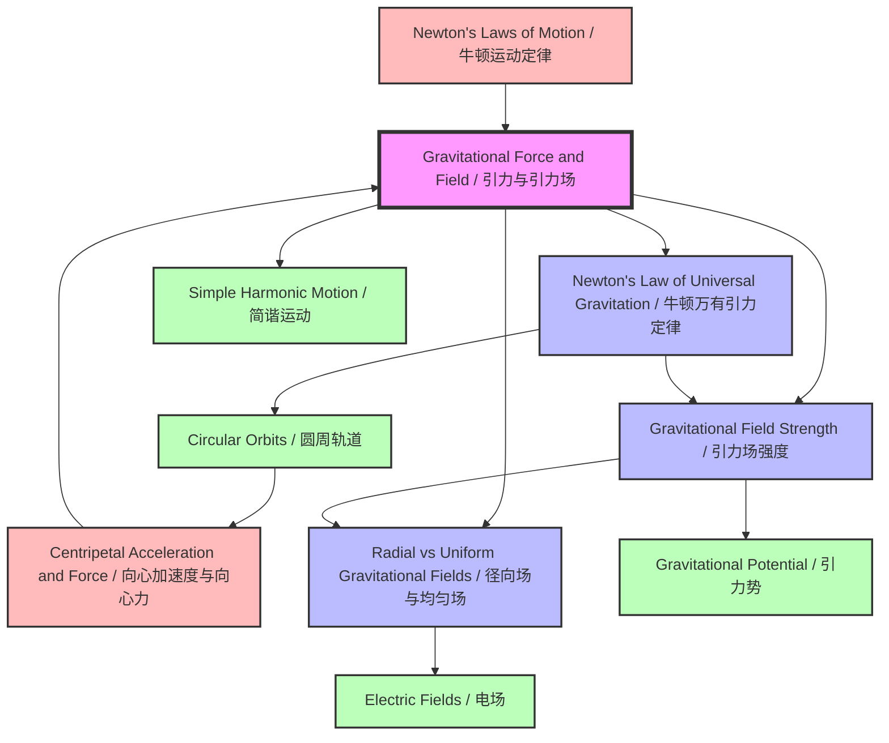

# Gravitational Force and Field / 引力与引力场

---

# 1. Overview / 概述

**English:**
This topic explores the fundamental force that governs the motion of celestial bodies, keeps planets in orbit, and determines the weight we feel on Earth. Gravitational force is one of the four fundamental forces of nature, and at A-Level, we focus on Newton's law of universal gravitation and the concept of gravitational fields. This topic bridges classical mechanics with astrophysics, providing the foundation for understanding planetary motion, satellite orbits, and the structure of the universe.

In both Cambridge 9702 and Edexcel IAL syllabuses, gravitational fields are a core A2 topic. You will learn to calculate gravitational forces between masses, define and measure gravitational field strength, and distinguish between radial and uniform fields. This knowledge is essential for later topics such as [[Gravitational Potential]], [[Circular Orbits]], and [[Simple Harmonic Motion]].

Real-world applications include satellite communication, GPS technology, space exploration, and understanding tides. In examinations, this topic frequently appears in structured questions requiring calculations, graph analysis, and explanations of field concepts. Mastery of this topic is crucial for achieving high grades in A-Level Physics.

**中文：**
本主题研究支配天体运动、维持行星轨道并决定地球重力的基本力。引力是自然界四种基本力之一，在A-Level阶段，我们重点学习牛顿万有引力定律和引力场的概念。本主题将经典力学与天体物理学联系起来，为理解行星运动、卫星轨道和宇宙结构奠定基础。

在剑桥9702和爱德思IAL考试大纲中，引力场是A2阶段的核心主题。你将学习计算质量之间的引力，定义和测量引力场强度，并区分径向场和均匀场。这些知识对于后续学习[[引力势]]、[[圆周轨道]]和[[简谐运动]]等主题至关重要。

实际应用包括卫星通信、GPS技术、太空探索和理解潮汐现象。在考试中，本主题经常出现在需要计算、图表分析和场概念解释的结构化问题中。掌握本主题对于在A-Level物理中取得高分至关重要。

---

# 2. Syllabus Learning Objectives / 考纲学习目标

| CAIE 9702 | Edexcel IAL |
|-----------|-------------|
| 15.1(a) State Newton's law of universal gravitation | 6.1 Understand the concept of a gravitational field as a region where a mass experiences a force |
| 15.1(b) Use the equation $F = \frac{Gm_1 m_2}{r^2}$ | 6.2 Use the equation $F = \frac{Gm_1 m_2}{r^2}$ |
| 15.1(c) Define gravitational field strength $g = \frac{F}{m}$ | 6.3 Define gravitational field strength $g = \frac{F}{m}$ |
| 15.1(d) Use $g = \frac{GM}{r^2}$ for point masses | 6.4 Use $g = \frac{GM}{r^2}$ for point and spherical masses |
| — | 6.5 Understand the concept of uniform gravitational fields near Earth's surface |

**Examiner Expectations / 考官期望:**

**English:**
- Candidates must be able to state Newton's law of universal gravitation in words and equation form.
- Candidates must understand that gravitational force is always attractive and acts along the line joining the centres of masses.
- Candidates must distinguish between gravitational field strength ($g$) and gravitational force ($F$).
- Candidates must be able to derive $g = \frac{GM}{r^2}$ from $F = \frac{Gm_1 m_2}{r^2}$ and $F = mg$.
- Candidates must recognise that for a uniform field, $g$ is constant (e.g., near Earth's surface).
- Candidates must be able to calculate gravitational force between spherical objects using centre-to-centre distance.

**中文：**
- 考生必须能够用文字和公式形式陈述牛顿万有引力定律。
- 考生必须理解引力总是吸引力，并沿质量中心连线方向作用。
- 考生必须区分引力场强度（$g$）和引力（$F$）。
- 考生必须能够从 $F = \frac{Gm_1 m_2}{r^2}$ 和 $F = mg$ 推导出 $g = \frac{GM}{r^2}$。
- 考生必须认识到在均匀场中，$g$ 是常数（例如地球表面附近）。
- 考生必须能够使用中心到中心的距离计算球形物体之间的引力。

> 📋 **CIE Only:** CIE requires explicit statement of Newton's law of universal gravitation in words. The constant $G = 6.67 \times 10^{-11} \, \text{N m}^2 \text{kg}^{-2}$ is provided in data booklet. CIE also expects candidates to understand that gravitational field strength is a vector quantity.

> 📋 **Edexcel Only:** Edexcel explicitly requires understanding of uniform gravitational fields near Earth's surface. Edexcel also expects candidates to apply the inverse square law to gravitational fields and compare with electric fields. The concept of gravitational field lines is assessed in Edexcel but not explicitly in CIE.

---

# 3. Core Definitions / 核心定义

| Term (EN/CN) | Definition (EN) | Definition (CN) | Common Mistakes / 常见错误 |
|--------------|-----------------|-----------------|---------------------------|
| **Gravitational Force / 引力** | The attractive force between any two objects with mass, proportional to the product of their masses and inversely proportional to the square of the distance between their centres. | 任何两个有质量的物体之间的吸引力，与它们质量的乘积成正比，与它们中心之间距离的平方成反比。 | Confusing gravitational force with weight; forgetting that force is always attractive |
| **Newton's Law of Universal Gravitation / 牛顿万有引力定律** | Every particle of matter in the universe attracts every other particle with a force that is directly proportional to the product of their masses and inversely proportional to the square of the distance between their centres. | 宇宙中每个物质粒子都吸引其他每个粒子，力与它们质量的乘积成正比，与它们中心之间距离的平方成反比。 | Omitting "centre-to-centre" distance; using diameter instead of radius |
| **Gravitational Field / 引力场** | A region of space in which a mass experiences a gravitational force. | 一个质量在其中会受到引力作用的空间区域。 | Thinking field is a force rather than a region |
| **Gravitational Field Strength ($g$) / 引力场强度** | The gravitational force per unit mass experienced by a small test mass placed at a point in the field. | 放置在场中某点的测试质量所受到的每单位质量的引力。 | Confusing $g$ with $G$; forgetting $g$ is a vector |
| **Point Mass / 质点** | An idealised mass concentrated at a single point in space. | 理想化的质量集中在空间中的一个点上。 | Applying point mass equations to extended objects without checking |
| **Inverse Square Law / 平方反比定律** | A physical law stating that a specified physical quantity is inversely proportional to the square of the distance from the source. | 物理定律，规定特定物理量与距源距离的平方成反比。 | Forgetting the square; using linear inverse relationship |
| **Radial Field / 径向场** | A field where field lines radiate from a central point, with strength decreasing as $1/r^2$. | 场线从中心点辐射的场，强度按 $1/r^2$ 减小。 | Confusing with uniform field; thinking field lines are parallel |
| **Uniform Field / 均匀场** | A field where the field strength is constant in magnitude and direction throughout the region. | 在整个区域内场强大小和方向都恒定的场。 | Applying uniform field equations to radial fields |

---

# 4. Key Concepts Explained / 关键概念详解

## 4.1 Newton's Law of Universal Gravitation / 牛顿万有引力定律

### Explanation / 解释
**English:**
Newton's law of universal gravitation states that every particle in the universe attracts every other particle with a force that is directly proportional to the product of their masses and inversely proportional to the square of the distance between their centres. Mathematically:

$$F = \frac{G m_1 m_2}{r^2}$$

where $G = 6.67 \times 10^{-11} \, \text{N m}^2 \text{kg}^{-2}$ is the universal gravitational constant, $m_1$ and $m_2$ are the masses, and $r$ is the centre-to-centre distance.

This law is fundamental to understanding [[Newton's Laws of Motion]] applied to celestial bodies. The force is always attractive, acting along the line joining the centres of the two masses. For spherical objects, the distance $r$ is measured from centre to centre, not from surface to surface.

**中文：**
牛顿万有引力定律指出，宇宙中每个粒子都吸引其他每个粒子，力与它们质量的乘积成正比，与它们中心之间距离的平方成反比。数学表达式为：

$$F = \frac{G m_1 m_2}{r^2}$$

其中 $G = 6.67 \times 10^{-11} \, \text{N m}^2 \text{kg}^{-2}$ 是万有引力常数，$m_1$ 和 $m_2$ 是质量，$r$ 是中心到中心的距离。

这一定律是理解[[牛顿运动定律]]应用于天体的基础。引力总是吸引力，沿两个质量中心连线方向作用。对于球形物体，距离 $r$ 是从中心到中心测量的，而不是从表面到表面。

### Physical Meaning / 物理意义
**English:**
The law explains why planets orbit the Sun, why the Moon orbits Earth, and why we feel weight. The gravitational force between two objects is extremely small unless at least one of the masses is very large (like a planet). This is why we don't feel gravitational attraction between everyday objects.

**中文：**
该定律解释了行星为什么绕太阳运行，月球为什么绕地球运行，以及我们为什么感到重量。两个物体之间的引力非常小，除非至少其中一个质量非常大（如行星）。这就是为什么我们感觉不到日常物体之间的引力。

### Common Misconceptions / 常见误区
1. **Confusing $G$ and $g$:** $G$ is a universal constant ($6.67 \times 10^{-11} \, \text{N m}^2 \text{kg}^{-2}$), while $g$ is gravitational field strength ($9.81 \, \text{N kg}^{-1}$ on Earth). They are completely different quantities.
2. **Using surface-to-surface distance:** For spherical objects, always use centre-to-centre distance.
3. **Forgetting the inverse square:** The force decreases with $r^2$, not $r$.
4. **Thinking gravitational force can be repulsive:** Gravitational force is always attractive.

### Exam Tips / 考试提示
**English:**
- Always state the law in words before writing the equation.
- When calculating force between Earth and a satellite, remember $r$ is the distance from Earth's centre to the satellite.
- Pay attention to units: masses in kg, distance in m, force in N.
- CIE often asks to "state" the law (1-2 marks) and then "use" it in calculations.

**中文：**
- 在写方程之前，始终用文字陈述定律。
- 计算地球与卫星之间的力时，记住 $r$ 是从地球中心到卫星的距离。
- 注意单位：质量用kg，距离用m，力用N。
- CIE常要求"陈述"定律（1-2分），然后在计算中"使用"它。

---

## 4.2 Gravitational Field Strength / 引力场强度

### Explanation / 解释
**English:**
Gravitational field strength ($g$) at a point is defined as the gravitational force per unit mass experienced by a small test mass placed at that point:

$$g = \frac{F}{m}$$

where $F$ is the gravitational force on the test mass $m$. The unit of $g$ is $\text{N kg}^{-1}$ (equivalent to $\text{m s}^{-2}$).

For a point mass $M$, the gravitational field strength at a distance $r$ from its centre is:

$$g = \frac{GM}{r^2}$$

This equation is derived by combining $F = \frac{GMm}{r^2}$ with $F = mg$. The field strength is a vector quantity, always directed towards the centre of the mass creating the field.

**中文：**
引力场强度（$g$）定义为放置在场中某点的测试质量所受到的每单位质量的引力：

$$g = \frac{F}{m}$$

其中 $F$ 是测试质量 $m$ 受到的引力。$g$ 的单位是 $\text{N kg}^{-1}$（等同于 $\text{m s}^{-2}$）。

对于质点 $M$，距离其中心 $r$ 处的引力场强度为：

$$g = \frac{GM}{r^2}$$

该方程通过结合 $F = \frac{GMm}{r^2}$ 和 $F = mg$ 推导得出。场强是矢量，始终指向产生场的质量中心。

### Physical Meaning / 物理意义
**English:**
Gravitational field strength tells us how strong gravity is at a particular location. On Earth's surface, $g \approx 9.81 \, \text{N kg}^{-1}$, meaning each kilogram of mass experiences about 9.81 N of gravitational force. As you move away from Earth, $g$ decreases according to the inverse square law.

**中文：**
引力场强度告诉我们特定位置的引力有多强。在地球表面，$g \approx 9.81 \, \text{N kg}^{-1}$，意味着每千克质量受到约9.81 N的引力。随着远离地球，$g$ 按照平方反比定律减小。

### Common Misconceptions / 常见误区
1. **Confusing $g$ with $G$:** $g$ varies with location; $G$ is constant everywhere.
2. **Forgetting $g$ is a vector:** $g$ has both magnitude and direction.
3. **Using $g = \frac{GM}{r^2}$ for non-point masses:** This equation only applies to point masses or spherical objects where $r$ is measured from the centre.
4. **Thinking $g$ is constant everywhere:** $g$ decreases with height above Earth's surface.

### Exam Tips / 考试提示
**English:**
- Derive $g = \frac{GM}{r^2}$ from $F = \frac{GMm}{r^2}$ and $F = mg$ — this is a common exam question.
- Remember that $g$ on Earth's surface is approximately $9.81 \, \text{N kg}^{-1}$.
- For questions about gravitational field strength inside a planet, the field strength decreases linearly to zero at the centre.
- Edexcel often asks to compare gravitational field strength at different distances.

**中文：**
- 从 $F = \frac{GMm}{r^2}$ 和 $F = mg$ 推导 $g = \frac{GM}{r^2}$ — 这是常见的考试题目。
- 记住地球表面的 $g$ 约为 $9.81 \, \text{N kg}^{-1}$。
- 关于行星内部引力场强度的问题，场强线性减小，在中心处为零。
- 爱德思常要求比较不同距离处的引力场强度。

---

## 4.3 Radial vs Uniform Gravitational Fields / 径向场与均匀场

### Explanation / 解释
**English:**
Gravitational fields can be classified into two types:

**Radial Field:** Created by a point mass or spherical object. Field lines radiate from the centre of mass. The field strength decreases with distance according to $g \propto \frac{1}{r^2}$. Field lines are directed towards the centre of mass. This is the general case for all gravitational fields.

**Uniform Field:** An approximation used near the surface of a large spherical object (like Earth). Over small distances compared to Earth's radius, the field lines are approximately parallel and equally spaced. The field strength $g$ is approximately constant. This is why we use $g = 9.81 \, \text{N kg}^{-1}$ for objects near Earth's surface.

**中文：**
引力场可分为两种类型：

**径向场：** 由质点或球形物体产生。场线从质量中心辐射。场强随距离按 $g \propto \frac{1}{r^2}$ 减小。场线指向质量中心。这是所有引力场的一般情况。

**均匀场：** 在大球形物体（如地球）表面附近使用的近似。与地球半径相比，在小距离上，场线近似平行且等间距。场强 $g$ 近似恒定。这就是为什么对地球表面附近的物体使用 $g = 9.81 \, \text{N kg}^{-1}$。

### Physical Meaning / 物理意义
**English:**
The distinction between radial and uniform fields is important for problem-solving. For satellite orbits (large distances), use the radial field equations. For objects falling near Earth's surface (small distances), use the uniform field approximation with constant $g$.

**中文：**
径向场和均匀场之间的区别对于解题很重要。对于卫星轨道（大距离），使用径向场方程。对于地球表面附近下落的物体（小距离），使用恒定 $g$ 的均匀场近似。

### Common Misconceptions / 常见误区
1. **Thinking Earth's field is truly uniform:** It's only an approximation for small distances.
2. **Applying uniform field equations to orbital problems:** For orbits, always use radial field equations.
3. **Confusing field line patterns:** Radial fields have converging lines; uniform fields have parallel lines.

### Exam Tips / 考试提示
**English:**
- CIE expects you to know that near Earth's surface, $g$ is approximately constant.
- Edexcel explicitly tests the concept of uniform fields and may ask you to sketch field lines.
- When a question mentions "near Earth's surface," assume uniform field unless stated otherwise.
- For questions about satellites or planets, assume radial field.

**中文：**
- CIE要求你知道地球表面附近 $g$ 近似恒定。
- 爱德思明确测试均匀场的概念，可能要求你画出场线。
- 当问题提到"地球表面附近"时，除非另有说明，假设为均匀场。
- 对于卫星或行星的问题，假设为径向场。

> 📷 **IMAGE PROMPT — GF-01: Comparison of Radial and Uniform Gravitational Fields**
>
> A side-by-side comparison diagram. Left side: Radial field showing a central sphere (Earth) with arrowed field lines radiating outward from the centre, converging towards the sphere. Right side: Uniform field showing parallel, equally spaced vertical arrowed field lines near a flat surface. Labels in English and Chinese. Clean white background, educational style, vector graphics aesthetic.

---

# 5. Essential Equations / 核心公式

## 5.1 Newton's Law of Universal Gravitation / 牛顿万有引力定律

**Equation / 公式:**
$$F = \frac{G m_1 m_2}{r^2}$$

**Variables / 变量:**
| Symbol (符号) | Meaning (EN) | Meaning (CN) | Unit (单位) |
|--------------|-------------|-------------|------------|
| $F$ | Gravitational force between two masses | 两个质量之间的引力 | N |
| $G$ | Universal gravitational constant ($6.67 \times 10^{-11}$) | 万有引力常数 | $\text{N m}^2 \text{kg}^{-2}$ |
| $m_1, m_2$ | Masses of the two objects | 两个物体的质量 | kg |
| $r$ | Distance between centres of masses | 质量中心之间的距离 | m |

**Derivation / 推导:**
**English:**
Newton proposed that gravitational force is proportional to the product of masses and inversely proportional to the square of distance:
$$F \propto \frac{m_1 m_2}{r^2}$$
Introducing the constant of proportionality $G$:
$$F = \frac{G m_1 m_2}{r^2}$$

**中文：**
牛顿提出引力与质量的乘积成正比，与距离的平方成反比：
$$F \propto \frac{m_1 m_2}{r^2}$$
引入比例常数 $G$：
$$F = \frac{G m_1 m_2}{r^2}$$

**Conditions / 适用条件:**
**English:**
- Applies to point masses or spherical objects (where $r$ is centre-to-centre distance)
- Valid for any two masses in the universe
- Assumes no other forces are acting

**中文：**
- 适用于质点或球形物体（其中 $r$ 是中心到中心的距离）
- 对宇宙中任意两个质量都有效
- 假设没有其他力作用

**Limitations / 局限性:**
**English:**
- Does not apply at very small distances (quantum scale) where quantum gravity is needed
- Does not apply at very high speeds (relativistic effects)
- Not valid for non-spherical objects unless using integration

**中文：**
- 不适用于非常小的距离（量子尺度），需要量子引力
- 不适用于非常高的速度（相对论效应）
- 不适用于非球形物体，除非使用积分

**Rearrangements / 变形:**
**English:**
1. To find one mass: $m_1 = \frac{F r^2}{G m_2}$
2. To find distance: $r = \sqrt{\frac{G m_1 m_2}{F}}$
3. To find $G$: $G = \frac{F r^2}{m_1 m_2}$

**中文：**
1. 求一个质量：$m_1 = \frac{F r^2}{G m_2}$
2. 求距离：$r = \sqrt{\frac{G m_1 m_2}{F}}$
3. 求 $G$：$G = \frac{F r^2}{m_1 m_2}$

---

## 5.2 Gravitational Field Strength / 引力场强度

**Equation / 公式:**
$$g = \frac{F}{m}$$

**Variables / 变量:**
| Symbol (符号) | Meaning (EN) | Meaning (CN) | Unit (单位) |
|--------------|-------------|-------------|------------|
| $g$ | Gravitational field strength | 引力场强度 | $\text{N kg}^{-1}$ or $\text{m s}^{-2}$ |
| $F$ | Gravitational force on test mass | 测试质量受到的引力 | N |
| $m$ | Test mass | 测试质量 | kg |

**Derivation / 推导:**
**English:**
By definition, gravitational field strength is force per unit mass:
$$g = \frac{F}{m}$$
This is a definition, not derived from other equations.

**中文：**
根据定义，引力场强度是单位质量所受的力：
$$g = \frac{F}{m}$$
这是一个定义，不是从其他方程推导出来的。

**Conditions / 适用条件:**
**English:**
- The test mass must be small enough not to disturb the field
- Valid for any point in any gravitational field

**中文：**
- 测试质量必须足够小，以免干扰场
- 对任何引力场中的任何点都有效

**Limitations / 局限性:**
**English:**
- The test mass must be small compared to the mass creating the field
- Does not account for relativistic effects

**中文：**
- 测试质量必须远小于产生场的质量
- 不考虑相对论效应

**Rearrangements / 变形:**
**English:**
1. To find force: $F = mg$
2. To find mass: $m = \frac{F}{g}$

**中文：**
1. 求力：$F = mg$
2. 求质量：$m = \frac{F}{g}$

---

## 5.3 Gravitational Field Strength for a Point Mass / 质点的引力场强度

**Equation / 公式:**
$$g = \frac{GM}{r^2}$$

**Variables / 变量:**
| Symbol (符号) | Meaning (EN) | Meaning (CN) | Unit (单位) |
|--------------|-------------|-------------|------------|
| $g$ | Gravitational field strength at distance $r$ | 距离 $r$ 处的引力场强度 | $\text{N kg}^{-1}$ |
| $G$ | Universal gravitational constant | 万有引力常数 | $\text{N m}^2 \text{kg}^{-2}$ |
| $M$ | Mass creating the field | 产生场的质量 | kg |
| $r$ | Distance from centre of mass | 距质量中心的距离 | m |

**Derivation / 推导:**
**English:**
Start with Newton's law of universal gravitation:
$$F = \frac{GMm}{r^2}$$
where $m$ is a test mass. By definition, $g = \frac{F}{m}$:
$$g = \frac{F}{m} = \frac{GMm}{r^2} \cdot \frac{1}{m} = \frac{GM}{r^2}$$

**中文：**
从牛顿万有引力定律开始：
$$F = \frac{GMm}{r^2}$$
其中 $m$ 是测试质量。根据定义，$g = \frac{F}{m}$：
$$g = \frac{F}{m} = \frac{GMm}{r^2} \cdot \frac{1}{m} = \frac{GM}{r^2}$$

**Conditions / 适用条件:**
**English:**
- Applies to point masses or spherical objects
- $r$ must be measured from the centre of mass
- Valid for points outside the mass ($r \geq R$, where $R$ is radius of the mass)

**中文：**
- 适用于质点或球形物体
- $r$ 必须从质量中心测量
- 适用于质量外部的点（$r \geq R$，其中 $R$ 是质量的半径）

**Limitations / 局限性:**
**English:**
- Does not apply inside the mass (for $r < R$, a different relationship applies)
- Assumes the mass is spherically symmetric

**中文：**
- 不适用于质量内部（对于 $r < R$，适用不同的关系）
- 假设质量是球对称的

**Rearrangements / 变形:**
**English:**
1. To find mass: $M = \frac{g r^2}{G}$
2. To find distance: $r = \sqrt{\frac{GM}{g}}$

**中文：**
1. 求质量：$M = \frac{g r^2}{G}$
2. 求距离：$r = \sqrt{\frac{GM}{g}}$

---

# 6. Graphs and Relationships / 图表与关系

## 6.1 Gravitational Force vs Distance / 引力与距离的关系

### Axes / 坐标轴
**English:** x-axis: Distance $r$ (m); y-axis: Gravitational force $F$ (N)
**中文：** x轴：距离 $r$ (m)；y轴：引力 $F$ (N)

### Shape / 形状
**English:** A curve showing $F \propto \frac{1}{r^2}$. The force decreases rapidly as distance increases. The curve approaches zero as $r \to \infty$ and approaches infinity as $r \to 0$.
**中文：** 显示 $F \propto \frac{1}{r^2}$ 的曲线。力随着距离增加而迅速减小。当 $r \to \infty$ 时曲线趋近于零，当 $r \to 0$ 时趋近于无穷大。

### Gradient Meaning / 斜率含义
**English:** The gradient of $F$ vs $r$ is $\frac{dF}{dr} = -\frac{2Gm_1 m_2}{r^3}$, which represents the rate of change of force with distance. The negative sign indicates force decreases as distance increases.
**中文：** $F$ 对 $r$ 的梯度是 $\frac{dF}{dr} = -\frac{2Gm_1 m_2}{r^3}$，表示力随距离的变化率。负号表示力随距离增加而减小。

### Area Meaning / 面积含义
**English:** The area under the $F$ vs $r$ graph represents work done against gravitational force, which relates to [[Gravitational Potential]].
**中文：** $F$ 对 $r$ 图下的面积表示克服引力所做的功，与[[引力势]]相关。

### Exam Interpretation / 考试解读
**English:**
- CIE may ask to sketch this graph and explain its shape.
- Edexcel may ask to compare this with electric force graphs.
- Common question: "Explain why the force approaches zero at large distances."

**中文：**
- CIE可能要求画出此图并解释其形状。
- 爱德思可能要求将其与电力图进行比较。
- 常见问题："解释为什么在大距离处力趋近于零。"

### Common Questions / 常见问题
**English:**
1. "Sketch a graph showing how gravitational force varies with distance between two masses."
2. "Use the graph to determine the force at a specific distance."
3. "Explain the significance of the inverse square relationship."

**中文：**
1. "画出引力随两个质量之间距离变化的图。"
2. "使用图表确定特定距离处的力。"
3. "解释平方反比关系的意义。"

---

## 6.2 Gravitational Field Strength vs Distance / 引力场强度与距离的关系

### Axes / 坐标轴
**English:** x-axis: Distance $r$ (m); y-axis: Gravitational field strength $g$ (N kg⁻¹)
**中文：** x轴：距离 $r$ (m)；y轴：引力场强度 $g$ (N kg⁻¹)

### Shape / 形状
**English:** For $r \geq R$ (outside the mass): $g \propto \frac{1}{r^2}$, a decreasing curve. For $r < R$ (inside the mass): $g \propto r$, a linear increase from zero at the centre to maximum at the surface.
**中文：** 对于 $r \geq R$（质量外部）：$g \propto \frac{1}{r^2}$，递减曲线。对于 $r < R$（质量内部）：$g \propto r$，从中心为零线性增加到表面最大。

### Gradient Meaning / 斜率含义
**English:** Outside: $\frac{dg}{dr} = -\frac{2GM}{r^3}$. Inside: $\frac{dg}{dr} = \frac{GM}{R^3}$ (constant for uniform density).
**中文：** 外部：$\frac{dg}{dr} = -\frac{2GM}{r^3}$。内部：$\frac{dg}{dr} = \frac{GM}{R^3}$（均匀密度时为常数）。

### Area Meaning / 面积含义
**English:** The area under the $g$ vs $r$ graph relates to gravitational potential difference.
**中文：** $g$ 对 $r$ 图下的面积与引力势差相关。

### Exam Interpretation / 考试解读
**English:**
- CIE may ask to sketch $g$ vs $r$ for a planet.
- Edexcel may ask to explain why $g$ is maximum at the surface.
- Common question: "Explain the shape of the graph inside and outside the planet."

**中文：**
- CIE可能要求画出行星的 $g$ 对 $r$ 图。
- 爱德思可能要求解释为什么 $g$ 在表面最大。
- 常见问题："解释行星内部和外部图形的形状。"

### Common Questions / 常见问题
**English:**
1. "Sketch a graph of gravitational field strength against distance from the centre of a planet."
2. "Calculate the value of $g$ at a given height above Earth's surface."
3. "Explain why $g$ decreases linearly inside a uniform planet."

**中文：**
1. "画出引力场强度随距行星中心距离变化的图。"
2. "计算地球表面上方给定高度处的 $g$ 值。"
3. "解释为什么在均匀行星内部 $g$ 线性减小。"

> 📷 **IMAGE PROMPT — GF-02: Gravitational Field Strength vs Distance from Centre of Planet**
>
> A graph showing gravitational field strength $g$ on the y-axis against distance $r$ from centre on the x-axis. For $r < R$ (inside planet): linear increase from (0,0) to (R, g_surface). For $r > R$ (outside): inverse square decrease from (R, g_surface) approaching zero as $r \to \infty$. Labels: "Inside planet" and "Outside planet" in English and Chinese. Clean graph paper background, educational style.

---

# 7. Required Diagrams / 必备图表

## 7.1 Gravitational Field Lines Around a Point Mass / 质点周围的引力场线

### Description / 描述
**English:**
A diagram showing a central point mass with arrowed lines radiating outward in all directions. The lines are closer together near the mass (indicating stronger field) and spread out further away (indicating weaker field). Arrows point towards the centre of mass, showing the direction of gravitational force on a test mass.

**中文：**
显示中心质点带有向所有方向辐射的箭头线的图。线在质量附近更密集（表示更强的场），在远处更分散（表示更弱的场）。箭头指向质量中心，显示测试质量所受引力的方向。

### Image Prompt / 图片生成提示
> 📷 **IMAGE PROMPT — GF-03: Gravitational Field Lines Around a Point Mass**
>
> A clean educational diagram showing a central sphere (labelled "Mass M / 质量 M") with arrowed field lines radiating outward in all directions. Lines are closer together near the sphere and spread out further away. Arrows point towards the centre. Labels: "Radial field / 径向场", "Stronger field / 较强场" near sphere, "Weaker field / 较弱场" far from sphere. White background, vector graphics, professional textbook style.

### Labels Required / 需要标注
| English | 中文 |
|---------|------|
| Mass M | 质量 M |
| Radial field | 径向场 |
| Stronger field | 较强场 |
| Weaker field | 较弱场 |
| Direction of force on test mass | 测试质量受力方向 |

### Exam Importance / 考试重要性
**English:**
This diagram is essential for understanding the concept of gravitational fields. CIE may ask to sketch field lines for a point mass. Edexcel may ask to compare gravitational field lines with electric field lines.

**中文：**
此图对于理解引力场概念至关重要。CIE可能要求画出质点的场线。爱德思可能要求比较引力场线和电场线。

---

## 7.2 Uniform Gravitational Field Near Earth's Surface / 地球表面附近的均匀引力场

### Description / 描述
**English:**
A diagram showing a flat section of Earth's surface with parallel, equally spaced vertical arrowed lines pointing downward. The lines are all the same length and spacing, indicating constant field strength. A small test mass is shown near the surface.

**中文：**
显示地球表面平坦部分的图，带有平行、等间距的垂直箭头线指向下方。所有线的长度和间距相同，表示恒定的场强。表面附近显示一个小测试质量。

### Image Prompt / 图片生成提示
> 📷 **IMAGE PROMPT — GF-04: Uniform Gravitational Field Near Earth's Surface**
>
> A diagram showing a flat horizontal line representing Earth's surface. Above it, parallel vertical arrowed lines of equal length and equal spacing, all pointing downward. Labels: "Uniform field / 均匀场", "Constant g / 恒定 g", "Earth's surface / 地球表面". A small sphere labelled "Test mass m / 测试质量 m" is shown. Clean educational style, white background.

### Labels Required / 需要标注
| English | 中文 |
|---------|------|
| Earth's surface | 地球表面 |
| Uniform field | 均匀场 |
| Constant g | 恒定 g |
| Test mass m | 测试质量 m |
| Direction of gravitational force | 引力方向 |

### Exam Importance / 考试重要性
**English:**
This diagram is used to illustrate the approximation of uniform fields near Earth's surface. Edexcel explicitly tests this concept. It helps explain why we can use $g = 9.81 \, \text{N kg}^{-1}$ for objects near Earth.

**中文：**
此图用于说明地球表面附近均匀场的近似。爱德思明确测试此概念。它有助于解释为什么对地球附近的物体可以使用 $g = 9.81 \, \text{N kg}^{-1}$。

---

## 7.3 Gravitational Force Between Two Spherical Masses / 两个球形质量之间的引力

### Description / 描述
**English:**
A diagram showing two spherical masses (e.g., Earth and Moon) with their centres marked. A double-headed arrow between the centres is labelled $r$ (centre-to-centre distance). Arrows on each sphere show the attractive force acting along the line joining centres.

**中文：**
显示两个球形质量（例如地球和月球）的图，标出它们的中心。中心之间的双箭头标为 $r$（中心到中心距离）。每个球体上的箭头显示沿中心连线作用的吸引力。

### Image Prompt / 图片生成提示
> 📷 **IMAGE PROMPT — GF-05: Gravitational Force Between Two Spherical Masses**
>
> A diagram showing two spheres (Earth and Moon) separated by distance. Centres marked with dots. A double-headed arrow between centres labelled "r / 距离 (centre-to-centre / 中心到中心)". Arrows on each sphere pointing towards the other, labelled "F / 引力". Labels: "Mass M₁ / 质量 M₁" (Earth), "Mass M₂ / 质量 M₂" (Moon). Clean educational style, space background optional.

### Labels Required / 需要标注
| English | 中文 |
|---------|------|
| Mass M₁ | 质量 M₁ |
| Mass M₂ | 质量 M₂ |
| r (centre-to-centre distance) | r（中心到中心距离）|
| Gravitational force F | 引力 F |
| Direction of force | 力的方向 |

### Exam Importance / 考试重要性
**English:**
This diagram is crucial for understanding how to apply Newton's law of universal gravitation to real objects. It emphasises that distance is measured centre-to-centre, not surface-to-surface.

**中文：**
此图对于理解如何将牛顿万有引力定律应用于实际物体至关重要。它强调距离是从中心到中心测量的，而不是从表面到表面。

---

# 8. Worked Examples / 典型例题

## Example 1: Gravitational Force Between Earth and Moon / 地球与月球之间的引力

### Question / 题目
**English:**
Earth has mass $M_E = 5.97 \times 10^{24} \, \text{kg}$ and the Moon has mass $M_M = 7.35 \times 10^{22} \, \text{kg}$. The mean distance between their centres is $3.84 \times 10^8 \, \text{m}$. Calculate:
(a) The gravitational force between Earth and the Moon.
(b) The gravitational field strength at the Moon's position due to Earth alone.
(c) The gravitational field strength at Earth's surface due to Earth alone (Earth's radius = $6.37 \times 10^6 \, \text{m}$).

**中文：**
地球质量 $M_E = 5.97 \times 10^{24} \, \text{kg}$，月球质量 $M_M = 7.35 \times 10^{22} \, \text{kg}$。它们中心之间的平均距离为 $3.84 \times 10^8 \, \text{m}$。计算：
(a) 地球与月球之间的引力。
(b) 仅由地球在月球位置产生的引力场强度。
(c) 仅由地球在地球表面产生的引力场强度（地球半径 = $6.37 \times 10^6 \, \text{m}$）。

### Image Prompt / 图片提示
> 📷 **IMAGE PROMPT — GF-06: Earth-Moon System Diagram for Example 1**
>
> A diagram showing Earth (large sphere) and Moon (smaller sphere) separated by distance. Centres marked. Distance labelled "r = 3.84 × 10⁸ m". Earth radius labelled "R_E = 6.37 × 10⁶ m". Labels in English and Chinese. Clean educational style.

### Solution / 解答

**Part (a): Gravitational force**

**English:**
Use Newton's law of universal gravitation:
$$F = \frac{G M_E M_M}{r^2}$$

Substitute values:
$$F = \frac{(6.67 \times 10^{-11})(5.97 \times 10^{24})(7.35 \times 10^{22})}{(3.84 \times 10^8)^2}$$

Calculate numerator:
$$(6.67 \times 10^{-11})(5.97 \times 10^{24})(7.35 \times 10^{22}) = 2.93 \times 10^{37}$$

Calculate denominator:
$$(3.84 \times 10^8)^2 = 1.47 \times 10^{17}$$

$$F = \frac{2.93 \times 10^{37}}{1.47 \times 10^{17}} = 1.99 \times 10^{20} \, \text{N}$$

**中文：**
使用牛顿万有引力定律：
$$F = \frac{G M_E M_M}{r^2}$$

代入数值：
$$F = \frac{(6.67 \times 10^{-11})(5.97 \times 10^{24})(7.35 \times 10^{22})}{(3.84 \times 10^8)^2}$$

计算分子：
$$(6.67 \times 10^{-11})(5.97 \times 10^{24})(7.35 \times 10^{22}) = 2.93 \times 10^{37}$$

计算分母：
$$(3.84 \times 10^8)^2 = 1.47 \times 10^{17}$$

$$F = \frac{2.93 \times 10^{37}}{1.47 \times 10^{17}} = 1.99 \times 10^{20} \, \text{N}$$

**Part (b): Gravitational field strength at Moon's position**

**English:**
Use $g = \frac{GM}{r^2}$ where $M = M_E$ and $r$ is Earth-Moon distance:
$$g = \frac{(6.67 \times 10^{-11})(5.97 \times 10^{24})}{(3.84 \times 10^8)^2}$$

$$g = \frac{3.98 \times 10^{14}}{1.47 \times 10^{17}} = 2.71 \times 10^{-3} \, \text{N kg}^{-1}$$

**中文：**
使用 $g = \frac{GM}{r^2}$，其中 $M = M_E$，$r$ 是地月距离：
$$g = \frac{(6.67 \times 10^{-11})(5.97 \times 10^{24})}{(3.84 \times 10^8)^2}$$

$$g = \frac{3.98 \times 10^{14}}{1.47 \times 10^{17}} = 2.71 \times 10^{-3} \, \text{N kg}^{-1}$$

**Part (c): Gravitational field strength at Earth's surface**

**English:**
Use $g = \frac{GM_E}{R_E^2}$:
$$g = \frac{(6.67 \times 10^{-11})(5.97 \times 10^{24})}{(6.37 \times 10^6)^2}$$

$$g = \frac{3.98 \times 10^{14}}{4.06 \times 10^{13}} = 9.80 \, \text{N kg}^{-1}$$

**中文：**
使用 $g = \frac{GM_E}{R_E^2}$：
$$g = \frac{(6.67 \times 10^{-11})(5.97 \times 10^{24})}{(6.37 \times 10^6)^2}$$

$$g = \frac{3.98 \times 10^{14}}{4.06 \times 10^{13}} = 9.80 \, \text{N kg}^{-1}$$

### Final Answer / 最终答案
**Answer:**
(a) $F = 1.99 \times 10^{20} \, \text{N}$
(b) $g = 2.71 \times 10^{-3} \, \text{N kg}^{-1}$
(c) $g = 9.80 \, \text{N kg}^{-1}$

**答案：**
(a) $F = 1.99 \times 10^{20} \, \text{N}$
(b) $g = 2.71 \times 10^{-3} \, \text{N kg}^{-1}$
(c) $g = 9.80 \, \text{N kg}^{-1}$

### Examiner Notes / 考官点评
**English:**
- Part (a) tests direct application of Newton's law. Common mistake: forgetting to square $r$.
- Part (b) tests understanding that $g$ depends only on the mass creating the field, not the test mass.
- Part (c) confirms the familiar value of $g = 9.81 \, \text{N kg}^{-1}$. Note the slight difference due to rounding.
- Always check units: masses in kg, distances in m.

**中文：**
- 第(a)部分测试牛顿定律的直接应用。常见错误：忘记对 $r$ 平方。
- 第(b)部分测试理解 $g$ 仅取决于产生场的质量，而不是测试质量。
- 第(c)部分确认熟悉的 $g = 9.81 \, \text{N kg}^{-1}$ 值。注意由于四舍五入的微小差异。
- 始终检查单位：质量用kg，距离用m。

---

## Example 2: Gravitational Field Strength at Different Heights / 不同高度处的引力场强度

### Question / 题目
**English:**
A satellite orbits Earth at a height of $200 \, \text{km}$ above Earth's surface. Earth's radius is $6.37 \times 10^6 \, \text{m}$ and its mass is $5.97 \times 10^{24} \, \text{kg}$.
(a) Calculate the gravitational field strength at the satellite's position.
(b) Calculate the percentage decrease in $g$ compared to Earth's surface.
(c) Explain why the satellite still experiences Earth's gravity despite being above the atmosphere.

**中文：**
一颗卫星在地球表面上方 $200 \, \text{km}$ 的高度绕地球运行。地球半径为 $6.37 \times 10^6 \, \text{m}$，质量为 $5.97 \times 10^{24} \, \text{kg}$。
(a) 计算卫星位置处的引力场强度。
(b) 计算与地球表面相比 $g$ 的百分比减少。
(c) 解释为什么卫星尽管在大气层上方，仍然受到地球引力。

### Solution / 解答

**Part (a): Gravitational field strength at satellite's position**

**English:**
First, find the distance from Earth's centre to the satellite:
$$r = R_E + h = 6.37 \times 10^6 + 200 \times 10^3 = 6.57 \times 10^6 \, \text{m}$$

Use $g = \frac{GM_E}{r^2}$:
$$g = \frac{(6.67 \times 10^{-11})(5.97 \times 10^{24})}{(6.57 \times 10^6)^2}$$

$$g = \frac{3.98 \times 10^{14}}{4.32 \times 10^{13}} = 9.21 \, \text{N kg}^{-1}$$

**中文：**
首先，求从地球中心到卫星的距离：
$$r = R_E + h = 6.37 \times 10^6 + 200 \times 10^3 = 6.57 \times 10^6 \, \text{m}$$

使用 $g = \frac{GM_E}{r^2}$：
$$g = \frac{(6.67 \times 10^{-11})(5.97 \times 10^{24})}{(6.57 \times 10^6)^2}$$

$$g = \frac{3.98 \times 10^{14}}{4.32 \times 10^{13}} = 9.21 \, \text{N kg}^{-1}$$

**Part (b): Percentage decrease**

**English:**
At Earth's surface: $g_0 = 9.80 \, \text{N kg}^{-1}$
At satellite: $g = 9.21 \, \text{N kg}^{-1}$

Percentage decrease:
$$\frac{g_0 - g}{g_0} \times 100\% = \frac{9.80 - 9.21}{9.80} \times 100\% = 6.02\%$$

**中文：**
地球表面：$g_0 = 9.80 \, \text{N kg}^{-1}$
卫星处：$g = 9.21 \, \text{N kg}^{-1}$

百分比减少：
$$\frac{g_0 - g}{g_0} \times 100\% = \frac{9.80 - 9.21}{9.80} \times 100\% = 6.02\%$$

**Part (c): Explanation**

**English:**
Gravitational force is a fundamental force that acts over infinite distance. The satellite is still within Earth's gravitational field, even though it is above the atmosphere. The gravitational field strength decreases with distance according to the inverse square law, but never reaches zero. The satellite remains in orbit because it has sufficient tangential velocity to "fall around" Earth rather than falling straight down.

**中文：**
引力是一种基本力，作用距离无限远。卫星仍然在地球的引力场内，即使它在大气层上方。引力场强度根据平方反比定律随距离减小，但永远不会达到零。卫星保持在轨道上是因为它有足够的切向速度"绕地球下落"，而不是直接下落。

### Final Answer / 最终答案
**Answer:**
(a) $g = 9.21 \, \text{N kg}^{-1}$
(b) $6.02\%$ decrease
(c) Gravity acts over infinite distance; satellite has sufficient tangential velocity for orbit.

**答案：**
(a) $g = 9.21 \, \text{N kg}^{-1}$
(b) 减少 $6.02\%$
(c) 引力作用距离无限；卫星有足够的切向速度维持轨道。

### Examiner Notes / 考官点评
**English:**
- Part (a): Common mistake is using height instead of centre-to-centre distance. Always add Earth's radius.
- Part (b): Show working clearly. Use $g_0$ for surface value.
- Part (c): This is a common explanation question. Mention both the nature of gravity and orbital mechanics.
- Edexcel often asks "explain why" questions worth 2-3 marks.

**中文：**
- 第(a)部分：常见错误是使用高度而不是中心到中心的距离。始终加上地球半径。
- 第(b)部分：清晰展示计算过程。使用 $g_0$ 表示表面值。
- 第(c)部分：这是常见的解释题。同时提到引力的性质和轨道力学。
- 爱德思常问"解释为什么"的问题，值2-3分。

---

# 9. Past Paper Question Types / 历年真题题型

| Question Type / 题型 | Frequency / 频率 | Difficulty / 难度 | Past Paper References / 真题索引 |
|----------------------|------------------|------------------|-------------------------------|
| Calculation of gravitational force / 引力计算 | High | Medium | 📝 *待填入* |
| Calculation of gravitational field strength / 引力场强度计算 | High | Medium | 📝 *待填入* |
| Derivation of $g = GM/r^2$ / 推导 $g = GM/r^2$ | Medium | Medium | 📝 *待填入* |
| Graph sketching and interpretation / 图表绘制与解读 | Medium | High | 📝 *待填入* |
| Explanation of field concepts / 场概念解释 | Medium | Low-Medium | 📝 *待填入* |
| Comparison of radial and uniform fields / 径向场与均匀场比较 | Low | Medium | 📝 *待填入* |
| Practical design: measuring $G$ / 实验设计：测量 $G$ | Low | High | 📝 *待填入* |

> 📝 **题库整理中 / Question Bank Under Construction:** 具体试卷编号（如 9702/23/M/J/24 Q3）将在后续整理真题后填入上表。

**Common Command Words / 常见指令词:**

| English | 中文 | Expected Response / 预期回答 |
|---------|------|---------------------------|
| State | 陈述 | Write the law or definition without derivation |
| Define | 定义 | Give the precise meaning with equation |
| Calculate | 计算 | Show all working with correct units |
| Derive | 推导 | Show step-by-step algebraic manipulation |
| Explain | 解释 | Give reasons with physics principles |
| Sketch | 画出 | Draw approximate shape with labelled axes |
| Determine | 确定 | Calculate or find from given data |
| Suggest | 建议 | Propose a reasonable idea (may have multiple answers) |

---

# 10. Practical Skills Connections / 实验技能链接

**English:**
This topic connects to practical skills in several ways:

**CAIE Paper 3 (AS) / Paper 5 (A2):**
- **Measurement of $g$ using a pendulum:** This is a classic AS experiment where $g$ is determined from the period of a simple pendulum. The equation $T = 2\pi\sqrt{\frac{l}{g}}$ is used, and uncertainties in $l$ and $T$ are analysed.
- **Measurement of $g$ using free fall:** Using light gates or a ticker timer to measure acceleration due to gravity. Uncertainties in distance and time measurements are evaluated.
- **Graphical analysis:** Plotting $T^2$ against $l$ gives a straight line with gradient $\frac{4\pi^2}{g}$, allowing $g$ to be determined from the gradient.
- **Uncertainties:** Percentage uncertainties in $g$ are calculated from uncertainties in measured quantities. Systematic errors (e.g., reaction time, parallax) must be identified and minimised.

**Edexcel Unit 3 (AS) / Unit 6 (A2):**
- **Determination of $g$:** Similar experiments using free fall apparatus or a pendulum.
- **Investigation of inverse square law:** Using a gravitational field simulation or data analysis to verify $g \propto \frac{1}{r^2}$.
- **Log-log graphs:** Plotting $\log g$ against $\log r$ gives a straight line with gradient $-2$, confirming the inverse square relationship.
- **Error analysis:** Identifying random and systematic errors, calculating percentage uncertainties, and suggesting improvements.

**Common Practical Skills:**
- Using measuring instruments (metre rule, stopwatch, light gates)
- Recording data in tables with correct significant figures
- Plotting graphs with appropriate scales and error bars
- Calculating gradients and intercepts
- Evaluating uncertainties and drawing conclusions

**中文：**
本主题通过多种方式与实验技能相关联：

**CAIE Paper 3 (AS) / Paper 5 (A2)：**
- **使用单摆测量 $g$：** 这是经典的AS实验，通过单摆周期确定 $g$。使用方程 $T = 2\pi\sqrt{\frac{l}{g}}$，分析 $l$ 和 $T$ 的不确定度。
- **使用自由落体测量 $g$：** 使用光门或打点计时器测量重力加速度。评估距离和时间测量的不确定度。
- **图形分析：** 绘制 $T^2$ 对 $l$ 的图得到直线，斜率为 $\frac{4\pi^2}{g}$，可从斜率确定 $g$。
- **不确定度：** 从测量量的不确定度计算 $g$ 的百分比不确定度。必须识别并最小化系统误差（如反应时间、视差）。

**Edexcel Unit 3 (AS) / Unit 6 (A2)：**
- **确定 $g$：** 使用自由落体装置或单摆的类似实验。
- **平方反比定律的探究：** 使用引力场模拟或数据分析验证 $g \propto \frac{1}{r^2}$。
- **对数-对数图：** 绘制 $\log g$ 对 $\log r$ 的图得到斜率为 $-2$ 的直线，确认平方反比关系。
- **误差分析：** 识别随机误差和系统误差，计算百分比不确定度，提出改进建议。

**常见实验技能：**
- 使用测量仪器（米尺、秒表、光门）
- 以正确的有效数字在表格中记录数据
- 使用适当的刻度和误差棒绘制图表
- 计算斜率和截距
- 评估不确定度并得出结论

> 📋 **CIE Only:** CIE Paper 5 often includes questions on experimental design for measuring $g$ or $G$. Candidates should be able to describe apparatus, procedure, and error analysis.

> 📋 **Edexcel Only:** Edexcel Unit 6 may include a practical investigation of gravitational fields using simulations or data analysis. Log-log graphs are a key skill.

---

# 11. Concept Map / 概念图谱

**Concept Map Explanation / 概念图说明:**

**English:**
The concept map shows how Gravitational Force and Field connects to:
- **Prerequisites (red):** [[Newton's Laws of Motion]] provide the foundation for understanding forces, while [[Centripetal Acceleration and Force]] is essential for orbital motion.
- **Sub-topics (blue):** [[Newton's Law of Universal Gravitation]] is the fundamental law; [[Gravitational Field Strength]] is derived from it; [[Radial vs Uniform Gravitational Fields]] describes the two types of fields.
- **Related Topics (green):** [[Gravitational Potential]] extends the concept of fields to energy; [[Circular Orbits]] applies gravitational force to orbital mechanics; [[Simple Harmonic Motion]] connects to gravitational oscillations; [[Electric Fields]] have analogous equations and concepts.

**中文：**
概念图显示引力与引力场如何连接：
- **先修知识（红色）：** [[牛顿运动定律]]为理解力提供基础，而[[向心加速度与向心力]]对轨道运动至关重要。
- **子主题（蓝色）：** [[牛顿万有引力定律]]是基本定律；[[引力场强度]]由其推导；[[径向场与均匀场]]描述两种类型的场。
- **相关主题（绿色）：** [[引力势]]将场的概念扩展到能量；[[圆周轨道]]将引力应用于轨道力学；[[简谐运动]]连接到引力振荡；[[电场]]有类似的方程和概念。

---

# 12. Quick Revision Sheet / 速查表

| Category / 类别 | Key Points / 要点 |
|----------------|------------------|
| **Definitions / 定义** | • **Gravitational Force:** Attractive force between masses, $F = \frac{Gm_1 m_2}{r^2}$ / 质量之间的吸引力 • **Gravitational Field:** Region where mass experiences force / 质量受力的区域 • **Gravitational Field Strength:** Force per unit mass, $g = \frac{F}{m}$ / 单位质量的力 • **Point Mass:** Mass concentrated at a point / 集中在一点的质点 |
| **Equations / 公式** | • $F = \frac{Gm_1 m_2}{r^2}$ — Newton's law / 牛顿定律 • $g = \frac{F}{m}$ — Field strength definition / 场强定义 • $g = \frac{GM}{r^2}$ — Field strength for point mass / 质点场强 • $G = 6.67 \times 10^{-11} \, \text{N m}^2 \text{kg}^{-2}$ — Universal constant / 万有引力常数 |
| **Graphs / 图表** | • $F$ vs $r$: Inverse square curve ($F \propto 1/r^2$) / 平方反比曲线 • $g$ vs $r$: Outside: $1/r^2$; Inside: linear increase / 外部：$1/r^2$；内部：线性增加 • $\log g$ vs $\log r$: Straight line, gradient $-2$ / 直线，斜率 $-2$ |
| **Key Facts / 关键事实** | • Gravitational force is always attractive / 引力总是吸引力 • $r$ is centre-to-centre distance / $r$ 是中心到中心距离 • $g$ on Earth's surface ≈ $9.81 \, \text{N kg}^{-1}$ / 地球表面 $g$ ≈ $9.81 \, \text{N kg}^{-1}$ • $g$ decreases with height: $g \propto 1/r^2$ / $g$ 随高度减小：$g \propto 1/r^2$ • Uniform field approximation near Earth's surface / 地球表面附近的均匀场近似 |
| **Exam Reminders / 考试提醒** | • State law in words before equation / 在方程前用文字陈述定律 • Always use centre-to-centre distance / 始终使用中心到中心距离 • Don't confuse $G$ (constant) with $g$ (field strength) / 不要混淆 $G$（常数）和 $g$（场强） • Show derivation of $g = GM/r^2$ clearly / 清晰展示 $g = GM/r^2$ 的推导 • Check units: kg, m, N / 检查单位：kg, m, N • For satellites: $r = R_E + h$ / 对于卫星：$r = R_E + h$ • Edexcel: Know uniform field concept / 爱德思：了解均匀场概念 |

---

> 📝 **Note / 备注:** This knowledge graph node is designed to be the HUB file for the "Gravitational Force and Field" topic. It links to leaf nodes [[Newton's Law of Universal Gravitation]], [[Gravitational Field Strength]], and [[Radial vs Uniform Gravitational Fields]] for more detailed exploration of each sub-topic. Related topics [[Gravitational Potential]] and [[Circular Orbits]] should be studied after mastering this node.