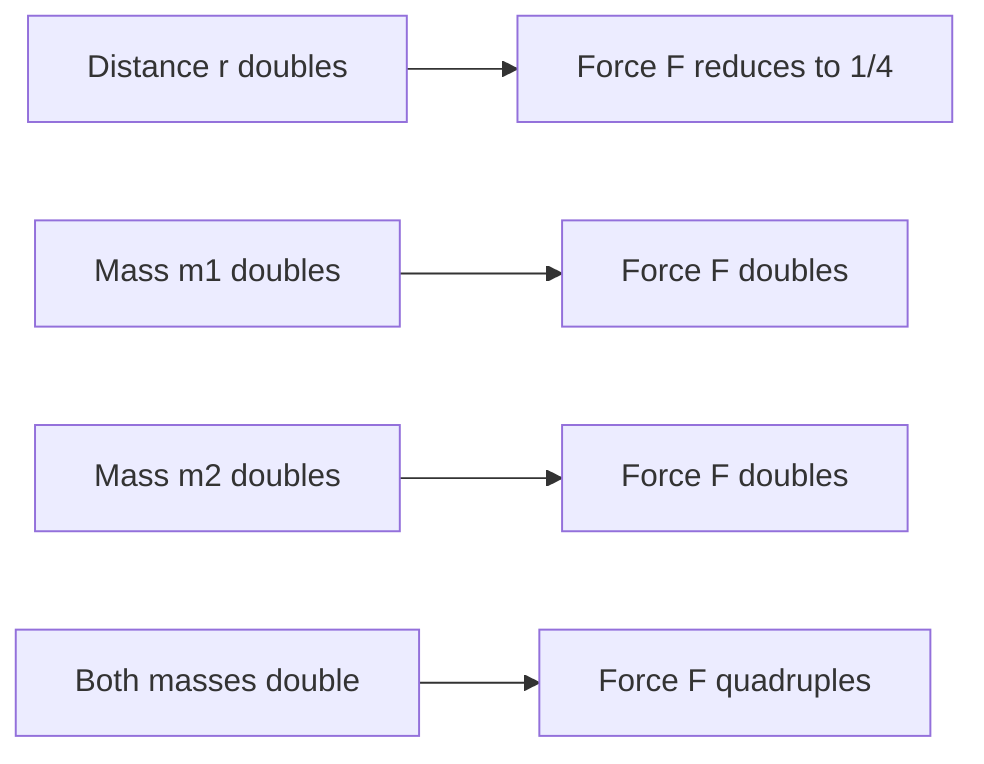

# 1. Overview / 概述

**English:**
Newton's Law of Universal Gravitation is the foundational principle governing gravitational interactions between all masses in the universe. This sub-topic establishes the mathematical relationship that gravitational force is directly proportional to the product of masses and inversely proportional to the square of the distance between them. It forms the cornerstone of understanding [[Gravitational Field Strength]], planetary motion, and satellite dynamics. For A-Level Physics, this law bridges [[Newton's Laws of Motion]] with celestial mechanics, explaining why planets orbit the Sun and why objects fall to Earth. The inverse-square nature of this law is a recurring theme throughout physics, appearing also in electrostatics and light intensity.

**中文:**
牛顿万有引力定律是支配宇宙中所有质量之间引力相互作用的基本原理。本子知识点建立了引力与质量乘积成正比、与距离平方成反比的数学关系。它是理解[[Gravitational Field Strength|引力场强度]]、行星运动和卫星动力学的基础。在A-Level物理中，该定律将[[Newton's Laws of Motion|牛顿运动定律]]与天体力学联系起来，解释了行星为何绕太阳运行以及物体为何落向地球。该定律的平方反比特性是贯穿物理学的反复出现的主题，也出现在静电学和光强度中。

---

# 2. Syllabus Learning Objectives / 考纲学习目标

| CAIE 9702 | Edexcel IAL |
|-----------|-------------|
| 15.1(a) State Newton's law of universal gravitation | 6.1 Understand the concept of a gravitational field |
| 15.1(b) Use the equation $F = G\frac{m_1 m_2}{r^2}$ | 6.2 Use Newton's law of gravitation $F = G\frac{m_1 m_2}{r^2}$ |
| 15.1(c) Define gravitational field strength as $g = \frac{F}{m}$ | 6.3 Understand that gravitational field strength is $g = \frac{GM}{r^2}$ |
| 15.1(d) Use $g = \frac{GM}{r^2}$ for point masses | 6.4 Apply the inverse-square law to gravitational fields |
| - | 6.5 Understand the concept of gravitational field lines |

**Examiner Expectations / 考官期望:**
- **CAIE:** Students must state the law verbatim and apply the equation to point masses and spherical bodies. Be able to derive $g = GM/r^2$ from $F = GMm/r^2$ and $F = mg$.
- **Edexcel:** Students must understand gravitational fields as regions where masses experience force. Apply the inverse-square law to calculate field strength at various distances.

**中文:**
- **CAIE:** 学生必须逐字陈述定律，并将方程应用于点质量和球体。能够从 $F = GMm/r^2$ 和 $F = mg$ 推导出 $g = GM/r^2$。
- **Edexcel:** 学生必须理解引力场是质量受力的区域。应用平方反比定律计算不同距离处的场强。

---

# 3. Core Definitions / 核心定义

| Term (EN/CN) | Definition (EN) | Definition (CN) | Common Mistakes / 常见错误 |
|--------------|-----------------|-----------------|---------------------------|
| **Newton's Law of Universal Gravitation** / 牛顿万有引力定律 | Every particle of matter in the universe attracts every other particle with a force that is directly proportional to the product of their masses and inversely proportional to the square of the distance between their centers. | 宇宙中每个物质粒子都吸引其他每个粒子，力与它们质量的乘积成正比，与它们中心之间距离的平方成反比。 | ❌ Forgetting "center-to-center" distance for spherical objects / 忘记球体是"中心到中心"距离 |
| **Gravitational Force ($F$)** / 引力 | The attractive force between two masses due to their mass. | 两个质量之间由于质量而产生的吸引力。 | ❌ Thinking it can be repulsive / 认为可以是斥力 |
| **Gravitational Constant ($G$)** / 引力常数 | A universal constant of proportionality in Newton's law of gravitation, $G = 6.67 \times 10^{-11} \text{ N m}^2 \text{ kg}^{-2}$. | 牛顿万有引力定律中的普适比例常数，$G = 6.67 \times 10^{-11} \text{ N m}^2 \text{ kg}^{-2}$。 | ❌ Confusing $G$ with $g$ (gravitational field strength) / 混淆 $G$ 和 $g$（引力场强度） |
| **Point Mass** / 点质量 | An idealized mass concentrated at a single point in space. | 理想化的质量集中在空间中的一个点上。 | ❌ Applying law to non-spherical objects without approximation / 在没有近似的情况下将定律应用于非球形物体 |
| **Inverse-Square Law** / 平方反比定律 | A physical law where a quantity is inversely proportional to the square of the distance from the source. | 物理量与该量到源的距离的平方成反比的物理定律。 | ❌ Using $1/r$ instead of $1/r^2$ / 使用 $1/r$ 而不是 $1/r^2$ |
| **Center of Mass** / 质心 | The point where the entire mass of an object can be considered to be concentrated. | 物体的全部质量可以被认为集中的点。 | ❌ Using surface-to-surface distance / 使用表面到表面的距离 |

---

# 4. Key Concepts Explained / 关键概念详解

## 4.1 The Universal Nature of Gravitation / 引力的普遍性

### Explanation / 解释
**English:**
Newton's law is **universal** — it applies to all masses, from subatomic particles to galaxies. The force is always **attractive**, never repulsive. For spherical objects (like planets and stars), the distance $r$ is measured from **center to center**, not surface to surface. This is because a uniform sphere behaves gravitationally as if all its mass were concentrated at its center (the [[shell theorem]]).

The law can be expressed mathematically as:
$$ F = G\frac{m_1 m_2}{r^2} $$

Where:
- $F$ = gravitational force (N)
- $G$ = gravitational constant ($6.67 \times 10^{-11} \text{ N m}^2 \text{ kg}^{-2}$)
- $m_1, m_2$ = masses (kg)
- $r$ = distance between centers (m)

**中文:**
牛顿定律是**普适的**——它适用于所有质量，从亚原子粒子到星系。力总是**吸引的**，从不排斥。对于球形物体（如行星和恒星），距离 $r$ 是从**中心到中心**测量的，而不是表面到表面。这是因为均匀球体在引力作用下的行为就像其所有质量都集中在中心一样（[[shell theorem|壳层定理]]）。

该定律的数学表达式为：
$$ F = G\frac{m_1 m_2}{r^2} $$

其中：
- $F$ = 引力 (N)
- $G$ = 引力常数 ($6.67 \times 10^{-11} \text{ N m}^2 \text{ kg}^{-2}$)
- $m_1, m_2$ = 质量 (kg)
- $r$ = 中心之间的距离 (m)

### Physical Meaning / 物理意义
**English:**
The law tells us that gravitational force:
1. Increases with larger masses — doubling one mass doubles the force
2. Decreases rapidly with distance — doubling distance reduces force to 1/4
3. Is extremely weak — the gravitational constant $G$ is very small, which is why we don't feel gravitational attraction between everyday objects

**中文:**
该定律告诉我们引力：
1. 随质量增大而增大——质量加倍，力加倍
2. 随距离增大而迅速减小——距离加倍，力减小到1/4
3. 极其微弱——引力常数 $G$ 非常小，这就是为什么我们感觉不到日常物体之间的引力

### Common Misconceptions / 常见误区
- ❌ **"Gravity doesn't exist in space"** — Gravity exists everywhere; astronauts appear weightless because they are in free fall, not because gravity is absent
- ❌ **"Larger mass always experiences larger force"** — By Newton's Third Law, both masses experience the **same magnitude** of force
- ❌ **"Distance is measured from surfaces"** — Always measure from **centers of mass**
- ❌ **"G is the same as g"** — $G$ is universal constant; $g$ is gravitational field strength (varies with location)

- ❌ **"太空中没有引力"** — 引力无处不在；宇航员看起来失重是因为他们在自由落体，而不是因为没有引力
- ❌ **"质量大的物体受力更大"** — 根据牛顿第三定律，两个质量受到的力**大小相等**
- ❌ **"距离是从表面测量的"** — 始终从**质心**测量
- ❌ **"G 和 g 相同"** — $G$ 是普适常数；$g$ 是引力场强度（随位置变化）

### Exam Tips / 考试提示
**English:**
- Always write the law in words first before using the equation
- For spherical objects, state "assuming the mass is concentrated at the center"
- Check units: $G$ has units $\text{N m}^2 \text{ kg}^{-2}$, not $\text{N m}^2/\text{kg}^2$
- Remember: $F \propto 1/r^2$, not $1/r$

**中文:**
- 在使用方程之前，始终先用文字陈述定律
- 对于球形物体，说明"假设质量集中在中心"
- 检查单位：$G$ 的单位是 $\text{N m}^2 \text{ kg}^{-2}$，不是 $\text{N m}^2/\text{kg}^2$
- 记住：$F \propto 1/r^2$，不是 $1/r$

> 📷 **IMAGE PROMPT — DIAG-01: Newton's Law of Universal Gravitation Diagram**
> A clean scientific diagram showing two spherical masses (m1 and m2) separated by distance r (measured center-to-center). Arrows show equal and opposite gravitational forces F and -F acting along the line connecting centers. Labels: m1, m2, r, F, -F. Include a note: "F ∝ m1m2/r²". Style: textbook-quality, white background, blue/black lines, professional physics diagram.

---

## 4.2 The Gravitational Constant $G$ / 引力常数 $G$

### Explanation / 解释
**English:**
The gravitational constant $G$ is a fundamental constant of nature. Its value was first measured by Henry Cavendish in 1798 using a torsion balance experiment. The incredibly small value of $G = 6.67 \times 10^{-11} \text{ N m}^2 \text{ kg}^{-2}$ explains why gravitational forces are only significant when at least one of the masses is astronomical in size.

**中文:**
引力常数 $G$ 是自然界的基本常数。它的值由亨利·卡文迪什在1798年使用扭秤实验首次测量。$G = 6.67 \times 10^{-11} \text{ N m}^2 \text{ kg}^{-2}$ 的极小值解释了为什么引力只有在至少一个质量是天体大小时才显著。

### Physical Meaning / 物理意义
**English:**
$G$ represents the gravitational force between two 1 kg masses placed 1 m apart — approximately $6.67 \times 10^{-11}$ N. This is about the weight of a single bacterium!

**中文:**
$G$ 表示两个相距1米的1 kg质量之间的引力——约为 $6.67 \times 10^{-11}$ N。这大约是一个细菌的重量！

### Exam Tips / 考试提示
**English:**
- You will be given $G$ in exams — no need to memorize its value
- But know its units: $\text{N m}^2 \text{ kg}^{-2}$
- $G$ is universal — same everywhere in the universe

**中文:**
- 考试中会给出 $G$ 的值——无需记忆
- 但要知道其单位：$\text{N m}^2 \text{ kg}^{-2}$
- $G$ 是普适的——宇宙中任何地方都相同

---

## 4.3 Applying the Law to Spherical Objects / 将定律应用于球形物体

### Explanation / 解释
**English:**
For a uniform sphere (or a sphere with spherically symmetric mass distribution), the gravitational force it exerts on an external mass is the same as if all its mass were concentrated at its center. This is known as the **shell theorem** (proved by Newton using calculus).

Therefore, for a planet of mass $M$ and radius $R$, the force on a mass $m$ at distance $r$ from the planet's center ($r \geq R$) is:
$$ F = G\frac{Mm}{r^2} $$

**中文:**
对于均匀球体（或具有球对称质量分布的球体），它对外部质量施加的引力与其所有质量集中在中心时相同。这被称为**壳层定理**（牛顿用微积分证明）。

因此，对于质量为 $M$、半径为 $R$ 的行星，在距离行星中心 $r$ 处（$r \geq R$）的质量 $m$ 所受的力为：
$$ F = G\frac{Mm}{r^2} $$

### Common Misconceptions / 常见误区
- ❌ **"Inside a sphere, the force increases"** — Inside a uniform spherical shell, the net gravitational force is zero
- ❌ **"The law only works for planets"** — It works for any two masses, but is most noticeable for large masses

- ❌ **"在球体内部，力增大"** — 在均匀球壳内部，净引力为零
- ❌ **"该定律只适用于行星"** — 它适用于任何两个质量，但大质量时最明显

---

# 5. Essential Equations / 核心公式

## 5.1 Newton's Law of Universal Gravitation / 牛顿万有引力定律

$$ F = G\frac{m_1 m_2}{r^2} $$

| Symbol (符号) | Meaning (EN) | Meaning (CN) | Unit (单位) |
|--------------|-------------|-------------|------------|
| $F$ | Gravitational force | 引力 | N |
| $G$ | Gravitational constant ($6.67 \times 10^{-11}$) | 引力常数 | $\text{N m}^2 \text{ kg}^{-2}$ |
| $m_1, m_2$ | Masses of the two objects | 两个物体的质量 | kg |
| $r$ | Distance between centers of mass | 质心之间的距离 | m |

**Derivation / 推导:**
This is an empirical law — it cannot be derived from first principles. Newton inferred it from Kepler's laws of planetary motion and his own laws of motion.

**Conditions / 适用条件:**
- **English:** Point masses OR uniform spheres (with $r$ measured from centers). Valid for any distance $r > 0$.
- **中文:** 点质量或均匀球体（$r$ 从中心测量）。适用于任何距离 $r > 0$。

**Limitations / 局限性:**
- **English:** Does not apply at very small distances (quantum scale) or very high speeds (relativistic scale). For strong gravitational fields, Einstein's General Relativity is needed.
- **中文:** 不适用于非常小的距离（量子尺度）或非常高的速度（相对论尺度）。对于强引力场，需要爱因斯坦的广义相对论。

## 5.2 Gravitational Field Strength from a Point Mass / 点质量的引力场强度

$$ g = \frac{GM}{r^2} $$

| Symbol (符号) | Meaning (EN) | Meaning (CN) | Unit (单位) |
|--------------|-------------|-------------|------------|
| $g$ | Gravitational field strength | 引力场强度 | $\text{N kg}^{-1}$ or $\text{m s}^{-2}$ |
| $G$ | Gravitational constant | 引力常数 | $\text{N m}^2 \text{ kg}^{-2}$ |
| $M$ | Mass creating the field | 产生场的质量 | kg |
| $r$ | Distance from center of $M$ | 距离 $M$ 中心的距离 | m |

**Derivation / 推导:**
From $F = G\frac{Mm}{r^2}$ and $F = mg$:
$$ mg = G\frac{Mm}{r^2} $$
$$ g = \frac{GM}{r^2} $$

**Conditions / 适用条件:**
- **English:** For points outside a spherical mass $M$, or for point masses. $r$ must be measured from the center of $M$.
- **中文:** 适用于球形质量 $M$ 外部的点，或点质量。$r$ 必须从 $M$ 的中心测量。

**Limitations / 局限性:**
- **English:** Assumes $M$ is the only mass creating the field. Does not account for other nearby masses.
- **中文:** 假设 $M$ 是唯一产生场的质量。不考虑附近其他质量。

> 📷 **IMAGE PROMPT — DIAG-02: Gravitational Field Strength vs Distance Graph**
> A graph showing g on y-axis (N/kg) vs r on x-axis (m). The curve shows g ∝ 1/r² — steep drop near the surface, gradually flattening. Mark Earth's surface (r = R_E, g = 9.81). Include a second curve for a planet with larger mass. Labels: "g = GM/r²", "Earth's surface", "Inverse-square relationship". Style: clean physics graph, grid lines, professional.

---

# 6. Graphs and Relationships / 图表与关系

## 6.1 Gravitational Force vs Distance / 引力与距离的关系

### Axes / 坐标轴
- **X-axis:** Distance $r$ (m) — 距离 $r$ (m)
- **Y-axis:** Gravitational force $F$ (N) — 引力 $F$ (N)

### Shape / 形状
**English:** A curve showing $F \propto 1/r^2$. The force is infinite at $r = 0$ (theoretical singularity) and approaches zero as $r \to \infty$. The curve is steep near small $r$ and flattens out at large $r$.

**中文:** 显示 $F \propto 1/r^2$ 的曲线。在 $r = 0$ 处力为无穷大（理论奇点），当 $r \to \infty$ 时趋近于零。曲线在小 $r$ 附近陡峭，在大 $r$ 处变平。

### Gradient Meaning / 斜率含义
**English:** The gradient $\frac{dF}{dr} = -2\frac{GMm}{r^3}$ represents the rate of change of force with distance. The negative sign indicates force decreases as distance increases.

**中文:** 梯度 $\frac{dF}{dr} = -2\frac{GMm}{r^3}$ 表示力随距离的变化率。负号表示力随距离增大而减小。

### Area Meaning / 面积含义
**English:** The area under the $F$ vs $r$ graph has no direct physical meaning in this context.

**中文:** $F$ 对 $r$ 图下的面积在此上下文中没有直接的物理意义。

### Exam Interpretation / 考试解读
**English:**
- Be able to sketch the $1/r^2$ curve
- Identify that doubling $r$ reduces $F$ to 1/4
- Compare forces at different distances using ratios: $\frac{F_1}{F_2} = \frac{r_2^2}{r_1^2}$

**中文:**
- 能够画出 $1/r^2$ 曲线
- 识别出 $r$ 加倍使 $F$ 减小到 1/4
- 使用比例比较不同距离处的力：$\frac{F_1}{F_2} = \frac{r_2^2}{r_1^2}$

---

## 6.2 Gravitational Field Strength vs Distance / 引力场强度与距离的关系

### Axes / 坐标轴
- **X-axis:** Distance $r$ (m) — 距离 $r$ (m)
- **Y-axis:** Gravitational field strength $g$ (N/kg) — 引力场强度 $g$ (N/kg)

### Shape / 形状
**English:** Same $1/r^2$ shape as force graph. For Earth, $g = 9.81 \text{ N/kg}$ at the surface ($r = R_E = 6.37 \times 10^6 \text{ m}$). Inside Earth ($r < R_E$), $g$ decreases linearly to zero at the center (assuming uniform density).

**中文:** 与力图相同的 $1/r^2$ 形状。对于地球，表面处 $g = 9.81 \text{ N/kg}$（$r = R_E = 6.37 \times 10^6 \text{ m}$）。在地球内部（$r < R_E$），$g$ 线性减小到中心处的零（假设均匀密度）。

### Gradient Meaning / 斜率含义
**English:** The gradient $\frac{dg}{dr} = -2\frac{GM}{r^3}$ shows how quickly field strength changes with altitude.

**中文:** 梯度 $\frac{dg}{dr} = -2\frac{GM}{r^3}$ 显示场强随高度变化的快慢。

### Area Meaning / 面积含义
**English:** The area under the $g$ vs $r$ graph gives the change in gravitational potential $\Delta V$ (covered in [[Gravitational Potential]]).

**中文:** $g$ 对 $r$ 图下的面积给出引力势的变化 $\Delta V$（在[[Gravitational Potential|引力势]]中介绍）。

### Exam Interpretation / 考试解读
**English:**
- At Earth's surface: $g = 9.81 \text{ N/kg}$
- At height $h$ above surface: $g = \frac{GM}{(R_E + h)^2}$
- For $h \ll R_E$, approximate: $g \approx g_0(1 - \frac{2h}{R_E})$

**中文:**
- 在地球表面：$g = 9.81 \text{ N/kg}$
- 在表面上方高度 $h$ 处：$g = \frac{GM}{(R_E + h)^2}$
- 当 $h \ll R_E$ 时，近似：$g \approx g_0(1 - \frac{2h}{R_E})$

---

# 7. Required Diagrams / 必备图表

## 7.1 Two Masses with Gravitational Force / 两个质量与引力

### Description / 描述
**English:** A diagram showing two spherical masses with arrows indicating the equal and opposite gravitational forces acting along the line joining their centers. The distance $r$ is measured center-to-center.

**中文:** 显示两个球形质量的图表，箭头表示沿连接它们中心的直线作用的相等且相反的引力。距离 $r$ 是中心到中心测量的。

### Image Prompt / 图片生成提示
> 📷 **IMAGE PROMPT — DIAG-03: Two Masses Gravitational Force Diagram**
> A clean physics diagram showing two spheres (m1 = 5 kg, m2 = 10 kg) separated by distance r = 2 m. Arrows F₁₂ and F₂₁ of equal length point toward each other along the line connecting centers. Labels: m₁, m₂, r, F₁₂ = F₂₁ = G·m₁·m₂/r². Include a note: "Newton's Third Law: Forces are equal and opposite". Style: textbook-quality, white background, professional physics illustration.

### Labels Required / 需要标注
- Masses: $m_1$, $m_2$ — 质量：$m_1$, $m_2$
- Distance: $r$ (center-to-center) — 距离：$r$（中心到中心）
- Forces: $F_{12}$ (force on $m_1$ from $m_2$), $F_{21}$ (force on $m_2$ from $m_1$) — 力：$F_{12}$（$m_2$ 对 $m_1$ 的力），$F_{21}$（$m_1$ 对 $m_2$ 的力）

### Exam Importance / 考试重要性
**English:** Essential for explaining the law. Shows both the inverse-square relationship and Newton's Third Law application.

**中文:** 解释定律所必需。显示平方反比关系和牛顿第三定律的应用。

---

## 7.2 Gravitational Field Around a Point Mass / 点质量周围的引力场

### Description / 描述
**English:** A diagram showing radial field lines pointing inward toward a central mass, with field lines closer together near the mass (stronger field) and spreading out at greater distances (weaker field).

**中文:** 显示指向中心质量的径向场线的图表，场线在质量附近更密集（场更强），在更远距离处分散（场更弱）。

### Image Prompt / 图片生成提示
> 📷 **IMAGE PROMPT — DIAG-04: Radial Gravitational Field Diagram**
> A diagram showing a central mass M (large sphere) with radial field lines (arrows) pointing inward from all directions. Field lines are dense near the mass and spread out further away. Labels: "M", "Radial field", "g decreases as 1/r²", "Field lines point toward mass". Include a note: "For a point mass or uniform sphere". Style: clean physics diagram, white background, professional.

### Labels Required / 需要标注
- Central mass: $M$ — 中心质量：$M$
- Field lines with arrows pointing inward — 指向内部的场线箭头
- "Strong field" (near mass) — "强场"（靠近质量）
- "Weak field" (far from mass) — "弱场"（远离质量）

### Exam Importance / 考试重要性
**English:** Shows the difference between [[Radial vs Uniform Gravitational Fields]]. Essential for understanding field line concepts.

**中文:** 显示[[Radial vs Uniform Gravitational Fields|径向场与均匀场]]的区别。理解场线概念所必需。

---

# 8. Worked Examples / 典型例题

## Example 1: Force Between Two Masses / 两个质量之间的力

### Question / 题目
**English:**
Two spheres of masses 50 kg and 200 kg are placed with their centers 2.0 m apart. Calculate the gravitational force between them. ($G = 6.67 \times 10^{-11} \text{ N m}^2 \text{ kg}^{-2}$)

**中文:**
两个质量分别为 50 kg 和 200 kg 的球体，其中心相距 2.0 m。计算它们之间的引力。（$G = 6.67 \times 10^{-11} \text{ N m}^2 \text{ kg}^{-2}$）

### Solution / 解答

**Step 1: Write the law / 写出定律**
$$ F = G\frac{m_1 m_2}{r^2} $$

**Step 2: Substitute values / 代入数值**
$$ F = (6.67 \times 10^{-11}) \times \frac{50 \times 200}{(2.0)^2} $$

**Step 3: Calculate / 计算**
$$ F = (6.67 \times 10^{-11}) \times \frac{10000}{4} $$
$$ F = (6.67 \times 10^{-11}) \times 2500 $$
$$ F = 1.67 \times 10^{-7} \text{ N} $$

### Final Answer / 最终答案
**Answer:** $1.67 \times 10^{-7} \text{ N}$ | **答案：** $1.67 \times 10^{-7} \text{ N}$

### Quick Tip / 提示
**English:** Notice how small this force is! This is why we don't feel gravitational attraction between everyday objects. The force would be significant only if one mass were planetary-sized.

**中文:** 注意这个力有多小！这就是为什么我们感觉不到日常物体之间的引力。只有当其中一个质量达到行星大小时，力才会显著。

---

## Example 2: Gravitational Field Strength at Altitude / 高空处的引力场强度

### Question / 题目
**English:**
Earth has mass $M_E = 5.97 \times 10^{24} \text{ kg}$ and radius $R_E = 6.37 \times 10^6 \text{ m}$. Calculate the gravitational field strength at:
(a) Earth's surface
(b) An altitude of 300 km above Earth's surface

**中文:**
地球质量 $M_E = 5.97 \times 10^{24} \text{ kg}$，半径 $R_E = 6.37 \times 10^6 \text{ m}$。计算以下位置的引力场强度：
(a) 地球表面
(b) 地球表面上方 300 km 的高度

### Solution / 解答

**Part (a): At Earth's surface / 在地球表面**

$$ g = \frac{GM_E}{R_E^2} $$
$$ g = \frac{(6.67 \times 10^{-11})(5.97 \times 10^{24})}{(6.37 \times 10^6)^2} $$
$$ g = \frac{3.98 \times 10^{14}}{4.06 \times 10^{13}} $$
$$ g = 9.81 \text{ N kg}^{-1} $$

**Part (b): At 300 km altitude / 在 300 km 高度**

Distance from Earth's center: $r = R_E + h = 6.37 \times 10^6 + 3.00 \times 10^5 = 6.67 \times 10^6 \text{ m}$

$$ g = \frac{GM_E}{r^2} $$
$$ g = \frac{(6.67 \times 10^{-11})(5.97 \times 10^{24})}{(6.67 \times 10^6)^2} $$
$$ g = \frac{3.98 \times 10^{14}}{4.45 \times 10^{13}} $$
$$ g = 8.94 \text{ N kg}^{-1} $$

### Final Answer / 最终答案
**Answer:** (a) $9.81 \text{ N kg}^{-1}$ | (b) $8.94 \text{ N kg}^{-1}$ | **答案：** (a) $9.81 \text{ N kg}^{-1}$ | (b) $8.94 \text{ N kg}^{-1}$

### Quick Tip / 提示
**English:** The field strength decreases by about 9% at 300 km altitude. For the International Space Station (at ~400 km), $g \approx 8.7 \text{ N kg}^{-1}$ — astronauts appear weightless because they are in free fall, not because gravity is absent!

**中文:** 在 300 km 高度处，场强减小了约 9%。对于国际空间站（约 400 km 高度），$g \approx 8.7 \text{ N kg}^{-1}$——宇航员看起来失重是因为他们在自由落体，而不是因为没有引力！

---

# 9. Past Paper Question Types / 历年真题题型

| Question Type / 题型 | Frequency / 频率 | Difficulty / 难度 | Past Paper References / 真题索引 |
|----------------------|------------------|------------------|-------------------------------|
| State Newton's law of gravitation / 陈述牛顿万有引力定律 | High / 高 | Easy / 简单 | 📝 *待填入* |
| Calculate gravitational force between two masses / 计算两个质量之间的引力 | High / 高 | Medium / 中等 | 📝 *待填入* |
| Calculate $g$ at different distances / 计算不同距离处的 $g$ | High / 高 | Medium / 中等 | 📝 *待填入* |
| Ratio problems ($F_1/F_2$ or $g_1/g_2$) / 比例问题 | Medium / 中 | Medium / 中等 | 📝 *待填入* |
| Compare gravitational force with weight / 比较引力和重量 | Medium / 中 | Medium / 中等 | 📝 *待填入* |
| Derive $g = GM/r^2$ from $F = GMm/r^2$ / 推导 $g = GM/r^2$ | Medium / 中 | Medium / 中等 | 📝 *待填入* |
| Explain why $G$ is small / 解释为什么 $G$ 很小 | Low / 低 | Easy / 简单 | 📝 *待填入* |

**Common Command Words / 常见指令词:**
- **State / 陈述** — Write the law or definition verbatim
- **Calculate / 计算** — Use the equation with given values
- **Derive / 推导** — Show mathematical steps from one equation to another
- **Explain / 解释** — Give reasons with physics principles
- **Compare / 比较** — Discuss similarities and differences
- **Sketch / 画图** — Draw a graph showing the relationship

**中文:**
- **State / 陈述** — 逐字写出定律或定义
- **Calculate / 计算** — 使用方程和给定值
- **Derive / 推导** — 展示从一个方程到另一个方程的数学步骤
- **Explain / 解释** — 用物理原理解释原因
- **Compare / 比较** — 讨论异同
- **Sketch / 画图** — 画出显示关系的图表

---

# 10. Practical Skills Connections / 实验技能链接

**English:**
While Newton's law of universal gravitation cannot be directly verified in a school laboratory (the forces are too small), the following practical skills are relevant:

1. **Cavendish Experiment Understanding:** Know the principle of the torsion balance experiment that measured $G$. The experiment uses small lead spheres and measures the tiny twist in a fiber due to gravitational attraction.

2. **Inverse-Square Law Verification:** Similar inverse-square relationships can be verified using:
   - Light intensity vs distance (using a light sensor)
   - Radiation intensity vs distance (using a Geiger counter)
   - Electrostatic force vs distance (using charged spheres)

3. **Graphical Analysis:** Plot $F$ vs $1/r^2$ to obtain a straight line through origin, confirming the inverse-square relationship. The gradient equals $Gm_1m_2$.

4. **Uncertainty Analysis:** When calculating $g$ from $g = GM/r^2$, propagate uncertainties in $M$ and $r$ to find uncertainty in $g$.

5. **Experimental Design:** Design an experiment to determine $G$ using a Cavendish-type apparatus — identify sources of error (air currents, vibrations, electrostatic forces) and suggest improvements.

**中文:**
虽然牛顿万有引力定律无法在学校实验室直接验证（力太小），但以下实验技能是相关的：

1. **理解卡文迪什实验：** 了解测量 $G$ 的扭秤实验原理。该实验使用小铅球，测量由于引力引起的纤维微小扭转。

2. **平方反比定律验证：** 类似的平方反比关系可以使用以下方法验证：
   - 光强度与距离的关系（使用光传感器）
   - 辐射强度与距离的关系（使用盖革计数器）
   - 静电力与距离的关系（使用带电球体）

3. **图形分析：** 绘制 $F$ 对 $1/r^2$ 的图，得到通过原点的直线，确认平方反比关系。梯度等于 $Gm_1m_2$。

4. **不确定度分析：** 当从 $g = GM/r^2$ 计算 $g$ 时，传播 $M$ 和 $r$ 的不确定度以找到 $g$ 的不确定度。

5. **实验设计：** 设计使用卡文迪什式装置确定 $G$ 的实验——识别误差源（气流、振动、静电力）并提出改进建议。

---

# 11. Concept Map / 概念图谱

```mermaid
graph TD
    %% Newton's Law of Universal Gravitation - Concept Map
    
    %% Central Concept
    N["Newton's Law of Universal Gravitation<br/>牛顿万有引力定律"] --> EQ["F = G·m₁·m₂/r²"]
    
    %% Key Components
    EQ --> G["Gravitational Constant G<br/>引力常数 G = 6.67×10⁻¹¹"]
    EQ --> M1["Mass m₁<br/>质量 m₁"]
    EQ --> M2["Mass m₂<br/>质量 m₂"]
    EQ --> R["Distance r (center-to-center)<br/>距离 r (中心到中心)"]
    
    %% Properties
    N --> PROP["Properties<br/>性质"]
    PROP --> ATTR["Always attractive<br/>总是吸引"]
    PROP --> INV["Inverse-square: F ∝ 1/r²<br/>平方反比"]
    PROP --> THIRD["Newton's Third Law: F₁₂ = F₂₁<br/>牛顿第三定律"]
    
    %% Applications
    N --> APPL["Applications<br/>应用"]
    APPL --> GS["Gravitational Field Strength<br/>引力场强度 g = GM/r²"]
    APPL --> ORB["Circular Orbits<br/>圆形轨道"]
    APPL --> POT["Gravitational Potential<br/>引力势"]
    
    %% Connections to other topics
    GS --> RADIAL["Radial vs Uniform Fields<br/>径向场与均匀场"]
    ORB --> CENT["Centripetal Force<br/>向心力"]
    POT --> ENERGY["Gravitational Potential Energy<br/>引力势能"]
    
    %% Prerequisites
    N --> PRE["Prerequisites<br/>先修知识"]
    PRE --> NLM["Newton's Laws of Motion<br/>牛顿运动定律"]
    PRE --> CF["Centripetal Acceleration & Force<br/>向心加速度与力"]
    
    %% Experimental
    N --> EXP["Experimental Verification<br/>实验验证"]
    EXP --> CAV["Cavendish Experiment<br/>卡文迪什实验"]
    EXP --> GRAPH["F vs 1/r² graph → straight line<br/>F 对 1/r² 图 → 直线"]
    
    %% Styling
    classDef central fill:#f9f,stroke:#333,stroke-width:4px
    classDef component fill:#bbf,stroke:#333,stroke-width:2px
    classDef property fill:#bfb,stroke:#333,stroke-width:2px
    classDef application fill:#fbb,stroke:#333,stroke-width:2px
    classDef prerequisite fill:#ffd,stroke:#333,stroke-width:2px
    classDef experimental fill:#ddf,stroke:#333,stroke-width:2px
    
    class N central
    class EQ,G,M1,M2,R component
    class PROP,ATTR,INV,THIRD property
    class APPL,GS,ORB,POT application
    class PRE,NLM,CF prerequisite
    class EXP,CAV,GRAPH experimental
```

---

# 12. Quick Revision Sheet / 速查表

| Category / 类别 | Key Points / 要点 |
|----------------|------------------|
| **Definition / 定义** | Every mass attracts every other mass with force $F \propto m_1 m_2 / r^2$ / 每个质量吸引其他质量，力 $F \propto m_1 m_2 / r^2$ |
| **Key Formula / 核心公式** | $F = G\frac{m_1 m_2}{r^2}$ where $G = 6.67 \times 10^{-11} \text{ N m}^2 \text{ kg}^{-2}$ |
| **Derived Formula / 推导公式** | $g = \frac{GM}{r^2}$ (gravitational field strength) / 引力场强度 |
| **Key Graph / 核心图表** | $F$ vs $r$: $1/r^2$ curve; $F$ vs $1/r^2$: straight line through origin / $F$ 对 $r$：$1/r^2$ 曲线；$F$ 对 $1/r^2$：通过原点的直线 |
| **Key Diagram / 核心图表** | Two masses with equal/opposite forces; Radial field lines around point mass / 两个质量有相等/相反的力；点质量周围的径向场线 |
| **Exam Tip 1 / 考试提示1** | Always measure $r$ from **center to center** for spherical objects / 对于球形物体，始终从**中心到中心**测量 $r$ |
| **Exam Tip 2 / 考试提示2** | Both masses experience the **same magnitude** of force (Newton's Third Law) / 两个质量受到**相同大小**的力（牛顿第三定律） |
| **Exam Tip 3 / 考试提示3** | For ratio problems: $\frac{F_1}{F_2} = \frac{r_2^2}{r_1^2}$ (if masses constant) / 对于比例问题：$\frac{F_1}{F_2} = \frac{r_2^2}{r_1^2}$（如果质量不变） |
| **Common Mistake / 常见错误** | Confusing $G$ (universal constant) with $g$ (field strength) / 混淆 $G$（普适常数）和 $g$（场强） |
| **Practical Link / 实验联系** | Cavendish experiment measured $G$; cannot verify directly in school lab / 卡文迪什实验测量了 $G$；无法在学校实验室直接验证 |
| **Units Check / 单位检查** | $F$ in N, $m$ in kg, $r$ in m, $G$ in $\text{N m}^2 \text{ kg}^{-2}$, $g$ in $\text{N kg}^{-1}$ or $\text{m s}^{-2}$ |
| **Key Assumption / 关键假设** | Masses are point masses or uniform spheres / 质量是点质量或均匀球体 |

---

> 📋 **CIE Only:** CAIE 9702 requires students to state the law in words and use the equation. The derivation of $g = GM/r^2$ from $F = GMm/r^2$ and $F = mg$ is essential. Questions often involve calculating the force between planets or satellites.
>
> 📋 **Edexcel Only:** Edexcel IAL WPH14 U4 emphasizes understanding gravitational fields as vector fields. Students must be able to draw and interpret gravitational field lines. Questions may ask to compare gravitational fields with electric fields (similar inverse-square laws).

---

**Related Leaf Nodes:**
- [[Gravitational Field Strength]]
- [[Radial vs Uniform Gravitational Fields]]
- [[Gravitational Potential]]
- [[Circular Orbits]]

**Parent Hub:**
- [[Gravitational Force and Field]]