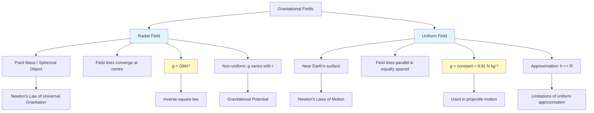

# 1. Overview / 概述

**English:**
This sub-topic distinguishes between two fundamental types of gravitational fields: **radial** and **uniform**. A radial gravitational field is produced by a point mass (or spherical object) and has field lines converging radially inward toward the centre. A uniform gravitational field is an approximation near the Earth's surface where field lines are parallel and equally spaced. Understanding this distinction is crucial for applying [[Newton's Law of Universal Gravitation]] correctly in different contexts — radial fields for planetary motion and uniform fields for projectile motion near Earth's surface. This sub-topic connects directly to [[Gravitational Field Strength]] and [[Gravitational Potential]].

**中文:**
本子知识点区分两种基本引力场类型：**径向引力场**和**均匀引力场**。径向引力场由点质量（或球状物体）产生，场线径向向内汇聚至中心。均匀引力场是地球表面附近的近似，场线平行且等间距。理解这一区别对于在不同情境中正确应用[[牛顿万有引力定律]]至关重要——径向场用于行星运动，均匀场用于地球表面附近的抛体运动。本子知识点直接联系到[[引力场强度]]和[[引力势]]。

---

# 2. Syllabus Learning Objectives / 考纲学习目标

| CAIE 9702 | Edexcel IAL |
|-----------|-------------|
| 15.1(a): Describe the concept of a gravitational field as an example of a field of force and define gravitational field strength | 6.1: Understand the concept of a gravitational field as a region where a mass experiences a force |
| 15.1(b): Recall and use Newton's law of gravitation | 6.2: Use Newton's law of gravitation for point masses |
| 15.1(c): Derive gravitational field strength for a point mass | 6.3: Understand radial and uniform gravitational fields |
| 15.1(d): Distinguish between gravitational field patterns for radial and uniform fields | 6.4: Calculate gravitational field strength for radial fields |
| — | 6.5: Understand the relationship between field strength and distance |

**Examiner Expectations / 考官期望:**
- **English:** You must be able to draw and interpret field line diagrams for both radial and uniform fields. For radial fields, understand that $g \propto 1/r^2$; for uniform fields, $g$ is constant. Be able to calculate $g$ at a point in a radial field using $g = GM/r^2$.
- **中文:** 必须能绘制和解释径向场和均匀场的场线图。对于径向场，理解 $g \propto 1/r^2$；对于均匀场，$g$ 为常数。能使用 $g = GM/r^2$ 计算径向场中某点的 $g$。

---

# 3. Core Definitions / 核心定义

| Term (EN/CN) | Definition (EN) | Definition (CN) | Common Mistakes / 常见错误 |
|--------------|-----------------|-----------------|---------------------------|
| **Radial Gravitational Field** / 径向引力场 | A gravitational field where field lines radiate from a point mass, with field strength decreasing as $1/r^2$ | 场线从点质量向外辐射的引力场，场强按 $1/r^2$ 递减 | Confusing with uniform field; thinking $g$ is constant in radial fields |
| **Uniform Gravitational Field** / 均匀引力场 | A gravitational field where field lines are parallel and equally spaced, with constant field strength | 场线平行且等间距的引力场，场强恒定 | Applying $g = GM/r^2$ near Earth's surface where $g$ is approximately constant |
| **Field Line** / 场线 | A line representing the direction of gravitational force on a test mass | 表示测试质量所受引力方向的线 | Thinking field lines start at masses (they end at masses) |
| **Point Mass** / 点质量 | An idealized mass concentrated at a single point | 集中于单一点的理想化质量 | Forgetting that spherical objects behave as point masses at distances $r \geq R$ |
| **Gravitational Field Strength ($g$)** / 引力场强度 | Force per unit mass experienced by a test mass in a gravitational field | 测试质量在引力场中单位质量所受的力 | Confusing $g$ with acceleration due to gravity (they are numerically equal) |

---

# 4. Key Concepts Explained / 关键概念详解

## 4.1 Radial Gravitational Field / 径向引力场

### Explanation / 解释
**English:** A radial gravitational field is produced by a [[point mass]] or any spherically symmetric object (like a planet or star). The field lines are straight lines that converge radially inward toward the centre of the mass. The field strength $g$ at a distance $r$ from the centre is given by $g = \frac{GM}{r^2}$, where $M$ is the mass of the object. This means $g$ decreases with the square of the distance — doubling the distance reduces $g$ to one-quarter. This is a **non-uniform** field because $g$ varies with position.

**中文:** 径向引力场由[[点质量]]或任何球对称物体（如行星或恒星）产生。场线是径向向内汇聚至质量中心的直线。距中心距离 $r$ 处的场强 $g$ 由 $g = \frac{GM}{r^2}$ 给出，其中 $M$ 是物体的质量。这意味着 $g$ 随距离的平方递减——距离加倍，$g$ 减为四分之一。这是一个**非均匀**场，因为 $g$ 随位置变化。

### Physical Meaning / 物理意义
**English:** The radial field represents the gravitational influence of a single massive object. The $1/r^2$ dependence arises from the inverse-square law — the same geometric spreading that applies to light and electric fields. The field is strongest near the surface and weakens rapidly with distance.

**中文:** 径向场代表单个大质量物体的引力影响。$1/r^2$ 依赖关系源于平方反比定律——与光和电场相同的几何扩散。场在表面附近最强，随距离迅速减弱。

### Common Misconceptions / 常见误区
- **EN:** Thinking that field lines start at the mass (they end at the mass — arrows point inward).
- **CN:** 认为场线从质量开始（它们终止于质量——箭头指向内）。
- **EN:** Believing $g$ is constant in a radial field (it varies with $r$).
- **CN:** 认为径向场中 $g$ 是常数（它随 $r$ 变化）。
- **EN:** Applying $g = GM/r^2$ for points inside the mass (it only applies for $r \geq R$).
- **CN:** 对质量内部点应用 $g = GM/r^2$（仅适用于 $r \geq R$）。

### Exam Tips / 考试提示
- **EN:** Always state "for a point mass or spherical object" when using $g = GM/r^2$.
- **CN:** 使用 $g = GM/r^2$ 时始终说明"对于点质量或球状物体"。
- **EN:** Remember that $r$ is measured from the centre of the mass, not the surface.
- **CN:** 记住 $r$ 是从质量中心测量的，不是从表面。

> 📷 **IMAGE PROMPT — RGF01: Radial Gravitational Field Lines**
> A diagram showing a central spherical mass (e.g., Earth) with straight arrows radiating inward from all directions toward the centre. The arrows should be closer together near the surface and farther apart at greater distances, illustrating the $1/r^2$ decrease in field strength. Label: "Radial Gravitational Field", "Field lines converge at centre", "$g \propto 1/r^2$".

## 4.2 Uniform Gravitational Field / 均匀引力场

### Explanation / 解释
**English:** A uniform gravitational field is an approximation valid near the surface of a large planet (like Earth). Over small distances compared to the planet's radius, the curvature of the radial field is negligible, and the field lines appear parallel and equally spaced. The field strength $g$ is approximately constant, with a value of $9.81 \text{ N kg}^{-1}$ (or $9.81 \text{ m s}^{-2}$) near Earth's surface. This approximation is used in [[Newton's Laws of Motion]] for projectile motion and free-fall problems.

**中文:** 均匀引力场是在大行星（如地球）表面附近有效的近似。在与行星半径相比的小距离上，径向场的曲率可忽略，场线看起来平行且等间距。场强 $g$ 近似恒定，地球表面附近值为 $9.81 \text{ N kg}^{-1}$（或 $9.81 \text{ m s}^{-2}$）。此近似用于[[牛顿运动定律]]中的抛体运动和自由落体问题。

### Physical Meaning / 物理意义
**English:** The uniform field approximation simplifies calculations because $g$ is constant. This means the force on a mass $m$ is $F = mg$, independent of position. The gravitational potential energy is $mgh$, where $h$ is height above a reference level. This is valid only when $h \ll R_\text{Earth}$.

**中文:** 均匀场近似简化了计算，因为 $g$ 是常数。这意味着质量为 $m$ 的物体受力 $F = mg$，与位置无关。引力势能为 $mgh$，其中 $h$ 是相对于参考水平面的高度。这仅在 $h \ll R_\text{地球}$ 时有效。

### Common Misconceptions / 常见误区
- **EN:** Thinking the uniform field is exact (it's an approximation — Earth's field is actually radial).
- **CN:** 认为均匀场是精确的（它是近似——地球的场实际上是径向的）。
- **EN:** Applying $g = GM/r^2$ for small height changes and getting the same answer (it's unnecessary).
- **CN:** 对小高度变化应用 $g = GM/r^2$ 得到相同答案（不必要）。
- **EN:** Using $mgh$ for large heights where $g$ varies significantly.
- **CN:** 对 $g$ 显著变化的大高度使用 $mgh$。

### Exam Tips / 考试提示
- **EN:** State "near the Earth's surface" when assuming a uniform field.
- **CN:** 假设均匀场时说明"在地球表面附近"。
- **EN:** Use $g = 9.81 \text{ m s}^{-2}$ unless told otherwise.
- **CN:** 除非另有说明，使用 $g = 9.81 \text{ m s}^{-2}$。

> 📷 **IMAGE PROMPT — RGF02: Uniform Gravitational Field Lines**
> A diagram showing a flat horizontal surface (Earth's surface) with equally spaced vertical arrows pointing downward. The arrows should be parallel and of equal length, indicating constant field strength. Label: "Uniform Gravitational Field", "Parallel field lines", "$g = \text{constant}$", "Near Earth's surface".

---

# 5. Essential Equations / 核心公式

## 5.1 Radial Field Field Strength / 径向场场强

$$ g = \frac{GM}{r^2} $$

| Symbol (符号) | Meaning (EN) | Meaning (CN) | Unit (单位) |
|--------------|-------------|-------------|------------|
| $g$ | Gravitational field strength | 引力场强度 | N kg$^{-1}$ (or m s$^{-2}$) |
| $G$ | Universal gravitational constant ($6.67 \times 10^{-11}$) | 万有引力常数 | N m$^2$ kg$^{-2}$ |
| $M$ | Mass of the object producing the field | 产生场的物体质量 | kg |
| $r$ | Distance from centre of mass | 距质量中心的距离 | m |

**Derivation / 推导:**
From [[Newton's Law of Universal Gravitation]]: $F = \frac{GMm}{r^2}$. By definition, $g = F/m$, so $g = \frac{GM}{r^2}$.

**Conditions / 适用条件:**
- **EN:** Valid for point masses or spherically symmetric objects at distances $r \geq R$ (outside the object).
- **CN:** 适用于点质量或球对称物体，距离 $r \geq R$（物体外部）。

**Limitations / 局限性:**
- **EN:** Does not apply inside the mass ($r < R$) — field strength inside a uniform sphere varies linearly with $r$.
- **CN:** 不适用于质量内部（$r < R$）——均匀球体内部场强随 $r$ 线性变化。

## 5.2 Uniform Field Force / 均匀场力

$$ F = mg $$

| Symbol (符号) | Meaning (EN) | Meaning (CN) | Unit (单位) |
|--------------|-------------|-------------|------------|
| $F$ | Gravitational force | 引力 | N |
| $m$ | Mass of object | 物体质量 | kg |
| $g$ | Gravitational field strength (constant) | 引力场强度（常数） | N kg$^{-1}$ |

**Conditions / 适用条件:**
- **EN:** Valid near Earth's surface where $h \ll R_\text{Earth}$ ($R_\text{Earth} \approx 6400$ km).
- **CN:** 在地球表面附近有效，$h \ll R_\text{地球}$（$R_\text{地球} \approx 6400$ km）。

---

# 6. Graphs and Relationships / 图表与关系

## 6.1 $g$ vs $r$ for Radial Field / 径向场中 $g$ 与 $r$ 的关系

### Axes / 坐标轴
- **x-axis:** Distance from centre, $r$ (m) / 距中心距离 $r$ (m)
- **y-axis:** Gravitational field strength, $g$ (N kg$^{-1}$) / 引力场强度 $g$ (N kg$^{-1}$)

### Shape / 形状
- **EN:** For $r \geq R$: hyperbolic decay — $g \propto 1/r^2$. For $r < R$ (inside uniform sphere): linear increase — $g \propto r$.
- **CN:** 对于 $r \geq R$：双曲线衰减 — $g \propto 1/r^2$。对于 $r < R$（均匀球体内部）：线性增加 — $g \propto r$。

### Gradient Meaning / 斜率含义
- **EN:** The gradient $dg/dr$ is not physically significant for $r \geq R$; it shows the rate of change of field strength with distance.
- **CN:** 对于 $r \geq R$，梯度 $dg/dr$ 没有物理意义；它显示场强随距离的变化率。

### Area Meaning / 面积含义
- **EN:** The area under the $g$-$r$ graph from $r_1$ to $r_2$ gives the change in gravitational potential: $\Delta V = -\int_{r_1}^{r_2} g \, dr$.
- **CN:** $g$-$r$ 图下从 $r_1$ 到 $r_2$ 的面积给出引力势的变化：$\Delta V = -\int_{r_1}^{r_2} g \, dr$。

### Exam Interpretation / 考试解读
- **EN:** Be able to sketch this graph and identify the $1/r^2$ region. Know that $g$ is maximum at $r = R$ (surface).
- **CN:** 能绘制此图并识别 $1/r^2$ 区域。知道 $g$ 在 $r = R$（表面）处最大。

> 📷 **IMAGE PROMPT — RGF03: g vs r Graph for Radial Field**
> A graph with $g$ on the y-axis and $r$ on the x-axis. For $r < R$, a straight line from origin to $(R, g_\text{surface})$. For $r \geq R$, a smooth hyperbolic curve decreasing as $1/r^2$. Label: "Surface at $r = R$", "$g \propto r$ inside", "$g \propto 1/r^2$ outside".

## 6.2 $g$ vs $r$ for Uniform Field / 均匀场中 $g$ 与 $r$ 的关系

### Axes / 坐标轴
- **x-axis:** Height above surface, $h$ (m) / 距表面高度 $h$ (m)
- **y-axis:** Gravitational field strength, $g$ (N kg$^{-1}$) / 引力场强度 $g$ (N kg$^{-1}$)

### Shape / 形状
- **EN:** Horizontal straight line — $g$ is constant ($9.81$ N kg$^{-1}$) for small $h$.
- **CN:** 水平直线 — 对于小 $h$，$g$ 为常数（$9.81$ N kg$^{-1}$）。

### Gradient Meaning / 斜率含义
- **EN:** Zero gradient — $g$ does not change with height.
- **CN:** 零梯度 — $g$ 不随高度变化。

### Area Meaning / 面积含义
- **EN:** Area under graph from $h_1$ to $h_2$ gives change in gravitational potential energy per unit mass: $\Delta V = g\Delta h$.
- **CN:** 图下从 $h_1$ 到 $h_2$ 的面积给出单位质量引力势能的变化：$\Delta V = g\Delta h$。

### Exam Interpretation / 考试解读
- **EN:** This graph is only valid for small heights. For large heights, the graph would curve downward following $1/r^2$.
- **CN:** 此图仅对小高度有效。对于大高度，图会按 $1/r^2$ 向下弯曲。

---

# 7. Required Diagrams / 必备图表

## 7.1 Radial Field Diagram / 径向场图

### Description / 描述
- **EN:** A diagram showing a spherical mass (e.g., Earth) with straight arrows pointing radially inward from all directions. The arrows should be closer together near the surface and farther apart at greater distances.
- **CN:** 显示球状质量（如地球）的图，箭头从所有方向径向向内指向。箭头在表面附近更密集，在更远距离更稀疏。

### Image Prompt / 图片生成提示
> 📷 **IMAGE PROMPT — RGF04: Radial Gravitational Field Diagram**
> A 2D cross-section diagram of a spherical planet (Earth) with radial field lines. The planet is shown as a blue circle. From all directions around the planet, straight black arrows point inward toward the centre. The arrows are densely packed near the planet's surface and become sparser with increasing distance. Labels: "Radial Gravitational Field", "Field lines converge at centre", "Strong field near surface", "Weak field far away". Include a scale showing $g \propto 1/r^2$.

### Labels Required / 需要标注
- **EN:** Centre of mass, field lines (arrows), direction (inward), region of strong field, region of weak field.
- **CN:** 质量中心、场线（箭头）、方向（向内）、强场区域、弱场区域。

### Exam Importance / 考试重要性
- **EN:** High — you may be asked to draw or interpret this diagram. Know that field lines are radial and converge at the centre.
- **CN:** 高——可能被要求绘制或解释此图。知道场线是径向的并汇聚于中心。

## 7.2 Uniform Field Diagram / 均匀场图

### Description / 描述
- **EN:** A diagram showing a flat horizontal surface (Earth's surface) with equally spaced vertical arrows pointing downward. The arrows are parallel and of equal length.
- **CN:** 显示平坦水平表面（地球表面）的图，等间距垂直箭头指向下方。箭头平行且等长。

### Image Prompt / 图片生成提示
> 📷 **IMAGE PROMPT — RGF05: Uniform Gravitational Field Diagram**
> A diagram showing a flat horizontal green surface representing Earth's surface. Above it, equally spaced vertical black arrows point downward. All arrows are the same length and parallel to each other. Labels: "Uniform Gravitational Field", "Parallel field lines", "$g = \text{constant}$", "Near Earth's surface". Include a small person or object to show scale.

### Labels Required / 需要标注
- **EN:** Earth's surface, field lines (arrows), direction (downward), constant spacing.
- **CN:** 地球表面、场线（箭头）、方向（向下）、等间距。

### Exam Importance / 考试重要性
- **EN:** High — you may be asked to compare this with the radial field diagram.
- **CN:** 高——可能被要求与径向场图比较。

---

# 8. Worked Examples / 典型例题

## Example 1: Comparing Field Strengths / 比较场强

### Question / 题目
**English:**
The Earth has mass $M = 5.97 \times 10^{24}$ kg and radius $R = 6.37 \times 10^6$ m. Calculate:
(a) The gravitational field strength at the Earth's surface.
(b) The gravitational field strength at a height of 300 km above the surface.
(c) Comment on whether the uniform field approximation is valid at this height.

**中文:**
地球质量 $M = 5.97 \times 10^{24}$ kg，半径 $R = 6.37 \times 10^6$ m。计算：
(a) 地球表面的引力场强度。
(b) 距表面 300 km 高度处的引力场强度。
(c) 讨论在此高度均匀场近似是否有效。

### Solution / 解答

**(a)** Using $g = \frac{GM}{r^2}$ at $r = R$:

$$ g_\text{surface} = \frac{(6.67 \times 10^{-11})(5.97 \times 10^{24})}{(6.37 \times 10^6)^2} $$

$$ g_\text{surface} = \frac{3.98 \times 10^{14}}{4.06 \times 10^{13}} = 9.81 \text{ N kg}^{-1} $$

**(b)** At height $h = 300 \text{ km} = 3.00 \times 10^5$ m, $r = R + h = 6.67 \times 10^6$ m:

$$ g_{300} = \frac{(6.67 \times 10^{-11})(5.97 \times 10^{24})}{(6.67 \times 10^6)^2} $$

$$ g_{300} = \frac{3.98 \times 10^{14}}{4.45 \times 10^{13}} = 8.94 \text{ N kg}^{-1} $$

**(c)** The percentage change in $g$ is:
$$ \frac{9.81 - 8.94}{9.81} \times 100\% = 8.9\% $$

**English:** The uniform field approximation assumes $g$ is constant. At 300 km, $g$ has decreased by about 9%, which is significant. The approximation is **not valid** at this height — we must use the radial field formula.

**中文:** 均匀场近似假设 $g$ 为常数。在 300 km 处，$g$ 下降了约 9%，这是显著的。在此高度近似**无效**——必须使用径向场公式。

### Final Answer / 最终答案
**Answer:** (a) $9.81$ N kg$^{-1}$ | (b) $8.94$ N kg$^{-1}$ | (c) Not valid — 9% change | **答案：** (a) $9.81$ N kg$^{-1}$ | (b) $8.94$ N kg$^{-1}$ | (c) 无效——变化 9%

### Quick Tip / 提示
- **EN:** Always check if $h \ll R$ before using the uniform field approximation. A rule of thumb: if $h < 0.01R$ (about 64 km for Earth), the approximation is good.
- **CN:** 在使用均匀场近似前始终检查 $h \ll R$。经验法则：如果 $h < 0.01R$（地球约 64 km），近似良好。

## Example 2: Field Line Diagrams / 场线图

### Question / 题目
**English:**
Sketch the gravitational field lines for:
(a) A point mass.
(b) The region near the Earth's surface.
Explain the key differences.

**中文:**
绘制以下情况的引力场线：
(a) 点质量。
(b) 地球表面附近区域。
解释关键区别。

### Solution / 解答

**(a)** Radial field: Straight lines converging at the centre of the mass. Arrows point inward. Spacing increases with distance.

**(b)** Uniform field: Parallel vertical lines, equally spaced. Arrows point downward.

**Key differences / 关键区别:**
| Feature / 特征 | Radial / 径向 | Uniform / 均匀 |
|----------------|---------------|----------------|
| Line shape / 线形状 | Converging / 汇聚 | Parallel / 平行 |
| Spacing / 间距 | Increases with $r$ / 随 $r$ 增加 | Constant / 恒定 |
| $g$ variation / $g$ 变化 | $g \propto 1/r^2$ | $g = \text{constant}$ |
| Applicability / 适用性 | Any distance from mass | Near surface only |

### Final Answer / 最终答案
**Answer:** See diagram descriptions above. | **答案：** 见上方图描述。

### Quick Tip / 提示
- **EN:** In exams, draw field lines as straight lines with arrows. For radial fields, ensure lines converge at a point. For uniform fields, ensure lines are parallel and equally spaced.
- **CN:** 考试中，将场线画成带箭头的直线。对于径向场，确保线汇聚于一点。对于均匀场，确保线平行且等间距。

---

# 9. Past Paper Question Types / 历年真题题型

| Question Type / 题型 | Frequency / 频率 | Difficulty / 难度 | Past Paper References / 真题索引 |
|----------------------|------------------|------------------|-------------------------------|
| Field line diagram drawing / 场线图绘制 | High / 高 | Easy / 简单 | 📝 *待填入* |
| Calculate $g$ at a point in radial field / 计算径向场中某点 $g$ | High / 高 | Medium / 中等 | 📝 *待填入* |
| Compare radial vs uniform fields / 比较径向场与均匀场 | Medium / 中 | Medium / 中等 | 📝 *待填入* |
| Determine validity of uniform approximation / 判断均匀近似的有效性 | Medium / 中 | Medium / 中等 | 📝 *待填入* |
| $g$ vs $r$ graph interpretation / $g$-$r$ 图解读 | Low / 低 | Hard / 困难 | 📝 *待填入* |

**Common Command Words / 常见指令词:**
- **EN:** "Sketch", "Calculate", "Compare", "Explain", "State", "Determine"
- **CN:** "绘制"、"计算"、"比较"、"解释"、"陈述"、"确定"

---

# 10. Practical Skills Connections / 实验技能链接

**English:**
This sub-topic connects to practical work in several ways:

1. **Measurements:** Measuring $g$ using a pendulum or free-fall apparatus assumes a uniform field. The accuracy of these measurements depends on how valid the uniform approximation is.
2. **Uncertainties:** When calculating $g$ from $g = GM/r^2$, uncertainties in $M$, $r$, and $G$ propagate. For Earth, $M$ has significant uncertainty ($\pm 0.01 \times 10^{24}$ kg).
3. **Graph Plotting:** Plotting $g$ vs $1/r^2$ for a radial field should give a straight line through the origin, with gradient $GM$.
4. **Experimental Design:** To verify the $1/r^2$ law, you would need to measure $g$ at different distances from a large mass — but this is impractical in a school lab. Instead, simulations or data analysis are used.
5. **Data Analysis:** Given data of $g$ at various distances, you can determine $M$ from the gradient of $g$ vs $1/r^2$.

**中文:**
本子知识点通过以下方式与实验工作联系：

1. **测量：** 使用单摆或自由落体装置测量 $g$ 假设均匀场。这些测量的准确性取决于均匀近似的有效性。
2. **不确定度：** 从 $g = GM/r^2$ 计算 $g$ 时，$M$、$r$ 和 $G$ 的不确定度会传播。对于地球，$M$ 有显著不确定度（$\pm 0.01 \times 10^{24}$ kg）。
3. **绘图：** 绘制径向场的 $g$ 与 $1/r^2$ 关系图应得到通过原点的直线，斜率为 $GM$。
4. **实验设计：** 要验证 $1/r^2$ 定律，需要测量不同距离处的 $g$——但这在学校实验室中不现实。而是使用模拟或数据分析。
5. **数据分析：** 给定不同距离处的 $g$ 数据，可以从 $g$ 与 $1/r^2$ 图的斜率确定 $M$。

---

# 11. Concept Map / 概念图谱

---

# 12. Quick Revision Sheet / 速查表

| Category / 类别 | Key Points / 要点 |
|----------------|------------------|
| **Definition / 定义** | Radial: field lines converge at centre; Uniform: parallel lines, constant $g$ |
| **Key Formula / 核心公式** | Radial: $g = GM/r^2$; Uniform: $F = mg$ |
| **Key Graph / 核心图表** | $g$ vs $r$: hyperbolic for radial ($1/r^2$), horizontal line for uniform |
| **Key Diagram / 核心图表** | Radial: arrows inward from all directions; Uniform: parallel arrows downward |
| **Conditions / 条件** | Radial: $r \geq R$; Uniform: $h \ll R$ (near surface) |
| **Common Mistake / 常见错误** | Using $g = GM/r^2$ for uniform field; assuming uniform field is exact |
| **Exam Tip / 考试提示** | Always state assumptions; draw field lines with arrows; check $h \ll R$ |
| **Connection / 联系** | Links to [[Newton's Law of Universal Gravitation]], [[Gravitational Field Strength]], [[Gravitational Potential]] |