# 1. Overview / 概述

**English:**
Escape velocity is the minimum speed required for an object to break free from a gravitational field without further propulsion. This sub-topic applies the concept of [[Gravitational Potential (V)]] to determine the kinetic energy needed to overcome gravitational binding energy. Escape velocity is derived from the principle of conservation of mechanical energy, linking [[Kinetic Energy and Potential Energy]] with [[Gravitational Potential Energy in a Radial Field]]. It is a threshold concept — below this speed, the object will eventually fall back; at or above it, the object can escape to infinity. This has profound implications for space exploration, atmospheric retention on planets, and understanding black holes.

**中文:**
逃逸速度是物体无需额外推进即可摆脱引力场束缚所需的最小速度。本子知识点运用[[Gravitational Potential (V)]]的概念来确定克服引力结合能所需的动能。逃逸速度源自机械能守恒原理，将[[Kinetic Energy and Potential Energy]]与[[Gravitational Potential Energy in a Radial Field]]联系起来。这是一个阈值概念——低于此速度，物体最终会落回；达到或超过此速度，物体可以逃逸至无穷远。这对太空探索、行星大气保持以及理解黑洞具有深远意义。

---

# 2. Syllabus Learning Objectives / 考纲学习目标

| CAIE 9702 | Edexcel IAL |
|-----------|-------------|
| 15.2(a): Define escape velocity | 6.6: Understand the concept of escape velocity |
| 15.2(b): Derive escape velocity from energy considerations | 6.7: Derive the expression for escape velocity |
| 15.2(c): Calculate escape velocity for planets | 6.8: Calculate escape velocity for different celestial bodies |
| 15.2(d): Explain why escape velocity is independent of mass of escaping object | 6.9: Explain the independence of escape velocity from projectile mass |
| 15.2(e): Discuss factors affecting escape velocity | 6.10: Apply escape velocity to real-world contexts (e.g., space launches, atmospheric escape) |
| 15.2(f): Solve problems involving escape velocity | — |

**Examiner Expectations / 考官期望:**
- **English:** Students must derive escape velocity using energy conservation, not kinematics. They must understand that escape velocity is a scalar quantity (speed) and is independent of the direction of launch (ignoring air resistance). They should be able to calculate escape velocity for Earth, Moon, and other planets given mass and radius.
- **中文:** 学生必须使用能量守恒（而非运动学）推导逃逸速度。必须理解逃逸速度是标量（速率），且与发射方向无关（忽略空气阻力）。应能根据质量和半径计算地球、月球及其他行星的逃逸速度。

---

# 3. Core Definitions / 核心定义

| Term (EN/CN) | Definition (EN) | Definition (CN) | Common Mistakes / 常见错误 |
|--------------|-----------------|-----------------|---------------------------|
| **Escape Velocity** / 逃逸速度 | The minimum speed an object must have at the surface of a planet (or other celestial body) to escape its gravitational field completely, without further propulsion. | 物体在行星（或其他天体）表面为完全摆脱其引力场而无需额外推进所需的最小速度。 | ❌ Confusing with orbital velocity (orbital velocity is lower). ❌ Thinking it depends on object mass. |
| **Gravitational Binding Energy** / 引力结合能 | The total energy required to separate a system of gravitationally bound objects to infinity. For a mass m on a planet of mass M and radius R: $E_b = \frac{GMm}{R}$ | 将引力束缚系统完全分离至无穷远所需的总能量。对于行星（质量M，半径R）上的质量m：$E_b = \frac{GMm}{R}$ | ❌ Forgetting the negative sign in gravitational potential energy. |
| **Infinity** / 无穷远 | The reference point where gravitational potential energy is defined as zero. At infinity, the gravitational field strength is zero. | 引力势能定义为零的参考点。在无穷远处，引力场强度为零。 | ❌ Thinking "infinity" means a very large but finite distance. |
| **Threshold Speed** / 阈值速率 | The critical speed at which total mechanical energy becomes zero (KE + GPE = 0). Below this, the object is bound; above, it is unbound. | 总机械能为零（动能+引力势能=0）的临界速率。低于此值，物体被束缚；高于此值，物体不受束缚。 | ❌ Thinking escape velocity is the speed needed to reach a specific altitude. |

---

# 4. Key Concepts Explained / 关键概念详解

## 4.1 Energy Conservation Derivation / 能量守恒推导

### Explanation / 解释
**English:** Escape velocity is derived from the principle of conservation of mechanical energy. Consider an object of mass $m$ on the surface of a planet of mass $M$ and radius $R$. The gravitational potential energy at the surface is $U = -\frac{GMm}{R}$ (taking $U=0$ at infinity). For the object to just escape to infinity, its total mechanical energy at the surface must be at least zero. At infinity, both KE and GPE are zero. Therefore:

$$ \frac{1}{2}mv_{\text{esc}}^2 + \left(-\frac{GMm}{R}\right) = 0 $$

Solving for $v_{\text{esc}}$:

$$ v_{\text{esc}} = \sqrt{\frac{2GM}{R}} $$

This derivation assumes no air resistance and no other forces acting. The result is independent of the mass $m$ of the escaping object — a key insight.

**中文:** 逃逸速度由机械能守恒原理推导得出。考虑行星（质量M，半径R）表面上一个质量为m的物体。表面的引力势能为 $U = -\frac{GMm}{R}$（取无穷远处U=0）。要使物体恰好逃逸至无穷远，其表面总机械能必须至少为零。在无穷远处，动能和引力势能均为零。因此：

$$ \frac{1}{2}mv_{\text{esc}}^2 + \left(-\frac{GMm}{R}\right) = 0 $$

解出 $v_{\text{esc}}$：

$$ v_{\text{esc}} = \sqrt{\frac{2GM}{R}} $$

此推导假设无空气阻力且无其他力作用。结果与逃逸物体的质量m无关——这是一个关键洞察。

### Physical Meaning / 物理意义
**English:** Escape velocity represents the speed at which the kinetic energy exactly equals the magnitude of the gravitational potential energy. At this speed, the object has just enough energy to reach infinity with zero speed. If launched at a higher speed, it will still have kinetic energy at infinity. If launched at a lower speed, it will reach a maximum height and fall back.

**中文:** 逃逸速度表示动能恰好等于引力势能大小的速率。在此速率下，物体刚好有足够能量以零速率到达无穷远。如果以更高速度发射，它在无穷远处仍具有动能。如果以更低速度发射，它将达到最大高度后落回。

### Common Misconceptions / 常见误区
- ❌ **"Escape velocity is a vector"** — It is a scalar (speed). The direction doesn't matter (ignoring atmosphere).
- ❌ **"Escape velocity depends on the mass of the object"** — The $m$ cancels out in the derivation.
- ❌ **"Escape velocity is the speed needed to reach orbit"** — Orbital velocity ($v_{\text{orb}} = \sqrt{GM/R}$) is lower than escape velocity ($v_{\text{esc}} = \sqrt{2} \cdot v_{\text{orb}}$).
- ❌ **"You need to reach escape velocity instantly"** — Continuous propulsion can achieve escape at lower speeds (e.g., rockets).

### Exam Tips / 考试提示
- **English:** Always derive escape velocity from energy conservation, not from kinematics. Show the cancellation of $m$ explicitly. Remember that escape velocity from Earth is approximately 11.2 km/s (not 7.9 km/s, which is orbital velocity).
- **中文:** 始终从能量守恒推导逃逸速度，而非运动学。明确展示m的消去。记住地球逃逸速度约为11.2 km/s（不是7.9 km/s，那是轨道速度）。

> 📷 **IMAGE PROMPT — ESC-01: Energy Diagram for Escape Velocity**
> A graph showing gravitational potential energy (negative, approaching zero at infinity) and kinetic energy (positive) as functions of distance from planet center. At the surface, KE = |GPE|. At infinity, both are zero. The total energy line is horizontal at zero.

---

## 4.2 Independence of Projectile Mass / 与抛射体质量无关

### Explanation / 解释
**English:** The escape velocity formula $v_{\text{esc}} = \sqrt{2GM/R}$ contains no term for the mass $m$ of the escaping object. This is because both kinetic energy ($\frac{1}{2}mv^2$) and gravitational potential energy ($-\frac{GMm}{R}$) are proportional to $m$. When equating them, $m$ cancels. This means a feather and a spacecraft require the same launch speed to escape Earth's gravity (ignoring air resistance).

**中文:** 逃逸速度公式 $v_{\text{esc}} = \sqrt{2GM/R}$ 中不包含逃逸物体的质量m。这是因为动能（$\frac{1}{2}mv^2$）和引力势能（$-\frac{GMm}{R}$）都与m成正比。当它们相等时，m被消去。这意味着羽毛和宇宙飞船需要相同的发射速度才能摆脱地球引力（忽略空气阻力）。

### Physical Meaning / 物理意义
**English:** Gravity is a conservative force that acts equally on all masses per unit mass. The energy required per kilogram to escape is the same for all objects. This is analogous to all objects falling with the same acceleration in a uniform gravitational field.

**中文:** 引力是一种保守力，对每单位质量的所有物体作用相同。每千克物体逃逸所需的能量对所有物体都是相同的。这类似于所有物体在均匀引力场中以相同加速度下落。

### Common Misconceptions / 常见误区
- ❌ **"Heavier objects need more speed to escape"** — They need more energy, but the speed is the same.
- ❌ **"Escape velocity depends on the shape of the object"** — Only mass and radius of the planet matter.

### Exam Tips / 考试提示
- **English:** If asked "Why is escape velocity independent of the mass of the projectile?" — answer: "Because both kinetic energy and gravitational potential energy are proportional to mass, so mass cancels in the energy equation."
- **中文:** 如果被问"为什么逃逸速度与抛射体质量无关？"——回答："因为动能和引力势能都与质量成正比，所以在能量方程中质量被消去。"

---

## 4.3 Escape Velocity and Black Holes / 逃逸速度与黑洞

### Explanation / 解释
**English:** The concept of escape velocity leads to the idea of a black hole. If a celestial body is so dense that its escape velocity exceeds the speed of light ($c$), then nothing — not even light — can escape. Setting $v_{\text{esc}} = c$:

$$ c = \sqrt{\frac{2GM}{R}} \quad \Rightarrow \quad R = \frac{2GM}{c^2} $$

This radius $R$ is called the **Schwarzschild radius** (event horizon). Any object compressed within this radius becomes a black hole. This is a key link between Newtonian gravity and general relativity.

**中文:** 逃逸速度的概念引出了黑洞的想法。如果一个天体的密度大到其逃逸速度超过光速（c），那么没有任何东西——包括光——可以逃逸。令 $v_{\text{esc}} = c$：

$$ c = \sqrt{\frac{2GM}{R}} \quad \Rightarrow \quad R = \frac{2GM}{c^2} $$

这个半径R称为**史瓦西半径**（事件视界）。任何被压缩到这个半径内的物体都会变成黑洞。这是牛顿引力与广义相对论之间的关键联系。

### Physical Meaning / 物理意义
**English:** The Schwarzschild radius defines the boundary of a black hole. Inside this radius, the gravitational field is so strong that the escape velocity exceeds $c$, making it impossible for any information or matter to escape. This is why black holes appear "black" — no light can leave them.

**中文:** 史瓦西半径定义了黑洞的边界。在这个半径内，引力场如此之强，以至于逃逸速度超过c，使得任何信息或物质都无法逃逸。这就是为什么黑洞看起来是"黑"的——没有光能离开它们。

### Common Misconceptions / 常见误区
- ❌ **"Black holes are infinitely dense"** — The singularity may be, but the event horizon has a finite radius.
- ❌ **"Escape velocity from a black hole is exactly c"** — At the event horizon, yes; inside, it exceeds c.

### Exam Tips / 考试提示
- **English:** For A-Level, you may be asked to calculate the Schwarzschild radius of a black hole given its mass. Use $R_s = 2GM/c^2$. Remember $G = 6.67 \times 10^{-11} \text{ N m}^2 \text{ kg}^{-2}$ and $c = 3.00 \times 10^8 \text{ m s}^{-1}$.
- **中文:** 在A-Level中，可能会要求根据质量计算黑洞的史瓦西半径。使用 $R_s = 2GM/c^2$。记住 $G = 6.67 \times 10^{-11} \text{ N m}^2 \text{ kg}^{-2}$ 和 $c = 3.00 \times 10^8 \text{ m s}^{-1}$。

> 📷 **IMAGE PROMPT — ESC-02: Black Hole Event Horizon**
> A 3D visualization of a black hole with a glowing accretion disk. The event horizon is shown as a dark sphere. Arrows indicate that light rays inside the event horizon cannot escape, while those outside can. Label the Schwarzschild radius.

---

# 5. Essential Equations / 核心公式

## 5.1 Escape Velocity Formula / 逃逸速度公式

$$ v_{\text{esc}} = \sqrt{\frac{2GM}{R}} $$

| Symbol (符号) | Meaning (EN) | Meaning (CN) | Unit (单位) |
|--------------|-------------|-------------|------------|
| $v_{\text{esc}}$ | Escape velocity | 逃逸速度 | m s⁻¹ |
| $G$ | Gravitational constant ($6.67 \times 10^{-11}$) | 引力常量 | N m² kg⁻² |
| $M$ | Mass of celestial body | 天体质量 | kg |
| $R$ | Radius of celestial body | 天体半径 | m |

**Derivation / 推导:**
From energy conservation: $\frac{1}{2}mv_{\text{esc}}^2 - \frac{GMm}{R} = 0$ → $\frac{1}{2}mv_{\text{esc}}^2 = \frac{GMm}{R}$ → $v_{\text{esc}}^2 = \frac{2GM}{R}$ → $v_{\text{esc}} = \sqrt{\frac{2GM}{R}}$

**Conditions / 适用条件:**
- **English:** Valid for any spherically symmetric body. Assumes no air resistance or other forces. The object must start from the surface.
- **中文:** 适用于任何球对称天体。假设无空气阻力或其他力。物体必须从表面出发。

**Limitations / 局限性:**
- **English:** Does not account for atmospheric drag, rotation of the planet, or relativistic effects (except for black holes). For extended bodies, the starting point matters.
- **中文:** 未考虑大气阻力、行星自转或相对论效应（黑洞除外）。对于扩展物体，起始点很重要。

---

## 5.2 Relationship Between Escape Velocity and Orbital Velocity / 逃逸速度与轨道速度的关系

$$ v_{\text{esc}} = \sqrt{2} \cdot v_{\text{orb}} $$

Where $v_{\text{orb}} = \sqrt{\frac{GM}{R}}$ is the orbital velocity at the surface (circular orbit).

| Symbol (符号) | Meaning (EN) | Meaning (CN) | Unit (单位) |
|--------------|-------------|-------------|------------|
| $v_{\text{esc}}$ | Escape velocity | 逃逸速度 | m s⁻¹ |
| $v_{\text{orb}}$ | Orbital velocity (circular) | 轨道速度（圆形） | m s⁻¹ |

**Derivation / 推导:**
$v_{\text{orb}} = \sqrt{GM/R}$, so $v_{\text{esc}} = \sqrt{2GM/R} = \sqrt{2} \cdot \sqrt{GM/R} = \sqrt{2} \cdot v_{\text{orb}}$

**Conditions / 适用条件:**
- **English:** Valid for circular orbits at the same radius. For elliptical orbits, the relationship is more complex.
- **中文:** 适用于相同半径的圆形轨道。对于椭圆轨道，关系更复杂。

---

## 5.3 Schwarzschild Radius / 史瓦西半径

$$ R_s = \frac{2GM}{c^2} $$

| Symbol (符号) | Meaning (EN) | Meaning (CN) | Unit (单位) |
|--------------|-------------|-------------|------------|
| $R_s$ | Schwarzschild radius (event horizon) | 史瓦西半径（事件视界） | m |
| $G$ | Gravitational constant | 引力常量 | N m² kg⁻² |
| $M$ | Mass of object | 物体质量 | kg |
| $c$ | Speed of light ($3.00 \times 10^8$) | 光速 | m s⁻¹ |

**Derivation / 推导:**
Set $v_{\text{esc}} = c$: $c = \sqrt{2GM/R_s}$ → $c^2 = 2GM/R_s$ → $R_s = 2GM/c^2$

**Conditions / 适用条件:**
- **English:** Valid for any mass. For a 1 kg object, $R_s \approx 1.48 \times 10^{-27}$ m (extremely small). Only relevant for extremely dense objects.
- **中文:** 适用于任何质量。对于1 kg物体，$R_s \approx 1.48 \times 10^{-27}$ m（极小）。仅对极端致密物体有意义。

> 📷 **IMAGE PROMPT — ESC-03: Escape Velocity vs Orbital Velocity**
> A diagram showing a planet with two arrows: one labeled "Orbital Velocity (v_orb = √(GM/R))" pointing tangentially, and another labeled "Escape Velocity (v_esc = √(2GM/R))" pointing radially outward. Include a note: v_esc = √2 × v_orb.

---

# 6. Graphs and Relationships / 图表与关系

## 6.1 Escape Velocity vs. Planet Mass / 逃逸速度与行星质量的关系

### Axes / 坐标轴
- **X-axis:** Mass of planet $M$ (kg) / 行星质量M (kg)
- **Y-axis:** Escape velocity $v_{\text{esc}}$ (m s⁻¹) / 逃逸速度 (m s⁻¹)

### Shape / 形状
- **English:** A square root curve: $v_{\text{esc}} \propto \sqrt{M}$ (for fixed radius). As mass increases, escape velocity increases, but at a decreasing rate.
- **中文:** 平方根曲线：$v_{\text{esc}} \propto \sqrt{M}$（半径固定）。随着质量增加，逃逸速度增加，但增速递减。

### Gradient Meaning / 斜率含义
- **English:** The gradient $\frac{dv_{\text{esc}}}{dM} = \frac{1}{2}\sqrt{\frac{2G}{RM}}$ decreases as $M$ increases. It represents how sensitive escape velocity is to changes in mass.
- **中文:** 梯度 $\frac{dv_{\text{esc}}}{dM} = \frac{1}{2}\sqrt{\frac{2G}{RM}}$ 随M增加而减小。它表示逃逸速度对质量变化的敏感程度。

### Area Meaning / 面积含义
- **English:** No direct physical meaning for area under this curve.
- **中文:** 该曲线下面积无直接物理意义。

### Exam Interpretation / 考试解读
- **English:** Be able to sketch $v_{\text{esc}}$ vs $M$ for a fixed $R$, and $v_{\text{esc}}$ vs $R$ for a fixed $M$. The latter is a decreasing square root curve.
- **中文:** 能够绘制固定R下$v_{\text{esc}}$与M的关系图，以及固定M下$v_{\text{esc}}$与R的关系图。后者是递减的平方根曲线。

---

## 6.2 Escape Velocity vs. Planet Radius / 逃逸速度与行星半径的关系

### Axes / 坐标轴
- **X-axis:** Radius of planet $R$ (m) / 行星半径R (m)
- **Y-axis:** Escape velocity $v_{\text{esc}}$ (m s⁻¹) / 逃逸速度 (m s⁻¹)

### Shape / 形状
- **English:** A decreasing square root curve: $v_{\text{esc}} \propto 1/\sqrt{R}$ (for fixed mass). As radius increases, escape velocity decreases.
- **中文:** 递减的平方根曲线：$v_{\text{esc}} \propto 1/\sqrt{R}$（质量固定）。随着半径增加，逃逸速度减小。

### Gradient Meaning / 斜率含义
- **English:** The gradient $\frac{dv_{\text{esc}}}{dR} = -\frac{1}{2}\sqrt{\frac{2GM}{R^3}}$ is negative and becomes less steep as $R$ increases.
- **中文:** 梯度 $\frac{dv_{\text{esc}}}{dR} = -\frac{1}{2}\sqrt{\frac{2GM}{R^3}}$ 为负，且随R增加而变缓。

### Area Meaning / 面积含义
- **English:** No direct physical meaning.
- **中文:** 无直接物理意义。

### Exam Interpretation / 考试解读
- **English:** A denser planet (smaller radius for same mass) has a higher escape velocity. This is why gas giants like Jupiter have high escape velocities despite their large radii — they have very large masses.
- **中文:** 密度更大的行星（相同质量下半径更小）具有更高的逃逸速度。这就是为什么像木星这样的气态巨行星尽管半径很大，但逃逸速度很高——它们质量非常大。

---

# 7. Required Diagrams / 必备图表

## 7.1 Energy Diagram for Escape / 逃逸能量图

### Description / 描述
**English:** A graph showing gravitational potential energy (GPE) and kinetic energy (KE) as functions of distance from the planet's center. At the surface (r = R), GPE is negative and KE is positive. The total energy line is horizontal at zero, indicating the threshold for escape.

**中文:** 显示引力势能（GPE）和动能（KE）随距行星中心距离变化的图表。在表面（r=R），GPE为负，KE为正。总能量线在零处水平，表示逃逸阈值。

### Image Prompt / 图片生成提示
> 📷 **IMAGE PROMPT — ESC-04: Energy Diagram for Escape Velocity**
> A graph with distance from planet center (r) on the x-axis and energy (E) on the y-axis. Plot three curves: (1) Gravitational Potential Energy: U = -GMm/r, a negative curve approaching zero as r→∞; (2) Kinetic Energy: a horizontal line at the surface value, then decreasing to zero at infinity; (3) Total Energy: a horizontal line at E=0. Label the surface point where KE = |GPE|. Use different colors for each curve. Include a small planet icon at r=R.

### Labels Required / 需要标注
- **English:** Surface (r = R), Infinity (r → ∞), GPE curve ($-\frac{GMm}{r}$), KE curve, Total Energy (E = 0), Escape threshold.
- **中文:** 表面（r=R），无穷远（r→∞），GPE曲线（$-\frac{GMm}{r}$），KE曲线，总能量（E=0），逃逸阈值。

### Exam Importance / 考试重要性
- **English:** High. This diagram is often used to explain the energy condition for escape. Students should be able to sketch it and explain each part.
- **中文:** 高。此图常用于解释逃逸的能量条件。学生应能绘制并解释各部分。

---

## 7.2 Trajectories at Different Speeds / 不同速度下的轨迹

### Description / 描述
**English:** A diagram showing different trajectories of a projectile launched from a planet's surface at various speeds: (a) sub-orbital (falls back), (b) circular orbit, (c) elliptical orbit, (d) escape (parabolic/hyperbolic).

**中文:** 显示从行星表面以不同速度发射的抛射体的不同轨迹：(a) 亚轨道（落回），(b) 圆形轨道，(c) 椭圆轨道，(d) 逃逸（抛物线/双曲线）。

### Image Prompt / 图片生成提示
> 📷 **IMAGE PROMPT — ESC-05: Trajectories at Different Launch Speeds**
> A planet at the center with four trajectories emanating from a launch point on the surface: (1) v < v_orb: a small arc that falls back to the surface; (2) v = v_orb: a circular orbit around the planet; (3) v_orb < v < v_esc: an elliptical orbit; (4) v ≥ v_esc: a parabolic or hyperbolic trajectory that escapes to infinity. Label each trajectory with its speed condition. Use different colors for clarity.

### Labels Required / 需要标注
- **English:** Launch point, Planet surface, Sub-orbital (v < v_orb), Circular orbit (v = v_orb), Elliptical orbit (v_orb < v < v_esc), Escape (v ≥ v_esc).
- **中文:** 发射点，行星表面，亚轨道（v < v_orb），圆形轨道（v = v_orb），椭圆轨道（v_orb < v < v_esc），逃逸（v ≥ v_esc）。

### Exam Importance / 考试重要性
- **English:** Medium. Helps visualize the relationship between launch speed and trajectory type.
- **中文:** 中。有助于可视化发射速度与轨迹类型之间的关系。

---

# 8. Worked Examples / 典型例题

## Example 1: Escape Velocity from Earth / 地球逃逸速度

### Question / 题目
**English:** Calculate the escape velocity from the surface of Earth. Given: $M_{\text{Earth}} = 5.97 \times 10^{24} \text{ kg}$, $R_{\text{Earth}} = 6.37 \times 10^6 \text{ m}$, $G = 6.67 \times 10^{-11} \text{ N m}^2 \text{ kg}^{-2}$.

**中文:** 计算地球表面的逃逸速度。已知：$M_{\text{地球}} = 5.97 \times 10^{24} \text{ kg}$，$R_{\text{地球}} = 6.37 \times 10^6 \text{ m}$，$G = 6.67 \times 10^{-11} \text{ N m}^2 \text{ kg}^{-2}$。

### Solution / 解答
**Step 1:** Write the escape velocity formula.
$$ v_{\text{esc}} = \sqrt{\frac{2GM}{R}} $$

**Step 2:** Substitute values.
$$ v_{\text{esc}} = \sqrt{\frac{2 \times (6.67 \times 10^{-11}) \times (5.97 \times 10^{24})}{6.37 \times 10^6}} $$

**Step 3:** Calculate numerator.
$$ 2 \times 6.67 \times 10^{-11} \times 5.97 \times 10^{24} = 7.96 \times 10^{14} $$

**Step 4:** Divide by radius.
$$ \frac{7.96 \times 10^{14}}{6.37 \times 10^6} = 1.25 \times 10^8 $$

**Step 5:** Take square root.
$$ v_{\text{esc}} = \sqrt{1.25 \times 10^8} = 1.12 \times 10^4 \text{ m s}^{-1} $$

### Final Answer / 最终答案
**Answer:** $v_{\text{esc}} = 1.12 \times 10^4 \text{ m s}^{-1} = 11.2 \text{ km s}^{-1}$ | **答案：** $v_{\text{esc}} = 1.12 \times 10^4 \text{ m s}^{-1} = 11.2 \text{ km s}^{-1}$

### Quick Tip / 提示
- **English:** Remember that 11.2 km/s is a standard value to memorize for Earth. Compare with orbital velocity (7.9 km/s).
- **中文:** 记住11.2 km/s是地球的标准值，需记忆。与轨道速度（7.9 km/s）比较。

---

## Example 2: Schwarzschild Radius of the Sun / 太阳的史瓦西半径

### Question / 题目
**English:** Calculate the Schwarzschild radius of the Sun. Given: $M_{\text{Sun}} = 1.99 \times 10^{30} \text{ kg}$, $G = 6.67 \times 10^{-11} \text{ N m}^2 \text{ kg}^{-2}$, $c = 3.00 \times 10^8 \text{ m s}^{-1}$. Compare this with the actual radius of the Sun ($6.96 \times 10^8 \text{ m}$).

**中文:** 计算太阳的史瓦西半径。已知：$M_{\text{太阳}} = 1.99 \times 10^{30} \text{ kg}$，$G = 6.67 \times 10^{-11} \text{ N m}^2 \text{ kg}^{-2}$，$c = 3.00 \times 10^8 \text{ m s}^{-1}$。与太阳实际半径（$6.96 \times 10^8 \text{ m}$）比较。

### Solution / 解答
**Step 1:** Write the Schwarzschild radius formula.
$$ R_s = \frac{2GM}{c^2} $$

**Step 2:** Substitute values.
$$ R_s = \frac{2 \times (6.67 \times 10^{-11}) \times (1.99 \times 10^{30})}{(3.00 \times 10^8)^2} $$

**Step 3:** Calculate numerator.
$$ 2 \times 6.67 \times 10^{-11} \times 1.99 \times 10^{30} = 2.65 \times 10^{20} $$

**Step 4:** Calculate denominator.
$$ (3.00 \times 10^8)^2 = 9.00 \times 10^{16} $$

**Step 5:** Divide.
$$ R_s = \frac{2.65 \times 10^{20}}{9.00 \times 10^{16}} = 2.94 \times 10^3 \text{ m} $$

**Step 6:** Compare with actual radius.
$$ R_{\text{Sun}} = 6.96 \times 10^8 \text{ m} \gg R_s = 2.94 \times 10^3 \text{ m} $$

### Final Answer / 最终答案
**Answer:** $R_s = 2.94 \times 10^3 \text{ m} \approx 2.9 \text{ km}$. The Sun's actual radius is about 240,000 times larger than its Schwarzschild radius, so the Sun is not a black hole. | **答案：** $R_s = 2.94 \times 10^3 \text{ m} \approx 2.9 \text{ km}$。太阳实际半径约为史瓦西半径的24万倍，因此太阳不是黑洞。

### Quick Tip / 提示
- **English:** The Schwarzschild radius is typically very small compared to the actual size of normal stars. Only when matter is compressed to this radius does it become a black hole.
- **中文:** 史瓦西半径通常远小于正常恒星的实际尺寸。只有当物质被压缩到这个半径时，它才会变成黑洞。

---

# 9. Past Paper Question Types / 历年真题题型

| Question Type / 题型 | Frequency / 频率 | Difficulty / 难度 | Past Paper References / 真题索引 |
|----------------------|------------------|------------------|-------------------------------|
| Calculate escape velocity from given M and R | High | Easy | 📝 *待填入* |
| Derive escape velocity using energy conservation | High | Medium | 📝 *待填入* |
| Compare escape velocities of different planets | Medium | Medium | 📝 *待填入* |
| Explain why escape velocity is independent of projectile mass | Medium | Easy | 📝 *待填入* |
| Calculate Schwarzschild radius | Low | Medium | 📝 *待填入* |
| Discuss factors affecting escape velocity (e.g., rotation, atmosphere) | Low | Hard | 📝 *待填入* |
| Energy condition for escape (total energy = 0) | Medium | Medium | 📝 *待填入* |

**Common Command Words / 常见指令词:**
- **English:** Calculate, Derive, Explain, State, Determine, Show that, Discuss
- **中文:** 计算，推导，解释，陈述，确定，证明，讨论

---

# 10. Practical Skills Connections / 实验技能链接

**English:** Escape velocity is a theoretical concept that cannot be directly measured in a school laboratory. However, practical skills are developed through:

1. **Simulation experiments:** Using computer simulations (e.g., PhET "Gravity and Orbits") to observe how launch speed affects trajectory.
2. **Data analysis:** Given mass and radius data for planets, calculate and compare escape velocities. Practice plotting $v_{\text{esc}}$ vs $M$ or $R$.
3. **Uncertainties:** When calculating escape velocity from given data, propagate uncertainties in $M$ and $R$ to find uncertainty in $v_{\text{esc}}$.
4. **Graphical analysis:** Plot $v_{\text{esc}}^2$ vs $1/R$ for different planets to obtain a straight line with gradient $2GM$.
5. **Experimental design:** Design an experiment to measure escape velocity using a projectile launcher (conceptual — air resistance makes this impractical).

**中文:** 逃逸速度是一个理论概念，无法在学校实验室直接测量。然而，实验技能通过以下方式培养：

1. **模拟实验：** 使用计算机模拟（如PhET"引力和轨道"）观察发射速度如何影响轨迹。
2. **数据分析：** 根据行星的质量和半径数据，计算并比较逃逸速度。练习绘制$v_{\text{esc}}$与M或R的关系图。
3. **不确定度：** 根据给定数据计算逃逸速度时，传播M和R的不确定度以求得$v_{\text{esc}}$的不确定度。
4. **图形分析：** 绘制不同行星的$v_{\text{esc}}^2$与1/R的关系图，得到斜率为2GM的直线。
5. **实验设计：** 设计使用抛射器测量逃逸速度的实验（概念性——空气阻力使这不可行）。

---

# 11. Concept Map / 概念图谱

```mermaid
graph TD
    %% Escape Velocity Leaf Node
    EV["Escape Velocity<br>逃逸速度"] --> EC["Energy Conservation<br>能量守恒"]
    EV --> GP["Gravitational Potential<br>引力势"]
    EV --> KE["Kinetic Energy<br>动能"]
    
    EC --> GPE["Gravitational Potential Energy<br>引力势能"]
    EC --> KE
    
    EV --> FORMULA["v_esc = √(2GM/R)<br>逃逸速度公式"]
    FORMULA --> MASS["Mass of Planet (M)<br>行星质量"]
    FORMULA --> RADIUS["Radius of Planet (R)<br>行星半径"]
    FORMULA --> G["Gravitational Constant (G)<br>引力常量"]
    
    EV --> INDEP["Independent of Projectile Mass<br>与抛射体质量无关"]
    
    EV --> ORBITAL["Orbital Velocity<br>轨道速度"]
    ORBITAL --> CIRCULAR["Circular Orbits<br>圆形轨道"]
    
    EV --> BH["Black Holes<br>黑洞"]
    BH --> SR["Schwarzschild Radius<br>史瓦西半径"]
    SR --> C["Speed of Light (c)<br>光速"]
    
    EV --> TRAJ["Trajectory Types<br>轨迹类型"]
    TRAJ --> SUB["Sub-orbital (v < v_orb)<br>亚轨道"]
    TRAJ --> CIRC["Circular (v = v_orb)<br>圆形"]
    TRAJ --> ELLIP["Elliptical (v_orb < v < v_esc)<br>椭圆"]
    TRAJ --> ESC["Escape (v ≥ v_esc)<br>逃逸"]
    
    %% Links to parent and siblings
    EV -.-> GP_HUB["[[Gravitational Potential]]<br>引力势"]
    EV -.-> GPE_SIB["[[Gravitational Potential Energy in a Radial Field]]<br>径向场中的引力势能"]
    EV -.-> V_SIB["[[Gravitational Potential (V)]]<br>引力势(V)"]
    EV -.-> PG_SIB["[[Potential Gradients]]<br>势梯度"]
    
    %% Prerequisites
    EV -.-> GFF["[[Gravitational Force and Field]]<br>引力和引力场"]
    EV -.-> KEPE["[[Kinetic Energy and Potential Energy]]<br>动能和势能"]
    
    %% Related topics
    EV -.-> CO["[[Circular Orbits]]<br>圆形轨道"]
```

---

# 12. Quick Revision Sheet / 速查表

| Category / 类别 | Key Points / 要点 |
|----------------|------------------|
| **Definition / 定义** | Minimum speed to escape gravitational field without further propulsion / 无需额外推进摆脱引力场的最小速度 |
| **Key Formula / 核心公式** | $v_{\text{esc}} = \sqrt{\frac{2GM}{R}}$ |
| **Derivation / 推导** | Energy conservation: $\frac{1}{2}mv^2 - \frac{GMm}{R} = 0$ → $v = \sqrt{2GM/R}$ / 能量守恒 |
| **Key Insight / 关键洞察** | Independent of projectile mass $m$ / 与抛射体质量m无关 |
| **Earth Value / 地球值** | $v_{\text{esc}} = 11.2 \text{ km s}^{-1}$ (memorize!) / 11.2 km/s（记住！） |
| **vs Orbital Velocity / 与轨道速度比较** | $v_{\text{esc}} = \sqrt{2} \cdot v_{\text{orb}}$ (orbital = 7.9 km/s for Earth) / 地球轨道速度7.9 km/s |
| **Schwarzschild Radius / 史瓦西半径** | $R_s = \frac{2GM}{c^2}$ — radius where $v_{\text{esc}} = c$ / 逃逸速度等于光速的半径 |
| **Key Graph / 核心图表** | $v_{\text{esc}}$ vs $M$: increasing square root; $v_{\text{esc}}$ vs $R$: decreasing square root / 与M：递增平方根；与R：递减平方根 |
| **Common Mistake / 常见错误** | ❌ Confusing escape velocity with orbital velocity / 混淆逃逸速度和轨道速度 |
| **Exam Tip / 考试提示** | Always derive from energy, not kinematics. Show $m$ cancels. / 始终从能量推导，而非运动学。展示m消去。 |
| **Black Hole Link / 黑洞联系** | If $v_{\text{esc}} > c$, object is a black hole / 如果逃逸速度大于光速，该物体就是黑洞 |
| **Trajectory Types / 轨迹类型** | v < v_orb: falls back; v = v_orb: circular; v_orb < v < v_esc: elliptical; v ≥ v_esc: escapes / 落回；圆形；椭圆；逃逸 |