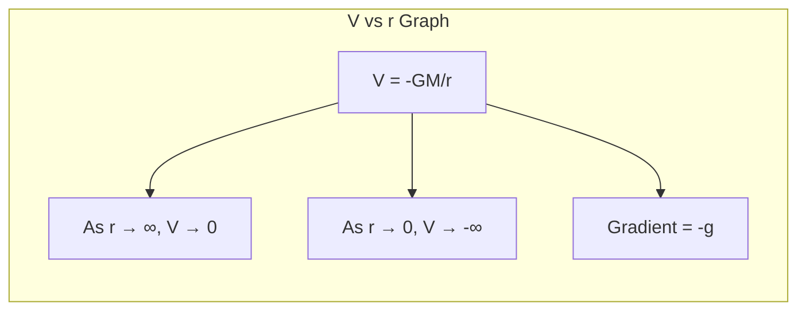

# 1. Overview / 概述

**English:**
Gravitational Potential ($V$) is a scalar quantity that describes the gravitational field at a point in terms of the work done per unit mass to bring a test mass from infinity to that point. Unlike gravitational field strength ($g$), which is a vector, potential is a scalar, making it easier to calculate the total gravitational effect of multiple masses. This sub-topic is fundamental to understanding [[Gravitational Potential Energy in a Radial Field]], [[Escape Velocity]], and [[Potential Gradients]]. It builds directly on [[Gravitational Force and Field]] and [[Kinetic Energy and Potential Energy]].

The concept of gravitational potential is crucial for explaining why objects fall, how satellites orbit, and why black holes exist. At A-Level, you will learn to calculate potential in radial fields, interpret potential-distance graphs, and understand the relationship between potential and field strength.

**中文:**
引力势 ($V$) 是一个标量，它描述了引力场中某一点的性质，定义为将单位质量的测试质量从无穷远处移动到该点所需做的功。与矢量性的引力场强度 ($g$) 不同，势是标量，这使得计算多个质量的总体引力效应更加容易。本子知识点是理解[[径向场中的引力势能]]、[[逃逸速度]]和[[势梯度]]的基础。它直接建立在[[引力与引力场]]和[[动能与势能]]之上。

引力势的概念对于解释物体为何下落、卫星如何运行以及黑洞为何存在至关重要。在A-Level阶段，你将学习计算径向场中的势、解读势-距离图像，并理解势与场强之间的关系。

---

# 2. Syllabus Learning Objectives / 考纲学习目标

| CAIE 9702 (15.2 a-f) | Edexcel IAL (WPH14 U4: 6.6-6.10) |
|----------------------|----------------------------------|
| Define gravitational potential at a point as the work done per unit mass in bringing a test mass from infinity to that point | Define gravitational potential at a point as the work done per unit mass in bringing a small test mass from infinity to that point |
| State and use the equation $V = -\frac{GM}{r}$ for a point mass | Derive and use $V = -\frac{GM}{r}$ for a point mass |
| Calculate gravitational potential for a system of point masses (scalar addition) | Calculate gravitational potential for a system of point masses (scalar addition) |
| Explain the significance of the negative sign in gravitational potential | Explain the significance of the negative sign in gravitational potential |
| Sketch and interpret graphs of $V$ against $r$ for a point mass | Sketch and interpret graphs of $V$ against $r$ for a point mass |
| Understand the relationship between gravitational potential and gravitational field strength: $g = -\frac{dV}{dr}$ | Understand the relationship between gravitational potential and gravitational field strength: $g = -\frac{dV}{dr}$ |

**Examiner Expectations / 考官期望:**
- **English:** You must be able to define gravitational potential precisely, including the phrase "work done per unit mass" and "from infinity". The negative sign must be explained physically — it means potential is zero at infinity and decreases (becomes more negative) as you approach a mass. You should be able to calculate the total potential at a point due to multiple masses by scalar addition. Graph interpretation is essential: the gradient of $V$ vs $r$ gives $-g$.
- **中文:** 你必须能够精确定义引力势，包括"单位质量所做的功"和"从无穷远处"这些短语。必须从物理上解释负号的含义——这意味着势在无穷远处为零，并随着接近质量而减小（变得更负）。你应该能够通过标量加法计算多个质量在某一点的总势。图像解读至关重要：$V$ 对 $r$ 图像的斜率给出 $-g$。

---

# 3. Core Definitions / 核心定义

| Term (EN/CN) | Definition (EN) | Definition (CN) | Common Mistakes / 常见错误 |
|--------------|-----------------|-----------------|---------------------------|
| **Gravitational Potential** / 引力势 | The work done per unit mass in bringing a small test mass from infinity to that point in the field. | 将单位质量的测试质量从无穷远处移动到引力场中某一点所做的功。 | ❌ Confusing with gravitational potential energy ($E_p = mV$). Potential is per unit mass. |
| **Infinity** / 无穷远 | A point so far from all masses that the gravitational field strength is effectively zero. | 距离所有质量足够远，使得引力场强度实际上为零的点。 | ❌ Thinking infinity is a specific distance — it's a conceptual reference point. |
| **Radial Field** / 径向场 | A gravitational field where field lines radiate from a point mass, with strength decreasing as $1/r^2$. | 场线从点质量向外辐射的引力场，强度随 $1/r^2$ 减小。 | ❌ Forgetting that $V$ is negative in a radial field around a single mass. |
| **Equipotential Surface** / 等势面 | A surface on which the gravitational potential is constant. No work is done moving a mass along an equipotential surface. | 引力势恒定的表面。沿等势面移动质量不做功。 | ❌ Thinking field lines are perpendicular to equipotentials — they are, but students often draw them parallel. |
| **Potential Gradient** / 势梯度 | The rate of change of gravitational potential with distance, related to field strength by $g = -\frac{dV}{dr}$. | 引力势随距离的变化率，通过 $g = -\frac{dV}{dr}$ 与场强相关。 | ❌ Forgetting the negative sign: $g$ is positive (directed inward) while $dV/dr$ is positive (potential increases outward). |

---

# 4. Key Concepts Explained / 关键概念详解

## 4.1 Definition and Physical Meaning of Gravitational Potential / 引力势的定义与物理意义

### Explanation / 解释
**English:**
Gravitational potential $V$ at a point is defined as:

$$ V = \frac{W}{m} $$

where $W$ is the work done by an external agent to bring a test mass $m$ from infinity to that point. For a point mass $M$, the potential at distance $r$ is:

$$ V = -\frac{GM}{r} $$

The negative sign is crucial: it indicates that gravitational forces are attractive. Work must be done **against** the field to move a mass away from $M$, so potential energy increases (becomes less negative) as $r$ increases. At infinity, $V = 0$.

This is a scalar quantity, so for multiple masses, the total potential at a point is the algebraic sum:

$$ V_{\text{total}} = V_1 + V_2 + V_3 + \dots $$

This is much simpler than vector addition of field strengths.

**中文:**
引力势 $V$ 定义为：

$$ V = \frac{W}{m} $$

其中 $W$ 是外力将测试质量 $m$ 从无穷远处移动到该点所做的功。对于点质量 $M$，距离 $r$ 处的势为：

$$ V = -\frac{GM}{r} $$

负号至关重要：它表示引力是吸引力。将质量从 $M$ 移开需要**克服**场做功，因此势能随着 $r$ 增加而增加（变得更不负面）。在无穷远处，$V = 0$。

这是一个标量，因此对于多个质量，某一点的总势是代数和：

$$ V_{\text{总}} = V_1 + V_2 + V_3 + \dots $$

这比场强的矢量加法简单得多。

### Physical Meaning / 物理意义
**English:**
Gravitational potential tells us the "potential energy per unit mass" at a point. A more negative potential means a mass placed there has less gravitational potential energy (it is more tightly bound to the mass creating the field). The negative sign reflects that gravitational potential energy is always negative in a bound system — you must add energy to separate the masses.

**中文:**
引力势告诉我们某一点的"单位质量的势能"。更负的势意味着放置在那里的质量具有更少的引力势能（它更紧密地束缚在产生场的质量上）。负号反映了在束缚系统中引力势能总是负的——你必须增加能量才能分离质量。

### Common Misconceptions / 常见误区
- ❌ **English:** "Potential is the same as potential energy." — No! Potential is per unit mass ($V = E_p/m$). Potential energy depends on the mass placed in the field.
- ❌ **中文:** "势和势能是一样的。" — 不对！势是单位质量的势能 ($V = E_p/m$)。势能取决于放置在场中的质量。
- ❌ **English:** "The negative sign means potential is always decreasing." — The negative sign means potential is negative, but it increases (becomes less negative) as $r$ increases.
- ❌ **中文:** "负号意味着势总是在减小。" — 负号意味着势是负的，但随着 $r$ 增加，势增加（变得更不负面）。
- ❌ **English:** "Potential at a point is the work done by the field." — No, it's the work done by an external agent against the field.
- ❌ **中文:** "某一点的势是场做的功。" — 不对，是外力克服场做的功。

### Exam Tips / 考试提示
- ✅ **English:** Always include the phrase "per unit mass" and "from infinity" in definitions.
- ✅ **中文:** 在定义中始终包含"单位质量"和"从无穷远处"这些短语。
- ✅ **English:** When calculating total potential from multiple masses, use scalar addition — just add the $V$ values (with signs).
- ✅ **中文:** 计算多个质量的总势时，使用标量加法——只需将 $V$ 值（带符号）相加。
- ✅ **English:** Remember: $V$ is negative for a single mass, but can be positive or negative in a system of multiple masses depending on positions.
- ✅ **中文:** 记住：对于单个质量，$V$ 是负的，但在多个质量的系统中，根据位置可以是正或负。

> 📷 **IMAGE PROMPT — V01: Gravitational Potential Definition Diagram**
> A diagram showing a large mass M at the center, with radial lines extending outward. A small test mass m is shown at distance r from M. An arrow labeled "Work done by external agent" points from infinity toward the point at distance r. The equation V = -GM/r is displayed. The diagram should clearly show that potential is zero at infinity and becomes more negative as r decreases.

---

## 4.2 The Negative Sign in Gravitational Potential / 引力势中的负号

### Explanation / 解释
**English:**
The negative sign in $V = -\frac{GM}{r}$ is not arbitrary — it has deep physical significance:

1. **Zero at infinity:** By convention, gravitational potential is defined as zero at infinity. This is a reference point.
2. **Attractive force:** Since gravity is attractive, moving a mass from infinity toward $M$ releases energy (the field does positive work). Therefore, the potential energy decreases, making $V$ negative.
3. **Bound systems:** A negative potential indicates a bound system — the mass is trapped in the gravitational field. To escape, you must add energy to raise the potential to zero.

Think of it like a well: the deeper the well (more negative $V$), the harder it is to climb out.

**中文:**
$V = -\frac{GM}{r}$ 中的负号并非随意——它具有深刻的物理意义：

1. **无穷远处为零：** 按照惯例，引力势被定义为在无穷远处为零。这是一个参考点。
2. **吸引力：** 由于引力是吸引力，将质量从无穷远处向 $M$ 移动会释放能量（场做正功）。因此，势能减小，使 $V$ 为负。
3. **束缚系统：** 负势表示束缚系统——质量被困在引力场中。要逃逸，你必须增加能量以将势提高到零。

可以把它想象成一个井：井越深（$V$ 越负），爬出来就越困难。

### Common Misconceptions / 常见误区
- ❌ **English:** "Negative potential means negative energy." — No, it means the potential is lower than the reference (infinity). The actual energy depends on the mass.
- ❌ **中文:** "负势意味着负能量。" — 不对，它意味着势低于参考点（无穷远）。实际能量取决于质量。
- ❌ **English:** "The negative sign can be ignored in calculations." — Never! The sign is essential for correct results.
- ❌ **中文:** "计算中可以忽略负号。" — 绝不能！符号对于正确结果至关重要。

### Exam Tips / 考试提示
- ✅ **English:** When asked "Why is gravitational potential negative?", mention: (1) zero at infinity, (2) attractive force, (3) work done by field is positive when mass moves inward.
- ✅ **中文:** 当被问到"为什么引力势是负的？"时，提到：(1) 无穷远处为零，(2) 吸引力，(3) 质量向内移动时场做正功。
- ✅ **English:** In multiple-choice questions, check if the answer includes the negative sign — many distractors omit it.
- ✅ **中文:** 在选择题中，检查答案是否包含负号——许多干扰项会省略它。

---

## 4.3 Gravitational Potential for Multiple Masses / 多个质量的引力势

### Explanation / 解释
**English:**
Since gravitational potential is a scalar, the total potential at a point due to multiple masses is simply the algebraic sum of the potentials from each mass:

$$ V_{\text{total}} = \sum_{i} V_i = -\sum_{i} \frac{GM_i}{r_i} $$

where $r_i$ is the distance from the point to mass $M_i$.

**Example:** For two masses $M_1$ and $M_2$ separated by distance $d$, the potential at the midpoint is:

$$ V_{\text{mid}} = -\frac{GM_1}{d/2} - \frac{GM_2}{d/2} = -\frac{2G(M_1 + M_2)}{d} $$

**中文:**
由于引力势是标量，多个质量在某一点的总势就是每个质量产生的势的代数和：

$$ V_{\text{总}} = \sum_{i} V_i = -\sum_{i} \frac{GM_i}{r_i} $$

其中 $r_i$ 是从该点到质量 $M_i$ 的距离。

**示例：** 对于相距 $d$ 的两个质量 $M_1$ 和 $M_2$，中点的势为：

$$ V_{\text{中点}} = -\frac{GM_1}{d/2} - \frac{GM_2}{d/2} = -\frac{2G(M_1 + M_2)}{d} $$

### Common Misconceptions / 常见误区
- ❌ **English:** "I need to add potentials as vectors." — No! Potential is scalar — just add the values with signs.
- ❌ **中文:** "我需要将势作为矢量相加。" — 不对！势是标量——只需将带符号的值相加。
- ❌ **English:** "The potential is always negative." — Not necessarily. If you are between two masses, the potentials from each mass are negative, so the sum is negative. But if you are outside a system, the potential could be positive if the net effect is repulsive (though gravity is always attractive).
- ❌ **中文:** "势总是负的。" — 不一定。如果你在两个质量之间，每个质量的势都是负的，所以总和是负的。但如果你在系统外部，如果净效应是排斥的（尽管引力总是吸引的），势可能是正的。

### Exam Tips / 考试提示
- ✅ **English:** Draw a diagram showing distances from each mass to the point of interest. Label all distances clearly.
- ✅ **中文:** 画一个图，显示从每个质量到感兴趣点的距离。清晰标注所有距离。
- ✅ **English:** Use the same units for all distances and masses. Watch out for $r$ in km vs m.
- ✅ **中文:** 对所有距离和质量使用相同的单位。注意 $r$ 是千米还是米。

> 📷 **IMAGE PROMPT — V02: Gravitational Potential for Two Masses**
> A diagram showing two masses M1 and M2 separated by distance d. A point P is marked at the midpoint. Distances from P to M1 and M2 are labeled as d/2 each. The equation V_total = -2G(M1+M2)/d is shown. Arrows indicate the direction of the gravitational field from each mass toward the other.

---

## 4.4 Relationship Between Potential and Field Strength / 势与场强的关系

### Explanation / 解释
**English:**
Gravitational field strength $g$ and gravitational potential $V$ are related by:

$$ g = -\frac{dV}{dr} $$

This means:
- The **gradient** of the $V$ vs $r$ graph gives $-g$
- A steeper gradient means a stronger field
- The negative sign means that as $r$ increases, $V$ increases (becomes less negative), so $dV/dr$ is positive, but $g$ is directed inward (negative in the $r$ direction)

For a radial field:
- $V = -\frac{GM}{r}$
- $\frac{dV}{dr} = \frac{GM}{r^2}$
- Therefore $g = -\frac{GM}{r^2}$ (the familiar inverse square law)

**中文:**
引力场强度 $g$ 和引力势 $V$ 的关系为：

$$ g = -\frac{dV}{dr} $$

这意味着：
- $V$ 对 $r$ 图像的**斜率**给出 $-g$
- 斜率越陡，场越强
- 负号意味着随着 $r$ 增加，$V$ 增加（变得更不负面），所以 $dV/dr$ 为正，但 $g$ 指向内（在 $r$ 方向上为负）

对于径向场：
- $V = -\frac{GM}{r}$
- $\frac{dV}{dr} = \frac{GM}{r^2}$
- 因此 $g = -\frac{GM}{r^2}$（熟悉的平方反比定律）

### Common Misconceptions / 常见误区
- ❌ **English:** "Field strength is the gradient of potential." — Almost, but with a negative sign: $g = -dV/dr$.
- ❌ **中文:** "场强是势的梯度。" — 差不多，但有负号：$g = -dV/dr$。
- ❌ **English:** "A positive gradient means field is positive." — No, $g$ is negative (inward) when $dV/dr$ is positive.
- ❌ **中文:** "正斜率意味着场是正的。" — 不对，当 $dV/dr$ 为正时，$g$ 是负的（向内）。

### Exam Tips / 考试提示
- ✅ **English:** On a $V$ vs $r$ graph, the gradient at any point gives $-g$. To find $g$, take the negative of the gradient.
- ✅ **中文:** 在 $V$ 对 $r$ 图像上，任意点的斜率给出 $-g$。要找到 $g$，取斜率的负值。
- ✅ **English:** This relationship is often tested in graph interpretation questions — be ready to calculate gradients.
- ✅ **中文:** 这个关系经常在图像解读题中测试——准备好计算斜率。

---

# 5. Essential Equations / 核心公式

## 5.1 Gravitational Potential for a Point Mass / 点质量的引力势

$$ V = -\frac{GM}{r} $$

| Symbol (符号) | Meaning (EN) | Meaning (CN) | Unit (单位) |
|--------------|-------------|-------------|------------|
| $V$ | Gravitational potential | 引力势 | J kg$^{-1}$ |
| $G$ | Gravitational constant ($6.67 \times 10^{-11}$ N m$^2$ kg$^{-2}$) | 引力常数 | N m$^2$ kg$^{-2}$ |
| $M$ | Mass of the object creating the field | 产生场的物体质量 | kg |
| $r$ | Distance from the center of mass | 距质心的距离 | m |

**Derivation / 推导:**
Work done to move mass $m$ from infinity to distance $r$:
$$ W = \int_{\infty}^{r} F \, dr = \int_{\infty}^{r} \frac{GMm}{r^2} \, dr = GMm \left[-\frac{1}{r}\right]_{\infty}^{r} = -\frac{GMm}{r} $$
Then $V = W/m = -\frac{GM}{r}$.

**Conditions / 适用条件:**
- **English:** For a point mass or a spherically symmetric mass distribution (outside the mass).
- **中文:** 适用于点质量或球对称质量分布（在质量外部）。

**Limitations / 局限性:**
- **English:** Does not apply inside a massive body (e.g., inside the Earth). For a uniform sphere, potential inside varies as $V \propto r^2$.
- **中文:** 不适用于大质量物体内部（例如地球内部）。对于均匀球体，内部势按 $V \propto r^2$ 变化。

> 📷 **IMAGE PROMPT — V03: Gravitational Potential Formula Diagram**
> A diagram showing a point mass M at the center. A point at distance r is marked. The equation V = -GM/r is displayed. An arrow from infinity to the point shows the direction of work done. The graph of V vs r is shown as a hyperbola approaching zero as r → ∞ and becoming more negative as r → 0.

---

## 5.2 Total Gravitational Potential for Multiple Masses / 多个质量的总引力势

$$ V_{\text{total}} = \sum_{i} V_i = -\sum_{i} \frac{GM_i}{r_i} $$

| Symbol (符号) | Meaning (EN) | Meaning (CN) | Unit (单位) |
|--------------|-------------|-------------|------------|
| $V_{\text{total}}$ | Total gravitational potential at a point | 某一点的总引力势 | J kg$^{-1}$ |
| $M_i$ | Mass of the $i$-th object | 第 $i$ 个物体的质量 | kg |
| $r_i$ | Distance from the point to $M_i$ | 从该点到 $M_i$ 的距离 | m |

**Conditions / 适用条件:**
- **English:** Valid for any configuration of point masses. Use scalar addition.
- **中文:** 适用于任何点质量配置。使用标量加法。

**Limitations / 局限性:**
- **English:** Assumes masses are point-like or spherically symmetric.
- **中文:** 假设质量是点状或球对称的。

---

## 5.3 Relationship Between Field Strength and Potential / 场强与势的关系

$$ g = -\frac{dV}{dr} $$

| Symbol (符号) | Meaning (EN) | Meaning (CN) | Unit (单位) |
|--------------|-------------|-------------|------------|
| $g$ | Gravitational field strength | 引力场强度 | N kg$^{-1}$ or m s$^{-2}$ |
| $V$ | Gravitational potential | 引力势 | J kg$^{-1}$ |
| $r$ | Distance | 距离 | m |

**Derivation / 推导:**
From $F = -\frac{dE_p}{dr}$ and $E_p = mV$, we get $F = -m\frac{dV}{dr}$. Since $g = F/m$, we have $g = -\frac{dV}{dr}$.

**Conditions / 适用条件:**
- **English:** General relationship valid for any gravitational field.
- **中文:** 适用于任何引力场的一般关系。

**Limitations / 局限性:**
- **English:** Requires $V$ to be differentiable (smooth function of $r$).
- **中文:** 要求 $V$ 是可微的（$r$ 的光滑函数）。

---

# 6. Graphs and Relationships / 图表与关系

## 6.1 Gravitational Potential vs Distance ($V$ vs $r$) / 引力势与距离的关系

### Axes / 坐标轴
- **x-axis:** Distance from center of mass, $r$ (m) / 距质心的距离 $r$ (m)
- **y-axis:** Gravitational potential, $V$ (J kg$^{-1}$) / 引力势 $V$ (J kg$^{-1}$)

### Shape / 形状
- **English:** A hyperbola that approaches zero as $r \to \infty$ and approaches $-\infty$ as $r \to 0$. The curve is always below the x-axis (negative).
- **中文:** 一条双曲线，当 $r \to \infty$ 时趋近于零，当 $r \to 0$ 时趋近于 $-\infty$。曲线始终在 x 轴下方（负值）。

### Gradient Meaning / 斜率含义
- **English:** The gradient at any point equals $-g$. A steeper (more negative) gradient means a stronger gravitational field.
- **中文:** 任意点的斜率等于 $-g$。斜率越陡（更负）意味着引力场越强。

### Area Meaning / 面积含义
- **English:** The area under the $V$ vs $r$ graph has no direct physical meaning. However, the area under the $g$ vs $r$ graph gives the change in potential.
- **中文:** $V$ 对 $r$ 图像下的面积没有直接的物理意义。然而，$g$ 对 $r$ 图像下的面积给出势的变化。

### Exam Interpretation / 考试解读
- **English:** You may be asked to:
  - Read values of $V$ at specific $r$
  - Calculate the gradient to find $g$
  - Compare potentials at different distances
  - Sketch the graph for different masses
- **中文:** 你可能会被要求：
  - 读取特定 $r$ 处的 $V$ 值
  - 计算斜率以找到 $g$
  - 比较不同距离处的势
  - 为不同质量绘制图像

> 📷 **IMAGE PROMPT — V04: Gravitational Potential vs Distance Graph**
> A graph with r on the x-axis (from 0 to ∞) and V on the y-axis (negative values). The curve is a hyperbola starting at -∞ near r=0, rising steeply, then flattening as it approaches zero at large r. The curve is always below the x-axis. A tangent line is drawn at one point, with the gradient labeled as -g. The equation V = -GM/r is shown.

---

## 6.2 Equipotential Surfaces / 等势面

### Axes / 坐标轴
- **English:** No traditional axes. Equipotential surfaces are drawn in 2D or 3D space.
- **中文:** 没有传统的坐标轴。等势面在二维或三维空间中绘制。

### Shape / 形状
- **English:** For a point mass, equipotential surfaces are concentric spheres centered on the mass. In 2D, they appear as concentric circles.
- **中文:** 对于点质量，等势面是以质量为中心的同心球面。在二维中，它们表现为同心圆。

### Gradient Meaning / 斜率含义
- **English:** The spacing between equipotential surfaces indicates field strength: closer spacing means stronger field.
- **中文:** 等势面之间的间距表示场强：间距越近，场越强。

### Area Meaning / 面积含义
- **English:** Moving along an equipotential surface requires no work.
- **中文:** 沿等势面移动不需要做功。

### Exam Interpretation / 考试解读
- **English:** You may be asked to:
  - Draw equipotential surfaces for a given mass distribution
  - Show that field lines are perpendicular to equipotentials
  - Explain why no work is done moving along an equipotential
- **中文:** 你可能会被要求：
  - 为给定的质量分布绘制等势面
  - 证明场线垂直于等势面
  - 解释为什么沿等势面移动不做功

> 📷 **IMAGE PROMPT — V05: Equipotential Surfaces for a Point Mass**
> A 2D diagram showing a point mass M at the center. Concentric circles (equipotentials) are drawn around M, with labels V1, V2, V3 (V1 < V2 < V3, all negative). Radial field lines (arrows pointing inward) are shown perpendicular to the circles. The spacing between circles decreases as they get closer to M, indicating stronger field.

---

# 7. Required Diagrams / 必备图表

## 7.1 Gravitational Potential vs Distance Graph / 引力势与距离关系图

### Description / 描述
**English:** A graph showing how gravitational potential $V$ varies with distance $r$ from a point mass $M$. The curve is a hyperbola: $V = -GM/r$. Key features: negative values, approaches zero as $r \to \infty$, approaches $-\infty$ as $r \to 0$, gradient gives $-g$.

**中文:** 显示引力势 $V$ 如何随距点质量 $M$ 的距离 $r$ 变化的图像。曲线是双曲线：$V = -GM/r$。关键特征：负值，当 $r \to \infty$ 时趋近于零，当 $r \to 0$ 时趋近于 $-\infty$，斜率给出 $-g$。

### Image Prompt / 图片生成提示
> 📷 **IMAGE PROMPT — V06: V vs r Graph for Point Mass**
> A professional physics graph with r (distance) on the x-axis from 0 to 10 units, and V (gravitational potential) on the y-axis from -10 to 0 J/kg. The curve is a smooth hyperbola starting near -∞ at r=0.5, rising steeply to about -5 at r=2, then gradually approaching 0 as r increases. The curve is labeled V = -GM/r. A tangent line is drawn at r=3 with gradient labeled as -g. The graph has gridlines and is suitable for A-Level physics.

### Labels Required / 需要标注
- **English:** Axes: $r$ (m) and $V$ (J kg$^{-1}$); Curve: $V = -\frac{GM}{r}$; Asymptote: $V = 0$ as $r \to \infty$; Tangent with gradient $-g$
- **中文:** 坐标轴：$r$ (m) 和 $V$ (J kg$^{-1}$)；曲线：$V = -\frac{GM}{r}$；渐近线：$V = 0$ 当 $r \to \infty$；切线斜率为 $-g$

### Exam Importance / 考试重要性
- **English:** Very high. Graph interpretation questions are common in both CAIE and Edexcel exams.
- **中文:** 非常高。图像解读题在 CAIE 和 Edexcel 考试中都很常见。

---

## 7.2 Equipotential Surfaces and Field Lines / 等势面与场线

### Description / 描述
**English:** A diagram showing concentric spherical equipotential surfaces around a point mass, with radial field lines perpendicular to them. The spacing between equipotentials decreases as distance to the mass decreases.

**中文:** 显示点质量周围同心球面等势面的图，径向场线垂直于它们。等势面之间的间距随着到质量的距离减小而减小。

### Image Prompt / 图片生成提示
> 📷 **IMAGE PROMPT — V07: Equipotential Surfaces and Field Lines**
> A 2D cross-section diagram showing a large mass M at the center. Three concentric circles (equipotentials) are drawn with radii r1, r2, r3 (r1 < r2 < r3). Each circle is labeled with its potential V1, V2, V3 (V1 < V2 < V3, all negative). Radial arrows (field lines) point inward from the outer circle to M, perpendicular to the circles. The spacing between circles decreases as they approach M. A note says "No work done moving along equipotential."

### Labels Required / 需要标注
- **English:** Mass $M$; Equipotentials $V_1$, $V_2$, $V_3$; Field lines (arrows); Perpendicular symbol (⊥)
- **中文:** 质量 $M$；等势面 $V_1$, $V_2$, $V_3$；场线（箭头）；垂直符号 (⊥)

### Exam Importance / 考试重要性
- **English:** High. Understanding equipotentials helps explain orbital mechanics and energy considerations.
- **中文:** 高。理解等势面有助于解释轨道力学和能量考虑。

---

# 8. Worked Examples / 典型例题

## Example 1: Calculating Gravitational Potential / 计算引力势

### Question / 题目
**English:**
The Earth has mass $M_E = 5.97 \times 10^{24}$ kg and radius $R_E = 6.37 \times 10^6$ m. A satellite is at an altitude of 200 km above the Earth's surface.

(a) Calculate the gravitational potential at the satellite's position.
(b) Calculate the gravitational potential at the Earth's surface.
(c) Find the difference in potential between the surface and the satellite.

$G = 6.67 \times 10^{-11}$ N m$^2$ kg$^{-2}$

**中文:**
地球质量 $M_E = 5.97 \times 10^{24}$ kg，半径 $R_E = 6.37 \times 10^6$ m。一颗卫星在地球表面上方 200 km 的高度。

(a) 计算卫星位置处的引力势。
(b) 计算地球表面处的引力势。
(c) 求表面与卫星之间的势差。

$G = 6.67 \times 10^{-11}$ N m$^2$ kg$^{-2}$

### Solution / 解答

**Step 1: Convert altitude to distance from Earth's center / 将高度转换为距地心的距离**

$$ r_{\text{satellite}} = R_E + h = 6.37 \times 10^6 + 200 \times 10^3 = 6.57 \times 10^6 \text{ m} $$

**Step 2: Calculate potential at satellite position / 计算卫星位置处的势**

$$ V_{\text{satellite}} = -\frac{GM_E}{r_{\text{satellite}}} = -\frac{(6.67 \times 10^{-11})(5.97 \times 10^{24})}{6.57 \times 10^6} $$

$$ V_{\text{satellite}} = -\frac{3.98 \times 10^{14}}{6.57 \times 10^6} = -6.06 \times 10^7 \text{ J kg}^{-1} $$

**Step 3: Calculate potential at Earth's surface / 计算地球表面处的势**

$$ V_{\text{surface}} = -\frac{GM_E}{R_E} = -\frac{(6.67 \times 10^{-11})(5.97 \times 10^{24})}{6.37 \times 10^6} $$

$$ V_{\text{surface}} = -\frac{3.98 \times 10^{14}}{6.37 \times 10^6} = -6.25 \times 10^7 \text{ J kg}^{-1} $$

**Step 4: Find potential difference / 求势差**

$$ \Delta V = V_{\text{satellite}} - V_{\text{surface}} = (-6.06 \times 10^7) - (-6.25 \times 10^7) = 1.9 \times 10^6 \text{ J kg}^{-1} $$

The potential is higher (less negative) at the satellite's position.

### Final Answer / 最终答案
**Answer:**
(a) $V_{\text{satellite}} = -6.06 \times 10^7$ J kg$^{-1}$
(b) $V_{\text{surface}} = -6.25 \times 10^7$ J kg$^{-1}$
(c) $\Delta V = 1.9 \times 10^6$ J kg$^{-1}$

**答案：**
(a) $V_{\text{卫星}} = -6.06 \times 10^7$ J kg$^{-1}$
(b) $V_{\text{表面}} = -6.25 \times 10^7$ J kg$^{-1}$
(c) $\Delta V = 1.9 \times 10^6$ J kg$^{-1}$

### Quick Tip / 提示
- **English:** Always use distance from the **center** of the mass, not the surface. Convert km to m.
- **中文:** 始终使用距质量**中心**的距离，而不是表面。将 km 转换为 m。

---

## Example 2: Gravitational Potential from Two Masses / 两个质量的引力势

### Question / 题目
**English:**
Two stars of masses $M_1 = 2.0 \times 10^{30}$ kg and $M_2 = 3.0 \times 10^{30}$ kg are separated by a distance of $1.0 \times 10^{11}$ m. Calculate the gravitational potential at the midpoint between them.

$G = 6.67 \times 10^{-11}$ N m$^2$ kg$^{-2}$

**中文:**
两颗恒星的质量分别为 $M_1 = 2.0 \times 10^{30}$ kg 和 $M_2 = 3.0 \times 10^{30}$ kg，相距 $1.0 \times 10^{11}$ m。计算它们中点处的引力势。

$G = 6.67 \times 10^{-11}$ N m$^2$ kg$^{-2}$

### Solution / 解答

**Step 1: Find distance from midpoint to each star / 求中点到每颗恒星的距离**

$$ r_1 = r_2 = \frac{d}{2} = \frac{1.0 \times 10^{11}}{2} = 5.0 \times 10^{10} \text{ m} $$

**Step 2: Calculate potential from each star / 计算每颗恒星产生的势**

$$ V_1 = -\frac{GM_1}{r_1} = -\frac{(6.67 \times 10^{-11})(2.0 \times 10^{30})}{5.0 \times 10^{10}} = -\frac{1.334 \times 10^{20}}{5.0 \times 10^{10}} = -2.67 \times 10^9 \text{ J kg}^{-1} $$

$$ V_2 = -\frac{GM_2}{r_2} = -\frac{(6.67 \times 10^{-11})(3.0 \times 10^{30})}{5.0 \times 10^{10}} = -\frac{2.001 \times 10^{20}}{5.0 \times 10^{10}} = -4.00 \times 10^9 \text{ J kg}^{-1} $$

**Step 3: Add potentials (scalar addition) / 势相加（标量加法）**

$$ V_{\text{total}} = V_1 + V_2 = (-2.67 \times 10^9) + (-4.00 \times 10^9) = -6.67 \times 10^9 \text{ J kg}^{-1} $$

### Final Answer / 最终答案
**Answer:** $V_{\text{total}} = -6.67 \times 10^9$ J kg$^{-1}$
**答案：** $V_{\text{总}} = -6.67 \times 10^9$ J kg$^{-1}$

### Quick Tip / 提示
- **English:** Remember: potential is scalar — just add the values. Don't use vector addition!
- **中文:** 记住：势是标量——只需将值相加。不要使用矢量加法！

---

# 9. Past Paper Question Types / 历年真题题型

| Question Type / 题型 | Frequency / 频率 | Difficulty / 难度 | Past Paper References / 真题索引 |
|----------------------|------------------|------------------|-------------------------------|
| Definition of gravitational potential | Medium | Easy | 📝 *待填入* |
| Calculation of $V$ for a single mass | High | Medium | 📝 *待填入* |
| Calculation of $V$ for multiple masses | Medium | Medium-Hard | 📝 *待填入* |
| Graph interpretation ($V$ vs $r$) | High | Medium | 📝 *待填入* |
| Relationship $g = -dV/dr$ | Medium | Medium-Hard | 📝 *待填入* |
| Equipotential surfaces | Low | Easy-Medium | 📝 *待填入* |
| Potential difference and work done | Medium | Medium | 📝 *待填入* |

**Common Command Words / 常见指令词:**
- **English:** Define, Calculate, Sketch, Interpret, Explain, Derive, Show that
- **中文:** 定义、计算、绘制、解读、解释、推导、证明

---

# 10. Practical Skills Connections / 实验技能链接

**English:**
While gravitational potential is not directly measured in practical experiments, the concept connects to several practical skills:

1. **Graph Plotting and Analysis:** Plotting $V$ vs $r$ data (from calculations or simulations) and finding gradients to determine $g$.
2. **Uncertainty Analysis:** When calculating $V$ from $M$ and $r$, propagate uncertainties:
   $$ \frac{\Delta V}{V} = \frac{\Delta M}{M} + \frac{\Delta r}{r} $$
3. **Experimental Design:** Although we cannot directly measure $V$, we can measure gravitational field strength $g$ (e.g., using a pendulum or free-fall apparatus) and integrate to find $\Delta V$.
4. **Simulation:** Use computer simulations to model gravitational potential around multiple masses and visualize equipotential surfaces.

**中文:**
虽然引力势在实验中没有直接测量，但该概念与多项实验技能相关：

1. **绘图与分析：** 绘制 $V$ 对 $r$ 的数据（来自计算或模拟）并求斜率以确定 $g$。
2. **不确定度分析：** 从 $M$ 和 $r$ 计算 $V$ 时，传播不确定度：
   $$ \frac{\Delta V}{V} = \frac{\Delta M}{M} + \frac{\Delta r}{r} $$
3. **实验设计：** 虽然我们无法直接测量 $V$，但可以测量引力场强度 $g$（例如使用单摆或自由落体装置）并积分以找到 $\Delta V$。
4. **模拟：** 使用计算机模拟来建模多个质量周围的引力势并可视化等势面。

---

# 11. Concept Map / 概念图谱

```mermaid
graph TD
    %% Gravitational Potential Leaf Node
    V[Gravitational Potential V] --> DEF[Definition: Work per unit mass from infinity]
    V --> EQ[Equation: V = -GM/r]
    V --> NEG[Negative Sign: Attractive force, zero at infinity]
    V --> MULTI[Multiple Masses: Scalar addition]
    V --> GRAPH[V vs r Graph: Hyperbola, gradient = -g]
    V --> EQUIP[Equipotential Surfaces: Concentric spheres]
    V --> REL[Relationship: g = -dV/dr]

    %% Connections to parent hub
    V -->|Parent| GP[[Gravitational Potential]]

    %% Connections to siblings
    V -->|Leads to| GPE[[Gravitational Potential Energy in a Radial Field]]
    V -->|Leads to| EV[[Escape Velocity]]
    V -->|Leads to| PG[[Potential Gradients]]

    %% Prerequisites
    GFF[[Gravitational Force and Field]] -->|Prerequisite| V
    KEPE[[Kinetic Energy and Potential Energy]] -->|Prerequisite| V

    %% Related topics
    V -->|Related to| CO[[Circular Orbits]]

    %% Styling
    classDef leaf fill:#e1f5fe,stroke:#01579b,stroke-width:2px
    classDef hub fill:#fff3e0,stroke:#e65100,stroke-width:2px
    classDef sibling fill:#f3e5f5,stroke:#7b1fa2,stroke-width:1px
    classDef prereq fill:#e8f5e9,stroke:#2e7d32,stroke-width:1px
    classDef related fill:#fff8e1,stroke:#f57f17,stroke-width:1px

    class V leaf
    class GP hub
    class GPE,EV,PG sibling
    class GFF,KEPE prereq
    class CO related
```

---

# 12. Quick Revision Sheet / 速查表

| Category / 类别 | Key Points / 要点 |
|----------------|------------------|
| **Definition / 定义** | Work done per unit mass to bring a test mass from infinity to that point / 将单位质量的测试质量从无穷远处移动到该点所做的功 |
| **Key Formula / 核心公式** | $V = -\frac{GM}{r}$ (single mass); $V_{\text{total}} = \sum V_i$ (multiple masses) |
| **Key Graph / 核心图表** | $V$ vs $r$: Hyperbola, negative values, gradient = $-g$ / $V$ 对 $r$：双曲线，负值，斜率 = $-g$ |
| **Negative Sign / 负号** | Indicates attractive force; zero at infinity; bound systems have negative potential / 表示吸引力；无穷远处为零；束缚系统具有负势 |
| **Scalar Nature / 标量性质** | Potential is scalar — add algebraically, not as vectors / 势是标量——代数相加，而非矢量相加 |
| **Relationship / 关系** | $g = -\frac{dV}{dr}$ — field strength is negative gradient of potential / 场强是势的负梯度 |
| **Equipotentials / 等势面** | Surfaces of constant $V$; field lines perpendicular; no work done moving along them / 恒定 $V$ 的表面；场线垂直；沿它们移动不做功 |
| **Common Mistake / 常见错误** | Confusing $V$ with $E_p$ ($E_p = mV$); forgetting negative sign; using vector addition / 混淆 $V$ 和 $E_p$ ($E_p = mV$)；忘记负号；使用矢量加法 |
| **Exam Tip / 考试提示** | Always use distance from center; convert units; include "per unit mass" in definitions / 始终使用距中心的距离；转换单位；在定义中包含"单位质量" |
| **Units / 单位** | $V$: J kg$^{-1}$; $g$: N kg$^{-1}$ or m s$^{-2}$ |