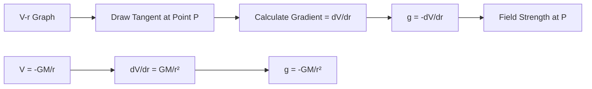
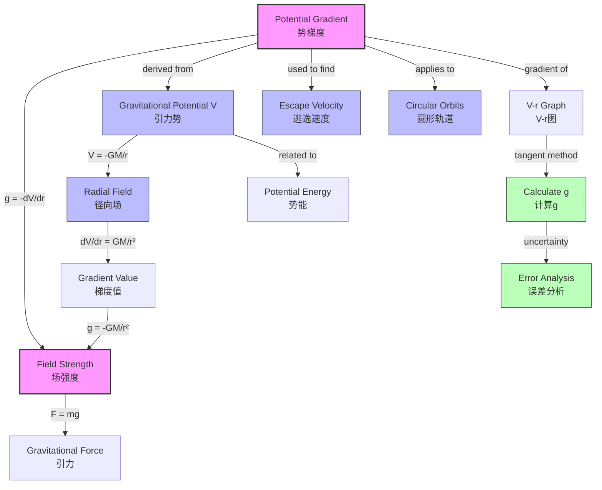

# 1. Overview / 概述

**English:**
This sub-topic explores the concept of **potential gradient** ($g = -\frac{dV}{dr}$) in gravitational fields — the rate of change of gravitational potential with distance. The potential gradient is fundamentally linked to gravitational field strength, providing a powerful mathematical relationship that connects potential and field. Understanding this gradient is crucial for analyzing how gravitational potential varies in radial fields, predicting field strength at any point, and solving problems involving gravitational potential energy changes. This concept bridges the theoretical definition of [[Gravitational Potential (V)]] with the practical measurement of [[Gravitational Force and Field]], and is essential for understanding [[Escape Velocity]] and [[Circular Orbits]].

**中文:**
本子知识点探讨引力场中**势梯度** ($g = -\frac{dV}{dr}$) 的概念——即引力势随距离的变化率。势梯度与引力场强度有根本性联系，提供了一个连接势和场的强大数学关系。理解这一梯度对于分析径向场中引力势如何变化、预测任意点的场强度以及解决涉及引力势能变化的问题至关重要。这一概念桥接了[[Gravitational Potential (V)]]的理论定义与[[Gravitational Force and Field]]的实际测量，并且对于理解[[Escape Velocity]]和[[Circular Orbits]]至关重要。

---

# 2. Syllabus Learning Objectives / 考纲学习目标

| CAIE 9702 | Edexcel IAL |
|-----------|-------------|
| 15.2(a): Understand that gravitational potential gradient is related to gravitational field strength | 6.6: Understand the relationship between gravitational potential and field strength |
| 15.2(b): Derive $g = -\frac{dV}{dr}$ from the definition of potential gradient | 6.7: Use $g = -\frac{dV}{dr}$ to calculate field strength from potential data |
| 15.2(c): Apply $g = -\frac{dV}{dr}$ to radial fields | 6.8: Interpret graphs of $V$ against $r$ |
| 15.2(d): Interpret $V$-$r$ graphs for gravitational fields | 6.9: Calculate potential gradient from $V$-$r$ graphs |
| 15.2(e): Calculate field strength from potential gradient | 6.10: Solve problems involving potential gradients in radial fields |
| 15.2(f): Understand that $g$ is the negative gradient of $V$ | — |

**Examiner Expectations / 考官期望:**
- **English:** Candidates must be able to derive $g = -\frac{dV}{dr}$ from first principles, interpret $V$-$r$ graphs to find field strength at any point, and apply the relationship to both uniform and radial gravitational fields. The negative sign is critical — it indicates that field strength points in the direction of decreasing potential.
- **中文:** 考生必须能够从基本原理推导$g = -\frac{dV}{dr}$，解读$V$-$r$图以找到任意点的场强度，并将该关系应用于均匀和径向引力场。负号至关重要——它表示场强度指向势减小的方向。

---

# 3. Core Definitions / 核心定义

| Term (EN/CN) | Definition (EN) | Definition (CN) | Common Mistakes / 常见错误 |
|--------------|-----------------|-----------------|---------------------------|
| **Potential Gradient** / 势梯度 | The rate of change of gravitational potential with respect to distance in a gravitational field | 引力场中引力势随距离的变化率 | Confusing gradient with field strength — they are related but not identical |
| **Gravitational Field Strength ($g$)** / 引力场强度 | The force per unit mass experienced by a test mass placed in a gravitational field | 放置在引力场中的测试质量单位质量所受的力 | Forgetting that $g$ is a vector while $V$ is a scalar |
| **Negative Gradient** / 负梯度 | The mathematical relationship $g = -\frac{dV}{dr}$ indicating field strength points toward decreasing potential | 数学关系$g = -\frac{dV}{dr}$表示场强度指向势减小的方向 | Omitting the negative sign in calculations |
| **Radial Field** / 径向场 | A gravitational field where field lines radiate from a central mass, with potential varying as $V \propto -\frac{1}{r}$ | 场线从中心质量辐射的引力场，势按$V \propto -\frac{1}{r}$变化 | Assuming uniform gradient in radial fields |
| **Uniform Field** / 均匀场 | A gravitational field where field strength is constant in magnitude and direction | 场强度大小和方向恒定的引力场 | Applying radial field equations to uniform fields |

---

# 4. Key Concepts Explained / 关键概念详解

## 4.1 The Relationship Between Potential Gradient and Field Strength / 势梯度与场强度的关系

### Explanation / 解释
**English:**
The gravitational potential gradient is defined as the rate of change of gravitational potential $V$ with respect to distance $r$. Mathematically, this is expressed as $\frac{dV}{dr}$. The gravitational field strength $g$ is related to this gradient by:

$$ g = -\frac{dV}{dr} $$

The negative sign is crucial — it indicates that the gravitational field strength vector points in the direction of **decreasing** gravitational potential. This makes physical sense: masses naturally move from regions of higher potential to lower potential, and the field strength is the "push" that causes this motion.

For a [[Radial Field]] around a point mass $M$:
- $V = -\frac{GM}{r}$
- $\frac{dV}{dr} = \frac{GM}{r^2}$
- Therefore $g = -\frac{GM}{r^2}$ (the familiar inverse square law)

For a [[Uniform Field]] (e.g., near Earth's surface):
- $V = gh$ (where $h$ is height above a reference)
- $\frac{dV}{dh} = g$
- Therefore $g = -g$ (constant magnitude, direction downward)

**中文:**
引力势梯度定义为引力势$V$随距离$r$的变化率。数学上表示为$\frac{dV}{dr}$。引力场强度$g$与此梯度相关：

$$ g = -\frac{dV}{dr} $$

负号至关重要——它表示引力场强度矢量指向**减小**引力势的方向。这在物理上是合理的：质量自然从高势区域移动到低势区域，场强度是引起这种运动的"推力"。

对于点质量$M$周围的[[Radial Field]]：
- $V = -\frac{GM}{r}$
- $\frac{dV}{dr} = \frac{GM}{r^2}$
- 因此$g = -\frac{GM}{r^2}$（熟悉的平方反比定律）

对于[[Uniform Field]]（例如地球表面附近）：
- $V = gh$（其中$h$是相对于参考点的高度）
- $\frac{dV}{dh} = g$
- 因此$g = -g$（大小恒定，方向向下）

### Physical Meaning / 物理意义
**English:**
The potential gradient tells us how "steep" the gravitational potential landscape is. A steep gradient (large $\frac{dV}{dr}$) means the potential changes rapidly with distance, corresponding to a strong gravitational field. A shallow gradient means the potential changes slowly, corresponding to a weak field. The negative sign ensures that field strength points "downhill" — from high potential to low potential.

**中文:**
势梯度告诉我们引力势"地形"有多陡峭。陡峭的梯度（大的$\frac{dV}{dr}$）意味着势随距离快速变化，对应强引力场。平缓的梯度意味着势变化缓慢，对应弱场。负号确保场强度指向"下坡"方向——从高势到低势。

### Common Misconceptions / 常见误区
- **English:**
  - ❌ Thinking $g = \frac{dV}{dr}$ without the negative sign
  - ❌ Confusing potential gradient with field strength — they are numerically equal but have opposite signs
  - ❌ Assuming potential gradient is constant in a radial field (it varies as $1/r^2$)
  - ❌ Forgetting that $g$ is a vector while $\frac{dV}{dr}$ is a scalar

- **中文:**
  - ❌ 认为$g = \frac{dV}{dr}$而忽略负号
  - ❌ 混淆势梯度和场强度——它们在数值上相等但符号相反
  - ❌ 假设径向场中势梯度恒定（它按$1/r^2$变化）
  - ❌ 忘记$g$是矢量而$\frac{dV}{dr}$是标量

### Exam Tips / 考试提示
- **English:**
  - Always include the negative sign when writing $g = -\frac{dV}{dr}$
  - For radial fields, remember $\frac{dV}{dr} = \frac{GM}{r^2}$ (positive), so $g = -\frac{GM}{r^2}$ (negative, pointing inward)
  - On $V$-$r$ graphs, the gradient at any point gives $-\frac{dV}{dr}$, which equals $g$
  - Use the relationship to find $g$ from $V$ data or vice versa

- **中文:**
  - 写$g = -\frac{dV}{dr}$时始终包含负号
  - 对于径向场，记住$\frac{dV}{dr} = \frac{GM}{r^2}$（正），所以$g = -\frac{GM}{r^2}$（负，指向内）
  - 在$V$-$r$图上，任意点的梯度给出$-\frac{dV}{dr}$，等于$g$
  - 利用该关系从$V$数据求$g$或反之

> 📷 **IMAGE PROMPT — VG01: Potential Gradient in a Radial Field**
> A 2D cross-section diagram showing a central mass M at the origin. Concentric circles represent equipotential surfaces (labeled V1, V2, V3 with V1 < V2 < V3). Arrows perpendicular to equipotentials point inward toward M, labeled "g = -dV/dr". A tangent line on one equipotential shows the gradient dV/dr. Include labels: "Equipotential surfaces", "Field lines (g)", "Direction of decreasing V". Use blue for equipotentials and red arrows for field lines.

---

## 4.2 Interpreting $V$-$r$ Graphs / 解读$V$-$r$图

### Explanation / 解释
**English:**
The graph of gravitational potential $V$ against distance $r$ from a point mass is a powerful tool. For a radial field:

$$ V = -\frac{GM}{r} $$

The graph is a hyperbola that:
- Approaches $-\infty$ as $r \to 0$
- Approaches $0$ as $r \to \infty$
- Has a gradient $\frac{dV}{dr} = \frac{GM}{r^2}$ (positive, decreasing with $r$)

The **gradient** of the $V$-$r$ graph at any point gives $\frac{dV}{dr}$. The **field strength** $g$ is the negative of this gradient: $g = -\text{gradient}$.

Key features to identify:
- **Steep gradient** near the mass: strong field
- **Shallow gradient** far from the mass: weak field
- **Zero gradient** at infinity: zero field
- **Constant gradient** in uniform fields: constant field strength

**中文:**
引力势$V$与距点质量距离$r$的关系图是一个强大的工具。对于径向场：

$$ V = -\frac{GM}{r} $$

该图是一条双曲线：
- 当$r \to 0$时趋近$-\infty$
- 当$r \to \infty$时趋近$0$
- 梯度$\frac{dV}{dr} = \frac{GM}{r^2}$（正，随$r$减小）

$V$-$r$图上任意点的**梯度**给出$\frac{dV}{dr}$。**场强度**$g$是该梯度的负值：$g = -\text{梯度}$。

需要识别的关键特征：
- 靠近质量处**陡峭的梯度**：强场
- 远离质量处**平缓的梯度**：弱场
- 无穷远处**零梯度**：零场
- 均匀场中**恒定梯度**：恒定场强度

### Common Misconceptions / 常见误区
- **English:**
  - ❌ Thinking the gradient of $V$-$r$ graph directly gives $g$ (it gives $\frac{dV}{dr}$, and $g = -\frac{dV}{dr}$)
  - ❌ Confusing the shape of $V$-$r$ graph with $F$-$r$ graph
  - ❌ Forgetting that $V$ is negative for bound systems

- **中文:**
  - ❌ 认为$V$-$r$图的梯度直接给出$g$（它给出$\frac{dV}{dr}$，而$g = -\frac{dV}{dr}$）
  - ❌ 混淆$V$-$r$图和$F$-$r$图的形状
  - ❌ 忘记束缚系统中$V$为负

### Exam Tips / 考试提示
- **English:**
  - To find $g$ from a $V$-$r$ graph: draw a tangent, find its gradient, then take the negative
  - The gradient is always positive for radial fields (since $V$ increases with $r$), so $g$ is always negative (pointing inward)
  - For uniform fields, the $V$-$r$ graph is a straight line with constant gradient

- **中文:**
  - 从$V$-$r$图求$g$：画切线，求梯度，然后取负值
  - 径向场中梯度始终为正（因为$V$随$r$增加），所以$g$始终为负（指向内）
  - 对于均匀场，$V$-$r$图是梯度恒定的直线

> 📷 **IMAGE PROMPT — VG02: V-r Graph for a Radial Gravitational Field**
> A graph with V on the y-axis (negative values, from -∞ to 0) and r on the x-axis (from 0 to ∞). The curve is a hyperbola: V = -GM/r. Label key points: "V → -∞ as r → 0", "V → 0 as r → ∞". Draw a tangent at point P at distance r₀, showing gradient = dV/dr = GM/r₀². Label "g = -gradient". Include a second tangent at larger r showing shallower gradient. Use different colors for the curve (blue), tangents (red), and labels (black).

---

# 5. Essential Equations / 核心公式

## 5.1 Potential Gradient-Field Strength Relationship / 势梯度-场强度关系

$$ g = -\frac{dV}{dr} $$

| Symbol (符号) | Meaning (EN) | Meaning (CN) | Unit (单位) |
|--------------|-------------|-------------|------------|
| $g$ | Gravitational field strength | 引力场强度 | N kg⁻¹ or m s⁻² |
| $V$ | Gravitational potential | 引力势 | J kg⁻¹ |
| $r$ | Distance from center of mass | 距质量中心的距离 | m |
| $\frac{dV}{dr}$ | Potential gradient | 势梯度 | J kg⁻¹ m⁻¹ |

**Derivation / 推导:**
**English:**
From the definition of gravitational potential: $V = -\frac{W}{m} = -\frac{Fr}{m}$ (for uniform field). The work done per unit mass to move against the field is $V$. The field strength is the force per unit mass: $g = \frac{F}{m}$. Since $F = -\frac{dW}{dr}$ (force is negative gradient of work), and $W = mV$, we get $g = -\frac{dV}{dr}$.

**中文:**
从引力势的定义：$V = -\frac{W}{m} = -\frac{Fr}{m}$（对于均匀场）。反抗场移动单位质量所做的功为$V$。场强度是单位质量所受的力：$g = \frac{F}{m}$。由于$F = -\frac{dW}{dr}$（力是功的负梯度），且$W = mV$，我们得到$g = -\frac{dV}{dr}$。

**Conditions / 适用条件:**
- **English:** Valid for any gravitational field (uniform or radial). Requires $V$ to be a continuous, differentiable function of $r$.
- **中文:** 适用于任何引力场（均匀或径向）。要求$V$是$r$的连续可微函数。

**Limitations / 局限性:**
- **English:** Only gives the component of $g$ in the radial direction. For non-radial fields, the full vector gradient $\vec{g} = -\nabla V$ is needed.
- **中文:** 仅给出$g$在径向的分量。对于非径向场，需要完整的矢量梯度$\vec{g} = -\nabla V$。

## 5.2 Potential Gradient in a Radial Field / 径向场中的势梯度

$$ \frac{dV}{dr} = \frac{GM}{r^2} $$

| Symbol (符号) | Meaning (EN) | Meaning (CN) | Unit (单位) |
|--------------|-------------|-------------|------------|
| $G$ | Gravitational constant | 引力常数 | N m² kg⁻² |
| $M$ | Mass of central body | 中心天体质量 | kg |
| $r$ | Distance from center | 距中心距离 | m |

**Derivation / 推导:**
**English:**
From $V = -\frac{GM}{r}$, differentiate with respect to $r$:
$$\frac{dV}{dr} = \frac{d}{dr}\left(-\frac{GM}{r}\right) = \frac{GM}{r^2}$$

**中文:**
从$V = -\frac{GM}{r}$，对$r$求导：
$$\frac{dV}{dr} = \frac{d}{dr}\left(-\frac{GM}{r}\right) = \frac{GM}{r^2}$$

**Conditions / 适用条件:**
- **English:** Only for radial fields around a point mass or spherically symmetric mass distribution. Valid for $r \geq R$ (outside the mass).
- **中文:** 仅适用于点质量或球对称质量分布周围的径向场。适用于$r \geq R$（质量外部）。

**Limitations / 局限性:**
- **English:** Does not apply inside a uniform sphere (where $g \propto r$).
- **中文:** 不适用于均匀球体内部（其中$g \propto r$）。

## 5.3 Field Strength from Potential Gradient / 从势梯度求场强度

$$ g = -\frac{GM}{r^2} $$

| Symbol (符号) | Meaning (EN) | Meaning (CN) | Unit (单位) |
|--------------|-------------|-------------|------------|
| $g$ | Gravitational field strength | 引力场强度 | N kg⁻¹ |
| $G$ | Gravitational constant | 引力常数 | N m² kg⁻² |
| $M$ | Mass of central body | 中心天体质量 | kg |
| $r$ | Distance from center | 距中心距离 | m |

**Derivation / 推导:**
**English:**
Combining $g = -\frac{dV}{dr}$ and $\frac{dV}{dr} = \frac{GM}{r^2}$:
$$g = -\frac{GM}{r^2}$$

**中文:**
结合$g = -\frac{dV}{dr}$和$\frac{dV}{dr} = \frac{GM}{r^2}$：
$$g = -\frac{GM}{r^2}$$

**Conditions / 适用条件:**
- **English:** Same as for $\frac{dV}{dr}$ — radial fields outside a spherical mass.
- **中文:** 与$\frac{dV}{dr}$相同——球状质量外部的径向场。

**Limitations / 局限性:**
- **English:** The negative sign indicates direction (toward the mass). Magnitude is $|g| = \frac{GM}{r^2}$.
- **中文:** 负号表示方向（指向质量）。大小为$|g| = \frac{GM}{r^2}$。

> 📷 **IMAGE PROMPT — VG03: Potential Gradient Formula Diagram**
> A visual derivation chain: V = -GM/r → dV/dr = GM/r² → g = -dV/dr = -GM/r². Show each step with arrows connecting the equations. Include a small diagram of a mass M with field lines pointing inward and equipotential surfaces (circles) labeled with V values. Use color coding: blue for V, green for dV/dr, red for g.

---

# 6. Graphs and Relationships / 图表与关系

## 6.1 $V$-$r$ Graph for a Radial Field / 径向场的$V$-$r$图

### Axes / 坐标轴
- **x-axis:** $r$ (distance from center of mass) / 距质量中心的距离
- **y-axis:** $V$ (gravitational potential) / 引力势

### Shape / 形状
**English:** A hyperbola: $V = -\frac{GM}{r}$. The curve approaches $-\infty$ as $r \to 0$ and approaches $0$ as $r \to \infty$. The curve is always below the $r$-axis (negative $V$) and increases monotonically (becomes less negative) with increasing $r$.

**中文:** 双曲线：$V = -\frac{GM}{r}$。曲线在$r \to 0$时趋近$-\infty$，在$r \to \infty$时趋近$0$。曲线始终在$r$轴下方（$V$为负），并随$r$增加单调递增（变得更不负面）。

### Gradient Meaning / 斜率含义
**English:** The gradient $\frac{dV}{dr}$ at any point equals $\frac{GM}{r^2}$. This is always positive (since $V$ increases with $r$) and decreases as $r$ increases. The field strength $g = -\frac{dV}{dr} = -\frac{GM}{r^2}$ is negative (pointing inward).

**中文:** 任意点的梯度$\frac{dV}{dr}$等于$\frac{GM}{r^2}$。这始终为正（因为$V$随$r$增加），并随$r$增加而减小。场强度$g = -\frac{dV}{dr} = -\frac{GM}{r^2}$为负（指向内）。

### Area Meaning / 面积含义
**English:** The area under the $V$-$r$ graph has no direct physical meaning in this context. However, the area under a $g$-$r$ graph gives the change in potential: $\Delta V = -\int g \, dr$.

**中文:** $V$-$r$图下的面积在此上下文中没有直接的物理意义。然而，$g$-$r$图下的面积给出势的变化：$\Delta V = -\int g \, dr$。

### Exam Interpretation / 考试解读
**English:**
- To find $g$ at a point: draw tangent, find gradient, take negative
- Steeper gradient → stronger field
- Gradient decreases with $r$ → field weakens with distance
- At $r = R$ (surface), gradient = $\frac{GM}{R^2}$, so $g = -\frac{GM}{R^2}$

**中文:**
- 求某点的$g$：画切线，求梯度，取负值
- 梯度越陡 → 场越强
- 梯度随$r$减小 → 场随距离减弱
- 在$r = R$（表面），梯度 = $\frac{GM}{R^2}$，所以$g = -\frac{GM}{R^2}$

## 6.2 $g$-$r$ Graph for a Radial Field / 径向场的$g$-$r$图

### Axes / 坐标轴
- **x-axis:** $r$ (distance from center of mass) / 距质量中心的距离
- **y-axis:** $g$ (gravitational field strength) / 引力场强度

### Shape / 形状
**English:** An inverse square curve: $g = -\frac{GM}{r^2}$. The magnitude $|g|$ decreases as $1/r^2$. The curve approaches $-\infty$ as $r \to 0$ and approaches $0$ as $r \to \infty$.

**中文:** 平方反比曲线：$g = -\frac{GM}{r^2}$。大小$|g|$按$1/r^2$减小。曲线在$r \to 0$时趋近$-\infty$，在$r \to \infty$时趋近$0$。

### Gradient Meaning / 斜率含义
**English:** The gradient of the $g$-$r$ graph gives $\frac{dg}{dr} = \frac{2GM}{r^3}$, which is related to the rate of change of field strength with distance.

**中文:** $g$-$r$图的梯度给出$\frac{dg}{dr} = \frac{2GM}{r^3}$，与场强度随距离的变化率相关。

### Area Meaning / 面积含义
**English:** The area under the $g$-$r$ graph (taking sign into account) gives the change in gravitational potential: $\Delta V = -\int_{r_1}^{r_2} g \, dr$. This is a key relationship for calculating work done.

**中文:** $g$-$r$图下的面积（考虑符号）给出引力势的变化：$\Delta V = -\int_{r_1}^{r_2} g \, dr$。这是计算做功的关键关系。

### Exam Interpretation / 考试解读
**English:**
- Area under $g$-$r$ graph = change in potential ($\Delta V$)
- Useful for finding work done: $W = m\Delta V$
- The graph shows how field strength varies with distance

**中文:**
- $g$-$r$图下的面积 = 势的变化（$\Delta V$）
- 用于求做功：$W = m\Delta V$
- 该图显示场强度如何随距离变化

> 📷 **IMAGE PROMPT — VG04: Comparison of V-r and g-r Graphs**
> Two graphs side by side. Left: V-r graph (hyperbola, V = -GM/r). Right: g-r graph (inverse square, g = -GM/r²). Both have r on x-axis. Show corresponding points: at r₁, the V-r graph has gradient = GM/r₁², and the g-r graph shows g = -GM/r₁². Use dashed vertical lines to connect corresponding points. Color code: V-r in blue, g-r in red.

---

# 7. Required Diagrams / 必备图表

## 7.1 Potential Gradient in a Radial Field / 径向场中的势梯度

### Description / 描述
**English:**
A diagram showing a central mass $M$ with concentric equipotential surfaces (circles) at distances $r_1$, $r_2$, $r_3$ (where $r_1 < r_2 < r_3$). The potential values $V_1$, $V_2$, $V_3$ are labeled (with $V_1 < V_2 < V_3$, all negative). Field lines (arrows) point radially inward toward the mass. At a point on the $r_2$ equipotential, a tangent line shows the gradient $\frac{dV}{dr}$, and an arrow shows $g = -\frac{dV}{dr}$ pointing inward.

**中文:**
一个显示中心质量$M$和同心等势面（圆）的图，等势面位于距离$r_1$、$r_2$、$r_3$处（其中$r_1 < r_2 < r_3$）。势值$V_1$、$V_2$、$V_3$被标注（$V_1 < V_2 < V_3$，均为负）。场线（箭头）径向向内指向质量。在$r_2$等势面上的某点，切线显示梯度$\frac{dV}{dr}$，箭头显示$g = -\frac{dV}{dr}$指向内。

### Image Prompt / 图片生成提示
> 📷 **IMAGE PROMPT — VG05: Potential Gradient Diagram**
> A 2D scientific diagram of a radial gravitational field. Center: a large sphere labeled "M" (mass). Around it: three concentric circles (dashed lines) labeled "Equipotential: V₁", "Equipotential: V₂", "Equipotential: V₃" with V₁ < V₂ < V₃ (all negative values). Red arrows radiate inward from each equipotential toward M, labeled "g = -dV/dr". On the middle equipotential, draw a tangent line (green) and label "Gradient = dV/dr". Include a small magnified view showing the tangent and gradient calculation. Use professional scientific diagram style with clear labels and color coding.

### Labels Required / 需要标注
- **English:** Central mass $M$, equipotential surfaces $V_1$, $V_2$, $V_3$, field lines $g$, tangent line, gradient $\frac{dV}{dr}$, distances $r_1$, $r_2$, $r_3$
- **中文:** 中心质量$M$，等势面$V_1$、$V_2$、$V_3$，场线$g$，切线，梯度$\frac{dV}{dr}$，距离$r_1$、$r_2$、$r_3$

### Exam Importance / 考试重要性
**English:** This diagram is essential for understanding the relationship between potential and field strength. It appears in exam questions asking students to explain why field strength is the negative gradient of potential, or to calculate $g$ from $V$ data.

**中文:** 该图对于理解势和场强度之间的关系至关重要。它出现在考试题中，要求学生解释为什么场强度是势的负梯度，或从$V$数据计算$g$。

## 7.2 $V$-$r$ Graph with Tangent for Gradient Calculation / 带切线的$V$-$r$图用于梯度计算

### Description / 描述
**English:**
A $V$-$r$ graph showing the hyperbolic curve $V = -\frac{GM}{r}$. At a specific point $P$ at distance $r_0$, a tangent line is drawn. The gradient of this tangent is calculated as $\frac{dV}{dr} = \frac{GM}{r_0^2}$. The field strength at that point is $g = -\frac{GM}{r_0^2}$.

**中文:**
一个$V$-$r$图，显示双曲线$V = -\frac{GM}{r}$。在距离$r_0$处的特定点$P$，画一条切线。该切线的梯度计算为$\frac{dV}{dr} = \frac{GM}{r_0^2}$。该点的场强度为$g = -\frac{GM}{r_0^2}$。

### Image Prompt / 图片生成提示
> 📷 **IMAGE PROMPT — VG06: V-r Graph with Tangent**
> A graph with V (y-axis, negative values from -∞ to 0) against r (x-axis, from 0 to ∞). The curve is a smooth hyperbola: V = -GM/r. Mark a point P at r = r₀ on the curve. Draw a straight tangent line at P that extends beyond the curve. Show a right triangle below the tangent with horizontal leg Δr and vertical leg ΔV. Label "Gradient = ΔV/Δr = GM/r₀²". Add a note: "g = -gradient = -GM/r₀²". Use professional graph style with grid lines, axis labels, and clear annotations.

### Labels Required / 需要标注
- **English:** Curve $V = -\frac{GM}{r}$, point $P$ at $r = r_0$, tangent line, gradient triangle with $\Delta r$ and $\Delta V$, gradient value $\frac{GM}{r_0^2}$, field strength $g = -\frac{GM}{r_0^2}$
- **中文:** 曲线$V = -\frac{GM}{r}$，点$P$在$r = r_0$处，切线，梯度三角形（$\Delta r$和$\Delta V$），梯度值$\frac{GM}{r_0^2}$，场强度$g = -\frac{GM}{r_0^2}$

### Exam Importance / 考试重要性
**English:** This is a common exam question type: given a $V$-$r$ graph, find the field strength at a specific point by drawing a tangent and calculating the gradient. Students must remember to include the negative sign.

**中文:** 这是一种常见的考试题型：给定$V$-$r$图，通过画切线并计算梯度来求特定点的场强度。学生必须记住包含负号。

---

# 8. Worked Examples / 典型例题

## Example 1: Finding Field Strength from Potential Gradient / 从势梯度求场强度

### Question / 题目
**English:**
The gravitational potential at a distance of $6.37 \times 10^6$ m from the center of Earth is $-6.25 \times 10^7$ J kg⁻¹. At a distance of $6.38 \times 10^6$ m, the potential is $-6.24 \times 10^7$ J kg⁻¹.

(a) Calculate the potential gradient at this point.
(b) Hence determine the gravitational field strength at this point.
(c) Compare your answer with the known value of $g$ at Earth's surface ($9.81$ N kg⁻¹).

**中文:**
距地心$6.37 \times 10^6$ m处的引力势为$-6.25 \times 10^7$ J kg⁻¹。在距地心$6.38 \times 10^6$ m处，势为$-6.24 \times 10^7$ J kg⁻¹。

(a) 计算该点的势梯度。
(b) 由此确定该点的引力场强度。
(c) 将你的答案与地球表面$g$的已知值（$9.81$ N kg⁻¹）进行比较。

### Solution / 解答

**Step 1: Calculate the potential gradient / 计算势梯度**

**English:**
The potential gradient is approximately:
$$\frac{dV}{dr} \approx \frac{\Delta V}{\Delta r} = \frac{V_2 - V_1}{r_2 - r_1}$$

$$\frac{dV}{dr} = \frac{(-6.24 \times 10^7) - (-6.25 \times 10^7)}{(6.38 \times 10^6) - (6.37 \times 10^6)}$$

$$\frac{dV}{dr} = \frac{1.0 \times 10^5}{1.0 \times 10^4} = 10 \text{ J kg}^{-1} \text{ m}^{-1}$$

**中文:**
势梯度近似为：
$$\frac{dV}{dr} \approx \frac{\Delta V}{\Delta r} = \frac{V_2 - V_1}{r_2 - r_1}$$

$$\frac{dV}{dr} = \frac{(-6.24 \times 10^7) - (-6.25 \times 10^7)}{(6.38 \times 10^6) - (6.37 \times 10^6)}$$

$$\frac{dV}{dr} = \frac{1.0 \times 10^5}{1.0 \times 10^4} = 10 \text{ J kg}^{-1} \text{ m}^{-1}$$

**Step 2: Find the field strength / 求场强度**

**English:**
Using $g = -\frac{dV}{dr}$:
$$g = -10 \text{ N kg}^{-1}$$

The negative sign indicates the field points toward Earth's center.

**中文:**
使用$g = -\frac{dV}{dr}$：
$$g = -10 \text{ N kg}^{-1}$$

负号表示场指向地心。

**Step 3: Compare with known value / 与已知值比较**

**English:**
The calculated magnitude $|g| = 10$ N kg⁻¹ is close to the known value of $9.81$ N kg⁻¹. The small difference is due to:
- The approximation $\frac{\Delta V}{\Delta r} \approx \frac{dV}{dr}$ (finite difference vs. derivative)
- The distance being slightly above Earth's surface (not exactly at $r = R$)

**中文:**
计算得到的大小$|g| = 10$ N kg⁻¹接近已知值$9.81$ N kg⁻¹。微小差异是由于：
- 近似$\frac{\Delta V}{\Delta r} \approx \frac{dV}{dr}$（有限差分与导数的差异）
- 距离略高于地球表面（不完全在$r = R$处）

### Final Answer / 最终答案
**Answer:**
(a) $\frac{dV}{dr} = 10$ J kg⁻¹ m⁻¹
(b) $g = -10$ N kg⁻¹
(c) Close to $9.81$ N kg⁻¹, small difference due to approximation

**答案：**
(a) $\frac{dV}{dr} = 10$ J kg⁻¹ m⁻¹
(b) $g = -10$ N kg⁻¹
(c) 接近$9.81$ N kg⁻¹，微小差异由于近似

### Quick Tip / 提示
**English:** When using $\frac{\Delta V}{\Delta r}$ as an approximation for $\frac{dV}{dr}$, use the smallest possible $\Delta r$ for better accuracy. The exact derivative gives $g = -\frac{GM}{r^2}$.

**中文:** 当使用$\frac{\Delta V}{\Delta r}$近似$\frac{dV}{dr}$时，使用尽可能小的$\Delta r$以获得更好的精度。精确导数给出$g = -\frac{GM}{r^2}$。

---

## Example 2: Using $g = -\frac{dV}{dr}$ in a Radial Field / 在径向场中使用$g = -\frac{dV}{dr}$

### Question / 题目
**English:**
A planet of mass $M = 6.0 \times 10^{24}$ kg has radius $R = 6.4 \times 10^6$ m. Calculate:

(a) The gravitational potential at the planet's surface.
(b) The potential gradient at the surface.
(c) The gravitational field strength at the surface using the gradient method.
(d) Verify your answer using the inverse square law.

Given: $G = 6.67 \times 10^{-11}$ N m² kg⁻²

**中文:**
一个质量为$M = 6.0 \times 10^{24}$ kg、半径为$R = 6.4 \times 10^6$ m的行星。计算：

(a) 行星表面的引力势。
(b) 表面的势梯度。
(c) 使用梯度法求表面的引力场强度。
(d) 使用平方反比定律验证你的答案。

已知：$G = 6.67 \times 10^{-11}$ N m² kg⁻²

### Solution / 解答

**Step 1: Calculate potential at surface / 计算表面势**

**English:**
$$V = -\frac{GM}{R} = -\frac{(6.67 \times 10^{-11})(6.0 \times 10^{24})}{6.4 \times 10^6}$$

$$V = -\frac{4.002 \times 10^{14}}{6.4 \times 10^6} = -6.25 \times 10^7 \text{ J kg}^{-1}$$

**中文:**
$$V = -\frac{GM}{R} = -\frac{(6.67 \times 10^{-11})(6.0 \times 10^{24})}{6.4 \times 10^6}$$

$$V = -\frac{4.002 \times 10^{14}}{6.4 \times 10^6} = -6.25 \times 10^7 \text{ J kg}^{-1}$$

**Step 2: Calculate potential gradient at surface / 计算表面势梯度**

**English:**
$$\frac{dV}{dr} = \frac{GM}{r^2} = \frac{(6.67 \times 10^{-11})(6.0 \times 10^{24})}{(6.4 \times 10^6)^2}$$

$$\frac{dV}{dr} = \frac{4.002 \times 10^{14}}{4.096 \times 10^{13}} = 9.77 \text{ J kg}^{-1} \text{ m}^{-1}$$

**中文:**
$$\frac{dV}{dr} = \frac{GM}{r^2} = \frac{(6.67 \times 10^{-11})(6.0 \times 10^{24})}{(6.4 \times 10^6)^2}$$

$$\frac{dV}{dr} = \frac{4.002 \times 10^{14}}{4.096 \times 10^{13}} = 9.77 \text{ J kg}^{-1} \text{ m}^{-1}$$

**Step 3: Find field strength using gradient / 使用梯度求场强度**

**English:**
$$g = -\frac{dV}{dr} = -9.77 \text{ N kg}^{-1}$$

The magnitude is $9.77$ N kg⁻¹, directed toward the planet's center.

**中文:**
$$g = -\frac{dV}{dr} = -9.77 \text{ N kg}^{-1}$$

大小为$9.77$ N kg⁻¹，方向指向行星中心。

**Step 4: Verify with inverse square law / 用平方反比定律验证**

**English:**
$$g = -\frac{GM}{r^2} = -\frac{(6.67 \times 10^{-11})(6.0 \times 10^{24})}{(6.4 \times 10^6)^2} = -9.77 \text{ N kg}^{-1}$$

The answers match, confirming the relationship $g = -\frac{dV}{dr}$.

**中文:**
$$g = -\frac{GM}{r^2} = -\frac{(6.67 \times 10^{-11})(6.0 \times 10^{24})}{(6.4 \times 10^6)^2} = -9.77 \text{ N kg}^{-1}$$

答案一致，确认了关系$g = -\frac{dV}{dr}$。

### Final Answer / 最终答案
**Answer:**
(a) $V = -6.25 \times 10^7$ J kg⁻¹
(b) $\frac{dV}{dr} = 9.77$ J kg⁻¹ m⁻¹
(c) $g = -9.77$ N kg⁻¹
(d) Verified: $g = -\frac{GM}{R^2} = -9.77$ N kg⁻¹ ✓

**答案：**
(a) $V = -6.25 \times 10^7$ J kg⁻¹
(b) $\frac{dV}{dr} = 9.77$ J kg⁻¹ m⁻¹
(c) $g = -9.77$ N kg⁻¹
(d) 已验证：$g = -\frac{GM}{R^2} = -9.77$ N kg⁻¹ ✓

### Quick Tip / 提示
**English:** The potential gradient method and the inverse square law give identical results for radial fields. Use the gradient method when you have $V$ data; use the inverse square law when you know $M$ and $r$.

**中文:** 势梯度法和平方反比定律对径向场给出相同结果。当有$V$数据时使用梯度法；当知道$M$和$r$时使用平方反比定律。

---

# 9. Past Paper Question Types / 历年真题题型

| Question Type / 题型 | Frequency / 频率 | Difficulty / 难度 | Past Paper References / 真题索引 |
|----------------------|------------------|------------------|-------------------------------|
| Calculate $g$ from $V$-$r$ graph gradient | High | Medium | 📝 *待填入* |
| Derive $g = -\frac{dV}{dr}$ from definitions | Medium | Medium-Hard | 📝 *待填入* |
| Compare $V$-$r$ and $g$-$r$ graphs | Medium | Medium | 📝 *待填入* |
| Calculate potential gradient in radial field | High | Easy-Medium | 📝 *待填入* |
| Explain physical meaning of negative gradient | Low | Medium | 📝 *待填入* |
| Use gradient to find work done | Medium | Medium-Hard | 📝 *待填入* |

**Common Command Words / 常见指令词:**
- **English:** Calculate, Derive, Determine, Explain, Sketch, Compare, State
- **中文:** 计算，推导，确定，解释，画草图，比较，陈述

---

# 10. Practical Skills Connections / 实验技能链接

**English:**
While potential gradient is primarily a theoretical concept, it connects to practical work in several ways:

1. **Graphical Analysis:** Students must be able to draw tangents to $V$-$r$ graphs and calculate gradients accurately. This is a key practical skill tested in Paper 5 (CAIE) and Unit 6 (Edexcel).

2. **Uncertainty Analysis:** When calculating $\frac{\Delta V}{\Delta r}$ from data, uncertainties in $V$ and $r$ propagate. The uncertainty in gradient is:
   $$\frac{\Delta g}{g} = \sqrt{\left(\frac{\Delta V}{V}\right)^2 + \left(\frac{\Delta r}{r}\right)^2}$$

3. **Experimental Design:** Although direct measurement of potential gradient is difficult, students should understand how satellite data or gravitational field measurements can be used to construct $V$-$r$ graphs and hence determine field strengths.

4. **Data Interpretation:** Given a table of $V$ vs $r$ values, students should be able to:
   - Plot $V$ against $r$
   - Draw a smooth curve
   - Draw tangents at specified points
   - Calculate gradients
   - Determine $g$ values

**中文:**
虽然势梯度主要是一个理论概念，但它以多种方式与实验工作联系：

1. **图形分析：** 学生必须能够在$V$-$r$图上画切线并准确计算梯度。这是在Paper 5（CAIE）和Unit 6（Edexcel）中测试的关键实验技能。

2. **不确定度分析：** 从数据计算$\frac{\Delta V}{\Delta r}$时，$V$和$r$的不确定度会传播。梯度的不确定度为：
   $$\frac{\Delta g}{g} = \sqrt{\left(\frac{\Delta V}{V}\right)^2 + \left(\frac{\Delta r}{r}\right)^2}$$

3. **实验设计：** 虽然直接测量势梯度很困难，但学生应理解如何使用卫星数据或引力场测量来构建$V$-$r$图，从而确定场强度。

4. **数据解读：** 给定$V$与$r$的数据表，学生应能够：
   - 绘制$V$对$r$的图
   - 画平滑曲线
   - 在指定点画切线
   - 计算梯度
   - 确定$g$值

---

# 11. Concept Map / 概念图谱

---

# 12. Quick Revision Sheet / 速查表

| Category / 类别 | Key Points / 要点 |
|----------------|------------------|
| **Definition / 定义** | Potential gradient = rate of change of V with r: $\frac{dV}{dr}$ / 势梯度 = V随r的变化率 |
| **Key Formula / 核心公式** | $g = -\frac{dV}{dr}$ (always include negative sign!) / 始终包含负号！ |
| **Radial Field / 径向场** | $\frac{dV}{dr} = \frac{GM}{r^2}$, $g = -\frac{GM}{r^2}$ |
| **Uniform Field / 均匀场** | $\frac{dV}{dh} = g$, $g = -g$ (constant) / 恒定 |
| **V-r Graph / V-r图** | Hyperbola: $V = -\frac{GM}{r}$; gradient = $\frac{GM}{r^2}$; $g = -\text{gradient}$ / 双曲线；梯度 = $\frac{GM}{r^2}$；$g = -\text{梯度}$ |
| **Key Insight / 关键洞察** | Field strength points in direction of decreasing potential / 场强度指向势减小的方向 |
| **Common Mistake / 常见错误** | Forgetting negative sign in $g = -\frac{dV}{dr}$ / 忘记$g = -\frac{dV}{dr}$中的负号 |
| **Exam Tip / 考试提示** | Draw tangent on V-r graph → find gradient → take negative → get g / 在V-r图上画切线 → 求梯度 → 取负值 → 得到g |
| **Units / 单位** | $\frac{dV}{dr}$: J kg⁻¹ m⁻¹; $g$: N kg⁻¹ (equivalent to m s⁻²) |
| **Connection / 联系** | Links [[Gravitational Potential (V)]] to [[Gravitational Force and Field]] / 连接[[Gravitational Potential (V)]]和[[Gravitational Force and Field]] |