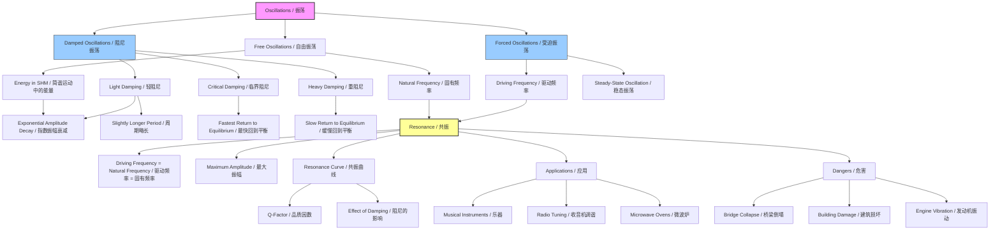

# 1. Overview / 概述

**English:** This topic explores the real-world behaviour of oscillating systems when energy is lost (damping) or when an external periodic force drives them (forced oscillations). It explains why a swing stops, how car shock absorbers work, and why soldiers break step on a bridge. The critical concept of [[Resonance and the Barton Pendulum|resonance]] — where a small driving force can produce huge amplitudes — is central to understanding earthquakes, musical instruments, and even the collapse of the Tacoma Narrows Bridge. In both CAIE 9702 and Edexcel IAL, this is a high-mark topic, frequently tested in multiple-choice, structured questions, and practical contexts. Mastering the distinction between [[Light, Critical and Heavy Damping|light, critical, and heavy damping]], and the shape of [[Resonance and the Barton Pendulum|resonance curves]], is essential for exam success.

**中文:** 本专题研究振荡系统在能量损失（阻尼）或受外部周期性力驱动（受迫振荡）时的真实行为。它解释了秋千为何会停下、汽车减震器如何工作、以及士兵为何在桥上要便步走。关键概念[[Resonance and the Barton Pendulum|共振]]——即一个小的驱动力可以产生巨大振幅——对于理解地震、乐器、甚至塔科马海峡大桥的倒塌至关重要。在CAIE 9702和Edexcel IAL中，这是一个高分值专题，常在选择题、结构化问题和实验背景中考查。掌握[[Light, Critical and Heavy Damping|轻阻尼、临界阻尼和重阻尼]]之间的区别，以及[[Resonance and the Barton Pendulum|共振曲线]]的形状，对考试成功至关重要。

---

# 2. Syllabus Learning Objectives / 考纲学习目标

| CAIE 9702 (17.3 a-d) | Edexcel IAL (WPH14 U4: 7.9-7.13) |
|---|---|
| (a) Describe examples of damped oscillations, including light, critical and heavy damping | 7.9 Understand the effect of damping on the amplitude and period of an oscillating system |
| (b) Describe graphically the variation with time of the amplitude of damped oscillations | 7.10 Understand the distinction between light, critical and heavy damping |
| (c) Describe the phenomenon of forced oscillations and the concept of resonance | 7.11 Understand the concept of forced oscillations and the conditions for resonance |
| (d) Describe graphically the variation with frequency of the amplitude of forced oscillations (resonance curve) | 7.12 Understand how the amplitude of forced oscillations varies with driving frequency, including the effect of damping |
| | 7.13 Understand examples of resonance in mechanical systems and the consequences of resonance |

**Examiner Expectations / 考官期望:**
- **English:** Candidates must be able to sketch and interpret graphs of displacement against time for [[Light, Critical and Heavy Damping|light, critical, and heavy damping]]. They must also be able to sketch [[Resonance and the Barton Pendulum|resonance curves]] for different damping levels and explain the conditions for resonance (driving frequency = natural frequency). Practical applications and dangers of resonance are frequently tested.
- **中文:** 考生必须能够绘制并解释[[Light, Critical and Heavy Damping|轻阻尼、临界阻尼和重阻尼]]的位移-时间图。还必须能够绘制不同阻尼水平下的[[Resonance and the Barton Pendulum|共振曲线]]，并解释共振的条件（驱动力频率 = 固有频率）。共振的实际应用和危害经常被考查。

> 📋 **CIE Only:** CAIE specifically requires describing examples of damped oscillations and the graphical description of amplitude variation with time for damped oscillations.
> 📋 **Edexcel Only:** Edexcel explicitly lists understanding the effect of damping on both amplitude AND period, and requires understanding of resonance in mechanical systems with specific examples.

---

# 3. Core Definitions / 核心定义

| Term (EN/CN) | Definition (EN) | Definition (CN) | Common Mistakes / 常见错误 |
|---|---|---|---|
| [[Damped and Forced Oscillations / Resonance|Damping / 阻尼]] | The process by which energy is lost from an oscillating system, causing the amplitude of oscillations to decrease over time. | 振荡系统能量损失的过程，导致振荡幅度随时间减小。 | Confusing damping with friction — damping is a broader concept that includes any energy loss mechanism. |
| [[Light, Critical and Heavy Damping|Light Damping / 轻阻尼]] | Damping where the amplitude decreases gradually over many oscillations; the system oscillates with a frequency slightly less than the natural frequency. | 振幅在多次振荡中逐渐减小的阻尼；系统以略低于固有频率的频率振荡。 | Thinking light damping means no energy loss — it still loses energy, just slowly. |
| [[Light, Critical and Heavy Damping|Critical Damping / 临界阻尼]] | Damping that returns the system to equilibrium in the shortest possible time without any oscillation. | 使系统在最短时间内回到平衡位置且不发生任何振荡的阻尼。 | Confusing critical damping with heavy damping — critical damping is the minimum damping to prevent oscillation. |
| [[Light, Critical and Heavy Damping|Heavy Damping / 重阻尼]] | Damping so large that the system returns to equilibrium very slowly without oscillating. | 阻尼非常大，系统缓慢回到平衡位置而不发生振荡。 | Thinking heavy damping is faster than critical damping — it is actually slower. |
| [[Forced Oscillations|Forced Oscillation / 受迫振荡]] | An oscillation that occurs when a periodic external driving force is applied to a system. | 当周期性外部驱动力作用于系统时发生的振荡。 | Confusing forced oscillation with free oscillation — forced oscillation has an external driver. |
| [[Resonance and the Barton Pendulum|Natural Frequency / 固有频率]] | The frequency at which a system oscillates when it is free to oscillate without any external driving force or damping. | 系统在无任何外部驱动力或阻尼时自由振荡的频率。 | Forgetting that natural frequency depends only on the system's physical properties (mass, stiffness). |
| [[Resonance and the Barton Pendulum|Resonance / 共振]] | The phenomenon where the amplitude of forced oscillations becomes a maximum when the driving frequency equals the natural frequency of the system. | 当驱动力频率等于系统固有频率时，受迫振荡振幅达到最大的现象。 | Thinking resonance occurs at any driving frequency — it only occurs at or near the natural frequency. |
| [[Resonance and the Barton Pendulum|Resonance Curve / 共振曲线]] | A graph showing how the amplitude of forced oscillations varies with the frequency of the driving force. | 显示受迫振荡振幅如何随驱动力频率变化的曲线。 | Drawing the curve as symmetrical when it is slightly asymmetrical for real systems. |

---

# 4. Key Concepts Explained / 关键概念详解

## 4.1 Damping Mechanisms / 阻尼机制

### Explanation / 解释:
**English:** [[Damped and Forced Oscillations / Resonance|Damping]] occurs through various mechanisms. In mechanical systems, the most common is **frictional damping** (e.g., air resistance, internal friction in materials). In electrical circuits, damping is due to **electrical resistance**. The energy lost is usually converted to thermal energy (heat). The degree of damping determines whether a system oscillates at all, and if so, for how long. The three types — [[Light, Critical and Heavy Damping|light, critical, and heavy damping]] — are distinguished by how the system returns to equilibrium after being displaced.

**中文:** [[Damped and Forced Oscillations / Resonance|阻尼]]通过各种机制发生。在机械系统中，最常见的是**摩擦阻尼**（例如空气阻力、材料内部摩擦）。在电路中，阻尼由**电阻**引起。损失的能量通常转化为热能。阻尼的程度决定了系统是否振荡，以及如果振荡，会持续多久。三种类型——[[Light, Critical and Heavy Damping|轻阻尼、临界阻尼和重阻尼]]——通过系统被扰动后回到平衡位置的方式来区分。

### Physical Meaning / 物理意义:
**English:** Damping represents the **dissipation of mechanical energy** from the system. In [[Energy in SHM|simple harmonic motion]], total energy is proportional to amplitude squared ($E \propto A^2$). Therefore, as energy is lost, amplitude decreases. The rate of amplitude decay depends on the damping coefficient.

**中文:** 阻尼代表系统**机械能的耗散**。在[[Energy in SHM|简谐运动]]中，总能量与振幅的平方成正比（$E \propto A^2$）。因此，随着能量损失，振幅减小。振幅衰减的速率取决于阻尼系数。

### Common Misconceptions / 常见误区:
- **Misconception:** Damping changes the period significantly.
  **Truth:** For [[Light, Critical and Heavy Damping|light damping]], the period is only slightly longer than the undamped natural period. For critical and heavy damping, there is no oscillation, so "period" is not defined.
- **Misconception:** Heavier damping always returns the system to equilibrium faster.
  **Truth:** [[Light, Critical and Heavy Damping|Critical damping]] returns the system fastest. Heavy damping is slower because the damping force opposes motion so strongly that the system "creeps" back.

### Exam Tips / 考试提示:
**English:** Be able to sketch the displacement-time graphs for all three damping types. Remember that for [[Light, Critical and Heavy Damping|light damping]], the amplitude decreases exponentially. For critical damping, the graph shows a quick return to zero without crossing. For heavy damping, the return is even slower.
**中文:** 要能够绘制所有三种阻尼类型的位移-时间图。记住对于[[Light, Critical and Heavy Damping|轻阻尼]]，振幅呈指数衰减。对于临界阻尼，图形显示快速回到零而不穿越。对于重阻尼，回到零更慢。

> 📷 **IMAGE PROMPT — DAMPING_GRAPHS: Displacement-Time Graphs for Three Damping Types**
> Three graphs on one set of axes. X-axis: time (t), Y-axis: displacement (x). Graph 1 (light damping): sinusoidal wave with exponentially decreasing amplitude, labelled "Light damping". Graph 2 (critical damping): curve starting from initial displacement, rising slightly then decaying to zero without crossing, labelled "Critical damping". Graph 3 (heavy damping): curve starting from same initial displacement, decaying slowly to zero without crossing, labelled "Heavy damping". All start at same initial displacement. Style: clear, labelled, exam-standard. Importance: HIGH — frequently tested.

---

## 4.2 Forced Oscillations / 受迫振荡

### Explanation / 解释:
**English:** A [[Forced Oscillations|forced oscillation]] occurs when an external periodic driving force is applied to a system. The system initially oscillates at a combination of its [[Resonance and the Barton Pendulum|natural frequency]] and the driving frequency. After a transient period, the system settles into **steady-state oscillation** at the driving frequency. The amplitude of this steady-state oscillation depends on:
1. The amplitude of the driving force
2. The difference between the driving frequency and the natural frequency
3. The amount of [[Damped and Forced Oscillations / Resonance|damping]] present

**中文:** 当外部周期性驱动力作用于系统时，发生[[Forced Oscillations|受迫振荡]]。系统最初以[[Resonance and the Barton Pendulum|固有频率]]和驱动频率的组合振荡。经过瞬态期后，系统进入以驱动频率进行的**稳态振荡**。这种稳态振荡的振幅取决于：
1. 驱动力的振幅
2. 驱动频率与固有频率之差
3. 存在的[[Damped and Forced Oscillations / Resonance|阻尼]]量

### Physical Meaning / 物理意义:
**English:** The driving force does work on the system, supplying energy to compensate for energy lost to [[Damped and Forced Oscillations / Resonance|damping]]. When the driving frequency matches the [[Resonance and the Barton Pendulum|natural frequency]], the energy transfer is most efficient, leading to maximum amplitude — this is [[Resonance and the Barton Pendulum|resonance]].

**中文:** 驱动力对系统做功，提供能量以补偿[[Damped and Forced Oscillations / Resonance|阻尼]]损失的能量。当驱动频率与[[Resonance and the Barton Pendulum|固有频率]]匹配时，能量传递最有效，导致最大振幅——这就是[[Resonance and the Barton Pendulum|共振]]。

### Common Misconceptions / 常见误区:
- **Misconception:** In forced oscillations, the system always oscillates at its natural frequency.
  **Truth:** After the transient period, the system oscillates at the **driving frequency**, not the natural frequency.
- **Misconception:** Resonance only occurs in mechanical systems.
  **Truth:** Resonance occurs in all oscillating systems, including electrical circuits (LC circuits), sound (acoustic resonance), and even atomic systems.

### Exam Tips / 考试提示:
**English:** Understand the [[Resonance and the Barton Pendulum|Barton's Pendulum]] experiment as a classic demonstration of forced oscillations and resonance. Be able to explain why different pendulums have different amplitudes.
**中文:** 理解[[Resonance and the Barton Pendulum|巴顿摆]]实验作为受迫振荡和共振的经典演示。要能够解释为什么不同的摆有不同的振幅。

---

## 4.3 Resonance and the Resonance Curve / 共振与共振曲线

### Explanation / 解释:
**English:** [[Resonance and the Barton Pendulum|Resonance]] occurs when the driving frequency equals the [[Resonance and the Barton Pendulum|natural frequency]] of the system. At this point, the amplitude of oscillation reaches its maximum value. The [[Resonance and the Barton Pendulum|resonance curve]] (amplitude vs. driving frequency) shows:
- A peak at the natural frequency ($f_0$)
- The peak becomes **sharper and higher** as [[Damped and Forced Oscillations / Resonance|damping]] decreases
- The peak becomes **broader and lower** as damping increases
- For very heavy damping, the peak disappears entirely

**中文:** 当驱动频率等于系统的[[Resonance and the Barton Pendulum|固有频率]]时，发生[[Resonance and the Barton Pendulum|共振]]。此时振荡振幅达到最大值。[[Resonance and the Barton Pendulum|共振曲线]]（振幅 vs. 驱动频率）显示：
- 在固有频率（$f_0$）处有一个峰值
- 随着[[Damped and Forced Oscillations / Resonance|阻尼]]减小，峰值变得**更尖锐、更高**
- 随着阻尼增加，峰值变得**更宽、更低**
- 对于非常大的阻尼，峰值完全消失

### Physical Meaning / 物理意义:
**English:** The sharpness of the resonance peak is related to the **quality factor (Q-factor)** of the system. A high Q-factor means low damping and a sharp resonance. The Q-factor is defined as:
$$ Q = \frac{f_0}{\Delta f} $$
where $\Delta f$ is the full width at half maximum (FWHM) of the resonance curve.

**中文:** 共振峰的尖锐程度与系统的**品质因数（Q值）**有关。高Q值意味着低阻尼和尖锐的共振。Q值定义为：
$$ Q = \frac{f_0}{\Delta f} $$
其中 $\Delta f$ 是共振曲线的半高全宽（FWHM）。

### Common Misconceptions / 常见误区:
- **Misconception:** The resonance curve is perfectly symmetrical.
  **Truth:** For real systems with damping, the curve is slightly asymmetrical, with a steeper drop on the high-frequency side.
- **Misconception:** Resonance always causes damage.
  **Truth:** Resonance is essential in many applications: musical instruments, radio tuning, MRI scanners.

### Exam Tips / 考试提示:
**English:** You must be able to sketch resonance curves for different damping levels on the same axes. Label the natural frequency $f_0$ and the peak amplitudes. Be prepared to explain the shape using energy transfer arguments.
**中文:** 你必须能够在同一坐标轴上绘制不同阻尼水平的共振曲线。标出固有频率 $f_0$ 和峰值振幅。要准备好用能量传递的论点来解释形状。

> 📷 **IMAGE PROMPT — RESONANCE_CURVES: Resonance Curves for Different Damping Levels**
> Graph with X-axis: driving frequency (f), Y-axis: amplitude (A). Three curves on same axes. Curve 1 (low damping): tall, sharp peak at f₀, labelled "Light damping". Curve 2 (medium damping): lower, broader peak at f₀, labelled "Medium damping". Curve 3 (high damping): very low, wide peak, almost flat, labelled "Heavy damping". All peaks at same f₀. Dashed vertical line at f₀ labelled "Natural frequency". Style: clear, labelled, exam-standard. Importance: VERY HIGH — almost guaranteed exam question.

---

## 4.4 Applications and Dangers of Resonance / 共振的应用与危害

### Explanation / 解释:
**English:** [[Resonance and the Barton Pendulum|Resonance]] has both beneficial applications and dangerous consequences.

**Applications (有益应用):**
- **Musical instruments:** Soundboards and resonance chambers amplify sound
- **Radio tuning:** LC circuits are tuned to resonate at specific frequencies
- **Microwave ovens:** Water molecules resonate at microwave frequencies
- **Medical imaging:** MRI uses nuclear magnetic resonance

**Dangers (危害):**
- **Bridge collapse:** Tacoma Narrows Bridge (1940) — wind-induced oscillations matched the bridge's natural frequency
- **Building damage:** Earthquakes can cause resonance in buildings
- **Engine vibration:** Car engines can resonate at certain RPMs
- **Soldiers breaking step:** Marching in step on a bridge can cause resonance

**中文:** [[Resonance and the Barton Pendulum|共振]]既有有益的应用，也有危险的后果。

**有益应用:**
- **乐器:** 音板和共鸣箱放大声音
- **收音机调谐:** LC电路被调谐到特定频率共振
- **微波炉:** 水分子在微波频率下共振
- **医学成像:** MRI利用核磁共振

**危害:**
- **桥梁倒塌:** 塔科马海峡大桥（1940年）——风致振荡与桥梁固有频率匹配
- **建筑损坏:** 地震可引起建筑物共振
- **发动机振动:** 汽车发动机在某些转速下可能共振
- **士兵便步走:** 在桥上齐步走可引起共振

### Common Misconceptions / 常见误区:
- **Misconception:** Resonance only happens at exactly the natural frequency.
  **Truth:** Significant amplitude increase occurs over a range of frequencies near the natural frequency (the resonance peak has finite width).
- **Misconception:** Adding damping always solves resonance problems.
  **Truth:** While damping reduces amplitude, it may also change the natural frequency or add unwanted weight/stiffness.

### Exam Tips / 考试提示:
**English:** Be ready to give at least two examples of useful resonance and two examples of dangerous resonance. For each, explain the condition (driving frequency = natural frequency) and the consequence.
**中文:** 准备好给出至少两个有用共振和两个危险共振的例子。对每个例子，解释条件（驱动频率 = 固有频率）和后果。

> 📋 **Edexcel Only:** Edexcel specifically requires understanding of resonance in mechanical systems with examples. Be prepared for questions linking resonance to real-world engineering contexts.

---

# 5. Essential Equations / 核心公式

## 5.1 Amplitude Decay in Light Damping / 轻阻尼中的振幅衰减

$$ A(t) = A_0 e^{-bt} $$

| Symbol (符号) | Meaning (EN/CN) | Unit (单位) |
|---|---|---|
| $A(t)$ | Amplitude at time t / t时刻的振幅 | m |
| $A_0$ | Initial amplitude / 初始振幅 | m |
| $b$ | Damping coefficient / 阻尼系数 | s⁻¹ |
| $t$ | Time / 时间 | s |

**Derivation / 推导:** Not required for A-Level, but understanding that energy loss is proportional to amplitude squared is important.

**Conditions / 条件:** Only valid for [[Light, Critical and Heavy Damping|light damping]] where the system still oscillates.

**Limitations / 限制:** Assumes damping force is proportional to velocity (linear damping).

**Rearrangements / 变形:**
$$ b = \frac{1}{t} \ln\left(\frac{A_0}{A(t)}\right) $$

---

## 5.2 Quality Factor (Q-Factor) / 品质因数

$$ Q = \frac{f_0}{\Delta f} $$

| Symbol (符号) | Meaning (EN/CN) | Unit (单位) |
|---|---|---|
| $Q$ | Quality factor / 品质因数 | dimensionless |
| $f_0$ | Natural (resonant) frequency / 固有（共振）频率 | Hz |
| $\Delta f$ | Full width at half maximum (FWHM) / 半高全宽 | Hz |

**Derivation / 推导:** Not required for A-Level.

**Conditions / 条件:** Valid for systems with a well-defined resonance peak.

**Limitations / 限制:** Only meaningful for underdamped systems.

**Rearrangements / 变形:**
$$ \Delta f = \frac{f_0}{Q} $$

---

## 5.3 Energy in Damped Oscillations / 阻尼振荡中的能量

$$ E(t) = E_0 e^{-2bt} $$

| Symbol (符号) | Meaning (EN/CN) | Unit (单位) |
|---|---|---|
| $E(t)$ | Energy at time t / t时刻的能量 | J |
| $E_0$ | Initial energy / 初始能量 | J |
| $b$ | Damping coefficient / 阻尼系数 | s⁻¹ |
| $t$ | Time / 时间 | s |

**Derivation / 推导:** Since $E \propto A^2$, and $A \propto e^{-bt}$, then $E \propto e^{-2bt}$.

**Conditions / 条件:** Valid for [[Light, Critical and Heavy Damping|light damping]].

**Limitations / 限制:** Assumes linear damping.

**Rearrangements / 变形:**
$$ b = \frac{1}{2t} \ln\left(\frac{E_0}{E(t)}\right) $$

---

## 5.4 Resonance Condition / 共振条件

$$ f_{\text{driving}} = f_0 $$

| Symbol (符号) | Meaning (EN/CN) | Unit (单位) |
|---|---|---|
| $f_{\text{driving}}$ | Driving frequency / 驱动频率 | Hz |
| $f_0$ | Natural frequency / 固有频率 | Hz |

**Derivation / 推导:** Conceptual — maximum energy transfer occurs when the driving frequency matches the natural frequency.

**Conditions / 条件:** This is the condition for maximum amplitude in forced oscillations.

**Limitations / 限制:** In real systems with damping, the resonance frequency is slightly lower than the undamped natural frequency.

**Rearrangements / 变形:**
$$ \omega_{\text{driving}} = \omega_0 \quad \text{where} \quad \omega = 2\pi f $$

---

# 6. Graphs and Relationships / 图表与关系

## 6.1 Displacement-Time Graph for Light Damping / 轻阻尼的位移-时间图

**Axes / 坐标轴:** X-axis: time (t), Y-axis: displacement (x)

**Shape / 形状:** Sinusoidal wave with exponentially decreasing amplitude. The envelope follows $A(t) = A_0 e^{-bt}$.

**Gradient Meaning / 斜率含义:**
- **English:** The gradient at any point represents the instantaneous velocity. The gradient decreases in magnitude over time as amplitude decreases.
- **中文:** 任意点的斜率代表瞬时速度。随着振幅减小，斜率的大小随时间减小。

**Area Meaning / 面积含义:**
- **English:** The area under the graph has no direct physical meaning in this context.
- **中文:** 在此上下文中，图下的面积没有直接的物理意义。

**Exam Interpretation / 考试解读:**
- **English:** Be able to identify the exponential envelope and estimate the time constant (time for amplitude to fall to 1/e of initial value).
- **中文:** 能够识别指数包络并估计时间常数（振幅降至初始值1/e所需的时间）。

**Common Questions / 常见问题:**
- Sketch the graph for light damping
- Determine the damping coefficient from the graph
- Compare with critical and heavy damping graphs

> 📷 **IMAGE PROMPT — LIGHT_DAMPING_GRAPH: Displacement-Time for Light Damping**
> Graph showing a sinusoidal wave with amplitude decreasing exponentially. X-axis: time (t), Y-axis: displacement (x). Dashed curves showing the exponential envelope A₀e^(-bt) above and below. Labels: "Envelope A₀e^(-bt)", "Period T (slightly longer than undamped)". Style: clear, exam-standard. Importance: HIGH.

---

## 6.2 Displacement-Time Graph for Critical and Heavy Damping / 临界阻尼和重阻尼的位移-时间图

**Axes / 坐标轴:** X-axis: time (t), Y-axis: displacement (x)

**Shape / 形状:**
- **Critical damping:** Curve starts at initial displacement, may rise slightly (overshoot is minimal), then decays to zero without crossing the axis. Returns to equilibrium in the shortest possible time.
- **Heavy damping:** Curve starts at initial displacement and decays slowly to zero without crossing the axis. Takes longer than critical damping.

**Gradient Meaning / 斜率含义:**
- **English:** The gradient represents velocity. For critical damping, the initial gradient is steeper than for heavy damping.
- **中文:** 斜率代表速度。对于临界阻尼，初始斜率比重阻尼更陡。

**Area Meaning / 面积含义:**
- **English:** No direct physical meaning.
- **中文:** 没有直接的物理意义。

**Exam Interpretation / 考试解读:**
- **English:** Be able to distinguish between critical and heavy damping by the time taken to return to equilibrium. Critical damping is fastest.
- **中文:** 能够通过回到平衡位置所需的时间来区分临界阻尼和重阻尼。临界阻尼最快。

**Common Questions / 常见问题:**
- Which graph represents critical damping?
- Why is critical damping used in car shock absorbers?

> 📷 **IMAGE PROMPT — CRITICAL_HEAVY_DAMPING: Critical vs Heavy Damping Comparison**
> Two graphs on same axes. X-axis: time (t), Y-axis: displacement (x). Curve 1 (critical damping): starts at x₀, rises slightly, then decays to zero quickly, labelled "Critical damping". Curve 2 (heavy damping): starts at same x₀, decays slowly to zero without rising, labelled "Heavy damping". Horizontal dashed line at x=0 labelled "Equilibrium". Style: clear, labelled. Importance: HIGH.

---

## 6.3 Resonance Curve (Amplitude vs. Driving Frequency) / 共振曲线（振幅 vs. 驱动频率）

**Axes / 坐标轴:** X-axis: driving frequency (f), Y-axis: amplitude (A)

**Shape / 形状:** A peak-shaped curve with maximum at the natural frequency $f_0$. The peak becomes sharper and higher as damping decreases.

**Gradient Meaning / 斜率含义:**
- **English:** The gradient represents the rate of change of amplitude with driving frequency. It is zero at the resonance peak.
- **中文:** 斜率代表振幅随驱动频率的变化率。在共振峰处斜率为零。

**Area Meaning / 面积含义:**
- **English:** The area under the curve has no standard physical meaning at A-Level.
- **中文:** 在A-Level中，曲线下的面积没有标准的物理意义。

**Exam Interpretation / 考试解读:**
- **English:** Be able to:
  1. Identify the natural frequency from the peak position
  2. Compare curves for different damping levels
  3. Explain why the amplitude is maximum at resonance (energy transfer is most efficient)
  4. Determine the Q-factor from the FWHM
- **中文:** 能够：
  1. 从峰值位置识别固有频率
  2. 比较不同阻尼水平的曲线
  3. 解释为什么振幅在共振时最大（能量传递最有效）
  4. 从半高全宽确定Q值

**Common Questions / 常见问题:**
- Sketch resonance curves for different damping levels
- Explain the effect of increasing damping on the resonance curve
- Determine the natural frequency from a given resonance curve
- Calculate Q-factor from a resonance curve

> 📷 **IMAGE PROMPT — RESONANCE_CURVE_DETAILED: Detailed Resonance Curve with Q-Factor**
> Graph with X-axis: driving frequency (f), Y-axis: amplitude (A). Single resonance curve with peak at f₀. Horizontal dashed line at A_max/√2 (or 0.707A_max) labelled "Half maximum". Two vertical dashed lines at frequencies f₁ and f₂ where the curve crosses the half-maximum line. Δf = f₂ - f₁ labelled. Formula: Q = f₀/Δf shown. Style: detailed, labelled, exam-standard. Importance: VERY HIGH.

---

# 7. Required Diagrams / 必备图表

## 7.1 Barton's Pendulum Apparatus / 巴顿摆装置

> 📷 **IMAGE PROMPT — BARTONS_PENDULUM: Barton's Pendulum Experiment Setup**
> Diagram showing a horizontal string (drive string) stretched between two supports. One heavy pendulum (driver pendulum) attached to the string, swinging freely. Several light pendulums (driven pendulums) of different lengths attached to the same string. Labels: "Driver pendulum (heavy, adjustable length)", "Driven pendulums (light, different lengths)", "Horizontal drive string", "Supports". Arrows showing the driver pendulum swinging. Style: clear schematic, exam-standard. Importance: HIGH — classic demonstration of forced oscillations and resonance.

**English:** This diagram shows the classic [[Resonance and the Barton Pendulum|Barton's Pendulum]] experiment. A heavy pendulum (the driver) is attached to a horizontal string. Several light pendulums of different lengths are also attached to the same string. When the driver oscillates, it forces the string to oscillate, which in turn forces the light pendulums to oscillate. The pendulum with the same length (and therefore same [[Resonance and the Barton Pendulum|natural frequency]]) as the driver will resonate and have the largest amplitude.

**中文:** 此图显示了经典的[[Resonance and the Barton Pendulum|巴顿摆]]实验。一个重摆（驱动摆）连接在一根水平绳上。几个不同长度的轻摆也连接在同一根绳上。当驱动摆振荡时，它迫使绳子振荡，进而迫使轻摆振荡。与驱动摆长度相同（因此[[Resonance and the Barton Pendulum|固有频率]]相同）的摆将发生共振，振幅最大。

---

## 7.2 Displacement-Time Graphs for All Three Damping Types / 三种阻尼类型的位移-时间图

> 📷 **IMAGE PROMPT — THREE_DAMPING_GRAPHS: Complete Damping Comparison**
> Three separate graphs arranged vertically for comparison. Each graph: X-axis: time (t), Y-axis: displacement (x). All start at same initial displacement x₀. Top graph: "Light Damping" — sinusoidal wave with exponential decay envelope. Middle graph: "Critical Damping" — quick return to zero without oscillation. Bottom graph: "Heavy Damping" — slow return to zero without oscillation. Labels on each: "Returns to equilibrium in shortest time" for critical damping. Style: clear, comparative, exam-standard. Importance: VERY HIGH — almost guaranteed exam question.

**English:** These three graphs show the displacement against time for [[Light, Critical and Heavy Damping|light, critical, and heavy damping]]. All start from the same initial displacement. Light damping shows oscillations with decreasing amplitude. Critical damping returns to equilibrium fastest without oscillating. Heavy damping returns to equilibrium slowly without oscillating.

**中文:** 这三个图显示了[[Light, Critical and Heavy Damping|轻阻尼、临界阻尼和重阻尼]]的位移-时间关系。所有图都从相同的初始位移开始。轻阻尼显示振幅减小的振荡。临界阻尼最快回到平衡位置而不振荡。重阻尼缓慢回到平衡位置而不振荡。

---

## 7.3 Resonance Curves for Different Damping Levels / 不同阻尼水平的共振曲线

> 📷 **IMAGE PROMPT — RESONANCE_CURVES_COMPLETE: Complete Resonance Curve Set**
> Graph with X-axis: driving frequency (f), Y-axis: amplitude (A). Three curves on same axes. Curve 1 (very low damping): very tall, very sharp peak at f₀, labelled "Very light damping (high Q)". Curve 2 (medium damping): lower, broader peak at f₀, labelled "Medium damping". Curve 3 (heavy damping): very low, wide peak, almost flat, labelled "Heavy damping (low Q)". All peaks at same f₀. Dashed vertical line at f₀ labelled "Natural frequency f₀". Horizontal dashed line showing half-maximum for curve 1, with Δf labelled. Style: clear, labelled, exam-standard. Importance: VERY HIGH — almost guaranteed exam question.

**English:** This graph shows how the [[Resonance and the Barton Pendulum|resonance curve]] changes with different levels of [[Damped and Forced Oscillations / Resonance|damping]]. As damping increases, the peak amplitude decreases and the curve becomes broader. The [[Resonance and the Barton Pendulum|natural frequency]] $f_0$ remains the same. The sharpness of the peak is quantified by the Q-factor.

**中文:** 此图显示了[[Resonance and the Barton Pendulum|共振曲线]]如何随[[Damped and Forced Oscillations / Resonance|阻尼]]水平的变化而变化。随着阻尼增加，峰值振幅减小，曲线变得更宽。[[Resonance and the Barton Pendulum|固有频率]] $f_0$ 保持不变。峰的尖锐程度由Q值量化。

---

# 8. Worked Examples / 典型例题

## Example 1: Damping Coefficient Calculation / 例1：阻尼系数计算

### Question / 题目:
**English:** A mass-spring system is lightly damped. The initial amplitude of oscillation is 5.0 cm. After 20 complete oscillations, the amplitude has decreased to 3.0 cm. The period of oscillation is 0.50 s. Calculate:
(a) The damping coefficient $b$
(b) The time taken for the amplitude to fall to half its initial value

**中文:** 一个质量-弹簧系统受到轻阻尼。初始振荡振幅为5.0 cm。经过20次完整振荡后，振幅减小到3.0 cm。振荡周期为0.50 s。计算：
(a) 阻尼系数 $b$
(b) 振幅降至初始值一半所需的时间

### Image Prompt / 图片提示:
> 📷 **IMAGE PROMPT — DAMPING_EXAMPLE: Mass-Spring System with Damping**
> Simple diagram of a mass-spring system with a dashpot (damper) attached in parallel. Labels: "Mass m", "Spring constant k", "Dashpot (damping)", "Initial amplitude A₀ = 5.0 cm", "Amplitude after 20 oscillations A = 3.0 cm". Style: clear schematic. Importance: Medium — helps visualise the problem.

### Solution / 解答:

**Part (a): Damping coefficient / 阻尼系数**

**English:**
1. Time for 20 oscillations: $t = 20 \times T = 20 \times 0.50 = 10 \text{ s}$
2. Use the amplitude decay equation: $A(t) = A_0 e^{-bt}$
3. Rearrange: $e^{-bt} = \frac{A(t)}{A_0}$
4. Take natural log: $-bt = \ln\left(\frac{A(t)}{A_0}\right)$
5. Substitute values: $-b \times 10 = \ln\left(\frac{3.0}{5.0}\right) = \ln(0.6)$
6. Calculate: $-10b = -0.5108$
7. Therefore: $b = 0.0511 \text{ s}^{-1}$

**中文:**
1. 20次振荡的时间：$t = 20 \times T = 20 \times 0.50 = 10 \text{ s}$
2. 使用振幅衰减方程：$A(t) = A_0 e^{-bt}$
3. 变形：$e^{-bt} = \frac{A(t)}{A_0}$
4. 取自然对数：$-bt = \ln\left(\frac{A(t)}{A_0}\right)$
5. 代入数值：$-b \times 10 = \ln\left(\frac{3.0}{5.0}\right) = \ln(0.6)$
6. 计算：$-10b = -0.5108$
7. 因此：$b = 0.0511 \text{ s}^{-1}$

**Part (b): Time for amplitude to halve / 振幅减半所需时间**

**English:**
1. Set $A(t) = \frac{A_0}{2}$: $\frac{A_0}{2} = A_0 e^{-bt}$
2. Simplify: $\frac{1}{2} = e^{-bt}$
3. Take natural log: $\ln(0.5) = -bt$
4. Rearrange: $t = -\frac{\ln(0.5)}{b} = \frac{0.6931}{0.0511}$
5. Calculate: $t = 13.6 \text{ s}$

**中文:**
1. 设 $A(t) = \frac{A_0}{2}$：$\frac{A_0}{2} = A_0 e^{-bt}$
2. 简化：$\frac{1}{2} = e^{-bt}$
3. 取自然对数：$\ln(0.5) = -bt$
4. 变形：$t = -\frac{\ln(0.5)}{b} = \frac{0.6931}{0.0511}$
5. 计算：$t = 13.6 \text{ s}$

### Final Answer / 最终答案:
**English:**
(a) Damping coefficient $b = 0.0511 \text{ s}^{-1}$
(b) Time for amplitude to halve $t = 13.6 \text{ s}$

**中文:**
(a) 阻尼系数 $b = 0.0511 \text{ s}^{-1}$
(b) 振幅减半所需时间 $t = 13.6 \text{ s}$

### Examiner Notes / 考官点评:
**English:** Common mistakes include: (1) forgetting to convert the number of oscillations into time using the period, (2) incorrect use of natural logarithms, (3) sign errors when rearranging the exponential equation. Always check that your damping coefficient is positive. The half-life of amplitude is independent of initial amplitude — this is a property of exponential decay.
**中文:** 常见错误包括：(1) 忘记用周期将振荡次数转换为时间，(2) 自然对数的使用错误，(3) 变形指数方程时的符号错误。始终检查你的阻尼系数为正。振幅的半衰期与初始振幅无关——这是指数衰减的一个性质。

---

## Example 2: Resonance Curve Analysis / 例2：共振曲线分析

### Question / 题目:
**English:** A forced oscillation experiment is conducted on a mechanical system. The resonance curve shows a peak amplitude of 8.0 cm at a frequency of 12.0 Hz. The amplitude falls to 5.66 cm at frequencies of 11.5 Hz and 12.5 Hz.
(a) Calculate the Q-factor of the system
(b) If the damping is increased, describe how the resonance curve would change
(c) State one practical application where a high Q-factor is desirable

**中文:** 对一个机械系统进行受迫振荡实验。共振曲线显示在12.0 Hz频率处峰值振幅为8.0 cm。振幅在11.5 Hz和12.5 Hz处降至5.66 cm。
(a) 计算系统的Q值
(b) 如果阻尼增加，描述共振曲线将如何变化
(c) 说明一个需要高Q值的实际应用

### Image Prompt / 图片提示:
> 📷 **IMAGE PROMPT — RESONANCE_EXAMPLE: Resonance Curve for Q-Factor Calculation**
> Graph with X-axis: driving frequency (f), Y-axis: amplitude (A). Single resonance curve with peak at f₀ = 12.0 Hz, A_max = 8.0 cm. Horizontal dashed line at A_max/√2 = 5.66 cm. Two vertical dashed lines at f₁ = 11.5 Hz and f₂ = 12.5 Hz. Δf = 1.0 Hz labelled. Style: clear, labelled with all given values. Importance: Medium — helps visualise the calculation.

### Solution / 解答:

**Part (a): Q-factor calculation / Q值计算**

**English:**
1. Identify the resonant frequency: $f_0 = 12.0 \text{ Hz}$
2. Identify the half-power points (where amplitude = $A_{\text{max}}/\sqrt{2}$):
   - $f_1 = 11.5 \text{ Hz}$
   - $f_2 = 12.5 \text{ Hz}$
3. Calculate the full width at half maximum: $\Delta f = f_2 - f_1 = 12.5 - 11.5 = 1.0 \text{ Hz}$
4. Use the Q-factor formula: $Q = \frac{f_0}{\Delta f} = \frac{12.0}{1.0} = 12$

**中文:**
1. 确定共振频率：$f_0 = 12.0 \text{ Hz}$
2. 确定半功率点（振幅 = $A_{\text{max}}/\sqrt{2}$ 处）：
   - $f_1 = 11.5 \text{ Hz}$
   - $f_2 = 12.5 \text{ Hz}$
3. 计算半高全宽：$\Delta f = f_2 - f_1 = 12.5 - 11.5 = 1.0 \text{ Hz}$
4. 使用Q值公式：$Q = \frac{f_0}{\Delta f} = \frac{12.0}{1.0} = 12$

**Part (b): Effect of increased damping / 增加阻尼的影响**

**English:**
If damping is increased:
- The peak amplitude will decrease (less than 8.0 cm)
- The curve will become broader (larger $\Delta f$)
- The Q-factor will decrease
- The resonant frequency may shift slightly lower

**中文:**
如果阻尼增加：
- 峰值振幅将减小（小于8.0 cm）
- 曲线将变得更宽（更大的 $\Delta f$）
- Q值将减小
- 共振频率可能略微降低

**Part (c): Application of high Q-factor / 高Q值的应用**

**English:**
A high Q-factor is desirable in **radio tuning circuits**. A high Q means a sharp resonance peak, which allows the radio to select a specific station frequency while rejecting nearby frequencies (good selectivity).

**中文:**
在**收音机调谐电路**中需要高Q值。高Q意味着尖锐的共振峰，允许收音机选择特定电台频率同时拒绝附近频率（良好的选择性）。

### Final Answer / 最终答案:
**English:**
(a) Q-factor = 12
(b) Increased damping → lower peak, broader curve, lower Q
(c) Radio tuning circuits (or any other valid application)

**中文:**
(a) Q值 = 12
(b) 阻尼增加 → 峰值降低，曲线变宽，Q值降低
(c) 收音机调谐电路（或其他有效应用）

### Examiner Notes / 考官点评:
**English:** Key points: (1) The half-power points correspond to amplitude $A_{\text{max}}/\sqrt{2}$, not $A_{\text{max}}/2$. (2) The Q-factor is dimensionless. (3) For part (c), be specific — "radio" is better than "electronics". Common error: using $A_{\text{max}}/2$ instead of $A_{\text{max}}/\sqrt{2}$ for the half-power points.
**中文:** 关键点：(1) 半功率点对应振幅 $A_{\text{max}}/\sqrt{2}$，而不是 $A_{\text{max}}/2$。(2) Q值无量纲。(3) 对于(c)部分，要具体——"收音机"比"电子设备"更好。常见错误：使用 $A_{\text{max}}/2$ 而不是 $A_{\text{max}}/\sqrt{2}$ 作为半功率点。

---

# 9. Past Paper Question Types / 历年真题题型

| Question Type / 题型 | Frequency / 频率 | Difficulty / 难度 | Past Paper References / 真题索引 |
|---|---|---|---|
| Sketch and interpret displacement-time graphs for damping types / 绘制并解释阻尼类型的位移-时间图 | Very High / 非常高 | Medium / 中等 | 📝 *待填入* |
| Sketch and interpret resonance curves / 绘制并解释共振曲线 | Very High / 非常高 | Medium / 中等 | 📝 *待填入* |
| Calculate damping coefficient from amplitude decay data / 从振幅衰减数据计算阻尼系数 | High / 高 | Medium-Hard / 中高 | 📝 *待填入* |
| Calculate Q-factor from resonance curve / 从共振曲线计算Q值 | High / 高 | Medium / 中等 | 📝 *待填入* |
| Explain conditions for resonance / 解释共振条件 | High / 高 | Easy-Medium / 易-中 | 📝 *待填入* |
| Describe applications and dangers of resonance / 描述共振的应用与危害 | Medium / 中等 | Easy / 易 | 📝 *待填入* |
| Compare light, critical and heavy damping / 比较轻阻尼、临界阻尼和重阻尼 | Medium / 中等 | Medium / 中等 | 📝 *待填入* |
| Barton's pendulum experiment analysis / 巴顿摆实验分析 | Medium / 中等 | Medium / 中等 | 📝 *待填入* |
| Energy considerations in damped oscillations / 阻尼振荡中的能量考虑 | Low-Medium / 低-中 | Hard / 难 | 📝 *待填入* |
| Multiple choice on damping and resonance concepts / 关于阻尼和共振概念的选择题 | Very High / 非常高 | Easy-Medium / 易-中 | 📝 *待填入* |

> 📝 **题库整理中 / Question Bank Under Construction:**
> **English:** The past paper references are being compiled. For the most recent papers, please refer to the CAIE 9702 and Edexcel IAL official past paper databases. Common question numbers include CAIE 9702/42 and Edexcel WPH14/01.
> **中文:** 真题索引正在整理中。最新试卷请参考CAIE 9702和Edexcel IAL官方真题数据库。常见题号包括CAIE 9702/42和Edexcel WPH14/01。

**Common Command Words / 常见指令词:**
- **Sketch / 绘制:** Draw a graph showing the general shape, with labelled axes
- **Describe / 描述:** Give a detailed account of the features
- **Explain / 解释:** Give reasons for why something happens
- **Calculate / 计算:** Use mathematics to find a numerical answer
- **Compare / 比较:** Describe similarities and differences
- **State / 说明:** Give a brief answer without explanation

---

# 10. Practical Skills Connections / 实验技能链接

**English:** This topic connects to practical skills in several ways:

1. **CAIE Paper 3 (AS Practical) / Paper 5 (A2 Planning):**
   - Investigating the effect of damping on oscillation amplitude
   - Determining the damping coefficient from experimental data
   - Planning an experiment to investigate resonance
   - Evaluating sources of error in damping experiments

2. **Edexcel Unit 3 (AS Practical) / Unit 6 (A2 Practical):**
   - Using a motion sensor or data logger to record damped oscillations
   - Investigating the relationship between driving frequency and amplitude
   - Measuring the natural frequency of a system
   - Determining Q-factor experimentally

3. **Key Measurements / 关键测量:**
   - Amplitude measurement using a ruler or position sensor
   - Time measurement using a stopwatch or data logger
   - Frequency determination from period measurements
   - Uncertainty analysis in amplitude and time measurements

4. **Graph Plotting / 绘图:**
   - Plotting amplitude against time for damped oscillations
   - Plotting amplitude against driving frequency for resonance curves
   - Determining the exponential decay constant from a semi-log plot
   - Finding the FWHM from a resonance curve

5. **Experimental Design Considerations / 实验设计考虑:**
   - Controlling the driving frequency accurately
   - Minimising external disturbances
   - Ensuring consistent initial conditions
   - Using appropriate damping mechanisms (e.g., oil, magnets, air resistance)

**中文:** 本专题通过多种方式与实验技能联系：

1. **CAIE Paper 3（AS实验）/ Paper 5（A2计划）：**
   - 研究阻尼对振荡振幅的影响
   - 从实验数据确定阻尼系数
   - 计划研究共振的实验
   - 评估阻尼实验中的误差来源

2. **Edexcel Unit 3（AS实验）/ Unit 6（A2实验）：**
   - 使用运动传感器或数据记录器记录阻尼振荡
   - 研究驱动频率与振幅之间的关系
   - 测量系统的固有频率
   - 通过实验确定Q值

3. **关键测量：**
   - 使用尺子或位置传感器测量振幅
   - 使用秒表或数据记录器测量时间
   - 从周期测量确定频率
   - 振幅和时间测量的不确定度分析

4. **绘图：**
   - 绘制阻尼振荡的振幅-时间图
   - 绘制共振曲线的振幅-驱动频率图
   - 从半对数图确定指数衰减常数
   - 从共振曲线找到半高全宽

5. **实验设计考虑：**
   - 精确控制驱动频率
   - 最小化外部干扰
   - 确保一致的初始条件
   - 使用适当的阻尼机制（例如油、磁铁、空气阻力）

> 📋 **CIE Only:** CAIE Paper 5 may require candidates to plan an experiment to investigate resonance, including identifying independent and dependent variables, control variables, and safety considerations.
> 📋 **Edexcel Only:** Edexcel Unit 6 may require using a data logger to record damped oscillations and analysing the data to determine the damping coefficient.

---

# 11. Concept Map / 概念图谱



---

# 12. Examiner Insights / 考官洞察

**English:**

**Most Tested Ideas (CAIE + Edexcel):**
1. **Sketching graphs** — displacement-time for damping types, and resonance curves for different damping levels. This appears in almost every exam.
2. **Explaining resonance** — the condition (driving frequency = natural frequency) and why amplitude is maximum (most efficient energy transfer).
3. **Comparing damping types** — especially why critical damping is used in car shock absorbers (fastest return to equilibrium without oscillation).
4. **Q-factor calculations** — from resonance curves using the FWHM method.
5. **Real-world examples** — applications (musical instruments, radio) and dangers (bridge collapse, earthquakes).

**Mark Scheme Wording / 评分方案措辞:**
- For "sketch" questions: "Correct shape" (1 mark), "Axes labelled with correct variables and units" (1 mark), "Key features identified" (1 mark)
- For "explain" questions: "States condition for resonance" (1 mark), "Explains energy transfer" (1 mark), "Links to amplitude" (1 mark)
- For "calculate" questions: "Correct substitution" (1 mark), "Correct mathematical manipulation" (1 mark), "Correct final answer with unit" (1 mark)

**Common Lost Marks / 常见失分点:**
1. **Graphs:** Not labelling axes, not showing the exponential envelope for light damping, drawing resonance curves as perfectly symmetrical
2. **Definitions:** Confusing natural frequency with driving frequency, confusing critical damping with heavy damping
3. **Calculations:** Using $A_{\text{max}}/2$ instead of $A_{\text{max}}/\sqrt{2}$ for half-power points, sign errors in exponential equations
4. **Explanations:** Not mentioning energy transfer when explaining resonance, not stating the condition explicitly

**High-Scoring Structures / 高分结构:**
- For 6-mark questions: Use a clear structure — define, describe, explain, conclude
- For graph questions: Always label axes with variables AND units, use a ruler for straight lines
- For calculation questions: Show all working, include units at each step, check significant figures

**中文:**

**最常考的思想（CAIE + Edexcel）：**
1. **绘制图形** — 阻尼类型的位移-时间图，以及不同阻尼水平的共振曲线。这几乎出现在每次考试中。
2. **解释共振** — 条件（驱动频率 = 固有频率）以及为什么振幅最大（最有效的能量传递）。
3. **比较阻尼类型** — 特别是为什么在汽车减震器中使用临界阻尼（最快回到平衡位置而不振荡）。
4. **Q值计算** — 使用半高全宽法从共振曲线计算。
5. **现实世界例子** — 应用（乐器、收音机）和危害（桥梁倒塌、地震）。

**评分方案措辞：**
- 对于"绘制"题："正确形状"（1分），"坐标轴标有正确变量和单位"（1分），"识别关键特征"（1分）
- 对于"解释"题："说明共振条件"（1分），"解释能量传递"（1分），"联系到振幅"（1分）
- 对于"计算"题："正确代入"（1分），"正确的数学操作"（1分），"正确的最终答案和单位"（1分）

**常见失分点：**
1. **图形：** 未标注坐标轴，未显示轻阻尼的指数包络，将共振曲线绘制为完全对称
2. **定义：** 混淆固有频率与驱动频率，混淆临界阻尼与重阻尼
3. **计算：** 使用 $A_{\text{max}}/2$ 而不是 $A_{\text{max}}/\sqrt{2}$ 作为半功率点，指数方程中的符号错误
4. **解释：** 解释共振时未提及能量传递，未明确说明条件

**高分结构：**
- 对于6分题：使用清晰的结构 — 定义、描述、解释、结论
- 对于图形题：始终用变量和单位标注坐标轴，用尺子画直线
- 对于计算题：展示所有步骤，每一步都包含单位，检查有效数字

---

# 13. Quick Revision Sheet / 速查表

| Category / 类别 | Key Points / 要点 |
|---|---|
| **Damping Types / 阻尼类型** | **Light:** Oscillates, amplitude decays exponentially, period slightly longer. **Critical:** Fastest return to equilibrium, no oscillation. **Heavy:** Slow return to equilibrium, no oscillation. |
| **Amplitude Decay / 振幅衰减** | $A(t) = A_0 e^{-bt}$ — only for light damping. Energy: $E(t) = E_0 e^{-2bt}$ |
| **Forced Oscillations / 受迫振荡** | System oscillates at driving frequency (steady state). Amplitude depends on: driving force amplitude, frequency difference, damping. |
| **Resonance Condition / 共振条件** | $f_{\text{driving}} = f_0$ (natural frequency). Maximum amplitude due to most efficient energy transfer. |
| **Resonance Curve / 共振曲线** | Peak at $f_0$. Lower damping → taller, sharper peak. Higher damping → shorter, broader peak. |
| **Q-Factor / 品质因数** | $Q = f_0 / \Delta f$. High Q = low damping = sharp resonance. $\Delta f$ = FWHM. |
| **Barton's Pendulum / 巴顿摆** | Driver pendulum forces oscillations in pendulums of different lengths. Pendulum with same length (same $f_0$) resonates → largest amplitude. |
| **Applications / 应用** | Musical instruments (sound amplification), radio tuning (frequency selection), microwave ovens (water molecule resonance), MRI (nuclear magnetic resonance). |
| **Dangers / 危害** | Bridge collapse (Tacoma Narrows), building damage (earthquakes), engine vibration, soldiers breaking step on bridges. |
| **Car Shock Absorbers / 汽车减震器** | Use critical damping — returns to equilibrium fastest without oscillation for a smooth ride. |
| **Common Graph Shapes / 常见图形形状** | Light damping: sinusoidal with exponential envelope. Critical damping: quick decay to zero. Heavy damping: slow decay to zero. Resonance: peak at $f_0$. |
| **Key Equations / 关键方程** | $A = A_0 e^{-bt}$, $E = E_0 e^{-2bt}$, $Q = f_0 / \Delta f$, $f_{\text{driving}} = f_0$ for resonance |

---

# 14. Metadata / 元数据

```yaml
title:
  en: "Damped and Forced Oscillations / Resonance"
  cn: "阻尼与受迫振荡 / 共振"
subject: Physics
syllabus: [CAIE 9702, Edexcel IAL]
cie_ref: "17.3 (a-d)"
edexcel_ref: "WPH14 U4: 7.9-7.13"
level: A2
node_type: topic_hub
difficulty: advanced
prerequisites:
  - "[[Energy in SHM]]"
related_topics: []
sub_topics:
  - "[[Light, Critical and Heavy Damping]]"
  - "[[Forced Oscillations]]"
  - "[[Resonance and the Barton Pendulum]]"
formula_count: 4
diagram_count: 7
exam_frequency: very_high
language: bilingual_en_cn
last_updated: "2025-01-01"
```

---

> 📷 **IMAGE PROMPT — TOPIC_COVER: Damped and Forced Oscillations / Resonance Cover Image**
> A composite image showing: (1) A mass-spring-damper system with a dashpot, (2) A resonance curve graph with peak at f₀, (3) Barton's pendulum setup, (4) The Tacoma Narrows Bridge collapsing. Text overlay: "Damped and Forced Oscillations / Resonance | A2 Physics". Style: educational, clear, visually engaging. Importance: Medium — for topic introduction.