# 1. Overview / 概述

**English:**
This topic explores the behaviour of oscillating systems when energy is either removed (damping) or added (forcing). In real-world physics, no oscillation continues forever — energy is always lost to the surroundings through friction, air resistance, or internal forces. Damping describes how the amplitude of an oscillation decreases over time due to energy dissipation. Forced oscillations occur when an external periodic driving force is applied to a system, and resonance is the dramatic increase in amplitude that occurs when the driving frequency matches the natural frequency of the system. This topic is fundamental to understanding everything from car suspension systems and musical instruments to bridge design and earthquake engineering. In both Cambridge 9702 and Edexcel IAL examinations, students must be able to describe different types of damping, interpret amplitude-frequency graphs, explain resonance phenomena, and analyse the practical consequences of resonance in engineering contexts. The topic builds directly on [[Energy in SHM]] and prepares students for more advanced applications in waves and materials.

**中文：**
本主题探讨振荡系统在能量被移除（阻尼）或添加（强迫）时的行为。在现实世界的物理学中，没有振荡会永远持续——能量总是通过摩擦、空气阻力或内部力而损失到周围环境中。阻尼描述了由于能量耗散，振荡幅度随时间减小的过程。强迫振荡发生在外部周期性驱动力施加到系统上时，而共振则是当驱动频率与系统的固有频率匹配时发生的振幅急剧增加。本主题对于理解从汽车悬挂系统和乐器到桥梁设计和地震工程的一切都至关重要。在剑桥9702和爱德思IAL考试中，学生必须能够描述不同类型的阻尼，解释振幅-频率图，解释共振现象，并分析工程背景下共振的实际后果。该主题直接建立在[[Energy in SHM]]的基础上，并为学生在波和材料中的更高级应用做好准备。

---

# 2. Syllabus Learning Objectives / 考纲学习目标

**English:**
The following table maps the specific learning objectives from both examination boards. Students should use this as a checklist for revision.

**中文：**
下表列出了两个考试委员会的具体学习目标。学生应将其用作复习检查清单。

| CAIE 9702 (17.3 a-d) | Edexcel IAL (WPH14 U4: 7.9-7.13) |
|----------------------|-----------------------------------|
| (a) Describe examples of damped oscillations, including light, critical, and heavy damping | 7.9 Understand the effects of damping on oscillations, including light, critical, and heavy damping |
| (b) Describe forced oscillations and resonance, including graphical representation | 7.10 Understand forced oscillations and the concept of resonance |
| (c) Describe practical examples of forced oscillations and resonance | 7.11 Describe practical examples of forced oscillations and resonance |
| (d) Describe how damping affects resonance curves | 7.12 Understand how damping affects the sharpness of resonance |
| — | 7.13 Understand the relationship between the amplitude of a forced oscillation and the driving frequency |

> 📋 **CIE Only:** CAIE specifically requires students to describe the phase relationship between displacement and driving force at resonance (displacement lags force by 90°). This is not explicitly stated in Edexcel but is still useful.

> 📋 **Edexcel Only:** Edexcel explicitly requires understanding of the amplitude-driving frequency relationship graph and how the width of the resonance peak changes with damping. Edexcel also expects students to calculate the Q-factor (quality factor) for lightly damped systems.

**Examiner Expectations / 考官期望：**
**English:** Examiners expect students to:
- Use correct terminology (light, critical, heavy damping)
- Sketch and interpret amplitude-frequency graphs
- Explain resonance in terms of energy transfer
- Give real-world examples with clear reasoning
- Understand the dangers and benefits of resonance

**中文：** 考官期望学生：
- 使用正确的术语（轻阻尼、临界阻尼、重阻尼）
- 绘制并解释振幅-频率图
- 从能量传递的角度解释共振
- 给出具有清晰推理的现实世界例子
- 理解共振的危险和益处

---

# 3. Core Definitions / 核心定义

**English:**
The following table provides the official definitions required for both examinations. Pay close attention to the "Common Mistakes" column.

**中文：**
下表提供了两个考试所需的官方定义。请特别注意"常见错误"一栏。

| Term (EN/CN) | Definition (EN) | Definition (CN) | Common Mistakes / 常见错误 |
|--------------|-----------------|-----------------|---------------------------|
| **Damping / 阻尼** | The process by which energy is dissipated from an oscillating system, causing the amplitude of oscillation to decrease over time. | 能量从振荡系统中耗散的过程，导致振荡幅度随时间减小。 | Confusing damping with "stopping" — damping reduces amplitude gradually, not instantly. |
| **Light Damping / 轻阻尼** | Damping where the system oscillates with gradually decreasing amplitude over many cycles; the system returns to equilibrium slowly. | 系统在多个周期内振幅逐渐减小的阻尼；系统缓慢返回平衡位置。 | Thinking light damping means "no damping" — it still has energy loss. |
| **Critical Damping / 临界阻尼** | Damping where the system returns to equilibrium in the shortest possible time without oscillating. | 系统在不振荡的情况下以最短可能时间返回平衡位置的阻尼。 | Confusing with heavy damping — critical damping is the fastest return to equilibrium. |
| **Heavy Damping / 重阻尼** | Damping where the system returns to equilibrium very slowly without oscillating; the system is overdamped. | 系统在不振荡的情况下非常缓慢地返回平衡位置的阻尼；系统过阻尼。 | Thinking heavy damping means "fast return" — it actually means slow return. |
| **Natural Frequency / 固有频率** | The frequency at which a system oscillates when free from any external driving force and with no damping. | 系统在没有外部驱动力且无阻尼时振荡的频率。 | Confusing with driving frequency — natural frequency is a property of the system itself. |
| **Forced Oscillation / 强迫振荡** | An oscillation that occurs when a periodic driving force is applied to a system, causing it to oscillate at the driving frequency. | 当周期性驱动力施加到系统上时发生的振荡，使系统以驱动频率振荡。 | Thinking the system oscillates at its natural frequency — it oscillates at the driving frequency. |
| **Resonance / 共振** | The phenomenon where the amplitude of a forced oscillation is maximum when the driving frequency equals the natural frequency of the system. | 当驱动频率等于系统的固有频率时，强迫振荡的振幅达到最大的现象。 | Saying resonance occurs "when frequencies are similar" — it must be exactly equal for maximum amplitude. |
| **Q-Factor (Quality Factor) / 品质因数** | A measure of the sharpness of resonance; defined as $Q = \frac{f_0}{\Delta f}$ where $f_0$ is the resonant frequency and $\Delta f$ is the full width at half maximum (FWHM) of the resonance curve. | 共振尖锐度的度量；定义为 $Q = \frac{f_0}{\Delta f}$，其中 $f_0$ 是共振频率，$\Delta f$ 是共振曲线的半高全宽（FWHM）。 | Forgetting that $\Delta f$ is measured at half the maximum amplitude, not at the base. |

---

# 4. Key Concepts Explained / 关键概念详解

## 4.1 Damping / 阻尼

### Explanation / 解释
**English:**
Damping is the dissipation of energy from an oscillating system. In [[Energy in SHM]], we assumed no energy loss, but in reality, all oscillating systems lose energy to their surroundings. The energy is typically converted to thermal energy (heat) due to friction, air resistance, or internal forces within the material. Damping causes the amplitude of oscillation to decrease exponentially over time. The type of damping depends on the amount of damping force relative to the restoring force of the system.

There are three main types of damping:
1. **Light Damping:** The system oscillates with gradually decreasing amplitude. The period remains approximately constant. The system crosses the equilibrium position multiple times before coming to rest.
2. **Critical Damping:** The system returns to equilibrium in the shortest possible time without oscillating. This is the ideal damping for many practical applications (e.g., car suspension, door closers).
3. **Heavy Damping (Overdamping):** The system returns to equilibrium very slowly without oscillating. The damping force is so large that the system takes a long time to return to equilibrium.

**中文：**
阻尼是能量从振荡系统中耗散的过程。在[[Energy in SHM]]中，我们假设没有能量损失，但在现实中，所有振荡系统都会向周围环境损失能量。能量通常由于摩擦、空气阻力或材料内部的力而转化为热能。阻尼导致振荡幅度随时间呈指数衰减。阻尼的类型取决于阻尼力相对于系统恢复力的大小。

有三种主要类型的阻尼：
1. **轻阻尼：** 系统以逐渐减小的振幅振荡。周期大致保持不变。系统在静止前多次穿过平衡位置。
2. **临界阻尼：** 系统在不振荡的情况下以最短可能时间返回平衡位置。这是许多实际应用中的理想阻尼（例如，汽车悬挂、闭门器）。
3. **重阻尼（过阻尼）：** 系统在不振荡的情况下非常缓慢地返回平衡位置。阻尼力如此之大，以至于系统需要很长时间才能返回平衡位置。

### Physical Meaning / 物理意义
**English:**
In real life, damping is everywhere. A swinging pendulum in air experiences light damping — it gradually slows down. Car shock absorbers are designed for critical damping — they return the car to equilibrium quickly after a bump without bouncing. A door closer uses heavy damping to prevent the door from slamming shut.

**中文：**
在现实生活中，阻尼无处不在。空气中的摆动摆锤经历轻阻尼——它逐渐减慢。汽车减震器设计为临界阻尼——它们在颠簸后快速使汽车返回平衡位置而不弹跳。闭门器使用重阻尼来防止门砰然关闭。

### Common Misconceptions / 常见误区
1. **"Damping stops the oscillation immediately"** — Damping reduces amplitude gradually, not instantly.
2. **"Critical damping is the fastest return"** — This is true, but only for the condition of no oscillation. Heavy damping actually returns more slowly.
3. **"Damping changes the frequency"** — For light damping, the frequency remains approximately constant. Only for very heavy damping does the frequency change significantly.

### Exam Tips / 考试提示
**English:**
- Sketch displacement-time graphs for all three types of damping
- Be able to identify which type of damping is shown in a graph
- Explain why critical damping is preferred for car suspension (fastest return without oscillation)
- Use the term "energy dissipation" rather than "energy loss" — energy is conserved, just transferred

**中文：**
- 绘制所有三种阻尼类型的位移-时间图
- 能够识别图中显示的是哪种阻尼类型
- 解释为什么临界阻尼是汽车悬挂的首选（最快返回而不振荡）
- 使用"能量耗散"而非"能量损失"——能量守恒，只是转移了

> 📷 **IMAGE PROMPT — DAMP-001: Displacement-Time Graphs for Three Types of Damping**
>
> A single graph with three curves on the same axes. The x-axis is labeled "Time / s" and the y-axis is labeled "Displacement / m". Curve 1 (light damping) shows a sine wave with exponentially decreasing amplitude, crossing zero multiple times. Curve 2 (critical damping) shows a rapid return to zero without crossing. Curve 3 (heavy damping) shows a very slow asymptotic return to zero. Use different colors for each curve: blue for light, green for critical, red for heavy. Include a legend. Clean, textbook-style diagram with gridlines.

---

## 4.2 Forced Oscillations / 强迫振荡

### Explanation / 解释
**English:**
A forced oscillation occurs when an external periodic driving force is applied to a system. The system is forced to oscillate at the **driving frequency** ($f_d$), not its natural frequency ($f_0$). Initially, the system may exhibit transient behaviour (a combination of its natural frequency and the driving frequency), but after a short time, it settles into a steady state where it oscillates purely at the driving frequency.

The amplitude of the forced oscillation depends on:
- The amplitude of the driving force
- The difference between the driving frequency and the natural frequency
- The amount of damping in the system

**中文：**
当外部周期性驱动力施加到系统上时，就会发生强迫振荡。系统被迫以**驱动频率**（$f_d$）振荡，而不是其固有频率（$f_0$）。最初，系统可能表现出瞬态行为（其固有频率和驱动频率的组合），但经过短时间后，它进入稳态，纯以驱动频率振荡。

强迫振荡的振幅取决于：
- 驱动力的振幅
- 驱动频率与固有频率之间的差异
- 系统中的阻尼量

### Physical Meaning / 物理意义
**English:**
A child on a swing being pushed by a parent is a forced oscillation. The parent pushes at a certain frequency (driving frequency). If the parent pushes at the natural frequency of the swing, the amplitude increases dramatically (resonance). If the parent pushes at a different frequency, the swing still moves but with smaller amplitude.

**中文：**
被父母推的秋千上的孩子是强迫振荡。父母以一定频率（驱动频率）推。如果父母以秋千的固有频率推，振幅会急剧增加（共振）。如果父母以不同的频率推，秋千仍然会动，但振幅较小。

### Common Misconceptions / 常见误区
1. **"The system oscillates at its natural frequency"** — No, it oscillates at the driving frequency.
2. **"Forced oscillations always have large amplitude"** — Only when the driving frequency is close to the natural frequency.
3. **"Transient behaviour is the same as steady state"** — No, transient behaviour is temporary and includes both frequencies.

### Exam Tips / 考试提示
**English:**
- Understand that the system's natural frequency is a property of the system itself
- The driving frequency is determined by the external force
- Be able to describe the transition from transient to steady state
- Use the Barton's Pendulum experiment as an example (see [[Resonance and the Barton Pendulum]])

**中文：**
- 理解系统的固有频率是系统本身的属性
- 驱动频率由外力决定
- 能够描述从瞬态到稳态的过渡
- 使用巴顿摆实验作为例子（参见[[Resonance and the Barton Pendulum]]）

---

## 4.3 Resonance / 共振

### Explanation / 解释
**English:**
Resonance occurs when the driving frequency equals the natural frequency of the system ($f_d = f_0$). At resonance:
- The amplitude of oscillation is maximum
- Energy transfer from the driving force to the system is most efficient
- The system absorbs maximum energy from the driving force
- The displacement of the system lags behind the driving force by 90° (phase difference = 90°)

The resonance curve (amplitude vs. driving frequency) shows a peak at $f_d = f_0$. The sharpness of this peak depends on the amount of damping:
- **Light damping:** Sharp, narrow peak (high Q-factor)
- **Heavy damping:** Broad, flat peak (low Q-factor)
- **Critical damping:** No peak — the amplitude decreases monotonically

**中文：**
当驱动频率等于系统的固有频率（$f_d = f_0$）时，发生共振。在共振时：
- 振荡振幅最大
- 从驱动力到系统的能量传递最有效
- 系统从驱动力吸收最大能量
- 系统的位移滞后于驱动力90°（相位差 = 90°）

共振曲线（振幅 vs. 驱动频率）在 $f_d = f_0$ 处显示一个峰值。该峰值的尖锐度取决于阻尼量：
- **轻阻尼：** 尖锐、狭窄的峰值（高Q因子）
- **重阻尼：** 宽阔、平坦的峰值（低Q因子）
- **临界阻尼：** 没有峰值——振幅单调递减

### Physical Meaning / 物理意义
**English:**
Resonance can be both useful and dangerous. Useful examples include:
- Tuning a radio to a specific station (electrical resonance)
- Microwave ovens (water molecules resonate at microwave frequencies)
- Musical instruments (sound resonance in air columns)

Dangerous examples include:
- The Tacoma Narrows Bridge collapse (wind-induced resonance)
- Soldiers breaking step when crossing a bridge (to avoid resonant frequency)
- Opera singers shattering a glass (acoustic resonance)

**中文：**
共振既可能有用也可能危险。有用的例子包括：
- 将收音机调谐到特定电台（电共振）
- 微波炉（水分子在微波频率下共振）
- 乐器（空气柱中的声共振）

危险的例子包括：
- 塔科马海峡大桥坍塌（风引起的共振）
- 士兵过桥时打乱步伐（以避免共振频率）
- 歌剧歌手震碎玻璃杯（声共振）

### Common Misconceptions / 常见误区
1. **"Resonance means infinite amplitude"** — In real systems, damping prevents infinite amplitude. The amplitude is maximum but finite.
2. **"Resonance only occurs at one exact frequency"** — The peak has a finite width; resonance occurs over a range of frequencies near $f_0$.
3. **"Resonance is always dangerous"** — Resonance is also useful in many applications.

### Exam Tips / 考试提示
**English:**
- Sketch and label amplitude-frequency graphs for different damping levels
- Explain the phase relationship at resonance (displacement lags force by 90°)
- Give at least one useful and one dangerous example of resonance
- Use the Barton's Pendulum to demonstrate resonance experimentally
- Calculate Q-factor for Edexcel: $Q = \frac{f_0}{\Delta f}$

**中文：**
- 绘制并标注不同阻尼水平的振幅-频率图
- 解释共振时的相位关系（位移滞后力90°）
- 至少给出一个有用和一个危险的共振例子
- 使用巴顿摆实验演示共振
- 为爱德思计算Q因子：$Q = \frac{f_0}{\Delta f}$

> 📷 **IMAGE PROMPT — RES-001: Amplitude vs Driving Frequency for Different Damping Levels**
>
> A graph with three curves on the same axes. X-axis: "Driving Frequency / Hz", Y-axis: "Amplitude / m". A vertical dashed line marks $f_0$ (natural frequency). Curve 1 (light damping): tall, narrow peak at $f_0$. Curve 2 (moderate damping): shorter, wider peak at $f_0$. Curve 3 (heavy damping): very low, broad peak at $f_0$. Use different colors: blue (light), green (moderate), red (heavy). Include a legend. Clean, textbook-style with gridlines.

---

# 5. Essential Equations / 核心公式

## 5.1 Amplitude of Forced Oscillation / 强迫振荡振幅

**Equation / 公式:**
$$ A = \frac{F_0}{\sqrt{(k - m\omega^2)^2 + (b\omega)^2}} $$

**Variables / 变量:**
| Symbol (符号) | Meaning (EN) | Meaning (CN) | Unit (单位) |
|--------------|-------------|-------------|------------|
| $A$ | Amplitude of forced oscillation | 强迫振荡振幅 | m |
| $F_0$ | Amplitude of driving force | 驱动力振幅 | N |
| $k$ | Spring constant (stiffness) | 弹簧常数（刚度） | N/m |
| $m$ | Mass of oscillating object | 振荡物体的质量 | kg |
| $\omega$ | Angular driving frequency ($2\pi f_d$) | 角驱动频率 | rad/s |
| $b$ | Damping coefficient | 阻尼系数 | N·s/m |

**Derivation / 推导:**
**English:**
This equation is derived from the differential equation of motion for a driven damped harmonic oscillator:
$$ m\frac{d^2x}{dt^2} + b\frac{dx}{dt} + kx = F_0\cos(\omega t) $$

The solution for steady-state amplitude is found by assuming $x = A\cos(\omega t - \phi)$ and substituting into the differential equation. The derivation is not required for A-Level but understanding the form of the equation is important.

**中文：**
该方程是从受驱阻尼谐振子的运动微分方程推导出来的：
$$ m\frac{d^2x}{dt^2} + b\frac{dx}{dt} + kx = F_0\cos(\omega t) $$

稳态振幅的解是通过假设 $x = A\cos(\omega t - \phi)$ 并代入微分方程得到的。A-Level不要求推导，但理解方程的形式很重要。

**Conditions / 适用条件:**
**English:**
- The system is a linear harmonic oscillator (Hooke's law applies)
- The driving force is sinusoidal
- The system has reached steady state (transient behaviour has decayed)
- Damping is present ($b > 0$)

**中文：**
- 系统是线性谐振子（胡克定律适用）
- 驱动力是正弦的
- 系统已达到稳态（瞬态行为已衰减）
- 存在阻尼（$b > 0$）

**Limitations / 局限性:**
**English:**
- Does not apply to non-linear oscillators
- Does not describe transient behaviour
- Assumes constant damping coefficient (not always true in real systems)

**中文：**
- 不适用于非线性振荡器
- 不描述瞬态行为
- 假设阻尼系数恒定（在真实系统中并不总是成立）

**Rearrangements / 变形:**
**English:**
At resonance ($\omega = \omega_0 = \sqrt{k/m}$), the amplitude simplifies to:
$$ A_{\text{max}} = \frac{F_0}{b\omega_0} $$

This shows that at resonance, the amplitude is inversely proportional to the damping coefficient $b$.

**中文：**
在共振时（$\omega = \omega_0 = \sqrt{k/m}$），振幅简化为：
$$ A_{\text{max}} = \frac{F_0}{b\omega_0} $$

这表明在共振时，振幅与阻尼系数 $b$ 成反比。

---

## 5.2 Q-Factor (Quality Factor) / 品质因数

**Equation / 公式:**
$$ Q = \frac{f_0}{\Delta f} = \frac{\omega_0}{\Delta \omega} $$

**Variables / 变量:**
| Symbol (符号) | Meaning (EN) | Meaning (CN) | Unit (单位) |
|--------------|-------------|-------------|------------|
| $Q$ | Quality factor | 品质因数 | dimensionless |
| $f_0$ | Resonant frequency | 共振频率 | Hz |
| $\Delta f$ | Full width at half maximum (FWHM) | 半高全宽 | Hz |
| $\omega_0$ | Angular resonant frequency | 角共振频率 | rad/s |
| $\Delta \omega$ | Angular FWHM | 角半高全宽 | rad/s |

**Derivation / 推导:**
**English:**
The Q-factor is defined as the ratio of the resonant frequency to the bandwidth (FWHM) of the resonance curve. For a lightly damped system, it can also be expressed as:
$$ Q = \frac{2\pi \times \text{Energy stored}}{\text{Energy lost per cycle}} $$

**中文：**
Q因子定义为共振频率与共振曲线带宽（FWHM）之比。对于轻阻尼系统，它也可以表示为：
$$ Q = \frac{2\pi \times \text{储存能量}}{\text{每周期损失的能量}} $$

**Conditions / 适用条件:**
**English:**
- Only meaningful for lightly damped systems (where resonance peak is well-defined)
- The system must be in steady state

**中文：**
- 仅对轻阻尼系统有意义（共振峰清晰可辨）
- 系统必须处于稳态

**Limitations / 局限性:**
**English:**
- For heavily damped systems, the resonance peak is too broad to define a meaningful Q-factor
- The FWHM measurement requires accurate amplitude data

**中文：**
- 对于重阻尼系统，共振峰太宽，无法定义有意义的Q因子
- FWHM测量需要准确的振幅数据

**Rearrangements / 变形:**
**English:**
$$ \Delta f = \frac{f_0}{Q} $$

A high Q-factor means a sharp resonance peak (light damping). A low Q-factor means a broad resonance peak (heavy damping).

**中文：**
$$ \Delta f = \frac{f_0}{Q} $$

高Q因子意味着尖锐的共振峰（轻阻尼）。低Q因子意味着宽阔的共振峰（重阻尼）。

> 📋 **Edexcel Only:** Edexcel explicitly requires calculation of Q-factor from resonance curves. This is not explicitly required by CAIE but is useful for understanding.

---

# 6. Graphs and Relationships / 图表与关系

## 6.1 Displacement-Time Graph for Damped Oscillations / 阻尼振荡的位移-时间图

### Axes / 坐标轴
**English:** X-axis: Time (s), Y-axis: Displacement (m)
**中文：** X轴：时间（s），Y轴：位移（m）

### Shape / 形状
**English:**
- **Light damping:** Sine wave with exponentially decreasing amplitude. The envelope follows $A(t) = A_0 e^{-bt/2m}$.
- **Critical damping:** Rapid return to zero without crossing the axis.
- **Heavy damping:** Very slow asymptotic return to zero without crossing the axis.

**中文：**
- **轻阻尼：** 振幅呈指数衰减的正弦波。包络线遵循 $A(t) = A_0 e^{-bt/2m}$。
- **临界阻尼：** 快速返回零而不穿过轴。
- **重阻尼：** 非常缓慢地渐近返回零而不穿过轴。

### Gradient Meaning / 斜率含义
**English:** The gradient at any point represents the velocity of the oscillating object.
**中文：** 任意点的斜率表示振荡物体的速度。

### Area Meaning / 面积含义
**English:** The area under the curve has no direct physical meaning for displacement-time graphs.
**中文：** 曲线下的面积对于位移-时间图没有直接的物理意义。

### Exam Interpretation / 考试解读
**English:**
- Identify the type of damping from the shape of the graph
- Count the number of oscillations before amplitude reduces to half
- Determine the time constant of the decay

**中文：**
- 从图形形状识别阻尼类型
- 计算振幅减半前的振荡次数
- 确定衰减的时间常数

### Common Questions / 常见问题
**English:**
- "Sketch the displacement-time graph for a lightly damped system"
- "Explain why critical damping is preferred for car suspension"
- "Determine the damping type from a given graph"

**中文：**
- "绘制轻阻尼系统的位移-时间图"
- "解释为什么临界阻尼是汽车悬挂的首选"
- "从给定图形确定阻尼类型"

---

## 6.2 Amplitude vs Driving Frequency Graph (Resonance Curve) / 振幅 vs 驱动频率图（共振曲线）

### Axes / 坐标轴
**English:** X-axis: Driving Frequency (Hz), Y-axis: Amplitude (m)
**中文：** X轴：驱动频率（Hz），Y轴：振幅（m）

### Shape / 形状
**English:**
- The curve rises from zero amplitude at low frequencies
- Peaks at $f_d = f_0$ (resonance)
- Decreases back towards zero at high frequencies
- The peak height and width depend on damping

**中文：**
- 曲线从低频的零振幅上升
- 在 $f_d = f_0$ 处达到峰值（共振）
- 在高频处下降回零
- 峰值高度和宽度取决于阻尼

### Gradient Meaning / 斜率含义
**English:** The gradient represents the rate of change of amplitude with driving frequency. Near resonance, the gradient changes sign (positive to negative).
**中文：** 斜率表示振幅随驱动频率的变化率。在共振附近，斜率改变符号（从正到负）。

### Area Meaning / 面积含义
**English:** The area under the curve has no direct physical meaning for this graph.
**中文：** 曲线下的面积对于该图没有直接的物理意义。

### Exam Interpretation / 考试解读
**English:**
- Identify the resonant frequency from the peak position
- Compare the sharpness of resonance for different damping levels
- Determine the Q-factor from the FWHM
- Predict the effect of increasing damping on the curve

**中文：**
- 从峰值位置识别共振频率
- 比较不同阻尼水平的共振尖锐度
- 从FWHM确定Q因子
- 预测增加阻尼对曲线的影响

### Common Questions / 常见问题
**English:**
- "Sketch the amplitude-frequency graph for a lightly damped system"
- "Explain how the graph changes when damping is increased"
- "Determine the Q-factor from a given resonance curve"
- "Explain why the amplitude is maximum at resonance"

**中文：**
- "绘制轻阻尼系统的振幅-频率图"
- "解释当阻尼增加时图形如何变化"
- "从给定的共振曲线确定Q因子"
- "解释为什么振幅在共振时最大"

---

## 6.3 Phase Difference vs Driving Frequency Graph / 相位差 vs 驱动频率图

### Axes / 坐标轴
**English:** X-axis: Driving Frequency (Hz), Y-axis: Phase Difference (degrees)
**中文：** X轴：驱动频率（Hz），Y轴：相位差（度）

### Shape / 形状
**English:**
- At low frequencies ($f_d \ll f_0$): Phase difference ≈ 0° (displacement in phase with driving force)
- At resonance ($f_d = f_0$): Phase difference = 90° (displacement lags force by 90°)
- At high frequencies ($f_d \gg f_0$): Phase difference ≈ 180° (displacement in anti-phase with driving force)

**中文：**
- 在低频时（$f_d \ll f_0$）：相位差 ≈ 0°（位移与驱动力同相）
- 在共振时（$f_d = f_0$）：相位差 = 90°（位移滞后力90°）
- 在高频时（$f_d \gg f_0$）：相位差 ≈ 180°（位移与驱动力反相）

### Gradient Meaning / 斜率含义
**English:** The gradient is steepest near resonance, indicating rapid change in phase relationship.
**中文：** 梯度在共振附近最陡，表明相位关系快速变化。

### Area Meaning / 面积含义
**English:** No direct physical meaning.
**中文：** 没有直接的物理意义。

### Exam Interpretation / 考试解读
**English:**
- Understand that at resonance, maximum energy transfer occurs when displacement lags force by 90°
- Be able to sketch the phase difference graph
- Explain why the phase changes from 0° to 180°

**中文：**
- 理解在共振时，当位移滞后力90°时能量传递最大
- 能够绘制相位差图
- 解释为什么相位从0°变化到180°

### Common Questions / 常见问题
**English:**
- "Sketch the phase difference against driving frequency graph"
- "State the phase difference at resonance"
- "Explain the significance of the 90° phase difference at resonance"

**中文：**
- "绘制相位差随驱动频率变化的图"
- "陈述共振时的相位差"
- "解释共振时90°相位差的意义"

> 📷 **IMAGE PROMPT — GRAPH-001: Phase Difference vs Driving Frequency**
>
> A graph with x-axis "Driving Frequency / Hz" and y-axis "Phase Difference / degrees". The curve starts at 0° at low frequency, passes through 90° at $f_0$ (marked with a dashed vertical line), and approaches 180° at high frequency. The curve is smooth and S-shaped. Include gridlines and labels. Clean, textbook-style diagram.

---

# 7. Required Diagrams / 必备图表

## 7.1 Displacement-Time Graphs for Three Types of Damping / 三种阻尼类型的位移-时间图

### Description / 描述
**English:**
A composite diagram showing three displacement-time graphs on the same axes, each representing a different type of damping: light, critical, and heavy. The light damping curve shows a sine wave with exponentially decreasing amplitude. The critical damping curve shows a rapid return to equilibrium without oscillation. The heavy damping curve shows a very slow asymptotic return to equilibrium.

**中文：**
一个复合图，在同一坐标轴上显示三个位移-时间图，每个代表不同类型的阻尼：轻阻尼、临界阻尼和重阻尼。轻阻尼曲线显示振幅呈指数衰减的正弦波。临界阻尼曲线显示快速返回平衡位置而不振荡。重阻尼曲线显示非常缓慢地渐近返回平衡位置。

### Image Prompt / 图片生成提示
> 📷 **IMAGE PROMPT — DAMP-002: Displacement-Time Graphs for Three Types of Damping**
>
> A single graph with three curves on the same axes. X-axis: "Time / s" with scale from 0 to 10. Y-axis: "Displacement / m" with scale from -1 to 1. Curve 1 (light damping): blue sine wave with amplitude decreasing from 1 to 0.2 over 10 seconds, crossing zero multiple times. Curve 2 (critical damping): green curve starting at 1, rapidly decreasing to 0 without crossing, reaching 0 at t=2s. Curve 3 (heavy damping): red curve starting at 1, very slowly decreasing to 0, reaching 0.5 at t=5s and 0.1 at t=10s. Include a legend. Clean, textbook-style with gridlines. Professional scientific diagram.

### Labels Required / 需要标注
**English:**
- "Light Damping" label on blue curve
- "Critical Damping" label on green curve
- "Heavy Damping" label on red curve
- Axes labels: "Time / s" and "Displacement / m"
- Equilibrium line at y=0

**中文：**
- 蓝色曲线上标注"轻阻尼"
- 绿色曲线上标注"临界阻尼"
- 红色曲线上标注"重阻尼"
- 坐标轴标签："时间 / s"和"位移 / m"
- y=0处的平衡线

### Exam Importance / 考试重要性
**English:**
This diagram is essential for identifying damping types in exam questions. Students must be able to sketch and interpret these graphs.

**中文：**
该图对于在考试问题中识别阻尼类型至关重要。学生必须能够绘制和解释这些图形。

---

## 7.2 Amplitude vs Driving Frequency Graph (Resonance Curves) / 振幅 vs 驱动频率图（共振曲线）

### Description / 描述
**English:**
A graph showing the relationship between the amplitude of a forced oscillation and the driving frequency for different levels of damping. The graph has a peak at the natural frequency $f_0$. As damping increases, the peak becomes lower and wider.

**中文：**
显示不同阻尼水平下强迫振荡振幅与驱动频率关系的图。该图在固有频率 $f_0$ 处有一个峰值。随着阻尼增加，峰值变得更低更宽。

### Image Prompt / 图片生成提示
> 📷 **IMAGE PROMPT — RES-002: Amplitude vs Driving Frequency for Different Damping Levels**
>
> A graph with three curves on the same axes. X-axis: "Driving Frequency / Hz" with scale from 0 to 20. Y-axis: "Amplitude / m" with scale from 0 to 5. A vertical dashed line at 10 Hz labeled "$f_0$". Curve 1 (light damping): blue, tall narrow peak at 10 Hz, height 4.5, width at half-maximum 1 Hz. Curve 2 (moderate damping): green, shorter wider peak at 10 Hz, height 2.5, width at half-maximum 3 Hz. Curve 3 (heavy damping): red, very low broad peak at 10 Hz, height 1, width at half-maximum 6 Hz. Include a legend. Clean, textbook-style with gridlines. Professional scientific diagram.

### Labels Required / 需要标注
**English:**
- "Light Damping" label on blue curve
- "Moderate Damping" label on green curve
- "Heavy Damping" label on red curve
- "$f_0$" label on vertical dashed line
- Axes labels: "Driving Frequency / Hz" and "Amplitude / m"
- FWHM arrows for each curve (optional but helpful)

**中文：**
- 蓝色曲线上标注"轻阻尼"
- 绿色曲线上标注"中等阻尼"
- 红色曲线上标注"重阻尼"
- 垂直虚线上标注"$f_0$"
- 坐标轴标签："驱动频率 / Hz"和"振幅 / m"
- 每条曲线的FWHM箭头（可选但有帮助）

### Exam Importance / 考试重要性
**English:**
This is the most important graph in this topic. Students must be able to sketch it, interpret it, and explain how damping affects the shape.

**中文：**
这是本主题中最重要的图。学生必须能够绘制它、解释它，并解释阻尼如何影响其形状。

---

## 7.3 Barton's Pendulum Experiment Setup / 巴顿摆实验装置

### Description / 描述
**English:**
A diagram showing the Barton's Pendulum apparatus. A horizontal string is stretched between two supports. Several pendulums of different lengths are attached to the string. One pendulum (the driver) is made to oscillate by hand. The other pendulums (the driven pendulums) oscillate due to the motion of the string. The pendulum with the same length (and therefore the same natural frequency) as the driver oscillates with the largest amplitude (resonance).

**中文：**
显示巴顿摆装置的图。一根水平弦在两个支架之间拉紧。几个不同长度的摆连接到弦上。一个摆（驱动摆）用手使其振荡。其他摆（受驱摆）由于弦的运动而振荡。与驱动摆长度相同（因此固有频率相同）的摆以最大振幅振荡（共振）。

### Image Prompt / 图片生成提示
> 📷 **IMAGE PROMPT — BARTON-001: Barton's Pendulum Experiment Setup**
>
> A side-view diagram of the Barton's Pendulum apparatus. Two vertical stands at left and right support a horizontal string. Five pendulums of different lengths hang from the string. The leftmost pendulum (driver) is labeled "Driver Pendulum" and is shown being pushed by a hand icon. The other four pendulums are labeled "Pendulum A" (same length as driver), "Pendulum B" (shorter), "Pendulum C" (longer), "Pendulum D" (much shorter). Pendulum A is shown with large amplitude oscillations. The other pendulums are shown with small amplitude oscillations. Include labels for "String", "Support Stand", "Driver Pendulum", "Driven Pendulums". Clean, textbook-style diagram. Use arrows to indicate motion.

### Labels Required / 需要标注
**English:**
- "Driver Pendulum" (the one being oscillated by hand)
- "Driven Pendulums" (the others)
- "String" (horizontal string)
- "Support Stand" (left and right)
- "Pendulum A — Same length as driver (Resonance)" — shown with large amplitude
- "Pendulum B — Shorter" — shown with small amplitude
- "Pendulum C — Longer" — shown with small amplitude
- "Pendulum D — Much shorter" — shown with very small amplitude

**中文：**
- "驱动摆"（用手使其振荡的摆）
- "受驱摆"（其他摆）
- "弦"（水平弦）
- "支架"（左右）
- "摆A — 与驱动摆长度相同（共振）" — 显示为大振幅
- "摆B — 较短" — 显示为小振幅
- "摆C — 较长" — 显示为小振幅
- "摆D — 非常短" — 显示为非常小的振幅

### Exam Importance / 考试重要性
**English:**
The Barton's Pendulum is the classic demonstration of resonance. Students must be able to describe the experiment, explain the results, and relate it to the concept of natural frequency and resonance.

**中文：**
巴顿摆是共振的经典演示。学生必须能够描述实验、解释结果，并将其与固有频率和共振的概念联系起来。

---

# 8. Worked Examples / 典型例题

## Example 1: Identifying Damping Types from Graphs / 示例1：从图形识别阻尼类型

### Question / 题目
**English:**
A student investigates the motion of a mass-spring system after it is displaced and released. The displacement-time graph shows that the mass oscillates with decreasing amplitude and crosses the equilibrium position 8 times before coming to rest. Identify the type of damping and explain your reasoning.

**中文：**
一名学生研究质量-弹簧系统在位移并释放后的运动。位移-时间图显示质量以递减的振幅振荡，并在静止前穿过平衡位置8次。识别阻尼类型并解释你的推理。

### Solution / 解答
**Step 1: Identify key features**
The system oscillates (crosses equilibrium multiple times) and the amplitude decreases gradually.

**Step 2: Compare with damping types**
- Light damping: System oscillates with decreasing amplitude, crosses equilibrium multiple times ✓
- Critical damping: System returns to equilibrium without oscillating, does not cross equilibrium ✗
- Heavy damping: System returns to equilibrium very slowly without oscillating ✗

**Step 3: Conclusion**
The system exhibits **light damping** because it oscillates with decreasing amplitude and crosses the equilibrium position multiple times.

**中文：**

**步骤1：识别关键特征**
系统振荡（多次穿过平衡位置）且振幅逐渐减小。

**步骤2：与阻尼类型比较**
- 轻阻尼：系统以递减振幅振荡，多次穿过平衡位置 ✓
- 临界阻尼：系统不振荡返回平衡位置，不穿过平衡位置 ✗
- 重阻尼：系统非常缓慢地不振荡返回平衡位置 ✗

**步骤3：结论**
该系统表现出**轻阻尼**，因为它以递减振幅振荡并多次穿过平衡位置。

### Final Answer / 最终答案
**Answer:** Light damping | **答案：** 轻阻尼

### Examiner Notes / 考官点评
**English:**
- Full marks require both the identification AND the reasoning
- Common mistake: Saying "light damping" without explaining why
- Key phrase: "crosses equilibrium multiple times" distinguishes light damping from critical/heavy

**中文：**
- 满分需要同时给出识别和推理
- 常见错误：只说"轻阻尼"而不解释原因
- 关键短语："多次穿过平衡位置"将轻阻尼与临界/重阻尼区分开来

---

## Example 2: Calculating Q-Factor from a Resonance Curve / 示例2：从共振曲线计算Q因子

### Question / 题目
**English:**
A lightly damped oscillating system has a resonant frequency of 50 Hz. The amplitude at resonance is 10 cm. The frequencies at which the amplitude is 5 cm (half the maximum) are 48 Hz and 52 Hz. Calculate the Q-factor of the system.

**中文：**
一个轻阻尼振荡系统的共振频率为50 Hz。共振时的振幅为10 cm。振幅为5 cm（最大值的一半）时的频率为48 Hz和52 Hz。计算该系统的Q因子。

### Solution / 解答
**Step 1: Identify given values**
- Resonant frequency: $f_0 = 50 \text{ Hz}$
- FWHM: $\Delta f = f_2 - f_1 = 52 - 48 = 4 \text{ Hz}$

**Step 2: Apply Q-factor formula**
$$ Q = \frac{f_0}{\Delta f} = \frac{50}{4} = 12.5 $$

**Step 3: State the answer**
The Q-factor is 12.5.

**中文：**

**步骤1：识别给定值**
- 共振频率：$f_0 = 50 \text{ Hz}$
- 半高全宽：$\Delta f = f_2 - f_1 = 52 - 48 = 4 \text{ Hz}$

**步骤2：应用Q因子公式**
$$ Q = \frac{f_0}{\Delta f} = \frac{50}{4} = 12.5 $$

**步骤3：陈述答案**
Q因子为12.5。

### Final Answer / 最终答案
**Answer:** $Q = 12.5$ | **答案：** $Q = 12.5$

### Examiner Notes / 考官点评
**English:**
- Ensure you use the FWHM (full width at half maximum), not the full width at the base
- The Q-factor is dimensionless (no units)
- A higher Q-factor indicates a sharper resonance peak (lighter damping)
- Common mistake: Using the full width at the base instead of FWHM

**中文：**
- 确保使用半高全宽（FWHM），而不是底部的全宽
- Q因子是无量纲的（没有单位）
- 更高的Q因子表示更尖锐的共振峰（更轻的阻尼）
- 常见错误：使用底部的全宽而不是FWHM

---

## Example 3: Explaining Resonance in a Real-World Context / 示例3：在现实世界背景下解释共振

### Question / 题目
**English:**
A suspension bridge is designed to withstand strong winds. Engineers discover that the bridge has a natural frequency of 0.2 Hz. Explain why this is a concern and suggest how the bridge could be modified to reduce the risk of resonance.

**中文：**
一座悬索桥设计用于承受强风。工程师发现该桥的固有频率为0.2 Hz。解释为什么这是一个问题，并建议如何修改桥梁以降低共振风险。

### Solution / 解答
**Step 1: Explain the concern**
If wind gusts occur at a frequency close to 0.2 Hz, the bridge could experience forced oscillations. If the wind frequency matches the natural frequency, resonance would occur, causing the amplitude of oscillation to increase dramatically. This could lead to structural failure, as happened with the Tacoma Narrows Bridge in 1940.

**Step 2: Suggest modifications**
1. **Increase damping:** Add dampers (shock absorbers) to the bridge structure to dissipate energy and reduce the amplitude at resonance.
2. **Change natural frequency:** Modify the bridge's mass or stiffness to shift the natural frequency away from common wind frequencies.
3. **Add tuned mass dampers:** Install a large mass that oscillates out of phase with the bridge to cancel vibrations.

**中文：**

**步骤1：解释问题**
如果阵风以接近0.2 Hz的频率发生，桥梁可能会经历强迫振荡。如果风的频率与固有频率匹配，就会发生共振，导致振荡幅度急剧增加。这可能导致结构失效，就像1940年塔科马海峡大桥发生的那样。

**步骤2：建议修改**
1. **增加阻尼：** 在桥梁结构中添加阻尼器（减震器）以耗散能量并降低共振时的振幅。
2. **改变固有频率：** 修改桥梁的质量或刚度，使固有频率远离常见风的频率。
3. **添加调谐质量阻尼器：** 安装一个与桥梁反相振荡的大质量块以抵消振动。

### Final Answer / 最终答案
**Answer:** The concern is resonance at 0.2 Hz. Modifications include adding dampers, changing the natural frequency, or installing tuned mass dampers. | **答案：** 问题是在0.2 Hz处的共振。修改包括添加阻尼器、改变固有频率或安装调谐质量阻尼器。

### Examiner Notes / 考官点评
**English:**
- Must explain WHY resonance is dangerous (increasing amplitude → structural failure)
- Must give SPECIFIC modifications, not just "make it stronger"
- Reference to real-world examples (Tacoma Narrows) shows deeper understanding
- Common mistake: Saying "add more supports" without explaining how it changes the natural frequency

**中文：**
- 必须解释为什么共振是危险的（振幅增加 → 结构失效）
- 必须给出具体的修改，而不仅仅是"使其更强"
- 引用现实世界的例子（塔科马海峡）显示更深的理解
- 常见错误：说"添加更多支撑"而不解释它如何改变固有频率

---

# 9. Past Paper Question Types / 历年真题题型

**English:**
The following table summarises the types of questions that appear in Cambridge 9702 and Edexcel IAL examinations for this topic.

**中文：**
下表总结了剑桥9702和爱德思IAL考试中本主题出现的问题类型。

| Question Type / 题型 | Frequency / 频率 | Difficulty / 难度 | Past Paper References / 真题索引 |
|----------------------|------------------|------------------|-------------------------------|
| Calculation / 计算 | Medium | Medium | 📝 *待填入* |
| Explanation / 解释 | High | Medium-High | 📝 *待填入* |
| Graph Analysis / 图表分析 | High | Medium | 📝 *待填入* |
| Practical / 实验 | Low-Medium | Medium | 📝 *待填入* |
| Derivation / 推导 | Low | High | 📝 *待填入* |

> 📝 **题库整理中 / Question Bank Under Construction:** 具体试卷编号（如 9702/23/M/J/24 Q3）将在后续整理真题后填入上表。

**Common Command Words / 常见指令词：**

| Command Word (EN) | Command Word (CN) | What to Do / 做什么 |
|-------------------|-------------------|---------------------|
| State / 陈述 | 陈述 | Give a brief, concise answer without explanation |
| Define / 定义 | 定义 | Give the precise meaning of a term |
| Explain / 解释 | 解释 | Give reasons for a phenomenon or result |
| Describe / 描述 | 描述 | Give a detailed account of a process or observation |
| Calculate / 计算 | 计算 | Use mathematical operations to find a numerical answer |
| Determine / 确定 | 确定 | Find a value using given data or a graph |
| Suggest / 建议 | 建议 | Propose a possible explanation or solution (may have multiple correct answers) |
| Sketch / 绘制 | 绘制 | Draw a graph or diagram showing the general shape (not necessarily to scale) |

---

# 10. Practical Skills Connections / 实验技能链接

**English:**
This topic has strong connections to practical work in both CAIE and Edexcel specifications.

**CAIE 9702:**
- **Paper 3 (AS):** Investigating the damping of a mass-spring system or pendulum. Measuring amplitude decay over time.
- **Paper 5 (A2):** Designing an experiment to investigate resonance. Determining the natural frequency of a system. Investigating the effect of damping on resonance curves.

**Edexcel IAL:**
- **Unit 3 (AS):** Practical investigation of damping in a mass-spring system.
- **Unit 6 (A2):** Investigating forced oscillations and resonance using a Barton's Pendulum or similar apparatus. Determining Q-factor from experimental data.

**Measurements / 测量:**
- Amplitude of oscillation (using a ruler or motion sensor)
- Time period / frequency (using a stopwatch or data logger)
- Damping coefficient (from exponential decay of amplitude)
- Resonant frequency (from amplitude-frequency graph)

**Uncertainties / 不确定度:**
- Uncertainty in amplitude measurement (typically ±0.5 mm with a ruler)
- Uncertainty in time period (use multiple oscillations to reduce uncertainty)
- Uncertainty in frequency determination from resonance curve (related to FWHM)

**Graph Plotting / 图表绘制:**
- Amplitude vs time (for damping)
- Amplitude vs driving frequency (for resonance)
- Logarithmic plots to determine damping coefficient ($\ln A$ vs $t$ gives a straight line for light damping)

**Experimental Design / 实验设计:**
- Control variables: mass, spring constant, initial displacement
- Independent variable: driving frequency
- Dependent variable: amplitude of forced oscillation
- How to vary driving frequency (e.g., using a signal generator and vibration generator)
- How to measure amplitude (e.g., using a ruler, light gate, or motion sensor)

**中文：**
本主题与剑桥和爱德思考试规范中的实验工作有很强的联系。

**剑桥9702：**
- **试卷3（AS）：** 研究质量-弹簧系统或摆的阻尼。测量振幅随时间衰减。
- **试卷5（A2）：** 设计实验研究共振。确定系统的固有频率。研究阻尼对共振曲线的影响。

**爱德思IAL：**
- **单元3（AS）：** 质量-弹簧系统中阻尼的实践研究。
- **单元6（A2）：** 使用巴顿摆或类似装置研究强迫振荡和共振。从实验数据确定Q因子。

**测量：**
- 振荡振幅（使用尺子或运动传感器）
- 时间周期/频率（使用秒表或数据记录器）
- 阻尼系数（从振幅的指数衰减）
- 共振频率（从振幅-频率图）

**不确定度：**
- 振幅测量的不确定度（用尺子通常为±0.5 mm）
- 时间周期的不确定度（使用多次振荡以减少不确定度）
- 从共振曲线确定频率的不确定度（与FWHM相关）

**图表绘制：**
- 振幅 vs 时间（用于阻尼）
- 振幅 vs 驱动频率（用于共振）
- 对数图以确定阻尼系数（$\ln A$ vs $t$ 对于轻阻尼给出直线）

**实验设计：**
- 控制变量：质量、弹簧常数、初始位移
- 自变量：驱动频率
- 因变量：强迫振荡的振幅
- 如何改变驱动频率（例如，使用信号发生器和振动发生器）
- 如何测量振幅（例如，使用尺子、光门或运动传感器）

> 📋 **CIE Only:** CAIE Paper 5 often asks students to design experiments involving resonance. Be prepared to describe how to vary frequency, measure amplitude, and control variables.

> 📋 **Edexcel Only:** Edexcel Unit 6 may require students to determine the Q-factor from experimental data. Practice calculating $\Delta f$ from resonance curves.

---

# 11. Concept Map / 概念图谱

**English:**
The following concept map shows the relationships between this topic and related concepts in the A-Level Physics syllabus.

**中文：**
以下概念图显示了本主题与A-Level物理大纲中相关概念之间的关系。

```mermaid
graph TD
    %% Main Topic
    DFO["Damped and Forced Oscillations - Resonance"]
    
    %% Prerequisites
    SHM["Simple Harmonic Motion"] --> DFO
    ESHM["Energy in SHM"] --> DFO
    HOOKE["Hooke's Law"] --> SHM
    
    %% Sub-topics (Leaf Nodes)
    DFO --> LD["Light, Critical and Heavy Damping"]
    DFO --> FO["Forced Oscillations"]
    DFO --> RES["Resonance and the Barton Pendulum"]
    
    %% Sub-topic details
    LD --> AMPDEC["Amplitude Decay"]
    LD --> ENLOSS["Energy Dissipation"]
    LD --> TIMECONST["Time Constant"]
    
    FO --> DRIVFREQ["Driving Frequency"]
    FO --> NATFREQ["Natural Frequency"]
    FO --> STEADYSTATE["Steady State"]
    FO --> TRANSIENT["Transient Behaviour"]
    
    RES --> AMPFREQ["Amplitude-Frequency Graph"]
    RES --> PHASE["Phase Difference"]
    RES --> QFACTOR["Q-Factor"]
    RES --> BARTON["Barton's Pendulum Experiment"]
    
    %% Related Topics
    DFO --> WAVES["Waves"]
    DFO --> MATER["Materials"]
    DFO --> CIRCUITS["Electrical Circuits"]
    
    WAVES --> STANDING["Standing Waves"]
    WAVES --> DOPPLER["Doppler Effect"]
    
    MATER --> STRESSSTRAIN["Stress and Strain"]
    MATER --> YOUNG["Young Modulus"]
    
    CIRCUITS --> LCR["LCR Circuits"]
    CIRCUITS --> AC["Alternating Current"]
    
    %% Real-world applications
    RES --> DANGER["Dangers of Resonance"]
    RES --> USEFUL["Uses of Resonance"]
    
    DANGER --> BRIDGE["Bridge Collapse"]
    DANGER --> EARTHQUAKE["Earthquake Damage"]
    
    USEFUL --> RADIO["Radio Tuning"]
    USEFUL --> MICROWAVE["Microwave Ovens"]
    USEFUL --> MUSIC["Musical Instruments"]
    
    %% Styling
    classDef main fill:#e74c3c,color:white,stroke:#c0392b,stroke-width:2px
    classDef sub fill:#3498db,color:white,stroke:#2980b9,stroke-width:1px
    classDef leaf fill:#2ecc71,color:white,stroke:#27ae60,stroke-width:1px
    classDef related fill:#f39c12,color:white,stroke:#e67e22,stroke-width:1px
    classDef app fill:#9b59b6,color:white,stroke:#8e44ad,stroke-width:1px
    
    class DFO main
    class SHM,ESHM,HOOKE sub
    class LD,FO,RES leaf
    class AMPDEC,ENLOSS,TIMECONST,DRIVFREQ,NATFREQ,STEADYSTATE,TRANSIENT,AMPFREQ,PHASE,QFACTOR,BARTON leaf
    class WAVES,MATER,CIRCUITS,STANDING,DOPPLER,STRESSSTRAIN,YOUNG,LCR,AC related
    class DANGER,USEFUL,BRIDGE,EARTHQUAKE,RADIO,MICROWAVE,MUSIC app
```

---

# 12. Quick Revision Sheet / 速查表

**English:**
This one-page summary contains all the essential information for exam revision.

**中文：**
这一页摘要包含了考试复习的所有基本信息。

| Category / 类别 | Key Points / 要点 |
|----------------|------------------|
| **Definitions / 定义** | **Damping:** Energy dissipation from oscillating system → amplitude decreases. **Light Damping:** Oscillates with decreasing amplitude, crosses equilibrium multiple times. **Critical Damping:** Fastest return to equilibrium without oscillation. **Heavy Damping:** Slow return to equilibrium without oscillation. **Natural Frequency ($f_0$):** Frequency of free oscillation without damping. **Forced Oscillation:** System oscillates at driving frequency $f_d$. **Resonance:** Maximum amplitude when $f_d = f_0$. **Q-Factor:** $Q = f_0 / \Delta f$ (sharpness of resonance). |
| **Equations / 公式** | $A = \frac{F_0}{\sqrt{(k - m\omega^2)^2 + (b\omega)^2}}$ (amplitude of forced oscillation). At resonance: $A_{\text{max}} = F_0 / (b\omega_0)$. $Q = f_0 / \Delta f = \omega_0 / \Delta \omega$. $A(t) = A_0 e^{-bt/2m}$ (amplitude decay for light damping). |
| **Graphs / 图表** | **Displacement-Time:** Light damping → sine wave with exponential decay. Critical damping → rapid return to zero. Heavy damping → slow asymptotic return. **Amplitude-Frequency:** Peak at $f_0$. Higher damping → lower, wider peak. **Phase-Frequency:** 0° at low $f$, 90° at $f_0$, 180° at high $f$. |
| **Key Facts / 关键事实** | 1. At resonance, energy transfer is most efficient. 2. Phase difference at resonance = 90° (displacement lags force). 3. Critical damping is ideal for car suspension (fastest return without oscillation). 4. Barton's Pendulum demonstrates resonance — pendulum with same length as driver oscillates with largest amplitude. 5. Resonance can be dangerous (bridge collapse) or useful (radio tuning, microwave ovens). 6. Q-factor increases with lighter damping (sharper peak). |
| **Exam Reminders / 考试提醒** | 1. Always distinguish between natural frequency and driving frequency. 2. Sketch graphs with correct shapes — label axes and key points. 3. For explanation questions, use the phrase "energy transfer is most efficient at resonance". 4. Give specific real-world examples (Tacoma Narrows Bridge, car suspension, Barton's Pendulum). 5. For Edexcel: practice Q-factor calculations from resonance curves. 6. For CAIE: be prepared to describe phase relationship at resonance. 7. Common mistake: saying "resonance occurs when frequencies are similar" — it occurs when they are EQUAL. 8. Common mistake: confusing critical damping with heavy damping — critical damping is faster. |

---

> 📝 **Document Version:** v1.0
> **Last Updated:** 2025-01-01
> **Next Review:** After syllabus updates or new past paper analysis
> **Knowledge Graph Path:** `vault/01-Mechanics/06-Oscillations/Damped and Forced Oscillations - Resonance/`