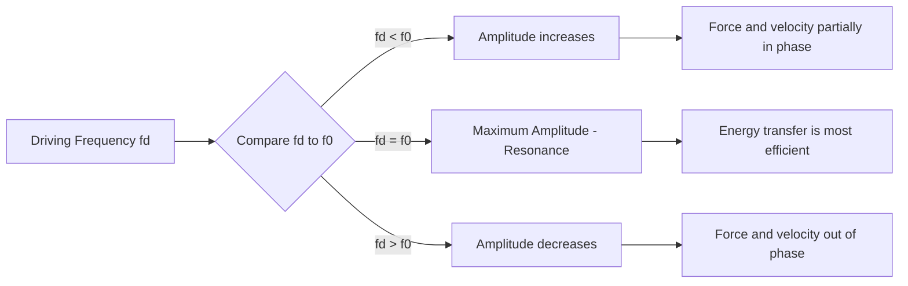

# 1. Overview / 概述

**English:**
Resonance is one of the most dramatic and practically important phenomena in physics. This sub-topic explores what happens when a system is driven at its **natural frequency** — the frequency at which it would oscillate freely. At resonance, the amplitude of oscillation reaches a **maximum**, and the driving force is perfectly in phase with the velocity of the oscillator, leading to maximum energy transfer. The **Barton pendulum** is a classic demonstration apparatus that beautifully illustrates resonance using a set of pendulums of different lengths driven by a common, moving support. You will learn to interpret the characteristic resonance curve (amplitude vs. driving frequency), understand the conditions for resonance, and appreciate its real-world applications — from the destructive collapse of the Tacoma Narrows Bridge to the beneficial tuning of a radio receiver. This sub-topic builds directly on [[Forced Oscillations]] and [[Light, Critical and Heavy Damping]], and is a key part of the [[Damped and Forced Oscillations - Resonance]] hub.

**中文:**
共振是物理学中最引人注目且具有重要实际意义的现象之一。本子知识点探讨当系统以其**固有频率**（系统自由振荡时的频率）被驱动时会发生什么。在共振时，振荡幅度达到**最大值**，驱动力与振荡器的速度完全同相，从而实现最大能量传递。**巴顿摆**是一个经典的演示装置，它通过一组不同长度的摆锤，由一个共同的移动支架驱动，完美地展示了共振现象。你将学习解读特征性的共振曲线（振幅 vs. 驱动频率），理解共振的条件，并欣赏其现实世界中的应用——从塔科马海峡大桥的破坏性坍塌到收音机调谐器的有益调谐。本子知识点直接建立在[[受迫振动]]和[[轻阻尼、临界阻尼与重阻尼]]之上，是[[阻尼振动与受迫振动 - 共振]]知识中枢的关键部分。

---

# 2. Syllabus Learning Objectives / 考纲学习目标

| CAIE 9702 (17.3 a-d) | Edexcel IAL (WPH14 U4: 7.9-7.13) |
|-----------|-------------|
| Describe practical examples of forced oscillations and resonance. | Understand the concept of resonance and the conditions under which it occurs. |
| Describe graphically how the amplitude of a forced oscillation changes with driving frequency. | Describe and explain the effects of damping on the sharpness of resonance. |
| Recognise the conditions for resonance. | Interpret and use a resonance curve (amplitude vs. frequency). |
| Describe how damping affects resonance. | Describe examples of resonance in mechanical and electrical systems. |

**Examiner Expectations / 考官期望:**
- **CAIE:** You must be able to **sketch** and **interpret** resonance curves for different levels of damping. You should be able to **explain** the Barton pendulum experiment and **describe** real-world examples of resonance (both useful and destructive).
- **Edexcel:** You must be able to **calculate** the natural frequency of a system (e.g., a mass-spring system or simple pendulum) and **predict** the resonance frequency. You should be able to **explain** how damping reduces the amplitude at resonance and broadens the resonance peak.
- **Both:** A common exam question is to **compare** the resonance behavior of lightly damped and heavily damped systems.

---

# 3. Core Definitions / 核心定义

| Term (EN/CN) | Definition (EN) | Definition (CN) | Common Mistakes / 常见错误 |
|--------------|-----------------|-----------------|---------------------------|
| **Resonance** / 共振 | The phenomenon where the amplitude of a forced oscillation is a maximum, occurring when the driving frequency equals the natural frequency of the system. | 当驱动频率等于系统的固有频率时，受迫振动的振幅达到最大的现象。 | ❌ Confusing resonance with "maximum energy transfer" — they are the same thing, but the exam definition focuses on **amplitude**. |
| **Natural Frequency ($f_0$)** / 固有频率 | The frequency at which a system oscillates freely when displaced from equilibrium and released. | 系统从平衡位置被移开并释放后自由振荡的频率。 | ❌ Thinking natural frequency depends on amplitude — it is a **property of the system** (mass, stiffness, length). |
| **Driving Frequency ($f_d$)** / 驱动频率 | The frequency of the external periodic force applied to a system. | 施加在系统上的外部周期性力的频率。 | ❌ Confusing with natural frequency — they are only equal at resonance. |
| **Resonance Curve** / 共振曲线 | A graph showing the variation of amplitude of a forced oscillation with driving frequency. | 显示受迫振动振幅随驱动频率变化的曲线。 | ❌ Forgetting that the curve's **peak** shifts and **broadens** with increased damping. |
| **Sharpness of Resonance** / 共振锐度 | A measure of how narrow the resonance peak is; related to the quality factor (Q-factor). Light damping gives a sharp peak. | 衡量共振峰宽窄程度的指标；与品质因数（Q值）相关。轻阻尼产生尖锐的峰。 | ❌ Thinking sharpness only depends on frequency — it depends on **damping**. |
| **Barton Pendulum** / 巴顿摆 | A demonstration apparatus with a set of pendulums of different lengths driven by a common, movable support. | 一种演示装置，由一组不同长度的摆锤组成，由一个共同的、可移动的支架驱动。 | ❌ Forgetting that the **driver pendulum** sets the frequency for all others. |

---

# 4. Key Concepts Explained / 关键概念详解

## 4.1 The Condition for Resonance / 共振的条件

### Explanation / 解释
**English:**
Resonance occurs when the **driving frequency ($f_d$)** equals the **natural frequency ($f_0$)** of the oscillating system. At this precise frequency, the driving force is always in the same direction as the velocity of the oscillator. This means the force does **maximum positive work** on the system, transferring energy most efficiently. The amplitude grows until the energy input per cycle equals the energy lost per cycle (due to damping). For an undamped system, the amplitude would theoretically grow to infinity — but in reality, some damping always exists.

For a simple pendulum, the natural frequency is $f_0 = \frac{1}{2\pi}\sqrt{\frac{g}{L}}$, so resonance occurs when the driving frequency matches this value. For a mass-spring system, $f_0 = \frac{1}{2\pi}\sqrt{\frac{k}{m}}$.

**中文:**
当**驱动频率 ($f_d$)** 等于振荡系统的**固有频率 ($f_0$)** 时，就会发生共振。在这个精确的频率下，驱动力始终与振荡器的速度方向相同。这意味着力对系统做**最大正功**，最有效地传递能量。振幅不断增长，直到每个周期的能量输入等于每个周期的能量损失（由于阻尼）。对于无阻尼系统，振幅理论上会增长到无穷大——但实际上，总是存在一些阻尼。

对于单摆，固有频率为 $f_0 = \frac{1}{2\pi}\sqrt{\frac{g}{L}}$，因此当驱动频率与此值匹配时发生共振。对于弹簧-质量系统，$f_0 = \frac{1}{2\pi}\sqrt{\frac{k}{m}}$。

### Physical Meaning / 物理意义
**English:**
At resonance, the system "absorbs" energy from the driver most effectively. Think of pushing a child on a swing: if you push at the same frequency as the swing's natural frequency, the swing goes higher and higher. If you push at a different frequency, the swing's motion is irregular and doesn't build up. This is resonance in action.

**中文:**
在共振时，系统最有效地从驱动源“吸收”能量。想象一下推一个荡秋千的孩子：如果你以与秋千固有频率相同的频率推，秋千会越荡越高。如果你以不同的频率推，秋千的运动就不规则，不会累积起来。这就是共振的作用。

### Common Misconceptions / 常见误区
- ❌ **"Resonance only happens at one exact frequency."** — Actually, resonance occurs over a **range** of frequencies near $f_0$, but the amplitude is maximum at $f_0$. The range depends on damping.
- ❌ **"Resonance always destroys things."** — Resonance can be destructive (bridges, buildings in earthquakes) but also **useful** (tuning a radio, MRI scanners, microwave ovens).
- ❌ **"The amplitude at resonance is infinite."** — Only for an **undamped** system. Real systems always have damping, which limits the amplitude.

### Exam Tips / 考试提示
- **EN:** When describing resonance, always mention **maximum amplitude** and **driving frequency = natural frequency**. For graphs, label the resonance peak clearly.
- **中文:** 描述共振时，务必提到**最大振幅**和**驱动频率 = 固有频率**。对于图表，要清晰地标注共振峰。

> 📷 **IMAGE PROMPT — RES-01: Resonance Condition Diagram**
> A diagram showing a mass on a spring being driven by an oscillating force. The driving force arrow is shown in the same direction as the velocity arrow at the equilibrium position. Label: "At resonance: f_d = f_0, force and velocity in phase."

## 4.2 The Resonance Curve / 共振曲线

### Explanation / 解释
**English:**
The resonance curve is a graph of **amplitude (A)** against **driving frequency ($f_d$)**. Key features:
- The peak occurs at $f_d = f_0$ (the natural frequency).
- As damping **increases**, the peak amplitude **decreases** and the curve becomes **broader** (less sharp).
- For very heavy damping, the peak may disappear entirely — the system no longer shows resonance.
- The **sharpness** of the peak is related to the **Q-factor** (quality factor): $Q = \frac{f_0}{\Delta f}$, where $\Delta f$ is the full width at half maximum (FWHM).

**中文:**
共振曲线是**振幅 (A)** 随**驱动频率 ($f_d$)** 变化的图表。关键特征：
- 峰值出现在 $f_d = f_0$（固有频率）处。
- 随着阻尼**增加**，峰值振幅**减小**，曲线变得**更宽**（锐度降低）。
- 对于非常大的阻尼，峰值可能完全消失——系统不再表现出共振。
- 峰的**锐度**与**品质因数 (Q值)** 相关：$Q = \frac{f_0}{\Delta f}$，其中 $\Delta f$ 是半高全宽 (FWHM)。

### Common Misconceptions / 常见误区
- ❌ **"The resonance frequency changes with damping."** — The **natural frequency** is a property of the system and does NOT change with damping. However, the **peak** of the resonance curve may shift slightly for very heavy damping (this is beyond A-Level).
- ❌ **"A broader peak means more energy transfer."** — Actually, a broader peak means **less efficient** energy transfer at the natural frequency, but the system responds over a wider range of frequencies.

### Exam Tips / 考试提示
- **EN:** When sketching resonance curves, always draw **multiple curves** for different damping levels. Label the axes: Amplitude (y-axis) and Driving Frequency (x-axis). Mark $f_0$ on the x-axis.
- **中文:** 绘制共振曲线时，务必画出**多条曲线**对应不同的阻尼水平。标注坐标轴：振幅（y轴）和驱动频率（x轴）。在x轴上标记 $f_0$。

> 📷 **IMAGE PROMPT — RES-02: Resonance Curves for Different Damping**
> A graph with three resonance curves: one sharp and tall (light damping), one medium (moderate damping), and one flat and low (heavy damping). All peaks are at the same natural frequency f_0. Label: "Effect of damping on resonance curve."

## 4.3 The Barton Pendulum / 巴顿摆

### Explanation / 解释
**English:**
The Barton pendulum is a classic demonstration of resonance. It consists of:
- A **driver pendulum** (usually a heavy mass on a long string) that is manually swung.
- Several **driven pendulums** of different lengths (and therefore different natural frequencies) attached to a common horizontal string or support.
- When the driver pendulum oscillates, it forces the support to move at the **driver's frequency**.

**What happens:**
- The pendulum with the **same length** (and thus same natural frequency) as the driver will resonate — its amplitude grows large.
- Pendulums with **different lengths** will oscillate with **smaller amplitudes** and may be out of phase with the driver.
- This clearly shows that resonance occurs when the driving frequency matches the natural frequency of the driven system.

**中文:**
巴顿摆是共振的经典演示。它由以下部分组成：
- 一个**驱动摆**（通常是一个挂在长绳上的重物），由手动摆动。
- 几个不同长度（因此具有不同固有频率）的**受迫摆**，连接在一个共同的水平绳或支架上。
- 当驱动摆振荡时，它迫使支架以**驱动摆的频率**运动。

**现象：**
- 与驱动摆**长度相同**（因此固有频率相同）的摆会共振——其振幅变得很大。
- 不同**长度**的摆会以**较小的振幅**振荡，并且可能与驱动摆不同相。
- 这清楚地表明，当驱动频率与受迫系统的固有频率匹配时，就会发生共振。

### Common Misconceptions / 常见误区
- ❌ **"All pendulums in the Barton pendulum resonate."** — Only the one with the same natural frequency as the driver resonates. Others oscillate but with much smaller amplitude.
- ❌ **"The driver pendulum is the one that resonates."** — No, the driver is the **source** of the driving force. The **driven** pendulums are the ones that may or may not resonate.

### Exam Tips / 考试提示
- **EN:** In exam questions, you may be asked to **predict** which pendulum in a Barton pendulum setup will resonate. Calculate the natural frequency of each pendulum using $f = \frac{1}{2\pi}\sqrt{\frac{g}{L}}$ and compare to the driver's frequency.
- **中文:** 在考试题中，你可能会被要求**预测**巴顿摆装置中哪个摆会共振。使用 $f = \frac{1}{2\pi}\sqrt{\frac{g}{L}}$ 计算每个摆的固有频率，并与驱动摆的频率进行比较。

> 📷 **IMAGE PROMPT — RES-03: Barton Pendulum Setup**
> A diagram showing a Barton pendulum: a horizontal string supported at both ends, with several pendulums of different lengths hanging from it. One pendulum (the driver) is shown swinging with large amplitude. The pendulum of the same length is also shown with large amplitude. Other pendulums have small amplitudes. Labels: "Driver pendulum", "Resonating pendulum", "Non-resonating pendulums."

---

# 5. Essential Equations / 核心公式

## Equation 1: Natural Frequency of a Simple Pendulum

$$ f_0 = \frac{1}{2\pi} \sqrt{\frac{g}{L}} $$

| Symbol (符号) | Meaning (EN) | Meaning (CN) | Unit (单位) |
|--------------|-------------|-------------|------------|
| $f_0$ | Natural frequency | 固有频率 | Hz |
| $g$ | Acceleration due to gravity | 重力加速度 | m s⁻² |
| $L$ | Length of pendulum | 摆长 | m |

**Conditions / 适用条件:** Small amplitude oscillations (θ < 10°). | 小角度振荡（θ < 10°）。
**Limitations / 局限性:** Only valid for simple pendulums, not for physical pendulums or mass-spring systems. | 仅适用于单摆，不适用于复摆或弹簧-质量系统。

## Equation 2: Natural Frequency of a Mass-Spring System

$$ f_0 = \frac{1}{2\pi} \sqrt{\frac{k}{m}} $$

| Symbol (符号) | Meaning (EN) | Meaning (CN) | Unit (单位) |
|--------------|-------------|-------------|------------|
| $f_0$ | Natural frequency | 固有频率 | Hz |
| $k$ | Spring constant (stiffness) | 弹簧常数（劲度系数） | N m⁻¹ |
| $m$ | Mass | 质量 | kg |

**Conditions / 适用条件:** Ideal spring (Hooke's law obeyed), no damping. | 理想弹簧（遵循胡克定律），无阻尼。
**Limitations / 局限性:** Does not account for the mass of the spring itself. | 未考虑弹簧本身的质量。

## Equation 3: Q-Factor (Sharpness of Resonance)

$$ Q = \frac{f_0}{\Delta f} $$

| Symbol (符号) | Meaning (EN) | Meaning (CN) | Unit (单位) |
|--------------|-------------|-------------|------------|
| $Q$ | Quality factor | 品质因数 | dimensionless |
| $f_0$ | Natural (resonance) frequency | 固有（共振）频率 | Hz |
| $\Delta f$ | Full width at half maximum (FWHM) | 半高全宽 | Hz |

**Derivation / 推导:** The Q-factor is a measure of energy stored per cycle divided by energy lost per cycle. A higher Q means sharper resonance. | Q值是每个周期储存的能量除以每个周期损失的能量。Q值越高，共振越尖锐。
**Conditions / 适用条件:** For lightly damped systems only. | 仅适用于轻阻尼系统。
**Limitations / 局限性:** For heavily damped systems, the concept of Q-factor becomes less meaningful. | 对于重阻尼系统，Q值的概念变得不太有意义。

> 📋 **Edexcel Only:** You may be asked to calculate the Q-factor from a resonance curve. Measure $\Delta f$ at half the maximum amplitude.

> 📋 **CIE Only:** You are expected to sketch resonance curves but not calculate Q-factor numerically.

---

# 6. Graphs and Relationships / 图表与关系

## 6.1 Amplitude vs. Driving Frequency (Resonance Curve) / 振幅 vs. 驱动频率（共振曲线）

### Axes / 坐标轴
- **x-axis:** Driving frequency, $f_d$ (Hz) | 驱动频率 (Hz)
- **y-axis:** Amplitude of oscillation, $A$ (m) | 振荡振幅 (m)

### Shape / 形状
- **Light damping:** A tall, narrow peak at $f_d = f_0$.
- **Moderate damping:** A shorter, wider peak at $f_d = f_0$.
- **Heavy damping:** A very low, broad curve — the peak may be barely visible or absent.

### Gradient Meaning / 斜率含义
- **Below resonance ($f_d < f_0$):** Amplitude increases as $f_d$ approaches $f_0$. The gradient is positive.
- **At resonance ($f_d = f_0$):** Gradient is zero (maximum point).
- **Above resonance ($f_d > f_0$):** Amplitude decreases as $f_d$ moves away from $f_0$. The gradient is negative.

### Area Meaning / 面积含义
The area under the resonance curve is **not** a standard physical quantity in A-Level physics. However, the **width** of the peak at half maximum ($\Delta f$) is important — it indicates the range of frequencies over which the system responds significantly.

### Exam Interpretation / 考试解读
- **EN:** When asked to "describe the effect of damping on resonance," always mention: (1) peak amplitude decreases, (2) peak becomes broader, (3) resonance frequency (peak position) remains approximately the same.
- **中文:** 当被要求“描述阻尼对共振的影响”时，务必提到：(1) 峰值振幅减小，(2) 峰值变宽，(3) 共振频率（峰值位置）大致保持不变。

---

# 7. Required Diagrams / 必备图表

## 7.1 Resonance Curve with Different Damping Levels / 不同阻尼水平的共振曲线

### Description / 描述
**English:** A graph showing three resonance curves for the same system but with different amounts of damping. All curves peak at the same natural frequency $f_0$. The lightly damped curve has a tall, narrow peak. The moderately damped curve has a shorter, wider peak. The heavily damped curve is very flat with no clear peak.

**中文:** 一张图表，显示同一系统在不同阻尼量下的三条共振曲线。所有曲线在相同的固有频率 $f_0$ 处达到峰值。轻阻尼曲线有一个高而窄的峰。中等阻尼曲线有一个较矮、较宽的峰。重阻尼曲线非常平坦，没有明显的峰。

### Image Prompt / 图片生成提示
> 📷 **IMAGE PROMPT — RES-04: Resonance Curves Comparison**
> A professional physics graph with three curves on the same axes. X-axis labeled "Driving Frequency (Hz)" with f_0 marked. Y-axis labeled "Amplitude (m)". Curve 1 (light damping): tall, narrow peak at f_0. Curve 2 (moderate damping): shorter, wider peak at f_0. Curve 3 (heavy damping): very low, broad curve. All curves start near zero amplitude at low frequency and approach zero at high frequency. Use different colors or line styles for each curve. Add a legend.

### Labels Required / 需要标注
- Axes: Amplitude (m), Driving Frequency (Hz)
- $f_0$ (natural frequency) on x-axis
- "Light damping", "Moderate damping", "Heavy damping" for each curve
- Peak amplitude values (optional)

### Exam Importance / 考试重要性
- **EN:** This is the most commonly asked graph in resonance questions. You must be able to **sketch** it from memory and **explain** the effect of damping.
- **中文:** 这是共振问题中最常考的图表。你必须能够凭记忆**绘制**它，并**解释**阻尼的影响。

## 7.2 Barton Pendulum Setup / 巴顿摆装置

### Description / 描述
**English:** A diagram showing a horizontal string or rod supported at both ends. Several pendulums of different lengths hang from this support. One pendulum (the driver) is shown swinging with large amplitude. The pendulum with the same length as the driver is also shown with large amplitude (resonating). Other pendulums have small amplitudes.

**中文:** 一张示意图，显示一根两端支撑的水平绳或杆。几个不同长度的摆从该支架上悬挂下来。一个摆（驱动摆）以大幅度摆动。与驱动摆长度相同的摆也以大幅度摆动（共振）。其他摆的振幅很小。

### Image Prompt / 图片生成提示
> 📷 **IMAGE PROMPT — RES-05: Barton Pendulum Demonstration**
> A clear physics diagram of a Barton pendulum. A horizontal string is stretched between two fixed supports. Five pendulums of different lengths (L1, L2, L3, L4, L5) hang from the string. The driver pendulum (length L3) is shown with a large swing angle. The pendulum of length L3 (same as driver) is also shown with a large swing angle. Pendulums of lengths L1, L2, L4, L5 are shown with small swing angles. Arrows indicate the direction of motion. Labels: "Driver", "Resonating", "Non-resonating".

### Labels Required / 需要标注
- Driver pendulum (驱动摆)
- Resonating pendulum (共振摆)
- Non-resonating pendulums (非共振摆)
- Lengths of pendulums (摆长)
- Direction of motion (运动方向)

### Exam Importance / 考试重要性
- **EN:** You may be asked to **explain** the Barton pendulum experiment or **predict** which pendulum will resonate. This is a common practical demonstration question.
- **中文:** 你可能会被要求**解释**巴顿摆实验或**预测**哪个摆会共振。这是一个常见的实验演示题。

---

# 8. Worked Examples / 典型例题

## Example 1: Resonance in a Barton Pendulum / 巴顿摆中的共振

### Question / 题目
**English:**
A Barton pendulum setup has a driver pendulum of length 0.40 m. Five driven pendulums have lengths: 0.20 m, 0.30 m, 0.40 m, 0.50 m, and 0.60 m. The driver is set into oscillation with a small amplitude.

(a) Calculate the natural frequency of the driver pendulum. (Take $g = 9.81 \text{ m s}^{-2}$)
(b) Which driven pendulum will resonate? Explain your answer.
(c) Describe what you would observe for the other pendulums.

**中文:**
一个巴顿摆装置有一个长度为 0.40 m 的驱动摆。五个受迫摆的长度分别为：0.20 m、0.30 m、0.40 m、0.50 m 和 0.60 m。驱动摆以小振幅开始振荡。

(a) 计算驱动摆的固有频率。（取 $g = 9.81 \text{ m s}^{-2}$）
(b) 哪个受迫摆会共振？解释你的答案。
(c) 描述你会观察到其他摆的什么现象。

### Solution / 解答

**(a)** Using the formula for the natural frequency of a simple pendulum:

$$ f_0 = \frac{1}{2\pi} \sqrt{\frac{g}{L}} = \frac{1}{2\pi} \sqrt{\frac{9.81}{0.40}} $$

$$ f_0 = \frac{1}{2\pi} \sqrt{24.525} = \frac{1}{2\pi} \times 4.952 $$

$$ f_0 = 0.788 \text{ Hz} $$

**(b)** The driven pendulum with length **0.40 m** will resonate. This is because it has the **same natural frequency** as the driver pendulum. Resonance occurs when the driving frequency equals the natural frequency of the driven system. Since the driver forces the support to oscillate at its own frequency (0.788 Hz), the pendulum with the same natural frequency will experience maximum amplitude.

**(c)** The other pendulums (0.20 m, 0.30 m, 0.50 m, 0.60 m) will oscillate but with **much smaller amplitudes**. They will not resonate because their natural frequencies are different from the driving frequency. They may also oscillate **out of phase** with the driver.

### Final Answer / 最终答案
**Answer:** (a) $f_0 = 0.788 \text{ Hz}$ | **答案：** (a) $f_0 = 0.788 \text{ Hz}$
(b) The 0.40 m pendulum resonates. | (b) 0.40 m 的摆共振。
(c) Other pendulums oscillate with small amplitudes. | (c) 其他摆以小振幅振荡。

### Quick Tip / 提示
- **EN:** Always calculate the natural frequency of the driver first. Then compare it to the natural frequencies of the driven pendulums. The one that matches will resonate.
- **中文:** 务必先计算驱动摆的固有频率。然后将其与受迫摆的固有频率进行比较。匹配的那个会共振。

---

## Example 2: Interpreting a Resonance Curve / 解读共振曲线

### Question / 题目
**English:**
A mass-spring system has a natural frequency of 2.0 Hz. The system is driven by an external force, and the amplitude of oscillation is measured for different driving frequencies. The results are shown in the resonance curve below.

(a) At what driving frequency is the amplitude maximum?
(b) The damping in the system is increased. Sketch the new resonance curve on the same axes.
(c) Explain why the amplitude at resonance decreases when damping is increased.

**中文:**
一个弹簧-质量系统的固有频率为 2.0 Hz。该系统受到外力的驱动，测量了不同驱动频率下的振荡振幅。结果如下面的共振曲线所示。

(a) 在什么驱动频率下振幅最大？
(b) 系统中的阻尼增加了。在同一坐标轴上画出新的共振曲线。
(c) 解释为什么增加阻尼时共振振幅会减小。

### Solution / 解答

**(a)** The amplitude is maximum at the **natural frequency**, which is **2.0 Hz**. This is the resonance frequency.

**(b)** The new curve should have:
- The same peak position at 2.0 Hz (natural frequency does not change with damping).
- A **lower** peak amplitude.
- A **broader** shape (wider at half maximum).

**(c)** When damping is increased, more energy is **dissipated** per cycle (as heat, sound, etc.). This means that for the same energy input from the driving force, the system cannot store as much energy, so the maximum amplitude is reduced. The system reaches a steady state at a lower amplitude because the energy input equals the energy dissipated at a lower energy level.

### Final Answer / 最终答案
**Answer:** (a) 2.0 Hz | **答案：** (a) 2.0 Hz
(b) Sketch with lower, broader peak at 2.0 Hz. | (b) 在 2.0 Hz 处画出更低、更宽的峰。
(c) Increased damping → more energy dissipated per cycle → lower steady-state amplitude. | (c) 阻尼增加 → 每个周期耗散更多能量 → 稳态振幅更低。

### Quick Tip / 提示
- **EN:** When sketching a resonance curve with increased damping, remember: **lower and wider**. The peak position stays the same.
- **中文:** 绘制阻尼增加的共振曲线时，记住：**更低更宽**。峰值位置保持不变。

---

# 9. Past Paper Question Types / 历年真题题型

| Question Type / 题型 | Frequency / 频率 | Difficulty / 难度 | Past Paper References / 真题索引 |
|----------------------|------------------|------------------|-------------------------------|
| Sketch and interpret resonance curves | Very High | Medium | 📝 *待填入* |
| Explain the Barton pendulum experiment | High | Medium | 📝 *待填入* |
| Calculate natural frequency and predict resonance | High | Easy-Medium | 📝 *待填入* |
| Describe real-world examples of resonance | Medium | Easy | 📝 *待填入* |
| Explain effect of damping on resonance | Very High | Medium | 📝 *待填入* |
| Compare useful and destructive resonance | Medium | Medium | 📝 *待填入* |

**Common Command Words / 常见指令词:**
- **Describe / 描述:** Give a detailed account of the phenomenon or experiment.
- **Explain / 解释:** Give reasons for why something happens (e.g., why amplitude decreases with damping).
- **Sketch / 绘制:** Draw a graph showing the general shape (axes must be labeled).
- **Calculate / 计算:** Use a formula to find a numerical value.
- **Predict / 预测:** State what will happen based on physics principles.

---

# 10. Practical Skills Connections / 实验技能链接

**English:**
Resonance is often investigated in practical work using:
- **Barton pendulum:** A qualitative demonstration. You observe which pendulum resonates and measure amplitudes (qualitatively).
- **Mass-spring system with a signal generator and vibration generator:** A quantitative experiment. You can measure amplitude at different driving frequencies and plot a resonance curve.
- **Microwave oven:** A real-world example where resonance is used to heat food (water molecules resonate at microwave frequencies).

**Key practical skills:**
- **Measuring amplitude:** Use a ruler or motion sensor.
- **Measuring frequency:** Use a stopwatch (count oscillations over time) or a frequency meter.
- **Controlling variables:** Keep the driving force amplitude constant while varying frequency.
- **Plotting graphs:** Plot amplitude (y-axis) against driving frequency (x-axis). Draw a smooth curve through the points.
- **Identifying resonance:** The peak of the graph.
- **Uncertainties:** The resonance peak may be broad, making it difficult to determine the exact resonance frequency. Estimate the uncertainty from the width of the peak.

**中文:**
共振通常在实验中进行研究，使用：
- **巴顿摆：** 定性演示。你观察哪个摆共振并测量振幅（定性）。
- **带有信号发生器和振动发生器的弹簧-质量系统：** 定量实验。你可以测量不同驱动频率下的振幅，并绘制共振曲线。
- **微波炉：** 一个现实世界的例子，利用共振来加热食物（水分子在微波频率下共振）。

**关键实验技能：**
- **测量振幅：** 使用尺子或运动传感器。
- **测量频率：** 使用秒表（计算一段时间内的振荡次数）或频率计。
- **控制变量：** 在改变频率时保持驱动力振幅恒定。
- **绘制图表：** 绘制振幅（y轴）与驱动频率（x轴）的关系图。通过数据点绘制平滑曲线。
- **识别共振：** 图表的峰值。
- **不确定度：** 共振峰可能很宽，使得难以确定精确的共振频率。根据峰的宽度估计不确定度。

---

# 11. Concept Map / 概念图谱

```mermaid
graph TD
    %% Central concept
    RES[Resonance] --> COND[Condition: fd = f0]
    RES --> CURVE[Resonance Curve]
    RES --> BARTON[Barton Pendulum]
    
    %% Condition details
    COND --> MAX[Maximum Amplitude]
    COND --> ENERGY[Maximum Energy Transfer]
    COND --> PHASE[Force in phase with velocity]
    
    %% Curve details
    CURVE --> SHAPE[Shape: Peak at f0]
    CURVE --> DAMPING[Effect of Damping]
    DAMPING --> LIGHT[Light Damping: Tall, Narrow Peak]
    DAMPING --> HEAVY[Heavy Damping: Low, Broad Peak]
    CURVE --> QFACTOR[Q-Factor: Sharpness]
    
    %% Barton details
    BARTON --> DRIVER[Driver Pendulum]
    BARTON --> DRIVEN[Driven Pendulums]
    DRIVEN --> SAME_LENGTH[Same Length → Resonates]
    DRIVEN --> DIFF_LENGTH[Different Length → Small Amplitude]
    
    %% Connections to other topics
    RES --> FORCED[[Forced Oscillations]]
    RES --> DAMPING_TYPES[[Light, Critical and Heavy Damping]]
    FORCED --> ENERGY_SHM[[Energy in SHM]]
    
    %% Real-world examples
    RES --> USEFUL[Useful Resonance]
    RES --> DESTRUCTIVE[Destructive Resonance]
    USEFUL --> RADIO[Radio Tuning]
    USEFUL --> MRI[MRI Scanners]
    DESTRUCTIVE --> BRIDGE[Tacoma Narrows Bridge]
    DESTRUCTIVE --> EARTHQUAKE[Buildings in Earthquakes]
```

---

# 12. Quick Revision Sheet / 速查表

| Category / 类别 | Key Points / 要点 |
|----------------|------------------|
| **Definition / 定义** | Resonance: Maximum amplitude when driving frequency = natural frequency. / 共振：当驱动频率 = 固有频率时振幅最大。 |
| **Key Formula / 核心公式** | $f_0 = \frac{1}{2\pi}\sqrt{\frac{g}{L}}$ (pendulum) or $f_0 = \frac{1}{2\pi}\sqrt{\frac{k}{m}}$ (mass-spring). Q-factor: $Q = f_0 / \Delta f$. |
| **Key Graph / 核心图表** | Resonance curve: Amplitude vs. Driving Frequency. Peak at $f_0$. Damping reduces peak height and broadens the curve. / 共振曲线：振幅 vs. 驱动频率。峰值在 $f_0$ 处。阻尼降低峰高并展宽曲线。 |
| **Barton Pendulum / 巴顿摆** | Driver pendulum forces support at its frequency. Pendulum with same length (same $f_0$) resonates. Others oscillate with small amplitude. / 驱动摆以其频率驱动支架。相同长度（相同 $f_0$）的摆共振。其他摆以小振幅振荡。 |
| **Condition for Resonance / 共振条件** | $f_d = f_0$. Driving force is in phase with velocity → maximum energy transfer. / $f_d = f_0$。驱动力与速度同相 → 最大能量传递。 |
| **Effect of Damping / 阻尼的影响** | More damping → lower peak amplitude, broader peak, less sharp resonance. / 阻尼越大 → 峰值振幅越低，峰值越宽，共振锐度越低。 |
| **Real-World Examples / 现实例子** | **Useful:** Radio tuning, MRI, microwave ovens. **Destructive:** Tacoma Narrows Bridge, buildings in earthquakes. / **有益的：** 收音机调谐、MRI、微波炉。**破坏性的：** 塔科马海峡大桥、地震中的建筑物。 |
| **Exam Tip / 考试提示** | Always sketch resonance curves with axes labeled. Mention both amplitude and frequency. For Barton pendulum, calculate natural frequencies to predict resonance. / 务必绘制带有坐标轴标注的共振曲线。同时提到振幅和频率。对于巴顿摆，计算固有频率以预测共振。 |