# 1. Overview / 概述

**English:** This topic explores the continuous interchange between [[Kinetic Energy and Potential Energy]] in [[Simple Harmonic Motion]] (SHM). In any undamped oscillating system (mass-spring, simple pendulum, etc.), total mechanical energy remains constant while energy continuously transforms between kinetic and potential forms. Understanding this energy conversion is crucial for analyzing real-world oscillatory systems, from clock pendulums to suspension bridges and even molecular vibrations. In CAIE 9702 (17.2 a-c) and Edexcel IAL (WPH14 U4: 7.6-7.8), this concept is examined through energy-time graphs, energy-displacement graphs, and calculations of energy at specific displacements. Mastery of energy in SHM provides the foundation for understanding [[Damped and Forced Oscillations / Resonance]], where energy is dissipated or added to the system.

**中文:** 本主题探讨[[简谐运动]]中[[动能与势能]]之间的连续转换。在任何无阻尼振荡系统（弹簧质量系统、单摆等）中，总机械能保持不变，而能量在动能和势能形式之间持续转换。理解这种能量转换对于分析现实世界的振荡系统至关重要，从钟摆到悬索桥，甚至分子振动。在CAIE 9702（17.2 a-c）和Edexcel IAL（WPH14 U4: 7.6-7.8）中，该概念通过能量-时间图、能量-位移图以及在特定位移处的能量计算来考查。掌握SHM中的能量为理解[[阻尼振动与受迫振动/共振]]奠定了基础，其中能量被耗散或添加到系统中。

> 📷 **IMAGE PROMPT — [OVR-01]: Energy Conversion in SHM Overview**
> **English:** A split diagram showing three systems: (1) mass-spring oscillating vertically with energy labels (KE at equilibrium, PE at extremes), (2) simple pendulum with energy labels, (3) a bar chart showing KE (blue) and PE (red) bars at different positions. Labels: "Equilibrium Position (max KE)", "Extreme Position (max PE)", "Total Energy = Constant". Style: clean educational diagram, pastel colors, A-level standard. Exam importance: HIGH - foundational understanding.
> **中文:** 分图显示三个系统：(1)垂直振动的弹簧质量系统，带有能量标签（平衡位置动能最大，极端位置势能最大），(2)单摆带有能量标签，(3)在不同位置显示动能（蓝色）和势能（红色）条的柱状图。标签："平衡位置（动能最大）"，"极端位置（势能最大）"，"总能量=常数"。风格：清晰的教育图表，柔和色彩，A-level标准。考试重要性：高 - 基础理解。

---

# 2. Syllabus Learning Objectives / 考纲学习目标

| CAIE 9702 (17.2 a-c) | Edexcel IAL (WPH14 U4: 7.6-7.8) |
|---|---|
| (a) Describe the interchange between kinetic energy and potential energy during SHM | 7.6 Understand the interchange between kinetic and potential energy in SHM |
| (b) Sketch and interpret energy-time graphs for SHM | 7.7 Sketch and interpret energy-displacement graphs for SHM |
| (c) Sketch and interpret energy-displacement graphs for SHM | 7.8 Calculate the total energy, kinetic energy, and potential energy at a given displacement in SHM |

**Examiner Expectations / 考官期望:**

**English:**
- Students must be able to **sketch** energy graphs (both E-t and E-x) from memory, with correct shapes and labels
- For CAIE: Pay attention to the **phase relationship** between KE and PE graphs (they are 90° out of phase in E-t, but in phase in E-x)
- For Edexcel: Calculations of energy at specific displacements are frequently tested
- Both boards expect students to know that **total energy is proportional to amplitude squared** ($E_T \propto A^2$)
- Students should be able to derive energy expressions from SHM equations

**中文:**
- 学生必须能够凭记忆**绘制**能量图（E-t和E-x），形状和标签正确
- 对于CAIE：注意KE和PE图之间的**相位关系**（在E-t图中相位差90°，但在E-x图中同相）
- 对于Edexcel：在特定位移处的能量计算经常被考查
- 两个考试局都期望学生知道**总能量与振幅平方成正比**（$E_T \propto A^2$）
- 学生应能够从SHM方程推导能量表达式

> 📋 **CIE Only:** CAIE 9702 Paper 4 often asks students to **describe** the energy interchange in words, not just sketch graphs. Practice writing: "As the mass moves from equilibrium to amplitude, kinetic energy decreases while potential energy increases, keeping total energy constant."
>
> 📋 **Edexcel Only:** Edexcel IAL Unit 4 often includes **numerical problems** where students calculate KE and PE at specific displacements. Know the formula $E_T = \frac{1}{2}m\omega^2A^2$ and $E_P = \frac{1}{2}m\omega^2x^2$.

---

# 3. Core Definitions / 核心定义

| Term (EN/CN) | Definition (EN) | Definition (CN) | Common Mistakes / 常见错误 |
|---|---|---|---|
| [[Total Mechanical Energy]] / 总机械能 | The sum of kinetic energy and potential energy in an undamped SHM system; remains constant throughout the oscillation | 无阻尼SHM系统中动能与势能之和；在整个振荡过程中保持不变 | ❌ Thinking total energy changes during oscillation (it's constant for undamped SHM) |
| [[Kinetic Energy in SHM]] / SHM中的动能 | Energy due to motion of the oscillating mass; maximum at equilibrium position ($x=0$), zero at amplitude ($x=\pm A$) | 振荡质量因运动而具有的能量；在平衡位置（$x=0$）最大，在振幅处（$x=\pm A$）为零 | ❌ Confusing KE with velocity — KE is proportional to $v^2$, not $v$ |
| [[Potential Energy in SHM]] / SHM中的势能 | Stored energy due to displacement from equilibrium; zero at equilibrium, maximum at amplitude | 因偏离平衡位置而储存的能量；在平衡位置为零，在振幅处最大 | ❌ Forgetting that PE is always positive (squared displacement) |
| [[Amplitude]] / 振幅 | Maximum displacement from equilibrium position; determines total energy of the system | 从平衡位置的最大位移；决定系统的总能量 | ❌ Confusing amplitude with displacement at a given instant |
| [[Equilibrium Position]] / 平衡位置 | Position where net force on oscillating mass is zero; point of maximum KE and zero PE | 振荡质量所受合力为零的位置；动能最大、势能为零的点 | ❌ Thinking equilibrium means zero velocity (it's where velocity is maximum) |
| [[Energy Conservation in SHM]] / SHM中的能量守恒 | Principle that total mechanical energy ($E_T = KE + PE$) remains constant for undamped oscillations | 无阻尼振荡中总机械能（$E_T = KE + PE$）保持恒定的原理 | ❌ Applying this to damped oscillations without accounting for energy loss |

---

# 4. Key Concepts Explained / 关键概念详解

## 4.1 Energy Interchange in SHM / SHM中的能量互换

### Explanation / 解释

**English:** In [[Simple Harmonic Motion]], energy continuously transforms between [[Kinetic Energy and Potential Energy]]. Consider a [[Mass-Spring System]] oscillating horizontally on a frictionless surface:
- At the **equilibrium position** ($x=0$): velocity is maximum, so [[Kinetic Energy in SHM|KE]] is maximum; displacement is zero, so [[Potential Energy in SHM|PE]] is zero
- At the **extreme positions** ($x=\pm A$): velocity is zero, so KE is zero; displacement is maximum, so PE is maximum
- At **intermediate positions**: both KE and PE are non-zero, and their sum equals the constant total energy

This interchange is analogous to a pendulum: at the bottom of the swing (equilibrium), KE is maximum and PE is minimum; at the top of the swing (amplitude), KE is zero and PE is maximum.

**中文:** 在[[简谐运动]]中，能量在[[动能与势能]]之间持续转换。考虑一个在无摩擦水平面上振动的[[弹簧质量系统]]：
- 在**平衡位置**（$x=0$）：速度最大，因此[[SHM中的动能|动能]]最大；位移为零，因此[[SHM中的势能|势能]]为零
- 在**极端位置**（$x=\pm A$）：速度为零，因此动能为零；位移最大，因此势能最大
- 在**中间位置**：动能和势能均非零，它们的和等于恒定的总能量

这种互换类似于摆：在摆动底部（平衡位置），动能最大，势能最小；在摆动顶部（振幅处），动能为零，势能最大。

### Physical Meaning / 物理意义

**English:** The energy interchange in SHM demonstrates the fundamental principle of [[Energy Conservation]] in oscillatory systems. The total mechanical energy $E_T = \frac{1}{2}m\omega^2A^2$ depends only on mass $m$, angular frequency $\omega$, and amplitude $A$ — not on the instantaneous displacement. This means:
- Increasing amplitude increases total energy quadratically ($E_T \propto A^2$)
- The system's energy determines the maximum speed ($v_{max} = \omega A$) and maximum acceleration ($a_{max} = \omega^2 A$)
- In real (damped) systems, energy gradually dissipates, reducing amplitude over time

**中文:** SHM中的能量互换展示了振荡系统中[[能量守恒]]的基本原理。总机械能 $E_T = \frac{1}{2}m\omega^2A^2$ 仅取决于质量 $m$、角频率 $\omega$ 和振幅 $A$ — 而不取决于瞬时位移。这意味着：
- 增加振幅会使总能量二次方增加（$E_T \propto A^2$）
- 系统的能量决定了最大速度（$v_{max} = \omega A$）和最大加速度（$a_{max} = \omega^2 A$）
- 在实际（阻尼）系统中，能量逐渐耗散，随时间推移振幅减小

### Common Misconceptions / 常见误区

- ❌ **"KE and PE are equal at half amplitude"** — Actually, KE = PE when $x = \pm A/\sqrt{2}$, not at $x = \pm A/2$
- ❌ **"Total energy changes during oscillation"** — For undamped SHM, total energy is constant; only KE and PE change
- ❌ **"PE is negative at some positions"** — PE is always positive (or zero) because it depends on $x^2$
- ❌ **"KE and PE graphs are in phase"** — In E-t graphs, KE and PE are 90° out of phase; in E-x graphs, they are in phase (both parabolic)
- ❌ **"Energy is lost at amplitude"** — Energy is stored as PE at amplitude, not lost; it converts back to KE on the return journey

### Exam Tips / 考试提示

**English:**
- When describing energy interchange, use precise language: "As the mass moves from equilibrium to amplitude, KE decreases and PE increases, keeping total energy constant"
- For CAIE: Be prepared to sketch both E-t and E-x graphs from memory — practice until perfect
- For Edexcel: Memorize the formula $E_T = \frac{1}{2}m\omega^2A^2$ and $E_P = \frac{1}{2}m\omega^2x^2$
- Remember that $KE = E_T - PE = \frac{1}{2}m\omega^2(A^2 - x^2)$
- When given a graph, identify which curve is KE and which is PE by checking which is zero at amplitude

**中文:**
- 描述能量互换时，使用精确语言："当质量从平衡位置移动到振幅时，动能减少，势能增加，总能量保持不变"
- 对于CAIE：准备凭记忆绘制E-t和E-x图 — 练习到完美
- 对于Edexcel：记住公式 $E_T = \frac{1}{2}m\omega^2A^2$ 和 $E_P = \frac{1}{2}m\omega^2x^2$
- 记住 $KE = E_T - PE = \frac{1}{2}m\omega^2(A^2 - x^2)$
- 当给出图形时，通过检查哪个在振幅处为零来识别哪个曲线是KE，哪个是PE

> 📷 **IMAGE PROMPT — [KE-01]: Energy Interchange in Mass-Spring System**
> **English:** A horizontal mass-spring system shown at four positions: (1) at left amplitude (x=-A) with PE max, KE=0; (2) moving left to right at x=-A/√2 with KE=PE; (3) at equilibrium (x=0) with KE max, PE=0; (4) at right amplitude (x=+A) with PE max, KE=0. Arrows show energy flow. Labels: "KE (blue bar)", "PE (red bar)", "Total Energy (green line)". Style: clean physics diagram, color-coded energy bars, A-level standard. Exam importance: HIGH - core concept visualization.
> **中文:** 水平弹簧质量系统在四个位置显示：(1)在左振幅（x=-A），势能最大，动能为零；(2)从左向右移动在x=-A/√2，动能=势能；(3)在平衡位置（x=0），动能最大，势能为零；(4)在右振幅（x=+A），势能最大，动能为零。箭头显示能量流动。标签："动能（蓝色条）"，"势能（红色条）"，"总能量（绿色线）"。风格：清晰的物理图表，颜色编码的能量条，A-level标准。考试重要性：高 - 核心概念可视化。

---

## 4.2 Energy-Time Graphs for SHM / SHM的能量-时间图

### Explanation / 解释

**English:** [[Energy-Time Graphs for SHM]] show how kinetic energy (KE) and potential energy (PE) vary with time during one complete oscillation. Key features:
- Both KE and PE are **sinusoidal** functions of time
- KE and PE are **90° out of phase** (or $\pi/2$ radians) — when KE is maximum, PE is zero, and vice versa
- The **total energy** ($E_T$) is a **horizontal straight line** (constant)
- The period of energy variation is **half** the period of displacement variation ($T_{energy} = T_{oscillation}/2$)
- Both KE and PE are always **positive** (or zero)

The mathematical forms are:
- $KE(t) = \frac{1}{2}m\omega^2A^2\sin^2(\omega t + \phi)$
- $PE(t) = \frac{1}{2}m\omega^2A^2\cos^2(\omega t + \phi)$
- $E_T = KE + PE = \frac{1}{2}m\omega^2A^2$ (constant)

**中文:** [[SHM的能量-时间图]]显示在一个完整振荡期间动能（KE）和势能（PE）如何随时间变化。关键特征：
- KE和PE都是时间的**正弦**函数
- KE和PE**相位差90°**（或$\pi/2$弧度）— 当KE最大时，PE为零，反之亦然
- **总能量**（$E_T$）是一条**水平直线**（恒定）
- 能量变化的周期是位移变化周期的**一半**（$T_{能量} = T_{振荡}/2$）
- KE和PE始终为**正**（或零）

数学形式为：
- $KE(t) = \frac{1}{2}m\omega^2A^2\sin^2(\omega t + \phi)$
- $PE(t) = \frac{1}{2}m\omega^2A^2\cos^2(\omega t + \phi)$
- $E_T = KE + PE = \frac{1}{2}m\omega^2A^2$（恒定）

### Physical Meaning / 物理意义

**English:** The E-t graph reveals the **temporal relationship** between energy forms:
- The frequency of energy oscillation is **double** the frequency of displacement oscillation (because energy depends on $x^2$ or $v^2$)
- At any instant, the sum of KE and PE equals the constant total energy
- The graph shape is determined by $\sin^2$ and $\cos^2$ functions, which oscillate between 0 and 1
- The phase difference of 90° between KE and PE means they never reach zero at the same time

**中文:** E-t图揭示了能量形式之间的**时间关系**：
- 能量振荡的频率是位移振荡频率的**两倍**（因为能量取决于$x^2$或$v^2$）
- 在任何时刻，KE和PE之和等于恒定的总能量
- 图形形状由$\sin^2$和$\cos^2$函数决定，它们在0和1之间振荡
- KE和PE之间的90°相位差意味着它们永远不会同时达到零

### Common Misconceptions / 常见误区

- ❌ **"KE and PE have the same period as displacement"** — No, energy period is half the displacement period
- ❌ **"KE and PE are in phase"** — In E-t graphs, they are 90° out of phase (quadrature)
- ❌ **"Total energy line is sinusoidal"** — Total energy is constant (horizontal line), not sinusoidal
- ❌ **"KE and PE can be negative"** — Both are always positive (or zero) because they depend on squares
- ❌ **"The graph shows energy at different positions"** — E-t shows energy at different times, not positions (that's E-x)

### Exam Tips / 考试提示

**English:**
- When sketching E-t graphs, always include: labeled axes (Energy/J, Time/s), correct sinusoidal shapes, constant total energy line, and labels for KE, PE, and ET
- Mark the period: one complete energy cycle occurs in half the oscillation period
- Remember that KE and PE curves are mirror images of each other about the $E_T/2$ line
- For CAIE: Be prepared to sketch E-t graphs for different starting positions (e.g., starting at amplitude vs. starting at equilibrium)
- For Edexcel: You may need to calculate energy values at specific times using $KE = \frac{1}{2}m\omega^2A^2\sin^2(\omega t)$

**中文:**
- 绘制E-t图时，始终包括：标记坐标轴（能量/J，时间/s），正确的正弦形状，恒定的总能量线，以及KE、PE和ET的标签
- 标记周期：一个完整的能量周期发生在振荡周期的一半时间内
- 记住KE和PE曲线关于$E_T/2$线互为镜像
- 对于CAIE：准备绘制不同起始位置（例如，从振幅开始vs从平衡位置开始）的E-t图
- 对于Edexcel：你可能需要使用$KE = \frac{1}{2}m\omega^2A^2\sin^2(\omega t)$计算特定时间的能量值

> 📷 **IMAGE PROMPT — [ET-01]: Energy-Time Graph for SHM**
> **English:** A graph with Energy (J) on y-axis and Time (s) on x-axis. Three curves: KE (blue dashed line) showing sin² shape, PE (red dotted line) showing cos² shape, and ET (green solid horizontal line) showing constant total energy. Mark one complete oscillation period T on x-axis. Show that KE and PE peaks occur at T/4 intervals. Labels: "KE = ½mω²A²sin²(ωt)", "PE = ½mω²A²cos²(ωt)", "ET = ½mω²A²". Style: clean graph paper style, color-coded, A-level standard. Exam importance: HIGH - frequently tested.
> **中文:** 一个以能量（J）为y轴、时间（s）为x轴的图表。三条曲线：KE（蓝色虚线）显示sin²形状，PE（红色点线）显示cos²形状，ET（绿色实水平线）显示恒定总能量。在x轴上标记一个完整振荡周期T。显示KE和PE峰值每T/4出现一次。标签："KE = ½mω²A²sin²(ωt)"，"PE = ½mω²A²cos²(ωt)"，"ET = ½mω²A²"。风格：清晰的方格纸风格，颜色编码，A-level标准。考试重要性：高 - 经常考查。

---

## 4.3 Energy-Displacement Graphs for SHM / SHM的能量-位移图

### Explanation / 解释

**English:** [[Energy-Displacement Graphs for SHM]] show how kinetic energy (KE) and potential energy (PE) vary with displacement ($x$) from equilibrium. Key features:
- Both KE and PE are **parabolic** functions of displacement
- KE and PE are **in phase** in E-x graphs — both are symmetric about $x=0$
- PE is maximum at $x=\pm A$ and zero at $x=0$
- KE is maximum at $x=0$ and zero at $x=\pm A$
- The **total energy** ($E_T$) is a **horizontal straight line** (constant)
- The graphs are **even functions** (symmetric about the y-axis)

The mathematical forms are:
- $PE(x) = \frac{1}{2}m\omega^2x^2$ (parabola opening upward)
- $KE(x) = \frac{1}{2}m\omega^2(A^2 - x^2)$ (parabola opening downward)
- $E_T = \frac{1}{2}m\omega^2A^2$ (constant)

**中文:** [[SHM的能量-位移图]]显示动能（KE）和势能（PE）如何随偏离平衡位置的位移（$x$）变化。关键特征：
- KE和PE都是位移的**抛物线**函数
- 在E-x图中，KE和PE**同相** — 两者都关于$x=0$对称
- PE在$x=\pm A$处最大，在$x=0$处为零
- KE在$x=0$处最大，在$x=\pm A$处为零
- **总能量**（$E_T$）是一条**水平直线**（恒定）
- 图形是**偶函数**（关于y轴对称）

数学形式为：
- $PE(x) = \frac{1}{2}m\omega^2x^2$（开口向上的抛物线）
- $KE(x) = \frac{1}{2}m\omega^2(A^2 - x^2)$（开口向下的抛物线）
- $E_T = \frac{1}{2}m\omega^2A^2$（恒定）

### Physical Meaning / 物理意义

**English:** The E-x graph reveals the **spatial relationship** between energy forms:
- The PE curve is identical to the potential energy function of a [[Hooke's Law]] spring ($PE = \frac{1}{2}kx^2$), confirming that SHM arises from a linear restoring force
- The KE curve is the complement of the PE curve — their sum is always constant
- The intersection point where KE = PE occurs at $x = \pm A/\sqrt{2}$ (approximately $\pm 0.707A$)
- The graph shows that energy is "stored" as PE when the mass is displaced and "released" as KE as it returns to equilibrium

**中文:** E-x图揭示了能量形式之间的**空间关系**：
- PE曲线与[[胡克定律]]弹簧的势能函数（$PE = \frac{1}{2}kx^2$）相同，确认SHM源于线性恢复力
- KE曲线是PE曲线的补集 — 它们的和始终恒定
- KE = PE的交点发生在$x = \pm A/\sqrt{2}$处（约$\pm 0.707A$）
- 图形显示当质量被位移时能量"储存"为PE，当它返回平衡位置时"释放"为KE

### Common Misconceptions / 常见误区

- ❌ **"KE and PE are 90° out of phase in E-x graphs"** — No, in E-x graphs they are in phase (both symmetric about x=0)
- ❌ **"The graphs are linear"** — Both KE and PE are parabolic (quadratic), not linear
- ❌ **"KE = PE at x = A/2"** — Actually, KE = PE at $x = A/\sqrt{2}$, not at $x = A/2$
- ❌ **"PE is negative for negative x"** — PE depends on $x^2$, so it's always positive regardless of sign of x
- ❌ **"Total energy varies with displacement"** — Total energy is constant (horizontal line), independent of x

### Exam Tips / 考试提示

**English:**
- When sketching E-x graphs, always include: labeled axes (Energy/J, Displacement/m), parabolic shapes, constant total energy line, and labels for KE, PE, and ET
- Mark the amplitude positions ($\pm A$) on the x-axis
- Mark the intersection point where KE = PE at $x = \pm A/\sqrt{2}$
- Remember that the PE curve is the same shape as the potential well of the oscillator
- For Edexcel: Numerical problems often ask you to calculate KE or PE at a given displacement — use $PE = \frac{1}{2}m\omega^2x^2$ and $KE = \frac{1}{2}m\omega^2(A^2 - x^2)$

**中文:**
- 绘制E-x图时，始终包括：标记坐标轴（能量/J，位移/m），抛物线形状，恒定的总能量线，以及KE、PE和ET的标签
- 在x轴上标记振幅位置（$\pm A$）
- 标记KE = PE的交点，在$x = \pm A/\sqrt{2}$处
- 记住PE曲线与振荡器的势阱形状相同
- 对于Edexcel：数值问题经常要求你在给定位移处计算KE或PE — 使用$PE = \frac{1}{2}m\omega^2x^2$和$KE = \frac{1}{2}m\omega^2(A^2 - x^2)$

> 📷 **IMAGE PROMPT — [EX-01]: Energy-Displacement Graph for SHM**
> **English:** A graph with Energy (J) on y-axis and Displacement (m) on x-axis. Three curves: PE (red parabola opening upward, vertex at origin), KE (blue parabola opening downward, vertex at origin), and ET (green horizontal line). Mark amplitude positions ±A on x-axis. Mark the intersection points where KE=PE at x=±A/√2 with dashed vertical lines. Labels: "PE = ½mω²x²", "KE = ½mω²(A²-x²)", "ET = ½mω²A²", "x=±A/√2". Style: clean graph paper style, color-coded, A-level standard. Exam importance: HIGH - frequently tested in both boards.
> **中文:** 一个以能量（J）为y轴、位移（m）为x轴的图表。三条曲线：PE（红色抛物线开口向上，顶点在原点），KE（蓝色抛物线开口向下，顶点在原点），ET（绿色水平线）。在x轴上标记振幅位置±A。用虚线垂直线标记KE=PE的交点，在x=±A/√2处。标签："PE = ½mω²x²"，"KE = ½mω²(A²-x²)"，"ET = ½mω²A²"，"x=±A/√2"。风格：清晰的方格纸风格，颜色编码，A-level标准。考试重要性：高 - 两个考试局都经常考查。

---

## 4.4 Energy Calculations in SHM / SHM中的能量计算

### Explanation / 解释

**English:** Calculating energy in SHM requires understanding the relationships between displacement, velocity, and energy. The key formulas are derived from the SHM equations:

Given $x = A\cos(\omega t + \phi)$ and $v = -\omega A\sin(\omega t + \phi)$:

- **Total Energy:** $E_T = \frac{1}{2}m\omega^2A^2 = \frac{1}{2}kA^2$ (for mass-spring system where $k = m\omega^2$)
- **Potential Energy:** $PE = \frac{1}{2}m\omega^2x^2 = \frac{1}{2}kx^2$
- **Kinetic Energy:** $KE = \frac{1}{2}mv^2 = \frac{1}{2}m\omega^2(A^2 - x^2)$
- **Ratio KE:PE at displacement x:** $\frac{KE}{PE} = \frac{A^2 - x^2}{x^2}$

For a [[Simple Pendulum]], the energy expressions are similar but with $\omega = \sqrt{g/l}$:
- $E_T = \frac{1}{2}m(g/l)A^2$ (for small angles)
- $PE = mgh$ where $h$ is height above equilibrium

**中文:** 计算SHM中的能量需要理解位移、速度和能量之间的关系。关键公式从SHM方程推导：

给定 $x = A\cos(\omega t + \phi)$ 和 $v = -\omega A\sin(\omega t + \phi)$：

- **总能量：** $E_T = \frac{1}{2}m\omega^2A^2 = \frac{1}{2}kA^2$（对于弹簧质量系统，其中 $k = m\omega^2$）
- **势能：** $PE = \frac{1}{2}m\omega^2x^2 = \frac{1}{2}kx^2$
- **动能：** $KE = \frac{1}{2}mv^2 = \frac{1}{2}m\omega^2(A^2 - x^2)$
- **位移x处的KE:PE比值：** $\frac{KE}{PE} = \frac{A^2 - x^2}{x^2}$

对于[[单摆]]，能量表达式类似，但 $\omega = \sqrt{g/l}$：
- $E_T = \frac{1}{2}m(g/l)A^2$（小角度时）
- $PE = mgh$，其中 $h$ 是高于平衡位置的高度

### Physical Meaning / 物理意义

**English:** The energy expressions reveal important physical insights:
- Total energy depends only on amplitude, not on the specific path or timing — this is why increasing amplitude requires more energy input
- The quadratic dependence of PE on displacement ($PE \propto x^2$) is characteristic of [[Hooke's Law]] systems and simple harmonic oscillators
- The expression $KE = \frac{1}{2}m\omega^2(A^2 - x^2)$ shows that KE decreases quadratically as displacement increases
- At $x = A/\sqrt{2}$, KE = PE = $E_T/2$ — this is a useful reference point

**中文:** 能量表达式揭示了重要的物理见解：
- 总能量仅取决于振幅，而不取决于具体路径或时间 — 这就是为什么增加振幅需要更多能量输入
- PE对位移的二次方依赖关系（$PE \propto x^2$）是[[胡克定律]]系统和简谐振子的特征
- 表达式 $KE = \frac{1}{2}m\omega^2(A^2 - x^2)$ 显示KE随位移增加而二次方减少
- 在 $x = A/\sqrt{2}$ 处，KE = PE = $E_T/2$ — 这是一个有用的参考点

### Common Misconceptions / 常见误区

- ❌ **"KE = ½mv² and PE = ½kx² are independent"** — They are linked through $v^2 = \omega^2(A^2 - x^2)$
- ❌ **"Total energy depends on mass only"** — Total energy depends on $m$, $\omega$, and $A$; changing any one changes $E_T$
- ❌ **"At x=0, PE is negative"** — PE is zero at equilibrium, not negative
- ❌ **"KE and PE can be calculated independently"** — They must satisfy $KE + PE = E_T$ at all times
- ❌ **"For a pendulum, PE = ½kx²"** — For a pendulum, PE = mgh, not ½kx² (though for small angles, they are equivalent)

### Exam Tips / 考试提示

**English:**
- Always check units: energy in joules (J), displacement in meters (m), mass in kg, angular frequency in rad/s
- For mass-spring systems: $k = m\omega^2$, so $E_T = \frac{1}{2}kA^2$ is often easier to use
- When given a graph, read values carefully — amplitude from x-axis, energy from y-axis
- For Edexcel: Practice calculating energy at specific displacements — these are common 4-6 mark questions
- For CAIE: Be prepared to derive energy expressions from first principles using $x = A\cos(\omega t)$ and $v = -\omega A\sin(\omega t)$

**中文:**
- 始终检查单位：能量以焦耳（J）为单位，位移以米（m）为单位，质量以kg为单位，角频率以rad/s为单位
- 对于弹簧质量系统：$k = m\omega^2$，因此 $E_T = \frac{1}{2}kA^2$ 通常更容易使用
- 当给出图形时，仔细读取数值 — 从x轴读取振幅，从y轴读取能量
- 对于Edexcel：练习计算特定位移处的能量 — 这些是常见的4-6分题目
- 对于CAIE：准备使用 $x = A\cos(\omega t)$ 和 $v = -\omega A\sin(\omega t)$ 从基本原理推导能量表达式

> 📷 **IMAGE PROMPT — [EC-01]: Energy Calculation Diagram for SHM**
> **English:** A mass-spring system at displacement x from equilibrium, with labels showing: displacement x (from equilibrium), amplitude A (maximum displacement), spring constant k, mass m. Next to it, a bar chart showing KE (blue), PE (red), and ET (green outline) at this displacement. Formulas displayed: "ET = ½mω²A² = ½kA²", "PE = ½mω²x² = ½kx²", "KE = ½mω²(A²-x²) = ½k(A²-x²)". Style: clean educational diagram, color-coded, A-level standard. Exam importance: HIGH - essential for numerical problems.
> **中文:** 一个弹簧质量系统在偏离平衡位置位移x处，带有标签显示：位移x（偏离平衡位置），振幅A（最大位移），弹簧常数k，质量m。旁边是一个柱状图，显示在此位移处的KE（蓝色）、PE（红色）和ET（绿色轮廓）。显示的公式："ET = ½mω²A² = ½kA²"，"PE = ½mω²x² = ½kx²"，"KE = ½mω²(A²-x²) = ½k(A²-x²)"。风格：清晰的教育图表，颜色编码，A-level标准。考试重要性：高 - 数值问题必备。

---

# 5. Essential Equations / 核心公式

## 5.1 Total Energy in SHM / SHM中的总能量

$$E_T = \frac{1}{2}m\omega^2A^2 = \frac{1}{2}kA^2$$

| Symbol (符号) | Meaning (EN/CN) | Unit (单位) |
|---|---|---|
| $E_T$ | Total mechanical energy / 总机械能 | J (Joules) |
| $m$ | Mass of oscillating object / 振荡物体的质量 | kg |
| $\omega$ | Angular frequency / 角频率 | rad/s |
| $A$ | Amplitude / 振幅 | m |
| $k$ | Spring constant / 弹簧常数 | N/m |

**Derivation / 推导:**
$$E_T = KE_{max} = \frac{1}{2}mv_{max}^2 = \frac{1}{2}m(\omega A)^2 = \frac{1}{2}m\omega^2A^2$$
Since $k = m\omega^2$ for a mass-spring system: $E_T = \frac{1}{2}kA^2$

**Conditions / 条件:**
- Valid for **undamped** SHM only
- Valid for any SHM system (mass-spring, pendulum, etc.)
- For pendulum: $\omega = \sqrt{g/l}$, so $E_T = \frac{1}{2}m(g/l)A^2$

**Limitations / 限制:**
- Does not account for energy losses due to damping
- For pendulum, valid only for small angular amplitudes ($\theta < 10^\circ$)
- Assumes ideal spring (no mass, perfectly elastic)

**Rearrangements / 变形:**
- $A = \sqrt{\frac{2E_T}{m\omega^2}}$
- $\omega = \sqrt{\frac{2E_T}{mA^2}}$
- $m = \frac{2E_T}{\omega^2A^2}$

---

## 5.2 Potential Energy in SHM / SHM中的势能

$$PE = \frac{1}{2}m\omega^2x^2 = \frac{1}{2}kx^2$$

| Symbol (符号) | Meaning (EN/CN) | Unit (单位) |
|---|---|---|
| $PE$ | Potential energy / 势能 | J |
| $x$ | Displacement from equilibrium / 偏离平衡位置的位移 | m |
| $m$ | Mass / 质量 | kg |
| $\omega$ | Angular frequency / 角频率 | rad/s |
| $k$ | Spring constant / 弹簧常数 | N/m |

**Derivation / 推导:**
For a mass-spring system: $PE = \frac{1}{2}kx^2$. Since $k = m\omega^2$: $PE = \frac{1}{2}m\omega^2x^2$

**Conditions / 条件:**
- Valid for any displacement $x$ within the amplitude ($-A \leq x \leq A$)
- PE is always positive (or zero at equilibrium)
- For pendulum: $PE = mgh$ where $h = l(1-\cos\theta)$; for small angles, $PE \approx \frac{1}{2}m(g/l)x^2$

**Limitations / 限制:**
- Assumes linear restoring force (Hooke's Law)
- For pendulum, small angle approximation required for simple form

**Rearrangements / 变形:**
- $x = \sqrt{\frac{2PE}{m\omega^2}}$
- $\omega = \sqrt{\frac{2PE}{mx^2}}$

---

## 5.3 Kinetic Energy in SHM / SHM中的动能

$$KE = \frac{1}{2}m\omega^2(A^2 - x^2) = \frac{1}{2}k(A^2 - x^2)$$

| Symbol (符号) | Meaning (EN/CN) | Unit (单位) |
|---|---|---|
| $KE$ | Kinetic energy / 动能 | J |
| $m$ | Mass / 质量 | kg |
| $\omega$ | Angular frequency / 角频率 | rad/s |
| $A$ | Amplitude / 振幅 | m |
| $x$ | Displacement / 位移 | m |
| $k$ | Spring constant / 弹簧常数 | N/m |

**Derivation / 推导:**
$$KE = E_T - PE = \frac{1}{2}m\omega^2A^2 - \frac{1}{2}m\omega^2x^2 = \frac{1}{2}m\omega^2(A^2 - x^2)$$

**Conditions / 条件:**
- Valid for any displacement $x$ within the amplitude
- KE is maximum at $x=0$: $KE_{max} = \frac{1}{2}m\omega^2A^2$
- KE is zero at $x = \pm A$

**Limitations / 限制:**
- Assumes no energy losses
- For pendulum, valid only for small angular amplitudes

**Rearrangements / 变形:**
- $x = \sqrt{A^2 - \frac{2KE}{m\omega^2}}$
- $A = \sqrt{x^2 + \frac{2KE}{m\omega^2}}$

---

## 5.4 Energy Ratio at Given Displacement / 给定位移处的能量比

$$\frac{KE}{PE} = \frac{A^2 - x^2}{x^2}$$

| Symbol (符号) | Meaning (EN/CN) | Unit (单位) |
|---|---|---|
| $KE/PE$ | Ratio of kinetic to potential energy / 动能与势能之比 | dimensionless |
| $A$ | Amplitude / 振幅 | m |
| $x$ | Displacement / 位移 | m |

**Derivation / 推导:**
$$\frac{KE}{PE} = \frac{\frac{1}{2}m\omega^2(A^2 - x^2)}{\frac{1}{2}m\omega^2x^2} = \frac{A^2 - x^2}{x^2}$$

**Conditions / 条件:**
- Valid for $x \neq 0$ (at $x=0$, PE=0 so ratio is undefined/infinite)
- At $x = A/\sqrt{2}$: $KE/PE = 1$ (equal energies)
- At $x = A/2$: $KE/PE = 3$ (KE is three times PE)

**Limitations / 限制:**
- Only valid for undamped SHM

**Rearrangements / 变形:**
- $x = \frac{A}{\sqrt{1 + KE/PE}}$
- $A = x\sqrt{1 + KE/PE}$

---

## 5.5 Energy as a Function of Time / 能量作为时间的函数

$$KE(t) = \frac{1}{2}m\omega^2A^2\sin^2(\omega t + \phi)$$
$$PE(t) = \frac{1}{2}m\omega^2A^2\cos^2(\omega t + \phi)$$

| Symbol (符号) | Meaning (EN/CN) | Unit (单位) |
|---|---|---|
| $t$ | Time / 时间 | s |
| $\phi$ | Phase constant / 相位常数 | rad |
| $\omega$ | Angular frequency / 角频率 | rad/s |

**Derivation / 推导:**
Using $x = A\cos(\omega t + \phi)$ and $v = -\omega A\sin(\omega t + \phi)$:
$$PE = \frac{1}{2}m\omega^2x^2 = \frac{1}{2}m\omega^2A^2\cos^2(\omega t + \phi)$$
$$KE = \frac{1}{2}mv^2 = \frac{1}{2}m\omega^2A^2\sin^2(\omega t + \phi)$$

**Conditions / 条件:**
- Valid for any time $t$
- $\phi$ depends on initial conditions (e.g., $\phi=0$ if starting at $x=A$)

**Limitations / 限制:**
- Assumes undamped SHM
- For pendulum, small angle approximation required

**Rearrangements / 变形:**
- $\sin^2(\omega t + \phi) + \cos^2(\omega t + \phi) = 1$ (confirms $KE + PE = E_T$)

---

# 6. Graphs and Relationships / 图表与关系

## 6.1 Energy-Time Graph / 能量-时间图

**Axes / 坐标轴:**
- x-axis: Time (t) / 时间 (t) — unit: s
- y-axis: Energy (E) / 能量 (E) — unit: J

**Shape / 形状:**
- KE: $\sin^2$ curve (blue, dashed) — starts at 0 if $\phi=0$, rises to max, returns to 0
- PE: $\cos^2$ curve (red, dotted) — starts at max if $\phi=0$, falls to 0, returns to max
- ET: Horizontal straight line (green, solid) — constant value

**Gradient Meaning / 斜率含义:**
**English:** The gradient of the KE curve represents the rate of change of kinetic energy ($d(KE)/dt$), which equals the power transferred between KE and PE. The gradient is zero at KE maxima and minima. The gradient of PE is the negative of KE gradient ($d(PE)/dt = -d(KE)/dt$).
**中文:** KE曲线的斜率代表动能的变化率（$d(KE)/dt$），等于KE和PE之间传递的功率。在KE最大值和最小值处斜率为零。PE的斜率是KE斜率的相反数（$d(PE)/dt = -d(KE)/dt$）。

**Area Meaning / 面积含义:**
**English:** The area under the KE-time curve represents the total kinetic energy transferred over time, but this is not typically examined. More importantly, the vertical distance between KE and PE curves at any time is $|KE - PE|$, and the sum is always $E_T$.
**中文:** KE-时间曲线下的面积代表随时间传递的总动能，但这通常不考查。更重要的是，任何时刻KE和PE曲线之间的垂直距离是$|KE - PE|$，它们的和始终是$E_T$。

**Exam Interpretation / 考试解读:**
- The period of energy oscillation is $T/2$ (half the displacement period)
- KE and PE are 90° out of phase (quadrature)
- Total energy is constant (horizontal line)
- The curves are mirror images about $E_T/2$

**Common Questions / 常见问题:**
- "Sketch the energy-time graph for SHM" (CAIE Paper 4)
- "Explain why KE and PE are 90° out of phase" (Edexcel)
- "On the graph, mark where the mass is at equilibrium / amplitude" (both boards)

> 📷 **IMAGE PROMPT — [ET-02]: Detailed Energy-Time Graph with Labels**
> **English:** A detailed energy-time graph for SHM showing one complete oscillation period T. Three curves: KE (blue dashed sin²), PE (red dotted cos²), ET (green solid horizontal). Mark T/4, T/2, 3T/4, T on x-axis. At t=0: PE=ET, KE=0 (mass at amplitude). At t=T/4: KE=ET, PE=0 (mass at equilibrium). At t=T/2: PE=ET, KE=0 (mass at opposite amplitude). Labels: "KE = ½mω²A²sin²(ωt)", "PE = ½mω²A²cos²(ωt)", "ET = ½mω²A²", "T = oscillation period". Style: clean graph paper, color-coded, A-level standard. Exam importance: HIGH - must be able to sketch from memory.
> **中文:** 一个详细的SHM能量-时间图，显示一个完整振荡周期T。三条曲线：KE（蓝色虚线sin²），PE（红色点线cos²），ET（绿色实水平线）。在x轴上标记T/4、T/2、3T/4、T。在t=0处：PE=ET，KE=0（质量在振幅处）。在t=T/4处：KE=ET，PE=0（质量在平衡位置）。在t=T/2处：PE=ET，KE=0（质量在相反振幅处）。标签："KE = ½mω²A²sin²(ωt)"，"PE = ½mω²A²cos²(ωt)"，"ET = ½mω²A²"，"T = 振荡周期"。风格：清晰的方格纸，颜色编码，A-level标准。考试重要性：高 - 必须能够凭记忆绘制。

---

## 6.2 Energy-Displacement Graph / 能量-位移图

**Axes / 坐标轴:**
- x-axis: Displacement (x) / 位移 (x) — unit: m
- y-axis: Energy (E) / 能量 (E) — unit: J

**Shape / 形状:**
- PE: Parabola opening upward (red, dotted) — vertex at origin, value $\frac{1}{2}m\omega^2A^2$ at $x=\pm A$
- KE: Parabola opening downward (blue, dashed) — vertex at origin, value $\frac{1}{2}m\omega^2A^2$ at $x=0$, zero at $x=\pm A$
- ET: Horizontal straight line (green, solid) — constant value $\frac{1}{2}m\omega^2A^2$

**Gradient Meaning / 斜率含义:**
**English:** The gradient of the PE-displacement graph represents the restoring force: $F = -d(PE)/dx = -m\omega^2x = -kx$. The gradient is zero at $x=0$ (equilibrium) and maximum at $x=\pm A$. The gradient of KE is the negative of PE gradient.
**中文:** PE-位移图的斜率代表恢复力：$F = -d(PE)/dx = -m\omega^2x = -kx$。在$x=0$（平衡位置）斜率为零，在$x=\pm A$处斜率最大。KE的斜率是PE斜率的相反数。

**Area Meaning / 面积含义:**
**English:** The area under the PE-displacement curve from $x=0$ to $x=x_0$ represents the work done against the restoring force, which equals the potential energy stored. The area between the KE curve and the ET line represents the same quantity.
**中文:** PE-位移曲线下从$x=0$到$x=x_0$的面积代表克服恢复力所做的功，等于储存的势能。KE曲线和ET线之间的面积代表相同的量。

**Exam Interpretation / 考试解读:**
- KE and PE are in phase (both symmetric about x=0)
- The intersection point where KE = PE occurs at $x = \pm A/\sqrt{2}$
- The PE curve is the same shape as the potential well
- The vertical distance from PE curve to ET line equals KE at that displacement

**Common Questions / 常见问题:**
- "Sketch the energy-displacement graph for SHM" (CAIE Paper 4)
- "At what displacement are KE and PE equal?" (both boards)
- "Use the graph to find the total energy of the oscillator" (Edexcel)
- "Explain the shape of the PE curve in terms of Hooke's Law" (CAIE)

> 📷 **IMAGE PROMPT — [EX-02]: Detailed Energy-Displacement Graph with Key Points**
> **English:** A detailed energy-displacement graph for SHM. Three curves: PE (red parabola upward), KE (blue parabola downward), ET (green horizontal). Mark on x-axis: -A, -A/√2, 0, A/√2, A. At x=±A/√2, draw dashed vertical lines to intersection points where KE=PE. Label these points "KE = PE = ET/2". At x=0, label "KE = ET, PE = 0". At x=±A, label "PE = ET, KE = 0". Style: clean graph paper, color-coded, A-level standard. Exam importance: HIGH - must be able to sketch from memory.
> **中文:** 一个详细的SHM能量-位移图。三条曲线：PE（红色抛物线向上），KE（蓝色抛物线向下），ET（绿色水平线）。在x轴上标记：-A、-A/√2、0、A/√2、A。在x=±A/√2处，绘制虚线垂直线到KE=PE的交点。标记这些点"KE = PE = ET/2"。在x=0处，标记"KE = ET, PE = 0"。在x=±A处，标记"PE = ET, KE = 0"。风格：清晰的方格纸，颜色编码，A-level标准。考试重要性：高 - 必须能够凭记忆绘制。

---

## 6.3 Comparison: E-t vs E-x Graphs / E-t图与E-x图比较

| Feature / 特征 | Energy-Time (E-t) | Energy-Displacement (E-x) |
|---|---|---|
| **x-axis** | Time (s) | Displacement (m) |
| **KE shape** | $\sin^2$ curve | Parabola (downward) |
| **PE shape** | $\cos^2$ curve | Parabola (upward) |
| **Phase of KE & PE** | 90° out of phase | In phase |
| **Period** | $T/2$ (half oscillation period) | N/A (not periodic in x) |
| **Symmetry** | Not symmetric | Even function (symmetric about x=0) |
| **Use** | Shows energy vs time | Shows energy vs position |

> 📷 **IMAGE PROMPT — [CP-01]: Comparison of E-t and E-x Graphs**
> **English:** Side-by-side comparison of E-t graph (left) and E-x graph (right) for the same SHM system. Both have Energy (J) on y-axis. Left: time (s) on x-axis with sin² and cos² curves. Right: displacement (m) on x-axis with parabolic curves. Color-coded: KE (blue), PE (red), ET (green). Labels highlight key differences: phase relationship, shape, period. Style: clean comparison diagram, A-level standard. Exam importance: MEDIUM - helps understanding.
> **中文:** 同一SHM系统的E-t图（左）和E-x图（右）并排比较。两者y轴都是能量（J）。左：x轴为时间（s），有sin²和cos²曲线。右：x轴为位移（m），有抛物线曲线。颜色编码：KE（蓝色）、PE（红色）、ET（绿色）。标签突出关键差异：相位关系、形状、周期。风格：清晰的比较图，A-level标准。考试重要性：中 - 有助于理解。

---

# 7. Required Diagrams / 必备图表

## 7.1 Mass-Spring System Energy Diagram / 弹簧质量系统能量图

> 📷 **IMAGE PROMPT — [D01]: Mass-Spring Energy Diagram**
> **English:** A horizontal mass-spring system on a frictionless surface shown at three positions: (a) at left amplitude (x=-A): spring compressed, mass stationary, label "PE = max, KE = 0"; (b) at equilibrium (x=0): spring at natural length, mass moving at max speed, label "KE = max, PE = 0"; (c) at right amplitude (x=+A): spring stretched, mass stationary, label "PE = max, KE = 0". Arrows show direction of motion. Energy bar charts next to each position showing KE (blue) and PE (red). Total energy bar (green outline) constant. Labels: "A = amplitude", "m = mass", "k = spring constant". Style: clean physics diagram, color-coded energy bars, A-level standard. Exam importance: HIGH - core visualization.
> **中文:** 一个在无摩擦表面上的水平弹簧质量系统，显示在三个位置：(a)在左振幅（x=-A）：弹簧压缩，质量静止，标签"势能最大，动能为零"；(b)在平衡位置（x=0）：弹簧自然长度，质量以最大速度运动，标签"动能最大，势能为零"；(c)在右振幅（x=+A）：弹簧拉伸，质量静止，标签"势能最大，动能为零"。箭头显示运动方向。每个位置旁边的能量柱状图显示KE（蓝色）和PE（红色）。总能量条（绿色轮廓）恒定。标签："A = 振幅"，"m = 质量"，"k = 弹簧常数"。风格：清晰的物理图表，颜色编码的能量条，A-level标准。考试重要性：高 - 核心可视化。

---

## 7.2 Simple Pendulum Energy Diagram / 单摆能量图

> 📷 **IMAGE PROMPT — [D02]: Simple Pendulum Energy Diagram**
> **English:** A simple pendulum shown at three positions: (a) at maximum displacement (angle θ): bob at highest point, label "PE = max (mgh), KE = 0"; (b) at equilibrium (θ=0): bob at lowest point, label "KE = max, PE = 0"; (c) at intermediate position: bob at height h, label "KE + PE = ET". Show height h measured from equilibrium position. Energy bar charts next to each position. Labels: "l = length", "m = mass", "θ = angular amplitude", "h = height above equilibrium". Style: clean physics diagram, color-coded, A-level standard. Exam importance: HIGH - pendulum is common exam context.
> **中文:** 一个单摆显示在三个位置：(a)在最大位移处（角度θ）：摆锤在最高点，标签"势能最大（mgh），动能为零"；(b)在平衡位置（θ=0）：摆锤在最低点，标签"动能最大，势能为零"；(c)在中间位置：摆锤在高度h处，标签"动能+势能=总能量"。显示从平衡位置测量的高度h。每个位置旁边的能量柱状图。标签："l = 长度"，"m = 质量"，"θ = 角振幅"，"h = 高于平衡位置的高度"。风格：清晰的物理图表，颜色编码，A-level标准。考试重要性：高 - 摆是常见的考试背景。

---

## 7.3 Energy Graph Sketch Template / 能量图绘制模板

> 📷 **IMAGE PROMPT — [D03]: Energy Graph Sketch Template**
> **English:** Two blank graph templates side by side: (left) Energy-Time graph with labeled axes "Energy/J" and "Time/s", with dashed guidelines showing where to draw KE (sin²), PE (cos²), and ET (horizontal line). (right) Energy-Displacement graph with labeled axes "Energy/J" and "Displacement/m", with dashed guidelines showing where to draw PE (parabola upward), KE (parabola downward), and ET (horizontal line). Key points marked: T/4, T/2, 3T/4, T on time axis; -A, -A/√2, 0, A/√2, A on displacement axis. Style: clean template with guidelines, A-level standard. Exam importance: HIGH - practice sketching these graphs.
> **中文:** 两个并排的空白图模板：（左）能量-时间图，标记坐标轴"能量/J"和"时间/s"，带有虚线指导线显示在哪里绘制KE（sin²）、PE（cos²）和ET（水平线）。（右）能量-位移图，标记坐标轴"能量/J"和"位移/m"，带有虚线指导线显示在哪里绘制PE（抛物线向上）、KE（抛物线向下）和ET（水平线）。关键点标记：时间轴上的T/4、T/2、3T/4、T；位移轴上的-A、-A/√2、0、A/√2、A。风格：带有指导线的清晰模板，A-level标准。考试重要性：高 - 练习绘制这些图表。

---

# 8. Worked Examples / 典型例题

## Example 1: Energy Calculation in a Mass-Spring System / 弹簧质量系统中的能量计算

### Question / 题目

**English:**
A mass of 0.50 kg is attached to a spring of spring constant 200 N/m and oscillates with simple harmonic motion of amplitude 0.050 m.

(a) Calculate the total energy of the oscillator.
(b) Calculate the kinetic energy and potential energy when the displacement is 0.030 m from equilibrium.
(c) At what displacement are the kinetic and potential energies equal?

**中文:**
一个质量为0.50 kg的物体连接到弹簧常数为200 N/m的弹簧上，以振幅0.050 m进行简谐运动。

(a) 计算振荡器的总能量。
(b) 计算位移为偏离平衡位置0.030 m时的动能和势能。
(c) 在什么位移处动能和势能相等？

### Image Prompt / 图片提示

> 📷 **IMAGE PROMPT — [WE1]: Mass-Spring System for Example 1**
> **English:** A horizontal mass-spring system with mass m=0.50 kg, spring constant k=200 N/m, amplitude A=0.050 m. Show the mass at displacement x=0.030 m from equilibrium. Label all given values. Include a small energy bar chart showing KE and PE at this displacement. Style: clean diagram, A-level standard. Exam importance: HIGH - typical exam question setup.
> **中文:** 一个水平弹簧质量系统，质量m=0.50 kg，弹簧常数k=200 N/m，振幅A=0.050 m。显示质量在偏离平衡位置位移x=0.030 m处。标记所有给定值。包括一个小能量柱状图，显示在此位移处的KE和PE。风格：清晰图表，A-level标准。考试重要性：高 - 典型考试题目设置。

### Solution / 解答

**Step 1: Identify given values / 步骤1：确定给定值**
- $m = 0.50 \text{ kg}$
- $k = 200 \text{ N/m}$
- $A = 0.050 \text{ m}$
- $x = 0.030 \text{ m}$ (for parts b and c)

**Step 2: Calculate total energy / 步骤2：计算总能量**

$$E_T = \frac{1}{2}kA^2 = \frac{1}{2} \times 200 \times (0.050)^2$$

$$E_T = \frac{1}{2} \times 200 \times 0.0025 = 0.25 \text{ J}$$

**Step 3: Calculate PE at x = 0.030 m / 步骤3：计算x = 0.030 m处的势能**

$$PE = \frac{1}{2}kx^2 = \frac{1}{2} \times 200 \times (0.030)^2$$

$$PE = \frac{1}{2} \times 200 \times 0.0009 = 0.09 \text{ J}$$

**Step 4: Calculate KE at x = 0.030 m / 步骤4：计算x = 0.030 m处的动能**

$$KE = E_T - PE = 0.25 - 0.09 = 0.16 \text{ J}$$

Alternatively:
$$KE = \frac{1}{2}k(A^2 - x^2) = \frac{1}{2} \times 200 \times (0.0025 - 0.0009) = \frac{1}{2} \times 200 \times 0.0016 = 0.16 \text{ J}$$

**Step 5: Find displacement where KE = PE / 步骤5：求KE = PE时的位移**

When $KE = PE$, we have $PE = \frac{1}{2}E_T$:

$$\frac{1}{2}kx^2 = \frac{1}{2} \times \frac{1}{2}kA^2$$

$$x^2 = \frac{A^2}{2}$$

$$x = \pm \frac{A}{\sqrt{2}} = \pm \frac{0.050}{\sqrt{2}} = \pm 0.0354 \text{ m}$$

### Final Answer / 最终答案

(a) $E_T = 0.25 \text{ J}$
(b) $PE = 0.09 \text{ J}$, $KE = 0.16 \text{ J}$
(c) $x = \pm 0.035 \text{ m}$ (to 2 significant figures)

### Examiner Notes / 考官点评

**English:**
- ✓ Correct use of $E_T = \frac{1}{2}kA^2$ (many students use $E_T = \frac{1}{2}m\omega^2A^2$ which is also correct but requires finding $\omega$ first)
- ✓ Clear step-by-step working shown
- ✓ Correct identification that KE = PE at $x = A/\sqrt{2}$
- ⚠ Common mistake: Using $x = A/2$ instead of $x = A/\sqrt{2}$ for equal energies
- ⚠ Remember to include units (J) in final answers
- ⚠ For part (c), both positive and negative displacements are valid answers

**中文:**
- ✓ 正确使用 $E_T = \frac{1}{2}kA^2$（许多学生使用 $E_T = \frac{1}{2}m\omega^2A^2$，这也是正确的，但需要先求$\omega$）
- ✓ 展示了清晰的逐步计算过程
- ✓ 正确识别KE = PE在 $x = A/\sqrt{2}$ 处
- ⚠ 常见错误：使用 $x = A/2$ 而不是 $x = A/\sqrt{2}$ 来求能量相等
- ⚠ 记住在最终答案中包含单位（J）
- ⚠ 对于部分(c)，正位移和负位移都是有效答案

---

## Example 2: Energy-Time Graph Interpretation / 能量-时间图解读

### Question / 题目

**English:**
A particle of mass 0.20 kg oscillates with simple harmonic motion of period 2.0 s and amplitude 0.10 m.

(a) Calculate the angular frequency of the oscillation.
(b) Calculate the total energy of the oscillator.
(c) Sketch the energy-time graph for one complete oscillation, assuming the particle starts at maximum displacement. Label all key values.
(d) Determine the time at which the kinetic energy first equals the potential energy.

**中文:**
一个质量为0.20 kg的粒子以周期2.0 s和振幅0.10 m进行简谐运动。

(a) 计算振荡的角频率。
(b) 计算振荡器的总能量。
(c) 绘制一个完整振荡的能量-时间图，假设粒子从最大位移开始。标记所有关键值。
(d) 确定动能首次等于势能的时间。

### Image Prompt / 图片提示

> 📷 **IMAGE PROMPT — [WE2]: Energy-Time Graph for Example 2**
> **English:** A blank energy-time graph template with axes labeled "Energy/J" and "Time/s". The time axis is marked from 0 to 2.0 s (one period T). Dashed guidelines show where to draw KE (sin² starting from 0), PE (cos² starting from max), and ET (horizontal line). Key time points: T/4=0.5s, T/2=1.0s, 3T/4=1.5s, T=2.0s. Energy axis should accommodate ET value. Style: clean template, A-level standard. Exam importance: HIGH - typical graph sketching question.
> **中文:** 一个空白能量-时间图模板，坐标轴标记为"能量/J"和"时间/s"。时间轴从0标记到2.0 s（一个周期T）。虚线指导线显示在哪里绘制KE（从0开始的sin²）、PE（从最大值开始的cos²）和ET（水平线）。关键时间点：T/4=0.5s、T/2=1.0s、3T/4=1.5s、T=2.0s。能量轴应能容纳ET值。风格：清晰模板，A-level标准。考试重要性：高 - 典型的图表绘制题。

### Solution / 解答

**Step 1: Calculate angular frequency / 步骤1：计算角频率**

$$\omega = \frac{2\pi}{T} = \frac{2\pi}{2.0} = \pi \text{ rad/s} \approx 3.14 \text{ rad/s}$$

**Step 2: Calculate total energy / 步骤2：计算总能量**

First, find the spring constant $k$:
$$k = m\omega^2 = 0.20 \times (\pi)^2 = 0.20 \times 9.87 = 1.97 \text{ N/m}$$

$$E_T = \frac{1}{2}kA^2 = \frac{1}{2} \times 1.97 \times (0.10)^2 = \frac{1}{2} \times 1.97 \times 0.01 = 0.00985 \text{ J} \approx 9.9 \times 10^{-3} \text{ J}$$

Alternatively:
$$E_T = \frac{1}{2}m\omega^2A^2 = \frac{1}{2} \times 0.20 \times (\pi)^2 \times (0.10)^2 = 0.10 \times 9.87 \times 0.01 = 9.87 \times 10^{-3} \text{ J}$$

**Step 3: Sketch energy-time graph / 步骤3：绘制能量-时间图**

Key features of the graph:
- x-axis: Time (s) from 0 to 2.0 s
- y-axis: Energy (J) from 0 to $9.9 \times 10^{-3}$ J
- PE curve: $\cos^2$ shape, starts at $9.9 \times 10^{-3}$ J at t=0, falls to 0 at t=0.5 s, rises back to max at t=1.0 s
- KE curve: $\sin^2$ shape, starts at 0 at t=0, rises to $9.9 \times 10^{-3}$ J at t=0.5 s, falls to 0 at t=1.0 s
- ET line: Horizontal at $9.9 \times 10^{-3}$ J
- Pattern repeats for t=1.0 s to 2.0 s

**Step 4: Find time when KE = PE / 步骤4：求KE = PE的时间**

When $KE = PE$, we have $PE = \frac{1}{2}E_T$:

$$\frac{1}{2}m\omega^2A^2\cos^2(\omega t) = \frac{1}{2} \times \frac{1}{2}m\omega^2A^2$$

$$\cos^2(\omega t) = \frac{1}{2}$$

$$\cos(\omega t) = \pm \frac{1}{\sqrt{2}}$$

For the first time (smallest positive t), $\cos(\omega t) = \frac{1}{\sqrt{2}}$:

$$\omega t = \frac{\pi}{4}$$

$$t = \frac{\pi}{4\omega} = \frac{\pi}{4\pi} = 0.25 \text{ s}$$

### Final Answer / 最终答案

(a) $\omega = \pi \text{ rad/s} \approx 3.14 \text{ rad/s}$
(b) $E_T = 9.9 \times 10^{-3} \text{ J}$
(c) Graph: PE starts at $9.9 \times 10^{-3}$ J (cos²), KE starts at 0 (sin²), ET horizontal at $9.9 \times 10^{-3}$ J, period of energy oscillation = 1.0 s
(d) $t = 0.25 \text{ s}$

### Examiner Notes / 考官点评

**English:**
- ✓ Correct calculation of $\omega$ from period
- ✓ Correct use of $E_T = \frac{1}{2}m\omega^2A^2$ or $E_T = \frac{1}{2}kA^2$
- ✓ Graph sketch includes correct shapes, labels, and key values
- ✓ Correct identification that KE = PE at $t = T/8$ when starting from amplitude
- ⚠ Common mistake: Forgetting that energy period is $T/2$, not $T$
- ⚠ In graph sketching, ensure curves are smooth (not triangular) and correctly labeled
- ⚠ For part (d), many students incorrectly use $x = A/\sqrt{2}$ and then find corresponding time — this is valid but more complex

**中文:**
- ✓ 从周期正确计算$\omega$
- ✓ 正确使用 $E_T = \frac{1}{2}m\omega^2A^2$ 或 $E_T = \frac{1}{2}kA^2$
- ✓ 图表绘制包括正确的形状、标签和关键值
- ✓ 正确识别从振幅开始时KE = PE在 $t = T/8$ 处
- ⚠ 常见错误：忘记能量周期是 $T/2$，而不是 $T$
- ⚠ 在绘制图表时，确保曲线平滑（不是三角形）并正确标记
- ⚠ 对于部分(d)，许多学生错误地使用 $x = A/\sqrt{2}$ 然后找对应时间 — 这也是有效的但更复杂

---

# 9. Past Paper Question Types / 历年真题题型

| Question Type / 题型 | Frequency / 频率 | Difficulty / 难度 | Past Paper References / 真题索引 |
|---|---|---|---|
| Sketch and interpret energy-time graphs / 绘制并解读能量-时间图 | Very High / 非常高 | Medium / 中等 | 📝 *待填入* |
| Sketch and interpret energy-displacement graphs / 绘制并解读能量-位移图 | Very High / 非常高 | Medium / 中等 | 📝 *待填入* |
| Calculate total energy from given parameters / 从给定参数计算总能量 | High / 高 | Easy / 简单 | 📝 *待填入* |
| Calculate KE and PE at specific displacement / 计算特定位移处的动能和势能 | High / 高 | Medium / 中等 | 📝 *待填入* |
| Find displacement where KE = PE / 求动能等于势能时的位移 | Medium / 中 | Medium / 中等 | 📝 *待填入* |
| Describe energy interchange in words / 用文字描述能量互换 | Medium / 中 | Easy / 简单 | 📝 *待填入* |
| Derive energy expressions from SHM equations / 从SHM方程推导能量表达式 | Low / 低 | Hard / 困难 | 📝 *待填入* |
| Compare energy graphs for different starting positions / 比较不同起始位置的能量图 | Low / 低 | Hard / 困难 | 📝 *待填入* |
| Energy calculations involving pendulum systems / 涉及摆系统的能量计算 | Medium / 中 | Medium / 中等 | 📝 *待填入* |
| Relate energy graphs to displacement and velocity graphs / 将能量图与位移和速度图关联 | Medium / 中 | Medium / 中等 | 📝 *待填入* |

> 📝 **题库整理中 / Question Bank Under Construction:**
> **English:** Specific past paper references are being compiled. For CAIE 9702, look for Paper 4 questions on oscillations (Section 17). For Edexcel IAL, look for Unit 4 questions on SHM energy. Common question numbers include CAIE 9702/41/O/N/17, CAIE 9702/42/M/J/18, Edexcel WPH14/01. Students should practice all question types listed above.
> **中文:** 具体真题索引正在整理中。对于CAIE 9702，查找关于振荡的Paper 4题目（第17节）。对于Edexcel IAL，查找关于SHM能量的Unit 4题目。常见题号包括CAIE 9702/41/O/N/17、CAIE 9702/42/M/J/18、Edexcel WPH14/01。学生应练习上述列出的所有题型。

**Common Command Words / 常见指令词:**

| Command Word (EN) | Command Word (CN) | What to Do / 做什么 |
|---|---|---|
| Sketch | 绘制 | Draw a graph showing general shape, key features, and labels (not necessarily to scale) |
| Calculate | 计算 | Use formulas to find numerical answer with units |
| Describe | 描述 | Explain in words what happens, using correct physics terminology |
| Explain | 解释 | Give reasons for why something occurs |
| Determine | 确定 | Find a value using given information or graph |
| Derive | 推导 | Show step-by-step mathematical development from known equations |
| State | 陈述 | Give a brief, precise answer without explanation |

---

# 10. Practical Skills Connections / 实验技能链接

**English:**
Energy in SHM connects to practical skills examined in CAIE Paper 3/5 and Edexcel Unit 3/6:

1. **Measurements and Uncertainties:**
   - Measuring amplitude using a ruler or motion sensor
   - Measuring period using a stopwatch or light gate
   - Calculating energy values and their uncertainties
   - Propagating uncertainties through energy formulas ($\Delta E_T/E_T = 2\Delta A/A$)

2. **Graph Plotting and Analysis:**
   - Plotting energy-displacement graphs from experimental data
   - Determining total energy from the y-intercept of KE vs $x^2$ graph
   - Verifying $E_T \propto A^2$ by plotting $E_T$ vs $A^2$ (should be straight line through origin)

3. **Experimental Design:**
   - Investigating energy conservation in a mass-spring system
   - Using a data logger to record velocity and displacement simultaneously
   - Calculating KE from velocity measurements and PE from displacement measurements
   - Verifying that $KE + PE = constant$

4. **Key Apparatus:**
   - Mass-spring system with known spring constant
   - Motion sensor or ultrasound sensor for displacement-time data
   - Light gate and data logger for velocity measurements
   - Pendulum for gravitational PE calculations

**中文:**
SHM中的能量与CAIE Paper 3/5和Edexcel Unit 3/6考查的实验技能相关：

1. **测量与不确定度：**
   - 使用尺子或运动传感器测量振幅
   - 使用秒表或光门测量周期
   - 计算能量值及其不确定度
   - 通过能量公式传播不确定度（$\Delta E_T/E_T = 2\Delta A/A$）

2. **图表绘制与分析：**
   - 从实验数据绘制能量-位移图
   - 从KE vs $x^2$图的y截距确定总能量
   - 通过绘制$E_T$ vs $A^2$验证$E_T \propto A^2$（应为通过原点的直线）

3. **实验设计：**
   - 研究弹簧质量系统中的能量守恒
   - 使用数据记录器同时记录速度和位移
   - 从速度测量计算KE，从位移测量计算PE
   - 验证$KE + PE = 常数$

4. **关键仪器：**
   - 具有已知弹簧常数的弹簧质量系统
   - 用于位移-时间数据的运动传感器或超声波传感器
   - 用于速度测量的光门和数据记录器
   - 用于重力势能计算的摆

> 📋 **CIE Only:** CAIE Paper 5 may ask students to design an experiment to verify energy conservation in SHM. Key points: use a motion sensor to record displacement-time data, differentiate to find velocity, calculate KE and PE, plot both against time, show that sum is constant.
>
> 📋 **Edexcel Only:** Edexcel Unit 6 may include a practical where students investigate the relationship between total energy and amplitude squared. Plot $E_T$ vs $A^2$ and expect a straight line through origin with gradient $\frac{1}{2}m\omega^2$.

---

# 11. Concept Map / 概念图谱

```mermaid
graph TD
    A[Energy in SHM] --> B[Total Mechanical Energy]
    A --> C[Kinetic Energy]
    A --> D[Potential Energy]
    A --> E[Energy Graphs]
    
    B --> B1["ET = ½mω²A² = ½kA²"]
    B --> B2["Constant for undamped SHM"]
    B --> B3["Proportional to A²"]
    
    C --> C1["KE = ½mv²"]
    C --> C2["KE = ½mω²(A²-x²)"]
    C --> C3["Max at equilibrium (x=0)"]
    C --> C4["Zero at amplitude (x=±A)"]
    
    D --> D1["PE = ½kx²"]
    D --> D2["PE = ½mω²x²"]
    D --> D3["Max at amplitude (x=±A)"]
    D --> D4["Zero at equilibrium (x=0)"]
    
    E --> E1["Energy-Time (E-t)"]
    E --> E2["Energy-Displacement (E-x)"]
    
    E1 --> E1a["KE: sin² curve"]
    E1 --> E1b["PE: cos² curve"]
    E1 --> E1c["90° out of phase"]
    E1 --> E1d["Period = T/2"]
    
    E2 --> E2a["PE: parabola upward"]
    E2 --> E2b["KE: parabola downward"]
    E2 --> E2c["In phase (symmetric)"]
    E2 --> E2d["KE=PE at x=±A/√2"]
    
    A --> F[Prerequisites]
    F --> F1["Simple Harmonic Motion"]
    F --> F2["Kinetic Energy and Potential Energy"]
    F --> F3["Hooke's Law"]
    
    A --> G[Related Topics]
    G --> G1["Damped and Forced Oscillations / Resonance"]
    G --> G2["Mass-Spring Systems"]
    G --> G3["Simple Pendulum"]
    
    A --> H[Sub-topics]
    H --> H1["KE and PE in SHM"]
    H --> H2["Energy-Time Graphs for SHM"]
    H --> H3["Energy-Displacement Graphs for SHM"]
    
    style A fill:#4a90d9,stroke:#2c5f8a,color:#fff
    style B fill:#e8f4f8,stroke:#4a90d9
    style C fill:#e8f4f8,stroke:#4a90d9
    style D fill:#e8f4f8,stroke:#4a90d9
    style E fill:#e8f4f8,stroke:#4a90d9
    style F fill:#f0e6f6,stroke:#9b59b6
    style G fill:#f0e6f6,stroke:#9b59b6
    style H fill:#f0e6f6,stroke:#9b59b6
```



---

# 12. Examiner Insights / 考官洞察

**English:**

**Most Tested Ideas (CAIE 9702):**
1. **Sketching energy-time and energy-displacement graphs** — This appears in nearly every Paper 4 on oscillations. Students must be able to draw both graphs from memory with correct shapes, labels, and key values.
2. **Describing energy interchange** — Common 2-3 mark question: "Describe how the energy of the oscillator changes as it moves from equilibrium to amplitude." Use precise language: "KE decreases, PE increases, total energy remains constant."
3. **Calculating energy at specific displacements** — Often combined with finding $\omega$ or $k$ first.
4. **Identifying where KE = PE** — The answer $x = A/\sqrt{2}$ is frequently tested.

**Most Tested Ideas (Edexcel IAL):**
1. **Numerical energy calculations** — Edexcel emphasizes quantitative problems. Know $E_T = \frac{1}{2}m\omega^2A^2$ and $PE = \frac{1}{2}m\omega^2x^2$.
2. **Energy-displacement graphs** — More common than E-t in Edexcel. Understand the parabolic shapes and intersection points.
3. **Relating energy to amplitude** — Questions on how changing amplitude affects total energy ($E_T \propto A^2$).
4. **Energy in pendulum systems** — Using $PE = mgh$ and relating to SHM energy formulas.

**Mark Scheme Wording / 评分方案措辞:**
- "Correct shape of KE and PE curves" (1 mark)
- "Correct labeling of axes and curves" (1 mark)
- "Constant total energy line shown" (1 mark)
- "Correct calculation of total energy" (1 mark for formula, 1 mark for substitution, 1 mark for answer with unit)
- "Correct identification of displacement where KE = PE" (1 mark for $A/\sqrt{2}$, 1 mark for numerical value)

**Common Lost Marks / 常见失分点:**
1. ❌ Drawing KE and PE curves with incorrect phase relationship in E-t graphs
2. ❌ Forgetting that total energy is constant (drawing it as varying)
3. ❌ Using $x = A/2$ instead of $x = A/\sqrt{2}$ for equal energies
4. ❌ Not labeling axes with units (Energy/J, Time/s, Displacement/m)
5. ❌ Confusing E-t and E-x graphs (drawing parabolic shapes on E-t or sinusoidal on E-x)
6. ❌ Omitting the constant total energy line
7. ❌ Incorrect units or missing units in numerical answers

**High-Scoring Structures / 高分结构:**
- For graph questions: Always label axes, curves, and key points. Use a ruler for the total energy line.
- For calculation questions: Show formula → substitution → answer with unit. Use appropriate significant figures.
- For description questions: Use "increases/decreases" rather than "goes up/down". Mention "total energy remains constant."

**中文:**

**最常考查的概念（CAIE 9702）：**
1. **绘制能量-时间和能量-位移图** — 这几乎出现在每份关于振荡的Paper 4中。学生必须能够凭记忆绘制两种图表，形状、标签和关键值正确。
2. **描述能量互换** — 常见的2-3分题："描述振荡器从平衡位置移动到振幅时能量如何变化。"使用精确语言："动能减少，势能增加，总能量保持不变。"
3. **计算特定位移处的能量** — 通常与先求$\omega$或$k$结合。
4. **识别KE = PE的位置** — 答案$x = A/\sqrt{2}$经常被考查。

**最常考查的概念（Edexcel IAL）：**
1. **数值能量计算** — Edexcel强调定量问题。知道$E_T = \frac{1}{2}m\omega^2A^2$和$PE = \frac{1}{2}m\omega^2x^2$。
2. **能量-位移图** — 在Edexcel中比E-t更常见。理解抛物线形状和交点。
3. **将能量与振幅关联** — 关于改变振幅如何影响总能量的问题（$E_T \propto A^2$）。
4. **摆系统中的能量** — 使用$PE = mgh$并与SHM能量公式关联。

**常见失分点：**
1. ❌ 在E-t图中绘制KE和PE曲线时相位关系不正确
2. ❌ 忘记总能量是恒定的（将其绘制为变化的）
3. ❌ 使用$x = A/2$而不是$x = A/\sqrt{2}$来求能量相等
4. ❌ 没有标记坐标轴单位（能量/J，时间/s，位移/m）
5. ❌ 混淆E-t和E-x图（在E-t上绘制抛物线形状或在E-x上绘制正弦形状）
6. ❌ 省略恒定的总能量线
7. ❌ 数值答案中单位不正确或缺少单位

---

# 13. Quick Revision Sheet / 速查表

| Category / 类别 | Key Points / 要点 |
|---|---|
| **Total Energy** / 总能量 | $E_T = \frac{1}{2}m\omega^2A^2 = \frac{1}{2}kA^2$ — constant for undamped SHM / 无阻尼SHM中恒定 |
| **Potential Energy** / 势能 | $PE = \frac{1}{2}m\omega^2x^2 = \frac{1}{2}kx^2$ — max at $x=\pm A$, zero at $x=0$ |
| **Kinetic Energy** / 动能 | $KE = \frac{1}{2}m\omega^2(A^2 - x^2) = \frac{1}{2}k(A^2 - x^2)$ — max at $x=0$, zero at $x=\pm A$ |
| **KE = PE point** / 能量相等点 | $x = \pm A/\sqrt{2}$ (approximately $\pm 0.707A$) |
| **E-t Graph Shape** / E-t图形状 | KE: $\sin^2$ curve; PE: $\cos^2$ curve; ET: horizontal line / KE: $\sin^2$曲线; PE: $\cos^2$曲线; ET: 水平线 |
| **E-t Phase** / E-t相位 | KE and PE are 90° out of phase (quadrature) / KE和PE相位差90° |
| **E-t Period** / E-t周期 | Energy period = $T/2$ (half oscillation period) / 能量周期 = $T/2$（振荡周期的一半） |
| **E-x Graph Shape** / E-x图形状 | PE: parabola upward; KE: parabola downward; ET: horizontal line / PE: 抛物线向上; KE: 抛物线向下; ET: 水平线 |
| **E-x Phase** / E-x相位 | KE and PE are in phase (both symmetric about x=0) / KE和PE同相（都关于x=0对称） |
| **Energy Conservation** / 能量守恒 | $KE + PE = E_T = constant$ at all times / 始终恒定 |
| **Amplitude Dependence** / 振幅依赖 | $E_T \propto A^2$ — doubling amplitude quadruples total energy / 振幅加倍，总能量变为四倍 |
| **Mass-Spring System** / 弹簧质量系统 | $k = m\omega^2$, so $E_T = \frac{1}{2}kA^2$, $PE = \frac{1}{2}kx^2$ |
| **Simple Pendulum** / 单摆 | $\omega = \sqrt{g/l}$, $PE = mgh$, $E_T = \frac{1}{2}m(g/l)A^2$ (small angles) |
| **Common Mistake** / 常见错误 | Using $x = A/2$ for KE=PE (correct: $x = A/\sqrt{2}$) / 使用$x = A/2$求KE=PE（正确：$x = A/\sqrt{2}$） |
| **Graph Sketching Tips** / 绘图技巧 | Label axes with units, label curves (KE, PE, ET), mark key points / 标记坐标轴单位，标记曲线（KE、PE、ET），标记关键点 |

---

# 14. Metadata / 元数据

```yaml
title:
  en: "Energy in Simple Harmonic Motion"
  cn: "简谐运动中的能量"
subject: Physics
syllabus: [CAIE 9702, Edexcel IAL]
cie_ref: "17.2 (a-c)"
edexcel_ref: "WPH14 U4: 7.6-7.8"
level: A2
node_type: topic_hub
difficulty: intermediate
prerequisites:
  - "Simple Harmonic Motion"
  - "Kinetic Energy and Potential Energy"
related_topics:
  - "Damped and Forced Oscillations / Resonance"
sub_topics:
  - "KE and PE in SHM"
  - "Energy-Time Graphs for SHM"
  - "Energy-Displacement Graphs for SHM"
formula_count: 5
diagram_count: 7
exam_frequency: very_high
language: bilingual_en_cn
last_updated: 2024-01
```

---

> 📝 **Note / 备注:** This document is part of the Obsidian knowledge graph for A-Level Physics. All concepts are linked via [[wikilinks]] to related topics. For best results, ensure all prerequisite and related topic files exist in the vault.