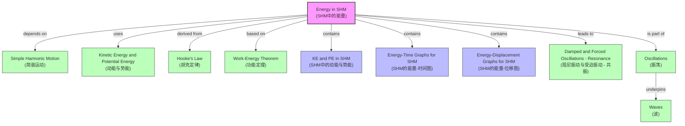

# 1. Overview / 概述

**English:**
This topic explores the energy transformations that occur within a system undergoing Simple Harmonic Motion (SHM). In SHM, the total mechanical energy of the oscillating system remains constant (in the absence of damping), continuously interchanging between Kinetic Energy (KE) and Potential Energy (PE). This topic is fundamental to understanding why oscillations persist and how energy is stored and transferred in systems like springs, pendulums, and molecular vibrations. It bridges the concepts of [[Kinetic Energy and Potential Energy]] with the periodic motion described in [[Simple Harmonic Motion]].

In both Cambridge 9702 and Edexcel IAL A-Level Physics, this is a core A2 topic. Students must be able to derive and apply the equations for KE and PE in SHM, interpret energy-time and energy-displacement graphs, and understand the implications for real-world oscillators. This knowledge is essential for later topics like [[Damped and Forced Oscillations - Resonance]], where energy dissipation is introduced. Real-world applications include understanding the operation of pendulum clocks, seismic dampers in buildings, and the tuning of electrical circuits.

**中文：**
本主题探讨在简谐运动（SHM）系统中发生的能量转换。在无阻尼的SHM中，系统的总机械能保持恒定，在动能（KE）和势能（PE）之间持续转换。这个主题对于理解为什么振荡会持续，以及能量如何在弹簧、摆锤和分子振动等系统中储存和传递至关重要。它连接了[[动能与势能]]的概念与[[简谐运动]]中描述的周期性运动。

在剑桥9702和爱德思IAL A-Level物理中，这是一个核心的A2主题。学生必须能够推导并应用SHM中动能和势能的方程，解释能量-时间和能量-位移图，并理解对现实世界振荡器的影响。这些知识对于后续主题如[[阻尼振动与受迫振动 - 共振]]（其中引入能量耗散）至关重要。实际应用包括理解摆钟、建筑物中的抗震阻尼器以及电路调谐的工作原理。

---

# 2. Syllabus Learning Objectives / 考纲学习目标

**English:**
The following table maps the specific learning objectives from the Cambridge 9702 and Edexcel IAL syllabuses for this topic.

**中文：**
下表列出了剑桥9702和爱德思IAL考纲中与本主题相关的具体学习目标。

| CAIE 9702 (17.2) | Edexcel IAL (WPH14 U4: 7.6-7.8) |
|-----------|-------------|
| (a) Describe the interchange between kinetic energy and potential energy during SHM. | 7.6 Understand the interchange between kinetic and potential energy for a simple harmonic oscillator. |
| (b) Recall and use the expressions for kinetic energy and potential energy in SHM: $E_K = \frac{1}{2} m \omega^2 (x_0^2 - x^2)$ and $E_P = \frac{1}{2} m \omega^2 x^2$. | 7.7 Derive and use the expressions for kinetic energy ($E_K = \frac{1}{2} m \omega^2 (A^2 - x^2)$) and potential energy ($E_P = \frac{1}{2} m \omega^2 x^2$) in SHM. |
| (c) Sketch and interpret graphs of energy against time and energy against displacement for SHM. | 7.8 Sketch and interpret graphs of energy against time and energy against displacement for a simple harmonic oscillator. |

> 📋 **CIE Only:** The syllabus explicitly uses $x_0$ for amplitude, whereas Edexcel uses $A$. Both are acceptable, but students should be consistent with their exam board's notation. CIE also focuses on "describing" the interchange, which requires qualitative explanation.

> 📋 **Edexcel Only:** The syllabus explicitly requires "deriving" the energy expressions, meaning students must be able to show the derivation from the equations of SHM. This is a common exam question.

**Examiner Expectations / 考官期望:**
**English:** Examiners expect students to:
1.  Know the standard equations for KE and PE in SHM.
2.  Understand that total energy $E_{total} = \frac{1}{2} m \omega^2 A^2$ is constant.
3.  Be able to sketch and label energy-time and energy-displacement graphs accurately.
4.  Relate the shape of the graphs to the motion of the oscillator (e.g., KE max at equilibrium, PE max at amplitude).
5.  Use the principle of conservation of energy to solve problems.

**中文：** 考官期望学生能够：
1.  掌握SHM中动能和势能的标准方程。
2.  理解总能量 $E_{total} = \frac{1}{2} m \omega^2 A^2$ 是恒定的。
3.  能够准确绘制并标注能量-时间和能量-位移图。
4.  将图形形状与振荡器的运动联系起来（例如，在平衡位置动能最大，在振幅处势能最大）。
5.  运用能量守恒原理解决问题。

---

# 3. Core Definitions / 核心定义

**English:**
The following table provides the key definitions for this topic.

**中文：**
下表提供了本主题的关键定义。

| Term (EN/CN) | Definition (EN) | Definition (CN) | Common Mistakes / 常见错误 |
|--------------|-----------------|-----------------|---------------------------|
| **Total Mechanical Energy / 总机械能** | The sum of the kinetic energy and potential energy of the oscillating system. In undamped SHM, it remains constant. | 振荡系统动能与势能之和。在无阻尼简谐运动中，它保持不变。 | Confusing total energy with amplitude. Total energy is proportional to $A^2$, not $A$. |
| **Kinetic Energy (KE) in SHM / 简谐运动中的动能** | The energy of the oscillating mass due to its motion. It is maximum at the equilibrium position and zero at the amplitude extremes. | 振荡质量因其运动而具有的能量。在平衡位置最大，在振幅极端处为零。 | Forgetting that KE depends on $x^2$, so it is symmetric about equilibrium. |
| **Potential Energy (PE) in SHM / 简谐运动中的势能** | The energy stored in the system due to its displacement from equilibrium. For a spring, it is elastic potential energy; for a pendulum, it is gravitational potential energy. | 系统因偏离平衡位置而储存的能量。对于弹簧，是弹性势能；对于摆锤，是重力势能。 | Assuming PE is always gravitational. In SHM, the form of PE depends on the system (e.g., elastic for springs). |
| **Amplitude ($A$ or $x_0$) / 振幅** | The maximum displacement of the oscillator from its equilibrium position. | 振荡器偏离其平衡位置的最大位移。 | Confusing amplitude with displacement. Amplitude is a constant for a given oscillation. |
| **Angular Frequency ($\omega$) / 角频率** | A measure of how quickly the oscillation occurs, related to the period by $\omega = 2\pi f = \frac{2\pi}{T}$. | 衡量振荡发生快慢的物理量，与周期的关系为 $\omega = 2\pi f = \frac{2\pi}{T}$。 | Forgetting that $\omega$ is a constant for a given system (e.g., $\omega = \sqrt{k/m}$ for a mass-spring system). |

---

# 4. Key Concepts Explained / 关键概念详解

## 4.1 Energy Interchange in SHM / 简谐运动中的能量转换

### Explanation / 解释
**English:**
In an ideal, undamped SHM system, the total mechanical energy ($E_{total}$) is conserved. This energy continuously oscillates between two forms: [[Kinetic Energy and Potential Energy]].

*   **At the equilibrium position ($x=0$):** The oscillator has maximum velocity. Therefore, its **kinetic energy is maximum** ($KE_{max}$). The displacement is zero, so the **potential energy is zero** ($PE=0$). All energy is kinetic.
*   **At the amplitude extremes ($x = \pm A$):** The oscillator is momentarily at rest. Therefore, its **kinetic energy is zero** ($KE=0$). The displacement is maximum, so the **potential energy is maximum** ($PE_{max}$). All energy is potential.
*   **At any other point ($0 < |x| < A$):** The energy is shared between KE and PE. As the oscillator moves from equilibrium towards an amplitude, KE decreases while PE increases, and vice-versa.

This interchange is analogous to a swinging pendulum: at the bottom of its swing, it moves fastest (max KE, min PE); at the top of its swing, it is momentarily stationary (min KE, max PE).

**中文：**
在一个理想的、无阻尼的简谐运动系统中，总机械能（$E_{total}$）是守恒的。这种能量在两种形式之间连续振荡：[[动能与势能]]。

*   **在平衡位置（$x=0$）：** 振荡器具有最大速度。因此，其**动能最大**（$KE_{max}$）。位移为零，所以**势能为零**（$PE=0$）。所有能量都是动能。
*   **在振幅极端处（$x = \pm A$）：** 振荡器瞬间静止。因此，其**动能为零**（$KE=0$）。位移最大，所以**势能最大**（$PE_{max}$）。所有能量都是势能。
*   **在任何其他点（$0 < |x| < A$）：** 能量在动能和势能之间分配。当振荡器从平衡位置向振幅移动时，动能减少而势能增加，反之亦然。

这种转换类似于摆动的钟摆：在摆动的最低点，它移动得最快（动能最大，势能最小）；在摆动的最高点，它瞬间静止（动能最小，势能最大）。

### Physical Meaning / 物理意义
**English:**
This concept explains why oscillations continue. Energy is not lost but merely changes form. The system acts as an energy converter, storing energy as potential when displaced and releasing it as kinetic when moving back through equilibrium. This is the principle behind all mechanical clocks and watches.

**中文：**
这个概念解释了为什么振荡会持续。能量并没有损失，只是改变了形式。该系统就像一个能量转换器，在偏离时以势能形式储存能量，在通过平衡位置返回时以动能形式释放能量。这是所有机械钟表背后的原理。

### Common Misconceptions / 常见误区
1.  **Misconception:** Energy is lost during SHM.
    *   **Correction:** In *undamped* SHM, total energy is conserved. Energy is only lost if damping is present.
2.  **Misconception:** KE and PE are maximum at the same time.
    *   **Correction:** They are in anti-phase. When KE is max, PE is min, and vice-versa.
3.  **Misconception:** The total energy depends on the position of the oscillator.
    *   **Correction:** The total energy is constant and independent of position. It is the sum of KE and PE at any point.

### Exam Tips / 考试提示
**English:**
*   When asked to "describe the interchange," use the specific points (equilibrium and amplitude) as anchors for your explanation.
*   Use the correct terminology: "kinetic energy is converted to potential energy" or "transferred."
*   For calculation questions, always start by identifying the total energy $E_{total} = \frac{1}{2} m \omega^2 A^2$.

**中文：**
*   当被要求“描述能量转换”时，使用特定点（平衡位置和振幅）作为你解释的锚点。
*   使用正确的术语：“动能转化为势能”或“转移”。
*   对于计算题，始终从确定总能量 $E_{total} = \frac{1}{2} m \omega^2 A^2$ 开始。

---

## 4.2 Derivation of Energy Equations / 能量方程的推导

### Explanation / 解释
**English:**
The equations for KE and PE in SHM are derived from the fundamental definitions of kinetic energy and the restoring force.

1.  **Kinetic Energy ($E_K$):**
    *   The velocity of an object in SHM is given by $v = \pm \omega \sqrt{A^2 - x^2}$.
    *   Kinetic energy is $E_K = \frac{1}{2} m v^2$.
    *   Substituting the expression for $v$:
        $$E_K = \frac{1}{2} m (\omega \sqrt{A^2 - x^2})^2 = \frac{1}{2} m \omega^2 (A^2 - x^2)$$

2.  **Potential Energy ($E_P$):**
    *   For a spring, the restoring force is $F = -kx$, where $k = m\omega^2$.
    *   The work done to stretch the spring from 0 to $x$ is stored as potential energy: $E_P = \int_0^x F \, dx = \int_0^x kx \, dx = \frac{1}{2} k x^2$.
    *   Substituting $k = m\omega^2$:
        $$E_P = \frac{1}{2} m \omega^2 x^2$$

3.  **Total Energy ($E_{total}$):**
    *   The total energy is the sum of KE and PE:
        $$E_{total} = E_K + E_P = \frac{1}{2} m \omega^2 (A^2 - x^2) + \frac{1}{2} m \omega^2 x^2 = \frac{1}{2} m \omega^2 A^2$$
    *   This is constant, as expected.

**中文：**
SHM中动能和势能的方程是从动能的基本定义和恢复力推导出来的。

1.  **动能（$E_K$）：**
    *   SHM中物体的速度由 $v = \pm \omega \sqrt{A^2 - x^2}$ 给出。
    *   动能为 $E_K = \frac{1}{2} m v^2$。
    *   代入 $v$ 的表达式：
        $$E_K = \frac{1}{2} m (\omega \sqrt{A^2 - x^2})^2 = \frac{1}{2} m \omega^2 (A^2 - x^2)$$

2.  **势能（$E_P$）：**
    *   对于弹簧，恢复力为 $F = -kx$，其中 $k = m\omega^2$。
    *   将弹簧从0拉伸到 $x$ 所做的功以势能形式储存：$E_P = \int_0^x F \, dx = \int_0^x kx \, dx = \frac{1}{2} k x^2$。
    *   代入 $k = m\omega^2$：
        $$E_P = \frac{1}{2} m \omega^2 x^2$$

3.  **总能量（$E_{total}$）：**
    *   总能量是动能和势能之和：
        $$E_{total} = E_K + E_P = \frac{1}{2} m \omega^2 (A^2 - x^2) + \frac{1}{2} m \omega^2 x^2 = \frac{1}{2} m \omega^2 A^2$$
    *   这是恒定的，符合预期。

### Physical Meaning / 物理意义
**English:**
The derivation shows that the total energy is proportional to the square of the amplitude ($A^2$) and the square of the angular frequency ($\omega^2$). This means a larger amplitude or a stiffer spring (higher $\omega$) stores more energy. The potential energy is proportional to $x^2$, giving the characteristic parabolic shape of the energy-displacement graph.

**中文：**
推导表明，总能量与振幅的平方（$A^2$）和角频率的平方（$\omega^2$）成正比。这意味着更大的振幅或更硬的弹簧（更高的$\omega$）储存更多的能量。势能与 $x^2$ 成正比，这给出了能量-位移图的特征抛物线形状。

### Common Misconceptions / 常见误区
1.  **Misconception:** The formula $E_P = \frac{1}{2} m \omega^2 x^2$ is only for springs.
    *   **Correction:** It applies to *any* system undergoing SHM, provided the restoring force is proportional to displacement. The form of PE (elastic, gravitational) is implicit in the derivation.
2.  **Misconception:** $E_K$ and $E_P$ are independent.
    *   **Correction:** They are linked by the conservation of energy. If one increases, the other must decrease.

### Exam Tips / 考试提示
**English:**
*   **Edexcel students:** Be prepared to derive the energy equations from first principles in an exam.
*   **CIE students:** You need to "recall and use" the equations, but understanding the derivation helps with problem-solving.
*   A common question is to find the displacement at which KE = PE. Set $\frac{1}{2} m \omega^2 (A^2 - x^2) = \frac{1}{2} m \omega^2 x^2$ and solve for $x$: $x = \pm \frac{A}{\sqrt{2}}$.

**中文：**
*   **爱德思学生：** 准备好从基本原理推导能量方程。
*   **剑桥学生：** 你需要“回忆并使用”这些方程，但理解推导有助于解决问题。
*   一个常见问题是找到动能等于势能时的位移。设 $\frac{1}{2} m \omega^2 (A^2 - x^2) = \frac{1}{2} m \omega^2 x^2$ 并解出 $x$：$x = \pm \frac{A}{\sqrt{2}}$。

---

# 5. Essential Equations / 核心公式

## 5.1 Kinetic Energy in SHM / 简谐运动中的动能

**Equation / 公式:**
$$E_K = \frac{1}{2} m \omega^2 (A^2 - x^2)$$

**Variables / 变量:**
| Symbol (符号) | Meaning (EN) | Meaning (CN) | Unit (单位) |
|--------------|-------------|-------------|------------|
| $E_K$ | Kinetic Energy | 动能 | J (Joules) |
| $m$ | Mass of oscillator | 振荡器质量 | kg |
| $\omega$ | Angular frequency | 角频率 | rad s$^{-1}$ |
| $A$ | Amplitude | 振幅 | m |
| $x$ | Displacement from equilibrium | 偏离平衡位置的位移 | m |

**Derivation / 推导:**
**English:** As shown in Section 4.2, from $v = \omega \sqrt{A^2 - x^2}$ and $E_K = \frac{1}{2} m v^2$.
**中文：** 如第4.2节所示，由 $v = \omega \sqrt{A^2 - x^2}$ 和 $E_K = \frac{1}{2} m v^2$ 推导得出。

**Conditions / 适用条件:**
**English:** Applies to any system undergoing undamped SHM.
**中文：** 适用于任何进行无阻尼简谐运动的系统。

**Limitations / 局限性:**
**English:** Does not account for energy losses due to damping.
**中文：** 不考虑阻尼造成的能量损失。

**Rearrangements / 变形:**
1.  $E_K = \frac{1}{2} m \omega^2 A^2 - \frac{1}{2} m \omega^2 x^2$ (Shows KE = Total Energy - PE)
2.  $E_{K,max} = \frac{1}{2} m \omega^2 A^2$ (At $x=0$)

---

## 5.2 Potential Energy in SHM / 简谐运动中的势能

**Equation / 公式:**
$$E_P = \frac{1}{2} m \omega^2 x^2$$

**Variables / 变量:**
| Symbol (符号) | Meaning (EN) | Meaning (CN) | Unit (单位) |
|--------------|-------------|-------------|------------|
| $E_P$ | Potential Energy | 势能 | J (Joules) |
| $m$ | Mass of oscillator | 振荡器质量 | kg |
| $\omega$ | Angular frequency | 角频率 | rad s$^{-1}$ |
| $x$ | Displacement from equilibrium | 偏离平衡位置的位移 | m |

**Derivation / 推导:**
**English:** As shown in Section 4.2, from $F = -kx$ and $E_P = \frac{1}{2} k x^2$, with $k = m\omega^2$.
**中文：** 如第4.2节所示，由 $F = -kx$ 和 $E_P = \frac{1}{2} k x^2$ 推导得出，其中 $k = m\omega^2$。

**Conditions / 适用条件:**
**English:** Applies to any system undergoing undamped SHM.
**中文：** 适用于任何进行无阻尼简谐运动的系统。

**Limitations / 局限性:**
**English:** Does not account for energy losses due to damping.
**中文：** 不考虑阻尼造成的能量损失。

**Rearrangements / 变形:**
1.  $E_{P,max} = \frac{1}{2} m \omega^2 A^2$ (At $x = \pm A$)

---

## 5.3 Total Energy in SHM / 简谐运动中的总能量

**Equation / 公式:**
$$E_{total} = \frac{1}{2} m \omega^2 A^2$$

**Variables / 变量:**
| Symbol (符号) | Meaning (EN) | Meaning (CN) | Unit (单位) |
|--------------|-------------|-------------|------------|
| $E_{total}$ | Total Mechanical Energy | 总机械能 | J (Joules) |
| $m$ | Mass of oscillator | 振荡器质量 | kg |
| $\omega$ | Angular frequency | 角频率 | rad s$^{-1}$ |
| $A$ | Amplitude | 振幅 | m |

**Derivation / 推导:**
**English:** $E_{total} = E_K + E_P = \frac{1}{2} m \omega^2 (A^2 - x^2) + \frac{1}{2} m \omega^2 x^2 = \frac{1}{2} m \omega^2 A^2$.
**中文：** $E_{total} = E_K + E_P = \frac{1}{2} m \omega^2 (A^2 - x^2) + \frac{1}{2} m \omega^2 x^2 = \frac{1}{2} m \omega^2 A^2$。

**Conditions / 适用条件:**
**English:** Only valid for undamped SHM.
**中文：** 仅对无阻尼简谐运动有效。

**Limitations / 局限性:**
**English:** Does not account for energy losses due to damping.
**中文：** 不考虑阻尼造成的能量损失。

**Rearrangements / 变形:**
1.  $A = \sqrt{\frac{2E_{total}}{m\omega^2}}$
2.  $\omega = \sqrt{\frac{2E_{total}}{mA^2}}$

---

# 6. Graphs and Relationships / 图表与关系

## 6.1 Energy-Time Graph / 能量-时间图

### Axes / 坐标轴
**English:** Y-axis: Energy (J); X-axis: Time (s)
**中文：** Y轴：能量（J）；X轴：时间（s）

### Shape / 形状
**English:**
*   $E_{total}$: A horizontal straight line (constant).
*   $E_K$ and $E_P$: Sinusoidal curves, oscillating between 0 and $E_{total}$.
*   $E_K$ and $E_P$ are in anti-phase. When one is at a maximum, the other is at a minimum.
*   The frequency of the energy oscillation is twice the frequency of the displacement oscillation ($2f$).

**中文：**
*   $E_{total}$：一条水平直线（恒定）。
*   $E_K$ 和 $E_P$：正弦曲线，在0和 $E_{total}$ 之间振荡。
*   $E_K$ 和 $E_P$ 反相。当一个达到最大值时，另一个达到最小值。
*   能量振荡的频率是位移振荡频率的两倍（$2f$）。

### Gradient Meaning / 斜率含义
**English:** The gradient of the $E_K$ or $E_P$ graph represents the rate of change of energy, which is related to power. The gradient is zero at the maxima and minima of the curves.
**中文：** $E_K$ 或 $E_P$ 图的斜率代表能量变化率，与功率有关。在曲线的最大值和最小值处，斜率为零。

### Area Meaning / 面积含义
**English:** The area under the $E_K$ or $E_P$ curve over a specific time interval is not directly meaningful in standard A-Level analysis. The key is the constant total energy line.
**中文：** 在标准A-Level分析中，$E_K$ 或 $E_P$ 曲线下特定时间间隔的面积没有直接意义。关键是恒定的总能量线。

### Exam Interpretation / 考试解读
**English:**
*   You will be asked to sketch this graph. Ensure the $E_K$ and $E_P$ curves are mirror images of each other about the $E_{total}/2$ line.
*   Label the maximum values clearly as $E_{total}$.
*   The period of the energy graph is half the period of the SHM ($T_{energy} = T_{SHM}/2$).

**中文：**
*   你将被要求绘制此图。确保 $E_K$ 和 $E_P$ 曲线关于 $E_{total}/2$ 线互为镜像。
*   将最大值清晰地标注为 $E_{total}$。
*   能量图的周期是SHM周期的一半（$T_{能量} = T_{SHM}/2$）。

### Common Questions / 常见问题
**English:**
*   "Sketch the variation of kinetic energy and potential energy with time for one complete oscillation."
*   "Explain why the kinetic energy and potential energy are in anti-phase."

**中文：**
*   “绘制一个完整振荡周期内动能和势能随时间变化的草图。”
*   “解释为什么动能和势能是反相的。”

---

## 6.2 Energy-Displacement Graph / 能量-位移图

### Axes / 坐标轴
**English:** Y-axis: Energy (J); X-axis: Displacement (m)
**中文：** Y轴：能量（J）；X轴：位移（m）

### Shape / 形状
**English:**
*   $E_{total}$: A horizontal straight line (constant).
*   $E_P$: A parabola, $E_P = \frac{1}{2} m \omega^2 x^2$. It is zero at $x=0$ and maximum at $x = \pm A$.
*   $E_K$: An inverted parabola, $E_K = \frac{1}{2} m \omega^2 (A^2 - x^2)$. It is maximum at $x=0$ and zero at $x = \pm A$.
*   The curves are symmetric about the y-axis.

**中文：**
*   $E_{total}$：一条水平直线（恒定）。
*   $E_P$：一条抛物线，$E_P = \frac{1}{2} m \omega^2 x^2$。在 $x=0$ 处为零，在 $x = \pm A$ 处最大。
*   $E_K$：一条倒置的抛物线，$E_K = \frac{1}{2} m \omega^2 (A^2 - x^2)$。在 $x=0$ 处最大，在 $x = \pm A$ 处为零。
*   曲线关于y轴对称。

### Gradient Meaning / 斜率含义
**English:** The gradient of the $E_P$ graph is the restoring force ($F = -\frac{dE_P}{dx} = -m\omega^2 x = -kx$). The gradient of the $E_K$ graph is the negative of the restoring force.
**中文：** $E_P$ 图的斜率是恢复力（$F = -\frac{dE_P}{dx} = -m\omega^2 x = -kx$）。$E_K$ 图的斜率是恢复力的负值。

### Area Meaning / 面积含义
**English:** The area under the $E_P$ curve between two displacement values is not directly examined. The key is the vertical separation between the $E_K$ and $E_P$ curves, which is constant and equal to $E_{total}$.
**中文：** 两个位移值之间 $E_P$ 曲线下的面积不直接考查。关键是 $E_K$ 和 $E_P$ 曲线之间的垂直间距，该间距是恒定的，等于 $E_{total}$。

### Exam Interpretation / 考试解读
**English:**
*   This graph is very common in exams. You must be able to sketch it and label the axes.
*   The point where $E_K = E_P$ occurs at $x = \pm A/\sqrt{2}$. This is a frequently tested value.
*   The graph shows that the total energy is independent of displacement.

**中文：**
*   这个图在考试中非常常见。你必须能够绘制它并标注坐标轴。
*   $E_K = E_P$ 的点出现在 $x = \pm A/\sqrt{2}$ 处。这是一个经常被考查的值。
*   该图表明总能量与位移无关。

### Common Questions / 常见问题
**English:**
*   "Sketch the variation of kinetic energy and potential energy with displacement for an object in SHM."
*   "Use the graph to determine the displacement at which the kinetic energy equals the potential energy."

**中文：**
*   “绘制一个做简谐运动的物体的动能和势能随位移变化的草图。”
*   “使用该图确定动能等于势能时的位移。”

---

# 7. Required Diagrams / 必备图表

## 7.1 Energy-Time Graph for SHM / 简谐运动的能量-时间图

### Description / 描述
**English:** A graph with time on the x-axis and energy on the y-axis. It shows three curves: a horizontal line for total energy ($E_{total}$), a sinusoidal curve for kinetic energy ($E_K$) that peaks at $E_{total}$ and troughs at 0, and a sinusoidal curve for potential energy ($E_P$) that is in anti-phase with $E_K$. The period of the energy curves is half the period of the displacement.

**中文：** 一个以时间为x轴、能量为y轴的图。它显示三条曲线：一条代表总能量（$E_{total}$）的水平线，一条代表动能（$E_K$）的正弦曲线（在 $E_{total}$ 处达到峰值，在0处达到谷值），以及一条代表势能（$E_P$）的正弦曲线（与 $E_K$ 反相）。能量曲线的周期是位移周期的一半。

### Image Prompt / 图片生成提示
> 📷 **IMAGE PROMPT — EG01: Energy-Time Graph for Undamped SHM**
>
> A clean, textbook-style graph on a white background. X-axis labeled "Time / s", Y-axis labeled "Energy / J". Three distinct lines: a solid horizontal line at the top labeled "Total Energy ($E_{total}$)", a dashed sinusoidal curve oscillating between 0 and $E_{total}$ labeled "Kinetic Energy ($E_K$)", and a dotted sinusoidal curve in anti-phase with the dashed one, also oscillating between 0 and $E_{total}$, labeled "Potential Energy ($E_P$)". The curves should be mirror images about the $E_{total}/2$ line. The period of the energy curves should be clearly marked as $T/2$, where $T$ is the period of the SHM. Use a professional, vector-graphic style with clear, sans-serif fonts. No grid lines, just axes and curves.

### Labels Required / 需要标注
1.  X-axis: Time / s (时间 / 秒)
2.  Y-axis: Energy / J (能量 / 焦耳)
3.  Total Energy ($E_{total}$) / 总能量 ($E_{total}$)
4.  Kinetic Energy ($E_K$) / 动能 ($E_K$)
5.  Potential Energy ($E_P$) / 势能 ($E_P$)
6.  $T/2$ (Half the period of SHM / SHM周期的一半)

### Exam Importance / 考试重要性
**English:** This is a standard graph that students are expected to sketch and interpret. It tests understanding of energy conservation and the phase relationship between KE and PE.
**中文：** 这是一个标准图，学生应能绘制并解释。它考查对能量守恒以及动能和势能之间相位关系的理解。

---

## 7.2 Energy-Displacement Graph for SHM / 简谐运动的能量-位移图

### Description / 描述
**English:** A graph with displacement on the x-axis and energy on the y-axis. It shows three curves: a horizontal line for total energy ($E_{total}$), a parabola opening upwards for potential energy ($E_P = \frac{1}{2} m \omega^2 x^2$), and an inverted parabola for kinetic energy ($E_K = \frac{1}{2} m \omega^2 (A^2 - x^2)$). The curves are symmetric about the y-axis. The points where $E_K = E_P$ are at $x = \pm A/\sqrt{2}$.

**中文：** 一个以位移为x轴、能量为y轴的图。它显示三条曲线：一条代表总能量（$E_{total}$）的水平线，一条开口向上的抛物线代表势能（$E_P = \frac{1}{2} m \omega^2 x^2$），以及一条开口向下的抛物线代表动能（$E_K = \frac{1}{2} m \omega^2 (A^2 - x^2)$）。曲线关于y轴对称。$E_K = E_P$ 的点在 $x = \pm A/\sqrt{2}$ 处。

### Image Prompt / 图片生成提示
> 📷 **IMAGE PROMPT — EG02: Energy-Displacement Graph for Undamped SHM**
>
> A clean, textbook-style graph on a white background. X-axis labeled "Displacement / m", Y-axis labeled "Energy / J". Three distinct lines: a solid horizontal line at the top labeled "Total Energy ($E_{total}$)", a dashed upward-opening parabola with its vertex at (0,0) labeled "Potential Energy ($E_P$)", and a dotted downward-opening parabola with its vertex at (0, $E_{total}$) labeled "Kinetic Energy ($E_K$)". The parabolas should intersect the x-axis at $x = \pm A$ and $x = \pm A$ respectively. Mark the points on the x-axis as $-A$ and $+A$. Also, mark the points on the x-axis where the two parabolas intersect as $-A/\sqrt{2}$ and $+A/\sqrt{2}$. Use a professional, vector-graphic style with clear, sans-serif fonts. No grid lines, just axes and curves.

### Labels Required / 需要标注
1.  X-axis: Displacement / m (位移 / 米)
2.  Y-axis: Energy / J (能量 / 焦耳)
3.  Total Energy ($E_{total}$) / 总能量 ($E_{total}$)
4.  Kinetic Energy ($E_K$) / 动能 ($E_K$)
5.  Potential Energy ($E_P$) / 势能 ($E_P$)
6.  $-A$, $+A$ (Amplitude extremes / 振幅极端)
7.  $-A/\sqrt{2}$, $+A/\sqrt{2}$ (Points where KE = PE / 动能等于势能的点)

### Exam Importance / 考试重要性
**English:** This graph is crucial for understanding the relationship between energy and position. It is frequently used in exam questions to test the ability to read values and understand the parabolic relationship.
**中文：** 这个图对于理解能量与位置之间的关系至关重要。它经常在考试题中用于考查读取数值和理解抛物线关系的能力。

---

## 7.3 Block Diagram of a Mass-Spring System / 弹簧-质量系统框图

### Description / 描述
**English:** A diagram showing a mass attached to a spring on a frictionless surface. The mass is shown at three positions: at equilibrium ($x=0$), at maximum positive displacement ($x=+A$), and at maximum negative displacement ($x=-A$). Arrows indicate the direction of motion and the restoring force. Labels indicate the relative magnitudes of KE and PE at each position.

**中文：** 一个显示在无摩擦表面上连接弹簧的质量块的图。该质量块显示在三个位置：平衡位置（$x=0$）、最大正位移（$x=+A$）和最大负位移（$x=-A$）。箭头指示运动方向和恢复力方向。标签指示每个位置处动能和势能的相对大小。

### Image Prompt / 图片生成提示
> 📷 **IMAGE PROMPT — EG03: Mass-Spring System Showing Energy States**
>
> A top-down view of a horizontal mass-spring system on a frictionless surface. The spring is attached to a wall on the left. The mass is a rectangular block. Show three instances of the mass in a single diagram, arranged vertically or horizontally for comparison.
> *   **Top/Left:** Mass at equilibrium ($x=0$). Spring is relaxed. Label: "KE = Max, PE = 0".
> *   **Middle:** Mass at $x=+A$ (spring stretched). Label: "KE = 0, PE = Max".
> *   **Bottom/Right:** Mass at $x=-A$ (spring compressed). Label: "KE = 0, PE = Max".
> Use arrows to show the direction of the restoring force (towards equilibrium) at the amplitude positions. Use a clean, isometric or 2D vector style. Color-code the spring (e.g., green for relaxed, red for stretched/compressed). Labels should be in English.

### Labels Required / 需要标注
1.  Equilibrium Position / 平衡位置 ($x=0$)
2.  Amplitude / 振幅 ($x=+A$, $x=-A$)
3.  Mass / 质量 ($m$)
4.  Spring / 弹簧
5.  Restoring Force / 恢复力 ($F$)
6.  Kinetic Energy / 动能 ($E_K$)
7.  Potential Energy / 势能 ($E_P$)

### Exam Importance / 考试重要性
**English:** This diagram helps visualize the physical system and link the abstract energy graphs to a real-world scenario. It is often used as a reference in explanation questions.
**中文：** 这个图有助于将物理系统可视化，并将抽象的能量图与现实场景联系起来。它经常在解释题中用作参考。

---

# 8. Worked Examples / 典型例题

## Example 1: Finding Displacement when KE = PE / 例题1：求动能等于势能时的位移

### Question / 题目
**English:**
A 0.50 kg mass is attached to a spring and oscillates with SHM of amplitude 0.080 m and angular frequency 5.0 rad s$^{-1}$.
(a) Calculate the total energy of the system.
(b) Calculate the kinetic energy when the displacement is 0.040 m.
(c) Determine the displacement at which the kinetic energy equals the potential energy.

**中文：**
一个0.50 kg的质量块连接在弹簧上，以0.080 m的振幅和5.0 rad s$^{-1}$的角频率做简谐运动。
(a) 计算系统的总能量。
(b) 计算位移为0.040 m时的动能。
(c) 确定动能等于势能时的位移。

### Solution / 解答

**Part (a): Total Energy / 总能量**
**English:**
$$E_{total} = \frac{1}{2} m \omega^2 A^2$$
$$E_{total} = \frac{1}{2} \times 0.50 \times (5.0)^2 \times (0.080)^2$$
$$E_{total} = \frac{1}{2} \times 0.50 \times 25 \times 0.0064$$
$$E_{total} = 0.040 \text{ J}$$

**中文：**
$$E_{total} = \frac{1}{2} m \omega^2 A^2$$
$$E_{total} = \frac{1}{2} \times 0.50 \times (5.0)^2 \times (0.080)^2$$
$$E_{total} = \frac{1}{2} \times 0.50 \times 25 \times 0.0064$$
$$E_{total} = 0.040 \text{ J}$$

**Part (b): Kinetic Energy at $x = 0.040$ m / 位移为0.040 m时的动能**
**English:**
$$E_K = \frac{1}{2} m \omega^2 (A^2 - x^2)$$
$$E_K = \frac{1}{2} \times 0.50 \times (5.0)^2 \times ((0.080)^2 - (0.040)^2)$$
$$E_K = \frac{1}{2} \times 0.50 \times 25 \times (0.0064 - 0.0016)$$
$$E_K = \frac{1}{2} \times 0.50 \times 25 \times 0.0048$$
$$E_K = 0.030 \text{ J}$$

**中文：**
$$E_K = \frac{1}{2} m \omega^2 (A^2 - x^2)$$
$$E_K = \frac{1}{2} \times 0.50 \times (5.0)^2 \times ((0.080)^2 - (0.040)^2)$$
$$E_K = \frac{1}{2} \times 0.50 \times 25 \times (0.0064 - 0.0016)$$
$$E_K = \frac{1}{2} \times 0.50 \times 25 \times 0.0048$$
$$E_K = 0.030 \text{ J}$$

**Part (c): Displacement when KE = PE / 动能等于势能时的位移**
**English:**
Set $E_K = E_P$:
$$\frac{1}{2} m \omega^2 (A^2 - x^2) = \frac{1}{2} m \omega^2 x^2$$
Cancel $\frac{1}{2} m \omega^2$:
$$A^2 - x^2 = x^2$$
$$A^2 = 2x^2$$
$$x^2 = \frac{A^2}{2}$$
$$x = \pm \frac{A}{\sqrt{2}}$$
$$x = \pm \frac{0.080}{\sqrt{2}} = \pm 0.0566 \text{ m}$$

**中文：**
设 $E_K = E_P$：
$$\frac{1}{2} m \omega^2 (A^2 - x^2) = \frac{1}{2} m \omega^2 x^2$$
消去 $\frac{1}{2} m \omega^2$：
$$A^2 - x^2 = x^2$$
$$A^2 = 2x^2$$
$$x^2 = \frac{A^2}{2}$$
$$x = \pm \frac{A}{\sqrt{2}}$$
$$x = \pm \frac{0.080}{\sqrt{2}} = \pm 0.0566 \text{ m}$$

### Final Answer / 最终答案
**Answer:**
(a) $E_{total} = 0.040$ J
(b) $E_K = 0.030$ J
(c) $x = \pm 0.057$ m (to 2 significant figures)

**答案：**
(a) $E_{total} = 0.040$ J
(b) $E_K = 0.030$ J
(c) $x = \pm 0.057$ m（保留两位有效数字）

### Examiner Notes / 考官点评
**English:**
*   Part (c) is a classic result. Remember that KE = PE at $x = \pm A/\sqrt{2}$, regardless of the mass or angular frequency.
*   Always show your working clearly, especially the cancellation steps.
*   Pay attention to significant figures. The amplitude was given to 2 s.f., so the answer should be to 2 s.f.

**中文：**
*   第(c)部分是一个经典结果。记住，无论质量或角频率如何，KE = PE 都在 $x = \pm A/\sqrt{2}$ 处。
*   始终清晰地展示你的计算步骤，特别是消去步骤。
*   注意有效数字。振幅给出了2位有效数字，所以答案也应保留2位有效数字。

### Alternative Method / 替代方法
**English:**
For part (c), you could also use the energy-displacement graph. The intersection point of the $E_K$ and $E_P$ parabolas gives the displacement where they are equal.
**中文：**
对于第(c)部分，你也可以使用能量-位移图。$E_K$ 和 $E_P$ 抛物线的交点给出了它们相等时的位移。

---

## Example 2: Energy-Time Graph Interpretation / 例题2：能量-时间图解读

### Question / 题目
**English:**
The graph below shows the variation of kinetic energy with time for a mass oscillating with SHM.
(a) On the same axes, sketch the variation of potential energy with time.
(b) Determine the period of the SHM.
(c) If the mass is 0.20 kg and the amplitude is 0.050 m, calculate the angular frequency.

> 📷 **IMAGE PROMPT — EG04: Graph for Example 2**
>
> A graph showing a sinusoidal curve for kinetic energy ($E_K$) against time. The curve oscillates between 0 and 0.050 J. The time axis is marked from 0 to 1.0 s. The curve has peaks at $t = 0$ s, $t = 0.25$ s, and $t = 0.50$ s. The curve has troughs at $t = 0.125$ s and $t = 0.375$ s.

**中文：**
下图显示了一个做简谐运动的质量块的动能随时间的变化。
(a) 在同一坐标轴上，绘制势能随时间变化的草图。
(b) 确定简谐运动的周期。
(c) 如果质量为0.20 kg，振幅为0.050 m，计算角频率。

> 📷 **图片提示 — EG04：例题2的图**
>
> 一个显示动能（$E_K$）随时间变化的正弦曲线图。曲线在0和0.050 J之间振荡。时间轴标记为0到1.0秒。曲线在 $t = 0$ s、$t = 0.25$ s 和 $t = 0.50$ s 处有峰值。曲线在 $t = 0.125$ s 和 $t = 0.375$ s 处有谷值。

### Solution / 解答

**Part (a): Sketching $E_P$ / 绘制 $E_P$ 草图**
**English:**
The potential energy curve is in anti-phase with the kinetic energy curve. It will be a mirror image of the $E_K$ curve about the $E_{total}/2$ line. Since $E_{total} = 0.050$ J, the $E_P$ curve will peak at 0.050 J when $E_K$ is zero, and will be zero when $E_K$ is at its maximum.

**中文：**
势能曲线与动能曲线反相。它将是 $E_K$ 曲线关于 $E_{total}/2$ 线的镜像。由于 $E_{total} = 0.050$ J，当 $E_K$ 为零时，$E_P$ 曲线将在0.050 J处达到峰值；当 $E_K$ 达到最大值时，$E_P$ 为零。

**Part (b): Period of SHM / 简谐运动的周期**
**English:**
The period of the energy graph ($T_{energy}$) is the time between two consecutive peaks of the $E_K$ curve. From the graph, peaks occur at $t = 0$ s and $t = 0.25$ s.
$$T_{energy} = 0.25 \text{ s}$$
The period of the SHM is twice the period of the energy graph:
$$T_{SHM} = 2 \times T_{energy} = 2 \times 0.25 = 0.50 \text{ s}$$

**中文：**
能量图的周期（$T_{能量}$）是 $E_K$ 曲线两个连续峰值之间的时间。从图中可以看出，峰值出现在 $t = 0$ s 和 $t = 0.25$ s 处。
$$T_{能量} = 0.25 \text{ s}$$
简谐运动的周期是能量图周期的两倍：
$$T_{SHM} = 2 \times T_{能量} = 2 \times 0.25 = 0.50 \text{ s}$$

**Part (c): Angular Frequency / 角频率**
**English:**
$$\omega = \frac{2\pi}{T} = \frac{2\pi}{0.50} = 4\pi \approx 12.6 \text{ rad s}^{-1}$$

**中文：**
$$\omega = \frac{2\pi}{T} = \frac{2\pi}{0.50} = 4\pi \approx 12.6 \text{ rad s}^{-1}$$

### Final Answer / 最终答案
**Answer:**
(a) Sketch as described.
(b) $T_{SHM} = 0.50$ s
(c) $\omega = 12.6$ rad s$^{-1}$

**答案：**
(a) 按描述绘制草图。
(b) $T_{SHM} = 0.50$ s
(c) $\omega = 12.6$ rad s$^{-1}$

### Examiner Notes / 考官点评
**English:**
*   A common mistake is to think the period of the energy graph is the same as the period of the SHM. Remember, energy oscillates twice as fast.
*   When sketching, ensure the $E_P$ curve is a mirror image of the $E_K$ curve and that they intersect at $E_{total}/2$.

**中文：**
*   一个常见错误是认为能量图的周期与SHM的周期相同。记住，能量振荡的速度是两倍。
*   绘制草图时，确保 $E_P$ 曲线是 $E_K$ 曲线的镜像，并且它们在 $E_{total}/2$ 处相交。

---

# 9. Past Paper Question Types / 历年真题题型

**English:**
The following table summarizes the common question types for this topic in both Cambridge and Edexcel exams.

**中文：**
下表总结了剑桥和爱德思考试中本主题的常见题型。

| Question Type / 题型 | Frequency / 频率 | Difficulty / 难度 | Past Paper References / 真题索引 |
|----------------------|------------------|------------------|-------------------------------|
| Calculation of Energy / 能量计算 | High | Medium | 📝 *待填入* |
| Derivation of Energy Equations / 能量方程推导 | Medium (Edexcel) | High | 📝 *待填入* |
| Sketching Energy Graphs / 绘制能量图 | High | Medium | 📝 *待填入* |
| Interpreting Energy Graphs / 解读能量图 | High | Medium | 📝 *待填入* |
| Explaining Energy Interchange / 解释能量转换 | Medium | Low | 📝 *待填入* |
| Finding Displacement when KE = PE / 求动能等于势能时的位移 | Medium | Medium | 📝 *待填入* |

> 📝 **题库整理中 / Question Bank Under Construction:** 具体试卷编号（如 9702/23/M/J/24 Q3）将在后续整理真题后填入上表。

**Common Command Words / 常见指令词:**
*   **State / 陈述:** Give a brief answer without explanation. (e.g., "State the total energy of the system.")
*   **Define / 定义:** Give the precise meaning. (e.g., "Define the amplitude of an oscillation.")
*   **Explain / 解释:** Give reasons or causes. (e.g., "Explain why the kinetic energy is maximum at the equilibrium position.")
*   **Describe / 描述:** Give a detailed account. (e.g., "Describe the interchange between kinetic and potential energy during one complete oscillation.")
*   **Calculate / 计算:** Work out a numerical value. (e.g., "Calculate the total energy of the oscillator.")
*   **Determine / 确定:** Find a value, often by calculation or graph reading. (e.g., "Determine the displacement at which the kinetic energy equals the potential energy.")
*   **Suggest / 建议:** Offer a possible explanation or solution. (e.g., "Suggest how the graph would change if damping were introduced.")
*   **Sketch / 绘制:** Draw a graph or diagram, showing the main features. (e.g., "Sketch a graph showing how the kinetic energy varies with displacement.")

---

# 10. Practical Skills Connections / 实验技能链接

**English:**
This topic is closely linked to practical work in both CAIE and Edexcel specifications.

**CAIE 9702:**
*   **Paper 3 (AS) & Paper 5 (A2):** You may be asked to investigate the relationship between the period of oscillation and the mass or amplitude. While not directly measuring energy, the principles of energy conservation underpin the experiment.
*   **Practical Skill:** Measuring the period of oscillation using a stopwatch or light gate. Calculating $\omega$ from $T$. Using the equations to find unknown quantities like $k$ or $m$.
*   **Uncertainties:** Determining the uncertainty in the period and propagating it to find the uncertainty in energy calculations.

**Edexcel IAL:**
*   **Unit 3 (AS) & Unit 6 (A2):** Practicals involving mass-spring systems and simple pendulums.
*   **Practical Skill:** Investigating the relationship between the period and mass for a mass-spring system. Using data to plot graphs (e.g., $T^2$ vs $m$) and determining the spring constant $k$.
*   **Graph Plotting:** Plotting energy-displacement or energy-time graphs from experimental data. Analyzing the shape of the graph to confirm the parabolic relationship.

**General Practical Connections:**
*   **Measurements:** Measuring amplitude ($A$), mass ($m$), and period ($T$) to calculate energy.
*   **Experimental Design:** Designing an experiment to verify the conservation of energy in SHM. This could involve measuring the velocity at different points using a motion sensor or light gate and calculating KE, then comparing it to the calculated PE.
*   **Damping:** Introducing damping (e.g., by attaching a card to the mass and immersing it in a liquid) and observing how the amplitude and total energy decrease over time. This links to [[Damped and Forced Oscillations - Resonance]].

**中文：**
本主题与剑桥和爱德思考纲中的实验工作密切相关。

**剑桥9702：**
*   **Paper 3 (AS) & Paper 5 (A2)：** 你可能会被要求研究振荡周期与质量或振幅之间的关系。虽然不直接测量能量，但能量守恒原理是实验的基础。
*   **实验技能：** 使用秒表或光门测量振荡周期。从 $T$ 计算 $\omega$。使用方程求未知量，如 $k$ 或 $m$。
*   **不确定度：** 确定周期的不确定度，并将其传播以找到能量计算中的不确定度。

**爱德思IAL：**
*   **Unit 3 (AS) & Unit 6 (A2)：** 涉及弹簧-质量系统和单摆的实验。
*   **实验技能：** 研究弹簧-质量系统的周期与质量之间的关系。使用数据绘制图表（例如，$T^2$ 与 $m$ 的关系图）并确定弹簧常数 $k$。
*   **图表绘制：** 根据实验数据绘制能量-位移或能量-时间图。分析图形形状以确认抛物线关系。

**一般实验联系：**
*   **测量：** 测量振幅（$A$）、质量（$m$）和周期（$T$）以计算能量。
*   **实验设计：** 设计一个实验来验证SHM中的能量守恒。这可能涉及使用运动传感器或光门测量不同点的速度并计算动能，然后将其与计算出的势能进行比较。
*   **阻尼：** 引入阻尼（例如，通过在质量块上连接一个卡片并将其浸入液体中），并观察振幅和总能量如何随时间减小。这与[[阻尼振动与受迫振动 - 共振]]相关联。

> 📋 **CIE Only:** Paper 5 often includes questions on experimental design and analysis of results. Be prepared to suggest improvements to an experiment to reduce uncertainties.
> 📋 **Edexcel Only:** Unit 6 practicals often require you to process data and draw conclusions. You may be asked to evaluate the method and suggest modifications.

---

# 11. Concept Map / 概念图谱

**English:**
The following Mermaid diagram shows the connections between this topic and related concepts in the A-Level Physics knowledge graph.

**中文：**
以下Mermaid图显示了本主题与A-Level物理知识图谱中相关概念之间的联系。

---

# 12. Quick Revision Sheet / 速查表

**English:**
This one-page summary provides a quick overview of the key points for "Energy in SHM".

**中文：**
此一页摘要提供了“简谐运动中的能量”的要点快速概览。

| Category / 类别 | Key Points / 要点 |
|----------------|------------------|
| **Definitions / 定义** | **Total Energy ($E_{total}$):** Constant in undamped SHM.   **KE ($E_K$):** Energy of motion. Max at $x=0$, zero at $x=\pm A$.   **PE ($E_P$):** Stored energy. Zero at $x=0$, max at $x=\pm A$. |
| **Equations / 公式** | $E_K = \frac{1}{2} m \omega^2 (A^2 - x^2)$   $E_P = \frac{1}{2} m \omega^2 x^2$   $E_{total} = \frac{1}{2} m \omega^2 A^2$   $E_{K,max} = E_{P,max} = E_{total}$ |
| **Graphs / 图表** | **Energy-Time:** $E_{total}$ is a horizontal line. $E_K$ and $E_P$ are sinusoidal and in anti-phase. Period of energy graph = $T_{SHM}/2$.   **Energy-Displacement:** $E_{total}$ is a horizontal line. $E_P$ is a parabola ($\propto x^2$). $E_K$ is an inverted parabola. |
| **Key Facts / 关键事实** | 1. Energy is conserved in undamped SHM.   2. KE and PE are in anti-phase.   3. KE = PE at $x = \pm A/\sqrt{2}$.   4. $E_{total} \propto A^2$ and $E_{total} \propto \omega^2$. |
| **Exam Reminders / 考试提醒** | 1. Always state the condition "undamped" when using conservation of energy.   2. For Edexcel, be ready to derive the energy equations.   3. When sketching graphs, label axes and key values (e.g., $E_{total}$, $A$, $T/2$).   4. The displacement for KE = PE is independent of $m$ and $\omega$. |