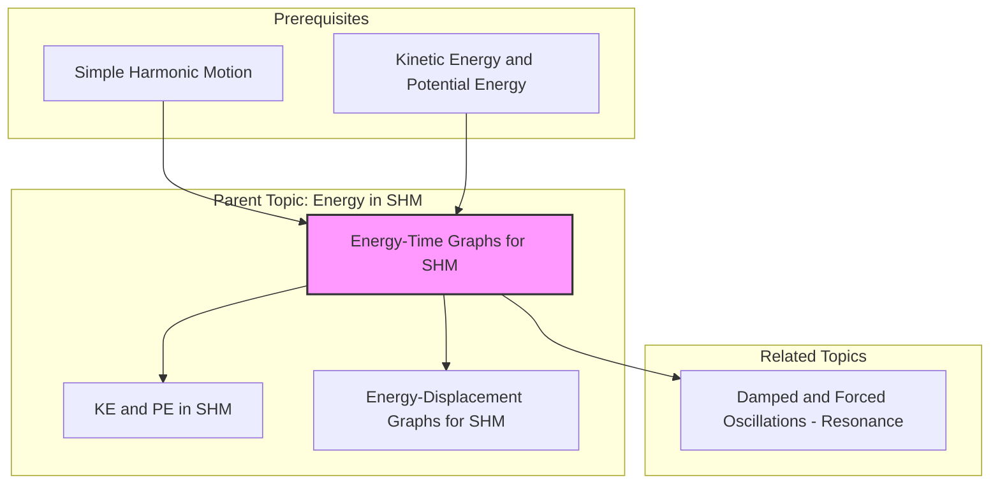

---
# 1. Overview / 概述

**English:**
This sub-topic focuses on how the kinetic energy (KE), potential energy (PE), and total mechanical energy of a system undergoing simple harmonic motion (SHM) vary with time. Understanding these [[Energy-Time Graphs for SHM]] is crucial for visualising the continuous interchange of energy within an oscillating system, such as a mass on a spring or a simple pendulum. These graphs are a direct application of the principles of [[Simple Harmonic Motion]] and [[Kinetic Energy and Potential Energy]], and they provide a powerful tool for analysing the phase relationships between displacement, velocity, and energy. This knowledge is fundamental for understanding more complex phenomena like [[Damped and Forced Oscillations - Resonance]].

**中文:**
本子知识点专注于研究在简谐运动（SHM）系统中，动能（KE）、势能（PE）和总机械能如何随时间变化。理解这些[[能量-时间图（SHM）]]对于可视化振荡系统（如弹簧上的质量块或单摆）内能量的连续转换至关重要。这些图是[[简谐运动]]以及[[动能与势能]]原理的直接应用，并为分析位移、速度和能量之间的相位关系提供了有力工具。该知识是理解[[阻尼振动与受迫振动 - 共振]]等更复杂现象的基础。

---

# 2. Syllabus Learning Objectives / 考纲学习目标

| CAIE 9702 | Edexcel IAL |
|-----------|-------------|
| 17.2(a) Describe the interchange between kinetic energy and potential energy during SHM. | 7.6 Understand the interchange between kinetic and potential energy for simple harmonic oscillators. |
| 17.2(b) Sketch and interpret graphs of energy against time for an ideal SHM system. | 7.7 Be able to draw and interpret graphs of energy against time for a simple harmonic oscillator. |
| 17.2(c) Recognise that the total energy of an undamped SHM system is constant. | 7.8 Understand that the total energy of an undamped simple harmonic oscillator is constant. |

**Examiner Expectations / 考官期望:**
- **EN:** You must be able to sketch the sinusoidal curves for KE and PE, showing that they are in anti-phase (one is maximum when the other is zero). The total energy line must be a straight horizontal line. You should be able to label the axes with appropriate energy values and time periods (or fractions of a period like T/4).
- **CN:** 你必须能够画出动能和势能的正弦曲线，并显示它们是反相的（一个最大时另一个为零）。总能量线必须是一条水平的直线。你应该能够用适当的能量值和周期（或周期的分数，如 T/4）来标记坐标轴。

---

# 3. Core Definitions / 核心定义

| Term (EN/CN) | Definition (EN) | Definition (CN) | Common Mistakes / 常见错误 |
|--------------|-----------------|-----------------|---------------------------|
| **Kinetic Energy (KE)** / 动能 (KE) | The energy an object possesses due to its motion. In SHM, it is maximum at the equilibrium position and zero at the amplitude. | 物体由于运动而具有的能量。在简谐运动中，它在平衡位置最大，在振幅处为零。 | Confusing KE with velocity. KE is proportional to $v^2$, so it is always positive. |
| **Potential Energy (PE)** / 势能 (PE) | The energy stored in the system due to its position or configuration. For a spring, it's elastic PE; for a pendulum, it's gravitational PE. It is maximum at the amplitude and zero at equilibrium. | 系统由于其位置或构型而储存的能量。对于弹簧，是弹性势能；对于单摆，是重力势能。它在振幅处最大，在平衡位置为零。 | Forgetting that PE is always positive in an ideal system. |
| **Total Mechanical Energy (E)** / 总机械能 (E) | The sum of the kinetic and potential energies of the system. For an undamped SHM system, this remains constant. | 系统动能和势能的总和。对于无阻尼的简谐运动系统，这是一个常数。 | Thinking total energy varies with time. It is constant for ideal SHM. |
| **Anti-phase** / 反相 | A phase difference of 180° ($\pi$ radians). In energy-time graphs, KE and PE are in anti-phase; when one is at a maximum, the other is at a minimum. | 相位差为180°（$\pi$ 弧度）。在能量-时间图中，动能和势能是反相的；当一个达到最大值时，另一个达到最小值。 | Thinking they are in phase. They are not. |
| **Period (T)** / 周期 (T) | The time taken for one complete oscillation. The energy curves repeat every half-period ($T/2$). | 完成一次全振动所需的时间。能量曲线每半个周期（$T/2$）重复一次。 | Forgetting that the energy cycle repeats twice as fast as the displacement cycle. |

---

# 4. Key Concepts Explained / 关键概念详解

## 4.1 Energy Interchange and Phase / 能量交换与相位

### Explanation / 解释
**English:** In an ideal (undamped) SHM system, energy continuously transforms between kinetic and potential forms. Consider a mass on a spring. As the mass passes through the [[Equilibrium Position]] (displacement $x=0$), its velocity is maximum, so its [[Kinetic Energy and Potential Energy|KE]] is maximum. At this point, the spring is unstretched, so its [[Elastic Potential Energy|PE]] is zero. As the mass moves towards the amplitude ($x = \pm x_0$), it slows down (KE decreases) while the spring stretches or compresses (PE increases). At the amplitude, the mass is momentarily at rest (KE = 0), and all the energy is stored as PE. This process then reverses. The graphs of KE and PE against time are therefore sinusoidal curves that are in anti-phase. The total energy ($E = KE + PE$) remains constant, represented by a horizontal line.

**中文:** 在一个理想（无阻尼）的简谐运动系统中，能量在动能和势能形式之间连续转换。以弹簧上的质量块为例。当质量块经过[[平衡位置]]（位移 $x=0$）时，其速度最大，因此其[[动能与势能|动能]]最大。此时，弹簧未被拉伸，所以其[[弹性势能|势能]]为零。当质量块向振幅处（$x = \pm x_0$）移动时，它减速（动能减少），同时弹簧被拉伸或压缩（势能增加）。在振幅处，质量块瞬间静止（动能为零），所有能量都储存为势能。然后这个过程逆转。因此，动能和势能随时间变化的图是正弦曲线，并且是反相的。总能量（$E = KE + PE$）保持不变，由一条水平线表示。

### Physical Meaning / 物理意义
**English:** The constant total energy line represents the conservation of mechanical energy in the system. The anti-phase relationship between KE and PE shows that the energy is not lost but merely changes form. The frequency of the energy oscillation is twice the frequency of the displacement oscillation because the energy is maximum twice per cycle (once for KE at equilibrium, once for PE at each amplitude).

**中文:** 恒定的总能量线代表了系统中机械能守恒。动能和势能之间的反相关系表明能量并未损失，只是改变了形式。能量振荡的频率是位移振荡频率的两倍，因为每个周期内能量达到最大值两次（一次是动能，在平衡位置；一次是势能，在每个振幅处）。

### Common Misconceptions / 常见误区
- **EN:** Thinking KE and PE are in phase. (They are in anti-phase).
- **CN:** 认为动能和势能是同相的。（它们是反相的）。
- **EN:** Thinking the total energy line is sinusoidal. (It is a straight horizontal line).
- **CN:** 认为总能量线是正弦曲线。（它是一条水平的直线）。
- **EN:** Confusing the period of the energy graph ($T/2$) with the period of the motion ($T$).
- **CN:** 混淆能量图的周期（$T/2$）与运动的周期（$T$）。

### Exam Tips / 考试提示
- **EN:** When sketching, always start by drawing the horizontal total energy line. Then draw the KE and PE curves as mirror images of each other about the $E/2$ line.
- **CN:** 画图时，总是先画水平的**总能量线**。然后，将动能和势能曲线画成关于 $E/2$ 线互为镜像的曲线。
- **EN:** Label the maximum values clearly (e.g., $KE_{max} = E$, $PE_{max} = E$).
- **CN:** 清晰地标出最大值（例如，$KE_{max} = E$, $PE_{max} = E$）。
- **EN:** Mark the time axis with fractions of the period ($T/4$, $T/2$, $3T/4$, $T$) to show the relationship to displacement.
- **CN:** 在时间轴上标出周期的分数（$T/4$, $T/2$, $3T/4$, $T$）以显示与位移的关系。

> 📷 **IMAGE PROMPT — DIAGRAM-01: Standard Energy-Time Graph for SHM**
> A clear, labelled graph with time on the x-axis and Energy on the y-axis. Show three curves: a horizontal dashed line labelled "Total Energy (E)", a cosine-squared curve labelled "Kinetic Energy (KE)" peaking at E, and a sine-squared curve labelled "Potential Energy (PE)" peaking at E. The KE and PE curves should cross at E/2. The x-axis should be marked with 0, T/4, T/2, 3T/4, and T. The graph should be clean, professional, and suitable for an A-Level physics textbook.

---

# 5. Essential Equations / 核心公式

For an object in SHM with angular frequency $\omega$, amplitude $x_0$, and total energy $E$:

$$ KE(t) = \frac{1}{2} m v^2 = \frac{1}{2} m \omega^2 x_0^2 \sin^2(\omega t + \phi) = E \sin^2(\omega t + \phi) $$

$$ PE(t) = \frac{1}{2} k x^2 = \frac{1}{2} m \omega^2 x_0^2 \cos^2(\omega t + \phi) = E \cos^2(\omega t + \phi) $$

$$ E = KE(t) + PE(t) = \frac{1}{2} m \omega^2 x_0^2 = \text{constant} $$

| Symbol (符号) | Meaning (EN) | Meaning (CN) | Unit (单位) |
|--------------|-------------|-------------|------------|
| $KE(t)$ | Kinetic energy at time $t$ | 时间 $t$ 时的动能 | J |
| $PE(t)$ | Potential energy at time $t$ | 时间 $t$ 时的势能 | J |
| $E$ | Total mechanical energy | 总机械能 | J |
| $m$ | Mass of the oscillating object | 振荡物体的质量 | kg |
| $\omega$ | Angular frequency ($2\pi f$) | 角频率 ($2\pi f$) | rad s$^{-1}$ |
| $x_0$ | Amplitude of oscillation | 振荡的振幅 | m |
| $v$ | Velocity at time $t$ | 时间 $t$ 时的速度 | m s$^{-1}$ |
| $k$ | Spring constant (for a spring system) | 弹簧常数（对于弹簧系统） | N m$^{-1}$ |
| $t$ | Time | 时间 | s |
| $\phi$ | Phase constant | 初相位 | rad |

**Derivation / 推导:**
- From [[Simple Harmonic Motion]], we know $x(t) = x_0 \cos(\omega t + \phi)$ and $v(t) = -x_0 \omega \sin(\omega t + \phi)$.
- Substituting $v(t)$ into $KE = \frac{1}{2}mv^2$ gives $KE(t) = \frac{1}{2}m x_0^2 \omega^2 \sin^2(\omega t + \phi)$.
- Substituting $x(t)$ into $PE = \frac{1}{2}kx^2$ and using $k = m\omega^2$ gives $PE(t) = \frac{1}{2}m \omega^2 x_0^2 \cos^2(\omega t + \phi)$.
- The total energy $E = KE + PE = \frac{1}{2}m \omega^2 x_0^2 (\sin^2(\theta) + \cos^2(\theta)) = \frac{1}{2}m \omega^2 x_0^2$.

**Conditions / 适用条件:**
- **EN:** This applies to ideal, undamped SHM where no energy is lost to the surroundings (e.g., no friction or air resistance).
- **CN:** 这适用于理想、无阻尼的简谐运动，即没有能量损失到周围环境（例如，没有摩擦或空气阻力）。

**Limitations / 局限性:**
- **EN:** In real-world systems, energy is dissipated, so the total energy decreases over time (damped oscillations). The curves would no longer have constant amplitude.
- **CN:** 在现实世界的系统中，能量会耗散，因此总能量随时间减少（阻尼振荡）。曲线将不再具有恒定的振幅。

---

# 6. Graphs and Relationships / 图表与关系

## 6.1 Energy-Time Graph for SHM / 简谐运动的能量-时间图

### Axes / 坐标轴
- **X-axis:** Time (t) / 时间 (t)
- **Y-axis:** Energy (E) / 能量 (E)

### Shape / 形状
- **Total Energy (E):** A straight horizontal line.
- **Kinetic Energy (KE):** A $\sin^2$ (or $\cos^2$) curve. It starts at a maximum (if starting from equilibrium) or zero (if starting from amplitude).
- **Potential Energy (PE):** A $\cos^2$ (or $\sin^2$) curve. It is the mirror image of the KE curve about the $E/2$ line.

### Gradient Meaning / 斜率含义
- **EN:** The gradient of the KE or PE curve represents the rate of change of that form of energy. The gradient of the KE curve is equal to the negative of the gradient of the PE curve ($d(KE)/dt = -d(PE)/dt$), representing the power transfer between the two forms.
- **CN:** 动能或势能曲线的斜率代表该形式能量的变化率。动能曲线的斜率等于势能曲线斜率的负值（$d(KE)/dt = -d(PE)/dt$），代表两种形式之间的功率传递。

### Area Meaning / 面积含义
- **EN:** The area under the KE or PE curve between two times is not a standard quantity asked about in A-Level. The key concept is the constant total energy.
- **CN:** 在A-Level考试中，通常不要求计算两个时间点之间动能或势能曲线下的面积。关键概念是恒定的总能量。

### Exam Interpretation / 考试解读
- **EN:** You must be able to read from the graph the maximum KE/PE ($=E$), the period of the energy oscillation ($T/2$), and the time when KE = PE (when the curves cross at $E/2$).
- **CN:** 你必须能够从图中读出最大动能/势能（$=E$）、能量振荡的周期（$T/2$）以及动能等于势能的时间（曲线在 $E/2$ 处相交时）。

> 📷 **IMAGE PROMPT — DIAGRAM-02: Energy-Time Graph with Displacement Reference**
> A two-part graph. The top part shows a standard displacement-time graph for SHM (a cosine wave). The bottom part shows the corresponding energy-time graph (KE, PE, and Total E). Vertical dashed lines should connect key points (e.g., when displacement is zero, KE is max; when displacement is max, PE is max). This helps students see the phase relationship between displacement and energy.

---

# 7. Required Diagrams / 必备图表

## 7.1 Standard Energy-Time Graph for an Undamped SHM System / 无阻尼简谐运动系统的标准能量-时间图

### Description / 描述
**English:** A graph with time on the x-axis and energy on the y-axis. It shows three curves: a horizontal line for total energy (E), a sinusoidal curve for kinetic energy (KE), and a sinusoidal curve for potential energy (PE). The KE and PE curves are mirror images of each other about the line $y = E/2$. The curves repeat every $T/2$ seconds.

**中文:** 一个以时间为x轴、能量为y轴的图。它显示三条曲线：一条代表总能量（E）的水平线，一条代表动能（KE）的正弦曲线，以及一条代表势能（PE）的正弦曲线。动能和势能曲线关于直线 $y = E/2$ 互为镜像。曲线每 $T/2$ 秒重复一次。

### Image Prompt / 图片生成提示
> 📷 **IMAGE PROMPT — DIAGRAM-03: Detailed Energy-Time Graph for SHM**
> A high-quality, textbook-style graph. X-axis: "Time / s" marked with 0, T/4, T/2, 3T/4, T. Y-axis: "Energy / J" marked with 0, E/2, E. A thick, dashed horizontal line labelled "Total Energy (E)". A solid, smooth curve labelled "KE" that peaks at E at t=0, T/2, and T, and is zero at T/4 and 3T/4. Another solid, smooth curve labelled "PE" that is zero at t=0, T/2, and T, and peaks at E at T/4 and 3T/4. The KE and PE curves should cross exactly at the E/2 line. The graph should be clean, with no grid lines, and use a professional colour scheme (e.g., blue for KE, red for PE, black for Total E).

### Labels Required / 需要标注
- **EN:** Axes (Time, Energy), Curves (KE, PE, Total Energy), Key points (0, E/2, E), Time markers (0, T/4, T/2, 3T/4, T).
- **CN:** 坐标轴（时间、能量）、曲线（动能、势能、总能量）、关键点（0, E/2, E）、时间标记（0, T/4, T/2, 3T/4, T）。

### Exam Importance / 考试重要性
- **EN:** Extremely high. This is the most common graph asked for in exams for this sub-topic. You must be able to sketch it from memory and interpret it.
- **CN:** 极高。这是本子知识点考试中最常考的图。你必须能够凭记忆画出它并解释它。

---

# 8. Worked Examples / 典型例题

## Example 1: Sketching and Interpreting an Energy-Time Graph / 示例1：绘制和解释能量-时间图

### Question / 题目
**English:** A mass of 0.50 kg is attached to a spring and performs SHM with an amplitude of 0.10 m and a period of 2.0 s. The total energy of the system is 0.25 J.
(a) Sketch the energy-time graph for the system for one complete oscillation, starting from the equilibrium position moving in the positive direction.
(b) On your graph, mark the time(s) at which the kinetic energy equals the potential energy.

**中文:** 一个0.50 kg的质量块连接在弹簧上，以0.10 m的振幅和2.0 s的周期进行简谐运动。系统的总能量为0.25 J。
(a) 画出系统在一次完整振荡中的能量-时间图，从平衡位置开始向正方向运动。
(b) 在图上标出动能等于势能的时间。

### Solution / 解答
**(a) Sketching the graph / 绘制图表:**
1.  **Axes:** Draw x-axis (Time / s) and y-axis (Energy / J).
2.  **Total Energy:** Draw a horizontal dashed line at $E = 0.25 \text{ J}$.
3.  **Period of Energy:** The energy cycle repeats every $T/2 = 1.0 \text{ s}$. Mark the x-axis from 0 to $T = 2.0 \text{ s}$.
4.  **Initial Condition:** Starting from equilibrium ($x=0$), velocity is maximum, so KE is maximum and PE is zero. Therefore, the KE curve starts at $E = 0.25 \text{ J}$ at $t=0$.
5.  **Draw Curves:**
    - At $t = T/4 = 0.5 \text{ s}$, the mass is at amplitude ($v=0$), so KE = 0 and PE = E = 0.25 J.
    - At $t = T/2 = 1.0 \text{ s}$, the mass is back at equilibrium moving in the opposite direction, so KE = E = 0.25 J and PE = 0.
    - At $t = 3T/4 = 1.5 \text{ s}$, the mass is at the other amplitude, so KE = 0 and PE = E = 0.25 J.
    - At $t = T = 2.0 \text{ s}$, the mass returns to the starting point, so KE = E = 0.25 J and PE = 0.
    - Draw smooth $\sin^2$ and $\cos^2$ curves connecting these points.

**(b) KE = PE / 动能等于势能:**
- KE = PE when the two curves cross. This happens when both are equal to $E/2 = 0.125 \text{ J}$.
- This occurs at $t = T/8 = 0.25 \text{ s}$, $t = 3T/8 = 0.75 \text{ s}$, $t = 5T/8 = 1.25 \text{ s}$, and $t = 7T/8 = 1.75 \text{ s}$.

### Final Answer / 最终答案
**Answer:** The graph is sketched as described. KE = PE at $t = 0.25 \text{ s}, 0.75 \text{ s}, 1.25 \text{ s}, 1.75 \text{ s}$. | **答案：** 按上述描述绘制图表。动能等于势能的时间为 $t = 0.25 \text{ s}, 0.75 \text{ s}, 1.25 \text{ s}, 1.75 \text{ s}$。

### Quick Tip / 提示
- **EN:** Remember that the energy curves are always positive and are mirror images about the $E/2$ line. The crossing points are always at $E/2$.
- **CN:** 记住能量曲线总是正的，并且关于 $E/2$ 线互为镜像。交点总是在 $E/2$ 处。

---

# 9. Past Paper Question Types / 历年真题题型

| Question Type / 题型 | Frequency / 频率 | Difficulty / 难度 | Past Paper References / 真题索引 |
|----------------------|------------------|------------------|-------------------------------|
| Sketching energy-time graphs from given data | High | Easy | 📝 *待填入* |
| Interpreting graphs to find energy values or time periods | High | Medium | 📝 *待填入* |
| Explaining the phase relationship between KE and PE | Medium | Easy | 📝 *待填入* |
| Relating energy graphs to displacement and velocity graphs | Medium | Medium | 📝 *待填入* |
| Calculating total energy from graph data | Low | Medium | 📝 *待填入* |

**Common Command Words / 常见指令词:**
- **Sketch / 画出:** Draw a graph showing the general shape and key features. Labels are essential.
- **Determine / 确定:** Use data from the graph or question to calculate a value.
- **Explain / 解释:** Give a reason for the shape or relationship shown in the graph.
- **State / 陈述:** Give a brief answer without detailed reasoning.

---

# 10. Practical Skills Connections / 实验技能链接

**English:**
While you don't directly plot energy-time graphs in a practical, the concepts are verified through experiments on [[Simple Harmonic Motion]].
- **Measurements:** You would measure the period ($T$) and amplitude ($x_0$) of an oscillating mass on a spring.
- **Calculations:** You would calculate the total energy using $E = \frac{1}{2} m \omega^2 x_0^2$.
- **Graph Plotting:** You could plot a graph of $KE$ (calculated from velocity) against time to see the sinusoidal shape. This requires using a motion sensor or video analysis.
- **Uncertainties:** The main uncertainties come from measuring the amplitude and period. The total energy has a significant uncertainty because it depends on $x_0^2$.
- **Experimental Design:** To demonstrate constant total energy, you would need to minimise energy losses (e.g., use a light spring, smooth surface, or air track). You would then show that the amplitude of oscillation decreases very slowly.

**中文:**
虽然在实验中你不会直接绘制能量-时间图，但这些概念通过[[简谐运动]]的实验得到验证。
- **测量：** 你会测量弹簧上振荡质量块的周期（$T$）和振幅（$x_0$）。
- **计算：** 你会使用 $E = \frac{1}{2} m \omega^2 x_0^2$ 计算总能量。
- **绘图：** 你可以绘制动能（根据速度计算）随时间变化的图，以观察其正弦形状。这需要使用运动传感器或视频分析。
- **不确定度：** 主要的不确定度来自测量振幅和周期。总能量的不确定度很大，因为它取决于 $x_0^2$。
- **实验设计：** 为了证明总能量守恒，你需要最小化能量损失（例如，使用轻质弹簧、光滑表面或气垫导轨）。然后你会看到振荡的振幅减小得非常缓慢。

---

# 11. Concept Map / 概念图谱

---

# 12. Quick Revision Sheet / 速查表

| Category / 类别 | Key Points / 要点 |
|----------------|------------------|
| **Definition / 定义** | Graphs showing how KE, PE, and Total Energy (E) of an SHM system change over time. |
| **Key Formula / 核心公式** | $KE(t) = E \sin^2(\omega t + \phi)$, $PE(t) = E \cos^2(\omega t + \phi)$, $E = \frac{1}{2}m\omega^2 x_0^2$ |
| **Key Graph / 核心图表** | Total E is a horizontal line. KE and PE are $\sin^2$/$\cos^2$ curves in anti-phase, mirroring each other about $E/2$. |
| **Key Relationship / 关键关系** | KE and PE are in **anti-phase**. Energy cycle period is **$T/2$**. KE = PE at **$E/2$**. |
| **Exam Tip / 考试提示** | Always draw the Total E line first. Label axes and key times (T/4, T/2, etc.). Remember the curves are always positive. |