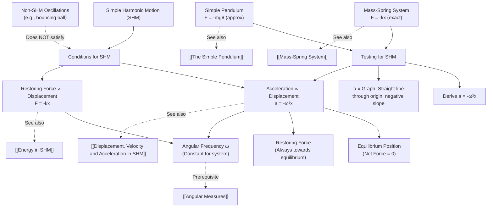

# 1. Overview / 概述

**English:**
This sub-topic establishes the fundamental **conditions** that must be satisfied for any motion to be classified as **Simple Harmonic Motion (SHM)**. SHM is a special type of oscillatory motion where the restoring force is directly proportional to the displacement from equilibrium and always acts towards the equilibrium position. Understanding these conditions is crucial because they form the foundation for analyzing all SHM systems, including [[The Simple Pendulum]] and [[Mass-Spring System]]. Without meeting these conditions, an oscillation is not simple harmonic, and the standard equations for [[Displacement, Velocity and Acceleration in SHM]] cannot be applied.

**中文:**
本子知识点确立了任何运动被归类为**简谐运动 (SHM)** 所必须满足的基本**条件**。SHM 是一种特殊的振荡运动，其回复力与距平衡位置的位移成正比，并且始终指向平衡位置。理解这些条件至关重要，因为它们是分析所有 SHM 系统（包括[[单摆]]和[[弹簧-质量系统]]）的基础。如果不满足这些条件，振荡就不是简谐运动，也就不能应用[[SHM中的位移、速度和加速度]]的标准方程。

---

# 2. Syllabus Learning Objectives / 考纲学习目标

| CAIE 9702 | Edexcel IAL |
|-----------|-------------|
| 17.1(a) Describe simple examples of free oscillations | 7.1 Understand the conditions for simple harmonic motion |
| 17.1(b) Define simple harmonic motion as the motion in which the acceleration is proportional to the displacement from a fixed point and directed towards that point | 7.2 Use the defining equation $a = -\omega^2 x$ |
| 17.1(c) Select and apply the defining equation $a = -\omega^2 x$ | 7.3 Understand the relationship between acceleration, displacement, and angular frequency |
| 17.1(d) Recognise and use the condition for SHM: $F \propto -x$ | 7.4 Solve problems using $a = -\omega^2 x$ |
| | 7.5 Describe examples of SHM in everyday contexts |

**Examiner Expectations / 考官期望:**
- **English:** Students must be able to state the defining condition of SHM in words and mathematically. They must recognize that the negative sign indicates the restoring nature of the force/acceleration. They should be able to test whether a given physical system satisfies the SHM conditions.
- **中文:** 学生必须能够用文字和数学公式表述 SHM 的定义条件。他们必须认识到负号表示力/加速度的回复性质。他们应该能够检验给定的物理系统是否满足 SHM 条件。

---

# 3. Core Definitions / 核心定义

| Term (EN/CN) | Definition (EN) | Definition (CN) | Common Mistakes / 常见错误 |
|--------------|-----------------|-----------------|---------------------------|
| **Simple Harmonic Motion (SHM)** / 简谐运动 | Oscillatory motion where the acceleration is directly proportional to the displacement from a fixed equilibrium point and is always directed towards that point. | 加速度与距固定平衡点的位移成正比，并且始终指向该点的振荡运动。 | Forgetting the negative sign or the "towards equilibrium" direction. / 忘记负号或"指向平衡位置"的方向。 |
| **Restoring Force** / 回复力 | The net force that acts to return the oscillating object back towards the equilibrium position. | 将振荡物体拉回平衡位置的合力。 | Confusing with applied force. / 与施加的力混淆。 |
| **Equilibrium Position** / 平衡位置 | The point where the net force on the oscillating object is zero. | 振荡物体所受合力为零的点。 | Thinking it's always at the center of motion. / 认为总是在运动的中心。 |
| **Displacement ($x$)** / 位移 | The distance and direction of the oscillating object from the equilibrium position at any instant. | 振荡物体在任意时刻距平衡位置的距离和方向。 | Confusing with amplitude. / 与振幅混淆。 |
| **Amplitude ($A$)** / 振幅 | The maximum displacement from the equilibrium position. | 距平衡位置的最大位移。 | Thinking it changes during free oscillation. / 认为在自由振荡中会变化。 |
| **Angular Frequency ($\omega$)** / 角频率 | A measure of how quickly the oscillation occurs, related to the period by $\omega = 2\pi/T$. | 衡量振荡快慢的量，与周期的关系为 $\omega = 2\pi/T$。 | Confusing with frequency $f$. / 与频率 $f$ 混淆。 |

---

# 4. Key Concepts Explained / 关键概念详解

## 4.1 The Defining Condition of SHM / SHM 的定义条件

### Explanation / 解释
**English:**
The fundamental condition for SHM is that the **acceleration** ($a$) of the oscillating object must be:
1. **Proportional** to its displacement ($x$) from the equilibrium position
2. **Opposite in direction** to the displacement (always directed towards equilibrium)

Mathematically, this is expressed as:
$$ a \propto -x $$
or equivalently:
$$ a = -\omega^2 x $$

where $\omega$ (angular frequency) is a constant for the particular oscillating system. The negative sign is crucial — it indicates the **restoring nature** of the acceleration.

Since $F = ma$, the force condition is:
$$ F \propto -x $$
or
$$ F = -kx $$
where $k$ is the force constant (related to $\omega^2$ by $k = m\omega^2$).

This condition applies to all SHM systems, including [[The Simple Pendulum]] (for small angles) and [[Mass-Spring System]].

**中文:**
SHM 的基本条件是振荡物体的**加速度** ($a$) 必须满足：
1. 与距平衡位置的**位移** ($x$) 成**正比**
2. 与位移**方向相反**（始终指向平衡位置）

数学上表示为：
$$ a \propto -x $$
或等价地：
$$ a = -\omega^2 x $$

其中 $\omega$（角频率）是特定振荡系统的常数。负号至关重要——它表示加速度的**回复性质**。

由于 $F = ma$，力的条件为：
$$ F \propto -x $$
或
$$ F = -kx $$
其中 $k$ 是力常数（与 $\omega^2$ 的关系为 $k = m\omega^2$）。

此条件适用于所有 SHM 系统，包括[[单摆]]（小角度时）和[[弹簧-质量系统]]。

### Physical Meaning / 物理意义
**English:**
The condition $a = -\omega^2 x$ means that as the object moves further from equilibrium, the acceleration pulling it back becomes proportionally stronger. At the equilibrium position ($x = 0$), acceleration is zero. At maximum displacement ($x = \pm A$), acceleration is maximum ($a = \mp \omega^2 A$). This creates a natural oscillation where the object "overshoots" equilibrium and is pulled back, repeating the cycle.

**中文:**
条件 $a = -\omega^2 x$ 意味着物体离平衡位置越远，将其拉回的加速度就越大。在平衡位置 ($x = 0$) 时，加速度为零。在最大位移 ($x = \pm A$) 时，加速度最大 ($a = \mp \omega^2 A$)。这产生了一种自然振荡，物体"越过"平衡位置后被拉回，循环往复。

### Common Misconceptions / 常见误区
- **English:**
  - ❌ "SHM requires constant acceleration" → ✅ Acceleration varies with displacement
  - ❌ "The negative sign is optional" → ✅ The negative sign is essential — it defines the direction
  - ❌ "Any oscillation is SHM" → ✅ Only oscillations satisfying $a \propto -x$ are SHM
  - ❌ "Equilibrium means the object is stationary" → ✅ Equilibrium means net force is zero; the object can be moving through it

- **中文:**
  - ❌ "SHM 需要恒定的加速度" → ✅ 加速度随位移变化
  - ❌ "负号可有可无" → ✅ 负号至关重要——它定义了方向
  - ❌ "任何振荡都是 SHM" → ✅ 只有满足 $a \propto -x$ 的振荡才是 SHM
  - ❌ "平衡意味着物体静止" → ✅ 平衡意味着合力为零；物体可以正在经过该点

### Exam Tips / 考试提示
- **English:**
  - Always write the negative sign in the equation $a = -\omega^2 x$
  - When testing if a system is SHM, derive an expression for acceleration and check if it's of the form $a = -(\text{constant}) \times x$
  - Remember that $\omega$ is a constant for a given system — it doesn't depend on amplitude
  - For [[The Simple Pendulum]], the condition only holds for small angular displacements ($\theta < 10^\circ$)

- **中文:**
  - 在方程 $a = -\omega^2 x$ 中始终写上负号
  - 检验系统是否为 SHM 时，推导加速度表达式并检查是否为 $a = -(\text{常数}) \times x$ 的形式
  - 记住 $\omega$ 是给定系统的常数——与振幅无关
  - 对于[[单摆]]，该条件仅在小角度位移 ($\theta < 10^\circ$) 时成立

> 📷 **IMAGE PROMPT — SHM-01: Acceleration vs Displacement Graph for SHM**
> A clear graph showing acceleration (a) on the y-axis vs displacement (x) on the x-axis. The graph is a straight line through the origin with negative slope. Label the axes, show the gradient as $-\omega^2$, and mark the equilibrium position (x=0, a=0). Include annotations showing that at positive x, acceleration is negative (towards equilibrium), and vice versa. Use a clean, textbook-style diagram suitable for A-Level physics.

---

## 4.2 Testing for SHM Conditions / 检验 SHM 条件

### Explanation / 解释
**English:**
To determine if a physical system undergoes SHM, follow these steps:

1. **Identify the equilibrium position** — where net force is zero
2. **Displace the object slightly** from equilibrium
3. **Find the net restoring force** or acceleration as a function of displacement
4. **Check if the relationship is of the form** $F = -kx$ or $a = -\omega^2 x$

If the relationship is linear (proportional) with a negative sign, the system exhibits SHM. If the relationship is non-linear (e.g., $F \propto -x^3$), the motion is oscillatory but NOT simple harmonic.

**Common systems that satisfy SHM conditions:**
- [[Mass-Spring System]] (horizontal or vertical)
- [[The Simple Pendulum]] (small angles only)
- Liquid in a U-tube
- Vibrating tuning fork prongs
- Simple pendulum on a string

**Common systems that do NOT satisfy SHM conditions:**
- A ball bouncing on a floor (acceleration is constant, not proportional to displacement)
- A pendulum swinging with large amplitude ($\theta > 10^\circ$)
- A mass on a spring with non-linear spring constant

**中文:**
要确定物理系统是否进行 SHM，请按以下步骤操作：

1. **确定平衡位置** — 合力为零的位置
2. **将物体稍微移开**平衡位置
3. **求出回复力**或加速度作为位移的函数
4. **检查关系是否为** $F = -kx$ 或 $a = -\omega^2 x$ 的形式

如果关系是线性的（成正比）且带有负号，则系统呈现 SHM。如果关系是非线性的（例如 $F \propto -x^3$），则运动是振荡的但不是简谐运动。

**满足 SHM 条件的常见系统：**
- [[弹簧-质量系统]]（水平或竖直）
- [[单摆]]（仅小角度）
- U 形管中的液体
- 振动音叉的叉股
- 弦上的单摆

**不满足 SHM 条件的常见系统：**
- 在地板上弹跳的球（加速度恒定，不与位移成正比）
- 大角度摆动的摆锤（$\theta > 10^\circ$）
- 具有非线性弹簧常数的弹簧上的质量

### Physical Meaning / 物理意义
**English:**
The linear restoring force condition ($F \propto -x$) is what makes SHM special. It means the system has a natural tendency to oscillate with a constant frequency regardless of amplitude (for small amplitudes). This property, called **isochronism**, is why pendulums are used in clocks — their period doesn't depend on how far they swing.

**中文:**
线性回复力条件 ($F \propto -x$) 是 SHM 的特殊之处。它意味着系统具有以恒定频率振荡的自然趋势，与振幅无关（小振幅时）。这种称为**等时性**的特性，是钟表使用摆锤的原因——其周期不取决于摆动幅度。

### Common Misconceptions / 常见误区
- **English:**
  - ❌ "All oscillating systems are SHM" → ✅ Only those with linear restoring force
  - ❌ "A pendulum is always SHM" → ✅ Only for small angles ($\theta < 10^\circ$)
  - ❌ "The condition $F = -kx$ only applies to springs" → ✅ It applies to any SHM system

- **中文:**
  - ❌ "所有振荡系统都是 SHM" → ✅ 只有具有线性回复力的才是
  - ❌ "摆锤总是 SHM" → ✅ 仅在小角度 ($\theta < 10^\circ$) 时成立
  - ❌ "条件 $F = -kx$ 仅适用于弹簧" → ✅ 它适用于任何 SHM 系统

### Exam Tips / 考试提示
- **English:**
  - When asked "Show that this system undergoes SHM", derive $a = -\omega^2 x$ explicitly
  - Identify the constant $\omega^2$ from your derivation — this gives the angular frequency
  - Remember that for [[The Simple Pendulum]], the restoring force is $F = -mg\sin\theta$, which approximates to $F = -mg\theta$ for small $\theta$
  - For [[Mass-Spring System]], the restoring force is $F = -kx$ exactly (Hooke's law)

- **中文:**
  - 当被要求"证明该系统进行 SHM"时，明确推导出 $a = -\omega^2 x$
  - 从推导中确定常数 $\omega^2$ — 这给出了角频率
  - 记住对于[[单摆]]，回复力为 $F = -mg\sin\theta$，小角度时近似为 $F = -mg\theta$
  - 对于[[弹簧-质量系统]]，回复力精确为 $F = -kx$（胡克定律）

---

# 5. Essential Equations / 核心公式

## 5.1 Defining Equation of SHM / SHM 定义方程

$$ a = -\omega^2 x $$

| Symbol (符号) | Meaning (EN) | Meaning (CN) | Unit (单位) |
|--------------|-------------|-------------|------------|
| $a$ | Acceleration of the oscillating object | 振荡物体的加速度 | m s⁻² |
| $\omega$ | Angular frequency | 角频率 | rad s⁻¹ |
| $x$ | Displacement from equilibrium | 距平衡位置的位移 | m |

**Derivation / 推导:**
This is the defining equation of SHM — it is not derived but rather stated as the condition that must be satisfied. However, it can be related to the force equation:
$$ F = ma = -m\omega^2 x = -kx $$
where $k = m\omega^2$ is the force constant.

**Conditions / 适用条件:**
- **English:** The motion must be oscillatory with a linear restoring force. The displacement $x$ is measured from the equilibrium position. The equation applies at all points during the oscillation.
- **中文:** 运动必须是具有线性回复力的振荡。位移 $x$ 从平衡位置测量。该方程适用于振荡过程中的所有点。

**Limitations / 局限性:**
- **English:** Only applies to systems where the restoring force is exactly proportional to displacement. For [[The Simple Pendulum]], this is only an approximation for small angles ($\theta < 10^\circ$). Does not account for damping or external forces.
- **中文:** 仅适用于回复力与位移精确成正比的系统。对于[[单摆]]，仅在小角度 ($\theta < 10^\circ$) 时是近似值。不考虑阻尼或外力。

## 5.2 Force Equation for SHM / SHM 的力方程

$$ F = -kx $$

| Symbol (符号) | Meaning (EN) | Meaning (CN) | Unit (单位) |
|--------------|-------------|-------------|------------|
| $F$ | Restoring force | 回复力 | N |
| $k$ | Force constant (spring constant) | 力常数（弹簧常数） | N m⁻¹ |
| $x$ | Displacement from equilibrium | 距平衡位置的位移 | m |

**Derivation / 推导:**
From $F = ma$ and $a = -\omega^2 x$:
$$ F = m(-\omega^2 x) = -m\omega^2 x = -kx $$
where $k = m\omega^2$.

**Conditions / 适用条件:**
- **English:** The negative sign indicates the force is always directed towards equilibrium. For springs, this is Hooke's law. For other systems, $k$ represents the effective force constant.
- **中文:** 负号表示力始终指向平衡位置。对于弹簧，这是胡克定律。对于其他系统，$k$ 表示有效力常数。

**Limitations / 局限性:**
- **English:** Assumes ideal linear behavior. Real springs may deviate from Hooke's law at large extensions. For [[The Simple Pendulum]], the effective force constant is $k = mg/L$ (for small angles).
- **中文:** 假设理想的线性行为。实际弹簧在大伸长量时可能偏离胡克定律。对于[[单摆]]，有效力常数为 $k = mg/L$（小角度时）。

> 📷 **IMAGE PROMPT — SHM-02: Force-Displacement Graph for SHM**
> A graph showing force (F) on the y-axis vs displacement (x) on the x-axis. The graph is a straight line through the origin with negative slope. Label the gradient as $-k$. Show that the area under the graph represents work done (related to [[Energy in SHM]]). Include annotations showing that at positive x, force is negative (towards equilibrium), and the magnitude increases linearly with displacement.

---

# 6. Graphs and Relationships / 图表与关系

## 6.1 Acceleration vs Displacement Graph / 加速度-位移图

### Axes / 坐标轴
- **x-axis:** Displacement $x$ (m) / 位移 $x$ (m)
- **y-axis:** Acceleration $a$ (m s⁻²) / 加速度 $a$ (m s⁻²)

### Shape / 形状
- **English:** A straight line passing through the origin with a **negative slope**. The slope is $-\omega^2$.
- **中文:** 一条通过原点的直线，斜率为**负**。斜率为 $-\omega^2$。

### Gradient Meaning / 斜率含义
- **English:** The gradient of the $a$-$x$ graph is $-\omega^2$. This gives the angular frequency: $\omega = \sqrt{-\text{gradient}}$.
- **中文:** $a$-$x$ 图的斜率为 $-\omega^2$。由此可得角频率：$\omega = \sqrt{-\text{斜率}}$。

### Area Meaning / 面积含义
- **English:** The area under the $a$-$x$ graph has no direct physical meaning in standard A-Level physics.
- **中文:** $a$-$x$ 图下的面积在标准 A-Level 物理中没有直接的物理意义。

### Exam Interpretation / 考试解读
- **English:** If you are given an $a$-$x$ graph and it is a straight line through the origin with negative slope, the system undergoes SHM. The steeper the slope, the larger the angular frequency $\omega$ (faster oscillation).
- **中文:** 如果给出的 $a$-$x$ 图是通过原点的直线且斜率为负，则系统进行 SHM。斜率越陡，角频率 $\omega$ 越大（振荡越快）。

## 6.2 Force vs Displacement Graph / 力-位移图

### Axes / 坐标轴
- **x-axis:** Displacement $x$ (m) / 位移 $x$ (m)
- **y-axis:** Restoring force $F$ (N) / 回复力 $F$ (N)

### Shape / 形状
- **English:** A straight line through the origin with negative slope. The slope is $-k$ (force constant).
- **中文:** 一条通过原点的直线，斜率为负。斜率为 $-k$（力常数）。

### Gradient Meaning / 斜率含义
- **English:** The gradient is $-k$, where $k$ is the force constant (spring constant for a spring system).
- **中文:** 斜率为 $-k$，其中 $k$ 是力常数（对于弹簧系统是弹簧常数）。

### Area Meaning / 面积含义
- **English:** The area under the $F$-$x$ graph represents the **work done** against the restoring force, which equals the **elastic potential energy** stored in the system. This is $\frac{1}{2}kx^2$, linking to [[Energy in SHM]].
- **中文:** $F$-$x$ 图下的面积表示克服回复力所做的**功**，等于系统中存储的**弹性势能**。即 $\frac{1}{2}kx^2$，与[[SHM中的能量]]相关。

### Exam Interpretation / 考试解读
- **English:** The $F$-$x$ graph confirms SHM if it's linear through the origin. The area gives energy. The slope gives $k$, which can be used to find $\omega$ via $\omega = \sqrt{k/m}$.
- **中文:** 如果 $F$-$x$ 图是通过原点的直线，则确认 SHM。面积给出能量。斜率给出 $k$，可通过 $\omega = \sqrt{k/m}$ 求出 $\omega$。

---

# 7. Required Diagrams / 必备图表

## 7.1 SHM System Diagram — Mass on a Spring / SHM 系统图——弹簧上的质量

### Description / 描述
**English:**
A diagram showing a mass attached to a spring on a frictionless horizontal surface. The mass is shown at three positions: equilibrium ($x=0$), maximum positive displacement ($x=+A$), and maximum negative displacement ($x=-A$). Force vectors are drawn at each position to show the restoring force direction.

**中文:**
显示在无摩擦水平表面上连接弹簧的质量的图表。质量显示在三个位置：平衡位置 ($x=0$)、最大正位移 ($x=+A$) 和最大负位移 ($x=-A$)。在每个位置绘制力矢量以显示回复力方向。

### Image Prompt / 图片生成提示
> 📷 **IMAGE PROMPT — SHM-03: Mass-Spring SHM System**
> A clean physics textbook-style diagram showing a horizontal mass-spring system. The mass is a block on a frictionless surface. Show three positions: (1) at equilibrium with the spring at natural length, label "x=0, F=0, a=0"; (2) displaced to the right with the spring stretched, label "x=+A, F=-kA (left), a=-ω²A (left)"; (3) displaced to the left with the spring compressed, label "x=-A, F=+kA (right), a=+ω²A (right)". Use arrows for force vectors. Include a dashed line showing the equilibrium position. Use clear labels in English.

### Labels Required / 需要标注
- **English:** Equilibrium position ($x=0$), Maximum displacement ($x=+A$, $x=-A$), Restoring force vectors ($F$), Acceleration vectors ($a$), Spring, Mass, Frictionless surface
- **中文:** 平衡位置 ($x=0$), 最大位移 ($x=+A$, $x=-A$), 回复力矢量 ($F$), 加速度矢量 ($a$), 弹簧, 质量, 无摩擦表面

### Exam Importance / 考试重要性
- **English:** This diagram is essential for understanding the direction of restoring force and acceleration at different points in the oscillation. It helps visualize why $a \propto -x$.
- **中文:** 此图对于理解振荡过程中不同点的回复力和加速度方向至关重要。它有助于可视化为什么 $a \propto -x$。

## 7.2 Simple Pendulum SHM Diagram / 单摆 SHM 图

### Description / 描述
**English:**
A diagram showing a simple pendulum displaced from equilibrium. The forces acting on the bob are shown: tension ($T$) and weight ($mg$). The component of weight providing the restoring force ($mg\sin\theta$) is highlighted. The displacement $x$ and the angle $\theta$ are labeled.

**中文:**
显示从平衡位置移开的单摆的图表。显示作用在摆锤上的力：张力 ($T$) 和重力 ($mg$)。突出显示提供回复力的重力分量 ($mg\sin\theta$)。标注位移 $x$ 和角度 $\theta$。

### Image Prompt / 图片生成提示
> 📷 **IMAGE PROMPT — SHM-04: Simple Pendulum Forces**
> A diagram of a simple pendulum displaced to the right by angle θ. Show the string, the bob (mass m), and the pivot point. Draw force vectors: tension T along the string, weight mg vertically downward. Resolve weight into components: mg cosθ along the string (balanced by T) and mg sinθ perpendicular to the string (the restoring force). Label the displacement x (horizontal distance from equilibrium) and the angle θ. Add a note: "For small θ, sinθ ≈ θ ≈ x/L, so F = -mgθ = -(mg/L)x, which is of the form F = -kx." Use clear labels.

### Labels Required / 需要标注
- **English:** Pivot, String (length $L$), Bob (mass $m$), Angle $\theta$, Displacement $x$, Tension $T$, Weight $mg$, Restoring force $mg\sin\theta$, Equilibrium position (dashed line)
- **中文:** 支点, 绳子 (长度 $L$), 摆锤 (质量 $m$), 角度 $\theta$, 位移 $x$, 张力 $T$, 重力 $mg$, 回复力 $mg\sin\theta$, 平衡位置 (虚线)

### Exam Importance / 考试重要性
- **English:** This diagram is crucial for understanding why the simple pendulum only approximates SHM for small angles. The restoring force is $mg\sin\theta$, not $mg\theta$, so the condition $F \propto -x$ is only approximate.
- **中文:** 此图对于理解为什么单摆仅在小角度时近似 SHM 至关重要。回复力是 $mg\sin\theta$，而不是 $mg\theta$，因此条件 $F \propto -x$ 只是近似成立。

---

# 8. Worked Examples / 典型例题

## Example 1: Testing a System for SHM / 例题 1：检验系统是否为 SHM

### Question / 题目
**English:**
A mass of 0.50 kg is attached to a spring with spring constant $k = 20 \text{ N m}^{-1}$. The mass is displaced 0.10 m from equilibrium and released.
(a) Show that the mass undergoes SHM.
(b) Calculate the angular frequency $\omega$ of the oscillation.
(c) Determine the acceleration of the mass when it is 0.050 m from equilibrium.

**中文:**
一个 0.50 kg 的质量连接在弹簧常数为 $k = 20 \text{ N m}^{-1}$ 的弹簧上。将质量从平衡位置移开 0.10 m 后释放。
(a) 证明该质量进行 SHM。
(b) 计算振荡的角频率 $\omega$。
(c) 确定质量距平衡位置 0.050 m 时的加速度。

### Solution / 解答

**Part (a) — Show SHM / 证明 SHM**

**English:**
1. The restoring force from the spring is given by Hooke's law: $F = -kx$
2. Using Newton's second law: $F = ma$
3. Therefore: $ma = -kx$
4. Rearranging: $a = -\frac{k}{m}x$
5. This is of the form $a = -\omega^2 x$ where $\omega^2 = \frac{k}{m}$
6. Since $a \propto -x$, the mass undergoes SHM. ✓

**中文:**
1. 弹簧的回复力由胡克定律给出：$F = -kx$
2. 使用牛顿第二定律：$F = ma$
3. 因此：$ma = -kx$
4. 整理得：$a = -\frac{k}{m}x$
5. 这是 $a = -\omega^2 x$ 的形式，其中 $\omega^2 = \frac{k}{m}$
6. 由于 $a \propto -x$，该质量进行 SHM。✓

**Part (b) — Calculate $\omega$ / 计算 $\omega$**

**English:**
$$\omega^2 = \frac{k}{m} = \frac{20}{0.50} = 40 \text{ s}^{-2}$$
$$\omega = \sqrt{40} = 6.32 \text{ rad s}^{-1}$$

**中文:**
$$\omega^2 = \frac{k}{m} = \frac{20}{0.50} = 40 \text{ s}^{-2}$$
$$\omega = \sqrt{40} = 6.32 \text{ rad s}^{-1}$$

**Part (c) — Calculate acceleration / 计算加速度**

**English:**
Using $a = -\omega^2 x$:
$$a = -40 \times 0.050 = -2.0 \text{ m s}^{-2}$$

The negative sign indicates the acceleration is directed towards the equilibrium position.

**中文:**
使用 $a = -\omega^2 x$：
$$a = -40 \times 0.050 = -2.0 \text{ m s}^{-2}$$

负号表示加速度指向平衡位置。

### Final Answer / 最终答案
**Answer:**
(a) SHM shown ✓
(b) $\omega = 6.32 \text{ rad s}^{-1}$
(c) $a = -2.0 \text{ m s}^{-2}$

**答案：**
(a) 已证明 SHM ✓
(b) $\omega = 6.32 \text{ rad s}^{-1}$
(c) $a = -2.0 \text{ m s}^{-2}$

### Quick Tip / 提示
**English:** Always show the derivation $a = -\frac{k}{m}x$ explicitly when asked to "show that" a system undergoes SHM. The key is to identify the constant $\omega^2 = k/m$.

**中文:** 当被要求"证明"系统进行 SHM 时，始终明确推导出 $a = -\frac{k}{m}x$。关键是确定常数 $\omega^2 = k/m$。

---

## Example 2: Identifying Non-SHM Motion / 例题 2：识别非 SHM 运动

### Question / 题目
**English:**
A ball is dropped from a height of 2.0 m onto a hard floor and bounces repeatedly. The acceleration of the ball during free fall is $g = 9.81 \text{ m s}^{-2}$ downward.
(a) Explain why this motion is NOT simple harmonic.
(b) State one condition that would need to be satisfied for the bouncing ball to approximate SHM.

**中文:**
一个球从 2.0 m 的高度落到硬地板上并反复弹跳。球在自由落体过程中的加速度为 $g = 9.81 \text{ m s}^{-2}$ 向下。
(a) 解释为什么这种运动不是简谐运动。
(b) 说明要使弹跳球近似 SHM 需要满足的一个条件。

### Solution / 解答

**Part (a) — Explain why not SHM / 解释为什么不是 SHM**

**English:**
For SHM, the acceleration must satisfy $a \propto -x$. During free fall, the ball's acceleration is constant ($a = g = 9.81 \text{ m s}^{-2}$ downward) and does NOT depend on its displacement from any equilibrium position. The acceleration is not proportional to displacement, and it is not always directed towards a fixed equilibrium point. Therefore, the motion is oscillatory but NOT simple harmonic.

**中文:**
对于 SHM，加速度必须满足 $a \propto -x$。在自由落体过程中，球的加速度是恒定的 ($a = g = 9.81 \text{ m s}^{-2}$ 向下)，并且不依赖于距任何平衡位置的位移。加速度不与位移成正比，也不总是指向固定的平衡点。因此，运动是振荡的但不是简谐运动。

**Part (b) — Condition for approximate SHM / 近似 SHM 的条件**

**English:**
For the bouncing ball to approximate SHM, the restoring force during contact with the floor would need to be proportional to the displacement from an equilibrium position. This would require the floor to behave like an ideal spring (Hooke's law), providing a force $F = -kx$ during the brief contact period. In reality, this is not the case for a hard floor.

**中文:**
要使弹跳球近似 SHM，与地板接触期间的回复力需要与距平衡位置的位移成正比。这要求地板表现得像理想弹簧（胡克定律），在短暂的接触期间提供力 $F = -kx$。实际上，硬地板并非如此。

### Final Answer / 最终答案
**Answer:**
(a) Acceleration is constant ($g$), not proportional to displacement. ✓
(b) The floor would need to provide a restoring force proportional to displacement (like a spring). ✓

**答案：**
(a) 加速度是恒定的 ($g$)，不与位移成正比。✓
(b) 地板需要提供与位移成正比的回复力（像弹簧一样）。✓

### Quick Tip / 提示
**English:** Remember: All SHM is oscillatory, but NOT all oscillatory motion is SHM. The key test is whether $a \propto -x$ holds.

**中文:** 记住：所有 SHM 都是振荡的，但并非所有振荡运动都是 SHM。关键检验是 $a \propto -x$ 是否成立。

---

# 9. Past Paper Question Types / 历年真题题型

| Question Type / 题型 | Frequency / 频率 | Difficulty / 难度 | Past Paper References / 真题索引 |
|----------------------|------------------|------------------|-------------------------------|
| State the conditions for SHM / 陈述 SHM 的条件 | High / 高 | Easy / 简单 | 📝 *待填入* |
| Show that a system undergoes SHM / 证明系统进行 SHM | High / 高 | Medium / 中等 | 📝 *待填入* |
| Calculate $\omega$ from $a$-$x$ graph / 从 $a$-$x$ 图计算 $\omega$ | Medium / 中 | Medium / 中等 | 📝 *待填入* |
| Identify non-SHM oscillatory motion / 识别非 SHM 振荡运动 | Low / 低 | Easy / 简单 | 📝 *待填入* |
| Derive $a = -\omega^2 x$ for a given system / 为给定系统推导 $a = -\omega^2 x$ | Medium / 中 | Medium/Hard / 中/难 | 📝 *待填入* |

**Common Command Words / 常见指令词:**
- **English:** State, Define, Show that, Derive, Explain, Calculate, Determine
- **中文:** 陈述, 定义, 证明, 推导, 解释, 计算, 确定

---

# 10. Practical Skills Connections / 实验技能链接

**English:**
This sub-topic connects to practical work in several ways:

1. **Verifying SHM conditions:** In the lab, you can use a motion sensor or data logger to record the acceleration and displacement of an oscillating mass-spring system. Plotting $a$ vs $x$ should give a straight line through the origin with negative slope, confirming SHM.

2. **Determining $\omega$ from experimental data:** The gradient of the $a$-$x$ graph gives $-\omega^2$. You can then calculate $\omega$ and compare it with the theoretical value $\omega = \sqrt{k/m}$.

3. **Uncertainty analysis:** When measuring displacement and acceleration, consider uncertainties in the ruler, motion sensor calibration, and timing. The gradient of the best-fit line should include error bars.

4. **Graph plotting skills:** Plot $a$ on the y-axis and $x$ on the x-axis. Draw a line of best fit through the origin. Calculate the gradient with its uncertainty.

5. **Testing the pendulum approximation:** For [[The Simple Pendulum]], you can investigate how the period changes with amplitude. For small angles ($\theta < 10^\circ$), the period should be approximately constant. For larger angles, the period increases, showing the breakdown of the SHM approximation.

**中文:**
本子知识点通过以下几种方式与实验工作相关联：

1. **验证 SHM 条件：** 在实验室中，您可以使用运动传感器或数据记录器记录振荡的弹簧-质量系统的加速度和位移。绘制 $a$ 对 $x$ 的图应得到一条通过原点的直线，斜率为负，从而确认 SHM。

2. **从实验数据确定 $\omega$：** $a$-$x$ 图的斜率给出 $-\omega^2$。然后您可以计算 $\omega$ 并与理论值 $\omega = \sqrt{k/m}$ 进行比较。

3. **不确定度分析：** 测量位移和加速度时，考虑尺子、运动传感器校准和计时的不确定度。最佳拟合线的斜率应包含误差棒。

4. **绘图技能：** 在 y 轴上绘制 $a$，在 x 轴上绘制 $x$。绘制通过原点的最佳拟合线。计算斜率及其不确定度。

5. **检验摆的近似：** 对于[[单摆]]，您可以研究周期如何随振幅变化。对于小角度 ($\theta < 10^\circ$)，周期应近似恒定。对于较大角度，周期增加，表明 SHM 近似失效。

---

# 11. Concept Map / 概念图谱

---

# 12. Quick Revision Sheet / 速查表

| Category / 类别 | Key Points / 要点 |
|----------------|------------------|
| **Definition / 定义** | SHM: Acceleration ∝ -Displacement from equilibrium / 加速度 ∝ -距平衡位置的位移 |
| **Key Formula / 核心公式** | $a = -\omega^2 x$ or $F = -kx$ |
| **Key Graph / 核心图表** | $a$-$x$ graph: Straight line through origin, negative slope $= -\omega^2$ / $a$-$x$ 图：通过原点的直线，斜率 $= -\omega^2$ |
| **Testing for SHM / 检验 SHM** | Derive $a = -(\text{constant}) \times x$ / 推导出 $a = -(\text{常数}) \times x$ |
| **Common Systems / 常见系统** | [[Mass-Spring System]] (exact), [[The Simple Pendulum]] (approx, small angles) / [[弹簧-质量系统]] (精确), [[单摆]] (近似, 小角度) |
| **Non-SHM Examples / 非 SHM 示例** | Bouncing ball, large-angle pendulum, non-linear spring / 弹跳球, 大角度摆, 非线性弹簧 |
| **Key Constant / 关键常数** | $\omega^2 = k/m$ for mass-spring; $\omega^2 = g/L$ for pendulum / 弹簧-质量系统: $\omega^2 = k/m$; 单摆: $\omega^2 = g/L$ |
| **Exam Tip / 考试提示** | Always include the negative sign! / 始终包含负号！ |
| **Common Mistake / 常见错误** | Confusing "oscillatory" with "simple harmonic" / 混淆"振荡"和"简谐" |
| **Prerequisites / 前置知识** | [[Equations of Motion (SUVAT)]], [[Angular Measures]] / [[运动方程 (SUVAT)]], [[角度测量]] |
| **Related Topics / 相关主题** | [[Energy in SHM]], [[Displacement, Velocity and Acceleration in SHM]] / [[SHM中的能量]], [[SHM中的位移、速度和加速度]] |