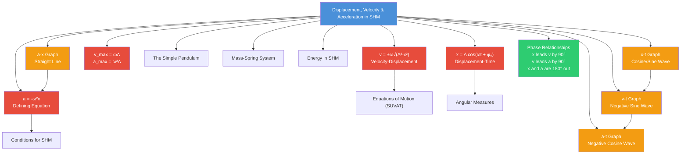

# 1. Overview / 概述

**English:**
This sub-topic explores the mathematical relationships between displacement, velocity, and acceleration in Simple Harmonic Motion (SHM). Unlike linear motion where these quantities follow simple polynomial relationships, in SHM they are described by sinusoidal functions of time. Understanding these relationships is fundamental to analyzing any oscillating system — from [[The Simple Pendulum]] to [[Mass-Spring System]] systems. The key insight is that acceleration is always proportional to negative displacement, which is the defining characteristic of SHM and connects directly to [[Conditions for SHM]].

**中文:**
本子知识点探讨简谐运动（SHM）中位移、速度和加速度之间的数学关系。与线性运动中这些量遵循简单的多项式关系不同，在SHM中它们由时间的正弦函数描述。理解这些关系是分析任何振荡系统的基础——从[[The Simple Pendulum|单摆]]到[[Mass-Spring System|弹簧质量系统]]。关键洞察是加速度始终与负位移成正比，这是SHM的定义特征，并直接连接到[[Conditions for SHM|SHM的条件]]。

---

# 2. Syllabus Learning Objectives / 考纲学习目标

| CAIE 9702 | Edexcel IAL |
|-----------|-------------|
| 17.1(a): Define simple harmonic motion as the motion of a particle whose acceleration is proportional to its displacement from a fixed point and directed towards that point | 7.1: Understand the defining equation of SHM: $a = -\omega^2 x$ |
| 17.1(b): Use the equation $a = -\omega^2 x$ | 7.2: Derive and use equations for displacement, velocity, and acceleration in SHM |
| 17.1(c): Use the equations $x = A\cos(\omega t)$ and $x = A\sin(\omega t)$ | 7.3: Understand the phase relationships between displacement, velocity, and acceleration |
| 17.1(d): Use the equations $v = \pm\omega\sqrt{A^2 - x^2}$ and $v_{\text{max}} = \omega A$ | 7.4: Use the equation $v = \pm\omega\sqrt{A^2 - x^2}$ |
| — | 7.5: Understand the energy transformations in SHM (links to [[Energy in SHM]]) |

**Examiner Expectations / 考官期望:**
- **CAIE:** Students must be able to derive velocity-displacement relationship from energy considerations or calculus
- **Edexcel:** Students must understand the phase difference between displacement and velocity ($\pi/2$ rad) and between displacement and acceleration ($\pi$ rad)
- **Both:** Graphical interpretation of sinusoidal variations is essential

---

# 3. Core Definitions / 核心定义

| Term (EN/CN) | Definition (EN) | Definition (CN) | Common Mistakes / 常见错误 |
|--------------|-----------------|-----------------|---------------------------|
| **Displacement** $x$ / 位移 | The distance of the oscillating particle from the equilibrium position at any instant | 振荡粒子在任意时刻距平衡位置的距离 | Confusing displacement with amplitude — displacement varies with time, amplitude is constant |
| **Amplitude** $A$ / 振幅 | The maximum displacement from the equilibrium position | 距平衡位置的最大位移 | Thinking amplitude changes during oscillation (it's constant for undamped SHM) |
| **Angular Frequency** $\omega$ / 角频率 | The rate of change of phase angle, related to period by $\omega = 2\pi/T$ | 相位角的变化率，与周期的关系为 $\omega = 2\pi/T$ | Confusing $\omega$ with frequency $f$ — they differ by factor $2\pi$ |
| **Phase** $\phi$ / 相位 | The argument of the sine or cosine function, determining the state of oscillation | 正弦或余弦函数的自变量，决定振荡状态 | Forgetting to include initial phase $\phi_0$ when the motion doesn't start from equilibrium |
| **Acceleration** $a$ / 加速度 | The rate of change of velocity; in SHM, $a = -\omega^2 x$ | 速度的变化率；在SHM中，$a = -\omega^2 x$ | Forgetting the negative sign — acceleration always opposes displacement |

---

# 4. Key Concepts Explained / 关键概念详解

## 4.1 The Defining Equation of SHM / SHM的定义方程

### Explanation / 解释
**English:**
The fundamental relationship that defines SHM is:
$$ a = -\omega^2 x $$

This means acceleration is:
1. **Proportional** to displacement (not constant like in [[Equations of Motion (SUVAT)]])
2. **Opposite in direction** to displacement (the negative sign)
3. **Always directed towards** the equilibrium position (restoring force)

This equation is derived from [[Conditions for SHM]] where the restoring force $F = -kx$ and $F = ma$, giving $a = -(k/m)x$, so $\omega^2 = k/m$.

**中文:**
定义SHM的基本关系是：
$$ a = -\omega^2 x $$

这意味着加速度：
1. **与位移成正比**（不像[[Equations of Motion (SUVAT)|SUVAT方程]]中是常数）
2. **与位移方向相反**（负号）
3. **始终指向平衡位置**（回复力）

该方程从[[Conditions for SHM|SHM的条件]]推导而来，其中回复力 $F = -kx$ 且 $F = ma$，得到 $a = -(k/m)x$，因此 $\omega^2 = k/m$。

### Physical Meaning / 物理意义
**English:**
The negative sign is crucial — it means the acceleration always tries to bring the particle back to equilibrium. When displacement is positive (to the right), acceleration is negative (to the left), and vice versa. This creates the oscillatory behavior.

**中文:**
负号至关重要——它意味着加速度总是试图将粒子带回平衡位置。当位移为正（向右）时，加速度为负（向左），反之亦然。这产生了振荡行为。

### Common Misconceptions / 常见误区
- ❌ **"Acceleration is maximum at equilibrium"** — No! Acceleration is zero at equilibrium ($x=0$) and maximum at amplitude ($x=\pm A$)
- ❌ **"Acceleration and displacement are in phase"** — No! They are in anti-phase (180° out of phase)
- ❌ **"The equation $a = -\omega^2 x$ only applies to springs"** — No! It applies to ALL SHM systems

### Exam Tips / 考试提示
- **EN:** Always include the negative sign when writing the SHM equation — examiners look for it
- **CN:** 写SHM方程时始终包含负号——考官会检查这一点

> 📷 **IMAGE PROMPT — DIAGRAM-01: Acceleration-Displacement Graph for SHM**
> A straight line graph with negative gradient passing through origin. X-axis labeled "Displacement x / m", Y-axis labeled "Acceleration a / m s⁻²". The line shows a = -ω²x relationship. Key points marked: at x = +A, a = -ω²A; at x = 0, a = 0; at x = -A, a = +ω²A. Gradient = -ω².

## 4.2 Displacement-Time Relationship / 位移-时间关系

### Explanation / 解释
**English:**
The displacement of a particle in SHM varies sinusoidally with time. The general equation is:
$$ x = A\cos(\omega t + \phi_0) \quad \text{or} \quad x = A\sin(\omega t + \phi_0) $$

Where:
- $A$ = amplitude (maximum displacement)
- $\omega$ = angular frequency ($\omega = 2\pi f = 2\pi/T$)
- $\phi_0$ = initial phase (determines starting position)
- $t$ = time

The choice between sine and cosine depends on initial conditions:
- If $x = A$ at $t = 0$: use $x = A\cos(\omega t)$
- If $x = 0$ at $t = 0$: use $x = A\sin(\omega t)$

**中文:**
SHM中粒子的位移随时间正弦变化。一般方程为：
$$ x = A\cos(\omega t + \phi_0) \quad \text{或} \quad x = A\sin(\omega t + \phi_0) $$

其中：
- $A$ = 振幅（最大位移）
- $\omega$ = 角频率（$\omega = 2\pi f = 2\pi/T$）
- $\phi_0$ = 初相位（决定起始位置）
- $t$ = 时间

正弦和余弦的选择取决于初始条件：
- 若 $t = 0$ 时 $x = A$：使用 $x = A\cos(\omega t)$
- 若 $t = 0$ 时 $x = 0$：使用 $x = A\sin(\omega t)$

### Common Misconceptions / 常见误区
- ❌ **"The particle moves along a sine wave path"** — No! The sine wave is a graph of displacement vs time, not the path of motion
- ❌ **"Amplitude changes with time"** — No! For undamped SHM, amplitude is constant

### Exam Tips / 考试提示
- **EN:** When given a graph, read the amplitude from the peak and the period from one complete cycle
- **CN:** 给定图表时，从峰值读取振幅，从一个完整周期读取周期

## 4.3 Velocity in SHM / SHM中的速度

### Explanation / 解释
**English:**
Velocity is the rate of change of displacement. By differentiating $x = A\cos(\omega t)$:
$$ v = \frac{dx}{dt} = -\omega A\sin(\omega t) $$

The maximum velocity occurs when $\sin(\omega t) = \pm 1$:
$$ v_{\text{max}} = \omega A $$

An alternative form (velocity-displacement relationship) is:
$$ v = \pm\omega\sqrt{A^2 - x^2} $$

This shows:
- Velocity is maximum at equilibrium ($x=0$): $v = \pm\omega A$
- Velocity is zero at amplitude ($x = \pm A$)
- The $\pm$ sign indicates direction

**中文:**
速度是位移的变化率。对 $x = A\cos(\omega t)$ 求导：
$$ v = \frac{dx}{dt} = -\omega A\sin(\omega t) $$

当 $\sin(\omega t) = \pm 1$ 时出现最大速度：
$$ v_{\text{max}} = \omega A $$

另一种形式（速度-位移关系）为：
$$ v = \pm\omega\sqrt{A^2 - x^2} $$

这表明：
- 在平衡位置（$x=0$）速度最大：$v = \pm\omega A$
- 在振幅处（$x = \pm A$）速度为零
- $\pm$ 号表示方向

### Physical Meaning / 物理意义
**English:**
The velocity-displacement equation $v = \pm\omega\sqrt{A^2 - x^2}$ is particularly useful because it relates velocity directly to position without needing time. This is analogous to the [[Equations of Motion (SUVAT)]] equation $v^2 = u^2 + 2as$, but for oscillatory motion.

**中文:**
速度-位移方程 $v = \pm\omega\sqrt{A^2 - x^2}$ 特别有用，因为它直接将速度与位置联系起来，无需时间。这类似于[[Equations of Motion (SUVAT)|SUVAT方程]]中的 $v^2 = u^2 + 2as$，但用于振荡运动。

### Common Misconceptions / 常见误区
- ❌ **"Velocity is maximum at amplitude"** — No! Velocity is zero at amplitude (turning points)
- ❌ **"Velocity and displacement are in phase"** — No! Velocity leads displacement by $\pi/2$ rad (90°)

### Exam Tips / 考试提示
- **EN:** Use $v = \pm\omega\sqrt{A^2 - x^2}$ when you know displacement but not time
- **CN:** 当知道位移但不知道时间时，使用 $v = \pm\omega\sqrt{A^2 - x^2}$

## 4.4 Acceleration in SHM / SHM中的加速度

### Explanation / 解释
**English:**
Acceleration is the rate of change of velocity. Differentiating $v = -\omega A\sin(\omega t)$:
$$ a = \frac{dv}{dt} = -\omega^2 A\cos(\omega t) = -\omega^2 x $$

This confirms the defining equation. Key features:
- Acceleration is maximum at amplitude: $a_{\text{max}} = \omega^2 A$
- Acceleration is zero at equilibrium ($x=0$)
- Acceleration is always directed towards equilibrium

**中文:**
加速度是速度的变化率。对 $v = -\omega A\sin(\omega t)$ 求导：
$$ a = \frac{dv}{dt} = -\omega^2 A\cos(\omega t) = -\omega^2 x $$

这确认了定义方程。关键特征：
- 在振幅处加速度最大：$a_{\text{max}} = \omega^2 A$
- 在平衡位置（$x=0$）加速度为零
- 加速度始终指向平衡位置

### Common Misconceptions / 常见误区
- ❌ **"Acceleration is constant in SHM"** — No! It varies sinusoidally with time
- ❌ **"Maximum acceleration occurs at equilibrium"** — No! Maximum acceleration occurs at amplitude

### Exam Tips / 考试提示
- **EN:** Remember: acceleration and displacement are in anti-phase (180° out of phase)
- **CN:** 记住：加速度和位移是反相的（相位差180°）

## 4.5 Phase Relationships / 相位关系

### Explanation / 解释
**English:**
The three quantities — displacement, velocity, and acceleration — have specific phase relationships:

| Quantity | Expression | Phase relative to displacement |
|----------|------------|-------------------------------|
| Displacement $x$ | $A\cos(\omega t)$ | Reference (0°) |
| Velocity $v$ | $-\omega A\sin(\omega t) = \omega A\cos(\omega t + \pi/2)$ | Leads by $\pi/2$ (90°) |
| Acceleration $a$ | $-\omega^2 A\cos(\omega t) = \omega^2 A\cos(\omega t + \pi)$ | Leads by $\pi$ (180°) |

**中文:**
三个量——位移、速度和加速度——具有特定的相位关系：

| 量 | 表达式 | 相对于位移的相位 |
|----------|------------|-------------------------------|
| 位移 $x$ | $A\cos(\omega t)$ | 参考（0°） |
| 速度 $v$ | $-\omega A\sin(\omega t) = \omega A\cos(\omega t + \pi/2)$ | 超前 $\pi/2$（90°） |
| 加速度 $a$ | $-\omega^2 A\cos(\omega t) = \omega^2 A\cos(\omega t + \pi)$ | 超前 $\pi$（180°） |

### Physical Meaning / 物理意义
**English:**
When displacement is maximum positive, velocity is zero (changing direction) and acceleration is maximum negative (pulling back). When displacement is zero (at equilibrium), velocity is maximum and acceleration is zero.

**中文:**
当位移为正最大时，速度为零（改变方向），加速度为负最大（拉回）。当位移为零（在平衡位置）时，速度最大，加速度为零。

> 📷 **IMAGE PROMPT — DIAGRAM-02: Phase Relationships in SHM**
> Three sinusoidal graphs stacked vertically with aligned time axes. Top: displacement (cosine wave, amplitude A). Middle: velocity (negative sine wave, amplitude ωA). Bottom: acceleration (negative cosine wave, amplitude ω²A). Vertical dashed lines mark key points showing phase differences. Labels: "x leads v by 90°", "v leads a by 90°", "x and a are 180° out of phase".

---

# 5. Essential Equations / 核心公式

## Equation 1: Defining Equation of SHM / SHM定义方程

$$ a = -\omega^2 x $$

| Symbol (符号) | Meaning (EN) | Meaning (CN) | Unit (单位) |
|--------------|-------------|-------------|------------|
| $a$ | Acceleration | 加速度 | m s⁻² |
| $\omega$ | Angular frequency | 角频率 | rad s⁻¹ |
| $x$ | Displacement from equilibrium | 距平衡位置的位移 | m |

**Derivation / 推导:**
From Hooke's Law $F = -kx$ and Newton's Second Law $F = ma$:
$$ ma = -kx \implies a = -\frac{k}{m}x \implies \omega^2 = \frac{k}{m} $$

**Conditions / 适用条件:**
- **EN:** Only applies to systems where restoring force is proportional to displacement
- **CN:** 仅适用于回复力与位移成正比的系统

**Limitations / 局限性:**
- **EN:** Does not account for damping or driving forces
- **CN:** 不考虑阻尼或驱动力

## Equation 2: Displacement-Time / 位移-时间

$$ x = A\cos(\omega t + \phi_0) $$

| Symbol (符号) | Meaning (EN) | Meaning (CN) | Unit (单位) |
|--------------|-------------|-------------|------------|
| $A$ | Amplitude | 振幅 | m |
| $\phi_0$ | Initial phase | 初相位 | rad |

**Conditions / 适用条件:**
- **EN:** For undamped SHM; cosine form when $x=A$ at $t=0$
- **CN:** 用于无阻尼SHM；当 $t=0$ 时 $x=A$ 使用余弦形式

## Equation 3: Velocity-Displacement / 速度-位移

$$ v = \pm\omega\sqrt{A^2 - x^2} $$

| Symbol (符号) | Meaning (EN) | Meaning (CN) | Unit (单位) |
|--------------|-------------|-------------|------------|
| $v$ | Velocity | 速度 | m s⁻¹ |
| $\pm$ | Direction indicator | 方向指示 | — |

**Derivation / 推导:**
From $x = A\cos(\omega t)$, $v = -\omega A\sin(\omega t)$. Using $\sin^2 + \cos^2 = 1$:
$$ \sin(\omega t) = \pm\sqrt{1 - \cos^2(\omega t)} = \pm\sqrt{1 - \frac{x^2}{A^2}} $$
$$ v = -\omega A \cdot \left(\pm\sqrt{1 - \frac{x^2}{A^2}}\right) = \pm\omega\sqrt{A^2 - x^2} $$

**Conditions / 适用条件:**
- **EN:** Only valid for SHM; $|x| \leq A$
- **CN:** 仅适用于SHM；$|x| \leq A$

## Equation 4: Maximum Values / 最大值

$$ v_{\text{max}} = \omega A $$
$$ a_{\text{max}} = \omega^2 A $$

| Symbol (符号) | Meaning (EN) | Meaning (CN) | Unit (单位) |
|--------------|-------------|-------------|------------|
| $v_{\text{max}}$ | Maximum speed | 最大速度 | m s⁻¹ |
| $a_{\text{max}}$ | Maximum acceleration | 最大加速度 | m s⁻² |

**Conditions / 适用条件:**
- **EN:** $v_{\text{max}}$ occurs at $x=0$; $a_{\text{max}}$ occurs at $x=\pm A$
- **CN:** $v_{\text{max}}$ 出现在 $x=0$；$a_{\text{max}}$ 出现在 $x=\pm A$

> 📷 **IMAGE PROMPT — DIAGRAM-03: Key Equations Summary for SHM**
> A visual summary showing four equations in boxes connected by arrows: a = -ω²x (center), x = A cos(ωt) (top left), v = ±ω√(A²-x²) (top right), v_max = ωA and a_max = ω²A (bottom). Arrows show relationships between equations.

---

# 6. Graphs and Relationships / 图表与关系

## 6.1 Displacement-Time Graph / 位移-时间图

### Axes / 坐标轴
- **X-axis:** Time $t$ / s (时间 $t$ / 秒)
- **Y-axis:** Displacement $x$ / m (位移 $x$ / 米)

### Shape / 形状
**English:** A cosine (or sine) wave. For $x = A\cos(\omega t)$, starts at $x=A$ when $t=0$, crosses zero at $t=T/4$, reaches $x=-A$ at $t=T/2$, and completes one cycle at $t=T$.

**中文:** 余弦（或正弦）波。对于 $x = A\cos(\omega t)$，当 $t=0$ 时从 $x=A$ 开始，在 $t=T/4$ 时过零，在 $t=T/2$ 时达到 $x=-A$，在 $t=T$ 时完成一个周期。

### Gradient Meaning / 斜率含义
**English:** The gradient at any point gives the instantaneous velocity. Steepest gradient = maximum speed (at $x=0$). Zero gradient = turning points (at $x=\pm A$).

**中文:** 任意点的斜率给出瞬时速度。最陡斜率 = 最大速度（在 $x=0$ 处）。零斜率 = 转折点（在 $x=\pm A$ 处）。

### Area Meaning / 面积含义
**English:** Area under the displacement-time graph has no direct physical meaning in SHM.

**中文:** 位移-时间图下的面积在SHM中没有直接的物理意义。

### Exam Interpretation / 考试解读
- **EN:** Read amplitude from peak-to-zero distance; read period from peak-to-peak distance
- **CN:** 从峰到零的距离读取振幅；从峰到峰的距离读取周期

## 6.2 Velocity-Time Graph / 速度-时间图

### Axes / 坐标轴
- **X-axis:** Time $t$ / s (时间 $t$ / 秒)
- **Y-axis:** Velocity $v$ / m s⁻¹ (速度 $v$ / 米每秒)

### Shape / 形状
**English:** A negative sine wave (if displacement is cosine). Starts at $v=0$ when $t=0$, reaches $v=-\omega A$ at $t=T/4$, returns to $v=0$ at $t=T/2$, reaches $v=+\omega A$ at $t=3T/4$.

**中文:** 负正弦波（如果位移是余弦）。当 $t=0$ 时从 $v=0$ 开始，在 $t=T/4$ 时达到 $v=-\omega A$，在 $t=T/2$ 时回到 $v=0$，在 $t=3T/4$ 时达到 $v=+\omega A$。

### Gradient Meaning / 斜率含义
**English:** The gradient gives acceleration. Maximum gradient = maximum acceleration (at $x=\pm A$). Zero gradient = zero acceleration (at $x=0$).

**中文:** 斜率给出加速度。最大斜率 = 最大加速度（在 $x=\pm A$ 处）。零斜率 = 零加速度（在 $x=0$ 处）。

### Area Meaning / 面积含义
**English:** Area under velocity-time graph gives displacement (change in position).

**中文:** 速度-时间图下的面积给出位移（位置变化）。

### Exam Interpretation / 考试解读
- **EN:** Note that velocity graph is shifted left by $T/4$ relative to displacement graph (phase difference of $\pi/2$)
- **CN:** 注意速度图相对于位移图向左移动了 $T/4$（相位差 $\pi/2$）

## 6.3 Acceleration-Time Graph / 加速度-时间图

### Axes / 坐标轴
- **X-axis:** Time $t$ / s (时间 $t$ / 秒)
- **Y-axis:** Acceleration $a$ / m s⁻² (加速度 $a$ / 米每二次方秒)

### Shape / 形状
**English:** A negative cosine wave (if displacement is cosine). Starts at $a=-\omega^2 A$ when $t=0$, crosses zero at $t=T/4$, reaches $a=+\omega^2 A$ at $t=T/2$.

**中文:** 负余弦波（如果位移是余弦）。当 $t=0$ 时从 $a=-\omega^2 A$ 开始，在 $t=T/4$ 时过零，在 $t=T/2$ 时达到 $a=+\omega^2 A$。

### Gradient Meaning / 斜率含义
**English:** Gradient of acceleration-time graph gives jerk (rate of change of acceleration), rarely examined at A-Level.

**中文:** 加速度-时间图的斜率给出加加速度（加速度的变化率），A-Level很少考查。

### Area Meaning / 面积含义
**English:** Area under acceleration-time graph gives change in velocity.

**中文:** 加速度-时间图下的面积给出速度变化。

### Exam Interpretation / 考试解读
- **EN:** Acceleration graph is inverted relative to displacement graph (phase difference of $\pi$)
- **CN:** 加速度图相对于位移图是倒置的（相位差 $\pi$）

## 6.4 Acceleration-Displacement Graph / 加速度-位移图

### Axes / 坐标轴
- **X-axis:** Displacement $x$ / m (位移 $x$ / 米)
- **Y-axis:** Acceleration $a$ / m s⁻² (加速度 $a$ / 米每二次方秒)

### Shape / 形状
**English:** A straight line through the origin with negative gradient. This is the graphical representation of $a = -\omega^2 x$.

**中文:** 一条通过原点的直线，斜率为负。这是 $a = -\omega^2 x$ 的图形表示。

### Gradient Meaning / 斜率含义
**English:** The gradient equals $-\omega^2$. A steeper gradient means higher angular frequency (faster oscillations).

**中文:** 斜率等于 $-\omega^2$。斜率越陡意味着角频率越高（振荡越快）。

### Area Meaning / 面积含义
**English:** Area under $a$-$x$ graph has no direct physical meaning.

**中文:** $a$-$x$ 图下的面积没有直接的物理意义。

### Exam Interpretation / 考试解读
- **EN:** This is the most important graph for identifying SHM — if $a$ vs $x$ is a straight line through origin with negative gradient, the motion is SHM
- **CN:** 这是识别SHM最重要的图——如果 $a$ 对 $x$ 是通过原点的负斜率直线，则运动是SHM

> 📷 **IMAGE PROMPT — DIAGRAM-04: Four Key Graphs of SHM**
> Four graphs arranged in a 2×2 grid. Top left: x-t graph (cosine wave). Top right: v-t graph (negative sine wave). Bottom left: a-t graph (negative cosine wave). Bottom right: a-x graph (straight line through origin, negative gradient). All axes labeled with units. Vertical dashed lines connect key points across time graphs.

---

# 7. Required Diagrams / 必备图表

## 7.1 Phase Relationship Diagram / 相位关系图

### Description / 描述
**English:** A diagram showing the relative positions of displacement, velocity, and acceleration vectors at different points in the oscillation cycle. This helps visualize the phase relationships.

**中文:** 显示振荡周期中不同点处位移、速度和加速度矢量相对位置的图。这有助于可视化相位关系。

### Image Prompt / 图片生成提示
> 📷 **IMAGE PROMPT — DIAGRAM-05: Phase Vectors in SHM**
> A circular reference diagram with four key positions (0°, 90°, 180°, 270°) around a circle. At each position, show three arrows: displacement (blue, pointing outward from center), velocity (green, tangential to circle), acceleration (red, pointing inward toward center). Labels indicate phase differences: "v leads x by 90°", "a leads v by 90°", "a and x are 180° out of phase". Include a small reference circle showing the oscillation path.

### Labels Required / 需要标注
- **EN:** Equilibrium position, Amplitude ($+A$, $-A$), Direction of motion, Phase angle
- **CN:** 平衡位置、振幅（$+A$、$-A$）、运动方向、相位角

### Exam Importance / 考试重要性
- **EN:** High — understanding phase relationships is essential for interpreting graphs and solving problems
- **CN:** 高——理解相位关系对于解读图表和解决问题至关重要

## 7.2 Energy-Position Diagram / 能量-位置图

### Description / 描述
**English:** A diagram showing how kinetic energy, potential energy, and total energy vary with displacement. This connects to [[Energy in SHM]].

**中文:** 显示动能、势能和总能量如何随位移变化的图。这连接到[[Energy in SHM|SHM中的能量]]。

### Image Prompt / 图片生成提示
> 📷 **IMAGE PROMPT — DIAGRAM-06: Energy vs Displacement in SHM**
> A graph with displacement x on the horizontal axis (from -A to +A) and energy E on the vertical axis. Three curves: Kinetic energy (KE, parabolic opening downward, maximum at x=0), Potential energy (PE, parabolic opening upward, maximum at x=±A), Total energy (TE, horizontal straight line). Labels: "KE + PE = constant = ½kA²". Shading shows energy conversion.

### Labels Required / 需要标注
- **EN:** Kinetic energy, Potential energy, Total energy, Equilibrium, Amplitude
- **CN:** 动能、势能、总能量、平衡位置、振幅

### Exam Importance / 考试重要性
- **EN:** Medium — helps understand velocity-displacement relationship from energy conservation
- **CN:** 中——有助于从能量守恒理解速度-位移关系

---

# 8. Worked Examples / 典型例题

## Example 1: Finding Velocity from Displacement / 从位移求速度

### Question / 题目
**English:**
A particle oscillates with SHM of amplitude 0.050 m and period 2.0 s. Calculate:
(a) The angular frequency
(b) The maximum speed
(c) The speed when the displacement is 0.030 m from equilibrium

**中文:**
一个粒子以振幅0.050 m和周期2.0 s做简谐运动。计算：
(a) 角频率
(b) 最大速度
(c) 当位移距平衡位置0.030 m时的速度

### Solution / 解答

**Step 1: Find angular frequency / 求角频率**
$$ \omega = \frac{2\pi}{T} = \frac{2\pi}{2.0} = \pi \text{ rad s}^{-1} \approx 3.14 \text{ rad s}^{-1} $$

**Step 2: Find maximum speed / 求最大速度**
$$ v_{\text{max}} = \omega A = \pi \times 0.050 = 0.157 \text{ m s}^{-1} $$

**Step 3: Find speed at $x = 0.030$ m / 求 $x = 0.030$ m 时的速度**
Using $v = \pm\omega\sqrt{A^2 - x^2}$:
$$ v = \pm\pi\sqrt{(0.050)^2 - (0.030)^2} $$
$$ v = \pm\pi\sqrt{0.0025 - 0.0009} $$
$$ v = \pm\pi\sqrt{0.0016} $$
$$ v = \pm\pi \times 0.04 $$
$$ v = \pm 0.126 \text{ m s}^{-1} $$

### Final Answer / 最终答案
**Answer:** (a) $\omega = \pi$ rad s⁻¹, (b) $v_{\text{max}} = 0.157$ m s⁻¹, (c) $v = \pm 0.126$ m s⁻¹ | **答案：** (a) $\omega = \pi$ 弧度每秒, (b) $v_{\text{max}} = 0.157$ 米每秒, (c) $v = \pm 0.126$ 米每秒

### Quick Tip / 提示
- **EN:** The $\pm$ sign in part (c) indicates the particle could be moving in either direction at that displacement
- **CN:** 第(c)部分的 $\pm$ 号表示粒子在该位移处可能向任一方向运动

## Example 2: Phase and Time Calculations / 相位与时间计算

### Question / 题目
**English:**
A particle in SHM has amplitude 0.080 m and period 1.5 s. At $t=0$, the particle is at $x = +0.080$ m. Find:
(a) The equation for displacement as a function of time
(b) The time when the particle first reaches $x = 0$
(c) The acceleration at $x = 0.040$ m

**中文:**
一个做SHM的粒子振幅为0.080 m，周期为1.5 s。在 $t=0$ 时，粒子在 $x = +0.080$ m处。求：
(a) 位移作为时间函数的方程
(b) 粒子首次到达 $x = 0$ 的时间
(c) 在 $x = 0.040$ m处的加速度

### Solution / 解答

**Step 1: Find angular frequency / 求角频率**
$$ \omega = \frac{2\pi}{T} = \frac{2\pi}{1.5} = \frac{4\pi}{3} \text{ rad s}^{-1} $$

**Step 2: Write displacement equation / 写出位移方程**
Since $x = A$ at $t=0$, use cosine form with $\phi_0 = 0$:
$$ x = A\cos(\omega t) = 0.080\cos\left(\frac{4\pi}{3}t\right) $$

**Step 3: Find time when $x=0$ / 求 $x=0$ 的时间**
$$ 0 = 0.080\cos\left(\frac{4\pi}{3}t\right) $$
$$ \cos\left(\frac{4\pi}{3}t\right) = 0 $$
$$ \frac{4\pi}{3}t = \frac{\pi}{2} $$
$$ t = \frac{3}{8} = 0.375 \text{ s} $$

**Step 4: Find acceleration at $x = 0.040$ m / 求 $x = 0.040$ m 时的加速度**
$$ a = -\omega^2 x = -\left(\frac{4\pi}{3}\right)^2 \times 0.040 $$
$$ a = -\frac{16\pi^2}{9} \times 0.040 $$
$$ a = -\frac{0.64\pi^2}{9} = -0.702 \text{ m s}^{-2} $$

### Final Answer / 最终答案
**Answer:** (a) $x = 0.080\cos(4\pi t/3)$, (b) $t = 0.375$ s, (c) $a = -0.702$ m s⁻² | **答案：** (a) $x = 0.080\cos(4\pi t/3)$, (b) $t = 0.375$ 秒, (c) $a = -0.702$ 米每二次方秒

### Quick Tip / 提示
- **EN:** The negative sign in acceleration confirms it's directed toward equilibrium (opposite to positive displacement)
- **CN:** 加速度中的负号确认它指向平衡位置（与正位移方向相反）

---

# 9. Past Paper Question Types / 历年真题题型

| Question Type / 题型 | Frequency / 频率 | Difficulty / 难度 | Past Paper References / 真题索引 |
|----------------------|------------------|------------------|-------------------------------|
| Calculate $v_{\text{max}}$ or $a_{\text{max}}$ from given $A$ and $T$ | Very High | Easy | 📝 *待填入* |
| Use $v = \pm\omega\sqrt{A^2 - x^2}$ to find speed at given displacement | High | Medium | 📝 *待填入* |
| Sketch and interpret $x$-$t$, $v$-$t$, $a$-$t$ graphs | High | Medium | 📝 *待填入* |
| Determine phase difference from graphs | Medium | Medium | 📝 *待填入* |
| Find time to reach specific displacement | Medium | Hard | 📝 *待填入* |
| Identify SHM from $a$-$x$ graph | Low | Easy | 📝 *待填入* |

**Common Command Words / 常见指令词:**
- **EN:** Calculate, Determine, Sketch, Show that, State, Explain
- **CN:** 计算、确定、画出、证明、写出、解释

---

# 10. Practical Skills Connections / 实验技能链接

**English:**
This sub-topic connects to practical work in several ways:

1. **Data Collection:** Using motion sensors or video analysis to record displacement-time data for an oscillating mass-spring system or pendulum
2. **Graph Plotting:** Plotting $x$-$t$ graphs and determining $A$ and $T$ from the graph
3. **Verification of SHM:** Plotting $a$-$x$ graph to verify the linear relationship and determine $\omega^2$ from gradient
4. **Uncertainty Analysis:** Estimating uncertainties in amplitude and period measurements
5. **Experimental Design:** Choosing appropriate sampling rates to capture oscillation details

**Common Practical Errors:**
- Not allowing enough oscillations for accurate period measurement
- Confusing amplitude with displacement at a specific time
- Incorrectly setting initial conditions for data logging

**中文:**
本子知识点通过以下方式与实验工作联系：

1. **数据收集：** 使用运动传感器或视频分析记录振荡弹簧质量系统或摆的位移-时间数据
2. **图表绘制：** 绘制 $x$-$t$ 图并从图中确定 $A$ 和 $T$
3. **SHM验证：** 绘制 $a$-$x$ 图以验证线性关系并从斜率确定 $\omega^2$
4. **不确定度分析：** 估计振幅和周期测量的不确定度
5. **实验设计：** 选择合适的采样率以捕捉振荡细节

**常见实验错误：**
- 没有允许足够的振荡次数以获得准确的周期测量
- 将振幅与特定时间的位移混淆
- 为数据记录错误设置初始条件

---

# 11. Concept Map / 概念图谱

---

# 12. Quick Revision Sheet / 速查表

| Category / 类别 | Key Points / 要点 |
|----------------|------------------|
| **Definition / 定义** | SHM: $a \propto -x$, specifically $a = -\omega^2 x$ |
| **Key Formula / 核心公式** | $x = A\cos(\omega t + \phi_0)$, $v = \pm\omega\sqrt{A^2 - x^2}$, $v_{\text{max}} = \omega A$, $a_{\text{max}} = \omega^2 A$ |
| **Key Graph / 核心图表** | $a$-$x$ graph: straight line through origin, gradient $= -\omega^2$ — this proves SHM |
| **Phase / 相位** | Velocity leads displacement by $\pi/2$ (90°); Acceleration leads velocity by $\pi/2$ (90°); Acceleration and displacement are in anti-phase ($\pi$ or 180°) |
| **Max/Min / 最大/最小** | $v_{\text{max}}$ at $x=0$ (equilibrium); $v=0$ at $x=\pm A$ (amplitude); $a_{\text{max}}$ at $x=\pm A$; $a=0$ at $x=0$ |
| **Exam Tip / 考试提示** | Always include negative sign in $a = -\omega^2 x$; Use $v = \pm\omega\sqrt{A^2 - x^2}$ when time is unknown; Read $A$ from peak and $T$ from peak-to-peak on $x$-$t$ graph |
| **Common Mistake / 常见错误** | Confusing amplitude with displacement; Forgetting $\pm$ in velocity equation; Thinking acceleration is constant; Mixing up $\omega$ and $f$ |
| **Units / 单位** | $x$, $A$: m; $v$: m s⁻¹; $a$: m s⁻²; $\omega$: rad s⁻¹; $t$: s; $T$: s; $f$: Hz |
| **Connection / 联系** | Links to [[Conditions for SHM]], [[The Simple Pendulum]], [[Mass-Spring System]], [[Energy in SHM]] |