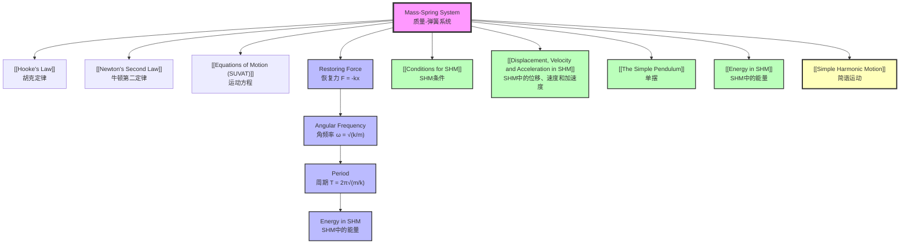

# 1. Overview / 概述

**English:**
The mass-spring system is a classic example of [[Simple Harmonic Motion]] (SHM) that demonstrates the fundamental relationship between [[Hooke's Law]] and oscillatory motion. When a mass attached to a spring is displaced from its equilibrium position, the restoring force provided by the spring causes the system to oscillate. This sub-topic covers the derivation of the period of oscillation, the relationship between spring constant and angular frequency, and the analysis of energy transformations within the system. Understanding the mass-spring system is crucial for grasping the mathematical foundations of SHM and serves as a bridge to more complex oscillatory systems in physics and engineering.

**中文:**
质量-弹簧系统是[[简谐运动]]（SHM）的经典实例，展示了[[胡克定律]]与振荡运动之间的基本关系。当连接在弹簧上的质量块偏离平衡位置时，弹簧提供的恢复力使系统产生振荡。本子知识点涵盖振荡周期的推导、弹簧常数与角频率之间的关系，以及系统内能量转换的分析。理解质量-弹簧系统对于掌握SHM的数学基础至关重要，并且是连接物理和工程中更复杂振荡系统的桥梁。

---

# 2. Syllabus Learning Objectives / 考纲学习目标

| CAIE 9702 | Edexcel IAL |
|-----------|-------------|
| 17.1(a) Describe simple examples of free oscillations | 7.1 Understand the conditions for simple harmonic motion |
| 17.1(b) Define and use the terms displacement, amplitude, period, frequency, angular frequency and phase difference | 7.2 Understand and use the equation $a = -\omega^2 x$ |
| 17.1(c) Derive and use the equation $T = 2\pi \sqrt{\frac{m}{k}}$ for a mass-spring system | 7.3 Derive and use the period equations for a mass-spring system |
| 17.1(d) Investigate the motion of a mass-spring system experimentally | 7.4 Understand energy changes in SHM |
| | 7.5 Solve problems involving SHM |

**Examiner Expectations / 考官期望:**
- **CAIE:** Students must be able to derive the period formula from first principles using Hooke's Law and Newton's Second Law. Experimental skills including measurement of $T$ for different masses and springs are essential.
- **Edexcel:** Focus on applying the period equation to solve problems, understanding the relationship between $a$, $x$, and $\omega$, and analyzing energy transformations.

---

# 3. Core Definitions / 核心定义

| Term (EN/CN) | Definition (EN) | Definition (CN) | Common Mistakes / 常见错误 |
|--------------|-----------------|-----------------|---------------------------|
| **Spring Constant** $k$ / 弹簧常数 $k$ | The force required to produce unit extension of the spring, measured in N/m | 使弹簧产生单位伸长所需的力，单位为N/m | Confusing $k$ with stiffness; $k$ is constant for a given spring only within elastic limit |
| **Restoring Force** / 恢复力 | The force that acts to return the mass to its equilibrium position, proportional to displacement | 使质量块返回平衡位置的力，与位移成正比 | Forgetting the negative sign in $F = -kx$ |
| **Equilibrium Position** / 平衡位置 | The position where the net force on the mass is zero | 质量块所受合力为零的位置 | Confusing with amplitude position |
| **Angular Frequency** $\omega$ / 角频率 $\omega$ | The rate of change of phase angle, $\omega = 2\pi f = \sqrt{\frac{k}{m}}$ | 相位角的变化率，$\omega = 2\pi f = \sqrt{\frac{k}{m}}$ | Using $\omega$ in rad/s but forgetting to convert to Hz |
| **Natural Frequency** $f_0$ / 固有频率 $f_0$ | The frequency at which the system oscillates when undisturbed, $f_0 = \frac{1}{2\pi}\sqrt{\frac{k}{m}}$ | 系统在不受干扰时振荡的频率，$f_0 = \frac{1}{2\pi}\sqrt{\frac{k}{m}}$ | Confusing with driving frequency in forced oscillations |

---

# 4. Key Concepts Explained / 关键概念详解

## 4.1 Hooke's Law and Restoring Force / 胡克定律与恢复力

### Explanation / 解释
**English:**
For an ideal spring, [[Hooke's Law]] states that the restoring force $F$ is directly proportional to the displacement $x$ from the equilibrium position, but in the opposite direction:
$$F = -kx$$
where $k$ is the [[Spring Constant]]. The negative sign indicates that the force always acts towards the equilibrium position. This linear relationship is what makes the mass-spring system exhibit [[Simple Harmonic Motion]].

**中文:**
对于理想弹簧，[[胡克定律]]指出恢复力 $F$ 与偏离平衡位置的位移 $x$ 成正比，但方向相反：
$$F = -kx$$
其中 $k$ 是[[弹簧常数]]。负号表示力始终指向平衡位置。这种线性关系使质量-弹簧系统表现出[[简谐运动]]。

### Physical Meaning / 物理意义
**English:**
The restoring force is the "memory" of the spring — it remembers where equilibrium is and pulls the mass back. The larger the spring constant $k$, the "stiffer" the spring and the stronger the restoring force for a given displacement.

**中文:**
恢复力是弹簧的"记忆"——它记住平衡位置在哪里，并将质量块拉回。弹簧常数 $k$ 越大，弹簧越"硬"，对于给定的位移，恢复力越强。

### Common Misconceptions / 常见误区
- ❌ **Mistake:** Thinking $F = kx$ without the negative sign
  **Correction:** The negative sign is crucial — it shows the force is restoring
- ❌ **Mistake:** Assuming $k$ changes with displacement
  **Correction:** $k$ is constant within the elastic limit
- ❌ **Mistake:** Confusing extension with displacement
  **Correction:** Extension is measured from natural length; displacement from equilibrium

### Exam Tips / 考试提示
- **EN:** Always include the negative sign when writing Hooke's Law in vector form. When using magnitudes, write $F = kx$ but state direction separately.
- **中文:** 在矢量形式中始终包含负号。使用标量形式时，写 $F = kx$ 但需单独说明方向。

> 📷 **IMAGE PROMPT — DIAGRAM-01: Mass-Spring System Forces**
> A clear diagram showing a mass attached to a spring on a horizontal frictionless surface. Label the equilibrium position (x=0), displacement (x), and show the restoring force vector (F) pointing back toward equilibrium. Include arrows indicating direction of motion.

## 4.2 Derivation of Period / 周期推导

### Explanation / 解释
**English:**
Using [[Newton's Second Law]] ($F = ma$) and Hooke's Law ($F = -kx$):
$$ma = -kx$$
$$a = -\frac{k}{m}x$$

Comparing with the SHM condition $a = -\omega^2 x$:
$$\omega^2 = \frac{k}{m}$$
$$\omega = \sqrt{\frac{k}{m}}$$

Since $\omega = \frac{2\pi}{T}$:
$$T = 2\pi \sqrt{\frac{m}{k}}$$

**中文:**
利用[[牛顿第二定律]]（$F = ma$）和胡克定律（$F = -kx$）：
$$ma = -kx$$
$$a = -\frac{k}{m}x$$

与SHM条件 $a = -\omega^2 x$ 比较：
$$\omega^2 = \frac{k}{m}$$
$$\omega = \sqrt{\frac{k}{m}}$$

由于 $\omega = \frac{2\pi}{T}$：
$$T = 2\pi \sqrt{\frac{m}{k}}$$

### Physical Meaning / 物理意义
**English:**
The period depends only on the mass and spring constant — not on amplitude. A larger mass increases inertia, making the system oscillate more slowly (longer $T$). A stiffer spring (larger $k$) provides stronger restoring force, making the system oscillate faster (shorter $T$).

**中文:**
周期仅取决于质量和弹簧常数——与振幅无关。质量越大，惯性越大，系统振荡越慢（$T$ 越大）。弹簧越硬（$k$ 越大），恢复力越强，系统振荡越快（$T$ 越小）。

### Common Misconceptions / 常见误区
- ❌ **Mistake:** Thinking $T$ depends on amplitude
  **Correction:** For ideal springs, $T$ is independent of amplitude (isochronous)
- ❌ **Mistake:** Using $m$ as the mass of the spring
  **Correction:** $m$ is the oscillating mass; spring mass is negligible unless specified
- ❌ **Mistake:** Confusing $T$ with $f$ in calculations
  **Correction:** $T = 1/f$, always check units

### Exam Tips / 考试提示
- **EN:** Memorize the derivation steps — examiners often ask for the derivation of $T = 2\pi\sqrt{m/k}$
- **中文:** 记住推导步骤——考官经常要求推导 $T = 2\pi\sqrt{m/k}$

---

# 5. Essential Equations / 核心公式

## Equation 1: Period of Mass-Spring System / 质量-弹簧系统周期

$$T = 2\pi \sqrt{\frac{m}{k}}$$

| Symbol (符号) | Meaning (EN) | Meaning (CN) | Unit (单位) |
|--------------|-------------|-------------|------------|
| $T$ | Period of oscillation | 振荡周期 | s |
| $m$ | Mass attached to spring | 连接在弹簧上的质量 | kg |
| $k$ | Spring constant | 弹簧常数 | N/m |

**Derivation / 推导:**
$$F = -kx \quad \text{(Hooke's Law)}$$
$$F = ma \quad \text{(Newton's Second Law)}$$
$$ma = -kx$$
$$a = -\frac{k}{m}x$$
Comparing with $a = -\omega^2 x$:
$$\omega^2 = \frac{k}{m}$$
$$\omega = \sqrt{\frac{k}{m}}$$
Since $\omega = \frac{2\pi}{T}$:
$$\frac{2\pi}{T} = \sqrt{\frac{k}{m}}$$
$$T = 2\pi \sqrt{\frac{m}{k}}$$

**Conditions / 适用条件:**
- **EN:** Ideal spring (massless, obeys Hooke's Law within elastic limit), small oscillations, no damping
- **中文:** 理想弹簧（无质量，在弹性限度内遵守胡克定律），小振幅振荡，无阻尼

**Limitations / 局限性:**
- **EN:** Real springs have mass, which affects period; large amplitudes may cause non-linear behavior; damping reduces amplitude over time
- **中文:** 实际弹簧有质量，会影响周期；大振幅可能导致非线性行为；阻尼会随时间减小振幅

## Equation 2: Angular Frequency / 角频率

$$\omega = \sqrt{\frac{k}{m}}$$

| Symbol (符号) | Meaning (EN) | Meaning (CN) | Unit (单位) |
|--------------|-------------|-------------|------------|
| $\omega$ | Angular frequency | 角频率 | rad/s |
| $k$ | Spring constant | 弹簧常数 | N/m |
| $m$ | Mass | 质量 | kg |

**Conditions / 适用条件:**
- **EN:** Same as period equation; $\omega$ is independent of amplitude
- **中文:** 与周期方程相同；$\omega$ 与振幅无关

## Equation 3: Displacement as Function of Time / 位移随时间变化

$$x(t) = A\cos(\omega t + \phi)$$

| Symbol (符号) | Meaning (EN) | Meaning (CN) | Unit (单位) |
|--------------|-------------|-------------|------------|
| $x(t)$ | Displacement at time $t$ | 时刻 $t$ 的位移 | m |
| $A$ | Amplitude | 振幅 | m |
| $\omega$ | Angular frequency | 角频率 | rad/s |
| $\phi$ | Phase constant | 相位常数 | rad |

**Conditions / 适用条件:**
- **EN:** For SHM starting from maximum displacement ($\phi = 0$); use $x = A\sin(\omega t)$ if starting from equilibrium
- **中文:** 从最大位移开始（$\phi = 0$）；如果从平衡位置开始，使用 $x = A\sin(\omega t)$

> 📷 **IMAGE PROMPT — DIAGRAM-02: Period vs Mass Graph**
> A graph showing period squared ($T^2$) on the y-axis vs mass ($m$) on the x-axis. The graph should be a straight line through the origin with gradient $4\pi^2/k$. Label axes and include data points with error bars.

---

# 6. Graphs and Relationships / 图表与关系

## 6.1 Displacement-Time Graph / 位移-时间图

### Axes / 坐标轴
- **X-axis:** Time $t$ (s) / 时间 $t$ (s)
- **Y-axis:** Displacement $x$ (m) / 位移 $x$ (m)

### Shape / 形状
- **EN:** Cosine curve (starting from maximum displacement) or sine curve (starting from equilibrium)
- **中文:** 余弦曲线（从最大位移开始）或正弦曲线（从平衡位置开始）

### Gradient Meaning / 斜率含义
- **EN:** Gradient = velocity $v$; zero at maximum displacement, maximum at equilibrium
- **中文:** 斜率 = 速度 $v$；在最大位移处为零，在平衡位置处最大

### Area Meaning / 面积含义
- **EN:** No direct physical meaning for displacement-time graph
- **中文:** 位移-时间图没有直接的物理意义

### Exam Interpretation / 考试解读
- **EN:** Read period $T$ from one complete cycle; amplitude $A$ from maximum displacement
- **中文:** 从一个完整周期读取周期 $T$；从最大位移读取振幅 $A$

## 6.2 Acceleration-Displacement Graph / 加速度-位移图

### Axes / 坐标轴
- **X-axis:** Displacement $x$ (m) / 位移 $x$ (m)
- **Y-axis:** Acceleration $a$ (m/s²) / 加速度 $a$ (m/s²)

### Shape / 形状
- **EN:** Straight line through origin with negative gradient
- **中文:** 通过原点的直线，斜率为负

### Gradient Meaning / 斜率含义
- **EN:** Gradient = $-\omega^2 = -\frac{k}{m}$
- **中文:** 斜率 = $-\omega^2 = -\frac{k}{m}$

### Area Meaning / 面积含义
- **EN:** No direct physical meaning
- **中文:** 没有直接的物理意义

### Exam Interpretation / 考试解读
- **EN:** The straight line confirms SHM; gradient gives $\omega^2$; intercept at $x = A$ gives $a_{\text{max}} = -\omega^2 A$
- **中文:** 直线确认SHM；斜率给出 $\omega^2$；在 $x = A$ 处的截距给出 $a_{\text{max}} = -\omega^2 A$

## 6.3 Period² vs Mass Graph / 周期平方-质量图

### Axes / 坐标轴
- **X-axis:** Mass $m$ (kg) / 质量 $m$ (kg)
- **Y-axis:** Period squared $T^2$ (s²) / 周期平方 $T^2$ (s²)

### Shape / 形状
- **EN:** Straight line through origin
- **中文:** 通过原点的直线

### Gradient Meaning / 斜率含义
- **EN:** Gradient = $\frac{4\pi^2}{k}$
- **中文:** 斜率 = $\frac{4\pi^2}{k}$

### Area Meaning / 面积含义
- **EN:** No direct physical meaning
- **中文:** 没有直接的物理意义

### Exam Interpretation / 考试解读
- **EN:** Used to determine spring constant $k$ experimentally; gradient $= 4\pi^2/k$, so $k = 4\pi^2/\text{gradient}$
- **中文:** 用于实验确定弹簧常数 $k$；斜率 $= 4\pi^2/k$，所以 $k = 4\pi^2/\text{斜率}$

> 📷 **IMAGE PROMPT — DIAGRAM-03: Acceleration vs Displacement Graph**
> A graph showing acceleration (a) on y-axis vs displacement (x) on x-axis. Draw a straight line through origin with negative slope. Label the gradient as -ω². Mark points at x = A (maximum displacement) showing a = -ω²A, and at x = -A showing a = ω²A.

---

# 7. Required Diagrams / 必备图表

## 7.1 Mass-Spring System Setup / 质量-弹簧系统装置图

### Description / 描述
**English:**
A diagram showing a mass attached to a spring on a horizontal frictionless surface (or vertical setup with spring hanging from a support). Label the equilibrium position, displacement, amplitude, and direction of motion.

**中文:**
显示质量块连接在弹簧上的示意图，弹簧置于水平无摩擦表面（或垂直设置，弹簧悬挂在支架上）。标注平衡位置、位移、振幅和运动方向。

### Image Prompt / 图片生成提示
> 📷 **IMAGE PROMPT — DIAGRAM-04: Mass-Spring System Setup**
> A detailed physics diagram of a mass-spring system. Show a horizontal frictionless surface with a block of mass m attached to a spring fixed at one end. The spring is shown at three positions: compressed (left of equilibrium), at equilibrium (middle), and extended (right of equilibrium). Label: equilibrium position (x=0), displacement (x), amplitude (A), spring constant (k), and restoring force vector (F) pointing toward equilibrium. Use clear arrows and professional physics diagram style.

### Labels Required / 需要标注
- **EN:** Equilibrium position ($x = 0$), displacement ($x$), amplitude ($A$), spring constant ($k$), mass ($m$), restoring force ($F$)
- **中文:** 平衡位置（$x = 0$）、位移（$x$）、振幅（$A$）、弹簧常数（$k$）、质量（$m$）、恢复力（$F$）

### Exam Importance / 考试重要性
- **EN:** Essential for understanding the physical setup; often used in experimental questions
- **中文:** 对理解物理装置至关重要；常用于实验题

## 7.2 Energy Changes Diagram / 能量变化图

### Description / 描述
**English:**
A diagram showing the energy transformations in a mass-spring system at different positions during oscillation. Include kinetic energy (KE), elastic potential energy (EPE), and total mechanical energy.

**中文:**
显示质量-弹簧系统在振荡过程中不同位置的能量转换图。包括动能（KE）、弹性势能（EPE）和总机械能。

### Image Prompt / 图片生成提示
> 📷 **IMAGE PROMPT — DIAGRAM-05: Energy Changes in Mass-Spring System**
> A diagram showing a mass-spring system at four positions: (1) maximum compression - all EPE, zero KE; (2) passing through equilibrium - maximum KE, zero EPE; (3) maximum extension - all EPE, zero KE; (4) again at equilibrium - maximum KE. Below each position, show bar charts representing KE (blue) and EPE (red) with total energy (green dashed line) constant. Include energy equations: EPE = ½kx², KE = ½mv², Total = ½kA².

### Labels Required / 需要标注
- **EN:** Kinetic energy ($KE = \frac{1}{2}mv^2$), elastic potential energy ($EPE = \frac{1}{2}kx^2$), total energy ($E_{\text{total}} = \frac{1}{2}kA^2$)
- **中文:** 动能（$KE = \frac{1}{2}mv^2$）、弹性势能（$EPE = \frac{1}{2}kx^2$）、总能量（$E_{\text{total}} = \frac{1}{2}kA^2$）

### Exam Importance / 考试重要性
- **EN:** Frequently tested in energy conservation questions; understanding energy conversion is key to solving problems
- **中文:** 常在能量守恒问题中考查；理解能量转换是解题的关键

---

# 8. Worked Examples / 典型例题

## Example 1: Finding Period and Frequency / 求周期和频率

### Question / 题目
**English:**
A 0.50 kg mass is attached to a spring with spring constant $k = 80$ N/m. The mass is displaced 0.10 m from equilibrium and released. Calculate:
(a) The period of oscillation
(b) The frequency of oscillation
(c) The angular frequency

**中文:**
一个 0.50 kg 的质量块连接在弹簧常数为 $k = 80$ N/m 的弹簧上。将质量块从平衡位置拉开 0.10 m 后释放。计算：
(a) 振荡周期
(b) 振荡频率
(c) 角频率

### Solution / 解答

**Step 1: Identify known values / 确定已知量**
- $m = 0.50$ kg
- $k = 80$ N/m
- $A = 0.10$ m (amplitude, not needed for period)

**Step 2: Calculate period / 计算周期**
$$T = 2\pi \sqrt{\frac{m}{k}}$$
$$T = 2\pi \sqrt{\frac{0.50}{80}}$$
$$T = 2\pi \sqrt{0.00625}$$
$$T = 2\pi \times 0.0791$$
$$T = 0.497 \text{ s}$$

**Step 3: Calculate frequency / 计算频率**
$$f = \frac{1}{T} = \frac{1}{0.497} = 2.01 \text{ Hz}$$

**Step 4: Calculate angular frequency / 计算角频率**
$$\omega = 2\pi f = 2\pi \times 2.01 = 12.6 \text{ rad/s}$$
Alternatively:
$$\omega = \sqrt{\frac{k}{m}} = \sqrt{\frac{80}{0.50}} = \sqrt{160} = 12.6 \text{ rad/s}$$

### Final Answer / 最终答案
**Answer:** $T = 0.50$ s, $f = 2.0$ Hz, $\omega = 13$ rad/s | **答案：** $T = 0.50$ s，$f = 2.0$ Hz，$\omega = 13$ rad/s

### Quick Tip / 提示
- **EN:** Notice that amplitude does NOT affect period — this is a key property of SHM
- **中文:** 注意振幅不影响周期——这是SHM的关键特性

## Example 2: Finding Spring Constant from Experimental Data / 从实验数据求弹簧常数

### Question / 题目
**English:**
In an experiment, a student measures the period of oscillation for different masses attached to the same spring. The results are:

| Mass $m$ (kg) | Period $T$ (s) |
|---------------|----------------|
| 0.20 | 0.63 |
| 0.40 | 0.89 |
| 0.60 | 1.09 |
| 0.80 | 1.26 |

Plot a suitable graph to determine the spring constant $k$.

**中文:**
在实验中，学生测量了不同质量块连接在同一弹簧上的振荡周期。结果如下：

| 质量 $m$ (kg) | 周期 $T$ (s) |
|---------------|----------------|
| 0.20 | 0.63 |
| 0.40 | 0.89 |
| 0.60 | 1.09 |
| 0.80 | 1.26 |

绘制合适的图表以确定弹簧常数 $k$。

### Solution / 解答

**Step 1: Linearize the equation / 线性化方程**
From $T = 2\pi \sqrt{\frac{m}{k}}$, square both sides:
$$T^2 = \frac{4\pi^2}{k} m$$

This is of the form $y = mx + c$ where:
- $y = T^2$
- $x = m$
- Gradient $= \frac{4\pi^2}{k}$
- $c = 0$ (through origin)

**Step 2: Calculate $T^2$ values / 计算 $T^2$ 值**

| $m$ (kg) | $T$ (s) | $T^2$ (s²) |
|----------|---------|------------|
| 0.20 | 0.63 | 0.397 |
| 0.40 | 0.89 | 0.792 |
| 0.60 | 1.09 | 1.188 |
| 0.80 | 1.26 | 1.588 |

**Step 3: Plot graph and find gradient / 绘制图表并求斜率**
Plot $T^2$ on y-axis vs $m$ on x-axis.
Gradient $= \frac{\Delta T^2}{\Delta m} = \frac{1.588 - 0.397}{0.80 - 0.20} = \frac{1.191}{0.60} = 1.985$ s²/kg

**Step 4: Calculate $k$ / 计算 $k$**
$$\text{Gradient} = \frac{4\pi^2}{k}$$
$$k = \frac{4\pi^2}{\text{Gradient}} = \frac{4\pi^2}{1.985} = 19.9 \text{ N/m}$$

### Final Answer / 最终答案
**Answer:** $k = 20$ N/m | **答案：** $k = 20$ N/m

### Quick Tip / 提示
- **EN:** Always plot $T^2$ vs $m$ to get a straight line — this linearizes the relationship
- **中文:** 始终绘制 $T^2$ 与 $m$ 的关系图以获得直线——这使关系线性化

---

# 9. Past Paper Question Types / 历年真题题型

| Question Type / 题型 | Frequency / 频率 | Difficulty / 难度 | Past Paper References / 真题索引 |
|----------------------|------------------|------------------|-------------------------------|
| Derivation of $T = 2\pi\sqrt{m/k}$ | High | Medium | 📝 *待填入* |
| Calculation of period/frequency/$\omega$ | Very High | Easy | 📝 *待填入* |
| Experimental determination of $k$ | High | Medium | 📝 *待填入* |
| Energy calculations in mass-spring system | Medium | Medium | 📝 *待填入* |
| Graph interpretation ($a$-$x$, $x$-$t$) | High | Medium | 📝 *待填入* |
| Comparison with simple pendulum | Low | Hard | 📝 *待填入* |

**Common Command Words / 常见指令词:**
- **EN:** Derive, Calculate, Determine, Sketch, Explain, Compare
- **中文:** 推导、计算、确定、画出、解释、比较

---

# 10. Practical Skills Connections / 实验技能链接

**English:**
The mass-spring system is a common experiment in both CAIE and Edexcel practical papers. Key practical skills include:

1. **Measurement Techniques:**
   - Use a stopwatch to measure time for 10-20 oscillations to reduce uncertainty
   - Measure amplitude using a ruler or meter rule
   - Use a motion sensor or data logger for precise measurements

2. **Uncertainty Analysis:**
   - Calculate percentage uncertainty in $T$ from timing errors
   - Propagate uncertainties to find uncertainty in $k$
   - Use error bars on $T^2$ vs $m$ graphs

3. **Graph Plotting:**
   - Plot $T^2$ vs $m$ to obtain a straight line
   - Determine gradient and intercept
   - Use the gradient to calculate $k$

4. **Experimental Design:**
   - Vary mass while keeping spring constant fixed
   - Ensure small oscillations to maintain SHM conditions
   - Minimize damping (use light masses, smooth surfaces)

5. **Common Errors to Avoid:**
   - Timing from release point instead of equilibrium position
   - Not allowing enough oscillations for accurate timing
   - Using masses that cause spring to exceed elastic limit

**中文:**
质量-弹簧系统是CAIE和Edexcel实验考试中的常见实验。关键实验技能包括：

1. **测量技术：**
   - 使用秒表测量10-20次振荡的时间以减少不确定度
   - 使用尺子或米尺测量振幅
   - 使用运动传感器或数据记录器进行精确测量

2. **不确定度分析：**
   - 从计时误差计算 $T$ 的百分比不确定度
   - 传播不确定度以找到 $k$ 的不确定度
   - 在 $T^2$ 与 $m$ 的图表上添加误差棒

3. **图表绘制：**
   - 绘制 $T^2$ 与 $m$ 的关系图以获得直线
   - 确定斜率和截距
   - 使用斜率计算 $k$

4. **实验设计：**
   - 在保持弹簧常数固定的情况下改变质量
   - 确保小振幅以维持SHM条件
   - 最小化阻尼（使用轻质量、光滑表面）

5. **常见错误：**
   - 从释放点而不是平衡位置开始计时
   - 没有足够的振荡次数以获得精确计时
   - 使用导致弹簧超过弹性限度的质量

---

# 11. Concept Map / 概念图谱

---

# 12. Quick Revision Sheet / 速查表

| Category / 类别 | Key Points / 要点 |
|----------------|------------------|
| **Definition / 定义** | Mass-spring system: mass $m$ attached to spring with constant $k$; exhibits SHM due to restoring force $F = -kx$ |
| **Key Formula / 核心公式** | $T = 2\pi\sqrt{\frac{m}{k}}$, $\omega = \sqrt{\frac{k}{m}}$, $F = -kx$, $a = -\omega^2 x$ |
| **Key Graph / 核心图表** | $a$-$x$: straight line through origin, gradient $= -\omega^2$; $T^2$-$m$: straight line through origin, gradient $= 4\pi^2/k$ |
| **Energy / 能量** | $KE = \frac{1}{2}mv^2$, $EPE = \frac{1}{2}kx^2$, $E_{\text{total}} = \frac{1}{2}kA^2$; energy conserved |
| **Key Property / 关键特性** | Period is independent of amplitude (isochronous) — unique to ideal SHM |
| **Experimental / 实验** | Measure $T$ for different $m$; plot $T^2$ vs $m$; gradient gives $k = 4\pi^2/\text{gradient}$ |
| **Common Mistake / 常见错误** | Forgetting negative sign in $F = -kx$; thinking $T$ depends on $A$; using wrong mass |
| **Exam Tip / 考试提示** | Memorize derivation of $T = 2\pi\sqrt{m/k}$; always check units; use $T^2$ vs $m$ for linear graphs |
| **Comparison / 比较** | Mass-spring: $T$ depends on $m$ and $k$; Simple pendulum: $T$ depends on $l$ and $g$ |
| **Limitations / 局限性** | Real springs have mass; damping reduces amplitude; large amplitudes cause non-linear behavior |

---

> 📋 **CIE Only:** CAIE 9702 specifically requires students to derive the period equation from first principles using Hooke's Law and Newton's Second Law. Experimental determination of $k$ using $T^2$ vs $m$ graphs is a common practical question.

> 📋 **Edexcel Only:** Edexcel IAL places more emphasis on energy transformations and the relationship between $a$, $x$, and $\omega$. Students should be comfortable with phase differences and the general SHM equation $x = A\cos(\omega t + \phi)$.