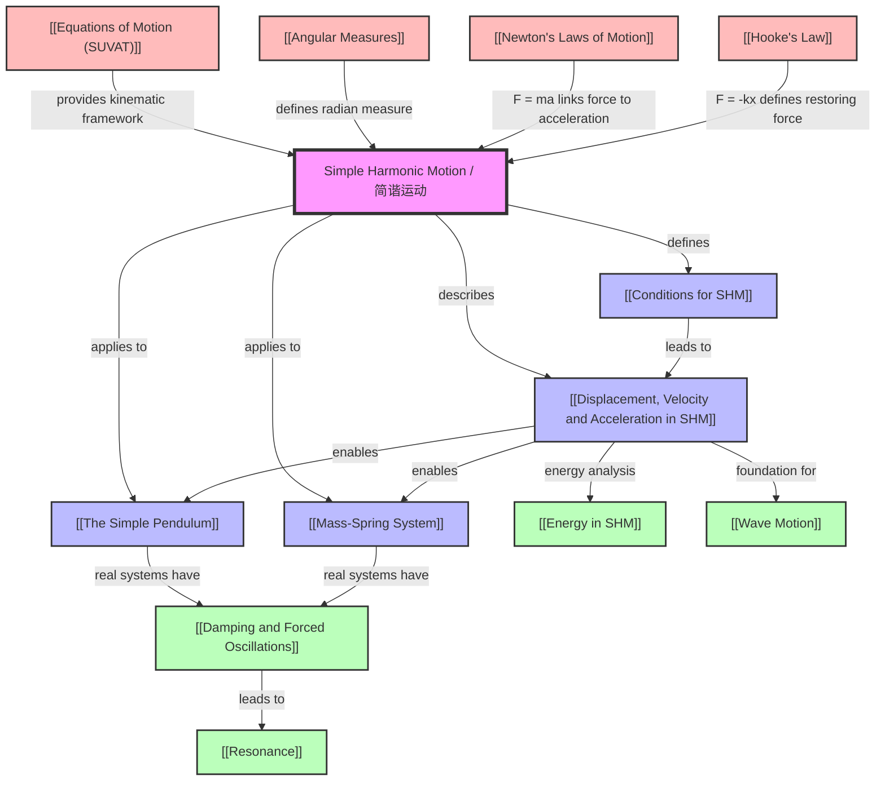

# Simple Harmonic Motion / 简谐运动

---

# 1. Overview / 概述

**English:**
Simple Harmonic Motion (SHM) is a fundamental type of periodic oscillation where the restoring force is directly proportional to the displacement from equilibrium and acts in the opposite direction. This topic forms the cornerstone of wave theory, acoustics, and structural dynamics. In A-Level Physics, SHM bridges mechanics and waves, providing the mathematical framework for understanding everything from pendulum clocks to earthquake-resistant buildings.

Real-world applications include:
- **Timekeeping:** Pendulum clocks and quartz watches rely on SHM principles.
- **Seismology:** Earthquake vibrations are modeled as SHM.
- **Acoustics:** Sound waves are produced by SHM of air molecules.
- **Engineering:** Suspension bridges and car shock absorbers use damped SHM.

In Cambridge 9702 (Topic 17.1 a-d) and Edexcel IAL (Unit 4: 7.1-7.5), SHM is assessed through:
- Defining conditions for SHM
- Deriving and applying equations for displacement, velocity, and acceleration
- Analyzing energy transformations
- Solving problems involving [[The Simple Pendulum]] and [[Mass-Spring System]]

**中文：**
简谐运动（SHM）是一种基本的周期性振荡类型，其中恢复力与位移成正比且方向相反。该主题构成了波理论、声学和结构力学的基石。在A-Level物理中，SHM连接了力学和波，为理解从摆钟到抗震建筑的一切提供了数学框架。

实际应用包括：
- **计时：** 摆钟和石英表依赖SHM原理。
- **地震学：** 地震振动被建模为SHM。
- **声学：** 声波由空气分子的SHM产生。
- **工程学：** 悬索桥和汽车减震器使用阻尼SHM。

在剑桥9702（主题17.1 a-d）和爱德思IAL（单元4：7.1-7.5）中，SHM通过以下方式评估：
- 定义SHM的条件
- 推导和应用位移、速度和加速度方程
- 分析能量转换
- 解决涉及[[The Simple Pendulum]]和[[Mass-Spring System]]的问题

---

# 2. Syllabus Learning Objectives / 考纲学习目标

| CAIE 9702 (17.1 a-d) | Edexcel IAL (WPH14 U4: 7.1-7.5) |
|-----------------------|----------------------------------|
| 17.1(a) Describe simple examples of free oscillations (e.g., mass-spring system, simple pendulum) | 7.1 Understand the conditions for simple harmonic motion (SHM) |
| 17.1(b) Define and use the terms displacement, amplitude, period, frequency, angular frequency, and phase difference | 7.2 Understand and use the equations for displacement, velocity, and acceleration in SHM |
| 17.1(c) Derive and use the equation $a = -\omega^2 x$ | 7.3 Understand and use the relationship $T = 2\pi \sqrt{\frac{m}{k}}$ for a mass-spring system |
| 17.1(d) Solve problems using equations for displacement, velocity, and acceleration in SHM | 7.4 Understand and use the relationship $T = 2\pi \sqrt{\frac{l}{g}}$ for a simple pendulum |
| — | 7.5 Understand and use the equations for energy in SHM |

**Examiner Expectations / 考官期望:**

**English:**
- Candidates must be able to **derive** $a = -\omega^2 x$ from the definition of SHM.
- Candidates must **distinguish** between free and forced oscillations.
- Candidates must **apply** SHM equations to both [[The Simple Pendulum]] and [[Mass-Spring System]].
- Candidates must **interpret** graphs of displacement, velocity, and acceleration against time.
- Candidates must **calculate** energy changes using $E = \frac{1}{2}m\omega^2(A^2 - x^2)$.

**中文：**
- 考生必须能够从SHM定义**推导**出 $a = -\omega^2 x$。
- 考生必须**区分**自由振荡和受迫振荡。
- 考生必须将SHM方程**应用**于[[The Simple Pendulum]]和[[Mass-Spring System]]。
- 考生必须**解释**位移、速度和加速度随时间变化的图表。
- 考生必须使用 $E = \frac{1}{2}m\omega^2(A^2 - x^2)$ **计算**能量变化。

> 📋 **CIE Only:** Cambridge requires explicit derivation of $a = -\omega^2 x$ from the definition of SHM. Edexcel does not require this derivation but expects application.
>
> 📋 **Edexcel Only:** Edexcel explicitly lists energy equations in SHM (7.5) as a separate learning objective. Cambridge integrates energy within the broader topic.

---

# 3. Core Definitions / 核心定义

| Term (EN/CN) | Definition (EN) | Definition (CN) | Common Mistakes / 常见错误 |
|--------------|-----------------|-----------------|---------------------------|
| **Simple Harmonic Motion (SHM) / 简谐运动** | A periodic motion where the acceleration is directly proportional to the displacement from equilibrium and directed towards the equilibrium position. | 一种周期性运动，其中加速度与位移成正比，并指向平衡位置。 | Confusing SHM with any periodic motion (e.g., circular motion). SHM requires $a \propto -x$. |
| **Displacement ($x$) / 位移** | The distance from the equilibrium position at any instant. | 任意时刻距平衡位置的距离。 | Confusing displacement with amplitude. Displacement varies with time; amplitude is constant. |
| **Amplitude ($A$) / 振幅** | The maximum displacement from the equilibrium position. | 距平衡位置的最大位移。 | Forgetting that amplitude is always positive. |
| **Period ($T$) / 周期** | The time taken for one complete oscillation. | 完成一次完整振荡所需的时间。 | Confusing period with frequency. $T = 1/f$. |
| **Frequency ($f$) / 频率** | The number of complete oscillations per unit time. | 单位时间内完成的完整振荡次数。 | Using Hz for angular frequency. Frequency is in Hz; angular frequency is in rad s⁻¹. |
| **Angular Frequency ($\omega$) / 角频率** | The rate of change of phase, related to frequency by $\omega = 2\pi f$. | 相位变化率，与频率的关系为 $\omega = 2\pi f$。 | Confusing $\omega$ with angular velocity in circular motion. They are numerically equal but conceptually different. |
| **Phase Difference ($\phi$) / 相位差** | The difference in phase between two oscillating quantities, measured in radians or degrees. | 两个振荡量之间的相位差，以弧度或度为单位。 | Forgetting that phase difference can be expressed as a fraction of $2\pi$. |
| **Equilibrium Position / 平衡位置** | The position where the net force on the oscillating object is zero. | 振荡物体所受合力为零的位置。 | Assuming equilibrium is always at the center of motion. It is the point of zero net force. |
| **Restoring Force / 恢复力** | The force that acts to return the object to the equilibrium position. | 使物体返回平衡位置的力。 | Confusing restoring force with any force. Restoring force must be proportional to displacement. |
| **Free Oscillation / 自由振荡** | Oscillation where no external driving force is applied after the initial displacement. | 初始位移后没有外部驱动力作用的振荡。 | Confusing free oscillation with forced oscillation. Free oscillation has constant amplitude (ideally). |

---

# 4. Key Concepts Explained / 关键概念详解

## 4.1 Conditions for SHM / 简谐运动的条件

### Explanation / 解释
**English:**
For an object to undergo Simple Harmonic Motion, two conditions must be satisfied:
1. **Restoring Force:** The net force acting on the object must be proportional to its displacement from the equilibrium position.
2. **Direction:** The force must always be directed towards the equilibrium position (opposite to displacement).

Mathematically: $F \propto -x$ or $F = -kx$, where $k$ is the force constant.

From Newton's Second Law ($F = ma$), we get:
$$a = -\frac{k}{m}x = -\omega^2 x$$

where $\omega = \sqrt{\frac{k}{m}}$ is the angular frequency.

**中文：**
物体进行简谐运动必须满足两个条件：
1. **恢复力：** 作用在物体上的合力必须与其距平衡位置的位移成正比。
2. **方向：** 力必须始终指向平衡位置（与位移方向相反）。

数学上：$F \propto -x$ 或 $F = -kx$，其中 $k$ 是力常数。

根据牛顿第二定律（$F = ma$），我们得到：
$$a = -\frac{k}{m}x = -\omega^2 x$$

其中 $\omega = \sqrt{\frac{k}{m}}$ 是角频率。

### Physical Meaning / 物理意义
**English:**
The condition $a \propto -x$ means that the acceleration is always directed towards the equilibrium position. When the object is displaced to the right, acceleration is to the left; when displaced to the left, acceleration is to the right. This creates a "restoring" effect that causes oscillation.

**中文：**
条件 $a \propto -x$ 意味着加速度始终指向平衡位置。当物体向右位移时，加速度向左；当向左位移时，加速度向右。这产生了导致振荡的"恢复"效应。

### Common Misconceptions / 常见误区
1. **"All periodic motion is SHM"** — Only if $a \propto -x$. Circular motion has constant acceleration magnitude but direction changes differently.
2. **"The restoring force is constant"** — No, it varies linearly with displacement.
3. **"SHM only occurs in springs"** — Any system with $F \propto -x$ exhibits SHM (pendulums for small angles, vibrating molecules).

### Exam Tips / 考试提示
**English:**
- Cambridge often asks: "State the conditions for SHM" (2 marks).
- Edexcel often asks: "Show that the motion is SHM" by deriving $a = -\omega^2 x$.
- Always mention both proportionality and direction.

**中文：**
- 剑桥常问："陈述SHM的条件"（2分）。
- 爱德思常问："证明运动是SHM"，通过推导 $a = -\omega^2 x$。
- 始终提及比例关系和方向。

> 📷 **IMAGE PROMPT — SHM01: Conditions for SHM Diagram**
>
> A clean diagram showing a mass on a spring at three positions: equilibrium (center), displaced right (force arrow left), displaced left (force arrow right). Use blue arrows for displacement, red arrows for restoring force. Include labels: "Equilibrium Position", "Displacement x", "Restoring Force F = -kx". Minimalist style, white background, suitable for textbook.

---

## 4.2 Displacement, Velocity, and Acceleration in SHM / 简谐运动中的位移、速度和加速度

### Explanation / 解释
**English:**
For an object in SHM starting from maximum displacement (amplitude $A$) at $t = 0$:

**Displacement:**
$$x = A \cos(\omega t)$$

**Velocity:**
$$v = \frac{dx}{dt} = -A\omega \sin(\omega t)$$

**Acceleration:**
$$a = \frac{dv}{dt} = -A\omega^2 \cos(\omega t) = -\omega^2 x$$

If the object starts from equilibrium at $t = 0$, use sine functions:
$$x = A \sin(\omega t)$$
$$v = A\omega \cos(\omega t)$$
$$a = -A\omega^2 \sin(\omega t) = -\omega^2 x$$

**Key relationships:**
- Maximum velocity: $v_{\text{max}} = A\omega$ (at equilibrium)
- Maximum acceleration: $a_{\text{max}} = A\omega^2$ (at maximum displacement)
- Velocity-displacement relationship: $v = \pm \omega \sqrt{A^2 - x^2}$

**中文：**
对于从最大位移（振幅 $A$）在 $t = 0$ 时开始的SHM物体：

**位移：**
$$x = A \cos(\omega t)$$

**速度：**
$$v = \frac{dx}{dt} = -A\omega \sin(\omega t)$$

**加速度：**
$$a = \frac{dv}{dt} = -A\omega^2 \cos(\omega t) = -\omega^2 x$$

如果物体在 $t = 0$ 时从平衡位置开始，使用正弦函数：
$$x = A \sin(\omega t)$$
$$v = A\omega \cos(\omega t)$$
$$a = -A\omega^2 \sin(\omega t) = -\omega^2 x$$

**关键关系：**
- 最大速度：$v_{\text{max}} = A\omega$（在平衡位置）
- 最大加速度：$a_{\text{max}} = A\omega^2$（在最大位移处）
- 速度-位移关系：$v = \pm \omega \sqrt{A^2 - x^2}$

### Physical Meaning / 物理意义
**English:**
- At equilibrium ($x = 0$): Velocity is maximum, acceleration is zero.
- At maximum displacement ($x = \pm A$): Velocity is zero, acceleration is maximum.
- The velocity leads the displacement by $\pi/2$ (90°).
- The acceleration is in anti-phase with displacement (180° out of phase).

**中文：**
- 在平衡位置（$x = 0$）：速度最大，加速度为零。
- 在最大位移处（$x = \pm A$）：速度为零，加速度最大。
- 速度领先位移 $\pi/2$（90°）。
- 加速度与位移反相（相位差180°）。

### Common Misconceptions / 常见误区
1. **"Velocity and acceleration are in phase"** — No, velocity leads displacement by 90°, acceleration is 180° out of phase with displacement.
2. **"Maximum velocity occurs at maximum displacement"** — No, maximum velocity is at equilibrium.
3. **"The equations only work for cosine starting conditions"** — Sine and cosine are both valid; choose based on initial conditions.

### Exam Tips / 考试提示
**English:**
- Cambridge often provides a graph and asks to identify $A$, $T$, and phase relationships.
- Edexcel often asks to calculate $v_{\text{max}}$ or $a_{\text{max}}$ from given data.
- Always check initial conditions before choosing sine or cosine.

**中文：**
- 剑桥常提供图表并要求识别 $A$、$T$ 和相位关系。
- 爱德思常要求从给定数据计算 $v_{\text{max}}$ 或 $a_{\text{max}}$。
- 在选择正弦或余弦前始终检查初始条件。

> 📷 **IMAGE PROMPT — SHM02: Displacement, Velocity, Acceleration Graphs**
>
> Three stacked graphs on the same time axis showing: Top: x = A cos(ωt) (cosine wave), Middle: v = -Aω sin(ωt) (negative sine wave), Bottom: a = -Aω² cos(ωt) (negative cosine wave). Label key points: at t=0, x=A, v=0, a=-Aω²; at t=T/4, x=0, v=-Aω, a=0. Use different colors: blue for displacement, green for velocity, red for acceleration. Include gridlines.

---

## 4.3 Energy in SHM / 简谐运动中的能量

### Explanation / 解释
**English:**
In SHM, energy continuously transforms between kinetic energy (KE) and potential energy (PE).

**Kinetic Energy:**
$$E_k = \frac{1}{2}mv^2 = \frac{1}{2}m\omega^2(A^2 - x^2)$$

**Potential Energy:**
$$E_p = \frac{1}{2}kx^2 = \frac{1}{2}m\omega^2 x^2$$

**Total Mechanical Energy:**
$$E_{\text{total}} = E_k + E_p = \frac{1}{2}m\omega^2 A^2 = \frac{1}{2}kA^2$$

**Key points:**
- Total energy is constant (conservation of mechanical energy).
- At equilibrium ($x = 0$): $E_k = E_{\text{total}}$, $E_p = 0$.
- At maximum displacement ($x = \pm A$): $E_k = 0$, $E_p = E_{\text{total}}$.
- Energy is proportional to $A^2$.

**中文：**
在SHM中，能量在动能（KE）和势能（PE）之间连续转换。

**动能：**
$$E_k = \frac{1}{2}mv^2 = \frac{1}{2}m\omega^2(A^2 - x^2)$$

**势能：**
$$E_p = \frac{1}{2}kx^2 = \frac{1}{2}m\omega^2 x^2$$

**总机械能：**
$$E_{\text{total}} = E_k + E_p = \frac{1}{2}m\omega^2 A^2 = \frac{1}{2}kA^2$$

**关键点：**
- 总能量恒定（机械能守恒）。
- 在平衡位置（$x = 0$）：$E_k = E_{\text{total}}$，$E_p = 0$。
- 在最大位移处（$x = \pm A$）：$E_k = 0$，$E_p = E_{\text{total}}$。
- 能量与 $A^2$ 成正比。

### Physical Meaning / 物理意义
**English:**
The energy transformation in SHM is analogous to a pendulum: at the highest point (maximum displacement), all energy is potential; at the lowest point (equilibrium), all energy is kinetic. The total energy determines the amplitude of oscillation.

**中文：**
SHM中的能量转换类似于摆：在最高点（最大位移处），所有能量都是势能；在最低点（平衡位置），所有能量都是动能。总能量决定了振荡的振幅。

### Common Misconceptions / 常见误区
1. **"Energy is lost during oscillation"** — In ideal SHM, total energy is conserved. Real systems have damping.
2. **"Potential energy is always elastic"** — For pendulums, it's gravitational potential energy.
3. **"Doubling amplitude doubles energy"** — No, energy is proportional to $A^2$, so doubling amplitude quadruples energy.

### Exam Tips / 考试提示
**English:**
- Cambridge often asks to sketch energy vs. displacement graphs.
- Edexcel often asks to calculate energy at a given displacement.
- Remember: $E_k = \frac{1}{2}m\omega^2(A^2 - x^2)$ is derived from $v^2 = \omega^2(A^2 - x^2)$.

**中文：**
- 剑桥常要求绘制能量与位移的关系图。
- 爱德思常要求计算给定位移处的能量。
- 记住：$E_k = \frac{1}{2}m\omega^2(A^2 - x^2)$ 是从 $v^2 = \omega^2(A^2 - x^2)$ 推导出来的。

> 📷 **IMAGE PROMPT — SHM03: Energy in SHM Graph**
>
> A graph with displacement x on the horizontal axis and energy on the vertical axis. Show three curves: Kinetic Energy (green parabola opening downward), Potential Energy (blue parabola opening upward), Total Energy (red horizontal line). The KE and PE curves intersect at x = ±A/√2 where they are equal. Label: "Equilibrium (x=0)", "Max Displacement (x=±A)", "KE = PE at x = ±A/√2". Clean, textbook style.

---

## 4.4 The Simple Pendulum / 单摆

### Explanation / 解释
**English:**
A simple pendulum consists of a point mass suspended from a fixed point by a light, inextensible string. For small angular displacements ($\theta < 10^\circ$ or $\theta < 0.17$ rad), the motion approximates SHM.

**Restoring Force:**
$$F = -mg\sin\theta \approx -mg\theta \quad \text{(for small $\theta$)}$$

Since $\theta = \frac{x}{l}$ (where $x$ is linear displacement and $l$ is pendulum length):
$$F = -\frac{mg}{l}x$$

Comparing with $F = -kx$, we get $k = \frac{mg}{l}$.

**Period:**
$$T = 2\pi \sqrt{\frac{m}{k}} = 2\pi \sqrt{\frac{m}{mg/l}} = 2\pi \sqrt{\frac{l}{g}}$$

**Key points:**
- Period is independent of amplitude (for small angles).
- Period is independent of mass.
- Period depends only on length $l$ and gravitational field strength $g$.

**中文：**
单摆由一个点质量通过轻质、不可伸长的绳子悬挂在固定点上组成。对于小角度位移（$\theta < 10^\circ$ 或 $\theta < 0.17$ 弧度），运动近似为SHM。

**恢复力：**
$$F = -mg\sin\theta \approx -mg\theta \quad \text{（小角度时）}$$

由于 $\theta = \frac{x}{l}$（其中 $x$ 是线性位移，$l$ 是摆长）：
$$F = -\frac{mg}{l}x$$

与 $F = -kx$ 比较，我们得到 $k = \frac{mg}{l}$。

**周期：**
$$T = 2\pi \sqrt{\frac{m}{k}} = 2\pi \sqrt{\frac{m}{mg/l}} = 2\pi \sqrt{\frac{l}{g}}$$

**关键点：**
- 周期与振幅无关（小角度时）。
- 周期与质量无关。
- 周期仅取决于长度 $l$ 和重力场强度 $g$。

### Physical Meaning / 物理意义
**English:**
The pendulum's period depends only on its length and local gravity. This makes pendulums useful for:
- Measuring $g$ (gravitational field strength)
- Timekeeping (pendulum clocks)
- Demonstrating that oscillation period is independent of amplitude

**中文：**
摆的周期仅取决于其长度和当地重力。这使得摆可用于：
- 测量 $g$（重力场强度）
- 计时（摆钟）
- 证明振荡周期与振幅无关

### Common Misconceptions / 常见误区
1. **"The period depends on mass"** — No, mass cancels out in the derivation.
2. **"The formula works for any angle"** — Only for small angles ($\theta < 10^\circ$). For large angles, the period increases.
3. **"The string must be elastic"** — No, it must be inextensible for the derivation to hold.

### Exam Tips / 考试提示
**English:**
- Cambridge often asks to determine $g$ from a $T^2$ vs. $l$ graph.
- Edexcel often asks to compare periods of pendulums with different lengths.
- Remember: The gradient of $T^2$ vs. $l$ is $4\pi^2/g$.

**中文：**
- 剑桥常要求从 $T^2$ 与 $l$ 的图表确定 $g$。
- 爱德思常要求比较不同长度摆的周期。
- 记住：$T^2$ 与 $l$ 图表的斜率为 $4\pi^2/g$。

> 📷 **IMAGE PROMPT — SHM04: Simple Pendulum Diagram**
>
> A simple pendulum showing: fixed support at top, string of length l, bob of mass m at bottom. Show the bob displaced by angle θ from vertical. Include labels: "Length l", "Displacement x", "Angle θ", "Restoring Force F = -mg sin θ". Show the equilibrium position as a dashed vertical line. Clean, educational diagram.

---

## 4.5 Mass-Spring System / 弹簧-质量系统

### Explanation / 解释
**English:**
A mass-spring system consists of a mass attached to a spring that obeys Hooke's Law ($F = -kx$). This is a direct example of SHM.

**Restoring Force:**
$$F = -kx$$

From Newton's Second Law:
$$ma = -kx$$
$$a = -\frac{k}{m}x = -\omega^2 x$$

**Angular Frequency:**
$$\omega = \sqrt{\frac{k}{m}}$$

**Period:**
$$T = 2\pi \sqrt{\frac{m}{k}}$$

**Key points:**
- Period depends on mass $m$ and spring constant $k$.
- Period is independent of amplitude.
- For vertical springs, the equilibrium position shifts due to gravity, but the period formula remains the same.

**中文：**
弹簧-质量系统由连接到遵循胡克定律（$F = -kx$）的弹簧上的质量组成。这是SHM的直接例子。

**恢复力：**
$$F = -kx$$

根据牛顿第二定律：
$$ma = -kx$$
$$a = -\frac{k}{m}x = -\omega^2 x$$

**角频率：**
$$\omega = \sqrt{\frac{k}{m}}$$

**周期：**
$$T = 2\pi \sqrt{\frac{m}{k}}$$

**关键点：**
- 周期取决于质量 $m$ 和弹簧常数 $k$。
- 周期与振幅无关。
- 对于垂直弹簧，平衡位置因重力而移动，但周期公式保持不变。

### Physical Meaning / 物理意义
**English:**
The mass-spring system is the simplest mechanical oscillator. It demonstrates:
- Direct proportionality between force and displacement (Hooke's Law)
- How mass affects inertia (larger mass → slower oscillations)
- How spring stiffness affects frequency (stiffer spring → faster oscillations)

**中文：**
弹簧-质量系统是最简单的机械振荡器。它展示了：
- 力与位移之间的直接比例关系（胡克定律）
- 质量如何影响惯性（质量越大 → 振荡越慢）
- 弹簧刚度如何影响频率（弹簧越硬 → 振荡越快）

### Common Misconceptions / 常见误区
1. **"Vertical and horizontal springs have different periods"** — No, the period formula is the same. Gravity only shifts the equilibrium position.
2. **"Two springs in parallel have the same effective spring constant"** — No, $k_{\text{eff}} = k_1 + k_2$ for parallel.
3. **"The period depends on amplitude"** — No, SHM is isochronous (period independent of amplitude).

### Exam Tips / 考试提示
**English:**
- Cambridge often asks to determine $k$ from a $T^2$ vs. $m$ graph.
- Edexcel often asks to calculate the period for a given mass and spring constant.
- Remember: The gradient of $T^2$ vs. $m$ is $4\pi^2/k$.

**中文：**
- 剑桥常要求从 $T^2$ 与 $m$ 的图表确定 $k$。
- 爱德思常要求计算给定质量和弹簧常数的周期。
- 记住：$T^2$ 与 $m$ 图表的斜率为 $4\pi^2/k$。

> 📷 **IMAGE PROMPT — SHM05: Mass-Spring System Diagram**
>
> Two diagrams side by side: Left: Horizontal mass-spring system on a frictionless surface, showing mass m attached to spring with spring constant k. Right: Vertical mass-spring system, showing mass hanging from spring, with equilibrium position marked. Include labels: "Spring constant k", "Mass m", "Displacement x", "Equilibrium Position". Clean, textbook style.

---

# 5. Essential Equations / 核心公式

## 5.1 Acceleration-Displacement Relationship / 加速度-位移关系

**Equation / 公式:**
$$a = -\omega^2 x$$

**Variables / 变量:**
| Symbol (符号) | Meaning (EN) | Meaning (CN) | Unit (单位) |
|--------------|-------------|-------------|------------|
| $a$ | Acceleration | 加速度 | m s⁻² |
| $\omega$ | Angular frequency | 角频率 | rad s⁻¹ |
| $x$ | Displacement from equilibrium | 距平衡位置的位移 | m |

**Derivation / 推导:**
**English:**
Starting from the definition of SHM: $F \propto -x$, so $F = -kx$.
From Newton's Second Law: $F = ma$.
Therefore: $ma = -kx$, so $a = -\frac{k}{m}x$.
Define $\omega^2 = \frac{k}{m}$, giving $a = -\omega^2 x$.

**中文：**
从SHM的定义开始：$F \propto -x$，所以 $F = -kx$。
根据牛顿第二定律：$F = ma$。
因此：$ma = -kx$，所以 $a = -\frac{k}{m}x$。
定义 $\omega^2 = \frac{k}{m}$，得到 $a = -\omega^2 x$。

**Conditions / 适用条件:**
**English:** Valid for all SHM systems where the restoring force is proportional to displacement.
**中文：** 适用于所有恢复力与位移成正比的SHM系统。

**Limitations / 局限性:**
**English:** Only valid for ideal SHM. Real systems may have damping or non-linear restoring forces.
**中文：** 仅适用于理想SHM。实际系统可能有阻尼或非线性恢复力。

**Rearrangements / 变形:**
$$\omega = \sqrt{-\frac{a}{x}}$$
$$x = -\frac{a}{\omega^2}$$

---

## 5.2 Displacement Equation / 位移方程

**Equation / 公式:**
$$x = A \cos(\omega t) \quad \text{or} \quad x = A \sin(\omega t)$$

**Variables / 变量:**
| Symbol (符号) | Meaning (EN) | Meaning (CN) | Unit (单位) |
|--------------|-------------|-------------|------------|
| $x$ | Displacement | 位移 | m |
| $A$ | Amplitude | 振幅 | m |
| $\omega$ | Angular frequency | 角频率 | rad s⁻¹ |
| $t$ | Time | 时间 | s |

**Derivation / 推导:**
**English:**
The equation $a = -\omega^2 x$ is a second-order differential equation: $\frac{d^2x}{dt^2} = -\omega^2 x$.
The general solution is $x = A \cos(\omega t + \phi)$, where $\phi$ is the phase constant.
For initial conditions $x = A$ at $t = 0$, $\phi = 0$, giving $x = A \cos(\omega t)$.
For initial conditions $x = 0$ at $t = 0$, $\phi = \pi/2$, giving $x = A \sin(\omega t)$.

**中文：**
方程 $a = -\omega^2 x$ 是一个二阶微分方程：$\frac{d^2x}{dt^2} = -\omega^2 x$。
通解为 $x = A \cos(\omega t + \phi)$，其中 $\phi$ 是相位常数。
对于初始条件 $t = 0$ 时 $x = A$，$\phi = 0$，得到 $x = A \cos(\omega t)$。
对于初始条件 $t = 0$ 时 $x = 0$，$\phi = \pi/2$，得到 $x = A \sin(\omega t)$。

**Conditions / 适用条件:**
**English:** Valid for undamped SHM. Choose cosine or sine based on initial conditions.
**中文：** 适用于无阻尼SHM。根据初始条件选择余弦或正弦。

**Limitations / 局限性:**
**English:** Does not account for damping or phase shifts from external forces.
**中文：** 不考虑阻尼或外力引起的相移。

**Rearrangements / 变形:**
$$t = \frac{1}{\omega} \cos^{-1}\left(\frac{x}{A}\right)$$
$$A = \frac{x}{\cos(\omega t)}$$

---

## 5.3 Velocity Equation / 速度方程

**Equation / 公式:**
$$v = -A\omega \sin(\omega t) \quad \text{or} \quad v = A\omega \cos(\omega t)$$
$$v = \pm \omega \sqrt{A^2 - x^2}$$

**Variables / 变量:**
| Symbol (符号) | Meaning (EN) | Meaning (CN) | Unit (单位) |
|--------------|-------------|-------------|------------|
| $v$ | Velocity | 速度 | m s⁻¹ |
| $A$ | Amplitude | 振幅 | m |
| $\omega$ | Angular frequency | 角频率 | rad s⁻¹ |
| $t$ | Time | 时间 | s |
| $x$ | Displacement | 位移 | m |

**Derivation / 推导:**
**English:**
From $x = A \cos(\omega t)$, differentiate: $v = \frac{dx}{dt} = -A\omega \sin(\omega t)$.
Using $\sin^2(\omega t) + \cos^2(\omega t) = 1$:
$\sin(\omega t) = \sqrt{1 - \cos^2(\omega t)} = \sqrt{1 - (x/A)^2}$
Therefore: $v = -A\omega \sqrt{1 - (x/A)^2} = \pm \omega \sqrt{A^2 - x^2}$

**中文：**
从 $x = A \cos(\omega t)$，求导：$v = \frac{dx}{dt} = -A\omega \sin(\omega t)$。
使用 $\sin^2(\omega t) + \cos^2(\omega t) = 1$：
$\sin(\omega t) = \sqrt{1 - \cos^2(\omega t)} = \sqrt{1 - (x/A)^2}$
因此：$v = -A\omega \sqrt{1 - (x/A)^2} = \pm \omega \sqrt{A^2 - x^2}$

**Conditions / 适用条件:**
**English:** Valid for undamped SHM. The $\pm$ indicates direction of motion.
**中文：** 适用于无阻尼SHM。$\pm$ 表示运动方向。

**Limitations / 局限性:**
**English:** Does not account for damping or external forces.
**中文：** 不考虑阻尼或外力。

**Rearrangements / 变形:**
$$v_{\text{max}} = A\omega$$
$$x = \pm \sqrt{A^2 - \frac{v^2}{\omega^2}}$$

---

## 5.4 Period of a Mass-Spring System / 弹簧-质量系统的周期

**Equation / 公式:**
$$T = 2\pi \sqrt{\frac{m}{k}}$$

**Variables / 变量:**
| Symbol (符号) | Meaning (EN) | Meaning (CN) | Unit (单位) |
|--------------|-------------|-------------|------------|
| $T$ | Period | 周期 | s |
| $m$ | Mass | 质量 | kg |
| $k$ | Spring constant | 弹簧常数 | N m⁻¹ |

**Derivation / 推导:**
**English:**
From $a = -\omega^2 x$ and $F = -kx$, we have $\omega^2 = \frac{k}{m}$.
Since $\omega = \frac{2\pi}{T}$, we get $\frac{4\pi^2}{T^2} = \frac{k}{m}$.
Rearranging: $T^2 = \frac{4\pi^2 m}{k}$, so $T = 2\pi \sqrt{\frac{m}{k}}$.

**中文：**
从 $a = -\omega^2 x$ 和 $F = -kx$，我们有 $\omega^2 = \frac{k}{m}$。
由于 $\omega = \frac{2\pi}{T}$，我们得到 $\frac{4\pi^2}{T^2} = \frac{k}{m}$。
整理：$T^2 = \frac{4\pi^2 m}{k}$，所以 $T = 2\pi \sqrt{\frac{m}{k}}$。

**Conditions / 适用条件:**
**English:** Valid for ideal springs obeying Hooke's Law. Mass of spring is negligible.
**中文：** 适用于遵循胡克定律的理想弹簧。弹簧质量可忽略。

**Limitations / 局限性:**
**English:** Does not account for spring mass, damping, or non-linear spring behavior.
**中文：** 不考虑弹簧质量、阻尼或非线性弹簧行为。

**Rearrangements / 变形:**
$$m = \frac{kT^2}{4\pi^2}$$
$$k = \frac{4\pi^2 m}{T^2}$$

---

## 5.5 Period of a Simple Pendulum / 单摆的周期

**Equation / 公式:**
$$T = 2\pi \sqrt{\frac{l}{g}}$$

**Variables / 变量:**
| Symbol (符号) | Meaning (EN) | Meaning (CN) | Unit (单位) |
|--------------|-------------|-------------|------------|
| $T$ | Period | 周期 | s |
| $l$ | Length of pendulum | 摆长 | m |
| $g$ | Gravitational field strength | 重力场强度 | m s⁻² |

**Derivation / 推导:**
**English:**
For small angles, $\sin\theta \approx \theta$, so restoring force $F = -mg\theta = -mg\frac{x}{l}$.
Comparing with $F = -kx$, we get $k = \frac{mg}{l}$.
Using $T = 2\pi \sqrt{\frac{m}{k}} = 2\pi \sqrt{\frac{m}{mg/l}} = 2\pi \sqrt{\frac{l}{g}}$.

**中文：**
对于小角度，$\sin\theta \approx \theta$，所以恢复力 $F = -mg\theta = -mg\frac{x}{l}$。
与 $F = -kx$ 比较，我们得到 $k = \frac{mg}{l}$。
使用 $T = 2\pi \sqrt{\frac{m}{k}} = 2\pi \sqrt{\frac{m}{mg/l}} = 2\pi \sqrt{\frac{l}{g}}$。

**Conditions / 适用条件:**
**English:** Valid for small angular displacements ($\theta < 10^\circ$ or $\theta < 0.17$ rad). String must be light and inextensible.
**中文：** 适用于小角度位移（$\theta < 10^\circ$ 或 $\theta < 0.17$ 弧度）。绳子必须轻且不可伸长。

**Limitations / 局限性:**
**English:** For large angles, the period increases. Does not account for air resistance or string mass.
**中文：** 对于大角度，周期增加。不考虑空气阻力或绳子质量。

**Rearrangements / 变形:**
$$l = \frac{gT^2}{4\pi^2}$$
$$g = \frac{4\pi^2 l}{T^2}$$

---

## 5.6 Energy Equations / 能量方程

**Equations / 公式:**
$$E_k = \frac{1}{2}m\omega^2(A^2 - x^2)$$
$$E_p = \frac{1}{2}m\omega^2 x^2$$
$$E_{\text{total}} = \frac{1}{2}m\omega^2 A^2 = \frac{1}{2}kA^2$$

**Variables / 变量:**
| Symbol (符号) | Meaning (EN) | Meaning (CN) | Unit (单位) |
|--------------|-------------|-------------|------------|
| $E_k$ | Kinetic energy | 动能 | J |
| $E_p$ | Potential energy | 势能 | J |
| $E_{\text{total}}$ | Total mechanical energy | 总机械能 | J |
| $m$ | Mass | 质量 | kg |
| $\omega$ | Angular frequency | 角频率 | rad s⁻¹ |
| $A$ | Amplitude | 振幅 | m |
| $x$ | Displacement | 位移 | m |
| $k$ | Spring constant | 弹簧常数 | N m⁻¹ |

**Derivation / 推导:**
**English:**
From $v^2 = \omega^2(A^2 - x^2)$, kinetic energy is:
$E_k = \frac{1}{2}mv^2 = \frac{1}{2}m\omega^2(A^2 - x^2)$
Potential energy for a spring: $E_p = \frac{1}{2}kx^2 = \frac{1}{2}m\omega^2 x^2$
Total energy: $E_{\text{total}} = E_k + E_p = \frac{1}{2}m\omega^2 A^2$

**中文：**
从 $v^2 = \omega^2(A^2 - x^2)$，动能为：
$E_k = \frac{1}{2}mv^2 = \frac{1}{2}m\omega^2(A^2 - x^2)$
弹簧的势能：$E_p = \frac{1}{2}kx^2 = \frac{1}{2}m\omega^2 x^2$
总能量：$E_{\text{total}} = E_k + E_p = \frac{1}{2}m\omega^2 A^2$

**Conditions / 适用条件:**
**English:** Valid for undamped SHM. Total energy is conserved.
**中文：** 适用于无阻尼SHM。总能量守恒。

**Limitations / 局限性:**
**English:** Does not account for energy loss due to damping or friction.
**中文：** 不考虑阻尼或摩擦导致的能量损失。

**Rearrangements / 变形:**
$$A = \sqrt{\frac{2E_{\text{total}}}{m\omega^2}}$$
$$x = \pm \sqrt{A^2 - \frac{2E_k}{m\omega^2}}$$

---

# 6. Graphs and Relationships / 图表与关系

## 6.1 Displacement-Time Graph / 位移-时间图

### Axes / 坐标轴
**English:** x-axis: Time (t / s), y-axis: Displacement (x / m)
**中文：** x轴：时间（t / s），y轴：位移（x / m）

### Shape / 形状
**English:** Cosine or sine wave depending on initial conditions. For $x = A \cos(\omega t)$, starts at $x = A$ at $t = 0$.
**中文：** 余弦或正弦波，取决于初始条件。对于 $x = A \cos(\omega t)$，在 $t = 0$ 时从 $x = A$ 开始。

### Gradient Meaning / 斜率含义
**English:** The gradient at any point gives the instantaneous velocity.
**中文：** 任意点的斜率给出瞬时速度。

### Area Meaning / 面积含义
**English:** No direct physical meaning for area under displacement-time graph.
**中文：** 位移-时间图下的面积没有直接的物理意义。

### Exam Interpretation / 考试解读
**English:**
- Read amplitude $A$ from maximum y-value.
- Read period $T$ from time between successive peaks.
- Calculate $\omega = 2\pi/T$.
- Identify phase relationships between two oscillators.

**中文：**
- 从最大y值读取振幅 $A$。
- 从连续峰值之间的时间读取周期 $T$。
- 计算 $\omega = 2\pi/T$。
- 识别两个振荡器之间的相位关系。

### Common Questions / 常见问题
**English:**
- "Determine the amplitude and period from the graph."
- "Sketch the velocity-time graph for this displacement-time graph."
- "Find the phase difference between two oscillators."

**中文：**
- "从图表确定振幅和周期。"
- "为此位移-时间图绘制速度-时间图。"
- "找出两个振荡器之间的相位差。"

---

## 6.2 Velocity-Time Graph / 速度-时间图

### Axes / 坐标轴
**English:** x-axis: Time (t / s), y-axis: Velocity (v / m s⁻¹)
**中文：** x轴：时间（t / s），y轴：速度（v / m s⁻¹）

### Shape / 形状
**English:** Sine or cosine wave, phase-shifted by $\pi/2$ relative to displacement. For $x = A \cos(\omega t)$, $v = -A\omega \sin(\omega t)$.
**中文：** 正弦或余弦波，相对于位移相移 $\pi/2$。对于 $x = A \cos(\omega t)$，$v = -A\omega \sin(\omega t)$。

### Gradient Meaning / 斜率含义
**English:** The gradient at any point gives the instantaneous acceleration.
**中文：** 任意点的斜率给出瞬时加速度。

### Area Meaning / 面积含义
**English:** The area under the velocity-time graph gives the change in displacement.
**中文：** 速度-时间图下的面积给出位移的变化。

### Exam Interpretation / 考试解读
**English:**
- Read maximum velocity $v_{\text{max}} = A\omega$.
- Identify when velocity is zero (at maximum displacement).
- Identify when velocity is maximum (at equilibrium).

**中文：**
- 读取最大速度 $v_{\text{max}} = A\omega$。
- 识别速度为零的时刻（在最大位移处）。
- 识别速度最大的时刻（在平衡位置）。

### Common Questions / 常见问题
**English:**
- "Calculate the amplitude from the maximum velocity."
- "Sketch the acceleration-time graph."
- "Find the displacement when velocity is half maximum."

**中文：**
- "从最大速度计算振幅。"
- "绘制加速度-时间图。"
- "找出速度为最大值一半时的位移。"

---

## 6.3 Acceleration-Time Graph / 加速度-时间图

### Axes / 坐标轴
**English:** x-axis: Time (t / s), y-axis: Acceleration (a / m s⁻²)
**中文：** x轴：时间（t / s），y轴：加速度（a / m s⁻²）

### Shape / 形状
**English:** Cosine or sine wave, in anti-phase with displacement. For $x = A \cos(\omega t)$, $a = -A\omega^2 \cos(\omega t)$.
**中文：** 余弦或正弦波，与位移反相。对于 $x = A \cos(\omega t)$，$a = -A\omega^2 \cos(\omega t)$。

### Gradient Meaning / 斜率含义
**English:** The gradient gives the rate of change of acceleration (jerk), not typically examined.
**中文：** 斜率给出加速度的变化率（加加速度），通常不考。

### Area Meaning / 面积含义
**English:** The area under the acceleration-time graph gives the change in velocity.
**中文：** 加速度-时间图下的面积给出速度的变化。

### Exam Interpretation / 考试解读
**English:**
- Read maximum acceleration $a_{\text{max}} = A\omega^2$.
- Verify $a = -\omega^2 x$ relationship.
- Identify when acceleration is zero (at equilibrium).

**中文：**
- 读取最大加速度 $a_{\text{max}} = A\omega^2$。
- 验证 $a = -\omega^2 x$ 关系。
- 识别加速度为零的时刻（在平衡位置）。

### Common Questions / 常见问题
**English:**
- "Calculate the angular frequency from the maximum acceleration."
- "Show that the acceleration is proportional to negative displacement."
- "Determine the phase relationship between acceleration and displacement."

**中文：**
- "从最大加速度计算角频率。"
- "证明加速度与负位移成正比。"
- "确定加速度与位移之间的相位关系。"

---

## 6.4 Energy-Displacement Graph / 能量-位移图

### Axes / 坐标轴
**English:** x-axis: Displacement (x / m), y-axis: Energy (E / J)
**中文：** x轴：位移（x / m），y轴：能量（E / J）

### Shape / 形状
**English:**
- Kinetic Energy: Parabola opening downward, $E_k = \frac{1}{2}m\omega^2(A^2 - x^2)$
- Potential Energy: Parabola opening upward, $E_p = \frac{1}{2}m\omega^2 x^2$
- Total Energy: Horizontal line, $E_{\text{total}} = \frac{1}{2}m\omega^2 A^2$

**中文：**
- 动能：开口向下的抛物线，$E_k = \frac{1}{2}m\omega^2(A^2 - x^2)$
- 势能：开口向上的抛物线，$E_p = \frac{1}{2}m\omega^2 x^2$
- 总能量：水平线，$E_{\text{total}} = \frac{1}{2}m\omega^2 A^2$

### Gradient Meaning / 斜率含义
**English:** The gradient of the potential energy curve gives the negative of the restoring force: $F = -\frac{dE_p}{dx}$.
**中文：** 势能曲线的斜率给出恢复力的负值：$F = -\frac{dE_p}{dx}$。

### Area Meaning / 面积含义
**English:** No direct physical meaning for area under energy-displacement graph.
**中文：** 能量-位移图下的面积没有直接的物理意义。

### Exam Interpretation / 考试解读
**English:**
- At $x = 0$: $E_k$ is maximum, $E_p = 0$.
- At $x = \pm A$: $E_k = 0$, $E_p$ is maximum.
- At $x = \pm A/\sqrt{2}$: $E_k = E_p = E_{\text{total}}/2$.

**中文：**
- 在 $x = 0$ 处：$E_k$ 最大，$E_p = 0$。
- 在 $x = \pm A$ 处：$E_k = 0$，$E_p$ 最大。
- 在 $x = \pm A/\sqrt{2}$ 处：$E_k = E_p = E_{\text{total}}/2$。

### Common Questions / 常见问题
**English:**
- "Sketch the energy-displacement graph for SHM."
- "Find the displacement where kinetic and potential energies are equal."
- "Calculate the total energy from the amplitude and spring constant."

**中文：**
- "绘制SHM的能量-位移图。"
- "找出动能和势能相等时的位移。"
- "从振幅和弹簧常数计算总能量。"

---

## 6.5 $T^2$ vs. $l$ Graph for Pendulum / 摆的 $T^2$ 与 $l$ 关系图

### Axes / 坐标轴
**English:** x-axis: Length (l / m), y-axis: Period squared ($T^2$ / s²)
**中文：** x轴：长度（l / m），y轴：周期平方（$T^2$ / s²）

### Shape / 形状
**English:** Straight line through origin (for small angles).
**中文：** 通过原点的直线（小角度时）。

### Gradient Meaning / 斜率含义
**English:** Gradient $= \frac{4\pi^2}{g}$. Used to determine $g$.
**中文：** 斜率 $= \frac{4\pi^2}{g}$。用于确定 $g$。

### Area Meaning / 面积含义
**English:** No direct physical meaning.
**中文：** 没有直接的物理意义。

### Exam Interpretation / 考试解读
**English:**
- Calculate $g$ from gradient: $g = \frac{4\pi^2}{\text{gradient}}$.
- A non-zero y-intercept indicates systematic error (e.g., string not measured correctly).

**中文：**
- 从斜率计算 $g$：$g = \frac{4\pi^2}{\text{斜率}}$。
- 非零y截距表示系统误差（例如，绳子测量不正确）。

### Common Questions / 常见问题
**English:**
- "Determine the value of $g$ from the graph."
- "Explain why the graph is a straight line through the origin."
- "Calculate the percentage uncertainty in $g$."

**中文：**
- "从图表确定 $g$ 的值。"
- "解释为什么图表是通过原点的直线。"
- "计算 $g$ 的百分比不确定度。"

---

## 6.6 $T^2$ vs. $m$ Graph for Mass-Spring System / 弹簧-质量系统的 $T^2$ 与 $m$ 关系图

### Axes / 坐标轴
**English:** x-axis: Mass (m / kg), y-axis: Period squared ($T^2$ / s²)
**中文：** x轴：质量（m / kg），y轴：周期平方（$T^2$ / s²）

### Shape / 形状
**English:** Straight line through origin.
**中文：** 通过原点的直线。

### Gradient Meaning / 斜率含义
**English:** Gradient $= \frac{4\pi^2}{k}$. Used to determine spring constant $k$.
**中文：** 斜率 $= \frac{4\pi^2}{k}$。用于确定弹簧常数 $k$。

### Area Meaning / 面积含义
**English:** No direct physical meaning.
**中文：** 没有直接的物理意义。

### Exam Interpretation / 考试解读
**English:**
- Calculate $k$ from gradient: $k = \frac{4\pi^2}{\text{gradient}}$.
- A non-zero y-intercept may indicate the effective mass of the spring.

**中文：**
- 从斜率计算 $k$：$k = \frac{4\pi^2}{\text{斜率}}$。
- 非零y截距可能表示弹簧的有效质量。

### Common Questions / 常见问题
**English:**
- "Determine the spring constant from the graph."
- "Explain why the graph is a straight line."
- "Estimate the effective mass of the spring from the intercept."

**中文：**
- "从图表确定弹簧常数。"
- "解释为什么图表是直线。"
- "从截距估计弹簧的有效质量。"

---

# 7. Required Diagrams / 必备图表

## 7.1 Mass-Spring System in SHM / 弹簧-质量系统的简谐运动

### Description / 描述
**English:**
A diagram showing a mass attached to a spring on a frictionless horizontal surface. The mass is shown at three positions: equilibrium (center), maximum displacement to the right, and maximum displacement to the left. Arrows indicate displacement direction (blue) and restoring force direction (red). Labels include spring constant $k$, mass $m$, amplitude $A$, and displacement $x$.

**中文：**
显示在无摩擦水平表面上连接到弹簧的质量的图表。质量显示在三个位置：平衡位置（中心）、向右最大位移和向左最大位移。箭头指示位移方向（蓝色）和恢复力方向（红色）。标签包括弹簧常数 $k$、质量 $m$、振幅 $A$ 和位移 $x$。

### Image Prompt / 图片生成提示
> 📷 **IMAGE PROMPT — SHM06: Mass-Spring System in SHM**
>
> A clean, educational diagram showing a horizontal mass-spring system on a frictionless surface. Three positions of the mass are shown: (1) Center: equilibrium position with mass at rest, (2) Right: mass displaced to +A with blue arrow pointing right labeled "Displacement x" and red arrow pointing left labeled "Restoring Force F = -kx", (3) Left: mass displaced to -A with blue arrow pointing left and red arrow pointing right. The spring is shown as a coil. Labels: "Spring constant k", "Mass m", "Amplitude A", "Equilibrium Position". Minimalist style, white background, suitable for textbook.

### Labels Required / 需要标注
| English | 中文 |
|---------|------|
| Spring constant $k$ | 弹簧常数 $k$ |
| Mass $m$ | 质量 $m$ |
| Amplitude $A$ | 振幅 $A$ |
| Displacement $x$ | 位移 $x$ |
| Restoring Force $F = -kx$ | 恢复力 $F = -kx$ |
| Equilibrium Position | 平衡位置 |

### Exam Importance / 考试重要性
**English:** This diagram is essential for understanding the conditions for SHM. Cambridge and Edexcel both use it to test the relationship between force, displacement, and acceleration.
**中文：** 此图对于理解SHM条件至关重要。剑桥和爱德思都使用它来测试力、位移和加速度之间的关系。

---

## 7.2 Simple Pendulum Diagram / 单摆图

### Description / 描述
**English:**
A diagram showing a simple pendulum with a point mass suspended from a fixed support by a light, inextensible string. The pendulum is shown displaced by a small angle $\theta$ from the vertical. Labels include length $l$, mass $m$, angle $\theta$, displacement $x$, and the restoring force components. The equilibrium position is shown as a dashed vertical line.

**中文：**
显示单摆的图表，点质量通过轻质、不可伸长的绳子从固定支撑悬挂。摆显示为从垂直方向偏移小角度 $\theta$。标签包括长度 $l$、质量 $m$、角度 $\theta$、位移 $x$ 和恢复力分量。平衡位置显示为虚线垂直线。

### Image Prompt / 图片生成提示
> 📷 **IMAGE PROMPT — SHM07: Simple Pendulum Diagram**
>
> A clean, educational diagram of a simple pendulum. A fixed support at the top, a light inextensible string of length l, and a point mass m at the bottom. The pendulum is displaced by a small angle θ from the vertical. Show the equilibrium position as a dashed vertical line. Include labels: "Length l", "Mass m", "Angle θ", "Displacement x = lθ", "Restoring Force F = -mg sin θ ≈ -mgθ". Show the weight mg as a downward arrow, and its components: mg cos θ (along string) and mg sin θ (tangential, restoring). Minimalist style, white background.

### Labels Required / 需要标注
| English | 中文 |
|---------|------|
| Length $l$ | 长度 $l$ |
| Mass $m$ | 质量 $m$ |
| Angle $\theta$ | 角度 $\theta$ |
| Displacement $x = l\theta$ | 位移 $x = l\theta$ |
| Restoring Force $F = -mg\sin\theta$ | 恢复力 $F = -mg\sin\theta$ |
| Equilibrium Position | 平衡位置 |
| Weight $mg$ | 重力 $mg$ |

### Exam Importance / 考试重要性
**English:** This diagram is used to derive the period formula $T = 2\pi\sqrt{l/g}$ and to explain why the motion is approximately SHM for small angles.
**中文：** 此图用于推导周期公式 $T = 2\pi\sqrt{l/g}$，并解释为什么小角度时运动近似为SHM。

---

## 7.3 Displacement, Velocity, and Acceleration Graphs / 位移、速度和加速度图

### Description / 描述
**English:**
Three stacked graphs on the same time axis showing displacement $x = A\cos(\omega t)$, velocity $v = -A\omega\sin(\omega t)$, and acceleration $a = -A\omega^2\cos(\omega t)$. Key points are labeled: at $t=0$, $x=A$, $v=0$, $a=-A\omega^2$; at $t=T/4$, $x=0$, $v=-A\omega$, $a=0$; at $t=T/2$, $x=-A$, $v=0$, $a=A\omega^2$. Different colors are used for each quantity.

**中文：**
在同一时间轴上的三个堆叠图，显示位移 $x = A\cos(\omega t)$、速度 $v = -A\omega\sin(\omega t)$ 和加速度 $a = -A\omega^2\cos(\omega t)$。关键点被标注：在 $t=0$ 时，$x=A$，$v=0$，$a=-A\omega^2$；在 $t=T/4$ 时，$x=0$，$v=-A\omega$，$a=0$；在 $t=T/2$ 时，$x=-A$，$v=0$，$a=A\omega^2$。每个量使用不同颜色。

### Image Prompt / 图片生成提示
> 📷 **IMAGE PROMPT — SHM08: Displacement, Velocity, Acceleration Graphs**
>
> Three stacked graphs on the same time axis (t from 0 to T). Top graph: x = A cos(ωt) in blue, starting at A, crossing zero at T/4, reaching -A at T/2. Middle graph: v = -Aω sin(ωt) in green, starting at 0, reaching -Aω at T/4, crossing zero at T/2. Bottom graph: a = -Aω² cos(ωt) in red, starting at -Aω², crossing zero at T/4, reaching Aω² at T/2. Label key points with dashed vertical lines. Include gridlines. Clean, textbook style.

### Labels Required / 需要标注
| English | 中文 |
|---------|------|
| Displacement $x = A\cos(\omega t)$ | 位移 $x = A\cos(\omega t)$ |
| Velocity $v = -A\omega\sin(\omega t)$ | 速度 $v = -A\omega\sin(\omega t)$ |
| Acceleration $a = -A\omega^2\cos(\omega t)$ | 加速度 $a = -A\omega^2\cos(\omega t)$ |
| Amplitude $A$ | 振幅 $A$ |
| Period $T$ | 周期 $T$ |
| Maximum velocity $A\omega$ | 最大速度 $A\omega$ |
| Maximum acceleration $A\omega^2$ | 最大加速度 $A\omega^2$ |

### Exam Importance / 考试重要性
**English:** These graphs are essential for understanding phase relationships and for solving problems involving initial conditions. Cambridge and Edexcel frequently ask students to sketch or interpret these graphs.
**中文：** 这些图对于理解相位关系和解决涉及初始条件的问题至关重要。剑桥和爱德思经常要求学生绘制或解释这些图。

---

## 7.4 Energy-Displacement Graph / 能量-位移图

### Description / 描述
**English:**
A graph with displacement $x$ on the horizontal axis and energy on the vertical axis. Three curves are shown: Kinetic Energy (green parabola opening downward), Potential Energy (blue parabola opening upward), and Total Energy (red horizontal line). The KE and PE curves intersect at $x = \pm A/\sqrt{2}$ where they are equal. Labels indicate key points.

**中文：**
水平轴为位移 $x$、垂直轴为能量的图表。显示三条曲线：动能（绿色开口向下的抛物线）、势能（蓝色开口向上的抛物线）和总能量（红色水平线）。KE和PE曲线在 $x = \pm A/\sqrt{2}$ 处相交，此时它们相等。标签指示关键点。

### Image Prompt / 图片生成提示
> 📷 **IMAGE PROMPT — SHM09: Energy-Displacement Graph**
>
> A graph with displacement x on the horizontal axis (from -A to +A) and energy E on the vertical axis. Three curves: Kinetic Energy (green, parabola opening downward, maximum at x=0, zero at x=±A), Potential Energy (blue, parabola opening upward, zero at x=0, maximum at x=±A), Total Energy (red, horizontal line at E = ½mω²A²). Mark the intersection points at x = ±A/√2 with dashed vertical lines and label "KE = PE". Label: "Equilibrium (x=0)", "Max Displacement (x=±A)". Clean, textbook style.

### Labels Required / 需要标注
| English | 中文 |
|---------|------|
| Kinetic Energy $E_k = \frac{1}{2}m\omega^2(A^2 - x^2)$ | 动能 $E_k = \frac{1}{2}m\omega^2(A^2 - x^2)$ |
| Potential Energy $E_p = \frac{1}{2}m\omega^2 x^2$ | 势能 $E_p = \frac{1}{2}m\omega^2 x^2$ |
| Total Energy $E_{\text{total}} = \frac{1}{2}m\omega^2 A^2$ | 总能量 $E_{\text{total}} = \frac{1}{2}m\omega^2 A^2$ |
| Equilibrium $x = 0$ | 平衡位置 $x = 0$ |
| Maximum Displacement $x = \pm A$ | 最大位移 $x = \pm A$ |
| $KE = PE$ at $x = \pm A/\sqrt{2}$ | $KE = PE$ 在 $x = \pm A/\sqrt{2}$ 处 |

### Exam Importance / 考试重要性
**English:** This graph tests understanding of energy conservation in SHM. Cambridge and Edexcel often ask students to sketch this graph or calculate energy at specific displacements.
**中文：** 此图测试对SHM中能量守恒的理解。剑桥和爱德思经常要求学生绘制此图或计算特定位移处的能量。

---

# 8. Worked Examples / 典型例题

## Example 1: Mass-Spring System Period Calculation / 弹簧-质量系统周期计算

### Question / 题目
**English:**
A mass of 0.50 kg is attached to a spring with spring constant $k = 80$ N m⁻¹. The mass is displaced 0.050 m from equilibrium and released.

(a) Calculate the period of oscillation.
(b) Calculate the maximum velocity of the mass.
(c) Calculate the velocity when the displacement is 0.030 m.

**中文：**
一个0.50 kg的质量连接到弹簧常数为 $k = 80$ N m⁻¹ 的弹簧上。质量从平衡位置位移0.050 m后释放。

(a) 计算振荡周期。
(b) 计算质量的最大速度。
(c) 计算位移为0.030 m时的速度。

### Solution / 解答

**Part (a): Period / 周期**

**English:**
$$T = 2\pi \sqrt{\frac{m}{k}} = 2\pi \sqrt{\frac{0.50}{80}} = 2\pi \sqrt{0.00625} = 2\pi \times 0.0791 = 0.497 \text{ s}$$

**中文：**
$$T = 2\pi \sqrt{\frac{m}{k}} = 2\pi \sqrt{\frac{0.50}{80}} = 2\pi \sqrt{0.00625} = 2\pi \times 0.0791 = 0.497 \text{ s}$$

**Part (b): Maximum Velocity / 最大速度**

**English:**
First, calculate angular frequency:
$$\omega = \frac{2\pi}{T} = \frac{2\pi}{0.497} = 12.65 \text{ rad s}^{-1}$$

Maximum velocity:
$$v_{\text{max}} = A\omega = 0.050 \times 12.65 = 0.633 \text{ m s}^{-1}$$

**中文：**
首先，计算角频率：
$$\omega = \frac{2\pi}{T} = \frac{2\pi}{0.497} = 12.65 \text{ rad s}^{-1}$$

最大速度：
$$v_{\text{max}} = A\omega = 0.050 \times 12.65 = 0.633 \text{ m s}^{-1}$$

**Part (c): Velocity at Given Displacement / 给定位移处的速度**

**English:**
Using $v = \pm \omega \sqrt{A^2 - x^2}$:
$$v = \pm 12.65 \times \sqrt{0.050^2 - 0.030^2} = \pm 12.65 \times \sqrt{0.0025 - 0.0009}$$
$$v = \pm 12.65 \times \sqrt{0.0016} = \pm 12.65 \times 0.04 = \pm 0.506 \text{ m s}^{-1}$$

The $\pm$ indicates direction; the speed is 0.506 m s⁻¹.

**中文：**
使用 $v = \pm \omega \sqrt{A^2 - x^2}$：
$$v = \pm 12.65 \times \sqrt{0.050^2 - 0.030^2} = \pm 12.65 \times \sqrt{0.0025 - 0.0009}$$
$$v = \pm 12.65 \times \sqrt{0.0016} = \pm 12.65 \times 0.04 = \pm 0.506 \text{ m s}^{-1}$$

$\pm$ 表示方向；速率为0.506 m s⁻¹。

### Final Answer / 最终答案
**Answer:**
(a) $T = 0.50$ s (2 s.f.)
(b) $v_{\text{max}} = 0.63$ m s⁻¹ (2 s.f.)
(c) $v = \pm 0.51$ m s⁻¹ (2 s.f.)

**答案：**
(a) $T = 0.50$ s（2位有效数字）
(b) $v_{\text{max}} = 0.63$ m s⁻¹（2位有效数字）
(c) $v = \pm 0.51$ m s⁻¹（2位有效数字）

### Examiner Notes / 考官点评
**English:**
- Always check units: $k$ in N m⁻¹, $m$ in kg.
- Use consistent significant figures (2 s.f. is appropriate here).
- Remember the $\pm$ sign for velocity indicates direction.
- Common mistake: Using $v = \omega A$ for part (c) instead of $v = \omega \sqrt{A^2 - x^2}$.

**中文：**
- 始终检查单位：$k$ 以 N m⁻¹ 为单位，$m$ 以 kg 为单位。
- 使用一致的有效数字（这里2位有效数字合适）。
- 记住速度的 $\pm$ 符号表示方向。
- 常见错误：在(c)部分使用 $v = \omega A$ 而不是 $v = \omega \sqrt{A^2 - x^2}$。

---

## Example 2: Simple Pendulum — Determining $g$ / 单摆——确定 $g$

### Question / 题目
**English:**
A student investigates the relationship between the period $T$ of a simple pendulum and its length $l$. The following data is obtained:

| Length $l$ / m | Time for 20 oscillations / s |
|----------------|------------------------------|
| 0.200 | 18.0 |
| 0.400 | 25.4 |
| 0.600 | 31.0 |
| 0.800 | 35.8 |
| 1.000 | 40.0 |

(a) Complete the table by calculating the period $T$ and $T^2$ for each length.
(b) Plot a graph of $T^2$ against $l$.
(c) Determine the gradient of the graph and hence calculate the value of $g$.
(d) Suggest one source of error and how it could be reduced.

**中文：**
一名学生研究单摆周期 $T$ 与其长度 $l$ 之间的关系。获得以下数据：

| 长度 $l$ / m | 20次振荡的时间 / s |
|----------------|------------------------------|
| 0.200 | 18.0 |
| 0.400 | 25.4 |
| 0.600 | 31.0 |
| 0.800 | 35.8 |
| 1.000 | 40.0 |

(a) 通过计算每个长度的周期 $T$ 和 $T^2$ 完成表格。
(b) 绘制 $T^2$ 与 $l$ 的关系图。
(c) 确定图表的斜率，并据此计算 $g$ 的值。
(d) 提出一个误差来源以及如何减少它。

### Solution / 解答

**Part (a): Complete the Table / 完成表格**

**English:**
Period $T = \frac{\text{Time for 20 oscillations}}{20}$

| $l$ / m | Time for 20 oscillations / s | $T$ / s | $T^2$ / s² |
|---------|------------------------------|---------|------------|
| 0.200 | 18.0 | 0.900 | 0.810 |
| 0.400 | 25.4 | 1.270 | 1.613 |
| 0.600 | 31.0 | 1.550 | 2.403 |
| 0.800 | 35.8 | 1.790 | 3.204 |
| 1.000 | 40.0 | 2.000 | 4.000 |

**中文：**
周期 $T = \frac{20次振荡的时间}{20}$

| $l$ / m | 20次振荡的时间 / s | $T$ / s | $T^2$ / s² |
|---------|------------------------------|---------|------------|
| 0.200 | 18.0 | 0.900 | 0.810 |
| 0.400 | 25.4 | 1.270 | 1.613 |
| 0.600 | 31.0 | 1.550 | 2.403 |
| 0.800 | 35.8 | 1.790 | 3.204 |
| 1.000 | 40.0 | 2.000 | 4.000 |

**Part (b): Graph / 图表**

**English:**
Plot $T^2$ (y-axis) against $l$ (x-axis). The graph should be a straight line through the origin.

**中文：**
绘制 $T^2$（y轴）与 $l$（x轴）的关系图。图表应为通过原点的直线。

**Part (c): Gradient and $g$ / 斜率和 $g$**

**English:**
Using the first and last points:
$$\text{Gradient} = \frac{4.000 - 0.810}{1.000 - 0.200} = \frac{3.190}{0.800} = 3.988 \text{ s}^2 \text{ m}^{-1}$$

From $T = 2\pi \sqrt{\frac{l}{g}}$, we have $T^2 = \frac{4\pi^2}{g} l$, so gradient $= \frac{4\pi^2}{g}$.

Therefore:
$$g = \frac{4\pi^2}{\text{gradient}} = \frac{4\pi^2}{3.988} = \frac{39.48}{3.988} = 9.90 \text{ m s}^{-2}$$

**中文：**
使用第一个和最后一个点：
$$\text{斜率} = \frac{4.000 - 0.810}{1.000 - 0.200} = \frac{3.190}{0.800} = 3.988 \text{ s}^2 \text{ m}^{-1}$$

从 $T = 2\pi \sqrt{\frac{l}{g}}$，我们有 $T^2 = \frac{4\pi^2}{g} l$，所以斜率 $= \frac{4\pi^2}{g}$。

因此：
$$g = \frac{4\pi^2}{\text{斜率}} = \frac{4\pi^2}{3.988} = \frac{39.48}{3.988} = 9.90 \text{ m s}^{-2}$$

**Part (d): Source of Error / 误差来源**

**English:**
**Source of error:** The angle of release may be too large, causing the small-angle approximation to break down. This increases the period, leading to an overestimate of $T$ and an underestimate of $g$.

**Reduction:** Ensure the angle of release is less than $10^\circ$ (or 0.17 rad). Use a protractor to measure the angle.

**中文：**
**误差来源：** 释放角度可能太大，导致小角度近似失效。这会增加周期，导致 $T$ 被高估，$g$ 被低估。

**减少方法：** 确保释放角度小于 $10^\circ$（或0.17弧度）。使用量角器测量角度。

### Final Answer / 最终答案
**Answer:**
(a) Table completed as above.
(b) Graph: Straight line through origin.
(c) Gradient = 3.99 s² m⁻¹, $g = 9.90$ m s⁻².
(d) Error: Large angle; Reduction: Use angle < 10°.

**答案：**
(a) 表格如上完成。
(b) 图表：通过原点的直线。
(c) 斜率 = 3.99 s² m⁻¹，$g = 9.90$ m s⁻²。
(d) 误差：大角度；减少：使用角度 < 10°。

### Examiner Notes / 考官点评
**English:**
- Always measure time for multiple oscillations to reduce timing errors.
- The gradient method is preferred over using a single point.
- Common mistake: Forgetting to square the period.
- Common mistake: Using $T$ instead of $T^2$ for the graph.

**中文：**
- 始终测量多次振荡的时间以减少计时误差。
- 斜率法优于使用单个点。
- 常见错误：忘记对周期平方。
- 常见错误：在图表中使用 $T$ 而不是 $T^2$。

---

# 9. Past Paper Question Types / 历年真题题型

| Question Type / 题型 | Frequency / 频率 | Difficulty / 难度 | Past Paper References / 真题索引 |
|----------------------|------------------|------------------|-------------------------------|
| Calculation of period, frequency, angular frequency / 周期、频率、角频率计算 | High | Medium | 📝 *待填入* |
| Derivation of $a = -\omega^2 x$ / 推导 $a = -\omega^2 x$ | Medium | High | 📝 *待填入* |
| Graph interpretation (x-t, v-t, a-t) / 图表解读（x-t, v-t, a-t） | High | Medium | 📝 *待填入* |
| Energy calculations / 能量计算 | Medium | Medium | 📝 *待填入* |
| Pendulum experiment — determining $g$ / 摆实验——确定 $g$ | High | Medium | 📝 *待填入* |
| Mass-spring system — determining $k$ / 弹簧-质量系统——确定 $k$ | Medium | Medium | 📝 *待填入* |
| Phase difference questions / 相位差问题 | Low | Medium | 📝 *待填入* |
| Conditions for SHM / SHM的条件 | Medium | Low | 📝 *待填入* |
| Velocity-displacement relationship / 速度-位移关系 | Medium | Medium | 📝 *待填入* |
| Comparison of pendulums and mass-spring systems / 摆与弹簧-质量系统的比较 | Low | High | 📝 *待填入* |

> 📝 **题库整理中 / Question Bank Under Construction:** 具体试卷编号（如 9702/23/M/J/24 Q3）将在后续整理真题后填入上表。

**Common Command Words / 常见指令词:**

| English | 中文 | Typical Usage / 典型用法 |
|---------|------|------------------------|
| State | 陈述 | "State the conditions for SHM" (2 marks) |
| Define | 定义 | "Define the term amplitude" (1 mark) |
| Derive | 推导 | "Derive the equation $a = -\omega^2 x$" (3 marks) |
| Calculate | 计算 | "Calculate the period of oscillation" (3 marks) |
| Determine | 确定 | "Determine the value of $g$ from the graph" (4 marks) |
| Sketch | 绘制 | "Sketch a graph of displacement against time" (2 marks) |
| Explain | 解释 | "Explain why the motion is SHM" (3 marks) |
| Suggest | 建议 | "Suggest one improvement to the experiment" (2 marks) |
| Compare | 比较 | "Compare the motion of a pendulum and a mass-spring system" (4 marks) |

---

# 10. Practical Skills Connections / 实验技能链接

**English:**
Simple Harmonic Motion is extensively tested in practical examinations for both Cambridge and Edexcel.

**CAIE Paper 3 (AS) / Paper 5 (A2):**
- **Paper 3:** Investigating the period of a simple pendulum or mass-spring system.
- **Paper 5:** Designing an experiment to determine $g$ using a pendulum, or to investigate the relationship between period and mass for a spring.

**Edexcel Unit 3 (AS) / Unit 6 (A2):**
- **Unit 3:** Core practical on pendulum oscillations.
- **Unit 6:** Extended investigation on SHM, possibly involving data logging.

**Key Practical Skills / 关键实验技能:**

1. **Measurements / 测量:**
   - Measuring length of pendulum from suspension point to center of bob.
   - Measuring time for multiple oscillations (typically 20) to reduce uncertainty.
   - Measuring mass of bob or spring.

2. **Uncertainties / 不确定度:**
   - Timing uncertainty: $\pm 0.1$ s for manual timing, $\pm 0.01$ s for light gates.
   - Length uncertainty: $\pm 1$ mm for ruler measurements.
   - Percentage uncertainty in $g$: $\frac{\Delta g}{g} = \frac{\Delta l}{l} + 2\frac{\Delta T}{T}$.

3. **Graph Plotting / 图表绘制:**
   - Plot $T^2$ vs. $l$ for pendulum (gradient $= 4\pi^2/g$).
   - Plot $T^2$ vs. $m$ for mass-spring system (gradient $= 4\pi^2/k$).
   - Include error bars and line of best fit.

4. **Experimental Design / 实验设计:**
   - Use small angles ($< 10^\circ$) for pendulum.
   - Ensure spring obeys Hooke's Law (not overstretched).
   - Use light gates or data loggers for precise timing.
   - Repeat measurements and calculate mean.

**中文：**
简谐运动在剑桥和爱德思的实验考试中广泛测试。

**CAIE Paper 3 (AS) / Paper 5 (A2)：**
- **Paper 3：** 研究单摆或弹簧-质量系统的周期。
- **Paper 5：** 设计实验使用摆确定 $g$，或研究周期与质量对弹簧的关系。

**Edexcel Unit 3 (AS) / Unit 6 (A2)：**
- **Unit 3：** 关于摆振荡的核心实践。
- **Unit 6：** 关于SHM的扩展研究，可能涉及数据记录。

**关键实验技能：**

1. **测量：**
   - 测量从悬挂点到摆球中心的摆长。
   - 测量多次振荡的时间（通常20次）以减少不确定度。
   - 测量摆球或弹簧的质量。

2. **不确定度：**
   - 计时不确定度：手动计时 $\pm 0.1$ s，光门 $\pm 0.01$ s。
   - 长度不确定度：尺子测量 $\pm 1$ mm。
   - $g$ 的百分比不确定度：$\frac{\Delta g}{g} = \frac{\Delta l}{l} + 2\frac{\Delta T}{T}$。

3. **图表绘制：**
   - 绘制摆的 $T^2$ 与 $l$ 关系图（斜率 $= 4\pi^2/g$）。
   - 绘制弹簧-质量系统的 $T^2$ 与 $m$ 关系图（斜率 $= 4\pi^2/k$）。
   - 包括误差线和最佳拟合线。

4. **实验设计：**
   - 摆使用小角度（$< 10^\circ$）。
   - 确保弹簧遵循胡克定律（未过度拉伸）。
   - 使用光门或数据记录器进行精确计时。
   - 重复测量并计算平均值。

> 📋 **CIE Only:** Cambridge Paper 5 often requires students to design an experiment from scratch, including identifying variables, describing procedure, and suggesting improvements.
>
> 📋 **Edexcel Only:** Edexcel Unit 6 often involves data logging with light gates and computer analysis of SHM graphs.

---

# 11. Concept Map / 概念图谱

**Concept Map Explanation / 概念图说明:**

**English:**
The concept map shows:
- **Prerequisites (red):** [[Equations of Motion (SUVAT)]], [[Angular Measures]], [[Newton's Laws of Motion]], and [[Hooke's Law]] provide the foundation for understanding SHM.
- **Main Topic (pink):** Simple Harmonic Motion is the central concept.
- **Sub-topics (blue):** [[Conditions for SHM]], [[Displacement, Velocity and Acceleration in SHM]], [[The Simple Pendulum]], and [[Mass-Spring System]] are the key areas covered in this note.
- **Related Topics (green):** [[Energy in SHM]], [[Damping and Forced Oscillations]], [[Resonance]], and [[Wave Motion]] connect SHM to broader physics concepts.

**中文：**
概念图显示：
- **先决条件（红色）：** [[Equations of Motion (SUVAT)]]、[[Angular Measures]]、[[Newton's Laws of Motion]] 和 [[Hooke's Law]] 为理解SHM提供了基础。
- **主要主题（粉色）：** 简谐运动是核心概念。
- **子主题（蓝色）：** [[Conditions for SHM]]、[[Displacement, Velocity and Acceleration in SHM]]、[[The Simple Pendulum]] 和 [[Mass-Spring System]] 是本笔记涵盖的关键领域。
- **相关主题（绿色）：** [[Energy in SHM]]、[[Damping and Forced Oscillations]]、[[Resonance]] 和 [[Wave Motion]] 将SHM连接到更广泛的物理概念。

---

# 12. Quick Revision Sheet / 速查表

| Category / 类别 | Key Points / 要点 |
|----------------|------------------|
| **Definitions / 定义** | **SHM:** Motion where $a \propto -x$ (acceleration proportional to negative displacement).   **Amplitude ($A$):** Maximum displacement from equilibrium.   **Period ($T$):** Time for one complete oscillation.   **Frequency ($f$):** Number of oscillations per second, $f = 1/T$.   **Angular Frequency ($\omega$):** $\omega = 2\pi f = 2\pi/T$. |
| **Equations / 公式** | **Acceleration:** $a = -\omega^2 x$   **Displacement:** $x = A\cos(\omega t)$ or $x = A\sin(\omega t)$   **Velocity:** $v = -A\omega\sin(\omega t)$ or $v = A\omega\cos(\omega t)$   **Velocity-displacement:** $v = \pm \omega \sqrt{A^2 - x^2}$   **Max velocity:** $v_{\text{max}} = A\omega$   **Max acceleration:** $a_{\text{max}} = A\omega^2$   **Mass-spring period:** $T = 2\pi \sqrt{m/k}$   **Pendulum period:** $T = 2\pi \sqrt{l/g}$ |
| **Graphs / 图表** | **x-t:** Cosine/sine wave. Gradient = velocity.   **v-t:** Sine/cosine wave, $\pi/2$ ahead of x. Area = displacement change.   **a-t:** Cosine/sine wave, $\pi$ out of phase with x. Area = velocity change.   **E-x:** KE parabola (down), PE parabola (up), Total Energy horizontal line.   **$T^2$ vs. $l$:** Straight line through origin, gradient $= 4\pi^2/g$.   **$T^2$ vs. $m$:** Straight line through origin, gradient $= 4\pi^2/k$. |
| **Key Facts / 关键事实** | 1. SHM requires $F \propto -x$ (restoring force proportional to displacement).   2. Period is independent of amplitude (isochronous).   3. Pendulum period is independent of mass.   4. Energy is conserved: $E_{\text{total}} = \frac{1}{2}m\omega^2 A^2 = \frac{1}{2}kA^2$.   5. At $x = \pm A/\sqrt{2}$, KE = PE = $E_{\text{total}}/2$.   6. Small-angle approximation ($\theta < 10^\circ$) needed for pendulum SHM. |
| **Exam Reminders / 考试提醒** | ✅ Always check initial conditions before choosing sine or cosine.   ✅ Use $v = \pm \omega \sqrt{A^2 - x^2}$ for velocity at any displacement.   ✅ For pendulum experiments, measure time for 20 oscillations.   ✅ For $g$ determination, plot $T^2$ vs. $l$, not $T$ vs. $l$.   ✅ Remember: $k = m\omega^2$ for mass-spring systems.   ✅ Phase difference: velocity leads displacement by $\pi/2$, acceleration is $\pi$ out of phase with displacement.   ❌ Common mistake: Confusing angular frequency $\omega$ with angular velocity in circular motion.   ❌ Common mistake: Forgetting the negative sign in $a = -\omega^2 x$.   ❌ Common mistake: Using $T = 2\pi \sqrt{l/g}$ for large angles. |

---

> 📝 **Note / 备注:** This knowledge graph node is designed to be the HUB file for Simple Harmonic Motion. It links to leaf nodes [[Conditions for SHM]], [[Displacement, Velocity and Acceleration in SHM]], [[The Simple Pendulum]], and [[Mass-Spring System]] for more detailed coverage of specific sub-topics. Related topics [[Energy in SHM]], [[Damping and Forced Oscillations]], [[Resonance]], and [[Wave Motion]] provide connections to broader physics concepts.