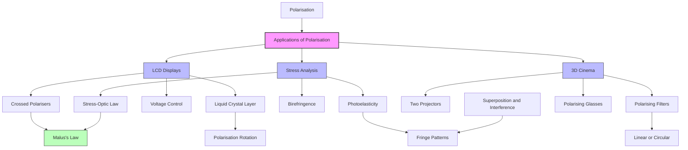

# 1. Overview / 概述

**English:**
This sub-topic explores the practical applications of polarisation in real-world contexts. Building on the understanding of [[What is Polarisation]] and [[Polarisation by Filters (Malus's Law)]], we examine how polarised light is used in technologies such as liquid crystal displays (LCDs), polarising sunglasses, stress analysis in materials, and 3D cinema. Understanding these applications demonstrates the importance of wave theory in modern technology and connects to [[Superposition and Interference]] concepts. This is a key topic for AS-level physics as it bridges theoretical wave properties with practical engineering solutions.

**中文:**
本子知识点探讨偏振在实际世界中的实际应用。在理解[[什么是偏振]]和[[偏振片与马吕斯定律]]的基础上，我们研究偏振光如何用于液晶显示器（LCD）、偏振太阳镜、材料应力分析和3D电影等技术。理解这些应用展示了波动理论在现代技术中的重要性，并与[[叠加与干涉]]概念相联系。这是AS物理的关键主题，因为它将理论波动特性与实际工程解决方案联系起来。

---

# 2. Syllabus Learning Objectives / 考纲学习目标

| CAIE 9702 | Edexcel IAL |
|-----------|-------------|
| 7.2(a) Describe applications of polarisation | 5.6 Understand applications of polarisation |
| 7.2(b) Explain how polarisation is used in liquid crystal displays (LCDs) | 5.7 Explain the use of polarisation in stress analysis |
| 7.2(c) Describe the use of polarisation in stress analysis | 5.8 Describe the use of polarisation in 3D cinema |
| 7.2(d) Explain the use of polarisation in 3D cinema | |

**Examiner Expectations / 考官期望:**
- **English:** Students must be able to describe at least three real-world applications of polarisation, explain the underlying physics principles, and relate them to the wave nature of light. For LCDs, understanding the role of crossed polarisers and liquid crystals is essential. For stress analysis, students should explain how birefringence (double refraction) reveals stress patterns.
- **中文:** 学生必须能够描述至少三种偏振的实际应用，解释其背后的物理原理，并将其与光的波动性质联系起来。对于LCD，理解交叉偏振片和液晶的作用至关重要。对于应力分析，学生应解释双折射如何揭示应力模式。

---

# 3. Core Definitions / 核心定义

| Term (EN/CN) | Definition (EN) | Definition (CN) | Common Mistakes / 常见错误 |
|--------------|-----------------|-----------------|---------------------------|
| **Liquid Crystal Display (LCD)** / 液晶显示器 | A flat-panel display that uses polarised light and liquid crystals to control light transmission through each pixel | 一种使用偏振光和液晶控制每个像素光透射的平板显示器 | Confusing LCD with LED (light-emitting diode) displays |
| **Birefringence** / 双折射 | The property of a material having two different refractive indices for different polarisation directions, causing light to split into two rays | 材料对不同偏振方向具有两个不同折射率的特性，导致光分裂成两束光线 | Thinking birefringence only occurs in crystals (it also occurs in stressed plastics) |
| **Photoelasticity** / 光弹性 | The property of transparent materials that become birefringent when under mechanical stress, revealing stress patterns when viewed through crossed polarisers | 透明材料在机械应力下变得双折射的特性，通过交叉偏振片观察时显示应力模式 | Confusing with piezoelectricity (electric charge generation under stress) |
| **Crossed Polarisers** / 交叉偏振片 | Two polarising filters oriented at 90° to each other, producing maximum extinction of transmitted light | 两个偏振方向相互垂直的偏振片，产生透射光的最大消光 | Forgetting that crossed polarisers transmit no light (ideally) |
| **3D Cinema** / 3D电影 | A cinema system that uses polarised light to present slightly different images to each eye, creating depth perception | 使用偏振光向每只眼睛呈现略有不同图像以产生深度感知的电影系统 | Confusing with anaglyph (red-blue) 3D systems |

---

# 4. Key Concepts Explained / 关键概念详解

## 4.1 Liquid Crystal Displays (LCDs) / 液晶显示器

### Explanation / 解释
**English:** An LCD consists of several layers: a backlight (white light source), a polariser, a liquid crystal layer, another polariser (crossed at 90°), and colour filters. The liquid crystals are rod-shaped molecules that can twist the polarisation direction of light when an electric field is applied. In the "off" state (no voltage), the liquid crystals twist the polarisation by 90°, allowing light to pass through the crossed polarisers. In the "on" state (voltage applied), the liquid crystals align with the field and do not twist the polarisation, so light is blocked by the second polariser. This creates dark and bright pixels. Colour is added using red, green, and blue filters for each sub-pixel.

**中文:** LCD由多个层组成：背光源（白光光源）、偏振片、液晶层、另一个偏振片（交叉90°）和彩色滤光片。液晶是棒状分子，当施加电场时可以扭转光的偏振方向。在"关闭"状态（无电压）下，液晶将偏振方向扭转90°，使光通过交叉偏振片。在"开启"状态（施加电压）下，液晶与电场对齐，不扭转偏振方向，因此光被第二个偏振片阻挡。这产生暗和亮的像素。颜色通过每个子像素的红、绿、蓝滤光片添加。

### Physical Meaning / 物理意义
**English:** The LCD demonstrates how controlling polarisation can switch light transmission on and off at the pixel level. The liquid crystals act as variable wave plates that change the polarisation state based on applied voltage.
**中文:** LCD展示了如何通过控制偏振在像素级别开关光透射。液晶作为可变波片，根据施加电压改变偏振状态。

### Common Misconceptions / 常见误区
- **English:** Students often think LCDs emit light; they actually modulate (block/transmit) light from a backlight.
- **中文:** 学生常认为LCD发光；实际上它们调制（阻挡/透射）来自背光源的光。
- **English:** Some believe liquid crystals are liquids that flow freely; they are actually in a mesophase between liquid and solid.
- **中文:** 有些人认为液晶是自由流动的液体；它们实际上处于液体和固体之间的中间相。

### Exam Tips / 考试提示
- **English:** Draw a clear diagram showing the LCD layers and explain the role of each. Remember to mention that crossed polarisers are used.
- **中文:** 画出清晰的LCD层示意图并解释每层的作用。记得提到使用交叉偏振片。

> 📷 **IMAGE PROMPT — LCD-01: LCD Layer Structure**
> Cross-sectional diagram of an LCD pixel showing backlight, first polariser (vertical), liquid crystal layer (rod-shaped molecules), second polariser (horizontal), and colour filter (red/green/blue). Include labels for each layer and arrows showing light path. Show both "on" (voltage applied, light blocked) and "off" (no voltage, light transmitted) states.

## 4.2 Stress Analysis Using Photoelasticity / 使用光弹性的应力分析

### Explanation / 解释
**English:** When a transparent material (e.g., plastic, glass) is placed under mechanical stress, it becomes birefringent. This means it has two different refractive indices for light polarised parallel and perpendicular to the stress direction. When viewed through crossed polarisers, the stressed material shows coloured fringe patterns. The colours correspond to the magnitude of stress, and the fringe patterns reveal stress distribution. This technique is used in engineering to identify stress concentrations in structures, machine parts, and even bones in medical applications.

**中文:** 当透明材料（如塑料、玻璃）受到机械应力时，它会变得双折射。这意味着它对平行和垂直于应力方向偏振的光具有两个不同的折射率。当通过交叉偏振片观察时，受应力材料显示彩色条纹图案。颜色对应应力大小，条纹图案揭示应力分布。这种技术用于工程中识别结构、机器零件甚至医学中骨骼的应力集中。

### Physical Meaning / 物理意义
**English:** The stress-induced birefringence causes a phase difference between the two polarisation components, leading to interference when recombined. The colours arise from the wavelength dependence of this phase difference.
**中文:** 应力引起的双折射导致两个偏振分量之间的相位差，在重新组合时产生干涉。颜色来自这种相位差的波长依赖性。

### Common Misconceptions / 常见误区
- **English:** Students think the colours come from the material itself; they actually result from interference of polarised light.
- **中文:** 学生认为颜色来自材料本身；实际上它们来自偏振光的干涉。
- **English:** Some believe stress analysis only works for metals; it works for transparent materials.
- **中文:** 有些人认为应力分析只适用于金属；它适用于透明材料。

### Exam Tips / 考试提示
- **English:** Explain that crossed polarisers are essential, and the stress causes birefringence which changes the polarisation state.
- **中文:** 解释交叉偏振片是必需的，应力引起双折射，改变偏振状态。

> 📷 **IMAGE PROMPT — STRESS-01: Photoelastic Stress Pattern**
> A transparent plastic model of a beam with a hole under compression, viewed through crossed polarisers. Show colourful fringe patterns (isochromatic fringes) around the hole, with denser fringes indicating higher stress concentration. Include labels: "stress concentration", "fringe order", "crossed polarisers".

## 4.3 3D Cinema / 3D电影

### Explanation / 解释
**English:** In 3D cinema, two projectors project slightly different images (left-eye and right-eye views) onto the screen. Each projector has a polarising filter: one with vertical polarisation, the other with horizontal polarisation (or circular polarisation: left-handed and right-handed). The audience wears glasses with polarising filters: the left lens transmits only the left-eye image (e.g., vertical polarisation), and the right lens transmits only the right-eye image (e.g., horizontal polarisation). The brain combines these two images to create depth perception. Circular polarisation is often preferred because it allows head tilting without losing the 3D effect.

**中文:** 在3D电影中，两台投影机将略有不同的图像（左眼和右眼视图）投射到屏幕上。每台投影机都有一个偏振滤光片：一个垂直偏振，另一个水平偏振（或圆偏振：左旋和右旋）。观众佩戴带有偏振滤光片的眼镜：左镜片只透射左眼图像（如垂直偏振），右镜片只透射右眼图像（如水平偏振）。大脑结合这两个图像产生深度感知。圆偏振通常更受欢迎，因为它允许头部倾斜而不失去3D效果。

### Physical Meaning / 物理意义
**English:** The 3D effect relies on the principle that polarising filters can selectively transmit light of a specific polarisation direction, allowing two different images to be encoded in the same light beam.
**中文:** 3D效果依赖于偏振滤光片可以选择性透射特定偏振方向的光的原理，允许两个不同的图像编码在同一光束中。

### Common Misconceptions / 常见误区
- **English:** Students think 3D cinema uses colour filters like old red-blue glasses; modern 3D uses polarisation.
- **中文:** 学生认为3D电影使用像旧式红蓝眼镜那样的彩色滤光片；现代3D使用偏振。
- **English:** Some believe the screen itself is polarised; the screen is a normal screen that preserves polarisation.
- **中文:** 有些人认为屏幕本身是偏振的；屏幕是保持偏振的普通屏幕。

### Exam Tips / 考试提示
- **English:** Emphasise that the two images are polarised perpendicularly (or with opposite circular polarisation) so each eye sees only its intended image.
- **中文:** 强调两个图像是垂直偏振的（或相反圆偏振），因此每只眼睛只看到其预期的图像。

> 📷 **IMAGE PROMPT — 3D-01: 3D Cinema Polarisation**
> Diagram showing two projectors (left and right) with polarising filters (vertical and horizontal), a screen, and an audience member wearing polarising glasses. Show light rays from each projector to the corresponding eye. Include labels: "left projector (vertical polarisation)", "right projector (horizontal polarisation)", "left lens (vertical)", "right lens (horizontal)".

---

# 5. Essential Equations / 核心公式

## 5.1 Malus's Law (for LCD and 3D Cinema) / 马吕斯定律

$$ I = I_0 \cos^2 \theta $$

| Symbol (符号) | Meaning (EN) | Meaning (CN) | Unit (单位) |
|--------------|-------------|-------------|------------|
| $I$ | Transmitted intensity | 透射强度 | W m⁻² |
| $I_0$ | Incident intensity | 入射强度 | W m⁻² |
| $\theta$ | Angle between polariser axes | 偏振片轴之间的角度 | degrees or radians |

**Derivation / 推导:** From the component of the electric field vector along the transmission axis: $E = E_0 \cos \theta$, and intensity $\propto E^2$, so $I = I_0 \cos^2 \theta$.

**Conditions / 适用条件:**
- **English:** Only applies to ideal polarisers; assumes incident light is already plane-polarised.
- **中文:** 仅适用于理想偏振片；假设入射光已经是平面偏振光。

**Limitations / 局限性:**
- **English:** Does not account for absorption losses in real polarisers; assumes perfect transmission when $\theta = 0°$.
- **中文:** 不考虑实际偏振片中的吸收损失；假设 $\theta = 0°$ 时完美透射。

## 5.2 Stress-Optic Law (for Photoelasticity) / 应力-光学定律

$$ \Delta n = C \sigma $$

| Symbol (符号) | Meaning (EN) | Meaning (CN) | Unit (单位) |
|--------------|-------------|-------------|------------|
| $\Delta n$ | Change in refractive index (birefringence) | 折射率变化（双折射） | dimensionless |
| $C$ | Stress-optic coefficient | 应力-光学系数 | m² N⁻¹ |
| $\sigma$ | Mechanical stress | 机械应力 | Pa (N m⁻²) |

**Derivation / 推导:** Empirical relationship; the birefringence is proportional to the applied stress for many transparent materials.

**Conditions / 适用条件:**
- **English:** Valid for linear elastic materials within their elastic limit.
- **中文:** 适用于弹性极限内的线弹性材料。

**Limitations / 局限性:**
- **English:** Only applies to transparent materials; the stress-optic coefficient varies with material and wavelength.
- **中文:** 仅适用于透明材料；应力-光学系数随材料和波长变化。

---

# 6. Graphs and Relationships / 图表与关系

## 6.1 LCD Transmission vs Voltage / LCD透射率与电压关系

### Axes / 坐标轴
- **X-axis:** Applied voltage (V) / 施加电压 (V)
- **Y-axis:** Light transmission (%) / 光透射率 (%)

### Shape / 形状
- **English:** S-shaped curve: high transmission at low voltage (off state), sharp decrease at threshold voltage, low transmission at high voltage (on state).
- **中文:** S形曲线：低电压时高透射率（关闭状态），在阈值电压处急剧下降，高电压时低透射率（开启状态）。

### Gradient Meaning / 斜率含义
- **English:** The steep part of the curve indicates the voltage range where the liquid crystals are reorienting, giving the most sensitive control.
- **中文:** 曲线的陡峭部分表示液晶重新定向的电压范围，提供最灵敏的控制。

### Area Meaning / 面积含义
- **English:** Not typically used for this graph.
- **中文:** 此图通常不使用面积含义。

### Exam Interpretation / 考试解读
- **English:** Students should explain that the threshold voltage is where the liquid crystals begin to align, and the saturation voltage is where they are fully aligned.
- **中文:** 学生应解释阈值电压是液晶开始对齐的地方，饱和电压是它们完全对齐的地方。

---

# 7. Required Diagrams / 必备图表

## 7.1 LCD Pixel Structure / LCD像素结构

### Description / 描述
**English:** A cross-sectional diagram showing the layers of an LCD pixel: backlight, first polariser (vertical), liquid crystal layer, second polariser (horizontal), and colour filter. Show both "on" and "off" states.
**中文:** 显示LCD像素各层的横截面图：背光源、第一偏振片（垂直）、液晶层、第二偏振片（水平）和彩色滤光片。显示"开启"和"关闭"两种状态。

### Image Prompt / 图片生成提示
> 📷 **IMAGE PROMPT — LCD-02: LCD Pixel Cross-Section**
> Detailed cross-section of an LCD pixel showing: backlight (white arrow), first polariser (vertical lines), liquid crystal layer (rod-shaped molecules in twisted and aligned configurations), second polariser (horizontal lines), and RGB colour filter. Include two states: left side "OFF" (no voltage, molecules twisted 90°, light passes through) and right side "ON" (voltage applied, molecules aligned, light blocked). Use arrows to show light path. Labels in English.

### Labels Required / 需要标注
- **English:** Backlight, First polariser (vertical), Liquid crystal layer, Second polariser (horizontal), Colour filter (RGB), Off state (light passes), On state (light blocked)
- **中文:** 背光源、第一偏振片（垂直）、液晶层、第二偏振片（水平）、彩色滤光片（RGB）、关闭状态（光通过）、开启状态（光被阻挡）

### Exam Importance / 考试重要性
- **English:** High — LCDs are a common exam question for applications of polarisation.
- **中文:** 高 — LCD是偏振应用的常见考题。

## 7.2 Photoelastic Stress Analysis Setup / 光弹性应力分析装置

### Description / 描述
**English:** Diagram showing a transparent plastic model placed between crossed polarisers, with a light source and screen. Show the stress-induced fringe pattern.
**中文:** 显示透明塑料模型放置在交叉偏振片之间的图，带有光源和屏幕。显示应力引起的条纹图案。

### Image Prompt / 图片生成提示
> 📷 **IMAGE PROMPT — STRESS-02: Photoelastic Setup**
> Optical bench setup: light source (white), first polariser (vertical), transparent plastic model (with a hole, under compression from a clamp), second polariser (horizontal), and a screen showing colourful fringe patterns. Include labels: "light source", "polariser (vertical)", "plastic model under stress", "analyser (horizontal)", "fringe pattern on screen". Show stress concentration around the hole with denser fringes.

### Labels Required / 需要标注
- **English:** Light source, Polariser (vertical), Plastic model, Stress direction, Analyser (horizontal), Fringe pattern
- **中文:** 光源、偏振片（垂直）、塑料模型、应力方向、分析片（水平）、条纹图案

### Exam Importance / 考试重要性
- **English:** Medium — often appears in questions about stress analysis applications.
- **中文:** 中等 — 常出现在关于应力分析应用的题目中。

---

# 8. Worked Examples / 典型例题

## Example 1: LCD Pixel Operation / LCD像素操作

### Question / 题目
**English:** An LCD pixel uses crossed polarisers. In the "off" state (no voltage), the liquid crystal layer rotates the plane of polarisation by 90°. Explain why the pixel appears bright in the "off" state and dark in the "on" state. Calculate the intensity of light transmitted through the pixel in the "off" state if the incident intensity is $I_0$ and the polarisers are ideal.

**中文:** 一个LCD像素使用交叉偏振片。在"关闭"状态（无电压）下，液晶层将偏振平面旋转90°。解释为什么像素在"关闭"状态下看起来亮，在"开启"状态下暗。如果入射强度为 $I_0$ 且偏振片是理想的，计算"关闭"状态下通过像素的光强度。

### Solution / 解答

**Step 1: Understand the setup / 理解装置**
- First polariser: vertical transmission axis
- Second polariser: horizontal transmission axis (crossed at 90°)
- Liquid crystal layer: rotates polarisation by 90° when no voltage applied

**Step 2: Off state analysis / 关闭状态分析**
- Light enters first polariser: becomes vertically polarised, intensity = $I_0/2$ (assuming unpolarised incident light)
- Liquid crystal rotates polarisation by 90°: light becomes horizontally polarised
- Second polariser (horizontal): transmits horizontally polarised light
- Using Malus's Law: $\theta = 0°$ (polarisation aligned with second polariser)
- $I = (I_0/2) \cos^2(0°) = I_0/2$
- Pixel appears bright

**Step 3: On state analysis / 开启状态分析**
- Light enters first polariser: becomes vertically polarised
- Voltage applied: liquid crystals align, no rotation of polarisation
- Light remains vertically polarised
- Second polariser (horizontal): $\theta = 90°$
- $I = (I_0/2) \cos^2(90°) = 0$
- Pixel appears dark

### Final Answer / 最终答案
**Answer:** In the off state, the transmitted intensity is $I_0/2$, so the pixel appears bright. In the on state, the transmitted intensity is 0, so the pixel appears dark. | **答案：** 在关闭状态下，透射强度为 $I_0/2$，因此像素看起来亮。在开启状态下，透射强度为0，因此像素看起来暗。

### Quick Tip / 提示
- **English:** Remember that the liquid crystal layer acts as a polarisation rotator, not a polariser. It changes the direction of polarisation without significantly reducing intensity.
- **中文:** 记住液晶层作为偏振旋转器，而不是偏振片。它改变偏振方向而不显著降低强度。

## Example 2: 3D Cinema Glasses / 3D电影眼镜

### Question / 题目
**English:** In a 3D cinema, the left projector uses a vertical polarising filter and the right projector uses a horizontal polarising filter. Explain why the audience's glasses must have a vertical polariser for the left eye and a horizontal polariser for the right eye. What happens if a viewer tilts their head by 45°?

**中文:** 在3D电影中，左投影机使用垂直偏振滤光片，右投影机使用水平偏振滤光片。解释为什么观众的眼镜左眼必须有垂直偏振片，右眼必须有水平偏振片。如果观众将头倾斜45°会发生什么？

### Solution / 解答

**Step 1: Normal viewing / 正常观看**
- Left projector: vertical polarisation → left lens (vertical) transmits → left eye sees left image
- Right projector: horizontal polarisation → right lens (horizontal) transmits → right eye sees right image
- Brain combines images → 3D effect

**Step 2: Head tilt analysis / 头部倾斜分析**
- If viewer tilts head by 45°, the polarisers in glasses also tilt by 45°
- Left lens now at 45° to vertical: transmits some of both left and right images
- Right lens also at 45° to horizontal: transmits some of both images
- Result: crosstalk (ghosting) — each eye sees a mixture of both images
- 3D effect is degraded or lost

**Step 3: Mathematical analysis / 数学分析**
- Using Malus's Law for left lens: $I_{\text{left}} = I_0 \cos^2(45°) = 0.5 I_0$ (from left projector)
- But also: $I_{\text{right}} = I_0 \cos^2(45°) = 0.5 I_0$ (from right projector)
- Each eye sees equal amounts from both projectors → no 3D effect

### Final Answer / 最终答案
**Answer:** The glasses must have matching polarisers to ensure each eye sees only its intended image. Tilting the head by 45° causes crosstalk, where each eye sees a mixture of both images, destroying the 3D effect. | **答案：** 眼镜必须有匹配的偏振片，以确保每只眼睛只看到其预期的图像。将头倾斜45°会导致串扰，每只眼睛看到两个图像的混合，破坏3D效果。

### Quick Tip / 提示
- **English:** This is why many modern 3D cinemas use circular polarisation — it is less sensitive to head tilting.
- **中文:** 这就是为什么许多现代3D电影院使用圆偏振——它对头部倾斜不太敏感。

---

# 9. Past Paper Question Types / 历年真题题型

| Question Type / 题型 | Frequency / 频率 | Difficulty / 难度 | Past Paper References / 真题索引 |
|----------------------|------------------|------------------|-------------------------------|
| Explain LCD operation | High | Medium | 📝 *待填入* |
| Describe photoelastic stress analysis | Medium | Medium | 📝 *待填入* |
| Explain 3D cinema polarisation | Medium | Low | 📝 *待填入* |
| Calculate intensity using Malus's Law | High | Medium | 📝 *待填入* |
| Compare linear vs circular polarisation in 3D | Low | High | 📝 *待填入* |

**Common Command Words / 常见指令词:**
- **English:** Describe, Explain, Calculate, State, Suggest
- **中文:** 描述、解释、计算、陈述、建议

---

# 10. Practical Skills Connections / 实验技能链接

**English:**
This sub-topic connects to practical skills in several ways:
1. **Polarisation experiments:** Using polarising filters to demonstrate Malus's Law and verify the $\cos^2 \theta$ relationship.
2. **Stress analysis demonstration:** Using a transparent plastic ruler or CD case between crossed polarisers to show stress-induced birefringence.
3. **3D glasses investigation:** Testing polarising glasses with a polarising filter to verify their transmission axes.
4. **Measurements:** Measuring intensity using a light sensor and data logger to plot $I$ vs $\cos^2 \theta$ graphs.
5. **Uncertainties:** Estimating uncertainties in angle measurements and intensity readings.

**中文:**
本子知识点通过多种方式与实验技能联系：
1. **偏振实验：** 使用偏振滤光片演示马吕斯定律并验证 $\cos^2 \theta$ 关系。
2. **应力分析演示：** 在交叉偏振片之间使用透明塑料尺或CD盒显示应力引起的双折射。
3. **3D眼镜调查：** 用偏振滤光片测试偏振眼镜以验证其透射轴。
4. **测量：** 使用光传感器和数据记录器测量强度，绘制 $I$ 对 $\cos^2 \theta$ 的图表。
5. **不确定度：** 估计角度测量和强度读数的不确定度。

---

# 11. Concept Map / 概念图谱

---

# 12. Quick Revision Sheet / 速查表

| Category / 类别 | Key Points / 要点 |
|----------------|------------------|
| **Definition / 定义** | Polarisation applications use the wave property of light to control transmission, analyse stress, and create 3D effects |
| **Key Formula / 核心公式** | Malus's Law: $I = I_0 \cos^2 \theta$; Stress-Optic Law: $\Delta n = C\sigma$ |
| **Key Diagram / 核心图表** | LCD layer structure (backlight → polariser → liquid crystal → polariser → colour filter) |
| **LCD Operation / LCD操作** | Off state: liquid crystals rotate polarisation 90° → light passes through crossed polarisers → bright pixel. On state: voltage aligns crystals → no rotation → light blocked → dark pixel |
| **Stress Analysis / 应力分析** | Transparent material under stress becomes birefringent → viewed through crossed polarisers → coloured fringe patterns reveal stress distribution |
| **3D Cinema / 3D电影** | Two projectors with perpendicular polarisation filters → glasses with matching filters → each eye sees different image → brain creates depth perception |
| **Common Exam Question / 常见考题** | "Explain how an LCD pixel works" or "Describe how polarisation is used in 3D cinema" |
| **Exam Tip / 考试提示** | Always draw diagrams showing polarisation directions; mention crossed polarisers; explain the role of each component |
| **Practical Connection / 实验联系** | Use polarising filters to demonstrate Malus's Law; use plastic ruler between crossed polarisers to show stress patterns |