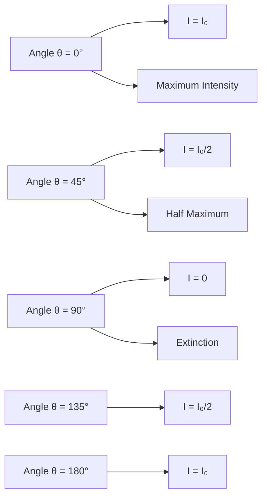
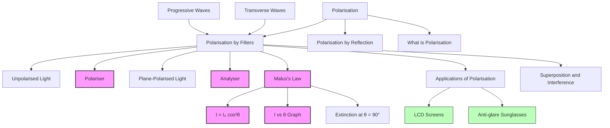

# 1. Overview / 概述

**English:**
This sub-topic explores how polarisation can be achieved using polarising filters (polaroids) and the quantitative relationship known as **Malus's Law**. When unpolarised light passes through a polarising filter, it becomes polarised in a single plane. If this polarised light then encounters a second filter (the analyser), the intensity of the transmitted light depends on the angle between the transmission axes of the two filters. Malus's Law provides the mathematical formula for this relationship: $I = I_0 \cos^2 \theta$.

This is a fundamental concept in [[Polarisation]] because it provides a practical method for controlling light intensity and is the basis for many real-world applications, such as liquid crystal displays (LCDs) and anti-glare sunglasses. Understanding this sub-topic requires a solid grasp of [[Progressive Waves]] and the concept of transverse wave oscillations. It is closely linked to [[Applications of Polarisation]] and provides a foundation for understanding [[Superposition and Interference]] in polarised light.

**中文:**
本子知识点探讨如何利用偏振滤光片（偏振片）实现偏振，以及称为**马吕斯定律**的定量关系。当非偏振光通过偏振滤光片时，它会变成单一平面内的偏振光。如果该偏振光随后遇到第二个滤光片（检偏器），透射光的强度取决于两个滤光片透射轴之间的夹角。马吕斯定律给出了这种关系的数学公式：$I = I_0 \cos^2 \theta$。

这是[[Polarisation]]中的一个基本概念，因为它提供了一种控制光强的实用方法，并且是许多实际应用（如液晶显示器和防眩光太阳镜）的基础。理解本子知识点需要扎实掌握[[Progressive Waves]]和横波振动的概念。它与[[Applications of Polarisation]]密切相关，并为理解偏振光中的[[Superposition and Interference]]奠定了基础。

---

# 2. Syllabus Learning Objectives / 考纲学习目标

| CAIE 9702 | Edexcel IAL |
|-----------|-------------|
| 7.2(a) Describe the effect of a polarising filter on light. | 5.6 Understand the use of a polarising filter to show that light is a transverse wave. |
| 7.2(b) Recall and use Malus's law $I = I_0 \cos^2 \theta$. | 5.7 Understand the terms polariser and analyser. |
| 7.2(c) Explain the terms polariser and analyser. | 5.8 Use Malus's law $I = I_0 \cos^2 \theta$ in calculations. |
| 7.2(d) Calculate the intensity of transmitted light through two polarising filters. | |

**Examiner Expectations / 考官期望:**
- **English:** Students must be able to describe the physical setup of polariser and analyser, recall and apply Malus's Law in calculations, and explain why the intensity varies with angle. They should also understand that Malus's Law only applies when the incident light is already **plane-polarised**.
- **中文:** 学生必须能够描述偏振器和检偏器的物理设置，回忆并在计算中应用马吕斯定律，并解释为什么强度随角度变化。他们还应该理解，马吕斯定律仅适用于入射光已经是**线偏振光**的情况。

---

# 3. Core Definitions / 核心定义

| Term (EN/CN) | Definition (EN) | Definition (CN) | Common Mistakes / 常见错误 |
|--------------|-----------------|-----------------|---------------------------|
| **Polarising Filter (Polaroid)** / 偏振滤光片（偏振片） | A material that transmits only light waves oscillating in one specific plane (the transmission axis). | 一种只允许在特定平面（透射轴）内振动的光波通过的材料。 | Confusing the transmission axis with the direction of wave propagation. The axis is perpendicular to the direction of travel. |
| **Polariser** / 偏振器 | The first polarising filter that converts unpolarised light into plane-polarised light. | 将非偏振光转换为线偏振光的第一个偏振滤光片。 | Thinking the polariser absorbs all light; it only transmits one plane of oscillation. |
| **Analyser** / 检偏器 | The second polarising filter used to detect or analyse the polarisation state of light. | 用于检测或分析光偏振状态的第二个偏振滤光片。 | Forgetting that the analyser also polarises the light that passes through it. |
| **Transmission Axis** / 透射轴 | The direction of the electric field oscillations that are transmitted by a polarising filter. | 偏振滤光片允许通过的电场振动方向。 | Assuming the transmission axis is the direction the light travels; it is perpendicular to it. |
| **Malus's Law** / 马吕斯定律 | The law stating that the intensity $I$ of plane-polarised light transmitted through an analyser is given by $I = I_0 \cos^2 \theta$, where $I_0$ is the maximum transmitted intensity and $\theta$ is the angle between the transmission axes of the polariser and analyser. | 该定律指出，通过检偏器的线偏振光的强度 $I$ 由 $I = I_0 \cos^2 \theta$ 给出，其中 $I_0$ 是最大透射强度，$\theta$ 是偏振器和检偏器透射轴之间的夹角。 | Applying the law to unpolarised light incident on the first polariser. The law only applies to plane-polarised light. |

---

# 4. Key Concepts Explained / 关键概念详解

## 4.1 The Polariser-Analyser Setup / 偏振器-检偏器装置

### Explanation / 解释
**English:**
The classic demonstration of polarisation by filters uses two polarising filters placed in series. The first filter, the **polariser**, takes unpolarised light (which oscillates in all planes perpendicular to the direction of travel) and transmits only the component oscillating parallel to its transmission axis. The light emerging from the polariser is **plane-polarised**.

This plane-polarised light then encounters the second filter, the **analyser**. The analyser only transmits the component of the electric field that is parallel to its own transmission axis. If the analyser's axis is at an angle $\theta$ to the polariser's axis, the transmitted amplitude is $E_0 \cos \theta$. Since intensity is proportional to the square of the amplitude ($I \propto E^2$), the transmitted intensity is $I = I_0 \cos^2 \theta$.

When $\theta = 0^\circ$ (axes parallel), $\cos^2 0 = 1$, so maximum intensity is transmitted. When $\theta = 90^\circ$ (axes crossed), $\cos^2 90 = 0$, so no light is transmitted (extinction). This is a key experiment that proves light is a [[Progressive Waves|transverse wave]].

**中文:**
经典的偏振滤光片演示使用两个串联的偏振滤光片。第一个滤光片，即**偏振器**，接收非偏振光（在所有垂直于传播方向的平面内振动），并仅传输平行于其透射轴的分量。从偏振器射出的光是**线偏振光**。

该线偏振光随后遇到第二个滤光片，即**检偏器**。检偏器仅传输与其自身透射轴平行的电场分量。如果检偏器的轴与偏振器的轴成 $\theta$ 角，则传输的振幅为 $E_0 \cos \theta$。由于强度与振幅的平方成正比（$I \propto E^2$），因此透射强度为 $I = I_0 \cos^2 \theta$。

当 $\theta = 0^\circ$（轴平行）时，$\cos^2 0 = 1$，因此透射最大强度。当 $\theta = 90^\circ$（轴垂直）时，$\cos^2 90 = 0$，因此没有光透射（消光）。这是一个证明光是[[Progressive Waves|横波]]的关键实验。

### Physical Meaning / 物理意义
**English:**
The $\cos^2 \theta$ relationship shows that the intensity of transmitted light is determined by the **component** of the electric field vector that aligns with the analyser's transmission axis. This is a direct consequence of the vector nature of the electric field in an electromagnetic wave. The law demonstrates that polarisation is a continuous phenomenon — intensity varies smoothly from maximum to zero as the angle changes.

**中文:**
$\cos^2 \theta$ 关系表明，透射光的强度由与检偏器透射轴对齐的**电场矢量分量**决定。这是电磁波中电场矢量性质的直接结果。该定律表明偏振是一个连续现象——强度随着角度的变化从最大值平滑地变化到零。

### Common Misconceptions / 常见误区
- **English:**
  - Thinking that Malus's Law applies to unpolarised light incident on the first polariser. (It does not; the intensity after the first polariser is always $I_0/2$ for unpolarised light.)
  - Confusing the angle $\theta$ with the angle of incidence. $\theta$ is the angle between the two transmission axes.
  - Believing that the analyser "creates" polarisation; it only selects a component of the already polarised light.
- **中文:**
  - 认为马吕斯定律适用于入射到第一个偏振器的非偏振光。（不适用；对于非偏振光，第一个偏振器后的强度始终是 $I_0/2$。）
  - 将角度 $\theta$ 与入射角混淆。$\theta$ 是两个透射轴之间的夹角。
  - 认为检偏器“创造”了偏振；它只是从已经偏振的光中选择了一个分量。

### Exam Tips / 考试提示
- **English:**
  - Always state that the intensity after the first polariser is $I_0/2$ when unpolarised light is used.
  - Clearly define $\theta$ as the angle between the transmission axes.
  - Remember that $\cos^2 \theta$ is always between 0 and 1.
  - For multiple filters, apply Malus's Law sequentially.
- **中文:**
  - 当使用非偏振光时，始终说明第一个偏振器后的强度是 $I_0/2$。
  - 明确定义 $\theta$ 为透射轴之间的夹角。
  - 记住 $\cos^2 \theta$ 始终在 0 和 1 之间。
  - 对于多个滤光片，依次应用马吕斯定律。

> 📷 **IMAGE PROMPT — POL-01: Polariser-Analyser Setup**
> A clear diagram showing unpolarised light (with arrows in multiple directions) entering a polarising filter (vertical lines). The light emerging is plane-polarised (single vertical arrow). This light then hits a second filter (analyser) rotated by angle θ. The transmitted light has a smaller amplitude arrow. Label: Polariser, Analyser, Transmission Axes, θ, Unpolarised Light, Plane-Polarised Light.

---

# 5. Essential Equations / 核心公式

## 5.1 Malus's Law / 马吕斯定律

$$ I = I_0 \cos^2 \theta $$

| Symbol (符号) | Meaning (EN) | Meaning (CN) | Unit (单位) |
|--------------|-------------|-------------|------------|
| $I$ | Intensity of light transmitted through the analyser | 通过检偏器的光强度 | W m$^{-2}$ or arbitrary units |
| $I_0$ | Maximum intensity transmitted (when $\theta = 0^\circ$) | 最大透射强度（当 $\theta = 0^\circ$ 时） | W m$^{-2}$ or arbitrary units |
| $\theta$ | Angle between the transmission axes of the polariser and analyser | 偏振器和检偏器透射轴之间的夹角 | degrees (°) or radians (rad) |

**Derivation / 推导:**
- The amplitude of the electric field transmitted through the analyser is $E = E_0 \cos \theta$, where $E_0$ is the amplitude incident on the analyser.
- Since intensity $I \propto E^2$, we have $I \propto (E_0 \cos \theta)^2 = E_0^2 \cos^2 \theta$.
- Therefore, $I = I_0 \cos^2 \theta$, where $I_0 \propto E_0^2$.

**Conditions / 适用条件:**
- **English:** The incident light on the analyser must be **plane-polarised**. The law does not apply to unpolarised or circularly polarised light.
- **中文:** 入射到检偏器的光必须是**线偏振光**。该定律不适用于非偏振光或圆偏振光。

**Limitations / 局限性:**
- **English:** The law assumes ideal polarising filters with perfect transmission along the axis and complete absorption perpendicular to it. Real filters have some imperfections.
- **中文:** 该定律假设理想的偏振滤光片，沿轴完美透射，垂直于轴完全吸收。实际滤光片存在一些缺陷。

## 5.2 Intensity After First Polariser / 第一个偏振器后的强度

$$ I_1 = \frac{I_0}{2} $$

| Symbol (符号) | Meaning (EN) | Meaning (CN) | Unit (单位) |
|--------------|-------------|-------------|------------|
| $I_1$ | Intensity after the first polariser | 第一个偏振器后的强度 | W m$^{-2}$ |
| $I_0$ | Intensity of incident unpolarised light | 入射非偏振光的强度 | W m$^{-2}$ |

**Derivation / 推导:**
- Unpolarised light has equal components in all planes.
- A polariser transmits only one plane, so the average of $\cos^2 \theta$ over all angles is $1/2$.
- Hence, $I_1 = I_0/2$.

**Conditions / 适用条件:**
- **English:** Only applies when the incident light is **unpolarised**.
- **中文:** 仅适用于入射光为**非偏振光**时。

---

# 6. Graphs and Relationships / 图表与关系

## 6.1 Malus's Law Graph / 马吕斯定律图

### Axes / 坐标轴
- **X-axis:** Angle $\theta$ between transmission axes / 透射轴之间的角度 $\theta$ (0° to 360°)
- **Y-axis:** Transmitted intensity $I$ / 透射强度 $I$

### Shape / 形状
- **English:** The graph is a $\cos^2 \theta$ curve. It has maxima at $\theta = 0^\circ, 180^\circ, 360^\circ$ and minima (zero) at $\theta = 90^\circ, 270^\circ$. The curve is symmetric and periodic with a period of 180°.
- **中文:** 该图是一条 $\cos^2 \theta$ 曲线。在 $\theta = 0^\circ, 180^\circ, 360^\circ$ 处有最大值，在 $\theta = 90^\circ, 270^\circ$ 处有最小值（零）。曲线是对称的，周期为 180°。

### Gradient Meaning / 斜率含义
- **English:** The gradient represents the rate of change of intensity with respect to angle. It is steepest near $\theta = 45^\circ, 135^\circ$, etc., and zero at the maxima and minima.
- **中文:** 斜率表示强度随角度的变化率。在 $\theta = 45^\circ, 135^\circ$ 等附近最陡，在最大值和最小值处为零。

### Area Meaning / 面积含义
- **English:** The area under the curve is not typically examined for this graph.
- **中文:** 该图的曲线下面积通常不考。

### Exam Interpretation / 考试解读
- **English:** Be able to sketch this graph from memory. Identify points where intensity is maximum, minimum, and half-maximum. For example, when $\theta = 45^\circ$, $I = I_0 \cos^2 45^\circ = I_0/2$.
- **中文:** 能够凭记忆画出此图。识别强度最大、最小和半最大的点。例如，当 $\theta = 45^\circ$ 时，$I = I_0 \cos^2 45^\circ = I_0/2$。

> 📷 **IMAGE PROMPT — POL-02: Malus's Law Graph**
> A graph of I vs θ from 0° to 360°. The curve is a cos²θ shape with peaks at 0°, 180°, 360° and zeros at 90°, 270°. Label axes: "Angle θ / degrees" and "Transmitted Intensity I". Mark key points: (0°, I₀), (45°, I₀/2), (90°, 0).

---

# 7. Required Diagrams / 必备图表

## 7.1 Polariser and Analyser Setup / 偏振器和检偏器装置

### Description / 描述
- **English:** A diagram showing two polarising filters in series. The first filter (polariser) converts unpolarised light into plane-polarised light. The second filter (analyser) is rotated by an angle θ relative to the polariser. The transmitted light intensity depends on θ.
- **中文:** 显示两个串联偏振滤光片的图。第一个滤光片（偏振器）将非偏振光转换为线偏振光。第二个滤光片（检偏器）相对于偏振器旋转了角度 θ。透射光强度取决于 θ。

### Image Prompt / 图片生成提示
> 📷 **IMAGE PROMPT — POL-03: Polariser-Analyser Detailed Setup**
> A detailed physics diagram. Left side: unpolarised light represented by multiple double-headed arrows in different orientations (vertical, horizontal, diagonal) approaching a vertical polarising filter (shown as a grid of parallel vertical lines). Emerging from the filter: a single vertical double-headed arrow representing plane-polarised light. This light then travels to a second polarising filter (analyser) rotated by 30° (shown as a grid of lines at 30° to vertical). Emerging from the analyser: a shorter double-headed arrow at 30° to vertical. Labels: "Unpolarised Light", "Polariser", "Plane-Polarised Light", "Analyser (rotated by θ)", "Transmitted Light". Add angle θ between the two sets of grid lines.

### Labels Required / 需要标注
- **English:** Unpolarised light, Polariser, Transmission axis of polariser, Plane-polarised light, Analyser, Transmission axis of analyser, Angle θ, Transmitted light.
- **中文:** 非偏振光、偏振器、偏振器透射轴、线偏振光、检偏器、检偏器透射轴、角度 θ、透射光。

### Exam Importance / 考试重要性
- **English:** This diagram is essential for explaining how polarisation by filters works and for setting up Malus's Law calculations. It is frequently used in exam questions.
- **中文:** 此图对于解释滤光片偏振的工作原理以及设置马吕斯定律计算至关重要。它在考试题目中经常使用。

## 7.2 Crossed Polariser and Analyser / 正交偏振器和检偏器

### Description / 描述
- **English:** A diagram showing the polariser and analyser with their transmission axes at 90° to each other. No light is transmitted (extinction). This demonstrates that light is a transverse wave.
- **中文:** 显示偏振器和检偏器的透射轴互成 90° 的图。没有光透射（消光）。这证明光是横波。

### Image Prompt / 图片生成提示
> 📷 **IMAGE PROMPT — POL-04: Crossed Polariser and Analyser**
> A diagram showing two polarising filters. The first filter (polariser) has vertical transmission lines. The second filter (analyser) has horizontal transmission lines. A beam of unpolarised light enters the polariser from the left. Plane-polarised light emerges from the polariser but is completely blocked by the analyser. The region to the right of the analyser is dark. Labels: "Polariser (Vertical Axis)", "Analyser (Horizontal Axis)", "No Light Transmitted (Extinction)".

### Labels Required / 需要标注
- **English:** Polariser (vertical axis), Analyser (horizontal axis), No transmitted light (extinction).
- **中文:** 偏振器（垂直轴）、检偏器（水平轴）、无透射光（消光）。

### Exam Importance / 考试重要性
- **English:** This is a classic demonstration that light is a transverse wave. If light were longitudinal, rotating the analyser would have no effect.
- **中文:** 这是一个证明光是横波的经典演示。如果光是纵波，旋转检偏器将没有效果。

---

# 8. Worked Examples / 典型例题

## Example 1: Basic Malus's Law Calculation / 基础马吕斯定律计算

### Question / 题目
**English:**
Unpolarised light of intensity $I_0 = 100 \, \text{W m}^{-2}$ passes through a polariser and then through an analyser. The transmission axis of the analyser is at $60^\circ$ to that of the polariser. Calculate the intensity of the light transmitted through the analyser.

**中文:**
强度为 $I_0 = 100 \, \text{W m}^{-2}$ 的非偏振光通过一个偏振器，然后通过一个检偏器。检偏器的透射轴与偏振器的透射轴成 $60^\circ$ 角。计算通过检偏器透射的光强度。

### Solution / 解答
**Step 1: Intensity after the polariser / 第一步：偏振器后的强度**
- **English:** Unpolarised light incident on the polariser. The intensity after the polariser is half the incident intensity.
  $$ I_{\text{polariser}} = \frac{I_0}{2} = \frac{100}{2} = 50 \, \text{W m}^{-2} $$
- **中文:** 非偏振光入射到偏振器上。偏振器后的强度是入射强度的一半。
  $$ I_{\text{偏振器}} = \frac{I_0}{2} = \frac{100}{2} = 50 \, \text{W m}^{-2} $$

**Step 2: Apply Malus's Law / 第二步：应用马吕斯定律**
- **English:** The light incident on the analyser is plane-polarised with intensity $I_{\text{polariser}} = 50 \, \text{W m}^{-2}$. This is the $I_0$ in Malus's Law. The angle $\theta = 60^\circ$.
  $$ I = I_0 \cos^2 \theta = 50 \times \cos^2(60^\circ) $$
  $$ \cos(60^\circ) = 0.5 $$
  $$ I = 50 \times (0.5)^2 = 50 \times 0.25 = 12.5 \, \text{W m}^{-2} $$
- **中文:** 入射到检偏器的光是线偏振光，强度为 $I_{\text{偏振器}} = 50 \, \text{W m}^{-2}$。这是马吕斯定律中的 $I_0$。角度 $\theta = 60^\circ$。
  $$ I = I_0 \cos^2 \theta = 50 \times \cos^2(60^\circ) $$
  $$ \cos(60^\circ) = 0.5 $$
  $$ I = 50 \times (0.5)^2 = 50 \times 0.25 = 12.5 \, \text{W m}^{-2} $$

### Final Answer / 最终答案
**Answer:** $12.5 \, \text{W m}^{-2}$ | **答案：** $12.5 \, \text{W m}^{-2}$

### Quick Tip / 提示
- **English:** Always halve the intensity for unpolarised light before applying Malus's Law. The $I_0$ in Malus's Law is the intensity of the plane-polarised light incident on the analyser, not the original unpolarised intensity.
- **中文:** 在应用马吕斯定律之前，始终将非偏振光的强度减半。马吕斯定律中的 $I_0$ 是入射到检偏器的线偏振光的强度，而不是原始的非偏振光强度。

## Example 2: Finding the Angle / 求角度

### Question / 题目
**English:**
Plane-polarised light of intensity $I_0 = 80 \, \text{W m}^{-2}$ is incident on an analyser. The transmitted intensity is $20 \, \text{W m}^{-2}$. Calculate the angle between the transmission axes of the polariser and analyser.

**中文:**
强度为 $I_0 = 80 \, \text{W m}^{-2}$ 的线偏振光入射到检偏器上。透射强度为 $20 \, \text{W m}^{-2}$。计算偏振器和检偏器透射轴之间的夹角。

### Solution / 解答
**Step 1: Apply Malus's Law / 第一步：应用马吕斯定律**
- **English:** Use $I = I_0 \cos^2 \theta$. Rearrange to find $\theta$.
  $$ 20 = 80 \cos^2 \theta $$
  $$ \cos^2 \theta = \frac{20}{80} = 0.25 $$
  $$ \cos \theta = \sqrt{0.25} = 0.5 $$
  $$ \theta = \cos^{-1}(0.5) = 60^\circ $$
- **中文:** 使用 $I = I_0 \cos^2 \theta$。重新排列求 $\theta$。
  $$ 20 = 80 \cos^2 \theta $$
  $$ \cos^2 \theta = \frac{20}{80} = 0.25 $$
  $$ \cos \theta = \sqrt{0.25} = 0.5 $$
  $$ \theta = \cos^{-1}(0.5) = 60^\circ $$

### Final Answer / 最终答案
**Answer:** $60^\circ$ | **答案：** $60^\circ$

### Quick Tip / 提示
- **English:** When solving for $\theta$, take the positive square root of $\cos^2 \theta$ first. The angle is always between $0^\circ$ and $90^\circ$ in standard problems.
- **中文:** 在求解 $\theta$ 时，先取 $\cos^2 \theta$ 的正平方根。在标准问题中，角度始终在 $0^\circ$ 和 $90^\circ$ 之间。

---

# 9. Past Paper Question Types / 历年真题题型

| Question Type / 题型 | Frequency / 频率 | Difficulty / 难度 | Past Paper References / 真题索引 |
|----------------------|------------------|------------------|-------------------------------|
| Calculate transmitted intensity through two filters | Very High | Easy-Medium | 📝 *待填入* |
| Find the angle between transmission axes | High | Medium | 📝 *待填入* |
| Explain why intensity varies with angle | Medium | Medium | 📝 *待填入* |
| Multiple filters (three or more) | Low | Hard | 📝 *待填入* |
| Graph sketching (I vs θ) | Medium | Medium | 📝 *待填入* |

**Common Command Words / 常见指令词:**
- **English:** Calculate, Determine, Show that, Explain, Sketch, State
- **中文:** 计算、确定、证明、解释、画出、陈述

---

# 10. Practical Skills Connections / 实验技能链接

**English:**
This sub-topic connects to practical work in several ways:

1. **Measurements:** Using a light sensor (e.g., photodiode or LDR) to measure the intensity of light transmitted through two polarising filters as the analyser is rotated. The angle is measured using a protractor or rotary motion sensor.

2. **Uncertainties:** The angle measurement has an uncertainty (typically ±1°). The intensity measurement has an uncertainty from the light sensor. Students should be able to calculate the percentage uncertainty in $\cos^2 \theta$ and the final intensity.

3. **Graph Plotting:** Plotting a graph of transmitted intensity $I$ against $\cos^2 \theta$ should yield a straight line through the origin, confirming Malus's Law. The gradient gives $I_0$.

4. **Experimental Design:** To verify Malus's Law, use a laser (which is already polarised) or a lamp with a polariser. Rotate the analyser in steps (e.g., 10°) and record the intensity. Ensure the room is dark to avoid background light.

5. **Control Variables:** Keep the distance between the filters and the light source constant to avoid changes in intensity due to the inverse square law.

**中文:**
本子知识点通过以下几种方式与实验工作相关联：

1. **测量：** 使用光传感器（例如光电二极管或光敏电阻）测量当检偏器旋转时通过两个偏振滤光片的光强度。使用量角器或旋转运动传感器测量角度。

2. **不确定度：** 角度测量有不确定度（通常为 ±1°）。强度测量有来自光传感器的不确定度。学生应能够计算 $\cos^2 \theta$ 和最终强度的百分比不确定度。

3. **绘图：** 绘制透射强度 $I$ 对 $\cos^2 \theta$ 的图应产生一条通过原点的直线，从而验证马吕斯定律。斜率给出 $I_0$。

4. **实验设计：** 为了验证马吕斯定律，使用激光（已经偏振）或带偏振器的灯。逐步旋转检偏器（例如，每步 10°）并记录强度。确保房间黑暗以避免背景光。

5. **控制变量：** 保持滤光片和光源之间的距离恒定，以避免由于平方反比定律导致的强度变化。

---

# 11. Concept Map / 概念图谱

---

# 12. Quick Revision Sheet / 速查表

| Category / 类别 | Key Points / 要点 |
|----------------|------------------|
| **Definition / 定义** | Polarisation by filters uses a polariser to create plane-polarised light and an analyser to detect it. / 滤光片偏振使用偏振器产生线偏振光，用检偏器检测它。 |
| **Key Formula / 核心公式** | $I = I_0 \cos^2 \theta$ (Malus's Law) — applies to plane-polarised light incident on analyser. / 适用于入射到检偏器的线偏振光。 |
| **Key Formula 2 / 核心公式 2** | $I_1 = I_0/2$ — intensity after first polariser for unpolarised light. / 非偏振光通过第一个偏振器后的强度。 |
| **Key Graph / 核心图表** | $I$ vs $\theta$: $\cos^2 \theta$ curve. Max at $0^\circ, 180^\circ$; zero at $90^\circ, 270^\circ$. / $I$ 对 $\theta$ 图：$\cos^2 \theta$ 曲线。在 $0^\circ, 180^\circ$ 处最大；在 $90^\circ, 270^\circ$ 处为零。 |
| **Key Angle / 关键角度** | $\theta = 0^\circ$: maximum transmission. $\theta = 90^\circ$: extinction (no light). / $\theta = 0^\circ$：最大透射。$\theta = 90^\circ$：消光（无光）。 |
| **Exam Tip / 考试提示** | Always halve intensity for unpolarised light before using Malus's Law. Define $\theta$ clearly. / 在使用马吕斯定律之前，始终将非偏振光的强度减半。明确定义 $\theta$。 |
| **Common Mistake / 常见错误** | Applying Malus's Law to unpolarised light. / 将马吕斯定律应用于非偏振光。 |
| **Practical Link / 实验联系** | Use light sensor + polariser + analyser to verify Malus's Law. Plot $I$ vs $\cos^2 \theta$. / 使用光传感器 + 偏振器 + 检偏器验证马吕斯定律。绘制 $I$ 对 $\cos^2 \theta$ 的图。 |