# 1. Overview / 概述

**English:**
Polarisation is a fundamental property of transverse waves that describes the orientation of their oscillations. Unlike longitudinal waves (such as sound), which oscillate only in the direction of propagation, transverse waves (such as light and electromagnetic waves) can oscillate in multiple directions perpendicular to their direction of travel. Polarisation is the process of restricting these oscillations to a single plane or a specific orientation.

This topic is crucial in A-Level Physics because it provides direct evidence that light is a transverse wave, a concept that was historically debated. It also introduces practical applications that are ubiquitous in modern technology, from reducing glare in sunglasses to enabling 3D cinema and liquid crystal displays (LCDs). In both Cambridge 9702 and Edexcel IAL syllabuses, polarisation is a core component of the waves topic, typically assessed through explanations of the phenomenon, calculations using Malus's Law, and descriptions of real-world applications.

Real-world applications include:
- **Polarising sunglasses:** Reducing glare from reflected sunlight.
- **3D glasses:** Separating images for the left and right eyes.
- **LCD screens:** Controlling light transmission through liquid crystals.
- **Stress analysis in engineering:** Using photoelasticity to visualise stress patterns in transparent materials.
- **Wireless communications:** Using polarised antennas to reduce interference.

**中文:**
偏振是横波的一个基本属性，它描述了波振动方向的特征。与纵波（如声波）不同，纵波只在传播方向上振动，而横波（如光和电磁波）可以在垂直于传播方向的多个方向上振动。偏振是将这些振动限制在单一平面或特定方向上的过程。

这个主题在A-Level物理中至关重要，因为它直接证明了光是横波——这一概念在历史上曾有过争议。它还介绍了在现代技术中无处不在的实际应用，从减少眩光的太阳镜到实现3D电影和液晶显示器。在剑桥9702和爱德思IAL的考纲中，偏振都是波动主题的核心组成部分，通常通过解释现象、使用马吕斯定律进行计算以及描述实际应用来评估。

实际应用包括：
- **偏振太阳镜：** 减少反射阳光的眩光。
- **3D眼镜：** 分离左右眼的图像。
- **液晶显示屏：** 通过液晶控制光传输。
- **工程应力分析：** 使用光弹性法可视化透明材料中的应力模式。
- **无线通信：** 使用偏振天线减少干扰。

---

# 2. Syllabus Learning Objectives / 考纲学习目标

**English:**
The following table maps the specific learning objectives for polarisation from both Cambridge 9702 and Edexcel IAL syllabuses. Examiner expectations are that students can explain the phenomenon, perform calculations, and describe applications.

**中文:**
下表列出了剑桥9702和爱德思IAL考纲中关于偏振的具体学习目标。考官的期望是学生能够解释该现象、进行计算并描述应用。

| CAIE 9702 (7.2 a-d) | Edexcel IAL (WPH11 U2: 5.6-5.8) |
|---------------------|----------------------------------|
| 7.2(a) Describe and explain what is meant by polarisation of electromagnetic waves. | 5.6 Understand that polarisation is a property of transverse waves and that light can be polarised. |
| 7.2(b) Recall and use Malus's law $I = I_0 \cos^2 \theta$. | 5.7 Use Malus's law $I = I_0 \cos^2 \theta$ for the intensity of light transmitted through a polarising filter. |
| 7.2(c) Explain how polarisation can be used to distinguish between transverse and longitudinal waves. | 5.8 Describe applications of polarisation, including polarising sunglasses and the use of polaroid material. |
| 7.2(d) Describe and explain some applications of polarisation, e.g. liquid crystal displays (LCDs), polarising sunglasses, and stress analysis. | (Also implied: polarisation by reflection, Brewster's angle) |

> 📋 **CIE Only:** The Cambridge syllabus explicitly includes stress analysis (photoelasticity) as an application. Students should be able to describe how polarised light reveals stress patterns in transparent materials.
>
> 📋 **Edexcel Only:** The Edexcel syllabus places more emphasis on the use of polaroid material and the practical application of polarising sunglasses. Brewster's angle is often introduced in the context of reflection.

**Examiner Expectations / 考官期望:**
- **English:** Students must be able to define polarisation clearly, distinguish it from unpolarised light, apply Malus's law in calculations (including graphical analysis), and describe at least two applications with clear physical reasoning.
- **中文：** 学生必须能够清晰定义偏振，区分偏振光与非偏振光，在计算中应用马吕斯定律（包括图形分析），并描述至少两个应用，附带清晰的物理推理。

---

# 3. Core Definitions / 核心定义

**English:**
The following table provides the essential definitions for polarisation, with common mistakes highlighted.

**中文:**
下表提供了偏振的基本定义，并标出了常见错误。

| Term (EN/CN) | Definition (EN) | Definition (CN) | Common Mistakes / 常见错误 |
|--------------|-----------------|-----------------|---------------------------|
| **Polarisation / 偏振** | The process of restricting the oscillations of a transverse wave to a single plane (plane polarisation) or a specific orientation. | 将横波的振动限制在单一平面（平面偏振）或特定方向上的过程。 | Confusing polarisation with interference or diffraction. Polarisation is about the *direction* of oscillation, not the *amplitude* pattern. |
| **Plane-Polarised Wave / 平面偏振波** | A transverse wave in which the oscillations are confined to a single plane containing the direction of propagation. | 振动被限制在包含传播方向的单一平面内的横波。 | Thinking that the wave oscillates in only one direction *along* the propagation axis; it oscillates perpendicular to it. |
| **Unpolarised Wave / 非偏振波** | A transverse wave in which the oscillations occur in all possible directions perpendicular to the direction of propagation. | 振动发生在垂直于传播方向的所有可能方向上的横波。 | Assuming unpolarised light has no oscillations; it has oscillations in all perpendicular planes. |
| **Polarising Filter / 偏振滤光片** | A material (e.g., Polaroid) that transmits only the component of an electromagnetic wave oscillating in a specific direction (the transmission axis). | 只传输在特定方向（透射轴）上振动的电磁波分量的材料（如偏振片）。 | Thinking the filter *creates* new oscillations; it only *selects* the component aligned with its axis. |
| **Transmission Axis / 透射轴** | The direction of polarisation of the electric field that is transmitted through a polarising filter. | 通过偏振滤光片传输的电场偏振方向。 | Confusing it with the direction of propagation; the transmission axis is perpendicular to propagation. |
| **Malus's Law / 马吕斯定律** | The law stating that the intensity $I$ of plane-polarised light transmitted through an analyser is given by $I = I_0 \cos^2 \theta$, where $I_0$ is the incident intensity and $\theta$ is the angle between the transmission axes of the polariser and analyser. | 定律指出，通过检偏器的平面偏振光的强度由 $I = I_0 \cos^2 \theta$ 给出，其中 $I_0$ 是入射强度，$\theta$ 是起偏器和检偏器透射轴之间的夹角。 | Forgetting that $I_0$ is the intensity *after* the first polariser, not the initial unpolarised intensity. |
| **Brewster's Angle / 布鲁斯特角** | The angle of incidence at which light reflected from a surface is completely plane-polarised parallel to the surface. | 光从表面反射时完全偏振（平行于表面）的入射角。 | Thinking the *transmitted* ray is polarised; it is the *reflected* ray that is polarised. |
| **Polaroid / 偏振片** | A commercial polarising material made from aligned long-chain polymer molecules that absorb light in one direction. | 一种商业偏振材料，由排列整齐的长链聚合物分子制成，能吸收一个方向上的光。 | Assuming Polaroid is a single crystal; it is a synthetic polymer sheet. |

---

# 4. Key Concepts Explained / 关键概念详解

## 4.1 What is Polarisation? / 什么是偏振？

### Explanation / 解释
**English:**
Polarisation is a property unique to [[Progressive Waves|transverse waves]]. In a transverse wave, the oscillations are perpendicular to the direction of energy transfer. For an unpolarised wave, these oscillations occur in all possible directions within the plane perpendicular to propagation. For a plane-polarised wave, the oscillations are confined to a single plane.

Consider a rope being shaken. If you shake it up and down, you create a vertically polarised wave. If you shake it side-to-side, you create a horizontally polarised wave. If you shake it randomly, the wave is unpolarised. Light from the sun or a light bulb is unpolarised because the emitting atoms oscillate in random directions.

Polarisation provides direct evidence that light is a transverse wave. Longitudinal waves (like sound) cannot be polarised because their oscillations are always along the direction of propagation.

**中文:**
偏振是[[Progressive Waves|横波]]独有的特性。在横波中，振动垂直于能量传递方向。对于非偏振波，这些振动发生在垂直于传播方向的平面内的所有可能方向上。对于平面偏振波，振动被限制在单一平面内。

想象一根被抖动的绳子。如果你上下抖动，就产生了一个垂直偏振波。如果你左右抖动，就产生了一个水平偏振波。如果你随机抖动，波就是非偏振的。来自太阳或灯泡的光是非偏振的，因为发射原子在随机方向上振动。

偏振直接证明了光是横波。纵波（如声波）不能被偏振，因为它们的振动总是沿着传播方向。

### Physical Meaning / 物理意义
**English:**
In everyday life, polarisation affects how we see the world. Glare from water or roads is often horizontally polarised. Polarising sunglasses have a vertical transmission axis to block this glare, improving visibility. In 3D cinema, two images are projected with perpendicular polarisations, and glasses with corresponding filters ensure each eye sees only its intended image.

**中文:**
在日常生活中，偏振影响着我们看世界的方式。来自水面或路面的眩光通常是水平偏振的。偏振太阳镜具有垂直的透射轴来阻挡这种眩光，提高可见度。在3D影院中，两个图像以相互垂直的偏振方向投射，带有相应滤光片的眼镜确保每只眼睛只看到其预期的图像。

### Common Misconceptions / 常见误区
- **English:**
  1. "Polarisation means the wave is stopped." → No, it only restricts the direction of oscillation.
  2. "Sound can be polarised." → No, sound is longitudinal.
  3. "Polarised light has zero intensity." → No, it has intensity in one plane.
- **中文：**
  1. "偏振意味着波被停止了。" → 不，它只是限制了振动的方向。
  2. "声音可以被偏振。" → 不，声音是纵波。
  3. "偏振光强度为零。" → 不，它在一个平面内有强度。

### Exam Tips / 考试提示
**English:**
- Cambridge and Edexcel often ask: "Explain how polarisation demonstrates that light is a transverse wave." The key is to contrast with longitudinal waves.
- Be prepared to draw diagrams showing the electric field vectors of unpolarised and polarised light.
- Use the term "plane-polarised" precisely.

**中文：**
- 剑桥和爱德思经常问："解释偏振如何证明光是横波。" 关键是与纵波进行对比。
- 准备好绘制显示非偏振光和偏振光电场矢量的图表。
- 精确使用术语"平面偏振"。

---

## 4.2 Polarisation by Filters (Malus's Law) / 通过滤光片偏振（马吕斯定律）

### Explanation / 解释
**English:**
A polarising filter (or polariser) is a material that transmits only the component of an electromagnetic wave oscillating parallel to its transmission axis. The most common type is Polaroid, which consists of long-chain polymer molecules aligned in one direction. These molecules absorb the component of the electric field perpendicular to their alignment.

When unpolarised light passes through a polariser, the transmitted light is plane-polarised with its electric field oscillating parallel to the transmission axis. The intensity of the transmitted light is half the incident intensity ($I = I_0/2$).

If this polarised light then passes through a second polariser (called an analyser) with its transmission axis at an angle $\theta$ to the first, the transmitted intensity is given by **Malus's Law**:
$$ I = I_0 \cos^2 \theta $$
where $I_0$ is the intensity after the first polariser.

When $\theta = 0^\circ$, $\cos^2 0 = 1$, so $I = I_0$ (maximum transmission).
When $\theta = 90^\circ$, $\cos^2 90 = 0$, so $I = 0$ (extinction, or crossed polarisers).
When $\theta = 45^\circ$, $\cos^2 45 = 0.5$, so $I = 0.5 I_0$.

**中文:**
偏振滤光片（或起偏器）是一种只传输平行于其透射轴振动的电磁波分量的材料。最常见的类型是偏振片，它由排列在一个方向上的长链聚合物分子组成。这些分子吸收垂直于其排列方向的电场分量。

当非偏振光通过起偏器时，透射光变为平面偏振光，其电场平行于透射轴振动。透射光的强度是入射强度的一半（$I = I_0/2$）。

如果此偏振光随后通过第二个偏振器（称为检偏器），其透射轴与第一个成 $\theta$ 角，则透射强度由**马吕斯定律**给出：
$$ I = I_0 \cos^2 \theta $$
其中 $I_0$ 是经过第一个偏振器后的强度。

当 $\theta = 0^\circ$ 时，$\cos^2 0 = 1$，所以 $I = I_0$（最大透射）。
当 $\theta = 90^\circ$ 时，$\cos^2 90 = 0$，所以 $I = 0$（消光，或正交偏振器）。
当 $\theta = 45^\circ$ 时，$\cos^2 45 = 0.5$，所以 $I = 0.5 I_0$。

### Physical Meaning / 物理意义
**English:**
Malus's Law describes how the intensity of polarised light varies as you rotate a second filter. This is why when you rotate one polarising filter in front of another, the light gets brighter and dimmer. It is also the principle behind LCD screens, where liquid crystals rotate the polarisation of light to control brightness.

**中文:**
马吕斯定律描述了当你旋转第二个滤光片时，偏振光强度如何变化。这就是为什么当你将一个偏振滤光片在另一个前面旋转时，光线会变亮和变暗。这也是液晶显示屏背后的原理，其中液晶会旋转光的偏振方向以控制亮度。

### Common Misconceptions / 常见误区
- **English:**
  1. "Malus's Law applies to unpolarised light." → No, it applies to *plane-polarised* light incident on an analyser.
  2. "The intensity after the first polariser is the same as the initial intensity." → No, for unpolarised light, it is halved.
  3. "$\theta$ is the angle between the polariser and the direction of propagation." → No, it is the angle between the two transmission axes.
- **中文：**
  1. "马吕斯定律适用于非偏振光。" → 不，它适用于入射到检偏器上的*平面偏振*光。
  2. "经过第一个偏振器后的强度与初始强度相同。" → 不，对于非偏振光，它减半。
  3. "$\theta$ 是偏振器与传播方向之间的角度。" → 不，它是两个透射轴之间的角度。

### Exam Tips / 考试提示
**English:**
- You must be able to derive Malus's Law by resolving the electric field vector into components parallel and perpendicular to the analyser's transmission axis.
- Graph questions: Sketch $I$ vs $\theta$ (a $\cos^2 \theta$ curve) and $I$ vs $\cos^2 \theta$ (a straight line through origin).
- Numerical problems: Always check if the incident light is unpolarised or polarised. If unpolarised, halve the intensity first.

**中文：**
- 你必须能够通过将电场矢量分解为平行和垂直于检偏器透射轴的分量来推导马吕斯定律。
- 图形题：绘制 $I$ 对 $\theta$ 的图（$\cos^2 \theta$ 曲线）和 $I$ 对 $\cos^2 \theta$ 的图（通过原点的直线）。
- 数值题：始终检查入射光是非偏振的还是偏振的。如果是非偏振的，先将强度减半。

---

## 4.3 Polarisation by Reflection (Brewster's Angle) / 通过反射偏振（布鲁斯特角）

### Explanation / 解释
**English:**
When unpolarised light is reflected from a non-metallic surface (e.g., glass, water, plastic), the reflected light becomes partially or completely polarised. At a specific angle of incidence, called **Brewster's Angle** ($\theta_B$), the reflected light is completely plane-polarised parallel to the reflecting surface.

Brewster's angle is given by:
$$ \tan \theta_B = \frac{n_2}{n_1} $$
where $n_1$ is the refractive index of the incident medium (usually air, $n_1 \approx 1$) and $n_2$ is the refractive index of the reflecting material.

At Brewster's angle, the reflected and refracted rays are perpendicular to each other ($\theta_B + \theta_r = 90^\circ$). The reflected light is polarised parallel to the surface, while the transmitted (refracted) light is partially polarised perpendicular to the surface.

**中文:**
当非偏振光从非金属表面（如玻璃、水、塑料）反射时，反射光会变成部分或完全偏振。在特定的入射角，称为**布鲁斯特角**（$\theta_B$），反射光完全偏振，平行于反射表面。

布鲁斯特角由下式给出：
$$ \tan \theta_B = \frac{n_2}{n_1} $$
其中 $n_1$ 是入射介质的折射率（通常是空气，$n_1 \approx 1$），$n_2$ 是反射材料的折射率。

在布鲁斯特角处，反射光线和折射光线相互垂直（$\theta_B + \theta_r = 90^\circ$）。反射光平行于表面偏振，而透射（折射）光则部分垂直于表面偏振。

### Physical Meaning / 物理意义
**English:**
This is why polarising sunglasses are effective. Sunlight reflected from a horizontal surface (like a road or lake) is predominantly horizontally polarised. Sunglasses with a vertical transmission axis block this horizontally polarised glare, reducing eye strain and improving visibility.

**中文:**
这就是偏振太阳镜有效的原因。从水平表面（如道路或湖泊）反射的阳光主要是水平偏振的。具有垂直透射轴的太阳镜会阻挡这种水平偏振的眩光，减少眼睛疲劳并提高可见度。

### Common Misconceptions / 常见误区
- **English:**
  1. "All reflected light is completely polarised." → No, only at Brewster's angle.
  2. "The transmitted light is completely polarised." → No, it is partially polarised.
  3. "Brewster's angle depends on the colour of light." → Yes, because refractive index varies with wavelength (dispersion).
- **中文：**
  1. "所有反射光都是完全偏振的。" → 不，只有在布鲁斯特角时才是。
  2. "透射光是完全偏振的。" → 不，它是部分偏振的。
  3. "布鲁斯特角取决于光的颜色。" → 是的，因为折射率随波长变化（色散）。

### Exam Tips / 考试提示
**English:**
- You may be asked to calculate Brewster's angle given refractive indices.
- Be able to explain why polarising sunglasses reduce glare from horizontal surfaces.
- Draw a diagram showing the incident, reflected, and refracted rays at Brewster's angle, with polarisation directions indicated.

**中文：**
- 你可能会被要求根据折射率计算布鲁斯特角。
- 能够解释为什么偏振太阳镜能减少水平表面的眩光。
- 绘制显示布鲁斯特角处入射、反射和折射光线的图表，并标明偏振方向。

---

## 4.4 Applications of Polarisation / 偏振的应用

### Explanation / 解释
**English:**
Polarisation has numerous practical applications:

1. **Polarising Sunglasses:** Reduce glare from horizontally polarised reflected light. The transmission axis is vertical.
2. **3D Cinema (Polarised 3D Glasses):** Two images are projected with perpendicular polarisations (e.g., horizontal and vertical, or circularly polarised). Glasses with corresponding filters ensure each eye sees only its intended image, creating a 3D effect.
3. **Liquid Crystal Displays (LCDs):** An LCD screen consists of a backlight, a polariser, a layer of liquid crystals, and a second polariser (analyser). Liquid crystals can rotate the plane of polarisation of light when an electric field is applied. By controlling the voltage across each pixel, the amount of light transmitted through the analyser is controlled, creating the image.
4. **Stress Analysis (Photoelasticity):** When a transparent material (e.g., plastic) is stressed, it becomes birefringent (has different refractive indices for different polarisations). When placed between crossed polarisers, the stress pattern is revealed as coloured fringes. This is used in engineering to visualise stress distributions.
5. **Wireless Communications:** Radio and microwave antennas can be polarised (e.g., vertical, horizontal, circular). Using different polarisations allows multiple signals to be transmitted without interference.

**中文:**
偏振有许多实际应用：

1. **偏振太阳镜：** 减少来自水平偏振反射光的眩光。透射轴是垂直的。
2. **3D影院（偏振3D眼镜）：** 两个图像以相互垂直的偏振方向（如水平和垂直，或圆偏振）投射。带有相应滤光片的眼镜确保每只眼睛只看到其预期的图像，从而产生3D效果。
3. **液晶显示器：** 液晶显示屏由背光源、起偏器、液晶层和第二偏振器（检偏器）组成。当施加电场时，液晶可以旋转光的偏振平面。通过控制每个像素上的电压，可以控制通过检偏器的光量，从而创建图像。
4. **应力分析（光弹性法）：** 当透明材料（如塑料）受到应力时，它会变成双折射（对不同偏振方向有不同的折射率）。当放置在正交偏振器之间时，应力图案会显示为彩色条纹。这在工程中用于可视化应力分布。
5. **无线通信：** 无线电和微波天线可以是偏振的（如垂直、水平、圆偏振）。使用不同的偏振方向允许多个信号同时传输而不相互干扰。

### Physical Meaning / 物理意义
**English:**
These applications show how controlling the direction of wave oscillation can be used to filter, separate, and analyse information. From reducing glare to creating 3D images, polarisation is a powerful tool in optics and communications.

**中文:**
这些应用展示了如何利用控制波振动方向来过滤、分离和分析信息。从减少眩光到创建3D图像，偏振是光学和通信中的一个强大工具。

### Common Misconceptions / 常见误区
- **English:**
  1. "LCD screens emit polarised light." → Yes, the light from an LCD is polarised.
  2. "3D glasses work by colour filtering." → No, they use polarisation (or in some systems, active shutter technology).
  3. "Stress analysis works for all materials." → No, it requires transparent, birefringent materials.
- **中文：**
  1. "液晶显示屏发出偏振光。" → 是的，来自液晶显示屏的光是偏振的。
  2. "3D眼镜通过颜色过滤工作。" → 不，它们使用偏振（或在某些系统中，使用主动快门技术）。
  3. "应力分析适用于所有材料。" → 不，它需要透明的双折射材料。

### Exam Tips / 考试提示
**English:**
- For Cambridge, be prepared to describe the operation of an LCD in detail, including the role of the two polarisers and the liquid crystals.
- For Edexcel, focus on polarising sunglasses and Polaroid material.
- Always link the application back to the physics of polarisation (e.g., "The sunglasses block horizontally polarised light because the transmission axis is vertical").

**中文：**
- 对于剑桥，准备好详细描述液晶显示器的操作，包括两个偏振器和液晶的作用。
- 对于爱德思，重点放在偏振太阳镜和偏振片材料上。
- 始终将应用与偏振的物理原理联系起来（例如："太阳镜阻挡水平偏振光，因为透射轴是垂直的"）。

---

# 5. Essential Equations / 核心公式

## 5.1 Malus's Law / 马吕斯定律

**Equation / 公式:**
$$ I = I_0 \cos^2 \theta $$

**Variables / 变量:**
| Symbol (符号) | Meaning (EN) | Meaning (CN) | Unit (单位) |
|--------------|-------------|-------------|------------|
| $I$ | Intensity of light transmitted through the analyser | 通过检偏器的光强度 | $\text{W m}^{-2}$ or $\text{lux}$ (relative) |
| $I_0$ | Intensity of plane-polarised light incident on the analyser | 入射到检偏器上的平面偏振光强度 | $\text{W m}^{-2}$ or $\text{lux}$ (relative) |
| $\theta$ | Angle between the transmission axes of the polariser and analyser | 起偏器和检偏器透射轴之间的夹角 | degrees (°) or radians (rad) |

**Derivation / 推导:**
**English:**
Consider plane-polarised light with electric field amplitude $E_0$ incident on an analyser whose transmission axis is at an angle $\theta$ to the polarisation direction. The component of the electric field parallel to the transmission axis is $E = E_0 \cos \theta$. Since intensity is proportional to the square of the amplitude ($I \propto E^2$), we have:
$$ I \propto (E_0 \cos \theta)^2 = E_0^2 \cos^2 \theta $$
$$ \frac{I}{I_0} = \frac{E_0^2 \cos^2 \theta}{E_0^2} = \cos^2 \theta $$
$$ I = I_0 \cos^2 \theta $$

**中文:**
考虑振幅为 $E_0$ 的平面偏振光入射到检偏器上，检偏器的透射轴与偏振方向成 $\theta$ 角。平行于透射轴的电场分量为 $E = E_0 \cos \theta$。由于强度与振幅的平方成正比（$I \propto E^2$），我们有：
$$ I \propto (E_0 \cos \theta)^2 = E_0^2 \cos^2 \theta $$
$$ \frac{I}{I_0} = \frac{E_0^2 \cos^2 \theta}{E_0^2} = \cos^2 \theta $$
$$ I = I_0 \cos^2 \theta $$

**Conditions / 适用条件:**
**English:**
- The incident light must be **plane-polarised**.
- The analyser must be an ideal polariser (no absorption or reflection losses).
- The angle $\theta$ is measured between the two transmission axes.

**中文：**
- 入射光必须是**平面偏振光**。
- 检偏器必须是理想偏振器（无吸收或反射损失）。
- 角度 $\theta$ 是在两个透射轴之间测量的。

**Limitations / 局限性:**
**English:**
- Does not apply to unpolarised light directly (must first pass through a polariser).
- Real polarisers have some absorption and may not be perfectly efficient.
- Does not account for circular or elliptical polarisation.

**中文：**
- 不直接适用于非偏振光（必须先通过起偏器）。
- 实际偏振器有一些吸收，可能不是完全高效的。
- 不考虑圆偏振或椭圆偏振。

**Rearrangements / 变形:**
**English:**
- To find the angle: $\theta = \cos^{-1} \left( \sqrt{\frac{I}{I_0}} \right)$
- To find the ratio: $\frac{I}{I_0} = \cos^2 \theta$

**中文：**
- 求角度：$\theta = \cos^{-1} \left( \sqrt{\frac{I}{I_0}} \right)$
- 求比值：$\frac{I}{I_0} = \cos^2 \theta$

---

## 5.2 Brewster's Angle / 布鲁斯特角

**Equation / 公式:**
$$ \tan \theta_B = \frac{n_2}{n_1} $$

**Variables / 变量:**
| Symbol (符号) | Meaning (EN) | Meaning (CN) | Unit (单位) |
|--------------|-------------|-------------|------------|
| $\theta_B$ | Brewster's angle (angle of incidence for complete polarisation by reflection) | 布鲁斯特角（反射完全偏振的入射角） | degrees (°) |
| $n_1$ | Refractive index of the incident medium | 入射介质的折射率 | dimensionless (无单位) |
| $n_2$ | Refractive index of the reflecting material | 反射材料的折射率 | dimensionless (无单位) |

**Derivation / 推导:**
**English:**
At Brewster's angle, the reflected and refracted rays are perpendicular ($\theta_B + \theta_r = 90^\circ$). Using Snell's law:
$$ n_1 \sin \theta_B = n_2 \sin \theta_r $$
Since $\theta_r = 90^\circ - \theta_B$, we have $\sin \theta_r = \sin(90^\circ - \theta_B) = \cos \theta_B$.
Thus:
$$ n_1 \sin \theta_B = n_2 \cos \theta_B $$
$$ \frac{\sin \theta_B}{\cos \theta_B} = \frac{n_2}{n_1} $$
$$ \tan \theta_B = \frac{n_2}{n_1} $$

**中文:**
在布鲁斯特角处，反射光线和折射光线垂直（$\theta_B + \theta_r = 90^\circ$）。使用斯涅尔定律：
$$ n_1 \sin \theta_B = n_2 \sin \theta_r $$
由于 $\theta_r = 90^\circ - \theta_B$，我们有 $\sin \theta_r = \sin(90^\circ - \theta_B) = \cos \theta_B$。
因此：
$$ n_1 \sin \theta_B = n_2 \cos \theta_B $$
$$ \frac{\sin \theta_B}{\cos \theta_B} = \frac{n_2}{n_1} $$
$$ \tan \theta_B = \frac{n_2}{n_1} $$

**Conditions / 适用条件:**
**English:**
- The reflecting surface must be **non-metallic** (dielectric).
- The incident light must be unpolarised.
- The reflected light is completely polarised **only** at Brewster's angle.

**中文：**
- 反射表面必须是**非金属的**（电介质）。
- 入射光必须是非偏振的。
- 反射光**仅**在布鲁斯特角处完全偏振。

**Limitations / 局限性:**
**English:**
- Does not apply to metallic surfaces (metals reflect light differently).
- The transmitted (refracted) light is only partially polarised, not completely.
- Brewster's angle depends on wavelength due to dispersion.

**中文：**
- 不适用于金属表面（金属反射光的方式不同）。
- 透射（折射）光只是部分偏振，不是完全偏振。
- 由于色散，布鲁斯特角取决于波长。

**Rearrangements / 变形:**
**English:**
- If $n_1 = 1$ (air): $\tan \theta_B = n_2$
- To find refractive index: $n_2 = n_1 \tan \theta_B$

**中文：**
- 如果 $n_1 = 1$（空气）：$\tan \theta_B = n_2$
- 求折射率：$n_2 = n_1 \tan \theta_B$

---

# 6. Graphs and Relationships / 图表与关系

## 6.1 Intensity vs Angle for Malus's Law / 马吕斯定律的强度与角度关系

### Axes / 坐标轴
**English:** x-axis: $\theta$ (angle between transmission axes, in degrees or radians); y-axis: $I$ (intensity transmitted through analyser, in $\text{W m}^{-2}$ or relative units)
**中文：** x轴：$\theta$（透射轴之间的角度，以度或弧度为单位）；y轴：$I$（通过检偏器的透射强度，以 $\text{W m}^{-2}$ 或相对单位表示）

### Shape / 形状
**English:** A $\cos^2 \theta$ curve. It starts at maximum ($I = I_0$) at $\theta = 0^\circ$, decreases to zero at $\theta = 90^\circ$, increases back to maximum at $\theta = 180^\circ$, and so on. The period is $180^\circ$ (or $\pi$ rad).
**中文：** 一条 $\cos^2 \theta$ 曲线。它在 $\theta = 0^\circ$ 时从最大值（$I = I_0$）开始，在 $\theta = 90^\circ$ 时减小到零，在 $\theta = 180^\circ$ 时增加到最大值，依此类推。周期为 $180^\circ$（或 $\pi$ 弧度）。

### Gradient Meaning / 斜率含义
**English:** The gradient of the $I$ vs $\theta$ graph is $\frac{dI}{d\theta} = -I_0 \sin 2\theta$. The gradient is zero at $\theta = 0^\circ, 90^\circ, 180^\circ$, etc. The steepest gradient occurs at $\theta = 45^\circ, 135^\circ$, etc.
**中文：** $I$ 对 $\theta$ 图的斜率为 $\frac{dI}{d\theta} = -I_0 \sin 2\theta$。斜率在 $\theta = 0^\circ, 90^\circ, 180^\circ$ 等处为零。最陡的斜率出现在 $\theta = 45^\circ, 135^\circ$ 等处。

### Area Meaning / 面积含义
**English:** The area under the $I$ vs $\theta$ graph has no direct physical meaning in this context.
**中文：** $I$ 对 $\theta$ 图下的面积在此上下文中没有直接的物理意义。

### Exam Interpretation / 考试解读
**English:**
- You may be asked to sketch this graph and label key points.
- A common question: "At what angle is the intensity half of the maximum?" Answer: $\theta = 45^\circ$ (since $\cos^2 45^\circ = 0.5$).
- Another common graph: $I$ vs $\cos^2 \theta$ — this should be a straight line through the origin with gradient $I_0$.

**中文：**
- 你可能会被要求绘制此图并标出关键点。
- 一个常见问题："在什么角度下强度是最大值的一半？" 答案：$\theta = 45^\circ$（因为 $\cos^2 45^\circ = 0.5$）。
- 另一个常见图形：$I$ 对 $\cos^2 \theta$ — 这应该是一条通过原点的直线，斜率为 $I_0$。

### Common Questions / 常见问题
**English:**
1. "Sketch a graph of $I$ against $\theta$ for Malus's Law."
2. "Determine the angle at which the intensity is reduced to 25% of $I_0$."
3. "Explain why the graph has a period of $180^\circ$."

**中文：**
1. "绘制马吕斯定律的 $I$ 对 $\theta$ 的草图。"
2. "确定强度降低到 $I_0$ 的 25% 时的角度。"
3. "解释为什么该图形的周期是 $180^\circ$。"

---

## 6.2 Intensity vs $\cos^2 \theta$ for Malus's Law / 马吕斯定律的强度与 $\cos^2 \theta$ 关系

### Axes / 坐标轴
**English:** x-axis: $\cos^2 \theta$ (dimensionless); y-axis: $I$ (intensity)
**中文：** x轴：$\cos^2 \theta$（无量纲）；y轴：$I$（强度）

### Shape / 形状
**English:** A straight line through the origin with gradient $I_0$.
**中文：** 一条通过原点的直线，斜率为 $I_0$。

### Gradient Meaning / 斜率含义
**English:** The gradient is $I_0$, the intensity of the plane-polarised light incident on the analyser.
**中文：** 斜率为 $I_0$，即入射到检偏器上的平面偏振光强度。

### Area Meaning / 面积含义
**English:** No direct physical meaning.
**中文：** 没有直接的物理意义。

### Exam Interpretation / 考试解读
**English:**
- This linear graph is useful for verifying Malus's Law experimentally. If the data points lie on a straight line through the origin, the law is confirmed.
- The gradient gives $I_0$.

**中文：**
- 这种线性图形对于通过实验验证马吕斯定律很有用。如果数据点位于通过原点的直线上，则定律得到确认。
- 斜率给出 $I_0$。

### Common Questions / 常见问题
**English:**
1. "Explain how you would use a graph of $I$ against $\cos^2 \theta$ to determine $I_0$."
2. "What does a straight line through the origin indicate about the relationship?"

**中文：**
1. "解释如何使用 $I$ 对 $\cos^2 \theta$ 的图形来确定 $I_0$。"
2. "通过原点的直线表明了什么关系？"

---

# 7. Required Diagrams / 必备图表

## 7.1 Unpolarised vs Plane-Polarised Light / 非偏振光与平面偏振光

### Description / 描述
**English:** A diagram showing two representations of light waves. On the left, unpolarised light is shown as a bundle of arrows (electric field vectors) pointing in all directions perpendicular to the direction of propagation. On the right, plane-polarised light is shown with all electric field vectors aligned in a single plane (e.g., vertical).

**中文：** 一个显示光波两种表示的图表。在左侧，非偏振光显示为一束指向垂直于传播方向的所有方向的箭头（电场矢量）。在右侧，平面偏振光显示为所有电场矢量排列在单一平面内（例如，垂直）。

### Image Prompt / 图片生成提示
> 📷 **IMAGE PROMPT — POL-01: Unpolarised vs Plane-Polarised Light**
>
> A clean, educational diagram in a 2D side-view. On the left, label "Unpolarised Light" with multiple double-headed arrows (electric field vectors) radiating in random directions perpendicular to the propagation direction (a horizontal arrow labelled "Direction of Propagation"). On the right, label "Plane-Polarised Light" with all double-headed arrows aligned vertically, confined to a single plane. Use blue arrows for electric field vectors. The background should be white with a subtle grid. Style: textbook-quality, vector-like, with clear labels in English and Chinese.

### Labels Required / 需要标注
**English:**
- Direction of Propagation
- Unpolarised Light
- Plane-Polarised Light
- Electric Field Vectors (random directions)
- Electric Field Vectors (single plane)

**中文：**
- 传播方向
- 非偏振光
- 平面偏振光
- 电场矢量（随机方向）
- 电场矢量（单一平面）

### Exam Importance / 考试重要性
**English:** This is the most fundamental diagram for polarisation. It is used to explain the concept and to distinguish between transverse and longitudinal waves. Examiners often ask students to draw or interpret this diagram.

**中文：** 这是偏振最基本的概念图。它用于解释概念并区分横波和纵波。考官经常要求学生绘制或解释此图。

---

## 7.2 Malus's Law Experimental Setup / 马吕斯定律实验装置

### Description / 描述
**English:** A diagram showing the experimental setup to verify Malus's Law. It includes: a light source (unpolarised), a polariser (first filter), an analyser (second filter) that can be rotated, and a light detector (e.g., photodiode or light meter). The angle $\theta$ between the transmission axes is indicated.

**中文：** 一个显示验证马吕斯定律的实验装置的图表。它包括：一个光源（非偏振光）、一个起偏器（第一个滤光片）、一个可以旋转的检偏器（第二个滤光片）和一个光探测器（如光电二极管或光度计）。标出了透射轴之间的角度 $\theta$。

### Image Prompt / 图片生成提示
> 📷 **IMAGE PROMPT — POL-02: Malus's Law Experimental Setup**
>
> A schematic diagram in isometric view. From left to right: a light bulb (labelled "Unpolarised Light Source"), a polarising filter (labelled "Polariser" with a vertical line indicating its transmission axis), a second polarising filter (labelled "Analyser" with a line at an angle $\theta$ to the vertical), and a square detector (labelled "Light Detector" connected to a meter). Arrows show the light path. An angle $\theta$ is marked between the two transmission axes. Style: clean, technical, with a white background. Labels in English and Chinese.

### Labels Required / 需要标注
**English:**
- Unpolarised Light Source
- Polariser (Transmission Axis)
- Analyser (Transmission Axis)
- Angle $\theta$
- Light Detector
- Plane-Polarised Light
- Transmitted Light

**中文：**
- 非偏振光源
- 起偏器（透射轴）
- 检偏器（透射轴）
- 角度 $\theta$
- 光探测器
- 平面偏振光
- 透射光

### Exam Importance / 考试重要性
**English:** This diagram is essential for describing the experimental verification of Malus's Law. It is a common question in both theory and practical papers.

**中文：** 此图对于描述马吕斯定律的实验验证至关重要。这是理论和实验试卷中的常见问题。

---

## 7.3 Brewster's Angle / 布鲁斯特角

### Description / 描述
**English:** A diagram showing a ray of unpolarised light incident on a glass block at Brewster's angle. The reflected ray is completely plane-polarised parallel to the surface. The refracted ray is partially polarised. The angle between the reflected and refracted rays is $90^\circ$.

**中文：** 一个显示一束非偏振光以布鲁斯特角入射到玻璃块上的图表。反射光完全偏振，平行于表面。折射光是部分偏振的。反射光线和折射光线之间的角度为 $90^\circ$。

### Image Prompt / 图片生成提示
> 📷 **IMAGE PROMPT — POL-03: Brewster's Angle**
>
> A 2D cross-section diagram. A horizontal line represents the surface of a glass block. An incident ray (unpolarised, shown with random double-headed arrows) strikes the surface at angle $\theta_B$. A reflected ray (shown with double-headed arrows parallel to the surface, labelled "Completely Polarised") leaves at the same angle. A refracted ray (shown with some double-headed arrows perpendicular to the surface, labelled "Partially Polarised") enters the glass at angle $\theta_r$. The reflected and refracted rays are perpendicular ($90^\circ$ angle marked). Style: clear, textbook-quality, with labels in English and Chinese.

### Labels Required / 需要标注
**English:**
- Incident Unpolarised Light
- Reflected Light (Completely Polarised)
- Refracted Light (Partially Polarised)
- $\theta_B$ (Brewster's Angle)
- $\theta_r$ (Angle of Refraction)
- $90^\circ$ (between reflected and refracted rays)
- Glass Block
- Air

**中文：**
- 入射非偏振光
- 反射光（完全偏振）
- 折射光（部分偏振）
- $\theta_B$（布鲁斯特角）
- $\theta_r$（折射角）
- $90^\circ$（反射光线和折射光线之间）
- 玻璃块
- 空气

### Exam Importance / 考试重要性
**English:** This diagram is used to explain polarisation by reflection and to derive Brewster's angle. It is a common topic in both Cambridge and Edexcel exams.

**中文：** 此图用于解释反射偏振和推导布鲁斯特角。这是剑桥和爱德思考试中的常见主题。

---

# 8. Worked Examples / 典型例题

## Example 1: Malus's Law Calculation / 例1：马吕斯定律计算

### Question / 题目
**English:**
Unpolarised light of intensity $I_0 = 200 \, \text{W m}^{-2}$ is incident on a polariser. The transmitted light then passes through an analyser whose transmission axis is at an angle of $30^\circ$ to that of the polariser. Calculate:
(a) The intensity of light after the polariser.
(b) The intensity of light after the analyser.
(c) The angle at which the intensity after the analyser is $25 \, \text{W m}^{-2}$.

**中文：**
强度为 $I_0 = 200 \, \text{W m}^{-2}$ 的非偏振光入射到起偏器上。透射光随后通过一个检偏器，其透射轴与起偏器的透射轴成 $30^\circ$ 角。计算：
(a) 经过起偏器后的光强度。
(b) 经过检偏器后的光强度。
(c) 经过检偏器后的强度为 $25 \, \text{W m}^{-2}$ 时的角度。

### Solution / 解答

**Step 1: Intensity after polariser / 经过起偏器后的强度**
**English:**
When unpolarised light passes through an ideal polariser, the intensity is halved.
$$ I_{\text{polariser}} = \frac{I_0}{2} = \frac{200}{2} = 100 \, \text{W m}^{-2} $$

**中文：**
当非偏振光通过理想起偏器时，强度减半。
$$ I_{\text{起偏器}} = \frac{I_0}{2} = \frac{200}{2} = 100 \, \text{W m}^{-2} $$

**Step 2: Intensity after analyser / 经过检偏器后的强度**
**English:**
Apply Malus's Law: $I = I_0 \cos^2 \theta$, where $I_0$ here is the intensity after the polariser ($100 \, \text{W m}^{-2}$) and $\theta = 30^\circ$.
$$ I = 100 \times \cos^2 30^\circ = 100 \times \left( \frac{\sqrt{3}}{2} \right)^2 = 100 \times \frac{3}{4} = 75 \, \text{W m}^{-2} $$

**中文：**
应用马吕斯定律：$I = I_0 \cos^2 \theta$，此处的 $I_0$ 是经过起偏器后的强度（$100 \, \text{W m}^{-2}$），$\theta = 30^\circ$。
$$ I = 100 \times \cos^2 30^\circ = 100 \times \left( \frac{\sqrt{3}}{2} \right)^2 = 100 \times \frac{3}{4} = 75 \, \text{W m}^{-2} $$

**Step 3: Find angle for $I = 25 \, \text{W m}^{-2}$ / 求 $I = 25 \, \text{W m}^{-2}$ 时的角度**
**English:**
Using Malus's Law:
$$ 25 = 100 \cos^2 \theta $$
$$ \cos^2 \theta = \frac{25}{100} = 0.25 $$
$$ \cos \theta = \sqrt{0.25} = 0.5 $$
$$ \theta = \cos^{-1}(0.5) = 60^\circ $$

**中文：**
使用马吕斯定律：
$$ 25 = 100 \cos^2 \theta $$
$$ \cos^2 \theta = \frac{25}{100} = 0.25 $$
$$ \cos \theta = \sqrt{0.25} = 0.5 $$
$$ \theta = \cos^{-1}(0.5) = 60^\circ $$

### Final Answer / 最终答案
**Answer:**
(a) $100 \, \text{W m}^{-2}$
(b) $75 \, \text{W m}^{-2}$
(c) $60^\circ$

**答案：**
(a) $100 \, \text{W m}^{-2}$
(b) $75 \, \text{W m}^{-2}$
(c) $60^\circ$

### Examiner Notes / 考官点评
**English:**
- Common mistake: Using $I_0 = 200 \, \text{W m}^{-2}$ directly in Malus's Law. Remember to halve it first for unpolarised light.
- Always state the formula and show substitution.
- For part (c), ensure you take the square root correctly.

**中文：**
- 常见错误：直接在马吕斯定律中使用 $I_0 = 200 \, \text{W m}^{-2}$。记住对于非偏振光要先减半。
- 始终写出公式并显示代入过程。
- 对于第(c)部分，确保正确取平方根。

---

## Example 2: Brewster's Angle / 例2：布鲁斯特角

### Question / 题目
**English:**
Light is incident on the surface of a glass block of refractive index $n = 1.50$. The incident medium is air ($n = 1.00$).
(a) Calculate Brewster's angle for this interface.
(b) Calculate the angle of refraction at Brewster's angle.
(c) Explain why the reflected light is completely polarised at this angle.

**中文：**
光入射到折射率为 $n = 1.50$ 的玻璃块表面。入射介质是空气（$n = 1.00$）。
(a) 计算此界面的布鲁斯特角。
(b) 计算布鲁斯特角处的折射角。
(c) 解释为什么在此角度下反射光完全偏振。

### Solution / 解答

**Step 1: Calculate Brewster's angle / 计算布鲁斯特角**
**English:**
Using Brewster's Law: $\tan \theta_B = \frac{n_2}{n_1}$
$$ \tan \theta_B = \frac{1.50}{1.00} = 1.50 $$
$$ \theta_B = \tan^{-1}(1.50) = 56.3^\circ $$

**中文：**
使用布鲁斯特定律：$\tan \theta_B = \frac{n_2}{n_1}$
$$ \tan \theta_B = \frac{1.50}{1.00} = 1.50 $$
$$ \theta_B = \tan^{-1}(1.50) = 56.3^\circ $$

**Step 2: Calculate angle of refraction / 计算折射角**
**English:**
At Brewster's angle, the reflected and refracted rays are perpendicular:
$$ \theta_B + \theta_r = 90^\circ $$
$$ \theta_r = 90^\circ - 56.3^\circ = 33.7^\circ $$

Alternatively, using Snell's law:
$$ n_1 \sin \theta_B = n_2 \sin \theta_r $$
$$ 1.00 \times \sin 56.3^\circ = 1.50 \times \sin \theta_r $$
$$ \sin \theta_r = \frac{0.832}{1.50} = 0.555 $$
$$ \theta_r = \sin^{-1}(0.555) = 33.7^\circ $$

**中文：**
在布鲁斯特角处，反射光线和折射光线垂直：
$$ \theta_B + \theta_r = 90^\circ $$
$$ \theta_r = 90^\circ - 56.3^\circ = 33.7^\circ $$

或者，使用斯涅尔定律：
$$ n_1 \sin \theta_B = n_2 \sin \theta_r $$
$$ 1.00 \times \sin 56.3^\circ = 1.50 \times \sin \theta_r $$
$$ \sin \theta_r = \frac{0.832}{1.50} = 0.555 $$
$$ \theta_r = \sin^{-1}(0.555) = 33.7^\circ $$

**Step 3: Explain complete polarisation / 解释完全偏振**
**English:**
At Brewster's angle, the reflected and refracted rays are perpendicular. The electric field of the incident light can be resolved into two components: one parallel to the plane of incidence (p-polarised) and one perpendicular to it (s-polarised). The reflected light consists only of the s-polarised component (perpendicular to the plane of incidence, parallel to the surface) because the p-polarised component is not reflected. This results in complete plane-polarisation of the reflected light.

**中文：**
在布鲁斯特角处，反射光线和折射光线垂直。入射光的电场可以分解为两个分量：一个平行于入射面（p偏振），一个垂直于入射面（s偏振）。反射光仅由s偏振分量（垂直于入射面，平行于表面）组成，因为p偏振分量没有被反射。这导致反射光完全平面偏振。

### Final Answer / 最终答案
**Answer:**
(a) $\theta_B = 56.3^\circ$
(b) $\theta_r = 33.7^\circ$
(c) At Brewster's angle, the reflected and refracted rays are perpendicular. Only the component of the electric field perpendicular to the plane of incidence (parallel to the surface) is reflected, resulting in complete polarisation.

**答案：**
(a) $\theta_B = 56.3^\circ$
(b) $\theta_r = 33.7^\circ$
(c) 在布鲁斯特角处，反射光线和折射光线垂直。只有垂直于入射面（平行于表面）的电场分量被反射，导致完全偏振。

### Examiner Notes / 考官点评
**English:**
- Ensure you use the correct refractive indices in Brewster's formula.
- The relationship $\theta_B + \theta_r = 90^\circ$ is a key condition to remember.
- For the explanation, mention the resolution of the electric field into components.

**中文：**
- 确保在布鲁斯特公式中使用正确的折射率。
- 关系式 $\theta_B + \theta_r = 90^\circ$ 是需要记住的关键条件。
- 在解释中，提到将电场分解为分量。

---

# 9. Past Paper Question Types / 历年真题题型

**English:**
The following table summarises the common question types for polarisation in Cambridge 9702 and Edexcel IAL exams.

**中文:**
下表总结了剑桥9702和爱德思IAL考试中偏振的常见题型。

| Question Type / 题型 | Frequency / 频率 | Difficulty / 难度 | Past Paper References / 真题索引 |
|----------------------|------------------|------------------|-------------------------------|
| Calculation / 计算 | High | Medium | 📝 *待填入* |
| Explanation / 解释 | High | Medium | 📝 *待填入* |
| Graph Analysis / 图表分析 | Medium | Medium | 📝 *待填入* |
| Practical / 实验 | Low | High | 📝 *待填入* |
| Derivation / 推导 | Low | High | 📝 *待填入* |

> 📝 **题库整理中 / Question Bank Under Construction:** 具体试卷编号（如 9702/23/M/J/24 Q3）将在后续整理真题后填入上表。

**Common Command Words / 常见指令词:**

| Command Word (EN) | Command Word (CN) | Typical Usage / 典型用法 |
|-------------------|-------------------|--------------------------|
| State | 陈述 | "State what is meant by polarisation." |
| Define | 定义 | "Define plane-polarised light." |
| Explain | 解释 | "Explain how polarisation demonstrates that light is a transverse wave." |
| Describe | 描述 | "Describe an experiment to verify Malus's Law." |
| Calculate | 计算 | "Calculate the intensity of light transmitted through the analyser." |
| Determine | 确定 | "Determine the angle at which the intensity is halved." |
| Suggest | 建议 | "Suggest why polarising sunglasses reduce glare." |
| Sketch | 绘制 | "Sketch a graph of intensity against angle for Malus's Law." |

---

# 10. Practical Skills Connections / 实验技能链接

**English:**
Polarisation is a topic that lends itself well to practical investigation. The key practical skills are:

1. **Measurement of Intensity:** Using a light sensor (photodiode or light-dependent resistor) to measure the intensity of light transmitted through polarising filters. This connects to [[Uncertainties and Errors|uncertainties]] in measurement.

2. **Verification of Malus's Law:** Rotating one polariser relative to another and recording the intensity at various angles. Plotting $I$ against $\cos^2 \theta$ should yield a straight line, confirming the law. This connects to [[Graph Plotting and Analysis|graph plotting]] and [[Linearisation of Relationships|linearisation]].

3. **Determination of Brewster's Angle:** Using a ray box and a glass block or a polarising filter to find the angle at which reflected light is completely polarised. This connects to [[Refraction and Snell's Law|refraction]].

4. **Demonstration of Polarisation by Reflection:** Using a polarising filter to observe the change in brightness of reflected light from a glass or water surface as the filter is rotated.

**CAIE Paper 3 (AS) / Paper 5 (A2):**
- Paper 3 may include a question on verifying Malus's Law, requiring students to describe the procedure, draw a table of results, plot a graph, and determine $I_0$ from the gradient.
- Paper 5 may involve designing an experiment to investigate polarisation by reflection or to determine the refractive index of a material using Brewster's angle.

**Edexcel Unit 3 (AS) / Unit 6 (A2):**
- Unit 3 may include a practical question on the use of polarising filters to investigate the polarisation of light.
- Unit 6 may involve a more complex investigation, such as determining the concentration of a sugar solution using polarimetry (optical activity).

**中文:**
偏振是一个非常适合进行实验探究的主题。关键的实验技能包括：

1. **强度测量：** 使用光传感器（光电二极管或光敏电阻）测量通过偏振滤光片的光强度。这与测量中的[[Uncertainties and Errors|不确定度]]相关。

2. **验证马吕斯定律：** 将一个偏振器相对于另一个旋转，并记录不同角度下的强度。绘制 $I$ 对 $\cos^2 \theta$ 的图应得到一条直线，从而验证该定律。这与[[Graph Plotting and Analysis|图表绘制]]和[[Linearisation of Relationships|线性化]]相关。

3. **确定布鲁斯特角：** 使用光具盘和玻璃块或偏振滤光片来找到反射光完全偏振的角度。这与[[Refraction and Snell's Law|折射]]相关。

4. **演示反射偏振：** 使用偏振滤光片观察从玻璃或水面反射的光在旋转滤光片时的亮度变化。

**剑桥 Paper 3 (AS) / Paper 5 (A2)：**
- Paper 3 可能包含一个关于验证马吕斯定律的问题，要求学生描述步骤、绘制结果表格、绘制图表并从斜率确定 $I_0$。
- Paper 5 可能涉及设计一个实验来研究反射偏振或使用布鲁斯特角确定材料的折射率。

**爱德思 Unit 3 (AS) / Unit 6 (A2)：**
- Unit 3 可能包含一个关于使用偏振滤光片研究光偏振的实践问题。
- Unit 6 可能涉及更复杂的调查，例如使用偏振法（旋光性）确定糖溶液的浓度。

> 📋 **CIE Only:** Cambridge practical papers often focus on the verification of Malus's Law using a light sensor and protractor.
>
> 📋 **Edexcel Only:** Edexcel practical papers may include the use of a polarimeter to measure optical activity.

---

# 11. Concept Map / 概念图谱

**English:**
The following concept map shows the connections between polarisation and related topics in the A-Level Physics syllabus.

**中文:**
以下概念图显示了偏振与A-Level物理大纲中相关主题之间的联系。

```mermaid
graph TD
    %% Main Topic
    POL[Polarisation] --> DEF[Definition: Restriction of transverse wave oscillations]
    POL --> EVI[Evidence: Light is a transverse wave]
    POL --> MEC[Mechanisms of Polarisation]
    POL --> APP[Applications]

    %% Sub-topics
    MEC --> FIL[Polarisation by Filters]
    MEC --> REF[Polarisation by Reflection]

    FIL --> MAL[Malus's Law: I = I₀ cos²θ]
    FIL --> POLA[Polaroid Material]

    REF --> BRE[Brewster's Angle: tan θ_B = n₂/n₁]
    REF --> GLA[Glare Reduction]

    APP --> SUN[Polarising Sunglasses]
    APP --> THREE[3D Cinema]
    APP --> LCD[Liquid Crystal Displays]
    APP --> STR[Stress Analysis / Photoelasticity]
    APP --> COM[Wireless Communications]

    %% Prerequisites
    POL --> PREREQ[Prerequisites]
    PREREQ --> PW[Progressive Waves]
    PREREQ --> TW[Transverse vs Longitudinal Waves]
    PREREQ --> EM[Electromagnetic Spectrum]

    %% Related Topics
    POL --> REL[Related Topics]
    REL --> SI[Superposition and Interference]
    REL --> REFR[Refraction and Snell's Law]
    REL --> INT[Intensity and Amplitude]

    %% Practical Skills
    POL --> PRAC[Practical Skills]
    PRAC --> MEAS[Measurement of Intensity]
    PRAC --> GRAPH[Graph Plotting: I vs cos²θ]
    PRAC --> EXP[Experimental Design]

    %% Styling
    classDef main fill:#f9f,stroke:#333,stroke-width:2px;
    classDef sub fill:#bbf,stroke:#333,stroke-width:1px;
    classDef app fill:#bfb,stroke:#333,stroke-width:1px;
    classDef pre fill:#ffb,stroke:#333,stroke-width:1px;
    classDef rel fill:#fbb,stroke:#333,stroke-width:1px;
    classDef prac fill:#bff,stroke:#333,stroke-width:1px;

    class POL main;
    class DEF,EVI,MEC,APP sub;
    class FIL,REF,MAL,POLA,BRE,GLA sub;
    class SUN,THREE,LCD,STR,COM app;
    class PW,TW,EM pre;
    class SI,REFR,INT rel;
    class MEAS,GRAPH,EXP prac;
```

---

# 12. Quick Revision Sheet / 速查表

**English:**
The following table provides a one-page bilingual summary of the key points for polarisation.

**中文:**
下表提供了偏振关键点的一页双语总结。

| Category / 类别 | Key Points / 要点 |
|----------------|------------------|
| **Definitions / 定义** | **Polarisation:** Restriction of transverse wave oscillations to a single plane. / 偏振：将横波振动限制在单一平面内。 **Plane-Polarised Wave:** Oscillations in one plane only. / 平面偏振波：振动仅在一个平面内。 **Unpolarised Wave:** Oscillations in all perpendicular directions. / 非偏振波：振动在所有垂直方向上。 **Transmission Axis:** Direction of polarisation transmitted by a filter. / 透射轴：滤光片传输的偏振方向。 |
| **Equations / 公式** | **Malus's Law:** $I = I_0 \cos^2 \theta$ (for plane-polarised light through an analyser) / 马吕斯定律：$I = I_0 \cos^2 \theta$（用于通过检偏器的平面偏振光） **Brewster's Angle:** $\tan \theta_B = \frac{n_2}{n_1}$ / 布鲁斯特角：$\tan \theta_B = \frac{n_2}{n_1}$ **Intensity after polariser (unpolarised light):** $I = I_0/2$ / 经过起偏器后的强度（非偏振光）：$I = I_0/2$ |
| **Graphs / 图表** | **$I$ vs $\theta$:** $\cos^2 \theta$ curve, period $180^\circ$, max at $0^\circ$, zero at $90^\circ$. / $I$ 对 $\theta$：$\cos^2 \theta$ 曲线，周期 $180^\circ$，在 $0^\circ$ 处最大，在 $90^\circ$ 处为零。 **$I$ vs $\cos^2 \theta$:** Straight line through origin, gradient $I_0$. / $I$ 对 $\cos^2 \theta$：通过原点的直线，斜率为 $I_0$。 |
| **Key Facts / 关键事实** | 1. Only transverse waves can be polarised. / 只有横波可以被偏振。 2. Polarisation proves light is a transverse wave. / 偏振证明光是横波。 3. Sound cannot be polarised. / 声音不能被偏振。 4. At Brewster's angle, reflected and refracted rays are perpendicular. / 在布鲁斯特角处，反射光线和折射光线垂直。 5. Reflected light at Brewster's angle is polarised parallel to the surface. / 布鲁斯特角处的反射光平行于表面偏振。 |
| **Exam Reminders / 考试提醒** | 1. For Malus's Law, $I_0$ is the intensity *after* the first polariser. / 对于马吕斯定律，$I_0$ 是*经过*第一个偏振器后的强度。 2. For unpolarised light incident on a polariser, halve the intensity first. / 对于入射到起偏器上的非偏振光，先将强度减半。 3. Always state the formula and show substitution. / 始终写出公式并显示代入过程。 4. Draw clear diagrams with labelled axes and transmission axes. / 绘制清晰的图表，标出坐标轴和透射轴。 5. For applications, link back to the physics (e.g., "vertical transmission axis blocks horizontal polarisation"). / 对于应用，要联系回物理原理（例如："垂直透射轴阻挡水平偏振"）。 |

---

**End of Note / 笔记结束**

> 📝 **Note:** This is a HUB file for the topic of Polarisation. It links to the following leaf nodes for more detailed exploration:
> - [[What is Polarisation]]
> - [[Polarisation by Filters (Malus's Law)]]
> - [[Polarisation by Reflection (Brewster's Angle)]]
> - [[Applications of Polarisation]]