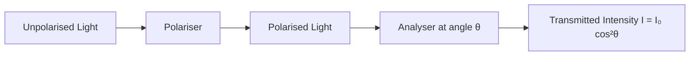

# 1. Overview / 概述

**English:**
This sub-topic introduces the fundamental concept of polarisation — a property of transverse waves that describes the direction of oscillation. For A-Level Physics, polarisation is exclusively a property of transverse waves (such as light and electromagnetic waves), and it cannot occur in longitudinal waves (such as sound). Understanding what polarisation means physically is essential before exploring how it is produced (via filters or reflection) and its real-world applications. This leaf node focuses on the definition, the distinction between polarised and unpolarised waves, and the basic experimental demonstration using polarising filters. It serves as the foundation for the broader [[Polarisation]] topic and connects directly to [[Progressive Waves]] and [[Superposition and Interference]].

**中文:**
本子知识点介绍偏振的基本概念——偏振是横波的一种属性，描述了振动方向。在A-Level物理中，偏振是横波（如光和电磁波）独有的性质，纵波（如声波）不会发生偏振。理解偏振的物理含义是探索其产生方式（通过偏振片或反射）和实际应用的基础。本知识点聚焦于定义、偏振波与非偏振波的区别，以及使用偏振片的基本实验演示。它是更广泛的[[Polarisation]]主题的基础，并与[[Progressive Waves]]和[[Superposition and Interference]]直接相关。

---

# 2. Syllabus Learning Objectives / 考纲学习目标

| CAIE 9702 | Edexcel IAL |
|-----------|-------------|
| 7.2(a) Describe what is meant by polarisation | 5.6 Understand the meaning of polarisation |
| 7.2(b) Distinguish between polarised and unpolarised waves | 5.7 Distinguish between polarised and unpolarised waves |
| 7.2(c) Recall and use Malus's law (covered in sibling node) | 5.8 Understand how polarisation can be demonstrated using a polarising filter |
| 7.2(d) Understand the use of polarisation in practical contexts | — |

**Examiner Expectations / 考官期望:**
- **English:** You must be able to define polarisation precisely, explain why only transverse waves can be polarised, and describe a simple experiment using two polarising filters to demonstrate polarisation. You should also be able to sketch diagrams showing the vibration directions of polarised and unpolarised waves.
- **中文:** 你必须能够精确定义偏振，解释为什么只有横波才能偏振，并描述使用两个偏振片演示偏振的简单实验。你还应该能够画出偏振波和非偏振波的振动方向示意图。

---

# 3. Core Definitions / 核心定义

| Term (EN/CN) | Definition (EN) | Definition (CN) | Common Mistakes / 常见错误 |
|--------------|-----------------|-----------------|---------------------------|
| **Polarisation** / 偏振 | The restriction of the vibrations of a transverse wave to one direction (or plane) only. | 将横波的振动限制在单一方向（或平面）上的现象。 | ❌ Thinking polarisation applies to longitudinal waves. |
| **Polarised Wave** / 偏振波 | A transverse wave in which the oscillations are confined to a single plane (plane-polarised). | 振荡被限制在单一平面内的横波（平面偏振波）。 | ❌ Confusing "plane of polarisation" with "direction of propagation". |
| **Unpolarised Wave** / 非偏振波 | A transverse wave in which the oscillations occur in all possible directions perpendicular to the direction of propagation. | 振荡发生在垂直于传播方向的所有可能方向上的横波。 | ❌ Thinking unpolarised means no oscillation. |
| **Polarising Filter (Polaroid)** / 偏振片 | A material that transmits only waves with oscillations parallel to its transmission axis, absorbing all other components. | 只允许振动方向平行于其透振轴的光通过，吸收其他所有成分的材料。 | ❌ Assuming the filter absorbs all light equally. |
| **Transmission Axis** / 透振轴 | The direction of oscillation that a polarising filter allows to pass through. | 偏振片允许通过的振动方向。 | ❌ Confusing with the plane of polarisation. |
| **Plane of Polarisation** / 偏振面 | The plane containing the direction of propagation and the direction of vibration of a polarised wave. | 包含偏振波传播方向和振动方向的平面。 | ❌ Thinking it is perpendicular to the vibration direction. |

---

# 4. Key Concepts Explained / 关键概念详解

## 4.1 Transverse Waves and Polarisation / 横波与偏振

### Explanation / 解释
**English:** Polarisation is a defining property of transverse waves. In a transverse wave, the particles of the medium (or the electric field vector for electromagnetic waves) oscillate perpendicular to the direction of energy transfer. For an unpolarised wave, these oscillations occur in all possible directions within the plane perpendicular to the propagation direction. When a wave is polarised, these oscillations are restricted to a single direction (or plane). This is analogous to a rope being shaken: if you shake it up and down, the wave is vertically polarised; if you shake it side to side, it is horizontally polarised. Longitudinal waves (e.g., sound) cannot be polarised because their oscillations are parallel to the direction of propagation — there is no perpendicular component to restrict.

**中文:** 偏振是横波的一个决定性属性。在横波中，介质的粒子（或电磁波中的电场矢量）垂直于能量传递方向振荡。对于非偏振波，这些振荡发生在垂直于传播方向的平面内的所有可能方向上。当波被偏振时，这些振荡被限制在单一方向（或平面）上。这类似于摇晃一根绳子：如果你上下摇晃，波是垂直偏振的；如果你左右摇晃，波是水平偏振的。纵波（如声波）不能偏振，因为它们的振荡平行于传播方向——没有垂直分量可以限制。

### Physical Meaning / 物理意义
**English:** Physically, polarisation tells us about the orientation of the wave's oscillations. For light, polarisation describes the direction of the electric field vector. This is important because many materials and surfaces interact differently with light depending on its polarisation state — this is the basis for applications like glare reduction and 3D cinema.

**中文:** 从物理上讲，偏振告诉我们波振荡的方向。对于光，偏振描述了电场矢量的方向。这一点很重要，因为许多材料和表面对光的相互作用取决于其偏振状态——这是减少眩光和3D电影等应用的基础。

### Common Misconceptions / 常见误区
- ❌ **"Sound waves can be polarised."** — No. Sound is longitudinal; its oscillations are parallel to propagation, so there is no perpendicular direction to restrict.
- ❌ **"Polarised light has no oscillation."** — No. It still oscillates, but only in one plane.
- ❌ **"Unpolarised light is the same as polarised light."** — No. Unpolarised light has oscillations in all directions; polarised light has oscillations in one direction only.
- ❌ **"The polarising filter creates polarisation."** — It selects one component from the unpolarised wave; it does not create new oscillations.

### Exam Tips / 考试提示
- ✅ **English:** Always state "transverse waves only" when defining polarisation. Use the rope analogy in explanations. Draw clear diagrams showing the vibration directions for both polarised and unpolarised waves.
- ✅ **中文:** 在定义偏振时，务必说明"仅限横波"。在解释中使用绳子类比。画出清晰的图表，显示偏振波和非偏振波的振动方向。

> 📷 **IMAGE PROMPT — DIAGRAM-01: Transverse Wave Polarisation Analogy**
> A side-by-side comparison diagram. Left: A rope being shaken up and down, showing a vertically polarised transverse wave with arrows indicating the oscillation direction (vertical) and propagation direction (horizontal). Right: A rope being shaken in all directions perpendicular to propagation, with multiple small arrows in a circle around the propagation axis, labelled "unpolarised". Clean white background, educational style, labelled in English.

## 4.2 Demonstrating Polarisation with Two Filters / 用两个偏振片演示偏振

### Explanation / 解释
**English:** The classic demonstration uses two polarising filters (Polaroids). When unpolarised light passes through the first filter (the polariser), it becomes polarised — only the component of light with oscillations parallel to the transmission axis passes through. The intensity of the transmitted light is reduced by approximately 50%. When a second filter (the analyser) is placed in the path, the amount of light transmitted depends on the angle θ between the transmission axes of the two filters:
- **Parallel axes (θ = 0°):** Maximum light passes through (bright).
- **Perpendicular axes (θ = 90°):** No light passes through (dark/extinction).
- **Intermediate angles:** Partial transmission occurs, following Malus's law (covered in [[Polarisation by Filters (Malus's Law)]]).

**中文:** 经典演示使用两个偏振片。当非偏振光通过第一个偏振片（起偏器）时，光变成偏振光——只有振动方向平行于透振轴的光分量通过。透射光的强度减少约50%。当第二个偏振片（检偏器）放置在光路中时，透射光的量取决于两个偏振片透振轴之间的夹角θ：
- **平行轴 (θ = 0°):** 透射光最强（明亮）。
- **垂直轴 (θ = 90°):** 无光通过（黑暗/消光）。
- **中间角度:** 部分透射，遵循马吕斯定律（详见[[Polarisation by Filters (Malus's Law)]]）。

### Physical Meaning / 物理意义
**English:** This demonstration proves that light is a transverse wave. If light were longitudinal, rotating the second filter would have no effect — the same amount of light would always pass through. The fact that light can be "blocked" by rotating a filter is direct evidence of its transverse nature.

**中文:** 这个演示证明了光是横波。如果光是纵波，旋转第二个偏振片不会有任何效果——相同数量的光总会通过。光可以通过旋转偏振片被"阻挡"这一事实是其横波特性的直接证据。

### Common Misconceptions / 常见误区
- ❌ **"The filters absorb all light when crossed."** — They absorb the component of light that is perpendicular to their transmission axis. When crossed, the first filter produces polarised light, and the second filter absorbs all of it.
- ❌ **"The filters create darkness."** — They selectively transmit/absorb based on polarisation; they do not create or destroy energy.
- ❌ **"Rotating the first filter changes the result."** — For unpolarised incident light, rotating the first filter does not change the transmitted intensity (still ~50%), but it does change the polarisation direction of the light reaching the second filter.

### Exam Tips / 考试提示
- ✅ **English:** Be able to describe the experiment step-by-step. Know that the first filter is called the polariser and the second is called the analyser. Understand that the intensity after the first filter is half the incident intensity for unpolarised light.
- ✅ **中文:** 能够逐步描述实验。知道第一个偏振片称为起偏器，第二个称为检偏器。理解对于非偏振光，通过第一个偏振片后的强度是入射强度的一半。

> 📷 **IMAGE PROMPT — DIAGRAM-02: Two Polarising Filters Demonstration**
> A three-panel diagram. Panel 1: Unpolarised light (shown as multiple arrows in a circle) enters a polarising filter with vertical transmission axis (shown as parallel lines). Output is vertically polarised light (single vertical arrow). Panel 2: The polarised light passes through a second filter with parallel transmission axis — bright output. Panel 3: The second filter is rotated 90° — no light passes through (dark output). Clean educational style, labelled in English.

---

# 5. Essential Equations / 核心公式

For this sub-topic (What is Polarisation), the key relationship is qualitative rather than quantitative. The quantitative law (Malus's law) is covered in the sibling node [[Polarisation by Filters (Malus's Law)]].

**Key Qualitative Relationship:**

$$ \text{Intensity after polariser} = \frac{1}{2} \times \text{Intensity of unpolarised incident light} $$

| Symbol (符号) | Meaning (EN) | Meaning (CN) | Unit (单位) |
|--------------|-------------|-------------|------------|
| $I_0$ | Incident intensity of unpolarised light | 非偏振光的入射强度 | W m⁻² |
| $I_{\text{trans}}$ | Intensity after first polarising filter | 通过第一个偏振片后的强度 | W m⁻² |

**Derivation / 推导:**
This result comes from averaging the component of the electric field vector over all possible directions. For unpolarised light, the electric field vector has equal probability in all directions perpendicular to propagation. The component transmitted through a polariser is $E_0 \cos\theta$, and the intensity is proportional to $E^2$. Averaging $\cos^2\theta$ over all angles gives $\frac{1}{2}$.

**Conditions / 适用条件:**
- **English:** The incident light must be completely unpolarised. The polarising filter must be ideal (perfect transmission along its axis, zero transmission perpendicular to it).
- **中文:** 入射光必须完全非偏振。偏振片必须是理想的（沿透振轴完全透射，垂直于透振轴完全吸收）。

**Limitations / 局限性:**
- **English:** Real polarising filters are not perfect — some light is always absorbed even along the transmission axis, and some light leaks through when crossed.
- **中文:** 实际的偏振片不是完美的——即使沿透振轴也有一些光被吸收，当交叉时也有一些光泄漏。

---

# 6. Graphs and Relationships / 图表与关系

## 6.1 Intensity vs. Angle Between Filters / 强度与偏振片夹角的关系

### Axes / 坐标轴
- **X-axis:** Angle θ between transmission axes of two polarising filters / 两个偏振片透振轴之间的夹角θ
- **Y-axis:** Transmitted intensity I / 透射强度 I

### Shape / 形状
**English:** The graph follows a $\cos^2\theta$ relationship (Malus's law). It starts at maximum at θ = 0°, decreases to zero at θ = 90°, increases back to maximum at θ = 180°, and repeats every 180°.

**中文:** 该图遵循$\cos^2\theta$关系（马吕斯定律）。在θ = 0°时达到最大值，在θ = 90°时减小到零，在θ = 180°时回到最大值，每180°重复一次。

### Gradient Meaning / 斜率含义
**English:** The gradient represents the rate of change of transmitted intensity with respect to the angle. It is steepest near θ = 45° and θ = 135°, and zero at θ = 0°, 90°, and 180°.

**中文:** 斜率表示透射强度随角度变化的速率。在θ = 45°和θ = 135°附近最陡，在θ = 0°、90°和180°处为零。

### Area Meaning / 面积含义
**English:** Not applicable for this graph — the area under the curve has no physical significance.

**中文:** 不适用于此图——曲线下的面积没有物理意义。

### Exam Interpretation / 考试解读
- ✅ **English:** Be able to sketch this graph from memory. Know that the maximum occurs at 0° and 180°, and the minimum (zero) occurs at 90° and 270°.
- ✅ **中文:** 能够凭记忆画出此图。知道最大值出现在0°和180°，最小值（零）出现在90°和270°。



---

# 7. Required Diagrams / 必备图表

## 7.1 Polarised vs. Unpolarised Wave Representation / 偏振波与非偏振波的表示

### Description / 描述
**English:** A diagram showing the difference between a polarised transverse wave (oscillations in one plane only) and an unpolarised transverse wave (oscillations in all planes perpendicular to propagation). The wave should be shown propagating from left to right.

**中文:** 显示偏振横波（仅在一个平面内振荡）和非偏振横波（在垂直于传播的所有平面内振荡）之间区别的图表。波应显示为从左向右传播。

### Image Prompt / 图片生成提示
> 📷 **IMAGE PROMPT — DIAGRAM-03: Polarised vs Unpolarised Waves**
> Two side-by-side diagrams. Left: "Polarised Wave" — a sine wave confined to a single vertical plane, with a vertical double-headed arrow labelled "Vibration direction" and a horizontal arrow labelled "Propagation direction". Right: "Unpolarised Wave" — multiple sine waves in different planes (shown as overlapping waves at different angles), with a circular symbol of arrows in all directions labelled "Vibrations in all directions". Clean white background, educational style, labelled in English.

### Labels Required / 需要标注
- **English:** Vibration direction, Propagation direction, Plane of polarisation, Unpolarised (vibrations in all directions)
- **中文:** 振动方向、传播方向、偏振面、非偏振（所有方向振动）

### Exam Importance / 考试重要性
- **English:** High — this diagram is frequently required in exam answers to explain polarisation.
- **中文:** 高——在考试答案中经常需要此图来解释偏振。

## 7.2 Two-Filter Demonstration Setup / 双偏振片演示装置

### Description / 描述
**English:** A schematic diagram showing unpolarised light passing through a polariser (first filter), becoming polarised, then passing through an analyser (second filter). Two cases should be shown: parallel axes (light passes) and crossed axes (no light passes).

**中文:** 显示非偏振光通过起偏器（第一个偏振片）变成偏振光，然后通过检偏器（第二个偏振片）的示意图。应显示两种情况：平行轴（光通过）和交叉轴（无光通过）。

### Image Prompt / 图片生成提示
> 📷 **IMAGE PROMPT — DIAGRAM-04: Two-Filter Polarisation Setup**
> A two-part diagram. Top: "Parallel Axes" — light source on left, first filter with vertical lines (transmission axis), second filter with same vertical lines, bright light on right. Bottom: "Crossed Axes" — same setup but second filter rotated 90° (horizontal lines), no light on right (labelled "Dark"). Arrows show light path. Clean educational style, labelled in English.

### Labels Required / 需要标注
- **English:** Unpolarised light, Polariser, Polarised light, Analyser, Transmission axis, Bright/Dark
- **中文:** 非偏振光、起偏器、偏振光、检偏器、透振轴、明亮/黑暗

### Exam Importance / 考试重要性
- **English:** Very high — this is the standard experimental setup for demonstrating polarisation.
- **中文:** 非常高——这是演示偏振的标准实验装置。

---

# 8. Worked Examples / 典型例题

## Example 1: Identifying Polarisation / 识别偏振

### Question / 题目
**English:** A student claims that sound waves can be polarised. Explain why this statement is incorrect, and describe an experiment using light to demonstrate that polarisation is a property of transverse waves only.

**中文:** 一名学生声称声波可以偏振。解释为什么这个说法不正确，并描述一个使用光来证明偏振是横波特有性质的实验。

### Solution / 解答
**Step 1: Explain why sound cannot be polarised**
Sound is a longitudinal wave. In a longitudinal wave, the particles of the medium oscillate parallel to the direction of energy propagation. Polarisation requires restricting oscillations to a single plane perpendicular to propagation. Since sound has no oscillations perpendicular to propagation, there is nothing to restrict — polarisation is impossible.

**Step 2: Describe the experiment**
Set up a light source and two polarising filters. Allow unpolarised light from the source to pass through the first filter (polariser) — the light becomes polarised. Place the second filter (analyser) in the path of the polarised light. Rotate the analyser while observing the transmitted light intensity.

**Step 3: State the observation**
When the transmission axes of the two filters are parallel, the transmitted light is bright. When they are perpendicular (crossed), no light passes through — the screen is dark. At intermediate angles, the intensity varies.

**Step 4: Explain the conclusion**
This behaviour is only possible if light is a transverse wave. If light were longitudinal, rotating the analyser would have no effect — the same amount of light would always pass through. The fact that light can be completely blocked by rotating a filter proves it is a transverse wave.

**中文:**
**步骤1: 解释为什么声波不能偏振**
声波是纵波。在纵波中，介质粒子平行于能量传播方向振荡。偏振需要将振荡限制在垂直于传播方向的单一平面内。由于声波没有垂直于传播方向的振荡，没有什么可以限制——偏振是不可能的。

**步骤2: 描述实验**
设置一个光源和两个偏振片。让来自光源的非偏振光通过第一个偏振片（起偏器）——光变成偏振光。将第二个偏振片（检偏器）放置在偏振光的光路中。旋转检偏器，同时观察透射光的强度。

**步骤3: 说明观察结果**
当两个偏振片的透振轴平行时，透射光明亮。当它们垂直（交叉）时，没有光通过——屏幕是黑暗的。在中间角度，强度变化。

**步骤4: 解释结论**
这种行为只有在光是横波的情况下才可能发生。如果光是纵波，旋转检偏器不会有任何效果——相同数量的光总会通过。光可以通过旋转偏振片被完全阻挡这一事实证明了它是横波。

### Final Answer / 最终答案
**Answer:** Sound cannot be polarised because it is longitudinal. The two-filter experiment with light proves polarisation is a transverse wave property. | **答案：** 声波不能偏振，因为它是纵波。使用光的双偏振片实验证明了偏振是横波的性质。

### Quick Tip / 提示
- ✅ **English:** Always link polarisation to the transverse nature of waves. If a question asks "why can X be polarised?", check if X is transverse or longitudinal.
- ✅ **中文:** 始终将偏振与波的横波性质联系起来。如果问题问"为什么X可以偏振？"，检查X是横波还是纵波。

---

# 9. Past Paper Question Types / 历年真题题型

| Question Type / 题型 | Frequency / 频率 | Difficulty / 难度 | Past Paper References / 真题索引 |
|----------------------|------------------|------------------|-------------------------------|
| Definition of polarisation | High | Easy | 📝 *待填入* |
| Explaining why only transverse waves can be polarised | High | Medium | 📝 *待填入* |
| Describing the two-filter demonstration | High | Medium | 📝 *待填入* |
| Sketching polarised/unpolarised wave diagrams | Medium | Easy | 📝 *待填入* |
| Interpreting intensity vs. angle graphs | Medium | Medium | 📝 *待填入* |

**Common Command Words / 常见指令词:**
- **Define / 定义** — Give a precise, exam-standard definition.
- **Explain / 解释** — Provide reasoning with reference to wave properties.
- **Describe / 描述** — Give a step-by-step account of an experiment or phenomenon.
- **Sketch / 画出** — Draw a diagram or graph with correct labels.
- **Distinguish / 区分** — State the differences between two concepts (e.g., polarised vs. unpolarised).

---

# 10. Practical Skills Connections / 实验技能链接

**English:**
This sub-topic connects to practical work in the following ways:
1. **Experimental Setup:** Setting up a light source, polarising filters, and a screen to demonstrate polarisation. You must be able to align the filters correctly and observe the change in transmitted light.
2. **Qualitative Observation:** Describing the change in brightness as the analyser is rotated — from bright (parallel) to dark (crossed) and back.
3. **Measurements:** Using a light sensor (or photometer) to measure the transmitted intensity as a function of angle. This connects to [[Polarisation by Filters (Malus's Law)]] for quantitative analysis.
4. **Uncertainties:** Estimating the uncertainty in the angle measurement (typically ±1° for a protractor) and in the intensity measurement.
5. **Graph Plotting:** Plotting intensity vs. angle and fitting a $\cos^2\theta$ curve.
6. **Experimental Design:** Choosing appropriate light sources (e.g., an LED torch for safety) and ensuring the room is dark enough for clear observations.

**中文:**
本子知识点通过以下方式与实验工作联系：
1. **实验设置:** 设置光源、偏振片和屏幕来演示偏振。你必须能够正确对齐偏振片并观察透射光的变化。
2. **定性观察:** 描述旋转检偏器时亮度的变化——从明亮（平行）到黑暗（交叉）再回到明亮。
3. **测量:** 使用光传感器（或光度计）测量透射强度随角度的变化。这与[[Polarisation by Filters (Malus's Law)]]的定量分析相关。
4. **不确定度:** 估计角度测量（通常为±1°）和强度测量的不确定度。
5. **图表绘制:** 绘制强度与角度的关系图，并拟合$\cos^2\theta$曲线。
6. **实验设计:** 选择合适的光源（如LED手电筒以确保安全），并确保房间足够暗以便清晰观察。

---

# 11. Concept Map / 概念图谱

```mermaid
graph TD
    %% Core concept
    POL[Polarisation] --> DEF[Definition: Restriction of vibrations to one plane]
    POL --> PROP[Property of Transverse Waves Only]
    
    %% Prerequisites
    PROP --> TW[Transverse Waves]
    TW --> LW[Longitudinal Waves cannot be polarised]
    
    %% Demonstration
    POL --> DEMO[Two-Filter Demonstration]
    DEMO --> POLARISER[Polariser: Produces polarised light]
    DEMO --> ANALYSER[Analyser: Detects polarisation]
    ANALYSER --> PARALLEL[Parallel Axes: Bright]
    ANALYSER --> CROSSED[Crossed Axes: Dark]
    
    %% Related concepts
    POL --> MALUS[[Polarisation by Filters (Malus's Law)]]
    POL --> BREWSTER[[Polarisation by Reflection (Brewster's Angle)]]
    POL --> APPLICATIONS[[Applications of Polarisation]]
    
    %% Broader context
    POL --> SUPER[[Superposition and Interference]]
    TW --> PROGRESSIVE[[Progressive Waves]]
    
    %% Key terms
    POL --> TRANSAXIS[Transmission Axis]
    POL --> PLANEPOL[Plane of Polarisation]
    POL --> UNPOL[Unpolarised Wave]
    
    %% Styling
    classDef core fill:#f9f,stroke:#333,stroke-width:2px
    classDef demo fill:#bbf,stroke:#333,stroke-width:1px
    classDef related fill:#dfd,stroke:#333,stroke-width:1px
    
    class POL core
    class DEMO,POLARISER,ANALYSER demo
    class MALUS,BREWSTER,APPLICATIONS,SUPER,PROGRESSIVE related
```

---

# 12. Quick Revision Sheet / 速查表

| Category / 类别 | Key Points / 要点 |
|----------------|------------------|
| **Definition / 定义** | Polarisation = restriction of transverse wave vibrations to one plane. Only transverse waves can be polarised. / 偏振 = 将横波振动限制在一个平面内。只有横波才能偏振。 |
| **Key Distinction / 关键区分** | Polarised wave: oscillations in one plane. Unpolarised wave: oscillations in all perpendicular planes. / 偏振波：在一个平面内振荡。非偏振波：在所有垂直平面内振荡。 |
| **Key Experiment / 关键实验** | Two polarising filters: polariser + analyser. Parallel = bright, crossed = dark. Proves light is transverse. / 两个偏振片：起偏器 + 检偏器。平行 = 明亮，交叉 = 黑暗。证明光是横波。 |
| **Key Formula / 核心公式** | $I_{\text{after polariser}} = \frac{1}{2} I_0$ (for unpolarised incident light) / 通过起偏器后的强度 = ½ × 入射强度（对于非偏振入射光） |
| **Key Graph / 核心图表** | Intensity vs. angle between filters: $\cos^2\theta$ shape. Max at 0°, zero at 90°. / 强度与偏振片夹角的关系图：$\cos^2\theta$形状。0°最大，90°为零。 |
| **Common Mistake / 常见错误** | ❌ Saying sound can be polarised. ❌ Confusing transmission axis with plane of polarisation. / ❌ 说声波可以偏振。❌ 混淆透振轴和偏振面。 |
| **Exam Tip / 考试提示** | Always state "transverse waves only" in definitions. Draw clear diagrams with labelled axes. / 在定义中始终说明"仅限横波"。画出带有标注轴的清晰图表。 |
| **Practical Link / 实验链接** | Use a light sensor to measure intensity vs. angle. Estimate uncertainty in angle (±1°). / 使用光传感器测量强度与角度的关系。估计角度的不确定度（±1°）。 |