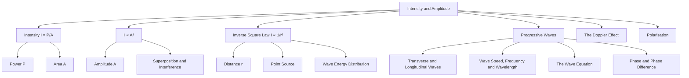

# 1. Overview / 概述

**English:**
This sub-topic explores the fundamental relationship between the **intensity** of a progressive wave and its **amplitude**. Intensity is a measure of the power transferred per unit area by a wave, while amplitude is the maximum displacement of particles from their equilibrium position. The key relationship is that intensity is proportional to the square of the amplitude ($I \propto A^2$). This concept is crucial for understanding how wave energy is distributed and how it changes with distance from a source. It forms the foundation for topics like [[Superposition and Interference]], where intensity patterns are analysed, and [[The Doppler Effect]], where amplitude changes are observed. This sub-topic is a core part of the broader [[Progressive Waves]] topic and builds on prerequisites like [[Displacement, Velocity and Acceleration]].

**中文:**
本子知识点探讨了行波的**强度**与其**振幅**之间的基本关系。强度是波在单位面积上传递的功率的度量，而振幅是粒子偏离其平衡位置的最大位移。关键关系是强度与振幅的平方成正比 ($I \propto A^2$)。这个概念对于理解波的能量如何分布以及如何随距离源的距离而变化至关重要。它为诸如[[Superposition and Interference]]（分析强度图案）和[[The Doppler Effect]]（观察振幅变化）等主题奠定了基础。本子知识点是更广泛的[[Progressive Waves]]主题的核心部分，并建立在[[Displacement, Velocity and Acceleration]]等先决条件之上。

---

# 2. Syllabus Learning Objectives / 考纲学习目标

| CAIE 9702 | Edexcel IAL |
|-----------|-------------|
| 7.1 (a) Understand the concept of wave intensity as power per unit area | 5.1 Understand the concept of intensity as power per unit area |
| 7.1 (b) Recall and use the equation $I = \frac{P}{A}$ | 5.2 Use the equation $I = \frac{P}{A}$ |
| 7.1 (c) Understand that intensity is proportional to the square of the amplitude ($I \propto A^2$) | 5.3 Understand that intensity is proportional to the square of the amplitude ($I \propto A^2$) |
| 7.1 (d) Understand the inverse square law for intensity from a point source ($I \propto \frac{1}{r^2}$) | 5.4 Understand the inverse square law for intensity from a point source ($I \propto \frac{1}{r^2}$) |
| 7.1 (e) Solve problems involving intensity, amplitude, power, and distance | 5.5 Solve problems involving intensity, amplitude, power, and distance |

**Examiner Expectations / 考官期望:**
- **English:** Students must be able to define intensity, recall and apply the formulas $I = P/A$ and $I \propto A^2$, and understand the inverse square law for point sources. They should be able to calculate changes in intensity or amplitude when distance or power changes.
- **中文:** 学生必须能够定义强度，回忆并应用公式 $I = P/A$ 和 $I \propto A^2$，并理解点源的平方反比定律。他们应该能够计算当距离或功率变化时强度或振幅的变化。

---

# 3. Core Definitions / 核心定义

| Term (EN/CN) | Definition (EN) | Definition (CN) | Common Mistakes / 常见错误 |
|--------------|-----------------|-----------------|---------------------------|
| **Intensity** / 强度 | The power transferred per unit area perpendicular to the direction of wave propagation. | 垂直于波传播方向的单位面积上传递的功率。 | Confusing intensity with power. Intensity is power per unit area, not total power. |
| **Amplitude** / 振幅 | The maximum displacement of a particle from its equilibrium position in a wave. | 波中粒子偏离其平衡位置的最大位移。 | Confusing amplitude with displacement. Amplitude is the maximum displacement, not any displacement. |
| **Power** / 功率 | The rate at which energy is transferred by the wave. | 波传递能量的速率。 | Forgetting that power is energy per unit time. |
| **Inverse Square Law** / 平方反比定律 | For a point source, the intensity is inversely proportional to the square of the distance from the source ($I \propto \frac{1}{r^2}$). | 对于点源，强度与距源距离的平方成反比 ($I \propto \frac{1}{r^2}$)。 | Applying the inverse square law to non-point sources or in non-3D scenarios. |
| **Point Source** / 点源 | A source of waves that is small enough to be considered a single point, emitting waves uniformly in all directions. | 一个足够小以至于可以被视为一个单点的波源，向所有方向均匀发射波。 | Assuming all sources are point sources. |

---

# 4. Key Concepts Explained / 关键概念详解

## 4.1 Intensity and Amplitude Relationship / 强度与振幅的关系

### Explanation / 解释
**English:** The intensity ($I$) of a progressive wave is directly proportional to the square of its amplitude ($A$). This is expressed as $I \propto A^2$. This means if you double the amplitude, the intensity increases by a factor of four. This relationship arises because the energy carried by a wave is proportional to the square of its amplitude. Since intensity is power per unit area, and power is energy per unit time, the intensity is also proportional to the square of the amplitude. This is a fundamental concept in [[Progressive Waves]] and is crucial for understanding [[Superposition and Interference]].

**中文:** 行波的强度 ($I$) 与其振幅 ($A$) 的平方成正比。这表示为 $I \propto A^2$。这意味着如果你将振幅加倍，强度将增加四倍。这种关系是因为波携带的能量与其振幅的平方成正比。由于强度是单位面积的功率，而功率是单位时间的能量，因此强度也与振幅的平方成正比。这是[[Progressive Waves]]中的一个基本概念，对于理解[[Superposition and Interference]]至关重要。

### Physical Meaning / 物理意义
**English:** Physically, this means that a wave with a larger amplitude carries more energy per unit area per unit time. For example, a louder sound wave (larger amplitude) has a higher intensity, and a brighter light wave (larger amplitude) has a higher intensity.

**中文:** 从物理上讲，这意味着振幅较大的波在单位面积单位时间内携带更多的能量。例如，更响亮的声音波（振幅更大）具有更高的强度，而更亮的光波（振幅更大）具有更高的强度。

### Common Misconceptions / 常见误区
- **English:** Students often think intensity is directly proportional to amplitude, not the square of amplitude.
- **中文:** 学生经常认为强度与振幅成正比，而不是与振幅的平方成正比。
- **English:** Students may confuse intensity with loudness or brightness, which are subjective perceptions.
- **中文:** 学生可能会将强度与响度或亮度混淆，这些是主观感受。

### Exam Tips / 考试提示
- **English:** When a question says "amplitude is doubled," immediately think $I \propto A^2$, so intensity becomes 4 times.
- **中文:** 当题目说“振幅加倍”时，立即想到 $I \propto A^2$，所以强度变为4倍。
- **English:** Remember that if intensity is halved, amplitude is reduced by a factor of $\sqrt{2}$.
- **中文:** 记住，如果强度减半，振幅减少 $\sqrt{2}$ 倍。

> 📷 **IMAGE PROMPT — DIAGRAM-01: Intensity vs Amplitude Graph**
> A graph showing intensity on the y-axis and amplitude on the x-axis. The curve is a parabola, showing that intensity increases quadratically with amplitude. Label the axes as "Intensity (I)" and "Amplitude (A)". Add a note: "I ∝ A²".

---

## 4.2 Inverse Square Law for Intensity / 强度的平方反比定律

### Explanation / 解释
**English:** For a point source emitting waves uniformly in all directions (spherical waves), the intensity ($I$) at a distance $r$ from the source is inversely proportional to the square of the distance: $I \propto \frac{1}{r^2}$. This is because the power from the source is spread over the surface area of a sphere ($4\pi r^2$). As the distance increases, the same power is spread over a larger area, so the intensity decreases. This is a key concept in [[Progressive Waves]] and is related to [[Wave Speed, Frequency and Wavelength]].

**中文:** 对于一个向所有方向均匀发射波的点源（球面波），在距源距离 $r$ 处的强度 ($I$) 与距离的平方成反比：$I \propto \frac{1}{r^2}$。这是因为来自源的功率分布在球体的表面积 ($4\pi r^2$) 上。随着距离的增加，相同的功率分布在更大的面积上，因此强度降低。这是[[Progressive Waves]]中的一个关键概念，与[[Wave Speed, Frequency and Wavelength]]相关。

### Physical Meaning / 物理意义
**English:** Physically, this means that as you move away from a point source, the wave becomes less intense. For example, a light bulb appears dimmer as you move further away, and a sound becomes quieter.

**中文:** 从物理上讲，这意味着当你远离点源时，波变得不那么强烈。例如，灯泡在你远离时会变暗，声音会变轻。

### Common Misconceptions / 常见误区
- **English:** Students often think intensity is inversely proportional to distance, not the square of distance.
- **中文:** 学生经常认为强度与距离成反比，而不是与距离的平方成反比。
- **English:** Students may apply the inverse square law to non-point sources or in 2D scenarios (e.g., ripples on a water surface).
- **中文:** 学生可能会将平方反比定律应用于非点源或二维场景（例如，水面上的涟漪）。

### Exam Tips / 考试提示
- **English:** When a question says "distance is doubled," immediately think $I \propto \frac{1}{r^2}$, so intensity becomes $\frac{1}{4}$ of the original.
- **中文:** 当题目说“距离加倍”时，立即想到 $I \propto \frac{1}{r^2}$，所以强度变为原来的 $\frac{1}{4}$。
- **English:** Remember that if distance is tripled, intensity becomes $\frac{1}{9}$ of the original.
- **中文:** 记住，如果距离变为三倍，强度变为原来的 $\frac{1}{9}$。

> 📷 **IMAGE PROMPT — DIAGRAM-02: Inverse Square Law Illustration**
> A diagram showing a point source at the center, with concentric spheres at distances r, 2r, and 3r. The same power P is spread over areas 4πr², 16πr², and 36πr². Label the intensities as I, I/4, and I/9. Add a note: "I ∝ 1/r²".

---

# 5. Essential Equations / 核心公式

## Equation 1: Intensity Definition / 强度定义

$$ I = \frac{P}{A} $$

| Symbol (符号) | Meaning (EN) | Meaning (CN) | Unit (单位) |
|--------------|-------------|-------------|------------|
| $I$ | Intensity | 强度 | W m$^{-2}$ (watts per square metre) |
| $P$ | Power | 功率 | W (watts) |
| $A$ | Cross-sectional area perpendicular to wave direction | 垂直于波方向的横截面积 | m$^2$ (square metres) |

**Derivation / 推导:** Intensity is defined as power per unit area. Power is the rate of energy transfer ($P = \frac{E}{t}$). So, $I = \frac{E}{tA}$.

**Conditions / 适用条件:**
- **English:** The area must be perpendicular to the direction of wave propagation.
- **中文:** 面积必须垂直于波的传播方向。

**Limitations / 局限性:**
- **English:** This equation assumes uniform intensity over the area.
- **中文:** 该方程假设强度在面积上均匀分布。

---

## Equation 2: Intensity and Amplitude / 强度与振幅

$$ I \propto A^2 $$

| Symbol (符号) | Meaning (EN) | Meaning (CN) | Unit (单位) |
|--------------|-------------|-------------|------------|
| $I$ | Intensity | 强度 | W m$^{-2}$ |
| $A$ | Amplitude | 振幅 | m (metres) |

**Derivation / 推导:** The energy carried by a wave is proportional to the square of its amplitude ($E \propto A^2$). Since power is energy per unit time ($P \propto E$), and intensity is power per unit area ($I \propto P$), it follows that $I \propto A^2$.

**Conditions / 适用条件:**
- **English:** Applies to all progressive waves (mechanical and electromagnetic).
- **中文:** 适用于所有行波（机械波和电磁波）。

**Limitations / 局限性:**
- **English:** This is a proportionality, not an equality. The constant of proportionality depends on the medium and wave type.
- **中文:** 这是一个比例关系，而不是等式。比例常数取决于介质和波的类型。

---

## Equation 3: Inverse Square Law / 平方反比定律

$$ I \propto \frac{1}{r^2} $$

| Symbol (符号) | Meaning (EN) | Meaning (CN) | Unit (单位) |
|--------------|-------------|-------------|------------|
| $I$ | Intensity | 强度 | W m$^{-2}$ |
| $r$ | Distance from point source | 距点源的距离 | m (metres) |

**Derivation / 推导:** For a point source emitting power $P$ uniformly in all directions, the intensity at distance $r$ is $I = \frac{P}{4\pi r^2}$. Since $P$ is constant, $I \propto \frac{1}{r^2}$.

**Conditions / 适用条件:**
- **English:** Only applies to point sources in 3D space. For 2D waves (e.g., water ripples), $I \propto \frac{1}{r}$.
- **中文:** 仅适用于三维空间中的点源。对于二维波（例如，水波），$I \propto \frac{1}{r}$。

**Limitations / 局限性:**
- **English:** Assumes no absorption or scattering of the wave by the medium.
- **中文:** 假设介质没有吸收或散射波。

> 📷 **IMAGE PROMPT — DIAGRAM-03: Inverse Square Law Graph**
> A graph showing intensity on the y-axis and distance on the x-axis. The curve is a steeply decreasing curve, showing that intensity decreases rapidly with distance. Label the axes as "Intensity (I)" and "Distance (r)". Add a note: "I ∝ 1/r²".

---

# 6. Graphs and Relationships / 图表与关系

## 6.1 Intensity vs Amplitude Graph / 强度与振幅关系图

### Axes / 坐标轴
- **English:** X-axis: Amplitude ($A$), Y-axis: Intensity ($I$)
- **中文:** X轴：振幅 ($A$)，Y轴：强度 ($I$)

### Shape / 形状
- **English:** A parabola (quadratic curve) starting from the origin.
- **中文:** 一条从原点开始的抛物线（二次曲线）。

### Gradient Meaning / 斜率含义
- **English:** The gradient is not constant; it increases as amplitude increases. The gradient represents $2kA$, where $k$ is the constant of proportionality.
- **中文:** 斜率不是常数；它随着振幅的增加而增加。斜率代表 $2kA$，其中 $k$ 是比例常数。

### Area Meaning / 面积含义
- **English:** The area under the graph has no direct physical meaning.
- **中文:** 图下的面积没有直接的物理意义。

### Exam Interpretation / 考试解读
- **English:** If the graph is a straight line through the origin when $I$ is plotted against $A^2$, it confirms the $I \propto A^2$ relationship.
- **中文:** 如果绘制 $I$ 对 $A^2$ 的图是一条通过原点的直线，则证实了 $I \propto A^2$ 的关系。

---

## 6.2 Intensity vs Distance Graph / 强度与距离关系图

### Axes / 坐标轴
- **English:** X-axis: Distance ($r$), Y-axis: Intensity ($I$)
- **中文:** X轴：距离 ($r$)，Y轴：强度 ($I$)

### Shape / 形状
- **English:** A steeply decreasing curve (hyperbolic-like) that approaches zero as $r$ increases.
- **中文:** 一条急剧下降的曲线（类似双曲线），随着 $r$ 的增加趋近于零。

### Gradient Meaning / 斜率含义
- **English:** The gradient is negative and decreases in magnitude as $r$ increases. It represents the rate of change of intensity with distance.
- **中文:** 斜率为负，且随着 $r$ 的增加其大小减小。它表示强度随距离的变化率。

### Area Meaning / 面积含义
- **English:** The area under the graph has no direct physical meaning.
- **中文:** 图下的面积没有直接的物理意义。

### Exam Interpretation / 考试解读
- **English:** If the graph of $I$ against $\frac{1}{r^2}$ is a straight line through the origin, it confirms the inverse square law.
- **中文:** 如果绘制 $I$ 对 $\frac{1}{r^2}$ 的图是一条通过原点的直线，则证实了平方反比定律。

---

# 7. Required Diagrams / 必备图表

## 7.1 Spherical Wavefronts from a Point Source / 点源的球面波前

### Description / 描述
- **English:** A diagram showing a point source at the center, with concentric circles (representing spherical wavefronts) at increasing distances. The spacing between wavefronts is constant (representing constant wavelength), but the area over which the power is spread increases.
- **中文:** 一个显示中心点源的图，带有距离递增的同心圆（代表球面波前）。波前之间的间距是恒定的（代表恒定波长），但功率分布的面积增加。

### Image Prompt / 图片生成提示
> 📷 **IMAGE PROMPT — DIAGRAM-04: Spherical Wavefronts from a Point Source**
> A clean, educational diagram showing a point source at the center. Draw 3 concentric circles (wavefronts) at distances r, 2r, and 3r. Label the source as "Point Source". Label the wavefronts as "Wavefront at r", "Wavefront at 2r", and "Wavefront at 3r". Add arrows showing the direction of wave propagation outward. Include a note: "Power P is spread over area 4πr²".

### Labels Required / 需要标注
- **English:** Point source, wavefronts at distances r, 2r, 3r, direction of propagation.
- **中文:** 点源，距离为 r、2r、3r 的波前，传播方向。

### Exam Importance / 考试重要性
- **English:** This diagram is essential for understanding the inverse square law. It visually explains why intensity decreases with distance.
- **中文:** 此图对于理解平方反比定律至关重要。它直观地解释了为什么强度随距离减小。

---

## 7.2 Intensity Distribution from Two Sources / 双源强度分布

### Description / 描述
- **English:** A diagram showing the intensity pattern from two coherent sources (e.g., in a double-slit experiment). The intensity varies between maxima and minima due to [[Superposition and Interference]].
- **中文:** 一个显示来自两个相干源（例如，在双缝实验中）的强度图案的图。由于[[Superposition and Interference]]，强度在最大值和最小值之间变化。

### Image Prompt / 图片生成提示
> 📷 **IMAGE PROMPT — DIAGRAM-05: Intensity Distribution from Two Sources**
> A graph showing intensity on the y-axis and position on the x-axis. The pattern shows a series of peaks (maxima) and troughs (minima). The peaks are of equal height, and the troughs are at zero intensity. Label the maxima as "Constructive Interference" and the minima as "Destructive Interference". Add a note: "Intensity at maxima is 4 times the intensity from a single source".

### Labels Required / 需要标注
- **English:** Maxima (constructive interference), minima (destructive interference), central maximum.
- **中文:** 最大值（相长干涉），最小值（相消干涉），中央最大值。

### Exam Importance / 考试重要性
- **English:** This diagram links intensity and amplitude to interference patterns, a common exam topic.
- **中文:** 此图将强度和振幅与干涉图案联系起来，这是一个常见的考试主题。

---

# 8. Worked Examples / 典型例题

## Example 1: Intensity and Amplitude Change / 强度与振幅变化

### Question / 题目
**English:** The amplitude of a progressive wave is increased by 50%. By what factor does the intensity increase?

**中文:** 一个行波的振幅增加了50%。强度增加了多少倍？

### Solution / 解答
**Step 1:** Recall the relationship: $I \propto A^2$.
**Step 2:** Let the original amplitude be $A_1$ and the new amplitude be $A_2$.
$A_2 = A_1 + 0.5A_1 = 1.5A_1$
**Step 3:** The ratio of intensities is:
$\frac{I_2}{I_1} = \left(\frac{A_2}{A_1}\right)^2 = (1.5)^2 = 2.25$
**Step 4:** Therefore, the intensity increases by a factor of 2.25.

**中文:**
**步骤1:** 回忆关系：$I \propto A^2$。
**步骤2:** 设原始振幅为 $A_1$，新振幅为 $A_2$。
$A_2 = A_1 + 0.5A_1 = 1.5A_1$
**步骤3:** 强度之比为：
$\frac{I_2}{I_1} = \left(\frac{A_2}{A_1}\right)^2 = (1.5)^2 = 2.25$
**步骤4:** 因此，强度增加了2.25倍。

### Final Answer / 最终答案
**Answer:** 2.25 | **答案：** 2.25

### Quick Tip / 提示
- **English:** Always square the amplitude ratio, not just the change.
- **中文:** 总是对振幅比进行平方，而不仅仅是变化量。

---

## Example 2: Inverse Square Law / 平方反比定律

### Question / 题目
**English:** The intensity of a sound wave from a point source is 16 W m$^{-2}$ at a distance of 2.0 m. What is the intensity at a distance of 8.0 m?

**中文:** 来自点源的声波在2.0米距离处的强度为16 W m$^{-2}$。在8.0米距离处的强度是多少？

### Solution / 解答
**Step 1:** Recall the inverse square law: $I \propto \frac{1}{r^2}$.
**Step 2:** Let $I_1 = 16$ W m$^{-2}$ at $r_1 = 2.0$ m. Find $I_2$ at $r_2 = 8.0$ m.
**Step 3:** The ratio of intensities is:
$\frac{I_2}{I_1} = \left(\frac{r_1}{r_2}\right)^2 = \left(\frac{2.0}{8.0}\right)^2 = \left(\frac{1}{4}\right)^2 = \frac{1}{16}$
**Step 4:** Therefore, $I_2 = \frac{1}{16} \times I_1 = \frac{1}{16} \times 16 = 1$ W m$^{-2}$.

**中文:**
**步骤1:** 回忆平方反比定律：$I \propto \frac{1}{r^2}$。
**步骤2:** 设 $I_1 = 16$ W m$^{-2}$ 在 $r_1 = 2.0$ m 处。求 $r_2 = 8.0$ m 处的 $I_2$。
**步骤3:** 强度之比为：
$\frac{I_2}{I_1} = \left(\frac{r_1}{r_2}\right)^2 = \left(\frac{2.0}{8.0}\right)^2 = \left(\frac{1}{4}\right)^2 = \frac{1}{16}$
**步骤4:** 因此，$I_2 = \frac{1}{16} \times I_1 = \frac{1}{16} \times 16 = 1$ W m$^{-2}$。

### Final Answer / 最终答案
**Answer:** 1 W m$^{-2}$ | **答案：** 1 W m$^{-2}$

### Quick Tip / 提示
- **English:** Remember to invert the distance ratio: $\frac{I_2}{I_1} = \left(\frac{r_1}{r_2}\right)^2$.
- **中文:** 记住要反转距离比：$\frac{I_2}{I_1} = \left(\frac{r_1}{r_2}\right)^2$。

---

# 9. Past Paper Question Types / 历年真题题型

| Question Type / 题型 | Frequency / 频率 | Difficulty / 难度 | Past Paper References / 真题索引 |
|----------------------|------------------|------------------|-------------------------------|
| Calculate intensity from power and area | High | Easy | 📝 *待填入* |
| Calculate intensity change from amplitude change | High | Medium | 📝 *待填入* |
| Apply inverse square law to point sources | High | Medium | 📝 *待填入* |
| Compare intensities from two sources | Medium | Medium | 📝 *待填入* |
| Explain intensity pattern in interference | Medium | Hard | 📝 *待填入* |

**Common Command Words / 常见指令词:**
- **English:** Calculate, Determine, Show, Explain, State, Sketch
- **中文:** 计算，确定，展示，解释，陈述，绘制

---

# 10. Practical Skills Connections / 实验技能链接

**English:**
This sub-topic connects to practical work in several ways:
1. **Measuring Intensity:** Using a light meter or sound level meter to measure intensity at different distances from a source to verify the inverse square law.
2. **Graph Plotting:** Plotting intensity against $1/r^2$ to obtain a straight line, confirming the inverse square law.
3. **Uncertainties:** Calculating uncertainties in intensity measurements due to meter resolution and positioning errors.
4. **Experimental Design:** Designing an experiment to investigate the relationship between intensity and amplitude, e.g., using a signal generator and speaker to vary amplitude and measure sound intensity.

**中文:**
本子知识点通过多种方式与实验工作相关联：
1. **测量强度：** 使用光度计或声级计测量距源不同距离处的强度，以验证平方反比定律。
2. **绘制图表：** 绘制强度对 $1/r^2$ 的图以获得一条直线，确认平方反比定律。
3. **不确定度：** 计算由于仪表分辨率和定位误差导致的强度测量不确定度。
4. **实验设计：** 设计实验以研究强度与振幅之间的关系，例如，使用信号发生器和扬声器改变振幅并测量声音强度。

---

# 11. Concept Map / 概念图谱

---

# 12. Quick Revision Sheet / 速查表

| Category / 类别 | Key Points / 要点 |
|----------------|------------------|
| Definition / 定义 | Intensity = Power per unit area ($I = P/A$). Unit: W m$^{-2}$. |
| Key Formula / 核心公式 | $I \propto A^2$ (Intensity ∝ Amplitude²) |
| Key Formula / 核心公式 | $I \propto \frac{1}{r^2}$ (Inverse Square Law for point sources) |
| Key Graph / 核心图表 | $I$ vs $A$: Parabola; $I$ vs $A^2$: Straight line through origin |
| Key Graph / 核心图表 | $I$ vs $r$: Decreasing curve; $I$ vs $1/r^2$: Straight line through origin |
| Exam Tip / 考试提示 | When amplitude doubles, intensity quadruples. When distance doubles, intensity quarters. |
| Exam Tip / 考试提示 | Always square the ratio for amplitude changes; always invert and square for distance changes. |
| Common Mistake / 常见错误 | Confusing intensity with power; forgetting to square the amplitude ratio. |