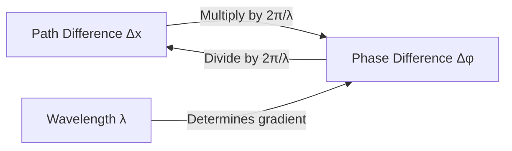
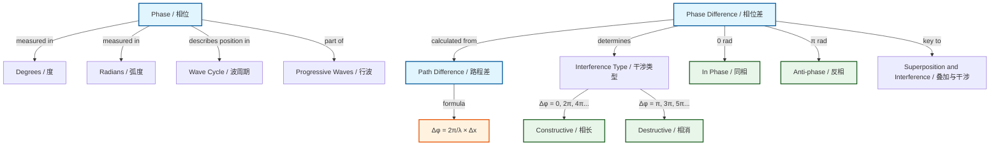

# Phase and Phase Difference / 相位与相位差

---

# 1. Overview / 概述

**English:**
Phase and phase difference are fundamental concepts for understanding how waves behave relative to each other. Phase describes the position of a point on a wave cycle at a given time, while phase difference quantifies how much one wave leads or lags behind another. These concepts are essential for explaining [[Superposition and Interference]], [[Stationary Waves]], and the formation of interference patterns. Phase difference is measured in degrees (°), radians (rad), or fractions of a wavelength (λ), and is a key parameter in determining whether waves reinforce or cancel each other.

**中文:**
相位和相位差是理解波之间相对行为的基础概念。相位描述的是波在某一时刻在周期中的位置，而相位差则量化了一个波相对于另一个波超前或滞后的程度。这些概念对于解释[[Superposition and Interference|叠加与干涉]]、[[Stationary Waves|驻波]]以及干涉图样的形成至关重要。相位差以度(°)、弧度(rad)或波长分数(λ)为单位，是决定波是相互增强还是抵消的关键参数。

---

# 2. Syllabus Learning Objectives / 考纲学习目标

| CAIE 9702 | Edexcel IAL |
|-----------|-------------|
| 7.1(a) Understand the meaning of phase and phase difference | 5.1 Understand the concept of phase and phase difference |
| 7.1(b) Calculate phase difference between two points on a wave | 5.2 Calculate phase difference in degrees and radians |
| 7.1(c) Relate phase difference to path difference | 5.3 Relate phase difference to path difference |
| 7.1(d) Understand in-phase and anti-phase conditions | 5.4 Identify in-phase and anti-phase points |
| 7.1(e) Apply phase difference to interference | 5.5 Apply phase difference to superposition |

**Examiner Expectations / 考官期望:**
- **English:** Students must be able to calculate phase difference from path difference and vice versa. They should understand that a phase difference of 0° (or 0 rad) means waves are in phase, and 180° (or π rad) means they are in anti-phase. The relationship $\Delta \phi = \frac{2\pi}{\lambda} \Delta x$ is essential.
- **中文:** 学生必须能够从路程差计算相位差，反之亦然。应理解相位差为0°（或0 rad）表示波同相，180°（或π rad）表示反相。关系式 $\Delta \phi = \frac{2\pi}{\lambda} \Delta x$ 至关重要。

---

# 3. Core Definitions / 核心定义

| Term (EN/CN) | Definition (EN) | Definition (CN) | Common Mistakes / 常见错误 |
|--------------|-----------------|-----------------|---------------------------|
| **Phase** / 相位 | The position of a point on a wave cycle relative to a reference point, measured in degrees or radians. | 波上某一点相对于参考点在周期中的位置，以度或弧度度量。 | Confusing phase with displacement — phase is an angular measure, not a distance. |
| **Phase Difference** / 相位差 | The difference in phase between two points on the same wave or between two waves, usually expressed as an angle. | 同一波上两点之间或两波之间的相位差异，通常以角度表示。 | Forgetting to convert between degrees and radians correctly. |
| **In Phase** / 同相 | Two points or waves that have a phase difference of 0° (or 0 rad) — they reach maximum and minimum together. | 相位差为0°（或0 rad）的两点或两波——它们同时达到最大值和最小值。 | Assuming in-phase means same amplitude — it means same phase angle. |
| **Anti-phase** / 反相 | Two points or waves that have a phase difference of 180° (or π rad) — one is at maximum when the other is at minimum. | 相位差为180°（或π rad）的两点或两波——一个达到最大值时另一个达到最小值。 | Confusing anti-phase with out-of-phase (any non-zero phase difference). |
| **Path Difference** / 路程差 | The difference in distance travelled by two waves from their sources to a point, denoted $\Delta x$. | 两波从波源到某点所经过路程的差值，记作 $\Delta x$。 | Forgetting that path difference relates to phase difference via wavelength. |
| **Coherent Sources** / 相干波源 | Two sources that have a constant phase difference (usually zero) and the same frequency. | 具有恒定相位差（通常为零）且频率相同的两个波源。 | Thinking coherent means in-phase — it means constant phase difference. |

---

# 4. Key Concepts Explained / 关键概念详解

## 4.1 Phase as an Angular Measure / 相位作为角度度量

### Explanation / 解释
**English:**
Phase is best understood by considering a point moving in a circle (like a phasor). One complete cycle of a wave corresponds to $360^\circ$ or $2\pi$ radians. The phase angle $\phi$ at any point tells you where you are in the cycle. For a wave described by $y = A \sin(\omega t + \phi_0)$, the term $(\omega t + \phi_0)$ is the phase, where $\phi_0$ is the initial phase (phase constant). Phase is always measured relative to a reference point — often the start of the cycle or another wave.

**中文:**
最好通过考虑一个在圆周上运动的点（如相量）来理解相位。波的一个完整周期对应 $360^\circ$ 或 $2\pi$ 弧度。任意点的相位角 $\phi$ 告诉你处于周期中的哪个位置。对于由 $y = A \sin(\omega t + \phi_0)$ 描述的波，项 $(\omega t + \phi_0)$ 就是相位，其中 $\phi_0$ 是初相（相位常数）。相位总是相对于参考点（通常是周期的起点或另一列波）来度量的。

### Physical Meaning / 物理意义
**English:**
Phase tells you the "stage" of the oscillation. Two points with the same phase are at the same stage of their cycle — both at maximum, both at zero, etc. Phase difference tells you how "out of step" two waves or points are.

**中文:**
相位告诉你振动的"阶段"。具有相同相位的两点处于周期的同一阶段——都处于最大值、都处于零等。相位差告诉你两列波或两个点"不同步"的程度。

### Common Misconceptions / 常见误区
- **English:**
  - Thinking phase is the same as displacement — phase is an angle, displacement is a distance.
  - Believing that a phase difference of $90^\circ$ means one wave is "ahead" in time — it means one quarter of a cycle ahead.
  - Confusing phase difference with path difference without using the conversion factor.
- **中文:**
  - 认为相位与位移相同——相位是角度，位移是距离。
  - 认为 $90^\circ$ 的相位差意味着一列波在时间上"领先"——它意味着领先四分之一个周期。
  - 不使用转换因子而混淆相位差与路程差。

### Exam Tips / 考试提示
- **English:** Always state phase difference in radians for A-Level physics unless degrees are specified. Remember: $360^\circ = 2\pi$ rad. For path difference $\Delta x$, phase difference $\Delta \phi = \frac{2\pi}{\lambda} \Delta x$.
- **中文:** 除非特别指定，A-Level物理中相位差通常用弧度表示。记住：$360^\circ = 2\pi$ rad。对于路程差 $\Delta x$，相位差 $\Delta \phi = \frac{2\pi}{\lambda} \Delta x$。

> 📷 **IMAGE PROMPT — PHASE-01: Phase as a Point on a Circle**
> A diagram showing a circle divided into 4 quadrants, with a rotating radius (phasor) at angles 0°, 90°, 180°, 270°, and 360°. Beside it, a sine wave graph showing corresponding points: at 0° the wave is at zero rising, at 90° at maximum positive, at 180° at zero falling, at 270° at maximum negative, at 360° back to zero rising. Labels in English and Chinese. Clean, educational style suitable for A-Level physics textbook.

## 4.2 Phase Difference Between Two Points on the Same Wave / 同一波上两点间的相位差

### Explanation / 解释
**English:**
For two points on the same progressive wave separated by a distance $\Delta x$, the phase difference is:
$$\Delta \phi = \frac{2\pi}{\lambda} \Delta x$$
This is because one complete wavelength corresponds to a phase change of $2\pi$ radians. Points separated by a whole number of wavelengths ($n\lambda$) have a phase difference of $2n\pi$ rad (in phase). Points separated by half a wavelength ($\lambda/2$) have a phase difference of $\pi$ rad (anti-phase).

**中文:**
对于同一列行波上相距 $\Delta x$ 的两点，相位差为：
$$\Delta \phi = \frac{2\pi}{\lambda} \Delta x$$
这是因为一个完整的波长对应 $2\pi$ 弧度的相位变化。相距整数个波长 ($n\lambda$) 的点相位差为 $2n\pi$ rad（同相）。相距半个波长 ($\lambda/2$) 的点相位差为 $\pi$ rad（反相）。

### Physical Meaning / 物理意义
**English:**
The further apart two points are on a wave, the greater their phase difference. This relationship is linear — doubling the distance doubles the phase difference (up to $2\pi$).

**中文:**
波上两点相距越远，它们的相位差越大。这种关系是线性的——距离加倍，相位差也加倍（直到 $2\pi$）。

### Common Misconceptions / 常见误区
- **English:**
  - Thinking that points on the same wave always have the same phase — they only do if separated by $n\lambda$.
  - Forgetting that phase difference repeats every $2\pi$ rad — a difference of $3\pi$ rad is equivalent to $\pi$ rad.
- **中文:**
  - 认为同一波上的点总是同相——只有相距 $n\lambda$ 时才同相。
  - 忘记相位差每 $2\pi$ rad 重复一次——$3\pi$ rad 的差等效于 $\pi$ rad。

### Exam Tips / 考试提示
- **English:** When calculating phase difference, always check if the answer should be simplified to between 0 and $2\pi$ rad. For example, $\frac{5\pi}{2}$ rad can be written as $\frac{\pi}{2}$ rad.
- **中文:** 计算相位差时，始终检查答案是否应简化为 0 到 $2\pi$ rad 之间。例如，$\frac{5\pi}{2}$ rad 可写为 $\frac{\pi}{2}$ rad。

## 4.3 Phase Difference Between Two Waves / 两波之间的相位差

### Explanation / 解释
**English:**
When two waves from different sources meet at a point, their phase difference depends on:
1. The initial phase difference between the sources ($\Delta \phi_0$)
2. The path difference ($\Delta x$) between the distances travelled

The total phase difference is:
$$\Delta \phi = \Delta \phi_0 + \frac{2\pi}{\lambda} \Delta x$$

For coherent sources with zero initial phase difference:
$$\Delta \phi = \frac{2\pi}{\lambda} \Delta x$$

**中文:**
当来自不同波源的两列波在某点相遇时，它们的相位差取决于：
1. 波源之间的初相差 ($\Delta \phi_0$)
2. 传播路程的路程差 ($\Delta x$)

总相位差为：
$$\Delta \phi = \Delta \phi_0 + \frac{2\pi}{\lambda} \Delta x$$

对于初相差为零的相干波源：
$$\Delta \phi = \frac{2\pi}{\lambda} \Delta x$$

### Physical Meaning / 物理意义
**English:**
The phase difference determines the type of interference: in-phase ($\Delta \phi = 0, 2\pi, 4\pi, ...$) gives constructive interference; anti-phase ($\Delta \phi = \pi, 3\pi, 5\pi, ...$) gives destructive interference.

**中文:**
相位差决定了干涉的类型：同相（$\Delta \phi = 0, 2\pi, 4\pi, ...$）产生相长干涉；反相（$\Delta \phi = \pi, 3\pi, 5\pi, ...$）产生相消干涉。

### Common Misconceptions / 常见误区
- **English:**
  - Thinking that path difference alone determines interference — initial phase difference also matters.
  - Assuming that a path difference of $\lambda$ always gives constructive interference — only if sources are in phase.
- **中文:**
  - 认为仅路程差决定干涉——初相差也很重要。
  - 假设路程差为 $\lambda$ 总是产生相长干涉——仅当波源同相时成立。

### Exam Tips / 考试提示
- **English:** For interference problems, always check if the sources are in phase or anti-phase. This changes the condition for constructive/destructive interference.
- **中文:** 对于干涉问题，始终检查波源是同相还是反相。这会改变相长/相消干涉的条件。

---

# 5. Essential Equations / 核心公式

## Equation 1: Phase Difference from Path Difference / 从路程差求相位差

$$ \Delta \phi = \frac{2\pi}{\lambda} \Delta x $$

| Symbol (符号) | Meaning (EN) | Meaning (CN) | Unit (单位) |
|--------------|-------------|-------------|------------|
| $\Delta \phi$ | Phase difference | 相位差 | rad (radians) |
| $\lambda$ | Wavelength | 波长 | m |
| $\Delta x$ | Path difference | 路程差 | m |

**Derivation / 推导:**
One wavelength corresponds to a phase change of $2\pi$ rad. Therefore, for a path difference $\Delta x$, the fraction of a wavelength is $\frac{\Delta x}{\lambda}$, and the phase difference is that fraction times $2\pi$: $\Delta \phi = \frac{\Delta x}{\lambda} \times 2\pi = \frac{2\pi}{\lambda} \Delta x$.

**Conditions / 适用条件:**
- **English:** Valid for waves of the same frequency travelling in the same medium. Assumes sources are coherent (constant phase difference).
- **中文:** 适用于在同一介质中传播的同频率波。假设波源是相干的（恒定相位差）。

**Limitations / 局限性:**
- **English:** Only gives the principal value of phase difference (between 0 and $2\pi$). For large path differences, subtract multiples of $2\pi$ to find the equivalent phase difference.
- **中文:** 仅给出相位差的主值（0到$2\pi$之间）。对于大的路程差，减去$2\pi$的倍数以找到等效相位差。

## Equation 2: Phase Difference in Degrees / 以度表示的相位差

$$ \Delta \phi^\circ = \frac{360^\circ}{\lambda} \Delta x $$

| Symbol (符号) | Meaning (EN) | Meaning (CN) | Unit (单位) |
|--------------|-------------|-------------|------------|
| $\Delta \phi^\circ$ | Phase difference in degrees | 以度表示的相位差 | ° (degrees) |
| $\lambda$ | Wavelength | 波长 | m |
| $\Delta x$ | Path difference | 路程差 | m |

**Derivation / 推导:**
Same logic as above, but using $360^\circ$ instead of $2\pi$ rad.

**Conditions / 适用条件:**
- **English:** Same as Equation 1. Use when the question asks for phase difference in degrees.
- **中文:** 与方程1相同。当问题要求以度表示相位差时使用。

**Limitations / 局限性:**
- **English:** A-Level physics typically uses radians. Convert if necessary: $180^\circ = \pi$ rad.
- **中文:** A-Level物理通常使用弧度。必要时进行转换：$180^\circ = \pi$ rad。

## Equation 3: Path Difference from Phase Difference / 从相位差求路程差

$$ \Delta x = \frac{\lambda}{2\pi} \Delta \phi $$

| Symbol (符号) | Meaning (EN) | Meaning (CN) | Unit (单位) |
|--------------|-------------|-------------|------------|
| $\Delta x$ | Path difference | 路程差 | m |
| $\lambda$ | Wavelength | 波长 | m |
| $\Delta \phi$ | Phase difference | 相位差 | rad |

**Derivation / 推导:**
Rearranging Equation 1: $\Delta x = \frac{\lambda}{2\pi} \Delta \phi$.

**Conditions / 适用条件:**
- **English:** Same as Equation 1.
- **中文:** 与方程1相同。

**Limitations / 局限性:**
- **English:** Phase difference must be in radians for this form. If in degrees, use $\Delta x = \frac{\lambda}{360^\circ} \Delta \phi^\circ$.
- **中文:** 此形式的相位差必须以弧度为单位。如果以度为单位，使用 $\Delta x = \frac{\lambda}{360^\circ} \Delta \phi^\circ$。

> 📷 **IMAGE PROMPT — PHASE-02: Phase Difference Formula Diagram**
> A visual diagram showing two sine waves with a path difference $\Delta x$ marked between corresponding points. An arrow connects the path difference to the phase difference formula $\Delta \phi = \frac{2\pi}{\lambda} \Delta x$. Labels show one wavelength corresponding to $2\pi$ rad. Clean, educational style with English and Chinese labels.

---

# 6. Graphs and Relationships / 图表与关系

## 6.1 Phase Difference vs Path Difference / 相位差与路程差的关系

### Axes / 坐标轴
- **X-axis:** Path difference $\Delta x$ (m) / 路程差 $\Delta x$ (m)
- **Y-axis:** Phase difference $\Delta \phi$ (rad) / 相位差 $\Delta \phi$ (rad)

### Shape / 形状
**English:** A straight line through the origin with gradient $\frac{2\pi}{\lambda}$. The graph is linear because $\Delta \phi \propto \Delta x$.

**中文:** 一条通过原点的直线，斜率为 $\frac{2\pi}{\lambda}$。该图是线性的，因为 $\Delta \phi \propto \Delta x$。

### Gradient Meaning / 斜率含义
**English:** The gradient is $\frac{2\pi}{\lambda}$, which is the phase change per unit path difference. A steeper gradient means a shorter wavelength (more phase change for the same distance).

**中文:** 斜率为 $\frac{2\pi}{\lambda}$，即单位路程差的相位变化。斜率越大意味着波长越短（相同距离的相位变化更大）。

### Area Meaning / 面积含义
**English:** No meaningful area under this graph.

**中文:** 该图没有有意义的面积。

### Exam Interpretation / 考试解读
**English:** Use this graph to find wavelength from the gradient, or to find phase difference for a given path difference. Remember that phase difference repeats every $2\pi$ rad — the graph should ideally show this periodicity.

**中文:** 使用该图从斜率求波长，或求给定路程差的相位差。记住相位差每 $2\pi$ rad 重复一次——理想情况下该图应显示这种周期性。

---

# 7. Required Diagrams / 必备图表

## 7.1 Phase Difference on a Wave / 波上的相位差

### Description / 描述
**English:** A diagram showing a progressive wave with two points marked at different positions. The phase difference is shown as the angular separation on a reference circle, and the corresponding path difference is marked on the wave.

**中文:** 显示一列行波并在不同位置标记两点的示意图。相位差显示为参考圆上的角度间隔，相应的路程差在波上标出。

### Image Prompt / 图片生成提示
> 📷 **IMAGE PROMPT — PHASE-03: Phase Difference on a Wave**
> A sine wave graph with two points A and B marked at different positions along the wave. Point A is at a crest, point B is at the next trough. A horizontal arrow shows the path difference Δx between them. Beside the wave, a circle diagram shows the corresponding phase angles: point A at 90° (π/2 rad), point B at 270° (3π/2 rad), with the phase difference Δφ = π rad (180°) marked as an arc. Labels in English and Chinese. Educational style for A-Level physics.

### Labels Required / 需要标注
- **English:** Point A, Point B, Path difference $\Delta x$, Phase difference $\Delta \phi$, Wavelength $\lambda$, Crest, Trough
- **中文:** 点A, 点B, 路程差 $\Delta x$, 相位差 $\Delta \phi$, 波长 $\lambda$, 波峰, 波谷

### Exam Importance / 考试重要性
**English:** High — this diagram is frequently used in exam questions to test understanding of the relationship between path difference and phase difference.

**中文:** 高——该图在考试题中经常用于测试对路程差与相位差关系的理解。

## 7.2 In-Phase and Anti-Phase Waves / 同相与反相波

### Description / 描述
**English:** Two diagrams side by side: (a) two waves in phase — their crests and troughs align; (b) two waves in anti-phase — one wave's crest aligns with the other's trough.

**中文:** 并排的两个图：(a) 两列同相波——波峰和波谷对齐；(b) 两列反相波——一列波的波峰与另一列波的波谷对齐。

### Image Prompt / 图片生成提示
> 📷 **IMAGE PROMPT — PHASE-04: In-Phase and Anti-Phase Waves**
> Two sets of sine waves. Left side: two identical sine waves perfectly overlapping, labeled "In Phase / 同相" with Δφ = 0 rad. Right side: two sine waves where one is shifted by half a wavelength, so crests of one align with troughs of the other, labeled "Anti-phase / 反相" with Δφ = π rad. Arrows show the phase difference. Clean, educational style with English and Chinese labels.

### Labels Required / 需要标注
- **English:** In Phase ($\Delta \phi = 0$), Anti-phase ($\Delta \phi = \pi$), Constructive Interference, Destructive Interference
- **中文:** 同相 ($\Delta \phi = 0$), 反相 ($\Delta \phi = \pi$), 相长干涉, 相消干涉

### Exam Importance / 考试重要性
**English:** Very high — understanding in-phase and anti-phase is essential for interference questions.

**中文:** 非常高——理解同相和反相对干涉问题至关重要。

---

# 8. Worked Examples / 典型例题

## Example 1: Calculating Phase Difference from Path Difference / 从路程差计算相位差

### Question / 题目
**English:**
Two points on a progressive wave are separated by a distance of 0.15 m. The wave has a wavelength of 0.60 m. Calculate the phase difference between the two points:
(a) in radians
(b) in degrees

**中文:**
一列行波上两点相距 0.15 m。该波的波长为 0.60 m。计算这两点之间的相位差：
(a) 以弧度表示
(b) 以度表示

### Solution / 解答

**Step 1: Identify known values / 步骤1：确定已知值**
- Path difference $\Delta x = 0.15$ m
- Wavelength $\lambda = 0.60$ m

**Step 2: Apply the formula / 步骤2：应用公式**
$$\Delta \phi = \frac{2\pi}{\lambda} \Delta x = \frac{2\pi}{0.60} \times 0.15$$

**Step 3: Calculate / 步骤3：计算**
$$\Delta \phi = \frac{2\pi \times 0.15}{0.60} = \frac{0.30\pi}{0.60} = 0.50\pi \text{ rad}$$

**Step 4: Convert to degrees / 步骤4：转换为度**
$$\Delta \phi^\circ = 0.50\pi \times \frac{180^\circ}{\pi} = 90^\circ$$

### Final Answer / 最终答案
**Answer:** (a) $\Delta \phi = 0.50\pi$ rad (or $\frac{\pi}{2}$ rad) | **答案：** (a) $\Delta \phi = 0.50\pi$ rad (或 $\frac{\pi}{2}$ rad)
**Answer:** (b) $\Delta \phi = 90^\circ$ | **答案：** (b) $\Delta \phi = 90^\circ$

### Quick Tip / 提示
**English:** Notice that 0.15 m is exactly one-quarter of 0.60 m, so the phase difference is one-quarter of $2\pi$, which is $\frac{\pi}{2}$ rad. Always check for simple fractions first!

**中文:** 注意 0.15 m 正好是 0.60 m 的四分之一，所以相位差是 $2\pi$ 的四分之一，即 $\frac{\pi}{2}$ rad。始终先检查是否为简单分数！

## Example 2: Determining Path Difference from Phase Difference / 从相位差确定路程差

### Question / 题目
**English:**
Two coherent sources produce waves of wavelength 0.50 m. At a point P, the waves have a phase difference of $120^\circ$. Calculate the path difference at point P.

**中文:**
两个相干波源产生波长为 0.50 m 的波。在点 P 处，两列波的相位差为 $120^\circ$。计算点 P 处的路程差。

### Solution / 解答

**Step 1: Convert phase difference to radians / 步骤1：将相位差转换为弧度**
$$120^\circ = 120^\circ \times \frac{\pi}{180^\circ} = \frac{2\pi}{3} \text{ rad}$$

**Step 2: Apply the formula / 步骤2：应用公式**
$$\Delta x = \frac{\lambda}{2\pi} \Delta \phi = \frac{0.50}{2\pi} \times \frac{2\pi}{3}$$

**Step 3: Calculate / 步骤3：计算**
$$\Delta x = \frac{0.50 \times 2\pi}{2\pi \times 3} = \frac{0.50}{3} = 0.167 \text{ m}$$

### Final Answer / 最终答案
**Answer:** $\Delta x = 0.167$ m (or $\frac{1}{6}$ m) | **答案：** $\Delta x = 0.167$ m (或 $\frac{1}{6}$ m)

### Quick Tip / 提示
**English:** $120^\circ$ is $\frac{1}{3}$ of $360^\circ$, so the path difference is $\frac{1}{3}$ of the wavelength: $\frac{0.50}{3} = 0.167$ m. Using fractions can simplify calculations!

**中文:** $120^\circ$ 是 $360^\circ$ 的 $\frac{1}{3}$，所以路程差是波长的 $\frac{1}{3}$：$\frac{0.50}{3} = 0.167$ m。使用分数可以简化计算！

---

# 9. Past Paper Question Types / 历年真题题型

| Question Type / 题型 | Frequency / 频率 | Difficulty / 难度 | Past Paper References / 真题索引 |
|----------------------|------------------|------------------|-------------------------------|
| Calculate phase difference from path difference | High | Easy | 📝 *待填入* |
| Determine if waves are in phase or anti-phase | High | Easy | 📝 *待填入* |
| Relate phase difference to interference conditions | Medium | Medium | 📝 *待填入* |
| Find path difference from phase difference | Medium | Medium | 📝 *待填入* |
| Phase difference on a wave diagram | High | Medium | 📝 *待填入* |
| Phase difference in superposition problems | Medium | Hard | 📝 *待填入* |

**Common Command Words / 常见指令词:**
- **English:** Calculate, Determine, State, Explain, Show that, Sketch
- **中文:** 计算, 确定, 陈述, 解释, 证明, 画出草图

---

# 10. Practical Skills Connections / 实验技能链接

**English:**
Phase difference is directly relevant to the Young's double-slit experiment (AS Practical) and the ripple tank experiment. In these experiments:
- **Measurements:** Measure fringe spacing ($w$) and slit separation ($a$) to find wavelength ($\lambda$). The path difference between adjacent bright fringes is $\lambda$, corresponding to a phase difference of $2\pi$ rad.
- **Uncertainties:** Uncertainty in measuring fringe spacing affects the calculated phase difference. Use $\frac{\Delta \phi}{\phi} = \frac{\Delta (\Delta x)}{\Delta x}$ for error propagation.
- **Graph plotting:** Plot fringe number $n$ against path difference $\Delta x$ — the gradient gives $\lambda$.
- **Experimental design:** To observe clear interference, sources must be coherent (constant phase difference). This is achieved by using a single source with two slits.

**中文:**
相位差直接与杨氏双缝实验（AS实验）和波纹槽实验相关。在这些实验中：
- **测量：** 测量条纹间距 ($w$) 和狭缝间距 ($a$) 以求出波长 ($\lambda$)。相邻亮纹之间的路程差为 $\lambda$，对应相位差 $2\pi$ rad。
- **不确定度：** 测量条纹间距的不确定度会影响计算的相位差。使用 $\frac{\Delta \phi}{\phi} = \frac{\Delta (\Delta x)}{\Delta x}$ 进行误差传递。
- **绘图：** 绘制条纹序号 $n$ 与路程差 $\Delta x$ 的关系图——斜率给出 $\lambda$。
- **实验设计：** 要观察到清晰的干涉，波源必须是相干的（恒定相位差）。这通过使用单个波源和两个狭缝来实现。

---

# 11. Concept Map / 概念图谱

---

# 12. Quick Revision Sheet / 速查表

| Category / 类别 | Key Points / 要点 |
|----------------|------------------|
| **Definition / 定义** | Phase = position in wave cycle (angle). Phase difference = how much one wave leads/lags another. / 相位 = 波周期中的位置（角度）。相位差 = 一列波领先/滞后另一列波的程度。 |
| **Key Formula / 核心公式** | $\Delta \phi = \frac{2\pi}{\lambda} \Delta x$ (radians) or $\Delta \phi^\circ = \frac{360^\circ}{\lambda} \Delta x$ (degrees). Rearranged: $\Delta x = \frac{\lambda}{2\pi} \Delta \phi$. |
| **Key Values / 关键值** | In phase: $\Delta \phi = 0, 2\pi, 4\pi...$ (0°, 360°, 720°...). Anti-phase: $\Delta \phi = \pi, 3\pi, 5\pi...$ (180°, 540°, 900°...). / 同相：$\Delta \phi = 0, 2\pi, 4\pi...$。反相：$\Delta \phi = \pi, 3\pi, 5\pi...$。 |
| **Key Graph / 核心图表** | $\Delta \phi$ vs $\Delta x$: straight line through origin, gradient $= \frac{2\pi}{\lambda}$. / $\Delta \phi$ 与 $\Delta x$ 的关系图：通过原点的直线，斜率 $= \frac{2\pi}{\lambda}$。 |
| **Common Mistake / 常见错误** | Confusing phase with displacement. Forgetting to convert degrees to radians. Not simplifying phase difference to between 0 and $2\pi$. / 混淆相位与位移。忘记将度转换为弧度。未将相位差简化为 0 到 $2\pi$ 之间。 |
| **Exam Tip / 考试提示** | Always check if sources are in phase or anti-phase before applying interference conditions. Use fractions of wavelength for quick calculations. / 在应用干涉条件前始终检查波源是同相还是反相。使用波长的分数进行快速计算。 |
| **Units / 单位** | Phase difference: rad (preferred) or °. Path difference: m. Wavelength: m. / 相位差：rad（首选）或 °。路程差：m。波长：m。 |
| **Conversion / 转换** | $360^\circ = 2\pi$ rad. $180^\circ = \pi$ rad. $1^\circ = \frac{\pi}{180}$ rad. $1$ rad $= \frac{180^\circ}{\pi} \approx 57.3^\circ$. |

---

> 📋 **CIE Only:** CAIE 9702 specifically requires students to understand phase difference in the context of wave superposition and interference patterns. Questions often involve calculating phase difference from path difference in Young's double-slit experiments.
>
> 📋 **Edexcel Only:** Edexcel IAL WPH11 U2 emphasizes the relationship between phase difference and the formation of stationary waves. Students should be able to identify nodes (anti-phase points) and antinodes (in-phase points) on stationary waves.

---

**Parent Hub:** [[Progressive Waves]]
**Sibling Topics:** [[Transverse and Longitudinal Waves]], [[Wave Speed, Frequency and Wavelength]], [[The Wave Equation]], [[Intensity and Amplitude]]
**Prerequisites:** [[Displacement, Velocity and Acceleration]], [[Simple Harmonic Motion]]
**Related Topics:** [[Superposition and Interference]], [[Polarisation]], [[The Doppler Effect]]