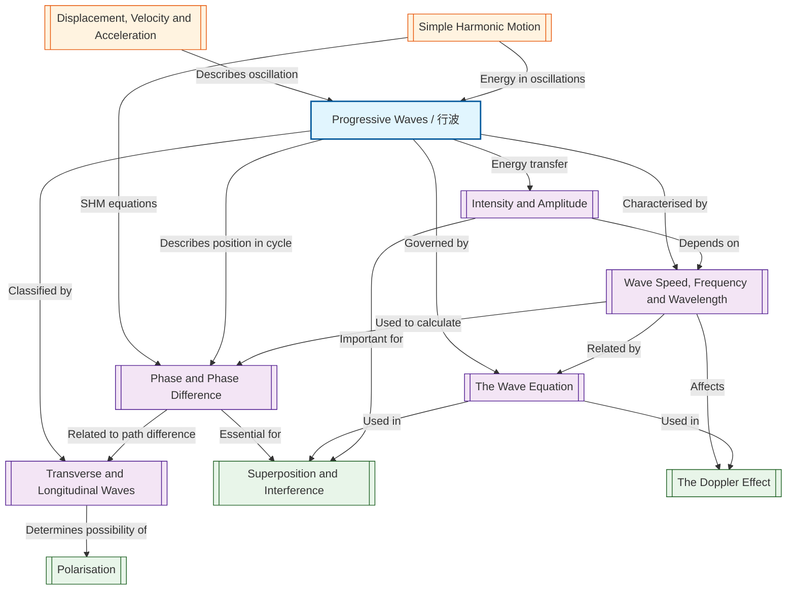

# 1. Overview / 概述

**English:**
Progressive waves are a fundamental concept in physics that describes how energy and information travel through space and time without the permanent transfer of matter. A progressive wave (also called a travelling wave) is a disturbance that moves through a medium, carrying energy from one location to another. This topic forms the foundation for understanding all wave phenomena in A-Level physics, including [[Superposition and Interference]], [[Polarisation]], and [[The Doppler Effect]].

In both Cambridge 9702 and Edexcel IAL syllabuses, progressive waves are introduced at AS Level as a core topic. Students learn to distinguish between [[Transverse and Longitudinal Waves]], relate [[Wave Speed, Frequency and Wavelength]] using [[The Wave Equation]], and understand concepts like [[Phase and Phase Difference]] and [[Intensity and Amplitude]].

Real-world applications are vast: from sound waves enabling communication and music, to electromagnetic waves powering wireless technology, medical imaging (ultrasound), and seismic wave analysis for earthquake prediction. Understanding progressive waves is essential for careers in engineering, telecommunications, acoustics, and medical physics.

**中文：**
行波是物理学中的一个基本概念，描述了能量和信息如何在空间中传播而不伴随物质的永久转移。行波（也称为传播波）是一种在介质中传播的扰动，将能量从一个位置传递到另一个位置。本主题构成了理解A-Level物理中所有波动现象的基础，包括[[叠加与干涉]]、[[偏振]]和[[多普勒效应]]。

在剑桥9702和爱德思IAL教学大纲中，行波在AS阶段作为核心主题引入。学生学习区分[[横波与纵波]]，使用[[波动方程]]关联[[波速、频率和波长]]，并理解[[相位与相位差]]以及[[强度与振幅]]等概念。

实际应用非常广泛：从实现通信和音乐的声波，到驱动无线技术的电磁波、医学成像（超声波）以及用于地震预测的地震波分析。理解行波对于工程、电信、声学和医学物理等职业至关重要。

---

# 2. Syllabus Learning Objectives / 考纲学习目标

| CAIE 9702 (7.1 a-e) | Edexcel IAL (WPH11 U2: 5.1-5.5) |
|---------------------|----------------------------------|
| 7.1(a) Describe what is meant by wave motion as illustrated by vibration in ropes and springs and by experiments using water waves | 5.1 Understand the difference between transverse and longitudinal waves and be able to describe examples of each |
| 7.1(b) Understand the terms displacement, amplitude, period, frequency, wavelength and speed | 5.2 Understand the terms displacement, amplitude, period, frequency, wavelength and wave speed |
| 7.1(c) Derive and use the wave equation v = fλ | 5.3 Use the wave equation v = fλ |
| 7.1(d) Understand the terms phase and phase difference and describe the relationship between phase difference and path difference | 5.4 Understand the concept of phase difference and its relationship to path difference |
| 7.1(e) Understand the concept of wave intensity and its relationship to amplitude | 5.5 Understand the relationship between intensity and amplitude for a progressive wave |

**Examiner Expectations / 考官期望：**

**English:**
- Candidates must be able to define all wave terms precisely using exam-standard wording
- The wave equation derivation from fundamental principles is expected (not just memorisation)
- Phase difference calculations must be expressed in both radians and fractions of a wavelength
- Intensity calculations typically involve the square of amplitude relationship
- Practical contexts (ripple tank, slinky springs) are frequently tested

**中文：**
- 考生必须能够使用考试标准措辞精确定义所有波动术语
- 期望从基本原理推导波动方程（不仅仅是记忆）
- 相位差计算必须以弧度和波长分数两种形式表达
- 强度计算通常涉及振幅的平方关系
- 实验背景（波纹槽、弹簧）经常被测试

> 📋 **CIE Only:** CAIE specifically requires derivation of v = fλ using the definition of wave speed as distance/time. Practical experiments with ripple tanks and microwaves are explicitly mentioned in the syllabus.
>
> 📋 **Edexcel Only:** Edexcel emphasises the relationship between phase difference and path difference more explicitly, and requires students to understand the concept of wavefronts and rays.

---

# 3. Core Definitions / 核心定义

| Term (EN/CN) | Definition (EN) | Definition (CN) | Common Mistakes / 常见错误 |
|--------------|-----------------|-----------------|---------------------------|
| **Progressive Wave / 行波** | A wave that transfers energy from one point to another without transferring the medium itself | 将能量从一个点传递到另一个点而不传递介质本身的波 | Confusing with stationary waves; thinking particles move with the wave |
| **Displacement (x) / 位移** | The distance of a point on the wave from its equilibrium position at a given instant | 在给定时刻，波上某点距其平衡位置的距离 | Confusing with amplitude; forgetting it can be positive or negative |
| **Amplitude (A) / 振幅** | The maximum displacement of a point on the wave from its equilibrium position | 波上某点距平衡位置的最大位移 | Thinking amplitude changes as wave travels (in ideal case it doesn't) |
| **Period (T) / 周期** | The time taken for one complete oscillation of a point on the wave | 波上某点完成一次完整振动所需的时间 | Confusing with frequency; using wrong units |
| **Frequency (f) / 频率** | The number of complete oscillations per unit time passing a fixed point | 单位时间内通过固定点的完整振动次数 | Confusing f with ω (angular frequency); forgetting unit is Hz |
| **Wavelength (λ) / 波长** | The distance between two successive points on a wave that are in phase | 波上两个连续同相点之间的距离 | Measuring from crest to trough instead of crest to crest |
| **Wave Speed (v) / 波速** | The speed at which the wavefront travels through the medium | 波前在介质中传播的速度 | Confusing with particle speed; thinking it depends on frequency |
| **Phase / 相位** | A measure of the position of a point on a wave cycle relative to a reference point | 波上某点在振动周期中相对于参考点的位置度量 | Using degrees when radians are expected; confusing with phase difference |
| **Phase Difference (Δφ) / 相位差** | The difference in phase between two points on a wave, measured in radians or fractions of a wavelength | 波上两点之间的相位差异，以弧度或波长分数度量 | Forgetting 2π rad = 360° = 1λ; sign conventions |
| **Intensity (I) / 强度** | The power transferred per unit area perpendicular to the direction of wave propagation | 垂直于波传播方向单位面积上传递的功率 | Confusing with amplitude; forgetting I ∝ A² |
| **Wavefront / 波前** | An imaginary line or surface joining points on a wave that are in phase | 连接波上同相各点的假想线或面 | Confusing with ray direction |
| **Ray / 射线** | A line indicating the direction of wave propagation, perpendicular to wavefronts | 指示波传播方向的线，垂直于波前 | Drawing rays parallel to wavefronts |

---

# 4. Key Concepts Explained / 关键概念详解

## 4.1 Nature of Progressive Waves / 行波的性质

### Explanation / 解释
**English:**
A progressive wave is a disturbance that travels through a medium (or through space for electromagnetic waves) carrying energy. The key characteristic is that energy is transferred, but the particles of the medium do not travel with the wave — they oscillate about their equilibrium positions. This distinguishes wave motion from the bulk movement of matter.

For a mechanical progressive wave, the medium must have two properties:
1. **Elasticity** — to restore particles to equilibrium
2. **Inertia** — to allow oscillations to continue

The wave can be described by the wave function:
$$ y(x,t) = A \sin(\omega t - kx + \phi) $$

where $y$ is displacement, $A$ is amplitude, $\omega$ is angular frequency, $k$ is wave number, and $\phi$ is initial phase.

**中文：**
行波是一种在介质中（或对于电磁波在空间中）传播并携带能量的扰动。关键特征是能量被传递，但介质的粒子并不随波移动——它们围绕平衡位置振动。这区分了波动与物质的整体运动。

对于机械行波，介质必须具有两个性质：
1. **弹性** — 使粒子恢复到平衡位置
2. **惯性** — 使振动能够持续

波可以用波函数描述：
$$ y(x,t) = A \sin(\omega t - kx + \phi) $$

其中 $y$ 是位移，$A$ 是振幅，$\omega$ 是角频率，$k$ 是波数，$\phi$ 是初相位。

### Physical Meaning / 物理意义
**English:**
Imagine dropping a stone into a still pond. The ripples that spread outward are progressive waves. The water particles move up and down (or in circles), but they don't travel outward with the ripples — a leaf floating on the surface will bob up and down but stay in roughly the same place. The energy of the splash travels outward, not the water itself.

**中文：**
想象将一块石头扔进平静的池塘。向外扩散的涟漪就是行波。水粒子上下运动（或做圆周运动），但它们并不随涟漪向外移动——漂浮在水面上的叶子会上下浮动，但大致停留在原地。溅起的水花能量向外传播，而不是水本身。

### Common Misconceptions / 常见误区
1. **Particles move with the wave** — Particles oscillate about equilibrium, they do not travel with the wave
2. **Wave speed depends on amplitude** — For most waves, speed is independent of amplitude (except for shock waves)
3. **All waves need a medium** — Electromagnetic waves can travel through vacuum
4. **Wave speed = particle speed** — These are completely different quantities

### Exam Tips / 考试提示
**English:**
- Cambridge often asks students to describe wave motion using diagrams of ropes and springs
- Edexcel frequently tests the distinction between wave speed and particle speed
- Both boards expect students to explain why energy is transferred but matter is not

**中文：**
- 剑桥常要求学生使用绳子和弹簧的图表描述波动
- 爱德思经常测试波速与粒子速度的区别
- 两个考试局都期望学生解释为什么能量被传递而物质不被传递

> 📷 **IMAGE PROMPT — [WP-01]: Progressive Wave on a Spring**
>
> A detailed diagram showing a slinky spring with labelled regions of compression and rarefaction. The wave is shown propagating from left to right. Individual coils are highlighted with arrows showing their oscillation direction (parallel to wave direction). Labels include: wavelength (λ), amplitude (A), direction of wave travel, direction of particle oscillation. Clean white background, educational style, 2D side view, with clear colour coding (blue for compression, red for rarefaction).

---

## 4.2 Transverse and Longitudinal Waves / 横波与纵波

### Explanation / 解释
**English:**
Waves are classified by the direction of particle oscillation relative to the direction of wave propagation:

**Transverse Waves:** Particles oscillate perpendicular to the direction of wave travel.
- Examples: Electromagnetic waves, waves on a string, water waves (surface)
- Can be polarised

**Longitudinal Waves:** Particles oscillate parallel to the direction of wave travel.
- Examples: Sound waves, seismic P-waves, compression waves in a spring
- Cannot be polarised

**中文：**
波根据粒子振动方向相对于波传播方向进行分类：

**横波：** 粒子振动方向垂直于波的传播方向。
- 示例：电磁波、弦上的波、水波（表面）
- 可以偏振

**纵波：** 粒子振动方向平行于波的传播方向。
- 示例：声波、地震P波、弹簧中的压缩波
- 不能偏振

### Physical Meaning / 物理意义
**English:**
- **Transverse:** Think of shaking one end of a rope up and down — the wave travels horizontally while the rope moves vertically
- **Longitudinal:** Think of a slinky spring pushed and pulled at one end — the compression travels along the spring while the coils oscillate back and forth

**中文：**
- **横波：** 想象上下抖动绳子的一端——波水平传播，而绳子垂直运动
- **纵波：** 想象推拉弹簧的一端——压缩沿弹簧传播，而线圈来回振动

### Common Misconceptions / 常见误区
1. **Water waves are purely transverse** — Water particles actually move in circular/elliptical paths (combination of transverse and longitudinal)
2. **Sound waves cannot be transverse** — In solids, sound can have both transverse and longitudinal components
3. **All transverse waves can be polarised** — Only transverse waves can be polarised, but not all transverse waves show polarisation easily

### Exam Tips / 考试提示
**English:**
- Cambridge typically asks students to give examples of each type
- Edexcel often tests the polarisation criterion as a way to distinguish wave types
- Both boards expect labelled diagrams showing particle oscillation directions

**中文：**
- 剑桥通常要求学生给出每种类型的示例
- 爱德思经常测试偏振标准作为区分波类型的方法
- 两个考试局都期望有标注粒子振动方向的图表

> 📷 **IMAGE PROMPT — [WP-02]: Transverse vs Longitudinal Waves Comparison**
>
> Split-screen comparison diagram. Left side: Transverse wave showing a sinusoidal wave on a rope with vertical arrows indicating particle oscillation and horizontal arrow for wave direction. Right side: Longitudinal wave showing a slinky spring with horizontal arrows indicating particle oscillation and horizontal arrow for wave direction. Labels: wavelength (λ), amplitude (A), compression, rarefaction, direction of wave travel, direction of particle oscillation. Clean educational style, 2D, colour-coded (blue for transverse, red for longitudinal).

---

## 4.3 Wave Speed, Frequency and Wavelength / 波速、频率和波长

### Explanation / 解释
**English:**
These three quantities are related by the fundamental wave equation. Understanding each quantity independently is crucial:

- **Wavelength (λ):** The spatial period of the wave — the distance over which the wave's shape repeats. Measured in metres (m).
- **Frequency (f):** The number of complete wave cycles passing a fixed point per second. Measured in hertz (Hz = s⁻¹).
- **Wave Speed (v):** The speed at which the wavefront propagates. Measured in metres per second (m s⁻¹).

For a given medium, wave speed is constant (for a given wave type). Changing frequency changes wavelength proportionally.

**中文：**
这三个量由基本波动方程关联。独立理解每个量至关重要：

- **波长 (λ)：** 波的空间周期——波形状重复的距离。以米 (m) 为单位。
- **频率 (f)：** 每秒通过固定点的完整波周期数。以赫兹 (Hz = s⁻¹) 为单位。
- **波速 (v)：** 波前传播的速度。以米每秒 (m s⁻¹) 为单位。

对于给定的介质，波速是恒定的（对于给定的波类型）。改变频率会成比例地改变波长。

### Physical Meaning / 物理意义
**English:**
- If you increase the frequency of a wave (e.g., play a higher note on a guitar), the wavelength decreases if the wave speed stays the same
- Wave speed depends on the medium properties (tension and density for strings; bulk modulus and density for sound; permittivity and permeability for EM waves)

**中文：**
- 如果增加波的频率（例如，在吉他上弹奏更高的音符），如果波速保持不变，波长会减小
- 波速取决于介质性质（弦的张力与密度；声音的体积模量与密度；电磁波的介电常数与磁导率）

### Common Misconceptions / 常见误区
1. **Frequency changes when wave enters a new medium** — Frequency is determined by the source and remains constant
2. **Wave speed depends on frequency** — For most waves, speed is independent of frequency (dispersion is an exception)
3. **Wavelength is the distance from crest to trough** — It's crest to crest (or any two successive in-phase points)

### Exam Tips / 考试提示
**English:**
- Both boards frequently ask students to calculate one quantity given the other two
- Cambridge often uses ripple tank experiments to determine wave speed
- Edexcel frequently uses the context of sound waves and electromagnetic waves

**中文：**
- 两个考试局经常要求学生在已知两个量的情况下计算第三个量
- 剑桥常使用波纹槽实验来确定波速
- 爱德思经常使用声波和电磁波的背景

---

## 4.4 Phase and Phase Difference / 相位与相位差

### Explanation / 解释
**English:**
**Phase** describes the position of a point on a wave cycle relative to a reference point. It is measured in radians (rad) or degrees (°), where one complete cycle corresponds to 2π rad (360°).

**Phase Difference (Δφ)** is the difference in phase between two points on a wave. It can be calculated from:
- Path difference (Δx): $$ \Delta\phi = \frac{2\pi}{\lambda} \Delta x $$
- Time difference (Δt): $$ \Delta\phi = \frac{2\pi}{T} \Delta t $$

Key relationships:
- Points in phase: Δφ = 0, 2π, 4π, ... (or 0°, 360°, 720°, ...)
- Points in antiphase: Δφ = π, 3π, 5π, ... (or 180°, 540°, ...)
- Points with phase difference of π/2: Δφ = π/2, 5π/2, ... (or 90°, 450°, ...)

**中文：**
**相位** 描述波上某点在振动周期中相对于参考点的位置。以弧度 (rad) 或度 (°) 度量，一个完整周期对应 2π rad (360°)。

**相位差 (Δφ)** 是波上两点之间的相位差异。可以通过以下方式计算：
- 路程差 (Δx)：$$ \Delta\phi = \frac{2\pi}{\lambda} \Delta x $$
- 时间差 (Δt)：$$ \Delta\phi = \frac{2\pi}{T} \Delta t $$

关键关系：
- 同相点：Δφ = 0, 2π, 4π, ...（或 0°, 360°, 720°, ...）
- 反相点：Δφ = π, 3π, 5π, ...（或 180°, 540°, ...）
- 相位差为 π/2 的点：Δφ = π/2, 5π/2, ...（或 90°, 450°, ...）

### Physical Meaning / 物理意义
**English:**
Phase difference tells us how "out of step" two points on a wave are. If two points are in phase, they reach maximum displacement at the same time. If they are in antiphase, one reaches maximum positive displacement while the other reaches maximum negative displacement.

**中文：**
相位差告诉我们波上两点"不同步"的程度。如果两点同相，它们同时达到最大位移。如果它们反相，一个达到最大正位移，而另一个达到最大负位移。

### Common Misconceptions / 常见误区
1. **Phase difference is always between 0 and 2π** — It can be any multiple of 2π; we usually take the smallest value
2. **Path difference = phase difference** — They are proportional but not equal; Δφ = (2π/λ) × Δx
3. **Points one wavelength apart have zero phase difference** — Correct! They are in phase

### Exam Tips / 考试提示
**English:**
- Cambridge often asks students to calculate phase difference from path difference
- Edexcel frequently tests the relationship between phase difference and interference patterns
- Both boards expect answers in radians for A-level work

**中文：**
- 剑桥常要求学生从路程差计算相位差
- 爱德思经常测试相位差与干涉图样之间的关系
- 两个考试局都期望在A-Level工作中以弧度作答

---

## 4.5 Intensity and Amplitude / 强度与振幅

### Explanation / 解释
**English:**
**Intensity (I)** is the power transferred per unit area perpendicular to the direction of wave propagation. For a progressive wave, intensity is proportional to the square of the amplitude:

$$ I \propto A^2 $$

More precisely, for a mechanical wave:
$$ I = \frac{1}{2} \rho v \omega^2 A^2 $$

where ρ is the density of the medium, v is wave speed, and ω is angular frequency.

For a point source emitting spherical waves, intensity decreases with distance according to the inverse square law:
$$ I \propto \frac{1}{r^2} $$

**中文：**
**强度 (I)** 是垂直于波传播方向单位面积上传递的功率。对于行波，强度与振幅的平方成正比：

$$ I \propto A^2 $$

更精确地说，对于机械波：
$$ I = \frac{1}{2} \rho v \omega^2 A^2 $$

其中 ρ 是介质密度，v 是波速，ω 是角频率。

对于发射球面波的点源，强度随距离按平方反比定律减小：
$$ I \propto \frac{1}{r^2} $$

### Physical Meaning / 物理意义
**English:**
- Doubling the amplitude of a sound wave quadruples its intensity (makes it 4 times louder in terms of energy)
- A wave spreading out from a point source becomes weaker because the same energy is spread over a larger area
- This is why distant stars appear dimmer — their light spreads out over a sphere of increasing radius

**中文：**
- 将声波的振幅加倍会使其强度变为四倍（能量方面变响4倍）
- 从点源扩散的波变弱，因为相同的能量分布在更大的面积上
- 这就是为什么遥远的恒星看起来更暗——它们的光在半径不断增大的球面上扩散

### Common Misconceptions / 常见误区
1. **Intensity is the same as amplitude** — They are related but different; I ∝ A²
2. **Intensity decreases linearly with distance** — For spherical waves, I ∝ 1/r²
3. **Amplitude decreases linearly with distance** — For spherical waves, A ∝ 1/r

### Exam Tips / 考试提示
**English:**
- Cambridge often asks students to calculate the ratio of intensities given amplitude ratios
- Edexcel frequently tests the inverse square law in the context of electromagnetic radiation
- Both boards expect students to understand why intensity decreases with distance

**中文：**
- 剑桥常要求学生在给定振幅比的情况下计算强度比
- 爱德思经常在电磁辐射的背景下测试平方反比定律
- 两个考试局都期望学生理解强度随距离减小的原因

---

# 5. Essential Equations / 核心公式

## 5.1 The Wave Equation / 波动方程

**Equation / 公式:**
$$ v = f\lambda $$

**Variables / 变量:**
| Symbol (符号) | Meaning (EN) | Meaning (CN) | Unit (单位) |
|--------------|-------------|-------------|------------|
| v | Wave speed | 波速 | m s⁻¹ |
| f | Frequency | 频率 | Hz (s⁻¹) |
| λ | Wavelength | 波长 | m |

**Derivation / 推导:**
**English:**
Consider one complete wave cycle. In one period T, the wave travels one wavelength λ.
Wave speed = distance / time = λ / T
Since f = 1/T, therefore v = fλ

**中文：**
考虑一个完整的波周期。在一个周期 T 内，波传播一个波长 λ。
波速 = 距离 / 时间 = λ / T
由于 f = 1/T，因此 v = fλ

**Conditions / 适用条件:**
**English:** Applies to all progressive waves (mechanical and electromagnetic) in any medium.
**中文：** 适用于任何介质中的所有行波（机械波和电磁波）。

**Limitations / 局限性:**
**English:** Does not account for dispersion (where wave speed depends on frequency). In dispersive media, different frequencies travel at different speeds.
**中文：** 不考虑色散（波速取决于频率的情况）。在色散介质中，不同频率以不同速度传播。

**Rearrangements / 变形:**
$$ f = \frac{v}{\lambda} \quad \text{and} \quad \lambda = \frac{v}{f} $$

---

## 5.2 Phase Difference Equation / 相位差方程

**Equation / 公式:**
$$ \Delta\phi = \frac{2\pi}{\lambda} \Delta x $$

**Variables / 变量:**
| Symbol (符号) | Meaning (EN) | Meaning (CN) | Unit (单位) |
|--------------|-------------|-------------|------------|
| Δφ | Phase difference | 相位差 | rad |
| λ | Wavelength | 波长 | m |
| Δx | Path difference | 路程差 | m |

**Derivation / 推导:**
**English:**
One complete wavelength corresponds to a phase change of 2π radians.
Therefore, phase difference per unit distance = 2π/λ.
For a path difference Δx, the phase difference is (2π/λ) × Δx.

**中文：**
一个完整波长对应 2π 弧度的相位变化。
因此，单位距离的相位差 = 2π/λ。
对于路程差 Δx，相位差为 (2π/λ) × Δx。

**Conditions / 适用条件:**
**English:** Applies to waves of the same frequency travelling in the same medium.
**中文：** 适用于在同一介质中传播的同频率波。

**Limitations / 局限性:**
**English:** Assumes waves are coherent (constant phase relationship). Does not account for phase changes upon reflection.
**中文：** 假设波是相干的（恒定相位关系）。不考虑反射时的相位变化。

**Rearrangements / 变形:**
$$ \Delta x = \frac{\lambda}{2\pi} \Delta\phi \quad \text{and} \quad \lambda = \frac{2\pi \Delta x}{\Delta\phi} $$

---

## 5.3 Intensity-Amplitude Relationship / 强度-振幅关系

**Equation / 公式:**
$$ I \propto A^2 $$

**Variables / 变量:**
| Symbol (符号) | Meaning (EN) | Meaning (CN) | Unit (单位) |
|--------------|-------------|-------------|------------|
| I | Intensity | 强度 | W m⁻² |
| A | Amplitude | 振幅 | m |

**Derivation / 推导:**
**English:**
For a mechanical wave, the energy per unit volume is proportional to the square of the amplitude (from SHM energy: E ∝ A²).
Power = energy per unit time, and intensity = power per unit area.
Therefore, I ∝ A².

**中文：**
对于机械波，单位体积的能量与振幅的平方成正比（来自简谐运动能量：E ∝ A²）。
功率 = 单位时间的能量，强度 = 单位面积的功率。
因此，I ∝ A²。

**Conditions / 适用条件:**
**English:** Applies to all progressive waves in non-dissipative media.
**中文：** 适用于非耗散介质中的所有行波。

**Limitations / 局限性:**
**English:** Does not account for energy losses due to absorption or scattering in the medium.
**中文：** 不考虑介质中由于吸收或散射造成的能量损失。

**Rearrangements / 变形:**
$$ \frac{I_1}{I_2} = \frac{A_1^2}{A_2^2} \quad \text{and} \quad A \propto \sqrt{I} $$

---

## 5.4 Inverse Square Law for Intensity / 强度的平方反比定律

**Equation / 公式:**
$$ I \propto \frac{1}{r^2} $$

**Variables / 变量:**
| Symbol (符号) | Meaning (EN) | Meaning (CN) | Unit (单位) |
|--------------|-------------|-------------|------------|
| I | Intensity at distance r | 距离 r 处的强度 | W m⁻² |
| r | Distance from point source | 距点源的距离 | m |

**Derivation / 推导:**
**English:**
For a point source emitting total power P, the power spreads uniformly over a sphere of surface area 4πr².
Intensity = Power / Area = P / (4πr²)
Therefore, I ∝ 1/r².

**中文：**
对于发射总功率 P 的点源，功率均匀分布在表面积为 4πr² 的球面上。
强度 = 功率 / 面积 = P / (4πr²)
因此，I ∝ 1/r²。

**Conditions / 适用条件:**
**English:** Applies to point sources emitting waves isotropically (equally in all directions) in a non-absorbing medium.
**中文：** 适用于在非吸收介质中各向同性（所有方向均匀）发射波的点源。

**Limitations / 局限性:**
**English:** Does not apply to plane waves (which have constant intensity) or to sources that are not point-like.
**中文：** 不适用于平面波（强度恒定）或非点状源。

**Rearrangements / 变形:**
$$ I_1 r_1^2 = I_2 r_2^2 \quad \text{and} \quad \frac{I_1}{I_2} = \frac{r_2^2}{r_1^2} $$

---

# 6. Graphs and Relationships / 图表与关系

## 6.1 Displacement-Distance Graph (Snapshot Graph) / 位移-距离图（快照图）

### Axes / 坐标轴
**English:** x-axis: Distance along wave (m); y-axis: Displacement (m)
**中文：** x轴：沿波的距离 (m)；y轴：位移 (m)

### Shape / 形状
**English:** Sinusoidal wave showing the instantaneous positions of all particles along the wave at one specific time.
**中文：** 正弦波，显示在某一特定时刻沿波所有粒子的瞬时位置。

### Gradient Meaning / 斜率含义
**English:** The gradient at any point represents the strain (relative displacement between adjacent particles) in the medium.
**中文：** 任意点的梯度表示介质中的应变（相邻粒子之间的相对位移）。

### Area Meaning / 面积含义
**English:** No direct physical meaning for area under this graph.
**中文：** 此图下的面积没有直接的物理意义。

### Exam Interpretation / 考试解读
**English:**
- Wavelength λ is the distance between two successive crests (or any two successive in-phase points)
- Amplitude A is the maximum displacement from equilibrium
- Phase difference between two points can be determined from their separation

**中文：**
- 波长 λ 是两个连续波峰（或任何两个连续同相点）之间的距离
- 振幅 A 是距平衡位置的最大位移
- 两点之间的相位差可以从它们的间距确定

### Common Questions / 常见问题
**English:**
- "Determine the wavelength and amplitude from the graph"
- "Calculate the phase difference between points X and Y"
- "Sketch the graph after a time t"

**中文：**
- "从图中确定波长和振幅"
- "计算点X和点Y之间的相位差"
- "画出时间 t 后的图"

> 📷 **IMAGE PROMPT — [WP-03]: Displacement-Distance Graph**
>
> A sinusoidal wave graph with labelled axes: x-axis "Distance along wave / m", y-axis "Displacement / m". The wave shows crests and troughs with labelled amplitude (A) as vertical arrow from equilibrium to crest, and wavelength (λ) as horizontal arrow between two successive crests. Points labelled P, Q, R at different positions to show phase relationships. Clean white background, grid lines, educational style.

---

## 6.2 Displacement-Time Graph / 位移-时间图

### Axes / 坐标轴
**English:** x-axis: Time (s); y-axis: Displacement (m)
**中文：** x轴：时间 (s)；y轴：位移 (m)

### Shape / 形状
**English:** Sinusoidal wave showing the oscillation of a single point on the wave over time.
**中文：** 正弦波，显示波上单个点随时间变化的振动。

### Gradient Meaning / 斜率含义
**English:** The gradient at any point represents the velocity of the particle at that instant.
**中文：** 任意点的梯度表示该时刻粒子的速度。

### Area Meaning / 面积含义
**English:** No direct physical meaning for area under this graph.
**中文：** 此图下的面积没有直接的物理意义。

### Exam Interpretation / 考试解读
**English:**
- Period T is the time between two successive crests
- Frequency f = 1/T
- Amplitude A is the maximum displacement
- The gradient (steepness) indicates particle speed

**中文：**
- 周期 T 是两个连续波峰之间的时间
- 频率 f = 1/T
- 振幅 A 是最大位移
- 梯度（陡度）表示粒子速度

### Common Questions / 常见问题
**English:**
- "Determine the period and frequency from the graph"
- "Calculate the particle velocity at a given time"
- "Sketch the displacement-time graph for a point with a phase difference of π/2"

**中文：**
- "从图中确定周期和频率"
- "计算给定时刻的粒子速度"
- "画出相位差为 π/2 的点的位移-时间图"

> 📷 **IMAGE PROMPT — [WP-04]: Displacement-Time Graph**
>
> A sinusoidal wave graph with labelled axes: x-axis "Time / s", y-axis "Displacement / m". The wave shows crests and troughs with labelled amplitude (A) as vertical arrow from equilibrium to crest, and period (T) as horizontal arrow between two successive crests. A tangent line drawn at a point to show gradient representing particle velocity. Clean white background, grid lines, educational style.

---

## 6.3 Intensity-Distance Graph for a Point Source / 点源的强度-距离图

### Axes / 坐标轴
**English:** x-axis: Distance from source (m); y-axis: Intensity (W m⁻²)
**中文：** x轴：距源的距离 (m)；y轴：强度 (W m⁻²)

### Shape / 形状
**English:** A decreasing curve following I ∝ 1/r². The curve is steep near the source and flattens at larger distances.
**中文：** 遵循 I ∝ 1/r² 的递减曲线。曲线在源附近陡峭，在较大距离处变平。

### Gradient Meaning / 斜率含义
**English:** The gradient represents the rate of change of intensity with distance. It is negative and becomes less steep with distance.
**中文：** 梯度表示强度随距离的变化率。它为负，并随距离增加而变缓。

### Area Meaning / 面积含义
**English:** No direct physical meaning for area under this graph.
**中文：** 此图下的面积没有直接的物理意义。

### Exam Interpretation / 考试解读
**English:**
- At double the distance, intensity is one-quarter
- At triple the distance, intensity is one-ninth
- The graph can be linearised by plotting I against 1/r²

**中文：**
- 距离加倍时，强度变为四分之一
- 距离变为三倍时，强度变为九分之一
- 可以通过绘制 I 对 1/r² 的图来线性化

### Common Questions / 常见问题
**English:**
- "Calculate the intensity at a given distance"
- "Determine the distance at which intensity is halved"
- "Explain why the intensity decreases with distance"

**中文：**
- "计算给定距离处的强度"
- "确定强度减半时的距离"
- "解释强度随距离减小的原因"

---

# 7. Required Diagrams / 必备图表

## 7.1 Progressive Wave on a Slinky Spring / 弹簧上的行波

### Description / 描述
**English:**
A diagram showing a slinky spring with a longitudinal wave propagating through it. The spring should show alternating regions of compression (coils close together) and rarefaction (coils spread apart). Arrows indicate the direction of wave propagation and the direction of particle oscillation (both horizontal for longitudinal waves). Labels include wavelength (distance between successive compressions), amplitude (maximum displacement of a coil from equilibrium), and the direction of energy transfer.

**中文：**
显示纵波在其中传播的弹簧图。弹簧应显示交替的压缩区（线圈靠拢）和稀疏区（线圈分开）。箭头指示波传播方向和粒子振动方向（纵波均为水平方向）。标注包括波长（连续压缩之间的距离）、振幅（线圈距平衡位置的最大位移）和能量传递方向。

### Image Prompt / 图片生成提示
> 📷 **IMAGE PROMPT — [WP-05]: Longitudinal Wave on Slinky Spring**
>
> A detailed 2D side-view diagram of a slinky spring showing a longitudinal wave. The spring has clearly visible coils with alternating regions labelled "Compression" (coils close together, highlighted in blue) and "Rarefaction" (coils spread apart, highlighted in red). A horizontal arrow above the spring labelled "Direction of wave travel →". A horizontal arrow near a single coil labelled "Direction of particle oscillation ↔". A bracket showing wavelength (λ) between two successive compressions. A small double-headed arrow showing amplitude (A) for one coil's oscillation. Clean educational style, white background, professional labelling.

### Labels Required / 需要标注
| English | 中文 |
|---------|------|
| Compression | 压缩区 |
| Rarefaction | 稀疏区 |
| Wavelength (λ) | 波长 (λ) |
| Amplitude (A) | 振幅 (A) |
| Direction of wave travel | 波传播方向 |
| Direction of particle oscillation | 粒子振动方向 |

### Exam Importance / 考试重要性
**English:**
Cambridge and Edexcel both use this diagram to test understanding of longitudinal waves. Students are often asked to identify compressions and rarefactions, measure wavelength, and explain the difference between wave speed and particle speed.

**中文：**
剑桥和爱德思都使用此图来测试对纵波的理解。学生常被要求识别压缩区和稀疏区、测量波长，并解释波速与粒子速度的区别。

---

## 7.2 Ripple Tank Setup / 波纹槽装置

### Description / 描述
**English:**
A diagram showing a ripple tank used to demonstrate wave properties. The tank is a shallow glass-bottomed tray filled with water. A vibrating bar (straight dipper) creates plane waves, while a point dipper creates circular waves. An overhead light source projects shadows of the wave crests onto a screen below. The diagram should show the arrangement of the light source, the vibrating bar, the water surface, and the projected pattern on the screen.

**中文：**
显示用于演示波动性质的波纹槽图。该槽是一个浅的玻璃底托盘，装满水。振动棒（直棒）产生平面波，而点棒产生圆形波。上方的光源将波峰的阴影投射到下方的屏幕上。图应显示光源、振动棒、水面和屏幕上投影图样的布置。

### Image Prompt / 图片生成提示
> 📷 **IMAGE PROMPT — [WP-06]: Ripple Tank Experimental Setup**
>
> A 3D isometric diagram of a ripple tank experiment. The tank is a rectangular glass-bottomed tray with water (light blue). Above the tank: a vibrating motor connected to a straight dipper touching the water surface. Above the motor: a bright light source. Below the tank: a white screen showing projected wave pattern (alternating bright and dark lines representing crests and troughs). Labels: "Light source", "Vibrating motor", "Straight dipper", "Water surface", "Projected pattern on screen", "Crest (bright)", "Trough (dark)". Clean educational style, professional diagram.

### Labels Required / 需要标注
| English | 中文 |
|---------|------|
| Light source | 光源 |
| Vibrating motor | 振动电机 |
| Straight dipper | 直棒 |
| Water surface | 水面 |
| Projected pattern | 投影图样 |
| Crest (bright line) | 波峰（亮线） |
| Trough (dark line) | 波谷（暗线） |

### Exam Importance / 考试重要性
**English:**
The ripple tank is a core practical for both syllabuses. Students must understand how it demonstrates wave properties including reflection, refraction, diffraction, and interference. Cambridge Paper 3 and Edexcel Unit 3 both test practical skills related to this setup.

**中文：**
波纹槽是两个教学大纲的核心实验。学生必须理解它如何演示波动性质，包括反射、折射、衍射和干涉。剑桥Paper 3和爱德思Unit 3都测试与此设置相关的实验技能。

---

## 7.3 Wavefront and Ray Diagram / 波前与射线图

### Description / 描述
**English:**
A diagram showing wavefronts (lines or surfaces joining points in phase) and rays (lines perpendicular to wavefronts indicating direction of propagation). For plane waves, wavefronts are parallel straight lines and rays are parallel straight lines perpendicular to them. For circular waves from a point source, wavefronts are concentric circles and rays radiate outward from the source.

**中文：**
显示波前（连接同相点的线或面）和射线（垂直于波前的线，指示传播方向）的图。对于平面波，波前是平行的直线，射线是垂直于它们的平行直线。对于点源发出的圆形波，波前是同心圆，射线从源向外辐射。

### Image Prompt / 图片生成提示
> 📷 **IMAGE PROMPT — [WP-07]: Wavefronts and Rays**
>
> Split-screen diagram. Left side: Plane waves showing 5 parallel straight lines (wavefronts) with equally spaced perpendicular arrows (rays) pointing right. Labels: "Wavefronts", "Rays (direction of propagation)". Right side: Circular waves showing 5 concentric circles (wavefronts) with radial arrows (rays) pointing outward from centre. Labels: "Point source", "Circular wavefronts", "Rays". Clean educational style, 2D, colour-coded (blue for wavefronts, red for rays).

### Labels Required / 需要标注
| English | 中文 |
|---------|------|
| Wavefront | 波前 |
| Ray | 射线 |
| Direction of propagation | 传播方向 |
| Point source | 点源 |
| Plane wave | 平面波 |
| Circular wave | 圆形波 |

### Exam Importance / 考试重要性
**English:**
Wavefront diagrams are essential for understanding [[Superposition and Interference]], [[Polarisation]], and [[The Doppler Effect]]. Both boards use these diagrams to explain Huygens' principle and wave behaviour at boundaries.

**中文：**
波前图对于理解[[叠加与干涉]]、[[偏振]]和[[多普勒效应]]至关重要。两个考试局都使用这些图来解释惠更斯原理和波在边界处的行为。

---

# 8. Worked Examples / 典型例题

## Example 1: Wave Speed Calculation / 示例1：波速计算

### Question / 题目
**English:**
A progressive wave has a frequency of 250 Hz and a wavelength of 1.2 m. Calculate:
(a) The speed of the wave
(b) The period of the wave
(c) The time taken for the wave to travel 15 m

**中文：**
一行波的频率为 250 Hz，波长为 1.2 m。计算：
(a) 波的速度
(b) 波的周期
(c) 波传播 15 m 所需的时间

### Solution / 解答

**Part (a): Wave speed**
$$ v = f\lambda = 250 \times 1.2 = 300 \text{ m s}^{-1} $$

**Part (b): Period**
$$ T = \frac{1}{f} = \frac{1}{250} = 0.004 \text{ s} = 4.0 \times 10^{-3} \text{ s} $$

**Part (c): Time to travel 15 m**
$$ t = \frac{d}{v} = \frac{15}{300} = 0.05 \text{ s} = 5.0 \times 10^{-2} \text{ s} $$

### Final Answer / 最终答案
**Answer:** (a) 300 m s⁻¹ | (b) 4.0 × 10⁻³ s | (c) 5.0 × 10⁻² s
**答案：** (a) 300 m s⁻¹ | (b) 4.0 × 10⁻³ s | (c) 5.0 × 10⁻² s

### Examiner Notes / 考官点评
**English:**
- Always check units: frequency in Hz, wavelength in m, speed in m s⁻¹
- Show working clearly with the formula stated first
- Use standard form for small numbers (4.0 × 10⁻³ s, not 0.004 s)
- Common error: using T = f instead of T = 1/f

**中文：**
- 始终检查单位：频率用 Hz，波长用 m，速度用 m s⁻¹
- 先写出公式，然后清晰展示计算过程
- 小数字使用科学记数法（4.0 × 10⁻³ s，而不是 0.004 s）
- 常见错误：使用 T = f 而不是 T = 1/f

### Alternative Method / 替代方法
**English:**
For part (c), you could also use the wave equation directly: distance = speed × time, so time = distance/speed.

**中文：**
对于部分 (c)，也可以直接使用运动学方程：距离 = 速度 × 时间，所以时间 = 距离/速度。

---

## Example 2: Phase Difference Calculation / 示例2：相位差计算

### Question / 题目
**English:**
Two points P and Q on a progressive wave are separated by a distance of 0.75 m. The wave has a wavelength of 2.0 m and a frequency of 50 Hz.

(a) Calculate the phase difference between P and Q in radians.
(b) State whether P and Q are in phase, in antiphase, or neither.
(c) Calculate the time delay between the oscillations of P and Q.

**中文：**
一行波上的两点 P 和 Q 相距 0.75 m。该波的波长为 2.0 m，频率为 50 Hz。

(a) 计算 P 和 Q 之间的相位差（以弧度为单位）。
(b) 说明 P 和 Q 是同相、反相还是都不是。
(c) 计算 P 和 Q 振动之间的时间延迟。

### Image Prompt / 图片提示
> 📷 **IMAGE PROMPT — [WP-08]: Phase Difference Diagram**
>
> A sinusoidal wave graph showing two points P and Q marked on the wave. A horizontal double-headed arrow between P and Q labelled "Δx = 0.75 m". The wavelength is shown as a bracket spanning one complete cycle labelled "λ = 2.0 m". The wave is drawn with clear crests and troughs. Clean educational style, white background.

### Solution / 解答

**Part (a): Phase difference**
$$ \Delta\phi = \frac{2\pi}{\lambda} \Delta x = \frac{2\pi}{2.0} \times 0.75 = 0.75\pi \text{ rad} $$

**Part (b): Relationship**
$$ \Delta\phi = 0.75\pi \text{ rad} = \frac{3}{4}\pi \text{ rad} $$
Since Δφ is not 0, π, or 2π, the points are neither in phase nor in antiphase.
They are out of phase by 135° (or 3π/4 rad).

**Part (c): Time delay**
$$ T = \frac{1}{f} = \frac{1}{50} = 0.02 \text{ s} $$
$$ \Delta t = \frac{\Delta\phi}{2\pi} \times T = \frac{0.75\pi}{2\pi} \times 0.02 = 0.375 \times 0.02 = 7.5 \times 10^{-3} \text{ s} $$

### Final Answer / 最终答案
**Answer:** (a) 0.75π rad (or 2.36 rad) | (b) Neither in phase nor in antiphase | (c) 7.5 × 10⁻³ s
**答案：** (a) 0.75π rad (或 2.36 rad) | (b) 既不同相也不反相 | (c) 7.5 × 10⁻³ s

### Examiner Notes / 考官点评
**English:**
- Phase difference can be expressed in terms of π (0.75π rad) or as a decimal (2.36 rad)
- Always check if the answer should be in radians or degrees (A-level typically uses radians)
- Common error: forgetting to multiply by 2π in the phase difference formula
- For part (c), the time delay can also be found from Δt = Δx/v

**中文：**
- 相位差可以用 π 表示（0.75π rad）或小数表示（2.36 rad）
- 始终检查答案应以弧度还是度为单位（A-Level通常使用弧度）
- 常见错误：在相位差公式中忘记乘以 2π
- 对于部分 (c)，时间延迟也可以用 Δt = Δx/v 求得

### Alternative Method / 替代方法
**English:**
For part (c), first find wave speed v = fλ = 50 × 2.0 = 100 m s⁻¹.
Then Δt = Δx/v = 0.75/100 = 7.5 × 10⁻³ s.

**中文：**
对于部分 (c)，先求波速 v = fλ = 50 × 2.0 = 100 m s⁻¹。
然后 Δt = Δx/v = 0.75/100 = 7.5 × 10⁻³ s。

---

## Example 3: Intensity and Amplitude / 示例3：强度与振幅

### Question / 题目
**English:**
A point source emits sound waves uniformly in all directions. At a distance of 2.0 m from the source, the intensity is 4.0 × 10⁻⁴ W m⁻² and the amplitude is 5.0 × 10⁻⁶ m.

(a) Calculate the intensity at a distance of 4.0 m from the source.
(b) Calculate the amplitude at a distance of 4.0 m from the source.
(c) Calculate the power output of the source.

**中文：**
一点源在所有方向均匀发射声波。在距源 2.0 m 处，强度为 4.0 × 10⁻⁴ W m⁻²，振幅为 5.0 × 10⁻⁶ m。

(a) 计算距源 4.0 m 处的强度。
(b) 计算距源 4.0 m 处的振幅。
(c) 计算源的功率输出。

### Solution / 解答

**Part (a): Intensity at 4.0 m**
Using inverse square law: I ∝ 1/r²
$$ \frac{I_2}{I_1} = \frac{r_1^2}{r_2^2} $$
$$ I_2 = I_1 \times \frac{r_1^2}{r_2^2} = 4.0 \times 10^{-4} \times \frac{2.0^2}{4.0^2} = 4.0 \times 10^{-4} \times \frac{4}{16} = 1.0 \times 10^{-4} \text{ W m}^{-2} $$

**Part (b): Amplitude at 4.0 m**
Since I ∝ A² and I ∝ 1/r², therefore A ∝ 1/r
$$ \frac{A_2}{A_1} = \frac{r_1}{r_2} $$
$$ A_2 = A_1 \times \frac{r_1}{r_2} = 5.0 \times 10^{-6} \times \frac{2.0}{4.0} = 2.5 \times 10^{-6} \text{ m} $$

**Part (c): Power output**
$$ I = \frac{P}{4\pi r^2} $$
$$ P = I \times 4\pi r^2 = 4.0 \times 10^{-4} \times 4\pi \times (2.0)^2 $$
$$ P = 4.0 \times 10^{-4} \times 4\pi \times 4 = 6.4\pi \times 10^{-3} = 2.01 \times 10^{-2} \text{ W} $$

### Final Answer / 最终答案
**Answer:** (a) 1.0 × 10⁻⁴ W m⁻² | (b) 2.5 × 10⁻⁶ m | (c) 2.01 × 10⁻² W
**答案：** (a) 1.0 × 10⁻⁴ W m⁻² | (b) 2.5 × 10⁻⁶ m | (c) 2.01 × 10⁻² W

### Examiner Notes / 考官点评
**English:**
- Remember: intensity ∝ 1/r², but amplitude ∝ 1/r (not 1/r²)
- Common error: applying the inverse square law to amplitude instead of intensity
- For part (c), use the data from the nearer distance (2.0 m) for better accuracy
- Always include units in final answers

**中文：**
- 记住：强度 ∝ 1/r²，但振幅 ∝ 1/r（不是 1/r²）
- 常见错误：将平方反比定律应用于振幅而不是强度
- 对于部分 (c)，使用较近距离（2.0 m）的数据以获得更好的精度
- 最终答案始终包含单位

### Alternative Method / 替代方法
**English:**
For part (a), you can also reason: distance doubles, so intensity is 1/4 of original.
4.0 × 10⁻⁴ ÷ 4 = 1.0 × 10⁻⁴ W m⁻².

**中文：**
对于部分 (a)，也可以推理：距离加倍，强度变为原来的 1/4。
4.0 × 10⁻⁴ ÷ 4 = 1.0 × 10⁻⁴ W m⁻²。

---

# 9. Past Paper Question Types / 历年真题题型

| Question Type / 题型 | Frequency / 频率 | Difficulty / 难度 | Past Paper References / 真题索引 |
|----------------------|------------------|------------------|-------------------------------|
| Calculation of wave speed, frequency, or wavelength / 波速、频率或波长计算 | High | Low-Medium | 📝 *待填入* |
| Phase difference calculation / 相位差计算 | High | Medium | 📝 *待填入* |
| Explanation of wave motion / 波动解释 | Medium | Medium | 📝 *待填入* |
| Graph analysis (displacement-distance/time) / 图表分析（位移-距离/时间） | High | Medium | 📝 *待填入* |
| Intensity and amplitude relationship / 强度与振幅关系 | Medium | Medium | 📝 *待填入* |
| Inverse square law application / 平方反比定律应用 | Low-Medium | Medium-High | 📝 *待填入* |
| Distinguishing transverse and longitudinal waves / 区分横波与纵波 | Medium | Low | 📝 *待填入* |
| Ripple tank practical questions / 波纹槽实验题 | Medium | Medium | 📝 *待填入* |
| Derivation of wave equation / 波动方程推导 | Low | Low-Medium | 📝 *待填入* |

> 📝 **题库整理中 / Question Bank Under Construction:** 具体试卷编号（如 9702/23/M/J/24 Q3）将在后续整理真题后填入上表。

**Common Command Words / 常见指令词：**

| English | 中文 | Typical Usage / 典型用法 |
|---------|------|------------------------|
| State | 陈述 | State the relationship between intensity and amplitude |
| Define | 定义 | Define the term wavelength |
| Explain | 解释 | Explain why energy is transferred but matter is not |
| Describe | 描述 | Describe how a progressive wave transfers energy |
| Calculate | 计算 | Calculate the speed of the wave |
| Determine | 确定 | Determine the phase difference between points P and Q |
| Suggest | 建议 | Suggest how the experiment could be improved |
| Sketch | 画出 | Sketch the displacement-time graph for this wave |
| Derive | 推导 | Derive the wave equation v = fλ |

---

# 10. Practical Skills Connections / 实验技能链接

**English:**
Progressive waves provide excellent opportunities for practical work in both CAIE and Edexcel specifications.

**CAIE Paper 3 (AS) Practical Skills:**
- Using a ripple tank to measure wave speed: measure wavelength using a ruler on the projected pattern, measure frequency by timing oscillations, then calculate v = fλ
- Using a slinky spring to demonstrate transverse and longitudinal waves
- Measuring the speed of sound using resonance tubes or the time-of-flight method
- Investigating the relationship between tension and wave speed on a string

**CAIE Paper 5 (A2) Practical Skills:**
- Designing experiments to investigate the inverse square law for intensity
- Determining the relationship between amplitude and energy transfer
- Investigating polarisation as a wave property

**Edexcel Unit 3 (AS) Practical Skills:**
- Core Practical: Determine the speed of sound in air using a resonance tube
- Core Practical: Investigate the relationship between frequency and wavelength for standing waves on a string
- Using data loggers to capture wave patterns
- Measuring wave properties using oscilloscopes and signal generators

**Edexcel Unit 6 (A2) Practical Skills:**
- Investigating the inverse square law for radiation
- Determining the wavelength of light using diffraction gratings
- Using microwaves to demonstrate wave properties

**Common Practical Techniques:**
1. **Measuring wavelength:** Use a ruler or metre rule to measure the distance between successive crests on a displacement-distance graph or projected pattern
2. **Measuring frequency:** Use a stopwatch to time a number of oscillations, or use a signal generator with a known frequency setting
3. **Measuring amplitude:** Use a ruler to measure maximum displacement from equilibrium
4. **Uncertainty analysis:** Calculate percentage uncertainties in measurements and propagate through calculations
5. **Graph plotting:** Plot appropriate graphs (e.g., I vs 1/r²) to obtain linear relationships and determine gradients

**中文：**
行波为剑桥和爱德思教学大纲中的实验工作提供了极好的机会。

**剑桥Paper 3（AS）实验技能：**
- 使用波纹槽测量波速：用尺子在投影图样上测量波长，通过计时振动测量频率，然后计算 v = fλ
- 使用弹簧演示横波和纵波
- 使用共振管或飞行时间法测量声速
- 研究弦上张力与波速之间的关系

**剑桥Paper 5（A2）实验技能：**
- 设计实验研究强度的平方反比定律
- 确定振幅与能量传递之间的关系
- 研究偏振作为波动性质

**爱德思Unit 3（AS）实验技能：**
- 核心实验：使用共振管测定空气中的声速
- 核心实验：研究弦上驻波的频率与波长之间的关系
- 使用数据记录器捕捉波形
- 使用示波器和信号发生器测量波动性质

**爱德思Unit 6（A2）实验技能：**
- 研究辐射的平方反比定律
- 使用衍射光栅确定光的波长
- 使用微波演示波动性质

**常见实验技术：**
1. **测量波长：** 使用尺子或米尺测量位移-距离图或投影图样上连续波峰之间的距离
2. **测量频率：** 使用秒表计时多次振动，或使用已知频率设置的信号发生器
3. **测量振幅：** 使用尺子测量距平衡位置的最大位移
4. **不确定度分析：** 计算测量中的百分比不确定度，并通过计算传播
5. **图表绘制：** 绘制适当的图表（例如，I 对 1/r²）以获得线性关系并确定梯度

> 📋 **CIE Only:** Cambridge Paper 3 specifically requires students to set up ripple tanks and make measurements of wavelength and frequency. The use of strobe lighting to "freeze" wave patterns is a common technique tested.
>
> 📋 **Edexcel Only:** Edexcel Unit 3 specifically requires the resonance tube experiment for speed of sound and the standing wave experiment on strings. Students must be able to identify nodes and antinodes.

---

# 11. Concept Map / 概念图谱

**English:**
The concept map shows how Progressive Waves connect to prerequisite knowledge ([[Displacement, Velocity and Acceleration]] and [[Simple Harmonic Motion]]), its five sub-topics, and related topics. The arrows indicate the nature of the relationship between concepts.

**中文：**
概念图显示了行波如何连接到先决知识（[[位移、速度和加速度]]和[[简谐运动]]）、其五个子主题以及相关主题。箭头指示了概念之间关系的性质。

---

# 12. Quick Revision Sheet / 速查表

| Category / 类别 | Key Points / 要点 |
|----------------|------------------|
| **Definitions / 定义** | • **Progressive wave:** Transfers energy without transferring matter / 传递能量而不传递物质 • **Amplitude (A):** Maximum displacement from equilibrium / 距平衡位置的最大位移 • **Wavelength (λ):** Distance between successive in-phase points / 连续同相点之间的距离 • **Frequency (f):** Number of oscillations per second (Hz) / 每秒振动次数 (Hz) • **Period (T):** Time for one complete oscillation (T = 1/f) / 一次完整振动的时间 (T = 1/f) • **Phase:** Position in wave cycle (radians) / 波周期中的位置（弧度） • **Intensity (I):** Power per unit area (W m⁻²) / 单位面积功率 (W m⁻²) |
| **Equations / 公式** | • **Wave equation:** v = fλ • **Phase difference:** Δφ = (2π/λ)Δx • **Intensity-amplitude:** I ∝ A² • **Inverse square law:** I ∝ 1/r² • **Period-frequency:** T = 1/f • **Angular frequency:** ω = 2πf |
| **Graphs / 图表** | • **Displacement-distance:** Snapshot at one time; λ from crest to crest; A from equilibrium to crest • **Displacement-time:** One point over time; T from crest to crest; gradient = particle velocity • **Intensity-distance:** I ∝ 1/r² for point sources; linearise by plotting I vs 1/r² |
| **Key Facts / 关键事实** | • Transverse waves: particles oscillate ⟂ to wave direction (EM waves, strings) • Longitudinal waves: particles oscillate ∥ to wave direction (sound, springs) • Only transverse waves can be polarised • Frequency is determined by source and remains constant when changing medium • Wave speed depends on medium properties (not frequency) • Doubling amplitude quadruples intensity • Doubling distance quarters intensity (for point sources) |
| **Exam Reminders / 考试提醒** | • Always state formula before substitution / 代入前始终写出公式 • Use radians for phase difference (not degrees) / 相位差使用弧度（不是度） • Check units: Hz, m, m s⁻¹, rad, W m⁻² / 检查单位 • Show ALL working steps / 展示所有计算步骤 • For graphs: label axes with units, mark key values / 图表：标注坐标轴单位，标记关键值 • Common mistakes: confusing wavelength with amplitude; using T = f; forgetting 2π in phase formula / 常见错误：混淆波长与振幅；使用 T = f；在相位公式中忘记 2π |

---

> 📝 **Document Version:** v1.0 | **Last Updated:** 2024 | **Next Review:** Upon syllabus changes
>
> **Related Files:** [[Transverse and Longitudinal Waves]], [[Wave Speed, Frequency and Wavelength]], [[The Wave Equation]], [[Phase and Phase Difference]], [[Intensity and Amplitude]], [[Superposition and Interference]], [[Polarisation]], [[The Doppler Effect]], [[Displacement, Velocity and Acceleration]], [[Simple Harmonic Motion]]