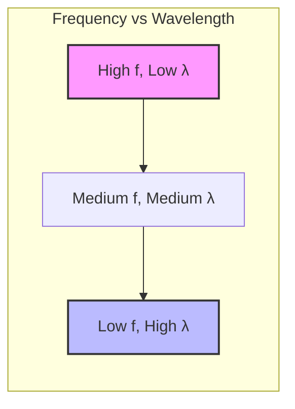
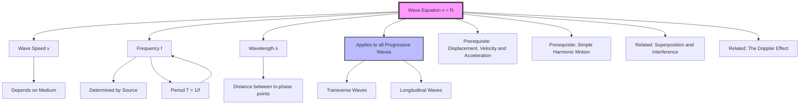

# 1. Overview / 概述

**English:**
The wave equation, $v = f\lambda$, is arguably the single most important relationship in wave physics. It connects the three fundamental properties of any progressive wave: wave speed ($v$), frequency ($f$), and wavelength ($\lambda$). This equation applies universally to all types of waves — mechanical waves (sound, water, seismic) and electromagnetic waves (light, radio, X-rays). Understanding this equation allows you to calculate any one of these quantities if the other two are known, and it forms the foundation for more advanced wave concepts like [[Superposition and Interference]], [[Polarisation]], and [[The Doppler Effect]]. This sub-topic is a core building block for the entire [[Progressive Waves]] chapter.

**中文:**
波动方程 $v = f\lambda$ 可以说是波动物理学中最重要的单一关系式。它连接了任何行波的三个基本属性：波速 ($v$)、频率 ($f$) 和波长 ($\lambda$)。该方程普遍适用于所有类型的波——机械波（声波、水波、地震波）和电磁波（光波、无线电波、X射线）。理解这个方程，你可以在已知任意两个量的情况下计算出第三个量，并且它是理解更高级波动概念（如[[叠加与干涉]]、[[偏振]]和[[多普勒效应]]）的基础。本子知识点是整个[[行波]]章节的核心基石。

---

# 2. Syllabus Learning Objectives / 考纲学习目标

| CAIE 9702 | Edexcel IAL |
|-----------|-------------|
| 7.1(a) Recall and use the wave equation $v = f\lambda$ | 5.1 Use the wave equation $v = f\lambda$ |
| 7.1(b) Understand that for a transverse wave, the direction of vibration is perpendicular to the direction of propagation | 5.2 Understand the relationship between wave speed, frequency and wavelength |
| 7.1(c) Understand that for a longitudinal wave, the direction of vibration is parallel to the direction of propagation | 5.3 Apply the wave equation to solve problems |
| 7.1(d) Define and use the terms speed, frequency, wavelength, period and amplitude | 5.4 Understand the concept of wavefronts |
| 7.1(e) Understand the concept of wavefronts | 5.5 Understand the relationship between period and frequency: $T = 1/f$ |

**Examiner Expectations / 考官期望:**
- **English:** You must be able to recall the wave equation without prompting and apply it in a wide range of contexts, including calculations involving wave speed, frequency, wavelength, and period. You should also be able to rearrange the equation to solve for any variable. The relationship $T = 1/f$ is often tested alongside the wave equation.
- **中文:** 你必须能够不加提示地回忆出波动方程，并在各种情境中应用它，包括涉及波速、频率、波长和周期的计算。你还应该能够重新排列方程以求解任何变量。关系式 $T = 1/f$ 经常与波动方程一起被考查。

---

# 3. Core Definitions / 核心定义

| Term (EN/CN) | Definition (EN) | Definition (CN) | Common Mistakes / 常见错误 |
|--------------|-----------------|-----------------|---------------------------|
| **Wave Speed** / 波速 | The distance travelled by a wavefront per unit time. | 波前在单位时间内传播的距离。 | Confusing wave speed with particle speed. Wave speed is constant for a given medium; particle speed varies. |
| **Frequency** / 频率 | The number of complete oscillations of a point on the wave per unit time. | 波上某点每单位时间内完成全振动的次数。 | Forgetting that frequency is determined by the source, not the medium. |
| **Wavelength** / 波长 | The distance between two successive points on a wave that are in phase (e.g., crest to crest). | 波上两个相邻的同相点（例如，波峰到波峰）之间的距离。 | Measuring from trough to crest (that's half a wavelength). |
| **Period** / 周期 | The time taken for one complete oscillation of a point on the wave. | 波上某点完成一次全振动所需的时间。 | Confusing period with frequency; they are reciprocals: $T = 1/f$. |
| **Amplitude** / 振幅 | The maximum displacement of a point on the wave from its equilibrium position. | 波上某点偏离其平衡位置的最大位移。 | Confusing amplitude with wavelength or wave speed. |
| **Wavefront** / 波前 | An imaginary line or surface joining points on a wave that are in phase (e.g., all crests). | 连接波上所有同相点（例如，所有波峰）的假想线或面。 | Thinking wavefronts are physical objects; they are conceptual tools. |

---

# 4. Key Concepts Explained / 关键概念详解

## 4.1 The Wave Equation / 波动方程

### Explanation / 解释
**English:**
The wave equation $v = f\lambda$ is derived from the basic definition of speed: $v = \frac{d}{t}$. For a wave, the distance travelled in one period ($T$) is one wavelength ($\lambda$). Therefore, $v = \frac{\lambda}{T}$. Since frequency $f = \frac{1}{T}$, substituting gives $v = f\lambda$. This equation is universal — it applies to all [[Progressive Waves]], whether [[Transverse and Longitudinal Waves|transverse or longitudinal]].

**中文:**
波动方程 $v = f\lambda$ 源自速度的基本定义：$v = \frac{d}{t}$。对于一个波，在一个周期 ($T$) 内传播的距离是一个波长 ($\lambda$)。因此，$v = \frac{\lambda}{T}$。由于频率 $f = \frac{1}{T}$，代入得到 $v = f\lambda$。这个方程是普适的——它适用于所有[[行波]]，无论是[[横波与纵波|横波还是纵波]]。

### Physical Meaning / 物理意义
**English:**
The wave equation tells us that for a given wave speed, frequency and wavelength are inversely proportional. If you increase the frequency, the wavelength must decrease to keep the speed constant. This is why high-pitched sounds (high frequency) have shorter wavelengths than low-pitched sounds. The wave speed itself depends on the properties of the medium (e.g., tension and mass per unit length for a string, or bulk modulus and density for a gas).

**中文:**
波动方程告诉我们，对于给定的波速，频率和波长成反比。如果你增加频率，波长必须减小以保持速度恒定。这就是为什么高音调的声音（高频）比低音调的声音波长更短。波速本身取决于介质的性质（例如，弦的张力与单位长度质量，或气体的体积模量与密度）。

### Common Misconceptions / 常见误区
- **English:**
  - Thinking that changing the frequency changes the wave speed. (Wave speed is determined by the medium, not the source.)
  - Confusing the wave equation with the speed-distance-time equation for moving objects.
  - Forgetting that $v = f\lambda$ applies to all waves, including light.
- **中文:**
  - 认为改变频率会改变波速。（波速由介质决定，而非波源。）
  - 将波动方程与运动物体的速度-距离-时间方程混淆。
  - 忘记 $v = f\lambda$ 适用于所有波，包括光。

### Exam Tips / 考试提示
- **English:**
  - Always check units: $v$ in m/s, $f$ in Hz, $\lambda$ in m.
  - If given period $T$, first calculate $f = 1/T$, then use $v = f\lambda$.
  - For electromagnetic waves in a vacuum, $v = c = 3.0 \times 10^8$ m/s.
- **中文:**
  - 始终检查单位：$v$ 的单位是 m/s，$f$ 的单位是 Hz，$\lambda$ 的单位是 m。
  - 如果给定了周期 $T$，先计算 $f = 1/T$，然后使用 $v = f\lambda$。
  - 对于真空中的电磁波，$v = c = 3.0 \times 10^8$ m/s。

> 📷 **IMAGE PROMPT — WAVE-EQ-01: Wave Equation Visualisation**
> A diagram showing a sinusoidal wave with wavelength $\lambda$ labelled from crest to crest. An arrow shows the wave moving to the right at speed $v$. A point on the wave oscillates up and down with frequency $f$. The equation $v = f\lambda$ is displayed prominently.

---

# 5. Essential Equations / 核心公式

## Equation 1: The Wave Equation / 波动方程

$$ v = f\lambda $$

| Symbol (符号) | Meaning (EN) | Meaning (CN) | Unit (单位) |
|--------------|-------------|-------------|------------|
| $v$ | Wave speed | 波速 | m/s |
| $f$ | Frequency | 频率 | Hz (s⁻¹) |
| $\lambda$ | Wavelength | 波长 | m |

**Derivation / 推导:**
$$ v = \frac{d}{t} = \frac{\lambda}{T} = \lambda \times \frac{1}{T} = f\lambda $$

**Conditions / 适用条件:**
- **English:** Applies to all progressive waves in any medium. For electromagnetic waves in a vacuum, $v = c$.
- **中文:** 适用于任何介质中的所有行波。对于真空中的电磁波，$v = c$。

**Limitations / 局限性:**
- **English:** Does not account for wave phenomena like dispersion (where wave speed depends on frequency). Does not describe standing waves directly.
- **中文:** 不考虑色散等波动现象（色散中波速取决于频率）。不直接描述驻波。

## Equation 2: Period-Frequency Relationship / 周期-频率关系

$$ T = \frac{1}{f} $$

| Symbol (符号) | Meaning (EN) | Meaning (CN) | Unit (单位) |
|--------------|-------------|-------------|------------|
| $T$ | Period | 周期 | s |
| $f$ | Frequency | 频率 | Hz (s⁻¹) |

**Derivation / 推导:**
- **English:** By definition, frequency is the number of oscillations per second, so the time for one oscillation is the reciprocal.
- **中文:** 根据定义，频率是每秒的振动次数，因此一次振动的时间是它的倒数。

**Conditions / 适用条件:**
- **English:** Always true for periodic waves.
- **中文:** 对于周期波始终成立。

---

# 6. Graphs and Relationships / 图表与关系

## 6.1 Frequency vs. Wavelength (at constant wave speed) / 频率与波长关系（波速恒定）

### Axes / 坐标轴
- **X-axis:** Wavelength $\lambda$ (m) / 波长 $\lambda$ (m)
- **Y-axis:** Frequency $f$ (Hz) / 频率 $f$ (Hz)

### Shape / 形状
- **English:** A rectangular hyperbola (inverse relationship). As $\lambda$ increases, $f$ decreases proportionally.
- **中文:** 一条矩形双曲线（反比关系）。随着 $\lambda$ 增加，$f$ 成比例减小。

### Gradient Meaning / 斜率含义
- **English:** The gradient is not constant. The product $f \times \lambda$ at any point equals the wave speed $v$.
- **中文:** 斜率不是常数。任意点的乘积 $f \times \lambda$ 等于波速 $v$。

### Area Meaning / 面积含义
- **English:** Not applicable for this graph.
- **中文:** 不适用于此图。

### Exam Interpretation / 考试解读
- **English:** If asked to sketch this graph, remember it's a curve, not a straight line. The constant $v$ is the key parameter.
- **中文:** 如果被要求画出此图，记住它是一条曲线，而不是直线。常数 $v$ 是关键参数。

> 📷 **IMAGE PROMPT — WAVE-EQ-02: Frequency vs Wavelength Graph**
> A graph showing frequency (f) on the y-axis and wavelength (λ) on the x-axis. A smooth curve shows an inverse relationship. Three points are marked: (λ₁, f₁), (λ₂, f₂), (λ₃, f₃) with f₁λ₁ = f₂λ₂ = f₃λ₃ = constant v. The curve is labelled "v = constant".

---

# 7. Required Diagrams / 必备图表

## 7.1 Wave Labelling Diagram / 波标注图

### Description / 描述
- **English:** A diagram of a sinusoidal wave showing wavelength, amplitude, crest, trough, and equilibrium position.
- **中文:** 一幅正弦波图，显示波长、振幅、波峰、波谷和平衡位置。

### Image Prompt / 图片生成提示
> 📷 **IMAGE PROMPT — WAVE-EQ-03: Labelled Wave Diagram**
> A clear, educational diagram of a transverse sinusoidal wave. The wave is shown as a continuous line oscillating above and below a horizontal dashed line labelled "Equilibrium position". Two consecutive crests are marked with a double-headed arrow labelled "λ (wavelength)". The vertical distance from equilibrium to a crest is marked with a double-headed arrow labelled "A (amplitude)". The highest points are labelled "Crest" and the lowest points are labelled "Trough". The wave is moving to the right, indicated by an arrow labelled "Direction of wave travel". Clean, white background, suitable for A-Level physics.

### Labels Required / 需要标注
- **English:** Wavelength (λ), Amplitude (A), Crest, Trough, Equilibrium Position, Direction of Wave Travel
- **中文:** 波长 (λ)、振幅 (A)、波峰、波谷、平衡位置、波的传播方向

### Exam Importance / 考试重要性
- **English:** High. You must be able to identify these features on any wave diagram.
- **中文:** 高。你必须能够在任何波图上识别这些特征。

## 7.2 Wavefront Diagram / 波前图

### Description / 描述
- **English:** A diagram showing parallel wavefronts (lines or arcs) representing a progressive wave. The distance between adjacent wavefronts is one wavelength.
- **中文:** 一幅显示代表行波的平行波前（直线或弧线）的图。相邻波前之间的距离是一个波长。

### Image Prompt / 图片生成提示
> 📷 **IMAGE PROMPT — WAVE-EQ-04: Wavefront Diagram**
> A top-down view of a progressive wave. Several parallel, equally spaced straight lines represent wavefronts. The distance between two adjacent lines is labelled "λ (wavelength)". An arrow perpendicular to the wavefronts is labelled "Direction of wave travel". The wavefronts are labelled "Wavefront". Clean, simple, educational style.

### Labels Required / 需要标注
- **English:** Wavefront, Wavelength (λ), Direction of Wave Travel
- **中文:** 波前、波长 (λ)、波的传播方向

### Exam Importance / 考试重要性
- **English:** Medium. Wavefront diagrams are used in [[Superposition and Interference]] and [[The Doppler Effect]].
- **中文:** 中。波前图用于[[叠加与干涉]]和[[多普勒效应]]。

---

# 8. Worked Examples / 典型例题

## Example 1: Basic Wave Equation Calculation / 基础波动方程计算

### Question / 题目
**English:**
A sound wave has a frequency of 440 Hz and a wavelength of 0.78 m. Calculate the speed of the sound wave.

**中文:**
一列声波的频率为 440 Hz，波长为 0.78 m。计算该声波的波速。

### Solution / 解答
**Step 1: Identify known quantities / 步骤1：确定已知量**
- $f = 440$ Hz
- $\lambda = 0.78$ m

**Step 2: Write the wave equation / 步骤2：写出波动方程**
$$ v = f\lambda $$

**Step 3: Substitute values / 步骤3：代入数值**
$$ v = 440 \times 0.78 $$

**Step 4: Calculate / 步骤4：计算**
$$ v = 343.2 \text{ m/s} $$

### Final Answer / 最终答案
**Answer:** $v = 343$ m/s (to 3 significant figures) | **答案：** $v = 343$ m/s（保留3位有效数字）

### Quick Tip / 提示
- **English:** Always check that your answer is reasonable. Sound speed in air is approximately 330-350 m/s.
- **中文：** 始终检查你的答案是否合理。空气中的声速约为 330-350 m/s。

---

## Example 2: Finding Wavelength from Period / 从周期求波长

### Question / 题目
**English:**
A water wave has a period of 0.50 s and travels at a speed of 2.0 m/s. Calculate the wavelength of the wave.

**中文:**
一列水波的周期为 0.50 s，传播速度为 2.0 m/s。计算该波的波长。

### Solution / 解答
**Step 1: Identify known quantities / 步骤1：确定已知量**
- $T = 0.50$ s
- $v = 2.0$ m/s

**Step 2: Calculate frequency from period / 步骤2：从周期计算频率**
$$ f = \frac{1}{T} = \frac{1}{0.50} = 2.0 \text{ Hz} $$

**Step 3: Rearrange the wave equation for wavelength / 步骤3：重新排列波动方程求波长**
$$ v = f\lambda \implies \lambda = \frac{v}{f} $$

**Step 4: Substitute values / 步骤4：代入数值**
$$ \lambda = \frac{2.0}{2.0} = 1.0 \text{ m} $$

### Final Answer / 最终答案
**Answer:** $\lambda = 1.0$ m | **答案：** $\lambda = 1.0$ m

### Quick Tip / 提示
- **English:** When given period, always convert to frequency first using $f = 1/T$.
- **中文：** 当给定了周期时，始终先用 $f = 1/T$ 将其转换为频率。

---

# 9. Past Paper Question Types / 历年真题题型

| Question Type / 题型 | Frequency / 频率 | Difficulty / 难度 | Past Paper References / 真题索引 |
|----------------------|------------------|------------------|-------------------------------|
| Direct substitution into $v = f\lambda$ | Very High | Easy | 📝 *待填入* |
| Rearranging the wave equation | High | Easy-Medium | 📝 *待填入* |
| Using $T = 1/f$ with the wave equation | High | Medium | 📝 *待填入* |
| Wave equation in context (e.g., sound, light, water) | Medium | Medium | 📝 *待填入* |
| Wavefront diagram interpretation | Low | Medium | 📝 *待填入* |

**Common Command Words / 常见指令词:**
- **English:** Calculate, Determine, Find, Show that, State, Use
- **中文：** 计算、确定、求出、证明、写出、使用

---

# 10. Practical Skills Connections / 实验技能链接

**English:**
The wave equation is central to several practical experiments in A-Level Physics:

1. **Measuring the speed of sound:** Use a signal generator connected to a speaker and a microphone connected to an oscilloscope. Measure the time delay for a sound pulse to travel a known distance. Alternatively, use resonance in a closed or open tube to find wavelength from standing wave patterns, then use $v = f\lambda$.

2. **Measuring the speed of waves on a string:** Use a vibration generator to create standing waves on a stretched string. Measure the wavelength from the standing wave pattern (distance between nodes = $\lambda/2$). Use $v = f\lambda$ to find wave speed, and compare with $v = \sqrt{T/\mu}$.

3. **Ripple tank experiments:** Use a stroboscope to "freeze" water waves and measure wavelength directly. Measure frequency using a stopwatch. Calculate wave speed using $v = f\lambda$.

**Key Measurements / 关键测量:**
- **English:** Frequency (using signal generator or stopwatch), Wavelength (using ruler or metre rule), Time (using stopwatch or oscilloscope)
- **中文：** 频率（使用信号发生器或秒表）、波长（使用直尺或米尺）、时间（使用秒表或示波器）

**Uncertainties / 不确定度:**
- **English:** Wavelength measurement often has the largest uncertainty due to difficulty in identifying exact positions of crests or nodes. Use multiple measurements to reduce random error.
- **中文：** 由于难以确定波峰或节点的精确位置，波长测量通常具有最大的不确定度。使用多次测量来减少随机误差。

> 📋 **Edexcel Only:** Edexcel IAL Paper 3 (Practical Skills) often includes questions on determining wave speed using the wave equation in a practical context.

---

# 11. Concept Map / 概念图谱

---

# 12. Quick Revision Sheet / 速查表

| Category / 类别 | Key Points / 要点 |
|----------------|------------------|
| **Definition / 定义** | The wave equation $v = f\lambda$ relates wave speed, frequency, and wavelength for all progressive waves. / 波动方程 $v = f\lambda$ 连接了所有行波的波速、频率和波长。 |
| **Key Formula / 核心公式** | $v = f\lambda$ and $T = 1/f$ |
| **Key Graph / 核心图表** | Frequency vs Wavelength: inverse relationship (hyperbola). / 频率与波长：反比关系（双曲线）。 |
| **Exam Tip / 考试提示** | Always check units (m/s, Hz, m). Convert period to frequency first. For EM waves in vacuum, $v = c = 3.0 \times 10^8$ m/s. / 始终检查单位（m/s, Hz, m）。先将周期转换为频率。对于真空中的电磁波，$v = c = 3.0 \times 10^8$ m/s。 |
| **Common Mistake / 常见错误** | Confusing wave speed with particle speed. Forgetting that frequency is source-dependent, not medium-dependent. / 混淆波速与质点速度。忘记频率取决于波源，而非介质。 |
| **Practical Link / 实验联系** | Used in measuring speed of sound, waves on strings, and ripple tank experiments. / 用于测量声速、弦上波速和波纹槽实验。 |