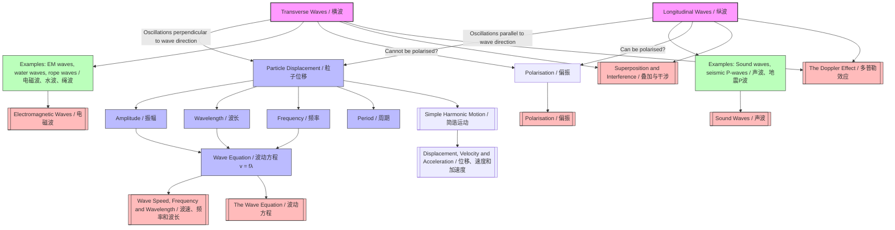

# 1. Overview / 概述

**English:**
This sub-topic introduces the two fundamental types of mechanical waves: **transverse waves** and **longitudinal waves**. Understanding the distinction between these wave types is essential for all wave-related physics. Transverse waves have oscillations perpendicular to the direction of energy transfer, while longitudinal waves have oscillations parallel to the direction of energy transfer. This distinction determines how waves interact with matter, how they can be polarised, and how they propagate through different media. This foundational knowledge is critical for understanding [[Wave Speed, Frequency and Wavelength]], [[The Wave Equation]], and more advanced topics like [[Polarisation]] and [[Superposition and Interference]].

**中文:**
本子知识点介绍机械波的两种基本类型：**横波**和**纵波**。理解这两种波型的区别对于所有与波相关的物理学至关重要。横波的振动方向垂直于能量传递方向，而纵波的振动方向平行于能量传递方向。这种区别决定了波如何与物质相互作用、如何被偏振，以及如何在不同介质中传播。这一基础知识对于理解[[波速、频率和波长]]、[[波动方程]]以及更高级的主题如[[偏振]]和[[叠加与干涉]]至关重要。

---

# 2. Syllabus Learning Objectives / 考纲学习目标

| CAIE 9702 | Edexcel IAL |
|-----------|-------------|
| 7.1(a) Describe what is meant by wave motion as illustrated by vibration in ropes and springs and by experiments using water waves | 5.1 Understand the difference between transverse and longitudinal waves |
| 7.1(b) Understand the difference between transverse and longitudinal waves and give examples of each | 5.2 Describe examples of transverse and longitudinal waves |
| 7.1(c) Define displacement, amplitude, period, frequency, wavelength and wave speed | 5.3 Understand the terms displacement, amplitude, period, frequency, wavelength and wave speed |
| 7.1(d) Recall and use the wave equation $v = f\lambda$ | 5.4 Use the wave equation $v = f\lambda$ |
| 7.1(e) Understand the concept of wavefront and use it to describe wave propagation | 5.5 Understand the concept of wavefront and ray diagrams |

**Examiner Expectations / 考官期望:**
- **CAIE:** Students must be able to describe wave motion using diagrams of ropes and springs, and identify whether a wave is transverse or longitudinal from its description or diagram.
- **Edexcel:** Students must understand the key differences and be able to give at least two examples of each type.

---

# 3. Core Definitions / 核心定义

| Term (EN/CN) | Definition (EN) | Definition (CN) | Common Mistakes / 常见错误 |
|--------------|-----------------|-----------------|---------------------------|
| **Transverse Wave** / 横波 | A wave in which the oscillations of the particles are perpendicular to the direction of energy transfer. | 粒子的振动方向垂直于能量传递方向的波。 | ❌ Confusing "particle motion" with "wave motion" — particles do NOT travel with the wave. |
| **Longitudinal Wave** / 纵波 | A wave in which the oscillations of the particles are parallel to the direction of energy transfer. | 粒子的振动方向平行于能量传递方向的波。 | ❌ Thinking particles move in the same direction as the wave permanently — they only oscillate back and forth. |
| **Compression** / 压缩区 | A region in a longitudinal wave where particles are closest together (high pressure). | 纵波中粒子最密集（高压）的区域。 | ❌ Confusing with rarefaction — compressions have HIGH density, rarefactions have LOW density. |
| **Rarefaction** / 稀疏区 | A region in a longitudinal wave where particles are furthest apart (low pressure). | 纵波中粒子最稀疏（低压）的区域。 | ❌ Thinking rarefactions are "empty" — they still contain particles, just fewer per unit volume. |
| **Crest** / 波峰 | The highest point of a transverse wave above the equilibrium position. | 横波中平衡位置以上的最高点。 | ❌ Using "crest" for longitudinal waves — longitudinal waves do NOT have crests or troughs. |
| **Trough** / 波谷 | The lowest point of a transverse wave below the equilibrium position. | 横波中平衡位置以下的最低点。 | ❌ Same as above — only applies to transverse waves. |

---

# 4. Key Concepts Explained / 关键概念详解

## 4.1 Particle Motion vs Wave Motion / 粒子运动与波动运动

### Explanation / 解释
**English:**
A common and critical distinction in wave physics is that **particles do not travel with the wave**. In both transverse and longitudinal waves, the particles of the medium oscillate about a fixed equilibrium position. The wave itself transfers energy and momentum through the medium, but the individual particles only move back and forth (or up and down) around their rest position. This is why a cork floating on water bobs up and down as a wave passes — it does NOT move horizontally with the wave.

**中文:**
波动物理学中一个常见且关键的区别是：**粒子并不随波迁移**。在横波和纵波中，介质粒子围绕固定的平衡位置振动。波本身通过介质传递能量和动量，但单个粒子只在其静止位置附近来回（或上下）运动。这就是为什么漂浮在水面上的软木塞在波浪经过时会上下浮动——它并不会随着波浪水平移动。

### Physical Meaning / 物理意义
**English:**
The wave is a **disturbance** propagating through the medium, not the medium itself moving. This explains why sound can travel through air without causing a permanent wind, and why ripples on water don't carry the water away.

**中文:**
波是通过介质传播的**扰动**，而不是介质本身的移动。这解释了为什么声音可以在空气中传播而不会产生永久的风，以及为什么水面涟漪不会把水带走。

### Common Misconceptions / 常见误区
- ❌ **"Particles move with the wave"** — Particles oscillate about a fixed point; they do NOT travel.
- ❌ **"Transverse waves only exist in solids"** — Water waves are transverse (and also have longitudinal components).
- ❌ **"Longitudinal waves are only sound waves"** — Seismic P-waves are also longitudinal.

### Exam Tips / 考试提示
- ✅ Always draw arrows to show particle oscillation direction (perpendicular or parallel to wave direction).
- ✅ Use the "slinky spring" analogy: push-pull for longitudinal, side-to-side for transverse.

> 📷 **IMAGE PROMPT — WAV-01: Particle Motion in Transverse vs Longitudinal Waves**
> A side-by-side comparison diagram. Left: A transverse wave on a rope showing a single particle (marked with a dot) moving up and down while the wave moves right. Right: A longitudinal wave in a slinky spring showing a single coil (marked) moving left and right while the wave moves right. Both diagrams should have arrows indicating particle oscillation direction and wave propagation direction. Clean, educational style with labels.

---

## 4.2 Examples of Transverse Waves / 横波的例子

### Explanation / 解释
**English:**
Common examples of transverse waves include:
- **Waves on a string/rope** — when you flick one end of a rope, a transverse pulse travels along it.
- **Electromagnetic waves** (light, radio, X-rays) — these are transverse but do NOT require a medium (they can travel through vacuum).
- **Water waves** (surface waves) — these are primarily transverse but have a small longitudinal component.
- **Seismic S-waves** (secondary waves) — these travel through the Earth's crust.

**中文:**
横波的常见例子包括：
- **弦/绳上的波**——当你抖动绳子的一端时，横波脉冲沿绳子传播。
- **电磁波**（光、无线电波、X射线）——这些是横波，但不需要介质（可以在真空中传播）。
- **水波**（表面波）——主要是横波，但有一个小的纵波分量。
- **地震S波**（次波）——这些波在地壳中传播。

### Exam Tips / 考试提示
- ✅ For CAIE, be prepared to describe a demonstration using a rope or spring.
- ✅ For Edexcel, know that electromagnetic waves are transverse and can travel through a vacuum.

---

## 4.3 Examples of Longitudinal Waves / 纵波的例子

### Explanation / 解释
**English:**
Common examples of longitudinal waves include:
- **Sound waves in air** — compressions and rarefactions travel through the air.
- **Seismic P-waves** (primary waves) — these travel through the Earth's interior.
- **Waves in a slinky spring** — when you push and pull one end, compressions and rarefactions travel along the spring.
- **Ultrasound waves** — used in medical imaging.

**中文:**
纵波的常见例子包括：
- **空气中的声波**——压缩区和稀疏区在空气中传播。
- **地震P波**（初波）——这些波在地球内部传播。
- **弹簧中的波**——当你推拉弹簧一端时，压缩区和稀疏区沿弹簧传播。
- **超声波**——用于医学成像。

### Exam Tips / 考试提示
- ✅ Remember: sound waves CANNOT travel through a vacuum — they require a medium.
- ✅ For CAIE, be able to describe how compressions and rarefactions are formed in a slinky spring.

> 📷 **IMAGE PROMPT — WAV-02: Longitudinal Wave in a Slinky Spring**
> A diagram showing a slinky spring with labelled compressions (C) and rarefactions (R). Arrows show the direction of particle oscillation (left-right) and the direction of wave propagation (right). The coils should be drawn closer together at compressions and further apart at rarefactions. Clean, educational style.

---

# 5. Essential Equations / 核心公式

For this sub-topic, the key equation is the **wave equation**:

$$ v = f \lambda $$

| Symbol (符号) | Meaning (EN) | Meaning (CN) | Unit (单位) |
|--------------|-------------|-------------|------------|
| $v$ | Wave speed / wave velocity | 波速 | m s⁻¹ |
| $f$ | Frequency | 频率 | Hz (s⁻¹) |
| $\lambda$ | Wavelength | 波长 | m |

**Derivation / 推导:**
The wave equation can be derived from the definition of speed: $v = \frac{d}{t}$. In one complete cycle, a wave travels one wavelength $\lambda$ in one period $T$. Therefore:
$$ v = \frac{\lambda}{T} = \lambda \times \frac{1}{T} = f\lambda $$

**Conditions / 适用条件:**
- Applies to ALL types of progressive waves (transverse and longitudinal).
- Only valid for waves travelling in a uniform medium.

**Limitations / 局限性:**
- Does NOT apply to standing waves (stationary waves) in the same form.
- Does not account for dispersion (where wave speed depends on frequency).

---

# 6. Graphs and Relationships / 图表与关系

## 6.1 Displacement-Distance Graph for Transverse Waves / 横波的位移-距离图

### Axes / 坐标轴
- **x-axis:** Distance along the wave / 沿波传播方向的距离 (m)
- **y-axis:** Displacement of particles from equilibrium / 粒子偏离平衡位置的位移 (m)

### Shape / 形状
A sinusoidal curve showing crests (positive peaks) and troughs (negative peaks).

### Gradient Meaning / 斜率含义
The gradient at any point represents the **strain** (rate of change of displacement with distance). This is related to the wave's energy density.

### Area Meaning / 面积含义
The area under the curve has no direct physical meaning for this graph.

### Exam Interpretation / 考试解读
- **Wavelength** = distance between two consecutive crests or troughs.
- **Amplitude** = maximum displacement from equilibrium.
- This graph is a "snapshot" of the wave at one instant in time.

> 📷 **IMAGE PROMPT — WAV-03: Displacement-Distance Graph for a Transverse Wave**
> A sinusoidal wave graph with labelled axes: x-axis "Distance / m" and y-axis "Displacement / m". Mark and label: amplitude (A), wavelength (λ), crest, and trough. The wave should show at least two complete cycles. Clean, educational style.

---

## 6.2 Displacement-Time Graph for a Single Particle / 单个粒子的位移-时间图

### Axes / 坐标轴
- **x-axis:** Time / 时间 (s)
- **y-axis:** Displacement of a single particle / 单个粒子的位移 (m)

### Shape / 形状
A sinusoidal curve showing the oscillation of one particle over time.

### Gradient Meaning / 斜率含义
The gradient at any point represents the **velocity** of the particle at that instant.

### Area Meaning / 面积含义
The area under the curve has no direct physical meaning.

### Exam Interpretation / 考试解读
- **Period** = time for one complete oscillation (distance between two consecutive peaks).
- **Frequency** = $f = 1/T$.
- **Amplitude** = maximum displacement from equilibrium.
- This graph shows how ONE particle moves over time, NOT a snapshot of the whole wave.

---

# 7. Required Diagrams / 必备图表

## 7.1 Transverse Wave Diagram / 横波示意图

### Description / 描述
**English:** A diagram showing a transverse wave propagating along a rope or string. The wave should show crests and troughs, with labelled amplitude, wavelength, equilibrium position, and direction of wave propagation.

**中文:** 显示横波沿绳子或弦传播的示意图。波应显示波峰和波谷，并标注振幅、波长、平衡位置和波传播方向。

### Image Prompt / 图片生成提示
> 📷 **IMAGE PROMPT — WAV-04: Transverse Wave on a Rope**
> A detailed diagram of a transverse wave on a rope. The rope is shown as a sinusoidal curve with labelled crests (highest points) and troughs (lowest points). A horizontal dashed line marks the equilibrium position. Arrows show: (1) particle oscillation direction (vertical, up-down) and (2) wave propagation direction (horizontal, right). Labels: amplitude (A) from equilibrium to crest, wavelength (λ) between two consecutive crests. Clean, educational style with clear labels.

### Labels Required / 需要标注
- **Crest** / 波峰
- **Trough** / 波谷
- **Amplitude (A)** / 振幅
- **Wavelength (λ)** / 波长
- **Equilibrium position** / 平衡位置
- **Direction of wave propagation** / 波传播方向
- **Direction of particle oscillation** / 粒子振动方向

### Exam Importance / 考试重要性
- **CAIE:** Frequently asked to draw or label such a diagram.
- **Edexcel:** Required to identify and label wave properties on a diagram.

---

## 7.2 Longitudinal Wave Diagram / 纵波示意图

### Description / 描述
**English:** A diagram showing a longitudinal wave in a slinky spring. The diagram should show compressions (coils close together) and rarefactions (coils far apart), with labelled wavelength and direction of wave propagation.

**中文:** 显示弹簧中纵波的示意图。应显示压缩区（线圈密集）和稀疏区（线圈稀疏），并标注波长和波传播方向。

### Image Prompt / 图片生成提示
> 📷 **IMAGE PROMPT — WAV-05: Longitudinal Wave in a Slinky Spring**
> A diagram of a slinky spring showing a longitudinal wave. The spring is drawn as a series of coils. At compressions (C), coils are drawn close together. At rarefactions (R), coils are drawn far apart. Arrows show: (1) particle oscillation direction (horizontal, left-right) and (2) wave propagation direction (horizontal, right). Wavelength (λ) is labelled as the distance between two consecutive compressions (or two consecutive rarefactions). Clean, educational style.

### Labels Required / 需要标注
- **Compression (C)** / 压缩区
- **Rarefaction (R)** / 稀疏区
- **Wavelength (λ)** / 波长
- **Direction of wave propagation** / 波传播方向
- **Direction of particle oscillation** / 粒子振动方向

### Exam Importance / 考试重要性
- **CAIE:** Required to describe and draw longitudinal waves.
- **Edexcel:** Required to identify compressions and rarefactions.

---

# 8. Worked Examples / 典型例题

## Example 1: Identifying Wave Types / 例题1：识别波的类型

### Question / 题目
**English:**
A student creates a wave in a slinky spring by pushing and pulling one end. Describe the type of wave produced, and explain how energy is transferred along the spring.

**中文:**
一名学生通过推拉弹簧的一端在弹簧中产生了一个波。描述产生的波的类型，并解释能量是如何沿弹簧传递的。

### Solution / 解答
**Step 1: Identify the wave type**
The wave is **longitudinal** because the student's push-pull motion causes the coils to oscillate **parallel** to the direction of energy transfer.

**Step 2: Explain energy transfer**
When the student pushes the end, a **compression** (region of high pressure/density) forms. When the student pulls, a **rarefaction** (region of low pressure/density) forms. These compressions and rarefactions travel along the spring, transferring energy from one end to the other. The individual coils oscillate back and forth about their equilibrium positions but do NOT travel with the wave.

**步骤1：识别波的类型**
该波是**纵波**，因为学生的推拉运动使线圈的振动方向**平行于**能量传递方向。

**步骤2：解释能量传递**
当学生推动弹簧一端时，形成**压缩区**（高压/高密度区域）。当学生拉动时，形成**稀疏区**（低压/低密度区域）。这些压缩区和稀疏区沿弹簧传播，将能量从一端传递到另一端。单个线圈围绕其平衡位置来回振动，但不会随波迁移。

### Final Answer / 最终答案
**Answer:** Longitudinal wave; energy is transferred through compressions and rarefactions. | **答案：** 纵波；能量通过压缩区和稀疏区传递。

### Quick Tip / 提示
- ✅ Remember: "Push-pull = longitudinal, side-to-side = transverse."
- ✅ "推拉 = 纵波，左右摆动 = 横波。"

---

## Example 2: Using the Wave Equation / 例题2：使用波动方程

### Question / 题目
**English:**
A sound wave has a frequency of 440 Hz and a wavelength of 0.78 m. Calculate the speed of the sound wave.

**中文:**
一个声波的频率为440 Hz，波长为0.78 m。计算该声波的速度。

### Solution / 解答
**Step 1: Write down the wave equation**
$$ v = f \lambda $$

**Step 2: Substitute values**
$$ v = 440 \times 0.78 $$

**Step 3: Calculate**
$$ v = 343.2 \text{ m s}^{-1} $$

**步骤1：写出波动方程**
$$ v = f \lambda $$

**步骤2：代入数值**
$$ v = 440 \times 0.78 $$

**步骤3：计算**
$$ v = 343.2 \text{ m s}^{-1} $$

### Final Answer / 最终答案
**Answer:** $v = 343 \text{ m s}^{-1}$ (to 3 significant figures) | **答案：** $v = 343 \text{ m s}^{-1}$（保留3位有效数字）

### Quick Tip / 提示
- ✅ Always check units: frequency in Hz, wavelength in m, speed in m s⁻¹.
- ✅ 始终检查单位：频率用Hz，波长用m，速度用m s⁻¹。

---

# 9. Past Paper Question Types / 历年真题题型

| Question Type / 题型 | Frequency / 频率 | Difficulty / 难度 | Past Paper References / 真题索引 |
|----------------------|------------------|------------------|-------------------------------|
| Identify wave type from description/diagram | ⭐⭐⭐⭐⭐ Very High | Easy | 📝 *待填入* |
| Draw/label transverse wave diagram | ⭐⭐⭐⭐ High | Easy | 📝 *待填入* |
| Draw/label longitudinal wave diagram | ⭐⭐⭐ Medium | Medium | 📝 *待填入* |
| Use wave equation $v = f\lambda$ | ⭐⭐⭐⭐⭐ Very High | Easy | 📝 *待填入* |
| Explain why particles don't travel with wave | ⭐⭐ Low | Medium | 📝 *待填入* |
| Compare transverse and longitudinal waves | ⭐⭐⭐ Medium | Medium | 📝 *待填入* |

**Common Command Words / 常见指令词:**
- **Describe** / 描述 — Give a detailed account of the wave type.
- **Explain** / 解释 — Give reasons for why a wave behaves in a certain way.
- **Draw** / 画出 — Produce a diagram showing wave properties.
- **Label** / 标注 — Add labels to a diagram.
- **Calculate** / 计算 — Use the wave equation to find a numerical value.

---

# 10. Practical Skills Connections / 实验技能链接

**English:**
This sub-topic connects to practical work in several ways:

1. **Ripple Tank Experiments (CAIE & Edexcel):** Use a ripple tank to observe water waves. A vibrating bar creates transverse waves on the water surface. Use a stroboscope to "freeze" the wave pattern and measure wavelength. Measure frequency from the vibration generator. Calculate wave speed using $v = f\lambda$.

2. **Slinky Spring Demonstrations:** Use a slinky spring to demonstrate both transverse and longitudinal waves. For transverse waves, move one end side-to-side. For longitudinal waves, push and pull one end. Observe compressions and rarefactions.

3. **Sound Wave Experiments:** Use a signal generator connected to a loudspeaker to produce sound waves of known frequency. Use a microphone and oscilloscope to measure the time period and calculate frequency.

4. **Measurements and Uncertainties:**
   - Measure wavelength using a ruler (uncertainty ±0.5 mm).
   - Measure frequency from a signal generator (uncertainty from manufacturer's specification).
   - Calculate percentage uncertainty in wave speed.

**中文:**
本子知识点通过多种方式与实验工作联系：

1. **波纹槽实验（CAIE和Edexcel）：** 使用波纹槽观察水波。振动棒在水面产生横波。使用频闪仪"冻结"波图案并测量波长。从振动发生器测量频率。使用$v = f\lambda$计算波速。

2. **弹簧演示：** 使用弹簧演示横波和纵波。对于横波，左右移动一端。对于纵波，推拉一端。观察压缩区和稀疏区。

3. **声波实验：** 使用信号发生器连接到扬声器产生已知频率的声波。使用麦克风和示波器测量时间周期并计算频率。

4. **测量和不确定度：**
   - 使用尺子测量波长（不确定度±0.5 mm）。
   - 从信号发生器测量频率（不确定度来自制造商规格）。
   - 计算波速的百分比不确定度。

---

# 11. Concept Map / 概念图谱

---

# 12. Quick Revision Sheet / 速查表

| Category / 类别 | Key Points / 要点 |
|----------------|------------------|
| **Definition / 定义** | **Transverse:** Oscillations ⟂ wave direction. **Longitudinal:** Oscillations ∥ wave direction. |
| **Key Formula / 核心公式** | $v = f\lambda$ (wave speed = frequency × wavelength) |
| **Key Graph / 核心图表** | Displacement-distance graph: shows snapshot of wave. Displacement-time graph: shows oscillation of one particle. |
| **Examples / 例子** | **Transverse:** EM waves, water waves, rope waves. **Longitudinal:** Sound waves, seismic P-waves. |
| **Common Mistake / 常见错误** | ❌ Particles do NOT travel with the wave — they oscillate about a fixed point. |
| **Exam Tip / 考试提示** | ✅ Draw arrows to show oscillation direction. ✅ Use "push-pull = longitudinal, side-to-side = transverse." |
| **Practical Skill / 实验技能** | Ripple tank: measure λ with ruler, f from generator. Slinky: demonstrate both wave types. |
| **Key Distinction / 关键区别** | Only transverse waves can be polarised. Longitudinal waves cannot be polarised. |

---

> 📋 **CIE Only:** CAIE 9702 requires students to describe wave motion using experiments with ropes, springs, and water waves. Be prepared to describe these demonstrations in detail.
>
> 📋 **Edexcel Only:** Edexcel IAL requires students to understand the concept of wavefront and ray diagrams. A wavefront is a line or surface connecting points of the same phase. Ray diagrams show the direction of wave propagation perpendicular to wavefronts.