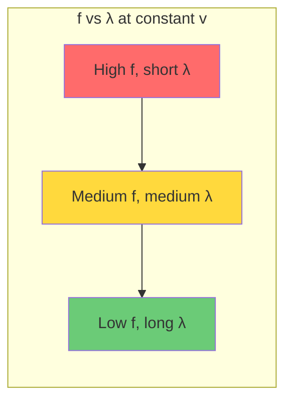
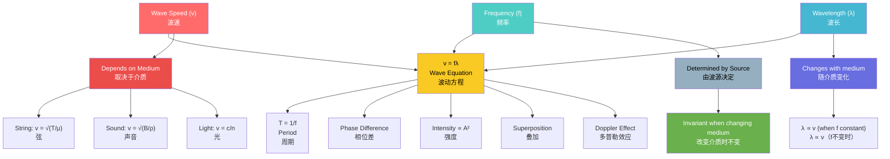

# 1. Overview / 概述

**English:**
This sub-topic covers the fundamental relationship between wave speed ($v$), frequency ($f$), and wavelength ($\lambda$) — the three key parameters that define any progressive wave. Understanding how these quantities are related through the wave equation $v = f\lambda$ is essential for analysing wave behaviour across all areas of physics, from sound and light to water waves and electromagnetic radiation. This forms the mathematical backbone of [[Progressive Waves]] and is a prerequisite for understanding [[The Wave Equation]], [[Phase and Phase Difference]], and [[Intensity and Amplitude]].

The wave equation is one of the most frequently tested relationships in both CAIE 9702 and Edexcel IAL A-Level Physics. It connects the speed at which a wave travels through a medium to its frequency (determined by the source) and its wavelength (determined by both source and medium). Mastery of this relationship allows students to solve problems involving wave propagation, calculate unknown quantities, and understand why waves change speed when moving between different media.

**中文:**
本子知识点涵盖波速 ($v$)、频率 ($f$) 和波长 ($\lambda$) 之间的基本关系——这是定义任何行波的三个关键参数。理解这些量如何通过波动方程 $v = f\lambda$ 相互关联，对于分析从声波、光波到水波和电磁辐射等所有物理领域的波动行为至关重要。这构成了[[Progressive Waves]]的数学基础，也是理解[[The Wave Equation]]、[[Phase and Phase Difference]]和[[Intensity and Amplitude]]的先决条件。

波动方程是CAIE 9702和Edexcel IAL A-Level物理中最常被测试的关系之一。它将波在介质中传播的速度与其频率（由波源决定）和波长（由波源和介质共同决定）联系起来。掌握这一关系使学生能够解决涉及波传播的问题，计算未知量，并理解波在不同介质之间移动时速度变化的原因。

---

# 2. Syllabus Learning Objectives / 考纲学习目标

| CAIE 9702 | Edexcel IAL |
|-----------|-------------|
| 7.1(a) Understand the meaning of wave speed, frequency, and wavelength | WPH11 U2: 5.1 Understand the terms displacement, amplitude, period, frequency, wavelength, and wave speed |
| 7.1(b) Recall and use the wave equation $v = f\lambda$ | WPH11 U2: 5.2 Use the wave equation $v = f\lambda$ |
| 7.1(c) Understand that frequency is determined by the source and does not change when a wave passes from one medium to another | WPH11 U2: 5.3 Understand that frequency is determined by the source and remains constant when a wave changes medium |
| 7.1(d) Understand that wavelength changes when a wave passes from one medium to another | WPH11 U2: 5.4 Understand that wavelength changes when a wave changes medium |
| 7.1(e) Understand the relationship between wave speed and the properties of the medium | WPH11 U2: 5.5 Understand factors affecting wave speed in different media |

**Examiner Expectations / 考官期望:**
- **English:** Students must be able to recall and apply the wave equation $v = f\lambda$ in both numerical and algebraic contexts. They must understand that frequency is invariant when a wave changes medium, while wavelength and speed change proportionally. Students should be able to explain why wave speed depends on the medium's properties (e.g., tension and mass per unit length for strings, bulk modulus and density for sound).
- **中文:** 学生必须能够在数值和代数情境中回忆并应用波动方程 $v = f\lambda$。他们必须理解当波改变介质时频率不变，而波长和速度成比例变化。学生应能解释为什么波速取决于介质的性质（例如，弦的张力与单位长度质量，声音的体积模量与密度）。

---

# 3. Core Definitions / 核心定义

| Term (EN/CN) | Definition (EN) | Definition (CN) | Common Mistakes / 常见错误 |
|--------------|-----------------|-----------------|---------------------------|
| **Wave Speed** / 波速 | The distance travelled by a wave per unit time. | 波在单位时间内传播的距离。 | Confusing wave speed with particle speed — wave speed is the speed of energy transfer, not the speed of individual particles in the medium. |
| **Frequency** / 频率 | The number of complete oscillations of a point on the wave per unit time. | 波上某点每秒完成的完整振动次数。 | Thinking frequency changes when wave enters a different medium — frequency is determined by the source and is invariant. |
| **Wavelength** / 波长 | The distance between two consecutive points in phase on a wave (e.g., crest to crest or trough to trough). | 波上两个相邻同相点之间的距离（例如，波峰到波峰或波谷到波谷）。 | Measuring from crest to trough (which is half a wavelength) or confusing wavelength with amplitude. |
| **Period** / 周期 | The time taken for one complete oscillation of a point on the wave. | 波上某点完成一次完整振动所需的时间。 | Forgetting the relationship $T = 1/f$ or using incorrect units. |
| **Phase** / 相位 | A measure of the position of a point on a wave relative to a reference point, usually expressed in degrees or radians. | 波上某点相对于参考点的位置度量，通常以度或弧度表示。 | Confusing phase difference with path difference — see [[Phase and Phase Difference]]. |

---

# 4. Key Concepts Explained / 关键概念详解

## 4.1 The Wave Equation / 波动方程

### Explanation / 解释
**English:**
The wave equation $v = f\lambda$ is the fundamental relationship linking wave speed ($v$), frequency ($f$), and wavelength ($\lambda$). It can be derived from the definition of speed: speed = distance/time. In one period $T$, a wave travels one wavelength $\lambda$. Therefore:

$$ v = \frac{\text{distance}}{\text{time}} = \frac{\lambda}{T} $$

Since $f = 1/T$, we obtain:

$$ v = f\lambda $$

This equation applies to all types of progressive waves, including [[Transverse and Longitudinal Waves]], electromagnetic waves, and mechanical waves. It is essential for solving problems involving wave propagation and understanding how waves behave when moving between different media.

**中文:**
波动方程 $v = f\lambda$ 是连接波速 ($v$)、频率 ($f$) 和波长 ($\lambda$) 的基本关系。它可以从速度的定义推导出来：速度 = 距离/时间。在一个周期 $T$ 内，波传播一个波长 $\lambda$。因此：

$$ v = \frac{\text{距离}}{\text{时间}} = \frac{\lambda}{T} $$

由于 $f = 1/T$，我们得到：

$$ v = f\lambda $$

这个方程适用于所有类型的行波，包括[[Transverse and Longitudinal Waves]]、电磁波和机械波。它对于解决涉及波传播的问题以及理解波在不同介质之间移动时的行为至关重要。

### Physical Meaning / 物理意义
**English:**
The wave equation tells us that for a given wave speed, frequency and wavelength are inversely proportional — if frequency increases, wavelength must decrease to keep $v$ constant. This explains why high-frequency sound waves have shorter wavelengths than low-frequency sound waves in the same medium. When a wave changes medium, its speed changes, but frequency remains constant (determined by the source), so wavelength must change proportionally to speed.

**中文:**
波动方程告诉我们，对于给定的波速，频率和波长成反比——如果频率增加，波长必须减小以保持 $v$ 不变。这解释了为什么在同一介质中，高频声波的波长比低频声波短。当波改变介质时，其速度改变，但频率保持不变（由波源决定），因此波长必须与速度成比例变化。

### Common Misconceptions / 常见误区
- **English:**
  - Thinking frequency changes when a wave enters a different medium (it doesn't — frequency is source-dependent)
  - Confusing wave speed with the speed of particles in the medium
  - Believing that all waves travel at the same speed in all media
  - Using the wave equation incorrectly when units are inconsistent (e.g., mixing Hz and kHz)
- **中文:**
  - 认为波进入不同介质时频率会改变（不会——频率取决于波源）
  - 混淆波速与介质中粒子的速度
  - 认为所有波在所有介质中以相同速度传播
  - 当单位不一致时错误使用波动方程（例如，混用Hz和kHz）

### Exam Tips / 考试提示
- **English:**
  - Always check units: speed in m/s, frequency in Hz, wavelength in m
  - Remember that frequency is invariant when a wave changes medium
  - For electromagnetic waves in vacuum, $c = 3.0 \times 10^8$ m/s
  - Practice rearranging the equation for any unknown: $f = v/\lambda$ or $\lambda = v/f$
- **中文:**
  - 始终检查单位：速度用m/s，频率用Hz，波长用m
  - 记住当波改变介质时频率不变
  - 对于真空中的电磁波，$c = 3.0 \times 10^8$ m/s
  - 练习为任何未知量重新排列方程：$f = v/\lambda$ 或 $\lambda = v/f$

> 📷 **IMAGE PROMPT — DIAGRAM-01: Wave Equation Visualisation**
> A clear diagram showing a sinusoidal wave with wavelength $\lambda$ labelled from crest to crest. An arrow shows the wave travelling distance $\lambda$ in time $T$. Below, a box summarises $v = f\lambda$ with each symbol defined. Use blue for the wave, red arrows for distance, and a green box for the equation. Suitable for A-Level physics textbook.

---

## 4.2 Frequency Invariance / 频率不变性

### Explanation / 解释
**English:**
One of the most important concepts in wave physics is that **frequency is determined by the source and does not change when a wave passes from one medium to another**. For example, when light travels from air into water, its frequency remains the same — it is still the same colour. However, its speed decreases (because water is optically denser), and consequently its wavelength decreases proportionally.

This principle applies to all waves:
- Sound waves: frequency of a note remains the same whether travelling through air, water, or a solid
- Light waves: colour (frequency) remains constant when passing through different transparent materials
- Water waves: frequency of waves generated by a vibrating source remains constant as they move into shallower water

**中文:**
波动物理学中最重要的概念之一是**频率由波源决定，当波从一种介质进入另一种介质时不会改变**。例如，当光从空气进入水中时，其频率保持不变——它仍然是相同的颜色。然而，其速度降低（因为水光学密度更大），因此波长成比例减小。

这一原理适用于所有波：
- 声波：无论通过空气、水还是固体传播，音符的频率保持不变
- 光波：通过不同透明材料时，颜色（频率）保持不变
- 水波：由振动源产生的水波频率在进入浅水区时保持不变

### Physical Meaning / 物理意义
**English:**
The invariance of frequency arises because the source determines how many wave cycles are produced per second. When a wave enters a new medium, the wavefronts cannot "pile up" or "stretch out" in time — the number of wavefronts arriving per second at any point must equal the number produced per second by the source. This is a consequence of the conservation of wave energy and the continuity of wave motion.

**中文:**
频率不变性源于波源决定了每秒产生多少个波周期。当波进入新介质时，波前不能在时间上"堆积"或"拉伸"——每秒到达任何点的波前数量必须等于波源每秒产生的数量。这是波能量守恒和波动连续性的结果。

### Common Misconceptions / 常见误区
- **English:**
  - Thinking that "slower speed means lower frequency" — actually, slower speed means shorter wavelength at constant frequency
  - Believing that frequency can change if the wave is "compressed" — compression changes wavelength, not frequency
  - Confusing the Doppler effect (which changes observed frequency due to relative motion) with medium change
- **中文:**
  - 认为"速度越慢意味着频率越低"——实际上，在频率不变的情况下，速度越慢意味着波长越短
  - 认为如果波被"压缩"，频率可以改变——压缩改变的是波长，而不是频率
  - 混淆多普勒效应（由于相对运动改变观测频率）与介质变化

### Exam Tips / 考试提示
- **English:**
  - When a wave changes medium, always state: frequency unchanged, speed changes, wavelength changes proportionally to speed
  - Use the relationship $\lambda_1 / \lambda_2 = v_1 / v_2$ when frequency is constant
  - For light: $n_1 \lambda_1 = n_2 \lambda_2$ where $n$ is refractive index (since $v \propto 1/n$)
- **中文:**
  - 当波改变介质时，始终说明：频率不变，速度改变，波长与速度成比例变化
  - 当频率不变时，使用关系 $\lambda_1 / \lambda_2 = v_1 / v_2$
  - 对于光：$n_1 \lambda_1 = n_2 \lambda_2$，其中 $n$ 是折射率（因为 $v \propto 1/n$）

> 📋 **CIE Only:** CAIE 9702 specifically tests the understanding that frequency is determined by the source and does not change when a wave passes from one medium to another. This is a key learning objective (7.1c).

> 📋 **Edexcel Only:** Edexcel IAL WPH11 U2 5.3 explicitly states "Understand that frequency is determined by the source and remains constant when a wave changes medium." Expect questions that ask students to explain why wavelength changes but frequency does not.

---

## 4.3 Factors Affecting Wave Speed / 影响波速的因素

### Explanation / 解释
**English:**
The speed of a wave depends on the properties of the medium through which it travels. Different types of waves depend on different properties:

**For waves on a string:**
$$ v = \sqrt{\frac{T}{\mu}} $$
where $T$ = tension in the string (N), $\mu$ = mass per unit length (kg/m)

**For sound waves in a fluid:**
$$ v = \sqrt{\frac{B}{\rho}} $$
where $B$ = bulk modulus of the fluid (Pa), $\rho$ = density (kg/m³)

**For electromagnetic waves in vacuum:**
$$ c = \frac{1}{\sqrt{\mu_0 \epsilon_0}} $$
where $\mu_0$ = permeability of free space, $\epsilon_0$ = permittivity of free space

**中文:**
波的速度取决于波传播介质的性质。不同类型的波依赖于不同的性质：

**对于弦上的波：**
$$ v = \sqrt{\frac{T}{\mu}} $$
其中 $T$ = 弦的张力 (N)，$\mu$ = 单位长度质量 (kg/m)

**对于流体中的声波：**
$$ v = \sqrt{\frac{B}{\rho}} $$
其中 $B$ = 流体的体积模量 (Pa)，$\rho$ = 密度 (kg/m³)

**对于真空中的电磁波：**
$$ c = \frac{1}{\sqrt{\mu_0 \epsilon_0}} $$
其中 $\mu_0$ = 真空磁导率，$\epsilon_0$ = 真空介电常数

### Physical Meaning / 物理意义
**English:**
Wave speed is determined by how quickly a disturbance can be transmitted through a medium. Stiffer media (higher tension, higher bulk modulus) transmit disturbances faster because particles are more strongly coupled. Denser media tend to slow waves down because more mass must be accelerated. For electromagnetic waves, the speed depends on the electric and magnetic properties of the medium.

**中文:**
波速取决于扰动通过介质传播的速度。更硬的介质（更高的张力、更高的体积模量）传播扰动更快，因为粒子耦合更强。密度更大的介质往往使波速减慢，因为需要加速更多的质量。对于电磁波，速度取决于介质的电学和磁学性质。

### Common Misconceptions / 常见误区
- **English:**
  - Thinking that increasing frequency increases wave speed — wave speed is determined by the medium, not the frequency
  - Believing that all waves travel at the same speed in the same medium — different types of waves (e.g., sound vs. light) travel at very different speeds
  - Confusing the effect of density on sound waves (higher density → lower speed) with the effect on waves on a string (higher mass per unit length → lower speed)
- **中文:**
  - 认为增加频率会增加波速——波速由介质决定，而不是频率
  - 认为所有波在同一介质中以相同速度传播——不同类型的波（例如，声波与光波）以非常不同的速度传播
  - 混淆密度对声波的影响（密度越高→速度越低）与对弦上波的影响（单位长度质量越高→速度越低）

### Exam Tips / 考试提示
- **English:**
  - For waves on a string: increasing tension increases speed; increasing mass per unit length decreases speed
  - For sound: increasing temperature increases speed (because bulk modulus increases more than density)
  - For light: speed in a medium = $c/n$ where $n$ is the refractive index
  - Remember that wave speed is a property of the medium, not the source
- **中文:**
  - 对于弦上的波：增加张力增加速度；增加单位长度质量降低速度
  - 对于声音：增加温度增加速度（因为体积模量比密度增加更多）
  - 对于光：介质中的速度 = $c/n$，其中 $n$ 是折射率
  - 记住波速是介质的性质，而不是波源的性质

> 📷 **IMAGE PROMPT — DIAGRAM-02: Factors Affecting Wave Speed**
> A split diagram showing three scenarios: (1) A string under tension with mass per unit length labelled, showing wave speed formula; (2) Sound waves in a fluid with bulk modulus and density labelled; (3) Light entering a glass block showing speed change. Each scenario has a small box with the relevant formula. Use clear colours and labels suitable for A-Level physics.

---

# 5. Essential Equations / 核心公式

## 5.1 The Wave Equation / 波动方程

$$ v = f\lambda $$

| Symbol (符号) | Meaning (EN) | Meaning (CN) | Unit (单位) |
|--------------|-------------|-------------|------------|
| $v$ | Wave speed | 波速 | m/s |
| $f$ | Frequency | 频率 | Hz (s⁻¹) |
| $\lambda$ | Wavelength | 波长 | m |

**Derivation / 推导:**
$$ v = \frac{\text{distance}}{\text{time}} = \frac{\lambda}{T} $$
Since $f = 1/T$:
$$ v = f\lambda $$

**Conditions / 适用条件:**
- **English:** Applies to all progressive waves (mechanical and electromagnetic) in any medium. Valid for both transverse and longitudinal waves.
- **中文:** 适用于任何介质中的所有行波（机械波和电磁波）。对横波和纵波均有效。

**Limitations / 局限性:**
- **English:** Does not account for wave dispersion (where wave speed depends on frequency). Does not apply to standing waves in the same form (standing waves use $v = f\lambda$ but $\lambda$ is determined by boundary conditions).
- **中文:** 不考虑波色散（波速取决于频率的情况）。不适用于相同形式的驻波（驻波使用 $v = f\lambda$，但 $\lambda$ 由边界条件决定）。

## 5.2 Relationship Between Period and Frequency / 周期与频率的关系

$$ T = \frac{1}{f} $$

| Symbol (符号) | Meaning (EN) | Meaning (CN) | Unit (单位) |
|--------------|-------------|-------------|------------|
| $T$ | Period | 周期 | s |
| $f$ | Frequency | 频率 | Hz (s⁻¹) |

**Conditions / 适用条件:**
- **English:** Applies to all periodic waves. Frequency and period are reciprocals.
- **中文:** 适用于所有周期波。频率和周期互为倒数。

## 5.3 Wave Speed on a String / 弦上的波速

$$ v = \sqrt{\frac{T}{\mu}} $$

| Symbol (符号) | Meaning (EN) | Meaning (CN) | Unit (单位) |
|--------------|-------------|-------------|------------|
| $v$ | Wave speed | 波速 | m/s |
| $T$ | Tension in the string | 弦的张力 | N |
| $\mu$ | Mass per unit length | 单位长度质量 | kg/m |

**Conditions / 适用条件:**
- **English:** Valid for transverse waves on a stretched string. Assumes string is uniform and tension is constant.
- **中文:** 适用于拉伸弦上的横波。假设弦均匀且张力恒定。

## 5.4 Speed of Sound in a Fluid / 流体中的声速

$$ v = \sqrt{\frac{B}{\rho}} $$

| Symbol (符号) | Meaning (EN) | Meaning (CN) | Unit (单位) |
|--------------|-------------|-------------|------------|
| $v$ | Speed of sound | 声速 | m/s |
| $B$ | Bulk modulus | 体积模量 | Pa |
| $\rho$ | Density | 密度 | kg/m³ |

**Conditions / 适用条件:**
- **English:** Valid for longitudinal sound waves in fluids (liquids and gases). For gases, $B = \gamma P$ where $\gamma$ is the adiabatic index and $P$ is pressure.
- **中文:** 适用于流体（液体和气体）中的纵波。对于气体，$B = \gamma P$，其中 $\gamma$ 是绝热指数，$P$ 是压强。

> 📷 **IMAGE PROMPT — DIAGRAM-03: Wave Equation Triangle**
> A formula triangle showing $v$ at the top, $f$ at bottom left, and $\lambda$ at bottom right. The triangle is divided by horizontal and vertical lines. Arrows show how to rearrange: cover the unknown to find the formula. Use bright colours: red for $v$, blue for $f$, green for $\lambda$. Suitable for A-Level physics revision cards.

---

# 6. Graphs and Relationships / 图表与关系

## 6.1 Frequency vs. Wavelength at Constant Wave Speed / 恒定波速下频率与波长的关系

### Axes / 坐标轴
- **X-axis:** Wavelength $\lambda$ (m) / 波长 $\lambda$ (m)
- **Y-axis:** Frequency $f$ (Hz) / 频率 $f$ (Hz)

### Shape / 形状
- **English:** A rectangular hyperbola (inverse relationship). As wavelength increases, frequency decreases proportionally.
- **中文:** 矩形双曲线（反比关系）。随着波长增加，频率成比例减小。

### Gradient Meaning / 斜率含义
- **English:** The gradient is not constant. The product $f \times \lambda = v$ (constant). The curve follows $f = v/\lambda$.
- **中文:** 斜率不是常数。乘积 $f \times \lambda = v$（常数）。曲线遵循 $f = v/\lambda$。

### Area Meaning / 面积含义
- **English:** Not applicable — the area under this curve has no physical meaning.
- **中文:** 不适用——该曲线下的面积没有物理意义。

### Exam Interpretation / 考试解读
- **English:** If asked to sketch this graph, remember it's a smooth curve that approaches both axes asymptotically. The constant $v$ determines how "steep" the curve is — higher $v$ means the curve is further from the origin.
- **中文:** 如果要求画出此图，记住它是一条平滑曲线，渐近地接近两个坐标轴。常数 $v$ 决定了曲线的"陡峭"程度——$v$ 越高，曲线离原点越远。

## 6.2 Wave Speed vs. Tension (String Waves) / 波速与张力（弦波）

### Axes / 坐标轴
- **X-axis:** Tension $T$ (N) / 张力 $T$ (N)
- **Y-axis:** Wave speed $v$ (m/s) / 波速 $v$ (m/s)

### Shape / 形状
- **English:** A square root curve. $v \propto \sqrt{T}$. Doubling tension increases speed by a factor of $\sqrt{2} \approx 1.41$.
- **中文:** 平方根曲线。$v \propto \sqrt{T}$。张力加倍使速度增加 $\sqrt{2} \approx 1.41$ 倍。

### Gradient Meaning / 斜率含义
- **English:** The gradient is $\frac{dv}{dT} = \frac{1}{2\sqrt{T\mu}}$, which decreases as tension increases.
- **中文:** 梯度为 $\frac{dv}{dT} = \frac{1}{2\sqrt{T\mu}}$，随着张力增加而减小。

### Area Meaning / 面积含义
- **English:** Not applicable.
- **中文:** 不适用。

### Exam Interpretation / 考试解读
- **English:** A straight-line graph is obtained by plotting $v^2$ against $T$ (since $v^2 = T/\mu$). The gradient is $1/\mu$.
- **中文:** 通过绘制 $v^2$ 对 $T$ 的图可以得到直线（因为 $v^2 = T/\mu$）。梯度为 $1/\mu$。

---

# 7. Required Diagrams / 必备图表

## 7.1 Wave Labelling Diagram / 波的标注图

### Description / 描述
**English:** A standard sinusoidal wave diagram showing one complete wavelength, with amplitude, wavelength, crest, and trough clearly labelled. An arrow shows the direction of wave propagation.

**中文:** 一个标准的正弦波图，显示一个完整的波长，清晰标注振幅、波长、波峰和波谷。箭头显示波的传播方向。

### Image Prompt / 图片生成提示
> 📷 **IMAGE PROMPT — DIAGRAM-04: Wave Labelling Diagram**
> A clean, professional diagram of a sinusoidal wave. The wave is drawn in blue on a white background. Labels: "Amplitude" (vertical double-headed arrow from equilibrium to crest), "Wavelength λ" (horizontal double-headed arrow from one crest to the next), "Crest" (at the top of a peak), "Trough" (at the bottom of a valley). A red arrow above the wave shows the direction of propagation. The equilibrium position is shown as a dashed horizontal line. Suitable for A-Level physics textbook, clear and uncluttered.

### Labels Required / 需要标注
- **English:** Amplitude, Wavelength ($\lambda$), Crest, Trough, Equilibrium position, Direction of propagation
- **中文:** 振幅、波长 ($\lambda$)、波峰、波谷、平衡位置、传播方向

### Exam Importance / 考试重要性
- **English:** Essential for defining basic wave quantities. Frequently tested in Paper 1 (multiple choice) and Paper 2 (structured questions).
- **中文:** 定义基本波量的必备图。常在Paper 1（选择题）和Paper 2（结构题）中测试。

## 7.2 Wave Changing Medium Diagram / 波改变介质图

### Description / 描述
**English:** A diagram showing a wave (e.g., light) travelling from one medium to another (e.g., air to water). The wavefronts are shown closer together in the second medium, indicating shorter wavelength. The frequency is annotated as constant.

**中文:** 一个显示波（例如光）从一种介质传播到另一种介质（例如空气到水）的图。在第二种介质中波前显示得更近，表示波长更短。频率标注为常数。

### Image Prompt / 图片生成提示
> 📷 **IMAGE PROMPT — DIAGRAM-05: Wave Changing Medium**
> A diagram showing parallel wavefronts entering a different medium. Left side: air (labelled), wavefronts spaced further apart. Right side: water (labelled), wavefronts spaced closer together. A vertical dashed line marks the boundary. Labels: "Frequency f = constant" at the top, "λ₁ (longer)" in air, "λ₂ (shorter)" in water. An arrow shows direction of travel. Use blue for wavefronts, light blue for air region, darker blue for water region. Suitable for A-Level physics.

### Labels Required / 需要标注
- **English:** Medium 1 (e.g., air), Medium 2 (e.g., water), Boundary, $\lambda_1$, $\lambda_2$, $f$ = constant, Direction of propagation
- **中文:** 介质1（例如空气）、介质2（例如水）、边界、$\lambda_1$、$\lambda_2$、$f$ = 常数、传播方向

### Exam Importance / 考试重要性
- **English:** Crucial for demonstrating understanding of frequency invariance. Commonly appears in questions about refraction of light or sound.
- **中文:** 展示对频率不变性理解的关键图。常出现在关于光或声折射的问题中。

---

# 8. Worked Examples / 典型例题

## Example 1: Basic Wave Equation Application / 波动方程基本应用

### Question / 题目
**English:**
A water wave has a frequency of 2.5 Hz and a wavelength of 0.60 m. Calculate:
(a) The speed of the wave
(b) The period of the wave

**中文:**
一个水波的频率为2.5 Hz，波长为0.60 m。计算：
(a) 波的速度
(b) 波的周期

### Solution / 解答

**Part (a):**
$$ v = f\lambda $$
$$ v = 2.5 \times 0.60 $$
$$ v = 1.5 \text{ m/s} $$

**Part (b):**
$$ T = \frac{1}{f} $$
$$ T = \frac{1}{2.5} $$
$$ T = 0.40 \text{ s} $$

### Final Answer / 最终答案
**Answer:** (a) 1.5 m/s, (b) 0.40 s | **答案：** (a) 1.5 m/s, (b) 0.40 s

### Quick Tip / 提示
- **English:** Always check units before substituting. Frequency must be in Hz, wavelength in m, speed in m/s.
- **中文:** 代入前始终检查单位。频率必须用Hz，波长用m，速度用m/s。

---

## Example 2: Wave Changing Medium / 波改变介质

### Question / 题目
**English:**
A sound wave of frequency 440 Hz travels through air at a speed of 340 m/s. The sound then enters water where its speed is 1500 m/s. Calculate:
(a) The wavelength of the sound in air
(b) The wavelength of the sound in water
(c) Explain why the frequency remains unchanged

**中文:**
一个频率为440 Hz的声波在空气中以340 m/s的速度传播。然后声音进入水，其速度为1500 m/s。计算：
(a) 声音在空气中的波长
(b) 声音在水中的波长
(c) 解释为什么频率保持不变

### Solution / 解答

**Part (a):**
$$ \lambda_{\text{air}} = \frac{v_{\text{air}}}{f} = \frac{340}{440} = 0.773 \text{ m} $$

**Part (b):**
$$ \lambda_{\text{water}} = \frac{v_{\text{water}}}{f} = \frac{1500}{440} = 3.41 \text{ m} $$

**Part (c):**
**English:** The frequency is determined by the source (the vibrating object producing the sound). When the wave enters a different medium, the number of wave cycles per second cannot change because the wavefronts must be continuous across the boundary. The source continues to produce the same number of oscillations per second, so the frequency remains constant.

**中文:** 频率由波源（产生声音的振动物体）决定。当波进入不同介质时，每秒的波周期数不能改变，因为波前必须在边界上连续。波源继续每秒产生相同数量的振动，因此频率保持不变。

### Final Answer / 最终答案
**Answer:** (a) 0.773 m, (b) 3.41 m | **答案：** (a) 0.773 m, (b) 3.41 m

### Quick Tip / 提示
- **English:** When a wave changes medium, always use the same frequency in both calculations. The ratio of wavelengths equals the ratio of speeds: $\lambda_{\text{water}}/\lambda_{\text{air}} = v_{\text{water}}/v_{\text{air}}$.
- **中文:** 当波改变介质时，在两个计算中始终使用相同的频率。波长之比等于速度之比：$\lambda_{\text{水}}/\lambda_{\text{空气}} = v_{\text{水}}/v_{\text{空气}}$。

---

## Example 3: Waves on a String / 弦上的波

### Question / 题目
**English:**
A stretched string of length 2.0 m has a mass of 4.0 g. The tension in the string is 80 N. Calculate the speed of transverse waves on the string.

**中文:**
一根长度为2.0 m的拉伸弦质量为4.0 g。弦中的张力为80 N。计算弦上横波的速度。

### Solution / 解答

First, calculate mass per unit length:
$$ \mu = \frac{\text{mass}}{\text{length}} = \frac{4.0 \times 10^{-3}}{2.0} = 2.0 \times 10^{-3} \text{ kg/m} $$

Then apply the wave speed formula:
$$ v = \sqrt{\frac{T}{\mu}} = \sqrt{\frac{80}{2.0 \times 10^{-3}}} = \sqrt{40\,000} = 200 \text{ m/s} $$

### Final Answer / 最终答案
**Answer:** 200 m/s | **答案：** 200 m/s

### Quick Tip / 提示
- **English:** Remember to convert mass to kg (not g) before calculating $\mu$. The formula $v = \sqrt{T/\mu}$ requires SI units.
- **中文:** 在计算 $\mu$ 之前，记得将质量转换为kg（而不是g）。公式 $v = \sqrt{T/\mu}$ 需要使用SI单位。

---

# 9. Past Paper Question Types / 历年真题题型

| Question Type / 题型 | Frequency / 频率 | Difficulty / 难度 | Past Paper References / 真题索引 |
|----------------------|------------------|------------------|-------------------------------|
| Direct application of $v = f\lambda$ | Very High | Easy | 📝 *待填入* |
| Wave changing medium (frequency invariance) | High | Medium | 📝 *待填入* |
| Calculating wave speed on a string | Medium | Medium | 📝 *待填入* |
| Graph interpretation ($f$ vs $\lambda$) | Low | Medium | 📝 *待填入* |
| Explaining factors affecting wave speed | Medium | Medium-Hard | 📝 *待填入* |
| Multi-step problems combining $v = f\lambda$ with other equations | Medium | Hard | 📝 *待填入* |

**Common Command Words / 常见指令词:**
- **English:** Calculate, Determine, Show that, Explain why, State, Sketch, Derive
- **中文:** 计算、确定、证明、解释为什么、陈述、画出、推导

**Typical Marks / 典型分值:**
- **English:** 2-4 marks for basic calculations, 3-5 marks for explanation questions, 4-6 marks for multi-step problems
- **中文:** 基本计算2-4分，解释题3-5分，多步问题4-6分

---

# 10. Practical Skills Connections / 实验技能链接

**English:**
This sub-topic connects to practical work in several ways:

1. **Measuring wave speed on a string:** Use a signal generator attached to a string to create standing waves. Measure frequency from the signal generator and wavelength from the standing wave pattern. Calculate wave speed using $v = f\lambda$. Compare with the theoretical value $v = \sqrt{T/\mu}$.

2. **Measuring the speed of sound:** Use the standing wave method in a resonance tube. Measure the frequency of a tuning fork and the wavelength from the positions of nodes/antinodes. Calculate $v = f\lambda$.

3. **Ripple tank experiments:** Generate water waves of known frequency using a dipper. Measure wavelength using a ruler or photograph. Calculate wave speed. Investigate how wave speed changes with water depth.

4. **Uncertainties:** When measuring wavelength, the uncertainty is typically ±0.5 of the smallest division on the ruler. For frequency, the uncertainty depends on the signal generator accuracy (±1% typical). Propagate uncertainties through $v = f\lambda$ using:
   $$ \frac{\Delta v}{v} = \frac{\Delta f}{f} + \frac{\Delta \lambda}{\lambda} $$

5. **Graph plotting:** Plot $f$ against $1/\lambda$ to obtain a straight line through the origin with gradient $v$. This is a common method to determine wave speed experimentally.

**中文:**
本子知识点通过以下几种方式与实验工作联系：

1. **测量弦上的波速：** 使用连接到弦的信号发生器产生驻波。从信号发生器测量频率，从驻波图案测量波长。使用 $v = f\lambda$ 计算波速。与理论值 $v = \sqrt{T/\mu}$ 比较。

2. **测量声速：** 使用共振管中的驻波法。测量音叉的频率和从节点/波腹位置得到的波长。计算 $v = f\lambda$。

3. **波纹槽实验：** 使用浸入器产生已知频率的水波。使用尺子或照片测量波长。计算波速。研究波速如何随水深变化。

4. **不确定度：** 测量波长时，不确定度通常为尺子最小分度的±0.5。对于频率，不确定度取决于信号发生器的精度（典型±1%）。使用以下公式通过 $v = f\lambda$ 传播不确定度：
   $$ \frac{\Delta v}{v} = \frac{\Delta f}{f} + \frac{\Delta \lambda}{\lambda} $$

5. **绘图：** 绘制 $f$ 对 $1/\lambda$ 的图，得到一条通过原点的直线，梯度为 $v$。这是实验确定波速的常用方法。

> 📷 **IMAGE PROMPT — DIAGRAM-06: Ripple Tank Experiment**
> A diagram of a ripple tank showing: a motor with a dipper creating waves, a light source above, a white screen below showing the wave pattern. Labels: "Motor (frequency f)", "Dipper", "Water", "Ripples", "Screen showing wave pattern". An inset shows how to measure wavelength from the projected pattern using a ruler. Suitable for A-Level physics practical guide.

---

# 11. Concept Map / 概念图谱

---

# 12. Quick Revision Sheet / 速查表

| Category / 类别 | Key Points / 要点 |
|----------------|------------------|
| **Definition / 定义** | Wave speed = distance travelled per unit time; Frequency = number of oscillations per second; Wavelength = distance between consecutive points in phase |
| **Key Formula / 核心公式** | $v = f\lambda$; $T = 1/f$; $v = \sqrt{T/\mu}$ (string); $v = \sqrt{B/\rho}$ (sound) |
| **Key Graph / 核心图表** | $f$ vs $\lambda$: inverse relationship (hyperbola); $v^2$ vs $T$: straight line through origin |
| **Frequency Invariance / 频率不变性** | Frequency determined by source → does NOT change when wave enters new medium → wavelength changes proportionally to speed |
| **Wave Speed Factors / 波速因素** | String: ↑ tension → ↑ speed; ↑ mass/length → ↓ speed. Sound: ↑ stiffness → ↑ speed; ↑ density → ↓ speed. Light: ↑ refractive index → ↓ speed |
| **Common Units / 常用单位** | $v$: m/s; $f$: Hz (s⁻¹); $\lambda$: m; $T$: s; $\mu$: kg/m |
| **Exam Tip / 考试提示** | Always check SI units; frequency is invariant across media; use $v = f\lambda$ for ALL progressive waves; for string waves, remember $\mu$ = mass/length in kg/m |
| **Common Mistake / 常见错误** | Confusing wave speed with particle speed; thinking frequency changes with medium; using cm instead of m for wavelength |
| **Practical Link / 实验联系** | Ripple tank: measure $\lambda$ from pattern, $f$ from motor → calculate $v$; String: use signal generator and standing waves |
| **Prerequisites / 先决条件** | [[Displacement, Velocity and Acceleration]]; [[Simple Harmonic Motion]] |
| **Related Topics / 相关主题** | [[Transverse and Longitudinal Waves]]; [[The Wave Equation]]; [[Phase and Phase Difference]]; [[Intensity and Amplitude]]; [[Superposition and Interference]]; [[The Doppler Effect]] |