# Applications of the Doppler Effect (Radar, Astronomy, Medical Ultrasound)
# 多普勒效应的应用（雷达、天文学、医学超声）

---

# 1. Overview / 概述

**English:**
The Doppler Effect is not just a theoretical concept — it has profound real-world applications across multiple fields of science and technology. This sub-topic explores three key applications: **radar** (used for speed measurement and navigation), **astronomy** (used to measure stellar velocities and discover exoplanets), and **medical ultrasound** (used for blood flow imaging). Each application uses the same fundamental principle — the frequency shift of waves due to relative motion — but adapts it to different wave types (radio waves, light, sound) and different measurement contexts.

Understanding these applications is essential for A-Level Physics because they demonstrate how abstract wave theory translates into practical technology. You will learn how radar guns catch speeding drivers, how astronomers discover planets orbiting distant stars, and how doctors assess blood flow without invasive surgery. These examples also reinforce the [[Doppler Equation for Sound]] and introduce the [[Doppler Effect for Light (Redshift and Blueshift)]].

**中文:**
多普勒效应不仅仅是一个理论概念——它在科学和技术的多个领域有着深远的实际应用。本子知识点探讨三个关键应用：**雷达**（用于速度测量和导航）、**天文学**（用于测量恒星速度和发现系外行星）以及**医学超声**（用于血流成像）。每个应用都使用相同的基本原理——由于相对运动引起的波的频率偏移——但将其适应于不同的波类型（无线电波、光、声波）和不同的测量环境。

理解这些应用对A-Level物理至关重要，因为它们展示了抽象的波动理论如何转化为实用技术。你将学习雷达枪如何捕捉超速驾驶者，天文学家如何发现绕遥远恒星运行的行星，以及医生如何无创评估血流。这些例子也强化了[[多普勒效应声波方程]]并介绍了[[光的多普勒效应（红移和蓝移）]]。

---

# 2. Syllabus Learning Objectives / 考纲学习目标

| CAIE 9702 | Edexcel IAL |
|-----------|-------------|
| 7.3(a): Describe applications of the Doppler effect in radar, astronomy, and medical ultrasound | 5.9: Explain applications of the Doppler effect in radar speed measurement |
| 7.3(b): Explain how the Doppler effect is used to measure speed in radar systems | 5.10: Explain applications of the Doppler effect in astronomy (redshift) |
| 7.3(c): Explain how the Doppler effect is used in astronomy to determine the speed of stars and galaxies | 5.11: Explain applications of the Doppler effect in medical ultrasound (blood flow measurement) |
| 7.3(d): Explain how the Doppler effect is used in medical ultrasound to measure blood flow speed | |

**Examiner Expectations / 考官期望:**
- **English:** You must be able to describe the principle of operation for each application, identify the wave type used, and explain how the frequency shift relates to the measured quantity (speed, velocity, etc.). For astronomy, you must understand redshift and blueshift in the context of the [[Doppler Effect for Light (Redshift and Blueshift)]].
- **中文:** 你必须能够描述每个应用的操作原理，识别所使用的波类型，并解释频率偏移如何与测量量（速度、速率等）相关。对于天文学，你必须在[[光的多普勒效应（红移和蓝移）]]的背景下理解红移和蓝移。

---

# 3. Core Definitions / 核心定义

| Term (EN/CN) | Definition (EN) | Definition (CN) | Common Mistakes / 常见错误 |
|--------------|-----------------|-----------------|---------------------------|
| **Radar** / 雷达 | A detection system that uses radio waves to determine the range, angle, or velocity of objects by measuring the time delay and frequency shift of reflected waves | 一种使用无线电波通过测量反射波的时间延迟和频率偏移来确定物体距离、角度或速度的探测系统 | Confusing radar with sonar (sonar uses sound waves, radar uses radio waves) |
| **Redshift** / 红移 | The increase in wavelength (decrease in frequency) of light from a source moving away from the observer, observed as a shift toward the red end of the spectrum | 来自远离观察者的光源的光波长增加（频率降低），观察为向光谱红端的偏移 | Thinking redshift only applies to visible light — it applies to all electromagnetic waves |
| **Blueshift** / 蓝移 | The decrease in wavelength (increase in frequency) of light from a source moving toward the observer, observed as a shift toward the blue end of the spectrum | 来自靠近观察者的光源的光波长减少（频率增加），观察为向光谱蓝端的偏移 | Confusing blueshift with redshift direction |
| **Doppler Ultrasound** / 多普勒超声 | A medical imaging technique that uses the Doppler effect of ultrasound waves to measure the velocity of blood flow in the body | 一种使用超声波多普勒效应测量体内血流速度的医学成像技术 | Thinking ultrasound uses the same frequency as audible sound |
| **Radial Velocity** / 径向速度 | The component of an object's velocity along the line of sight of the observer (toward or away from the observer) | 物体速度沿观察者视线方向的分量（朝向或远离观察者） | Forgetting that transverse motion does NOT produce a Doppler shift |
| **Exoplanet** / 系外行星 | A planet that orbits a star outside our solar system, often detected using the Doppler effect (radial velocity method) | 一颗绕太阳系外恒星运行的行星，通常使用多普勒效应（径向速度法）检测 | Thinking exoplanets are detected by direct imaging (most are detected indirectly) |

---

# 4. Key Concepts Explained / 关键概念详解

## 4.1 Radar Speed Measurement / 雷达速度测量

### Explanation / 解释
**English:**
Radar (Radio Detection And Ranging) uses **radio waves** (a type of electromagnetic wave) to measure the speed of objects. A radar gun transmits a radio wave of known frequency $f_0$ toward a moving object (e.g., a car). The wave reflects off the object and returns to the radar gun. Due to the [[Doppler Effect]], the frequency of the reflected wave $f'$ is shifted relative to the transmitted frequency. The frequency shift $\Delta f = f' - f_0$ is proportional to the speed of the object.

For a radar system, the Doppler shift occurs **twice** — once when the wave reaches the moving object (the object "sees" a shifted frequency) and again when the wave reflects back (the radar gun "sees" a second shift). The total frequency shift is therefore:

$$ \Delta f = \frac{2v f_0}{c} $$

where $v$ is the speed of the object (toward or away from the radar), $f_0$ is the transmitted frequency, and $c$ is the speed of light ($3.0 \times 10^8 \text{ m/s}$).

**中文:**
雷达（无线电探测与测距）使用**无线电波**（一种电磁波）来测量物体的速度。雷达枪向移动物体（例如汽车）发射已知频率 $f_0$ 的无线电波。波从物体反射并返回雷达枪。由于[[多普勒效应]]，反射波的频率 $f'$ 相对于发射频率发生偏移。频率偏移 $\Delta f = f' - f_0$ 与物体的速度成正比。

对于雷达系统，多普勒偏移发生**两次**——一次是波到达移动物体时（物体"看到"偏移的频率），另一次是波反射回来时（雷达枪"看到"第二次偏移）。因此总频率偏移为：

$$ \Delta f = \frac{2v f_0}{c} $$

其中 $v$ 是物体的速度（朝向或远离雷达），$f_0$ 是发射频率，$c$ 是光速（$3.0 \times 10^8 \text{ m/s}$）。

### Physical Meaning / 物理意义
**English:** The frequency shift is directly proportional to the speed of the object. A larger speed produces a larger frequency shift. The factor of 2 accounts for the double Doppler shift (transmission and reflection).
**中文:** 频率偏移与物体的速度成正比。速度越大，频率偏移越大。因子2考虑了双倍多普勒偏移（发射和反射）。

### Common Misconceptions / 常见误区
- ❌ **English:** "Radar uses sound waves." → **Correction:** Radar uses radio waves (electromagnetic waves), not sound waves.
- ❌ **中文:** "雷达使用声波。" → **纠正：** 雷达使用无线电波（电磁波），而不是声波。
- ❌ **English:** "The frequency shift is the same as for sound." → **Correction:** The equation is different because the wave speed is $c$ (light speed) not the speed of sound.
- ❌ **中文:** "频率偏移与声波相同。" → **纠正：** 方程不同，因为波速是 $c$（光速）而不是声速。

### Exam Tips / 考试提示
- ✅ **English:** Remember the factor of 2 in the radar equation — this is a common exam point.
- ✅ **中文:** 记住雷达方程中的因子2——这是一个常见的考试要点。
- ✅ **English:** Know that radar measures the **radial component** of velocity (toward or away from the radar), not the total speed.
- ✅ **中文:** 知道雷达测量速度的**径向分量**（朝向或远离雷达），而不是总速度。

> 📷 **IMAGE PROMPT — DIAGRAM-01: Radar Speed Measurement**
> A clear diagram showing a radar gun (police radar) pointing at a moving car. Label the transmitted wave (frequency f₀) and reflected wave (frequency f'). Show the car moving toward the radar with velocity v. Include the equation Δf = 2vf₀/c. Use arrows to indicate wave direction. Style: clean educational diagram with blue and red wave lines.

---

## 4.2 Astronomical Applications (Redshift and Blueshift) / 天文学应用（红移和蓝移）

### Explanation / 解释
**English:**
In astronomy, the [[Doppler Effect for Light (Redshift and Blueshift)]] is used to measure the **radial velocity** of stars, galaxies, and other celestial objects. When a star moves toward Earth, its light is **blueshifted** (wavelength decreases, frequency increases). When it moves away, its light is **redshifted** (wavelength increases, frequency decreases).

The key equation for light is:

$$ \frac{\Delta \lambda}{\lambda_0} = \frac{v}{c} $$

where $\Delta \lambda = \lambda' - \lambda_0$ is the change in wavelength, $\lambda_0$ is the rest wavelength (measured in a laboratory), $v$ is the radial velocity of the source, and $c$ is the speed of light.

**Exoplanet Detection (Radial Velocity Method):** Astronomers observe a star's spectrum over time. If the star has an orbiting planet, the star itself wobbles slightly due to the gravitational pull of the planet. This wobble causes periodic redshift and blueshift in the star's spectral lines. By measuring these shifts, astronomers can determine the planet's mass and orbital period.

**中文:**
在天文学中，[[光的多普勒效应（红移和蓝移）]]用于测量恒星、星系和其他天体的**径向速度**。当恒星朝向地球运动时，其光发生**蓝移**（波长减少，频率增加）。当它远离时，其光发生**红移**（波长增加，频率减少）。

光的关键方程为：

$$ \frac{\Delta \lambda}{\lambda_0} = \frac{v}{c} $$

其中 $\Delta \lambda = \lambda' - \lambda_0$ 是波长的变化，$\lambda_0$ 是静止波长（在实验室中测量），$v$ 是光源的径向速度，$c$ 是光速。

**系外行星探测（径向速度法）：** 天文学家随时间观察恒星的谱线。如果恒星有一颗绕其运行的行星，由于行星的引力牵引，恒星本身会轻微摆动。这种摆动导致恒星谱线出现周期性的红移和蓝移。通过测量这些偏移，天文学家可以确定行星的质量和轨道周期。

### Physical Meaning / 物理意义
**English:** The fractional change in wavelength ($\Delta \lambda / \lambda_0$) is equal to the ratio of the source's radial velocity to the speed of light. This allows astronomers to measure enormous velocities (thousands of km/s) using precise spectroscopy.
**中文:** 波长的分数变化（$\Delta \lambda / \lambda_0$）等于光源径向速度与光速之比。这使得天文学家能够使用精密光谱学测量巨大的速度（数千公里/秒）。

### Common Misconceptions / 常见误区
- ❌ **English:** "Redshift means the star is moving toward us." → **Correction:** Redshift means the star is moving **away** from us.
- ❌ **中文:** "红移意味着恒星朝向我们运动。" → **纠正：** 红移意味着恒星**远离**我们运动。
- ❌ **English:** "The Doppler effect for light uses the same equation as for sound." → **Correction:** For light, the equation uses $\Delta \lambda / \lambda_0 = v/c$, which is different from the sound equation.
- ❌ **中文:** "光的多普勒效应使用与声波相同的方程。" → **纠正：** 对于光，方程使用 $\Delta \lambda / \lambda_0 = v/c$，这与声波方程不同。

### Exam Tips / 考试提示
- ✅ **English:** Always specify whether the source is moving **toward** (blueshift) or **away** (redshift) from the observer.
- ✅ **中文:** 始终指明光源是**朝向**（蓝移）还是**远离**（红移）观察者运动。
- ✅ **English:** For exoplanet detection, remember that the star's wobble is **periodic** — this is key to identifying the planet's orbital period.
- ✅ **中文:** 对于系外行星探测，记住恒星的摆动是**周期性的**——这是识别行星轨道周期的关键。

> 📷 **IMAGE PROMPT — DIAGRAM-02: Exoplanet Detection via Radial Velocity**
> A diagram showing a star with an orbiting exoplanet. Show the star's position wobbling as the planet orbits. Indicate the spectral lines shifting: when the star moves toward Earth (blueshift, lines shift left) and when it moves away (redshift, lines shift right). Include a graph of radial velocity vs. time showing a sinusoidal pattern. Style: clear astronomical diagram with labeled spectral lines.

---

## 4.3 Medical Ultrasound (Blood Flow Measurement) / 医学超声（血流测量）

### Explanation / 解释
**English:**
Medical ultrasound uses **high-frequency sound waves** (typically 1–20 MHz) to create images of internal body structures. The **Doppler ultrasound** technique specifically measures the velocity of blood flow. A transducer (probe) transmits ultrasound waves into the body. These waves reflect off moving red blood cells. Due to the [[Doppler Effect]], the frequency of the reflected wave is shifted relative to the transmitted frequency.

The Doppler shift equation for ultrasound is:

$$ \Delta f = \frac{2v f_0 \cos \theta}{c} $$

where:
- $\Delta f$ = frequency shift (Doppler shift)
- $v$ = speed of blood flow
- $f_0$ = transmitted ultrasound frequency
- $\theta$ = angle between the ultrasound beam and the direction of blood flow
- $c$ = speed of sound in tissue (approximately 1540 m/s)

The $\cos \theta$ term is critical — if the ultrasound beam is perpendicular to the blood flow ($\theta = 90^\circ$), $\cos \theta = 0$ and no Doppler shift is detected. The maximum shift occurs when the beam is parallel to the flow ($\theta = 0^\circ$).

**中文:**
医学超声使用**高频声波**（通常为1–20 MHz）来创建体内结构的图像。**多普勒超声**技术专门测量血流速度。换能器（探头）向体内发射超声波。这些波从移动的红细胞反射回来。由于[[多普勒效应]]，反射波的频率相对于发射频率发生偏移。

超声的多普勒偏移方程为：

$$ \Delta f = \frac{2v f_0 \cos \theta}{c} $$

其中：
- $\Delta f$ = 频率偏移（多普勒偏移）
- $v$ = 血流速度
- $f_0$ = 发射的超声频率
- $\theta$ = 超声波束与血流方向之间的角度
- $c$ = 组织中声速（约1540 m/s）

$\cos \theta$ 项至关重要——如果超声波束垂直于血流（$\theta = 90^\circ$），则 $\cos \theta = 0$，检测不到多普勒偏移。当波束平行于血流时（$\theta = 0^\circ$），偏移最大。

### Physical Meaning / 物理意义
**English:** The frequency shift is proportional to the component of blood flow velocity along the direction of the ultrasound beam. The $\cos \theta$ factor accounts for the angle between the beam and the flow direction.
**中文:** 频率偏移与血流速度沿超声波束方向的分量成正比。$\cos \theta$ 因子考虑了波束与血流方向之间的角度。

### Common Misconceptions / 常见误区
- ❌ **English:** "Ultrasound uses the same frequency as audible sound." → **Correction:** Ultrasound uses frequencies above 20 kHz (typically 1–20 MHz), which are inaudible to humans.
- ❌ **中文:** "超声使用与可听声相同的频率。" → **纠正：** 超声使用高于20 kHz的频率（通常为1–20 MHz），人耳听不到。
- ❌ **English:** "The angle $\theta$ doesn't matter." → **Correction:** The angle is critical — if $\theta = 90^\circ$, no Doppler shift is detected.
- ❌ **中文:** "角度 $\theta$ 不重要。" → **纠正：** 角度至关重要——如果 $\theta = 90^\circ$，检测不到多普勒偏移。

### Exam Tips / 考试提示
- ✅ **English:** Remember the $\cos \theta$ term — exam questions often ask why the angle must be known or why no shift is detected at certain angles.
- ✅ **中文:** 记住 $\cos \theta$ 项——考试题经常问为什么必须知道角度或为什么在某些角度检测不到偏移。
- ✅ **English:** Know that the speed of sound in tissue ($c \approx 1540 \text{ m/s}$) is different from the speed of sound in air ($340 \text{ m/s}$).
- ✅ **中文:** 知道组织中的声速（$c \approx 1540 \text{ m/s}$）不同于空气中的声速（$340 \text{ m/s}$）。

> 📷 **IMAGE PROMPT — DIAGRAM-03: Doppler Ultrasound Blood Flow Measurement**
> A diagram showing an ultrasound transducer placed on a patient's skin. Show ultrasound waves (dashed lines) traveling into a blood vessel. Label the angle θ between the ultrasound beam and the direction of blood flow. Indicate red blood cells moving within the vessel. Show the transmitted frequency f₀ and reflected frequency f'. Include the equation Δf = 2vf₀cosθ/c. Style: medical diagram with clear anatomical labels.

---

# 5. Essential Equations / 核心公式

## 5.1 Radar Doppler Shift Equation / 雷达多普勒偏移方程

$$ \Delta f = \frac{2v f_0}{c} $$

| Symbol (符号) | Meaning (EN) | Meaning (CN) | Unit (单位) |
|--------------|-------------|-------------|------------|
| $\Delta f$ | Doppler frequency shift | 多普勒频率偏移 | Hz |
| $v$ | Speed of object (radial) | 物体速度（径向） | m/s |
| $f_0$ | Transmitted frequency | 发射频率 | Hz |
| $c$ | Speed of light ($3.0 \times 10^8$) | 光速（$3.0 \times 10^8$） | m/s |

**Derivation / 推导:** The factor of 2 arises because the Doppler shift occurs twice — once when the wave reaches the moving object and again when it reflects back.
**Conditions / 适用条件:** Valid for $v \ll c$ (non-relativistic speeds). The object must be moving directly toward or away from the radar.
**Limitations / 局限性:** Only measures radial velocity component; cannot measure transverse motion.

## 5.2 Astronomical Doppler Shift Equation / 天文学多普勒偏移方程

$$ \frac{\Delta \lambda}{\lambda_0} = \frac{v}{c} $$

| Symbol (符号) | Meaning (EN) | Meaning (CN) | Unit (单位) |
|--------------|-------------|-------------|------------|
| $\Delta \lambda$ | Change in wavelength ($\lambda' - \lambda_0$) | 波长变化（$\lambda' - \lambda_0$） | m |
| $\lambda_0$ | Rest wavelength (laboratory value) | 静止波长（实验室值） | m |
| $v$ | Radial velocity of source | 光源径向速度 | m/s |
| $c$ | Speed of light | 光速 | m/s |

**Derivation / 推导:** Derived from the relativistic Doppler effect for light, simplified for $v \ll c$.
**Conditions / 适用条件:** Valid for $v \ll c$. For very high speeds (e.g., distant galaxies), relativistic corrections are needed.
**Limitations / 局限性:** Only measures radial velocity; cannot measure transverse motion.

## 5.3 Medical Ultrasound Doppler Shift Equation / 医学超声多普勒偏移方程

$$ \Delta f = \frac{2v f_0 \cos \theta}{c} $$

| Symbol (符号) | Meaning (EN) | Meaning (CN) | Unit (单位) |
|--------------|-------------|-------------|------------|
| $\Delta f$ | Doppler frequency shift | 多普勒频率偏移 | Hz |
| $v$ | Speed of blood flow | 血流速度 | m/s |
| $f_0$ | Transmitted ultrasound frequency | 发射超声频率 | Hz |
| $\theta$ | Angle between beam and flow direction | 波束与血流方向之间的角度 | degrees or radians |
| $c$ | Speed of sound in tissue (~1540 m/s) | 组织中声速（~1540 m/s） | m/s |

**Derivation / 推导:** Similar to radar, with the addition of the $\cos \theta$ term to account for the angle between the ultrasound beam and blood flow.
**Conditions / 适用条件:** Valid for $v \ll c$. The angle $\theta$ must be known for accurate measurement.
**Limitations / 局限性:** Cannot measure flow perpendicular to the beam ($\theta = 90^\circ$ gives $\Delta f = 0$).

> 📷 **IMAGE PROMPT — DIAGRAM-04: Comparison of Doppler Shift Equations**
> A side-by-side comparison diagram showing three panels: (1) Radar with equation Δf = 2vf₀/c, (2) Astronomy with equation Δλ/λ₀ = v/c, (3) Medical ultrasound with equation Δf = 2vf₀cosθ/c. Each panel should have a simple icon representing the application (radar gun, telescope, ultrasound probe). Style: clean educational comparison chart.

---

# 6. Graphs and Relationships / 图表与关系

## 6.1 Frequency Shift vs. Object Speed (Radar) / 频率偏移与物体速度（雷达）

### Axes / 坐标轴
- **X-axis:** Object speed $v$ (m/s) / 物体速度 $v$ (m/s)
- **Y-axis:** Frequency shift $\Delta f$ (Hz) / 频率偏移 $\Delta f$ (Hz)

### Shape / 形状
**English:** A straight line through the origin (linear relationship). $\Delta f \propto v$.
**中文:** 一条通过原点的直线（线性关系）。$\Delta f \propto v$。

### Gradient Meaning / 斜率含义
**English:** Gradient = $2f_0/c$. A higher transmitted frequency $f_0$ gives a steeper gradient (more sensitive measurement).
**中文:** 斜率 = $2f_0/c$。更高的发射频率 $f_0$ 给出更陡的斜率（更灵敏的测量）。

### Area Meaning / 面积含义
**English:** No physical meaning.
**中文:** 没有物理意义。

### Exam Interpretation / 考试解读
**English:** If asked to calculate speed from a given $\Delta f$, rearrange: $v = \frac{c \Delta f}{2f_0}$.
**中文:** 如果要求从给定的 $\Delta f$ 计算速度，重新排列：$v = \frac{c \Delta f}{2f_0}$。

## 6.2 Spectral Line Shift Over Time (Exoplanet Detection) / 谱线随时间偏移（系外行星探测）

### Axes / 坐标轴
- **X-axis:** Time (days or years) / 时间（天或年）
- **Y-axis:** Radial velocity (m/s) or wavelength shift $\Delta \lambda$ (nm) / 径向速度 (m/s) 或波长偏移 $\Delta \lambda$ (nm)

### Shape / 形状
**English:** A sinusoidal (sine wave) pattern. The period of the sine wave equals the orbital period of the exoplanet. The amplitude is proportional to the planet's mass.
**中文:** 正弦波模式。正弦波的周期等于系外行星的轨道周期。振幅与行星的质量成正比。

### Gradient Meaning / 斜率含义
**English:** The gradient at any point gives the acceleration of the star along the line of sight.
**中文:** 任意点的斜率给出恒星沿视线方向的加速度。

### Area Meaning / 面积含义
**English:** The area under the curve over half a period gives the total displacement of the star.
**中文:** 半周期内曲线下的面积给出恒星的总位移。

### Exam Interpretation / 考试解读
**English:** A periodic sinusoidal pattern in radial velocity data is strong evidence for an orbiting exoplanet. The period gives the orbital period, and the amplitude gives information about the planet's mass.
**中文:** 径向速度数据中的周期性正弦模式是绕行系外行星的有力证据。周期给出轨道周期，振幅给出关于行星质量的信息。

> 📷 **IMAGE PROMPT — GRAPH-01: Radial Velocity vs. Time for Exoplanet Detection**
> A graph showing radial velocity (m/s) on the y-axis vs. time (days) on the x-axis. Show a sinusoidal curve with labeled amplitude and period. Indicate the points where the star is moving toward Earth (blueshift, positive velocity) and away (redshift, negative velocity). Style: clear scientific graph with labeled axes and annotations.

---

# 7. Required Diagrams / 必备图表

## 7.1 Radar Speed Measurement Setup / 雷达速度测量装置

### Description / 描述
**English:** A diagram showing a radar gun (police radar) transmitting radio waves toward a moving car. The transmitted wave has frequency $f_0$, and the reflected wave has frequency $f'$. The car moves with velocity $v$ toward or away from the radar.
**中文:** 一个显示雷达枪（警用雷达）向移动汽车发射无线电波的图表。发射波频率为 $f_0$，反射波频率为 $f'$。汽车以速度 $v$ 朝向或远离雷达运动。

### Image Prompt / 图片生成提示
> 📷 **IMAGE PROMPT — DIAGRAM-01: Radar Speed Measurement**
> A clear diagram showing a radar gun (police radar) pointing at a moving car. Label the transmitted wave (frequency f₀) and reflected wave (frequency f'). Show the car moving toward the radar with velocity v. Include the equation Δf = 2vf₀/c. Use arrows to indicate wave direction. Style: clean educational diagram with blue and red wave lines.

### Labels Required / 需要标注
- Radar gun / 雷达枪
- Transmitted wave $f_0$ / 发射波 $f_0$
- Reflected wave $f'$ / 反射波 $f'$
- Car velocity $v$ / 汽车速度 $v$
- Equation: $\Delta f = 2vf_0/c$ / 方程：$\Delta f = 2vf_0/c$

### Exam Importance / 考试重要性
**English:** High — radar speed measurement is a common exam topic. You may be asked to calculate speed from a given frequency shift.
**中文:** 高——雷达速度测量是常见的考试主题。你可能被要求从给定的频率偏移计算速度。

## 7.2 Doppler Ultrasound Blood Flow Measurement / 多普勒超声血流测量

### Description / 描述
**English:** A diagram showing an ultrasound transducer placed on a patient's skin, emitting ultrasound waves into a blood vessel. The angle $\theta$ between the ultrasound beam and the direction of blood flow is labeled. Red blood cells are shown moving within the vessel.
**中文:** 一个显示放置在患者皮肤上的超声换能器，向血管发射超声波的图表。标出了超声波束与血流方向之间的角度 $\theta$。显示了在血管内移动的红细胞。

### Image Prompt / 图片生成提示
> 📷 **IMAGE PROMPT — DIAGRAM-03: Doppler Ultrasound Blood Flow Measurement**
> A diagram showing an ultrasound transducer placed on a patient's skin. Show ultrasound waves (dashed lines) traveling into a blood vessel. Label the angle θ between the ultrasound beam and the direction of blood flow. Indicate red blood cells moving within the vessel. Show the transmitted frequency f₀ and reflected frequency f'. Include the equation Δf = 2vf₀cosθ/c. Style: medical diagram with clear anatomical labels.

### Labels Required / 需要标注
- Ultrasound transducer / 超声换能器
- Skin surface / 皮肤表面
- Blood vessel / 血管
- Red blood cells / 红细胞
- Angle $\theta$ / 角度 $\theta$
- Transmitted frequency $f_0$ / 发射频率 $f_0$
- Reflected frequency $f'$ / 反射频率 $f'$
- Equation: $\Delta f = 2vf_0\cos\theta/c$ / 方程：$\Delta f = 2vf_0\cos\theta/c$

### Exam Importance / 考试重要性
**English:** High — the $\cos \theta$ term is frequently tested. You must understand why the angle matters.
**中文:** 高——$\cos \theta$ 项经常被测试。你必须理解为什么角度很重要。

---

# 8. Worked Examples / 典型例题

## Example 1: Radar Speed Measurement / 示例1：雷达速度测量

### Question / 题目
**English:**
A police radar gun operates at a frequency of $f_0 = 24.0 \text{ GHz}$. The radar detects a frequency shift of $\Delta f = 4.80 \text{ kHz}$ from a car moving directly toward the radar gun. Calculate the speed of the car. (Speed of light $c = 3.00 \times 10^8 \text{ m/s}$)

**中文:**
一个警用雷达枪以 $f_0 = 24.0 \text{ GHz}$ 的频率工作。雷达检测到一辆直接朝向雷达枪运动的汽车的频率偏移为 $\Delta f = 4.80 \text{ kHz}$。计算汽车的速度。（光速 $c = 3.00 \times 10^8 \text{ m/s}$）

### Solution / 解答

**Step 1: Identify the relevant equation / 步骤1：确定相关方程**
$$ \Delta f = \frac{2v f_0}{c} $$

**Step 2: Rearrange for $v$ / 步骤2：重新排列求 $v$**
$$ v = \frac{c \Delta f}{2 f_0} $$

**Step 3: Substitute values / 步骤3：代入数值**
$$ v = \frac{(3.00 \times 10^8) \times (4.80 \times 10^3)}{2 \times (24.0 \times 10^9)} $$

**Step 4: Calculate / 步骤4：计算**
$$ v = \frac{1.44 \times 10^{12}}{4.80 \times 10^{10}} = 30.0 \text{ m/s} $$

**Step 5: Convert to km/h (optional) / 步骤5：转换为 km/h（可选）**
$$ v = 30.0 \times 3.6 = 108 \text{ km/h} $$

### Final Answer / 最终答案
**Answer:** $v = 30.0 \text{ m/s}$ (or $108 \text{ km/h}$) | **答案：** $v = 30.0 \text{ m/s}$（或 $108 \text{ km/h}$）

### Quick Tip / 提示
**English:** Always check units — convert GHz to Hz ($\times 10^9$) and kHz to Hz ($\times 10^3$). The factor of 2 in the equation is critical.
**中文:** 始终检查单位——将 GHz 转换为 Hz（$\times 10^9$），将 kHz 转换为 Hz（$\times 10^3$）。方程中的因子2至关重要。

---

## Example 2: Astronomical Redshift / 示例2：天文学红移

### Question / 题目
**English:**
A distant galaxy is moving away from Earth. A spectral line that has a rest wavelength of $\lambda_0 = 656.3 \text{ nm}$ (hydrogen alpha line) is observed at $\lambda' = 662.9 \text{ nm}$. Calculate:
(a) The redshift $z = \Delta \lambda / \lambda_0$
(b) The radial velocity of the galaxy

**中文:**
一个遥远的星系正在远离地球。一条静止波长为 $\lambda_0 = 656.3 \text{ nm}$（氢α线）的谱线被观测到为 $\lambda' = 662.9 \text{ nm}$。计算：
(a) 红移 $z = \Delta \lambda / \lambda_0$
(b) 星系的径向速度

### Solution / 解答

**Part (a): Calculate redshift / 部分(a)：计算红移**

**Step 1: Find $\Delta \lambda$ / 步骤1：求 $\Delta \lambda$**
$$ \Delta \lambda = \lambda' - \lambda_0 = 662.9 - 656.3 = 6.6 \text{ nm} $$

**Step 2: Calculate redshift / 步骤2：计算红移**
$$ z = \frac{\Delta \lambda}{\lambda_0} = \frac{6.6}{656.3} = 0.0101 $$

**Part (b): Calculate radial velocity / 部分(b)：计算径向速度**

**Step 3: Use the Doppler equation / 步骤3：使用多普勒方程**
$$ \frac{\Delta \lambda}{\lambda_0} = \frac{v}{c} $$

**Step 4: Rearrange for $v$ / 步骤4：重新排列求 $v$**
$$ v = c \times \frac{\Delta \lambda}{\lambda_0} = (3.00 \times 10^8) \times 0.0101 $$

**Step 5: Calculate / 步骤5：计算**
$$ v = 3.03 \times 10^6 \text{ m/s} = 3030 \text{ km/s} $$

### Final Answer / 最终答案
**Answer:** (a) $z = 0.0101$, (b) $v = 3.03 \times 10^6 \text{ m/s}$ (away from Earth) | **答案：** (a) $z = 0.0101$, (b) $v = 3.03 \times 10^6 \text{ m/s}$（远离地球）

### Quick Tip / 提示
**English:** A positive $\Delta \lambda$ (wavelength increase) means redshift (source moving away). A negative $\Delta \lambda$ means blueshift (source moving toward).
**中文:** 正的 $\Delta \lambda$（波长增加）意味着红移（光源远离）。负的 $\Delta \lambda$ 意味着蓝移（光源靠近）。

---

## Example 3: Medical Ultrasound / 示例3：医学超声

### Question / 题目
**English:**
A Doppler ultrasound system uses a frequency of $f_0 = 5.00 \text{ MHz}$. The ultrasound beam makes an angle of $\theta = 45^\circ$ with the direction of blood flow. The detected frequency shift is $\Delta f = 1.20 \text{ kHz}$. Calculate the speed of blood flow. (Speed of sound in tissue $c = 1540 \text{ m/s}$)

**中文:**
一个多普勒超声系统使用 $f_0 = 5.00 \text{ MHz}$ 的频率。超声波束与血流方向成 $\theta = 45^\circ$ 角。检测到的频率偏移为 $\Delta f = 1.20 \text{ kHz}$。计算血流速度。（组织中声速 $c = 1540 \text{ m/s}$）

### Solution / 解答

**Step 1: Identify the relevant equation / 步骤1：确定相关方程**
$$ \Delta f = \frac{2v f_0 \cos \theta}{c} $$

**Step 2: Rearrange for $v$ / 步骤2：重新排列求 $v$**
$$ v = \frac{c \Delta f}{2 f_0 \cos \theta} $$

**Step 3: Calculate $\cos \theta$ / 步骤3：计算 $\cos \theta$**
$$ \cos 45^\circ = \frac{\sqrt{2}}{2} \approx 0.707 $$

**Step 4: Substitute values / 步骤4：代入数值**
$$ v = \frac{1540 \times (1.20 \times 10^3)}{2 \times (5.00 \times 10^6) \times 0.707} $$

**Step 5: Calculate / 步骤5：计算**
$$ v = \frac{1.848 \times 10^6}{7.07 \times 10^6} = 0.261 \text{ m/s} $$

### Final Answer / 最终答案
**Answer:** $v = 0.261 \text{ m/s}$ | **答案：** $v = 0.261 \text{ m/s}$

### Quick Tip / 提示
**English:** The $\cos \theta$ term is crucial — if the angle were $90^\circ$, $\cos \theta = 0$ and no shift would be detected. Always check that the angle is given and use it correctly.
**中文:** $\cos \theta$ 项至关重要——如果角度为 $90^\circ$，则 $\cos \theta = 0$，检测不到偏移。始终检查角度是否给出并正确使用。

---

# 9. Past Paper Question Types / 历年真题题型

| Question Type / 题型 | Frequency / 频率 | Difficulty / 难度 | Past Paper References / 真题索引 |
|----------------------|------------------|------------------|-------------------------------|
| Calculate speed from radar Doppler shift | High | Medium | 📝 *待填入* |
| Explain why radar uses radio waves (not sound) | Medium | Low | 📝 *待填入* |
| Calculate redshift/blueshift from wavelength data | High | Medium | 📝 *待填入* |
| Explain how exoplanets are detected using Doppler effect | Medium | High | 📝 *待填入* |
| Calculate blood flow speed from ultrasound Doppler shift | Medium | Medium | 📝 *待填入* |
| Explain the role of angle $\theta$ in Doppler ultrasound | High | Medium | 📝 *待填入* |
| Compare radar, astronomy, and ultrasound applications | Low | High | 📝 *待填入* |

**Common Command Words / 常见指令词:**
- **English:** Calculate, Explain, Describe, Determine, Show that, Suggest
- **中文:** 计算、解释、描述、确定、证明、建议

---

# 10. Practical Skills Connections / 实验技能链接

**English:**
This sub-topic connects to practical skills in several ways:

1. **Frequency Measurement:** In radar and ultrasound applications, precise frequency measurement is essential. You should understand how to use an oscilloscope to measure frequency and how to calculate frequency shifts.

2. **Angle Measurement:** In Doppler ultrasound, the angle $\theta$ between the ultrasound beam and blood flow must be known. This requires understanding of geometry and trigonometry (cosine function).

3. **Data Analysis:** For exoplanet detection, radial velocity data is plotted against time. You should be able to interpret sinusoidal graphs, determine period and amplitude, and relate these to orbital parameters.

4. **Uncertainty Analysis:** Frequency shifts are often very small. You should understand how measurement uncertainties affect the calculated speed. For example, if $\Delta f$ has an uncertainty of $\pm 0.1 \text{ kHz}$, what is the uncertainty in $v$?

5. **Experimental Design:** You might be asked to design an experiment to measure the speed of a moving object using the Doppler effect. Consider: what wave type to use, how to measure frequency, how to minimize errors.

**中文:**
本子知识点以多种方式与实验技能相关：

1. **频率测量：** 在雷达和超声应用中，精确的频率测量至关重要。你应该理解如何使用示波器测量频率以及如何计算频率偏移。

2. **角度测量：** 在多普勒超声中，必须知道超声波束与血流之间的角度 $\theta$。这需要理解几何和三角学（余弦函数）。

3. **数据分析：** 对于系外行星探测，径向速度数据相对于时间绘制。你应该能够解释正弦曲线图，确定周期和振幅，并将这些与轨道参数联系起来。

4. **不确定度分析：** 频率偏移通常非常小。你应该理解测量不确定度如何影响计算速度。例如，如果 $\Delta f$ 的不确定度为 $\pm 0.1 \text{ kHz}$，那么 $v$ 的不确定度是多少？

5. **实验设计：** 你可能被要求设计一个使用多普勒效应测量移动物体速度的实验。考虑：使用什么波类型，如何测量频率，如何最小化误差。

---

# 11. Concept Map / 概念图谱

```mermaid
graph TD
    %% Core Concept
    DOPPLER["The Doppler Effect"] --> APPLICATIONS["Applications of Doppler Effect"]
    
    %% Three Main Applications
    APPLICATIONS --> RADAR["Radar Speed Measurement"]
    APPLICATIONS --> ASTRONOMY["Astronomy (Redshift/Blueshift)"]
    APPLICATIONS --> ULTRASOUND["Medical Ultrasound"]
    
    %% Radar Details
    RADAR --> RADAR_EQ["Δf = 2vf₀/c"]
    RADAR --> RADAR_WAVE["Wave Type: Radio Waves (EM)"]
    RADAR --> RADAR_USE["Used for: Speed measurement, navigation"]
    
    %% Astronomy Details
    ASTRONOMY --> ASTR_EQ["Δλ/λ₀ = v/c"]
    ASTRONOMY --> ASTR_WAVE["Wave Type: Light (EM)"]
    ASTRONOMY --> REDSHIFT["Redshift: Source moving away"]
    ASTRONOMY --> BLUESHIFT["Blueshift: Source moving toward"]
    ASTRONOMY --> EXOPLANET["Exoplanet Detection (Radial Velocity Method)"]
    
    %% Ultrasound Details
    ULTRASOUND --> US_EQ["Δf = 2vf₀cosθ/c"]
    ULTRASOUND --> US_WAVE["Wave Type: Ultrasound (Sound)"]
    ULTRASOUND --> US_ANGLE["Angle θ is critical"]
    ULTRASOUND --> US_USE["Used for: Blood flow measurement"]
    
    %% Connections to Prerequisites
    DOPPLER --> DOPPLER_EXPLAINED["The Doppler Effect Explained"]
    DOPPLER --> DOPPLER_EQ_SOUND["Doppler Equation for Sound"]
    DOPPLER --> DOPPLER_LIGHT["Doppler Effect for Light (Redshift and Blueshift)"]
    
    %% Connections to Related Topics
    RADAR --> PROGRESSIVE_WAVES["Progressive Waves"]
    ASTRONOMY --> PROGRESSIVE_WAVES
    ULTRASOUND --> PROGRESSIVE_WAVES
    
    %% Styling
    classDef core fill:#f9f,stroke:#333,stroke-width:2px
    classDef app fill:#bbf,stroke:#333,stroke-width:1px
    classDef detail fill:#dfd,stroke:#333,stroke-width:1px
    
    class DOPPLER core
    class APPLICATIONS,RADAR,ASTRONOMY,ULTRASOUND app
    class RADAR_EQ,RADAR_WAVE,RADAR_USE,ASTR_EQ,ASTR_WAVE,REDSHIFT,BLUESHIFT,EXOPLANET,US_EQ,US_WAVE,US_ANGLE,US_USE detail
```

---

# 12. Quick Revision Sheet / 速查表

| Category / 类别 | Key Points / 要点 |
|----------------|------------------|
| **Definition / 定义** | The Doppler effect is the change in frequency/wavelength of a wave due to relative motion between source and observer. Applications use this shift to measure speed, velocity, and detect motion. |
| **Radar Equation / 雷达方程** | $\Delta f = \frac{2v f_0}{c}$ — Factor of 2 due to double Doppler shift (transmission + reflection). Uses radio waves (EM). |
| **Astronomy Equation / 天文学方程** | $\frac{\Delta \lambda}{\lambda_0} = \frac{v}{c}$ — Redshift ($\lambda$ increases) means source moving away. Blueshift ($\lambda$ decreases) means source moving toward. |
| **Ultrasound Equation / 超声方程** | $\Delta f = \frac{2v f_0 \cos \theta}{c}$ — $\cos \theta$ accounts for angle between beam and flow. No shift if $\theta = 90^\circ$. |
| **Key Graph / 核心图表** | Radial velocity vs. time for exoplanet detection: sinusoidal pattern. Period = orbital period. Amplitude ∝ planet mass. |
| **Common Exam Question / 常见考试题** | "Calculate the speed of a car using radar Doppler shift." / "Explain how astronomers detect exoplanets using the Doppler effect." / "Why must the angle $\theta$ be known in Doppler ultrasound?" |
| **Exam Tip / 考试提示** | Always check units (GHz → Hz, kHz → Hz, nm → m). Remember the factor of 2 in radar and ultrasound equations. For astronomy, positive $\Delta \lambda$ = redshift (away), negative $\Delta \lambda$ = blueshift (toward). |
| **Common Mistake / 常见错误** | Confusing radar (radio waves) with sonar (sound waves). Forgetting the $\cos \theta$ term in ultrasound. Thinking redshift means motion toward Earth. |