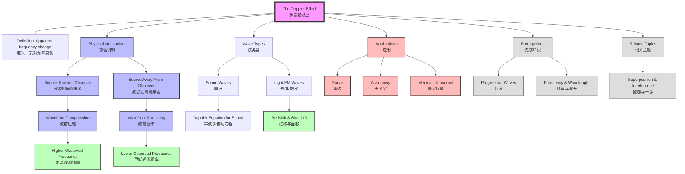

# 1. Overview / 概述

**English:**
The Doppler Effect is a fundamental wave phenomenon describing the apparent change in frequency (and wavelength) of a wave when there is relative motion between the source and the observer. This sub-topic introduces the core concept, physical mechanism, and qualitative understanding of the Doppler Effect for both sound and light waves. It serves as the foundation for quantitative analysis using the [[Doppler Equation for Sound]] and applications in [[Applications (Radar, Astronomy, Medical Ultrasound)]]. Understanding the Doppler Effect is crucial for explaining everyday phenomena like the changing pitch of a siren as an ambulance passes, and for advanced topics like [[Doppler Effect for Light (Redshift and Blueshift)]] in astronomy.

**中文:**
多普勒效应是一种基本的波动现象，描述了当波源和观察者之间存在相对运动时，波的频率（和波长）发生表观变化的现象。本子知识点介绍多普勒效应的核心概念、物理机制和定性理解，涵盖声波和光波。它是使用[[Doppler Equation for Sound]]进行定量分析以及理解[[Applications (Radar, Astronomy, Medical Ultrasound)]]应用的基础。理解多普勒效应对于解释日常现象（如救护车经过时警笛音调的变化）以及天文学中的[[Doppler Effect for Light (Redshift and Blueshift)]]等高级主题至关重要。

---

# 2. Syllabus Learning Objectives / 考纲学习目标

| CAIE 9702 | Edexcel IAL |
|-----------|-------------|
| 7.3(a) Explain the meaning of the Doppler effect | 5.9 Explain what is meant by the Doppler effect |
| 7.3(b) Describe situations where the Doppler effect can be observed | 5.10 Describe situations where the Doppler effect can be observed |
| 7.3(c) Explain the Doppler effect for sound waves and light waves | 5.11 Explain the Doppler effect for sound waves and light waves |
| 7.3(d) Apply the Doppler effect to simple situations | (covered in Doppler Equation for Sound) |

**Examiner Expectations / 考官期望:**
- **English:** Students must be able to explain the Doppler Effect qualitatively, distinguishing between source moving towards/away from observer. They should understand that the effect applies to all wave types (sound, light, water waves). For CAIE, students must also apply the concept to simple situations without equations.
- **中文:** 学生必须能够定性地解释多普勒效应，区分波源朝向/远离观察者运动的情况。他们应理解该效应适用于所有波类型（声波、光波、水波）。对于CAIE，学生还必须将概念应用于无需方程的简单情况。

---

# 3. Core Definitions / 核心定义

| Term (EN/CN) | Definition (EN) | Definition (CN) | Common Mistakes / 常见错误 |
|--------------|-----------------|-----------------|---------------------------|
| **Doppler Effect** / 多普勒效应 | The apparent change in frequency (and wavelength) of a wave due to relative motion between the source and the observer. | 由于波源和观察者之间的相对运动，导致波的频率（和波长）发生表观变化的现象。 | Confusing "apparent" change with actual change in wave properties. The wave's actual frequency doesn't change — only the observed frequency changes. |
| **Relative Motion** / 相对运动 | Movement between the source and observer that changes the distance between them. | 波源和观察者之间改变彼此距离的运动。 | Thinking only source motion matters — observer motion also produces the Doppler Effect. |
| **Apparent Frequency** / 表观频率 | The frequency detected by an observer, which differs from the emitted frequency due to the Doppler Effect. | 观察者检测到的频率，由于多普勒效应而与发射频率不同。 | Confusing apparent frequency with emitted frequency. |
| **Redshift** / 红移 | The increase in wavelength (decrease in frequency) of light from a source moving away from the observer. | 当光源远离观察者时，光波波长增加（频率降低）的现象。 | Thinking redshift only applies to visible light — it applies to all electromagnetic waves. |
| **Blueshift** / 蓝移 | The decrease in wavelength (increase in frequency) of light from a source moving towards the observer. | 当光源朝向观察者运动时，光波波长减小（频率增加）的现象。 | Confusing with color changes — it's about frequency shift, not actual color change. |

---

# 4. Key Concepts Explained / 关键概念详解

## 4.1 Physical Mechanism / 物理机制

### Explanation / 解释
**English:**
The Doppler Effect occurs because relative motion changes the distance wavefronts must travel to reach the observer. When a source moves towards an observer:
- Each successive wavefront is emitted from a position closer to the observer
- Wavefronts become compressed (shorter wavelength)
- Observer detects higher frequency

When a source moves away from an observer:
- Each successive wavefront is emitted from a position farther from the observer
- Wavefronts become stretched (longer wavelength)
- Observer detects lower frequency

This is analogous to a person walking towards you while throwing balls — the balls arrive more frequently because the thrower is getting closer with each throw. This concept builds on [[Progressive Waves]] understanding of wavefronts.

**中文:**
多普勒效应发生是因为相对运动改变了波前到达观察者所需传播的距离。当波源朝向观察者运动时：
- 每个连续的波前从更靠近观察者的位置发出
- 波前被压缩（波长变短）
- 观察者检测到更高的频率

当波源远离观察者运动时：
- 每个连续的波前从更远离观察者的位置发出
- 波前被拉伸（波长变长）
- 观察者检测到更低的频率

这类似于一个人朝你走来同时扔球——球到达的频率更高，因为投掷者每次投掷时都更靠近你。这个概念建立在[[Progressive Waves]]对波前的理解基础上。

### Physical Meaning / 物理意义
**English:**
The Doppler Effect demonstrates that wave observation depends on the relative state of motion between source and observer. It reveals that frequency is not an absolute property of a wave — it depends on the observer's motion relative to the source. This has profound implications for measuring velocities in astronomy, medicine, and radar technology.

**中文:**
多普勒效应表明波的观测取决于波源和观察者之间的相对运动状态。它揭示了频率不是波的绝对属性——它取决于观察者相对于波源的运动。这对天文学、医学和雷达技术中的速度测量具有深远意义。

### Common Misconceptions / 常见误区
- **English:**
  - ❌ "The source's frequency actually changes" — No, the emitted frequency remains constant; only the observed frequency changes
  - ❌ "Only sound waves show the Doppler Effect" — All waves (sound, light, water, seismic) show it
  - ❌ "The effect only depends on source speed" — Both source and observer motion matter
  - ❌ "The effect is the same whether source or observer moves" — For sound, the equations differ; for light, only relative velocity matters

- **中文:**
  - ❌ "波源的频率实际上改变了" — 不，发射频率保持不变；只有观测频率改变
  - ❌ "只有声波显示多普勒效应" — 所有波（声波、光波、水波、地震波）都显示该效应
  - ❌ "效应只取决于波源速度" — 波源和观察者的运动都重要
  - ❌ "波源或观察者运动的效果相同" — 对于声波，方程不同；对于光波，只有相对速度重要

### Exam Tips / 考试提示
- **English:**
  - Always state whether source is moving towards or away from observer
  - Use "apparent frequency" to distinguish from emitted frequency
  - For qualitative questions, describe wavefront compression/stretching
  - Remember: towards = higher frequency (compression), away = lower frequency (stretching)

- **中文:**
  - 始终说明波源是朝向还是远离观察者运动
  - 使用"表观频率"来区分发射频率
  - 对于定性问题，描述波前压缩/拉伸
  - 记住：朝向 = 更高频率（压缩），远离 = 更低频率（拉伸）

> 📷 **IMAGE PROMPT — DOPPLER-01: Wavefront Compression and Stretching**
> A clear diagram showing a stationary wave source with concentric circular wavefronts, alongside a moving source with compressed wavefronts in the direction of motion and stretched wavefronts behind. Use arrows to indicate source velocity. Label "compressed wavefronts (higher f)" and "stretched wavefronts (lower f)". Show an observer on each side.

---

# 5. Essential Equations / 核心公式

**Note:** The full Doppler equation is covered in [[Doppler Equation for Sound]]. For this introductory sub-topic, focus on the qualitative relationship.

$$ f_{observed} > f_{source} \text{ (source moving towards observer)} $$
$$ f_{observed} < f_{source} \text{ (source moving away from observer)} $$

| Symbol (符号) | Meaning (EN) | Meaning (CN) | Unit (单位) |
|--------------|-------------|-------------|------------|
| $f_{observed}$ | Observed (apparent) frequency | 观测（表观）频率 | Hz |
| $f_{source}$ | Emitted (source) frequency | 发射（波源）频率 | Hz |

**Conditions / 适用条件:**
- **English:** Applies to all wave types. For sound, the medium (air) is stationary relative to observer.
- **中文:** 适用于所有波类型。对于声波，介质（空气）相对于观察者静止。

**Limitations / 局限性:**
- **English:** This qualitative relationship doesn't give the magnitude of the frequency shift. For quantitative calculations, use the [[Doppler Equation for Sound]] or [[Doppler Effect for Light (Redshift and Blueshift)]] equations.
- **中文:** 这种定性关系不给出频移的大小。对于定量计算，使用[[Doppler Equation for Sound]]或[[Doppler Effect for Light (Redshift and Blueshift)]]的方程。

---

# 6. Graphs and Relationships / 图表与关系

## 6.1 Observed Frequency vs. Source Velocity / 观测频率与波源速度的关系

### Axes / 坐标轴
- **X-axis:** Source velocity ($v_s$) — positive towards observer / 波源速度（$v_s$）— 朝向观察者为正
- **Y-axis:** Observed frequency ($f_{observed}$) / 观测频率（$f_{observed}$）

### Shape / 形状
- **English:** Non-linear curve. As source velocity increases towards observer, observed frequency increases rapidly. As source velocity increases away from observer, observed frequency decreases. The curve approaches infinity as source velocity approaches wave speed (for sound).
- **中文:** 非线性曲线。当波源朝向观察者的速度增加时，观测频率快速增加。当波源远离观察者的速度增加时，观测频率降低。当波源速度接近波速（对于声波）时，曲线趋近于无穷大。

### Gradient Meaning / 斜率含义
- **English:** Rate of change of observed frequency with source velocity. Steeper gradient means greater sensitivity to velocity changes.
- **中文:** 观测频率随波源速度的变化率。斜率越陡，对速度变化的灵敏度越高。

### Exam Interpretation / 考试解读
- **English:** Be able to sketch this graph qualitatively. Understand that the effect is more pronounced at higher source velocities.
- **中文:** 能够定性地画出该图。理解在更高的波源速度下效应更明显。

---

# 7. Required Diagrams / 必备图表

## 7.1 Stationary vs. Moving Source Wavefronts / 静止与运动波源的波前

### Description / 描述
**English:** A comparison diagram showing wavefront patterns for a stationary source (concentric circles) and a moving source (compressed in front, stretched behind). Include observer positions to show how frequency changes.

**中文:** 比较图，显示静止波源（同心圆）和运动波源（前方压缩，后方拉伸）的波前图案。包括观察者位置以显示频率如何变化。

### Image Prompt / 图片生成提示
> 📷 **IMAGE PROMPT — DOPPLER-02: Stationary vs Moving Source Wavefronts**
> Side-by-side comparison. Left: Stationary source at center with 5 concentric circular wavefronts equally spaced. Right: Moving source (arrow showing velocity to the right) with 5 wavefronts — compressed on the right side (closer spacing) and stretched on the left side (wider spacing). Label "Stationary Source: f_observed = f_source" and "Moving Source: f_observed > f_source (right), f_observed < f_source (left)". Use blue for compressed, red for stretched.

### Labels Required / 需要标注
- **English:** Source position, direction of motion, compressed wavefronts, stretched wavefronts, observer positions
- **中文:** 波源位置、运动方向、压缩波前、拉伸波前、观察者位置

### Exam Importance / 考试重要性
- **English:** High — this diagram is frequently used in exam questions to test qualitative understanding of the Doppler Effect.
- **中文:** 高 — 该图常用于考试题中测试对多普勒效应的定性理解。

## 7.2 Everyday Examples Diagram / 日常示例图

### Description / 描述
**English:** A diagram showing common Doppler Effect scenarios: ambulance siren passing an observer, car horn, police radar gun, and astronomical redshift.

**中文:** 显示常见多普勒效应场景的图：救护车警笛经过观察者、汽车喇叭、警用雷达枪和天文红移。

### Image Prompt / 图片生成提示
> 📷 **IMAGE PROMPT — DOPPLER-03: Everyday Doppler Effect Examples**
> Four-panel diagram. Panel 1: Ambulance with siren moving right past a person — label "higher pitch approaching, lower pitch receding". Panel 2: Car horn — similar. Panel 3: Police radar gun pointing at a car — label "radar waves reflect off moving car". Panel 4: Galaxy moving away from Earth — label "redshift: light stretched to longer wavelengths". Use arrows for motion.

### Labels Required / 需要标注
- **English:** Direction of motion, higher/lower frequency, observer position
- **中文:** 运动方向、更高/更低频率、观察者位置

### Exam Importance / 考试重要性
- **English:** Medium — helps contextualize the Doppler Effect in real-world applications.
- **中文:** 中 — 帮助将多普勒效应置于实际应用背景中。

---

# 8. Worked Examples / 典型例题

## Example 1: Qualitative Doppler Effect / 定性多普勒效应

### Question / 题目
**English:**
A police car with its siren on is moving towards a stationary observer at 30 m/s. The siren emits sound at a frequency of 500 Hz. Describe and explain what the observer hears as the police car:
(a) Approaches the observer
(b) Passes the observer and moves away

**中文:**
一辆警车鸣着警笛以30 m/s的速度朝向静止的观察者行驶。警笛发出频率为500 Hz的声音。描述并解释当警车：
(a) 接近观察者时
(b) 经过观察者并远离时
观察者听到什么。

### Solution / 解答
**English:**
(a) As the police car approaches:
- The source (siren) is moving towards the observer
- Each successive wavefront is emitted from a position closer to the observer
- Wavefronts become compressed — wavelength decreases
- The observer detects a higher frequency (apparent frequency > 500 Hz)
- The observer hears a higher pitch than the siren's actual pitch

(b) As the police car moves away:
- The source is moving away from the observer
- Each successive wavefront is emitted from a position farther from the observer
- Wavefronts become stretched — wavelength increases
- The observer detects a lower frequency (apparent frequency < 500 Hz)
- The observer hears a lower pitch than the siren's actual pitch

**中文:**
(a) 当警车接近时：
- 波源（警笛）朝向观察者运动
- 每个连续的波前从更靠近观察者的位置发出
- 波前被压缩——波长减小
- 观察者检测到更高的频率（表观频率 > 500 Hz）
- 观察者听到比警笛实际音调更高的音调

(b) 当警车远离时：
- 波源远离观察者运动
- 每个连续的波前从更远离观察者的位置发出
- 波前被拉伸——波长增加
- 观察者检测到更低的频率（表观频率 < 500 Hz）
- 观察者听到比警笛实际音调更低的音调

### Final Answer / 最终答案
**Answer:** (a) Higher pitch approaching; (b) Lower pitch receding | **答案：** (a) 接近时音调更高；(b) 远离时音调更低

### Quick Tip / 提示
- **English:** Always link the direction of motion to wavefront compression/stretching. "Towards = compression = higher frequency" is a reliable memory aid.
- **中文:** 始终将运动方向与波前压缩/拉伸联系起来。"朝向 = 压缩 = 更高频率"是一个可靠的记忆辅助。

---

## Example 2: Light Doppler Effect / 光的多普勒效应

### Question / 题目
**English:**
A distant galaxy is observed to have its spectral lines shifted towards the red end of the spectrum. Explain what this tells astronomers about the motion of the galaxy relative to Earth.

**中文:**
观测到一个遥远星系的谱线向光谱的红端偏移。解释这告诉天文学家该星系相对于地球的运动情况。

### Solution / 解答
**English:**
- Redshift means the observed wavelength is longer than the emitted wavelength
- This corresponds to a decrease in observed frequency
- According to the Doppler Effect, this occurs when the source (galaxy) is moving away from the observer (Earth)
- Therefore, the galaxy is moving away from Earth
- This observation supports the expanding universe theory

**中文:**
- 红移意味着观测波长比发射波长更长
- 这对应于观测频率的降低
- 根据多普勒效应，当波源（星系）远离观察者（地球）运动时发生这种情况
- 因此，该星系正在远离地球
- 这一观测支持宇宙膨胀理论

### Final Answer / 最终答案
**Answer:** The galaxy is moving away from Earth | **答案：** 该星系正在远离地球

### Quick Tip / 提示
- **English:** "Redshift = Receding" — both start with 'R'. "Blueshift = Approaching" — both involve shorter wavelengths.
- **中文:** "红移 = 远离" — 红和远都是常见字。"蓝移 = 接近" — 蓝光波长较短。

---

# 9. Past Paper Question Types / 历年真题题型

| Question Type / 题型 | Frequency / 频率 | Difficulty / 难度 | Past Paper References / 真题索引 |
|----------------------|------------------|------------------|-------------------------------|
| Qualitative explanation of Doppler Effect / 多普勒效应定性解释 | Very High / 非常高 | Easy / 简单 | 📝 *待填入* |
| Describe wavefront changes / 描述波前变化 | High / 高 | Easy / 简单 | 📝 *待填入* |
| Everyday examples identification / 日常示例识别 | Medium / 中 | Easy / 简单 | 📝 *待填入* |
| Redshift/Blueshift explanation / 红移/蓝移解释 | Medium / 中 | Medium / 中等 | 📝 *待填入* |
| Compare sound vs light Doppler Effect / 比较声波与光波多普勒效应 | Low / 低 | Medium / 中等 | 📝 *待填入* |

**Common Command Words / 常见指令词:**
- **English:** Explain, Describe, State, Suggest, Compare
- **中文:** 解释、描述、说明、提出、比较

---

# 10. Practical Skills Connections / 实验技能链接

**English:**
The Doppler Effect connects to practical skills in several ways:

1. **Wavefront Visualization:** Understanding wavefront compression/stretching helps in interpreting ripple tank experiments with moving sources.

2. **Frequency Measurement:** Practical work could involve using microphones and data loggers to measure the frequency change of a moving sound source (e.g., a buzzer on a string).

3. **Speed Measurement:** The Doppler Effect is the basis for radar speed guns and ultrasound Doppler flow meters — understanding the principle helps in interpreting their readings.

4. **Graphical Analysis:** Plotting observed frequency against source velocity develops graph interpretation skills.

5. **Uncertainty Considerations:** When measuring Doppler shifts, uncertainties in velocity and frequency measurements must be considered.

**中文:**
多普勒效应通过以下方式与实验技能联系：

1. **波前可视化：** 理解波前压缩/拉伸有助于解释带有运动波源的波纹槽实验。

2. **频率测量：** 实验工作可能涉及使用麦克风和数据记录器测量运动声源（如绳子上的蜂鸣器）的频率变化。

3. **速度测量：** 多普勒效应是雷达测速枪和超声多普勒血流计的基础——理解原理有助于解释其读数。

4. **图形分析：** 绘制观测频率与波源速度的关系图培养图形解读技能。

5. **不确定度考虑：** 测量多普勒频移时，必须考虑速度和频率测量的不确定度。

---

# 11. Concept Map / 概念图谱

---

# 12. Quick Revision Sheet / 速查表

| Category / 类别 | Key Points / 要点 |
|----------------|------------------|
| **Definition / 定义** | Apparent frequency change due to relative motion between source and observer / 由于波源和观察者之间的相对运动导致的表观频率变化 |
| **Key Principle / 核心原理** | Towards = compression = higher frequency; Away = stretching = lower frequency / 朝向 = 压缩 = 更高频率；远离 = 拉伸 = 更低频率 |
| **Wave Types / 波类型** | All waves: sound, light, water, seismic / 所有波：声波、光波、水波、地震波 |
| **Sound vs Light / 声波与光波** | Sound: depends on medium, source and observer motion treated separately; Light: only relative velocity matters / 声波：依赖于介质，波源和观察者运动分别处理；光波：只有相对速度重要 |
| **Redshift / 红移** | Source moving away → longer wavelength → lower frequency / 波源远离 → 波长更长 → 频率更低 |
| **Blueshift / 蓝移** | Source moving towards → shorter wavelength → higher frequency / 波源朝向 → 波长更短 → 频率更高 |
| **Common Example / 常见示例** | Ambulance siren: higher pitch approaching, lower pitch receding / 救护车警笛：接近时音调更高，远离时音调更低 |
| **Exam Tip / 考试提示** | Always state direction of motion relative to observer; use "apparent frequency" / 始终说明相对于观察者的运动方向；使用"表观频率" |
| **Prerequisite / 先修知识** | [[Progressive Waves]] — wavefronts, frequency, wavelength / 行波 — 波前、频率、波长 |
| **Next Topic / 下一主题** | [[Doppler Equation for Sound]] — quantitative calculations / 声波多普勒方程 — 定量计算 |