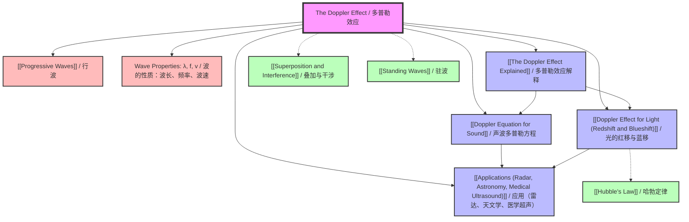

# The Doppler Effect / 多普勒效应

**Parent Folder:** `vault/02-Waves/01-Wave-Properties/The Doppler Effect/`
**Syllabus References:** CAIE 9702: 7.3 (a-d) | Edexcel IAL: WPH11 U2: 5.9-5.11
**Level:** AS | **Difficulty:** Intermediate

---

# 1. Overview / 概述

**English:**
The Doppler Effect describes the apparent change in frequency (and wavelength) of a wave when there is relative motion between the source of the wave and the observer. This phenomenon applies to all types of waves, including sound waves, light waves, and water waves. When the source and observer move towards each other, the observed frequency increases (higher pitch for sound, blueshift for light); when they move apart, the observed frequency decreases (lower pitch for sound, redshift for light).

This topic is fundamental to understanding wave behaviour in dynamic systems. In Physics, it bridges the gap between wave theory and practical applications. Real-world applications are extensive: radar speed guns used by police, medical ultrasound imaging (Doppler ultrasound to measure blood flow), astronomical observations (measuring the speed and direction of stars and galaxies, discovering exoplanets), and even weather radar (detecting wind speeds in storms).

In both Cambridge 9702 and Edexcel IAL examinations, the Doppler Effect is a core topic in the Waves section. Students must understand the qualitative effect, derive and apply the Doppler equation for sound, and (for Edexcel) extend this to light waves with the concept of redshift. Questions typically involve calculations, explanations of everyday phenomena, and graph interpretation. The topic also connects strongly to [[Progressive Waves]] and [[Superposition and Interference]].

**中文：**
多普勒效应描述了当波源与观察者之间存在相对运动时，观察者所观测到的波的频率（和波长）发生表观变化的现象。这一现象适用于所有类型的波，包括声波、光波和水波。当波源和观察者相互靠近时，观测到的频率增加（声音音调变高，光发生蓝移）；当它们相互远离时，观测到的频率降低（声音音调变低，光发生红移）。

本主题对于理解动态系统中的波动行为至关重要。在物理学中，它连接了波动理论与实际应用。实际应用非常广泛：警察使用的雷达测速枪、医学超声成像（多普勒超声测量血流）、天文观测（测量恒星和星系的速度与方向、发现系外行星），甚至气象雷达（探测风暴中的风速）。

在剑桥 9702 和爱德思 IAL 考试中，多普勒效应是波动部分的核心主题。学生必须理解定性效应，推导并应用声波的多普勒方程，并且（对于爱德思）将其扩展到光波的红移概念。考题通常涉及计算、日常现象的解释以及图表分析。该主题还与 [[Progressive Waves|行波]] 和 [[Superposition and Interference|叠加与干涉]] 紧密相连。

---

# 2. Syllabus Learning Objectives / 考纲学习目标

| CAIE 9702 (7.3 a-d) | Edexcel IAL (WPH11 U2: 5.9-5.11) |
|---------------------|----------------------------------|
| **7.3(a):** Explain and use the Doppler effect as a change in observed frequency when a source of waves moves relative to an observer. | **5.9:** Understand the Doppler effect as the change in observed frequency and wavelength when a source of waves moves relative to an observer. |
| **7.3(b):** Derive the equation $f_o = \frac{f_s v}{v \pm v_s}$ for sound waves. | **5.10:** Use the equation $f_o = \frac{f_s v}{v \pm v_s}$ for sound waves. |
| **7.3(c):** Solve problems using the Doppler effect equation for sound. | **5.11:** Understand the application of the Doppler effect to light, including the concepts of redshift and blueshift. |
| **7.3(d):** Describe applications of the Doppler effect (e.g., radar speed traps, medical ultrasound, astronomy). | |

> 📋 **CIE Only:** CIE explicitly requires derivation of the Doppler equation for sound. Students must be able to show the derivation step-by-step, including the concept of wavelength compression/expansion. CIE also lists specific applications (radar, ultrasound, astronomy) that students must be able to describe.
>
> 📋 **Edexcel Only:** Edexcel explicitly requires understanding of the Doppler effect for light, including redshift and blueshift. This is not explicitly in the CIE AS syllabus but may appear in A2. Edexcel also expects students to apply the concept to astronomical observations (Hubble's law is in Unit 4, but the basic concept of redshift is introduced here).

**Examiner Expectations / 考官期望:**

**English:**
- **Qualitative understanding:** You must be able to explain *why* the frequency changes (wavefront compression/expansion) without relying on equations.
- **Equation application:** You must correctly identify which sign to use in the denominator ($+$ or $-$) based on the direction of motion.
- **Derivation (CIE):** You must be able to derive $f_o = \frac{f_s v}{v \pm v_s}$ from first principles, showing the relationship between wavelength, speed, and frequency.
- **Real-world context:** You must be able to apply the Doppler effect to unfamiliar situations, such as bats echolocating, police radar, or medical ultrasound.
- **Light vs. Sound:** You must understand that the Doppler effect applies to all waves, but the equation for light uses relativistic corrections (though at A-Level, the non-relativistic approximation is often used for low speeds).

**中文：**
- **定性理解：** 你必须能够解释频率为何变化（波前压缩/膨胀），而不依赖方程。
- **方程应用：** 你必须根据运动方向正确选择分母中的符号（$+$ 或 $-$）。
- **推导（CIE）：** 你必须能够从基本原理推导出 $f_o = \frac{f_s v}{v \pm v_s}$，展示波长、速度和频率之间的关系。
- **实际情境：** 你必须能够将多普勒效应应用于不熟悉的情境，例如蝙蝠回声定位、警察雷达或医学超声。
- **光与声的区别：** 你必须理解多普勒效应适用于所有波，但光的方程需要相对论修正（尽管在 A-Level 中，对于低速情况常使用非相对论近似）。

---

# 3. Core Definitions / 核心定义

| Term (EN/CN) | Definition (EN) | Definition (CN) | Common Mistakes / 常见错误 |
|--------------|-----------------|-----------------|---------------------------|
| **Doppler Effect / 多普勒效应** | The apparent change in frequency (and wavelength) of a wave due to relative motion between the source and the observer. | 由于波源与观察者之间的相对运动，导致观测到的波的频率（和波长）发生表观变化的现象。 | ❌ Thinking the *source frequency* changes. It does NOT — only the *observed frequency* changes. |
| **Observed Frequency ($f_o$) / 观测频率** | The frequency of the wave as measured by the observer, which differs from the source frequency when there is relative motion. | 观察者测量到的波的频率，当存在相对运动时，该频率与波源频率不同。 | ❌ Confusing $f_o$ with $f_s$. Always check which frequency is being asked for. |
| **Source Frequency ($f_s$) / 波源频率** | The actual frequency of the wave emitted by the source, which remains constant regardless of motion. | 波源实际发出的波的频率，无论运动如何，该频率保持不变。 | ❌ Assuming $f_s$ changes when the source moves. It does NOT. |
| **Wave Speed ($v$) / 波速** | The speed of the wave in the medium (for sound, this is the speed of sound in air, approximately 340 m/s). | 波在介质中的传播速度（对于声波，这是空气中的声速，约为 340 m/s）。 | ❌ Confusing wave speed with source speed. They are different. |
| **Source Speed ($v_s$) / 波源速度** | The speed at which the source moves relative to the medium (for sound) or relative to the observer (for light). | 波源相对于介质（对于声波）或相对于观察者（对于光）运动的速度。 | ❌ Forgetting that $v_s$ is the *component* of velocity along the line joining source and observer. |
| **Redshift / 红移** | An increase in observed wavelength (decrease in frequency) of light from a source moving away from the observer. | 当光源远离观察者时，观测到的光波长增加（频率降低）的现象。 | ❌ Thinking redshift only applies to visible light. It applies to all electromagnetic waves. |
| **Blueshift / 蓝移** | A decrease in observed wavelength (increase in frequency) of light from a source moving towards the observer. | 当光源靠近观察者时，观测到的光波长减小（频率增加）的现象。 | ❌ Confusing blueshift with the colour blue. It's a general term for any frequency increase. |
| **Wavefront Compression / 波前压缩** | When a source moves towards an observer, the wavefronts are "squashed" together, reducing the observed wavelength and increasing the observed frequency. | 当波源向观察者运动时，波前被“挤压”在一起，导致观测波长减小，观测频率增加。 | ❌ Not understanding that this is a *geometric* effect, not a change in wave speed. |
| **Wavefront Expansion / 波前膨胀** | When a source moves away from an observer, the wavefronts are "stretched" apart, increasing the observed wavelength and decreasing the observed frequency. | 当波源远离观察者运动时，波前被“拉伸”开，导致观测波长增加，观测频率降低。 | ❌ Forgetting that the effect is symmetric for source moving towards vs. away. |

---

# 4. Key Concepts Explained / 关键概念详解

## 4.1 The Doppler Effect: Qualitative Understanding / 多普勒效应：定性理解

### Explanation / 解释
**English:**
The Doppler Effect arises because the wavefronts emitted by a moving source are not concentric circles (or spheres) centered on the source's current position. Instead, they are "bunched up" in the direction of motion and "spread out" behind the source.

Imagine a stationary source emitting sound waves. The wavefronts are equally spaced, like concentric circles. An observer at any point hears the same frequency as the source emits.

Now imagine the source moves towards an observer. As the source moves, it "chases" the wavefronts it has already emitted in the forward direction. This means the distance between successive wavefronts in front of the source is reduced — the wavelength is compressed. Since wave speed $v$ is constant in the medium, a shorter wavelength means a higher frequency ($f = v/\lambda$). The observer hears a higher pitch.

Conversely, when the source moves away from an observer, the source "runs away" from the wavefronts it has emitted behind it. The wavefronts are stretched apart — the wavelength is expanded. A longer wavelength means a lower frequency. The observer hears a lower pitch.

The same effect occurs if the source is stationary and the observer moves, though the physical mechanism is slightly different (the observer moves through the wavefronts at a different relative speed). The key point is that **relative motion** between source and observer causes the effect.

This concept is fundamental to understanding [[Progressive Waves]] in dynamic situations.

**中文：**
多普勒效应产生的原因是，运动波源发出的波前并非以波源当前位置为中心的同心圆（或球面）。相反，它们在运动方向上“聚集”，在波源后方“扩散”。

想象一个静止的波源发出声波。波前等间距分布，如同同心圆。任何位置的观察者听到的频率都与波源发出的频率相同。

现在想象波源向观察者运动。当波源运动时，它“追赶”着它已经在前进方向发出的波前。这意味着波源前方相邻波前之间的距离减小了——波长被压缩。由于介质中的波速 $v$ 恒定，较短的波长意味着较高的频率（$f = v/\lambda$）。观察者听到更高的音调。

相反，当波源远离观察者运动时，波源“逃离”了它在后方发出的波前。波前被拉伸开——波长被膨胀。较长的波长意味着较低的频率。观察者听到更低的音调。

如果波源静止而观察者运动，也会发生同样的效应，尽管物理机制略有不同（观察者以不同的相对速度穿过波前）。关键在于波源与观察者之间的**相对运动**引起了该效应。

这个概念对于理解动态情况下的 [[Progressive Waves|行波]] 至关重要。

### Physical Meaning / 物理意义
**English:**
The Doppler Effect is a direct consequence of the finite speed of wave propagation. If waves traveled infinitely fast, there would be no Doppler Effect — the observer would always see the wavefronts as they were emitted, regardless of motion. The effect is a "time delay" effect: by the time a wavefront reaches the observer, the source has moved, so the spacing between wavefronts is altered.

**中文：**
多普勒效应是波传播速度有限的直接结果。如果波以无限速度传播，就不会有多普勒效应——无论运动如何，观察者总是看到波被发出时的波前。该效应是一种“时间延迟”效应：当波前到达观察者时，波源已经移动了，因此波前之间的间距发生了改变。

### Common Misconceptions / 常见误区
1. ❌ **"The source frequency changes."** — The source emits waves at a constant frequency $f_s$. Only the *observed* frequency $f_o$ changes.
2. ❌ **"The wave speed changes."** — The speed of the wave in the medium ($v$) is constant. It does NOT change due to the motion of the source.
3. ❌ **"The effect only applies to sound."** — The Doppler Effect applies to ALL waves: sound, light, water, seismic waves, etc.
4. ❌ **"The effect is the same whether source or observer moves."** — For sound, the equations are different for source moving vs. observer moving (because sound requires a medium). For light, only relative motion matters.
5. ❌ **"The effect only happens when the source is moving directly towards or away."** — The effect depends on the component of velocity along the line of sight. If the source moves perpendicular to the line of sight, there is no Doppler shift.

### Exam Tips / 考试提示
**English:**
- **Draw a diagram!** When explaining the Doppler Effect, always draw wavefronts showing compression in front and expansion behind the moving source.
- **Use the word "apparent"** — the observed frequency changes, not the actual frequency.
- **For CIE derivation questions**, be prepared to show the full derivation with labelled diagrams.
- **For Edexcel**, be ready to explain redshift in the context of astronomy (galaxies moving away, universe expanding).
- **Common exam question:** "Explain why the pitch of a siren changes as an ambulance passes you." — Answer: As the ambulance approaches, wavefronts are compressed → shorter wavelength → higher frequency → higher pitch. As it moves away, wavefronts are expanded → longer wavelength → lower frequency → lower pitch.

**中文：**
- **画图！** 在解释多普勒效应时，始终画出波前，显示运动波源前方的压缩和后方的膨胀。
- **使用“表观”一词** — 观测频率改变，而非实际频率。
- **对于 CIE 推导题**，准备好展示完整的推导过程并附有标注的图表。
- **对于 Edexcel**，准备好在天文学背景下解释红移（星系远离，宇宙膨胀）。
- **常见考题：** “解释为什么当救护车经过你时，警笛的音调会变化。” — 答案：当救护车靠近时，波前被压缩 → 波长变短 → 频率变高 → 音调变高。当它远离时，波前被膨胀 → 波长变长 → 频率变低 → 音调变低。

> 📷 **IMAGE PROMPT — DOPPLER-001: Wavefront Compression and Expansion**
>
> A 2D top-down diagram showing a moving sound source (a small car icon) moving from left to right. Concentric circular wavefronts are shown, with the circles closer together (compressed) on the right side (in front of the car) and farther apart (expanded) on the left side (behind the car). An observer on the right is labelled "Observer A — hears higher pitch" and an observer on the left is labelled "Observer B — hears lower pitch". The source emits at constant frequency. Clean, educational style with blue wavefronts, black labels, and a grey background. Suitable for a physics textbook.

---

## 4.2 The Doppler Equation for Sound / 声波的多普勒方程

### Explanation / 解释
**English:**
For sound waves, the Doppler Effect depends on the motion of both the source and the observer relative to the medium (air). The general equation is:

$$f_o = f_s \left( \frac{v \pm v_o}{v \mp v_s} \right)$$

Where:
- $f_o$ = observed frequency (Hz)
- $f_s$ = source frequency (Hz)
- $v$ = speed of sound in the medium (m/s)
- $v_o$ = speed of the observer relative to the medium (m/s)
- $v_s$ = speed of the source relative to the medium (m/s)

**Sign Convention:**
- **Top sign ($v \pm v_o$):** Use $+$ if the observer moves *towards* the source (increases observed frequency). Use $-$ if the observer moves *away* from the source.
- **Bottom sign ($v \mp v_s$):** Use $-$ if the source moves *towards* the observer (increases observed frequency). Use $+$ if the source moves *away* from the observer.

**Simplified Case (Stationary Observer, Moving Source):**
If the observer is stationary ($v_o = 0$), the equation simplifies to:

$$f_o = f_s \left( \frac{v}{v \mp v_s} \right)$$

- **Source moving towards observer:** $f_o = f_s \left( \frac{v}{v - v_s} \right)$ (denominator smaller → $f_o > f_s$)
- **Source moving away from observer:** $f_o = f_s \left( \frac{v}{v + v_s} \right)$ (denominator larger → $f_o < f_s$)

**Simplified Case (Stationary Source, Moving Observer):**
If the source is stationary ($v_s = 0$), the equation simplifies to:

$$f_o = f_s \left( \frac{v \pm v_o}{v} \right)$$

- **Observer moving towards source:** $f_o = f_s \left( \frac{v + v_o}{v} \right)$ ($f_o > f_s$)
- **Observer moving away from source:** $f_o = f_s \left( \frac{v - v_o}{v} \right)$ ($f_o < f_s$)

**Important Note:** For sound, the cases of moving source and moving observer are NOT symmetric. The equations are different because the wave speed is relative to the medium, not relative to the source or observer.

**中文：**
对于声波，多普勒效应取决于波源和观察者相对于介质（空气）的运动。一般方程为：

$$f_o = f_s \left( \frac{v \pm v_o}{v \mp v_s} \right)$$

其中：
- $f_o$ = 观测频率 (Hz)
- $f_s$ = 波源频率 (Hz)
- $v$ = 介质中的声速 (m/s)
- $v_o$ = 观察者相对于介质的速度 (m/s)
- $v_s$ = 波源相对于介质的速度 (m/s)

**符号规则：**
- **分子 ($v \pm v_o$)：** 如果观察者向波源运动，使用 $+$（增加观测频率）。如果观察者远离波源，使用 $-$。
- **分母 ($v \mp v_s$)：** 如果波源向观察者运动，使用 $-$（增加观测频率）。如果波源远离观察者，使用 $+$。

**简化情况（观察者静止，波源运动）：**
如果观察者静止（$v_o = 0$），方程简化为：

$$f_o = f_s \left( \frac{v}{v \mp v_s} \right)$$

- **波源向观察者运动：** $f_o = f_s \left( \frac{v}{v - v_s} \right)$（分母更小 → $f_o > f_s$）
- **波源远离观察者运动：** $f_o = f_s \left( \frac{v}{v + v_s} \right)$（分母更大 → $f_o < f_s$）

**简化情况（波源静止，观察者运动）：**
如果波源静止（$v_s = 0$），方程简化为：

$$f_o = f_s \left( \frac{v \pm v_o}{v} \right)$$

- **观察者向波源运动：** $f_o = f_s \left( \frac{v + v_o}{v} \right)$（$f_o > f_s$）
- **观察者远离波源运动：** $f_o = f_s \left( \frac{v - v_o}{v} \right)$（$f_o < f_s$）

**重要提示：** 对于声波，波源运动和观察者运动的情况并不对称。方程不同，因为波速是相对于介质，而不是相对于波源或观察者。

### Physical Meaning / 物理意义
**English:**
The equation quantifies exactly how much the frequency shifts. For a source moving towards an observer at speed $v_s$, the wavelength is compressed by a factor of $(v - v_s)/v$, so the frequency increases by the inverse factor $v/(v - v_s)$. The faster the source moves, the greater the shift. If the source moves at the speed of sound ($v_s = v$), the denominator becomes zero, and the observed frequency becomes infinite — this corresponds to a sonic boom (shock wave).

**中文：**
该方程精确量化了频率偏移的程度。对于以速度 $v_s$ 向观察者运动的波源，波长被压缩了 $(v - v_s)/v$ 倍，因此频率增加了倒数倍 $v/(v - v_s)$。波源运动越快，偏移越大。如果波源以声速运动（$v_s = v$），分母变为零，观测频率变为无穷大——这对应于音爆（冲击波）。

### Common Misconceptions / 常见误区
1. ❌ **"I can use the same equation for light."** — No! Light does not require a medium, and the Doppler effect for light requires relativistic treatment. The equation $f_o = f_s \sqrt{\frac{c+v}{c-v}}$ is different.
2. ❌ **"The sign convention is the same for numerator and denominator."** — No! They are opposite: $+$ in numerator means towards, but $-$ in denominator means towards.
3. ❌ **"The equation works for any speed."** — No! The equation assumes $v_s < v$. If $v_s \ge v$, the source is supersonic, and the wavefronts form a Mach cone (shock wave), not a simple Doppler shift.
4. ❌ **"I can ignore the observer's motion if it's small."** — No! Always include all relevant motions.

### Exam Tips / 考试提示
**English:**
- **Always state your sign convention** before using the equation. Write: "Taking towards as positive..."
- **Check your answer makes sense:** If source and observer approach, $f_o > f_s$. If they recede, $f_o < f_s$.
- **For CIE derivation**, you must show:
  1. Wavelength emitted: $\lambda_s = v/f_s$
  2. In time $T = 1/f_s$, source moves distance $v_s T$
  3. New wavelength in front: $\lambda_o = \lambda_s - v_s T = v/f_s - v_s/f_s = (v - v_s)/f_s$
  4. Observed frequency: $f_o = v/\lambda_o = v f_s / (v - v_s)$
- **For Edexcel**, you may be asked to rearrange the equation to find $v_s$ or $f_s$.

**中文：**
- **在使用方程前，始终说明你的符号规则。** 写下：“取靠近方向为正...”
- **检查你的答案是否合理：** 如果波源和观察者靠近，$f_o > f_s$。如果它们远离，$f_o < f_s$。
- **对于 CIE 推导，** 你必须展示：
  1. 发射波长：$\lambda_s = v/f_s$
  2. 在时间 $T = 1/f_s$ 内，波源移动距离 $v_s T$
  3. 前方的新波长：$\lambda_o = \lambda_s - v_s T = v/f_s - v_s/f_s = (v - v_s)/f_s$
  4. 观测频率：$f_o = v/\lambda_o = v f_s / (v - v_s)$
- **对于 Edexcel，** 可能会要求你重新排列方程以求出 $v_s$ 或 $f_s$。

---

## 4.3 The Doppler Effect for Light (Redshift and Blueshift) / 光的红移与蓝移

### Explanation / 解释
**English:**
The Doppler Effect also applies to light (electromagnetic waves). However, because light does not require a medium and travels at the universal speed $c$ in vacuum, the treatment is different from sound. For light, only the *relative* velocity between source and observer matters — there is no distinction between source moving and observer moving.

For non-relativistic speeds ($v \ll c$), the approximate equation is:

$$\frac{\Delta \lambda}{\lambda_s} = \frac{v}{c}$$

Where:
- $\Delta \lambda = \lambda_o - \lambda_s$ = change in wavelength
- $\lambda_s$ = wavelength emitted by source
- $\lambda_o$ = wavelength observed
- $v$ = relative speed of recession (positive if moving apart)
- $c$ = speed of light ($3.0 \times 10^8$ m/s)

**Redshift:** When a source moves away from the observer, $\lambda_o > \lambda_s$, so $\Delta \lambda > 0$. The light is shifted to longer wavelengths (towards the red end of the spectrum). This is called **redshift**.

**Blueshift:** When a source moves towards the observer, $\lambda_o < \lambda_s$, so $\Delta \lambda < 0$. The light is shifted to shorter wavelengths (towards the blue end of the spectrum). This is called **blueshift**.

**Astronomical Significance:**
- Most distant galaxies show redshift, indicating they are moving away from us.
- The amount of redshift is proportional to the galaxy's distance (Hubble's Law: $v = H_0 d$).
- This is key evidence for the expansion of the universe.

**Relativistic Doppler Effect (for reference, not required at AS level):**
The exact relativistic equation is:

$$f_o = f_s \sqrt{\frac{c - v}{c + v}}$$

Where $v$ is positive for recession. This accounts for time dilation effects at high speeds.

**中文：**
多普勒效应也适用于光（电磁波）。然而，由于光不需要介质，并且在真空中以普适速度 $c$ 传播，其处理方法与声波不同。对于光，只有波源和观察者之间的**相对**速度才重要——没有波源运动和观察者运动的区别。

对于非相对论速度（$v \ll c$），近似方程为：

$$\frac{\Delta \lambda}{\lambda_s} = \frac{v}{c}$$

其中：
- $\Delta \lambda = \lambda_o - \lambda_s$ = 波长的变化量
- $\lambda_s$ = 波源发射的波长
- $\lambda_o$ = 观测到的波长
- $v$ = 相对远离速度（如果相互远离则为正）
- $c$ = 光速（$3.0 \times 10^8$ m/s）

**红移：** 当光源远离观察者时，$\lambda_o > \lambda_s$，因此 $\Delta \lambda > 0$。光被移向更长的波长（朝向光谱的红端）。这被称为**红移**。

**蓝移：** 当光源靠近观察者时，$\lambda_o < \lambda_s$，因此 $\Delta \lambda < 0$。光被移向更短的波长（朝向光谱的蓝端）。这被称为**蓝移**。

**天文学意义：**
- 大多数遥远星系显示出红移，表明它们正在远离我们。
- 红移量与星系的距离成正比（哈勃定律：$v = H_0 d$）。
- 这是宇宙膨胀的关键证据。

**相对论多普勒效应（供参考，AS 级别不要求）：**
精确的相对论方程为：

$$f_o = f_s \sqrt{\frac{c - v}{c + v}}$$

其中 $v$ 对于远离为正。这考虑了高速下的时间膨胀效应。

### Physical Meaning / 物理意义
**English:**
Redshift and blueshift allow astronomers to measure the radial velocity (speed along the line of sight) of stars, galaxies, and other celestial objects. By analyzing the spectrum of light from a star and comparing the observed wavelengths of known spectral lines (e.g., hydrogen Balmer lines) to their laboratory values, astronomers can calculate how fast the star is moving towards or away from Earth.

**中文：**
红移和蓝移使天文学家能够测量恒星、星系和其他天体的径向速度（沿视线方向的速度）。通过分析来自恒星的光谱，并将观测到的已知谱线（例如氢的巴尔末线）的波长与其实验室值进行比较，天文学家可以计算出恒星朝向或远离地球运动的速度。

### Common Misconceptions / 常见误区
1. ❌ **"Redshift means the light turns red."** — No! Redshift means the wavelength increases. A star that appears blue can still be redshifted if its emitted wavelength was even shorter (e.g., ultraviolet shifted into visible blue).
2. ❌ **"The Doppler effect for light is the same as for sound."** — No! The equations are different, and for light there is no medium.
3. ❌ **"Blueshift only applies to blue light."** — No! Blueshift is a general term for any decrease in wavelength (increase in frequency).
4. ❌ **"Redshift is only caused by the Doppler effect."** — No! Gravitational redshift (due to strong gravity) also exists, but this is beyond A-Level.

### Exam Tips / 考试提示
**English:**
- **For Edexcel**, be prepared to calculate the recession speed of a galaxy given the redshift ($z = \Delta \lambda / \lambda_s$).
- **Know the formula:** $z = \frac{\Delta \lambda}{\lambda_s} \approx \frac{v}{c}$ for $v \ll c$.
- **Be able to interpret spectra:** Given a spectrum with absorption lines shifted from their laboratory positions, determine whether the source is moving towards or away, and calculate the speed.
- **Connect to Hubble's Law:** Redshift is evidence for the expanding universe.

**中文：**
- **对于 Edexcel，** 准备好根据红移量（$z = \Delta \lambda / \lambda_s$）计算星系的远离速度。
- **记住公式：** $z = \frac{\Delta \lambda}{\lambda_s} \approx \frac{v}{c}$ 对于 $v \ll c$。
- **能够解释光谱：** 给定一个吸收线偏离实验室位置的光谱，判断光源是朝向还是远离运动，并计算速度。
- **联系哈勃定律：** 红移是宇宙膨胀的证据。

> 📷 **IMAGE PROMPT — DOPPLER-002: Redshift and Blueshift in Spectra**
>
> Two side-by-side spectra. Left: "Laboratory Spectrum" showing a set of dark absorption lines at specific wavelengths (e.g., hydrogen Balmer series: 656 nm, 486 nm, 434 nm). Right: "Observed Spectrum from Distant Galaxy" showing the same pattern of absorption lines but shifted towards the red end (longer wavelengths). Arrows indicate the shift direction. Labels: "Redshift → λ increases", "Galaxy moving away". Clean, educational style with a dark background and bright spectral lines. Suitable for an astronomy textbook.

---

## 4.4 Applications of the Doppler Effect / 多普勒效应的应用

### Explanation / 解释
**English:**
The Doppler Effect has numerous practical applications across science, medicine, and technology.

**1. Radar Speed Guns (Police Radar)**
- A radar gun emits a microwave beam towards a vehicle.
- The waves reflect off the vehicle and return to the gun.
- If the vehicle is moving, the reflected waves are Doppler-shifted.
- The gun measures the frequency shift and calculates the vehicle's speed.
- Equation: $\Delta f = \frac{2v f_s}{c}$ (for electromagnetic waves, where $c$ is the speed of light).

**2. Medical Ultrasound (Doppler Ultrasound)**
- Used to measure blood flow velocity in arteries and veins.
- An ultrasound probe emits high-frequency sound waves into the body.
- The waves reflect off moving red blood cells.
- The frequency shift of the reflected waves is proportional to the blood flow speed.
- Used to detect blockages, clots, and fetal heart rate monitoring.

**3. Astronomy (Redshift and Blueshift)**
- Measuring the radial velocity of stars and galaxies.
- Discovering binary star systems (stars orbiting each other cause periodic Doppler shifts).
- Detecting exoplanets (the star's slight wobble due to an orbiting planet causes periodic Doppler shifts).
- Evidence for the expanding universe (Hubble's Law).

**4. Weather Radar (Doppler Radar)**
- Used to detect wind speeds in storms.
- Measures the Doppler shift of radar waves reflected off raindrops or snowflakes.
- Helps predict tornadoes and severe weather.

**5. Bats and Dolphins (Echolocation)**
- Bats emit ultrasonic calls and listen for echoes.
- The Doppler shift of the echo tells the bat the speed of its prey.
- Dolphins use similar echolocation for navigation and hunting.

**中文：**
多普勒效应在科学、医学和技术领域有着众多实际应用。

**1. 雷达测速枪（警察雷达）**
- 雷达枪向车辆发射微波束。
- 波从车辆反射并返回雷达枪。
- 如果车辆在运动，反射波会发生多普勒频移。
- 雷达枪测量频移并计算车辆速度。
- 方程：$\Delta f = \frac{2v f_s}{c}$（对于电磁波，其中 $c$ 是光速）。

**2. 医学超声（多普勒超声）**
- 用于测量动脉和静脉中的血流速度。
- 超声探头向体内发射高频声波。
- 波从运动的红细胞反射回来。
- 反射波的频移与血流速度成正比。
- 用于检测堵塞、血栓和胎儿心率监测。

**3. 天文学（红移和蓝移）**
- 测量恒星和星系的径向速度。
- 发现双星系统（相互绕转的恒星引起周期性多普勒频移）。
- 探测系外行星（行星引力导致恒星的轻微摆动引起周期性多普勒频移）。
- 宇宙膨胀的证据（哈勃定律）。

**4. 气象雷达（多普勒雷达）**
- 用于探测风暴中的风速。
- 测量从雨滴或雪花反射的雷达波的多普勒频移。
- 帮助预测龙卷风和恶劣天气。

**5. 蝙蝠和海豚（回声定位）**
- 蝙蝠发出超声波呼叫并聆听回声。
- 回声的多普勒频移告诉蝙蝠猎物的速度。
- 海豚使用类似的回声定位进行导航和捕猎。

### Physical Meaning / 物理意义
**English:**
The Doppler Effect is not just a theoretical curiosity — it is a powerful measurement tool. By measuring frequency shifts, we can determine velocities without physical contact. This is crucial in situations where direct measurement is impossible (e.g., blood flow inside the body, speed of distant galaxies).

**中文：**
多普勒效应不仅仅是一个理论上的趣闻——它是一个强大的测量工具。通过测量频移，我们可以在不进行物理接触的情况下确定速度。这在无法直接测量的情况下至关重要（例如，体内的血流、遥远星系的速度）。

### Common Misconceptions / 常见误区
1. ❌ **"Radar guns use sound waves."** — No! They use microwaves (electromagnetic waves).
2. ❌ **"Medical ultrasound uses the same frequency as audible sound."** — No! Ultrasound uses frequencies above 20 kHz (typically 1-20 MHz).
3. ❌ **"The Doppler effect only works if the source moves directly towards or away."** — For most applications, only the component of velocity along the line of sight matters. Radar guns measure the component of velocity towards/away from the gun, not the actual speed of the car.

### Exam Tips / 考试提示
**English:**
- **For CIE**, you must be able to describe at least one application in detail, including how the Doppler effect is used.
- **For Edexcel**, you may be asked to explain how redshift is used in astronomy.
- **Common question:** "Explain how a radar speed gun works." — Answer: The gun emits microwaves at a known frequency. These reflect off the moving car. The reflected waves are Doppler-shifted. The gun measures the frequency shift and calculates the car's speed using $\Delta f = 2v f_s / c$.
- **Be quantitative:** You may be asked to calculate the speed of a car or a galaxy given the frequency/wavelength shift.

**中文：**
- **对于 CIE，** 你必须能够详细描述至少一个应用，包括如何使用多普勒效应。
- **对于 Edexcel，** 可能会要求你解释如何在天文学中使用红移。
- **常见问题：** “解释雷达测速枪的工作原理。” — 答案：测速枪以已知频率发射微波。这些波从运动的汽车反射回来。反射波发生多普勒频移。测速枪测量频移并使用 $\Delta f = 2v f_s / c$ 计算汽车速度。
- **定量计算：** 可能会要求你根据频率/波长偏移计算汽车或星系的速度。

---

# 5. Essential Equations / 核心公式

## 5.1 Doppler Effect for Sound (General Case) / 声波多普勒效应（一般情况）

**Equation / 公式:**
$$f_o = f_s \left( \frac{v \pm v_o}{v \mp v_s} \right)$$

**Variables / 变量:**
| Symbol (符号) | Meaning (EN) | Meaning (CN) | Unit (单位) |
|--------------|-------------|-------------|------------|
| $f_o$ | Observed frequency | 观测频率 | Hz |
| $f_s$ | Source frequency | 波源频率 | Hz |
| $v$ | Speed of sound in the medium | 介质中的声速 | m/s |
| $v_o$ | Speed of observer relative to medium | 观察者相对于介质的速度 | m/s |
| $v_s$ | Speed of source relative to medium | 波源相对于介质的速度 | m/s |

**Derivation / 推导:**
**English:**
Consider a source moving towards a stationary observer with speed $v_s$.

1. The source emits waves with frequency $f_s$ and wavelength $\lambda_s = v/f_s$.
2. In one period $T = 1/f_s$, the source moves a distance $v_s T$ towards the observer.
3. The wavefront emitted at the beginning of the period has travelled a distance $vT$ by the end of the period.
4. The distance between successive wavefronts (the observed wavelength) is:
   $$\lambda_o = vT - v_s T = (v - v_s)T = \frac{v - v_s}{f_s}$$
5. The observed frequency is:
   $$f_o = \frac{v}{\lambda_o} = \frac{v}{(v - v_s)/f_s} = \frac{v f_s}{v - v_s}$$

For a source moving away, replace $v_s$ with $-v_s$:
$$f_o = \frac{v f_s}{v + v_s}$$

The general form with both source and observer moving is:
$$f_o = f_s \left( \frac{v \pm v_o}{v \mp v_s} \right)$$

**中文：**
考虑一个以速度 $v_s$ 向静止观察者运动的波源。

1. 波源以频率 $f_s$ 发射波，波长 $\lambda_s = v/f_s$。
2. 在一个周期 $T = 1/f_s$ 内，波源向观察者移动距离 $v_s T$。
3. 在周期开始时发射的波前，在周期结束时已经传播了距离 $vT$。
4. 相邻波前之间的距离（观测波长）为：
   $$\lambda_o = vT - v_s T = (v - v_s)T = \frac{v - v_s}{f_s}$$
5. 观测频率为：
   $$f_o = \frac{v}{\lambda_o} = \frac{v}{(v - v_s)/f_s} = \frac{v f_s}{v - v_s}$$

对于远离的波源，将 $v_s$ 替换为 $-v_s$：
$$f_o = \frac{v f_s}{v + v_s}$$

波源和观察者都运动的一般形式为：
$$f_o = f_s \left( \frac{v \pm v_o}{v \mp v_s} \right)$$

**Conditions / 适用条件:**
**English:**
- The wave is a mechanical wave (sound) that requires a medium.
- The speeds $v_s$ and $v_o$ are measured relative to the medium.
- The source speed $v_s$ must be less than the wave speed $v$ ($v_s < v$).
- The motion is along the line joining the source and observer.

**中文：**
- 波是需要介质的机械波（声波）。
- 速度 $v_s$ 和 $v_o$ 是相对于介质测量的。
- 波源速度 $v_s$ 必须小于波速 $v$（$v_s < v$）。
- 运动沿着波源和观察者的连线方向。

**Limitations / 局限性:**
**English:**
- Does NOT apply to electromagnetic waves (light) — use the relativistic Doppler equation.
- Does NOT apply if $v_s \ge v$ (supersonic speeds) — shock waves form.
- Does NOT account for wind or motion of the medium itself.
- Assumes motion is directly towards or away (line of sight). For motion at an angle, use the component of velocity along the line of sight.

**中文：**
- 不适用于电磁波（光）——使用相对论多普勒方程。
- 不适用于 $v_s \ge v$（超音速）的情况——会形成冲击波。
- 不考虑风或介质本身的运动。
- 假设运动是直接朝向或远离（视线方向）。对于有角度的运动，使用沿视线方向的速度分量。

**Rearrangements / 变形:**
**English:**
1. To find source speed (observer stationary, source moving towards):
   $$v_s = v \left(1 - \frac{f_s}{f_o}\right)$$
2. To find source speed (observer stationary, source moving away):
   $$v_s = v \left(\frac{f_s}{f_o} - 1\right)$$
3. To find observed wavelength:
   $$\lambda_o = \frac{v}{f_o} = \frac{v \mp v_s}{f_s}$$

**中文：**
1. 求波源速度（观察者静止，波源靠近）：
   $$v_s = v \left(1 - \frac{f_s}{f_o}\right)$$
2. 求波源速度（观察者静止，波源远离）：
   $$v_s = v \left(\frac{f_s}{f_o} - 1\right)$$
3. 求观测波长：
   $$\lambda_o = \frac{v}{f_o} = \frac{v \mp v_s}{f_s}$$

---

## 5.2 Doppler Effect for Light (Non-Relativistic Approximation) / 光的红移（非相对论近似）

**Equation / 公式:**
$$\frac{\Delta \lambda}{\lambda_s} = \frac{v}{c}$$

**Variables / 变量:**
| Symbol (符号) | Meaning (EN) | Meaning (CN) | Unit (单位) |
|--------------|-------------|-------------|------------|
| $\Delta \lambda$ | Change in wavelength ($\lambda_o - \lambda_s$) | 波长变化量 ($\lambda_o - \lambda_s$) | m |
| $\lambda_s$ | Wavelength emitted by source | 波源发射的波长 | m |
| $\lambda_o$ | Wavelength observed | 观测到的波长 | m |
| $v$ | Relative speed of recession (positive if moving apart) | 相对远离速度（远离为正） | m/s |
| $c$ | Speed of light ($3.0 \times 10^8$ m/s) | 光速 ($3.0 \times 10^8$ m/s) | m/s |

**Derivation / 推导:**
**English:**
For light, the Doppler effect is derived from the relativistic Doppler formula. For low speeds ($v \ll c$), we can use the approximation:

$$f_o \approx f_s \left(1 - \frac{v}{c}\right)$$

Since $f = c/\lambda$, we have:
$$\frac{c}{\lambda_o} \approx \frac{c}{\lambda_s} \left(1 - \frac{v}{c}\right)$$
$$\frac{1}{\lambda_o} \approx \frac{1}{\lambda_s} \left(1 - \frac{v}{c}\right)$$
$$\lambda_o \approx \frac{\lambda_s}{1 - v/c} \approx \lambda_s \left(1 + \frac{v}{c}\right)$$

Therefore:
$$\Delta \lambda = \lambda_o - \lambda_s \approx \lambda_s \frac{v}{c}$$
$$\frac{\Delta \lambda}{\lambda_s} \approx \frac{v}{c}$$

**中文：**
对于光，多普勒效应由相对论多普勒公式推导得出。对于低速（$v \ll c$），我们可以使用近似：

$$f_o \approx f_s \left(1 - \frac{v}{c}\right)$$

由于 $f = c/\lambda$，我们有：
$$\frac{c}{\lambda_o} \approx \frac{c}{\lambda_s} \left(1 - \frac{v}{c}\right)$$
$$\frac{1}{\lambda_o} \approx \frac{1}{\lambda_s} \left(1 - \frac{v}{c}\right)$$
$$\lambda_o \approx \frac{\lambda_s}{1 - v/c} \approx \lambda_s \left(1 + \frac{v}{c}\right)$$

因此：
$$\Delta \lambda = \lambda_o - \lambda_s \approx \lambda_s \frac{v}{c}$$
$$\frac{\Delta \lambda}{\lambda_s} \approx \frac{v}{c}$$

**Conditions / 适用条件:**
**English:**
- The source speed $v$ must be much less than the speed of light $c$ ($v \ll c$).
- The motion is along the line of sight (radial velocity).
- The approximation is valid for most astronomical observations (galaxy speeds are typically $< 0.1c$).

**中文：**
- 波源速度 $v$ 必须远小于光速 $c$（$v \ll c$）。
- 运动沿着视线方向（径向速度）。
- 该近似适用于大多数天文观测（星系速度通常 $< 0.1c$）。

**Limitations / 局限性:**
**English:**
- Not accurate for speeds approaching $c$ (use the relativistic formula).
- Does not account for gravitational redshift.
- Assumes the source is moving directly away or towards (radial velocity only). Transverse motion does not cause a Doppler shift.

**中文：**
- 对于接近 $c$ 的速度不准确（使用相对论公式）。
- 不考虑引力红移。
- 假设光源直接远离或靠近（仅径向速度）。横向运动不会引起多普勒频移。

**Rearrangements / 变形:**
**English:**
1. To find recession speed:
   $$v = c \frac{\Delta \lambda}{\lambda_s} = c \frac{\lambda_o - \lambda_s}{\lambda_s}$$
2. To find observed wavelength:
   $$\lambda_o = \lambda_s \left(1 + \frac{v}{c}\right)$$
3. Redshift parameter $z$:
   $$z = \frac{\Delta \lambda}{\lambda_s} = \frac{v}{c}$$

**中文：**
1. 求远离速度：
   $$v = c \frac{\Delta \lambda}{\lambda_s} = c \frac{\lambda_o - \lambda_s}{\lambda_s}$$
2. 求观测波长：
   $$\lambda_o = \lambda_s \left(1 + \frac{v}{c}\right)$$
3. 红移参数 $z$：
   $$z = \frac{\Delta \lambda}{\lambda_s} = \frac{v}{c}$$

---

## 5.3 Doppler Shift for Radar / 雷达的多普勒频移

**Equation / 公式:**
$$\Delta f = \frac{2v f_s}{c}$$

**Variables / 变量:**
| Symbol (符号) | Meaning (EN) | Meaning (CN) | Unit (单位) |
|--------------|-------------|-------------|------------|
| $\Delta f$ | Frequency shift ($f_o - f_s$) | 频移 ($f_o - f_s$) | Hz |
| $f_s$ | Frequency emitted by radar gun | 雷达枪发射的频率 | Hz |
| $v$ | Speed of the target (vehicle) | 目标（车辆）的速度 | m/s |
| $c$ | Speed of light ($3.0 \times 10^8$ m/s) | 光速 ($3.0 \times 10^8$ m/s) | m/s |

**Derivation / 推导:**
**English:**
The radar wave travels to the vehicle and back. The vehicle acts as a moving observer (first Doppler shift) and then as a moving source (second Doppler shift).

1. The wave reaches the vehicle with frequency $f' = f_s (c + v)/c$ (vehicle moving towards the source).
2. The wave reflects off the vehicle, which now acts as a source moving towards the original source.
3. The reflected wave has frequency $f_o = f' c/(c - v)$.
4. Combining: $f_o = f_s \frac{c+v}{c} \cdot \frac{c}{c-v} = f_s \frac{c+v}{c-v}$.
5. For $v \ll c$, $\frac{c+v}{c-v} \approx 1 + \frac{2v}{c}$, so:
   $$\Delta f = f_o - f_s \approx \frac{2v f_s}{c}$$

**中文：**
雷达波传播到车辆并返回。车辆先作为运动的观察者（第一次多普勒频移），然后作为运动的波源（第二次多普勒频移）。

1. 波以频率 $f' = f_s (c + v)/c$ 到达车辆（车辆向波源运动）。
2. 波从车辆反射，车辆现在作为向原始波源运动的波源。
3. 反射波的频率为 $f_o = f' c/(c - v)$。
4. 合并：$f_o = f_s \frac{c+v}{c} \cdot \frac{c}{c-v} = f_s \frac{c+v}{c-v}$。
5. 对于 $v \ll c$，$\frac{c+v}{c-v} \approx 1 + \frac{2v}{c}$，因此：
   $$\Delta f = f_o - f_s \approx \frac{2v f_s}{c}$$

**Conditions / 适用条件:**
**English:**
- The target speed $v$ is much less than the speed of light $c$.
- The radar beam is directed along the line of sight to the target.
- The target reflects the waves (not absorbs them).

**中文：**
- 目标速度 $v$ 远小于光速 $c$。
- 雷达波束沿视线方向指向目标。
- 目标反射波（而非吸收）。

**Limitations / 局限性:**
**English:**
- Only measures the component of velocity towards/away from the radar gun (not the actual speed if the car is moving at an angle).
- The approximation $\Delta f = 2v f_s / c$ is only valid for $v \ll c$.

**中文：**
- 仅测量朝向/远离雷达枪的速度分量（如果汽车以一定角度运动，则不是实际速度）。
- 近似 $\Delta f = 2v f_s / c$ 仅适用于 $v \ll c$。

**Rearrangements / 变形:**
**English:**
To find target speed:
$$v = \frac{c \Delta f}{2 f_s}$$

**中文：**
求目标速度：
$$v = \frac{c \Delta f}{2 f_s}$$

---

# 6. Graphs and Relationships / 图表与关系

## 6.1 Observed Frequency vs. Source Speed / 观测频率与波源速度的关系

### Axes / 坐标轴
**English:** x-axis: Source speed $v_s$ (m/s), y-axis: Observed frequency $f_o$ (Hz)
**中文：** x轴：波源速度 $v_s$ (m/s)，y轴：观测频率 $f_o$ (Hz)

### Shape / 形状
**English:**
- For a source moving towards the observer ($v_s > 0$): $f_o$ increases hyperbolically as $v_s$ approaches $v$ (speed of sound). As $v_s \to v$, $f_o \to \infty$.
- For a source moving away ($v_s < 0$): $f_o$ decreases asymptotically towards zero as $v_s$ increases in magnitude.
- The graph is not linear — it is a rational function $f_o = f_s v / (v - v_s)$.

**中文：**
- 对于向观察者运动的波源（$v_s > 0$）：随着 $v_s$ 接近 $v$（声速），$f_o$ 呈双曲线增加。当 $v_s \to v$ 时，$f_o \to \infty$。
- 对于远离的波源（$v_s < 0$）：随着 $v_s$ 大小增加，$f_o$ 渐近地趋近于零。
- 图形不是线性的——它是一个有理函数 $f_o = f_s v / (v - v_s)$。

### Gradient Meaning / 斜率含义
**English:**
The gradient $df_o/dv_s$ is not constant. It increases rapidly as $v_s$ approaches $v$. The gradient represents the sensitivity of the frequency shift to changes in source speed.

**中文：**
梯度 $df_o/dv_s$ 不是常数。当 $v_s$ 接近 $v$ 时，它迅速增加。梯度表示频移对波源速度变化的敏感度。

### Area Meaning / 面积含义
**English:**
The area under the graph has no direct physical meaning in this context.

**中文：**
该图形下的面积在此上下文中没有直接的物理意义。

### Exam Interpretation / 考试解读
**English:**
- You may be asked to sketch this graph and explain its shape.
- Key features: asymptote at $v_s = v$, $f_o = f_s$ at $v_s = 0$, $f_o \to \infty$ as $v_s \to v$.
- The graph shows why the Doppler effect is more noticeable for fast-moving sources.

**中文：**
- 可能会要求你画出此图并解释其形状。
- 关键特征：在 $v_s = v$ 处的渐近线，$v_s = 0$ 时 $f_o = f_s$，当 $v_s \to v$ 时 $f_o \to \infty$。
- 该图显示了为什么对于快速运动的波源，多普勒效应更明显。

> 📷 **IMAGE PROMPT — DOPPLER-003: Observed Frequency vs Source Speed**
>
> A graph with x-axis labelled "Source Speed v_s (m/s)" ranging from -400 to 400, and y-axis labelled "Observed Frequency f_o (Hz)". The graph shows a hyperbolic curve. For v_s > 0 (source moving towards observer), the curve rises steeply and approaches a vertical asymptote at v_s = 340 m/s (speed of sound). For v_s < 0 (source moving away), the curve decreases gradually towards zero. A horizontal dashed line at f_o = f_s (source frequency) is shown. The point (0, f_s) is marked. Clean, educational style with gridlines and labels.

---

## 6.2 Redshift vs. Recession Speed / 红移与远离速度的关系

### Axes / 坐标轴
**English:** x-axis: Redshift $z = \Delta \lambda / \lambda_s$ (dimensionless), y-axis: Recession speed $v$ (m/s or km/s)
**中文：** x轴：红移 $z = \Delta \lambda / \lambda_s$（无量纲），y轴：远离速度 $v$（m/s 或 km/s）

### Shape / 形状
**English:**
- For $v \ll c$, the relationship is linear: $v = c z$.
- The graph is a straight line through the origin with gradient $c$.

**中文：**
- 对于 $v \ll c$，关系是线性的：$v = c z$。
- 图形是通过原点的直线，斜率为 $c$。

### Gradient Meaning / 斜率含义
**English:**
The gradient is the speed of light $c = 3.0 \times 10^8$ m/s. This means that for a given redshift, the recession speed is directly proportional to the redshift.

**中文：**
斜率为光速 $c = 3.0 \times 10^8$ m/s。这意味着对于给定的红移，远离速度与红移成正比。

### Area Meaning / 面积含义
**English:**
The area under the graph has no direct physical meaning.

**中文：**
该图形下的面积没有直接的物理意义。

### Exam Interpretation / 考试解读
**English:**
- You may be asked to use this graph to find the recession speed of a galaxy given its redshift.
- The linear relationship is an approximation valid only for $v \ll c$.
- For high redshifts (e.g., $z > 0.1$), the relativistic formula must be used.

**中文：**
- 可能会要求你使用此图根据红移求星系的远离速度。
- 线性关系是仅适用于 $v \ll c$ 的近似。
- 对于高红移（例如 $z > 0.1$），必须使用相对论公式。

---

# 7. Required Diagrams / 必备图表

## 7.1 Wavefront Compression and Expansion / 波前压缩与膨胀

### Description / 描述
**English:**
A 2D top-down diagram showing a moving sound source (e.g., a car or a point source) emitting circular wavefronts. The source is moving from left to right. The wavefronts are closer together (compressed) in front of the source and farther apart (expanded) behind the source. Two observers are shown: one in front (hearing higher frequency) and one behind (hearing lower frequency). The source's current position and previous positions are marked.

**中文：**
一个二维俯视图，显示一个运动的声源（例如汽车或点源）发出圆形波前。波源从左向右运动。波前在波源前方更靠近（压缩），在波源后方更分散（膨胀）。显示了两个观察者：一个在前方（听到更高频率），一个在后方（听到更低频率）。标记了波源的当前位置和先前位置。

### Image Prompt / 图片生成提示
> 📷 **IMAGE PROMPT — DOPPLER-001: Wavefront Compression and Expansion**
>
> A 2D top-down diagram showing a moving sound source (a small car icon) moving from left to right. Concentric circular wavefronts are shown, with the circles closer together (compressed) on the right side (in front of the car) and farther apart (expanded) on the left side (behind the car). An observer on the right is labelled "Observer A — hears higher pitch" and an observer on the left is labelled "Observer B — hears lower pitch". The source emits at constant frequency. Clean, educational style with blue wavefronts, black labels, and a grey background. Suitable for a physics textbook.

### Labels Required / 需要标注
**English:**
- "Source moving →" (arrow indicating direction of motion)
- "Compressed wavefronts (shorter λ, higher f)"
- "Expanded wavefronts (longer λ, lower f)"
- "Observer A (higher pitch)"
- "Observer B (lower pitch)"
- "Source position at t=0, t=T, t=2T, ..."

**中文：**
- “波源运动方向 →”（指示运动方向的箭头）
- “压缩的波前（更短 λ，更高 f）”
- “膨胀的波前（更长 λ，更低 f）”
- “观察者 A（更高音调）”
- “观察者 B（更低音调）”
- “波源在 t=0, t=T, t=2T, ... 的位置”

### Exam Importance / 考试重要性
**English:**
This is the most important diagram for understanding the Doppler Effect qualitatively. It is used in exam questions asking "Explain why the pitch changes as a source passes an observer." Students must be able to draw and label this diagram from memory.

**中文：**
这是定性理解多普勒效应最重要的图表。它用于考试中“解释为什么当波源经过观察者时音调会变化”的问题。学生必须能够凭记忆画出并标注此图。

---

## 7.2 Derivation Diagram for Doppler Equation / 多普勒方程推导图

### Description / 描述
**English:**
A diagram showing the derivation of the Doppler equation for a moving source and stationary observer. It shows the source at two positions: at time $t=0$ (emitting a wavefront) and at time $t=T$ (emitting the next wavefront). The distances $vT$ (distance travelled by the wavefront) and $v_s T$ (distance travelled by the source) are labelled. The observed wavelength $\lambda_o = vT - v_s T$ is shown.

**中文：**
一个显示运动波源和静止观察者的多普勒方程推导的图表。它显示了波源在两个位置：在时间 $t=0$（发出一个波前）和在时间 $t=T$（发出下一个波前）。标记了距离 $vT$（波前传播的距离）和 $v_s T$（波源移动的距离）。显示了观测波长 $\lambda_o = vT - v_s T$。

### Image Prompt / 图片生成提示
> 📷 **IMAGE PROMPT — DOPPLER-004: Derivation of Doppler Equation**
>
> A diagram showing a point source moving to the right. At time t=0, the source is at position S1 and emits a wavefront (shown as a circle of radius vT). At time t=T, the source has moved to position S2 (distance v_s T to the right) and emits the next wavefront. The distance between the two wavefronts on the right side is labelled "λ_o = vT - v_s T". The distance vT and v_s T are shown with arrows. An observer is shown on the right. Clean, educational style with black lines and labels on a white background.

### Labels Required / 需要标注
**English:**
- "Source at t=0 (S₁)"
- "Source at t=T (S₂)"
- "vT" (distance wavefront travels in one period)
- "v_s T" (distance source moves in one period)
- "λ_o = vT - v_s T" (observed wavelength)
- "Observer" (on the right)

**中文：**
- “t=0 时的波源 (S₁)”
- “t=T 时的波源 (S₂)”
- “vT”（波前在一个周期内传播的距离）
- “v_s T”（波源在一个周期内移动的距离）
- “λ_o = vT - v_s T”（观测波长）
- “观察者”（在右侧）

### Exam Importance / 考试重要性
**English:**
This diagram is essential for CIE Paper 2 derivation questions. Students must be able to reproduce this diagram and use it to derive $f_o = f_s v / (v - v_s)$. The diagram shows the geometric origin of the wavelength compression.

**中文：**
此图对于 CIE 试卷 2 的推导题至关重要。学生必须能够重现此图并用它来推导 $f_o = f_s v / (v - v_s)$。该图显示了波长压缩的几何起源。

---

## 7.3 Redshift and Blueshift in Spectra / 光谱中的红移与蓝移

### Description / 描述
**English:**
Two spectra shown side by side. The left spectrum is a laboratory reference spectrum showing absorption lines at known wavelengths (e.g., hydrogen Balmer series: Hα at 656 nm, Hβ at 486 nm, Hγ at 434 nm). The right spectrum is from a distant galaxy, showing the same pattern of absorption lines but shifted towards longer wavelengths (redshift). Arrows indicate the direction and magnitude of the shift.

**中文：**
两个并排显示的光谱。左侧光谱是实验室参考光谱，显示已知波长的吸收线（例如氢的巴尔末系列：Hα 在 656 nm，Hβ 在 486 nm，Hγ 在 434 nm）。右侧光谱来自一个遥远星系，显示相同的吸收线图案，但移向了更长的波长（红移）。箭头指示了偏移的方向和大小。

### Image Prompt / 图片生成提示
> 📷 **IMAGE PROMPT — DOPPLER-002: Redshift and Blueshift in Spectra**
>
> Two side-by-side spectra. Left: "Laboratory Spectrum" showing a set of dark absorption lines at specific wavelengths (e.g., hydrogen Balmer series: 656 nm, 486 nm, 434 nm). Right: "Observed Spectrum from Distant Galaxy" showing the same pattern of absorption lines but shifted towards the red end (longer wavelengths). Arrows indicate the shift direction. Labels: "Redshift → λ increases", "Galaxy moving away". Clean, educational style with a dark background and bright spectral lines. Suitable for an astronomy textbook.

### Labels Required / 需要标注
**English:**
- "Laboratory Spectrum" (reference)
- "Observed Spectrum" (from galaxy)
- "Hα (656 nm)", "Hβ (486 nm)", "Hγ (434 nm)" (or similar)
- "Redshift → λ increases"
- "Δλ" (shift amount)
- "Galaxy moving away from Earth"

**中文：**
- “实验室光谱”（参考）
- “观测光谱”（来自星系）
- “Hα (656 nm)”、“Hβ (486 nm)”、“Hγ (434 nm)”（或类似）
- “红移 → λ 增加”
- “Δλ”（偏移量）
- “星系远离地球”

### Exam Importance / 考试重要性
**English:**
This diagram is essential for Edexcel questions on redshift. Students must be able to interpret spectra, identify the shift, calculate the redshift parameter $z$, and determine the recession speed. It also connects to Hubble's Law and the expanding universe.

**中文：**
此图对于 Edexcel 关于红移的问题至关重要。学生必须能够解释光谱，识别偏移，计算红移参数 $z$，并确定远离速度。它还联系到哈勃定律和宇宙膨胀。

---

# 8. Worked Examples / 典型例题

## Example 1: Ambulance Siren / 救护车警笛

### Question / 题目
**English:**
An ambulance is travelling at 30 m/s towards a stationary observer. The ambulance's siren emits a sound wave with a frequency of 500 Hz. The speed of sound in air is 340 m/s.

(a) Calculate the frequency heard by the observer as the ambulance approaches.
(b) Calculate the frequency heard by the observer as the ambulance moves away.
(c) Explain why the pitch appears to drop as the ambulance passes the observer.

**中文：**
一辆救护车以 30 m/s 的速度向一位静止的观察者行驶。救护车的警笛发出频率为 500 Hz 的声波。空气中的声速为 340 m/s。

(a) 计算救护车靠近时观察者听到的频率。
(b) 计算救护车远离时观察者听到的频率。
(c) 解释为什么当救护车经过观察者时，音调似乎降低了。

### Solution / 解答

**Part (a): Approaching / 靠近**

**English:**
Use the Doppler equation for a moving source and stationary observer:

$$f_o = f_s \left( \frac{v}{v - v_s} \right)$$

Where:
- $f_s = 500$ Hz
- $v = 340$ m/s
- $v_s = 30$ m/s (source moving towards observer)

$$f_o = 500 \times \left( \frac{340}{340 - 30} \right) = 500 \times \frac{340}{310}$$

$$f_o = 500 \times 1.0968 = 548.4 \text{ Hz}$$

**中文：**
使用运动波源和静止观察者的多普勒方程：

$$f_o = f_s \left( \frac{v}{v - v_s} \right)$$

其中：
- $f_s = 500$ Hz
- $v = 340$ m/s
- $v_s = 30$ m/s（波源向观察者运动）

$$f_o = 500 \times \left( \frac{340}{340 - 30} \right) = 500 \times \frac{340}{310}$$

$$f_o = 500 \times 1.0968 = 548.4 \text{ Hz}$$

**Part (b): Receding / 远离**

**English:**
Use the Doppler equation with $v_s$ negative (moving away):

$$f_o = f_s \left( \frac{v}{v + v_s} \right)$$

$$f_o = 500 \times \left( \frac{340}{340 + 30} \right) = 500 \times \frac{340}{370}$$

$$f_o = 500 \times 0.9189 = 459.5 \text{ Hz}$$

**中文：**
使用 $v_s$ 为负（远离）的多普勒方程：

$$f_o = f_s \left( \frac{v}{v + v_s} \right)$$

$$f_o = 500 \times \left( \frac{340}{340 + 30} \right) = 500 \times \frac{340}{370}$$

$$f_o = 500 \times 0.9189 = 459.5 \text{ Hz}$$

**Part (c): Explanation / 解释**

**English:**
As the ambulance approaches, the wavefronts are compressed (shorter wavelength), so the observed frequency is higher than the source frequency (548.4 Hz > 500 Hz). As the ambulance moves away, the wavefronts are expanded (longer wavelength), so the observed frequency is lower than the source frequency (459.5 Hz < 500 Hz). The sudden drop in frequency as the ambulance passes causes the perceived drop in pitch.

**中文：**
当救护车靠近时，波前被压缩（波长更短），因此观测频率高于波源频率（548.4 Hz > 500 Hz）。当救护车远离时，波前被膨胀（波长更长），因此观测频率低于波源频率（459.5 Hz < 500 Hz）。当救护车经过时，频率的突然下降导致了感知到的音调下降。

### Final Answer / 最终答案
**Answer:**
(a) $f_o = 548$ Hz (3 s.f.)
(b) $f_o = 460$ Hz (3 s.f.)
(c) Wavefront compression on approach → higher frequency; wavefront expansion on recession → lower frequency.

**答案：**
(a) $f_o = 548$ Hz (3 位有效数字)
(b) $f_o = 460$ Hz (3 位有效数字)
(c) 靠近时波前压缩 → 更高频率；远离时波前膨胀 → 更低频率。

### Examiner Notes / 考官点评
**English:**
- **Common mistake:** Using the wrong sign in the denominator. Remember: towards → minus in denominator; away → plus in denominator.
- **Significant figures:** Give answers to 3 significant figures unless specified otherwise.
- **Explanation:** Must mention wavefront compression/expansion, not just "frequency changes".
- **Part (c):** The key word is "explain" — you need to describe the physical mechanism, not just state the observation.

**中文：**
- **常见错误：** 分母中使用错误的符号。记住：靠近 → 分母用减号；远离 → 分母用加号。
- **有效数字：** 除非另有说明，否则答案保留 3 位有效数字。
- **解释：** 必须提到波前压缩/膨胀，而不仅仅是“频率变化”。
- **第 (c) 部分：** 关键词是“解释”——你需要描述物理机制，而不仅仅是陈述观察结果。

---

## Example 2: Galactic Redshift / 星系红移

### Question / 题目
**English:**
A distant galaxy is observed to have a hydrogen spectral line (Hα) at a wavelength of 680 nm. In the laboratory, the same line has a wavelength of 656 nm.

(a) Calculate the redshift parameter $z$ for this galaxy.
(b) Calculate the recession speed of the galaxy.
(c) State whether the galaxy is moving towards or away from Earth, and explain your reasoning.

**中文：**
观测到一个遥远星系的氢谱线（Hα）波长为 680 nm。在实验室中，同一条谱线的波长为 656 nm。

(a) 计算该星系的红移参数 $z$。
(b) 计算星系的远离速度。
(c) 说明该星系是朝向还是远离地球运动，并解释你的推理。

### Solution / 解答

**Part (a): Redshift Parameter / 红移参数**

**English:**
$$z = \frac{\Delta \lambda}{\lambda_s} = \frac{\lambda_o - \lambda_s}{\lambda_s}$$

$$\Delta \lambda = 680 - 656 = 24 \text{ nm}$$

$$z = \frac{24}{656} = 0.0366$$

**中文：**
$$z = \frac{\Delta \lambda}{\lambda_s} = \frac{\lambda_o - \lambda_s}{\lambda_s}$$

$$\Delta \lambda = 680 - 656 = 24 \text{ nm}$$

$$z = \frac{24}{656} = 0.0366$$

**Part (b): Recession Speed / 远离速度**

**English:**
Using the non-relativistic approximation ($v \ll c$):

$$v = c \times z = 3.0 \times 10^8 \times 0.0366$$

$$v = 1.10 \times 10^7 \text{ m/s} = 11,000 \text{ km/s}$$

**中文：**
使用非相对论近似（$v \ll c$）：

$$v = c \times z = 3.0 \times 10^8 \times 0.0366$$

$$v = 1.10 \times 10^7 \text{ m/s} = 11,000 \text{ km/s}$$

**Part (c): Direction / 方向**

**English:**
The observed wavelength (680 nm) is longer than the laboratory wavelength (656 nm). This is a redshift (increase in wavelength). Redshift indicates that the source is moving away from the observer. Therefore, the galaxy is moving away from Earth.

**中文：**
观测波长（680 nm）长于实验室波长（656 nm）。这是红移（波长增加）。红移表明光源正在远离观察者。因此，该星系正在远离地球。

### Final Answer / 最终答案
**Answer:**
(a) $z = 0.0366$
(b) $v = 1.10 \times 10^7$ m/s (11,000 km/s)
(c) The galaxy is moving away from Earth (redshift).

**答案：**
(a) $z = 0.0366$
(b) $v = 1.10 \times 10^7$ m/s (11,000 km/s)
(c) 该星系正在远离地球（红移）。

### Examiner Notes / 考官点评
**English:**
- **Common mistake:** Using the wrong formula. Remember: $z = \Delta \lambda / \lambda_s$, not $\Delta \lambda / \lambda_o$.
- **Units:** Wavelengths must be in the same units (both nm or both m) before calculating $z$.
- **Approximation:** The non-relativistic approximation is valid here because $v \ll c$ ($0.037c$).
- **Explanation:** Must link redshift to recession — longer wavelength means source moving away.

**中文：**
- **常见错误：** 使用错误的公式。记住：$z = \Delta \lambda / \lambda_s$，而不是 $\Delta \lambda / \lambda_o$。
- **单位：** 在计算 $z$ 之前，波长必须使用相同的单位（都是 nm 或都是 m）。
- **近似：** 此处非相对论近似有效，因为 $v \ll c$（$0.037c$）。
- **解释：** 必须将红移与远离联系起来——更长的波长意味着光源在远离。

---

# 9. Past Paper Question Types / 历年真题题型

| Question Type / 题型 | Frequency / 频率 | Difficulty / 难度 | Past Paper References / 真题索引 |
|----------------------|------------------|------------------|-------------------------------|
| Calculation: Doppler shift for sound / 计算：声波多普勒频移 | High | Medium | 📝 *待填入* |
| Explanation: Why pitch changes / 解释：音调为何变化 | High | Low | 📝 *待填入* |
| Derivation: Doppler equation / 推导：多普勒方程 | Medium (CIE) | High | 📝 *待填入* |
| Graph: Wavefront diagram / 图表：波前图 | Medium | Medium | 📝 *待填入* |
| Calculation: Redshift and recession speed / 计算：红移与远离速度 | Medium (Edexcel) | Medium | 📝 *待填入* |
| Application: Radar speed gun / 应用：雷达测速枪 | Low-Medium | Medium | 📝 *待填入* |
| Application: Medical ultrasound / 应用：医学超声 | Low | Medium | 📝 *待填入* |
| Application: Astronomy / 应用：天文学 | Medium (Edexcel) | Medium | 📝 *待填入* |

> 📝 **题库整理中 / Question Bank Under Construction:** 具体试卷编号（如 9702/23/M/J/24 Q3）将在后续整理真题后填入上表。

**Common Command Words / 常见指令词:**

| Command Word (EN) | Command Word (CN) | What to Do / 做什么 |
|-------------------|-------------------|---------------------|
| State | 陈述 | Give a brief answer without explanation. |
| Define | 定义 | Give the precise meaning of a term. |
| Explain | 解释 | Give reasons or causes for a phenomenon. |
| Describe | 描述 | Give a detailed account of a process or diagram. |
| Calculate | 计算 | Use mathematics to find a numerical answer. |
| Determine | 确定 | Find a value using given data or a graph. |
| Suggest | 建议 | Apply your knowledge to an unfamiliar situation. |
| Derive | 推导 | Show the steps to obtain an equation from first principles. |
| Sketch | 画出 | Draw a graph or diagram showing key features (not necessarily to scale). |

---

# 10. Practical Skills Connections / 实验技能链接

**English:**
The Doppler Effect is primarily a theoretical topic at AS Level, but it connects to practical skills in several ways:

**1. CAIE Paper 3 (AS) / Paper 5 (A2):**
- **Measurement of frequency:** Using a microphone and oscilloscope/data logger to measure the frequency of a sound wave.
- **Speed of sound measurement:** Using the Doppler effect to measure the speed of sound (e.g., by moving a sound source at known speed and measuring the frequency shift).
- **Graph plotting:** Plotting observed frequency against source speed and determining the speed of sound from the gradient.
- **Uncertainties:** Estimating uncertainties in frequency measurements due to the precision of the oscilloscope or data logger.

**2. Edexcel Unit 3 (AS) / Unit 6 (A2):**
- **Core Practical:** Measuring the speed of sound using a stationary source and moving observer (or vice versa).
- **Data analysis:** Using the Doppler equation to calculate the speed of a moving source from frequency measurements.
- **Error analysis:** Identifying sources of error (e.g., wind affecting the speed of sound, difficulty in measuring frequency accurately).

**3. Experimental Design Considerations:**
- **Controlled variables:** Temperature (affects speed of sound), distance between source and observer, background noise.
- **Independent variable:** Speed of the source (or observer).
- **Dependent variable:** Observed frequency.
- **Safety:** Ensure the moving source does not pose a hazard (e.g., use a toy car with a buzzer, not a real ambulance).

**4. Common Practical Questions:**
- "Describe how you would use the Doppler effect to measure the speed of a moving object."
- "What are the main sources of uncertainty in this experiment?"
- "How could you improve the accuracy of your measurements?"

**中文：**
多普勒效应在 AS 级别主要是一个理论主题，但它以多种方式与实验技能相关联：

**1. CAIE 试卷 3 (AS) / 试卷 5 (A2)：**
- **频率测量：** 使用麦克风和示波器/数据记录器测量声波的频率。
- **声速测量：** 使用多普勒效应测量声速（例如，以已知速度移动声源并测量频移）。
- **图表绘制：** 绘制观测频率与波源速度的关系图，并从斜率确定声速。
- **不确定度：** 估计由于示波器或数据记录器精度导致的频率测量不确定度。

**2. Edexcel 单元 3 (AS) / 单元 6 (A2)：**
- **核心实验：** 使用静止波源和运动观察者（或反之）测量声速。
- **数据分析：** 使用多普勒方程根据频率测量计算运动波源的速度。
- **误差分析：** 识别误差来源（例如，风影响声速，难以准确测量频率）。

**3. 实验设计考虑：**
- **控制变量：** 温度（影响声速）、波源与观察者之间的距离、背景噪声。
- **自变量：** 波源（或观察者）的速度。
- **因变量：** 观测频率。
- **安全：** 确保运动波源不构成危险（例如，使用带有蜂鸣器的玩具车，而不是真正的救护车）。

**4. 常见实验问题：**
- “描述你将如何使用多普勒效应测量运动物体的速度。”
- “这个实验的主要不确定度来源是什么？”
- “你如何提高测量的准确性？”

> 📋 **CIE Only:** CIE Paper 5 may ask you to design an experiment to investigate the Doppler effect, including apparatus, procedure, and data analysis.
>
> 📋 **Edexcel Only:** Edexcel Unit 3 may include a practical question on measuring the speed of sound using the Doppler effect, with data analysis and error calculation.

---

# 11. Concept Map / 概念图谱

**Concept Map Explanation / 概念图谱说明:**

**English:**
- **Prerequisites (Red):** [[Progressive Waves]] and basic wave properties (λ, f, v) are essential before studying the Doppler Effect.
- **Core Topic (Pink):** The Doppler Effect is the central concept.
- **Sub-topics (Blue):** Four leaf nodes cover the qualitative explanation, the equation for sound, the effect for light, and applications.
- **Related Topics (Green):** [[Superposition and Interference]] and [[Standing Waves]] are other wave phenomena studied in the same chapter. [[Hubble's Law]] connects to the redshift of light.
- **Connections:** Solid lines show direct relationships; dashed lines show indirect connections.

**中文：**
- **先决条件（红色）：** 在学习多普勒效应之前，需要先掌握 [[Progressive Waves|行波]] 和基本的波的性质（λ, f, v）。
- **核心主题（粉色）：** 多普勒效应是中心概念。
- **子主题（蓝色）：** 四个叶节点涵盖了定性解释、声波方程、光的效应和应用。
- **相关主题（绿色）：** [[Superposition and Interference|叠加与干涉]] 和 [[Standing Waves|驻波]] 是同一章节中研究的其他波动现象。[[Hubble's Law|哈勃定律]] 与光的红移相关。
- **连接：** 实线表示直接关系；虚线表示间接关系。

---

# 12. Quick Revision Sheet / 速查表

| Category / 类别 | Key Points / 要点 |
|----------------|------------------|
| **Definitions / 定义** | **Doppler Effect:** Apparent change in frequency/wavelength due to relative motion between source and observer. / 多普勒效应：由于波源与观察者之间的相对运动，导致频率/波长的表观变化。 **Redshift:** Increase in λ (decrease in f) when source moves away. / 红移：光源远离时 λ 增加（f 减小）。 **Blueshift:** Decrease in λ (increase in f) when source moves towards. / 蓝移：光源靠近时 λ 减小（f 增加）。 |
| **Equations / 公式** | **Sound (general):** $f_o = f_s \left( \frac{v \pm v_o}{v \mp v_s} \right)$ **Sound (stationary observer):** $f_o = f_s \left( \frac{v}{v \mp v_s} \right)$ **Light (non-relativistic):** $\frac{\Delta \lambda}{\lambda_s} = \frac{v}{c}$ **Radar:** $\Delta f = \frac{2v f_s}{c}$ |
| **Sign Convention / 符号规则** | **Towards observer:** Numerator $+v_o$, Denominator $-v_s$ (both increase $f_o$). / 靠近观察者：分子 $+v_o$，分母 $-v_s$（两者都增加 $f_o$）。 **Away from observer:** Numerator $-v_o$, Denominator $+v_s$ (both decrease $f_o$). / 远离观察者：分子 $-v_o$，分母 $+v_s$（两者都减小 $f_o$）。 |
| **Graphs / 图表** | **$f_o$ vs $v_s$:** Hyperbolic, asymptote at $v_s = v$ (speed of sound). / $f_o$ 与 $v_s$ 的关系图：双曲线，在 $v_s = v$（声速）处有渐近线。 **$v$ vs $z$:** Linear through origin, gradient $= c$. / $v$ 与 $z$ 的关系图：通过原点的直线，斜率 $= c$。 |
| **Key Facts / 关键事实** | 1. Source frequency $f_s$ NEVER changes — only observed frequency $f_o$ changes. / 波源频率 $f_s$ 从不改变——只有观测频率 $f_o$ 改变。 2. Wave speed $v$ in the medium is constant. / 介质中的波速 $v$ 是恒定的。 3. For sound, source moving and observer moving are NOT symmetric. / 对于声波，波源运动和观察者运动不对称。 4. For light, only relative velocity matters. / 对于光，只有相对速度重要。 5. Redshift of galaxies is evidence for the expanding universe. / 星系红移是宇宙膨胀的证据。 |
| **Applications / 应用** | **Radar speed gun:** Measures $\Delta f$ of reflected microwaves → calculates $v$. / 雷达测速枪：测量反射微波的 $\Delta f$ → 计算 $v$。 **Medical ultrasound:** Measures blood flow velocity from $\Delta f$ of reflected ultrasound. / 医学超声：根据反射超声的 $\Delta f$ 测量血流速度。 **Astronomy:** Measures radial velocity of stars/galaxies from redshift/blueshift. / 天文学：根据红移/蓝移测量恒星/星系的径向速度。 |
| **Exam Reminders / 考试提醒** | ✅ Always state sign convention before using equation. / 使用方程前始终说明符号规则。 ✅ Check answer: approaching → $f_o > f_s$; receding → $f_o < f_s$. / 检查答案：靠近 → $f_o > f_s$；远离 → $f_o < f_s$。 ✅ For derivation (CIE): show wavefront compression geometrically. / 对于推导（CIE）：从几何上展示波前压缩。 ✅ For redshift (Edexcel): use $z = \Delta \lambda / \lambda_s = v/c$. / 对于红移（Edexcel）：使用 $z = \Delta \lambda / \lambda_s = v/c$。 ❌ Do NOT confuse $f_s$ and $f_o$. / 不要混淆 $f_s$ 和 $f_o$。 ❌ Do NOT use sound equation for light. / 不要对光使用声波方程。 ❌ Do NOT forget the factor of 2 for radar. / 不要忘记雷达公式中的因子 2。 |

---

**End of Note / 笔记结束**

**Related Files in Knowledge Graph:**
- [[Progressive Waves]]
- [[Superposition and Interference]]
- [[The Doppler Effect Explained]]
- [[Doppler Equation for Sound]]
- [[Doppler Effect for Light (Redshift and Blueshift)]]
- [[Applications (Radar, Astronomy, Medical Ultrasound)]]
- [[Hubble's Law]]
- [[Standing Waves]]

**Tags:** #Physics #Waves #DopplerEffect #ASLevel #CAIE9702 #EdexcelIAL #Redshift #Blueshift