# 1. Overview / 概述

**English:**
This sub-topic explores the practical applications of [[The Diffraction Grating Equation]] in real-world contexts. While the previous sub-topic focused on deriving and understanding the equation $d\sin\theta = n\lambda$, this leaf node examines how diffraction gratings are used as precision instruments for measuring wavelengths, analyzing atomic spectra, and determining unknown chemical compositions. Applications range from laboratory spectroscopy to astrophysics and industrial quality control. Understanding these applications requires mastery of [[Grating Spectra and Line Spacing]] and builds on [[Superposition and Interference]] principles.

**中文:**
本子知识点探讨[[衍射光栅方程]]在实际情境中的应用。前一个子知识点侧重于推导和理解方程 $d\sin\theta = n\lambda$，而本叶节点则研究衍射光栅如何作为精密仪器用于测量波长、分析原子光谱以及确定未知化学成分。应用范围从实验室光谱学到天体物理学和工业质量控制。理解这些应用需要掌握[[光栅光谱与线间距]]，并建立在[[叠加与干涉]]原理之上。

---

# 2. Syllabus Learning Objectives / 考纲学习目标

| CAIE 9702 | Edexcel IAL |
|-----------|-------------|
| 8.3(a) Describe the use of a diffraction grating to determine the wavelength of monochromatic light | 5.21 Explain how a diffraction grating can be used to determine the wavelength of monochromatic light |
| 8.3(b) Explain how a diffraction grating can be used to produce a spectrum | 5.22 Describe the production of a spectrum using a diffraction grating |
| 8.3(c) Describe the use of a diffraction grating to determine the wavelength of light from a source | 5.23 Explain how the diffraction grating equation is applied to determine wavelength |
| 8.3(d) Explain the difference between the spectra produced by a diffraction grating and a prism | 5.24 Compare and contrast diffraction grating spectra with prism spectra |
| 8.3(e) Describe the use of a diffraction grating in spectroscopy | 5.25 Describe applications of diffraction gratings in spectroscopy |

**Examiner Expectations / 考官期望:**
- **English:** Students must be able to describe experimental setups, explain how the grating equation is applied to determine wavelength, compare grating and prism spectra, and discuss real-world applications. Calculations involving $d\sin\theta = n\lambda$ are expected, including determining $d$ from grating line density.
- **中文:** 学生必须能够描述实验装置，解释如何应用光栅方程确定波长，比较光栅光谱和棱镜光谱，并讨论实际应用。预期会涉及使用 $d\sin\theta = n\lambda$ 的计算，包括从光栅线密度确定 $d$。

---

# 3. Core Definitions / 核心定义

| Term (EN/CN) | Definition (EN) | Definition (CN) | Common Mistakes / 常见错误 |
|--------------|-----------------|-----------------|---------------------------|
| **Spectroscopy** / 光谱学 | The study of the interaction between matter and electromagnetic radiation, particularly the analysis of spectra produced by diffraction gratings | 研究物质与电磁辐射相互作用的学科，特别是分析由衍射光栅产生的光谱 | Confusing spectroscopy with spectrometry (spectrometry is measurement, spectroscopy is the broader field) |
| **Line Spectrum** / 线状光谱 | A spectrum consisting of discrete bright lines at specific wavelengths, characteristic of atomic emission from excited atoms | 由特定波长处的离散亮线组成的光谱，是受激原子发射的特征 | Thinking all spectra are continuous; line spectra are discrete |
| **Continuous Spectrum** / 连续光谱 | A spectrum containing all wavelengths within a range, produced by thermal radiation from hot objects | 包含一定范围内所有波长的光谱，由热物体的热辐射产生 | Confusing with line spectra; continuous spectra have no gaps |
| **Order of Spectrum** / 光谱级次 | The integer $n$ in the diffraction grating equation $d\sin\theta = n\lambda$, representing the number of wavelengths path difference between adjacent slits | 衍射光栅方程 $d\sin\theta = n\lambda$ 中的整数 $n$，表示相邻狭缝之间的光程差为波长的倍数 | Forgetting that $n$ can only be integer and is limited by $\sin\theta \leq 1$ |
| **Resolving Power** / 分辨本领 | The ability of a diffraction grating to separate two closely spaced wavelengths; proportional to the total number of lines $N$ and the order $n$ | 衍射光栅分离两个非常接近的波长的能力；与总刻线数 $N$ 和级次 $n$ 成正比 | Thinking resolving power depends only on grating spacing $d$ |

---

# 4. Key Concepts Explained / 关键概念详解

## 4.1 Determining Wavelength Using a Diffraction Grating / 使用衍射光栅测定波长

### Explanation / 解释
**English:** The most fundamental application of a diffraction grating is measuring the wavelength of monochromatic light. A laser or monochromatic source is directed perpendicularly at a diffraction grating of known grating spacing $d$. The diffraction pattern is observed on a screen placed at a known distance $D$ from the grating. The angle $\theta$ for a given order $n$ is determined by measuring the distance $x$ from the central maximum to the $n$th order maximum, using $\tan\theta = x/D$. Then $\lambda = d\sin\theta / n$ is calculated. This method is more precise than using a single slit because the maxima are sharper and more widely spaced.

**中文:** 衍射光栅最基本的应用是测量单色光的波长。将激光或单色光源垂直照射在已知光栅常数 $d$ 的衍射光栅上。在距离光栅 $D$ 的屏幕上观察衍射图样。通过测量从中央极大到第 $n$ 级极大的距离 $x$，使用 $\tan\theta = x/D$ 确定角度 $\theta$。然后计算 $\lambda = d\sin\theta / n$。这种方法比使用单缝更精确，因为极大值更尖锐且间距更大。

### Physical Meaning / 物理意义
**English:** The diffraction grating acts as a wavelength analyzer — it spatially separates different wavelengths by sending them to different angles. By measuring the angular position of a maximum, we can determine the wavelength that produced it. This is the principle behind all grating-based spectrometers.

**中文:** 衍射光栅充当波长分析器——它将不同波长在空间上分离到不同角度。通过测量极大值的角位置，我们可以确定产生它的波长。这是所有基于光栅的光谱仪的原理。

### Common Misconceptions / 常见误区
- **English:** 
  - Thinking that the central maximum ($n=0$) shows dispersion — it does not; all wavelengths overlap at $\theta=0$
  - Confusing the grating spacing $d$ with the number of lines per mm — they are reciprocals: $d = 1/N$ where $N$ is lines per meter
  - Forgetting to convert units: $d$ must be in meters, $\lambda$ in meters
- **中文:**
  - 认为中央极大（$n=0$）有色散——实际上没有；所有波长在 $\theta=0$ 处重叠
  - 混淆光栅常数 $d$ 和每毫米刻线数——它们是倒数关系：$d = 1/N$，其中 $N$ 是每米刻线数
  - 忘记单位换算：$d$ 必须以米为单位，$\lambda$ 以米为单位

### Exam Tips / 考试提示
- **English:** Always check that $\sin\theta \leq 1$ to determine the maximum possible order. For a given grating, higher orders give larger angles and better precision but may not exist if $\lambda/d$ is too large.
- **中文:** 始终检查 $\sin\theta \leq 1$ 以确定最大可能级次。对于给定的光栅，更高级次给出更大的角度和更好的精度，但如果 $\lambda/d$ 太大，可能不存在。

> 📷 **IMAGE PROMPT — DIFF-APP-01: Experimental Setup for Wavelength Measurement**
> A clean, labeled diagram showing a laser pointer shining perpendicularly onto a diffraction grating. A screen is placed at distance D from the grating. The central maximum (n=0) and first-order maxima (n=±1) are shown as bright spots on the screen. The distance x from central to first-order maximum is labeled. The angle θ is indicated between the central axis and the first-order ray. All components labeled: laser source, diffraction grating (with lines shown), screen, distances D and x, angle θ.

---

## 4.2 Spectroscopy: Analyzing Atomic Spectra / 光谱学：分析原子光谱

### Explanation / 解释
**English:** When a gas is excited electrically or thermally, its atoms emit light at specific wavelengths characteristic of that element — this is an emission line spectrum. A diffraction grating disperses these wavelengths into distinct bright lines at different angles. By measuring the angles and applying $d\sin\theta = n\lambda$, the wavelengths of the spectral lines can be determined. Each element has a unique "fingerprint" spectrum, allowing identification of unknown substances. This is the basis of atomic spectroscopy used in chemistry, astronomy, and forensic science.

**中文:** 当气体被电激发或热激发时，其原子会发射该元素特有的特定波长的光——这就是发射线状光谱。衍射光栅将这些波长分散成不同角度处的不同亮线。通过测量角度并应用 $d\sin\theta = n\lambda$，可以确定谱线的波长。每种元素都有独特的"指纹"光谱，从而可以识别未知物质。这是原子光谱学的基础，应用于化学、天文学和法医学。

### Physical Meaning / 物理意义
**English:** Each spectral line corresponds to an electron transition between specific energy levels in an atom. The wavelength is related to the energy difference by $\Delta E = hc/\lambda$. Thus, a diffraction grating spectrum provides direct information about atomic energy level structure.

**中文:** 每条谱线对应原子中电子在特定能级之间的跃迁。波长与能量差的关系为 $\Delta E = hc/\lambda$。因此，衍射光栅光谱提供了关于原子能级结构的直接信息。

### Common Misconceptions / 常见误区
- **English:** 
  - Thinking that all elements produce the same spectrum — each element has a unique set of spectral lines
  - Confusing emission spectra (bright lines on dark background) with absorption spectra (dark lines on continuous spectrum)
  - Believing that higher orders always show more lines — higher orders may have overlapping spectra from different wavelengths
- **中文:**
  - 认为所有元素产生相同的光谱——每种元素都有独特的谱线组
  - 混淆发射光谱（暗背景上的亮线）和吸收光谱（连续光谱上的暗线）
  - 认为更高级次总是显示更多谱线——更高级次可能来自不同波长的光谱重叠

### Exam Tips / 考试提示
- **English:** Be able to explain why a diffraction grating produces sharper, more widely spaced maxima than a double slit — this is due to the larger number of slits (typically thousands per mm) causing more destructive interference between maxima.
- **中文:** 能够解释为什么衍射光栅产生比双缝更尖锐、间距更大的极大值——这是因为更多的狭缝（通常每毫米数千条）在极大值之间产生更多的相消干涉。

> 📷 **IMAGE PROMPT — DIFF-APP-02: Emission Spectrum of Hydrogen**
> A diffraction grating spectrum showing the Balmer series of hydrogen. Four distinct bright lines are visible: red (656 nm), blue-green (486 nm), blue (434 nm), and violet (410 nm). The lines are labeled with their wavelengths and colors. The central maximum (n=0) is shown as a white spot (all wavelengths overlap). The first-order (n=1) and second-order (n=2) spectra are shown on both sides, with the lines more spread out in second order. Background is dark.

---

## 4.3 Diffraction Grating vs. Prism Spectra / 衍射光栅与棱镜光谱的比较

### Explanation / 解释
**English:** Both diffraction gratings and prisms can produce spectra, but they work on different principles and have different characteristics. A prism disperses light through refraction — the angle of deviation depends on the refractive index, which varies with wavelength (dispersion). A diffraction grating disperses light through interference — the angle depends on the wavelength through $d\sin\theta = n\lambda$. Key differences: (1) Gratings produce multiple orders; prisms produce only one spectrum. (2) In a grating, red light is deviated more than blue (larger $\theta$ for larger $\lambda$); in a prism, blue is deviated more than red. (3) Gratings have higher resolving power for closely spaced lines. (4) Prisms produce brighter spectra because they don't split light into multiple orders.

**中文:** 衍射光栅和棱镜都能产生光谱，但它们的工作原理不同，特性也不同。棱镜通过折射色散光——偏转角取决于折射率，而折射率随波长变化（色散）。衍射光栅通过干涉色散光——角度通过 $d\sin\theta = n\lambda$ 取决于波长。主要区别：(1) 光栅产生多个级次；棱镜只产生一个光谱。(2) 在光栅中，红光比蓝光偏转更大（$\lambda$ 越大，$\theta$ 越大）；在棱镜中，蓝光比红光偏转更大。(3) 光栅对非常接近的谱线具有更高的分辨本领。(4) 棱镜产生更亮的光谱，因为它不会将光分散到多个级次。

### Physical Meaning / 物理意义
**English:** The opposite dispersion directions arise from the different physical mechanisms: in a grating, longer wavelengths diffract more (larger $\theta$); in a prism, shorter wavelengths refract more (larger refractive index for blue light).

**中文:** 相反的色散方向源于不同的物理机制：在光栅中，波长越长衍射越强（$\theta$ 越大）；在棱镜中，波长越短折射越强（蓝光折射率更大）。

### Common Misconceptions / 常见误区
- **English:** 
  - Thinking that a prism also produces multiple orders — it does not; only one spectrum is produced
  - Confusing the direction of dispersion: grating: red outside, blue inside; prism: blue outside, red inside
  - Believing that a grating always gives better resolution than a prism — for very bright sources, a prism may be preferred
- **中文:**
  - 认为棱镜也产生多个级次——实际上不会；只产生一个光谱
  - 混淆色散方向：光栅：红在外，蓝在内；棱镜：蓝在外，红在内
  - 认为光栅总是比棱镜有更好的分辨率——对于非常亮的光源，棱镜可能更优

### Exam Tips / 考试提示
- **English:** A common exam question asks you to compare grating and prism spectra. Remember the key points: number of orders, direction of dispersion, resolving power, and brightness.
- **中文:** 常见的考试题要求比较光栅和棱镜光谱。记住关键点：级次数量、色散方向、分辨本领和亮度。

> 📷 **IMAGE PROMPT — DIFF-APP-03: Grating vs Prism Spectra Comparison**
> Side-by-side comparison diagram. Left side: diffraction grating showing white light entering from left, with first-order spectrum (red outermost, violet innermost) and second-order spectrum (more spread out) on both sides of the central white maximum. Right side: prism showing white light entering from left, with a single spectrum (violet deviated most, red deviated least). Labels indicate: "Grating: red deviated more" and "Prism: violet deviated more". Both spectra show the same color sequence but in opposite order.

---

# 5. Essential Equations / 核心公式

## 5.1 Diffraction Grating Equation / 衍射光栅方程

$$ d\sin\theta = n\lambda $$

| Symbol (符号) | Meaning (EN) | Meaning (CN) | Unit (单位) |
|--------------|-------------|-------------|------------|
| $d$ | Grating spacing (distance between adjacent slits) | 光栅常数（相邻狭缝之间的距离） | m |
| $\theta$ | Angle of diffraction from the normal | 从法线测量的衍射角 | degrees or rad |
| $n$ | Order number (integer: 0, ±1, ±2, ...) | 级次（整数：0, ±1, ±2, ...） | dimensionless |
| $\lambda$ | Wavelength of light | 光的波长 | m |

**Derivation / 推导:** Path difference between waves from adjacent slits = $d\sin\theta$. For constructive interference, path difference = $n\lambda$.

**Conditions / 适用条件:**
- **English:** Light must be incident perpendicular to the grating. The grating must have many parallel, equally spaced slits. $\sin\theta \leq 1$ limits the maximum order.
- **中文:** 光必须垂直入射到光栅上。光栅必须有许多平行、等间距的狭缝。$\sin\theta \leq 1$ 限制了最大级次。

**Limitations / 局限性:**
- **English:** The equation assumes normal incidence. For oblique incidence, a modified form is needed. The equation does not account for the finite width of slits (which affects intensity).
- **中文:** 该方程假设垂直入射。对于斜入射，需要使用修正形式。该方程不考虑狭缝的有限宽度（这会影响强度）。

## 5.2 Grating Spacing from Line Density / 从线密度求光栅常数

$$ d = \frac{1}{N} $$

| Symbol (符号) | Meaning (EN) | Meaning (CN) | Unit (单位) |
|--------------|-------------|-------------|------------|
| $d$ | Grating spacing | 光栅常数 | m |
| $N$ | Number of lines per meter | 每米刻线数 | m$^{-1}$ |

**Conditions / 适用条件:**
- **English:** $N$ must be in lines per meter. If given in lines per mm, convert: $N(\text{m}^{-1}) = N(\text{mm}^{-1}) \times 1000$.
- **中文:** $N$ 必须以每米刻线数为单位。如果以每毫米刻线数给出，则换算：$N(\text{m}^{-1}) = N(\text{mm}^{-1}) \times 1000$.

## 5.3 Maximum Order / 最大级次

$$ n_{\text{max}} = \text{floor}\left(\frac{d}{\lambda}\right) $$

**Conditions / 适用条件:**
- **English:** Since $\sin\theta \leq 1$, we have $n\lambda/d \leq 1$, so $n \leq d/\lambda$. The maximum integer $n$ satisfying this is the highest observable order.
- **中文:** 由于 $\sin\theta \leq 1$，我们有 $n\lambda/d \leq 1$，所以 $n \leq d/\lambda$。满足此条件的最大整数 $n$ 是可观察到的最高级次。

> 📷 **IMAGE PROMPT — DIFF-APP-04: Maximum Order Determination**
> A diagram showing a diffraction grating with incident light. Three orders are shown: n=0 (central), n=1 (at angle θ₁), n=2 (at angle θ₂). A dashed line at 90° indicates the limit where sinθ=1. The text shows: "For λ=500 nm, d=2 μm: n_max = floor(2000/500) = 4". The n=3 and n=4 orders are shown at progressively larger angles, approaching but not reaching 90°.

---

# 6. Graphs and Relationships / 图表与关系

## 6.1 $\sin\theta$ vs. $n$ for a Fixed Wavelength / 固定波长下 $\sin\theta$ 与 $n$ 的关系

### Axes / 坐标轴
- **x-axis:** Order number $n$ (dimensionless) / 级次 $n$（无量纲）
- **y-axis:** $\sin\theta$ (dimensionless) / $\sin\theta$（无量纲）

### Shape / 形状
**English:** A straight line through the origin with gradient $\lambda/d$. The line extends only up to $n_{\text{max}}$ where $\sin\theta = 1$.
**中文:** 一条通过原点的直线，斜率为 $\lambda/d$。该直线仅延伸到 $\sin\theta = 1$ 处的 $n_{\text{max}}$。

### Gradient Meaning / 斜率含义
**English:** The gradient $\lambda/d$ gives the ratio of wavelength to grating spacing. A steeper gradient means either larger $\lambda$ or smaller $d$.
**中文:** 斜率 $\lambda/d$ 给出波长与光栅常数之比。斜率越大意味着 $\lambda$ 越大或 $d$ 越小。

### Area Meaning / 面积含义
**English:** No meaningful area under this graph.
**中文:** 该图没有有意义的面积。

### Exam Interpretation / 考试解读
**English:** This graph is useful for determining $\lambda$ from experimental data. Plot $\sin\theta$ against $n$, find the gradient, then $\lambda = \text{gradient} \times d$.
**中文:** 该图可用于从实验数据确定 $\lambda$。绘制 $\sin\theta$ 与 $n$ 的关系图，求斜率，则 $\lambda = \text{斜率} \times d$。

## 6.2 $\theta$ vs. $\lambda$ for Different Orders / 不同级次下 $\theta$ 与 $\lambda$ 的关系

### Axes / 坐标轴
- **x-axis:** Wavelength $\lambda$ (m) / 波长 $\lambda$（米）
- **y-axis:** Diffraction angle $\theta$ (degrees) / 衍射角 $\theta$（度）

### Shape / 形状
**English:** For each order $n$, $\theta$ increases with $\lambda$ in a nonlinear way (since $\theta = \arcsin(n\lambda/d)$). Higher orders show steeper curves and reach 90° at smaller $\lambda$.
**中文:** 对于每个级次 $n$，$\theta$ 以非线性方式随 $\lambda$ 增加（因为 $\theta = \arcsin(n\lambda/d)$）。更高级次显示更陡的曲线，并在较小的 $\lambda$ 处达到 90°。

### Gradient Meaning / 斜率含义
**English:** The gradient $d\theta/d\lambda$ represents the angular dispersion — how much the angle changes per unit wavelength. Higher orders give greater dispersion.
**中文:** 梯度 $d\theta/d\lambda$ 表示角色散——每单位波长角度变化多少。更高级次给出更大的色散。

### Area Meaning / 面积含义
**English:** No meaningful area under this graph.
**中文:** 该图没有有意义的面积。

### Exam Interpretation / 考试解读
**English:** This graph shows why higher orders are better for resolving closely spaced wavelengths — the angular separation between two wavelengths is larger in higher orders.
**中文:** 该图显示了为什么更高级次更适合分辨非常接近的波长——两个波长之间的角间距在更高级次中更大。

---

# 7. Required Diagrams / 必备图表

## 7.1 Experimental Setup for Wavelength Determination / 波长测定实验装置

### Description / 描述
**English:** A diagram showing a laser or monochromatic light source directed perpendicularly at a diffraction grating. A screen is placed at a known distance $D$ from the grating. The diffraction pattern shows a central bright maximum ($n=0$) and symmetric higher-order maxima ($n = \pm 1, \pm 2, ...$). The distance $x$ from the central maximum to the $n$th order maximum is measured. The angle $\theta$ is calculated from $\tan\theta = x/D$.

**中文:** 显示激光或单色光源垂直照射在衍射光栅上的示意图。屏幕放置在距离光栅 $D$ 处。衍射图样显示中央亮极大（$n=0$）和对称的更高级次极大（$n = \pm 1, \pm 2, ...$）。测量从中央极大到第 $n$ 级极大的距离 $x$。角度 $\theta$ 由 $\tan\theta = x/D$ 计算。

### Image Prompt / 图片生成提示
> 📷 **IMAGE PROMPT — DIFF-APP-05: Wavelength Measurement Setup**
> A clean, professional physics diagram showing a laser (labeled "Laser source, λ") on the left, emitting a narrow beam toward a diffraction grating (labeled "Diffraction grating, d = 1/N") in the center. The grating is shown as a vertical line with many fine parallel lines. To the right, a screen (labeled "Screen") shows the diffraction pattern: a bright central spot (n=0) and two first-order spots (n=+1, n=-1) symmetrically placed. A dashed line from the grating to the central spot shows the normal. A solid line from the grating to the n=+1 spot shows the diffracted ray. The distance from grating to screen is labeled D. The distance from central spot to n=+1 spot is labeled x. The angle between the normal and the diffracted ray is labeled θ. All labels in clear sans-serif font.

### Labels Required / 需要标注
- **English:** Laser source, Diffraction grating (with $d$ or lines/mm), Screen, Central maximum ($n=0$), First-order maxima ($n=\pm 1$), Distance $D$, Distance $x$, Angle $\theta$
- **中文:** 激光源，衍射光栅（标注 $d$ 或 线/毫米），屏幕，中央极大（$n=0$），一级极大（$n=\pm 1$），距离 $D$，距离 $x$，角度 $\theta$

### Exam Importance / 考试重要性
**English:** This diagram is essential for describing the experimental determination of wavelength. Students must be able to draw and label it, and explain how measurements are used in the grating equation.
**中文:** 该图对于描述波长的实验测定至关重要。学生必须能够绘制和标注它，并解释测量结果如何用于光栅方程。

## 7.2 Grating Spectrum vs. Prism Spectrum / 光栅光谱与棱镜光谱对比

### Description / 描述
**English:** A side-by-side comparison showing white light incident on both a diffraction grating and a prism. The grating produces multiple orders: the central order ($n=0$) is white (all wavelengths overlap), and the first-order spectrum shows red at the largest angle and violet at the smallest angle. The prism produces a single spectrum with violet deviated most and red deviated least — the opposite order.

**中文:** 并排比较图，显示白光入射到衍射光栅和棱镜上。光栅产生多个级次：中央级次（$n=0$）为白色（所有波长重叠），一级光谱显示红色在最大角度，紫色在最小角度。棱镜产生单个光谱，紫色偏转最大，红色偏转最小——顺序相反。

### Image Prompt / 图片生成提示
> 📷 **IMAGE PROMPT — DIFF-APP-06: Grating vs Prism Comparison**
> A split diagram. Left half: A diffraction grating (shown as vertical lines) with white light entering from left. The central beam (n=0) is white. The first-order beams (n=±1) show a spectrum: red outermost, then orange, yellow, green, blue, violet innermost. Labels: "Grating: red deviated most". Right half: A triangular prism with white light entering from left. A single spectrum emerges: violet deviated most (top), then blue, green, yellow, orange, red deviated least (bottom). Labels: "Prism: violet deviated most". Both spectra show the same six colors but in opposite order. Clean, educational style.

### Labels Required / 需要标注
- **English:** White light, Diffraction grating, Prism, Central maximum (white), First-order spectrum, Red, Violet, Multiple orders, Single spectrum
- **中文:** 白光，衍射光栅，棱镜，中央极大（白色），一级光谱，红色，紫色，多个级次，单个光谱

### Exam Importance / 考试重要性
**English:** This comparison is frequently tested. Students must explain the physical reasons for the opposite dispersion directions and the different number of orders.
**中文:** 这种比较经常被考到。学生必须解释相反色散方向和不同级次数量的物理原因。

---

# 8. Worked Examples / 典型例题

## Example 1: Determining Wavelength from Experimental Data / 从实验数据测定波长

### Question / 题目
**English:** A student uses a diffraction grating with 500 lines per mm to determine the wavelength of a laser. The screen is placed 1.20 m from the grating. The distance from the central maximum to the first-order maximum is measured as 0.384 m. Calculate the wavelength of the laser light.

**中文:** 一名学生使用每毫米500条刻线的衍射光栅测定激光的波长。屏幕放置在距离光栅1.20 m处。从中央极大到一级极大的距离测得为0.384 m。计算激光的波长。

### Solution / 解答

**Step 1: Determine the grating spacing $d$ / 确定光栅常数 $d$**

$$ N = 500 \text{ lines/mm} = 500 \times 10^3 = 5.00 \times 10^5 \text{ lines/m} $$

$$ d = \frac{1}{N} = \frac{1}{5.00 \times 10^5} = 2.00 \times 10^{-6} \text{ m} $$

**Step 2: Calculate the angle $\theta$ / 计算角度 $\theta$**

$$ \tan\theta = \frac{x}{D} = \frac{0.384}{1.20} = 0.320 $$

$$ \theta = \tan^{-1}(0.320) = 17.7^\circ $$

**Step 3: Apply the diffraction grating equation / 应用衍射光栅方程**

For first order ($n=1$):

$$ d\sin\theta = n\lambda $$

$$ \lambda = \frac{d\sin\theta}{n} = \frac{(2.00 \times 10^{-6})(\sin 17.7^\circ)}{1} $$

$$ \lambda = (2.00 \times 10^{-6})(0.304) = 6.08 \times 10^{-7} \text{ m} $$

$$ \lambda = 608 \text{ nm} $$

### Final Answer / 最终答案
**Answer:** $\lambda = 608 \text{ nm}$ | **答案：** $\lambda = 608 \text{ nm}$

### Quick Tip / 提示
**English:** Always convert lines per mm to lines per meter before calculating $d$. Remember that $\tan\theta = x/D$ is only valid for small angles; for larger angles, use the exact relationship. In this case, $\theta = 17.7^\circ$ is moderate, so the approximation is acceptable.

**中文:** 在计算 $d$ 之前，始终将每毫米刻线数转换为每米刻线数。记住 $\tan\theta = x/D$ 仅对小角度有效；对于较大角度，使用精确关系。在本例中，$\theta = 17.7^\circ$ 适中，因此近似是可接受的。

---

## Example 2: Maximum Order and Overlapping Spectra / 最大级次与光谱重叠

### Question / 题目
**English:** A diffraction grating has 600 lines per mm. White light containing wavelengths from 400 nm to 700 nm is incident on the grating. (a) Calculate the highest order visible for red light (700 nm). (b) Determine whether the second-order spectrum overlaps with the third-order spectrum.

**中文:** 一个衍射光栅每毫米有600条刻线。包含400 nm到700 nm波长的白光入射到光栅上。(a) 计算红光（700 nm）可见的最高级次。(b) 确定二级光谱是否与三级光谱重叠。

### Solution / 解答

**Part (a): Maximum order for red light / 红光最大级次**

$$ N = 600 \text{ lines/mm} = 6.00 \times 10^5 \text{ lines/m} $$

$$ d = \frac{1}{6.00 \times 10^5} = 1.67 \times 10^{-6} \text{ m} $$

$$ n_{\text{max}} = \text{floor}\left(\frac{d}{\lambda}\right) = \text{floor}\left(\frac{1.67 \times 10^{-6}}{700 \times 10^{-9}}\right) = \text{floor}(2.38) = 2 $$

So only orders $n = 0, 1, 2$ are visible for red light.

**Part (b): Check for overlap between $n=2$ and $n=3$ / 检查 $n=2$ 和 $n=3$ 是否重叠**

For overlap to occur, the longest wavelength in the $n=2$ spectrum must diffract to a larger angle than the shortest wavelength in the $n=3$ spectrum.

For $n=2$, $\lambda_{\text{max}} = 700 \text{ nm}$:

$$ \sin\theta_{2,\text{max}} = \frac{2 \times 700 \times 10^{-9}}{1.67 \times 10^{-6}} = 0.839 $$

For $n=3$, $\lambda_{\text{min}} = 400 \text{ nm}$:

$$ \sin\theta_{3,\text{min}} = \frac{3 \times 400 \times 10^{-9}}{1.67 \times 10^{-6}} = 0.719 $$

Since $\sin\theta_{2,\text{max}} > \sin\theta_{3,\text{min}}$, the second-order red light diffracts to a larger angle than third-order violet light. Therefore, the spectra overlap.

### Final Answer / 最终答案
**Answer:** (a) $n_{\text{max}} = 2$ for red light. (b) Yes, the second-order and third-order spectra overlap. | **答案：** (a) 红光的 $n_{\text{max}} = 2$。(b) 是的，二级光谱和三级光谱重叠。

### Quick Tip / 提示
**English:** Overlap occurs when $n_1\lambda_{\text{max}} > n_2\lambda_{\text{min}}$ for $n_1 < n_2$. This is a common exam question — always check the condition for overlap.

**中文:** 当 $n_1 < n_2$ 且 $n_1\lambda_{\text{max}} > n_2\lambda_{\text{min}}$ 时发生重叠。这是一个常见的考试题——始终检查重叠条件。

---

# 9. Past Paper Question Types / 历年真题题型

| Question Type / 题型 | Frequency / 频率 | Difficulty / 难度 | Past Paper References / 真题索引 |
|----------------------|------------------|------------------|-------------------------------|
| Calculate wavelength from experimental data using $d\sin\theta = n\lambda$ | Very High | Medium | 📝 *待填入* |
| Determine maximum order visible for a given wavelength | High | Easy | 📝 *待填入* |
| Compare diffraction grating and prism spectra | High | Medium | 📝 *待填入* |
| Explain why a grating produces sharper maxima than a double slit | Medium | Medium | 📝 *待填入* |
| Determine whether spectra of different orders overlap | Medium | Hard | 📝 *待填入* |
| Describe experimental setup for wavelength measurement | High | Medium | 📝 *待填入* |
| Calculate grating spacing from line density | Very High | Easy | 📝 *待填入* |
| Explain applications in spectroscopy | Medium | Medium | 📝 *待填入* |

**Common Command Words / 常见指令词:**
- **English:** Calculate, Determine, Explain, Describe, Compare, Show that, State, Suggest
- **中文:** 计算，确定，解释，描述，比较，证明，陈述，建议

---

# 10. Practical Skills Connections / 实验技能链接

**English:**
This sub-topic connects directly to practical work in several ways:

1. **Wavelength Measurement Experiment (Core Practical):** Students must set up a diffraction grating experiment to measure the wavelength of a laser or spectral lamp. Key skills include:
   - Setting up the optical bench with laser, grating, and screen aligned
   - Measuring distances $D$ and $x$ with appropriate precision (mm ruler or vernier caliper)
   - Calculating $\theta$ using $\tan\theta = x/D$
   - Applying the grating equation to find $\lambda$
   - Estimating uncertainties: $\Delta\lambda/\lambda = \Delta d/d + \Delta x/x + \Delta D/D$ (for small angles)

2. **Spectroscopy Using a Grating:** Using a spectrometer with a diffraction grating to observe and measure emission spectra of gas discharge tubes (hydrogen, helium, mercury, sodium).

3. **Graphical Analysis:** Plotting $\sin\theta$ against $n$ to determine $\lambda$ from the gradient, which reduces random errors.

4. **Uncertainty Considerations:**
   - The largest uncertainty often comes from measuring $x$ (the position of the maximum)
   - Using higher orders reduces percentage uncertainty because $x$ is larger
   - The grating spacing $d$ is usually given with high precision by the manufacturer

**中文:**
本子知识点通过以下几种方式与实验工作直接相关：

1. **波长测量实验（核心实验）：** 学生必须搭建衍射光栅实验来测量激光或光谱灯的波长。关键技能包括：
   - 搭建光学平台，使激光、光栅和屏幕对齐
   - 以适当精度测量距离 $D$ 和 $x$（毫米尺或游标卡尺）
   - 使用 $\tan\theta = x/D$ 计算 $\theta$
   - 应用光栅方程求 $\lambda$
   - 估算不确定度：$\Delta\lambda/\lambda = \Delta d/d + \Delta x/x + \Delta D/D$（小角度时）

2. **使用光栅进行光谱学：** 使用带有衍射光栅的光谱仪观察和测量气体放电管（氢、氦、汞、钠）的发射光谱。

3. **图形分析：** 绘制 $\sin\theta$ 与 $n$ 的关系图，从斜率确定 $\lambda$，这可以减少随机误差。

4. **不确定度考虑：**
   - 最大的不确定度通常来自测量 $x$（极大值的位置）
   - 使用更高级次可降低百分比不确定度，因为 $x$ 更大
   - 光栅常数 $d$ 通常由制造商以高精度给出

---

# 11. Concept Map / 概念图谱

```mermaid
graph TD
    %% Core concept
    APP[Applications of Diffraction Gratings] --> WAVE[Wavelength Measurement]
    APP --> SPEC[Spectroscopy]
    APP --> COMP[Grating vs Prism Comparison]
    
    %% Wavelength measurement connections
    WAVE --> EQN[Diffraction Grating Equation<br/>d sin θ = nλ]
    WAVE --> EXP[Experimental Setup<br/>Laser → Grating → Screen]
    WAVE --> CALC[Calculation: λ = d sin θ / n]
    
    %% Spectroscopy connections
    SPEC --> ATOM[Atomic Emission Spectra]
    SPEC --> ID[Element Identification<br/>Fingerprint Spectra]
    SPEC --> ASTRO[Astrophysics Applications]
    
    %% Comparison connections
    COMP --> GRAT[Grating: Multiple Orders<br/>Red deviated more]
    COMP --> PRISM[Prism: Single Spectrum<br/>Violet deviated more]
    COMP --> RES[Resolving Power<br/>Grating > Prism]
    
    %% Prerequisite links
    EQN --> SUPER[[Superposition and Interference]]
    EQN --> GRAT_EQ[[The Diffraction Grating Equation]]
    
    %% Sibling links
    SPEC --> SPECTRA[[Grating Spectra and Line Spacing]]
    WAVE --> SINGLE[[Diffraction at a Single Slit]]
    
    %% Related topics
    ASTRO --> STATIONARY[[Stationary Waves]]
    
    %% Practical skills
    EXP --> UNC[Uncertainty Analysis]
    EXP --> GRAPH[Graphical Methods<br/>sin θ vs n]
    
    %% Styling
    classDef core fill:#f9f,stroke:#333,stroke-width:2px
    classDef app fill:#bbf,stroke:#333,stroke-width:1px
    classDef link fill:#dfd,stroke:#333,stroke-width:1px
    
    class APP core
    class WAVE,SPEC,COMP app
    class EQN,SUPER,GRAT_EQ,SPECTRA,SINGLE,STATIONARY link
```

---

# 12. Quick Revision Sheet / 速查表

| Category / 类别 | Key Points / 要点 |
|----------------|------------------|
| **Definition / 定义** | Diffraction grating: device with many parallel, equally spaced slits used to disperse light into its component wavelengths / 衍射光栅：具有许多平行、等间距狭缝的器件，用于将光色散成其组成波长 |
| **Key Formula / 核心公式** | $d\sin\theta = n\lambda$ where $d = 1/N$ (grating spacing from line density) / 其中 $d = 1/N$（从线密度求光栅常数） |
| **Key Graph / 核心图表** | $\sin\theta$ vs $n$: straight line through origin, gradient $\lambda/d$ / $\sin\theta$ 与 $n$ 的关系图：通过原点的直线，斜率为 $\lambda/d$ |
| **Experimental Setup / 实验装置** | Laser → Grating (known $d$) → Screen (distance $D$), measure $x$ to $n$th maximum, calculate $\theta = \tan^{-1}(x/D)$, then $\lambda = d\sin\theta/n$ / 激光 → 光栅（已知 $d$）→ 屏幕（距离 $D$），测量到第 $n$ 级极大的 $x$，计算 $\theta = \tan^{-1}(x/D)$，然后 $\lambda = d\sin\theta/n$ |
| **Grating vs Prism / 光栅与棱镜对比** | Grating: multiple orders, red deviated more, higher resolving power / 光栅：多个级次，红色偏转更大，分辨本领更高；Prism: single spectrum, violet deviated more, brighter / 棱镜：单个光谱，紫色偏转更大，更亮 |
| **Maximum Order / 最大级次** | $n_{\text{max}} = \text{floor}(d/\lambda)$ because $\sin\theta \leq 1$ / 因为 $\sin\theta \leq 1$ |
| **Spectrum Overlap / 光谱重叠** | Occurs when $n_1\lambda_{\text{max}} > n_2\lambda_{\text{min}}$ for $n_1 < n_2$ / 当 $n_1 < n_2$ 且 $n_1\lambda_{\text{max}} > n_2\lambda_{\text{min}}$ 时发生 |
| **Exam Tip / 考试提示** | Always convert units: $d$ in m, $\lambda$ in m. Check $\sin\theta \leq 1$ for validity. Use higher orders for better precision. / 始终进行单位换算：$d$ 以米为单位，$\lambda$ 以米为单位。检查 $\sin\theta \leq 1$ 的有效性。使用更高级次以获得更好的精度。 |
| **Common Mistake / 常见错误** | Confusing $d$ (grating spacing) with $N$ (lines per meter). Remember: $d = 1/N$. / 混淆 $d$（光栅常数）和 $N$（每米刻线数）。记住：$d = 1/N$。 |
| **Practical Skill / 实验技能** | Use $\tan\theta = x/D$ for angle calculation. Plot $\sin\theta$ vs $n$ to find $\lambda$ from gradient. / 使用 $\tan\theta = x/D$ 计算角度。绘制 $\sin\theta$ 与 $n$ 的关系图，从斜率求 $\lambda$。 |