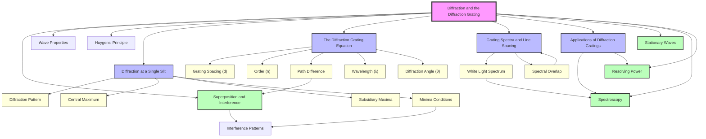

# 1. Overview / 概述

**English:**
Diffraction is the spreading of waves when they pass through an aperture or around an obstacle. This topic focuses specifically on diffraction through a narrow slit and, more importantly, through a diffraction grating — a device consisting of many equally spaced parallel slits. The diffraction grating is a cornerstone of wave optics because it produces sharp, bright interference maxima that allow precise measurement of wavelength. This topic bridges the wave nature of light with practical spectroscopy, enabling scientists to analyse the composition of stars, identify chemical elements, and study atomic structure. In both Cambridge 9702 and Edexcel IAL examinations, diffraction and the diffraction grating are assessed through calculations using the grating equation $d \sin \theta = n \lambda$, interpretation of spectra, and understanding of the conditions for maxima and minima. The topic also reinforces the fundamental principle of [[Superposition and Interference]] — that waves from different slits superpose constructively or destructively depending on their path difference.

**中文：**
衍射是指波在通过狭缝或绕过障碍物时发生的展宽现象。本主题特别关注通过单缝的衍射，以及更为重要的通过衍射光栅（一种由许多等间距平行狭缝组成的器件）的衍射。衍射光栅是波动光学的基石，因为它能产生清晰明亮的干涉极大值，从而精确测量波长。本主题将光的波动性与实用光谱学联系起来，使科学家能够分析恒星的成分、识别化学元素并研究原子结构。在剑桥 9702 和爱德思 IAL 考试中，衍射和衍射光栅通过光栅方程 $d \sin \theta = n \lambda$ 的计算、光谱的解读以及对极大值和极小值条件的理解来评估。本主题还强化了[[叠加与干涉]]的基本原理——来自不同狭缝的波根据其光程差发生相长或相消叠加。

---

# 2. Syllabus Learning Objectives / 考纲学习目标

| CAIE 9702 | Edexcel IAL |
|-----------|-------------|
| 8.3(a) Describe the effect of a single slit on a parallel beam of light | 5.21 Explain the meaning of the term diffraction |
| 8.3(b) Describe the diffraction pattern produced by a single slit | 5.22 Describe the effect of wavelength and gap width on the diffraction pattern produced by a single slit |
| 8.3(c) Describe the diffraction grating and derive the equation $d \sin \theta = n \lambda$ | 5.23 Derive and use the diffraction grating equation $d \sin \theta = n \lambda$ |
| 8.3(d) Use the diffraction grating equation to determine wavelength and grating spacing | 5.24 Explain how a diffraction grating can be used to determine the wavelength of light |
| 8.3(e) Describe the use of a diffraction grating to produce a spectrum | 5.25 Describe the use of a diffraction grating to determine the wavelength of light from a laser or other source |

**Examiner Expectations / 考官期望:**

**English:**
- Candidates must be able to describe the single-slit diffraction pattern in terms of a central maximum and subsidiary maxima of decreasing intensity.
- Candidates must derive the diffraction grating equation $d \sin \theta = n \lambda$ from path difference considerations.
- Candidates must apply the equation to calculate wavelength, grating spacing, or angle of diffraction.
- Candidates must understand that the maximum number of orders is limited by $\sin \theta \leq 1$.
- Candidates must describe how a diffraction grating produces a spectrum and explain why different wavelengths are diffracted through different angles.
- For Edexcel, candidates must also understand the effect of slit width on the diffraction pattern and the concept of resolving power.

**中文：**
- 考生必须能够描述单缝衍射图样，包括中央极大值和强度递减的次级极大值。
- 考生必须能够从光程差的角度推导衍射光栅方程 $d \sin \theta = n \lambda$。
- 考生必须能够应用该方程计算波长、光栅间距或衍射角。
- 考生必须理解最大级数受 $\sin \theta \leq 1$ 的限制。
- 考生必须描述衍射光栅如何产生光谱，并解释为什么不同波长以不同角度衍射。
- 对于爱德思，考生还必须理解狭缝宽度对衍射图样的影响以及分辨本领的概念。

> 📋 **CIE Only:** CIE specifically requires the description of the single-slit diffraction pattern and the derivation of the grating equation from first principles. The concept of resolving power is not explicitly required.
>
> 📋 **Edexcel Only:** Edexcel explicitly requires understanding of resolving power and the effect of slit width on the diffraction pattern. The derivation of the grating equation is also required.

---

# 3. Core Definitions / 核心定义

| Term (EN/CN) | Definition (EN) | Definition (CN) | Common Mistakes / 常见错误 |
|--------------|-----------------|-----------------|---------------------------|
| **Diffraction / 衍射** | The spreading of waves when they pass through an aperture or around an obstacle | 波通过狭缝或绕过障碍物时发生的展宽现象 | Confusing diffraction with refraction; thinking diffraction only occurs for light |
| **Diffraction Grating / 衍射光栅** | A device consisting of many equally spaced parallel slits used to produce interference patterns | 由许多等间距平行狭缝组成的器件，用于产生干涉图样 | Thinking the grating has only a few slits; confusing with a double slit |
| **Grating Spacing ($d$) / 光栅间距** | The distance between adjacent slits on a diffraction grating | 衍射光栅上相邻狭缝之间的距离 | Using $d$ as the number of lines per metre instead of the spacing |
| **Order ($n$) / 级数** | An integer representing the number of wavelengths of path difference between adjacent slits | 表示相邻狭缝之间光程差为波长整数倍的整数 | Forgetting that $n$ can be 0, ±1, ±2, ... and is limited by $\sin \theta \leq 1$ |
| **Path Difference / 光程差** | The difference in distance travelled by waves from adjacent slits to a point on the screen | 从相邻狭缝到达屏幕上某点的波所经过的距离差 | Confusing path difference with phase difference; forgetting that path difference = $d \sin \theta$ |
| **Central Maximum / 中央极大值** | The bright fringe at the centre of the diffraction pattern where all waves arrive in phase ($n=0$) | 衍射图样中心处的亮条纹，所有波同相到达（$n=0$） | Thinking the central maximum is the same as for a single slit |
| **Spectrum / 光谱** | The pattern of diffracted light separated into its component wavelengths | 衍射光被分离成其组成波长的图样 | Confusing with dispersion by a prism |
| **Resolving Power / 分辨本领** | The ability of a diffraction grating to separate two closely spaced wavelengths | 衍射光栅分离两个相近波长的能力 | Thinking resolving power depends only on the number of slits, not on the order |

---

# 4. Key Concepts Explained / 关键概念详解

## 4.1 Single-Slit Diffraction / 单缝衍射

### Explanation / 解释
**English:**
When a parallel beam of light passes through a narrow single slit, it spreads out — this is [[Diffraction at a Single Slit]]. The resulting pattern on a screen consists of a bright central maximum, flanked by alternating dark and bright fringes (subsidiary maxima) of decreasing intensity. The central maximum is twice as wide as the subsidiary maxima. The pattern arises from [[Superposition and Interference]] of Huygens' wavelets from different points across the slit width. The condition for minima (dark fringes) is $a \sin \theta = n \lambda$, where $a$ is the slit width, $n$ is a non-zero integer, and $\theta$ is the angle from the central axis.

**中文：**
当一束平行光通过狭窄的单缝时，它会展宽——这就是[[单缝衍射]]。屏幕上产生的图样由一个明亮的中央极大值组成，两侧是强度递减的明暗交替条纹（次级极大值）。中央极大值的宽度是次级极大值的两倍。该图样源于来自狭缝宽度上不同点的惠更斯子波的[[叠加与干涉]]。极小值（暗条纹）的条件是 $a \sin \theta = n \lambda$，其中 $a$ 是狭缝宽度，$n$ 是非零整数，$\theta$ 是偏离中心轴的角度。

### Physical Meaning / 物理意义
**English:**
The narrower the slit, the more the light spreads out. This explains why you can hear sound around corners (long wavelength, large diffraction) but cannot see around corners (short wavelength, small diffraction). In everyday life, diffraction limits the resolution of optical instruments.

**中文：**
狭缝越窄，光展宽得越多。这解释了为什么你能听到拐角处的声音（波长长，衍射大），但看不到拐角处的东西（波长短，衍射小）。在日常生活中，衍射限制了光学仪器的分辨率。

### Common Misconceptions / 常见误区
- Thinking that diffraction only occurs for light — it occurs for all waves (sound, water, etc.)
- Confusing the single-slit pattern with the double-slit or grating pattern
- Thinking the central maximum is the same width as the subsidiary maxima
- Believing that making the slit narrower always makes the pattern clearer (it actually makes it wider but dimmer)

### Exam Tips / 考试提示
**English:**
CIE typically asks candidates to describe the single-slit diffraction pattern qualitatively. Edexcel may ask about the effect of changing slit width or wavelength. Remember: narrower slit → wider diffraction pattern; longer wavelength → wider diffraction pattern.

**中文：**
CIE 通常要求考生定性描述单缝衍射图样。爱德思可能会问及改变狭缝宽度或波长的影响。记住：狭缝越窄 → 衍射图样越宽；波长越长 → 衍射图样越宽。

> 📷 **IMAGE PROMPT — [DIF-001]: Single-Slit Diffraction Pattern**
>
> A clean, labelled diagram showing a laser beam passing through a narrow single slit and producing a diffraction pattern on a screen. The pattern shows a bright central maximum flanked by alternating dark and bright fringes of decreasing intensity. Labels: "Laser", "Single Slit (width a)", "Screen", "Central Maximum", "Subsidiary Maxima", "Minima". The angle θ is shown from the central axis to the first minimum. Clean white background, educational style, 2D schematic.

---

## 4.2 The Diffraction Grating Principle / 衍射光栅原理

### Explanation / 解释
**English:**
A [[The Diffraction Grating Equation|diffraction grating]] consists of many equally spaced parallel slits. When monochromatic light passes through the grating, each slit acts as a source of Huygens' wavelets. These wavelets [[Superposition and Interference|superpose]] at points on a distant screen. Constructive interference (bright maxima) occurs when the path difference between waves from adjacent slits is an integer multiple of the wavelength: $d \sin \theta = n \lambda$, where $d$ is the grating spacing, $\theta$ is the angle of diffraction, $n$ is the order (0, ±1, ±2, ...), and $\lambda$ is the wavelength. The maxima are very sharp because many slits contribute to the interference.

**中文：**
[[衍射光栅方程|衍射光栅]]由许多等间距平行狭缝组成。当单色光通过光栅时，每个狭缝都充当惠更斯子波的波源。这些子波在远处的屏幕上[[叠加与干涉|叠加]]。当相邻狭缝发出的波之间的光程差为波长的整数倍时，发生相长干涉（亮极大值）：$d \sin \theta = n \lambda$，其中 $d$ 是光栅间距，$\theta$ 是衍射角，$n$ 是级数（0, ±1, ±2, ...），$\lambda$ 是波长。由于许多狭缝共同参与干涉，极大值非常尖锐。

### Physical Meaning / 物理意义
**English:**
The diffraction grating acts like a "ruler for light" — it allows precise measurement of wavelength. By measuring the angle at which a bright maximum appears, we can calculate the wavelength of the light. This is how scientists determine the composition of stars by analysing their spectra.

**中文：**
衍射光栅就像一把"光的尺子"——它可以精确测量波长。通过测量亮极大值出现的角度，我们可以计算光的波长。科学家正是通过分析恒星的光谱来确定其成分。

### Common Misconceptions / 常见误区
- Thinking that the grating equation gives the position of all maxima (it only gives the principal maxima)
- Confusing $d$ (grating spacing) with the number of lines per metre
- Forgetting that $\theta$ is measured from the normal to the grating, not from the grating surface
- Thinking that $n$ can be any integer without limit (it is limited by $\sin \theta \leq 1$)

### Exam Tips / 考试提示
**English:**
Both CIE and Edexcel require the derivation of $d \sin \theta = n \lambda$ from path difference. Always show the right-angled triangle with adjacent slits. Remember to convert between lines per metre and grating spacing: $d = \frac{1}{N}$ where $N$ is the number of lines per metre.

**中文：**
CIE 和爱德思都要求从光程差推导 $d \sin \theta = n \lambda$。始终画出相邻狭缝的直角三角形。记住在每米线数和光栅间距之间转换：$d = \frac{1}{N}$，其中 $N$ 是每米的线数。

---

## 4.3 Grating Spectra / 光栅光谱

### Explanation / 解释
**English:**
When white light passes through a [[The Diffraction Grating Equation|diffraction grating]], each wavelength is diffracted through a different angle because $\theta$ depends on $\lambda$ (from $d \sin \theta = n \lambda$). This produces a [[Grating Spectra and Line Spacing|spectrum]] — a continuous band of colours from violet (shortest wavelength, smallest angle) to red (longest wavelength, largest angle). For a given order $n$, the spectrum is spread out. Higher orders produce wider spectra but may overlap. The zero order ($n=0$) is white because all wavelengths are undeviated.

**中文：**
当白光通过[[衍射光栅方程|衍射光栅]]时，每个波长以不同角度衍射，因为 $\theta$ 取决于 $\lambda$（由 $d \sin \theta = n \lambda$ 得出）。这产生[[光栅光谱与线间距|光谱]]——从紫色（波长最短，角度最小）到红色（波长最长，角度最大）的连续色带。对于给定的级数 $n$，光谱被展开。更高级数产生更宽的光谱，但可能重叠。零级（$n=0$）是白色的，因为所有波长都不偏转。

### Physical Meaning / 物理意义
**English:**
This is the principle behind spectroscopy — analysing the chemical composition of substances by their emission or absorption spectra. Each element has a unique spectral "fingerprint". Diffraction gratings are used in spectrometers to separate and identify these spectral lines.

**中文：**
这是光谱学背后的原理——通过物质的发射或吸收光谱分析其化学成分。每种元素都有独特的光谱"指纹"。衍射光栅用于光谱仪中，以分离和识别这些谱线。

### Common Misconceptions / 常见误区
- Thinking that the spectrum from a grating is the same as from a prism (prism disperses by refraction, grating by diffraction)
- Confusing the order of colours (violet is closer to the centre, red is further)
- Thinking that higher orders always give clearer spectra (they may overlap)

### Exam Tips / 考试提示
**English:**
CIE and Edexcel both ask about the production of spectra. Be able to explain why different wavelengths are diffracted through different angles. Also understand that overlapping occurs when the red of order $n$ overlaps with the violet of order $n+1$.

**中文：**
CIE 和爱德思都会问及光谱的产生。要能够解释为什么不同波长以不同角度衍射。还要理解当 $n$ 级的红色与 $n+1$ 级的紫色重叠时会发生重叠。

> 📷 **IMAGE PROMPT — [DIF-002]: Diffraction Grating Spectrum**
>
> A diagram showing white light incident on a diffraction grating. The zero order (n=0) is white and undeviated. The first order (n=1) shows a spectrum from violet to red. The second order (n=2) shows a wider spectrum. Labels: "White Light", "Diffraction Grating", "n=0 (White)", "n=1 Spectrum", "n=2 Spectrum", "Violet", "Red". Clean schematic, educational style, 2D.

---

## 4.4 Resolving Power / 分辨本领

### Explanation / 解释
**English:**
The resolving power of a [[The Diffraction Grating Equation|diffraction grating]] is its ability to separate two closely spaced wavelengths. It depends on the number of slits $N$ and the order $n$: resolving power $R = nN$. A grating with more slits and used at higher orders can resolve finer spectral details. This is why astronomical spectrographs use large gratings with many lines.

**中文：**
[[衍射光栅方程|衍射光栅]]的分辨本领是它分离两个相近波长的能力。它取决于狭缝数量 $N$ 和级数 $n$：分辨本领 $R = nN$。具有更多狭缝并在更高级数下使用的光栅可以分辨更精细的光谱细节。这就是为什么天文光谱仪使用具有许多线的大光栅。

### Physical Meaning / 物理意义
**English:**
If two spectral lines are very close in wavelength, a low-resolution grating will show them as a single blurred line. A high-resolution grating will show them as two distinct lines. This is crucial for identifying elements in stars or chemical samples.

**中文：**
如果两条谱线的波长非常接近，低分辨率光栅会将它们显示为一条模糊的线。高分辨率光栅会将它们显示为两条清晰的线。这对于识别恒星或化学样品中的元素至关重要。

### Common Misconceptions / 常见误区
- Thinking resolving power depends only on grating spacing (it also depends on the number of slits and order)
- Confusing resolving power with dispersion (how spread out the spectrum is)

### Exam Tips / 考试提示
**English:**
Edexcel explicitly requires understanding of resolving power. CIE does not explicitly require it, but it may appear in context. Remember: more lines → higher resolving power; higher order → higher resolving power.

**中文：**
爱德思明确要求理解分辨本领。CIE 没有明确要求，但可能在上下文中出现。记住：更多线 → 更高分辨本领；更高级数 → 更高分辨本领。

> 📋 **Edexcel Only:** Resolving power is explicitly in the Edexcel syllabus. Candidates should be able to explain that a grating with more lines per metre has a higher resolving power.

---

# 5. Essential Equations / 核心公式

## 5.1 Single-Slit Diffraction Minima / 单缝衍射极小值

**Equation / 公式:**
$$ a \sin \theta = n \lambda $$

**Variables / 变量:**
| Symbol (符号) | Meaning (EN) | Meaning (CN) | Unit (单位) |
|--------------|-------------|-------------|------------|
| $a$ | Slit width | 狭缝宽度 | m |
| $\theta$ | Angle from central axis to minimum | 从中心轴到极小值的角度 | ° or rad |
| $n$ | Order of minimum (non-zero integer) | 极小值级数（非零整数） | — |
| $\lambda$ | Wavelength | 波长 | m |

**Derivation / 推导:**
**English:**
Consider a single slit of width $a$. Divide the slit into two halves. For the first minimum, the path difference between a wavelet from the top of the slit and one from the centre is $\frac{a}{2} \sin \theta$. For destructive interference, this must equal $\frac{\lambda}{2}$. Therefore $\frac{a}{2} \sin \theta = \frac{\lambda}{2}$, giving $a \sin \theta = \lambda$. For the $n$th minimum, $a \sin \theta = n \lambda$.

**中文：**
考虑宽度为 $a$ 的单缝。将狭缝分成两半。对于第一个极小值，来自狭缝顶部的子波与来自中心的子波之间的光程差为 $\frac{a}{2} \sin \theta$。对于相消干涉，这必须等于 $\frac{\lambda}{2}$。因此 $\frac{a}{2} \sin \theta = \frac{\lambda}{2}$，得出 $a \sin \theta = \lambda$。对于第 $n$ 个极小值，$a \sin \theta = n \lambda$。

**Conditions / 适用条件:**
**English:** For a narrow single slit with width comparable to the wavelength. The slit must be much narrower than its length.

**中文：** 适用于宽度与波长相当的窄单缝。狭缝必须远窄于其长度。

**Limitations / 局限性:**
**English:** Does not apply to very wide slits (where diffraction is negligible) or to slits that are not rectangular.

**中文：** 不适用于非常宽的狭缝（衍射可忽略）或非矩形狭缝。

**Rearrangements / 变形:**
$$ \lambda = \frac{a \sin \theta}{n}, \quad a = \frac{n \lambda}{\sin \theta}, \quad \theta = \sin^{-1}\left(\frac{n \lambda}{a}\right) $$

---

## 5.2 Diffraction Grating Equation / 衍射光栅方程

**Equation / 公式:**
$$ d \sin \theta = n \lambda $$

**Variables / 变量:**
| Symbol (符号) | Meaning (EN) | Meaning (CN) | Unit (单位) |
|--------------|-------------|-------------|------------|
| $d$ | Grating spacing (distance between adjacent slits) | 光栅间距（相邻狭缝之间的距离） | m |
| $\theta$ | Angle of diffraction from the normal | 从法线测量的衍射角 | ° or rad |
| $n$ | Order (0, ±1, ±2, ...) | 级数（0, ±1, ±2, ...） | — |
| $\lambda$ | Wavelength | 波长 | m |

**Derivation / 推导:**
**English:**
Consider two adjacent slits separated by distance $d$. Waves from these slits travel to a point on a distant screen at angle $\theta$ to the normal. The extra distance travelled by the wave from the farther slit is $d \sin \theta$ (from the right-angled triangle). For constructive interference, this path difference must be an integer multiple of the wavelength: $d \sin \theta = n \lambda$, where $n = 0, 1, 2, ...$

**中文：**
考虑两个相距 $d$ 的相邻狭缝。来自这些狭缝的波以与法线成 $\theta$ 角传播到远处屏幕上的某点。来自较远狭缝的波多走的距离为 $d \sin \theta$（来自直角三角形）。对于相长干涉，此光程差必须是波长的整数倍：$d \sin \theta = n \lambda$，其中 $n = 0, 1, 2, ...$

**Conditions / 适用条件:**
**English:**
- The slits must be equally spaced.
- The screen must be far away (Fraunhofer diffraction).
- The light must be monochromatic (or nearly so) for sharp maxima.
- The grating spacing $d$ must be comparable to the wavelength.

**中文：**
- 狭缝必须等间距。
- 屏幕必须很远（夫琅禾费衍射）。
- 光必须是单色的（或接近单色）以获得尖锐的极大值。
- 光栅间距 $d$ 必须与波长相当。

**Limitations / 局限性:**
**English:**
- Does not account for the finite width of each slit (which modulates the intensity).
- Assumes normal incidence (if light is incident at an angle, the equation becomes $d(\sin \theta_i + \sin \theta_d) = n \lambda$).
- The maximum order is limited by $\sin \theta \leq 1$, so $n_{\text{max}} = \lfloor d / \lambda \rfloor$.

**中文：**
- 不考虑每个狭缝的有限宽度（这会调制强度）。
- 假设垂直入射（如果光以一定角度入射，方程变为 $d(\sin \theta_i + \sin \theta_d) = n \lambda$）。
- 最大级数受 $\sin \theta \leq 1$ 限制，因此 $n_{\text{max}} = \lfloor d / \lambda \rfloor$。

**Rearrangements / 变形:**
$$ \lambda = \frac{d \sin \theta}{n}, \quad d = \frac{n \lambda}{\sin \theta}, \quad \theta = \sin^{-1}\left(\frac{n \lambda}{d}\right), \quad n = \frac{d \sin \theta}{\lambda} $$

**Relationship to Lines per Metre / 与每米线数的关系:**
$$ d = \frac{1}{N} $$
where $N$ is the number of lines per metre.

---

## 5.3 Maximum Order / 最大级数

**Equation / 公式:**
$$ n_{\text{max}} = \left\lfloor \frac{d}{\lambda} \right\rfloor $$

**Variables / 变量:**
| Symbol (符号) | Meaning (EN) | Meaning (CN) | Unit (单位) |
|--------------|-------------|-------------|------------|
| $n_{\text{max}}$ | Maximum observable order | 可观察到的最大级数 | — |
| $d$ | Grating spacing | 光栅间距 | m |
| $\lambda$ | Wavelength | 波长 | m |

**Derivation / 推导:**
**English:**
From $d \sin \theta = n \lambda$, the maximum value of $\sin \theta$ is 1 (when $\theta = 90^\circ$). Therefore $d \times 1 = n_{\text{max}} \lambda$, giving $n_{\text{max}} = d / \lambda$. Since $n$ must be an integer, we take the floor of this value.

**中文：**
由 $d \sin \theta = n \lambda$，$\sin \theta$ 的最大值为 1（当 $\theta = 90^\circ$ 时）。因此 $d \times 1 = n_{\text{max}} \lambda$，得出 $n_{\text{max}} = d / \lambda$。由于 $n$ 必须是整数，我们取此值的整数部分。

**Conditions / 适用条件:**
**English:** Assumes the screen is at infinity or very far away.

**中文：** 假设屏幕在无穷远处或非常远。

**Limitations / 局限性:**
**English:** In practice, the highest orders may be too dim to observe due to the single-slit diffraction envelope.

**中文：** 实际上，由于单缝衍射包络，最高级数可能太暗而无法观察到。

---

## 5.4 Angular Separation of Orders / 级数的角间距

**Equation / 公式:**
$$ \Delta \theta \approx \frac{\lambda}{d \cos \theta} $$

**Variables / 变量:**
| Symbol (符号) | Meaning (EN) | Meaning (CN) | Unit (单位) |
|--------------|-------------|-------------|------------|
| $\Delta \theta$ | Angular separation between adjacent orders | 相邻级数之间的角间距 | rad |
| $\lambda$ | Wavelength | 波长 | m |
| $d$ | Grating spacing | 光栅间距 | m |
| $\theta$ | Diffraction angle | 衍射角 | rad |

**Derivation / 推导:**
**English:**
Differentiate $d \sin \theta = n \lambda$ with respect to $n$: $d \cos \theta \frac{d\theta}{dn} = \lambda$, so $\frac{d\theta}{dn} = \frac{\lambda}{d \cos \theta}$. For small changes, $\Delta \theta \approx \frac{\lambda}{d \cos \theta}$.

**中文：**
对 $d \sin \theta = n \lambda$ 关于 $n$ 求导：$d \cos \theta \frac{d\theta}{dn} = \lambda$，所以 $\frac{d\theta}{dn} = \frac{\lambda}{d \cos \theta}$。对于小变化，$\Delta \theta \approx \frac{\lambda}{d \cos \theta}$。

**Conditions / 适用条件:**
**English:** Valid for small angular separations.

**中文：** 适用于小角间距。

---

# 6. Graphs and Relationships / 图表与关系

## 6.1 Intensity vs Angle for Single Slit / 单缝强度与角度关系

### Axes / 坐标轴
**English:** X-axis: Angle $\theta$ (from central axis); Y-axis: Intensity $I$
**中文：** X轴：角度 $\theta$（从中心轴）；Y轴：强度 $I$

### Shape / 形状
**English:** A central maximum (brightest and widest) with subsidiary maxima on either side. The intensity of subsidiary maxima decreases rapidly. Minima occur at $a \sin \theta = n \lambda$.
**中文：** 中央极大值（最亮最宽），两侧有次级极大值。次级极大值的强度迅速下降。极小值出现在 $a \sin \theta = n \lambda$。

### Gradient Meaning / 斜率含义
**English:** The gradient shows the rate of change of intensity with angle. It is zero at maxima and minima.
**中文：** 斜率表示强度随角度的变化率。在极大值和极小值处为零。

### Area Meaning / 面积含义
**English:** The area under the curve represents the total power transmitted through the slit.
**中文：** 曲线下的面积表示通过狭缝的总功率。

### Exam Interpretation / 考试解读
**English:** Candidates should be able to sketch this graph and label the central maximum, subsidiary maxima, and minima. They should also explain how the pattern changes with slit width and wavelength.
**中文：** 考生应能画出此图并标注中央极大值、次级极大值和极小值。还应解释图样如何随狭缝宽度和波长变化。

### Common Questions / 常见问题
**English:** "Sketch the intensity distribution for a single slit diffraction pattern." "Explain what happens to the pattern when the slit width is halved."
**中文：** "画出单缝衍射图样的强度分布。" "解释当狭缝宽度减半时图样如何变化。"

> 📷 **IMAGE PROMPT — [DIF-003]: Single-Slit Intensity Graph**
>
> A graph showing intensity I on the y-axis against angle θ on the x-axis. The central maximum is tall and wide. Subsidiary maxima are shorter and narrower, decreasing in height. Minima are at regular intervals. Labels: "Central Maximum", "Subsidiary Maxima", "Minima (a sin θ = nλ)". Clean white background, educational style.

---

## 6.2 Intensity vs Angle for Diffraction Grating / 光栅强度与角度关系

### Axes / 坐标轴
**English:** X-axis: Angle $\theta$ (from normal); Y-axis: Intensity $I$
**中文：** X轴：角度 $\theta$（从法线）；Y轴：强度 $I$

### Shape / 形状
**English:** Sharp, narrow peaks (principal maxima) at angles satisfying $d \sin \theta = n \lambda$. Between principal maxima, there are many very weak secondary maxima (N-2 for N slits). The overall envelope is modulated by the single-slit diffraction pattern.
**中文：** 在满足 $d \sin \theta = n \lambda$ 的角度处出现尖锐狭窄的峰（主极大值）。在主极大值之间，有许多非常弱的次级极大值（对于 N 个狭缝有 N-2 个）。整体包络受单缝衍射图样调制。

### Gradient Meaning / 斜率含义
**English:** The gradient is very steep at the sides of the principal maxima, indicating sharp peaks.
**中文：** 在主极大值两侧梯度非常陡，表明峰很尖锐。

### Area Meaning / 面积含义
**English:** The area under each peak represents the power in that order.
**中文：** 每个峰下的面积表示该级数的功率。

### Exam Interpretation / 考试解读
**English:** Candidates should be able to compare this graph with the single-slit graph. The key difference is that the grating produces much sharper and brighter maxima. Increasing the number of slits makes the peaks sharper.
**中文：** 考生应能将此图与单缝图进行比较。关键区别在于光栅产生更尖锐、更亮的极大值。增加狭缝数量使峰更尖锐。

### Common Questions / 常见问题
**English:** "Sketch the intensity distribution for a diffraction grating with 5 slits." "Explain why the maxima are sharper for a grating with more slits."
**中文：** "画出具有 5 个狭缝的衍射光栅的强度分布。" "解释为什么具有更多狭缝的光栅的极大值更尖锐。"

> 📷 **IMAGE PROMPT — [DIF-004]: Diffraction Grating Intensity Graph**
>
> A graph showing intensity I on the y-axis against angle θ on the x-axis. Sharp, narrow peaks at regular intervals. The peaks are labelled "n=0", "n=1", "n=2", etc. The overall envelope is a single-slit diffraction pattern (dashed curve). Labels: "Principal Maxima", "Single-Slit Envelope". Clean white background, educational style.

---

## 6.3 sin θ vs Order n / sin θ 与级数 n 的关系

### Axes / 坐标轴
**English:** X-axis: Order $n$; Y-axis: $\sin \theta$
**中文：** X轴：级数 $n$；Y轴：$\sin \theta$

### Shape / 形状
**English:** A straight line through the origin with gradient $\lambda / d$.
**中文：** 一条通过原点的直线，斜率为 $\lambda / d$。

### Gradient Meaning / 斜率含义
**English:** The gradient is $\lambda / d$. This allows experimental determination of wavelength from a graph of $\sin \theta$ against $n$.
**中文：** 斜率为 $\lambda / d$。这允许通过 $\sin \theta$ 对 $n$ 的图实验确定波长。

### Area Meaning / 面积含义
**English:** Not applicable.
**中文：** 不适用。

### Exam Interpretation / 考试解读
**English:** This is a common experimental analysis graph. Candidates should be able to plot data, draw a line of best fit, and calculate the gradient to find $\lambda$.
**中文：** 这是一个常见的实验分析图。考生应能绘制数据、画出最佳拟合线并计算斜率以求出 $\lambda$。

### Common Questions / 常见问题
**English:** "Plot a graph of sin θ against n and use it to determine the wavelength of the light."
**中文：** "画出 sin θ 对 n 的图，并用它来确定光的波长。"

---

# 7. Required Diagrams / 必备图表

## 7.1 Geometry of the Diffraction Grating / 衍射光栅的几何结构

### Description / 描述
**English:**
A diagram showing two adjacent slits of a diffraction grating separated by distance $d$. Parallel rays of monochromatic light are incident normally on the grating. The rays emerge at angle $\theta$ to the normal and travel to a distant screen. A right-angled triangle shows the path difference $d \sin \theta$ between the two rays.

**中文：**
显示衍射光栅两个相邻狭缝的图，间距为 $d$。单色平行光垂直入射到光栅上。光线以与法线成 $\theta$ 角出射并传播到远处的屏幕。一个直角三角形显示两条光线之间的光程差 $d \sin \theta$。

### Image Prompt / 图片生成提示
> 📷 **IMAGE PROMPT — [DIF-005]: Diffraction Grating Geometry**
>
> A clean 2D schematic diagram showing two adjacent slits (vertical lines) of a diffraction grating, separated by distance d. Parallel horizontal rays (arrows) are incident from the left, normal to the grating. After passing through the slits, the rays emerge at angle θ to the normal. A right-angled triangle is drawn with the hypotenuse along the ray from the upper slit, the adjacent side along the grating, and the opposite side labelled "d sin θ". Labels: "Incident Light", "Slits", "d", "θ", "d sin θ", "To Screen". Clean white background, educational style, 2D schematic.

### Labels Required / 需要标注
- Incident light / 入射光
- Slits / 狭缝
- $d$ (grating spacing) / 光栅间距
- $\theta$ (diffraction angle) / 衍射角
- $d \sin \theta$ (path difference) / 光程差
- Normal / 法线
- To screen / 到屏幕

### Exam Importance / 考试重要性
**English:**
This diagram is essential for deriving the diffraction grating equation. Both CIE and Edexcel require candidates to derive $d \sin \theta = n \lambda$ from this geometry.

**中文：**
此图对于推导衍射光栅方程至关重要。CIE 和爱德思都要求考生从该几何结构推导 $d \sin \theta = n \lambda$。

---

## 7.2 Experimental Setup for Measuring Wavelength / 测量波长的实验装置

### Description / 描述
**English:**
A diagram showing a laser (or other monochromatic light source) directed at a diffraction grating. The grating is mounted on a stand. A screen is placed behind the grating. The diffraction pattern shows bright spots (maxima) at angles $\theta_n$. A metre ruler or protractor is used to measure the distance from the grating to the screen and the separation of the spots.

**中文：**
显示激光（或其他单色光源）指向衍射光栅的图。光栅安装在支架上。屏幕放置在光栅后面。衍射图样在角度 $\theta_n$ 处显示亮点（极大值）。使用米尺或量角器测量从光栅到屏幕的距离以及光点的间距。

### Image Prompt / 图片生成提示
> 📷 **IMAGE PROMPT — [DIF-006]: Experimental Setup for Wavelength Measurement**
>
> A 3D isometric diagram showing a laser on the left, emitting a red beam towards a diffraction grating mounted on a stand in the centre. A white screen is on the right. On the screen, bright red spots are shown at the centre (n=0) and on either side (n=1, n=2). A metre ruler is shown measuring the distance from the grating to the screen. Labels: "Laser", "Diffraction Grating", "Screen", "n=0", "n=1", "n=2", "Distance D", "Spot Separation x". Clean white background, educational style, 3D isometric.

### Labels Required / 需要标注
- Laser / 激光
- Diffraction grating / 衍射光栅
- Screen / 屏幕
- $n=0, n=1, n=2$ (orders) / 级数
- $D$ (distance from grating to screen) / 光栅到屏幕的距离
- $x$ (separation of spots) / 光点间距
- $\theta$ (diffraction angle) / 衍射角

### Exam Importance / 考试重要性
**English:**
This diagram is used in practical questions. Candidates must know how to set up the experiment and calculate $\lambda$ from measurements of $D$ and $x$ using $\tan \theta \approx x/D$ for small angles.

**中文：**
此图用于实验题。考生必须知道如何设置实验，并使用 $\tan \theta \approx x/D$（小角度）从 $D$ 和 $x$ 的测量值计算 $\lambda$。

---

## 7.3 White Light Spectrum from a Diffraction Grating / 衍射光栅产生的白光光谱

### Description / 描述
**English:**
A diagram showing white light incident on a diffraction grating. The zero order ($n=0$) is white and undeviated. The first order ($n=1$) shows a continuous spectrum from violet (closest to centre) to red (farthest from centre). The second order ($n=2$) shows a wider spectrum, possibly overlapping with the first order.

**中文：**
显示白光入射到衍射光栅上的图。零级（$n=0$）是白色的且不偏转。一级（$n=1$）显示从紫色（最靠近中心）到红色（离中心最远）的连续光谱。二级（$n=2$）显示更宽的光谱，可能与一级重叠。

### Image Prompt / 图片生成提示
> 📷 **IMAGE PROMPT — [DIF-007]: White Light Spectrum from Grating**
>
> A 2D schematic diagram showing white light (represented by a multicoloured arrow) incident on a diffraction grating from the left. On the right, the zero order is a white spot. The first order shows a rainbow spectrum: violet, blue, green, yellow, orange, red. The second order shows a wider rainbow spectrum. Labels: "White Light", "Diffraction Grating", "n=0 (White)", "n=1", "n=2", "Violet", "Red". Clean white background, educational style, 2D schematic.

### Labels Required / 需要标注
- White light / 白光
- Diffraction grating / 衍射光栅
- $n=0$ (white) / 零级（白色）
- $n=1$ (first-order spectrum) / 一级光谱
- $n=2$ (second-order spectrum) / 二级光谱
- Violet / 紫色
- Red / 红色

### Exam Importance / 考试重要性
**English:**
This diagram tests understanding of how a diffraction grating produces a spectrum. Candidates should be able to explain why different wavelengths are diffracted through different angles and why higher orders produce wider spectra.

**中文：**
此图测试对衍射光栅如何产生光谱的理解。考生应能解释为什么不同波长以不同角度衍射，以及为什么更高级数产生更宽的光谱。

---

# 8. Worked Examples / 典型例题

## Example 1: Calculating Wavelength from a Diffraction Grating / 从衍射光栅计算波长

### Question / 题目
**English:**
A diffraction grating has 500 lines per millimetre. When monochromatic light is incident normally on the grating, the first-order maximum is observed at an angle of $14.5^\circ$ to the normal. Calculate the wavelength of the light.

**中文：**
一个衍射光栅每毫米有 500 条线。当单色光垂直入射到光栅上时，一级极大值在与法线成 $14.5^\circ$ 的角度处观察到。计算光的波长。

### Solution / 解答

**Step 1: Calculate the grating spacing $d$**

$$ d = \frac{1}{N} = \frac{1}{500 \text{ lines/mm}} = \frac{1}{500 \times 10^3 \text{ lines/m}} = 2.0 \times 10^{-6} \text{ m} $$

**Step 2: Apply the diffraction grating equation**

$$ d \sin \theta = n \lambda $$

For the first order, $n = 1$:

$$ \lambda = \frac{d \sin \theta}{n} = \frac{(2.0 \times 10^{-6}) \times \sin(14.5^\circ)}{1} $$

**Step 3: Calculate**

$$ \sin(14.5^\circ) = 0.2504 $$

$$ \lambda = 2.0 \times 10^{-6} \times 0.2504 = 5.01 \times 10^{-7} \text{ m} $$

$$ \lambda = 501 \text{ nm} $$

### Final Answer / 最终答案
**Answer:** $\lambda = 501 \text{ nm}$ | **答案：** $\lambda = 501 \text{ nm}$

### Examiner Notes / 考官点评
**English:**
- Always convert lines per mm to lines per m before calculating $d$.
- Ensure your calculator is in degree mode.
- The answer should be given in nanometres (nm) or metres with appropriate prefix.
- Common mistake: using $d$ as the number of lines per metre instead of the spacing.

**中文：**
- 在计算 $d$ 之前，始终将每毫米线数转换为每米线数。
- 确保计算器处于角度模式。
- 答案应以纳米（nm）或带适当前缀的米给出。
- 常见错误：将 $d$ 用作每米线数而不是间距。

### Alternative Method / 替代方法
**English:**
If the angle is small, $\sin \theta \approx \tan \theta \approx \theta$ (in radians). However, $14.5^\circ$ is not small enough for this approximation to be accurate.

**中文：**
如果角度很小，$\sin \theta \approx \tan \theta \approx \theta$（以弧度为单位）。然而，$14.5^\circ$ 不够小，此近似不够准确。

---

## Example 2: Maximum Number of Orders / 最大级数

### Question / 题目
**English:**
A diffraction grating has 300 lines per millimetre. Light of wavelength 650 nm is incident normally on the grating. Calculate the maximum order that can be observed.

**中文：**
一个衍射光栅每毫米有 300 条线。波长为 650 nm 的光垂直入射到光栅上。计算可以观察到的最大级数。

### Solution / 解答

**Step 1: Calculate the grating spacing $d$**

$$ d = \frac{1}{300 \times 10^3} = 3.33 \times 10^{-6} \text{ m} $$

**Step 2: Convert wavelength to metres**

$$ \lambda = 650 \text{ nm} = 650 \times 10^{-9} \text{ m} = 6.50 \times 10^{-7} \text{ m} $$

**Step 3: Use the condition for maximum order**

The maximum value of $\sin \theta$ is 1, so:

$$ d \times 1 = n_{\text{max}} \lambda $$

$$ n_{\text{max}} = \frac{d}{\lambda} = \frac{3.33 \times 10^{-6}}{6.50 \times 10^{-7}} = 5.12 $$

**Step 4: Take the floor (integer part)**

Since $n$ must be an integer and $\sin \theta$ cannot exceed 1:

$$ n_{\text{max}} = 5 $$

### Final Answer / 最终答案
**Answer:** The maximum order is 5. | **答案：** 最大级数为 5。

### Examiner Notes / 考官点评
**English:**
- Remember that $n$ must be an integer.
- If the calculation gives $n = 5.12$, the maximum integer order is 5 (not 6, because $\sin \theta$ would exceed 1 for $n=6$).
- Common mistake: rounding up instead of taking the floor.

**中文：**
- 记住 $n$ 必须是整数。
- 如果计算得出 $n = 5.12$，则最大整数级数为 5（不是 6，因为对于 $n=6$，$\sin \theta$ 会超过 1）。
- 常见错误：四舍五入而不是取整数部分。

### Alternative Method / 替代方法
**English:**
You can also check: for $n=5$, $\sin \theta = \frac{5 \times 6.50 \times 10^{-7}}{3.33 \times 10^{-6}} = 0.976$, which is valid. For $n=6$, $\sin \theta = 1.17$, which is impossible.

**中文：**
你也可以检查：对于 $n=5$，$\sin \theta = \frac{5 \times 6.50 \times 10^{-7}}{3.33 \times 10^{-6}} = 0.976$，这是有效的。对于 $n=6$，$\sin \theta = 1.17$，这是不可能的。

---

## Example 3: Overlapping Spectra / 光谱重叠

### Question / 题目
**English:**
White light (wavelength range 400 nm to 700 nm) is incident on a diffraction grating with 600 lines per millimetre. Determine whether the second-order spectrum overlaps with the third-order spectrum.

**中文：**
白光（波长范围 400 nm 至 700 nm）入射到每毫米 600 条线的衍射光栅上。确定二级光谱是否与三级光谱重叠。

### Solution / 解答

**Step 1: Calculate the grating spacing**

$$ d = \frac{1}{600 \times 10^3} = 1.67 \times 10^{-6} \text{ m} $$

**Step 2: Find the angle for the red end of the second-order spectrum ($n=2$, $\lambda = 700 \text{ nm}$)**

$$ \sin \theta_{2,\text{red}} = \frac{2 \times 700 \times 10^{-9}}{1.67 \times 10^{-6}} = 0.838 $$

$$ \theta_{2,\text{red}} = \sin^{-1}(0.838) = 57.0^\circ $$

**Step 3: Find the angle for the violet end of the third-order spectrum ($n=3$, $\lambda = 400 \text{ nm}$)**

$$ \sin \theta_{3,\text{violet}} = \frac{3 \times 400 \times 10^{-9}}{1.67 \times 10^{-6}} = 0.719 $$

$$ \theta_{3,\text{violet}} = \sin^{-1}(0.719) = 46.0^\circ $$

**Step 4: Compare the angles**

The third-order violet ($46.0^\circ$) appears at a smaller angle than the second-order red ($57.0^\circ$). Therefore, the spectra overlap.

### Final Answer / 最终答案
**Answer:** Yes, the second-order and third-order spectra overlap. | **答案：** 是的，二级光谱和三级光谱重叠。

### Examiner Notes / 考官点评
**English:**
- Overlap occurs when the red end of a lower order appears at a larger angle than the violet end of the next higher order.
- In general, overlap occurs when $n \lambda_{\text{max}} > (n+1) \lambda_{\text{min}}$.
- Common mistake: comparing the wrong ends of the spectra.

**中文：**
- 当较低级数的红色端出现在较高级数的紫色端更大的角度时，发生重叠。
- 一般来说，当 $n \lambda_{\text{max}} > (n+1) \lambda_{\text{min}}$ 时发生重叠。
- 常见错误：比较光谱的错误端。

---

# 9. Past Paper Question Types / 历年真题题型

| Question Type / 题型 | Frequency / 频率 | Difficulty / 难度 | Past Paper References / 真题索引 |
|----------------------|------------------|------------------|-------------------------------|
| Calculation of wavelength or grating spacing / 计算波长或光栅间距 | High | Medium | 📝 *待填入* |
| Derivation of $d \sin \theta = n \lambda$ / 推导 $d \sin \theta = n \lambda$ | Medium | Medium | 📝 *待填入* |
| Maximum order calculation / 最大级数计算 | High | Low-Medium | 📝 *待填入* |
| Description of single-slit diffraction pattern / 描述单缝衍射图样 | Medium | Low | 📝 *待填入* |
| Explanation of spectrum production / 解释光谱产生 | Medium | Medium | 📝 *待填入* |
| Overlap of spectra / 光谱重叠 | Low | High | 📝 *待填入* |
| Experimental design / 实验设计 | Medium | Medium-High | 📝 *待填入* |
| Graph analysis ($\sin \theta$ vs $n$) / 图表分析（$\sin \theta$ 对 $n$） | Low | Medium | 📝 *待填入* |
| Resolving power (Edexcel only) / 分辨本领（仅爱德思） | Low | High | 📝 *待填入* |

> 📝 **题库整理中 / Question Bank Under Construction:** 具体试卷编号（如 9702/23/M/J/24 Q3）将在后续整理真题后填入上表。

**Common Command Words / 常见指令词:**

| Command Word (EN) | Command Word (CN) | What to Do |
|-------------------|-------------------|------------|
| State | 陈述 | Give a brief answer without explanation |
| Define | 定义 | Give the precise meaning |
| Explain | 解释 | Give reasons or causes |
| Describe | 描述 | Give a detailed account |
| Calculate | 计算 | Use mathematics to find a numerical answer |
| Determine | 确定 | Find a value using given data or a graph |
| Derive | 推导 | Show the steps from a starting point to a result |
| Suggest | 建议 | Apply knowledge to a new situation |
| Sketch | 画出 | Draw a graph or diagram showing key features |

---

# 10. Practical Skills Connections / 实验技能链接

**English:**
This topic has strong practical connections in both CAIE and Edexcel specifications.

**CAIE Paper 3 (AS) / Paper 5 (A2):**
- Paper 3 may include an experiment to determine the wavelength of light using a diffraction grating.
- Candidates must measure the distance from the grating to the screen ($D$) and the separation of maxima ($x$).
- They must calculate $\theta$ using $\tan \theta = x/D$ and then use $d \sin \theta = n \lambda$ to find $\lambda$.
- Uncertainties in $D$ and $x$ must be propagated to find the uncertainty in $\lambda$.
- A graph of $\sin \theta$ against $n$ can be plotted to find $\lambda$ from the gradient.

**Edexcel Unit 3 (AS) / Unit 6 (A2):**
- Unit 3 includes a core practical on using a diffraction grating to determine the wavelength of light from a laser.
- Candidates must set up the apparatus, take measurements, and analyse data.
- They must consider sources of error and suggest improvements.
- The use of a spectrometer with a diffraction grating is also a common practical.

**Measurements / 测量:**
- Distance from grating to screen ($D$) — measured with a metre ruler
- Separation of maxima ($x$) — measured with a ruler or vernier callipers
- Angle ($\theta$) — measured with a protractor or calculated from $\tan \theta = x/D$

**Uncertainties / 不确定度:**
- Uncertainty in $D$: typically ±1 mm for a metre ruler
- Uncertainty in $x$: typically ±0.5 mm for a ruler
- Percentage uncertainty in $\lambda$: $\frac{\Delta \lambda}{\lambda} = \frac{\Delta d}{d} + \frac{\Delta \sin \theta}{\sin \theta}$
- For small angles, $\sin \theta \approx \tan \theta$, so $\frac{\Delta \lambda}{\lambda} \approx \frac{\Delta d}{d} + \frac{\Delta x}{x} + \frac{\Delta D}{D}$

**Graph Plotting / 图表绘制:**
- Plot $\sin \theta$ on the y-axis against $n$ on the x-axis
- Draw a line of best fit through the origin
- Gradient $= \lambda / d$, so $\lambda = \text{gradient} \times d$
- Uncertainty in gradient gives uncertainty in $\lambda$

**Experimental Design / 实验设计:**
- Use a laser for a bright, monochromatic source
- Ensure the grating is perpendicular to the laser beam
- Use a dark room to improve visibility of maxima
- Measure to the same side of each maximum (e.g., left side) to reduce systematic error
- Repeat measurements for different orders to improve accuracy

**中文：**
本主题在 CAIE 和 Edexcel 规范中都有很强的实践联系。

**CAIE Paper 3 (AS) / Paper 5 (A2)：**
- Paper 3 可能包括使用衍射光栅测定光波长的实验。
- 考生必须测量从光栅到屏幕的距离（$D$）和极大值的间距（$x$）。
- 他们必须使用 $\tan \theta = x/D$ 计算 $\theta$，然后使用 $d \sin \theta = n \lambda$ 求出 $\lambda$。
- 必须传播 $D$ 和 $x$ 的不确定度以求出 $\lambda$ 的不确定度。
- 可以绘制 $\sin \theta$ 对 $n$ 的图，从斜率求出 $\lambda$。

**Edexcel Unit 3 (AS) / Unit 6 (A2)：**
- Unit 3 包括一个核心实践，使用衍射光栅测定激光的波长。
- 考生必须设置装置、进行测量并分析数据。
- 他们必须考虑误差来源并提出改进建议。
- 使用带衍射光栅的光谱仪也是一个常见的实践。

**测量：**
- 光栅到屏幕的距离（$D$）——用米尺测量
- 极大值的间距（$x$）——用尺子或游标卡尺测量
- 角度（$\theta$）——用量角器测量或从 $\tan \theta = x/D$ 计算

**不确定度：**
- $D$ 的不确定度：米尺通常为 ±1 mm
- $x$ 的不确定度：尺子通常为 ±0.5 mm
- $\lambda$ 的百分比不确定度：$\frac{\Delta \lambda}{\lambda} = \frac{\Delta d}{d} + \frac{\Delta \sin \theta}{\sin \theta}$
- 对于小角度，$\sin \theta \approx \tan \theta$，所以 $\frac{\Delta \lambda}{\lambda} \approx \frac{\Delta d}{d} + \frac{\Delta x}{x} + \frac{\Delta D}{D}$

**图表绘制：**
- 在 y 轴上绘制 $\sin \theta$，在 x 轴上绘制 $n$
- 画一条通过原点的最佳拟合线
- 斜率 $= \lambda / d$，所以 $\lambda = \text{斜率} \times d$
- 斜率的不确定度给出 $\lambda$ 的不确定度

**实验设计：**
- 使用激光作为明亮、单色的光源
- 确保光栅垂直于激光束
- 使用暗室以提高极大值的可见性
- 测量到每个极大值的同一侧（例如左侧）以减少系统误差
- 对不同级数重复测量以提高准确性

> 📋 **CIE Only:** CIE Paper 3 may ask candidates to describe how to set up the experiment and calculate the wavelength. Paper 5 may ask for a more detailed analysis including uncertainties.
>
> 📋 **Edexcel Only:** Edexcel Unit 3 has a specific core practical (CP8 or similar) on the diffraction grating. Candidates should be familiar with the procedure and analysis.

---

# 11. Concept Map / 概念图谱

---

# 12. Quick Revision Sheet / 速查表

| Category / 类别 | Key Points / 要点 |
|----------------|------------------|
| **Definitions / 定义** | **Diffraction:** Spreading of waves through an aperture or around an obstacle / 波通过狭缝或绕过障碍物时的展宽 |
| | **Diffraction Grating:** Device with many equally spaced parallel slits / 由许多等间距平行狭缝组成的器件 |
| | **Grating Spacing ($d$):** Distance between adjacent slits ($d = 1/N$) / 相邻狭缝之间的距离 |
| | **Order ($n$):** Integer representing path difference in wavelengths / 表示以波长为单位的光程差的整数 |
| **Equations / 公式** | **Single-slit minima:** $a \sin \theta = n \lambda$ |
| | **Grating equation:** $d \sin \theta = n \lambda$ |
| | **Grating spacing:** $d = 1/N$ (where $N$ = lines per metre) |
| | **Maximum order:** $n_{\text{max}} = \lfloor d / \lambda \rfloor$ |
| | **Resolving power:** $R = nN$ (Edexcel only) |
| **Graphs / 图表** | **Single slit:** Broad central maximum, decreasing subsidiary maxima |
| | **Grating:** Sharp principal maxima at $d \sin \theta = n \lambda$ |
| | **$\sin \theta$ vs $n$:** Straight line through origin, gradient $= \lambda / d$ |
| **Key Facts / 关键事实** | Narrower slit → wider diffraction pattern |
| | More slits → sharper maxima |
| | White light → zero order is white; higher orders show spectra |
| | Violet diffracts less than red (smaller $\theta$) |
| | Maximum order limited by $\sin \theta \leq 1$ |
| | Overlap occurs when $n \lambda_{\text{max}} > (n+1) \lambda_{\text{min}}$ |
| **Exam Reminders / 考试提醒** | Always convert lines per mm to lines per m |
| | $d$ is spacing, not number of lines |
| | $\theta$ is measured from the normal |
| | $n$ must be an integer |
| | For small angles: $\sin \theta \approx \tan \theta \approx x/D$ |
| | Show derivation of $d \sin \theta = n \lambda$ from path difference |
| | Include units in all calculations |
| | Check calculator mode (degrees vs radians) |