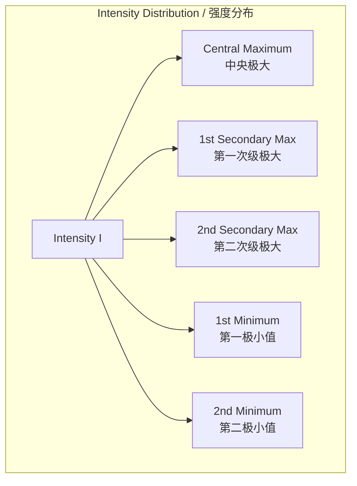
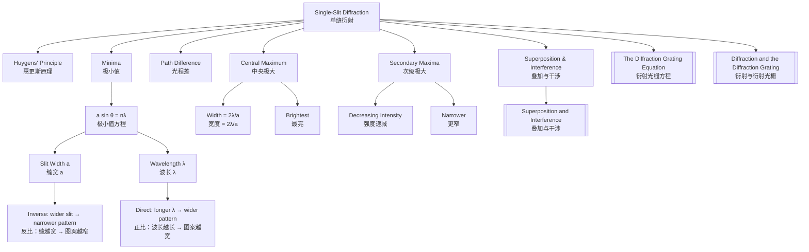

# 1. Overview / 概述

**English:**
Single-slit diffraction is a fundamental wave phenomenon that occurs when waves pass through an aperture whose width is comparable to the wavelength of the wave. This sub-topic explores the pattern of light and dark fringes produced when monochromatic light passes through a narrow single slit. Understanding single-slit diffraction is essential because it forms the basis for understanding the [[The Diffraction Grating Equation]] and explains why diffraction gratings produce sharp, bright maxima. The single-slit pattern acts as the "envelope" that modulates the intensity of multiple-slit interference patterns. This concept builds directly on [[Superposition and Interference]] and is closely related to [[Stationary Waves]] through the concept of path difference and phase cancellation.

**中文:**
单缝衍射是一种基本的波动现象，当波通过宽度与波长相当的孔径时发生。本子知识点探讨单色光通过狭窄单缝时产生的明暗条纹图案。理解单缝衍射至关重要，因为它构成了理解[[The Diffraction Grating Equation|衍射光栅方程]]的基础，并解释了为什么衍射光栅能产生尖锐明亮的极大值。单缝衍射图案作为"包络线"调制着多缝干涉图案的强度。这一概念直接建立在[[Superposition and Interference|叠加与干涉]]之上，并通过光程差和相位相消的概念与[[Stationary Waves|驻波]]密切相关。

---

# 2. Syllabus Learning Objectives / 考纲学习目标

| CAIE 9702 | Edexcel IAL |
|-----------|-------------|
| 8.3(a) Describe the effect of gap width on diffraction at a single slit | 5.21 Understand the conditions for single-slit diffraction |
| 8.3(b) Describe the diffraction pattern from a single slit | 5.22 Describe the intensity distribution of a single-slit diffraction pattern |
| 8.3(c) Explain the formation of the central maximum | 5.23 Understand the relationship between slit width and fringe spacing |
| 8.3(d) Derive and use the condition for minima: $a \sin \theta = n\lambda$ | 5.24 Use the equation $a \sin \theta = n\lambda$ for minima |
| 8.3(e) Describe the effect of changing slit width and wavelength | 5.25 Explain the effect of slit width and wavelength on the pattern |

**Examiner Expectations / 考官期望:**
- **English:** Students must be able to describe the single-slit diffraction pattern qualitatively (central maximum twice as wide as secondary maxima, decreasing intensity) and quantitatively using $a \sin \theta = n\lambda$ for minima. They should explain why the central maximum is brightest and widest, and predict how changing slit width $a$ or wavelength $\lambda$ affects the pattern.
- **中文:** 学生必须能够定性地描述单缝衍射图案（中央极大宽度是次级极大的两倍，强度递减），并使用 $a \sin \theta = n\lambda$ 定量计算极小值位置。他们应解释为什么中央极大最亮最宽，并预测改变缝宽 $a$ 或波长 $\lambda$ 对图案的影响。

---

# 3. Core Definitions / 核心定义

| Term (EN/CN) | Definition (EN) | Definition (CN) | Common Mistakes / 常见错误 |
|--------------|-----------------|-----------------|---------------------------|
| **Single-slit diffraction** / 单缝衍射 | The spreading of waves as they pass through an aperture whose width is comparable to the wavelength, producing a pattern of alternating bright and dark fringes | 波通过宽度与波长相当的孔径时发生的展宽现象，产生明暗相间的条纹图案 | Confusing with double-slit interference; single-slit has one central maximum, not equally spaced fringes |
| **Central maximum** / 中央极大 | The brightest, widest fringe at the centre of the diffraction pattern, formed when all secondary wavelets from the slit arrive in phase | 衍射图案中心最亮最宽的条纹，由缝中所有次级子波同相位到达形成 | Thinking it has the same width as other maxima; it is exactly twice as wide |
| **Secondary maximum** / 次级极大 | Weaker bright fringes on either side of the central maximum, formed when most wavelets arrive in phase but some cancellation occurs | 中央极大两侧较弱的明条纹，由大部分子波同相位到达但部分相消形成 | Assuming all maxima have equal intensity; intensity decreases rapidly |
| **Minima (dark fringes)** / 极小值（暗条纹） | Positions of zero intensity where complete destructive interference occurs, given by $a \sin \theta = n\lambda$ | 完全相消干涉发生的零强度位置，由 $a \sin \theta = n\lambda$ 给出 | Using this equation for maxima (it is only for minima in single-slit) |
| **Slit width $a$** / 缝宽 $a$ | The physical width of the single slit aperture | 单缝孔径的物理宽度 | Confusing with slit separation $d$ in diffraction gratings |
| **Huygens' principle** / 惠更斯原理 | Every point on a wavefront acts as a source of secondary spherical wavelets | 波前上的每一点都作为次级球面子波的波源 | Forgetting that this principle explains diffraction |

---

# 4. Key Concepts Explained / 关键概念详解

## 4.1 Formation of the Diffraction Pattern / 衍射图案的形成

### Explanation / 解释
**English:**
When monochromatic light passes through a narrow single slit of width $a$, each point across the slit acts as a source of secondary wavelets ([[Huygens' principle]]). These wavelets travel different distances to reach a point on a distant screen, creating a [[path difference]]. At the centre of the screen (θ = 0°), all wavelets travel equal distances and arrive in phase, producing constructive interference — this is the **central maximum**.

For points off-centre, wavelets from different parts of the slit have different path differences. When the path difference between wavelets from the top and bottom of the slit equals exactly one wavelength ($\lambda$), the slit can be divided into two halves where each wavelet from the top half cancels with a corresponding wavelet from the bottom half — this creates the **first minimum**. The condition for minima is $a \sin \theta = n\lambda$, where $n = \pm 1, \pm 2, \pm 3, ...$.

Between minima, partial constructive interference produces **secondary maxima**, but these are much weaker than the central maximum because not all wavelets contribute constructively.

**中文:**
当单色光通过宽度为 $a$ 的狭窄单缝时，缝上的每一点都作为次级子波的波源（[[Huygens' principle|惠更斯原理]]）。这些子波传播不同距离到达远处屏幕上的某一点，产生[[path difference|光程差]]。在屏幕中心（θ = 0°），所有子波传播距离相等且同相位到达，产生相长干涉——这就是**中央极大**。

对于偏离中心的点，来自缝不同部分的子波具有不同的光程差。当来自缝顶部和底部的子波之间的光程差恰好等于一个波长（$\lambda$）时，缝可以被分成两半，来自上半部分的每个子波与来自下半部分的对应子波相消——这就产生了**第一极小值**。极小值的条件是 $a \sin \theta = n\lambda$，其中 $n = \pm 1, \pm 2, \pm 3, ...$。

在极小值之间，部分相长干涉产生**次级极大**，但这些比中央极大弱得多，因为并非所有子波都相长贡献。

### Physical Meaning / 物理意义
**English:**
The single-slit diffraction pattern demonstrates the wave nature of light. The spreading of light beyond the geometric shadow is direct evidence that light behaves as a wave, not a ray. The pattern shows that even a single aperture can produce interference effects through the superposition of wavelets from different parts of the wavefront.

**中文:**
单缝衍射图案证明了光的波动性。光展宽到几何阴影区域之外是光作为波而非射线行为的直接证据。该图案表明，即使单个孔径也能通过波前不同部分子波的叠加产生干涉效应。

### Common Misconceptions / 常见误区
- **English:**
  - Thinking the equation $a \sin \theta = n\lambda$ gives positions of maxima (it gives minima only)
  - Believing all bright fringes have equal width (central maximum is twice as wide)
  - Confusing single-slit diffraction with double-slit interference patterns
  - Thinking that making the slit narrower makes the pattern narrower (opposite is true)
  
- **中文:**
  - 认为方程 $a \sin \theta = n\lambda$ 给出极大值位置（它只给出极小值）
  - 认为所有明条纹宽度相等（中央极大宽度是两倍）
  - 混淆单缝衍射与双缝干涉图案
  - 认为缝越窄图案越窄（实际上相反）

### Exam Tips / 考试提示
- **English:** Always state that minima occur when $a \sin \theta = n\lambda$ for $n = \pm 1, \pm 2, ...$ (not $n = 0$). Remember that $n = 0$ corresponds to the central maximum. For small angles, $\sin \theta \approx \theta$ (in radians), so the angular width of the central maximum is $2\lambda/a$.
- **中文:** 始终说明极小值出现在 $a \sin \theta = n\lambda$，其中 $n = \pm 1, \pm 2, ...$（不包括 $n = 0$）。记住 $n = 0$ 对应中央极大。对于小角度，$\sin \theta \approx \theta$（弧度制），因此中央极大的角宽度为 $2\lambda/a$。

> 📷 **IMAGE PROMPT — SD01: Single-Slit Diffraction Pattern Formation**
> A detailed diagram showing a monochromatic light source passing through a narrow single slit of width 'a', with Huygens' wavelets emanating from points across the slit. The wavelets travel different distances to reach a screen, with the central maximum shown as a wide bright region at the centre, and first minima marked at angles ±θ. The diagram should clearly show the path difference between wavelets from the top and bottom of the slit.

---

# 5. Essential Equations / 核心公式

## Equation 1: Condition for Minima / 极小值条件

$$ a \sin \theta = n\lambda $$

| Symbol (符号) | Meaning (EN) | Meaning (CN) | Unit (单位) |
|--------------|-------------|-------------|------------|
| $a$ | Slit width | 缝宽 | m |
| $\theta$ | Angle from centre to minimum | 从中心到极小值的角度 | rad or ° |
| $n$ | Order of minimum ($\pm 1, \pm 2, \pm 3, ...$) | 极小值级数 | dimensionless |
| $\lambda$ | Wavelength of light | 光的波长 | m |

**Derivation / 推导:**
Consider a slit of width $a$. Divide the slit into two halves. For the first minimum ($n = 1$), the path difference between a wavelet from the top of the slit and one from the centre is $\frac{a}{2} \sin \theta$. For destructive interference, this must equal $\frac{\lambda}{2}$. Therefore:
$$\frac{a}{2} \sin \theta = \frac{\lambda}{2} \quad \Rightarrow \quad a \sin \theta = \lambda$$

For the $n$th minimum, the slit is divided into $2n$ equal parts, giving $a \sin \theta = n\lambda$.

**Conditions / 适用条件:**
- **English:** Valid for far-field (Fraunhofer) diffraction where the screen is far from the slit. Assumes monochromatic, coherent light. Valid for small angles where $\sin \theta \approx \theta$ (in radians) for approximations.
- **中文:** 适用于远场（夫琅禾费）衍射，即屏幕距离缝很远。假设单色相干光。对于近似计算，小角度时 $\sin \theta \approx \theta$（弧度制）成立。

**Limitations / 局限性:**
- **English:** Does not apply to the central maximum ($n = 0$). Does not give positions of secondary maxima (these require more complex analysis). Not valid for very wide slits where diffraction is negligible.
- **中文:** 不适用于中央极大（$n = 0$）。不给出次级极大位置（需要更复杂的分析）。不适用于衍射可忽略的非常宽的缝。

## Equation 2: Angular Width of Central Maximum / 中央极大的角宽度

$$ \theta_{\text{central}} = \frac{2\lambda}{a} $$

| Symbol (符号) | Meaning (EN) | Meaning (CN) | Unit (单位) |
|--------------|-------------|-------------|------------|
| $\theta_{\text{central}}$ | Angular width of central maximum | 中央极大的角宽度 | rad |
| $\lambda$ | Wavelength | 波长 | m |
| $a$ | Slit width | 缝宽 | m |

**Derivation / 推导:**
The first minima occur at $\sin \theta = \pm \frac{\lambda}{a}$. For small angles, $\theta \approx \pm \frac{\lambda}{a}$. The central maximum extends from the first minimum on one side to the first minimum on the other, so its total angular width is $2\lambda/a$.

**Conditions / 适用条件:**
- **English:** Valid for small angles ($\theta < 10^\circ$ or 0.17 rad). For larger angles, use $\theta = 2\arcsin(\lambda/a)$.
- **中文:** 适用于小角度（$\theta < 10^\circ$ 或 0.17 rad）。对于更大角度，使用 $\theta = 2\arcsin(\lambda/a)$。

> 📋 **CIE Only:** CAIE expects students to derive $a \sin \theta = n\lambda$ using the half-slit division method.
> 📋 **Edexcel Only:** Edexcel focuses more on the qualitative understanding and application of the equation rather than derivation.

---

# 6. Graphs and Relationships / 图表与关系

## 6.1 Intensity Distribution of Single-Slit Diffraction / 单缝衍射强度分布

### Axes / 坐标轴
- **X-axis:** Position on screen or angle $\theta$ from centre / 屏幕上的位置或偏离中心的角度 $\theta$
- **Y-axis:** Relative intensity $I/I_0$ / 相对强度 $I/I_0$

### Shape / 形状
**English:** The intensity distribution has a large central peak (central maximum) at $\theta = 0^\circ$, with much smaller secondary peaks on either side. The intensity of secondary maxima decreases rapidly with distance from centre. The first secondary maximum has about 4.7% of the central maximum intensity, the second about 1.7%, and so on. Minima (zero intensity) occur between maxima at positions given by $a \sin \theta = n\lambda$.

**中文:** 强度分布在 $\theta = 0^\circ$ 处有一个大的中央峰（中央极大），两侧有更小的次级峰。次级极大的强度随离中心距离增加而迅速减小。第一次级极大强度约为中央极大的4.7%，第二次级约为1.7%，以此类推。极小值（零强度）出现在 $a \sin \theta = n\lambda$ 给出的位置。

### Gradient Meaning / 斜率含义
**English:** The gradient of the intensity distribution curve at any point indicates how rapidly intensity changes with angle. Steep gradients near minima show sharp transitions from bright to dark.

**中文:** 强度分布曲线上任意点的斜率表示强度随角度变化的快慢。极小值附近的陡峭斜率显示从亮到暗的急剧转变。

### Area Meaning / 面积含义
**English:** The area under the intensity curve represents the total power transmitted through the slit. The central maximum contains the majority of the energy.

**中文:** 强度曲线下的面积代表通过缝的总功率。中央极大包含大部分能量。

### Exam Interpretation / 考试解读
- **English:** Be able to sketch this graph from memory. Label the central maximum, first minimum, and secondary maxima. Show that the central maximum is twice as wide as secondary maxima. Indicate that intensity drops rapidly.
- **中文:** 能够凭记忆画出此图。标注中央极大、第一极小值和次级极大。显示中央极大宽度是次级极大的两倍。标明强度迅速下降。

> 📷 **IMAGE PROMPT — SD02: Single-Slit Diffraction Intensity Graph**
> A graph showing relative intensity I/I₀ versus angle θ for single-slit diffraction. The central maximum is tall and wide, with the first minima marked at ±λ/a. Secondary maxima are much smaller (first at ~4.7% of central peak height) and decrease rapidly. The graph should clearly show that the central maximum is twice as wide as the secondary maxima. Label all key features.

---

# 7. Required Diagrams / 必备图表

## 7.1 Single-Slit Diffraction Setup / 单缝衍射装置图

### Description / 描述
**English:** A diagram showing a laser or monochromatic light source directed at a narrow single slit of width $a$, with a screen placed at a distance $D$ (where $D \gg a$) to observe the diffraction pattern. The pattern on the screen shows a bright central maximum with alternating dark and bright fringes on either side.

**中文:** 显示激光或单色光源射向宽度为 $a$ 的狭窄单缝的示意图，屏幕放置在距离 $D$ 处（$D \gg a$）以观察衍射图案。屏幕上的图案显示明亮的中央极大，两侧有交替的暗条纹和明条纹。

### Image Prompt / 图片生成提示
> 📷 **IMAGE PROMPT — SD03: Single-Slit Diffraction Experimental Setup**
> A clean physics diagram showing a laser pointer on the left, emitting a narrow beam towards a single slit (shown as a vertical gap in an opaque barrier). The slit width is labelled 'a'. On the right, a screen shows the diffraction pattern: a wide bright central band with progressively dimmer and narrower bands on both sides. The distance from slit to screen is labelled 'D'. Include labels for the central maximum, first minimum, and secondary maxima. Use a dark background with bright coloured light for visual clarity.

### Labels Required / 需要标注
- **English:** Laser source, single slit (width $a$), screen (distance $D$), central maximum, first minimum, secondary maxima, angular position $\theta$
- **中文:** 激光源、单缝（宽度 $a$）、屏幕（距离 $D$）、中央极大、第一极小值、次级极大、角位置 $\theta$

### Exam Importance / 考试重要性
- **English:** High — students are often asked to draw or interpret this setup. Understanding the geometry is essential for applying $a \sin \theta = n\lambda$.
- **中文:** 高——学生常被要求画出或解释此装置。理解几何结构对于应用 $a \sin \theta = n\lambda$ 至关重要。

## 7.2 Half-Slit Division Method / 半缝分割法

### Description / 描述
**English:** A diagram showing how a single slit of width $a$ is divided into two halves to explain the first minimum. Wavelets from corresponding points in each half (e.g., top of top half and top of bottom half) have a path difference of $\lambda/2$, leading to destructive interference.

**中文:** 显示如何将宽度为 $a$ 的单缝分成两半以解释第一极小值的示意图。来自每半对应点（例如上半顶部和下半顶部）的子波具有 $\lambda/2$ 的光程差，导致相消干涉。

### Image Prompt / 图片生成提示
> 📷 **IMAGE PROMPT — SD04: Half-Slit Division for First Minimum**
> A detailed diagram showing a single slit of width 'a' divided horizontally into two equal halves by a dashed line. From the top of the top half and the top of the bottom half, draw two rays travelling at angle θ to a point on a distant screen. Label the path difference as λ/2. Show that the extra distance travelled by the wavelet from the top of the slit is (a/2)sinθ. Include the equation (a/2)sinθ = λ/2 leading to a sinθ = λ.

### Labels Required / 需要标注
- **English:** Slit width $a$, half-width $a/2$, angle $\theta$, path difference $\lambda/2$, screen, first minimum
- **中文:** 缝宽 $a$、半宽 $a/2$、角度 $\theta$、光程差 $\lambda/2$、屏幕、第一极小值

### Exam Importance / 考试重要性
- **English:** High — this is the standard derivation method for CAIE. Students must be able to reproduce this reasoning.
- **中文:** 高——这是CAIE的标准推导方法。学生必须能够重现这一推理过程。

---

# 8. Worked Examples / 典型例题

## Example 1: Finding the Position of Minima / 求极小值位置

### Question / 题目
**English:**
A monochromatic light of wavelength 580 nm passes through a single slit of width 0.12 mm. A diffraction pattern is observed on a screen 1.5 m away. Calculate:
(a) The angle of the first minimum
(b) The width of the central maximum on the screen
(c) The angle of the second minimum

**中文:**
波长为580 nm的单色光通过宽度为0.12 mm的单缝。在1.5 m远处的屏幕上观察到衍射图案。计算：
(a) 第一极小值的角度
(b) 屏幕上中央极大的宽度
(c) 第二极小值的角度

### Solution / 解答

**Step 1: Identify known values / 确定已知量**
- $\lambda = 580 \text{ nm} = 580 \times 10^{-9} \text{ m} = 5.80 \times 10^{-7} \text{ m}$
- $a = 0.12 \text{ mm} = 0.12 \times 10^{-3} \text{ m} = 1.20 \times 10^{-4} \text{ m}$
- $D = 1.5 \text{ m}$

**Step 2: Calculate angle of first minimum / 计算第一极小值角度**
Using $a \sin \theta = n\lambda$ with $n = 1$:
$$\sin \theta_1 = \frac{\lambda}{a} = \frac{5.80 \times 10^{-7}}{1.20 \times 10^{-4}} = 4.83 \times 10^{-3}$$

$$\theta_1 = \arcsin(4.83 \times 10^{-3}) = 0.277^\circ$$

**Step 3: Calculate width of central maximum / 计算中央极大宽度**
The central maximum extends from the first minimum on one side to the first minimum on the other. For small angles:
$$\theta_1 \approx 4.83 \times 10^{-3} \text{ rad}$$

Width on screen = $2 \times D \times \tan \theta_1 \approx 2 \times D \times \theta_1$ (for small angles)
$$= 2 \times 1.5 \times 4.83 \times 10^{-3} = 0.0145 \text{ m} = 1.45 \text{ cm}$$

**Step 4: Calculate angle of second minimum / 计算第二极小值角度**
Using $a \sin \theta = n\lambda$ with $n = 2$:
$$\sin \theta_2 = \frac{2\lambda}{a} = \frac{2 \times 5.80 \times 10^{-7}}{1.20 \times 10^{-4}} = 9.67 \times 10^{-3}$$

$$\theta_2 = \arcsin(9.67 \times 10^{-3}) = 0.554^\circ$$

### Final Answer / 最终答案
**Answer:** (a) $\theta_1 = 0.277^\circ$ | (b) Central maximum width = 1.45 cm | (c) $\theta_2 = 0.554^\circ$
**答案：** (a) $\theta_1 = 0.277^\circ$ | (b) 中央极大宽度 = 1.45 cm | (c) $\theta_2 = 0.554^\circ$

### Quick Tip / 提示
**English:** Always check if the small-angle approximation is valid. If $\theta < 10^\circ$ (0.17 rad), $\sin \theta \approx \theta$ (in radians) is acceptable. For larger angles, use the exact calculation.
**中文:** 始终检查小角度近似是否有效。如果 $\theta < 10^\circ$（0.17 rad），$\sin \theta \approx \theta$（弧度制）是可接受的。对于更大角度，使用精确计算。

---

## Example 2: Effect of Changing Slit Width / 改变缝宽的影响

### Question / 题目
**English:**
A single-slit diffraction pattern is observed using red light ($\lambda = 650 \text{ nm}$) and a slit of width 0.08 mm. The slit width is then doubled to 0.16 mm. Describe and explain the changes to the diffraction pattern.

**中文:**
使用红光（$\lambda = 650 \text{ nm}$）和宽度为0.08 mm的单缝观察衍射图案。然后将缝宽加倍至0.16 mm。描述并解释衍射图案的变化。

### Solution / 解答

**Step 1: Calculate original pattern / 计算原始图案**
First minimum angle: $\sin \theta_1 = \frac{\lambda}{a} = \frac{650 \times 10^{-9}}{0.08 \times 10^{-3}} = 8.13 \times 10^{-3}$
$$\theta_1 = 0.466^\circ$$

**Step 2: Calculate new pattern / 计算新图案**
With $a = 0.16 \text{ mm}$:
$$\sin \theta_1' = \frac{650 \times 10^{-9}}{0.16 \times 10^{-3}} = 4.06 \times 10^{-3}$$
$$\theta_1' = 0.233^\circ$$

**Step 3: Compare and explain / 比较并解释**
- The angular width of the central maximum halves from $0.932^\circ$ to $0.466^\circ$
- All fringes become narrower and closer together
- The overall pattern becomes more concentrated
- The intensity of the central maximum increases (more light passes through the wider slit)

**Explanation:** When slit width $a$ increases, the angle $\theta$ for a given minimum decreases because $\sin \theta \propto 1/a$. The wavelets from across the wider slit have smaller relative path differences, so the pattern compresses towards the centre.

### Final Answer / 最终答案
**Answer:** Doubling the slit width halves the angular width of the central maximum (from 0.932° to 0.466°), making all fringes narrower and closer together. The pattern becomes more concentrated with a brighter central maximum.
**答案：** 缝宽加倍使中央极大的角宽度减半（从0.932°减小到0.466°），所有条纹变得更窄更密。图案变得更集中，中央极大更亮。

### Quick Tip / 提示
**English:** Remember the inverse relationship: wider slit → narrower pattern; narrower slit → wider pattern. This is opposite to what many students intuitively expect.
**中文:** 记住反比关系：缝越宽 → 图案越窄；缝越窄 → 图案越宽。这与许多学生的直觉相反。

---

# 9. Past Paper Question Types / 历年真题题型

| Question Type / 题型 | Frequency / 频率 | Difficulty / 难度 | Past Paper References / 真题索引 |
|----------------------|------------------|------------------|-------------------------------|
| Calculate position of minima using $a \sin \theta = n\lambda$ | Very High / 非常高 | Medium / 中等 | 📝 *待填入* |
| Describe effect of changing slit width or wavelength | High / 高 | Easy / 简单 | 📝 *待填入* |
| Derive $a \sin \theta = n\lambda$ using half-slit method | Medium / 中等 | Hard / 困难 | 📝 *待填入* |
| Sketch and label intensity distribution graph | High / 高 | Medium / 中等 | 📝 *待填入* |
| Compare single-slit diffraction with double-slit interference | Medium / 中等 | Medium / 中等 | 📝 *待填入* |
| Explain why central maximum is brightest and widest | Medium / 中等 | Medium / 中等 | 📝 *待填入* |

**Common Command Words / 常见指令词:**
- **English:** Calculate, Derive, Describe, Explain, Sketch, State, Compare
- **中文:** 计算、推导、描述、解释、画出、陈述、比较

---

# 10. Practical Skills Connections / 实验技能链接

**English:**
Single-slit diffraction connects to practical work in several ways:

1. **Measurement of wavelength:** By measuring the positions of minima on a screen, students can calculate the wavelength of light using $a \sin \theta = n\lambda$. This requires careful measurement of distances and angles.

2. **Uncertainty analysis:** The uncertainty in $\lambda$ depends on uncertainties in measuring $a$, $D$, and fringe positions. Students should be able to calculate percentage uncertainties and combine them.

3. **Graph plotting:** Plotting $\sin \theta$ against $n$ should give a straight line through the origin with gradient $\lambda/a$. This allows determination of $\lambda$ from the gradient.

4. **Experimental design:** Key considerations include:
   - Using a laser for coherent, monochromatic light
   - Ensuring the slit is narrow enough ($a \approx \lambda$ to $10\lambda$)
   - Placing the screen far enough away ($D \gg a$) for Fraunhofer diffraction
   - Using a dark room to observe dim secondary maxima

5. **Common errors:** Parallax error when measuring fringe positions, not accounting for the finite width of fringes, and using too wide a slit where diffraction is negligible.

**中文:**
单缝衍射在实验中有多种联系：

1. **波长测量：** 通过测量屏幕上极小值的位置，学生可以使用 $a \sin \theta = n\lambda$ 计算光的波长。这需要仔细测量距离和角度。

2. **不确定度分析：** $\lambda$ 的不确定度取决于测量 $a$、$D$ 和条纹位置的不确定度。学生应能计算百分比不确定度并合并它们。

3. **作图：** 绘制 $\sin \theta$ 对 $n$ 的图应得到一条通过原点的直线，斜率为 $\lambda/a$。这允许从斜率确定 $\lambda$。

4. **实验设计：** 关键考虑因素包括：
   - 使用激光以获得相干单色光
   - 确保缝足够窄（$a \approx \lambda$ 到 $10\lambda$）
   - 将屏幕放置足够远（$D \gg a$）以获得夫琅禾费衍射
   - 使用暗室以观察暗淡的次级极大

5. **常见错误：** 测量条纹位置时的视差误差、未考虑条纹的有限宽度、以及使用太宽的缝导致衍射可忽略。

---

# 11. Concept Map / 概念图谱

---

# 12. Quick Revision Sheet / 速查表

| Category / 类别 | Key Points / 要点 |
|----------------|------------------|
| **Definition / 定义** | Diffraction: spreading of waves through an aperture comparable to wavelength / 衍射：波通过宽度与波长相当的孔径时发生的展宽 |
| **Key Formula / 核心公式** | $a \sin \theta = n\lambda$ for minima ($n = \pm 1, \pm 2, ...$) / 极小值公式 |
| **Central Maximum / 中央极大** | Brightest and widest (twice width of secondary maxima) / 最亮最宽（宽度是次级极大的两倍） |
| **Key Graph / 核心图表** | Intensity vs angle: large central peak, small secondary peaks, zero intensity at minima / 强度-角度图：大中央峰、小次级峰、极小值处零强度 |
| **Effect of Wider Slit / 缝变宽的影响** | Pattern becomes narrower, fringes closer together, central maximum brighter / 图案变窄，条纹更密，中央极大更亮 |
| **Effect of Longer λ / 波长变长的影响** | Pattern becomes wider, fringes spread out / 图案变宽，条纹展开 |
| **Small-Angle Approx / 小角度近似** | $\sin \theta \approx \theta$ (rad) for $\theta < 10^\circ$ / 当 $\theta < 10^\circ$ 时 |
| **Central Max Width / 中央极大宽度** | Angular width = $2\lambda/a$ (small angles) / 角宽度 = $2\lambda/a$（小角度） |
| **Exam Tip / 考试提示** | Minima only! Never use $a \sin \theta = n\lambda$ for maxima / 仅用于极小值！切勿用于极大值 |
| **Common Mistake / 常见错误** | Confusing single-slit minima equation with diffraction grating maxima equation $d \sin \theta = n\lambda$ / 混淆单缝极小值方程与光栅极大值方程 $d \sin \theta = n\lambda$ |
| **Practical Link / 实验联系** | Measure $\lambda$ by plotting $\sin \theta$ vs $n$; gradient = $\lambda/a$ / 通过绘制 $\sin \theta$ 对 $n$ 的图测量 $\lambda$；斜率 = $\lambda/a$ |
| **Prerequisite / 前置知识** | [[Superposition and Interference]] — understanding constructive/destructive interference / 理解相长/相消干涉 |