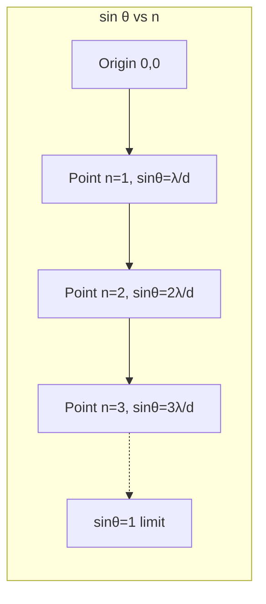

# 1. Overview / 概述

**English:**
This sub-topic explores how a diffraction grating separates white light into its component colours, producing a **grating spectrum**. The key parameter governing this separation is the **line spacing** (or grating spacing) $d$, which determines the angular positions of the maxima. Understanding grating spectra is essential for applications in spectroscopy, where scientists identify elements by their unique spectral lines. This builds directly on [[The Diffraction Grating Equation]] and connects to [[Applications of Diffraction Gratings]] in real-world contexts.

**中文:**
本子知识点探讨衍射光栅如何将白光分解为其组成颜色，产生**光栅光谱**。控制这种分离的关键参数是**光栅常数**（或光栅间距）$d$，它决定了各级明纹的角位置。理解光栅光谱对于光谱学应用至关重要，科学家通过独特的光谱线来识别元素。本内容直接建立在[[The Diffraction Grating Equation]]的基础上，并与[[Applications of Diffraction Gratings]]在实际应用中的联系。

---

# 2. Syllabus Learning Objectives / 考纲学习目标

| CAIE 9702 | Edexcel IAL |
|-----------|-------------|
| 8.3(a): Describe the effect of wavelength on the diffraction pattern from a grating | 5.21: Explain how a diffraction grating produces a spectrum |
| 8.3(b): Use the equation $d \sin \theta = n\lambda$ to determine wavelength | 5.22: Use the diffraction grating equation to calculate wavelength |
| 8.3(c): Explain how line spacing affects the angular separation of maxima | 5.23: Describe the relationship between line spacing and angular dispersion |
| 8.3(d): Describe the production of a continuous spectrum from white light | 5.24: Explain why different orders may overlap |
| 8.3(e): Explain the difference between a continuous spectrum and a line spectrum | 5.25: Calculate the maximum order observable |

**Examiner Expectations / 考官期望:**
- **English:** Students must be able to calculate $d$ from the number of lines per metre, use the grating equation to find angular positions, and explain how changing $d$ affects the spectrum. They should also understand why higher orders may overlap and how to determine the maximum order $n_{\text{max}}$.
- **中文:** 学生必须能够从每米线数计算$d$，使用光栅方程求角位置，并解释改变$d$如何影响光谱。还应理解为什么高级次可能重叠以及如何确定最大级次$n_{\text{max}}$。

---

# 3. Core Definitions / 核心定义

| Term (EN/CN) | Definition (EN) | Definition (CN) | Common Mistakes / 常见错误 |
|--------------|-----------------|-----------------|---------------------------|
| **Grating Spectrum** / 光栅光谱 | The pattern of coloured bands produced when white light passes through a diffraction grating, formed by the angular separation of different wavelengths. | 白光通过衍射光栅时产生的彩色条纹图案，由不同波长的角分离形成。 | Confusing with prism spectrum (prism uses refraction, grating uses diffraction) |
| **Line Spacing (Grating Spacing)** $d$ / 光栅常数 | The distance between adjacent slits on a diffraction grating, calculated as $d = \frac{1}{N}$ where $N$ is the number of lines per metre. | 衍射光栅上相邻狭缝之间的距离，计算公式为$d = \frac{1}{N}$，其中$N$是每米线数。 | Forgetting to convert $N$ from lines per mm to lines per metre |
| **Angular Dispersion** / 角色散 | The angular separation per unit wavelength difference, describing how spread out the spectrum appears. | 单位波长差对应的角分离，描述光谱的展开程度。 | Confusing with linear dispersion (distance on screen) |
| **Order Overlap** / 级次重叠 | When the spectrum of one order overlaps with the spectrum of the next order, occurring when the longest wavelength of order $n$ exceeds the shortest wavelength of order $n+1$. | 当一级光谱与下一级光谱重叠时发生，当第$n$级的最长波长超过第$n+1$级的最短波长时出现。 | Thinking overlap only occurs at high orders |
| **Maximum Order** $n_{\text{max}}$ / 最大级次 | The highest integer order observable, determined by $\sin \theta \leq 1$, giving $n_{\text{max}} = \left\lfloor \frac{d}{\lambda} \right\rfloor$. | 可观察到的最高的整数级次，由$\sin \theta \leq 1$决定，即$n_{\text{max}} = \left\lfloor \frac{d}{\lambda} \right\rfloor$。 | Forgetting to take the floor (integer part) of the result |
| **Continuous Spectrum** / 连续光谱 | A spectrum containing all wavelengths within a range, produced by white light from a hot filament lamp. | 包含一定范围内所有波长的光谱，由热灯丝灯产生的白光形成。 | Confusing with line spectrum (discrete wavelengths) |

---

# 4. Key Concepts Explained / 关键概念详解

## 4.1 Grating Spectrum Formation / 光栅光谱的形成

### Explanation / 解释
**English:** When white light (containing all visible wavelengths from ~400 nm to ~700 nm) passes through a diffraction grating, each wavelength is diffracted at a different angle according to the grating equation $d \sin \theta = n\lambda$. For a given order $n$, shorter wavelengths (violet/blue) are diffracted through smaller angles, while longer wavelengths (red) are diffracted through larger angles. This produces a **continuous spectrum** spreading from violet to red on either side of the central maximum ($n=0$). The central maximum remains white because all wavelengths overlap at $\theta = 0$.

**中文:** 当白光（包含约400 nm到700 nm的所有可见波长）通过衍射光栅时，每个波长根据光栅方程$d \sin \theta = n\lambda$以不同角度衍射。对于给定的级次$n$，较短的波长（紫/蓝）以较小的角度衍射，而较长的波长（红）以较大的角度衍射。这产生了从紫色到红色在中央明纹（$n=0$）两侧展开的**连续光谱**。中央明纹保持白色，因为所有波长在$\theta = 0$处重叠。

### Physical Meaning / 物理意义
**English:** The grating acts as a wavelength analyser — it separates light into its constituent colours based on wavelength. The angular spread of the spectrum depends on both the line spacing $d$ and the order $n$. Smaller $d$ (more lines per metre) gives greater angular dispersion, making the spectrum more spread out.

**中文:** 光栅充当波长分析器——它根据波长将光分离成其组成颜色。光谱的角展度取决于光栅常数$d$和级次$n$。较小的$d$（每米更多线数）产生更大的角色散，使光谱更展开。

### Common Misconceptions / 常见误区
- **EN:** "The central maximum is also a spectrum" — **False.** The central maximum ($n=0$) is white because all wavelengths have $\theta = 0$.
- **CN:** "中央明纹也是光谱" — **错误。** 中央明纹（$n=0$）是白色的，因为所有波长的$\theta = 0$。
- **EN:** "Higher orders always give more spread" — **Partially true.** Higher orders give greater angular separation, but may overlap with adjacent orders.
- **CN:** "高级次总是更展开" — **部分正确。** 高级次产生更大的角分离，但可能与相邻级次重叠。

### Exam Tips / 考试提示
- **EN:** Always state that the central maximum is white and undiffracted. For calculations, convert line density to $d$ in metres first.
- **CN:** 始终说明中央明纹是白色且未衍射的。计算时，先将线密度转换为以米为单位的$d$。

> 📷 **IMAGE PROMPT — GRATING-SPECTRUM-01: White Light Grating Spectrum**
> A diffraction grating illuminated by white light from a filament lamp. Show the central white maximum at θ=0, with first-order spectra (violet to red) on both sides, and second-order spectra further out. Label the angles θ_v and θ_r for violet and red in the first order. Use a dark background with bright coloured lines.

## 4.2 Line Spacing and Angular Dispersion / 光栅常数与角色散

### Explanation / 解释
**English:** The line spacing $d$ is the single most important parameter controlling the diffraction pattern. From $d \sin \theta = n\lambda$, for a fixed $\lambda$ and $n$, $\sin \theta \propto \frac{1}{d}$. A smaller $d$ (more lines per metre) gives larger $\theta$, meaning the maxima are more widely spaced. The **angular dispersion** $\frac{\Delta \theta}{\Delta \lambda}$ (how much the angle changes per unit wavelength) is given by differentiating the grating equation: $\frac{d\theta}{d\lambda} = \frac{n}{d \cos \theta}$. This shows that dispersion increases with order $n$ and decreases with larger $d$.

**中文:** 光栅常数$d$是控制衍射图案的最重要参数。由$d \sin \theta = n\lambda$，对于固定的$\lambda$和$n$，$\sin \theta \propto \frac{1}{d}$。较小的$d$（每米更多线数）产生较大的$\theta$，意味着明纹间距更大。**角色散**$\frac{\Delta \theta}{\Delta \lambda}$（单位波长对应的角度变化）由光栅方程微分得到：$\frac{d\theta}{d\lambda} = \frac{n}{d \cos \theta}$。这表明角色散随级次$n$增加而增大，随$d$增大而减小。

### Physical Meaning / 物理意义
**English:** A grating with 600 lines/mm ($d = 1.67 \times 10^{-6}$ m) gives much greater angular dispersion than one with 300 lines/mm ($d = 3.33 \times 10^{-6}$ m). This is why high-resolution spectrometers use gratings with many lines per millimetre.

**中文:** 600线/mm的光栅（$d = 1.67 \times 10^{-6}$ m）比300线/mm的光栅（$d = 3.33 \times 10^{-6}$ m）产生更大的角色散。这就是为什么高分辨率光谱仪使用每毫米线数多的光栅。

### Common Misconceptions / 常见误区
- **EN:** "More lines per metre means narrower slits" — **Not necessarily.** Line spacing $d$ is the distance between slits, not the slit width.
- **CN:** "每米线数越多意味着狭缝越窄" — **不一定。** 光栅常数$d$是狭缝之间的距离，不是狭缝宽度。
- **EN:** "Angular dispersion is constant for all angles" — **False.** It depends on $\cos \theta$, so it varies with angle.
- **CN:** "角色散对所有角度都是常数" — **错误。** 它取决于$\cos \theta$，因此随角度变化。

### Exam Tips / 考试提示
- **EN:** When comparing two gratings, always calculate $d$ first. A common exam question asks: "Which grating gives a wider spectrum?" — the one with smaller $d$ (more lines/mm).
- **CN:** 比较两个光栅时，始终先计算$d$。常见考题："哪个光栅产生更宽的光谱？"——$d$较小（线数/mm更多）的那个。

## 4.3 Order Overlap / 级次重叠

### Explanation / 解释
**English:** Order overlap occurs when the spectrum of one order extends into the angular region of the next order. For white light (400-700 nm), the second-order spectrum of violet (400 nm) appears at a smaller angle than the first-order spectrum of red (700 nm) if $d$ is small enough. The condition for overlap between order $n$ and $n+1$ is: $n\lambda_{\text{max}} \geq (n+1)\lambda_{\text{min}}$. For white light with $\lambda_{\text{max}} = 700$ nm and $\lambda_{\text{min}} = 400$ nm, overlap begins when $n \times 700 \geq (n+1) \times 400$, giving $n \geq 1.33$, so overlap occurs from the second order onwards.

**中文:** 当一级光谱延伸到下一级光谱的角度区域时，发生级次重叠。对于白光（400-700 nm），如果$d$足够小，二级紫光（400 nm）出现在比一级红光（700 nm）更小的角度。第$n$级和第$n+1$级重叠的条件是：$n\lambda_{\text{max}} \geq (n+1)\lambda_{\text{min}}$。对于$\lambda_{\text{max}} = 700$ nm和$\lambda_{\text{min}} = 400$ nm的白光，当$n \times 700 \geq (n+1) \times 400$时开始重叠，得到$n \geq 1.33$，因此从第二级开始发生重叠。

### Physical Meaning / 物理意义
**English:** Overlap limits the useful range of a grating spectrometer. In practice, only the first-order spectrum is completely free from overlap for white light. Higher orders may show mixed colours where different wavelengths from different orders coincide at the same angle.

**中文:** 重叠限制了光栅光谱仪的有效范围。实际上，只有一级光谱对白光完全没有重叠。高级次可能显示混合颜色，不同级次的不同波长在同一角度重合。

### Common Misconceptions / 常见误区
- **EN:** "Overlap only happens with white light" — **False.** Overlap can occur with any light source that has a broad enough wavelength range.
- **CN:** "重叠只发生在白光中" — **错误。** 任何波长范围足够宽的光源都可能发生重叠。
- **EN:** "Higher orders always overlap" — **Not always.** For monochromatic light, there is no overlap between orders.
- **CN:** "高级次总是重叠" — **不一定。** 对于单色光，级次之间没有重叠。

### Exam Tips / 考试提示
- **EN:** To check for overlap, compare the angle of the longest wavelength in order $n$ with the shortest wavelength in order $n+1$.
- **CN:** 检查重叠时，比较第$n$级最长波长的角度与第$n+1$级最短波长的角度。

## 4.4 Maximum Order Observable / 可观察到的最大级次

### Explanation / 解释
**English:** The maximum order $n_{\text{max}}$ is the highest integer value of $n$ for which $\sin \theta \leq 1$. From $d \sin \theta = n\lambda$, setting $\sin \theta = 1$ gives $n_{\text{max}} = \frac{d}{\lambda}$. Since $n$ must be an integer, $n_{\text{max}} = \left\lfloor \frac{d}{\lambda} \right\rfloor$ (the floor function). For example, with $d = 1.67 \times 10^{-6}$ m (600 lines/mm) and $\lambda = 500$ nm, $n_{\text{max}} = \frac{1.67 \times 10^{-6}}{500 \times 10^{-9}} = 3.34$, so the maximum observable order is $n = 3$.

**中文:** 最大级次$n_{\text{max}}$是满足$\sin \theta \leq 1$的最大整数$n$值。由$d \sin \theta = n\lambda$，设$\sin \theta = 1$得$n_{\text{max}} = \frac{d}{\lambda}$。由于$n$必须是整数，$n_{\text{max}} = \left\lfloor \frac{d}{\lambda} \right\rfloor$（取整函数）。例如，$d = 1.67 \times 10^{-6}$ m（600线/mm）且$\lambda = 500$ nm时，$n_{\text{max}} = \frac{1.67 \times 10^{-6}}{500 \times 10^{-9}} = 3.34$，因此最大可观察级次为$n = 3$。

### Physical Meaning / 物理意义
**English:** The maximum order is limited by the geometry of diffraction — $\sin \theta$ cannot exceed 1. For a given grating, shorter wavelengths can be observed at higher orders than longer wavelengths. This is why violet light may show up to order 4 while red light only shows up to order 2 for the same grating.

**中文:** 最大级次受衍射几何限制——$\sin \theta$不能超过1。对于给定的光栅，较短的波长可以在比较长波长更高的级次观察到。这就是为什么对于同一光栅，紫光可能显示到第4级，而红光只显示到第2级。

### Common Misconceptions / 常见误区
- **EN:** "The maximum order is always an integer" — **The result of the calculation is not always an integer, but the actual $n$ must be an integer.** Always round down.
- **CN:** "最大级次总是整数" — **计算结果不总是整数，但实际的$n$必须是整数。** 始终向下取整。
- **EN:** "You can observe order 0 as the maximum" — **No.** Order 0 is always present; $n_{\text{max}}$ refers to the highest non-zero order.
- **CN:** "可以观察到第0级作为最大级次" — **不是。** 第0级始终存在；$n_{\text{max}}$指的是最高的非零级次。

### Exam Tips / 考试提示
- **EN:** Always show the calculation: $n_{\text{max}} = \frac{d}{\lambda}$, then state the integer value. If the question asks for "the highest order visible", use the shortest wavelength present.
- **CN:** 始终展示计算过程：$n_{\text{max}} = \frac{d}{\lambda}$，然后说明整数值。如果题目问"可见的最高级次"，使用存在的最短波长。

---

# 5. Essential Equations / 核心公式

## 5.1 Diffraction Grating Equation / 光栅方程

$$ d \sin \theta = n \lambda $$

| Symbol (符号) | Meaning (EN) | Meaning (CN) | Unit (单位) |
|--------------|-------------|-------------|------------|
| $d$ | Line spacing (distance between adjacent slits) | 光栅常数（相邻狭缝间距） | m |
| $\theta$ | Angle of diffraction from the normal | 从法线测量的衍射角 | ° or rad |
| $n$ | Order number (0, 1, 2, ...) | 级次（0, 1, 2, ...） | dimensionless |
| $\lambda$ | Wavelength of light | 光的波长 | m |

**Derivation / 推导:** Path difference between adjacent slits = $d \sin \theta$. For constructive interference, path difference = $n\lambda$.

**Conditions / 适用条件:**
- **EN:** Valid for normal incidence. The grating must have many parallel, equally spaced slits.
- **CN:** 适用于垂直入射。光栅必须有大量平行、等间距的狭缝。

**Limitations / 局限性:**
- **EN:** Only valid when $\sin \theta \leq 1$. Does not account for slit width effects (single-slit envelope).
- **CN:** 仅当$\sin \theta \leq 1$时有效。不考虑狭缝宽度效应（单缝包络）。

## 5.2 Line Spacing from Line Density / 由线密度计算光栅常数

$$ d = \frac{1}{N} $$

| Symbol (符号) | Meaning (EN) | Meaning (CN) | Unit (单位) |
|--------------|-------------|-------------|------------|
| $d$ | Line spacing | 光栅常数 | m |
| $N$ | Number of lines per metre | 每米线数 | m$^{-1}$ |

**Derivation / 推导:** If there are $N$ lines in 1 metre, the distance between adjacent lines is $1/N$.

**Conditions / 适用条件:**
- **EN:** $N$ must be in lines per metre. Convert from lines per mm: $N_{\text{m}^{-1}} = N_{\text{mm}^{-1}} \times 1000$.
- **CN:** $N$必须以线/米为单位。从线/mm转换：$N_{\text{m}^{-1}} = N_{\text{mm}^{-1}} \times 1000$。

**Limitations / 局限性:**
- **EN:** Assumes uniform line spacing across the grating.
- **CN:** 假设光栅上线间距均匀。

## 5.3 Maximum Order / 最大级次

$$ n_{\text{max}} = \left\lfloor \frac{d}{\lambda} \right\rfloor $$

| Symbol (符号) | Meaning (EN) | Meaning (CN) | Unit (单位) |
|--------------|-------------|-------------|------------|
| $n_{\text{max}}$ | Maximum observable order | 最大可观察级次 | dimensionless |
| $d$ | Line spacing | 光栅常数 | m |
| $\lambda$ | Wavelength | 波长 | m |

**Derivation / 推导:** From $d \sin \theta = n\lambda$, set $\sin \theta = 1$ (maximum possible value), giving $n = d/\lambda$. Since $n$ must be an integer, take the floor.

**Conditions / 适用条件:**
- **EN:** For a given wavelength. For white light, use the shortest wavelength to find the highest order visible.
- **CN:** 针对给定波长。对于白光，使用最短波长求可见的最高级次。

**Limitations / 局限性:**
- **EN:** Assumes the grating is large enough and the intensity is sufficient to observe the maximum order.
- **CN:** 假设光栅足够大且强度足以观察到最大级次。

## 5.4 Angular Dispersion / 角色散

$$ \frac{d\theta}{d\lambda} = \frac{n}{d \cos \theta} $$

| Symbol (符号) | Meaning (EN) | Meaning (CN) | Unit (单位) |
|--------------|-------------|-------------|------------|
| $\frac{d\theta}{d\lambda}$ | Angular dispersion | 角色散 | rad m$^{-1}$ |
| $n$ | Order number | 级次 | dimensionless |
| $d$ | Line spacing | 光栅常数 | m |
| $\theta$ | Diffraction angle | 衍射角 | rad |

**Derivation / 推导:** Differentiate $d \sin \theta = n\lambda$ with respect to $\lambda$: $d \cos \theta \frac{d\theta}{d\lambda} = n$, so $\frac{d\theta}{d\lambda} = \frac{n}{d \cos \theta}$.

**Conditions / 适用条件:**
- **EN:** Valid for small angular separations. For large wavelength differences, use the exact equation.
- **CN:** 适用于小角分离。对于大波长差，使用精确方程。

**Limitations / 局限性:**
- **EN:** Assumes $\theta$ is constant over the small wavelength range.
- **CN:** 假设在小波长范围内$\theta$恒定。

> 📷 **IMAGE PROMPT — GRATING-EQUATION-01: Grating Geometry**
> A diagram showing a diffraction grating with line spacing d, with incident light from the left, and diffracted rays at angles θ for orders n=0, 1, 2. Show the path difference d sin θ between adjacent rays. Label all quantities clearly. Use a clean, textbook-style diagram.

---

# 6. Graphs and Relationships / 图表与关系

## 6.1 $\sin \theta$ vs $n$ for Fixed $\lambda$ and $d$ / 固定$\lambda$和$d$时$\sin \theta$与$n$的关系

### Axes / 坐标轴
- **X-axis:** Order number $n$ (dimensionless) / 级次$n$（无量纲）
- **Y-axis:** $\sin \theta$ (dimensionless) / $\sin \theta$（无量纲）

### Shape / 形状
**English:** A straight line through the origin with gradient $\lambda/d$. The line continues until $\sin \theta = 1$, after which no further orders are observable.

**中文:** 一条通过原点的直线，斜率为$\lambda/d$。直线持续到$\sin \theta = 1$，之后无法观察到更高级次。

### Gradient Meaning / 斜率含义
**English:** Gradient = $\lambda/d$. A steeper gradient means either larger $\lambda$ or smaller $d$ (more lines per metre).

**中文:** 斜率 = $\lambda/d$。斜率越大意味着$\lambda$越大或$d$越小（每米线数越多）。

### Area Meaning / 面积含义
**English:** No physical meaning for area under this graph.

**中文:** 该图线下面积无物理意义。

### Exam Interpretation / 考试解读
- **EN:** Use this graph to find $\lambda$ from the gradient, or to compare two gratings. A grating with smaller $d$ gives a steeper line.
- **CN:** 使用该图从斜率求$\lambda$，或比较两个光栅。$d$较小的光栅给出更陡的直线。



## 6.2 $\theta$ vs $\lambda$ for Different Orders / 不同级次下$\theta$与$\lambda$的关系

### Axes / 坐标轴
- **X-axis:** Wavelength $\lambda$ (nm) / 波长$\lambda$（nm）
- **Y-axis:** Diffraction angle $\theta$ (°) / 衍射角$\theta$（°）

### Shape / 形状
**English:** For each order $n$, $\theta$ increases non-linearly with $\lambda$ (since $\theta = \sin^{-1}(n\lambda/d)$). Higher orders show steeper curves and reach $\theta = 90^\circ$ at smaller $\lambda$.

**中文:** 对于每个级次$n$，$\theta$随$\lambda$非线性增加（因为$\theta = \sin^{-1}(n\lambda/d)$）。高级次显示更陡的曲线，并在较小的$\lambda$处达到$\theta = 90^\circ$。

### Gradient Meaning / 斜率含义
**English:** The gradient $d\theta/d\lambda$ is the angular dispersion, which increases with $n$ and decreases with $d$.

**中文:** 梯度$d\theta/d\lambda$是角色散，随$n$增加而增大，随$d$增大而减小。

### Area Meaning / 面积含义
**English:** No physical meaning.

**中文:** 无物理意义。

### Exam Interpretation / 考试解读
- **EN:** Use this to show why higher orders overlap — the curve for $n=2$ may cross the curve for $n=1$ at some $\lambda$.
- **CN:** 用此图说明为什么高级次会重叠——$n=2$的曲线可能在某个$\lambda$处与$n=1$的曲线相交。

---

# 7. Required Diagrams / 必备图表

## 7.1 Grating Spectrum from White Light / 白光的衍射光栅光谱

### Description / 描述
**English:** A diagram showing a diffraction grating illuminated by white light, with the central white maximum at $0^\circ$, first-order spectra on both sides showing violet to red, and second-order spectra further out showing greater angular spread. The diagram should also indicate where overlap begins.

**中文:** 显示白光照射衍射光栅的示意图，中央白色明纹在$0^\circ$，两侧的一级光谱显示从紫到红，更外侧的二级光谱显示更大的角展度。还应指示重叠开始的位置。

### Image Prompt / 图片生成提示
> 📷 **IMAGE PROMPT — GRATING-DIAGRAM-01: White Light Grating Spectrum**
> A diffraction grating (vertical lines) on the left, illuminated by a white light source from the left. On the right, show the diffraction pattern: a bright white central spot at 0°, then first-order spectra on both sides with violet (400 nm) closest to center and red (700 nm) furthest. Second-order spectra shown further out, with violet of order 2 at a smaller angle than red of order 1, demonstrating overlap. Label all orders, wavelengths, and angles. Use a dark background with bright spectral colours.

### Labels Required / 需要标注
- **EN:** Central maximum ($n=0$, white), First-order spectrum ($n=1$, violet to red), Second-order spectrum ($n=2$, violet to red), Overlap region, Grating, Incident white light
- **CN:** 中央明纹（$n=0$，白色），一级光谱（$n=1$，紫到红），二级光谱（$n=2$，紫到红），重叠区域，光栅，入射白光

### Exam Importance / 考试重要性
- **EN:** Essential for explaining how a grating produces a spectrum and why overlap occurs. Frequently tested in Paper 2 (structured questions).
- **CN:** 对于解释光栅如何产生光谱以及为什么发生重叠至关重要。常在Paper 2（结构题）中考查。

## 7.2 Geometry of the Diffraction Grating / 衍射光栅的几何结构

### Description / 描述
**English:** A diagram showing two adjacent slits of a diffraction grating with spacing $d$, incident wavefronts, and the path difference $d \sin \theta$ between rays from adjacent slits.

**中文:** 显示衍射光栅两个相邻狭缝的示意图，间距为$d$，入射波前，以及相邻狭缝光线的光程差$d \sin \theta$。

### Image Prompt / 图片生成提示
> 📷 **IMAGE PROMPT — GRATING-DIAGRAM-02: Grating Geometry**
> A diffraction grating with two adjacent slits labelled A and B, separated by distance d. Plane wavefronts approach from the left at normal incidence. Rays from A and B travel to a distant screen at angle θ. Show the path difference as d sin θ using a dashed line and right-angle triangle. Label: d (line spacing), θ (diffraction angle), d sin θ (path difference). Clean, textbook-style diagram with clear labels.

### Labels Required / 需要标注
- **EN:** Slit A, Slit B, Line spacing $d$, Incident wavefronts, Diffracted rays, Path difference $d \sin \theta$, Angle $\theta$
- **CN:** 狭缝A，狭缝B，光栅常数$d$，入射波前，衍射光线，光程差$d \sin \theta$，角度$\theta$

### Exam Importance / 考试重要性
- **EN:** Required for deriving the grating equation. Students should be able to draw and label this diagram from memory.
- **CN:** 推导光栅方程所需。学生应能凭记忆绘制并标注此图。

---

# 8. Worked Examples / 典型例题

## Example 1: Calculating Line Spacing and Maximum Order / 例1：计算光栅常数和最大级次

### Question / 题目
**English:**
A diffraction grating has 500 lines per millimetre. It is illuminated with monochromatic light of wavelength 590 nm.
(a) Calculate the line spacing $d$.
(b) Calculate the angle of the first-order maximum.
(c) Determine the maximum order observable.

**中文:**
一衍射光栅每毫米有500条线。用波长为590 nm的单色光照射。
(a) 计算光栅常数$d$。
(b) 计算一级明纹的角度。
(c) 确定可观察到的最大级次。

### Solution / 解答

**(a) Line spacing / 光栅常数**

$$ N = 500 \text{ lines/mm} = 500 \times 10^3 = 5.0 \times 10^5 \text{ lines/m} $$

$$ d = \frac{1}{N} = \frac{1}{5.0 \times 10^5} = 2.0 \times 10^{-6} \text{ m} $$

**Answer / 答案:** $d = 2.0 \times 10^{-6}$ m

**(b) First-order angle / 一级角度**

$$ d \sin \theta = n \lambda $$

$$ \sin \theta = \frac{n \lambda}{d} = \frac{1 \times 590 \times 10^{-9}}{2.0 \times 10^{-6}} = 0.295 $$

$$ \theta = \sin^{-1}(0.295) = 17.2^\circ $$

**Answer / 答案:** $\theta = 17.2^\circ$

**(c) Maximum order / 最大级次**

$$ n_{\text{max}} = \frac{d}{\lambda} = \frac{2.0 \times 10^{-6}}{590 \times 10^{-9}} = 3.39 $$

Since $n$ must be an integer, $n_{\text{max}} = 3$.

**Answer / 答案:** $n_{\text{max}} = 3$

### Quick Tip / 提示
- **EN:** Always convert $N$ to lines per metre before calculating $d$. Remember to round $n_{\text{max}}$ down to the nearest integer.
- **CN:** 在计算$d$之前，始终将$N$转换为每米线数。记住将$n_{\text{max}}$向下取整到最近的整数。

---

## Example 2: Order Overlap with White Light / 例2：白光的级次重叠

### Question / 题目
**English:**
A diffraction grating with $d = 1.5 \times 10^{-6}$ m is illuminated with white light (400 nm to 700 nm).
(a) Calculate the angular positions of the red (700 nm) and violet (400 nm) in the first order.
(b) Calculate the angular positions of the red and violet in the second order.
(c) Determine whether the second-order spectrum overlaps with the first-order spectrum.

**中文:**
一光栅常数为$d = 1.5 \times 10^{-6}$ m的光栅被白光（400 nm至700 nm）照射。
(a) 计算一级红光（700 nm）和紫光（400 nm）的角位置。
(b) 计算二级红光和紫光的角位置。
(c) 确定二级光谱是否与一级光谱重叠。

### Solution / 解答

**(a) First order / 一级**

For violet ($\lambda = 400$ nm):
$$ \sin \theta_{1v} = \frac{1 \times 400 \times 10^{-9}}{1.5 \times 10^{-6}} = 0.267 $$
$$ \theta_{1v} = \sin^{-1}(0.267) = 15.5^\circ $$

For red ($\lambda = 700$ nm):
$$ \sin \theta_{1r} = \frac{1 \times 700 \times 10^{-9}}{1.5 \times 10^{-6}} = 0.467 $$
$$ \theta_{1r} = \sin^{-1}(0.467) = 27.8^\circ $$

**Answer / 答案:** $\theta_{1v} = 15.5^\circ$, $\theta_{1r} = 27.8^\circ$

**(b) Second order / 二级**

For violet ($\lambda = 400$ nm):
$$ \sin \theta_{2v} = \frac{2 \times 400 \times 10^{-9}}{1.5 \times 10^{-6}} = 0.533 $$
$$ \theta_{2v} = \sin^{-1}(0.533) = 32.2^\circ $$

For red ($\lambda = 700$ nm):
$$ \sin \theta_{2r} = \frac{2 \times 700 \times 10^{-9}}{1.5 \times 10^{-6}} = 0.933 $$
$$ \theta_{2r} = \sin^{-1}(0.933) = 68.9^\circ $$

**Answer / 答案:** $\theta_{2v} = 32.2^\circ$, $\theta_{2r} = 68.9^\circ$

**(c) Overlap check / 重叠检查**

The second-order violet appears at $\theta = 32.2^\circ$, while the first-order red ends at $\theta = 27.8^\circ$.

Since $32.2^\circ > 27.8^\circ$, the second-order spectrum starts at a larger angle than where the first-order spectrum ends. Therefore, **there is no overlap** between the first and second orders for this grating.

**Answer / 答案:** No overlap / 无重叠

### Quick Tip / 提示
- **EN:** Overlap occurs when $\theta_{nv} < \theta_{(n-1)r}$, i.e., when the violet of a higher order appears at a smaller angle than the red of the previous order.
- **CN:** 当$\theta_{nv} < \theta_{(n-1)r}$时发生重叠，即高级次的紫光出现在比前一级次的红光更小的角度时。

---

# 9. Past Paper Question Types / 历年真题题型

| Question Type / 题型 | Frequency / 频率 | Difficulty / 难度 | Past Paper References / 真题索引 |
|----------------------|------------------|------------------|-------------------------------|
| Calculate $d$ from lines/mm and use grating equation | Very High | Easy | 📝 *待填入* |
| Find $\lambda$ from given $\theta$, $d$, $n$ | High | Medium | 📝 *待填入* |
| Determine maximum order $n_{\text{max}}$ | High | Medium | 📝 *待填入* |
| Explain order overlap with white light | Medium | Hard | 📝 *待填入* |
| Compare angular dispersion of two gratings | Medium | Medium | 📝 *待填入* |
| Draw and label grating spectrum diagram | Low | Medium | 📝 *待填入* |

**Common Command Words / 常见指令词:**
- **EN:** Calculate, Determine, Show that, Explain, Describe, State, Compare, Sketch
- **CN:** 计算，确定，证明，解释，描述，写出，比较，画出草图

---

# 10. Practical Skills Connections / 实验技能链接

**English:**
This sub-topic connects to practical work in several ways:

1. **Measuring wavelength using a diffraction grating:** Students set up a laser, grating, and screen to measure the angular positions of maxima. The wavelength is calculated from $d \sin \theta = n\lambda$. Key skills include:
   - Measuring $\theta$ accurately using a protractor or trigonometry ($\tan \theta = x/L$)
   - Calculating $d$ from the number of lines per mm (printed on the grating)
   - Estimating uncertainty in $\theta$ and propagating to $\lambda$

2. **Observing grating spectra:** Using a spectrometer or simple setup with a filament lamp and grating to observe the continuous spectrum. Students should note:
   - The central white maximum
   - The order of colours (violet closest to centre, red furthest)
   - How changing the grating (different $d$) affects the spread

3. **Graph plotting:** Plot $\sin \theta$ against $n$ for a fixed $\lambda$ to find the gradient ($\lambda/d$). Alternatively, plot $\sin \theta$ against $\lambda$ for a fixed $n$ to find $d$.

4. **Uncertainties:**
   - Uncertainty in $\theta$: typically $\pm 0.5^\circ$ for a protractor
   - Uncertainty in $d$: often negligible if lines/mm is given precisely
   - Uncertainty in $\lambda$: calculated from $\Delta \lambda = \lambda \left( \frac{\Delta d}{d} + \frac{\Delta (\sin \theta)}{\sin \theta} \right)$

**中文:**
本子知识点通过多种方式与实验工作联系：

1. **使用衍射光栅测量波长：** 学生设置激光、光栅和屏幕来测量明纹的角位置。通过$d \sin \theta = n\lambda$计算波长。关键技能包括：
   - 使用量角器或三角法（$\tan \theta = x/L$）准确测量$\theta$
   - 从光栅上印刷的每毫米线数计算$d$
   - 估计$\theta$的不确定度并传递到$\lambda$

2. **观察光栅光谱：** 使用光谱仪或简单的灯丝灯和光栅装置观察连续光谱。学生应注意：
   - 中央白色明纹
   - 颜色顺序（紫色最靠近中心，红色最远）
   - 改变光栅（不同$d$）如何影响展度

3. **绘制图表：** 对于固定$\lambda$，绘制$\sin \theta$与$n$的关系图，求斜率（$\lambda/d$）。或者，对于固定$n$，绘制$\sin \theta$与$\lambda$的关系图，求$d$。

4. **不确定度：**
   - $\theta$的不确定度：量角器通常为$\pm 0.5^\circ$
   - $d$的不确定度：如果线/mm精确给出，通常可忽略
   - $\lambda$的不确定度：由$\Delta \lambda = \lambda \left( \frac{\Delta d}{d} + \frac{\Delta (\sin \theta)}{\sin \theta} \right)$计算

---

# 11. Concept Map / 概念图谱

```mermaid
graph TD
    %% Core concept
    G[Grating Spectra & Line Spacing] --> D[Line Spacing d = 1/N]
    G --> E[Grating Equation d sin θ = nλ]
    G --> S[Spectrum Formation]
    
    %% Line spacing connections
    D --> N[Lines per metre N]
    D --> A[Angular Dispersion dθ/dλ = n/(d cos θ)]
    
    %% Grating equation connections
    E --> T[Angle θ]
    E --> O[Order n]
    E --> L[Wavelength λ]
    
    %% Spectrum connections
    S --> C[Continuous Spectrum - White Light]
    S --> M[Maximum Order nmax = floor(d/λ)]
    S --> V[Order Overlap]
    
    %% Overlap condition
    V --> OC[Overlap Condition: nλmax ≥ (n+1)λmin]
    
    %% Prerequisites
    E -.-> P1[[Superposition and Interference]]
    S -.-> P2[[The Diffraction Grating Equation]]
    
    %% Siblings
    G -.-> SIB1[[Diffraction at a Single Slit]]
    G -.-> SIB2[[Applications of Diffraction Gratings]]
    
    %% Related topics
    M -.-> RT1[[Stationary Waves]]
    
    %% Styling
    classDef core fill:#f9f,stroke:#333,stroke-width:2px
    classDef calc fill:#bbf,stroke:#333,stroke-width:1px
    classDef concept fill:#bfb,stroke:#333,stroke-width:1px
    classDef link fill:#ddd,stroke:#666,stroke-width:1px,stroke-dasharray: 5 5
    
    class G core
    class D,E,S calc
    class N,T,O,L,A,C,M,V,OC concept
    class P1,P2,SIB1,SIB2,RT1 link
```

---

# 12. Quick Revision Sheet / 速查表

| Category / 类别 | Key Points / 要点 |
|----------------|------------------|
| **Definition / 定义** | **Line spacing $d$**: Distance between adjacent slits. $d = 1/N$ where $N$ = lines per metre. / **光栅常数$d$**: 相邻狭缝间距。$d = 1/N$，$N$为每米线数。 |
| **Key Formula / 核心公式** | $d \sin \theta = n\lambda$ — the diffraction grating equation / 衍射光栅方程 |
| **Key Formula / 核心公式** | $n_{\text{max}} = \left\lfloor \frac{d}{\lambda} \right\rfloor$ — maximum observable order / 最大可观察级次 |
| **Key Formula / 核心公式** | $\frac{d\theta}{d\lambda} = \frac{n}{d \cos \theta}$ — angular dispersion / 角色散 |
| **Key Graph / 核心图表** | $\sin \theta$ vs $n$: straight line through origin, gradient = $\lambda/d$ / $\sin \theta$与$n$的关系：通过原点的直线，斜率 = $\lambda/d$ |
| **Key Graph / 核心图表** | $\theta$ vs $\lambda$: non-linear curves for each order, steeper for higher $n$ / $\theta$与$\lambda$的关系：每个级次的非线性曲线，$n$越大越陡 |
| **Exam Tip / 考试提示** | Always convert $N$ to lines/metre before calculating $d$. Round $n_{\text{max}}$ down. / 计算$d$前始终将$N$转换为线/米。$n_{\text{max}}$向下取整。 |
| **Exam Tip / 考试提示** | Central maximum ($n=0$) is always white for white light. / 白光的中央明纹（$n=0$）始终为白色。 |
| **Exam Tip / 考试提示** | Overlap occurs when $n\lambda_{\text{max}} \geq (n+1)\lambda_{\text{min}}$. / 当$n\lambda_{\text{max}} \geq (n+1)\lambda_{\text{min}}$时发生重叠。 |
| **Common Mistake / 常见错误** | Forgetting that $n$ must be an integer for $n_{\text{max}}$. / 忘记$n_{\text{max}}$必须是整数。 |
| **Common Mistake / 常见错误** | Confusing line spacing $d$ with slit width. / 混淆光栅常数$d$与狭缝宽度。 |
| **Practical Skill / 实验技能** | Measure $\theta$ using $\tan \theta = x/L$ where $x$ = distance from central max, $L$ = grating-to-screen distance. / 使用$\tan \theta = x/L$测量$\theta$，$x$为距中央明纹距离，$L$为光栅到屏幕距离。 |