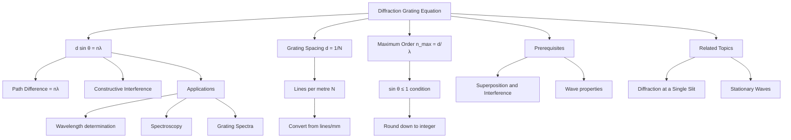

# 1. Overview / 概述

**English:**
The Diffraction Grating Equation is the mathematical foundation that describes how light waves interfere constructively after passing through a diffraction grating. This equation, $d \sin \theta = n\lambda$, connects the grating spacing ($d$), the angle of diffraction ($\theta$), the order number ($n$), and the wavelength ($\lambda$). Understanding this equation is essential for analysing [[Grating Spectra and Line Spacing]] and for practical applications like spectroscopy. This sub-topic builds directly on [[Superposition and Interference]] principles and is a core component of [[Diffraction and the Diffraction Grating]].

**中文:**
衍射光栅方程是描述光波通过衍射光栅后发生相长干涉的数学基础。方程 $d \sin \theta = n\lambda$ 将光栅间距 ($d$)、衍射角 ($\theta$)、级数 ($n$) 和波长 ($\lambda$) 联系起来。理解这个方程对于分析[[光栅光谱与线间距]]以及光谱学等实际应用至关重要。本子知识点直接建立在[[叠加与干涉]]原理之上，是[[衍射与衍射光栅]]的核心组成部分。

---

# 2. Syllabus Learning Objectives / 考纲学习目标

| CAIE 9702 | Edexcel IAL |
|-----------|-------------|
| 8.3(a) Recall and use the equation $d \sin \theta = n\lambda$ | 5.21 Understand the derivation of $d \sin \theta = n\lambda$ |
| 8.3(b) Describe the effect of changing wavelength and slit spacing | 5.22 Use the equation $d \sin \theta = n\lambda$ |
| 8.3(c) Derive the equation from first principles | 5.23 Explain the formation of maxima |
| 8.3(d) Calculate the maximum order observable | 5.24 Determine wavelength using a grating |
| 8.3(e) Explain the use of a diffraction grating to determine wavelength | 5.25 Understand the effect of slit spacing on pattern |

**Examiner Expectations / 考官期望:**
- **CAIE:** Students must derive $d \sin \theta = n\lambda$ from path difference concepts and apply it to calculate wavelengths, grating spacing, and maximum order.
- **Edexcel:** Students must understand the derivation, apply the equation, and explain how changing $d$ or $\lambda$ affects the diffraction pattern.

---

# 3. Core Definitions / 核心定义

| Term (EN/CN) | Definition (EN) | Definition (CN) | Common Mistakes / 常见错误 |
|--------------|-----------------|-----------------|---------------------------|
| **Diffraction Grating** / 衍射光栅 | A device with many equally spaced parallel slits that produces sharp interference maxima | 具有许多等间距平行狭缝的装置，产生清晰的干涉极大值 | Confusing with double-slit interference |
| **Grating Spacing ($d$)** / 光栅间距 | The distance between adjacent slits on the grating, $d = \frac{1}{N}$ where $N$ is the number of lines per metre | 光栅上相邻狭缝之间的距离，$d = \frac{1}{N}$，其中 $N$ 是每米线数 | Forgetting to convert $N$ from lines/mm to lines/m |
| **Order Number ($n$)** / 级数 | An integer (0, ±1, ±2, ...) representing the order of the diffraction maximum | 表示衍射极大值级数的整数 (0, ±1, ±2, ...) | Thinking $n$ can be any real number |
| **Angle of Diffraction ($\theta$)** / 衍射角 | The angle between the central maximum and the $n$th order maximum | 中央极大值与第 $n$ 级极大值之间的夹角 | Measuring from the grating normal incorrectly |
| **Maximum Order ($n_{\text{max}}$)** / 最大级数 | The highest integer order observable, found when $\sin \theta = 1$, so $n_{\text{max}} = \frac{d}{\lambda}$ | 可观察到的最高整数级数，当 $\sin \theta = 1$ 时求得，即 $n_{\text{max}} = \frac{d}{\lambda}$ | Forgetting to round down to the nearest integer |

---

# 4. Key Concepts Explained / 关键概念详解

## 4.1 Path Difference and Constructive Interference / 光程差与相长干涉

### Explanation / 解释
**English:**
When light passes through a diffraction grating, each slit acts as a coherent source. For constructive interference to occur at a particular angle $\theta$, the path difference between waves from adjacent slits must be an integer multiple of the wavelength. From the geometry, the path difference is $d \sin \theta$. Therefore, the condition for a maximum is $d \sin \theta = n\lambda$, where $n = 0, 1, 2, ...$ This is derived from [[Superposition and Interference]] principles.

**中文:**
当光通过衍射光栅时，每个狭缝都充当相干光源。要在特定角度 $\theta$ 发生相长干涉，相邻狭缝发出的波之间的光程差必须是波长的整数倍。从几何关系可知，光程差为 $d \sin \theta$。因此，极大值的条件是 $d \sin \theta = n\lambda$，其中 $n = 0, 1, 2, ...$ 这是从[[叠加与干涉]]原理推导出来的。

### Physical Meaning / 物理意义
**English:**
The equation tells us that for a given grating ($d$ fixed) and wavelength ($\lambda$ fixed), maxima occur only at specific angles $\theta$ where the path difference condition is satisfied. The central maximum ($n=0$) occurs at $\theta = 0^\circ$ for all wavelengths. Higher orders ($n \geq 1$) are spread out at different angles depending on $\lambda$.

**中文:**
该方程告诉我们，对于给定的光栅 ($d$ 固定) 和波长 ($\lambda$ 固定)，极大值只出现在满足光程差条件的特定角度 $\theta$ 处。中央极大值 ($n=0$) 对所有波长都出现在 $\theta = 0^\circ$ 处。更高级次 ($n \geq 1$) 根据 $\lambda$ 在不同角度分散开。

### Common Misconceptions / 常见误区
- **EN:** Thinking that $n$ can be any integer — actually $n$ is limited by $\sin \theta \leq 1$, so $n \leq d/\lambda$.
- **CN:** 认为 $n$ 可以是任意整数——实际上 $n$ 受 $\sin \theta \leq 1$ 限制，所以 $n \leq d/\lambda$。
- **EN:** Confusing $d$ (slit spacing) with $N$ (lines per metre) — they are reciprocals.
- **CN:** 混淆 $d$ (狭缝间距) 和 $N$ (每米线数)——它们是倒数关系。
- **EN:** Forgetting that $\theta$ is measured from the normal, not from the grating surface.
- **CN:** 忘记 $\theta$ 是从法线测量的，而不是从光栅表面。

### Exam Tips / 考试提示
- **EN:** Always convert $N$ (lines per mm) to $d$ in metres: $d = \frac{1}{N \times 10^3}$.
- **CN:** 始终将 $N$ (每毫米线数) 转换为以米为单位的 $d$：$d = \frac{1}{N \times 10^3}$。
- **EN:** When finding maximum order, calculate $d/\lambda$ and round DOWN to the nearest integer.
- **CN:** 求最大级数时，计算 $d/\lambda$ 并向下取整到最近的整数。

> 📷 **IMAGE PROMPT — DG01: Path Difference Geometry for Diffraction Grating**
> A clear diagram showing two adjacent slits in a diffraction grating, with parallel rays emerging at angle θ to the normal. Label the slit spacing d, the path difference as d sin θ, and show the right-angled triangle. Use arrows to indicate the direction of the incident wavefront and the diffracted wavefront.

---

# 5. Essential Equations / 核心公式

## Equation 1: The Diffraction Grating Equation / 衍射光栅方程

$$ d \sin \theta = n\lambda $$

| Symbol (符号) | Meaning (EN) | Meaning (CN) | Unit (单位) |
|--------------|-------------|-------------|------------|
| $d$ | Grating spacing (distance between adjacent slits) | 光栅间距 (相邻狭缝之间的距离) | m |
| $\theta$ | Angle of diffraction from the normal | 从法线测量的衍射角 | degrees (°) or rad |
| $n$ | Order number (0, 1, 2, ...) | 级数 (0, 1, 2, ...) | dimensionless |
| $\lambda$ | Wavelength of light | 光的波长 | m |

**Derivation / 推导:**
Consider two adjacent slits separated by distance $d$. The path difference between waves from these slits at angle $\theta$ is $d \sin \theta$. For constructive interference, this path difference must equal $n\lambda$. Therefore, $d \sin \theta = n\lambda$.

**Conditions / 适用条件:**
- **EN:** The light must be coherent and monochromatic. The grating must have equally spaced slits. The angle $\theta$ is measured from the normal to the grating.
- **CN:** 光必须是相干且单色的。光栅必须具有等间距的狭缝。角度 $\theta$ 是从光栅法线测量的。

**Limitations / 局限性:**
- **EN:** The equation only applies to maxima (constructive interference). It does not describe the intensity distribution between maxima. For very large angles, small-angle approximations ($\sin \theta \approx \theta$) are not valid.
- **CN:** 该方程仅适用于极大值 (相长干涉)。它不描述极大值之间的强度分布。对于非常大的角度，小角度近似 ($\sin \theta \approx \theta$) 不成立。

## Equation 2: Grating Spacing from Lines per Metre / 从每米线数求光栅间距

$$ d = \frac{1}{N} $$

| Symbol (符号) | Meaning (EN) | Meaning (CN) | Unit (单位) |
|--------------|-------------|-------------|------------|
| $d$ | Grating spacing | 光栅间距 | m |
| $N$ | Number of lines per metre | 每米线数 | m$^{-1}$ |

**Derivation / 推导:**
If there are $N$ lines in 1 metre, the distance between adjacent lines is $1/N$ metres.

**Conditions / 适用条件:**
- **EN:** $N$ must be in lines per metre. If given in lines per mm, multiply by $10^3$ first.
- **CN:** $N$ 必须以每米线数为单位。如果以每毫米线数给出，先乘以 $10^3$。

## Equation 3: Maximum Order / 最大级数

$$ n_{\text{max}} = \frac{d}{\lambda} $$

| Symbol (符号) | Meaning (EN) | Meaning (CN) | Unit (单位) |
|--------------|-------------|-------------|------------|
| $n_{\text{max}}$ | Maximum observable order | 可观察到的最大级数 | dimensionless |
| $d$ | Grating spacing | 光栅间距 | m |
| $\lambda$ | Wavelength | 波长 | m |

**Derivation / 推导:**
Since $\sin \theta \leq 1$, from $d \sin \theta = n\lambda$, we get $n \leq d/\lambda$. The maximum integer $n$ satisfying this is $n_{\text{max}} = \lfloor d/\lambda \rfloor$.

**Conditions / 适用条件:**
- **EN:** Always round DOWN to the nearest integer. If $d/\lambda$ is exactly an integer, that order is observable at $\theta = 90^\circ$.
- **CN:** 始终向下取整到最近的整数。如果 $d/\lambda$ 恰好是整数，则该级数在 $\theta = 90^\circ$ 处可观察到。

> 📷 **IMAGE PROMPT — DG02: Maximum Order Diagram**
> A diagram showing a diffraction grating with incident light, and the diffracted beams for orders n=0, 1, 2, 3. Show that as n increases, θ increases. Indicate that when θ = 90°, n = d/λ, which is the maximum order. Label the central maximum and higher orders.

---

# 6. Graphs and Relationships / 图表与关系

## 6.1 $\sin \theta$ vs $n$ / $\sin \theta$ 与 $n$ 的关系图

### Axes / 坐标轴
- **X-axis:** Order number $n$ (dimensionless) / 级数 $n$ (无量纲)
- **Y-axis:** $\sin \theta$ (dimensionless) / $\sin \theta$ (无量纲)

### Shape / 形状
**English:** A straight line through the origin with gradient $\lambda/d$. The line is linear because $\sin \theta = (\lambda/d)n$.

**中文:** 一条通过原点的直线，斜率为 $\lambda/d$。该线是线性的，因为 $\sin \theta = (\lambda/d)n$。

### Gradient Meaning / 斜率含义
**English:** The gradient is $\lambda/d$. A steeper gradient means either a longer wavelength or a smaller grating spacing.

**中文:** 斜率为 $\lambda/d$。斜率越陡意味着波长越长或光栅间距越小。

### Area Meaning / 面积含义
**English:** Not applicable — the area under this graph has no physical significance.

**中文:** 不适用——该图下的面积没有物理意义。

### Exam Interpretation / 考试解读
- **EN:** If given a graph of $\sin \theta$ vs $n$, the gradient gives $\lambda/d$. Use this to find either $\lambda$ or $d$.
- **CN:** 如果给出 $\sin \theta$ 与 $n$ 的关系图，斜率给出 $\lambda/d$。用这个来求 $\lambda$ 或 $d$。

```mermaid
graph LR
    A[sin θ] -->|gradient = λ/d| B[n]
    B --> C[Linear relationship]
    C --> D[sin θ = (λ/d)n]
```

## 6.2 $\theta$ vs $\lambda$ for Different Orders / 不同级数的 $\theta$ 与 $\lambda$ 关系图

### Axes / 坐标轴
- **X-axis:** Wavelength $\lambda$ (m) / 波长 $\lambda$ (m)
- **Y-axis:** Diffraction angle $\theta$ (degrees) / 衍射角 $\theta$ (度)

### Shape / 形状
**English:** For a fixed order $n$, $\theta$ increases non-linearly with $\lambda$. The relationship is $\theta = \sin^{-1}(n\lambda/d)$. For small angles, $\theta \approx n\lambda/d$ (linear).

**中文:** 对于固定级数 $n$，$\theta$ 随 $\lambda$ 非线性增加。关系为 $\theta = \sin^{-1}(n\lambda/d)$。对于小角度，$\theta \approx n\lambda/d$ (线性)。

### Gradient Meaning / 斜率含义
**English:** The gradient is not constant. For small $\lambda$, the gradient is approximately $n/d$.

**中文:** 斜率不是常数。对于小 $\lambda$，斜率近似为 $n/d$。

### Exam Interpretation / 考试解读
- **EN:** Red light (longer $\lambda$) is diffracted more than blue light (shorter $\lambda$) for the same order.
- **CN:** 对于相同级数，红光 (较长 $\lambda$) 比蓝光 (较短 $\lambda$) 衍射更多。

---

# 7. Required Diagrams / 必备图表

## 7.1 Geometry of the Diffraction Grating / 衍射光栅的几何关系

### Description / 描述
**English:** A diagram showing a diffraction grating with incident plane waves, and the diffracted waves at angle $\theta$ to the normal. Two adjacent slits are highlighted, showing the path difference $d \sin \theta$.

**中文:** 显示衍射光栅与入射平面波的图表，以及相对于法线成角度 $\theta$ 的衍射波。突出显示两个相邻狭缝，显示光程差 $d \sin \theta$。

### Image Prompt / 图片生成提示
> 📷 **IMAGE PROMPT — DG03: Diffraction Grating Geometry**
> A clear, labelled diagram of a diffraction grating with 5-6 vertical slits. Incident plane waves approach from the left. Diffracted waves emerge at angle θ to the normal (dashed line perpendicular to grating). Two adjacent slits are highlighted with distance d between them. A right-angled triangle is drawn showing the path difference as d sin θ. Label: "d = slit spacing", "θ = diffraction angle", "d sin θ = path difference". Use blue for incident waves and red for diffracted waves.

### Labels Required / 需要标注
- Grating surface / 光栅表面
- Slits / 狭缝
- Slit spacing $d$ / 狭缝间距 $d$
- Normal line / 法线
- Diffraction angle $\theta$ / 衍射角 $\theta$
- Path difference $d \sin \theta$ / 光程差 $d \sin \theta$
- Incident wavefront / 入射波前
- Diffracted wavefront / 衍射波前

### Exam Importance / 考试重要性
- **EN:** This diagram is essential for deriving the equation $d \sin \theta = n\lambda$. Students must be able to draw and label it.
- **CN:** 这个图表对于推导方程 $d \sin \theta = n\lambda$ 至关重要。学生必须能够绘制并标注它。

## 7.2 Diffraction Pattern from a Grating / 光栅的衍射图案

### Description / 描述
**English:** A diagram showing the diffraction pattern observed on a screen: a central bright maximum (n=0) with equally spaced bright maxima on either side (n=1, 2, ...). The maxima become fainter at higher orders.

**中文:** 显示在屏幕上观察到的衍射图案的图表：中央明亮极大值 (n=0)，两侧有等间距的明亮极大值 (n=1, 2, ...)。较高级次的极大值变得更暗。

### Image Prompt / 图片生成提示
> 📷 **IMAGE PROMPT — DG04: Diffraction Grating Pattern**
> A diagram showing a diffraction grating on the left, a screen on the right, and the diffraction pattern on the screen. The pattern consists of a bright central spot (n=0) with equally spaced bright spots on both sides labelled n=1, n=2, n=3. The spots become progressively fainter and more spread out at higher orders. Label the angle θ for the first order. Show that the spacing between maxima increases with order.

### Labels Required / 需要标注
- Central maximum (n=0) / 中央极大值 (n=0)
- First order maxima (n=±1) / 一级极大值 (n=±1)
- Second order maxima (n=±2) / 二级极大值 (n=±2)
- Screen / 屏幕
- Diffraction grating / 衍射光栅
- Angle $\theta$ / 角度 $\theta$

### Exam Importance / 考试重要性
- **EN:** Students must understand that the pattern consists of sharp, bright maxima at specific angles, unlike the broader fringes from a double slit.
- **CN:** 学生必须理解该图案由特定角度处的尖锐、明亮极大值组成，不同于双缝产生的较宽条纹。

---

# 8. Worked Examples / 典型例题

## Example 1: Finding Wavelength / 例1：求波长

### Question / 题目
**English:**
A diffraction grating has 500 lines per mm. When monochromatic light is incident normally on the grating, the first order maximum is observed at an angle of $15.0^\circ$ to the normal. Calculate the wavelength of the light.

**中文:**
一个衍射光栅每毫米有500条线。当单色光垂直入射到光栅上时，一级极大值在法线 $15.0^\circ$ 处观察到。计算光的波长。

### Solution / 解答

**Step 1:** Find the grating spacing $d$.
$$ N = 500 \text{ lines/mm} = 500 \times 10^3 = 5.00 \times 10^5 \text{ lines/m} $$
$$ d = \frac{1}{N} = \frac{1}{5.00 \times 10^5} = 2.00 \times 10^{-6} \text{ m} $$

**Step 2:** Use the diffraction grating equation for $n=1$.
$$ d \sin \theta = n\lambda $$
$$ (2.00 \times 10^{-6}) \sin(15.0^\circ) = 1 \times \lambda $$

**Step 3:** Calculate $\lambda$.
$$ \lambda = 2.00 \times 10^{-6} \times \sin(15.0^\circ) $$
$$ \lambda = 2.00 \times 10^{-6} \times 0.259 $$
$$ \lambda = 5.18 \times 10^{-7} \text{ m} = 518 \text{ nm} $$

### Final Answer / 最终答案
**Answer:** $\lambda = 518 \text{ nm}$ | **答案：** $\lambda = 518 \text{ nm}$

### Quick Tip / 提示
- **EN:** Always convert $N$ from lines/mm to lines/m before finding $d$.
- **CN:** 在求 $d$ 之前，始终将 $N$ 从每毫米线数转换为每米线数。

## Example 2: Maximum Order / 例2：最大级数

### Question / 题目
**English:**
A diffraction grating with 300 lines per mm is used with light of wavelength 650 nm. Determine the maximum order that can be observed.

**中文:**
一个每毫米有300条线的衍射光栅用于波长为650 nm的光。确定可以观察到的最大级数。

### Solution / 解答

**Step 1:** Find $d$.
$$ N = 300 \text{ lines/mm} = 3.00 \times 10^5 \text{ lines/m} $$
$$ d = \frac{1}{3.00 \times 10^5} = 3.33 \times 10^{-6} \text{ m} $$

**Step 2:** Convert $\lambda$ to metres.
$$ \lambda = 650 \text{ nm} = 6.50 \times 10^{-7} \text{ m} $$

**Step 3:** Use $n_{\text{max}} = d/\lambda$.
$$ n_{\text{max}} = \frac{3.33 \times 10^{-6}}{6.50 \times 10^{-7}} = 5.12 $$

**Step 4:** Round down to the nearest integer.
$$ n_{\text{max}} = 5 $$

### Final Answer / 最终答案
**Answer:** Maximum order = 5 | **答案：** 最大级数 = 5

### Quick Tip / 提示
- **EN:** Always round DOWN. The 6th order would require $\sin \theta > 1$, which is impossible.
- **CN:** 始终向下取整。第6级需要 $\sin \theta > 1$，这是不可能的。

---

# 9. Past Paper Question Types / 历年真题题型

| Question Type / 题型 | Frequency / 频率 | Difficulty / 难度 | Past Paper References / 真题索引 |
|----------------------|------------------|------------------|-------------------------------|
| Calculate wavelength from given data | Very High | Medium | 📝 *待填入* |
| Find maximum order observable | High | Easy | 📝 *待填入* |
| Derive the equation $d \sin \theta = n\lambda$ | Medium | Medium | 📝 *待填入* |
| Explain effect of changing $d$ or $\lambda$ | Medium | Medium | 📝 *待填入* |
| Calculate grating spacing from $N$ | Very High | Easy | 📝 *待填入* |
| Multi-step problem with two wavelengths | Low | Hard | 📝 *待填入* |

**Common Command Words / 常见指令词:**
- **EN:** Calculate, Determine, Derive, Explain, Show that, State
- **CN:** 计算，确定，推导，解释，证明，陈述

---

# 10. Practical Skills Connections / 实验技能链接

**English:**
This sub-topic connects directly to the practical determination of wavelength using a diffraction grating. Key practical skills include:

1. **Setting up the apparatus:** Mounting the grating, laser, and screen in a straight line.
2. **Measuring angles:** Using a protractor or spectrometer to measure $\theta$ accurately.
3. **Handling uncertainties:** Estimating uncertainty in $\theta$ (typically ±0.5°) and propagating to $\lambda$.
4. **Graph plotting:** Plotting $\sin \theta$ against $n$ to find $\lambda$ from the gradient, which reduces random errors.
5. **Experimental design:** Choosing appropriate $N$ to ensure multiple orders are visible.

**Common practical errors:**
- Not ensuring normal incidence of light on the grating
- Measuring $\theta$ from the grating surface instead of the normal
- Using a grating with too few lines (small $N$) leading to small angles and large uncertainties

**中文:**
本子知识点直接连接到使用衍射光栅测定波长的实验。关键实验技能包括：

1. **装置设置：** 将光栅、激光和屏幕安装在一条直线上。
2. **角度测量：** 使用量角器或分光计精确测量 $\theta$。
3. **处理不确定度：** 估计 $\theta$ 的不确定度 (通常 ±0.5°) 并传递到 $\lambda$。
4. **绘制图表：** 绘制 $\sin \theta$ 与 $n$ 的关系图，从斜率求 $\lambda$，这可以减少随机误差。
5. **实验设计：** 选择合适的 $N$ 以确保多个级数可见。

**常见实验错误：**
- 未确保光垂直入射到光栅上
- 从光栅表面而不是法线测量 $\theta$
- 使用线数太少的光栅 (小 $N$)，导致角度小且不确定度大

---

# 11. Concept Map / 概念图谱



---

# 12. Quick Revision Sheet / 速查表

| Category / 类别 | Key Points / 要点 |
|----------------|------------------|
| **Definition / 定义** | $d \sin \theta = n\lambda$ — condition for constructive interference from a diffraction grating / 衍射光栅相长干涉的条件 |
| **Key Formula / 核心公式** | $d = \frac{1}{N}$; $n_{\text{max}} = \frac{d}{\lambda}$ (round down) / $d = \frac{1}{N}$; $n_{\text{max}} = \frac{d}{\lambda}$ (向下取整) |
| **Key Graph / 核心图表** | $\sin \theta$ vs $n$: straight line through origin, gradient = $\lambda/d$ / $\sin \theta$ 与 $n$ 的关系图：通过原点的直线，斜率 = $\lambda/d$ |
| **Exam Tip / 考试提示** | Always convert $N$ from lines/mm to lines/m ($\times 10^3$). Measure $\theta$ from the normal. Round $n_{\text{max}}$ down. / 始终将 $N$ 从每毫米线数转换为每米线数 ($\times 10^3$)。从法线测量 $\theta$。将 $n_{\text{max}}$ 向下取整。 |
| **Common Mistake / 常见错误** | Confusing $d$ and $N$; forgetting to convert units; not rounding down $n_{\text{max}}$ / 混淆 $d$ 和 $N$；忘记转换单位；不将 $n_{\text{max}}$ 向下取整 |
| **Practical Skill / 实验技能** | Use spectrometer for accurate $\theta$; plot $\sin \theta$ vs $n$ to find $\lambda$ from gradient / 使用分光计精确测量 $\theta$；绘制 $\sin \theta$ 与 $n$ 的关系图，从斜率求 $\lambda$ |