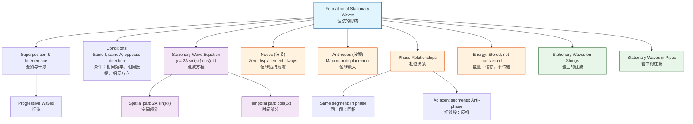

# 1. Overview / 概述

**English:**
This sub-topic explains how stationary waves (also called standing waves) are formed through the superposition of two progressive waves of the same frequency and amplitude traveling in opposite directions. Unlike progressive waves that transfer energy, stationary waves store energy in a fixed pattern of nodes (points of zero displacement) and antinodes (points of maximum displacement). Understanding formation is essential for analyzing [[Stationary Waves on Strings]] and [[Stationary Waves in Pipes (Open and Closed)]], and builds directly on [[Superposition and Interference]].

**中文:**
本子知识点解释驻波（也称定波）是如何通过两个频率和振幅相同、传播方向相反的[[Superposition and Interference|行波]]叠加而形成的。与传递能量的行波不同，驻波将能量储存在固定的波节（位移为零的点）和波腹（位移最大的点）模式中。理解驻波的形成对于分析[[Stationary Waves on Strings|弦上的驻波]]和[[Stationary Waves in Pipes (Open and Closed)|管中的驻波]]至关重要，并直接建立在[[Superposition and Interference|叠加与干涉]]的基础上。

---

# 2. Syllabus Learning Objectives / 考纲学习目标

| CAIE 9702 | Edexcel IAL |
|-----------|-------------|
| 8.2(a) Explain the formation of a stationary wave using a graphical method, and identify nodes and antinodes | 5.17 Explain the formation of a stationary wave |
| 8.2(b) Describe experiments to demonstrate stationary waves using microwaves, stretched strings, and air columns | 5.18 Describe the formation of a stationary wave using a graphical method |
| 8.2(c) Explain the meaning of the term "node" and "antinode" | 5.19 Explain the terms "node" and "antinode" |
| 8.2(d) Describe the formation of stationary waves on a stretched string | 5.20 Describe experiments to demonstrate stationary waves |
| 8.2(e) Describe the formation of stationary waves in pipes | — |

**Examiner Expectations / 考官期望:**
- **English:** You must be able to use graphical superposition to show how two progressive waves produce a stationary wave pattern. You must clearly distinguish between nodes (zero displacement always) and antinodes (maximum displacement always). You should understand that stationary waves do NOT transfer energy.
- **中文:** 你必须能够使用图形叠加法展示两个行波如何产生驻波模式。你必须清楚区分波节（始终为零位移）和波腹（始终为最大位移）。你应该理解驻波不传递能量。

---

# 3. Core Definitions / 核心定义

| Term (EN/CN) | Definition (EN) | Definition (CN) | Common Mistakes / 常见错误 |
|--------------|-----------------|-----------------|---------------------------|
| **Stationary Wave** / 驻波 | A wave formed by the superposition of two progressive waves of the same frequency and amplitude traveling in opposite directions, resulting in a pattern of nodes and antinodes that does not propagate. | 由两个频率和振幅相同、传播方向相反的行波叠加形成的波，产生不传播的波节和波腹模式。 | ❌ Thinking stationary waves are "standing still" — they are oscillating, just not propagating. |
| **Node** / 波节 | A point on a stationary wave where the displacement is always zero due to destructive interference. | 驻波上因相消干涉而位移始终为零的点。 | ❌ Confusing node with antinode; node = zero displacement always. |
| **Antinode** / 波腹 | A point on a stationary wave where the displacement is maximum due to constructive interference. | 驻波上因相长干涉而位移最大的点。 | ❌ Thinking antinodes have constant displacement — they oscillate between maximum positive and negative. |
| **Superposition** / 叠加 | The principle that when two or more waves overlap, the resultant displacement is the vector sum of the individual displacements. | 当两个或多个波重叠时，合位移是各个位移的矢量和。 | ❌ Forgetting to consider phase when adding displacements. |
| **Phase Difference** / 相位差 | The difference in phase between two points on a wave or between two waves, measured in degrees or radians. | 波上两点之间或两个波之间的相位差，以度或弧度为单位。 | ❌ Not recognizing that nodes occur at π phase difference. |

---

# 4. Key Concepts Explained / 关键概念详解

## 4.1 Graphical Formation of Stationary Waves / 驻波的图形形成

### Explanation / 解释
**English:**
Consider two progressive waves of the same amplitude $A$, frequency $f$, and wavelength $\lambda$, traveling in opposite directions along the same medium. Let:
- Wave 1: $y_1 = A \sin(kx - \omega t)$ (traveling right)
- Wave 2: $y_2 = A \sin(kx + \omega t)$ (traveling left)

Using the principle of [[Superposition and Interference|superposition]], the resultant displacement is:
$$y = y_1 + y_2 = A \sin(kx - \omega t) + A \sin(kx + \omega t)$$

Using the trigonometric identity $\sin P + \sin Q = 2 \sin\left(\frac{P+Q}{2}\right) \cos\left(\frac{P-Q}{2}\right)$:
$$y = 2A \sin(kx) \cos(\omega t)$$

This is the equation of a stationary wave. Notice:
- The spatial part $2A \sin(kx)$ depends only on position $x$
- The temporal part $\cos(\omega t)$ depends only on time $t$
- All particles oscillate in phase (or 180° out of phase) with each other

**中文:**
考虑两个振幅为 $A$、频率为 $f$、波长为 $\lambda$ 的行波，沿同一介质相向传播。设：
- 波1：$y_1 = A \sin(kx - \omega t)$（向右传播）
- 波2：$y_2 = A \sin(kx + \omega t)$（向左传播）

根据[[Superposition and Interference|叠加原理]]，合位移为：
$$y = y_1 + y_2 = A \sin(kx - \omega t) + A \sin(kx + \omega t)$$

利用三角恒等式 $\sin P + \sin Q = 2 \sin\left(\frac{P+Q}{2}\right) \cos\left(\frac{P-Q}{2}\right)$：
$$y = 2A \sin(kx) \cos(\omega t)$$

这就是驻波的方程。注意：
- 空间部分 $2A \sin(kx)$ 仅取决于位置 $x$
- 时间部分 $\cos(\omega t)$ 仅取决于时间 $t$
- 所有质点同相（或反相）振动

### Physical Meaning / 物理意义
**English:**
The equation $y = 2A \sin(kx) \cos(\omega t)$ reveals that:
1. **Nodes** occur where $\sin(kx) = 0$, i.e., $kx = n\pi$ → $x = n\frac{\lambda}{2}$ (for $n = 0, 1, 2, ...$). At these points, displacement is ALWAYS zero.
2. **Antinodes** occur where $\sin(kx) = \pm 1$, i.e., $kx = (n + \frac{1}{2})\pi$ → $x = (n + \frac{1}{2})\frac{\lambda}{2}$. At these points, displacement oscillates between $+2A$ and $-2A$.
3. The amplitude of each particle is $2A|\sin(kx)|$, varying from 0 at nodes to $2A$ at antinodes.

**中文:**
方程 $y = 2A \sin(kx) \cos(\omega t)$ 揭示了：
1. **波节**出现在 $\sin(kx) = 0$ 处，即 $kx = n\pi$ → $x = n\frac{\lambda}{2}$（$n = 0, 1, 2, ...$）。在这些点上，位移始终为零。
2. **波腹**出现在 $\sin(kx) = \pm 1$ 处，即 $kx = (n + \frac{1}{2})\pi$ → $x = (n + \frac{1}{2})\frac{\lambda}{2}$。在这些点上，位移在 $+2A$ 和 $-2A$ 之间振荡。
3. 每个质点的振幅为 $2A|\sin(kx)|$，从波节处的 0 变化到波腹处的 $2A$。

### Common Misconceptions / 常见误区
- ❌ **"Stationary waves don't move at all"** — Particles still oscillate; only the pattern doesn't propagate.
- ❌ **"Nodes and antinodes are fixed in position"** — This is TRUE for ideal stationary waves, but students often think they move.
- ❌ **"Energy is transferred along a stationary wave"** — FALSE. Energy is stored, not transferred.
- ❌ **"The amplitude at an antinode is A"** — It's $2A$ (twice the amplitude of each component wave).

### Exam Tips / 考试提示
- ✅ Always sketch the two component waves and their superposition when explaining formation.
- ✅ Label nodes (N) and antinodes (A) clearly on diagrams.
- ✅ Remember: distance between adjacent nodes = $\lambda/2$; distance between adjacent node and antinode = $\lambda/4$.
- ✅ Use the phrase "same frequency, same amplitude, opposite direction" in explanations.

> 📷 **IMAGE PROMPT — GRAPH-01: Graphical Formation of Stationary Wave**
> A series of three graphs showing: (top) wave traveling right, (middle) wave traveling left, (bottom) resultant stationary wave. The bottom graph should show clearly labeled nodes (N) at zero displacement points and antinodes (A) at maximum displacement points. Use a sine wave pattern with arrows indicating direction of travel for the two component waves. Include labels for wavelength λ and amplitude 2A.

---

## 4.2 Phase Relationships in Stationary Waves / 驻波中的相位关系

### Explanation / 解释
**English:**
In a stationary wave, all particles between two adjacent nodes oscillate in phase (they reach maximum displacement at the same time). However, particles on opposite sides of a node oscillate in anti-phase (180° out of phase). This is a key difference from progressive waves, where phase varies continuously with position.

**中文:**
在驻波中，两个相邻波节之间的所有质点同相振动（同时达到最大位移）。然而，波节两侧的质点反相振动（相位差180°）。这是与行波的关键区别，行波中相位随位置连续变化。

### Exam Tips / 考试提示
- ✅ When asked about phase, identify which segment (between which nodes) the particle is in.
- ✅ Particles in the same segment are in phase; particles in adjacent segments are in anti-phase.

---

# 5. Essential Equations / 核心公式

## Equation 1: Stationary Wave Equation / 驻波方程

$$ y = 2A \sin(kx) \cos(\omega t) $$

| Symbol (符号) | Meaning (EN) | Meaning (CN) | Unit (单位) |
|--------------|-------------|-------------|------------|
| $y$ | Displacement of particle at position $x$ and time $t$ | 位置 $x$ 和时间 $t$ 处质点的位移 | m |
| $A$ | Amplitude of each component wave | 每个分量波的振幅 | m |
| $k$ | Wave number ($2\pi/\lambda$) | 波数 ($2\pi/\lambda$) | rad m⁻¹ |
| $x$ | Position along the wave | 沿波的位置 | m |
| $\omega$ | Angular frequency ($2\pi f$) | 角频率 ($2\pi f$) | rad s⁻¹ |
| $t$ | Time | 时间 | s |

**Derivation / 推导:**
$$y = A \sin(kx - \omega t) + A \sin(kx + \omega t)$$
Using $\sin P + \sin Q = 2 \sin\left(\frac{P+Q}{2}\right) \cos\left(\frac{P-Q}{2}\right)$:
$$y = 2A \sin\left(\frac{2kx}{2}\right) \cos\left(\frac{-2\omega t}{2}\right) = 2A \sin(kx) \cos(\omega t)$$

**Conditions / 适用条件:**
- Two progressive waves of **same frequency**, **same amplitude**, traveling in **opposite directions**
- Medium is uniform and non-dispersive

**Limitations / 局限性:**
- Assumes no energy loss (ideal case)
- Does not account for damping or boundary effects

## Equation 2: Node Position / 波节位置

$$ x_n = n\frac{\lambda}{2} \quad (n = 0, 1, 2, ...) $$

| Symbol | Meaning (EN) | Meaning (CN) | Unit |
|--------|-------------|-------------|------|
| $x_n$ | Position of nth node | 第n个波节的位置 | m |
| $n$ | Node number (0, 1, 2, ...) | 波节编号 (0, 1, 2, ...) | — |
| $\lambda$ | Wavelength | 波长 | m |

## Equation 3: Antinode Position / 波腹位置

$$ x_m = \left(m + \frac{1}{2}\right)\frac{\lambda}{2} \quad (m = 0, 1, 2, ...) $$

| Symbol | Meaning (EN) | Meaning (CN) | Unit |
|--------|-------------|-------------|------|
| $x_m$ | Position of mth antinode | 第m个波腹的位置 | m |
| $m$ | Antinode number (0, 1, 2, ...) | 波腹编号 (0, 1, 2, ...) | — |

---

# 6. Graphs and Relationships / 图表与关系

## 6.1 Displacement vs Position at Different Times / 不同时刻的位移-位置图

### Axes / 坐标轴
- **X-axis:** Position along the medium / 沿介质的位置 (m)
- **Y-axis:** Displacement / 位移 (m)

### Shape / 形状
**English:** At any instant, the stationary wave appears as a sine wave with fixed nodes. The amplitude of the sine wave varies with time according to $\cos(\omega t)$. At $t = 0$, the antinodes have maximum displacement. At $t = T/4$, all particles pass through zero displacement. At $t = T/2$, the pattern is inverted.

**中文:** 在任何时刻，驻波呈现为具有固定波节的正弦波。正弦波的振幅随时间按 $\cos(\omega t)$ 变化。在 $t = 0$ 时，波腹具有最大位移。在 $t = T/4$ 时，所有质点通过零位移。在 $t = T/2$ 时，图案反转。

### Gradient Meaning / 斜率含义
**English:** The gradient at any point represents the strain (relative displacement between adjacent particles). Maximum strain occurs at nodes.

**中文:** 任意点的斜率表示应变（相邻质点之间的相对位移）。最大应变出现在波节处。

### Area Meaning / 面积含义
**English:** Not typically analyzed for stationary waves.

**中文:** 驻波通常不分析面积含义。

### Exam Interpretation / 考试解读
- ✅ Be able to sketch the stationary wave pattern at $t = 0$, $t = T/4$, and $t = T/2$.
- ✅ Show that nodes remain at zero displacement at all times.
- ✅ Show that antinodes oscillate between $+2A$ and $-2A$.

> 📷 **IMAGE PROMPT — GRAPH-02: Stationary Wave at Different Times**
> Three overlaid graphs showing the same stationary wave at t=0 (solid line, maximum amplitude), t=T/4 (dashed line, zero displacement), and t=T/2 (dotted line, inverted). Nodes should be clearly marked at the same positions on all three graphs. Use different colors or line styles for each time.

---

## 6.2 Amplitude vs Position / 振幅-位置图

### Axes / 坐标轴
- **X-axis:** Position along the medium / 沿介质的位置 (m)
- **Y-axis:** Amplitude of oscillation / 振荡振幅 (m)

### Shape / 形状
**English:** The amplitude varies as $2A|\sin(kx)|$, producing a rectified sine wave shape. Amplitude is zero at nodes and maximum ($2A$) at antinodes.

**中文:** 振幅按 $2A|\sin(kx)|$ 变化，产生整流正弦波形状。振幅在波节处为零，在波腹处最大（$2A$）。

### Gradient Meaning / 斜率含义
**English:** The rate of change of amplitude with position. Steepest gradient occurs midway between node and antinode.

**中文:** 振幅随位置的变化率。最陡梯度出现在波节和波腹的中点。

### Area Meaning / 面积含义
**English:** Not typically analyzed.

**中文:** 通常不分析。

### Exam Interpretation / 考试解读
- ✅ This graph clearly shows the envelope of the stationary wave.
- ✅ Use it to identify node and antinode positions quickly.

> 📷 **IMAGE PROMPT — GRAPH-03: Amplitude Envelope of Stationary Wave**
> A graph showing the amplitude envelope of a stationary wave as a rectified sine wave. Nodes are at zero amplitude, antinodes at maximum amplitude 2A. The envelope should be shown as a smooth curve connecting the maximum displacement points.

---

# 7. Required Diagrams / 必备图表

## 7.1 Formation of Stationary Wave by Superposition / 通过叠加形成驻波

### Description / 描述
**English:** A diagram showing two progressive waves (one traveling right, one traveling left) and the resultant stationary wave pattern. Nodes and antinodes must be clearly labeled.

**中文:** 显示两个行波（一个向右传播，一个向左传播）和合成驻波模式的图表。必须清楚标注波节和波腹。

### Image Prompt / 图片生成提示
> 📷 **IMAGE PROMPT — DIAG-01: Stationary Wave Formation**
> A diagram with three horizontal axes. Top axis: a sine wave labeled "Wave 1 (right)" with an arrow pointing right. Middle axis: a sine wave labeled "Wave 2 (left)" with an arrow pointing left. Bottom axis: the resultant stationary wave labeled "Stationary Wave" with nodes (N) marked at zero crossings and antinodes (A) marked at peaks. Include labels for wavelength λ and amplitude 2A. Use a clean, educational style suitable for A-Level physics.

### Labels Required / 需要标注
- **Wave 1** / 波1: Direction arrow → right / 向右箭头
- **Wave 2** / 波2: Direction arrow → left / 向左箭头
- **Nodes (N)** / 波节: Points of zero displacement / 位移为零的点
- **Antinodes (A)** / 波腹: Points of maximum displacement / 位移最大的点
- **Wavelength λ** / 波长 λ: Distance between two adjacent nodes × 2 / 相邻波节间距 × 2
- **Amplitude 2A** / 振幅 2A: Maximum displacement at antinode / 波腹处的最大位移

### Exam Importance / 考试重要性
- ✅ **Very High** — This is the most commonly tested diagram for stationary wave formation.
- ✅ Students must be able to sketch this from memory.

---

## 7.2 Phase Relationship Diagram / 相位关系图

### Description / 描述
**English:** A diagram showing two adjacent segments of a stationary wave, illustrating that particles in the same segment oscillate in phase, while particles in adjacent segments oscillate in anti-phase.

**中文:** 显示驻波两个相邻段的图表，说明同一段内的质点同相振荡，而相邻段内的质点反相振荡。

### Image Prompt / 图片生成提示
> 📷 **IMAGE PROMPT — DIAG-02: Phase in Stationary Wave**
> A stationary wave showing three nodes and two antinodes. Use arrows to show the direction of motion of particles at a particular instant. Particles between the first and second node should all have arrows pointing in the same direction (up). Particles between the second and third node should all have arrows pointing in the opposite direction (down). Label "In phase" for the first segment and "Anti-phase" for adjacent segments.

### Labels Required / 需要标注
- **In phase** / 同相: Same direction of motion / 运动方向相同
- **Anti-phase** / 反相: Opposite direction of motion / 运动方向相反
- **Node** / 波节: Boundary between segments / 段之间的边界

### Exam Importance / 考试重要性
- ✅ **High** — Phase relationships are frequently tested in exam questions.

---

# 8. Worked Examples / 典型例题

## Example 1: Identifying Nodes and Antinodes / 识别波节和波腹

### Question / 题目
**English:**
Two progressive waves of amplitude 3.0 cm and wavelength 40 cm travel in opposite directions along a string, producing a stationary wave.

(a) Write the equation of the stationary wave.
(b) Calculate the position of the first three nodes from the origin.
(c) Calculate the position of the first two antinodes from the origin.
(d) What is the amplitude of oscillation at a point 15 cm from the origin?

**中文:**
两个振幅为 3.0 cm、波长为 40 cm 的行波沿一根弦相向传播，产生驻波。

(a) 写出驻波方程。
(b) 计算从原点起前三个波节的位置。
(c) 计算从原点起前两个波腹的位置。
(d) 距离原点 15 cm 处的振荡振幅是多少？

### Solution / 解答

**(a) Stationary wave equation / 驻波方程:**

Given: $A = 3.0 \text{ cm} = 0.030 \text{ m}$, $\lambda = 40 \text{ cm} = 0.40 \text{ m}$

$$k = \frac{2\pi}{\lambda} = \frac{2\pi}{0.40} = 5\pi \text{ rad m}^{-1}$$

$$y = 2A \sin(kx) \cos(\omega t) = 2(0.030) \sin(5\pi x) \cos(\omega t)$$

$$y = 0.060 \sin(5\pi x) \cos(\omega t) \text{ m}$$

**(b) Node positions / 波节位置:**

Nodes occur where $\sin(kx) = 0$, i.e., $kx = n\pi$:

$$5\pi x_n = n\pi \implies x_n = \frac{n}{5} \text{ m} = 20n \text{ cm}$$

First three nodes: $x_0 = 0 \text{ cm}$, $x_1 = 20 \text{ cm}$, $x_2 = 40 \text{ cm}$

**(c) Antinode positions / 波腹位置:**

Antinodes occur where $\sin(kx) = \pm 1$, i.e., $kx = (n + \frac{1}{2})\pi$:

$$5\pi x_m = \left(m + \frac{1}{2}\right)\pi \implies x_m = \frac{m + \frac{1}{2}}{5} \text{ m} = (20m + 10) \text{ cm}$$

First two antinodes: $x_0 = 10 \text{ cm}$, $x_1 = 30 \text{ cm}$

**(d) Amplitude at $x = 15 \text{ cm}$ / 在 $x = 15 \text{ cm}$ 处的振幅:**

$$A(x) = 2A |\sin(kx)| = 0.060 \times |\sin(5\pi \times 0.15)|$$

$$= 0.060 \times |\sin(0.75\pi)| = 0.060 \times \left|\sin\left(\frac{3\pi}{4}\right)\right|$$

$$= 0.060 \times \frac{\sqrt{2}}{2} = 0.060 \times 0.707 = 0.0424 \text{ m} = 4.24 \text{ cm}$$

### Final Answer / 最终答案
**Answer:**
(a) $y = 0.060 \sin(5\pi x) \cos(\omega t)$ m
(b) Nodes at 0 cm, 20 cm, 40 cm
(c) Antinodes at 10 cm, 30 cm
(d) Amplitude = 4.24 cm

**答案：**
(a) $y = 0.060 \sin(5\pi x) \cos(\omega t)$ m
(b) 波节在 0 cm、20 cm、40 cm
(c) 波腹在 10 cm、30 cm
(d) 振幅 = 4.24 cm

### Quick Tip / 提示
**English:** Remember that the distance between adjacent nodes is $\lambda/2$, and between a node and the next antinode is $\lambda/4$. This provides a quick check for your answers.

**中文：** 记住相邻波节之间的距离是 $\lambda/2$，波节到下一个波腹的距离是 $\lambda/4$。这可以快速检查你的答案。

---

## Example 2: Graphical Superposition / 图形叠加法

### Question / 题目
**English:**
Two waves of wavelength 8.0 cm and amplitude 2.0 cm travel in opposite directions. Sketch the resultant stationary wave at $t = 0$ and $t = T/4$. Label the positions of nodes and antinodes.

**中文:**
两个波长为 8.0 cm、振幅为 2.0 cm 的波相向传播。画出 $t = 0$ 和 $t = T/4$ 时的合成驻波。标注波节和波腹的位置。

### Solution / 解答

**Step 1: Identify key parameters / 确定关键参数**
- $\lambda = 8.0 \text{ cm}$, so distance between nodes = $\lambda/2 = 4.0 \text{ cm}$
- $A = 2.0 \text{ cm}$, so antinode amplitude = $2A = 4.0 \text{ cm}$

**Step 2: At $t = 0$ / 在 $t = 0$ 时**
- $\cos(\omega t) = \cos(0) = 1$
- $y = 2A \sin(kx) = 4.0 \sin(kx)$ cm
- Nodes at $x = 0, 4, 8, 12, ...$ cm
- Antinodes at $x = 2, 6, 10, ...$ cm, with displacement $= \pm 4.0$ cm

**Step 3: At $t = T/4$ / 在 $t = T/4$ 时**
- $\cos(\omega t) = \cos(\pi/2) = 0$
- $y = 0$ for all $x$ — the string is momentarily straight

### Final Answer / 最终答案
**Answer:**
At $t = 0$: Stationary wave with nodes at 0, 4, 8 cm and antinodes at 2, 6 cm with amplitude ±4.0 cm.
At $t = T/4$: All points at zero displacement.

**答案：**
在 $t = 0$ 时：驻波在 0、4、8 cm 处有波节，在 2、6 cm 处有波腹，振幅为 ±4.0 cm。
在 $t = T/4$ 时：所有点位移为零。

### Quick Tip / 提示
**English:** When sketching, always show the envelope (maximum displacement) as a dashed line to help visualize the stationary wave pattern.

**中文：** 画图时，始终用虚线显示包络线（最大位移），以帮助可视化驻波模式。

---

# 9. Past Paper Question Types / 历年真题题型

| Question Type / 题型 | Frequency / 频率 | Difficulty / 难度 | Past Paper References / 真题索引 |
|----------------------|------------------|------------------|-------------------------------|
| Graphical superposition to show stationary wave formation | ★★★★★ Very High | ★★★ Medium | 📝 *待填入* |
| Calculate node/antinode positions | ★★★★ High | ★★ Easy | 📝 *待填入* |
| Phase relationship questions | ★★★ Medium | ★★★ Medium | 📝 *待填入* |
| Explain why stationary waves don't transfer energy | ★★★ Medium | ★★ Easy | 📝 *待填入* |
| Derive stationary wave equation | ★★ Low | ★★★★ Hard | 📝 *待填入* |

**Common Command Words / 常见指令词:**
- **Explain** / 解释: Give reasons for the formation of stationary waves
- **Sketch** / 画出: Draw the superposition of two waves
- **Calculate** / 计算: Find positions of nodes and antinodes
- **Describe** / 描述: Describe an experiment to demonstrate stationary waves
- **State** / 陈述: State the conditions for stationary wave formation

---

# 10. Practical Skills Connections / 实验技能链接

**English:**
This sub-topic connects to practical work in several ways:

1. **Microwave Experiment:** Use a microwave transmitter and receiver with a metal reflector. The reflected wave interferes with the incident wave to form a stationary wave. Move the receiver along the path to detect nodes (minimum signal) and antinodes (maximum signal).

2. **Stretched String Experiment:** Use a vibration generator attached to one end of a stretched string. The reflected wave from the fixed end interferes with the incident wave. Adjust frequency to observe different modes (harmonics).

3. **Sound in Pipes:** Use a signal generator, loudspeaker, and a tube with a movable piston. Adjust the piston position to find resonance (maximum sound) corresponding to antinodes.

**Measurements and Uncertainties:**
- Measure distances between nodes to determine wavelength: $\lambda = 2 \times \text{(node spacing)}$
- Use a ruler or vernier caliper for precise measurements
- Estimate uncertainty in position measurements (±0.1 cm typical)
- Repeat measurements and calculate mean node spacing

**Graph Plotting:**
- Plot signal strength vs position for microwave experiment
- Identify nodes as minima and antinodes as maxima

**中文:**
本子知识点通过多种方式与实验工作联系：

1. **微波实验：** 使用微波发射器和接收器，配合金属反射板。反射波与入射波干涉形成驻波。沿路径移动接收器检测波节（最小信号）和波腹（最大信号）。

2. **弦线实验：** 使用连接在弦一端的振动发生器。从固定端反射的波与入射波干涉。调整频率观察不同模式（谐波）。

3. **管中声波：** 使用信号发生器、扬声器和带有可移动活塞的管子。调整活塞位置找到共振（最大声音），对应波腹。

**测量与不确定度：**
- 测量波节之间的距离以确定波长：$\lambda = 2 \times \text{（波节间距）}$
- 使用直尺或游标卡尺进行精确测量
- 估计位置测量的不确定度（通常 ±0.1 cm）
- 重复测量并计算平均波节间距

**图表绘制：**
- 绘制微波实验中信号强度与位置的关系图
- 将最小值识别为波节，最大值识别为波腹

---

# 11. Concept Map / 概念图谱

---

# 12. Quick Revision Sheet / 速查表

| Category / 类别 | Key Points / 要点 |
|----------------|------------------|
| **Definition / 定义** | Stationary wave = superposition of two progressive waves with same f, same A, opposite direction / 驻波 = 两个频率相同、振幅相同、方向相反的行波叠加 |
| **Key Formula / 核心公式** | $y = 2A \sin(kx) \cos(\omega t)$ |
| **Node Condition / 波节条件** | $\sin(kx) = 0$ → $x = n\lambda/2$ |
| **Antinode Condition / 波腹条件** | $\sin(kx) = \pm 1$ → $x = (n + 1/2)\lambda/2$ |
| **Node Spacing / 波节间距** | $\lambda/2$ |
| **Node to Antinode / 波节到波腹** | $\lambda/4$ |
| **Amplitude at Antinode / 波腹振幅** | $2A$ (twice component wave amplitude) |
| **Energy / 能量** | Stored, NOT transferred / 储存，不传递 |
| **Phase / 相位** | Same segment: in phase; adjacent segments: anti-phase / 同一段：同相；相邻段：反相 |
| **Key Graph / 核心图表** | Displacement vs position at different times showing fixed nodes / 不同时刻的位移-位置图，显示固定波节 |
| **Exam Tip / 考试提示** | Always mention "same frequency, same amplitude, opposite direction" / 始终提及"相同频率、相同振幅、相反方向" |
| **Common Mistake / 常见错误** | ❌ Thinking stationary waves transfer energy / 认为驻波传递能量 |