# Nodes and Antinodes / 节点与反节点

---

# 1. Overview / 概述

**English:**
Nodes and antinodes are the defining features of stationary waves (also called standing waves). A **node** is a point along a stationary wave that remains permanently at rest (zero displacement), while an **antinode** is a point that oscillates with maximum amplitude. Understanding the positions and properties of nodes and antinodes is essential for analyzing stationary waves on strings, in air columns (pipes), and in other wave systems. This sub-topic focuses on identifying nodes and antinodes, understanding their formation through [[Superposition and Interference]], and applying this knowledge to solve problems involving [[Stationary Waves on Strings]] and [[Stationary Waves in Pipes (Open and Closed)]].

**中文:**
节点和反节点是驻波（也称为定波）的标志性特征。**节点**是驻波上始终保持静止（位移为零）的点，而**反节点**是以最大振幅振动的点。理解节点和反节点的位置和性质，对于分析弦线、空气柱（管道）及其他波动系统中的驻波至关重要。本子知识点侧重于识别节点和反节点，通过[[Superposition and Interference|叠加与干涉]]理解其形成过程，并将这些知识应用于解决涉及[[Stationary Waves on Strings|弦线上的驻波]]和[[Stationary Waves in Pipes (Open and Closed)|管道（开管和闭管）中的驻波]]的问题。

---

# 2. Syllabus Learning Objectives / 考纲学习目标

| CAIE 9702 | Edexcel IAL |
|-----------|-------------|
| 8.2(a) Explain the formation of stationary waves using the principle of superposition | WPH11 U2: 5.17 Understand the concept of stationary (standing) waves |
| 8.2(b) Identify nodes and antinodes in stationary wave patterns | WPH11 U2: 5.18 Identify nodes and antinodes in stationary wave patterns |
| 8.2(c) Determine the wavelength of stationary waves from node/antinode spacing | WPH11 U2: 5.19 Determine the wavelength of stationary waves from node/antinode spacing |
| 8.2(d) Describe experiments to demonstrate stationary waves using microwaves, stretched strings, and air columns | WPH11 U2: 5.20 Describe experiments to demonstrate stationary waves |
| 8.2(e) Solve problems involving stationary waves | — |

**Examiner Expectations / 考官期望:**
- **English:** You must be able to identify nodes and antinodes on diagrams and describe their properties. You should know that the distance between successive nodes (or successive antinodes) is $\frac{\lambda}{2}$, and the distance between a node and the next antinode is $\frac{\lambda}{4}$. You must apply these relationships to calculate wavelength, frequency, and wave speed.
- **中文:** 你必须能够在图表上识别节点和反节点，并描述它们的性质。你应该知道相邻节点（或相邻反节点）之间的距离是 $\frac{\lambda}{2}$，节点与下一个反节点之间的距离是 $\frac{\lambda}{4}$。你必须应用这些关系来计算波长、频率和波速。

---

# 3. Core Definitions / 核心定义

| Term (EN/CN) | Definition (EN) | Definition (CN) | Common Mistakes / 常见错误 |
|--------------|-----------------|-----------------|---------------------------|
| **Node** / 节点 | A point on a stationary wave that remains permanently at rest (zero displacement) due to destructive interference. | 驻波上因相消干涉而始终保持静止（位移为零）的点。 | ❌ Thinking nodes are points of minimum amplitude (they are zero amplitude, not just small). / 认为节点是振幅最小的点（振幅为零，不仅仅是小）。 |
| **Antinode** / 反节点 | A point on a stationary wave that oscillates with maximum amplitude due to constructive interference. | 驻波上因相长干涉而以最大振幅振动的点。 | ❌ Thinking antinodes are points of maximum displacement at all times (they oscillate between +A and -A). / 认为反节点是始终处于最大位移的点（它们在 +A 和 -A 之间振动）。 |
| **Adjacent Nodes** / 相邻节点 | Two consecutive nodes along a stationary wave pattern. The distance between them is $\frac{\lambda}{2}$. | 驻波图案中两个连续的节点。它们之间的距离是 $\frac{\lambda}{2}$。 | ❌ Confusing with distance between node and antinode ($\frac{\lambda}{4}$). / 混淆节点与反节点之间的距离（$\frac{\lambda}{4}$）。 |
| **Adjacent Antinodes** / 相邻反节点 | Two consecutive antinodes along a stationary wave pattern. The distance between them is $\frac{\lambda}{2}$. | 驻波图案中两个连续的反节点。它们之间的距离是 $\frac{\lambda}{2}$。 | ❌ Same as above — students often think this distance is $\lambda$. / 同上——学生常认为这个距离是 $\lambda$。 |
| **Node-to-Antinode Distance** / 节点到反节点距离 | The distance from a node to the nearest antinode. This is $\frac{\lambda}{4}$. | 从节点到最近反节点的距离。这是 $\frac{\lambda}{4}$。 | ❌ Using $\frac{\lambda}{2}$ instead of $\frac{\lambda}{4}$. / 使用 $\frac{\lambda}{2}$ 而不是 $\frac{\lambda}{4}$。 |
| **Loop (Segment)** / 波腹段 | The portion of a stationary wave between two successive nodes, containing one antinode. Length = $\frac{\lambda}{2}$. | 驻波上两个连续节点之间的部分，包含一个反节点。长度 = $\frac{\lambda}{2}$。 | ❌ Thinking a loop is the same as an antinode (a loop is a region, an antinode is a point). / 认为波腹段等同于反节点（波腹段是一个区域，反节点是一个点）。 |

---

# 4. Key Concepts Explained / 关键概念详解

## 4.1 Formation of Nodes and Antinodes / 节点与反节点的形成

### Explanation / 解释
**English:**
Nodes and antinodes arise from the [[Superposition and Interference]] of two identical waves traveling in opposite directions. When a progressive wave reflects from a boundary, the incident and reflected waves superpose. At points where the two waves are **exactly out of phase** (phase difference = $\pi$ rad or $180^\circ$), destructive interference occurs, resulting in **zero displacement** — these are **nodes**. At points where the two waves are **exactly in phase** (phase difference = 0 rad or $0^\circ$), constructive interference occurs, resulting in **maximum displacement** — these are **antinodes**.

**中文:**
节点和反节点是由两个沿相反方向传播的相同波通过[[Superposition and Interference|叠加与干涉]]产生的。当一个行波从边界反射时，入射波和反射波发生叠加。在**恰好反相**（相位差 = $\pi$ 弧度或 $180^\circ$）的点上，发生相消干涉，产生**零位移**——这些是**节点**。在**恰好同相**（相位差 = 0 弧度或 $0^\circ$）的点上，发生相长干涉，产生**最大位移**——这些是**反节点**。

### Physical Meaning / 物理意义
**English:**
Nodes represent points of **complete cancellation** — the two waves always cancel each other out at these positions. Antinodes represent points of **complete reinforcement** — the two waves add together to produce double the amplitude of each individual wave. The pattern of nodes and antinodes is fixed in space, which is why the wave appears to "stand still."

**中文:**
节点代表**完全抵消**的点——两个波在这些位置上总是相互抵消。反节点代表**完全增强**的点——两个波叠加在一起，产生每个单独波振幅的两倍。节点和反节点的图案在空间中是固定的，这就是为什么波看起来"静止不动"。

### Common Misconceptions / 常见误区
- ❌ **"Nodes are where the wave has minimum energy."** — Energy is not localized at nodes or antinodes; energy is stored in the stationary wave pattern as a whole.
- ❌ **"Nodes and antinodes are the same as crests and troughs."** — Crests and troughs are features of progressive waves; nodes and antinodes are features of stationary waves.
- ❌ **"The distance between a node and antinode is always $\frac{\lambda}{2}$."** — It is $\frac{\lambda}{4}$.
- ❌ **"A node is a point of zero displacement at all times."** — This is correct, but students often forget that particles at nodes have zero velocity and zero acceleration as well.

- ❌ **"节点是波能量最小的位置。"** — 能量并不集中在节点或反节点上；能量以驻波图案整体形式储存。
- ❌ **"节点和反节点与波峰和波谷相同。"** — 波峰和波谷是行波的特征；节点和反节点是驻波的特征。
- ❌ **"节点和反节点之间的距离总是 $\frac{\lambda}{2}$。"** — 应该是 $\frac{\lambda}{4}$。
- ❌ **"节点是始终位移为零的点。"** — 这是正确的，但学生常忘记节点处的粒子速度也为零，加速度也为零。

### Exam Tips / 考试提示
- **English:** When drawing stationary waves, always mark nodes with an "N" and antinodes with an "A". Remember that the ends of a string fixed at both ends are always nodes. For open pipes, both ends are antinodes; for closed pipes, the closed end is a node and the open end is an antinode.
- **中文:** 在绘制驻波时，始终用"N"标记节点，用"A"标记反节点。记住，两端固定的弦线的端点始终是节点。对于开管，两端都是反节点；对于闭管，封闭端是节点，开口端是反节点。

> 📷 **IMAGE PROMPT — DIAGRAM-01: Formation of Nodes and Antinodes**
> A clear diagram showing two identical sine waves traveling in opposite directions (one blue, one red) superposing to form a stationary wave (green). Mark nodes (N) at points of zero displacement and antinodes (A) at points of maximum displacement. Show the phase relationship: waves out of phase at nodes, in phase at antinodes. Include labels for wavelength segments.

---

## 4.2 Spacing of Nodes and Antinodes / 节点与反节点的间距

### Explanation / 解释
**English:**
The spacing between nodes and antinodes follows a fixed pattern based on the wavelength $\lambda$:

- **Distance between successive nodes:** $\frac{\lambda}{2}$
- **Distance between successive antinodes:** $\frac{\lambda}{2}$
- **Distance from a node to the nearest antinode:** $\frac{\lambda}{4}$

This means that within one wavelength of a stationary wave, there are **two nodes** and **two antinodes**, arranged alternately: Node → Antinode → Node → Antinode → Node.

**中文:**
节点和反节点之间的间距遵循基于波长 $\lambda$ 的固定模式：

- **相邻节点之间的距离：** $\frac{\lambda}{2}$
- **相邻反节点之间的距离：** $\frac{\lambda}{2}$
- **从节点到最近反节点的距离：** $\frac{\lambda}{4}$

这意味着在驻波的一个波长内，有**两个节点**和**两个反节点**，交替排列：节点 → 反节点 → 节点 → 反节点 → 节点。

### Physical Meaning / 物理意义
**English:**
The $\frac{\lambda}{2}$ spacing between nodes arises because the phase of the wave changes by $\pi$ radians (half a cycle) over that distance. Since nodes occur where the two waves are exactly out of phase, the next node occurs when the phase difference has changed by another $\pi$ radians, which corresponds to traveling half a wavelength.

**中文:**
节点之间 $\frac{\lambda}{2}$ 的间距是因为波的相位在该距离上变化了 $\pi$ 弧度（半个周期）。由于节点出现在两个波恰好反相的位置，当下一个节点出现时，相位差又变化了 $\pi$ 弧度，这对应于传播半个波长。

### Common Misconceptions / 常见误区
- ❌ **"The distance between a node and the next node is $\lambda$."** — It is $\frac{\lambda}{2}$.
- ❌ **"There is always a node at the center of a stationary wave."** — Only for the fundamental mode and odd harmonics; for even harmonics, the center is an antinode.
- ❌ **"Nodes and antinodes are equally spaced."** — They are, but the spacing between a node and antinode is half the spacing between two nodes.

- ❌ **"节点到下一个节点的距离是 $\lambda$。"** — 应该是 $\frac{\lambda}{2}$。
- ❌ **"驻波中心总是有一个节点。"** — 仅对基模和奇次谐波成立；对于偶次谐波，中心是反节点。
- ❌ **"节点和反节点等间距分布。"** — 是的，但节点到反节点的间距是两个节点间距的一半。

### Exam Tips / 考试提示
- **English:** In exam questions, you may be given the distance between several nodes and asked to find the wavelength. Count the number of half-wavelengths in the given distance. For example, if 3 nodes span a distance of 1.5 m, there are 2 half-wavelengths between the first and third node, so $2 \times \frac{\lambda}{2} = 1.5$ m, giving $\lambda = 1.5$ m.
- **中文:** 在考试题中，可能会给出几个节点之间的距离，要求你求波长。计算给定距离中有多少个半波长。例如，如果3个节点跨越1.5米的距离，第一个和第三个节点之间有2个半波长，所以 $2 \times \frac{\lambda}{2} = 1.5$ 米，得出 $\lambda = 1.5$ 米。

---

## 4.3 Nodes and Antinodes in Different Systems / 不同系统中的节点与反节点

### Explanation / 解释
**English:**
The positions of nodes and antinodes depend on the boundary conditions:

| System | Boundary Condition | Node or Antinode at Boundary? |
|--------|-------------------|-------------------------------|
| String fixed at both ends | Fixed end (cannot move) | **Node** |
| String with one free end | Free end (can move freely) | **Antinode** |
| Open pipe (both ends open) | Open end (air can move freely) | **Antinode** |
| Closed pipe (one end closed) | Closed end (air cannot move) | **Node** |
| | Open end | **Antinode** |

**中文:**
节点和反节点的位置取决于边界条件：

| 系统 | 边界条件 | 边界处是节点还是反节点？ |
|--------|-------------------|-------------------------------|
| 两端固定的弦线 | 固定端（不能移动） | **节点** |
| 一端自由的弦线 | 自由端（可自由移动） | **反节点** |
| 开管（两端开口） | 开口端（空气可自由移动） | **反节点** |
| 闭管（一端封闭） | 封闭端（空气不能移动） | **节点** |
| | 开口端 | **反节点** |

### Physical Meaning / 物理意义
**English:**
The boundary condition determines whether a node or antinode forms because it dictates the phase change upon reflection. When a wave reflects from a **fixed** boundary (denser medium), it undergoes a phase change of $\pi$ radians ($180^\circ$), producing a node. When a wave reflects from a **free** boundary (less dense medium), it undergoes no phase change, producing an antinode.

**中文:**
边界条件决定形成节点还是反节点，因为它决定了反射时的相位变化。当波从**固定**边界（更密介质）反射时，发生 $\pi$ 弧度（$180^\circ$）的相位变化，产生节点。当波从**自由**边界（更疏介质）反射时，不发生相位变化，产生反节点。

### Common Misconceptions / 常见误区
- ❌ **"All boundaries produce nodes."** — Only fixed boundaries produce nodes; free boundaries produce antinodes.
- ❌ **"The open end of a pipe is always a node."** — It is always an antinode because air can move freely.
- ❌ **"A string with one free end has a node at the free end."** — It has an antinode at the free end.

- ❌ **"所有边界都产生节点。"** — 只有固定边界产生节点；自由边界产生反节点。
- ❌ **"管道的开口端总是节点。"** — 它总是反节点，因为空气可以自由移动。
- ❌ **"一端自由的弦线在自由端有节点。"** — 它在自由端有反节点。

### Exam Tips / 考试提示
- **English:** Memorize the boundary conditions: fixed end = node, free end = antinode. For pipes, remember "open = antinode, closed = node." This is a common exam question.
- **中文:** 记住边界条件：固定端 = 节点，自由端 = 反节点。对于管道，记住"开口 = 反节点，封闭 = 节点"。这是常见的考试题。

> 📷 **IMAGE PROMPT — DIAGRAM-02: Nodes and Antinodes in Different Systems**
> Four diagrams side by side: (1) String fixed at both ends showing nodes at ends and antinodes in between; (2) String with one free end showing node at fixed end and antinode at free end; (3) Open pipe showing antinodes at both ends; (4) Closed pipe showing node at closed end and antinode at open end. Label all nodes (N) and antinodes (A) clearly.

---

# 5. Essential Equations / 核心公式

## 5.1 Node-to-Node Distance / 节点间距

$$ d_{\text{node-node}} = \frac{\lambda}{2} $$

| Symbol (符号) | Meaning (EN) | Meaning (CN) | Unit (单位) |
|--------------|-------------|-------------|------------|
| $d_{\text{node-node}}$ | Distance between successive nodes | 相邻节点之间的距离 | m |
| $\lambda$ | Wavelength | 波长 | m |

**Derivation / 推导:**
Nodes occur where the phase difference between the two traveling waves is $\pi$ rad. The phase difference changes by $2\pi$ rad over one wavelength, so it changes by $\pi$ rad over $\frac{\lambda}{2}$.

**Conditions / 适用条件:**
- **English:** Applies to all stationary waves, regardless of the system (strings, pipes, microwaves, etc.).
- **中文:** 适用于所有驻波，无论系统类型（弦线、管道、微波等）。

**Limitations / 局限性:**
- **English:** This assumes the wave is in a uniform medium. In non-uniform media, the spacing may vary.
- **中文:** 这假设波在均匀介质中。在非均匀介质中，间距可能变化。

---

## 5.2 Node-to-Antinode Distance / 节点到反节点距离

$$ d_{\text{node-antinode}} = \frac{\lambda}{4} $$

| Symbol (符号) | Meaning (EN) | Meaning (CN) | Unit (单位) |
|--------------|-------------|-------------|------------|
| $d_{\text{node-antinode}}$ | Distance from a node to the nearest antinode | 从节点到最近反节点的距离 | m |
| $\lambda$ | Wavelength | 波长 | m |

**Derivation / 推导:**
Since nodes are spaced $\frac{\lambda}{2}$ apart, and an antinode lies exactly halfway between two nodes, the distance from a node to the nearest antinode is $\frac{1}{2} \times \frac{\lambda}{2} = \frac{\lambda}{4}$.

**Conditions / 适用条件:**
- **English:** Applies to all stationary waves.
- **中文:** 适用于所有驻波。

**Limitations / 局限性:**
- **English:** None, as this is a geometric relationship derived from the wave equation.
- **中文:** 无，这是从波动方程推导出的几何关系。

---

## 5.3 Wavelength from Node/Antinode Spacing / 从节点/反节点间距求波长

$$ \lambda = 2 \times d_{\text{node-node}} = 4 \times d_{\text{node-antinode}} $$

| Symbol (符号) | Meaning (EN) | Meaning (CN) | Unit (单位) |
|--------------|-------------|-------------|------------|
| $\lambda$ | Wavelength | 波长 | m |
| $d_{\text{node-node}}$ | Distance between successive nodes | 相邻节点之间的距离 | m |
| $d_{\text{node-antinode}}$ | Distance from node to nearest antinode | 从节点到最近反节点的距离 | m |

**Derivation / 推导:**
Rearranging the equations above: $\lambda = 2 \times d_{\text{node-node}}$ and $\lambda = 4 \times d_{\text{node-antinode}}$.

**Conditions / 适用条件:**
- **English:** Use when you can measure node or antinode spacing from a diagram or experimental setup.
- **中文:** 当你能从图表或实验装置中测量节点或反节点间距时使用。

**Limitations / 局限性:**
- **English:** Requires accurate identification of nodes and antinodes. In real experiments, nodes may not be perfectly sharp.
- **中文:** 需要准确识别节点和反节点。在实际实验中，节点可能不是完全清晰的。

---

# 6. Graphs and Relationships / 图表与关系

## 6.1 Displacement vs. Position Graph for a Stationary Wave / 驻波的位移-位置图

### Axes / 坐标轴
- **X-axis:** Position along the wave / 沿波的位置 (m)
- **Y-axis:** Displacement / 位移 (m)

### Shape / 形状
**English:** The graph shows a sinusoidal envelope with nodes at points where the displacement is always zero and antinodes at points where the displacement reaches maximum amplitude. The envelope does not move along the x-axis.

**中文:** 图表显示一个正弦包络线，节点处位移始终为零，反节点处位移达到最大振幅。包络线不沿x轴移动。

### Gradient Meaning / 斜率含义
**English:** The gradient at any point represents the strain (rate of change of displacement with position). At nodes, the gradient is maximum; at antinodes, the gradient is zero.

**中文:** 任意点的斜率代表应变（位移随位置的变化率）。在节点处，斜率最大；在反节点处，斜率为零。

### Area Meaning / 面积含义
**English:** The area under the displacement-position graph has no direct physical meaning for stationary waves.

**中文:** 位移-位置图下的面积对驻波没有直接的物理意义。

### Exam Interpretation / 考试解读
**English:** You may be asked to identify nodes and antinodes on a displacement-position graph. Nodes are where the displacement is zero at all times; antinodes are where the displacement amplitude is maximum. The distance between successive nodes (or antinodes) is $\frac{\lambda}{2}$.

**中文:** 你可能会被要求在位移-位置图上识别节点和反节点。节点是位移始终为零的位置；反节点是位移振幅最大的位置。相邻节点（或反节点）之间的距离是 $\frac{\lambda}{2}$。

> 📷 **IMAGE PROMPT — GRAPH-01: Displacement vs Position for Stationary Wave**
> A graph showing displacement (y-axis) vs position (x-axis) for a stationary wave at two different times (t=0 and t=T/4). Show the envelope (dashed lines) and mark nodes (N) at zero crossings and antinodes (A) at maximum amplitude points. Label the distance between nodes as λ/2.

---

## 6.2 Amplitude vs. Position Graph / 振幅-位置图

### Axes / 坐标轴
- **X-axis:** Position along the wave / 沿波的位置 (m)
- **Y-axis:** Amplitude of oscillation / 振动振幅 (m)

### Shape / 形状
**English:** This graph shows the amplitude envelope of the stationary wave. It is a series of "humps" with maximum amplitude at antinodes and zero amplitude at nodes. The shape is a rectified sine wave (absolute value of a sine function).

**中文:** 该图显示驻波的振幅包络线。它是一系列"驼峰"，在反节点处振幅最大，在节点处振幅为零。形状是整流正弦波（正弦函数的绝对值）。

### Gradient Meaning / 斜率含义
**English:** The gradient shows how rapidly the amplitude changes with position. It is maximum halfway between a node and an antinode.

**中文:** 斜率表示振幅随位置变化的快慢。在节点和反节点之间的中点处斜率最大。

### Area Meaning / 面积含义
**English:** The area under the amplitude-position graph has no direct physical meaning.

**中文:** 振幅-位置图下的面积没有直接的物理意义。

### Exam Interpretation / 考试解读
**English:** This graph is useful for quickly identifying the positions of nodes (where amplitude = 0) and antinodes (where amplitude is maximum). It is often used in questions about stationary wave experiments.

**中文:** 该图有助于快速识别节点的位置（振幅 = 0）和反节点的位置（振幅最大）。它常用于关于驻波实验的问题中。

> 📷 **IMAGE PROMPT — GRAPH-02: Amplitude vs Position for Stationary Wave**
> A graph showing amplitude (y-axis) vs position (x-axis) for a stationary wave. The graph shows a rectified sine wave shape with peaks at antinodes (A) and zeros at nodes (N). Label the distance between nodes as λ/2 and the distance from node to antinode as λ/4.

---

# 7. Required Diagrams / 必备图表

## 7.1 Stationary Wave Pattern with Nodes and Antinodes / 带节点和反节点的驻波图案

### Description / 描述
**English:** A diagram showing a stationary wave on a string fixed at both ends. The wave is shown at two different times (e.g., t=0 and t=T/2) to illustrate the oscillation. Nodes are marked at the fixed ends and at points of zero displacement along the string. Antinodes are marked at points of maximum displacement.

**中文:** 显示两端固定的弦线上驻波的图表。波在两个不同时间（例如 t=0 和 t=T/2）显示，以说明振动。节点标记在固定端和沿弦线位移为零的点上。反节点标记在位移最大的点上。

### Image Prompt / 图片生成提示
> 📷 **IMAGE PROMPT — DIAGRAM-03: Stationary Wave Pattern with Nodes and Antinodes**
> A clear diagram of a stationary wave on a string fixed at both ends. Show the wave at two different times (solid line for t=0, dashed line for t=T/2). Mark nodes (N) at the fixed ends and at the center (for the second harmonic). Mark antinodes (A) at points of maximum displacement. Label the distance between successive nodes as λ/2. Use different colors for the two time instances. Include arrows showing the direction of oscillation at antinodes.

### Labels Required / 需要标注
- **English:** Node (N), Antinode (A), Fixed end, $\frac{\lambda}{2}$, $\frac{\lambda}{4}$, Displacement, Position
- **中文:** 节点 (N), 反节点 (A), 固定端, $\frac{\lambda}{2}$, $\frac{\lambda}{4}$, 位移, 位置

### Exam Importance / 考试重要性
- **English:** High — This is the most common diagram in stationary wave questions. You must be able to draw it and label nodes and antinodes correctly.
- **中文:** 高——这是驻波问题中最常见的图表。你必须能够绘制它并正确标记节点和反节点。

---

## 7.2 Nodes and Antinodes in a Closed Pipe / 闭管中的节点和反节点

### Description / 描述
**English:** A diagram showing the first harmonic (fundamental mode) of a stationary wave in a pipe closed at one end. The closed end is a node, and the open end is an antinode. The diagram shows the displacement of air molecules along the pipe.

**中文:** 显示一端封闭的管道中驻波基模的图表。封闭端是节点，开口端是反节点。图表显示沿管道的空气分子位移。

### Image Prompt / 图片生成提示
> 📷 **IMAGE PROMPT — DIAGRAM-04: Nodes and Antinodes in a Closed Pipe**
> A diagram of a pipe closed at the left end and open at the right end. Show the stationary wave pattern for the fundamental mode: a node (N) at the closed end, an antinode (A) at the open end. Draw the displacement of air molecules as a sine wave from the closed end to the open end. Label the length of the pipe L and show that L = λ/4. Include a second diagram for the third harmonic showing two nodes and two antinodes.

### Labels Required / 需要标注
- **English:** Node (N), Antinode (A), Closed end, Open end, $L = \frac{\lambda}{4}$, Displacement of air molecules
- **中文:** 节点 (N), 反节点 (A), 封闭端, 开口端, $L = \frac{\lambda}{4}$, 空气分子位移

### Exam Importance / 考试重要性
- **English:** High — Questions about stationary waves in pipes are common. You must know that the closed end is a node and the open end is an antinode.
- **中文:** 高——关于管道中驻波的问题很常见。你必须知道封闭端是节点，开口端是反节点。

---

# 8. Worked Examples / 典型例题

## Example 1: Finding Wavelength from Node Spacing / 从节点间距求波长

### Question / 题目
**English:**
A stationary wave is formed on a stretched string. The distance between the first and fourth nodes is measured to be 0.90 m. Calculate the wavelength of the stationary wave.

**中文:**
在一根拉紧的弦线上形成驻波。第一个节点和第四个节点之间的距离测得为0.90米。计算驻波的波长。

### Solution / 解答

**Step 1: Determine the number of half-wavelengths / 确定半波长的数量**
- **English:** Between the first and fourth nodes, there are 3 intervals (1st→2nd, 2nd→3rd, 3rd→4th). Each interval is $\frac{\lambda}{2}$.
- **中文:** 在第一个和第四个节点之间，有3个间隔（第1→第2，第2→第3，第3→第4）。每个间隔是 $\frac{\lambda}{2}$。

**Step 2: Set up the equation / 建立方程**
$$ 3 \times \frac{\lambda}{2} = 0.90 \text{ m} $$

**Step 3: Solve for $\lambda$ / 求解 $\lambda$**
$$ \frac{3\lambda}{2} = 0.90 $$
$$ 3\lambda = 1.80 $$
$$ \lambda = 0.60 \text{ m} $$

### Final Answer / 最终答案
**Answer:** $\lambda = 0.60$ m | **答案：** $\lambda = 0.60$ 米

### Quick Tip / 提示
- **English:** Count the number of half-wavelengths carefully. Between N nodes, there are (N-1) intervals of $\frac{\lambda}{2}$.
- **中文:** 仔细计算半波长的数量。在N个节点之间，有(N-1)个 $\frac{\lambda}{2}$ 的间隔。

---

## Example 2: Identifying Nodes and Antinodes in a Pipe / 识别管道中的节点和反节点

### Question / 题目
**English:**
A stationary wave is set up in a pipe of length 0.80 m that is closed at one end and open at the other. The fundamental mode (first harmonic) is produced. Determine:
(a) The position of the node(s) and antinode(s)
(b) The wavelength of the wave

**中文:**
在一根长度为0.80米、一端封闭、另一端开口的管道中形成驻波。产生基模（一次谐波）。确定：
(a) 节点和反节点的位置
(b) 波的波长

### Solution / 解答

**Part (a): Positions of nodes and antinodes / 节点和反节点的位置**

**Step 1: Identify boundary conditions / 识别边界条件**
- **English:** Closed end → Node (N). Open end → Antinode (A).
- **中文:** 封闭端 → 节点 (N)。开口端 → 反节点 (A)。

**Step 2: Draw the fundamental mode / 绘制基模**
- **English:** For the fundamental mode in a closed pipe, there is one node at the closed end and one antinode at the open end. The distance from the node to the antinode is $\frac{\lambda}{4}$.
- **中文:** 对于闭管中的基模，封闭端有一个节点，开口端有一个反节点。从节点到反节点的距离是 $\frac{\lambda}{4}$。

**Answer (a):** 
- **English:** Node at the closed end (x = 0 m). Antinode at the open end (x = 0.80 m).
- **中文:** 节点在封闭端（x = 0 米）。反节点在开口端（x = 0.80 米）。

**Part (b): Wavelength / 波长**

**Step 1: Relate pipe length to wavelength / 将管道长度与波长关联**
- **English:** For the fundamental mode in a closed pipe: $L = \frac{\lambda}{4}$
- **中文:** 对于闭管中的基模：$L = \frac{\lambda}{4}$

**Step 2: Solve for $\lambda$ / 求解 $\lambda$**
$$ \lambda = 4L = 4 \times 0.80 = 3.20 \text{ m} $$

### Final Answer / 最终答案
**Answer:** (a) Node at closed end, antinode at open end; (b) $\lambda = 3.20$ m | **答案：** (a) 节点在封闭端，反节点在开口端；(b) $\lambda = 3.20$ 米

### Quick Tip / 提示
- **English:** For closed pipes, remember: $L = \frac{n\lambda}{4}$ where n = 1, 3, 5, ... (odd harmonics only). For open pipes: $L = \frac{n\lambda}{2}$ where n = 1, 2, 3, ... (all harmonics).
- **中文:** 对于闭管，记住：$L = \frac{n\lambda}{4}$，其中 n = 1, 3, 5, ...（仅奇次谐波）。对于开管：$L = \frac{n\lambda}{2}$，其中 n = 1, 2, 3, ...（所有谐波）。

---

# 9. Past Paper Question Types / 历年真题题型

| Question Type / 题型 | Frequency / 频率 | Difficulty / 难度 | Past Paper References / 真题索引 |
|----------------------|------------------|------------------|-------------------------------|
| Identify nodes and antinodes on a diagram / 在图表上识别节点和反节点 | Very High / 非常高 | Easy / 简单 | 📝 *待填入* |
| Calculate wavelength from node/antinode spacing / 从节点/反节点间距计算波长 | High / 高 | Medium / 中等 | 📝 *待填入* |
| Determine harmonic number from node count / 从节点数量确定谐波次数 | Medium / 中等 | Medium / 中等 | 📝 *待填入* |
| Compare nodes/antinodes in open vs closed pipes / 比较开管和闭管中的节点/反节点 | High / 高 | Medium / 中等 | 📝 *待填入* |
| Experimental design for stationary waves / 驻波的实验设计 | Medium / 中等 | Hard / 困难 | 📝 *待填入* |

**Common Command Words / 常见指令词:**
- **English:** Identify, State, Calculate, Determine, Sketch, Describe, Explain
- **中文:** 识别、陈述、计算、确定、绘制、描述、解释

---

# 10. Practical Skills Connections / 实验技能链接

**English:**
Nodes and antinodes are central to several required practicals:

1. **Stationary Waves on a String (Melde's Experiment):** You will observe nodes and antinodes on a vibrating string. Measure the distance between nodes to determine the wavelength. Use the relationship $v = f\lambda$ to find the wave speed. Key skills: measuring node positions with a ruler, adjusting frequency to produce different harmonics.

2. **Stationary Waves in a Pipe (Resonance Tube Experiment):** You will find the positions of nodes and antinodes in a pipe by varying the length of the air column. The first resonance occurs when the pipe length equals $\frac{\lambda}{4}$ (node at closed end, antinode at open end). Key skills: using a tuning fork, measuring the length of the air column, identifying the first and second resonance positions.

3. **Microwave Stationary Waves:** Using a microwave transmitter and receiver, you can demonstrate stationary waves by reflecting microwaves off a metal plate. Moving the receiver along the wave path reveals nodes (minimum signal) and antinodes (maximum signal). Key skills: measuring signal intensity, identifying maxima and minima.

**Uncertainties:** When measuring node positions, the uncertainty is typically ±1 mm for a ruler. For multiple node measurements, the uncertainty in wavelength can be reduced by measuring the distance over several half-wavelengths.

**Graph Plotting:** Plot amplitude (or signal intensity) against position to identify nodes and antinodes. The graph should show clear minima at nodes and maxima at antinodes.

**中文:**
节点和反节点是几个必做实验的核心：

1. **弦线上的驻波（梅尔德实验）：** 你将观察振动弦线上的节点和反节点。测量节点之间的距离以确定波长。使用关系式 $v = f\lambda$ 求波速。关键技能：用尺子测量节点位置，调整频率以产生不同的谐波。

2. **管道中的驻波（共振管实验）：** 你将通过改变空气柱的长度来找到管道中节点和反节点的位置。当管道长度等于 $\frac{\lambda}{4}$（封闭端为节点，开口端为反节点）时，发生第一次共振。关键技能：使用音叉，测量空气柱的长度，识别第一次和第二次共振位置。

3. **微波驻波：** 使用微波发射器和接收器，通过将微波从金属板反射来演示驻波。沿波路径移动接收器，显示节点（信号最小）和反节点（信号最大）。关键技能：测量信号强度，识别最大值和最小值。

**不确定度：** 测量节点位置时，尺子的不确定度通常为 ±1 毫米。对于多个节点的测量，可以通过测量多个半波长的距离来减小波长的不确定度。

**图表绘制：** 绘制振幅（或信号强度）与位置的关系图，以识别节点和反节点。图表应在节点处显示清晰的极小值，在反节点处显示清晰的极大值。

---

# 11. Concept Map / 概念图谱

```mermaid
graph TD
    %% Core concept
    NODES_ANTINODES["Nodes and Antinodes<br>节点与反节点"]
    
    %% Prerequisites
    SUPERPOSITION["Superposition and Interference<br>叠加与干涉"] --> NODES_ANTINODES
    
    %% Key properties
    NODES_ANTINODES --> SPACING["Spacing Rules<br>间距规则"]
    SPACING --> NN["Node-Node = λ/2<br>节点-节点 = λ/2"]
    SPACING --> NA["Node-Antinode = λ/4<br>节点-反节点 = λ/4"]
    SPACING --> AA["Antinode-Antinode = λ/2<br>反节点-反节点 = λ/2"]
    
    %% Boundary conditions
    NODES_ANTINODES --> BOUNDARY["Boundary Conditions<br>边界条件"]
    BOUNDARY --> FIXED["Fixed End = Node<br>固定端 = 节点"]
    BOUNDARY --> FREE["Free End = Antinode<br>自由端 = 反节点"]
    BOUNDARY --> OPEN["Open Pipe End = Antinode<br>管道开口端 = 反节点"]
    BOUNDARY --> CLOSED["Closed Pipe End = Node<br>管道封闭端 = 节点"]
    
    %% Applications
    NODES_ANTINODES --> STRINGS["Stationary Waves on Strings<br>弦线上的驻波"]
    NODES_ANTINODES --> PIPES["Stationary Waves in Pipes<br>管道中的驻波"]
    NODES_ANTINODES --> MICROWAVES["Microwave Experiments<br>微波实验"]
    
    %% Related topics
    NODES_ANTINODES --> FORMATION["Formation of Stationary Waves<br>驻波的形成"]
    NODES_ANTINODES --> DIFFRACTION["Diffraction and Diffraction Grating<br>衍射与衍射光栅"]
    
    %% Equations
    NODES_ANTINODES --> EQNS["Key Equations<br>核心公式"]
    EQNS --> EQ1["λ = 2 × d_node-node<br>λ = 2 × 节点间距"]
    EQNS --> EQ2["λ = 4 × d_node-antinode<br>λ = 4 × 节点-反节点间距"]
    
    %% Styles
    classDef core fill:#e74c3c,color:white,stroke:#c0392b
    classDef property fill:#3498db,color:white,stroke:#2980b9
    classDef boundary fill:#2ecc71,color:white,stroke:#27ae60
    classDef application fill:#f39c12,color:white,stroke:#e67e22
    classDef equation fill:#9b59b6,color:white,stroke:#8e44ad
    
    class NODES_ANTINODES core
    class SPACING,NN,NA,AA property
    class BOUNDARY,FIXED,FREE,OPEN,CLOSED boundary
    class STRINGS,PIPES,MICROWAVES,FORMATION,DIFFRACTION application
    class EQNS,EQ1,EQ2 equation
```

---

# 12. Quick Revision Sheet / 速查表

| Category / 类别 | Key Points / 要点 |
|----------------|------------------|
| **Definition / 定义** | **Node:** Point of zero displacement (permanently at rest) / **节点：** 位移为零的点（永久静止） **Antinode:** Point of maximum displacement amplitude / **反节点：** 位移振幅最大的点 |
| **Key Formula / 核心公式** | $d_{\text{node-node}} = \frac{\lambda}{2}$ (相邻节点间距) $d_{\text{node-antinode}} = \frac{\lambda}{4}$ (节点到反节点间距) $\lambda = 2 \times d_{\text{node-node}} = 4 \times d_{\text{node-antinode}}$ |
| **Key Graph / 核心图表** | **Displacement vs Position:** Nodes at zero crossings, antinodes at maxima / **位移-位置图：** 节点在零交叉点，反节点在最大值处 **Amplitude vs Position:** Nodes at zero amplitude, antinodes at peak amplitude / **振幅-位置图：** 节点在零振幅处，反节点在峰值振幅处 |
| **Boundary Conditions / 边界条件** | **Fixed end / 固定端:** Node / 节点 **Free end / 自由端:** Antinode / 反节点 **Open pipe end / 管道开口端:** Antinode / 反节点 **Closed pipe end / 管道封闭端:** Node / 节点 |
| **Common Exam Question / 常见考题** | "Identify the nodes and antinodes on the diagram" / "在图表上识别节点和反节点" "Calculate the wavelength given the distance between nodes" / "根据节点间距计算波长" "Determine the harmonic number from the number of nodes" / "根据节点数量确定谐波次数" |
| **Exam Tip / 考试提示** | ✅ Always mark nodes (N) and antinodes (A) on diagrams ✅ Remember: between N nodes, there are (N-1) half-wavelengths ✅ For pipes: open end = antinode, closed end = node ❌ Don't confuse node-antinode distance (λ/4) with node-node distance (λ/2) ❌ Don't think nodes have "small" amplitude — they have ZERO amplitude  ✅ 始终在图表上标记节点 (N) 和反节点 (A) ✅ 记住：N个节点之间有(N-1)个半波长 ✅ 对于管道：开口端 = 反节点，封闭端 = 节点 ❌ 不要混淆节点-反节点距离 (λ/4) 和节点-节点距离 (λ/2) ❌ 不要认为节点有"小"振幅——它们的振幅为零 |